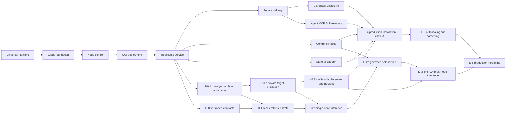

# A3S Cloud Product Roadmap

## 1. Scope and document hierarchy

**Status as of 2026-07-24.**

This is the product-level roadmap for A3S Cloud. It summarizes the complete
Cloud portfolio, current gate status, dependencies, delivery order, and the
boundary with A3S Gateway. It does not replace the detailed implementation
plans.

| Document | Authority |
| --- | --- |
| This `ROADMAP.md` | Product outcomes, portfolio ordering, public gate status, and cross-product ownership |
| [Cloud development plan](docs/development-plan.md) | Detailed implementation sequence, exit criteria, provider evidence, recovery gates, and definition of done |
| [Inference plan](docs/inference-plan.md) | Detailed `I0` domain, protocol, scheduling, Gateway, usage, and conformance contracts |
| [Gateway roadmap](https://github.com/A3S-Lab/Gateway/blob/main/ROADMAP.md) | Gateway-local current capability truth and implementation backlog |

The documents must change together when a product gate changes state. The
owning detailed plan decides whether its exit evidence is sufficient to mark a
gate verified; this roadmap then publishes that state without weakening or
reinterpreting the gate.

The roadmap is gate-driven, not date-driven:

| State | Meaning |
| --- | --- |
| Verified | The complete real-provider, failure, recovery, cleanup, and release evidence passes |
| In progress | A usable implementation slice exists, but named exit evidence remains |
| Planned | The capability is unavailable until its owning gate passes |

## 2. Product position

**A3S Cloud is the self-hosted control plane for applications, Agents, MCP
services, and model-serving workloads on operator-owned infrastructure.**

Cloud turns tenant-owned intent into durable, observable infrastructure state.
PostgreSQL is authoritative for desired state, A3S Flow coordinates long-lived
operations, node agents converge A3S Runtime resources, and A3S Gateway applies
the complete traffic policy produced by Cloud.

Cloud owns:

- organizations, projects, environments, identity, membership, and grants;
- immutable application, Agent, MCP, Skill, model, and provider revisions;
- Workloads, desired replica count, placement, rollout, and the sole
  production autoscaling evaluator;
- source resolution, isolated builds, artifact publication, and release
  provenance;
- domains, TLS intent, logical Gateway scopes, complete traffic snapshots, and
  exact applied-state projection;
- databases, volumes, fencing, backup, restore, and retention after `S0`;
- durable operations, audit, logs, usage ledgers, API, CLI, management MCP, and
  web surfaces; and
- installation, upgrades, high availability, disaster recovery, and
  operational policy after `H0`.

Cloud does not own:

- per-request proxying, protocol framing, or provider-byte forwarding;
- a second workload engine outside the common Workloads and Runtime path;
- Kubernetes as an alternative Cloud scheduler;
- raw provider configuration formats at the product boundary;
- a built-in mail server or a separate native-desktop feature set; or
- commercial prices, balances, invoices, settlement, and managed-service
  plans.

All Cloud product configuration uses closed, validated A3S ACL and is parsed
and generated through `a3s-acl`.

## 3. Current roadmap

| Gate | Product outcome | State |
| --- | --- | --- |
| `R0` — Universal Runtime | General Task and Service contracts, durable identity, capability matching, and real Docker conformance | Verified |
| `F0` — Foundation | Boot control plane, PostgreSQL, tenancy, identity, Flow operations, outbox, projections, API, and web shell | Verified |
| `N0` — Node control | Enrollment, outbound mTLS, command leases, observations, durable command journal, and Docker driver | Verified |
| `D0` — OCI deployment | Immutable digest-pinned Workload revisions, scheduling, apply, health, activation, stop, cancellation, and recovery | Verified |
| `E0` — Reachable service | Managed TLS, complete Gateway snapshots, encrypted Secrets, durable ordered logs, immutable update, cloned rollback, web operations, and a clean-host release loop | Verified |
| `G0` — External source delivery | Pinned Git sources, isolated builds, OCI validation/publication, provenance, and deployment through the common Workload path | In progress |
| `P0` — Developer workflows | Build detection, web/worker/scheduled profiles, previews, monorepos, and closed Compose import | Planned |
| `C0` — Control surfaces | REST/CLI/management MCP parity, grants, search, collaboration, notifications, audit, and bounded exec/terminal | Planned |
| `A0` — Release catalog | Agent and MCP releases plus Skill publication through the common source, artifact, and deployment paths | Planned |
| `S0` — Stateful platform | Databases, volumes, fencing, backup, restore, retention, and stateful import mappings | Planned |
| `H0` — Production scale | Durable replicas, multi-node placement, private networking, Gateway replication, control-plane HA, and measured autoscaling | Planned |
| `I0` — Inference profile | Accelerator-backed model serving, OpenAI-compatible traffic, scoped keys, routing/fallback, Providers, durable usage, and governed self-service | Planned |

### 3.1 Verified baseline

`R0` through `E0` form one cumulative verified release:

```text
general Runtime
  -> durable Cloud desired state
  -> outbound node control
  -> digest-pinned deployment
  -> managed HTTPS, logs, update, rollback, and clean-host recovery
```

Later work must reuse this path. A new interface, asset type, import format,
accelerator, replica policy, or provider never creates a second deployment or
reconciliation engine.

### 3.2 Current in-progress gate

`G0` currently includes:

- canonical GitHub identities, repository policy, immutable source revisions,
  and versioned build recipes;
- signed replay-safe GitHub ingress, tenant-owned App connections,
  subscriptions, lifecycle reconciliation, and short-lived private access;
- exact-commit checkout, deterministic initial BuildRuns, retry-as-new-attempt
  lineage, cancellation, log streaming, and web controls;
- command-bound Artifact transport and isolated `cloud.build@3` Runtime Tasks;
- content-addressed BuildKit cache validation, parent-bound retry reuse, and
  worker-pruned real cache-hit evidence;
- complete OCI graph validation, deterministic registry targets,
  authenticated digest-only publication, remote verification, replay adoption,
  cleanup, and explicit deployment handoff to `cloud.deployment@2`; and
- deterministic SPDX 2.3 and SLSA provenance, locally verified Ed25519 DSSE
  signing through persistent local or Vault Transit providers, durable
  evidence restoration, and tenant-scoped API/web inspection and download.

`G0` remains in progress until external private-provider certification and the
production signed-evidence process-death gate pass.

## 4. Delivery horizons and dependencies

| Horizon | Required gates | Product outcome |
| --- | --- | --- |
| Usable service platform | `R0` through `E0` | One operator can deploy, reach, observe, update, roll back, and stop one stateless Service on one Linux node |
| Developer platform | `G0`, `P0`, `C0`, and `A0` | Source-to-release workflows, previews, stable automation, team operations, and A3S assets reuse the verified deployment path |
| Stateful production platform | `S0` and `H0` | Stateful resources, multi-node placement, HA, measured scaling, backup, and disaster recovery are production-operable |

Inference is an optional profile across these horizons, not a fourth deployment
engine or delivery horizon. It may begin after `E0` and becomes production-ready
only after its named `H0` and `C0` foundations pass.



Dependency rules:

- `G0`, `C0`, and `S0` may advance independently from the verified `E0`
  baseline.
- `P0` depends on the immutable source and build contracts from `G0`.
- `A0` reuses `G0` source, Artifact, publication, and deployment contracts.
- `H0.1` through `H0.3` may first be proven by an owning profile, but the full
  `H0` product gate also requires the single-node `P0`, `C0`, `A0`, and `S0`
  surfaces it must scale.
- `I0` is an optional product profile, not another deployment engine. It
  consumes Workloads, Fleet, Edge, Identity, Artifacts, Secrets, Operations,
  and the named `H0`/`C0` foundations.

## 5. Product delivery lanes

### 5.1 `G0`: external source delivery

Next outcome:

1. run the real external private-provider certification without persisting
   repository credentials or provider private keys;
2. run the signed-evidence gate against an operator-controlled Vault Transit
   key and registry;
3. inject process death after remote publication and after evidence
   persistence, then prove one publication, one verified evidence document,
   and authoritative cleanup; and
4. close the complete source-to-published-Workload release evidence.

`G0` is complete only when an exact source revision produces a verifiable,
signed, digest-addressed OCI graph, survives retry/cancellation/process death,
deploys through the existing Workload path, and leaves no untracked provider
resource or credential.

### 5.2 `P0`: developer workflows

Ordered delivery:

1. Dockerfile and A3S build-plan detection;
2. explicit web, worker, and scheduled Task/Service profiles;
3. pull-request previews with bounded lifetime and cleanup;
4. monorepo affected-set planning; and
5. closed stateless Compose import, followed by `S0`-backed stateful mappings.

Detection produces a reviewable proposal. Accepted build, route, storage, and
deployment plans become explicit typed Cloud desired state; an external project
format never becomes a second mutable source of truth.

### 5.3 `C0`: control surfaces and team operations

| Sub-gate | Outcome |
| --- | --- |
| `C0.1` | REST/CLI parity, stable errors, authorized search, and automation contracts |
| `C0.2` | Scoped management MCP over the same commands and queries |
| `C0.3` | Memberships, grants, role-focused console, attribution, notifications, and audit |
| `C0.4` | Outbound-protocol exec and terminal with bounded sessions and full audit |

No presentation surface owns business rules or bypasses tenant guards,
idempotency, operations, or audit.

### 5.4 `A0`: Agent, MCP, and Skill releases

Ordered delivery:

1. repository and manifest safety;
2. immutable Agent and MCP releases;
3. deployment through the common Workload path;
4. immutable Skill bundle publication and binding; and
5. release provenance, rollback, and catalog operations.

Agent and MCP are asset and workload profiles, not separate schedulers.

### 5.5 `S0`: stateful platform

Ordered delivery:

1. fenced local volumes;
2. explicit PostgreSQL resources;
3. backup, restore, retention, and disaster evidence;
4. additional database engines and remote volume providers through
   conformance; and
5. stateful project-import mappings.

A stateful move cannot proceed until the prior writer is fenced. A backup is
not a product capability until restore passes against a clean environment.

### 5.6 `H0`: production scale

| Sub-gate | Foundation | Required evidence |
| --- | --- | --- |
| `H0.1` | Managed-owner references, durable replica identity, effective placement policy, generic hard-resource claims, and fencing | Concurrent create/reconcile/replay produces one provider unit for one replica generation and never reuses an unfenced claim |
| `H0.2` | Logical Gateway scopes, complete target sets, generation-bound private endpoints, exact snapshot acknowledgement, and rollback | Only healthy exact-generation targets become eligible; restart and rejected reload preserve the prior route |
| `H0.3` | Multi-node replica sets, placement groups, gang claims, drain, anti-affinity, cluster-private networking, and independently placed Gateways | Real-node scale, drain, partition, stale-node return, and partial preparation converge without duplicate units, claims, members, or targets |
| `H0.4` | Production installation/upgrade plus HA API, workers, relay, Gateway, migrations, and dependencies | Install, upgrade, loss, leadership fencing, migration, rollback, and Gateway readiness gates pass |
| `H0.5` | Sole Workloads autoscaling controller, quotas, telemetry bounds, load limits, backup/restore, and operational hardening | Stale, missing, duplicate, and bursty metrics stay safe without another scaling path; failover and restore meet published limits |

Kubernetes or Helm may package Cloud, but Workloads remains the only workload
scheduler and Cloud product configuration remains ACL.

### 5.7 `I0`: inference profile

| Sub-gate | Outcome | Dependency |
| --- | --- | --- |
| `I0.0` | Versioned accelerator and node contracts with mixed-version safety | Verified `E0` node control |
| `I0.1` | Single-node accelerator inventory, claims, Docker/CDI enforcement, and recovery | `I0.0` + `H0.1` |
| `I0.2a` | Immutable model catalog/cache, typed backend compiler, and one healthy private vLLM Workload | `I0.1` |
| `I0.2b` | OpenAI Models, Chat Completions, Completions, and Embeddings data plane, scoped keys, grants, limits, streaming, and fallback | `H0.2` + `I0.2a` |
| `I0.2c` | Durable Gateway usage spool, Cloud ledger, observability, model rollout, and rollback | `I0.2b` |
| `I0.2d` | Credential-isolated external OpenAI-compatible Provider targets | `I0.2b` + `I0.2c` |
| `I0.2e` | Grant-derived model/key self-service, diagnostics, playground, search, and usage showback | `C0.3` + `I0.2d` |
| `I0.3` | Multi-node independent serving replicas and failover | `I0.2e` + `H0.3` |
| `I0.4` | One typed Ray/vLLM distributed replica across multiple nodes | `I0.3` + `H0.3` placement-group and private-network gates |
| `I0.5` | Gateway/control-plane HA, autoscaling, quota, disaster recovery, provider breadth, and load hardening | `I0.4` + `H0.4` + `H0.5` |

The first provider combination is NVIDIA, Docker, and vLLM. Power, hardware
partitions, additional accelerator vendors, named external Providers, and
additional APIs remain unavailable until their real conformance gates pass.

## 6. Near-term execution order

The default portfolio priority is:

1. preserve the verified `E0` release and its clean-host regression gate;
2. finish the remaining `G0` external private-provider and signed-evidence
   process-death gates;
3. advance `C0.1` and the first `S0` foundation independently when staffed;
4. begin `I0.0` plus `H0.1`, then follow the ordered inference slices without
   bypassing their generic platform dependencies;
5. start `P0` and `A0` only on the verified `G0` contracts they consume;
6. advance `H0.2` and `H0.3` as real consumers require target projection and
   multi-node placement; and
7. close full production packaging, HA, autoscaling, and inference hardening
   through `H0.4`, `H0.5`, and `I0.5`.

This order expresses dependency and product risk, not equal staffing or a
calendar promise. The next implementation is the smallest vertical slice that
can pass a real exit gate.

## 7. A3S Gateway relationship

Gateway coordination is one part of the Cloud roadmap, not a replacement for
the Cloud product lanes above.

### 7.1 Product boundary

| Product | Position | Owns |
| --- | --- | --- |
| A3S Cloud | Self-hosted control plane | Tenancy, identity, catalogs, Workloads, desired replicas, placement, rollout, autoscaling, complete Gateway policy, operations, usage ledger, and management surfaces |
| A3S Gateway | AI traffic and protocol data plane | Transport, TLS, streaming, local enforcement, healthy endpoint selection, atomic snapshot application, request-path telemetry, and the planned durable usage spool |

Cloud never becomes the per-request proxy or synchronous authorization
dependency. Gateway never becomes a tenant database, scheduler, production
rollout controller, production autoscaling authority, or long-term usage
ledger.

### 7.2 Gateway operating modes

| Concern | Standalone Gateway | Cloud-managed Gateway |
| --- | --- | --- |
| Desired-state authority | Operator-owned local ACL | Cloud PostgreSQL desired state |
| Traffic configuration | Local startup/watch/provider policy | Complete versioned ACL snapshot delivered through the node agent |
| Target lifecycle | External operator or orchestrator | Cloud Workloads and Edge |
| Rollout and autoscaling | Standalone experiments remain explicitly non-production until proven | Cloud is the only authority |
| Durable business state | None | Cloud |

A minimal managed bootstrap ACL may bind process, management listener,
identity, and Cloud-delivery settings. It cannot define or mutate managed
routes, target sets, rollout, or scaling policy.

### 7.3 Managed runtime contract

```text
Cloud commits desired state
  -> Cloud compiles one complete Gateway-scope ACL snapshot
  -> outbound node agent delivers the exact revision and digest
  -> Gateway validates and atomically applies or preserves the prior snapshot
  -> node agent records the exact applied or rejected result
  -> Cloud advances only after the matching acknowledgement
```

Gateway may temporarily suppress an unhealthy endpoint, open a circuit, or
drain a connection under the applied policy. It may never invent a target,
change desired weights, create a replica, or promote a revision.

The Cloud API, PostgreSQL, and workers stay off the request path. Authorization
and route snapshots are complete, bounded, and expiring; policy that requires
an unavailable or expired security snapshot fails closed. Retry and fallback
are allowed only before the first response byte.

### 7.4 Coordinated gates

| Gate | Cloud work | Gateway work | Joint result |
| --- | --- | --- | --- |
| `E0` | Edge desired state, managed TLS, complete snapshots, and exact acknowledgement | ACL validation, atomic reload, HTTPS, routing, health, and prior-revision preservation | Verified clean-host A-to-B-to-cloned-A route and recovery evidence remains the regression baseline |
| `H0.2` | Logical scopes, private endpoints, complete target sets, and applied-state projection | Explicit managed mode, mode validation, exact readiness, and rejection of local control loops | Restart, redelivery, and rejected reload cannot expose a stale target |
| `I0.2b` | Inference routes, keys, grants, limits, and dispatch snapshots | Native OpenAI body-aware dispatch, cached enforcement, streaming, and pre-first-byte fallback | Real SDK, denial, revocation, framing, disconnect, and acknowledgement gates pass |
| `I0.2c` | Usage ingestion, gaps, immutable ledger, rollups, and rollout authority | Durable ordered request/attempt spool, replay, backpressure, and weight execution | Every started request becomes terminal or visibly unknown after crash and replay |
| `I0.2d` | Same-environment credential-isolated Provider egress Workload | Route only to the internal egress target | Client and provider credentials never cross or enter traffic snapshots |
| `C0.3` + `I0.2e` | Grants, authorized search, key lifecycle, role-focused console, diagnostics, playground, and showback | Expose bounded operational state only | Consumer, steward, and operator surfaces cannot reveal an ungranted resource |
| `A0` + `C0` | Agent/MCP catalog, deployment, identity, and management contracts | Add a native protocol data plane only against a closed session and authorization contract | No second asset, identity, or deployment model appears in Gateway |
| `H0.3` through `I0.5` | Multi-node placement, Gateway HA, sole autoscaler, quotas, recovery, and provider policy | Private upstream identity, drain, exact-revision readiness, complete signals, and failure hardening | Node/Gateway loss, mixed versions, scale, backlog, and restore meet published limits |

No joint gate is complete because one repository passes unit tests alone.
Compatible Cloud and Gateway revisions must pass the real cross-repository
protocol and recovery gate.

## 8. Definition of done

A product gate is complete only when:

- its domain invariants, commands, queries, persistence, provider adapters,
  transport contracts, web, and applicable CLI/MCP surfaces land together;
- every mutation has tenant scope, idempotency, audit, timeout, cancellation,
  retry, cleanup, and documented error semantics;
- real-provider happy path, failure, process-death, replay, corruption, and
  cleanup gates pass from a clean environment;
- Secret handling, authorization, revocation, SSRF, path/URL validation, and
  cross-tenant fixtures pass;
- upgrades, mixed versions, rollback, backup/restore, observability, and
  runbooks pass where the gate requires them;
- README, this roadmap, the owning detailed plan, API documentation, examples,
  and current-evidence tables describe the same verified behavior; and
- unsupported or unverified capability fails explicitly instead of degrading
  silently.

See the [development plan](docs/development-plan.md) and
[inference plan](docs/inference-plan.md) for complete per-gate evidence.

## 9. Product non-goals

The current roadmap does not include:

- a second deployment or scheduling path for imports, Agents, MCP, stateful
  resources, or inference;
- Cloud on the live request or token-stream path;
- a Cloud-equivalent control plane inside Gateway;
- training, fine-tuning, or notebook lifecycle inside `I0`;
- GPU host creation or SSH credential custody inside Inference;
- Kubernetes as an alternative Workloads scheduler;
- plaintext credentials in ACL, desired state, operations, logs, or events;
- a built-in mail server or divergent native desktop feature set; or
- commercial billing inside the Cloud core.

New capabilities enter the roadmap only after they have one owning context,
one dependency path, a closed contract, and real failure, recovery, and cleanup
evidence.
