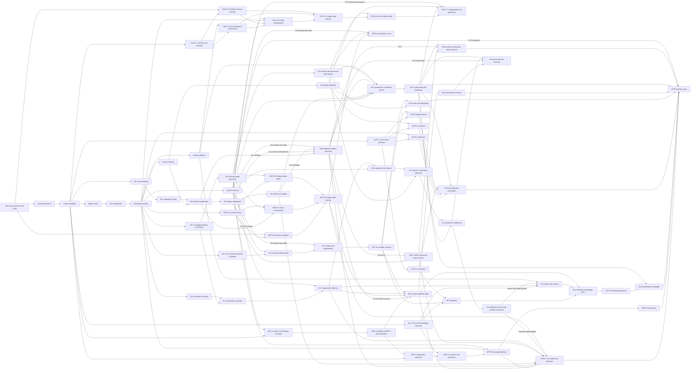

# A3S Cloud Product Roadmap

## 1. Scope and document hierarchy

**Status as of 2026-08-23.**

This is the product-level roadmap for A3S Cloud. It summarizes the complete
Cloud portfolio, current gate status, dependencies, delivery order, and the
boundary with A3S Gateway. It does not replace the detailed implementation
plans.

| Document | Authority |
| --- | --- |
| This `ROADMAP.md` | Product outcomes, portfolio ordering, public gate status, and cross-product ownership |
| [Technical architecture](docs/architecture.md) | Stable component ownership, control paths, consistency boundaries, deployment profiles, and failure behavior |
| [Cloud development plan](docs/development-plan.md) | Detailed implementation sequence, exit criteria, provider evidence, recovery gates, and definition of done |
| [Workflow and evolution plan](docs/workflow-evolution-plan.md) | Detailed `W0`, heterogeneous `A1`, and governed `EV0` contracts, ordered slices, safety policy, and recovery evidence |
| [AI application platform plan](docs/ai-application-platform-plan.md) | Detailed `APP0`, `K0`, `AUT0`, built-in node coverage, Flow-preservation contract, and public parity evidence |
| [Durable Cell Service plan](docs/durable-cell-platform-plan.md) | Detailed `CELL0` authority, provider boundary, storage/fencing contract, ordered gates, and fault evidence |
| [Inference plan](docs/inference-plan.md) | Detailed `I0` domain, protocol, scheduling, Gateway, usage, and conformance contracts |
| [A3S Use plugin roadmap](https://github.com/A3S-Lab/Use/blob/main/ROADMAP.md) | Canonical plugin package, catalog, plan/apply, grant, Runtime-binding, capability-generation, and shared Plugin Manager delivery |
| [Runtime roadmap](https://github.com/A3S-Lab/Runtime/blob/main/ROADMAP.md) | Runtime-local Unit lifecycle, provider certification, and `MCP0.2` substrate work |
| [Gateway roadmap](https://github.com/A3S-Lab/Gateway/blob/main/ROADMAP.md) | Gateway-local current capability truth and implementation backlog |
| [Agent Runtime platform roadmap](https://github.com/A3S-Lab/a3s/blob/main/docs/agent-runtime-platform-roadmap.md) | Cross-repository ownership, non-duplication rules, and `AR0` dependency order |

The documents must change together when a product gate changes state. The
owning detailed plan decides whether its exit evidence is sufficient to mark a
gate verified; this roadmap then publishes that state without weakening or
reinterpreting the gate.

The roadmap is gate-driven, not date-driven:

| State | Meaning |
| --- | --- |
| Verified | The complete real-provider, failure, recovery, cleanup, and release evidence passes |
| In progress | A usable implementation slice exists, but named exit evidence remains |
| Planned | The capability is unavailable until its owning gate passes |
| Historical | Prior implementation evidence retained for regression coverage; it does not certify the current provider contract |

## 2. Product position

**A3S Cloud is the self-hosted control plane and managed delivery platform for
AI applications, Knowledge Pipelines, ontology-driven Workflows, heterogeneous
Agents, MCP services, named Durable Cells, model-serving workloads,
automations, and governed self-evolution on operator-owned infrastructure.**

The cumulative product target is an A3S-native platform that replaces the
operational responsibilities commonly split between Google AX and Kubernetes.
It requires neither system and does not preserve their APIs or controllers.
The outcome is delivered across the existing `A0`, `A1`, `C0`, `H0`, and Box
certification gates rather than through a parallel replacement milestone.

Cloud turns tenant-owned intent into durable, observable infrastructure state.
PostgreSQL is authoritative for desired state, A3S Flow coordinates long-lived
operations, node agents converge A3S Runtime resources, and A3S Gateway applies
the complete traffic policy produced by Cloud.

Cloud owns:

- organizations, projects, environments, identity, membership, and grants;
- immutable application, Agent, MCP, Skill, model, and provider revisions;
- versioned ontologies, Workflow definitions, goals, deterministic plan
  revisions, Workflow runs, and human decisions after `W0`;
- application identities/releases, six current delivery projections including
  distinct classic and New Agent outcomes, sessions,
  messages, conversation variables, feedback, annotations, and managed
  application delivery after `APP0`;
- RAG Knowledge Bases, documents, chunks, ingestion/index/retrieval policy,
  citations, and KnowledgePipeline bindings after `K0`;
- exact-release schedules, webhooks, admitted event invocations, and reusable
  outbound connection profiles after `AUT0`;
- tenant-scoped Agent conversations, executions, approvals, checkpoints,
  forks, replayable trajectories, and one provider-neutral Harness contract
  after `A1`;
- authorized evidence datasets, evaluation suites, evolution experiments,
  candidate revisions, promotion decisions, and rollback evidence after
  `EV0`;
- Workloads, desired replica count, placement, rollout, and the sole
  production autoscaling evaluator;
- source resolution, isolated builds, artifact publication, and release
  provenance;
- domains, TLS intent, logical Gateway scopes, complete traffic snapshots, and
  exact applied-state projection;
- databases, volumes, fencing, backup, restore, and retention after `S0`;
- Durable Cell application identity, immutable revision, deployment policy,
  retention intent, and exact Workload/Gateway projection after `CELL0`;
- durable operations, audit, logs, usage ledgers, REST/OpenAPI, the maintained
  client, CLI, and Management MCP surfaces;
- tenant-scoped A3S Use registry enrollment, exact package assignments,
  reviewed-plan projections, and applied-host observations after `U0`; and
- installation, upgrades, high availability, disaster recovery, and
  operational policy after `H0`.

Cloud does not own:

- generic hosted-workload proxying or provider-byte forwarding; the bounded
  `APP0` delivery role owns only managed application semantics while Gateway
  retains edge protocol and route authority;
- a second workload engine outside the common Workloads and Runtime path;
- a second Workflow engine, Agent/Harness scheduler, evaluation scheduler,
  event bus, model registry, object client, or telemetry-driven promotion
  controller;
- per-Cell SQLite, lease, ownership epoch, alarm, peer-membership, or WebSocket
  state; the selected Cell provider owns those inside one S0 namespace;
- an A3S Use package installer, TUF/catalog implementation, Workspace Grant or
  Runtime Binding store, capability registry, surface reconciler, or plugin
  execution RPC;
- Kubernetes, Helm, CRDs, or Operators as a required installation or an
  alternative Cloud control plane;
- raw provider configuration formats at the product boundary;
- a built-in mail server or a separate native-desktop feature set; or
- commercial prices, balances, invoices, settlement, and managed-service
  plans.

All Cloud product configuration uses closed, validated A3S ACL and is parsed
and generated through `a3s-acl`.

The public website defines additional target outcomes, not the complete Cloud
inventory. Adopting AI application, Knowledge, automation, Workflow,
heterogeneous Agent, model, storage, Unified Gateway, and self-evolution
capabilities does not remove or replace any
existing gate. `F0`, `BX0`, `PW0`, `R0`, `N0`, `D0`, `E0`, `G0`, `P0`,
`C0`, `A0`, `U0`, `MCP0`, `A1`, `W0`, `APP0`, `K0`, `AUT0`, `S0`, `CELL0`,
`H0`, and `I0` retain their current authorities and exit evidence. Sources/builds,
ordinary Tasks and Services,
Projects, Secrets, Assets, Plugins, Workloads/Fleet, Edge, Operations, Search,
audit, update, rollback, backup/restore, and production recovery remain
first-class Cloud capabilities even when the website diagram omits them.

The architecture reference capability register is also additive. TokenHub-style
model-gateway governance remains assigned to `C0.3` and `I0.2` through optional
`I0.6`; Google AX-style distributed Harness outcomes remain assigned to
`A1.1` through `A1.6`; cross-layer security investigation remains assigned to
`C0.3` over the shared evidence and audit foundations; commercial
application-platform core outcomes remain assigned to `APP0`, `K0`, and
`AUT0` over `W0` and the existing provider gates. Removing a reference name
does not retire those outcomes or authorize a replacement mechanism.

A3S Box is the sole node-local execution and image-build provider. A3S Power is
the required inference serving boundary and runs as an ordinary Box-hosted
Runtime Service. Neither product adds a scheduler, node channel, queue, desired
state store, routing authority, or usage authority to Cloud.

Cloud now owns the generic finite-Task product surface as tenant-scoped
Executions. The initial vertical slice persists replay-safe intent and
Operations, schedules capability-matched Runtime Tasks through Fleet, supports
cancellation, and withholds terminal state until authoritative cleanup. This is
platform execution infrastructure; it does not implement Agent conversations,
Workflow semantics, trajectories, training, or any Agentic RL policy by
itself. Those outcomes remain unavailable until their owning `A1`, `W0`, and
`EV0` gates pass through the same execution path.

## 3. Current roadmap

| Gate | Product outcome | State |
| --- | --- | --- |
| `BX0` — Box-only platform | Sole A3S Box execution/build path and Box re-certification of the complete Runtime, deployment, source-delivery, recovery, and cleanup baseline | In progress |
| `PW0` — Power inference boundary | ACL-native immutable Power Service profile, Box MicroVM/TEE evidence, health, inference, recovery, and cleanup | Planned |
| `R0` — Universal Runtime | General Task and Service contracts, durable identity, capability matching, and real provider conformance | Historical; Box re-certification pending |
| `F0` — Foundation | Boot control plane and PostgreSQL task queue, PostgreSQL, tenancy, identity, ORM-backed Flow operations, outbox, projections, and API | Verified; the [2026-08-19 `main` PostgreSQL 17 plus local/NATS provider gate](https://github.com/A3S-Lab/Cloud/actions/runs/32266327719/job/96111906175) passes the exact Flow `1.0.0`, Boot `0.2.0`, and ORM `0.3.1` composition, including tenancy, idempotency, one-run reconciliation, lost-Outbox-ack recovery, API envelopes, and migration apply/checksum/rollback/concurrency authority |
| `N0` — Node control | Enrollment, outbound mTLS, command leases, observations, durable command journal, and sole Box driver | Historical; Box re-certification pending |
| `D0` — OCI deployment | Immutable digest-pinned Workload revisions, scheduling, apply, health, activation, stop, cancellation, and recovery | Historical; Box re-certification pending |
| `E0` — Reachable service | Managed TLS, complete Gateway snapshots, encrypted Secrets, durable ordered logs, immutable update, cloned rollback, interface operations, and a clean-host release loop | Historical; Box re-certification pending |
| `G0` — External source delivery | Pinned Git sources, isolated builds, OCI validation/publication, provenance, and deployment through the common Workload path | In progress |
| `P0` — Developer workflows | Build detection, web/worker/scheduled profiles, previews, monorepos, and closed Compose import | In progress; unavailable. Component-only `P0.1-C1/C2` implement bounded canonical source-layout proposals plus exact SourceRevision-bound immutable BuildPlan acceptance. `P0.2-C1/C2` implement closed web/worker/scheduled profile compilation and authorization-first immutable revision persistence through migration `147`. `P0.3-C1` verifies typed GitHub pull-request lifecycle facts and deterministically reduces duplicate/reordered events to one bounded Preview identity and cleanup decision. `P0.3-C2` implements canonical, authorization-first, active-Subscription-bound Preview Policy revisions through migration `153`. `P0.3-C3` production-composes the Sources producer for exact active-Subscription-bound committed PR facts through migration `156` and the existing Inbox/Outbox. Component-only `P0.3-C4` production-composes one event-time-policy-bound, CAS-safe Developer Workflows Preview projection plus immutable fact receipts through migration `157` and the existing Outbox Relay. `P0.3-C5a` atomically publishes each committed Preview mutation and idempotently hands active lifecycle to the existing Projects Environment authority through that same Relay/projector. `P0.3-C5b` projects every applied lifecycle version into one ordinary Sources SourceRevision or cleanup/suppression receipt through migration `159`, then publishes one exact bounded specialized fact through the same transaction and Relay. Component-only `P0.3-C5c` consumes only that fact through the existing Artifacts projector and migration `162`; only the latest active Preview version can reserve the immutable candidate, retirement atomically requests cancellation on the sole BuildRun lifecycle, and an exact receipt-bound same-SourceRevision reopen authorizes at most one retry. Workload/route/operation handoffs, Environment and Preview cleanup/expiry execution, interfaces, monorepos, and imports remain open |
| `C0` — Control surfaces | REST/CLI/management MCP parity, external identity federation, SCIM, grants, search, collaboration, security investigation, notifications, audit/SIEM export, session policy, and bounded exec/terminal | In progress; enterprise `C0.5` planned |
| `A0` — Release catalog | Agent and MCP release publication, Agent deployment, and Skill binding through the common source and artifact paths | In progress |
| `U0` — A3S Use plugin assignments | Trusted registry enrollment, exact workspace package assignments, reviewed package/enablement planning, digest-only apply, observations, and recovery through the shared A3S Use Plugin Manager | In progress; unavailable |
| `MCP0` — Hosted MCP services | Modern stateless MCP release admission, Runtime Service hosting, Cloud orchestration, Gateway protocol enforcement, and joint recovery evidence | In progress; unavailable |
| `A1` — Heterogeneous Agent execution | Durable conversations, one provider-neutral Harness contract, semantic events, approvals, checkpoints, forks, and trajectories over existing Cloud control paths | In progress (`A1.0` verified; `A1.1` implemented; native Code `A1.2` verified against clean Linux PostgreSQL 17 and real Box Runtime process-death recovery while consuming exact published Code Core `8.0.1` and Flow `1.1.0`; the component-level `A1.3` provider contract, Code migration, and deterministic non-Code conformance foundation are implemented, while production selection/retained evidence and `A1.4` through `A1.6` remain open) |
| `W0` — Ontology-driven Workflow | Versioned ontologies and Workflows, deterministic goal-to-plan compilation, typed Agent/MCP/model/human steps, and Flow-based recoverable runs | In progress and unavailable (`W0.1` is implemented and `W0.2` is verified; the `W0.3` definition/goal/Plan v2, typed-variable defaults/runtime projection and inspection, bounded composite-region policy/child-binding foundation, deterministic composite frame/export and ordered region reducers, Flow-backed bounded-parallel Iteration and sequential Loop child WorkflowRun lifecycle, Plan v3/Run v4 descriptor-bound finite-Execution failure routing, Plan v4/Run v7 exact finite-Execution default-output fallback with typed evidence, Plan v5/Run v9 descriptor-bound Connector failure routing, Plan v6/Run v14 descriptor-bound Application-variable failure routing, component-only Run v5 Connector observation/wait/retry interpretation, project-authorized read-only 23-node catalog, native Form, WorkflowRun, HumanTask loop, immutable ExecutionTemplate lifecycle, and exact finite Execution step are implemented, and the finite Execution recovery/cross-surface sub-gate is verified. The W0.4 Connector response-object, terminal-evidence-authorized read, Run v8 schema-bound JSON response-consumption, and v9 typed failure-route foundations are implemented. The component-only exact Agent path now uses Run v24 for immutable AgentRelease dispatch, restart adoption, terminal semantic output, provider evidence, and cancellation cleanup. `APP0.2-C7` supplies the Applications-owned variable/Answer effect consumer boundary; `APP0.2-C9` supplies final-output/terminal reconciliation, `APP0.2-C10` supplies descriptor-bound v11 Answer dispatch, `APP0.2-C11` supplies descriptor-bound v12 Application-variable snapshot/CAS dispatch plus Flow-derived inspection, `APP0.2-C13` binds repeated composite Answers to the root invocation through v13 frame authority and zero-based ordinals, and `APP0.2-C14` routes deterministic Application-variable write rejections through v14 ordinary error edges. Workflow-local Transform/Output/Branch and descriptor-bound composite-region failure routes, bounded finite-Execution/Agent/Connector/HumanDecision/Subworkflow evidence correlations, and authorized bounded WorkflowRun diagnostics/statistics are implemented. Public Agent and business-service availability, MCP/model/Tool steps, broader provider conformance and revocation, compensation, and `W0.5` remain) |
| `APP0` — AI application lifecycle and delivery | Chatbot, Text Generator, classic Agent, New Agent Beta, Chatflow, and Workflow experiences over one immutable ApplicationRelease-to-WorkflowRevision path, with sessions, publishing, streaming, embed, MCP, monitoring, feedback, and enterprise governance | In progress and unavailable; `APP0.1` implements the authorized immutable release lifecycle through REST/OpenAPI `1.42.0`, the maintained client, CLI, and six Management MCP tools. `APP0.2-C1` through `C14` freeze and persist exact-release session, invocation-correlation, ordered-message, optimistic-variable, exactly-once Workflow-effect, and immutable invocation execution authority through migrations `125`-`127`, compile deterministic preset wrappers, compose or cancel one ordinary Workflow Goal, Plan, and Run from persisted authority, register authorization-first session/invocation/cancellation/cursor CQRS, add the Run-resolved Workflow semantic-effect port, expose Principal-owned project-member admission and complete lifecycle/replay management through REST/OpenAPI `1.44.0`, and project lifecycle, descriptor-bound Answer, and descriptor-bound Application-variable snapshot/CAS effects through Flow v10/v11/v12. `APP0.2-C13` binds repeated composite Answer frames to the one root invocation through v13/v4/v5 authority and zero-based ordinals; `APP0.2-C14` maps deterministic Application-variable write rejections to redacted v14 failure branches. The [retained PostgreSQL 17 C6-C11 recovery job](https://github.com/A3S-Lab/Cloud/actions/runs/32474020740/job/96746540732) proves one production-composed command/effect chain across reconnect, lost Answer and variable responses, final-output/terminal replay, and exact durable counts. The [retained PostgreSQL 17 C6-C13 recovery job](https://github.com/A3S-Lab/Cloud/actions/runs/32486698014/job/96784727028) proves repeated-frame ordinal 0/1 and ordinal-1 commit-before-response replay through the production Applications repository. Application-scoped public delivery, blocking/streaming answer delivery, Gateway routing, monitoring, and the composite `APP0.6` parity claim remain open |
| `K0` — Knowledge and Knowledge Pipeline | User files, Knowledge Bases, document/chunk lifecycle, multi-source ingestion, General/Parent-child/Q&A and multimodal processing, indexing/retrieval/rerank/citations, external Knowledge, and Flow-backed Knowledge Pipelines | In progress and unavailable; component-only `K0.1-C1` freezes strong identities, one canonical Files admission ACL/lifecycle, exact upload/scan receipts, typed references, and verified streaming through the shared immutable-object client. Quota/persistence/interfaces and all Knowledge/KnowledgePipeline lifecycle remain open |
| `AUT0` — Automations and Connectors | Schedule, webhook, plugin/source-event triggers and reusable outbound HTTP/business connections with exact targets, deduplication, Secret/egress policy, and recovery | In progress and unavailable; Connector C1-C11 plus Flow-owned attempt/wait, immutable-response, and typed JSON interpretation are component-only |
| `S0` — Stateful and distributed storage platform | Databases, immutable-object and volume providers, distributed access, fencing, backup, restore, retention, and stateful import mappings | Foundation in progress; component-only `S0.1-C1/C2` add the sole-client CAS, credential, recovery, retention, and deletion contracts, `CELL0.5-C1` adds the canonical non-secret HTTPS provider-profile ACL/digest and exact credential binding, and `S0.1-C3` checks in one retained S3-compatible CAS/cleanup gate shared with existing consumers. Component-only `S0.1-C4` adds deterministic Flow-v2 page checkpoints for writer-fenced seal, isolated restore, verification, grace-delayed deletion, and exact planned cleanup, while retaining v1 replay and checking three PostgreSQL worker-process-death boundaries against one process-shared S3-compatible namespace. `CELL0.5-C5a/C5b` now supply the stopped-current-revision Workloads receipt, atomic seal-Operation enqueue, and exact successful-seal admission before every later writer generation. A retained real-provider pass remains, so no production provider is certified yet |
| `CELL0` — Durable Cell Service | Named SQLite-backed state entities with alarms, WebSockets, idle eviction/reactivation, single-writer epoch fencing, replication-before-acknowledgement, and managed delivery over the existing Service path | In progress and unavailable; `CELL0.1` is implemented, component-only `CELL0.2-C1/C2` bind exact S0 contracts without copying their lifecycle, the shared storage `C3` gate awaits a retained pass, and shared `S0.1-C4` now supplies the component-only recovery/delete execution prerequisite without moving that lifecycle into Cells. The retained `CELL0.3-C1/C2/C3` real-Box runtime-only gate passes without another journal or controller, and `CELL0.4-C1/C2/C3/C4/C5` implement application authority, existing-owner projection, route composition, and complete REST/OpenAPI/client/CLI/MCP interfaces. Component-only `CELL0.5-C1/C2/C3a/C3b/C4a/C5a/C5b` freeze the provider profile, exact signed BuildRun bundle output/admission, the existing Execution exact-node Task foundation, Workload Deployment Flow v4's deterministic pinned publisher pre-start composition through migrations `118`-`120`, the exact ordinary Workloads Service projection, migration `131`'s immutable exact-`RuntimeRemove` writer-fence/seal handoff for the stopped current single replica, and fail-closed successful-seal admission for every later generation-derived Deployment. Staged `C4b/C4c` add named-state behavior, RPO=0 provider-process-death recovery, and real managed-TLS Gateway HTTP/WebSocket checks to the same joint gate without another lifecycle or owner lookup; its exact preflight remains blocked on Box Runtime `Outbound`. The storage-provider pass, first retained joint behavior/Gateway pass, remaining stop/delete behavior, retained lifecycle/fault evidence, and real service availability remain open |
| `H0` — Production scale | Durable replicas, multi-node placement, private networking, Gateway replication, control-plane HA, and measured autoscaling | In progress |
| `I0` — Inference profile | Accelerator-backed model serving, typed model protocols, scoped keys, routing/fallback, Providers, durable usage, governed self-service, and optional protocol/provider expansion | Planned |
| `EV0` — Governed self-evolution | Authorized evidence datasets, reproducible evaluation and reward policy, Agentic RL candidate jobs, approval-gated promotion, canary observation, and exact rollback | Planned |
| `AR0` — Governed Agent Runtime experience | One simplified projection over existing Agent, Workload, Deployment, Operation, Runtime, Box, Secret, and evidence authorities; bounded egress, brokered credentials, context-cost evidence, idle policy, and checkpoint/fork experience without a parallel lifecycle | Planned; `AR0.1` waits for `A1.3` and the Box baseline |

`AR0`, `CELL0`, `MCP0`, `I0`, and later application delivery profiles are
sibling product projections over the same execution substrate. They compile
to existing Execution/Workload intent and A3S Runtime `Task` or `Service`;
none is a Runtime subtype or may introduce a product-specific scheduler,
Fleet channel, provider lifecycle, or applied-route authority. In particular,
one Cell provider replica is a Runtime Service while individual named Cells
remain provider-owned entities, and Agent Runtime never owns their state.

### 3.1 `AR0`: governed Agent Runtime experience

`AR0` adopts the strongest developer, cost, and security outcomes of hosted
Agent execution products without creating a second platform inside Cloud. The
public `AgentRuntime` resource is a correlated projection over existing
`AgentRelease`, `HarnessInvocationProfile`, `WorkloadRevision`, `Deployment`,
`AgentExecution`, and `Operation` identities. Workloads and Fleet remain the
only placement and reconciliation path; A3S Runtime remains the only generic
Task/Service lifecycle; Box remains the only Cloud provider.

| Gate | State | Cloud-owned outcome | Required external owner |
| --- | --- | --- | --- |
| `AR0.1` | Planned | REST/client/CLI/Management MCP create/get/list/exec/log/stop/delete projection with one transactionally correlated underlying lifecycle and no new scheduler or run store | Runtime and Box baseline; `A0.4`; `A1.3`; `C0.1` |
| `AR0.2` | Planned | Closed ACL egress policy, tenant/grant checks, immutable digest, audit, and compilation into the Workload/Runtime path | Runtime generic capability; Box compilation; OCI Runtime enforcement |
| `AR0.3` | Planned | Destination-bound, expiring brokered credential grants and secret-free receipts; Cloud Secrets remains sole durable credential authority | Box node-local broker; OCI Runtime isolation; `C0.3` |
| `AR0.4` | Planned | Bounded context-cost and Tool-use facts, authorized projections, and correlation with Agent events and optional Inference usage | Common Harness evidence implemented first by A3S Code |
| `AR0.5` | Planned | Pin deterministic Tool-result transformation policy and retain source/result digests plus immutable original-content authority | Common Harness transform contract; no Gateway/Runtime rewriting |
| `AR0.6` | Planned | Sole idle-policy evaluator, exact wake intent, Operation history, audit, and bounded failure projection | Runtime pause/resume; Box/OCI Runtime recovery; Gateway signal only for ingress demand |
| `AR0.7` | Planned | Reuse `A1.6` immutable semantic/provider checkpoints and fork lineage through the same execution lifecycle | Runtime/Box/OCI Runtime checkpoint capability and Harness semantic checkpoint |
| `AR0.8` | Planned | Fold measured vertical and replica decisions into the sole `H0.5` Workloads autoscaler | Trusted resource evidence and replacement/recovery gates |

Cloud does not implement an Agent egress proxy, plaintext credential injector,
Tool-result compressor, process freezer, snapshot engine, or live resource
mutator. Those mechanisms remain with their owning repositories, while Cloud
owns policy, grants, desired state, audit, and product availability. The
cross-repository contract and evidence rules are defined in the
[Agent Runtime platform roadmap](https://github.com/A3S-Lab/a3s/blob/main/docs/agent-runtime-platform-roadmap.md).

### 3.2 `CELL0`: Durable Cell Service

`CELL0` adopts the named-state, SQLite-per-entity, alarms, hibernatable
WebSockets, idle eviction, object-store replication, and single-writer fencing
outcomes demonstrated by Deno celld without copying its control plane. One
Durable Cell application projects to one managed ordinary Workload Service
fleet. Runtime still owns only Task and Service, Box remains the sole local
provider, Fleet remains the only placement/node channel, S0 supplies the one
object-store contract, and Gateway sees only healthy public Service endpoints.

The selected Cell data-plane provider alone owns individual Cell SQLite bytes,
ownership records, fencing epochs, peer forwarding, alarms, and WebSocket
residency inside an application-scoped S0 namespace. Cloud persists no Cell,
lease, epoch, peer-membership, or alarm mirror. Provider deployment pointers
are applied state derived from the immutable Cloud revision, never a second
desired-state authority.

| Gate | State | Outcome |
| --- | --- | --- |
| `CELL0.1` | Implemented | Freeze identities, immutable revision/projection boundaries, canonical ACL, provider protocol, errors, bounds, and compatibility vocabulary; `C1` implements `cloud.durable-cell.service.v1`, `C2` implements `cloud.durable-cell.application.v1` plus revision/desired-state rules, and `C3` adds digest-locked shared ACL fixtures and deterministic S0/Workloads/Operations identities without another deployment mechanism |
| `CELL0.2` | In progress | Component-only `C1` supplies the sole-client conditional namespace port/probe and exact credential/storage bindings. `C2` reuses Secrets for exact active-version/JIT zeroizing materialization and adds digest-locked retention, sealed lineage, isolated restore evidence, and safe deletion contracts. `C3` checks in one HTTPS S3-compatible destructive CAS gate, secret scan, evidence hashes, and manual workflow while removing the prior duplicate raw-S3 test client. `S0.1-C4` now adds bounded recovery/deletion execution with deterministic Flow-v2 page checkpoints, exact v1 replay, runtime routing, durable retry/wait semantics, JIT Secret composition, completion-loss adoption, and a checked-in three-boundary PostgreSQL process-death gate over one process-shared S3-compatible namespace. `CELL0.5-C5a/C5b` supply the Workloads-owned stopped-current-revision writer-fence receipt, atomic seal enqueue, and exact successful-seal gate before later writer generations. A retained real-provider pass and provider fault evidence remain |
| `CELL0.3` | Implemented and retained; runtime-only | Component-only `C1` binds one pinned Cell provider as an ordinary Box-hosted Runtime Service with distinct public/internal endpoints and exact healthy apply evidence. `C2` adds a bounded Cell-name-free `/state` observation through Fleet's sole journal; adoption requires that observation plus the exact healthy apply, while drain and cleanup accept only existing `RuntimeStop` and `RuntimeRemove` receipts. `C3` pins celld v0.2.1 tag/revision/image provenance and adds one real Box runtime-only apply/observe/replay/stop/remove/reconstruction gate to the existing Box workflow. The [retained gate](https://github.com/A3S-Lab/Cloud/actions/runs/31946279906/job/95162662254) passes; its `storage=not-certified` evidence explicitly certifies no S0 or product behavior, so the storage-backed application/fault gates remain |
| `CELL0.4` | In progress | Component-only `C1` persists application heads and immutable canonical-ACL revisions through migration `116`, the existing A3S ORM Migrator, and the shared idempotency/Outbox/audit transaction path. `C2` registers authorization-before-replay create/revise/start/stop commands and tenant-bounded current/history queries over that authority. Component-only `C3` adds migration `117` for immutable, lifecycle-free `DurableCellDeployment` correlation; after exact current-revision, A3S ACL profile, S0 credential/retention, Secret-version, and node-pool admission, its internal handler persists intent before idempotently invoking the existing managed Workload revision/Deployment, Operation request, Outbox, and Fleet flow. Workloads owns the sole monotonic managed-owner handoff, including skipped undeployed application revisions. Component-only `C4` authorizes before replay, loads that exact correlation, derives only the public port from canonical A3S ACL, and delegates initial publication to Edge's existing verified-claim, healthy-target, complete-snapshot, idempotency, and Fleet-dispatch path; the existing Workloads route updater owns later revision cutover. Its focused process-death test replays one committed Route after failed dispatch without target re-resolution or duplicate route state. `C5` exposes the same C2-C4 authority through bounded REST/OpenAPI `1.38.0`, the maintained TypeScript client, CLI, and ten Management MCP tools; deployment admits only canonical Service-profile, provider-Workload, and plaintext-free storage-binding A3S ACLs, derives tenant/S0 scope from the authenticated resource path, requires a digest-pinned OCI provider, and returns references/digests rather than Secret material. The [retained PostgreSQL 17 C6a/C6b recovery and lifecycle gate](https://github.com/A3S-Lab/Cloud/actions/runs/31938471588/job/95144015600) passes migration/replay/immutability checks, kills a real child after correlation commit while Workloads is blocked, reconstructs the exact Workload projection once, then recovers an application-only stopped commit through fresh production repositories, the existing Workloads replica-set/retirement transactions, and exact reactivation of the same deterministic replica. Real S0 namespace/application evidence and `CELL0.5` availability remain |
| `CELL0.5` | In progress; unavailable | Component-only `C1` freezes the canonical non-secret S0 provider-profile ACL/digest, HTTPS storage semantics, exact namespace prefix, and credential-profile binding without another client or repository. Component-only `C2` extends the sole BuildRun through migration `118` with one immutable, content-addressed typed output distinct from its OCI manifest, signs the exact output descriptor in existing SLSA provenance, reuses the shared artifact store/mount transport, and requires successful exact media/digest/size admission. Component-only `C3a/C3b` extend the existing Execution authority and Workload Deployment Flow through migrations `119`-`120`: after exact placement and resource preparation, v4 composes or adopts one deterministic pinned `celld deploy` Task from the exact C1 profile, C2 bundle, Workload Secrets, and selected node, blocks Service apply until success, and cancels it before the existing Claim release while v1-v3 replay unchanged. The reviewed adapter fixes celld's exact AWS credential-chain Secret targets and translates the same S0 bucket, application namespace prefix, endpoint, region, Runtime ports, single-node private advertise identity, and sole fixed 30-second idle-eviction policy into the ordinary Workloads Service; deployment and publication recovery share that validation, reject Box's unsupported ephemeral-storage control, and reject image, profile, process, extra environment, namespace, or Secret drift, including output-gate weakening. Component-only `C5a/C5b` add the stopped-current single-writer receipt/atomic seal handoff and reuse that same v4 pre-start adapter to wait for the exact successful receipt-bound seal before every later generation-derived Deployment; first writers need no receipt, active seals wait, terminal failures fail closed, and stale generations are rejected. The main-only manual gate composes the existing Box, Execution, Artifact, Secret, Fleet, Workloads, S0, Edge, and pinned Gateway paths and stages separate credential-scanned publication plus component `C4b` named SQLite, alarm, hibernatable-WebSocket, idle-eviction/reactivation, and RPO=0 provider-process-death evidence before one whole-prefix cleanup. Its test-only generic Runtime fault injection relies exclusively on existing Box restart generation, Fleet inspect replay, Secret rematerialization, and S0-backed next values; it adds no Cloud lifecycle. Staged `C4c` uses Edge's sole complete-snapshot compiler and the production Node Agent certificate/installer path to route HTTP, alarm, and WebSocket traffic through managed TLS before and after that fault. Gateway install/observe and Runtime commands share one Fleet journal and exact replay; only the public Runtime endpoint enters the snapshot, so Gateway gains no Cell owner lookup or internal endpoint. Its exact-spec preflight is currently blocked because the pinned Box provider does not advertise Runtime `Outbound`; Cloud adds no alternate egress runner. Its first real C4b/C4c pass remains required, while complete behavior and the full fault matrix remain uncertified. Box `Outbound` certification plus the first retained behavior/Gateway pass, rollout, rollback, restore, stop, and deletion remain before first public availability |
| `CELL0.6` | Planned | Retain multi-node acquisition, forwarding, takeover, partition, pressure shedding, graceful handoff, mixed-version policy, and stale-node return without split brain |
| `CELL0.7` | Planned | Publish only a test-backed Workers/Durable Objects compatibility matrix plus production quotas, observability, disaster recovery, and hostile-tenant isolation posture |

REST/OpenAPI `1.39.0` adds `storageProviderProfileAcl` as an optional fourth
deployment ACL. Its presence activates `CELL0.5-C3b`; omission keeps the
existing v1 deployment request behavior, while the maintained CLI requires the
profile for new C3b deployments.

Alarms are provider-local events that wake an already existing named Cell; they
do not create an Automation, Boot Task, WorkflowRun, Cloud timer table, or new
scheduler. Per-Cell inactivity is provider residency and does not create one
Runtime Service per Cell or another Workloads autoscaler. The detailed
authority and fault matrix lives in the
[Durable Cell Service plan](docs/durable-cell-platform-plan.md).

### 3.3 Baseline requiring Box re-certification

`R0` through `E0` define one cumulative behavioral baseline:

```text
general Runtime
  -> durable Cloud desired state
  -> outbound node control
  -> digest-pinned deployment
  -> managed HTTPS, logs, update, rollback, and clean-host recovery
```

The retired Docker implementation proved these behaviors, so its records remain
historical regression evidence. They do not certify the Box-only release.
`BX0` must reproduce the complete baseline on exact Cloud, Runtime, Box, and
Gateway revisions. Later work must reuse this path. A new interface, asset
type, import format, accelerator, replica policy, or provider never creates a
second deployment or reconciliation engine.

### 3.4 Current in-progress gates

The first shared-control-path convergence item is implemented. Operation
requests without a Flow projection now have an independent bounded start scan,
while active projections rotate through a stable keyset cursor. An unchanged
Flow sequence and semantic projection is a true no-write replay, so polling
cannot advance the user-visible Operation timestamp. In-memory fairness and
rebuild tests plus the PostgreSQL foundation gate cover the same repository
contract without another scheduler, queue, or reconciliation table.

`BX0` is the release-blocking provider migration:

1. `BX0.1` pins one certified Box/Runtime pair, adds closed `box` ACL
   configuration, and removes provider fallback. It is verified by
   [Cloud PR #86](https://github.com/A3S-Lab/Cloud/pull/86) and the
   [exact Linux provider gate](https://github.com/A3S-Lab/Cloud/actions/runs/30416879476).
2. `BX0.2` migrates digest-pinned Task/Service lifecycle, recovery, logs,
   resources, stop/remove, cancellation, and cleanup. It is verified by
   [Cloud PRs #87 through #93](https://github.com/A3S-Lab/Cloud/pull/93) and the
   [final interruption gate](https://github.com/A3S-Lab/Cloud/actions/runs/30456965598).
3. `BX0.3` migrates networking, endpoints, health, Secrets, Artifact/Volume/
   tmpfs mounts, outputs, and registry credentials through typed Box ports. The
   typed Service TCP endpoint, shared Runtime health consumer, and explicit
   isolation-selection slices plus Secret and registry-credential
   materialization are implemented. Artifact mounts, persistent Volumes, tmpfs,
   and Task-output publication now use the same Box driver and existing Cloud
   Artifact boundary. The composite provider/Cloud Claim gate closes allocation
   evidence. An optional ACL-native SEV-SNP policy now constructs Box's
   confidential driver and consumes generation-bound attestation while keeping
   simulation distinct from hardware evidence; complete Sandbox plus
   hardware-backed MicroVM/TEE isolation certification keeps the gate in progress.
4. `BX0.4` now implements the sole `cloud.build@5` path through typed Box
   commands and canonical ACL build plans. Box owns its operation journal,
   content-addressed cache, and images; Cloud retains Artifact transport, OCI
   admission, publication, and SPDX/SLSA evidence. Exact Linux provider and
   process-death certification remains open.
5. `BX0.5` has removed the retired build executors and adds an architecture
   guard against BuildKit, Bollard, Runtime build adapters, and duplicate build
   caches, journals, schedulers, or services. Complete Box-only conformance and
   the clean-host release gate remain open.

Cloud now delegates provider certification to the exact A3S Box revision and
uses Box-hosted fixtures for local development and the C0 PostgreSQL gates. The
retired provider workflows, release harness, and source-build certification
script have been removed instead of retained as fallbacks. This does not mark
`BX0.3` through `BX0.5` complete: the Box-owned capability work and a new
clean-host release gate must restore the named behavioral evidence.

`BX0.2` is verified. Cloud consumer recovery and hard-resource Claims pass the
[dedicated Linux gate](https://github.com/A3S-Lab/Cloud/actions/runs/30425852930).
It persists the command before dispatch, applies through the shared Box driver,
reconstructs both the Runtime client and Agent executor across the
apply-before-journal-completion boundary, and requires the same durable Runtime
receipt and physical Task or Service identity. The same gate replaces a running
Service generation and proves logs, inspection, stop, removal, and empty
provider state. It also prepares one inventory-bound CPU/memory Claim, binds the
exact Box observation across restarts, rejects release before durable stop
evidence, and releases only after the Runtime is fenced. Deployment cancellation
passes through the existing Flow, Fleet
command journal, Runtime driver, and Claim repository in the
[exact Linux gate](https://github.com/A3S-Lab/Cloud/actions/runs/30429412890).
It uses an explicitly headless Service, requires `RuntimeRemove` evidence
before `ResourceClaimRelease`, records `Cancelled` only after both complete,
and finishes with empty provider state. The
[final interruption gate](https://github.com/A3S-Lab/Cloud/actions/runs/30456965598)
sends `SIGKILL` after Box has durably removed the Service but before the Agent
records command completion. A reconstructed Agent and Flow adopt the exact
removal receipt, keep the prepared Claim capacity held until acknowledgement,
release it once, reach terminal cancellation, and leave no provider residue.

The first `BX0.3` slice is implemented across
[Runtime PR #8](https://github.com/A3S-Lab/Runtime/pull/8),
[Box PR #185](https://github.com/A3S-Lab/Box/pull/185), and
[Cloud PR #95](https://github.com/A3S-Lab/Cloud/pull/95). A3S Runtime owns one
provider-neutral typed Service endpoint observation. The shared Box driver owns
generation-fenced loopback listeners and relays through its existing
`ExecutionPortConnector`. Cloud removed its product-specific endpoint contract
and consumes the Runtime type directly, using one stateless Edge adapter to
compile a TCP socket into Gateway's canonical HTTP origin. The real Box gate
proves live HTTP traffic through that origin, stable observation replay, exact
removal, and listener closure. No separate Box CLI forwarder, namespace
connector, forwarding daemon, lifecycle store, or endpoint registry was added.

The second `BX0.3` slice pins
[Box PR #186](https://github.com/A3S-Lab/Box/pull/186), whose single Runtime
driver provider-certifies HTTP, TCP, and command probes over the same
generation-fenced port and exec boundaries. Cloud does not interpret probe
kinds or run probes. Its existing A3S ACL Workload compiler emits the HTTP
Runtime policy, and the Node Agent carries the kind-neutral current health
observation through the same durable command result. The real Box consumer
gate proves threshold convergence to `Healthy`, exact journal replay after
Runtime and executor reconstruction, a fresh healthy inspection with unchanged
provider identity and endpoint, live traffic through the stateless Gateway
origin adapter, removal, `NotFound`, and listener closure. No health worker,
registry, scheduler, queue, endpoint authority, or lifecycle store was added.

The third `BX0.3` slice pins A3S Box
`9fb9bf528f6c648bbecf203de991106fc39bccdb` and makes isolation selection an
explicit closed Node Agent contract. The required ACL `box.isolation` field
accepts exactly `microvm` or `sandbox`; missing, `automatic`, and unknown values
fail before the Runtime starts. Cloud maps the selected value directly into the
same shared `BoxRuntimeDriver`, ships MicroVM in the product profile, and makes
hosted Cloud consumer tests request Sandbox explicitly. There is no automatic
downgrade, fallback provider, or parallel Runtime driver. Full provider
certification for Sandbox, MicroVM, and TEE remains open.

The fourth `BX0.3` slice pins A3S Box
`211b6bdaa572ba0ad5d55c7988a5b4a72ca36251`, merged through
[Box PR #187](https://github.com/A3S-Lab/Box/pull/187) after the
[provider certification](https://github.com/A3S-Lab/Box/actions/runs/30506005198).
Cloud contributes one
adapter from the existing authenticated node Secret channel to Box's typed
materialization port. Box owns process-create environment and read-only file
projection, restart rematerialization, log redaction, transient registry
authentication, and cleanup. The real consumer gate proves exact Secret
authorization, `0400` file projection, driver reconstruction, restart refresh,
redacted stdout/stderr, one uncached authenticated private-registry pull,
credential-free cache reuse, plaintext exclusion, and empty tmpfs/provider
state after removal. No second Secret channel, credential store, Runtime
driver, scheduler, queue, or lifecycle store is introduced.

The fifth `BX0.3` slice pins A3S Box
`7f29f6314827b1f572401cdda189bae9f34b7f9f`, merged through
[Box PR #190](https://github.com/A3S-Lab/Box/pull/190), and is integrated by
[Cloud PR #100](https://github.com/A3S-Lab/Cloud/pull/100). One
`CloudBoxArtifactPort` delegates to the existing authenticated node Artifact
manager for read-only materialization, deterministic bounded output capture,
durable local receipts, and command-bound publication. Box's existing
VolumeStore remains the sole authority for persistent Volumes, Task-output
staging, live attachment fencing, recovery validation, and cleanup. The real
consumer gate combines Artifact, Volume, tmpfs, output, journal-replay, driver
reconstruction, and zero-residue evidence. It adds no parallel Artifact store,
output database, VolumeStore, Runtime driver, scheduler, or lifecycle path.

The sixth `BX0.3` slice closes allocation evidence through one composite gate.
The exact Box phase executes every advertised Runtime profile, including the
Resources behavior derived from CPU, memory, PID, and execution-timeout
controls. The Cloud phase requires those controls and proves the existing
inventory-bound Claim across prepare, Runtime apply, exact binding-digest
inspection, pre-fence release rejection, durable stop, release, removal, and
cleanup. Both machine-checkable results are retained in one revision-bound
artifact; Cloud adds no provider resource model or second Claim mechanism.

The seventh `BX0.3` slice pins A3S Box
`150a1d068e5b6d073ac93352f83d03eb6d7285fa` and adds one optional closed
`box.sev_snp` ACL block to the existing Node Agent composition. It maps Milan
or Genoa plus the exact launch measurement, debug/SMT checks, policy mask, and
minimum TCB versions into Box's sole confidential Runtime driver. Hardware
mode fails closed without a canonical lowercase SHA-384 measurement and debug
rejection. Explicit simulation is development-only evidence. The pinned Box
revision adds generation-bound RA-TLS persistence, deferred guest release,
live recovery/restart re-attestation, tamper rejection, simulated conformance,
and a separate hardware gate; the hardware gate has not yet run for this lock.

The eighth `BX0.3` slice advances A3S Box to
`9ee75351ed1c5b5648639476e664c97825879f89` and makes native OCI descriptors
reproducible across immediate-parent cache hydration. The sole Box assembly
boundary uses the canonical epoch because build input has no creation clock;
the existing Cloud consumer gate requires the rebuilt descriptor to match and
then proves exact cleanup. No alternate builder, clock option, or cache path is
introduced.

The finite Execution descriptor's required static object error port now has
one exact executable meaning. A graph may add one matching handled edge beside
its unhandled success edge; the compiler emits Plan v3 and immutable
WorkflowRun input/runtime/Flow v4. Dispatch rejection, terminal failure, or
terminal cancellation becomes a bounded `cloud.workflow.step-failure.v1`
value selected through the ordinary DAG. The existing Execution hook,
Operation child link, Flow history, projection, cancellation, and owner retry
authority remain unchanged; Plan v1-v2 and Run v1-v3 replay remain explicit.

The mutually exclusive finite Execution default-output path uses the same
terminal observation. Policy v3 freezes one canonical value and digest;
descriptor admission requires the exact policy plus one required static output
port. The compiler emits Plan v4 and immutable WorkflowRun input/runtime/Flow
v7, which returns that exact value and retains bounded typed failure evidence
in the completed step projection. Migration `122` adds only that nullable
evidence to the existing projection. No scheduler, retry engine, provider
client, node-run table, or second history is introduced, and Plan v1-v3 plus
Run v1-v6 replay remain explicit.

`BX0.3` remains in progress only for complete Sandbox plus hardware-backed
MicroVM/TEE isolation certification.

`PW0.1` follows the required `BX0.3` isolation and evidence capabilities. It
makes the immutable ACL-native A3S Power profile the first local I0 backend and
proves Box-hosted health, bounded streaming and non-streaming inference,
attestation, process/VM recovery, update, rollback, and cleanup.

The exit gate installs Cloud, Box, Gateway, and Power on a clean supported
Linux host without Docker or a compatible daemon; deploys, reaches, observes,
updates, rolls back, and removes a Service; builds and publishes one OCI
Artifact; serves one bounded Power inference request; recovers the named
process/VM failures; and leaves no execution, Secret, credential, mount,
network, volume, VM, or build residue.

The current `G0` implementation includes:

- canonical GitHub identities, repository policy, immutable source revisions,
  and versioned build recipes;
- signed replay-safe GitHub ingress, tenant-owned App connections,
  subscriptions, lifecycle reconciliation, and short-lived private access;
- exact-commit checkout, deterministic initial BuildRuns, retry-as-new-attempt
  lineage, cancellation, explicit build-log unavailability, and client/CLI controls;
- the sole `cloud.build@5` Flow, Fleet command queue, Node Agent replay journal,
  and typed Box start, inspect, cancel, and remove commands;
- Box-owned `BuildOperationJournal`, `BuildCache`, and `ImageStore` authority,
  with immediate-parent cache receipt binding and no Cloud cache fallback;
- complete OCI graph validation, deterministic registry targets,
  authenticated digest-only publication, remote verification, replay adoption,
  cleanup, and explicit deployment handoff to `cloud.deployment@3`; and
- deterministic SPDX 2.3 and SLSA provenance, locally verified Ed25519 DSSE
  signing through persistent local or Vault Transit providers, durable
  evidence restoration, and tenant-scoped API/client/CLI inspection and download; and
- migration of every pre-Box BuildRun to an explicit rebuild-required outcome,
  plus A3S Flow cancellation of known retired build histories on startup.

The manual external-provider workflow now defines the complete private source,
production input, exact Box output, external HTTPS Registry, locally verified
Vault Transit evidence, PostgreSQL restart restoration, and
`cloud.deployment@3` Workload handoff chain. The Box provider workflow defines
the complementary real Linux Agent-process-death/cache/removal gate and a
nine-boundary Fleet/Flow event-loss matrix in both logical and PostgreSQL-backed
`SIGKILL` forms. `G0` remains in progress until successful executions of both
operator gates are retained on the exact revisions. Durable BuildRun logs also
remain unavailable until Box exposes the authoritative contract Cloud can
transport.

`C0` now includes the initial `C0.1` automation slices:

- one maintained TypeScript client is shared by the CLI and external integrators;
- the client validates success and error envelopes, preserves bounded error
  metadata, applies request timeouts, and maps malformed or failed transport to
  stable non-secret errors;
- the CLI accepts authentication only through `A3S_CLOUD_TOKEN`, resolves URL
  and tenant context from flags or environment without a credential file, and
  emits bounded table or stable JSON output;
- organization, project, environment, node, and operation queries use the same
  public REST paths and tenant guards as every other interface; and
- workload, deployment, route, BuildRun, signed-evidence, and bounded Workload
  log queries extend that same transport without reading PostgreSQL or
  contacting a node directly; BuildRun log requests fail explicitly while the
  Box log contract is unavailable; and
- workload stop/rollback plus deployment and BuildRun cancel/retry commands
  require a caller-owned validated `Idempotency-Key`, surface replay state, and
  call the existing application commands without a hidden confirmation path;
  and
- Workload create/update and SourceRevision deployment accept bounded A3S ACL
  through the same public REST paths. Cloud parses the exact document with
  `a3s-acl`, rejects unknown version-1 fields, and preserves JSON-client
  idempotency semantics; and
- Organization, Project, and Environment creation plus node ready/drain/revoke
  use the existing scoped REST and application commands. Every call has a
  caller-owned idempotency key, and node transitions also require the current
  aggregate version; and
- public administrative diagnostics read platform, liveness, and readiness
  through the shared client without sending a bearer token. A health endpoint's
  wrapped `503` down report remains diagnostic data, while an error envelope
  remains a failure; the CLI preserves the report and returns exit code `8`;
  and
- Edge automation lists and mutates DomainClaims, lists and creates logical
  Gateway scopes with one through 100 unique members and explicit rollout
  thresholds, and publishes routes through the existing tenant-guarded
  commands. DomainClaim and Gateway-scope mutations expose durable replay
  state, while route publication preserves request and Gateway-command replay;
  and
- Source automation lists immutable source revisions, inspects GitHub
  connection authority, starts the existing short-lived no-store installation
  flow, resolves branch/tag/commit inputs into pinned revisions, and
  lists/creates/deactivates GitHub repository subscriptions. Replayable
  mutations require caller-owned idempotency keys and expose durable replay
  state; and
- Secret automation lists metadata, inspects version state, creates Secrets,
  adds versions, and revokes versions through the existing public controllers.
  Plaintext enters the CLI only through bounded fatal-UTF-8 standard input,
  never appears in arguments, environment, configuration, output, or errors,
  and never bypasses Cloud encryption or A3S ORM persistence.
- Identity automation lists and reads tenant-scoped API-token metadata, creates
  scoped credentials, and revokes them through the existing public Identity
  controllers. New credentials enter the CLI only through exact 68-byte
  `--token-stdin` input, are cleared from the input buffer, never appear in
  arguments, environment, configuration, output, or errors, and are persisted
  only as digests through the A3S ORM repository; and
- Node bootstrap issues an idempotent, short-lived one-time enrollment
  credential through the existing tenant-guarded Fleet command. The CLI accepts
  the exact credential only through bounded standard input, clears its input
  bytes, projects no credential, and prints a Bash invocation that installs an
  HTTPS release only after an exact SHA-256 check. The target prompts for the
  credential and keeps it out of argv and the pre-provisioned A3S ACL config;
  Cloud persists only its digest through the Fleet A3S ORM repository.
- Organization-scoped authorized search registers credential-free Project,
  Environment, Node, Workload, Deployment, Route, DomainClaim, Gateway-scope,
  BuildRun, SourceRevision, Secret-metadata, and Operation projections. The API
  applies the tenant guard before a bounded A3S ORM query, while the shared
  client and CLI use the same endpoint without broad local reads; and
- REST major version 1 publishes one unauthenticated raw OpenAPI 3.0.3 snapshot
  at `/api/v1/openapi.json`. Contract `1.48.0` introduced complete documentation
  for all resolved operations, tags, authentication rules, parameters, closed
  mutation inputs, examples,
  responses, envelopes, and compatibility metadata; current contract `1.67.0`
  retains the exact-owner redacted recipient-contact self-service lifecycle,
  SMTP-only outbound-subscription v4 target union, alert-policy v2, Gateway
  Route policy timeline, request-time audit attribution, one signed audit page,
  audit-retention status, and the complete signed audit manifest, then adds
  authorized bounded WorkflowRun diagnostics/statistics, enumerates the
  versioned Variable Aggregator and List Operator payload schemas through the
  existing ACL transport and maintained client, closes every Workflow-tagged
  success payload schema, adds exact Connector revision revocation plus closed
  Connector profile/revision success schemas, and adds bounded safe
  unresolved-attempt reads plus the exact terminal-indeterminate recovery
  conclusion, and enumerates the exact Workflow policy-v4 cancellation
  compensation contract without changing prior response bytes.
  Legacy alert-policy project/environment fields remain nullable for v1
  compatibility. Four deprecated nullable Connector projections preserve
  `1.52` response compatibility and are `null` for SMTP, without exposing
  mailbox resolution or delivery evidence. The shared
  client and response headers pin the current version;
  route-snapshot and whole-surface
  documentation tests plus a PR-base semantic checker reject undocumented
  routes, unconstrained mutation inputs, removed operations, new required
  inputs, removed responses or schema fields, missing version increments, and
  deprecations without a replacement and a 180-day minimum sunset window; and
- the real `C0.1` conformance gate runs raw REST, the exact shared client import
  used by the maintained client and compiled CLI against one control-plane process and
  PostgreSQL 17. It proves cross-surface idempotency replay, stable conflicts,
  authorized-search parity, tenant denial, immediate token revocation, expected
  token-digest persistence through A3S ORM, and zero plaintext credentials in
  API/CLI evidence or the PostgreSQL dump.

`C0.1` and `C0.2` are verified. `C0` remains in progress. `C0.2` provides
stateless scoped management MCP for core Project, Environment, and authorized
search commands and queries plus Node, Operation, Workload, Deployment, Route,
and BuildRun reads, bounded cursor-paginated Workload logs, explicit BuildRun-log
unavailability, and signed BuildRun evidence. Five replay-safe Workload stop/rollback, Deployment
cancel, and BuildRun cancel/retry commands reuse the existing mutation scopes
and application handlers. A dedicated real PostgreSQL gate proves scope-derived
catalogs, strict arguments and annotations, operational query and command
dispatch, hidden-mutation zero-write, Project and Workload idempotency replay,
foreign-resource non-disclosure, immediate revocation, and digest-only A3S ORM
persistence. Grant-derived search is a separate `C0.3` authorization outcome;
the current search boundary is the organization tenant guard.

`A0.1` now provides the hosted-asset identity and persistence foundation:

- exact `agent`, `mcp`, and `skill` Asset kinds and closed lifecycle states;
- canonical SemVer, Git commit, profile ACL digest, and typed artifact
  identities;
- organization-scoped Asset-name and per-Asset release-version uniqueness;
- optimistic aggregate transitions, strict typed domain-event validation,
  shared idempotency records, and the existing transactional Outbox; and
- migration 051 plus one A3S ORM PostgreSQL repository, with real-database
  evidence for replay, stale-write rejection, tenant isolation, archival,
  publication immutability, yanking, and atomic event persistence.

Hosted Git is now public through a tenant-authorized Smart HTTP boundary, but
no release API is public and no Agent, MCP, or Skill is deployable from this
foundation alone. `A0` therefore remains in progress.

`A0.2` is verified. One local durable bare-Git adapter under
`{root}/{organization_id}/{asset_id}.git` initializes `main`, binds and
revalidates immutable tenant, Asset, and repository-schema metadata, enables
receive and transfer object checks, publishes through atomic staging and parent
directory sync, converges concurrent provisioning, and rejects symlinked paths
or identity tampering. Smart HTTP uses the existing tenant guard and scoped API
tokens. Source checkout and hosted repositories share the same hardened Git
runner; no second Git subprocess mechanism exists.

One `asset_git_repository_controls` row accessed only through A3S ORM owns the
durable quota, single-writer lease, applied usage, audit commit, and latest
backup receipt. Its lease ID also names one checksummed local rollback journal.
Recovery rolls back refs and newly introduced objects only while the database
lease is uncommitted; after the database commits, the same recovery path only
removes the journal. An uncertain commit result retains evidence for replay.
Backup and restore use the shared immutable-object client, and admission parses
the exact commit's `.a3s/asset.acl` only through `a3s-acl`. Real PostgreSQL and
Git integration covers concurrency, quota, tenant denial, audit atomicity,
process death, exact refs/object rollback, subsequent push, backup/restore, and
manifest rejection without Redis or another coordinator.

## 4. Delivery horizons and dependencies

| Horizon | Required gates | Product outcome |
| --- | --- | --- |
| Usable service platform | `BX0` plus `R0` through `E0` | One operator can deploy, reach, observe, update, roll back, and stop one Box-hosted stateless Service on one Linux node |
| Developer platform | `G0`, `P0`, `C0`, and `A0` | Source-to-release workflows, previews, stable automation, team operations, and A3S assets reuse the verified deployment path |
| Plugin-managed cognitive platform | `U0`, `C0.3`, the required A3S Use gates, and named `BX0`/`H0` host foundations | Tenants assign signed multi-surface A3S Use packages to authorized workspaces without another package manager, scheduler, or node channel |
| Hosted MCP platform | `A0.3`, `MCP0.1` through `MCP0.5`, and their named `BX0`/`H0` foundations | One immutable modern MCP release runs as a Box-hosted Runtime Service through an authorized conforming Gateway |
| Heterogeneous Agent platform | `A0`, `A1`, and the relevant `C0` grants and audit gates | Immutable Agent releases execute through one provider-neutral contract with native Code and conforming external Harnesses, durable approvals, recovery, and replayable trajectories |
| Ontology-driven Workflow platform | `W0` plus the selected `A1`, `MCP0`, `I0`, `U0`, and `C0` step dependencies | Versioned business semantics compile into deterministic, recoverable plans without another workflow engine or scheduler |
| AI application platform | `APP0`, `K0`, `AUT0`, `W0`, and their named `A0`/`A1`/`AR0`/`I0`/`U0`/`MCP0`/`C0`/`S0`/`H0` dependencies | Six current application experiences, including distinct classic and New Agent outcomes, 23 built-in Workflow node labels with classic/New Agent profiles under Agent, Knowledge Pipelines, six plugin outcomes, multi-channel publication, monitoring, and enterprise policy share one release and Flow execution path |
| Stateful production platform | `S0` and `H0` | Stateful resources, multi-node placement, HA, measured scaling, backup, and disaster recovery are production-operable |
| Durable entity platform | `CELL0.1` through `CELL0.5` plus their named `BX0`/`E0`/`S0`/`H0` foundations | One named SQLite-backed state application survives idle eviction and process loss with alarms, WebSockets, fenced single-writer ownership, RPO=0 acknowledgement, and no parallel scheduler or Runtime class |
| Governed evolution platform | `EV0`, `W0`, `A1.6`, `I0`, and the named `H0`/`C0` safety foundations | Authorized evidence produces reproducible evaluations and immutable candidates that canary, promote, halt, and roll back only through existing owning-context paths |

Inference is an optional profile across these horizons, not another deployment
engine or delivery horizon. It may begin after `E0` and becomes production-ready
only after its named `H0` and `C0` foundations pass.


```mermaid
flowchart LR
    BX0[Box-only execution and build] --> R0[Universal Runtime]
    R0 --> F0[Cloud foundation]
    F0 --> N0[Node control]
    N0 --> D0[OCI deployment]
    D0 --> E0[Reachable service]
    E0 --> G0[Source delivery]
    G0 --> P0[Developer workflows]
    F0 --> A01[A0.1 asset identity]
    A01 --> A02[A0.2 repository safety]
    G0 --> A03[A0.3 release publication]
    A02 --> A03
    A03 --> A04[A0.4 Agent deployment]
    A04 --> A05[A0.5 Skill and catalog]
    E0 --> C0[Control surfaces]
    E0 --> U01[U0.1 Use contract and host boundary]
    U01 --> U02[U0.2 trusted catalog reads]
    C0 -->|C0.1/C0.2 reads| U02
    U02 --> U03[U0.3 single-host assignments]
    C0 -->|C0.3 grants and audit| U03
    U03 --> U04[U0.4 executable surfaces]
    H03 --> U05[U0.5 multi-host hardening]
    U04 --> U05
    A03 -->|A1.1 identity| A1[Heterogeneous Agent execution]
    A04 -->|A1.2 native Code provider| A1
    A05 -->|A1.4 bindings| A1
    C0 -->|C0.3 grants and audit| A1
    A04 --> AR05[AR0.1-AR0.5 governed Agent runtime]
    A1 -->|A1.3/A1.4| AR05
    E0 --> S0[Stateful platform]
    F0 --> CELL01[CELL0.1 contract and authority]
    CELL01 --> CELL02[CELL0.2 S0 namespace and fencing]
    S0 --> CELL02
    CELL01 --> CELL03[CELL0.3 Runtime Service provider]
    BX0 --> CELL03
    CELL02 --> CELL04[CELL0.4 Cloud orchestration]
    CELL03 --> CELL04
    E0 --> CELL04
    H02 --> CELL04
    CELL04 --> CELL05[CELL0.5 single-node release]
    CELL02 --> CELL05
    CELL03 --> CELL05
    CELL05 --> CELL06[CELL0.6 multi-node handoff]
    H03 --> CELL06
    CELL06 --> CELL07[CELL0.7 compatibility and production]
    P0 --> CELL07
    H05 --> CELL07
    C0 -->|C0.5 isolation governance| CELL07
    E0 --> H01[H0.1 managed replicas and claims]
    H01 --> H02[H0.2 private target projection]
    H02 --> H03[H0.3 multi-node placement and network]
    P0 --> H04[H0.4 production installation and HA]
    C0 --> H04
    A05 --> H04
    A1 --> H04
    S0 --> H04
    H03 --> H04
    H04 --> H05[H0.5 autoscaling and hardening]
    E0 --> MCP01[MCP0.1 contract freeze]
    MCP01 --> MCP02[MCP0.2 Runtime substrate]
    BX0 --> MCP02
    A03 --> MCP03[MCP0.3 Cloud orchestration]
    H02 --> MCP03
    MCP01 --> MCP03
    MCP01 --> MCP04[MCP0.4 Gateway data plane]
    H02 --> MCP04
    MCP02 --> MCP05[MCP0.5 single-node release]
    MCP03 --> MCP05
    MCP04 --> MCP05
    MCP05 --> MCP06[MCP0.6 production scale]
    H03 --> MCP06
    C0 -->|C0.3 grants and audit| MCP06
    E0 --> I00[I0.0 versioned contracts]
    H01 --> I01[I0.1 accelerator substrate]
    I00 --> I01
    I01 --> I02[I0.2 single-node inference]
    H02 --> I02
    C0 --> I02E[I0.2e governed self-service]
    I02 --> I02E
    H03 --> I034[I0.3 and I0.4 multi-node inference]
    I02E --> I034
    H05 --> I05[I0.5 production hardening]
    I034 --> I05
    I05 --> I06[I0.6 optional protocol and provider expansion]
    F0 --> W01[W0.1 contract and ontology authority]
    C0 --> W01
    W01 --> W023[W0.2 ontology and W0.3 plan execution]
    W023 --> W04[W0.4 typed capability steps]
    A1 -->|A1.3 provider contract| W04
    MCP05 --> W04
    I02 --> W04
    U04 --> W04
    W04 --> W05[W0.5 production recovery]
    F0 --> APP01[APP0.1 application contracts]
    W023 --> APP01
    APP01 --> APP02[APP0.2 sessions and invocation]
    K01 --> APP02
    APP02 --> APP03[APP0.3 managed delivery]
    E0 --> APP03
    C0 --> APP03
    APP03 --> APP04[APP0.4 six modes and channels]
    W04 --> APP04
    A1 --> APP04
    A05 --> APP04
    AR05 --> APP04
    I02 --> APP04
    I06 -->|required media profiles| APP04
    MCP05 --> APP04
    APP03 --> APP05[APP0.5 monitoring]
    F0 --> K01[K0.1 Files and Knowledge contracts]
    K01 --> K02[K0.2 ingestion]
    U04 --> K02
    AUT05 --> K02
    K01 --> K03[K0.3 index and retrieval]
    I02 --> K03
    I06 -->|rerank and media profiles| K03
    S0 --> K03
    K02 --> K04[K0.4 Workflow Knowledge ports]
    K03 --> K04
    W04 --> K04
    K04 --> K05[K0.5 Flow-backed pipelines]
    K05 --> K06[K0.6 production Knowledge]
    H05 --> K06
    F0 --> AUT01[AUT0.1 automation contracts]
    AUT01 --> AUT02[AUT0.2 webhook]
    E0 --> AUT02
    AUT01 --> AUT03[AUT0.3 schedule]
    P0 --> AUT03
    AUT01 --> AUT04[AUT0.4 plugin events]
    U04 --> AUT04
    AUT01 --> AUT05[AUT0.5 connectors]
    AUT02 --> AUT06[AUT0.6 production automation]
    AUT03 --> AUT06
    AUT04 --> AUT06
    AUT05 --> AUT06
    H05 --> AUT06
    APP04 --> APP06[APP0.6 public parity]
    APP05 --> APP06
    K06 --> APP06
    AUT06 --> APP06
    U05 --> APP06
    W05 --> APP06
    H05 --> APP06
    AR05 --> AR08[AR0.6-AR0.8 production Agent runtime]
    A1 -->|A1.6| AR08
    H05 --> AR08
    AR08 --> APP06
    C0 -->|C0.5 enterprise| APP06
    W05 --> EV0[EV0 governed self-evolution]
    A1 -->|A1.6 trajectories| EV0
    I05 --> EV0
    H05 --> EV0
```

Dependency rules:

- `G0`, `C0`, and `S0` may advance independently from the verified `E0`
  baseline.
- `P0` depends on the immutable source and build contracts from `G0`.
- `A0.1` uses the verified Foundation persistence, idempotency, and Outbox
  contracts. `A0.2` adds hosted repository safety. `A0.3` and later reuse the
  source, Artifact, publication, and deployment contracts verified by `G0`.
- `A1.0` has consolidated shared infrastructure from the verified `E0`
  baseline. `A1.1` consumes a published immutable `A0.3` `AssetRelease`,
  `A1.2` consumes `A0.4` Agent deployment for the native Code provider,
  `A1.3` freezes the provider-neutral contract and conformance suite, and
  `A1.4` consumes `A0.5` Skill/MCP bindings plus applicable model and Secret
  identities to freeze one invocation profile; approval and governance in
  `A1.5` consume `C0.3` grants and audit.
- `A1` extends Operations and Flow, Fleet node control, Workloads, Runtime,
  Artifacts, the transactional Outbox, and shared sequence streaming. It does
  not add another scheduler, job queue, node channel, or integration bus.
- `W0` owns ontology and Workflow semantics but compiles every durable run to
  one Operation and A3S Flow. Its Agent, MCP, model, Tool, human, and service
  steps call typed owning-context ports and cannot write their tables or start
  provider work directly.
- `APP0` owns application releases, sessions, messages, conversation variables,
  feedback, annotations, and managed delivery. Chatbot, Text Generator, classic
  Agent, New Agent Beta, Chatflow, and Workflow are projections over one exact
  ApplicationRelease-to-WorkflowRevision execution contract, not six runtime
  implementations. Classic/New Agent profiles and sandbox execution remain
  owned by `A0`, `A1`, and `AR0`.
- `K0` owns RAG corpus and retrieval semantics. A KnowledgePipelineRelease
  binds one exact Workflow revision and executes through Flow; Files and
  Knowledge reuse the shared immutable-object client, Inference, Executions,
  Search, Sources, Connectors, and A3S Use through typed ports rather than
  copying them.
- `AUT0` is the sole owner of schedules and admitted events that create new
  invocations. Flow timers remain scoped to existing runs, Sources retains
  provider connection/event authority, and planned P0 scheduled Task profiles
  adapt to the same Automations contract instead of adding a scheduler.
- Full public core parity is a composite `APP0.6` claim. It consumes `W0.5`,
  `K0.6`, `AUT0.6`, and the named `I0`, `A1`, `U0`, `MCP0`, `C0`, `S0`, and
  `H0` gates, including enterprise `C0.5`. A descriptor, API stub, or Designer
  node cannot close it alone.
- `EV0` starts only from explicit authorized evidence manifests and uses the
  same Flow, Workloads, Fleet, Runtime, Box, storage, release, rollout, and
  rollback paths. It cannot add a training scheduler, model/Agent registry,
  object store, or direct telemetry-to-production controller.
- `U0.1` pins and adapts the frozen Cloud-to-Use host contract and consumes
  only canonical `a3s-use-core` identities, desired state, catalog records,
  plans, confirmations, receipts, and observations. `U0.2` may add read-only
  signed catalog discovery while A3S Use completes its mutation saga. `U0.3`
  requires the shared Plugin Manager and `C0.3` authorization/audit, and begins
  with one TUF registry and one explicit host/workspace. Host-local executable
  surfaces in `U0.4` use only the injected Runtime/Box and private Use bindings;
  a public or replicated service remains an explicit A0/MCP0 Workload, and
  Secrets/Knowledge retain their existing owners.
  Multi-host operations in `U0.5` consume existing H0/Fleet host membership
  and keep one independent assignment per host; they cannot add a plugin
  scheduler, group rollout controller, queue, or capability registry.
- `MCP0.1` may freeze the cross-repository contract from the verified `E0`
  model. `MCP0.2` consumes Box Service networking, health, and recovery;
  `MCP0.3` consumes immutable `A0.3` releases and `H0.2` target projection;
  `MCP0.4` consumes the same closed contract and `H0.2` managed-snapshot
  boundary. Only their joint evidence can close `MCP0.5`.
- `MCP0.6` consumes `H0.3` multi-node behavior and `C0.3` grants and audit.
  Stateless protocol requests do not bypass replica, rollout, identity, or
  authorization ownership.
- `H0.1` through `H0.3` may first be proven by an owning profile, but the full
  `H0` product gate also requires the single-node `P0`, `C0`, `A0`, `A1`, and
  `S0` surfaces it must scale.
- `I0` is an optional product profile, not another deployment engine. It
  consumes Workloads, Fleet, Edge, Identity, Artifacts, Secrets, Operations,
  and the named `H0`/`C0` foundations.

## 5. Product delivery lanes

### 5.0 `BX0`: Box-only execution and build

`BX0` has priority over feature expansion because every provider-backed gate
depends on it. Cloud reuses the existing Box Runtime driver and extends it in
A3S Box; it does not implement another Box lifecycle adapter. The Node Agent
remains the authenticated remote boundary, Runtime remains the provider-neutral
lifecycle contract, and Box remains local to the node.

No migrated slice may retain Docker as a fallback. A slice lands only when its
Box conformance and cleanup evidence passes; the final slice deletes the
retired code and rejects new Docker/Bollard/configuration references in CI.

The generic Execution slice is implemented above this boundary. It uses the
same Flow, Fleet, Runtime, and Box path as other finite Tasks and replaces the
retired Box-local Lambda lifecycle API. Box remains responsible only for local
provider mechanics. The required node-local `box.isolation` field selects the
pinned Box adapter's concrete backend. The shipped profile selects MicroVM;
shared-kernel execution requires an explicit `sandbox` selection.

### 5.1 `G0`: external source delivery

Next outcome:

1. execute and retain the revision-bound Linux Box build-consumer and both
   forms of the nine-boundary Fleet/Flow event-loss matrix;
2. execute and retain the manual private-source-to-published-Workload workflow
   against an operator-owned HTTPS Registry and Vault Transit key;
3. expose build logs only after Box publishes its authoritative durable log
   contract; and
4. promote `G0` only after the complete private-source-to-published-Workload
   evidence remains green with operator-owned providers.

`G0` is complete only when an exact source revision produces a verifiable,
signed, digest-addressed OCI graph, survives retry/cancellation/process death,
deploys through the existing Workload path, and leaves no untracked provider
resource or credential.

### 5.2 `P0`: developer workflows

Ordered delivery:

1. A3S ACL build-plan detection and bounded source-layout proposals;
2. explicit web, worker, and scheduled Task/Service profiles;
3. pull-request previews with bounded lifetime and cleanup;
4. monorepo affected-set planning; and
5. closed stateless Compose import, followed by `S0`-backed stateful mappings.

Component-only `P0.1-C1` implements the first detector boundary: one bounded,
canonical source-layout snapshot is bound to exact source identity, commit, and
content digests; Dockerfile and A3S Asset ACL detectors emit deterministic
canonical A3S ACL BuildPlan proposals and closed diagnostics. The Asset detector
reuses the Assets-owned manifest parser, and explicit Asset ACL intent takes
precedence over heuristic detection. This slice has no Source-revision
acceptance, persistence, public interface, build execution, Workload projection,
Route publication, or scheduler.

Component-only `P0.1-C2` implements the acceptance boundary. Canonical
`a3s.cloud.build-plan.v1` embeds the exact C1 proposal and binds one existing
Sources-owned `SourceRevisionId`; its digest excludes actor, time, checkout, and
adapter state. One deterministic BuildPlan identity and the database natural
key admit exactly one immutable plan per Source revision and project root.
Authorization precedes idempotency replay and exact Sources evidence admission.
Migration `146` plus the A3S ORM repository reparse canonical ACL on reads and
atomically store the accepted plan, idempotency reference, audit record, and
Outbox event; database constraints recheck exact tenant/project/environment,
source identity, commit, recipe, and time ordering. The internal handler and
adapters are not yet production-composed or publicly exposed, and this slice starts no BuildRun,
creates no Workload/Route, and owns no scheduler.

Component-only `P0.2-C1` defines canonical
`a3s.cloud.workload-profile.v1` intent for explicit `web`, `worker`, and
`scheduled_task` profiles. It closes process, resource, Secret-reference,
port, health, route-intent, timezone, concurrency, catch-up, retry, and history
bounds. After exact accepted-BuildPlan and successful BuildRun/BuildEvidence
validation, web and worker profiles project to the existing Workloads
`ServiceTemplate`; scheduled profiles project to the existing Executions
`ExecutionTemplate` plus schedule policy. No owner record is written.

Component-only `P0.2-C2` adds stable logical profile and immutable revision
identities, authorization-first internal CQRS, bounded current/exact/history
queries, idempotent same-actor convergence, and distinct-actor audit history.
Migration `147` and one A3S ORM repository atomically persist continuous
append-only revisions, idempotency, audit, and Outbox, bind every row to the
exact accepted BuildPlan, reparse canonical ACL on reads, and reject mutation
or sequence gaps. Production registration and public surfaces remain open;
this slice creates no BuildRun, Workload, Route, Execution, Automation, timer,
or scheduler state.

Component-only `P0.3-C1` adds the first pull-request Preview boundary. The
existing HMAC-first GitHub verifier now parses only `opened`, `synchronize`,
`reopened`, and `closed` pull-request actions, retaining delivery and
raw-payload digest evidence inside Sources. A bounded local semantic change
contains exact installation, base/head repository, branch, commit, provider
creation and update timestamps, action, and merge state. A deterministic reducer binds one stable
Preview and ordinary Environment identity to an exact Sources subscription,
owner, repository, base branch, lifetime, quota, and fork policy. Duplicate,
stale, same-timestamp, and reordered facts converge without using delivery
arrival order; close, merge, and an explicit clock input request cleanup, while
reopen reuses the same identities. Known forks are denied or isolated; a newer
denied-fork fact requests cleanup of any existing Preview, and only an active
same-repository Preview can be eligible for explicitly enabled
protected Secrets. `P0.3-C3` supplies the production committed-fact producer,
`P0.3-C4` supplies the durable Developer Workflows consumer projection, and
`P0.3-C5a` supplies the first Projects-owned Environment handoff.

Component-only `P0.3-C2` adds canonical
`a3s.cloud.pull-request-preview-policy.v1` configuration and immutable policy
revision authority. Authorization precedes ACL parsing, idempotency replay, and
the consumer-owned `IPreviewSourceSubscriptionQueryPort`; its exact minimal
binding excludes Sources aggregates, repositories, recipes, credentials, and
webhook inbox state. Migration `153` and one A3S ORM repository atomically
store continuous append-only revisions, idempotency, audit, and Outbox, bind
each insert to the exact active Sources subscription, reparse canonical ACL on
reads, and reject source drift, sequence gaps, and mutation. Identical desired
state converges across authorized callers. The slice stores policy revisions,
not individual Preview state, and has no timer, public surface, Environment
write, SourceRevision, BuildRun, Workload, Route, or cleanup Operation handoff.

`P0.3-C3` closes the Sources-owned committed pull-request fact producer. The
production GitHub route now accepts the verifier's closed PR lifecycle through
the existing polymorphic `SourceWebhookDelivery` Inbox. Migration `156` adds
the discriminator and exact base/head/PR/provider-time evidence to that single
table. One new delivery fans out one immutable
`source.pull-request-change.committed@1` fact per exact active Subscription in
the same transaction and existing Outbox; replay is silent, payload drift is a
conflict, and Outbox failure rolls back the whole Inbox/fanout commit. The
Published Language carries a stable opaque change ID plus exact tenant,
Subscription, repository, branch, commit, PR, action, merge, and provider-time
semantics while keeping delivery ID, signature, raw body, and raw-body digest
private to Sources. Push behavior remains unchanged; PR facts create no
SourceRevision or push-delivery reservation. C3 adds no second Inbox, Outbox,
relay, retry rail, worker, Preview state, Environment, BuildRun, Workload,
Route, Operation, timer, or scheduler. C4 supplies Developer Workflows
consumption and persisted Preview lifecycle; resource-owner handoffs remain
open.

Component-only `P0.3-C4` closes the Developer Workflows consumer projection:

- one anti-corruption projector maps only
  `source.pull-request-change.committed@1` into a consumer-owned Application
  port inside the existing Outbox Relay;
- a new Preview selects the latest policy accepted at or before the fact's
  `occurred_at`, then retains that exact revision across its lifecycle so Relay
  delay and later policy acceptance cannot rewrite owner, quota, fork trust,
  protected-Secret eligibility, or lifetime;
- migration `157` persists one Developer Workflows-owned Preview aggregate and
  immutable per-fact projection receipts. A PR-scoped advisory lock, exact
  observed-version comparison, `+1` CAS mutation, and receipt insert share one
  PostgreSQL transaction; exact replay returns the first decision and changed
  fact content or binding conflicts; and
- no-policy, denied-fork, duplicate, and stale facts reach terminal local
  decisions without inventing transport state. The same projector family is
  composed by all-in-one and dedicated Relay processes.

C4 itself adds no Inbox, publisher, queue, retry rail, worker, Environment,
SourceRevision, BuildRun, Workload, Deployment, Route, Operation, cleanup
timer, scheduler, or public interface. At that boundary Projects, Artifacts,
Workloads, Edge, Operations, expiry/cleanup, and management were explicit later
owner handoffs; C5a closes only the first of them.

Component-only `P0.3-C5a` closes only the Projects Environment handoff:

- every actual Preview aggregate mutation commits one exact
  `developer.pull-request-preview.lifecycle-committed@1` fact in the same
  PostgreSQL transaction as the Preview and its immutable Sources-fact
  receipt; unchanged decisions publish nothing;
- the existing `PullRequestPreviewProjector` remains Developer Workflows' sole
  Relay projector and requires the consumer-owned `IPreviewEnvironmentPort` at
  construction. One Infrastructure anti-corruption adapter alone imports
  Projects models and translates an active fact to the existing ordinary
  `Environment` aggregate, repository, idempotency, transactional Outbox, and
  `project.environment.created` event;
- deterministic full-UUID identity/name binding, exact existing-state checks,
  and conflict reread make replay, process restart, and concurrent create races
  converge on one Projects Environment without a second event; and
- cleanup-required facts create nothing because Projects has no matching
  archive/delete lifecycle in this slice. C5a does not invent that authority.

C5a adds no second Inbox, Outbox, publisher, relay, queue, retry loop, saga,
worker, or scheduler. It creates no SourceRevision, BuildRun, Workload,
Deployment, Route, Operation, cleanup/expiry execution, Secret material, or
public interface.

`P0.3-C5b` closes the Sources SourceRevision handoff without moving Preview
authority into Sources:

- one `PullRequestPreviewSourceProjector` consumes only the committed Preview
  lifecycle Published Language through the existing Relay and calls the
  Sources-owned `IPreviewSourceRevisionProjectionPort`;
- an active version validates the exact Subscription and existing Preview
  Environment, then creates or adopts one ordinary immutable external
  `SourceRevision`. Cleanup and inactive-Subscription versions carry no
  revision and cannot delete Sources history;
- migration `159` stores one append-only Sources receipt per Preview aggregate
  version. A Preview-scoped advisory lock, exact replay/content checks, and the
  SourceRevision plus receipt plus Outbox write share one transaction; and
- every newly applied version publishes exactly one bounded
  `source.pull-request-preview-revision.lifecycle-committed@1` fact. Stale
  observations publish nothing, and Artifacts never reads Sources storage.

C5b adds no Inbox, delivery reservation, queue, worker, SourceRevision
lifecycle, build queue, or cleanup controller. Push-created and Preview-created
revisions remain the same ordinary Sources aggregate.

Component-only `P0.3-C5c` closes the Artifacts build-admission and retirement
handoff:

- the existing `BuildCandidateProjector` accepts the closed specialized Sources
  fact and invokes the Artifacts-owned
  `IPreviewBuildLifecycleProjectionPort`. Its composition uses one
  `IArtifactBuildProjectionPort`; no owner model or repository crosses the
  boundary and no second projector is introduced;
- migration `162` adds optional immutable Preview provenance to the existing
  `artifact_build_candidates` projection and one append-only Artifacts receipt
  per Preview version. The maximum version is the local head, so a stale active
  fact can never reopen an already retired candidate;
- reservation admits only a candidate matching the latest applied active head.
  A later cleanup, suppression, or replacement locks that candidate and the
  latest existing BuildRun in one transaction, then either records that no run
  existed, observes its terminal state, or requests cancellation through the
  sole BuildRun aggregate; and
- reopening the same SourceRevision authorizes exactly one later attempt only
  when an earlier immutable retirement receipt binds that exact terminal or
  cancellation-requested BuildRun. Repeated reservation and stale delivery
  cannot create an unbounded retry rail.

C5c adds no Inbox, queue, worker, saga, scheduler, BuildRun table, build state
machine, or lifecycle. Focused in-memory/projector/migration tests pass and a
real PostgreSQL concurrency/restart/immutability gate is checked in; retained
provider evidence is not yet claimed. Workloads, Edge, Operations, Environment
archive/delete, Preview expiry/cleanup execution, and management remain later
owner handoffs, so Preview availability is still false.

Detection produces a reviewable proposal. Accepted build, route, storage, and
deployment plans become explicit typed Cloud desired state; an external project
format never becomes a second mutable source of truth.

P0 detects and compiles a scheduled Task target but does not own due-time
evaluation or schedule history. Those profiles become `AUT0.3` Automation
revisions and use the existing Boot task rail, so the application platform does
not introduce a second scheduler.

### 5.3 `C0`: control surfaces and team operations

| Sub-gate | State | Outcome |
| --- | --- | --- |
| `C0.1` | Verified | REST/client/CLI parity, stable errors, authorized search, and automation contracts |
| `C0.2` | Verified | Scoped, sessionless management MCP on the legacy initialization-based `2025-06-18` revision and real PostgreSQL parity over the same commands and queries |
| `C0.2m` | Verified | Modern per-request metadata, `server/discover`, protocol revision `2026-07-28`, and clean real PostgreSQL/Box parity over the existing application-command boundary |
| `C0.3` | In progress | Stable human/service Principals, organization Membership roles, exact-Principal membership invitations, Principal-bound scoped credentials, exact OIDC issuer/subject links plus replay-safe one-time flows, a bounded OIDC discovery/JWKS/ID-token adapter, production-wired REST/OpenAPI/client login-link-callback surfaces, immediate role/revocation enforcement, last-owner protection, closed project/environment/node Resource Grants, immutable project attribution, a personal in-app notification inbox, immutable outbound-subscription A3S ACLs with REST/client/CLI/MCP management, transactional delivery authorization, signed-webhook/Slack-compatible adapters over the shared Connector execution port, a NATS durable/manual-ack consumer, C6 `Retry-After` pacing, v1 fixed-eight and v2/v3 user-configured one-through-eight Exhausted termination, v3 bounded immutable event-time suppression, immutable personal alert-policy A3S ACLs over four closed Environment-scoped firing/recovery sources plus the exact-Node Fleet availability source with REST/client/CLI/MCP management, Outbox/audit, one bounded tenant-administrator audit query, exact verified-recipient-contact authority with one-shot SMTP challenge delivery, and Notifications-owned SMTP delivery to opaque verified contacts are implemented. The [N4g PostgreSQL 17 and NATS H0 job](https://github.com/A3S-Lab/Cloud/actions/runs/32574263264/job/97034204390) verifies migration `135`, all four closed sources, exact warning/recovery projection, durable delivery, and terminal replay. `N5a` adds migration `136`, repositories, CQRS, proof cryptography, redacted facts, an internal resolver, and a retained PostgreSQL gate. `N5b` adds the asynchronous proof port, restart-stable local HMAC storage, production Vault Transit HMAC, fail-closed A3S ACL selection, and API/Worker CQRS composition. `N5c` adds migration `137`, a Worker-only exact-subject consumer, dispatch fencing, and authenticated TLS SMTP transport; the [successful PostgreSQL 17, NATS JetStream, and Mailpit H0 job](https://github.com/A3S-Lab/Cloud/actions/runs/32594431022/job/97083071084) verifies its retained provider and process-composition gates. `N5e` adds SMTP-only outbound-subscription v4, delivery-v3, migration `138`, exact verified-contact re-resolution, and closed Notifications-owned attempt evidence; the [successful PostgreSQL 17, NATS JetStream, and Mailpit H0 job](https://github.com/A3S-Lab/Cloud/actions/runs/32607194447/job/97113956621) verifies the production Relay/Worker composition and terminal replay. `N4i` adds alert-policy v2, migration `140`, and exact-Node current-grant filtering over Fleet availability; the [successful PostgreSQL 17 and NATS JetStream H0 job](https://github.com/A3S-Lab/Cloud/actions/runs/32616589469/job/97138232995) verifies exact-Node persistence/replay, critical firing, opt-in recovery, stale/initial/replay silence, durable NATS delivery, and terminal replay, while the [complete CI run](https://github.com/A3S-Lab/Cloud/actions/runs/32616589469) passes all ten jobs. `S1a` adds the bounded owner/admin Gateway MCP Route policy investigation timeline through migration `141`, REST/OpenAPI `1.55.0`, the maintained client, CLI, and one read-only Management MCP operation; the [successful PostgreSQL 17 H0 job](https://github.com/A3S-Lab/Cloud/actions/runs/32626495022/job/97162528129) verifies typed correlation, gaps, ambiguous-match rejection, pagination, tenancy, and redaction, the [successful Management MCP job](https://github.com/A3S-Lab/Cloud/actions/runs/32626495022/job/97162528171) verifies the 133-tool administrator and 73-tool read-only catalogs, and the [complete S1a CI run](https://github.com/A3S-Lab/Cloud/actions/runs/32626495022) passes all ten jobs. `PA2a` is verified through migration `142`, REST/OpenAPI `1.56.0`, the maintained client, CLI, and the unchanged Management MCP catalogs; the [PostgreSQL 17 H0 job](https://github.com/A3S-Lab/Cloud/actions/runs/32632245460/job/97176670880) proves occurrence-time snapshot stability and redaction, the [Management MCP job](https://github.com/A3S-Lab/Cloud/actions/runs/32632245460/job/97176671002) retains the 133/73 catalogs, and the [complete PA2a CI run](https://github.com/A3S-Lab/Cloud/actions/runs/32632245460) passes all ten jobs. `PA2b` adds one verified bounded canonical signed audit page and `PA2c` adds the verified monotonic retention authority through REST/OpenAPI `1.58.0`; the [PA2c PostgreSQL 17 H0 job](https://github.com/A3S-Lab/Cloud/actions/runs/32651905148/job/97224767294), [Management MCP job](https://github.com/A3S-Lab/Cloud/actions/runs/32651905148/job/97224767287), and [complete main CI](https://github.com/A3S-Lab/Cloud/actions/runs/32651905148) verify those boundaries. `PA2d` implements the transient complete same-key signed manifest bundle through REST/OpenAPI `1.59.0`, the maintained client, CLI, and exact 136/76 Management MCP catalogs; remote certification remains pending. Later cross-layer security investigation, authorized SIEM delivery, and product usage-fact attribution snapshots remain planned |
| `C0.4` | Planned | Outbound-protocol exec and terminal with bounded sessions and full audit |
| `C0.5` | Planned | Enterprise SAML/OIDC federation, SCIM provisioning/deprovisioning, session policy, application/Workflow/Knowledge-granular Resource Grants, tamper-evident audit and SIEM export, PII-redaction policy, BYOK/data-residency bindings, and air-gapped governance evidence over the existing Identity, Secrets, audit, `S0`, and `H0` authorities |

No presentation surface owns business rules or bypasses tenant guards,
idempotency, operations, or audit.

The verified `C0.1` slices establish the shared typed transport,
non-persistent environment/flag context, safe output and exit-code contracts,
read-only tenant commands, then add workload, deployment, route, BuildRun,
   signed-evidence, bounded Workload-log queries, and explicit BuildRun-log
   unavailability. Authorized search and resource identifiers expose the same
bounded projections without creating a second client, navigation backend, or
presentation-owned business state. The
operational mutation slice adds explicit idempotent stop, rollback, cancel, and
retry commands, while the desired-state slice adds Cloud-admitted A3S ACL for
Workload create/update and SourceRevision deployment. The core-resource slice
adds Organization, Project, and Environment creation plus version-checked node
lifecycle transitions. The diagnostics slice adds tokenless platform and
health inspection with a stable unhealthy exit contract. The Edge slice adds
DomainClaim query/create/verify/revoke, logical Gateway-scope query/create, and
route publication with explicit idempotency and replay projections. The Source
slice adds GitHub connection inspection/bootstrap, immutable revision
list/resolve, and repository-subscription list/create/deactivate. The Secret
slice adds metadata list/get and idempotent create/add-version/revoke-version
without exposing plaintext outside the request body. The Identity slice adds
API-token metadata list/get and idempotent stdin-only create/revoke without
exposing credentials or bypassing digest-only A3S ORM persistence. The node
bootstrap slice adds stdin-only one-time enrollment issuance plus a
checksum-verified Agent installation invocation without adding an SSH path or
bypassing Fleet A3S ORM persistence. The authorized-search slice adds one
organization-scoped API query over registered credential-free projections,
bounded A3S ORM exact/prefix/contains ranking plus typed client and CLI parity
without broad local reads. The contract slice adds a
public raw OpenAPI v1 snapshot, shared `1.9.0` client/response versioning,
route-snapshot synchronization, semantic compatibility enforcement, and a
minimum 180-day replacement-bound deprecation policy. The final conformance
slice runs raw REST, the maintained client package, and compiled CLI against real
PostgreSQL, proves replay and authorization consistency, and rejects plaintext
credentials across responses, logs, and persisted data. `C0.2` established raw,
sessionless Streamable HTTP JSON-RPC,
current-token scope-derived tool discovery, organization context derived only
from the authenticated principal, three core queries, two idempotent create
commands, ten operational Node, Operation, Workload, Deployment, Route, and
  BuildRun queries, one bounded cursor-paginated Workload-log query, one explicit
  BuildRun-log availability query, one signed-evidence query, and five
  replay-safe operational commands through the existing
application buses. Workload stop/rollback and
Deployment cancel require `workload:write`; BuildRun cancel/retry require
`build:write`. It rejects batches, foreign origins, hidden-tool invocation,
forged organization input, invalid arguments or cursors, and revoked tokens
without adding business rules or a persistence path to the presentation
surface. This verified slice has no server-side session, but it is not a modern
`2026-07-28` conformance claim. Its dedicated real PostgreSQL gate proved the
exact pre-extension 23-tool administrator and 16-tool read-only catalogs,
hidden-mutation zero-write, Project and Workload
replay through one durable record per idempotency identity, indistinguishable
foreign and missing Project errors, operational read and command boundaries,
next-request revocation, expected A3S ORM rows, and credential-free logs,
evidence, and database dumps. `C0.2` is verified. `C0.2m` replaces only the
legacy protocol adapter with `2026-07-28` per-request protocol/client metadata,
matching `MCP-Protocol-Version`, `Mcp-Method`, and applicable `Mcp-Name`
headers, complete-result metadata, and `server/discover`. It removes
`initialize`, ignores legacy session identifiers without creating session
state, and reuses the same application buses,
authentication, scopes, tenant guards, idempotency identities, audit, and A3S
ORM repositories. Focused conformance and the clean real PostgreSQL/A3S Box
gate pass; `C0.2m` is verified.

The current catalog contains 137 administrator tools and 77 read-only tools:
the verified catalog is retained, eighteen Identity tools come from the
implemented Membership, MembershipInvitation, Resource Grant, and redacted
recipient-contact self-service `C0.3`
slices, seven Ontology tools come from backend `W0.2`, and ten Workflow
definition/goal/plan tools plus seven native Form lifecycle tools come from the
`W0.3` planning slice. One read-only Workflow node-catalog tool composes the
frozen 23-node parity/profile contracts through the same project authorization
and Workflow query boundary. Nine WorkflowRun lifecycle tools add seven read-only
run/projection/history/variable/diagnostic queries and two replay-safe mutations. Two protected
HumanTask list/detail queries plus claim/release/submission mutations reuse Workflow's
repository, domain state machine, response contracts, transaction-bound
idempotency/Outbox/audit writes, and the shared Identity Resource Grant evaluator. Three
ExecutionTemplate create/list/exact-get tools reuse the Executions CQRS and
immutable ACL-native repository. Fourteen Application tools reuse the
project-authorized Applications CQRS and single release/session repositories:
six manage immutable Applications/releases, while eight `application:write`
tools admit, advance, or read caller-owned project-member sessions,
invocations, messages, and bounded replay. The four release-management reads
remain `cloud:read`; none copies
Workflow graph, Flow, provider, Secret, or Gateway state. Six Connector
profile/revision tools reuse the
environment-authorized Connector CQRS and its single profile repository; four
are read-only and none resolves referenced Secrets. Ten Durable Cell tools
reuse the `CELL0.4-C2/C3/C4` buses for application/revision lifecycle,
deployment, and public-route publication; four are read-only and deployment
responses expose no Secret material. Six `U0.2`
Plugin Registry/catalog tools add only tenant-scoped read queries. One
owner/admin-only audit query reuses `cloud:read` and the shared append-only
audit repository. Three additional Audit reads add one signed page, one
retention-status query, and one complete signed manifest; one Gateway Route
policy timeline read reuses the shared Security investigation boundary. Three
personal-notification tools add list, exact get, and
idempotent mark-read over the same Notifications CQRS boundary. Four additional
personal outbound-subscription tools add create/list/exact-get/revoke over that
same repository, ACL, authorization, and idempotency authority. Four personal
alert-policy tools add create/list/exact-get/revoke over the closed typed source
registry and the same Notifications authority; list and get are read-only.
Focused catalog,
permission, strict-argument, lifecycle, migration, deterministic-plan,
Workflow node-catalog, WorkflowRun, ExecutionTemplate, plugin tenant,
notification, and historical-replay tests
pass. The retained clean A3S Box/PostgreSQL gate passes the predecessor
`77/47` catalog; focused catalog, Workflow node-catalog, invitation lifecycle,
notification, Connector lifecycle, Durable Cell lifecycle, and
variable-inspection tests pass the
current `137/77` source
catalog, and the
dedicated invitation PostgreSQL 17 promotion
gate below passes. The clean gate retains the strict `W0.2` Ontology
evidence and adds an `8/8` W0.3
ExecutionTemplate cross-surface result for accepted/rejected idempotency,
Outbox, audit, migration `098`, immutability, and tenant non-disclosure without
adding another repository or test stack.

The first backend-only `C0.3` slice adds one Identity-owned Principal,
Membership, credential, and revocation authority without adding another RBAC
or audit mechanism. Human and service Principals receive organization roles
`owner`, `admin`, `member`, or `restricted`; credentials bind to a Principal
and may be delegated to another Principal only by an organization
administrator or platform administrator. Membership role changes and
revocation are enforced on the next request, restricted memberships fail
closed until explicit Resource Grants exist, and the last active owner cannot
be removed. A3S ORM migration `074` backfills existing credentials and owners;
new writes atomically retain idempotency, Outbox facts, and audit. Migration
`101` adds immutable organization invitation history bound to one existing
exact Principal, requested role, inviter Principal, and an expiry no more than
30 days ahead. Administrators create/list/get/revoke invitations; the bound
Principal lists its own invitations and accepts only its exact invitation.
Acceptance locks and version-checks the invitation, creates the ordinary
Membership, and records acceptance, idempotency, Outbox, and audit in one
transaction. Wrong principals receive the same `404` as missing IDs, while
expired or revoked invitations cannot create a Membership. No email, session,
provider-delivery queue, or parallel role authority is introduced. Migration `102` adds
exact OIDC issuer/subject links and bounded login/link flows through the same
Identity Repository. Final completion consumes a flow with link verification
or one 5-minute-to-24-hour ordinary API token, Outbox facts, and audit in one
PostgreSQL transaction; provider-configuration drift and replay fail closed,
concurrent callbacks admit one success, and these credentials receive neither
`platform:write` nor self-renewing `token:write`. Provider tokens and claims do not become Cloud authority.
One internal adapter now owns redirect-free bounded HTTPS discovery, fresh JWKS
verification on each callback, exact state/nonce/S256 PKCE, confidential-client
token exchange, and strict issuer/audience/signature/`azp`/`at_hash`/time
validation. Identity and Sources share one random flow-secret/digest/PKCE
primitive instead of maintaining parallel security mechanisms. Production
Identity wiring, bounded public login and callback routes, authenticated
human-principal link start, callback-only state-scoped cookies, REST/OpenAPI,
and the maintained client now compose those same commands without adding a
session, token, repository, or OAuth-security mechanism.
Migration
`087` adds Membership-bound closed project/environment/node Resource Grants;
one shared evaluator enforces direct access and filters collections on every
request, while the application handler validates targets through their owning
Project, Environment, or Node repository. REST/OpenAPI contract `1.30.0`, the
maintained client, CLI, and seventeen Management MCP tools reuse the same
application handlers. The tenant-administrator audit slice adds
`GET /organizations/{organization_id}/audit-records` and
`a3s_cloud_audit_records_list`, with the same maintained client and CLI. It
uses the foundation `audit_records` table and its existing
`(organization_id, occurred_at desc, audit_id desc)` index through typed A3S
ORM, returns stable keyset pages with exact actor/action/aggregate/request and
inclusive time filters, and never exposes unstructured `details`. It adds no
audit writer, table, event, queue, scheduler, or authorization mechanism.
External OIDC issuer/subject links attach to the same Principal and Membership
authority. Projects now owns an immutable, project-qualified attribution
profile lineage and one current Project pointer. Each version-checked update
commits a new business-owner/cost-code/label snapshot, idempotency record,
Outbox fact, and shared audit row through A3S ORM migration `104`; exact prior
profiles remain readable and cannot be updated or deleted. REST/OpenAPI
`1.30.0`, the maintained client, CLI, and Management MCP share the same CQRS
and Resource Grant evaluator. Usage/audit producers must snapshot the selected
profile ID in future facts; pricing and billing remain external. The
Notifications context now projects committed active-Membership creation and
role-change transactional-Outbox facts into one deterministic record per source
event and exact recipient Principal. Invitation and revocation remain on
Identity's existing lifecycle surfaces because those recipients cannot reach an
organization-scoped inbox. Recipient isolation, shared Resource Grant
filtering, and idempotent version-checked mark-read are exposed through
REST/OpenAPI `1.32.0`, the maintained client, CLI, and three Management MCP
tools. Migration `106` runs through the existing A3S ORM migrator; Outbox relay
retry cannot create a second logical notification.

The component-only outbound path derives one deterministic delivery, consumes
one exact `notification.delivery.requested` fact through NATS durable/manual
acknowledgement, and invokes only the shared fenced C6 Connector service.
Migration `114` persists an immutable personal A3S ACL subscription plus the
delivery authorization and monotonic terminal receipt; the inbox projection and
Outbox fact commit atomically. Delivered, Rejected, Indeterminate, and Exhausted
receipts settle before ACK, so ACK loss replays without another Provider call.
Replayed C6 `Retry-After` evidence paces later generations through the existing
A3S Event `AckWait`; migration `115` terminates the v1 fixed eight-attempt
budget, while migration `128` pins a v2 user-selected one-through-eight budget
into the subscription, delivery fact, and terminal receipt. Both derive
termination from exact retryable C6 evidence without a generation past the
pinned bound. Notifications
adds no direct HTTP client, copied Connector/Secret/contact authority, retry
table, mutable counter, token bucket, timer, queue, scheduler, second event rail,
or configuration format.

General Notifications SMTP is implemented and provider-certified as
`C0.3-N5e`; the bounded Gateway MCP Route policy investigation timeline is
implemented and PostgreSQL-certified as `C0.3-S1a`. Later cross-layer security
investigation, audit retention, and product usage-fact attribution remain
planned. `C0.3-PA2a` is verified as the audit-attribution prerequisite to signed
export by the [PostgreSQL 17 H0
job](https://github.com/A3S-Lab/Cloud/actions/runs/32632245460/job/97176670880)
and [complete main CI](https://github.com/A3S-Lab/Cloud/actions/runs/32632245460).
`C0.3-PA2b` is now verified as the next smallest vertical gate by the
[PostgreSQL 17 H0
job](https://github.com/A3S-Lab/Cloud/actions/runs/32640730087/job/97197306605),
the [Management MCP
job](https://github.com/A3S-Lab/Cloud/actions/runs/32640730087/job/97197306596),
and [complete main CI](https://github.com/A3S-Lab/Cloud/actions/runs/32640730087):
one bounded, owner/admin-only canonical DSSE export page over that same
redacted query.
`C0.3-PA2c` is now verified over the same query/write authority by the
[PostgreSQL 17 H0
job](https://github.com/A3S-Lab/Cloud/actions/runs/32651905148/job/97224767294),
the [Management MCP
job](https://github.com/A3S-Lab/Cloud/actions/runs/32651905148/job/97224767287),
and [complete main CI](https://github.com/A3S-Lab/Cloud/actions/runs/32651905148).
The same commit's [real A3S Box provider
job](https://github.com/A3S-Lab/Cloud/actions/runs/32651905141/job/97224763345)
also passes. `C0.3-PA2d` now implements the complete transient multi-page
manifest bundle with remote certification pending. `C0.3` remains in progress
because authorized SIEM delivery and later enterprise governance remain open.

Resource Grant closure is deliberately staged so later contexts do not create
their own RBAC or resource-ownership registry:

| Gate | State | Required outcome |
| --- | --- | --- |
| `C0.3-RG1` | Verified by the `RG3` PostgreSQL gate | Identity owns one Membership-bound grant lifecycle for closed project, environment, and node scopes. Authentication loads active grants on every request; the shared evaluator protects directly scoped routes and filters Project, Environment, Node, and Search collections. REST/OpenAPI, client, CLI, and Management MCP reuse the same commands and queries. |
| `C0.3-RG2` | Verified by the `RG3` PostgreSQL cross-surface gate | A typed route-metadata contract admits indirect requests only when the caller has coarse visibility. Workloads resolves Workload, Deployment, and workload-log IDs; Artifacts resolves BuildRun detail, evidence, logs, cancellation, and retry; Edge resolves ordinary Route detail; Secrets resolves detail, rotation, and version revocation; Forms resolves drafts before revision, publication, and release access; Assets resolves catalog, release, hosted Git, and MCP profile requests; Workflow resolves Ontology, WorkflowDefinition, WorkflowGoal, WorkflowRun, and HumanTask before aggregate and inherited revision/plan/history/output/task access, revision publication, or cancellation; Executions resolves generic finite Task detail and cancellation; Agents resolves AgentConversation and AgentExecution before detail, child execution/change-set/event access, SSE connection, start, or cancellation. The Operation query boundary handles its closed polymorphic subject set by delegating to those existing owner resolvers, keyset-pages past invisible records, and returns the same filtered feed through REST, SSE, and Management MCP. It never infers scope from workflow input or persists a second ownership table. Each owner uses its existing repository and calls the shared evaluator at the application boundary. Workflow revisions and plans inherit their parent project, while HumanTask authorizes its stored canonical project; environment-only grants do not authorize project-scoped Workflow aggregates. Generic Execution uses its canonical environment; AgentExecution inherits its AgentConversation environment, so an exact environment grant or its parent project grant authorizes either. Denied and missing IDs share the same `404` contract, and mutation authorization runs before idempotency replay so revocation applies on the next request. Asset and AssetRelease plus hosted Asset-release BuildRuns are organization-scoped today and therefore remain available to organization-wide roles while restricted memberships fail closed; no synthetic project ownership is inferred. MCP Route Policy, DomainClaim, Credential, internal Secret materialization, internal Agent provider/event ingestion, and FormSubmission retain their separate owning boundaries. No Identity-owned cross-context ownership table, presentation-only filter, or context-local grant evaluator is allowed. |
| `C0.3-RG3` | Verified on PostgreSQL 17 in CI (`2026-08-12`) | Server-side collection filtering and direct/indirect command authorization pass one cross-surface matrix for owner/admin/member/restricted roles, project ancestry, exact environment/node grants, revocation on the next request and stream reconnect, guessed IDs, tenant isolation, idempotency, Outbox, and audit against real PostgreSQL. The dedicated conditional gate exercises REST, Management MCP, and the Operation SSE reconnect through the production application and asserts exact Grant/idempotency/Outbox/audit rows. CI reuses the existing PostgreSQL 17 foundation job and connection variable rather than adding another database job. The [successful RG3 run](https://github.com/A3S-Lab/Cloud/actions/runs/31589844014) is the verification evidence. |
| `C0.3-MI1` | Verified on PostgreSQL 17 in CI (`2026-08-13`) | One exact active Principal can be invited into one organization for one ordinary Membership role with a maximum 30-day expiry. Administrator and self-service REST, client, CLI, and Management MCP surfaces reuse Identity CQRS, permission, idempotency, A3S ORM, Outbox, and audit authorities. Exact-Principal acceptance atomically creates the Membership; stale, foreign, expired, revoked, duplicate-membership, and replay cases pass the dedicated PostgreSQL test without adding a user directory, provider identity store, queue, or scheduler. The [successful MI1 job](https://github.com/A3S-Lab/Cloud/actions/runs/31679314189/job/94380946460) is the verification evidence. |
| `C0.3-OIDC1` | Implemented; local PostgreSQL 17 gate passes (`2026-08-13`) | One Identity Repository port owns exact issuer/subject link history and bounded one-time login/link flows. PostgreSQL atomically consumes callbacks with link verification or issuance of an ordinary short-lived API token plus existing Outbox/audit writes; configuration-digest drift, replay, inactive membership, ambiguous binding, and concurrent completion fail closed. This remains the sole durable link/flow authority consumed by later protocol surfaces. |
| `C0.3-OIDC2` | Implemented; focused local TLS fixtures pass (`2026-08-14`) | One Identity provider port and adapter perform redirect-free HTTPS discovery with a 1 MiB response bound, refresh discovery/JWKS at callback time, require code flow plus confidential-client authentication, send exact state/nonce/S256 PKCE, and validate exact issuer, one exact audience, asymmetric signature, optional `azp`/`at_hash`, issue time, expiry, and subject. Tests cover rotated and stale keys, wrong issuer/audience/nonce/signature/time, token substitution, unsafe endpoints, redirects, oversized responses, missing credentials, and secret redaction. Shared OAuth flow primitives are reused by Sources; no second state, digest, or PKCE mechanism is added. |
| `C0.3-OIDC3` | Implemented; local PostgreSQL 17 cross-surface gate passes and CI is wired (`2026-08-14`) | Identity begin/complete commands compose `OIDC1` persistence and `OIDC2` verification without adding a repository, session, token, or OAuth-security mechanism. Begin generates shared state/nonce/PKCE material and persists digests only; complete resolves the state-bound flow before provider access, rechecks provider key/issuer/configuration digest, then atomically links or issues one existing-scope short-lived credential. REST/OpenAPI `1.29.0` exposes a public login redirect, authenticated human-principal link start returning `authorizationUrl`, and public callback. State-digest-scoped callback cookies are `Secure`, `HttpOnly`, and `SameSite=Lax`; success and bounded failures delete them, and the short-lived credential appears only once in JSON. The maintained client exposes login URL construction and browser-safe link start. The real PostgreSQL gate crosses HTTP, authentication, CQRS, the production repository, and the provider port across four application constructions; it proves exact link/login commits, usable returned authentication after restart, replay rejection before provider access, digest-only flow persistence, plaintext-credential exclusion, cookie cleanup, and exact Outbox/audit rows. CI reuses the existing PostgreSQL 17 foundation job rather than adding a database stack. |
| `C0.3-PA1` | Verified on PostgreSQL 17 in CI (`2026-08-14`) | Projects owns one immutable `ProjectAttributionProfile` lineage and the current Project pointer. Business-owner references, optional external cost-attribution codes, and labels are canonical and bounded; every update uses Project optimistic concurrency and existing idempotency, Resource Grant, A3S ORM, Outbox, and audit mechanisms. REST/OpenAPI `1.30.0`, client, CLI, and two MCP tools expose current and exact historical reads plus append-only updates. Migration `104` rejects UPDATE/DELETE and cross-project lineage. The [successful PostgreSQL 17 job](https://github.com/A3S-Lab/Cloud/actions/runs/31766502180/job/94663412171) proves lineage, replay, stale-write rejection, immutability, and exact transaction evidence. No pricing, billing account, balance, invoice, credit, settlement, usage ledger, or duplicate migration framework is introduced. |
| `C0.3-N1` | Verified on PostgreSQL 17 in CI (`2026-08-14`) | Notifications projects committed active-Membership creation and role-change Outbox facts into a personal in-app inbox; Identity retains invitation and revocation lifecycle surfaces that are reachable outside active organization membership. Deterministic source-event-plus-recipient identity makes relay retry and concurrent projection idempotent; exact Principal isolation and the shared Resource Grant evaluator protect list, get, and mark-read across REST/OpenAPI `1.32.0`, client, CLI, and three MCP tools. Mark-read reuses optimistic concurrency, idempotency, Outbox, audit, A3S ORM, and migration `106`. The [successful PostgreSQL 17 job](https://github.com/A3S-Lab/Cloud/actions/runs/31766502180/job/94663412171) proves recipient isolation, projection deduplication, concurrent replay, mark-read idempotency, and exact transaction evidence. No second event rail, delivery queue, provider/template/subscription authority, scheduler, or configuration format is introduced. |
| `C0.3-N2a` | Implemented; focused Rust 1.88 tests pass (`2026-08-14`) | One deterministic provider-neutral delivery envelope derives from the immutable N1 notification, channel, and typed Connector revision and excludes endpoints, credentials, provider responses, and read state. Signed-webhook and Slack-compatible adapters submit only a bounded canonical body, non-secret headers, and optional signing context through the shared exact-revision Connector execution port; they contain no HTTP client, endpoint, Secret material, status policy, or retry loop. The component-only Connector executor owns redirect-free production-HTTPS transport, immediate per-attempt egress authorization, fixed method/content type and byte/time limits, zeroized HMAC-SHA-256 material, bounded responses, retryable status, and bounded `Retry-After`. This foundation adds no product configuration parser, profile repository, Secret materializer, queue, scheduler, subscription store, evidence store, or production provider wiring. Later `N2b`-`N2e` slices consume it through the existing Outbox, A3S Event, C6, and Notifications authorities; SMTP still requires one exact Identity-owned verified contact reference. |
| `C0.3-N2b` | Implemented; focused Rust 1.88 tests pass (`2026-08-14`) | One deterministic `notification.delivery.requested` fact carries the exact Connector revision to one exact-subject NATS durable/manual-ack consumer. Deterministic attempt generations advance only past replayed immutable C6 retryable evidence; accepted, rejected, in-flight, and indeterminate attempts never authorize another Provider call. A3S Event `AckWait` remains the only redelivery authority; no `nak`, sleep, queue, scheduler, or retry counter is added. |
| `C0.3-N2c` | Implemented; PostgreSQL 17 component evidence passes (`2026-08-15`) | One immutable personal `cloud.notification.outbound-subscription.v1` A3S ACL pins the recipient, channel, severity floor, and exact Connector revision. Migration `114` atomically persists matching inbox projection, delivery authorization, and Outbox fact. The consumer admits only that exact fact, commits one monotonic Delivered, Rejected, or Indeterminate C6 receipt before ACK, and turns receipt-commit/ACK loss into ACK-only replay. The [successful PostgreSQL 17 job](https://github.com/A3S-Lab/Cloud/actions/runs/31870067201/job/94977216459) proves migration, exact binding, atomic fact emission, and idempotent settlement without another configuration, queue, or retry mechanism. |
| `C0.3-N2d` | Implemented; focused Rust 1.88 tests pass (`2026-08-15`) | Replayed C6 retryable evidence with bounded `Retry-After` prevents every later deterministic generation until its exact completion-plus-delay deadline. A3S Event `AckWait` supplies the only clock and redelivery; no token bucket, rate table, mutable counter, timer worker, sleep, queue, scheduler, or second retry policy is added. |
| `C0.3-N2e` | Implemented; PostgreSQL 17 component evidence passes (`2026-08-15`) | A fixed budget permits eight deterministic Provider attempts derived solely from existing immutable C6 evidence. Replay of generation-eight retryable evidence commits one exact Exhausted receipt before ACK and cannot authorize generation nine; ACK loss remains ACK-only. Migration `115` expands the existing receipt constraint without adding a table or column. The [successful PostgreSQL 17 job](https://github.com/A3S-Lab/Cloud/actions/runs/31872285521/job/94982690995) proves the migration, exhausted receipt, exact C6 evidence binding, and idempotent settlement. The later `N3a` extension preserves this exact v1 meaning. |
| `C0.3-N2f` | Implemented; focused cross-surface verification passes (`2026-08-15`) | REST/OpenAPI `1.37.0`, the maintained TypeScript client, CLI, and four Management MCP tools expose recipient-bound create/list/get/revoke for the existing immutable outbound-subscription ACL. Reads use bounded keyset paging and current Resource Grants; denied and missing exact IDs share `404`; mutations authorize before replay and reuse the existing idempotency, Outbox, audit, Connector revision, and single Notification repository authorities. Responses expose the canonical subscription ACL/digest and exact Connector IDs but never resolve endpoints, Secrets, credentials, provider bodies, attempts, receipts, or retry state. No presentation-specific state, table, migration, configuration parser, queue, scheduler, retry counter, or second repository is added. |
| `C0.3-N2g` | Verified on PostgreSQL 17 and NATS JetStream in CI (`2026-08-15`) | The existing PostgreSQL notification fixture publishes through the same transactional Outbox relay and production exact-subject A3S Event durable/manual-ack consumer. It persists the exact C6 attempt/evidence and terminal receipt before ACK, restarts the same durable consumer, injects an exact terminal replay, and proves the replay is ACK-only without another dispatcher call. The [successful H0 job](https://github.com/A3S-Lab/Cloud/actions/runs/31881826576/job/95005391069) runs a checksum-pinned official NATS server binary under the Box-only CI policy and reruns the same PostgreSQL gate; it adds no product queue, retry loop, repository, table, parser, or configuration format. |
| `C0.3-N3a` | Verified on PostgreSQL 17 and NATS JetStream in CI (`2026-08-22`) | Canonical `cloud.notification.outbound-subscription.v2` adds one immutable `maximum_provider_attempts` value from 1 through 8; v1 remains byte-compatible and always means eight. The budget is pinned into the subscription event, v2 delivery payload, migration `128` subscription/delivery facts, terminal receipt, REST/OpenAPI `1.45.0`, maintained client, CLI, and Management MCP response. Dispatch and Exhausted settlement read only the delivery-pinned value and immutable C6 evidence. Migration constraints reject schema/budget drift, event-version mismatch, post-admission mutation, over-budget terminal generations, and Exhausted before the exact bound. The [successful H0 job](https://github.com/A3S-Lab/Cloud/actions/runs/32503892384/job/96839623052) proves migration `128`, immutable budget persistence, exact-bound Exhausted settlement, durable NATS delivery, and terminal ACK-only replay. This adds no mutable counter, token bucket, timer, sleep, queue, scheduler, second event rail, or configuration parser. |
| `C0.3-N3b` | Verified on PostgreSQL 17 and NATS JetStream in CI (`2026-08-22`) | Canonical `cloud.notification.outbound-subscription.v3` preserves exact v1/v2 bytes and adds one immutable RFC 3339 UTC `suppress_before` cutoff alongside the v2 one-through-eight attempt budget. The cutoff must be later than subscription creation and at most 30 days later. A source notification whose immutable `occurred_at` is strictly earlier than the cutoff remains in the personal inbox but authorizes no outbound delivery fact; equality is deliverable, delayed projection cannot release a previously suppressed fact, and changing the cutoff requires revoke plus create. Eligible v3 notifications reuse the delivery-v2 payload and the existing Outbox, A3S Event, C6 evidence, and receipt path because suppression is an admission policy rather than a consumer protocol. Migration `129` persists and guards the cutoff, while REST/OpenAPI `1.46.0`, the maintained client, CLI, and four existing Management MCP tools expose it without delivery internals. The [successful H0 job](https://github.com/A3S-Lab/Cloud/actions/runs/32516778570/job/96880061349) proves cutoff non-null/bounds/immutability enforcement, pre-cutoff inbox retention, forged-delivery rejection, equality admission, unchanged delivery-v2 publication, exact-bound settlement, durable NATS delivery, and terminal ACK-only replay. This adds no mutable silence record, counter, timer, deferred release, queue, scheduler, second event rail, or configuration format. |
| `C0.3-N4a` | Verified on PostgreSQL 17 and NATS JetStream in CI (`2026-08-22`) | One immutable personal `cloud.notification.alert-policy.v1` A3S ACL is owned by its exact recipient and binds one exact project/environment scope, recovery preference, and the closed `edge.domain-claim-status.v1` source family. The compile-time source registry admits only exact `edge.domain-claim.rejected` and `edge.domain-claim.verified` schema-v1 owner facts and validates their typed payload/envelope identity. Rejection is a warning; verified is informational recovery only when the same recipient and claim has a most-recent policy-covered projected rejection after that policy's creation, so initial success and stale pre-policy history stay silent. Projection rechecks active Membership and current Resource Grants before writing the existing personal inbox; delayed facts after revocation or grant loss stay silent. Migration `130` persists the immutable revoke-only lifecycle with idempotency, Outbox, and audit; REST/OpenAPI `1.47.0`, the maintained client, CLI, and four Management MCP tools expose the same CQRS. Edge remains the sole claim-transition authority, while the existing Outbox relay, Notification repository, outbound subscription, A3S Event, and C6 delivery path remain the only event and delivery authorities. Missing-data or recovery transitions for later health sources must be explicit bounded facts from their owning context or existing reconciler. No arbitrary event key, JSON-path/expression evaluator, metrics store, incident state, mutable counter, poller, timer, scheduler, queue, second event rail, or configuration parser is introduced. The [successful H0 job](https://github.com/A3S-Lab/Cloud/actions/runs/32532413143/job/96926885588) proves migration `130`, immutable create/revoke and ACL guards, idempotent Outbox/audit writes, exact rejection/recovery projection and deduplication, post-policy-revocation silence, durable NATS delivery, and terminal ACK-only replay. |
| `C0.3-N4b` | Verified on PostgreSQL 17 and NATS JetStream in CI (`2026-08-22`) | Edge's existing Gateway certificate reconciler emits the owner facts required before Notifications can admit a certificate source. Only a certificate-replacement convergence whose reason is exactly `Renewal` participates: terminal `Rejected` or `Unavailable` emits schema-v1 `edge.gateway-certificate.renewal-failed`, and terminal `Applied` emits schema-v1 `edge.gateway-certificate.renewed`; staging, dispatch failure, snapshot-validity renewal, revocation, projection repair, and every nonterminal state stay silent. One fact is emitted per retained logical Route and physical Gateway node so its payload carries one exact organization/project/environment scope, Route, Workload, hostname/path, node/revision, previous/replacement/active certificate identity, active-certificate expiry, and a closed public terminal outcome without provider-private failure text. A deterministic Route-plus-node subject and the node-local Gateway revision give later recovery projection one stable monotonic history without allowing one replica to recover another. The fact is committed in the same Edge transaction and existing Outbox as the terminal convergence; terminal replay adds no duplicate. The [successful H0 job](https://github.com/A3S-Lab/Cloud/actions/runs/32543351641/job/96957381856) proves on checksum-pinned PostgreSQL 17.5 that an injected Outbox failure rolls back the terminal transition and every fact, then proves exact per-Route failure/recovery facts, private-error exclusion, terminal replay deduplication, node-local identity, and non-renewal silence; the same job keeps the existing NATS durable/manual-ack rail green. The N4c slice below registers `edge.gateway-certificate-renewal-status.v1` and treats `renewed` as recovery only after a policy-covered failure; routine successful renewal remains notification-silent. No new certificate state, incident table, poller, timer, scheduler, queue, event rail, parser, migration, or public surface is authorized by this slice. |
| `C0.3-N4c` | Verified on PostgreSQL 17 and NATS JetStream in CI (`2026-08-22`) | The existing immutable `cloud.notification.alert-policy.v1` A3S ACL gains the closed `edge.gateway-certificate-renewal-status.v1` source family without a second policy type or lifecycle. Only schema-v1 `edge.gateway-certificate.renewal-failed` and `edge.gateway-certificate.renewed` owner facts are admitted after exact typed payload/envelope validation. A rejected replacement is a warning, an unavailable replacement is critical, and `renewed` is informational recovery only when `notify_on_recovery` is enabled and the same recipient, policy-covered deterministic Route-plus-node subject has a most-recent projected failure after policy creation; initial or routine renewal, stale pre-policy history, post-recovery success, and another Gateway replica's success stay silent. Projection rechecks active Membership and current Resource Grants before using the existing inbox, Outbox, outbound subscription, A3S Event, and C6 delivery path. Migration `133` widens only the persisted closed source constraint, while REST/OpenAPI `1.49.0` and the maintained client add the new enum value through the existing four REST/CLI/MCP operations; no new endpoint or tool is introduced. Focused domain, projection, malformed-payload, migration, REST/OpenAPI snapshot, maintained-client, and CLI gates pass. The [successful H0 job](https://github.com/A3S-Lab/Cloud/actions/runs/32552766140/job/96982067518) proves migration `133`, coexistence of both closed policy sources in one scope, unknown-source rejection, initial-success silence, critical unavailable projection, peer-replica silence, same-node informational recovery, replay deduplication, and the unchanged durable NATS/manual-ack delivery and terminal-replay path. Edge remains the renewal authority. No arbitrary selector, payload expression, certificate state, incident table, mutable counter, poller, timer, scheduler, queue, second event rail, or configuration parser is introduced. |
| `C0.3-N4d` | Verified on PostgreSQL 17.5 in CI (`2026-08-22`) | Workloads emits the bounded rollout-health owner facts required before Notifications can admit a Workload source. A normal desired deployment that first reaches terminal `Failed` from `Queued`, `Resolving`, `Scheduled`, `Applying`, or `Verifying` emits schema-v1 `workload.deployment.failed`; the first health-verified activation of a revision emits schema-v1 `workload.deployment.healthy`, including when the selected candidate must still retire its predecessor. The logical Workload ID is the subject and the database-enforced, strictly increasing WorkloadRevision generation is its aggregate version, so a later healthy revision can recover an earlier failed rollout without treating another Workload as recovery. Each fact carries exact organization/project/environment, Workload/name, Deployment, revision/generation, Operation, optional selected node, closed health status, and—only for failure—a closed phase plus `unavailable` or `previous_revision_retained` impact. Raw deployment failure text, Runtime/provider diagnostics, commands, observations, and Secret material are excluded. Additional replica materializations or failures for an already selected revision, cancellation, `Cancelled`, `Orphaned`, retirement completion/failure, stop, replay, and every other transition stay silent; orphan cleanup needs its own explicit resolved fact before any later alert source may cover it. The fact commits in the same Workloads transaction and existing Outbox as the failure or active-selection mutation; replay adds no duplicate, and an Outbox failure rolls back both mutations. In-memory coverage proves the exact closed payloads, same-revision silence, replay deduplication, and private-error exclusion. The [successful H0 job](https://github.com/A3S-Lab/Cloud/actions/runs/32557820241/job/96994701683) proves injected failed/healthy Outbox rollback before exact retry, typed persisted facts, replay deduplication, same-revision silence, and private-error exclusion on checksum-pinned PostgreSQL 17.5. The `N4e` slice below registers `workload.deployment-health.v1`, while initial/routine healthy activation remains notification-silent. No health table, incident state, mutable counter, poller, timer, scheduler, queue, second event rail, parser, migration, or public surface is introduced by this slice. |
| `C0.3-N4e` | Verified on PostgreSQL 17 and NATS JetStream in CI (`2026-08-22`) | The existing immutable `cloud.notification.alert-policy.v1` A3S ACL gains the closed `workload.deployment-health.v1` source family without another policy type or lifecycle. Only schema-v1 `workload.deployment.failed` and `workload.deployment.healthy` owner facts are admitted after exact typed payload and envelope validation. `unavailable` projects a critical notification, `previous_revision_retained` projects a warning, and `healthy` projects informational recovery only when `notify_on_recovery` is enabled and the same recipient has a most-recent policy-covered failed projection for the same logical Workload after policy creation. Initial or routine health, stale pre-policy history, post-recovery health, another Workload's health, malformed payloads, and unsupported events remain silent or fail closed as appropriate. Projection rechecks active Membership and current Resource Grants before using the existing inbox, Outbox, outbound subscription, A3S Event, and C6 delivery path. Migration `134` widens only the persisted closed source constraint, while REST/OpenAPI `1.50.0`, the maintained client, CLI, and the four existing Management MCP operations expose the new enum value. Focused domain, projection, malformed-payload, migration, contract, maintained-client, and CLI gates pass. The [successful H0 job](https://github.com/A3S-Lab/Cloud/actions/runs/32560830604/job/97001995638) proves migration `134`, coexistence of all three closed policy sources, unknown-source rejection, initial-health silence, warning retained-failure and critical unavailable projection, another Workload's silence, same-Workload informational recovery, replay deduplication, and the unchanged durable NATS/manual-ack delivery and terminal-replay path. Workloads remains the sole rollout authority. No arbitrary selector, payload expression, health or incident table, mutable counter, poller, timer, scheduler, queue, second event rail, configuration parser, endpoint, or tool is authorized by this slice. |
| `C0.3-N4f` | Verified on PostgreSQL 17.5 in CI (`2026-08-22`) | Edge's existing Gateway certificate reconciler emits the owner facts required before Notifications can admit certificate expiry. The first `Renewal` convergence staged for a still-active certificate emits schema-v1 `edge.gateway-certificate.expiring` once per retained logical Route and physical Gateway node; a later `Applied` renewal emits schema-v1 `edge.gateway-certificate.expiry-resolved` for the same subjects. The stable Route-plus-node subject prevents one replica from resolving another, while phase-encoded aggregate versions use twice the active certificate revision for firing and twice the replacement revision minus one for resolution so recovery precedes the next firing for that certificate. The bounded payload carries exact organization/project/environment, Route, Workload, node, hostname/path, previous/replacement/active certificate identities, active-certificate expiry, certificate revision, renewal revision, and a closed `expiring` or `resolved` status; certificate material, provider responses, acknowledgement text, and private failures are excluded. Deterministic firing-event identity plus typed comparison of the stable owner/certificate binding makes later attempts for the same active certificate silent even when attempt-specific fields change, while allowing the first post-upgrade retry to publish when no fact exists. Staging and firing facts commit atomically; terminal transition and resolution facts retain the existing atomic acknowledgement boundary. Snapshot renewal, revocation, projection repair, rejected Routes, non-renewal convergence, and nonterminal acknowledgement states stay silent. Local formatting, strict Clippy, focused expiry/replica regressions, and the full workspace test suite pass. The [successful H0 job](https://github.com/A3S-Lab/Cloud/actions/runs/32569725403/job/97023376773) proves on checksum-pinned PostgreSQL 17.5 that an injected firing-Outbox failure rolls back the scope, convergence, and every fact; exact retry then commits one firing fact per Route, retry after a failed attempt stays silent, and applied replacement commits exact resolution facts without private acknowledgement text. No certificate or incident table, mutable counter, poller, timer, scheduler, queue, second event rail, migration, parser, or public surface is authorized by this slice. |
| `C0.3-N4g` | Verified on PostgreSQL 17 and NATS JetStream in CI (`2026-08-22`) | The existing immutable `cloud.notification.alert-policy.v1` A3S ACL gains only the closed `edge.gateway-certificate-expiry-status.v1` source family. It admits schema-v1 `edge.gateway-certificate.expiring` and `edge.gateway-certificate.expiry-resolved` only after the Edge owner decoder validates exact event key/status, deterministic event identity, tenant and project/environment scope, deterministic Route-plus-node subject, phase-encoded aggregate version, hostname/path, certificate identities/revisions, canonical expiry, and envelope correlation. An `expiring` fact projects one warning; `expiry-resolved` projects informational recovery only when `notify_on_recovery` is enabled and that recipient has a most-recent policy-covered projected `expiring` fact for the same subject after policy creation. A stale pre-policy firing, initial or repeated resolution, another Route or node's resolution, replay, malformed payload, unsupported key, and schema drift remain silent or fail closed as appropriate; a later certificate's higher firing phase may warn again. Projection rechecks active Membership and current Resource Grants before reusing the existing personal inbox, Outbox, outbound subscription, A3S Event, and C6 delivery path. Migration `135` widens only the persisted closed source constraint, while REST/OpenAPI `1.51.0`, the maintained client, CLI, and four existing Management MCP operations expose the enum without another interface. Focused domain, projection, malformed-payload, migration, contract, client, and CLI gates pass. The [successful H0 job](https://github.com/A3S-Lab/Cloud/actions/runs/32574263264/job/97034204390) proves migration `135`, coexistence of all four closed policy sources, unknown-source rejection, initial-resolution silence, Route-plus-node-local warning and recovery projection, later-certificate refiring, replay deduplication, and the unchanged durable NATS/manual-ack delivery and terminal-replay path. Edge remains the sole expiry authority. No second policy lifecycle, certificate or incident state, configurable threshold or severity, arbitrary selector, payload expression, poller, timer, scheduler, queue, second event rail, configuration parser, endpoint, or tool is authorized. |
| `C0.3-N5a` | Verified on PostgreSQL 17 in CI (`2026-08-23`) | Identity owns one exact human-Principal-bound email `RecipientContact` and its short-lived, one-time `RecipientContactVerification` challenge. Migration `136`, in-memory and PostgreSQL repositories, begin/complete/revoke CQRS, exact-owner list/get queries, an HMAC-SHA-256 signer/verifier port, redacted Outbox/audit/idempotency records, and an active-verified internal resolver are implemented. Reissue invalidates older challenges; a challenge stays pinned to its initiating organization; proof completion binds exact contact/Principal/address digest/version/challenge/key/time and consumes once; version-checked revocation is terminal and affects the next resolution. Focused domain, repository, proof, application, and migration gates pass. The [successful H0 job](https://github.com/A3S-Lab/Cloud/actions/runs/32583260303/job/97055668058) proves migration `136`, exact Principal ownership, organization-pinned challenges, reissue invalidation, single-use completion, redacted evidence, active verified resolution, and terminal revocation on PostgreSQL 17. The follow-on N5b supplies production proof-provider wiring; Outbox/A3S Event SMTP challenge delivery, REST/client/CLI/MCP surfaces, and notification subscription/dispatch composition remain unavailable. No second identity/contact store, email inference, plaintext proof persistence, address/token event, queue, scheduler, provider configuration, or SMTP client is added. |
| `C0.3-N5b` | Implemented; Rust 1.88 and H0 CI pass (`2026-08-23`) | The N5a proof port is asynchronous and selected only through the existing `security` A3S ACL. Development loads or atomically creates one restart-stable 32-byte local HMAC key beneath `security.state_dir` with private filesystem permissions and cross-process first-start coordination. Production requires Vault Transit HMAC SHA2-256 through the shared bounded HTTPS Vault client; key material never leaves Vault, the opaque Vault key version remains in the proof authenticator, and a closed configured logical signing-key ID stays pinned in each challenge. Both providers preserve the bounded `a3srcv1` claims envelope, constant-time or provider-side verification, redacted diagnostics, exact expiry/key checks, and rejected-versus-unavailable error semantics. The sole PostgreSQL adapter factory exposes the existing recipient-contact repository; API/Worker composition registers begin/complete/revoke plus exact-owner get/list handlers, with completion consuming the one configured proof provider. Configuration rejects local proof signing in the production security profile and resolves Vault credentials when this provider alone needs them. The [successful Rust 1.88 CI job](https://github.com/A3S-Lab/Cloud/actions/runs/32586365680/job/97063223412) covers focused configuration, concurrent local restart/permission, mock Vault protocol/failure, proof, composition, formatting, strict Clippy, documentation, and full workspace gates; the [successful H0 PostgreSQL job](https://github.com/A3S-Lab/Cloud/actions/runs/32586365680/job/97063223218) retains the exact recipient-contact authority and split-role persistence boundary. This is not a claim of live Vault service conformance. This slice adds no migration, mailbox/proof persistence, SMTP transport, public endpoint/client/CLI/MCP surface, notification subscription, provider profile, Secret record, queue, scheduler, retry mechanism, or second configuration language. |
| `C0.3-N5c` | Verified on PostgreSQL 17, NATS JetStream, and Mailpit in CI (`2026-08-23`) | Identity owns one Worker-only SMTP delivery of the exact `identity.recipient-contact.verification-requested` Outbox fact. Migration `137` persists only the deterministic challenge/event identity, a lease-fenced reservation, `dispatching`, and the closed terminal outcomes `delivered`, `rejected`, `indeterminate`, or `obsolete`; mailbox, proof, message bytes, credentials, and provider text are forbidden. Before the dispatch fence, Identity re-resolves the exact current pending challenge and canonical mailbox, issues its N5b proof, and prepares TCP/TLS, EHLO, and authenticated SMTP. It persists `dispatching` before the first `MAIL`/`RCPT`/`DATA` command and permits exactly one Provider call. Every post-fence timeout, crash, or unknown result becomes terminal `indeterminate` and never authorizes an automatic resend; the user must reissue a new challenge. Explicit acceptance or rejection is durable before A3S Event ACK, and ACK loss is ACK-only replay. Reissued, consumed, expired, revoked, Principal-disabled, authority-drifted, or payload-drifted challenges become `obsolete` without provider access. The sole `smtp` A3S ACL selects `disabled` or an external relay, uses only implicit TLS or required STARTTLS, names environment-backed credentials, one canonical sender, explicit trust/timeout policy, and rejects disabled or downgrade-prone production configuration. Unit fixtures prove TLS/authentication, one envelope/message submission, permanent rejection, final-response loss, downgrade rejection, event ACK semantics, and restart-safe terminal replay. The [successful H0 job](https://github.com/A3S-Lab/Cloud/actions/runs/32594431022/job/97083071084) proves migration `137`, exact authority and redaction guards, obsolete reissue, durable dispatch fencing, terminal indeterminate/delivered replay, an official checksum-pinned Mailpit `1.30.6` relay with authentication and required STARTTLS, exactly one captured submission, and the PostgreSQL/NATS Relay/Worker composition. The same run's [successful Rust 1.88 job](https://github.com/A3S-Lab/Cloud/actions/runs/32594431022/job/97083071082) covers the full workspace, strict Clippy, formatting, and documentation. This slice does not enable general Notification SMTP, alter the HTTP-only Connector contract, add a queue/scheduler/retry counter/template language, or expose REST/client/CLI/MCP completion surfaces. |
| `C0.3-N5d` | Verified in main CI (`2026-08-23`) | The existing exact-owner recipient-contact CQRS is exposed as one authenticated self-service surface without changing its authority. REST uses `GET /organizations/{organization_id}/recipient-contacts`, `GET /organizations/{organization_id}/recipient-contacts/{recipient_contact_id}`, `POST /organizations/{organization_id}/recipient-contacts`, `POST /organizations/{organization_id}/recipient-contacts/{recipient_contact_id}/verification`, and `POST /organizations/{organization_id}/recipient-contacts/{recipient_contact_id}/revocation`; reads require `cloud:read`, mutations require `identity:write`, and repository authorization still requires the credential's exact active human Principal and Membership. Contract `1.52.0` and the maintained client return only the opaque contact/Principal IDs, canonical-address digest, `***@domain` hint, closed status, version, timestamps, and mutation replay flag. The begin response omits challenge identity; mailbox and proof exist only in closed bounded HTTPS JSON request bodies, with proof marked write-only. CLI adds list/get/request/verify/revoke, accepts mailbox and proof only through separate bounded `--address-stdin` and `--proof-stdin` paths, zeros byte buffers, and excludes them from argv, output, diagnostics, and remapped errors. Management MCP exposes only redacted self list/get and version-checked revoke; begin and complete are deliberately absent so mailbox and proof never become model-visible tool arguments. The [successful Rust job](https://github.com/A3S-Lab/Cloud/actions/runs/32598405161/job/97092822383), [TypeScript client and CLI job](https://github.com/A3S-Lab/Cloud/actions/runs/32598405161/job/97092822451), [cross-surface job](https://github.com/A3S-Lab/Cloud/actions/runs/32598405161/job/97092822426), and [Management MCP job](https://github.com/A3S-Lab/Cloud/actions/runs/32598405161/job/97092822430) retain controller, OpenAPI, client, CLI, catalog/permission, redaction, lifecycle, replay, and strict-input coverage. Mutations retain caller-owned idempotency and revocation retains optimistic concurrency. This slice adds no migration, repository, business rule, configuration, event, provider, queue, scheduler, notification subscription, or general SMTP capability. |
| `C0.3-N5e` | Verified on PostgreSQL 17, NATS JetStream, and Mailpit in CI (`2026-08-23`) | General Notifications SMTP extends the existing personal outbound-subscription authority rather than creating an email product or a second subscription lifecycle. Canonical `cloud.notification.outbound-subscription.v4` is SMTP-only and pins one exact opaque Identity-owned `recipient_contact_id`, the existing severity floor and one-through-eight immutable provider-attempt budget, plus an optional bounded event-time suppression cutoff; v1-v3 ACL bytes and Connector delivery-v1/v2 replay remain unchanged. Creation and every dispatch re-resolve the exact organization, active human Principal, active Membership, and active verified contact; revocation or authority drift is effective on the next resolution and becomes an `obsolete` terminal receipt without Provider access. Delivery-v3 carries only the contact ID and immutable notification content. Mailbox, address digest/hint, credentials, message bytes, and provider text are forbidden from ACLs, Outbox/A3S Event facts, PostgreSQL evidence, logs, diagnostics, and `Debug`. Notifications owns a new per-attempt lease/fence and closed SMTP evidence; it reuses only the N5c low-level TLS/authenticated SMTP session transport selected by the sole top-level `smtp` A3S ACL, never Identity's verification workflow or the HTTP-only Connector/C6 evidence contract. TCP/TLS, EHLO, authentication, contact resolution, and bounded fixed message composition complete before persisting `dispatching`; that fence precedes the first `MAIL`/`RCPT`/`DATA` command. Explicit acceptance is Delivered, permanent rejection is Rejected, explicit transient rejection is Retryable, and every timeout, crash, connection loss, or unknown result after the fence is terminal Indeterminate and cannot resend. Only durable Retryable evidence authorizes the next deterministic generation; the exact pinned bound yields Exhausted, A3S Event `AckWait` remains the sole redelivery clock, and terminal receipt persistence precedes ACK. REST/OpenAPI `1.53.0`, maintained client, CLI, and the existing four Management MCP operations expose a closed Connector-or-recipient-contact target union without mailbox resolution or new operations; the four deprecated Connector response projections remain nullable and non-authoritative for v1 compatibility and are `null` for SMTP. Migration `138` enforces exact target exclusivity, immutable subscription/delivery facts, SMTP attempt fencing/evidence, and channel-specific receipt authority on PostgreSQL 17. The [successful H0 job](https://github.com/A3S-Lab/Cloud/actions/runs/32607194447/job/97113956621) proves one accepted submission, two bounded transient attempts followed by exact exhaustion, permanent rejection, authority-obsolete silence, ambiguous terminal replay, ACK-only replay, five total Provider calls, two Mailpit captures, and zero generic Connector settlements over retained PostgreSQL, NATS JetStream, and authenticated required-STARTTLS Mailpit fixtures; the [complete CI run](https://github.com/A3S-Lab/Cloud/actions/runs/32607194447) passes all ten jobs. No template language, arbitrary headers, attachment/HTML input, built-in mail server, direct HTTP fallback, copied contact store, plaintext secret, mutable retry counter, sleep, timer, queue, scheduler, second event rail, or non-ACL configuration is authorized. |
| `C0.3-N4h` | Verified on PostgreSQL 17 in CI (`2026-08-23`) | Fleet supplies the next admissible alert prerequisite because Data has no executable backup authority yet; `data.backup.completed`, hosted-Git backups, object seals, logs, and absence of evidence cannot be repurposed into backup status. A Worker-only bounded `NodeAvailabilityReconciler` uses the existing `fleet` A3S ACL heartbeat interval/timeout and a Fleet repository port. Only non-Pending, non-Revoked nodes participate. The first observation initializes migration `139`'s per-node fact head without a fact; on a following scan strictly after its anchored `last_observed_at + heartbeat_timeout`, the reconciler atomically advances that head and the existing Outbox with schema-v1 `fleet.node.unavailable`, while equality stays online. A later heartbeat whose `last_observed_at` strictly advances emits one `fleet.node.availability-resolved` with reason `heartbeat_restored`, while explicit node revocation resolves an open firing once with reason `node_revoked`. Initial/fresh observation, Pending nodes, Ready/Draining-only state changes, repeated scans, heartbeat replay, timeout-policy drift without a new heartbeat, and already-resolved or revoked subjects stay silent. The exact Node is the subject. Unavailable uses phase version `2 * node.aggregate_version`; resolution uses `2 * node.aggregate_version - 1`, so heartbeat/revoke advancement orders recovery before the next possible firing. Deterministic event IDs bind node, key, and phase. The bounded payload contains only organization/node identity, Node aggregate and availability phase, closed status/reason, last observation, timeout deadline where applicable, and detection/resolution time; it excludes capabilities, inventory, commands, logs, metrics, provider text, credentials, and arbitrary diagnostics. Heartbeat/revoke, fact-head, and Outbox writes lock in one order and commit atomically; `FOR UPDATE SKIP LOCKED` makes concurrent Worker scans disjoint, and process/Outbox failure leaves no partial transition. The [successful retained PostgreSQL 17 H0 job](https://github.com/A3S-Lab/Cloud/actions/runs/32611449889/job/97125126982) proves migration `139`, silent initial/equality/state-change cases, seven firings, heartbeat and revoke resolution through production paths, disjoint bounded pages, three rollback boundaries, restart silence, tenant isolation, typed payloads, and private-data exclusion; the [complete CI run](https://github.com/A3S-Lab/Cloud/actions/runs/32611449889) passes all ten jobs. N4h adds no notification source, policy version, REST/client/CLI/MCP surface, generic incident/metrics store, Notifications poller, configuration field, timer authority, queue, scheduler, or event rail. N4i below now admits these facts through an exact-node alert-policy-v2 target and current Node Resource Grant revalidation on top of this verified owner evidence. |
| `C0.3-N4i` | Verified on PostgreSQL 17 and NATS JetStream in CI (`2026-08-23`) | Canonical `cloud.notification.alert-policy.v2` adds only the exact-Node `fleet.node-availability-status.v1` source family and the required `node_id` target. Existing v1 canonical ACL bytes remain unchanged and continue to require exactly one project/environment target and one of their four closed sources; v2 forbids project/environment fields, and neither schema may admit the other target or source family. Only schema-v1 `fleet.node.unavailable` and `fleet.node.availability-resolved` facts are accepted after `NodeAvailabilityChanged` validates the event key/status, tenant and exact Node subject, deterministic event identity, phase-encoded aggregate version, canonical timestamps, correlation/causation, closed resolution reason, and private-data-free payload. Unavailable projects one critical exact-Node notification. Resolved projects informational recovery only when `notify_on_recovery` is enabled and that recipient has a most-recent policy-covered projected unavailable fact for the same Node after policy creation; initial or repeated resolution, stale pre-policy firing, another Node, replay, malformed payload, unsupported key, or schema drift is silent or fails closed as appropriate. Creation resolves the Node in the same organization and uses the shared Resource Grant evaluator; every delayed projection rechecks active Membership and current exact Node visibility, so project/environment grants never cross into Node scope and authority loss is immediately silent. Migration `140` makes legacy project/environment projections nullable only under a strict schema/source/target XOR, adds the tenant-scoped Node foreign key, preserves revoke-only immutability, and uses separate active Environment and Node uniqueness/query indexes. REST/OpenAPI `1.54.0`, the maintained client, CLI, and the four existing Management MCP operations expose one closed Environment-or-Node `target` union while retaining nullable legacy `projectId`/`environmentId` response projections for v1 compatibility; no endpoint or tool is added. The [successful retained PostgreSQL 17 and NATS JetStream H0 job](https://github.com/A3S-Lab/Cloud/actions/runs/32616589469/job/97138232995) verifies migration `140`, exact-Node policy persistence/replay, critical firing, opt-in recovery, stale/initial/replay silence, durable NATS delivery, and terminal replay; the [complete CI run](https://github.com/A3S-Lab/Cloud/actions/runs/32616589469) passes all ten jobs, including current-grant and REST/MCP cross-surface gates. Fleet stays the availability authority, and Notifications does not poll heartbeats, infer silence, copy Node state, or add another policy lifecycle, incident/health table, configurable threshold or severity, arbitrary selector, payload expression, timer, scheduler, queue, event rail, or non-ACL configuration. |
| `C0.3-S1a` | Verified on PostgreSQL 17 in main CI (`2026-08-23`) | The first security-investigation slice is one owner/admin-only, `cloud:read` Gateway MCP Route policy timeline. It reads the existing transactional Outbox facts `edge.mcp-route-policy.created` and `edge.mcp-route-policy.revised`, validates their exact schema-v1 envelope and bounded payload through the Edge owner decoder, and correlates each changed fact to the shared audit record by organization, Route aggregate, exact action, canonical occurrence time, and event correlation/request ID. Results are tenant-scoped and descending-keyset paged by `(occurred_at, event_id)`; a missing audit match is an explicit evidence gap, while an ambiguous duplicate match fails closed. The response exposes only event identity/key/version, organization/project/environment/Route identity, policy revision/digest, occurrence/correlation, and the optional typed audit/actor reference. It never reads or projects `audit_records.details`. Migration `141` adds only partial query indexes over the existing Outbox and audit tables. REST/OpenAPI `1.55.0`, maintained client, CLI, and one read-only Management MCP operation reuse the same query handler and owner/admin authorization. The [successful PostgreSQL 17 H0 job](https://github.com/A3S-Lab/Cloud/actions/runs/32626495022/job/97162528129) proves exact typed correlation, verified and missing audit outcomes, duplicate-match fail-closed behavior, stable pagination, tenant isolation, migration indexes, and private-detail exclusion; the [successful Management MCP job](https://github.com/A3S-Lab/Cloud/actions/runs/32626495022/job/97162528171) proves the exact catalog and read-only permissions, while the [complete CI run](https://github.com/A3S-Lab/Cloud/actions/runs/32626495022) passes all ten jobs. No incident/detection state, evidence copy, writer, policy engine, denial inference, telemetry poller, enforcement command, table, queue, scheduler, event rail, configuration field, parser, or non-ACL configuration is authorized. Gateway denials, Agent semantics, Runtime/Box/host evidence, AnySentry/OpenTelemetry references, detection lifecycle, and responder actions remain later slices until their owning contexts provide durable, typed, tenant-authorizable evidence. |
| `C0.3-PA2a` | Verified on PostgreSQL 17 in main CI (`2026-08-23`) | Signed audit export must not precede immutable request-time attribution. Migration `142` extends only the shared `audit_records` table with nullable `project_id`, `environment_id`, and `attribution_profile_id` references plus the closed `legacy_unknown`, `not_applicable`, `profile_missing`, or `profile_bound` attribution status. Existing rows become `legacy_unknown`; new writes cannot use that status, and neither migration nor application code infers scope from or backfills private `details`. Every production `AuditWrite` chooses an explicit typed scope: `not_applicable` has no Project references, while a Project-scoped fact pins the exact tenant Project, optional exact child Environment, and the newest immutable `C0.3-PA1` profile at or before `occurred_at`, ordered by `(created_at, id)`. Absence is explicit `profile_missing`; a match is `profile_bound` and retains the exact immutable profile ID. Cross-tenant Project, Environment, or profile references fail closed. The existing owner/admin-only `cloud:read` audit query accepts exact Project, Environment, profile, and status filters and returns only those references/status alongside its current seven redacted fields; `audit_records.details`, profile labels, business-owner text, and cost-attribution text remain unselected. REST/OpenAPI `1.56.0`, maintained client, CLI, and the existing read-only Management MCP operation reuse one query and retain the 133-tool administrator and 73-tool read-only catalogs. The [successful PostgreSQL 17 H0 job](https://github.com/A3S-Lab/Cloud/actions/runs/32632245460/job/97176670880) proves migration `142`, legacy handling, every closed status, occurrence-time profile stability across a later pointer advance, tenant/reference rejection, exact filtering, keyset pagination, and private-detail exclusion. The [successful Management MCP job](https://github.com/A3S-Lab/Cloud/actions/runs/32632245460/job/97176671002) proves the unchanged 133/73 catalogs and shared redacted query, the [successful TypeScript client and CLI job](https://github.com/A3S-Lab/Cloud/actions/runs/32632245460/job/97176670958) proves contract `1.56.0` maintained-client/CLI parity, and the [complete PA2a CI run](https://github.com/A3S-Lab/Cloud/actions/runs/32632245460) passes all ten jobs. This slice adds no usage ledger, export, retention deletion, signing key/provider, table, writer, queue, scheduler, event rail, configuration, pricing, balance, invoice, settlement, or entitlement authority; signed export follows only after this prerequisite is verified, and product usage snapshots remain blocked on their owning usage ledger. |
| `C0.3-PA2b` | Verified on PostgreSQL 17 in main CI (`2026-08-23`) | The first signed-audit slice exports exactly one bounded page from the existing owner/admin-only `cloud:read` query; it is not yet a retention deletion or asynchronous SIEM-delivery claim. A request must provide an inclusive canonical `from`/`to` window no wider than 31 days and may use the existing exact actor, action, aggregate, request, Project, Environment, immutable attribution-profile, status, cursor, and one-through-200 limit fields. The export document uses schema `a3s.cloud.audit-export.v1`, repeats the exact organization, canonical filter/window, input and next cursor, generation time, and only the same eleven redacted `AuditRecord` fields in descending `(occurred_at, audit_id)` order. Canonical JSON bytes are wrapped in one DSSE envelope with payload type `application/vnd.a3s.cloud.audit-export.v1+json`; the response carries one Ed25519 signature plus its SHA-256 key ID, public key, and optional external key version so an offline consumer can verify payload integrity and compare the signer with an independently trusted key fingerprint; embedded public material is not its own trust anchor. Audit owns a typed signer port. Composition extracts and reuses the existing bounded local/Vault Transit Ed25519 implementation but selects a purpose-separated `audit_export_signing` provider and key through the sole `security` A3S ACL: development stores one restart-stable private local key below `security.state_dir`, while production requires Vault Transit and never materializes private key bytes. Signer unavailability, malformed provider output, local verification failure, tenant denial, invalid bounds, and cursor/filter errors fail closed before a successful response. REST/OpenAPI `1.57.0`, the maintained client, CLI, and one new read-only Management MCP operation all call the same query/export handler, taking the catalogs to 134 administrator and 74 read-only tools. Focused and retained PostgreSQL gates cover exact-page parity, canonical-byte stability under an injected clock, key restart stability and rotation metadata, Vault protocol rejection, offline Ed25519 verification, payload/signature tamper rejection, tenant and role denial, filter/pagination continuity, attribution stability, and absence of `details`, labels, business-owner text, cost-attribution text, Secrets, prompts, responses, and commercial data. The [successful PostgreSQL 17 H0 job](https://github.com/A3S-Lab/Cloud/actions/runs/32640730087/job/97197306605) proves the persisted signed export and its fail-closed boundaries; the [successful Management MCP job](https://github.com/A3S-Lab/Cloud/actions/runs/32640730087/job/97197306596) proves the exact 134/74 catalogs and shared handler; the [successful TypeScript client and CLI job](https://github.com/A3S-Lab/Cloud/actions/runs/32640730087/job/97197306645) proves maintained-surface parity; and the [complete PA2b main CI run](https://github.com/A3S-Lab/Cloud/actions/runs/32640730087) is successful. The implementation commit's [real A3S Box provider job](https://github.com/A3S-Lab/Cloud/actions/runs/32639523519/job/97194351057) also remains green. This slice adds no migration, audit/export/retention table, audit writer, persisted envelope, object copy, S0 namespace, deletion, retention scheduler, queue, event rail, Connector/SIEM push, pricing, balance, invoice, settlement, or entitlement authority; retention policy, chained or persisted multi-page manifests, provider delivery, PII policy, BYOK, data residency, and air-gapped evidence remain later gates. |
| `C0.3-PA2c` | Verified on PostgreSQL 17 in main CI (`2026-08-24`) | Add one explicit deployment-wide `a3s.cloud.audit-retention-policy.v1` through the sole top-level `audit` A3S ACL and enforce it per organization through the same shared `audit_records` authority. Migration `144` owns one per-organization monotonic `records_available_from` watermark, physical-deletion completion boundary, applied policy digest, bounded scheduling cursor, version, and aggregate deletion count; existing and newly created organizations receive exactly one row. Every audit insert takes a shared state lock and rejects `occurred_at` before the watermark. Every list or signed-export page takes the same shared lock across boundary validation and the existing redacted record selection; explicit windows or cursors below the watermark fail closed as `409`, while all reads implicitly exclude not-yet-physically-removed rows below it. A Worker-only bounded cycle locks due organizations with `FOR UPDATE SKIP LOCKED`, atomically advances each watermark, spends at most one global configured record batch through typed A3S ORM, records completion only after no older row remains, and commits its state/deletion together; process death exposes neither partial deletion nor a false boundary. Policy relaxation never moves a watermark backward. Owner/admin `cloud:read` retention status is implemented through REST/OpenAPI `1.58.0`, maintained client, CLI, and one read-only Management MCP operation, taking the exact catalogs to 135 administrator and 75 read-only tools. The [successful PostgreSQL 17 H0 job](https://github.com/A3S-Lab/Cloud/actions/runs/32651905148/job/97224767294) proves migration `144`, rollback, concurrency, tenant isolation, late-write rejection, query/export gaps, redaction, and bounded cleanup; the [Management MCP job](https://github.com/A3S-Lab/Cloud/actions/runs/32651905148/job/97224767287) proves the exact 135/75 catalogs and shared handler; the [TypeScript client and CLI job](https://github.com/A3S-Lab/Cloud/actions/runs/32651905148/job/97224767217) proves maintained-surface parity; and the [complete main CI run](https://github.com/A3S-Lab/Cloud/actions/runs/32651905148) passes all ten jobs. The same commit's broader [real A3S Box provider job](https://github.com/A3S-Lab/Cloud/actions/runs/32651905141/job/97224763345) is also successful. It adds no second audit writer/store, per-tenant mutable policy, non-ACL configuration, persisted export, object copy, manifest chain, SIEM delivery, Connector, queue, event rail, or commercial authority; chained/persisted multi-page manifests and authorized SIEM delivery remain separate follow-ons. |

| `C0.3-PA2d` | Implemented; remote certification pending (`2026-08-24`) | Implements one owner/admin-only, `cloud:read` complete multi-page audit export bundle without creating another audit authority. The request reuses the exact PA2b filter and inclusive canonical window of at most 31 days, accepts no input cursor, and chooses a one-through-200 `pageSize` (default 200). The Audit repository takes the organization's retention row `FOR UPDATE`, validates the watermark, and selects at most `8 * pageSize + 1` redacted records in one transaction; this serializes only the bounded capture with retention advancement and the existing insert-time shared lock. More than eight pages fails as `422` before signing and requires a narrower window or exact filters. A successful capture partitions the immutable in-memory selection into zero through eight existing `a3s.cloud.audit-export.v1` pages with one generation time and an exact cursor chain. Each page and one canonical `a3s.cloud.audit-export-manifest.v1` DSSE envelope use the same purpose-separated Ed25519 key; the manifest binds the organization, filter/window/page size, configured and applied retention-policy digests, availability/deletion watermarks and version, total records, ordered page counts/cursors, page signing-key IDs, and `sha256:` payload digests. Signer unavailability, key drift, partial signing, malformed provider output, retention gaps, capacity overflow, and any offline page/manifest mismatch fail closed with no partial response. REST/OpenAPI `1.59.0`, maintained client, CLI, and one read-only Management MCP operation share the handler, taking the exact catalogs to 136 administrator and 76 read-only tools. Focused and PostgreSQL gates must prove one-query snapshot capture, writer/retention serialization, exact zero/one/eight-page bounds, overflow silence, cursor and digest continuity, shared-key enforcement, offline verification, tenant/role denial, cross-surface parity, and private-data exclusion. This slice adds no migration, export table, persisted envelope, object copy, S0 namespace, audit writer, mutable policy, SIEM/Connector delivery, queue, scheduler, event rail, or commercial authority. |

The verified `C0.3-RG2` boundary is the authorization prerequisite now reused
by protected HumanTask submission and remains mandatory for any new
management interface. The current Operation collection
is closed; future Operation detail or mutation routes must reuse the same
subject resolver. Each owning module
may expose a small existing-repository query that returns its canonical scope;
it must not persist a second scope index or copy the grant lifecycle.

### 5.4 `A0`: Agent, MCP, and Skill releases

| Sub-gate | State | Outcome |
| --- | --- | --- |
| `A0.1` | Verified | Exact Asset and AssetRelease aggregates, immutable identity rules, tenant-scoped A3S ORM persistence, optimistic transitions, shared idempotency and Outbox, and real PostgreSQL behavior evidence |
| `A0.2` | Verified | Tenant-authorized Git Smart HTTP, tenant/Asset-bound durable bare repositories, A3S ORM-backed PostgreSQL single-writer leases and quotas, same-lease crash recovery, immutable backup/restore, and pinned `.a3s/asset.acl` admission |
| `A0.3` | In progress | One typed external-or-hosted build path reserves and repairs hosted work through the existing reconciler and builds pinned Git input through `cloud.build@5`. A successful Agent or MCP BuildRun atomically commits its terminal CAS plus one versioned `HostedBuildOutcome` to the existing Outbox; the generic Relay invokes the Assets-owned idempotent projector, which separately commits the immutable OCI release/provenance binding and schema-v2 publication fact through the existing A3S ORM migrations 063-064. Migration 150 documents the retained foreign keys as physical identity guards only, never cross-context write authority. Exact replay emits neither a second outcome nor a second publication, and an archived Asset acknowledges a late success without reopening or failing the build. Failed hosted attempts recover through the existing idempotent retry, Operation reconciler, and Flow. Tenant-authorized REST, typed client, CLI, and Management MCP projections expose Asset creation/archive, release draft/list/get/yank, and semantic deterministic new-binding selection; drafts and yanked releases are excluded while exact yanked identities remain addressable. Retained execution of the exact `G0` external-provider gate still blocks verification |
| `A0.4` | In progress | Exact published Agent releases bind immutably to ordinary Workload revisions through migration 066 and the existing Deployment, Operation, Flow, Fleet, and Runtime path. Server-side OCI publication injection, replay, update, rollback, Secret restart, persistence, REST, client, CLI, and Management MCP projections are implemented; real-provider lifecycle evidence still blocks verification. Hosted MCP deployment is owned by `MCP0` |
| `A0.5` | In progress | Exact hosted Git archives publish as immutable content-addressed Skill bundles, and active Agent Workloads bind, rebind, or unbind exact releases through new revisions, read-only Runtime Artifact mounts, migration 067 persistence, rollback-safe history, and tenant-authorized REST/client/CLI/Management MCP surfaces. Focused and real PostgreSQL/Box lifecycle evidence still blocks verification; no generic forge surface is added |

`A0.1` is a durable prerequisite, not a user-visible catalog. `A0.2` closes
through one repository path:

1. retain the local bare-repository, immutable identity, atomic
   provisioning, and shared Git-runner foundation;
2. serve tenant-authorized Smart HTTP through the existing authentication and
   audit boundaries;
3. serialize ref writes, persist audit, and enforce quotas through PostgreSQL
   using A3S ORM while one same-lease journal closes process-death windows;
4. create and restore verified repository bundles through the existing
   immutable-object boundary; and
5. admit only the exact pinned commit's `.a3s/asset.acl` parsed by `a3s-acl`.

No step adds another Git runner, database access layer, queue, object store, or
configuration language. `A0.3` cannot close until the exact `G0` source,
Artifact, publication, and evidence contracts it consumes are verified. A
published `A0.3` release is the first identity that `A1.1` may bind.

Agent and MCP remain immutable asset profiles, not separate schedulers.
`A0.3` publishes their release identities. `A0.4` now binds an exact published
Agent release and its successful BuildRun identity to an ordinary Workload revision, injects
the immutable OCI publication server-side, and reuses the existing Deployment,
Operation, Flow, Fleet, Runtime, health, logs, update, rollback, Secret restart,
and cleanup paths. Fresh bindings reject archived Assets and draft or yanked
releases; exact replay and rollback preserve a pinned identity. Real-provider
lifecycle evidence keeps `A0.4` in progress. Hosted MCP deployment and traffic
conformance proceed only through `MCP0`.

### 5.5 `A1`: heterogeneous Agent execution

`A1` turns a published immutable `A0.3` Agent release into a tenant-scoped
execution. The Cloud API remains the client control boundary, and Gateway
remains a transport data plane; neither a Harness nor a client gains a direct
path around Cloud authorization, idempotency, Operations, or audit.

This is the native replacement for AX's Agent server, actor controller, event
log, Harness lifecycle, and snapshot roles. The common Workloads, Fleet,
Runtime, Box, Edge, and Gateway path supplies the cluster responsibilities
without importing a Kubernetes controller. One provider-neutral Harness
contract admits different languages and frameworks without admitting their
controllers, schedulers, event-log authorities, or client control paths. The
stable responsibility map is owned by the
[technical architecture](docs/architecture.md#11-native-agent-platform-replacing-ax-and-kubernetes).

| Sub-gate | State | Outcome |
| --- | --- | --- |
| `A1.0` | Verified | One sequence-cursor/SSE implementation, one infrastructure-level immutable object client with typed domain adapters, and one reusable node-agent durable outbound-batch journal/receipt primitive |
| `A1.1` | Implemented; Linux verification pending | `AgentConversation` and `AgentExecution` aggregates, exact published Agent-release binding, common idempotency and Outbox reuse, typed A3S ORM persistence, one durable monotonically sequenced semantic event stream exposed through REST, client, CLI, Management MCP, and shared SSE, plus application-owned project/environment Resource Grant resolution for indirect reads, streams, start, cancellation, and replay |
| `A1.2` | Verified | Native A3S Code start, run-scoped cancellation, receipt, event-page, retention-gap, and deterministic recovery orchestration runs over the existing Fleet node-control channel, node-agent journal, Workload, Runtime, and Box path. The retained clean Linux PostgreSQL 17 and real Box Runtime gate verifies retention recovery, control-plane restart, same-generation provider-process replacement, and cleanup while Cloud consumes exact crates.io releases `a3s-code-core 8.0.1` and `a3s-flow 1.1.0` |
| `A1.3` | In progress; component foundation implemented | One canonical ACL-backed provider profile, capability negotiation, provider-neutral command/event contracts, Code adapter migration, migration `160`, and a deterministic non-Code reference Harness share the existing logical execution, Fleet channel, node journal, Workload/Runtime identity, Flow recovery, and semantic sequence. Production selection of a non-Code provider plus retained PostgreSQL/real-provider recovery evidence remain open |
| `A1.4` | Planned | Pin one closed immutable `HarnessInvocationProfile` plus exact Agent, instructions, environment policy, Skill, MCP, model, provider, workspace, Secret-reference, and Tool bindings; record auditable Tool request/result events |
| `A1.5` | Planned | Add grant-checked approval checkpoints and logical pause/resume through the existing Operation and selected provider lifecycle |
| `A1.6` | Planned | Add immutable checkpoints, explicit fork lineage, trajectory export, telemetry correlation, capability fallback, and exact provider/Box checkpoint and recovery certification where resume is supported |

The only new durable domain records are `agent_conversations`,
`agent_executions`, `agent_execution_events`, immutable execution-binding child
records, `agent_approval_checkpoints`, and `agent_execution_checkpoints`.
`agent_conversations.last_event_sequence` is the sole event-stream head.
Events keep bounded content inline or reference an immutable object by digest;
there is no separate Agent execution head or content store. All relational
persistence uses migrations and typed A3S ORM repositories.

| Concern | Existing authority | `A1` rule |
| --- | --- | --- |
| API replay | `idempotency_records` | Reuse the caller-scoped record; do not add Agent-specific idempotency tables |
| Long-running coordination | A3S Flow plus Operations | Flow history controls execution and recovery; `agent_execution_events` remains the user-visible semantic history |
| Node delivery | `node_commands`, leases, and the node-agent durable journal | Extend the versioned protocol and extract the existing pending-batch/receipt primitive; do not add another queue or channel |
| Integration facts | Transactional Outbox plus A3S Event | Publish bounded lifecycle IDs, states, and digests only; prompts, tool payloads, and model output remain in execution storage |
| Audit and approval authority | `audit_records` plus `C0.3` grants | Reuse the common audit chain and authorization evaluator; do not create an Agent audit subsystem |
| Scheduling and provider lifecycle | Workloads plus A3S Runtime | Run the selected Agent release and immutable provider profile through the common placement, apply, health, stop, and recovery path |
| Harness admission | Agents `AgentExecutionProvider` contract | A3S Code and every external Harness use one versioned command/event/receipt contract and conformance suite; no provider-specific Cloud controller or run store |
| Published assets | `A0.3` through `A0.5` `AssetRelease` | Bind immutable Agent, MCP, and Skill release IDs; never copy mutable manifests into an execution |
| Streaming and cursors | Existing Workload sequence stream and Operation snapshot polling; BuildRun logs are unavailable pending Box authority | Reuse the shared sequence cursor, reconnect, gap, SSE, and polling transports before adding the Agent stream |
| Immutable objects | Existing filesystem and S3-compatible object backends | Share one low-level content-addressed client while preserving typed domain ports, namespaces, admission limits, and retention policy |
| Optional Redis | No durable Agent authority | Redis may accelerate ephemeral fan-out only after correctness without it; it never owns conversations, queues, locks, cursors, approvals, or checkpoints |

`A1.0` is implemented. One shared sequence component now
owns the versioned cursor, `Last-Event-ID` precedence, bounded SSE record
events, and cursor advancement for Workload logs. A separate
shared polling transport owns interval scheduling, keepalive cadence, and retry
metadata for those sequence streams and the hash-addressed Operation snapshot
stream without inventing an Operation sequence. The duplicate domain-local
stream files and cursor decoders are removed, and architecture tests prevent
either transport from being reimplemented by controllers. One shared immutable
object client now owns namespaced filesystem and S3-compatible conditional
creation, exact replay, bounded reads and streams, digest verification,
idempotent deletion, and health probes. Log chunks and node Artifacts retain
typed domain adapters, admission rules, receipts, and retention policy without
reimplementing those mechanisms. The node-agent
`outbound_batch::DurableOutboundBatch` primitive now owns single-pending-batch
admission, exact restart replay, typed receipt validation, and settlement.
`LogShippingState` embeds it without changing the version-1 JSON shape, so
cursor advancement and pending-batch removal remain one atomic state write.
Focused compatibility, restart, receipt-integrity, and source-architecture
tests prevent a second outbound-batch lifecycle. Together these slices close
`A1.0` without adding another queue, cursor, or node-control channel.

`A1.1` is implemented as the durable semantic foundation. A conversation owns
the sole `last_event_sequence` head, while each logical execution reserves one
Operation ID and binds the exact published Agent AssetRelease, successful
BuildRun, and OCI artifact identity. Creation, execution start, and internal
event append reuse the common idempotency record and transactional Outbox.
PostgreSQL appends bounded inline JSON events and advances the conversation
head under one typed A3S ORM transaction and row lock; the same authoritative
history is available through paged REST queries and the shared resumable SSE
transport. The typed client and CLI expose conversation creation,
execution selection, projections, and event history. Focused domain,
application, controller, client, CLI, OpenAPI, migration-registration,
concurrency, and architecture tests exist; clean Linux Rust/PostgreSQL
verification remains before this sub-gate can be marked Verified.

This slice does not claim that the Agent has run. It reserves no parallel
scheduler or command path and emits no fake Harness outcome. `A1.2` owns the
native Code provider over the existing Fleet/node-journal delivery and
Workload/Runtime lifecycle. `A1.3` then extracts and freezes the common
provider contract rather than adding a second path.

The local `A1.2` recovery slice records the Runtime process start identity in
Flow history and treats a changed `started_at_ms` within the same immutable
Runtime generation as provider-process loss. Cloud rotates the existing
execution binding to a deterministic UUIDv5 Code run, sends Code Core's native
`Recover` command with the prior run as its checkpoint, and uses a run-scoped
command identity when cancellation races with recovery. A Code event retention
gap rotates through the same binding authority. The Node Agent durably marks
that old cursor recovery-drained, replays the exact pending gap until receipt,
and adopts the successor only from the existing command journal. A batch that
was already pending when Cloud rotated the run is receipt-settled without
semantic projection, so neither side invents missing Code events or wedges the
shared outbound-batch journal. Provider timestamps remain Code-owned and are
never ordered against Cloud receipt timestamps.

The
[retained PostgreSQL 17 and real Box Runtime recovery job](https://github.com/A3S-Lab/Cloud/actions/runs/32875814179/job/97893488672)
certifies four durable commands and acknowledgements, three non-duplicated
semantic events, two Code run rotations, one control-plane restart, and
recover-before-cancel ordering. It also kills the bound Runtime Service
process, preserves its stable generation and provider identity, observes a
strictly newer process-incarnation timestamp, and completes provider cleanup.
The same certified revision consumes exact crates.io releases
`a3s-code-core 8.0.1` and `a3s-flow 1.1.0`, closing dependency publication and
the `A1.2` sub-gate.

Google AX and other frameworks may be evaluated only as providers behind the
versioned `A1.3` Harness port after its conformance contract is stable. Cloud
does not adopt their controllers, event-log authorities, schedulers, native
configuration authorities, or direct client protocols.

### 5.6 `S0`: stateful and distributed storage platform

Ordered delivery:

1. certify the shared immutable-object contract for distributed production
   providers without adding another client or metadata authority; component-only
   `S0.1-C1` supplies its conditional-object token path and destructive CAS
   probe, and `S0.1-C2` supplies exact active Secret access plus generic sealed
   recovery, retention, isolated-restore, and safe-deletion contracts;
   `S0.1-C3` checks in the one shared HTTPS S3-compatible CAS/cleanup gate and
   retained-evidence workflow, while component-only `S0.1-C4` adds exact
   bounded listing and deterministic writer-fence-receipted seal, isolated
   restore, grace-delayed deletion, and retained-restore verification through
   Flow-v2 pages capped at 32 objects or 64 MiB. Exact v1 replay,
   completion-loss adoption, frozen cleanup plans, and a checked-in PostgreSQL
   worker-process-death gate at three second-page boundaries are implemented
   through that same port. The exact Operations/Flow workflow identities,
   runtime routing, durable retry/wait semantics, and JIT Secret composition
   are implemented without another repository, worker, or client;
   `CELL0.5-C5a/C5b` supply the stopped-current-revision Workloads
   writer-fence receipt, atomic seal enqueue, and exact successful-seal
   admission before later writer generations; the operator-owned runs and
   provider certification remain;
2. add fenced local volumes;
3. add explicit PostgreSQL resources;
4. prove backup, restore, retention, and disaster behavior;
5. add distributed object and remote volume providers through encryption,
   replication, failover, fencing, and clean-restore conformance;
6. add additional database engines through the same provider contracts; and
7. add stateful project-import mappings.

A stateful move cannot proceed until the prior writer is fenced. A backup is
not a product capability until restore passes against a clean environment.
Immutable objects and mutable volumes have different write semantics but share
one storage plane for provider configuration, identity, encryption, quota,
health, and operations. Neither store becomes PostgreSQL desired-state truth.

### 5.7 `H0`: production scale

| Sub-gate | State | Foundation | Required evidence |
| --- | --- | --- | --- |
| `H0.1` | Verified | Managed-owner references, durable replica identity, effective placement policy, versioned Fleet inventory, generic hard-resource claims, and fencing | Concurrent create/reconcile/replay produces one provider unit for one replica generation and never reuses an unfenced claim |
| `H0.2` | Verified | Logical Gateway scopes, complete target sets, generation-bound private endpoints, exact snapshot acknowledgement, and rollback | Only healthy exact-generation targets become eligible; restart and rejected apply preserve the prior route |
| `H0.3` | Foundation in progress | Typed managed target identity, durable multi-node replica sets, required anti-affinity, stateless drain/evacuation, Fleet-owned node pools with bounded maintenance evacuation, explicit Workload pool selection, generation-fenced safe member removal, bounded atomic multi-Claim reservation, durable placement-group identity with immutable multi-member execution plans, and one generation-fenced group Deployment/operation with exact member and plan bindings; group member scheduling, gang preparation/compensation, stateful moves, cluster-private networking, and independently placed Gateways remain open | Real-node scale, drain, maintenance, member removal, partition, stale-node return, and partial preparation converge without duplicate units, claims, members, or targets |
| `H0.4` | Foundation in progress | The closed ACL requires NATS only for event-owning `all`/worker/relay processes; Worker/Relay HTTP registers only process identity and health; Relay initializes only PostgreSQL, NATS, Outbox, and its notification projection; Worker omits management capabilities/local state; API uses PostgreSQL-backed query-only Flow and constructs no NATS, Boot queue, runtime registry, reconciler, checkout, or build staging. One I/O-free, role-selected PostgreSQL adapter factory owns every repository constructor and projects multi-port concrete repositories through bounded-context families. The terminating `a3s-cloud-migrate` process is the only A3S ORM migration caller; serving roles only admit their required version/checksum manifest while accepting later expand-compatible records. The sole ACL names distinct migration and serving PostgreSQL credential references plus one canonical serving role. Each process root resolves only its capability's credential; after Cloud/Flow/Boot owner migrations the same job replays current database/schema/table/sequence/function access and keeps all migration ledgers read-only, including for existing or managed databases. One deployment-level object client supplies all immutable-byte namespaces; production requires shared HTTPS S3, and migration `121` create-once binds both its secret-free authority identity and the Hosted Git filesystem UUID in PostgreSQL. The first ACL-native Box package provisions distinct new-volume principals, transfers database ownership, disables bootstrap login, and orders health -> migration/access reconciliation -> serving. HA API/worker/relay/Gateway placement, dependency orchestration, operator credential-rotation evidence, retained upgrade/rollback evidence, and storage replacement remain | Clean-Linux install, upgrade, process/node loss, leadership fencing, migration, rollback, replicated object/Git storage, and Gateway readiness gates pass without Kubernetes or Docker |
| `H0.5` | Planned | Sole Workloads autoscaling controller, quotas, telemetry bounds, load limits, backup/restore, and operational hardening | Stale, missing, duplicate, and bursty metrics stay safe without another scaling path; failover and restore meet published limits |

The Cloud production profile is ACL-native and Box-hosted. It does not depend
on Kubernetes, Helm, CRDs, Operators, Docker, or a compatibility daemon;
Workloads remains the only workload scheduler.

The checked-in `H0.4` relay composition gate creates an isolated PostgreSQL 17
database and connects to the existing checksum-pinned NATS JetStream fixture.
It passes locally on `2026-08-19` and is wired into the retained H0 job. The
gate uses an unresolved bootstrap credential name, proves readiness contains
exactly PostgreSQL and A3S Event, and rejects OpenAPI, organization, and
Management MCP routes with `404`.

The companion Worker composition gate uses the same real providers, leaves
bootstrap and webhook credentials unresolved, requires exactly PostgreSQL,
NATS, Flow, Gateway certificate authority, key encryption, and shared object storage,
and proves management routes and management-owned local state are absent. One
host-neutral Gateway runtime-settings validator now owns ACL and compiler path
admission, and one platform-aware directory-sync primitive owns local
immutable-object and hosted-Git metadata durability. The PostgreSQL-only API
gate runs before NATS starts, leaves a random NATS URL unresolved, requires the
exact management readiness set, and proves Worker checkout/build staging is
absent. API reads Flow history through the sole PostgreSQL event store without
a Boot queue or execution runtime. The shared I/O-free PostgreSQL adapter
factory and its bounded-context families are implemented; a source gate
forbids direct process-root constructors, duplicate constructor rules, or
persistence behavior in that factory. The terminating `a3s-cloud-migrate`
binary is now the sole schema-mutation root. API, Worker, Relay, and `all`
only read the A3S ORM ledger and fail before capability construction when a
required migration is absent or has another checksum; later records remain
admissible for expand-compatible rolling overlap. The PostgreSQL 17 gate
starts two real migrator processes concurrently, proves one atomic apply plus
one idempotent replay, and separately proves that an empty serving-process
start creates no table. The closed ACL requires distinct serving and migration
credential reference names; serving roots resolve only the former, the
migrator resolves only the latter, and startup gates remove the migration
variable before serving. The ACL also names the serving database role. The
same terminating job replays its current-object grants only after all owner
manifests, revokes legacy default grants, and revokes writes to each migration
ledger; no default-grant or second grant path remains. The Box baseline
provisions distinct principals on a new volume, while the same replay supports
pre-provisioned managed databases.
Retained clean-Linux upgrade/rollback/failover evidence and broader production
installation/HA work remain.

The same API gate now proves
that another object root or Hosted Git filesystem conflicts with the generic
create-only PostgreSQL topology binding before serving; it stores no object
bytes, Git refs, objects, journals, credentials, or mutable override. These
slices do not claim high availability.

The current `H0.1` foundation persists inference-neutral managed-owner
references, one effective single-replica placement policy, one stable
replica/member, and one exact deployment-to-Runtime binding for every existing
Workload. Migration 040 backfills legacy Workloads without changing their
Runtime unit identity. Workload list/detail responses expose owner, policy,
replica generation, member, node, and placement generation.

Migration 041 and the independent Resource Claim repository add canonical hard
resource slots, monotonic slot generations, unguessable fence tokens, and the
durable `reserved_in_db -> preparing_on_agent -> prepared_on_agent ->
bound_to_runtime_unit -> releasing -> released` lifecycle with an
operator-visible `orphaned` branch. Orphaning and timeout retain the active
lease. Only exact Agent release, provider NotFound, or trusted compute fencing
can release it. CPU, memory, and ephemeral-storage slots use shared scalar
capacity accounting, while accelerator, host-port, and volume slots remain
exclusive. Migration 043 narrows active-slot uniqueness to those exclusive
kinds. Each PostgreSQL reservation serializes the stable slot, totals active
allocations, rejects over-capacity requests, and advances the slot generation
and fence token.

Migration 044 extends the durable Fleet command queue with
`resource_claim_prepare` and `resource_claim_release`. The node agent journals
the exact Claim generation, digest, current inventory identity, Runtime
unit/generation, sorted slots, and per-slot fencing evidence before
acknowledgement. A resource-bound Runtime apply must match that prepared
binding, and its observation must carry the exact Claim ID and binding digest
before Cloud persists `bound_to_runtime_unit`. A bound Claim cannot release
until the same Agent journal has durable Runtime stopped-or-absent evidence;
the release command advances the Claim generation and digest and returns exact
slot evidence.

The schema-backed claim CRUD and aggregate JOIN use A3S ORM typed builders. The
full Workloads repository and its shared idempotency/outbox writes use typed
builders for every query and mutation, including PostgreSQL advisory and row
locks, `SKIP LOCKED`, and parameterized JSONPath Secret-binding predicates. An
architecture test rejects raw SQL and direct drivers anywhere in Workloads
production persistence. In-memory and PostgreSQL 17 gates prove exact replay,
competing exclusive and shared reservations, over-capacity rejection, orphan
blocking, safe release, and generation/token rotation after fencing.

Migration 042 adds strict, immutable Fleet inventory snapshots, normalized
slots, and one current generation/digest head per enrolled node. The node agent
persists its canonical inventory across restart, advances generation only for
changed slot content, reports detected CPU and state-filesystem capacity plus
Linux memory when available, and omits resources it cannot prove. The
authenticated inventory endpoint accepts exact and historical replay without
regressing the current head, requires exact next-generation content changes,
and rejects identity conflicts. New v2 heartbeats must reference the current
inventory while legacy v1 batches remain readable during migration. The
PostgreSQL adapter uses only typed A3S ORM tables and builders, and the real
PostgreSQL 17 gate verifies concurrent replay, recovery, head monotonicity, and
stale-heartbeat rejection.

Workloads now compiles CPU, memory, and optional ephemeral-storage requirements
from the current inventory, leaving PID limits Runtime-local. PostgreSQL locks
and verifies the exact Fleet inventory head in the same transaction that
reserves capacity. Deployment Flow reserves before node assignment, derives a
deterministic Claim ID from the Deployment ID, recovers a committed
reservation-before-placement gap, and tries another eligible node after a
typed capacity conflict. Normal cancellation, retirement, and stop paths may
cancel only a never-issued `reserved_in_db` claim; later states retain the
Agent/trusted-fence requirement.

New deployment operations use `cloud.deployment@3`; v1 and v2 remain executable
only for persisted Flow history. Create, update, rollback, source handoff, and
Secret rotation share one version source. The v3 workflow reserves, prepares,
binds, retires, and releases through deterministic commands. Reconciliation
adopts an exact bound Claim, retries failed release with a higher generation and
digest, and preserves allocation ownership when stop evidence is rejected or
ambiguous. Unit and PostgreSQL 17 gates cover Agent journal restart after every
boundary, reservation-before-placement recovery, activation-before-retirement
process death, healthy update stop-before-release ordering, and Secret-rotation
replay.

The isolated real-provider gate now closes the `H0.1` process boundary. It
persists prepare in the real Agent journal, pauses a bound apply after Docker
creates one provider unit but before acknowledgement, replaces the provider
process, kills the Agent process, and reconstructs both Runtime and command
journals. Exact replay must reattach the same sole container and carry the
matching Claim ID and binding digest. Release and a capacity-conflicting Claim
must remain rejected until real Runtime stop/removal and the exact
higher-generation Agent release; only then may the competing Claim prepare.
The provider gate requires one stable pass marker and zero provider or Artifact
residue. `H0.1` is a closed exact-SHA acceptance gate; `H0.3` is the next open
production-scale foundation after the verified `H0.2` Gateway projection gate.
The closing evidence is Cloud commit
`5cd7c4eebc21905cb2758856d0e96b31a111116c` in
[Docker provider conformance run 30157496417](https://github.com/A3S-Lab/Cloud/actions/runs/30157496417);
both the real-provider and Cloud-consumer jobs passed.

The verified `H0.2` foundation includes Cloud-owned logical Gateway scopes. Each
scope belongs to one organization, project, and environment and now stores an
ordered desired member set, a membership generation, and explicit `min_ready`
and `max_unavailable` policy. Environment-scoped create/list APIs persist the
resource idempotently and retain the legacy single-`nodeId` request. A
Cloud-owned planner now resolves every desired member through its exact active
or retiring Deployment, replica binding, Runtime command, generation, and fresh
healthy node-local endpoint. It rejects partial, ambiguous, mixed-revision, and
mixed-port target sets and compiles an independent complete snapshot,
certificate, command, and staged Route projection for every member.
Single-member publication retains the established path. Replicated publication
atomically commits the logical Route, every physical projection, rollout,
publication, certificate, ownership record, idempotency result, and outbox fact.
A conflict rolls back the complete bundle, preventing a bootstrap-primary or
partially addressable apply.

Cloud persists each private route target as an exact immutable revision,
deterministic Runtime unit, positive generation, declared port, canonical
node-local origin, and command-bound healthy observation. Ordinary and MCP
compilers now emit the target, Unit, and generation as a closed typed
`servers[].target` object rather than relying on an ACL comment. Gateway
validates and retains that identity and derives a credential-free, ordering-
independent telemetry ID from it. The fields enter the complete ACL digest. A
cutover requires a different revision and strictly newer generation; rejection
retains the prior target, while the exact applied acknowledgement atomically
selects the candidate.
PostgreSQL migration 036 splits legacy shared nodes deterministically by
environment/node binding, backfills Route and serialized recovery documents,
and enforces the complete tenancy/node relationship across restart.

The node agent uses Gateway's native apply and exact-status APIs, Gateway's
journal remains the sole applied-state authority, and unchanged snapshots renew
inside a bounded pre-expiry window without replacing their ACL digest or active
certificate before acknowledgement. A real pinned-Gateway fixture also rotates
independently signed certificates and target origins, rejects the superseded
certificate and selector, and recovers only the replacement after restart.
Before mutation, the agent now selects an explicitly advertised
`a3s.gateway.management-protocol.v1` tuple or the closed legacy-v1 baseline.
Unknown and inconsistent descriptors fail closed. Gateway ack v4 and command
ack v2 persist the selected protocol, while the control plane reads legacy
v3/v1 acknowledgements and migration 037 leaves their unavailable evidence
null. Migrations 038 and 039 add backward-compatible scope membership and a
durable per-member `GatewayRollout` aggregate. Every physical member owns an
independent revision, command, digest, expiry, certificate, and result. Meeting
the configured threshold makes a rollout ready, exact success from every
member makes it succeeded, and a fully observed mixed result becomes degraded.
The worker-role rollout reconciler restores the complete active aggregate and
its publications through typed A3S ORM, idempotently redispatches pending Fleet
commands after restart, and projects exact command-deadline expiry as
unavailable. The complete Edge PostgreSQL repository uses typed A3S ORM tables,
queries, expressions, row locks, and table locks for logical scopes,
publications, routes, cutovers, acknowledgements, DomainClaims, certificates,
convergence, and rollouts. A source architecture test rejects raw SQL and direct
database drivers throughout Edge production persistence. Domain, in-memory,
migration, recreated-PostgreSQL 17, and durable Fleet queue tests cover this
foundation, including route cutover and certificate-convergence recovery.

Migration 045 adds the logical-to-physical Route projections and atomic rollout
ownership model. Migration 046 adds read-only Gateway observation commands;
migration 047 persists per-member physical-state recovery; migration 048 adds
deterministic exact rollback; and migration 049 makes expired certificate
convergence explicitly unavailable without disturbing the prior applied state.
A logical Route activates only when the exact applied projections meet its
threshold. A terminal rollout below threshold keeps the prior active Route,
records rejected or unavailable candidate state, observes ambiguous members,
and stages one higher-revision rollback to the exact known physical state.
Rollback reuses only still-valid Ready certificates and remains visibly blocked
when any compensation is rejected or unavailable. Domain revocation and
certificate replacement release physical ownership member by member only after
the matching acknowledgement.

The cross-repository gate builds Gateway commit
`e92896769953aee28ef69261f77265e427f9d396`. It validates ordinary Route
compiler output against the installed binary; the MCP compiler has the same
typed target shape, while its full Gateway policy block remains gated by
`MCP0`. Real Gateway processes prove
typed target replacement, opaque generation-bound telemetry, rejected-apply
retention, same-digest renewal, native-journal restart recovery, independent
certificate replacement, two member-specific journals and trust roots,
continued service after one member is lost, independent Cloud cursors, and
Agent process death after native apply but before acknowledgement. Together
with the recreated PostgreSQL 17 gate, this closes `H0.2` and delivers the
target-identity slice of `H0.3`. Independently placed multi-node Gateways remain
`H0.3`; production control-plane and Gateway HA remain `H0.4`.

The active `H0.3` foundation now persists desired replica counts, stable
replica/member identities, exact per-generation Deployment bindings, required
sibling anti-affinity, and durable Runtime retirement fences. Migration 090
adds bounded draining-node discovery and one replay-safe evacuation intent for
the exact placed stateless generation. The ordinary retirement path fences the
old Runtime and releases its Claim before clearing placement; the stable
replica then advances generation and returns through the existing materializer
and scheduler. Stateful volume moves remain rejected until `S0` supplies
trusted prior-writer fence evidence. Migration 091 adds versioned Fleet-owned
node pools, additive membership, bounded exact-target maintenance windows, and
one maintenance projection consumed by both the existing Workloads scheduler
and evacuation reconciler. Migration 092 advances the digest-bound effective
placement policy to schema v3, persists one optional same-organization Node
Pool foreign key, validates it at every ACL-backed creation entry, and makes
the existing scheduler filter candidates through Fleet-owned membership while
preserving the selection across updates, rollbacks, Skill changes, scaling,
and maintenance evacuation. Migration 093 adds a monotonic member-removal
generation and a durable per-node removal intent. Pending nodes leave every
scheduling projection immediately and enter the ordinary evacuation path;
Claim reservation, replica placement, and membership transitions share one
transaction-scoped node fence. The reconciler removes membership only after
the exact Runtime/Claim retirement path has cleared every durable replica
placement and non-released Claim under that fence, then permits the node to
join another pool. The Claim repository now accepts one bounded canonical
batch and commits every reservation and slot lease in one PostgreSQL
transaction. Ordinary one-member scheduling uses the same entry point;
complete exact replay returns the original Claims, while a partial replay or
any member conflict commits none of the batch. Migration 094 admits a bounded
`multi_node` execution shape and persists one deterministic placement-group
identity per replica generation plus its canonical leader/worker identities,
Runtime Unit identities, exact Service templates, template digests, and
whole-plan digest. The group and every missing stable replica member commit in
one transaction. Exact concurrent replay restores the same plan, a different
plan for the same replica generation conflicts, stale policy or replica state
leaves no partial member or group residue, and reliably released members retain
their advanced placement generation when a later replica generation reuses
them. The legacy single-member Deployment path rejects and skips multi-node
policies so it cannot dispatch a partial group. Migration 095 backfills an
exact per-member binding for every historical Deployment, makes Resource
Claims reference their exact Deployment member, and atomically materializes
one Deployment, one dedicated placement-group workflow operation, every
immutable member binding, the exact group/plan binding, and one outbox fact per
replica generation. Concurrent writers converge to one create plus one replay;
policy, revision, replica, and group generations are fenced both in candidate
discovery and under transaction locks. The dedicated workflow validates the
complete durable shape and waits without invoking the single-node scheduler,
so this slice cannot partially dispatch a group. Group member scheduling,
Claim-to-member assignment, Agent gang preparation and compensation, group
health and rollout, stateful moves, private networking, and independent Gateway
placement remain open.

### 5.8 `I0`: inference profile

| Sub-gate | Outcome | Dependency |
| --- | --- | --- |
| `I0.0` | Versioned accelerator and node contracts with mixed-version safety | Verified `E0` node control |
| `I0.1` | Single-node accelerator inventory, claims, Box device enforcement, and recovery | `I0.0` + `H0.1` + `BX0.3` |
| `I0.2a` | Immutable model catalog/cache, typed Power compiler, and one healthy private Box-hosted Power Workload | `I0.1` + `PW0.1` |
| `I0.2b` | OpenAI Models, Chat Completions, Completions, and Embeddings data plane, scoped keys, grants, per-Gateway limits, Redis-backed globally exact limits, streaming, and fallback | `H0.2` + `I0.2a` |
| `I0.2c` | Durable Gateway usage spool, Cloud ledger, observability, model rollout, and rollback | `I0.2b` |
| `I0.2d` | Credential-isolated external OpenAI-compatible Provider targets | `I0.2b` + `I0.2c` |
| `I0.2e` | Grant-derived model/key self-service APIs, diagnostics, search, and usage showback through the maintained client, CLI, and Management MCP; console and playground projections are deferred during the backend-first phase | `C0.3` + `I0.2d` |
| `I0.3` | Multi-node independent serving replicas and failover | `I0.2e` + `H0.3` |
| `I0.4` | One typed Power distributed serving replica across multiple nodes | `I0.3` + `H0.3` placement-group and private-network gates |
| `I0.5` | Gateway/control-plane HA, autoscaling, quota, disaster recovery, provider breadth, and load hardening | `I0.4` + `H0.4` + `H0.5` |
| `I0.6` | Separately versioned optional Responses, rerank, Anthropic Messages, media, custom-upstream, and approved subscription-backed Provider profiles over the same keys, usage, Secret, routing, and recovery authorities | `I0.5`; each profile also requires its own protocol, legal/terms, credential-isolation, usage, failure, and recovery conformance |

The first and required provider combination is NVIDIA, A3S Box, and A3S Power.
Cloud does not expose vLLM, Ray, or another Power engine as a separate
first-class backend. Hardware partitions, additional accelerator vendors,
named external Providers, and additional APIs remain unavailable until their
real conformance gates pass.

### 5.9 `MCP0`: hosted modern MCP services

`MCP0` turns an immutable `A0.3` MCP release into a reachable, authorized
modern MCP Service without creating a second workload engine or putting Cloud
on the request path. The protocol baseline is revision `2026-07-28`.

| Sub-gate | Owner | State | Outcome |
| --- | --- | --- | --- |
| `MCP0.1` | Cloud with Runtime and Gateway review | Contract foundation implemented (2026-07-30); review/merge pending | Closed A3S ACL contracts, identity/digest rules, Runtime projection, Gateway snapshot, retry boundary, stable errors, and frozen cross-repository fixtures pass focused tests |
| `MCP0.2` | Runtime and Box | Foundation in progress | Runtime consumes the frozen profile digest and generation-bound typed endpoint fixture; real Linux Box hosting, recovery, logs, and cleanup evidence remain |
| `MCP0.3` | Cloud | Foundation in progress | Closed Service-profile and Edge route-policy ACL admission, typed A3S ORM persistence, exact DomainClaim and release-bound Workload identity, ordinary Runtime Service compilation, healthy-target validation, grant/generation resolution, node-wide composition across every active or previously published logical MCP scope on a physical Gateway, atomic staging, desired-state reconciliation, Fleet dispatch, and exact acknowledgement/expiry projection exist. The same node desired-state planner and complete snapshot compiler now serve ordinary Route publication, deployment cutover, rollout, exact rollback, certificate convergence, and MCP reconciliation. One durable publication-owner marker selects either the originating ordinary flow or the MCP reconciler as dispatcher, so these paths cannot erase each other's routes or dispatch the same snapshot twice. The public hosted credential interface uses one Edge authority for create/list/get/rotate/revoke across REST, the maintained client, and CLI. It stores only the Argon2id verifier plus a generation-bound encrypted ten-minute delivery receipt, atomically with caller idempotency, a secret-free Outbox fact, and control-plane audit. Rotation, revocation, or expiry removes only affected grants while retaining exact credential-authority CAS evidence; a bounded worker deletes expired encrypted receipts without removing credential or idempotency authority. For an applied MCP-owned snapshot with MCP routes and no ordinary Route owner, the same MCP desired-state worker uses the shared certificate-renewal window to stage a fresh complete snapshot before expiry; missing, failed, or revoked certificate evidence follows the same repair path. Mixed-route certificates remain solely owned by the existing ordinary certificate reconciler. Focused mixed-route and ordinary-composition tests plus the real PostgreSQL fixture cover delivery replay, receipt expiry, rotation-triggered zero-route staging, ownership-exclusive certificate renewal, unavailable projection, node-wide CAS, and atomic publication evidence. Joint Runtime/Gateway recovery evidence, retained clean-host lifecycle execution, remain. No TokenHub, parallel credential store, MCP scheduler, certificate worker, or second Gateway publication path is introduced. |
| `MCP0.4` | Gateway | Foundation in progress | Closed request parsing/auth, exact healthy-target selection, one-attempt no-replay dispatch, JSON/notification/SSE/subscription forwarding, cancellation, snapshot-swap old/new target isolation, and listener-first graceful drain pass focused tests; managed stale/rejected snapshots, forced drain, exact readiness, telemetry, real-client/server, fault, and release evidence remain |
| `MCP0.5` | Joint release gate | Planned | Prove one Box-hosted Service end to end through real Cloud, Runtime, and Gateway processes at exact revisions |
| `MCP0.6` | Joint production gate | Planned | Prove multi-replica and multi-node rollout, loss, partition, policy expiry, load, recovery, and cleanup after the required `H0` and `C0` foundations |

As of 2026-08-07, the `MCP0.3` backend exposes both the immutable
Service-profile binding owned by a published MCP OCI `AssetRelease` and the
separately mutable Edge-owned route policy through one tenant-guarded raw-ACL
REST/OpenAPI `1.9.0` contract shared by the maintained TypeScript client and
CLI. The existing Asset transaction owns profile admission through migration
053. The existing Edge route-policy table from migration 054 now uses one
atomic create/revise repository transaction for canonical desired state,
caller idempotency, changed-only Outbox facts, and control-plane audit. Durable
idempotency snapshots preserve exact historical revision responses after later
policy revisions. This adds no profile or policy table, parser, scheduler,
reconciler, publication path, or interface-specific lifecycle; the hosted product remains
unavailable until the Runtime, Box, Gateway, and joint gates pass.

The ownership boundary is closed:

| Concern | A3S Runtime | A3S Cloud | A3S Gateway |
| --- | --- | --- | --- |
| Unit lifecycle | Apply, inspect, stop, remove, logs, provider recovery, and typed endpoint evidence for one Service replica | Declare and reconcile the desired Workload and every replica | Never create, schedule, or stop a Runtime Unit |
| Product identity | Bind an opaque semantics-profile digest | Own AssetRelease, immutable hosted MCP Service profile, and separately mutable route policy | Validate the profile digest on every target and the route policy in the complete applied snapshot |
| Replica and rollout | Give each replica a distinct Unit ID and generation | Own count, placement, health eligibility, rollout, rollback, drain order, and sole autoscaling decisions | Select only a healthy target from the complete applied set |
| MCP request path | No role | No synchronous role | Validate, authenticate, authorize, route, stream, cancel, and observe |
| Server capabilities | Treat the workload as a black box | Admit and pin the server release and capability contract | Forward `server/discover`; never invent tools, resources, prompts, or server identity |
| Durable state | Runtime receipts and observations only | Desired state, operations, grants, control-plane audit, and later retained request audit/usage | Applied snapshot/journal and bounded request-path telemetry only |

The modern transport contract requires:

- one POST endpoint and one JSON-RPC request or notification per HTTP request;
- protocol version and client metadata on every request, with
  `MCP-Protocol-Version`, `Mcp-Method`, and applicable `Mcp-Name` headers
  validated against the body before policy uses them;
- `server/discover` support from the hosted server;
- an immediate JSON response or request-scoped SSE, including long-lived
  `subscriptions/listen` streams with bounded backpressure and drain;
- Origin validation and request-level authentication;
- service-level authorization in `MCP0.5`: Gateway strips the client credential
  and forwards no ad hoc user/tenant identity header to the hosted server;
- no initialization handshake, `Mcp-Session-Id`, GET stream, DELETE session,
  sticky routing, or `Last-Event-ID` resumption; and
- no automatic replay after upstream dispatch begins. Statelessness removes
  session affinity; it does not make `tools/call` or an unknown method
  idempotent.

All concurrently eligible targets for one logical hosted MCP route must bind
the same semantics-profile digest. Cloud may mix old and new AssetRelease
targets only during an explicit rollout whose public profile digest is
unchanged. A release that changes the server protocol or discovery contract
uses a new immutable profile, a separately proven target set, and an
acknowledged cutover; Gateway must not expose a mixed contract as one logical
service.

The semantics-profile digest covers canonical hosted-server protocol behavior,
not the artifact, AssetRelease, or mutable Gateway route policy. Cloud binds
release identity separately in the Workload/target projection and binds route
policy through the Gateway snapshot revision and digest. An equal profile
digest never makes two releases interchangeable outside an explicit rollout.

`C0.2m` is a separate migration of Cloud's management MCP presentation
surface. It shares the modern wire requirements but is not an `MCP0` hosted
asset, Runtime Workload, Gateway route, or prerequisite for `MCP0.5`.

Delegated caller identity is a later `MCP0.6`/`C0.3` contract. If admitted, it
uses a versioned, audience- and profile-bound, short-lived signed assertion
with rotation, expiry, replay, and mixed-version evidence. Gateway never
forwards the external bearer credential or invents unsigned identity headers.
Durable per-request audit ingestion is likewise `MCP0.6`/`C0.3` work and must
reuse one ordered acknowledged Gateway-to-Cloud event path; `MCP0.5` audits
control-plane changes and retains bounded Gateway access evidence only.

Protocol baseline:

- [MCP 2026-07-28 versioning and compatibility](https://modelcontextprotocol.io/specification/2026-07-28/basic/versioning)
- [MCP 2026-07-28 Streamable HTTP](https://modelcontextprotocol.io/specification/2026-07-28/basic/transports/streamable-http)
- [MCP server discovery](https://modelcontextprotocol.io/specification/2026-07-28/server/discover)

### 5.10 `U0`: A3S Use plugin assignments

`U0` adds a Cloud management service for A3S Use plugins without adding a
second plugin platform. Cloud owns registry enrollment and tenant desired
assignment; the shared A3S Use Plugin Manager remains the sole package
lifecycle application service.

| Sub-gate | State | Outcome | Dependency |
| --- | --- | --- | --- |
| `U0.1` | Verified | Pin exact Cloud/Use compatibility revisions, consume the canonical package/surface/plan/confirmation/receipt/observation and protocol-level-4 `PluginHostManager` contracts, and add one Node Agent adapter plus versioned Fleet payloads | Cloud and the root compatibility lock pin `a3s-use-core` 0.2.2 and `a3s-use-extension` 0.3.0 at `7f731948` plus every consumed host schema; complete shared-manager composition remains a `U0.3` mutation gate |
| `U0.2` | Verified | Human-enrolled TUF registry references plus bounded signed catalog search/inspect through A3S Use, with authorized global Search and REST/client/CLI/Management MCP read parity and no package download | Completed A3S Use M1/M4 contracts and Cloud `C0.1`/`C0.2` |
| `U0.3` | Planned | One exact TUF package assignment to one explicit host/workspace, canonical plan review, `allow` or trusted-user `ask` confirmation, apply, enable/disable, uninstall, observation, and restart recovery for the upstream safe non-executable slice | A3S Use M2 parent-saga completion, Cloud `C0.3`, and Fleet replay; OKF waits for Use M0K-C-B |
| `U0.4` | Planned | Permission-bearing Tool Task, private Tool Service, standard MCP, Secret-reference, UI, and OKF host adapters with no provider fallback or Cloud-local surface lifecycle | A3S Use M5/M6 plus the named Runtime/Box, Workloads/Fleet, Edge/Gateway, Secrets, and Knowledge gates |
| `U0.5` | Planned | Independent multi-host assignment operations, node loss/replacement, mixed versions, supply-chain rotation/revocation, backup/restore, limits, and production operations without a group rollout aggregate | `U0.4`, A3S Use M7, `H0.3` through `H0.5` as applicable |

The current Cloud/Use lock pins `a3s-use-core` 0.2.2 and
`a3s-use-extension` 0.3.0 to upstream revision
`7f7319486b75b09f53496ac5b6884872f7242b5b`. Core owns the canonical
protocol-level-4 `PluginHostManager`, managed-scope fence, package lock,
selected-surface evidence, and reviewed enablement-plan contracts; Extension
owns Registry/TUF verification and the bounded catalog query types. Five
explicit Fleet commands reuse those upstream request/result types, the
existing node-command queue, and the existing Node Agent journal: capabilities
inspection, package planning, enablement planning, digest-only apply, and
observation. Enablement planning returns either `no-change` or an immutable
canonical plan; it cannot mutate package state. The same apply command is the
sole mutation path for package and enablement plans.
Host capabilities are read from that sole Manager through the capabilities
inspection command and returned as command-bound evidence; Cloud does not add
another heartbeat capability schema or capability store. The root `a3s`
compatibility lock now pins the exact Cloud/Use pair and every consumed host
schema. Production Manager composition remains open, so the verified
Registry/catalog read
surface does not imply assignment or executable plugin capability.

The first `U0.2` backend slices define the tenant-scoped `PluginRegistry`
aggregate and exact content-addressed trust-root evidence, plus migration 084
and A3S ORM repositories with canonical row decoding, tenant-scoped
idempotency, Outbox, and audit writes. A typed Plugins adapter now admits and
reads exact root bytes through the shared immutable-object client, rejects
empty, oversized, digest-mismatched, corrupt, and conflicting content, and
replays identical content without another object-store implementation. Its
constructor requires the owner-supplied size ceiling so production composition
can pass the A3S Use Registry bound; Cloud defines no parallel limit. The
published Use catalog adapter reconstructs one `TrustedRegistry` from the
tenant registry and exact stored root for each operation, isolates metadata by
organization, Registry, and root digest, forces `PublicInternet` transport,
and verifies the returned bootstrap-root digest, version, and size before
delegating refresh, online/cached search, and online/cached inspection to
`a3s-use-extension`. The query and result types are the upstream types; Cloud
stores no TUF metadata, catalog row, package target, or package byte.
Catalog application queries now retain the exact Use host/search/page/
inspection types, select one tenant-owned registry before calling Use, expose
online and cached reads explicitly without fallback, and translate only the
stable Use error boundary into Cloud application outcomes. REST `1.15.0`, the
maintained client, CLI, and six read-only Management MCP tools now reuse those
same queries. Migration `085` extends the sole tenant-authorized global Search
view with bounded Cloud-owned Registry metadata and an organization-level detail
link. It creates no Search table, materialized view, catalog copy, or projection
worker. Stable CI runs the production `PublicInternet` catalog adapter against
the metadata-only signed fixture at the exact pinned Use revision. It verifies
public HTTPS refresh, exact bootstrap and role versions, online and cached
bounded reads, root/cache drift rejection, SSRF and cursor rejection, and the
absence of a downloadable package target. A separate PostgreSQL 17 gate proves
that active-human authorization is rechecked in the final transaction,
concurrent enrollment commits exactly one Registry, Outbox, audit, and
idempotency record, rejected writes leave no residue, reconstructed replay and
conflict detection remain deterministic, tenant-fenced reads and the sole
Search view agree, non-canonical stored endpoints fail closed, and migrations
`084`-`085` are present. The strict `12/12` evidence and public-provider gate
together verify `U0.2`; they add no duplicate Registry, authorization, Outbox,
audit, idempotency, or Search mechanism.

The enrollment application command now normalizes the Cloud-owned name and
endpoint, preflights active-human membership, derives bootstrap evidence only
through Use's state-free inspector, admits the exact bytes through the shared
immutable-object client, and commits the aggregate, Outbox, audit, and
idempotency record through the existing repository transaction. PostgreSQL
rechecks the same active-human query inside that final transaction. An admitted
content-addressed root is not tenant intent by itself; only a committed
`PluginRegistry` grants that meaning. A failed or conflicting transaction may
therefore leave an unreferenced immutable object with no authority, and Cloud
does not add a root-cleanup saga. Tenant-scoped get/list handlers reuse the
existing repository and return no cross-organization result. Catalog search/
inspection application handlers use that same tenant fence and delegate exact
online/cached requests to the sole Use adapter. REST/client/CLI/Management MCP
interfaces are implemented without another catalog or transport authority.

The Cloud API has one assignment vocabulary and imports A3S Use's canonical
`PluginDesiredState`; it does not define a parallel lifecycle enum. The sole
assignment command selects an exact verified catalog record, canonical surface
set, workspace scope, target host, policy reference, and desired state of
`enabled`, `installed-disabled`, or `absent`. REST `DELETE`, CLI remove, and UI
disable actions are presentation mappings to that command, not additional
application handlers or workflows. A newer registry release never changes an
assignment automatically. The reconciler maps desired/observed drift to the
canonical Use install, upgrade, enable, disable, or uninstall operation; Cloud
does not expose parallel lifecycle aggregates for those verbs. Retry and
recovery use the existing Operation/Flow controls and resume the same
`cloud.plugin-assignment@1` run; there is no plugin-specific retry mechanism.

`U0.3` allows one workspace assignment for each package/host. A second
workspace cannot drive a conflicting version or surface plan against the same
Use-owned generation. Multi-workspace reuse waits for a canonical A3S Use
multi-scope parent saga and is not implemented as Cloud-side reference counting
or competing per-workspace flows.

The single-authority split is mandatory:

| Concern | Authority | Cloud projection |
| --- | --- | --- |
| Tenant registry enrollment and assignment intent | Plugins context in PostgreSQL through A3S ORM | Full desired aggregate |
| Signed catalog, package identity, permission ceiling, and dependency closure | A3S Use and TUF | Exact verified record/digests needed for selection and review |
| Immutable plan and confirmation semantics | Canonical `a3s-use-core` contracts | Digest plus bounded immutable review projection |
| Install, generation cutover, grants, bindings, capability publication, drain, and cleanup | Shared A3S Use Plugin Manager | Exact receipt, installed/capability generation, and applied observation only |
| Remote orchestration and delivery | Existing Operations/Flow and Fleet/Node Agent journal | One `cloud.plugin-assignment@1` Operation and existing command records |
| Placement, execution, routing, Secrets, and knowledge indexing | Host-local surfaces use the explicitly injected Runtime/Box and private Use bindings; Cloud-managed/public services remain Workloads/Fleet/Edge/Gateway; Secrets and A3S Knowledge retain their boundaries | References and canonical receipts only |
| Audit and management surfaces | Shared Cloud audit plus one Plugins command/query bus | REST, TypeScript client, CLI, and Management MCP adapters only |

The Node Agent invokes the shared Plugin Manager through a typed library/host
adapter. It never shells out to `a3s use`, calls the local manager MCP, accepts
a raw executable/provider/endpoint from Cloud, or opens another management
port. The existing Fleet command queue and Node Agent journal carry bounded
package-plan, enablement-plan, digest-only apply, and observation payloads. A3S
Use's local operation journal then owns its nested package saga; Cloud Flow
waits for its exact result rather than reproducing its stages.

`U0` deliberately does not:

- add `plugin` to the closed Cloud `AssetKind` set or split one Use package
  into synthetic Agent, MCP, Skill, Tool, UI, or OKF Assets;
- copy A3S Use catalog schemas, TUF verification, package bytes, receipts,
  Workspace Grants, Runtime Bindings, Route Leases, dependency/reference-count
  state, capability registry, or surface reconciler into PostgreSQL;
- proxy the A3S Use management MCP or define a universal
  `execute(plugin, action, payload)` API;
- allow an agent to enroll/rotate trust roots, approve an `ask` plan, install
  unsigned local content, grant Secret authority, select a provider, or purge
  user data; or
- create a plugin scheduler, deployment engine, Runtime provider, Gateway
  route owner, knowledge index, command queue, event bus, audit store, object
  client, or Redis-backed authority.

A plugin Tool Service or MCP surface is private to its assigned Use workspace.
`U0` never turns it into a public or replicated Cloud service. That product
outcome requires an explicit immutable A0/MCP0 release and the ordinary
Workloads/Fleet/Edge/Gateway lifecycle; no automatic promotion or mirrored
deployment is planned.

`U0.3` closes only after process death at assignment commit, plan persistence,
confirmation commit, apply dispatch, capability cutover, and observation
acknowledgement converges to one desired generation and one exact Use receipt.
The prior capability generation remains active until the shared Plugin Manager
publishes its complete replacement. Plan expiry, trust/policy/provider drift,
node loss, partial cleanup, or unknown schemas remain explicitly blocked or
unavailable; Cloud never infers success from an enabled flag or missing host.

### 5.11 `W0`: ontology-driven Workflow Service

`W0` turns versioned business objects, relationships, rules, goals, and
constraints into deterministic plans and recoverable Workflow runs. It adds
one `Workflow` semantic context but no workflow engine: A3S Flow plus
Operations remains the only durable orchestration mechanism.

| Sub-gate | State | Outcome |
| --- | --- | --- |
| `W0.1` | Implemented | Closed Ontology and Workflow ACL contracts, canonical semantic digests, bounded DAG and ontology validation, quotas, standalone-node capability mapping, federated capability references, and source guards that reject a second Flow/Runtime/persistence authority |
| `W0.2` | Verified | Migration `075` persists immutable canonical Ontology revisions and one optimistic aggregate head through A3S ORM; deterministic object/relation/rule/metadata diffs infer compatible changes and require an exact target ACL `migration` rule for breaking changes; authorized REST `1.15.0`, client, CLI, seven Management MCP tools, and one rebuildable Search projection share the same handlers. Focused tests plus the clean A3S Box/PostgreSQL C0.2 gate certify the strict `12/12` persistence, rejected-write, idempotency, Outbox, audit, Search, immutability, replay, and tenant non-disclosure evidence |
| `W0.3` | In progress; revision semantic authority, Plan v2, Plan v3 typed finite-Execution failure routes, Plan v4 exact finite-Execution default-output fallback, Plan v5 typed Connector failure routes, Plan v6-v7 typed Application failure routes, Plan v8-v10 Workflow-local failure routes, Plan v11 composite-region failure routes, Run v20 exact typed Variable Aggregation, Run v21 exact typed List Operator execution, Run v22 bounded-parallel Iteration waves, Run v23 exact Connector cancellation compensation, component-only Run v24 exact AgentRelease dispatch, bounded Execution/Agent/Connector/HumanDecision/Subworkflow evidence correlations, authorized diagnostics/statistics, typed-variable defaults/runtime inspection, bounded composite-region policy/binding, deterministic composite frame/export and ordered region reduction, Flow-backed bounded-parallel Iteration and sequential Loop child lifecycle, repeated Application Answer frames, and built-in discovery implemented | Migrations `076`, `079` through `081`, `096` through `100`, `103`, `105`, `107`, `108`, `122`, `123`, `143`, `145`, `148`, `149`, `151`, `158`, and `161` retain the immutable Workflow definition/Goal/Plan, native Form, exact Goal/Plan-bound WorkflowRun, HumanTask, finite Execution, wired Service/Connector, local-failure, and composite-failure projection authorities. Migration `103` stores three mandatory immutable WorkflowRevision semantic children; migration `107` permits optional exact default material; migration `108` permits optional `cloud.workflow.composite-regions.v1` material without adding a table; migration `122` adds nullable default-output evidence; constraint-only migrations `123`, `143`, `145`, and `148` admit only the corresponding exact failed selected-handle shapes; migration `149` admits the domain-supported Variable Aggregator configuration and policy v2/v3 payload schemas; migration `151` adds only the List Operator configuration to that registry; migration `158` adds only policy v4 cancellation-compensation material; migration `161` admits the Agent projection kind while restoring the full current runtime-kind constraint, and validation remains the exact descriptor, binding, handle, and canonical ACL authority. New publication requires composite material to exactly cover admitted Iteration/Loop descriptors, bounded policy, and exact non-nil child WorkflowRevision bindings. Compiler schema 2 cannot downgrade to legacy authority; `cloud.workflow.plan.v2` pins every exact descriptor plus semantic-contract-set, variable-contract, and optional composite-region digests, while Plan v1 remains byte-stable. A graph that selects the exact finite-Execution descriptor error port emits `cloud.workflow.plan.v3`; every step pins its descriptor failure contract and immutable WorkflowRun input/runtime/Flow v4 routes bounded `cloud.workflow.step-failure.v1` values through the ordinary handled DAG edge. A graph that selects the mutually exclusive finite-Execution default fallback emits `cloud.workflow.plan.v4`; policy v3 pins one canonical output and immutable WorkflowRun input/runtime/Flow v7 folds the same terminal observation into that exact value with `cloud.workflow.step-default-output.v1` evidence. A `ConnectorRevision` Service that selects its exact descriptor error output emits `cloud.workflow.plan.v5`; immutable WorkflowRun input/runtime/Flow v9 maps closed terminal and response-validation classifications to bounded `cloud.workflow.step-failure.v2` values through that same DAG edge. An exact `application.conversation-variable-assign` Service with its descriptor error edge emits `cloud.workflow.plan.v6`; Application-composed WorkflowRun input/runtime/Flow v14 maps only deterministic `Invalid`, `NotFound`, `Conflict`, and `Forbidden` owner rejections to redacted `cloud.workflow.step-failure.v3` values and leaves transient or internal failures unresolved. Plans v1-v5 and Run inputs v1-v13 retain their bytes and replay behavior. WorkflowRun input/runtime/Flow v2 retains non-composite typed-variable/default execution; v3 freezes exact composite material and reconstructs parent and reduced composite variables solely from immutable input and existing Flow history; v4 adds descriptor-bound finite-Execution error routing; v5 adds Connector attempt observation, durable wait, and bounded retry; v6 composes accepted Connector responses through the sole immutable-object authority; v7 adds only descriptor-selected finite-Execution default interpretation; v8 adds strict schema-bound Connector JSON projection; and v9 composes the exact Connector error edge over those same authorities. Application composition adds v10 lifecycle projection, v11 descriptor-bound Answer hooks, v12 descriptor-bound Application-variable snapshot/CAS hooks plus projection v3, v13 composite-root projection v5 plus child projection v4 and exact frame-path authority, v14 descriptor-bound Application-variable failure interpretation, and v15 descriptor-bound Answer failure interpretation. Workflow-local v16-v18 add descriptor-bound Transform, Output, and Branch failure interpretation; v19 adds descriptor-bound Iteration/Loop failure interpretation through a durable local materializer; v20 adds exact typed Variable Aggregation over authoritative candidate reads; v21 adds exact typed List Operator execution over authoritative array and operation reads; v22 adds authority-bound bounded-parallel Iteration waves with ordinal-stable reduction; v23 adds reverse-order Flow-owned cancellation compensation for completed exact Connector effects; v24 adds exact AgentRelease dispatch, adoption, terminal semantic output, provider evidence, and cancellation through the Agents-owned port; replay build `a3s-cloud-workflows@26` retains `@1` through `@25`. The frame/result reducer binds exact Plan, contract, policy, ordinal, and child-revision authority, projects bounded child input, and reduces bounded child output through one assignment snapshot, Run updates, and explicit exports. The self-contained region result sorts observations by zero-based ordinal, applies all three immutable Iteration failure modes, requires Loop's boolean termination path, and folds Run updates and exports in ordinal order. Runtime v3-v21 creates one authority-bound hook per ordinal, derives and adopts an ordinary child Goal/Plan/WorkflowRun/Operation through existing repositories and Outbox, records the exact child Flow reference, resumes digest-bound results, and propagates cancellation or timeout before parent termination. Runtime v22 records one authority-bound Hook per bounded Iteration wave, starts or adopts every child in the wave concurrently, awaits terminal linkage, and reduces by ordinal; historical Iteration replay remains serial and Loop remains sequential. Runtime v13 carries root and nested execution paths into semantic children, maps sibling Answer frames to one logical effect step with distinct zero-based ordinals, and suppresses child final-output/terminal Application lifecycle. Runtime v14 resumes deterministic terminal Application write rejections as classification-only Hook evidence, selects the exact error handle, keeps the source Service failed, and may complete the parent through the ordinary reachable branch; exact replay does not repeat the rejected write. Runtime v19 routes only deterministic composite child/policy/finalization failures and keeps resume-authority drift non-deterministic. REST/OpenAPI `1.41.0` and the maintained client expose the optional descriptor failure contracts, default-output port contract, and typed projection evidence without another control surface; v14-v19 change no public schema and require no OpenAPI version bump. REST/OpenAPI `1.35.0`, the maintained client, CLI, and Management MCP accept optional `variableDefaultsAcl` and `compositeRegionsAcl`; REST/OpenAPI `1.33.0` continues to expose the bounded, project-authorized variable materialization. REST/OpenAPI `1.31.0` exposes the deterministic 23-node catalog; REST/OpenAPI `1.60.0`, the maintained client, CLI, and one read-only Management MCP tool expose the bounded project-authorized `cloud.workflow-run.diagnostics.v1` projection; REST/OpenAPI `1.61.0` and the maintained client enumerate `cloud.workflow.configuration.variable-aggregate.v1`; REST/OpenAPI `1.62.0` additionally enumerates `cloud.workflow.configuration.list-operator.v1` without adding a route or JSON property. Tests cover publication, recovery, replay, incomplete-set rollback, lineage, immutability, authorization, cross-surface equality, catalog composition, default reconstruction, variable inspection, composite bounds/pins/reduction/runtime dispatch/child adoption/cancellation, bounded-parallel wave concurrency/recovery/failure cleanup, repeated-frame authority/ordinals/lost-response replay, typed dispatch rejection, terminal Execution, Agent, Connector, Application-variable, Application Answer, Workflow-local Transform/Output/Branch and composite child/policy failure routing, exact Variable Aggregator and List Operator admission/runtime selection, exact default-output folding/evidence, bounded evidence correlation, diagnostics/statistics bounds and sequence comparison, redaction, transient retry fencing, and PostgreSQL/Flow reconnect while asserting that no variable/region/error/frame table, cache, event log, worker, scheduler, queue, retry engine, or second Flow mechanism exists. `APP0.2-C7` supplies the Applications-owned variable/Answer/final-output/terminal consumer boundary, C9 supplies v10 lifecycle projection, C10 supplies descriptor-bound v11 Answer commit/resume semantics, C11 supplies descriptor-bound v12 Application-variable snapshot/CAS commit/resume semantics plus Flow-derived inspection, C13 supplies v13 repeated-frame Answer authority and ordinals, C14 supplies v14 deterministic Application-variable failure routing, and C15 supplies v15 deterministic Application Answer failure routing. Current finite Execution, Agent, Connector, HumanDecision, and Subworkflow projections retain closed child/Operation/attempt/task/decision/submission/workflow-run URNs from verified Flow history without another evidence store. Diagnostics compare one consistent Flow snapshot/history observation with the persisted projection, cap exact evidence correlations at 256, use fixed redaction-safe messages, and introduce no diagnostic, metric, counter, cache, worker, scheduler, or second history authority. Public Agent and business-service availability, MCP/model/Tool dispatch, general or multi-provider compensation, broader provider conformance and revocation, and public availability remain required |
| `W0.4` | In progress; exact Connector response consumption, failure routing, compensation, and evidence are implemented, and component-only exact AgentRelease dispatch now runs through WorkflowRun v24 | Complete public Agent availability and add MCP, model, Tool, and remaining business-service bindings with exact revisions, approvals, compensation, provider conformance, revocation, and retained production evidence. Run v24 admits only `agent.classic` or `agent.release` with Agents ownership, one non-nil Assets-owned AgentRelease, its immutable artifact digest, and `agent.execute`; it creates or adopts one dedicated conversation and Agent execution, links the exact child Flow Operation, resumes matching terminal semantic output with provider evidence, waits for cancellation cleanup, and projects exact conversation/execution/Operation URNs. Migration `161` changes only the existing projection-kind constraint. Historic v1-v23 runs retain their bytes and replay behavior; runtime build `a3s-cloud-workflows@26` retains `@1` through `@25`. Public node availability and the remaining capability/provider gates stay closed. |
| `W0.5` | Planned | Certify pause/resume, migration, replay, cancellation, compensation, tenant isolation, quotas, history/tracing/statistics integrity, multi-day recovery, scale, and runbooks |

Decision 0055 certifies one component-only Connector domain-result compensation
composition as ordinary durable Service, Branch, and Output steps. It retains
the original domain failure and the compensating result, and exact terminal
redelivery cannot create another compensating attempt. General domain-driven
or multi-provider compensation, retained provider/recovery evidence, public
availability, and the remaining `W0.4`/`W0.5` gates stay open.

Decision 0056 additionally fences a deferred Connector attempt across parent
cancellation, immutable deadline expiry, and coordinator replacement. Cloud
projects the terminal Flow event sequence, retains the one attempt URN, removes
the cancelled or terminal wait from scheduling, and never redispatches the
provider. Provider-side cancellation/revocation, retained recovery evidence,
and the remaining gates stay open.

Decision 0064 adds exact Connector cancellation compensation on A3S Flow 1.1.
Policy v4 and migration `158` bind one accepted exact Connector source effect
to one downstream exact Connector target with matching typed schemas and an
explicit handled route. WorkflowRun/Flow v23 executes eligible bindings in
reverse immutable Plan order. A distinct stable cleanup response step closes
the race where cancellation preempts ordinary typed-response materialization;
purpose-bound Connector Hook v4 authority then reaches `Cancelled` only after
compensation is terminal. It skips an already accepted ordinary target effect
and fails closed on indeterminate authority.
Provider-side cancellation, arbitrary domain compensation, multi-provider
compensation, retained production recovery evidence, and public availability
remain open.

The `W0.3` immutable descriptor contract is implemented as
`cloud.workflow.step-descriptor-registry.v1`. It freezes canonical ACL, exact
SemVer identity, typed ports, the existing coarse step and capability types,
semantic owner and execution class, immutable semantic/configuration/default-
policy digests, required bindings, typed failure behavior, compiler
compatibility, fail-closed admission, and a presentation digest isolated from
execution semantics. `cloud.workflow.step-descriptor-bindings.v1` separately
freezes exact per-step semantic selection. Migration `103` stores both with the
Workflow revision; `cloud.workflow.plan.v2` pins them without changing existing
Plan v1 histories. The checked-in descriptor fixtures are execution-conformance
evidence, not a global registry or public availability claim.

User-authored Workflow revision publication now applies a runtime-dispatch
admission fence to both semantic-free and descriptor-bearing graphs.
Semantic-free publication admits only Workflow-local, HumanDecision, finite
Execution, and Connector steps; Subworkflow requires immutable descriptor and
composite-region authority. An admitted descriptor must map to a currently wired
Workflow-local, composite, finite Execution, Connector, or exact Application
variable/Answer path; caller-provided Agent, MCP, model, Tool, and Memory
descriptors cannot self-enable unavailable ports. Exact Applications-generated
presets remain deferred internal composition evidence. Historic revisions,
Plans, Goals, and persisted Run histories remain structurally readable, while
new Goal/Plan and Run compilation rechecks the same runtime set. An unwired
historic revision or internal provider preset therefore cannot launch a new
execution. Authorized exact idempotency replay is resolved first, so an existing
pre-upgrade Definition revision, Goal/Plan, or Run is returned without starting
new work; same-key drift conflicts and a new key remains fenced. The fence adds
no migration or public API shape. Tests cover all five unwired provider kinds,
semantic-free Subworkflow, both public mutation paths, the internal preset path,
supported runtime publication paths, historic compilation, and replay ordering.

Built-in discovery is a separate read-only projection. The parity manifest is
the sole source of the exact 23-node acceptance inventory, owner, gate,
dependencies, evidence, and availability. The exact digest-bound
`a3s.cloud.app-platform.workflow-node-profiles.v1` ACL adds only coarse kind,
execution class, and semantic profiles. `WorkflowNodeCatalog::checked_in()`
fails closed on schema, digest, coverage, ordering, owner, or execution-class
drift. REST `1.31.0`, the maintained client, `workflow-nodes list`, and
`a3s_cloud_workflow_node_catalog_get` call one project-authorized CQRS query.
The projection has no table, migration, index, cache, synchronizer, worker, or
write path. Its `internal` state does not bypass WorkflowRevision-owned exact
descriptor admission, and `parityClaim` remains false.

The `W0.3` typed-variable domain contract is also implemented as
`cloud.workflow.variable-contract.v1`. Canonical ACL and an exact compiler
schema freeze invocation, node-output, composite-local, run, and application
scopes; typed reads; deterministic assignments; explicit composite exports;
root/leaf schema ancestry; graph reachability and dominance; opaque Secret and
immutable-object references; and optimistic Applications-port evidence. The
fixture and focused tests are compiler-conformance evidence. Migration `103`
persists the contract in the same immutable revision set, and Plan v2 can prove
the exact descriptor owner. WorkflowRun input/runtime/Flow v2 now materializes
the initial invocation, node-output, deterministic run-assignment, direct-read,
and opaque-reference subset from immutable input plus existing Flow history.
Explicit reads are authoritative for their step and may be consumed only from
the typed `current` projection; steps without reads keep legacy dependency input.
Migration `107` adds the optional immutable
`cloud.workflow.variable-defaults.v1` revision child. Its identity must match
the variable contract, its bounded canonical JSON must exactly cover declared
default digests, and its digest participates in the semantic-contract-set
identity. Compilation copies the exact material into immutable Run v2 input;
the shared materializer applies it only when the declared source value is
absent and then replays deterministic Flow-observed assignments. Existing three-child
revisions and Run v2 histories without defaults retain their byte shape.
REST/OpenAPI `1.33.0`, `getWorkflowRunVariables`, `workflow-runs variables`, and
`a3s_cloud_workflow_run_variables_get` now expose that exact materialization
through one project-authorized `cloud.workflow-run.variable-inspection.v1`
query. The response is bounded to 16 MiB, ordered by canonical declaration name,
pins the exact Plan/contract and observed Flow sequence, distinguishes
materialized from unavailable values, and redacts Secret references while
retaining their digest. Immutable invocation inputs may be observed at sequence
zero before Flow creates the run; Plan v1 conflicts. Inspection adds no table,
cache, event log, synchronizer, worker, scheduler, queue, or second Flow
mechanism. REST/OpenAPI `1.34.0`, the maintained client, CLI publication files,
and Management MCP accept optional `variableDefaultsAcl`.

Migration `108` permits one optional immutable
`cloud.workflow.composite-regions.v1` revision child without adding a table.
New publication requires it to exactly cover every admitted
`composite_region` descriptor, match `workflow.iteration` or `workflow.loop`,
and bind the existing `subworkflow` graph step through `workflow.run` to one
exact non-nil child WorkflowRevision. Iteration freezes maximum items,
concurrency, and failure mode; Loop freezes maximum iterations, time budget,
and the termination-value path. The contract admits at most 512 regions and
512 KiB.

Runtime admission independently rechecks that every covered Plan step binds
the exact profile selected by its immutable region policy: Iteration requires
`workflow.iteration` and Loop requires `workflow.loop`. The shared
`subworkflow` kind and exact child `workflow.run` capability cannot reinterpret
one policy as the other.

The composite digest participates in the semantic-contract-set identity.
Plan v2 optionally pins `compositeRegionsDigest`, and immutable Run v3 input
copies the exact ACL and digest. Existing Plan v1 and non-composite Run v2
bytes remain unchanged; historical revisions remain readable.
REST/OpenAPI `1.35.0`, the maintained client, CLI publication files, and
Management MCP accept optional `compositeRegionsAcl`. The
`cloud.workflow.composite-frame.v1`, frame result, and
`cloud.workflow.composite-region-result.v1` reducers bind the exact Plan,
contracts, zero-based bounded ordinals, and child WorkflowRevision. They
project typed child input, reduce each bounded child output through one
assignment snapshot, restore arbitrary completion observations to ordinal
order, apply the immutable Iteration failure mode, require Loop's boolean
termination path, and fold Run updates and exports in that same order.
WorkflowRun input/runtime/Flow v3 now drives each frame through an
authority-bound Flow hook and one deterministic ordinary child WorkflowRun.
The coordinator creates or adopts the existing Goal/Plan/Run/Operation/Outbox
path, validates and records exact child references, resumes digest-bound frame
results, and propagates parent cancellation/timeout before parent termination.
Runtime v3-v21 Iteration dispatch remains sequential in ordinal order for
historic replay. Loop enforces its iteration and time budgets and carries the
prior output into the next frame. Replacement coordinators adopt the same
deterministic child before advancing. Subworkflow evidence changes use the
greater of the current Hook sequence and the exact region child-link sequence,
so later Loop frames extend bounded evidence without same-sequence replay
drift. New bounded-parallel Iteration behavior uses runtime v22 as described
below. No region table, scheduler, queue, worker, event history, or second Flow
mechanism was introduced.

Connector-enabled Plan v2, Plan v3, or Plan v4 runs pin WorkflowRun
input/runtime/Flow v8. Plan v5 runs pin Flow v9, including runs
that also contain composite regions or exact default-output material. New
histories use replay build `a3s-cloud-workflows@13`; builds `@1` through `@12`
remain explicit historic replay generations. Flow creates one authority-bound hook for
each exact provider attempt and observation, validates its creation history,
and invokes only the Connectors-owned C8 port over C6. Retryable evidence uses
one bounded durable Flow wait and then the next deterministic attempt; deferred
evidence waits before observing the same attempt; indeterminate evidence fails
closed without a blind provider retry. For an accepted response, Connectors
idempotently writes the bounded body through the shared immutable-object client
before C6 terminal settlement. Hook history retains only the exact
attempt-scoped relative reference, digest, and byte count. Historic v6 runs
remain reference-only and v5 runs remain digest-only and byte-compatible.
Projection reconstructs this state from immutable input and Flow history.
The component-only C11 read port now requires environment authorization, the
exact terminal C6 attempt/evidence, and another immutable-object integrity
check before returning transient redacted content to an in-process owner.
Flow v8 invokes it in one dedicated no-retry response step, rejects invalid or
duplicate-key JSON, validates the immutable output schema and bound, and
records only the typed result. Raw response bytes never enter Flow and no
public body-read surface exists. Plan v5/Run v9 preserves those authorities and
routes provider rejection, exhausted attempts, indeterminate dispatch,
observation exhaustion, or response-validation failure through the exact
Connector descriptor `error` edge as a bounded
`cloud.workflow.step-failure.v2` value. The source projection stays failed and
the reachable ordinary failure branch may complete the parent; without that
edge, historic v8 remains fail closed. Remaining provider, recovery, integration,
and W0.4 gates still block public HTTP Request availability.

Migration `123` widens only the existing step-kind and selected-handle check
constraints for the already wired Service/Connector projection shape. The
WorkflowRun aggregate remains the exact capability, descriptor, edge, status,
and handle authority. No table, column, queue, timer worker, child Operation,
scheduler, retry counter, credential authority, or HTTP client was added.

Migration `100` completes the finite-step relational admission by evolving the
existing `WorkflowStepProjection` kind constraint to accept `execution`. It
adds no projection store, executor, scheduler, queue, or child lifecycle. The
seven-boundary fixture passes against a local real PostgreSQL 17 instance;
clean Linux and provider gates remain the verification authorities.

The focused reachable-Output slice is implemented in Cloud Workflow without a
Flow change. Contract validation accepts at least one Output, requires every
Output to be terminal, and proves every step reaches at least one sink. The
runtime waits for all declared sinks, omits inactive branch sinks, preserves a
single sink's historical value shape, orders a multiple-sink object by stable
step ID, and enforces the existing aggregate byte bound. `W0.3` remains open
for business-service and remaining Agent/MCP/model/Tool failure semantics,
compensation, and retained real-provider recovery evidence. Workflow-local
Transform failure routing is implemented through Plan v8/Run v16 with fixed
redacted failure-v5 data and migration `145`; Workflow-local Output failure
routing is implemented through Plan v9/Run v17 with fixed redacted failure-v6
data and the existing migration `143` Output projection shape. Workflow-local
Branch failure routing is implemented through Plan v10/Run v18 with fixed
redacted failure-v7 data; descriptor error handles remain disjoint from
ordinary If / Else handles and reuse the existing failed Branch projection.
Descriptor-bound Iteration/Loop failure routing is implemented through Plan
v11/Run v19 with fixed redacted failure-v8 data and constraint-only migration
`148`. Validated child failures and immutable region-policy exhaustion use one
durable local materializer; resume-authority drift remains non-deterministic.

Workflow-local Variable Aggregation is implemented through the exact
`workflow.variable-aggregate` descriptor and versioned
`cloud.workflow.configuration.variable-aggregate.v1` ACL payload. Publication
proves bounded concrete simple/grouped outputs, contiguous candidate priority,
optional type-exact direct reads, and exact descriptor/data-schema coverage.
Its existing Plan v2-v11 shape emits WorkflowRun input/runtime/Flow v20, which
selects the first available non-null candidate only from authoritative typed
projection and fails closed on exhaustion or type drift. The catalog now marks
this node internal. Constraint-only migration `149` widens the existing closed
Workflow payload-schema registry for this configuration and the already
supported policy v2/v3 payloads; public Workflow availability remains gated.

Workflow-local List Operator execution is implemented through the exact
`workflow.list-operator` descriptor and versioned
`cloud.workflow.configuration.list-operator.v1` ACL payload. Publication proves
one typed array source, at most 64 contiguous filter conditions, optional
one-based extraction, optional typed ordering and limit, one required
type-exact direct source read, optional type-exact direct operation reads, and
exact descriptor/data-schema coverage. Its existing Plan
v2-v11 shape emits WorkflowRun input/runtime/Flow v21, which validates up to
10,000 object, string, number, or boolean items and applies filter, extract,
order, then limit only over the authoritative typed projection. Empty input
succeeds before operation operands are resolved; invalid values fail closed.
The catalog marks this node internal. Constraint-only migration `151` widens
only the existing Workflow payload-schema registry; public Workflow
availability remains gated.

Bounded-parallel Iteration execution is implemented through WorkflowRun
input/runtime/Flow v22 for every new graph whose immutable policy sets
`maximum_concurrency > 1`. Runtime partitions items into contiguous waves of
at most ten, creates one digest-bound Flow Hook per wave, reconstructs exact
frames, and concurrently starts or adopts the same ordinary child
WorkflowRuns. Every created child is verified and durably linked before the
wave resumes. `continue_null` and `remove_failed` wait for the complete wave
and reduce by ordinal; `terminate` cancels and awaits in-flight siblings.
Parent cancellation and timeout adopt, cancel, and await every wave child.
Historic v3-v21 inputs remain serial, and a v22 run composes existing
Application, Connector, failure-route, Variable Aggregator, and List Operator
semantics without another scheduler or public contract.

Current finite Execution, Agent, Connector, HumanDecision, and Subworkflow steps
retain closed, bounded owning-context evidence correlations in the existing
step projection. Exact child Execution, Agent conversation, Agent execution,
Operation, Connector attempt, HumanTask, WorkflowDecision, optional accepted
FormSubmission, and child WorkflowRun URNs are reconstructed only from verified
Flow history. Composite
steps retain the latest 16 linked frames inside the existing 32-reference
bound. The correlations remain authorization-neutral and add no provider or
interaction body copy, evidence store, migration, route, or OpenAPI shape.

The shared execution substrate now pins A3S Flow `1.1.0`, A3S Boot `0.2.0`
with `queue-postgres`, and A3S ORM `0.3.1`-backed PostgreSQL stores. Workflow
ACL graphs construct Flow `WorkflowDag` inputs programmatically and reuse its
single structural compiler. Flow events and Boot tasks use isolated `a3s_flow`
and `a3s_boot` schemas. One process-level supervisor now observes every
mandatory worker exit, error, and panic and fails serving before a background
path can disappear silently. New Cloud Operation
runs pin runtime build `a3s-cloud-workflows@26`; the former `@1` through `@25`
generations are admitted only through the explicit compatibility set, while
legacy unpinned histories remain replayable as migration debt. Composite-only
Plan v2 runs pin WorkflowRun input/runtime/Flow v3; descriptor-bound Plan v3
runs without Connector steps pin v4; Connector runs without an error edge pin
v8, Plan v5 Connector failure routes pin v9, historic
Connector runs retain v5 digest-only and v6 reference-only behavior, and Plan
v4 runs without Connector steps pin v7 exact-default behavior. Plan v4 with a
Connector composes both authorities in v8. Answer-free Application composition
pins v10; exact descriptor-bound Answer composition alone pins v11; exact
descriptor-bound Application-variable composition alone pins v12 and
projection v3; composite Application roots and semantic children pin v13 with
root projection v5 and child frame projection v4; an exact Application-variable
descriptor error edge pins Plan v6 and v14, maps only deterministic terminal
owner rejections to redacted failure v3, and leaves transient errors unresolved.
An exact Workflow-local Transform error edge pins Plan v8 and Run v16,
executes once without retry, and projects fixed redacted failure v5 through the
ordinary DAG. Migration `145` only widens failed Transform selected-handle
evidence. An exact Workflow-local Output error edge pins Plan v9 and Run v17,
executes once without retry, and projects fixed redacted failure v6 through the
ordinary DAG. It reuses migration `143`'s failed Output selected-handle shape.
An exact Workflow-local Branch error edge pins Plan v10 and Run v18, executes
once without retry, and projects fixed redacted failure v7 through the ordinary
DAG without reclassifying business branch handles. No migration is required
because the existing failed Branch selected-handle projection is already exact.
An exact Workflow-owned Iteration or Loop descriptor error edge pins Plan v11
and Run v19. Validated child failure, immutable item/time/iteration policy
exhaustion, or local finalization failure is durably materialized once and
projects fixed redacted failure v8 through the ordinary DAG. Resume-authority
drift remains non-deterministic. Migration `148` admits the exact selected
handle only for a failed Subworkflow projection. Historic v1-v18 inputs retain
their bytes and replay behavior.
Any graph containing the exact Variable Aggregator configuration pins Run v20
without changing its admitted Plan v2-v11 schema. Runtime v20 preserves all
v2-v19 semantics, including Connector, Application, composite, default, and
descriptor-bound failure behavior. Historic v1-v19 inputs retain their bytes
and replay behavior.
Any graph containing the exact List Operator configuration pins Run v21 without
changing its admitted Plan v2-v11 schema. Runtime v21 preserves every v2-v20
semantic and requires the exact List Operator runtime generation. Historic
v1-v20 inputs retain their bytes and replay behavior.
Any graph containing an Iteration policy with `maximum_concurrency > 1` pins
Run v22 before lower composing feature generations are selected. Runtime v22
uses authority-bound waves and preserves every admitted v2-v21 semantic.
Historic v3-v21 composite inputs retain serial replay behavior.
Any graph containing one exact admitted `agent.classic` or `agent.release` step
pins Run v24 before lower composing generations are selected. Runtime v24
preserves v23 Connector compensation and every earlier semantic while adding
only the Agents-owned conversation/execution child lifecycle, terminal semantic
output, provider evidence, restart adoption, cancellation cleanup, and exact
bounded evidence correlations. Historic v1-v23 inputs retain their bytes and
replay behavior.

PostgreSQL tests cover queue
draining, bounded retries, terminal-failure readiness, and the existing nine
Build Flow `SIGKILL` boundaries. The exact root compatibility lock now publishes this
Form/Flow/Boot/ORM composition. This
supports the minimal WorkflowRun, internal HumanTask execution, and finite
Execution slices plus protected task list/detail reads and public
claim/release/submission. It coordinates parent cancellation through the same
HumanTask decision/Outbox path and finite-child cancellation through the
existing Executions cleanup path. The component-only Agent child path now uses
the same Flow coordination model; public Agent availability, business-service
dispatch, general compensation, and the remaining `W0.4` provider steps stay
open. The
native Form integration
pins `a3s-form-core` `0.1.0` at
revision `8d73dba5e88ded0de7ae0e1c7b1e599a5d9134de`, consumes its byte-identical
interaction and submitted-value evaluation fixtures, and verifies
exact/conflicting Flow hook redelivery. Cloud calls the owner compiler and
evaluator through one application port. Migration `079`, the REST/client/CLI/
Management MCP surfaces, and focused PostgreSQL evidence close draft and
release persistence. Migrations `081`, `095`, `096`, and `097` plus the worker-role coordinator
now close accepted submission, automatic expiry, and parent cancellation to Flow,
including exact parent-timeout and parent-cancellation supersession evidence. The public task surface exposes protected
reads, claim/release, and native submission; this does not yet establish
end-to-end Workflow availability.

Workflow connectors call owning application ports. They cannot write Agent,
MCP, Inference, Use, Workloads, Fleet, or Operations tables, publish provider
commands, or start Runtime units directly. `WaaS` is this product composition,
not a new Runtime unit or Flow implementation.

The former standalone A3S Workflow feature inventory is consolidated into
`W0` by the preservation register in
[`docs/workflow-evolution-plan.md`](docs/workflow-evolution-plan.md). Graph
versioning, deterministic validation, the ten node outcomes, placement intent,
approval recovery, digest-bound evidence, coding-agent automation, and the
future Designer remain required. The standalone server, Flow queue, Runtime
provider, Memory store, node-execution store, CLI authority, deployment stack,
and Studio are retired rather than copied into Cloud.

### 5.12 `APP0`: AI application lifecycle and delivery

`APP0` turns the existing Workflow, Agent, model, Knowledge, plugin, identity,
Gateway, and operations capabilities into six current application experiences
without creating six execution paths. Every immutable `ApplicationRelease`
binds one exact `WorkflowRevision`; preset Chatbot, Text Generator, and classic
Agent compilers produce ordinary Workflow revisions, New Agent wraps one exact
A0 AgentRelease and A1/AR0 profile, and Chatflow/Workflow bind user-authored
revisions.

The canonical 2026-08-13 v1 parity baseline is now frozen in
[`contracts/app-platform/v1/parity-manifest.acl`](contracts/app-platform/v1/parity-manifest.acl).
It contains 91 required outcomes across all six application modes, 22
authoring/toolkit outcomes, 23 built-in node labels, six plugin outcomes, 13
Knowledge outcomes, six publication channels, seven monitoring outcomes, and
eight enterprise outcomes. `a3s-cloud-contracts` rejects missing, duplicate,
noncanonical, or falsely advertised entries and CI runs that gate explicitly.
The manifest currently declares no public parity capability and keeps the
composite claim false. The sixty accepted authority decisions live under
[`docs/decisions/app-platform`](docs/decisions/app-platform/README.md).

| Sub-gate | State | Outcome |
| --- | --- | --- |
| `APP0.1` | Implemented; product availability remains gated by `APP0.2`-`APP0.6` | `C1` adds strong Application/Release identities, one canonical `cloud.application.release.v1` A3S ACL, six closed experiences with immutable classic/New Agent distinction, bounded delivery/audience policy, exact Workflow definition/revision plus contract/payload/semantic/input/output digests, evidence matching, and immutable release/head lineage. `C2` adds migration `124` and one PostgreSQL/A3S ORM repository that reparses canonical ACL on reads, fences stale or forked publication, and atomically commits immutable releases, head advancement, idempotency, audit, and Outbox. Project authorization runs before replay; maintained CQRS, REST/OpenAPI `1.42.0`, TypeScript client, CLI, and six Management MCP tools expose create/publish/list/current/exact-history over that same repository. Focused domain, HTTP, MCP, client, CLI, OpenAPI, and PostgreSQL persistence gates pass without adding graph, Flow, provider, session, Secret, or Gateway authority |
| `APP0.2-C1` | Implemented; component-only | Application-scoped end users, exact-release sessions, invocation-to-WorkflowRun correlation, monotonic input/Answer/final-output messages, optimistic immutable conversation-variable revisions, cancellation/terminal correlation, and stable exact Workflow semantic-effect identities. Atomic conformance tests prove exact replay, cross-kind effect exclusion, single final output, stale-write rejection, and no duplicate Flow or Identity authority |
| `APP0.2-C2` | Implemented; component-only | Migration `125` and one production A3S ORM repository atomically persist exact-release end users, session heads, invocation correlation, immutable ordered messages, immutable variable lineage, and cross-kind Workflow-effect claims. Row/advisory locks, optimistic versions, deferred integrity checks, deterministic identities, and a PostgreSQL 17 reconnect gate preserve C1 replay semantics without copying graph, Flow history, provider state, Identity authority, or a queue |
| `APP0.2-C3` | Implemented; component-only | One typed Applications request/evidence port and internal CQRS command derive stable Workflow Goal, Plan, and Run identities from the persisted invocation, validate the exact release, Workflow revision, Ontology revision, input, Principal, environment, and timeout authority, and create or adopt those ordinary records through the existing Workflow compilers and repositories. Binding is optimistic and a lost cancellation race compensates through the existing WorkflowRun state machine. The PostgreSQL gate reconstructs production adapters, proves exact replay and one Goal/Plan/Run after restart, and rejects authority drift without adding a Flow/provider/queue path |
| `APP0.2-C4` | Implemented; component-only | One project-authorized compiler derives stable Chatbot, Text Generator, classic Agent, and New Agent three-step wrapper Workflows from exact ModelRevision or AgentRelease targets and publishes them through Workflow's sole canonical definition port. Chatflow and Workflow remain user-authored; no Workflow table writer, provider, Flow command, or public delivery path is added |
| `APP0.2-C5` | Implemented; component-only | Migration `126` atomically persists immutable invocation execution authority with exact release, Ontology revision/digest, optional Environment, Principal, and timeout beside the invocation and input. Identity-only composition reconstructs every start/adopt/cancel request from that fact, rejects drift, rolls back failed foreign authority, and never starts a second run during cancellation recovery |
| `APP0.2-C6` | Implemented; component-only | Project authorization precedes replay and validation for open/close session, request/cancel invocation, exact reads, and bounded contiguous cursor replay. Stable caller identities, deterministic Principal-linked end users, ambiguous-commit recovery, and migration `127`'s WorkflowRun-aligned 30-day timeout constraint reuse the existing repositories and Workflow state machine. Handlers are production-registered but no public protocol, application credential, anonymous route, Gateway state, or second history is added |
| `APP0.2-C7` | Implemented; component-only | One typed internal Workflow consumer port resolves the sole Application invocation from Organization plus exact WorkflowRun, reads exact conversation-variable compare-and-swap evidence, and applies Answer, final-output, variable, and terminal effects through the existing repository. Deterministic identities recover exact retries before and after ambiguous commits or later session advances; stale, changed, cross-kind, duplicate-final, late-frame, and terminal-drift writes fail closed. It adds no migration, Flow runtime dispatch, public interface, credential, retry rail, or second history |
| `APP0.2-C8` | Implemented; project-member management interface only | Thin idempotency adapters derive Principal-owned UUIDv5 session and invocation identities, resolve exact Ontology and optional Environment authority, and delegate to C6's explicit CQRS with bounded concurrent-session retries. Session open/read, invocation request/read, and ordered message reads are exposed through REST/OpenAPI `1.43.0`, the maintained client, CLI, and five `application:write` Management MCP tools. Semantic persistence replay ignores only server timestamps and allocated message sequence; no application credential, public close/cancel command, answer stream, provider, Gateway path, or second state authority is added |
| `APP0.2-C9` | Implemented; component-only | Application composition emits immutable WorkflowRun input/runtime/Flow v10 with one compiler-derived final Output projection. Reconciliation appends the aggregate final output before terminal observation and blocks WorkflowRun projection persistence on any missing Applications port or failed effect. Exact Flow replay recovers ambiguous commits, failed/timed-out/cancelled runs project their matching invocation terminal state, and historic v1-v9 runs never probe Applications. At the C9 boundary, descriptor-bound Answer and Application-variable dispatch remain closed |
| `APP0.2-C10` | Implemented; component-only | Exact `application.answer` descriptors make Answer-bearing Application composition emit WorkflowRun input/runtime/Flow v11 and projection v2 while Answer-free runs retain v10 bytes. Flow evaluates existing typed Output semantics, suspends in immutable Plan order, and resumes only after the C7 port returns exact committed-message evidence; lost responses replay the same effect and missing/drifted authority stays unresolved. The projected `workflow.output` alone completes the run, v1-v10 never probe Answer hooks, and replay build `a3s-cloud-workflows@11` retains `@1`-`@10`. Focused compiler/runtime/coordinator/production-adapter tests pass. The [retained PostgreSQL 17 C6-C11 recovery job](https://github.com/A3S-Lab/Cloud/actions/runs/32474020740/job/96746540732) proves exact Answer commit-before-response loss and restart replay through the production C6-C11 path. No public stream, migration, queue, or second history is added |
| `APP0.2-C11` | Implemented; component-only | Exact `application.conversation-variable-assign` semantics alone admit the capability-free Applications Service and emit WorkflowRun input/runtime/Flow v12 plus projection v3; legacy Workflow revisions and Plans still reject capability-free Service, and v10/v11 bytes and behavior remain unchanged. Flow records a history-redacted variable snapshot before evaluation, then commits the complete desired variable object through one exact expected-revision C7 CAS hook. Lost responses replay the identical effect and request; stale or drifted evidence stays unresolved. Authorized variable inspection reconstructs the latest Application values from the same Hook history. Replay build `a3s-cloud-workflows@12` retains `@1`-`@11`; focused contract/compiler/runtime/coordinator/replay/inspection and production-adapter tests pass. The [retained PostgreSQL 17 C6-C11 recovery job](https://github.com/A3S-Lab/Cloud/actions/runs/32474020740/job/96746540732) proves snapshot/CAS commit-before-response loss, exact replay, final-output/terminal replay, and durable cardinalities. No migration, public surface, queue, or second history is added |
| `APP0.2-C12` | Implemented; project-member management interface only | REST/OpenAPI `1.44.0`, the maintained client, CLI, and three additional `application:write` Management MCP tools expose C6's close-session, cancel-invocation, and complete bounded session replay. Optimistic versions, Principal ownership, exact replay, Workflow cancellation, session/message/variable heads, and cursor evidence remain in their existing Applications/Workflow authorities. No repository, migration, application credential, anonymous delivery, blocking wait, answer stream, Gateway state, or availability claim is added |
| `APP0.2-C13` | Verified on PostgreSQL 17 in CI (`2026-08-21`); component-only | Composite Application roots emit immutable WorkflowRun input/runtime/Flow v13 with projection v5. Semantic children receive projection v4 and exact tenant/root/parent/Plan/region/child/path/frame authority; repeated descriptor-bound Answers use the invocation-bound root Run, one logical-path-derived stable step, and zero-based frame ordinals. Nested paths remain collision-free, child final-output/terminal lifecycle is suppressed, Application variables remain prohibited in frames, semantic-free legacy children stay standalone, and v1-v12 retain prior behavior. Replay build `a3s-cloud-workflows@13` retains `@1`-`@12`; focused compatibility and recovery tests plus the full library suite pass. The [retained PostgreSQL 17 C6-C13 recovery job](https://github.com/A3S-Lab/Cloud/actions/runs/32486698014/job/96784727028) proves ordinal 0/1 and ordinal-1 commit-before-response replay through the existing production repository. No migration, public surface, queue, or second history is added |
| `APP0.2-C14` | Implemented; component-only | An exact Application conversation-variable assignment error edge emits Plan v6 and immutable WorkflowRun input/runtime/Flow v14. The existing write Hook resumes deterministic `Invalid`, `NotFound`, `Conflict`, or `Forbidden` owner rejections as classification-only evidence; Flow materializes redacted failure v3, selects `error`, keeps the source Service failed, and may complete the parent through the ordinary branch. `Unavailable` and `Internal` remain unresolved for idempotent retry, and exact replay does not repeat a terminal write. Runtime build `a3s-cloud-workflows@16` retains `@1`-`@15`; migration `123` already admits the projection shape. No migration, raw owner error, public OpenAPI change, queue, retry rail, or second history is added |
| `APP0.2` | In progress; unavailable | Complete application-scoped credential and public delivery admission, remaining message variants, file references/citations, feedback, annotations, blocking/streaming answer parity over the verified C1-C14 component foundation |
| `APP0.3` | Planned | Bounded application delivery role, Identity-issued application-scoped credentials/grants, application API/embed routes, shared SSE/cursors, rate limits, exact-release Gateway routing, drain, rollback, and recovery |
| `APP0.4` | Planned | Complete Chatbot, Text Generator, classic Agent, New Agent Beta, Chatflow, and Workflow behavior; New Agent exact reusable release, sandbox, build-chat Apply/Discard, Skill/permanent-file/Tool/Knowledge bindings; opener/follow-up, file/citation, moderation, Annotation Reply, More Like This, TTS/STT toolkit policy; snippets, immutable application templates/catalog, authorized global discovery, collaborative revision safety, version control, node test, variable inspection, error policy, canonical ACL import/export, internal invocation, and hosted MCP facade |
| `APP0.5` | Planned | Run-history and monitor projections, usage/cost/latency/failure correlation, feedback/annotation review, retention/redaction, telemetry export, and alerts without another run log |
| `APP0.6` | Planned | Machine-checked public core parity, production `A1.6`/`AR0.8` New Agent evidence, multi-workspace policy, branding, quotas, HA, backup/restore, upgrade, and disaster recovery |

The public `APP0` claim is composite and unavailable until `APP0.6` passes
`W0.5`, `K0.6`, `AUT0.6`, `A1.6`, `AR0.8`, and its named `A0`, `I0`, `U0`,
`MCP0`, `C0`, `S0`, and `H0` dependencies. A mode-specific controller,
session store, Agent/sandbox lifecycle, or execution engine is prohibited.
Detailed node, channel, and evidence contracts live in the
[AI application platform plan](docs/ai-application-platform-plan.md).

### 5.13 `K0`: Knowledge and Knowledge Pipeline

`K0` owns RAG corpus semantics and user-file lifecycle. It does not replace the
Workflow ontology, use Search/vector data as desired-state truth, or add an
ingestion DAG engine. Every immutable KnowledgePipelineRelease binds an exact
Workflow revision and runs through Operations and Flow.

| Sub-gate | State | Outcome |
| --- | --- | --- |
| `K0.1` | In progress and unavailable; `C1` implemented, `C2`-`C4` planned | `C1` freezes strong Files/Knowledge/KnowledgePipeline identities, canonical `cloud.user-file.v1` ACL, distinct upload expiry/retention, exact write and scan receipts, optimistic admission lifecycle, metadata-only events, and a `user-files` streaming adapter over the shared immutable-object client without whole-file buffering or raw cleanup. `C2` adds atomic quota/persistence/authorization/idempotency/audit/Outbox and maintained Files interfaces. `C3` freezes Knowledge/KnowledgePipeline contracts over exact Files/object/Workflow references. `C4` adds their one PostgreSQL and maintained interface authority. No K0 product availability is claimed |
| `K0.2` | Planned | File/text, online-document/drive, web-crawler, and admitted Datasource ingestion; built-in/Tool extraction, OCR/layout and multimodal attachments; provenance, incremental update, cancellation, cleanup, and exact tombstones |
| `K0.3` | Planned | Deterministic General, Parent-child, and Q&A chunk profiles; immutable published chunk structure; high-quality/economical indexes; vector/full-text/hybrid/inverted retrieval; text/multimodal embedding and rerank; citations, repair, and model migration |
| `K0.4` | Planned | Knowledge Retrieval and Document Extractor Workflow ports plus exact external Knowledge bindings and bounded evidence |
| `K0.5` | Planned | Immutable KnowledgePipelineRelease over exact Workflow revisions with global/source-local native Form inputs, whole-pipeline test, single-source debug, history/variable inspection, publish/reuse, blocking/streaming run, resume, repair, and Flow-backed observation |
| `K0.6` | Planned | Isolation, deletion, quota, large-corpus, incremental-sync, provider-outage, rebuild, backup/restore, HA, upgrade, runbook, and retained interface evidence |

Files and Knowledge own metadata only. Bytes use the shared immutable-object
client and selected `S0` provider; ingestion calls Sources, Connectors,
Executions/Runtime/Box, Inference, and A3S Use through owning ports.

### 5.14 `AUT0`: Automations and Connectors

`AUT0` is the sole authority for definitions that create new application,
Workflow, or Task invocations from time or admitted events. Flow timers continue
to advance existing runs only. P0 scheduled Task profiles compile to the same
Automations target contract rather than retaining another scheduler.

| Sub-gate | State | Outcome |
| --- | --- | --- |
| `AUT0.1` | Planned | AutomationDefinition/revision, exact target union, invocation envelope, subscription reference, deduplication, concurrency/misfire policy, closed ACL, authorization, audit, and Outbox contracts |
| `AUT0.2` | Planned | Signed webhook endpoints, bounded capture, schema validation, exact target, replay, disable/revoke, and Gateway recovery |
| `AUT0.3` | Planned | Timezone-aware schedules, catch-up/misfire/concurrency rules, lease-safe due evaluation, and P0 scheduled Task adaptation through the existing Boot task rail |
| `AUT0.4` | Planned | Plugin-trigger subscriptions and normalized event dispatch while Sources retains provider connection/revision authority and U0 retains package authority |
| `AUT0.5-C1` | Implemented; component-only | One provider-neutral exact-revision execution port and one bounded HTTP executor own fixed method/content type, request/response/time limits, zeroized HMAC material, redirect rejection, immediate egress authorization, closed status classification, and exactly one external attempt. Notifications is the first consumer and no caller constructs a direct HTTP client. This foundation has no production repository, materializer, dispatcher, or availability claim. |
| `AUT0.5-C2` | Verified on PostgreSQL 17 in CI (`2026-08-15`) | One environment-scoped `ConnectorProfile` head advances through immutable, digest-linked `ConnectorRevision` rows. The owner parser admits canonical `cloud.connector.http.v1` A3S ACL only; migration `109` persists exact Secret ID/version bindings with scope/version foreign keys, immutable triggers, optimistic concurrency, shared idempotency, Outbox, audit, and A3S ORM. The [successful PostgreSQL 17 job](https://github.com/A3S-Lab/Cloud/actions/runs/31821063022/job/94834064275) proves replay, tenant isolation, immutability, and exact transaction evidence. No plaintext, copied Secret state, execution attempt, retry rail, scheduler, or product surface is added. |
| `AUT0.5-C3` | Verified on PostgreSQL 17 in CI (`2026-08-15`) | Resource Grant-aware create/revise/get/list/history CQRS authorizes the exact environment before idempotency replay. New writes admit only canonical ACL whose exact Secret versions are active in that environment; migration `110` closes the check-to-write race with admission-only row locks and migration `111` preserves the repository's typed missing-reference semantics, while replay remains stable after later Secret revocation. Secrets performs scope plus Secret/version active-state evaluation in one repository snapshot and owns the shared decryptor reused by node delivery. A non-serializable, redacted HTTP revision materializer rechecks every exact binding just in time and must not be cached. The [successful PostgreSQL 17 job](https://github.com/A3S-Lab/Cloud/actions/runs/31830457192/job/94864638423) proves the C2/C3 migration, race, authorization, replay, revocation, and materialization boundary. No public management surface, plaintext store, materialization cache, production egress policy, attempt/evidence store, retry rail, or scheduler is added. |
| `AUT0.5-C4` | Verified on Rust 1.88 in CI (`2026-08-15`) | The production public-Internet egress authorizer admits HTTPS only, resolves an absolute DNS name immediately before every attempt, rejects special-use names and any answer set containing a non-public address, and returns one bounded exact-endpoint authorization. The sole HTTP executor consumes those exact socket addresses in an attempt-scoped Rustls client, disables system proxies, preserves hostname/TLS authority, and rejects redirects, closing DNS re-resolution and proxy bypass paths without adding another HTTP client authority. Deterministic tests cover rebinding, mixed answers, address bounds, literal IPs, DNS timeout, endpoint substitution, address pinning, proxy traps, and redaction. The [successful Rust 1.88 job](https://github.com/A3S-Lab/Cloud/actions/runs/31836250302/job/94883079855) certifies this boundary. No egress ACL/configuration, policy cache, request retry, scheduler, evidence store, provider wiring, or product surface is added. |
| `AUT0.5-C5` | Verified on PostgreSQL 17 in CI (`2026-08-15`) | One immutable `ConnectorExecutionEvidence` terminal fact is keyed by exact organization/project/environment/profile/revision/attempt. It retains only the complete request digest and body byte count, accepted/retryable/rejected outcome, optional HTTP status, accepted response digest/byte count, bounded `Retry-After`, and canonical start/completion times. Migration `112` uses A3S ORM, an exact revision foreign key, immutable triggers, and the attempt identity itself for exact replay/conflict; Resource Grant-aware get and bounded keyset list queries add no product surface. The [successful PostgreSQL 17 job](https://github.com/A3S-Lab/Cloud/actions/runs/31857834202/job/94945770009) certifies the persistence gate. Bodies, headers, signing input, endpoints, addresses, credentials, provider text, caller acknowledgement, retry counters, scheduler state, shared command-idempotency records, audit events, and Outbox facts are not copied; C6 makes the sole evidence write path part of atomic attempt settlement. |
| `AUT0.5-C6` | Verified on PostgreSQL 17 in CI (`2026-08-15`) | Migration `113` adds one exact-attempt `reserved`/`dispatching`/`terminal` state machine. Only an expired pre-dispatch reservation may rotate generation/token; `dispatching` is never reacquired and becomes an indeterminate observation after its bounded outcome deadline. One authorized application service composes exact-revision load, just-in-time Secret materialization, per-attempt egress authorization, a durable non-replayable dispatch intent, one consumed network handle, and atomic terminal-attempt/evidence settlement. Resource Grant-aware exact and unresolved keyset reads support bounded recovery. Fault and concurrency tests prove stale-fence rejection, safe takeover, exact replay, settlement recovery, and no blind provider retry; the [successful PostgreSQL 17 job](https://github.com/A3S-Lab/Cloud/actions/runs/31863226596/job/94960033185) certifies migration, restart reads, database immutability, deferred pairing, and concurrent transaction behavior. Flow or the owning A3S Event consumer remains the only retry/backoff/cancellation/acknowledgement authority; no queue, scheduler, retry counter, response/body store, second HTTP client, audit, or Outbox mechanism is added. |
| `AUT0.5-C7` | Implemented; focused cross-surface verification passes (`2026-08-15`) | REST/OpenAPI `1.36.0`, the maintained TypeScript client, CLI, and six Management MCP tools expose the existing environment-authorized create/revise/get/list/history Connector profile CQRS. All surfaces accept canonical bounded A3S ACL, share optimistic concurrency and idempotency, reuse one PostgreSQL profile repository and the shared Resource Grant evaluator, and expose immutable ACL/digest lineage without resolving Secrets or copying execution/provider state. Focused REST, OpenAPI, client, CLI, MCP catalog/permission, replay, strict-argument, isolation, and lifecycle tests pass. retained PostgreSQL cross-surface evidence remains part of the complete `AUT0.5` gate. |
| `AUT0.5-C8` | Implemented; component-only (`2026-08-15`) | One Connectors-owned `IWorkflowConnectorPort` maps exact WorkflowRun/plan/step-attempt authority plus profile/revision/digest to a stable UUIDv5 C6 attempt, canonical bounded JSON, and the existing environment-authorized execution service. C6 now verifies the caller-pinned digest during its sole immutable-revision load before reservation or dispatch. Redelivery returns the same body-free terminal evidence, or a typed deferred/indeterminate observation; the adapter exposes neither transient response bodies nor Connector fences and owns no retry, wait, queue, scheduler, credential, or HTTP client. Workflow `ConnectorRevision` bindings now belong only to `connectors`, require an exact non-nil revision UUID, and require `connector.http`. Focused replay, digest-drift, identity, and owner tests pass. Decision 0054 makes this exact foundation internally discoverable without making HTTP Request publicly available. |
| `AUT0.5-C9` | Implemented; component-only (`2026-08-15`) | `cloud.workflow.policy.v2` extends the existing per-step Workflow payload authority with one explicit bounded provider-attempt budget and fallback delay. The exact policy ACL/digest is already part of the immutable WorkflowRevision payload set, Plan step, and WorkflowRun input, so no policy table, semantic child, Plan/Run schema, or configuration language is added. Connector steps must bind this v2 material; retry material on every provider whose owning runtime is not yet admitted fails closed. Descriptor admission also requires the exact Connectors owner, `connector.http` semantic profile, and owner-classified failure contract. Existing policy v1 bytes remain unchanged. Focused ACL, bound, ownership, revision, and run-input tests pass; WorkflowRun v5 through v9 consume this material while public HTTP Request availability remains open. |
| `AUT0.5-C10` | Implemented; component-only (`2026-08-20`) | Connectors owns `cloud.connector.response-object.v1` over the shared immutable-object client's `connector-responses` child namespace. WorkflowRun v6 requests that an accepted bounded body be written idempotently by exact tenant/profile/revision/attempt/digest path before C6 commits terminal evidence, and records only `cloud.workflow.connector-response-object.v1`, digest, and length in versioned Flow evidence/results. Missing, corrupt, conflicting, or unavailable storage fails closed; provider success without an object cannot become terminal, and no blind provider retry is authorized. Digest-only callers and historic body-free v5 bytes remain unchanged. Current runtime build `@9` retains v6 behavior and admits explicit replay builds `@1` through `@8`. No table, migration, second object client, queue, scheduler, retry counter, provider client, or configuration language is added. |
| `AUT0.5-C11` | Implemented; component-only (`2026-08-20`) | The existing Connector execution application service implements one internal response-object port. It authorizes the exact environment, loads the exact attempt, requires accepted terminal C6 evidence, proves the reference against that evidence, and then reads and revalidates bounded bytes through the existing shared immutable-object child. Orphaned objects, denied scopes, nonterminal attempts, changed references, missing/corrupt objects, and unavailable storage fail closed. Returned content is transient, non-serializable, non-cloneable, and Debug-redacted; Flow and REST/OpenAPI/client/CLI/MCP gain no body-read method. No table, migration, public route, second object client, queue, scheduler, retry counter, or provider call is added. |
| `AUT0.5-C12` | Implemented; PostgreSQL verification pending retained CI evidence (`2026-08-25`) | Migration `154` adds one immutable exact `ConnectorRevisionRevocation` fact with authorization-first CQRS, bounded reason, idempotency, audit, Outbox, REST/OpenAPI `1.65.0`, and maintained-client operations. Revocation and C6 `begin_dispatch` lock the same exact revision row, so revocation either follows a committed dispatch intent or blocks it before the provider call. A blocked reserved attempt settles terminal body-free `Rejected` evidence; already dispatching attempts remain in-flight/indeterminate and terminal evidence remains exactly replayable. Focused domain, in-memory, service, REST, OpenAPI, client, migration, and PostgreSQL integration gates cover the boundary. It adds no provider cancellation, Secret lifecycle mutation, queue, scheduler, retry counter, or second Flow/HTTP authority. |
| `AUT0.5-C13` | Implemented; PostgreSQL verification pending retained CI evidence (`2026-08-25`) | Migration `155` adds one immutable exact `ConnectorExecutionAttemptResolution` for a dispatch past its stored outcome deadline. Its only v1 conclusion is `indeterminate`; one atomic transaction pairs the bounded operator reason/actor/time with body-free terminal `Indeterminate` evidence, the exact attempt transition, idempotency, audit, and Outbox fact. Deferred database constraints reject either half without its exact pair, while generic C6 settlement rejects this outcome. Authorization-first REST/OpenAPI `1.66.0` and maintained-client operations expose a bounded unresolved feed, safe exact attempt metadata, exact resolution reads, and idempotent writes without fences, bodies, endpoints, credentials, or provider text. Terminal replay remains indeterminate and never calls, retries, or cancels the provider or fabricates acceptance/rejection. Focused domain, application, in-memory, execution-service, REST, OpenAPI, client, migration, and PostgreSQL integration gates cover the boundary. |
| `AUT0.5` | In progress; typed Connector JSON response, failure routes, exact revision revocation, and terminal-indeterminate recovery implemented as component foundations (`2026-08-25`) | WorkflowRun input/runtime/Flow v8 binds exact Connector hook and response-step creation history, delegates every attempt to C6 through C8, owns bounded durable observation/retry waits, honors bounded `Retry-After` before the C9 fallback delay, re-observes deferred attempts without spending the provider budget, and fails indeterminate attempts closed. C10 stores accepted bytes before terminal evidence; C11 authorizes their exact in-process read; C12 prevents future provider dispatch for an exact revoked revision without rewriting historic attempts; and C13 gives operators one audited way to close an expired dispatch while preserving the same fail-closed indeterminate projection. A dedicated no-retry step accepts one duplicate-key-free JSON value, enforces the immutable output schema and bound, and records only the typed node result. Plan v5/Run v9 additionally materializes a bounded v2 provider failure only after selecting the exact descriptor error edge; no route retains v8 fail-closed behavior. Historic v7 keeps default-output behavior, v6 stays reference-only, and v5 stays digest-only. Remaining general provider/Event-consumer wiring, retained external-provider and recovery evidence, and public HTTP Request availability remain required before product availability. |
| `AUT0.6` | Planned | Duplicate/out-of-order delivery, clock shift, lease loss, process death, outage, revoke, quota, multi-node HA, replay, disaster recovery, and retained interface evidence |

Automations never writes Sources, Applications, Workflow, or Operations tables;
it starts the owning command with one idempotent exact-release envelope.
Connector node handlers use one typed port and cannot construct direct HTTP
clients or place plaintext credentials in Workflow ACL.

### 5.15 `EV0`: governed self-evolution

`EV0` turns explicitly authorized evidence into reproducible evaluations and
immutable model, Agent, Harness-policy, or Workflow candidates. It may run
Agentic RL as an ordinary accelerator-aware Runtime Task, but it cannot perform
unreviewed online learning or mutate production directly.

| Sub-gate | State | Outcome |
| --- | --- | --- |
| `EV0.1` | Planned | Consent, tenant scope, redaction, retention, provenance, immutable evidence-dataset manifests, and deletion/tombstone semantics |
| `EV0.2` | Planned | Versioned evaluation suites and reward policies, deterministic offline replay, baseline comparison, integrity checks, and reproducible score evidence |
| `EV0.3` | Planned | Candidate and Agentic RL jobs through existing Flow, Workloads, Fleet Claims, Runtime, Box, storage, quota, interruption, and cleanup contracts |
| `EV0.4` | Planned | Immutable candidate registration, risk policy, human approval, owning-context canary request, rollout observation, automatic halt, and exact rollback |
| `EV0.5` | Planned | Multi-tenant, adversarial data/reward, drift, cost/compute, mixed-version, disaster-recovery, and production runbook evidence |

AnySentry and OpenTelemetry signals are evidence inputs only. Every promotion
binds an exact dataset, suite, candidate, policy, approval, and rollback target,
then calls the existing owning-context command and rollout path. No evolution
scheduler, training queue, model/Agent registry, object store, or direct
telemetry-to-deployment controller is permitted. Detailed contracts and crash
gates live in the
[Workflow and evolution plan](docs/workflow-evolution-plan.md).

### 5.16 `CELL0`: Durable Cell Service

`CELL0` supplies a managed named-state service similar in outcome to Deno
celld. Its `CELL0.1` contract gate is implemented, but the product remains
unavailable. Delivery is ordered as:

1. preserve the completed `CELL0.1` Service/application ACL, immutable
   aggregate/revision rules, shared fixtures, and existing-owner projection
   identities as the contract baseline;
2. implement `CELL0.2` only through the shared `S0` object provider and Secrets
   authorities, including destructive conditional-write and recovery probes;
3. certify one provider adapter in `CELL0.3` as an ordinary Box-hosted Runtime
   Service with a private internal endpoint, never as a new Runtime class;
4. add `CELL0.4` Cloud orchestration by projecting the owning aggregate into
   existing Workloads, Fleet, Edge/Gateway, Operations, audit, and management
   interfaces without per-Cell persistence;
5. close first availability through the real single-node `CELL0.5` RPO=0,
   alarm, WebSocket, eviction, process-death, rollout, restore, and cleanup
   matrix; and
6. add multi-node `CELL0.6` and compatibility/production `CELL0.7` only after
   their named `H0`, `P0`, and security dependencies pass.

The selected provider may initially adapt a pinned celld release, but Cloud
does not vendor its daemon, expose its operator API, accept its raw
configuration as product truth, or claim its compatibility surface without
the exact retained gates. See the
[Durable Cell Service plan](docs/durable-cell-platform-plan.md).

## 6. Near-term execution order

### 6.1 Interface-only product boundary

Effective 2026-08-18, A3S Cloud does not ship or plan a product Web UI. The
former `web/`, `crates/web-server/`, `deploy/web/`, and `tools/web/` product
paths, the former `website/` documentation SPA, the former `architecture-3d/`
interactive application, and all of their build/deployment/Pages wiring are
removed. Project documentation remains repository-native Markdown and static
README assets; no Web application is part of Cloud's source or release graph.

Every active slice must finish the owning domain and ACL contracts,
persistence, provider adapters, REST/OpenAPI, maintained TypeScript client,
CLI, applicable Management MCP, and real failure/recovery evidence. UI-specific
endpoints, presentation-owned business state, mock-only providers, and a second
interface-specific mechanism remain prohibited. A gate is never blocked on a
Web/console projection; prior frontend outcomes are retired from Cloud scope.

### 6.2 Backend execution order

The shared-control-path convergence requirements in
[`docs/development-plan.md`](docs/development-plan.md#21-architecture-convergence-before-feature-expansion)
precede implementation of another planned bounded context. They repair and
remove shared mechanisms; they do not create an additional product gate or
change the evidence required by the gates below.

The default portfolio priority is:

1. complete `BX0.1` through `BX0.5`, retain the old provider evidence only as
   historical regression coverage, and re-certify `R0` through `E0`, `G0`,
   `H0.1`, and `H0.2` on exact Box revisions;
2. freeze `MCP0.1` immediately as a contract-only slice while provider work
   continues; it may not claim hosted MCP availability;
3. execute and retain the remaining operator-owned `G0` certification, preserve
   the verified `A0.2` repository gate, and close `A0.3` so hosted MCP can bind
   a published immutable release;
4. after their dependencies pass, advance Runtime `MCP0.2`, Cloud `MCP0.3`,
   and Gateway `MCP0.4` in parallel, then close only through the joint
   single-node `MCP0.5` gate;
5. complete `PW0.1` and make the immutable Box-hosted Power profile the first
   `I0` backend;
6. preserve the verified `A1.0` shared-infrastructure regressions while
   advancing the backend identity, grant, attribution, investigation,
   notification, and audit contracts of `C0.3`, the contract-only `U0.1`, and
   the first `S0` foundation when staffed; preserve completed `CELL0.1`
   contracts and do not implement the
   role-focused console during the active freeze, and make any missing
   canonical `U0.1` type in A3S Use rather than copying it into Cloud;
7. re-certify the `H0.1` real-provider Claim behavior while beginning
   `I0.0`, then follow the ordered inference slices without bypassing their
   generic platform dependencies;
8. start `P0` only on verified `G0`; retain `A1.1` Linux verification after
   immutable published `A0.3` identities exist, add `A1.2` after `A0.4` Agent
   deployment, freeze the provider-neutral `A1.3` contract and certify one
   non-Code Harness, add `A1.4` after `A0.5` bindings, gate `A1.5` on `C0.3`
   grants and audit, and close `A1.6` only with exact checkpoint,
   suspend/resume, fork, provider fallback, and crash-recovery evidence;
9. add read-only `U0.2` after the pinned A3S Use catalog/manager contracts
   pass, then start single-host `U0.3` only after the shared Manager mutation
   saga and `C0.3` authorization/audit are ready; keep executable and
   multi-host surfaces behind `U0.4` and `U0.5`;
10. retain the implemented `W0.1` contracts, backend `W0.2` Ontology lifecycle,
    and `W0.3` definition/goal/deterministic-plan plus interaction-contract
    slices, Form draft/release lifecycle, HumanTask loop, and finite Execution
    step; retain the exact Form `0.1.0`/Flow `1.1.0`/Boot `0.2.0`/ORM `0.3.1`
    composition and its mandatory PostgreSQL plus local/NATS foundation gate;
    retain the completed Flow convergence with the transitive Code dependency
    and finish ACL convergence with the transitive Use/Search dependencies;
    retain native submitted-value parity and protected
    submission, the implemented revision-owned semantic contract set, Plan v2
    exact pinning plus Plan v3 descriptor-bound finite-Execution failure
    routing, Plan v4 exact default-output folding/evidence, Plan v5
    descriptor-bound Connector failure routing, and Plan v6 descriptor-bound
    Application-variable failure routing, Plan v7 descriptor-bound
    Application-Answer failure routing, Plan v8 descriptor-bound Workflow-local
    Transform failure routing, and Plan v9 descriptor-bound Workflow-local
    Output failure routing, initial
    typed-variable Flow projection, Flow-derived
    authorized variable inspection, digest-bound defaults, bounded composite
    policy/child bindings, deterministic frame/export and ordered region
    reduction, Flow-backed sequential child WorkflowRun dispatch, linkage,
    cancellation, and recovery,
    and read-only built-in catalog discovery, then retain descriptor-bound
    graph Answer frames, Applications-owned variables, v13 repeated-frame
    Answer ordinals, v14 deterministic variable-write failure routing, v15
    deterministic Answer failure routing, v16 deterministic local Transform
    failure routing, and v17 deterministic local Output failure routing while
    finishing business-service and remaining
    Agent/MCP/model/Tool error routes and
    retaining the implemented reachable-sink Output aggregation and WorkflowRun
    execution on Operations and A3S Flow; expand real-PostgreSQL/provider cross-surface and process-death
    evidence for the remaining paths before closing `W0.3`, without waiting for
    every external step provider;
11. add `W0.4` only as its selected `A1.3`, `MCP0.5`, `I0.2`, and `U0.4`
    provider contracts pass, then close `W0.5` through multi-day recovery,
    migration, compensation, tenant, scale, and operator evidence;
12. re-certify the `H0.2` projection gate while advancing `H0.3`
   multi-node placement and networking;
13. close `MCP0.6` only after its `H0.3` multi-node and `C0.3` grant/audit
    dependencies pass;
14. retain the frozen versioned parity manifest while completing the protected
    `W0.3` run and descriptor contracts, then advance backend/interface
    `APP0.1`, `K0.1`, and `AUT0.1` independently, within the interface-only boundary and
    no temporary provider or execution path;
15. complete `AUT0.5`, then `K0.2` through `K0.5` as their `I0.2`, required
    `I0.6` rerank/media profiles, `U0.4`, `S0`, and `W0.4` dependencies pass;
    cover all three chunk structures, scoped pipeline inputs, and single-source
    debug. In parallel complete `AUT0.2` through `AUT0.4`, reconciling P0
    scheduled Task profiles to the one Automations schedule authority;
16. after the shared S0 object-provider contract exists, advance `CELL0.2`
    through `CELL0.4` without a second object client, Runtime class, Fleet
    channel, Gateway owner lookup, or per-Cell Cloud table; close first
    availability only through the real single-node `CELL0.5` fault gate, then
    keep multi-node and broad compatibility behind `CELL0.6`/`CELL0.7`;
17. advance `APP0.2` through `APP0.5` over the verified Workflow, Knowledge,
    A0/A1/AR0 Agent, model, plugin, MCP, Identity, Gateway, and Operations ports;
    cover classic and New Agent independently through the supported interfaces
    and do not mark the full product gate complete;
18. close production packaging, HA, autoscaling, Agent runtime, and inference
    hardening through `H0.4`, `H0.5`, `A1.6`, `AR0.8`, `I0.5`, required `I0.6`
    profiles, and enterprise `C0.5`; then close `K0.6` and `AUT0.6`, and close
    `APP0.6` only when the machine-checked composite parity
    manifest and all seven golden scenarios pass;
19. advance `EV0.1` through `EV0.5` in order; no evolution slice may bypass
    consent, reproducible evaluation, owning-context promotion, canary halt, or
    rollback; and
20. claim native AX-plus-Kubernetes replacement only after the cumulative
    `A0.3` through `A0.5`, `A1.1` through `A1.6`, `C0.3`, `H0.3` through
    `H0.5`, and Box checkpoint/suspend/resume gates pass on a clean supported
    Linux installation.

This order expresses dependency and product risk, not equal staffing or a
calendar promise. The next implementation is the smallest vertical slice that
can pass a real exit gate.

## 7. A3S Gateway relationship

Gateway coordination is one part of the Cloud roadmap, not a replacement for
the Cloud product lanes above.

### 7.1 Product boundary

| Product | Position | Owns |
| --- | --- | --- |
| A3S Runtime | Provider-neutral Unit lifecycle | One Task or Service identity, generation, request replay, capability admission, typed endpoint observations, provider recovery, and cleanup; it owns no product profile or request protocol |
| A3S Cloud | Self-hosted control plane and bounded managed-application delivery | Tenancy, identity, catalogs, application releases/sessions, Knowledge, Automations, Durable Cell application revisions/projections, Workflow ontology/plans/runs, heterogeneous Agent conversations and executions, evolution experiments and promotion policy, A3S Use plugin assignments, approvals, checkpoints, Workloads, desired replicas, placement, rollout, autoscaling, complete Gateway policy, operations, usage ledger, and management surfaces |
| A3S Gateway | AI traffic and protocol data plane | Transport, TLS, streaming, local enforcement, healthy endpoint selection, modern MCP and OpenAI protocol handling, atomic snapshot application, request-path telemetry, and the planned durable usage spool; it does not own Agent execution state |

Cloud never becomes the generic hosted-workload proxy or provider-byte
forwarder. The planned `APP0` delivery role is a narrow semantic endpoint for
managed application invocation and shared sequence streaming; it owns no edge
route, provider transport, or second execution state. Gateway never becomes a
tenant database, scheduler, production rollout controller, production
autoscaling authority, or long-term usage ledger.

### 7.2 Gateway operating modes

| Concern | Standalone Gateway | Cloud-managed Gateway |
| --- | --- | --- |
| Desired-state authority | Operator-owned local ACL | Cloud PostgreSQL desired state |
| Traffic configuration | Local startup/watch/provider policy | Complete versioned ACL snapshot delivered through the node agent |
| Target lifecycle | External operator or orchestrator | Cloud Workloads and Edge |
| Rollout and autoscaling | Standalone experiments remain explicitly non-production until proven | Cloud is the only authority |
| Durable business state | None | Cloud |

A minimal managed bootstrap ACL may bind process, management listener,
identity, and Cloud-delivery settings. It cannot define or mutate managed
routes, target sets, rollout, or scaling policy.

### 7.3 Managed runtime contract

```text
Cloud commits desired state
  -> Cloud compiles one generic Runtime Service per desired replica
  -> Runtime/Box converges each Unit and publishes exact typed endpoints
  -> Cloud compiles one complete Gateway-scope ACL snapshot
  -> outbound node agent delivers identity, revision, digest, and validity
  -> Gateway natively applies, journals, and reports exact readiness
  -> node agent records the exact ready-applied or rejected result
  -> Cloud advances only after the matching acknowledgement
```

Gateway may temporarily suppress an unhealthy endpoint, open a circuit, or
drain a connection under the applied policy. It may never invent a target,
change desired weights, create a replica, or promote a revision.

For opaque Runtime workloads, the Cloud API, PostgreSQL, and workers stay off
the request path. Authorization and route snapshots are complete, bounded, and
expiring; policy that requires an unavailable or expired security snapshot
fails closed. Retry and fallback are allowed only where the compiled protocol
policy permits them and before the first response byte. For `MCP0`, Gateway may
reselect before dispatch but must not replay a request after upstream dispatch
begins. Managed `APP0` traffic instead terminates at the bounded Cloud delivery
role described in the AI application platform plan and never enters this opaque
workload contract by implication.

For `CELL0`, Gateway routes to any healthy public Cell-provider Service
endpoint. It never resolves, caches, or persists the current owner of a named
Cell and never exposes the provider's peer/operator endpoint. Cross-replica
forwarding, ownership fencing, and post-dispatch behavior stay inside the Cell
provider contract.

### 7.4 Coordinated gates

| Gate | Cloud work | Gateway work | Joint result |
| --- | --- | --- | --- |
| `E0` | Edge desired state, managed TLS, complete snapshots, and exact acknowledgement | Native snapshot apply, HTTPS, routing, health, durable recovery, and prior-revision preservation | Verified clean-host A-to-B-to-cloned-A route and recovery evidence remains the regression baseline |
| `H0.2` | Logical Gateway scopes, ordered membership, exact typed target derivation, atomic Route-and-rollout staging, threshold activation, per-member recovery, certificate convergence, and exact rollback | Explicit managed mode, typed target/Unit/generation retention, opaque stable target telemetry, advertised management-protocol tuple, native exact apply/readiness, same-digest renewal, durable journal, read-only observation, and rejection of local control loops | Verified against Gateway `e928967`: Cloud-compiled ordinary snapshots validate on the pinned binary; typed target replacement, rejection retention, renewal, restart, two-member loss/recovery, cross-member trust rejection, and apply-before-ack replay preserve exact state; PostgreSQL 17 proves atomic staging, threshold projection, failure retention, recovery, rollback, and typed A3S ORM persistence. MCP emits the same target shape but remains behind its separate joint gate |
| `MCP0` | Immutable hosted MCP profile, release binding, Runtime Service projection, replica/rollout authority, expiring authorization policy, complete Gateway ACL snapshot, operations, and audit | Modern `2026-07-28` header/body validation, local request authorization, stateless healthy-target selection, request-scoped SSE, cancellation, no post-dispatch replay, drain, and bounded telemetry | A real MCP client reaches a real Box-hosted server through exact Cloud/Runtime/Gateway revisions; discovery, denial, malformed headers, stream cancellation, process/node loss, rollout, recovery, and cleanup gates pass |
| `CELL0.4` through `CELL0.7` | Immutable Durable Cell application revision, managed ordinary Service fleet, exact public/internal endpoint policy, storage-probe readiness, route intent, operations, and audit | Route HTTP/WebSocket traffic only to healthy public endpoints; apply bounds/TLS/auth policy; never look up Cell owners, publish the internal endpoint, or replay after dispatch | Named state survives eviction, process/node loss, handoff, rollout, and restore with one writer and no Gateway or Cloud ownership mirror |
| `I0.2b` | Inference routes, keys, grants, typed local/global limits, and dispatch snapshots | Native OpenAI body-aware dispatch, cached enforcement, Redis-backed globally exact counters, streaming, and pre-first-byte fallback | Real SDK, denial, revocation, local and shared-counter enforcement, framing, disconnect, and acknowledgement gates pass |
| `I0.2c` | Usage ingestion, gaps, immutable ledger, rollups, and rollout authority | Durable ordered request/attempt spool, replay, backpressure, and weight execution | Every started request becomes terminal or visibly unknown after crash and replay |
| `I0.2d` | Same-environment credential-isolated Provider egress Workload | Route only to the internal egress target | Client and provider credentials never cross or enter traffic snapshots |
| `C0.3` + `I0.2e` | Grants, authorized search, key lifecycle, role-focused console, diagnostics, playground, and showback | Expose bounded operational state only | Consumer, steward, and operator surfaces cannot reveal an ungranted resource |
| `I0.6` | Admit one closed optional protocol and Provider/channel profile at a time without changing Inference desired-state or usage authority | Apply only the matching versioned Gateway protocol profile and retain the existing pre-dispatch retry boundary | Real client/backend, credential isolation, usage completeness, revocation, failure, and recovery gates pass before that profile is advertised |
| `A1` + `C0` | Agent release binding, conversations, executions, approvals, checkpoints, identity, and management contracts | Remain transport-only if a future native Agent protocol is justified; do not persist conversations, schedule Harness work, grant approvals, or expose a direct client control path | No second asset, execution, identity, audit, or deployment authority appears in Gateway |
| `W0` | Workflow-owned ontology, plans, runs, step policy, exact service bindings, and rollout intent | Route only explicitly published Workflow service endpoints under normal snapshot policy; do not compile plans or advance steps | WaaS remains a Cloud/Flow product composition and does not create a Gateway workflow engine |
| `APP0.3` through `APP0.6` | Immutable application release, delivery-role target, session/invocation semantics, Identity-issued application-scoped credentials/grants, exact route intent, rate policy, shared cursor stream, and audit | Apply exact-release routes, TLS, origin/embed policy, bounded local enforcement, healthy delivery-target selection, drain, and pre-dispatch retry only | API/embed/MCP channels resolve one release and one Applications/Workflow execution path; Gateway owns no credential, application session, graph, or output state |
| `AUT0.2` | Signed webhook identity, bounded schema, deduplication, exact target release, disable/revoke state, invocation receipt, and audit | Apply TLS, route, size/rate limits, source policy, and exact endpoint readiness without interpreting or replaying admitted events | Duplicate, malformed, revoked, delayed, and process-loss deliveries create at most one authorized exact-release invocation with visible recovery evidence |
| `EV0` | Evidence-dataset admission, evaluation, candidates, approval, canary intent, halt, promotion, and rollback authority | Provide bounded request-path evidence and execute exact owning-context canary weights only after an applied snapshot | No telemetry sample, Gateway health suppression, or request result can approve or create a production revision |
| `H0.3` through `I0.5` | Multi-node placement, Gateway HA, sole autoscaler, quotas, recovery, and provider policy | Private upstream identity, drain, exact-revision readiness, complete signals, and failure hardening | Node/Gateway loss, mixed versions, scale, backlog, and restore meet published limits |

No joint gate is complete because one repository passes unit tests alone.
Compatible Cloud and Gateway revisions must pass the real cross-repository
protocol and recovery gate.

## 8. Definition of done

A product gate is complete only when:

- the documentation capability-preservation check retains the native Cloud,
  TokenHub-inspired, Google AX-inspired, commercial application-platform core,
  and cross-layer security outcomes or records an explicit reviewed retirement
  migration;
- an `APP0`, `K0`, or `AUT0` claim is backed by the versioned ACL capability
  manifest, and every required application mode including classic/New Agent,
  Workflow node, Knowledge
  Pipeline source/processor/chunk/index/input/debug outcome, plugin outcome,
  publication channel, monitor outcome, and enterprise outcome names one owner,
  verified dependencies, and retained evidence;
- a `CELL0` claim proves conditional storage writes, one current writer,
  epoch-fenced stale owners, durable acknowledgement, private operator traffic,
  idle reactivation, and namespace-safe cleanup without a per-Cell Cloud table;
- a backend/interface slice lands its domain invariants, commands, queries,
  persistence, provider adapters, REST/OpenAPI, maintained client, and
  applicable CLI/MCP surfaces together; product UI work is outside the section
  6.1 interface-only boundary;
- every mutation has tenant scope, idempotency, audit, timeout, cancellation,
  retry, cleanup, and documented error semantics;
- real-provider happy path, failure, process-death, replay, corruption, and
  cleanup gates pass from a clean environment;
- the owning installation gate passes on clean supported Linux with A3S Box and
  without AX, Kubernetes, Helm, CRDs, Operators, Docker, or a compatibility
  daemon when the capability is part of the native replacement outcome;
- Secret handling, authorization, revocation, SSRF, path/URL validation, and
  cross-tenant fixtures pass;
- upgrades, mixed versions, rollback, backup/restore, observability, and
  runbooks pass where the gate requires them;
- README, this roadmap, the owning detailed plan, API documentation, examples,
  and current-evidence tables describe the same verified behavior; and
- unsupported or unverified capability fails explicitly instead of degrading
  silently.

See the [development plan](docs/development-plan.md),
[Workflow and evolution plan](docs/workflow-evolution-plan.md),
[AI application platform plan](docs/ai-application-platform-plan.md), and
[Durable Cell Service plan](docs/durable-cell-platform-plan.md), and the
[inference plan](docs/inference-plan.md) for complete per-gate evidence.

## 9. Product non-goals

The current roadmap does not include:

- a second deployment or scheduling path for imports, Agents, MCP, stateful
  resources, or inference;
- a second Agent event log, execution controller, Harness scheduler, job queue,
  node-control channel, or Redis-backed source of truth;
- a second Workflow engine, ontology database authority, evaluation scheduler,
  training queue, model/Agent registry, dataset object client, or promotion
  controller;
- mode-specific application runtimes, an application-local session/run log, a
  Knowledge pipeline engine or ingestion queue, a vector index as corpus truth,
  a Files/Knowledge object client, or a plugin/package manager inside Cloud;
- a P0-, Workflow-, application-, Knowledge-, or plugin-local trigger scheduler;
  Automations creates new invocations while Flow timers only advance existing
  runs;
- a Durable-Cell scheduler, Runtime unit class, object-store client, Gateway
  owner cache, or PostgreSQL mirror of Cell SQLite, leases, epochs, alarms,
  peer membership, or WebSocket residency;
- a direct client-to-Agent, client-to-Harness, or client-to-Gateway execution
  control path;
- protocol sessions or sticky routing for modern `MCP0` requests;
- Cloud management APIs or workers acting as an opaque workload request/token
  proxy; the bounded `APP0` delivery role is the sole managed-application
  semantic endpoint and cannot forward arbitrary provider bytes;
- a Cloud-equivalent control plane inside Gateway;
- training, fine-tuning, or notebook lifecycle inside `I0`; governed candidate
  and Agentic RL jobs belong only to `EV0` and still use the common execution
  path;
- unreviewed online learning, self-modifying production binaries, or a direct
  AnySentry/metric/trace-to-deployment loop;
- GPU host creation or SSH credential custody inside Inference;
- AX as a required Agent controller, event log, scheduler, configuration
  authority, or direct client control path;
- Kubernetes, Helm, CRDs, or Operators as an installation dependency or an
  alternative Workloads scheduler;
- plaintext credentials in ACL, desired state, operations, logs, or events;
- a built-in mail server or divergent native desktop feature set; or
- commercial billing inside the Cloud core.

New capabilities enter the roadmap only after they have one owning context,
one dependency path, a closed contract, and real failure, recovery, and cleanup
evidence.
