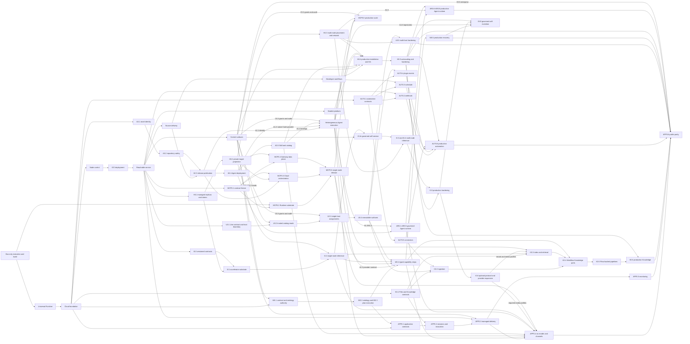

# A3S Cloud Product Roadmap

## 1. Scope and document hierarchy

**Status as of 2026-08-13.**

This is the product-level roadmap for A3S Cloud. It summarizes the complete
Cloud portfolio, current gate status, dependencies, delivery order, and the
boundary with A3S Gateway. It does not replace the detailed implementation
plans.

| Document | Authority |
| --- | --- |
| This `ROADMAP.md` | Product outcomes, portfolio ordering, public gate status, and cross-product ownership |
| [Technical architecture](docs/architecture.md) | Stable component ownership, control paths, consistency boundaries, deployment profiles, and failure behavior |
| [Cloud development plan](docs/development-plan.md) | Detailed implementation sequence, exit criteria, provider evidence, recovery gates, and definition of done |
| [Workflow and evolution plan](docs/workflow-evolution-plan.md) | Detailed `W0`, heterogeneous `A1`, and governed `EV0` contracts, ordered slices, safety policy, and recovery evidence |
| [AI application platform plan](docs/ai-application-platform-plan.md) | Detailed `APP0`, `K0`, `AUT0`, built-in node coverage, Flow-preservation contract, and public parity evidence |
| [Inference plan](docs/inference-plan.md) | Detailed `I0` domain, protocol, scheduling, Gateway, usage, and conformance contracts |
| [A3S Use plugin roadmap](https://github.com/A3S-Lab/Use/blob/main/ROADMAP.md) | Canonical plugin package, catalog, plan/apply, grant, Runtime-binding, capability-generation, and shared Plugin Manager delivery |
| [Runtime roadmap](https://github.com/A3S-Lab/Runtime/blob/main/ROADMAP.md) | Runtime-local Unit lifecycle, provider certification, and `MCP0.2` substrate work |
| [Gateway roadmap](https://github.com/A3S-Lab/Gateway/blob/main/ROADMAP.md) | Gateway-local current capability truth and implementation backlog |
| [Agent Runtime platform roadmap](https://github.com/A3S-Lab/a3s/blob/main/docs/agent-runtime-platform-roadmap.md) | Cross-repository ownership, non-duplication rules, and `AR0` dependency order |

The documents must change together when a product gate changes state. The
owning detailed plan decides whether its exit evidence is sufficient to mark a
gate verified; this roadmap then publishes that state without weakening or
reinterpreting the gate.

The roadmap is gate-driven, not date-driven:

| State | Meaning |
| --- | --- |
| Verified | The complete real-provider, failure, recovery, cleanup, and release evidence passes |
| In progress | A usable implementation slice exists, but named exit evidence remains |
| Planned | The capability is unavailable until its owning gate passes |
| Historical | Prior implementation evidence retained for regression coverage; it does not certify the current provider contract |

## 2. Product position

**A3S Cloud is the self-hosted control plane and managed delivery platform for
AI applications, Knowledge Pipelines, ontology-driven Workflows, heterogeneous
Agents, MCP services, model-serving workloads, automations, and governed
self-evolution on operator-owned infrastructure.**

The cumulative product target is an A3S-native platform that replaces the
operational responsibilities commonly split between Google AX and Kubernetes.
It requires neither system and does not preserve their APIs or controllers.
The outcome is delivered across the existing `A0`, `A1`, `C0`, `H0`, and Box
certification gates rather than through a parallel replacement milestone.

Cloud turns tenant-owned intent into durable, observable infrastructure state.
PostgreSQL is authoritative for desired state, A3S Flow coordinates long-lived
operations, node agents converge A3S Runtime resources, and A3S Gateway applies
the complete traffic policy produced by Cloud.

Cloud owns:

- organizations, projects, environments, identity, membership, and grants;
- immutable application, Agent, MCP, Skill, model, and provider revisions;
- versioned ontologies, Workflow definitions, goals, deterministic plan
  revisions, Workflow runs, and human decisions after `W0`;
- application identities/releases, six current delivery projections including
  distinct classic and New Agent outcomes, sessions,
  messages, conversation variables, feedback, annotations, and managed
  application delivery after `APP0`;
- RAG Knowledge Bases, documents, chunks, ingestion/index/retrieval policy,
  citations, and KnowledgePipeline bindings after `K0`;
- exact-release schedules, webhooks, admitted event invocations, and reusable
  outbound connection profiles after `AUT0`;
- tenant-scoped Agent conversations, executions, approvals, checkpoints,
  forks, replayable trajectories, and one provider-neutral Harness contract
  after `A1`;
- authorized evidence datasets, evaluation suites, evolution experiments,
  candidate revisions, promotion decisions, and rollback evidence after
  `EV0`;
- Workloads, desired replica count, placement, rollout, and the sole
  production autoscaling evaluator;
- source resolution, isolated builds, artifact publication, and release
  provenance;
- domains, TLS intent, logical Gateway scopes, complete traffic snapshots, and
  exact applied-state projection;
- databases, volumes, fencing, backup, restore, and retention after `S0`;
- durable operations, audit, logs, usage ledgers, API, CLI, management MCP, and
  web surfaces;
- tenant-scoped A3S Use registry enrollment, exact package assignments,
  reviewed-plan projections, and applied-host observations after `U0`; and
- installation, upgrades, high availability, disaster recovery, and
  operational policy after `H0`.

Cloud does not own:

- generic hosted-workload proxying or provider-byte forwarding; the bounded
  `APP0` delivery role owns only managed application semantics while Gateway
  retains edge protocol and route authority;
- a second workload engine outside the common Workloads and Runtime path;
- a second Workflow engine, Agent/Harness scheduler, evaluation scheduler,
  event bus, model registry, object client, or telemetry-driven promotion
  controller;
- an A3S Use package installer, TUF/catalog implementation, Workspace Grant or
  Runtime Binding store, capability registry, surface reconciler, or plugin
  execution RPC;
- Kubernetes, Helm, CRDs, or Operators as a required installation or an
  alternative Cloud control plane;
- raw provider configuration formats at the product boundary;
- a built-in mail server or a separate native-desktop feature set; or
- commercial prices, balances, invoices, settlement, and managed-service
  plans.

All Cloud product configuration uses closed, validated A3S ACL and is parsed
and generated through `a3s-acl`.

The public website defines additional target outcomes, not the complete Cloud
inventory. Adopting AI application, Knowledge, automation, Workflow,
heterogeneous Agent, model, storage, Unified Gateway, and self-evolution
capabilities does not remove or replace any
existing gate. `F0`, `BX0`, `PW0`, `R0`, `N0`, `D0`, `E0`, `G0`, `P0`,
`C0`, `A0`, `U0`, `MCP0`, `A1`, `W0`, `APP0`, `K0`, `AUT0`, `S0`, `H0`,
and `I0` retain their current authorities and exit evidence. Sources/builds,
ordinary Tasks and Services,
Projects, Secrets, Assets, Plugins, Workloads/Fleet, Edge, Operations, Search,
audit, update, rollback, backup/restore, and production recovery remain
first-class Cloud capabilities even when the website diagram omits them.

The architecture reference capability register is also additive. TokenHub-style
model-gateway governance remains assigned to `C0.3` and `I0.2` through optional
`I0.6`; Google AX-style distributed Harness outcomes remain assigned to
`A1.1` through `A1.6`; cross-layer security investigation remains assigned to
`C0.3` over the shared evidence and audit foundations; Dify-style public core
application outcomes remain assigned to `APP0`, `K0`, and `AUT0` over `W0` and
the existing provider gates. Removing a reference name does not retire those
outcomes or authorize a replacement mechanism.

A3S Box is the sole node-local execution and image-build provider. A3S Power is
the required inference serving boundary and runs as an ordinary Box-hosted
Runtime Service. Neither product adds a scheduler, node channel, queue, desired
state store, routing authority, or usage authority to Cloud.

Cloud now owns the generic finite-Task product surface as tenant-scoped
Executions. The initial vertical slice persists replay-safe intent and
Operations, schedules capability-matched Runtime Tasks through Fleet, supports
cancellation, and withholds terminal state until authoritative cleanup. This is
platform execution infrastructure; it does not implement Agent conversations,
Workflow semantics, trajectories, training, or any Agentic RL policy by
itself. Those outcomes remain unavailable until their owning `A1`, `W0`, and
`EV0` gates pass through the same execution path.

## 3. Current roadmap

| Gate | Product outcome | State |
| --- | --- | --- |
| `BX0` — Box-only platform | Sole A3S Box execution/build path and Box re-certification of the complete Runtime, deployment, source-delivery, recovery, and cleanup baseline | In progress |
| `PW0` — Power inference boundary | ACL-native immutable Power Service profile, Box MicroVM/TEE evidence, health, inference, recovery, and cleanup | Planned |
| `R0` — Universal Runtime | General Task and Service contracts, durable identity, capability matching, and real provider conformance | Historical; Box re-certification pending |
| `F0` — Foundation | Boot control plane and PostgreSQL task queue, PostgreSQL, tenancy, identity, ORM-backed Flow operations, outbox, projections, API, and web shell | Verified; Flow `0.12.0`, Boot `0.2.0`, ORM `0.3.0`, and the exact root compatibility lock pass together |
| `N0` — Node control | Enrollment, outbound mTLS, command leases, observations, durable command journal, and sole Box driver | Historical; Box re-certification pending |
| `D0` — OCI deployment | Immutable digest-pinned Workload revisions, scheduling, apply, health, activation, stop, cancellation, and recovery | Historical; Box re-certification pending |
| `E0` — Reachable service | Managed TLS, complete Gateway snapshots, encrypted Secrets, durable ordered logs, immutable update, cloned rollback, web operations, and a clean-host release loop | Historical; Box re-certification pending |
| `G0` — External source delivery | Pinned Git sources, isolated builds, OCI validation/publication, provenance, and deployment through the common Workload path | In progress |
| `P0` — Developer workflows | Build detection, web/worker/scheduled profiles, previews, monorepos, and closed Compose import | Planned |
| `C0` — Control surfaces | REST/CLI/management MCP parity, external identity federation, SCIM, grants, search, collaboration, security investigation, notifications, audit/SIEM export, session policy, and bounded exec/terminal | In progress; enterprise `C0.5` planned |
| `A0` — Release catalog | Agent and MCP release publication, Agent deployment, and Skill binding through the common source and artifact paths | In progress |
| `U0` — A3S Use plugin assignments | Trusted registry enrollment, exact workspace package assignments, reviewed package/enablement planning, digest-only apply, observations, and recovery through the shared A3S Use Plugin Manager | In progress; unavailable |
| `MCP0` — Hosted MCP services | Modern stateless MCP release admission, Runtime Service hosting, Cloud orchestration, Gateway protocol enforcement, and joint recovery evidence | In progress; unavailable |
| `A1` — Heterogeneous Agent execution | Durable conversations, one provider-neutral Harness contract, semantic events, approvals, checkpoints, forks, and trajectories over existing Cloud control paths | In progress (`A1.0` verified; `A1.1` implemented, native Code `A1.2` integration pending verification) |
| `W0` — Ontology-driven Workflow | Versioned ontologies and Workflows, deterministic goal-to-plan compilation, typed Agent/MCP/model/human steps, and Flow-based recoverable runs | In progress and unavailable (`W0.1` is implemented and `W0.2` is verified; the `W0.3` definition/goal/plan, native Form, WorkflowRun, HumanTask loop, immutable ExecutionTemplate lifecycle, and exact finite Execution step are implemented, and the finite Execution recovery/cross-surface sub-gate is verified. Business-service and remaining provider steps, compensation, expanded real-provider verification, and `W0.4`-`W0.5` remain) |
| `APP0` — AI application lifecycle and delivery | Chatbot, Text Generator, classic Agent, New Agent Beta, Chatflow, and Workflow experiences over one immutable ApplicationRelease-to-WorkflowRevision path, with sessions, publishing, streaming, embed, MCP, monitoring, feedback, and enterprise governance | Planned and unavailable; no public parity claim before `APP0.6` |
| `K0` — Knowledge and Knowledge Pipeline | User files, Knowledge Bases, document/chunk lifecycle, multi-source ingestion, General/Parent-child/Q&A and multimodal processing, indexing/retrieval/rerank/citations, external Knowledge, and Flow-backed Knowledge Pipelines | Planned and unavailable |
| `AUT0` — Automations and Connectors | Schedule, webhook, plugin/source-event triggers and reusable outbound HTTP/business connections with exact targets, deduplication, Secret/egress policy, and recovery | Planned and unavailable |
| `S0` — Stateful and distributed storage platform | Databases, immutable-object and volume providers, distributed access, fencing, backup, restore, retention, and stateful import mappings | Planned |
| `H0` — Production scale | Durable replicas, multi-node placement, private networking, Gateway replication, control-plane HA, and measured autoscaling | In progress |
| `I0` — Inference profile | Accelerator-backed model serving, typed model protocols, scoped keys, routing/fallback, Providers, durable usage, governed self-service, and optional protocol/provider expansion | Planned |
| `EV0` — Governed self-evolution | Authorized evidence datasets, reproducible evaluation and reward policy, Agentic RL candidate jobs, approval-gated promotion, canary observation, and exact rollback | Planned |
| `AR0` — Governed Agent Runtime experience | One simplified projection over existing Agent, Workload, Deployment, Operation, Runtime, Box, Secret, and evidence authorities; bounded egress, brokered credentials, context-cost evidence, idle policy, and checkpoint/fork experience without a parallel lifecycle | Planned; `AR0.1` waits for `A1.3` and the Box baseline |

### 3.1 `AR0`: governed Agent Runtime experience

`AR0` adopts the strongest developer, cost, and security outcomes of hosted
Agent execution products without creating a second platform inside Cloud. The
public `AgentRuntime` resource is a correlated projection over existing
`AgentRelease`, `HarnessInvocationProfile`, `WorkloadRevision`, `Deployment`,
`AgentExecution`, and `Operation` identities. Workloads and Fleet remain the
only placement and reconciliation path; A3S Runtime remains the only generic
Task/Service lifecycle; Box remains the only Cloud provider.

| Gate | State | Cloud-owned outcome | Required external owner |
| --- | --- | --- | --- |
| `AR0.1` | Planned | REST/client/CLI/Management MCP create/get/list/exec/log/stop/delete projection with one transactionally correlated underlying lifecycle and no new scheduler or run store | Runtime and Box baseline; `A0.4`; `A1.3`; `C0.1` |
| `AR0.2` | Planned | Closed ACL egress policy, tenant/grant checks, immutable digest, audit, and compilation into the Workload/Runtime path | Runtime generic capability; Box compilation; OCI Runtime enforcement |
| `AR0.3` | Planned | Destination-bound, expiring brokered credential grants and secret-free receipts; Cloud Secrets remains sole durable credential authority | Box node-local broker; OCI Runtime isolation; `C0.3` |
| `AR0.4` | Planned | Bounded context-cost and Tool-use facts, authorized projections, and correlation with Agent events and optional Inference usage | Common Harness evidence implemented first by A3S Code |
| `AR0.5` | Planned | Pin deterministic Tool-result transformation policy and retain source/result digests plus immutable original-content authority | Common Harness transform contract; no Gateway/Runtime rewriting |
| `AR0.6` | Planned | Sole idle-policy evaluator, exact wake intent, Operation history, audit, and bounded failure projection | Runtime pause/resume; Box/OCI Runtime recovery; Gateway signal only for ingress demand |
| `AR0.7` | Planned | Reuse `A1.6` immutable semantic/provider checkpoints and fork lineage through the same execution lifecycle | Runtime/Box/OCI Runtime checkpoint capability and Harness semantic checkpoint |
| `AR0.8` | Planned | Fold measured vertical and replica decisions into the sole `H0.5` Workloads autoscaler | Trusted resource evidence and replacement/recovery gates |

Cloud does not implement an Agent egress proxy, plaintext credential injector,
Tool-result compressor, process freezer, snapshot engine, or live resource
mutator. Those mechanisms remain with their owning repositories, while Cloud
owns policy, grants, desired state, audit, and product availability. The
cross-repository contract and evidence rules are defined in the
[Agent Runtime platform roadmap](https://github.com/A3S-Lab/a3s/blob/main/docs/agent-runtime-platform-roadmap.md).

### 3.2 Baseline requiring Box re-certification

`R0` through `E0` define one cumulative behavioral baseline:

```text
general Runtime
  -> durable Cloud desired state
  -> outbound node control
  -> digest-pinned deployment
  -> managed HTTPS, logs, update, rollback, and clean-host recovery
```

The retired Docker implementation proved these behaviors, so its records remain
historical regression evidence. They do not certify the Box-only release.
`BX0` must reproduce the complete baseline on exact Cloud, Runtime, Box, and
Gateway revisions. Later work must reuse this path. A new interface, asset
type, import format, accelerator, replica policy, or provider never creates a
second deployment or reconciliation engine.

### 3.3 Current in-progress gates

`BX0` is the release-blocking provider migration:

1. `BX0.1` pins one certified Box/Runtime pair, adds closed `box` ACL
   configuration, and removes provider fallback. It is verified by
   [Cloud PR #86](https://github.com/A3S-Lab/Cloud/pull/86) and the
   [exact Linux provider gate](https://github.com/A3S-Lab/Cloud/actions/runs/30416879476).
2. `BX0.2` migrates digest-pinned Task/Service lifecycle, recovery, logs,
   resources, stop/remove, cancellation, and cleanup. It is verified by
   [Cloud PRs #87 through #93](https://github.com/A3S-Lab/Cloud/pull/93) and the
   [final interruption gate](https://github.com/A3S-Lab/Cloud/actions/runs/30456965598).
3. `BX0.3` migrates networking, endpoints, health, Secrets, Artifact/Volume/
   tmpfs mounts, outputs, and registry credentials through typed Box ports. The
   typed Service TCP endpoint, shared Runtime health consumer, and explicit
   isolation-selection slices plus Secret and registry-credential
   materialization are implemented. Artifact mounts, persistent Volumes, tmpfs,
   and Task-output publication now use the same Box driver and existing Cloud
   Artifact boundary. The composite provider/Cloud Claim gate closes allocation
   evidence. An optional ACL-native SEV-SNP policy now constructs Box's
   confidential driver and consumes generation-bound attestation while keeping
   simulation distinct from hardware evidence; complete Sandbox plus
   hardware-backed MicroVM/TEE isolation certification keeps the gate in progress.
4. `BX0.4` now implements the sole `cloud.build@5` path through typed Box
   commands and canonical ACL build plans. Box owns its operation journal,
   content-addressed cache, and images; Cloud retains Artifact transport, OCI
   admission, publication, and SPDX/SLSA evidence. Exact Linux provider and
   process-death certification remains open.
5. `BX0.5` has removed the retired build executors and adds an architecture
   guard against BuildKit, Bollard, Runtime build adapters, and duplicate build
   caches, journals, schedulers, or services. Complete Box-only conformance and
   the clean-host release gate remain open.

Cloud now delegates provider certification to the exact A3S Box revision and
uses Box-hosted fixtures for local development and the C0 PostgreSQL gates. The
retired provider workflows, release harness, and source-build certification
script have been removed instead of retained as fallbacks. This does not mark
`BX0.3` through `BX0.5` complete: the Box-owned capability work and a new
clean-host release gate must restore the named behavioral evidence.

`BX0.2` is verified. Cloud consumer recovery and hard-resource Claims pass the
[dedicated Linux gate](https://github.com/A3S-Lab/Cloud/actions/runs/30425852930).
It persists the command before dispatch, applies through the shared Box driver,
reconstructs both the Runtime client and Agent executor across the
apply-before-journal-completion boundary, and requires the same durable Runtime
receipt and physical Task or Service identity. The same gate replaces a running
Service generation and proves logs, inspection, stop, removal, and empty
provider state. It also prepares one inventory-bound CPU/memory Claim, binds the
exact Box observation across restarts, rejects release before durable stop
evidence, and releases only after the Runtime is fenced. Deployment cancellation
passes through the existing Flow, Fleet
command journal, Runtime driver, and Claim repository in the
[exact Linux gate](https://github.com/A3S-Lab/Cloud/actions/runs/30429412890).
It uses an explicitly headless Service, requires `RuntimeRemove` evidence
before `ResourceClaimRelease`, records `Cancelled` only after both complete,
and finishes with empty provider state. The
[final interruption gate](https://github.com/A3S-Lab/Cloud/actions/runs/30456965598)
sends `SIGKILL` after Box has durably removed the Service but before the Agent
records command completion. A reconstructed Agent and Flow adopt the exact
removal receipt, keep the prepared Claim capacity held until acknowledgement,
release it once, reach terminal cancellation, and leave no provider residue.

The first `BX0.3` slice is implemented across
[Runtime PR #8](https://github.com/A3S-Lab/Runtime/pull/8),
[Box PR #185](https://github.com/A3S-Lab/Box/pull/185), and
[Cloud PR #95](https://github.com/A3S-Lab/Cloud/pull/95). A3S Runtime owns one
provider-neutral typed Service endpoint observation. The shared Box driver owns
generation-fenced loopback listeners and relays through its existing
`ExecutionPortConnector`. Cloud removed its product-specific endpoint contract
and consumes the Runtime type directly, using one stateless Edge adapter to
compile a TCP socket into Gateway's canonical HTTP origin. The real Box gate
proves live HTTP traffic through that origin, stable observation replay, exact
removal, and listener closure. No separate Box CLI forwarder, namespace
connector, forwarding daemon, lifecycle store, or endpoint registry was added.

The second `BX0.3` slice pins
[Box PR #186](https://github.com/A3S-Lab/Box/pull/186), whose single Runtime
driver provider-certifies HTTP, TCP, and command probes over the same
generation-fenced port and exec boundaries. Cloud does not interpret probe
kinds or run probes. Its existing A3S ACL Workload compiler emits the HTTP
Runtime policy, and the Node Agent carries the kind-neutral current health
observation through the same durable command result. The real Box consumer
gate proves threshold convergence to `Healthy`, exact journal replay after
Runtime and executor reconstruction, a fresh healthy inspection with unchanged
provider identity and endpoint, live traffic through the stateless Gateway
origin adapter, removal, `NotFound`, and listener closure. No health worker,
registry, scheduler, queue, endpoint authority, or lifecycle store was added.

The third `BX0.3` slice pins A3S Box
`9fb9bf528f6c648bbecf203de991106fc39bccdb` and makes isolation selection an
explicit closed Node Agent contract. The required ACL `box.isolation` field
accepts exactly `microvm` or `sandbox`; missing, `automatic`, and unknown values
fail before the Runtime starts. Cloud maps the selected value directly into the
same shared `BoxRuntimeDriver`, ships MicroVM in the product profile, and makes
hosted Cloud consumer tests request Sandbox explicitly. There is no automatic
downgrade, fallback provider, or parallel Runtime driver. Full provider
certification for Sandbox, MicroVM, and TEE remains open.

The fourth `BX0.3` slice pins A3S Box
`211b6bdaa572ba0ad5d55c7988a5b4a72ca36251`, merged through
[Box PR #187](https://github.com/A3S-Lab/Box/pull/187) after the
[provider certification](https://github.com/A3S-Lab/Box/actions/runs/30506005198).
Cloud contributes one
adapter from the existing authenticated node Secret channel to Box's typed
materialization port. Box owns process-create environment and read-only file
projection, restart rematerialization, log redaction, transient registry
authentication, and cleanup. The real consumer gate proves exact Secret
authorization, `0400` file projection, driver reconstruction, restart refresh,
redacted stdout/stderr, one uncached authenticated private-registry pull,
credential-free cache reuse, plaintext exclusion, and empty tmpfs/provider
state after removal. No second Secret channel, credential store, Runtime
driver, scheduler, queue, or lifecycle store is introduced.

The fifth `BX0.3` slice pins A3S Box
`7f29f6314827b1f572401cdda189bae9f34b7f9f`, merged through
[Box PR #190](https://github.com/A3S-Lab/Box/pull/190), and is integrated by
[Cloud PR #100](https://github.com/A3S-Lab/Cloud/pull/100). One
`CloudBoxArtifactPort` delegates to the existing authenticated node Artifact
manager for read-only materialization, deterministic bounded output capture,
durable local receipts, and command-bound publication. Box's existing
VolumeStore remains the sole authority for persistent Volumes, Task-output
staging, live attachment fencing, recovery validation, and cleanup. The real
consumer gate combines Artifact, Volume, tmpfs, output, journal-replay, driver
reconstruction, and zero-residue evidence. It adds no parallel Artifact store,
output database, VolumeStore, Runtime driver, scheduler, or lifecycle path.

The sixth `BX0.3` slice closes allocation evidence through one composite gate.
The exact Box phase executes every advertised Runtime profile, including the
Resources behavior derived from CPU, memory, PID, and execution-timeout
controls. The Cloud phase requires those controls and proves the existing
inventory-bound Claim across prepare, Runtime apply, exact binding-digest
inspection, pre-fence release rejection, durable stop, release, removal, and
cleanup. Both machine-checkable results are retained in one revision-bound
artifact; Cloud adds no provider resource model or second Claim mechanism.

The seventh `BX0.3` slice pins A3S Box
`150a1d068e5b6d073ac93352f83d03eb6d7285fa` and adds one optional closed
`box.sev_snp` ACL block to the existing Node Agent composition. It maps Milan
or Genoa plus the exact launch measurement, debug/SMT checks, policy mask, and
minimum TCB versions into Box's sole confidential Runtime driver. Hardware
mode fails closed without a canonical lowercase SHA-384 measurement and debug
rejection. Explicit simulation is development-only evidence. The pinned Box
revision adds generation-bound RA-TLS persistence, deferred guest release,
live recovery/restart re-attestation, tamper rejection, simulated conformance,
and a separate hardware gate; the hardware gate has not yet run for this lock.

The eighth `BX0.3` slice advances A3S Box to
`9ee75351ed1c5b5648639476e664c97825879f89` and makes native OCI descriptors
reproducible across immediate-parent cache hydration. The sole Box assembly
boundary uses the canonical epoch because build input has no creation clock;
the existing Cloud consumer gate requires the rebuilt descriptor to match and
then proves exact cleanup. No alternate builder, clock option, or cache path is
introduced.

`BX0.3` remains in progress only for complete Sandbox plus hardware-backed
MicroVM/TEE isolation certification.

`PW0.1` follows the required `BX0.3` isolation and evidence capabilities. It
makes the immutable ACL-native A3S Power profile the first local I0 backend and
proves Box-hosted health, bounded streaming and non-streaming inference,
attestation, process/VM recovery, update, rollback, and cleanup.

The exit gate installs Cloud, Box, Gateway, and Power on a clean supported
Linux host without Docker or a compatible daemon; deploys, reaches, observes,
updates, rolls back, and removes a Service; builds and publishes one OCI
Artifact; serves one bounded Power inference request; recovers the named
process/VM failures; and leaves no execution, Secret, credential, mount,
network, volume, VM, or build residue.

The current `G0` implementation includes:

- canonical GitHub identities, repository policy, immutable source revisions,
  and versioned build recipes;
- signed replay-safe GitHub ingress, tenant-owned App connections,
  subscriptions, lifecycle reconciliation, and short-lived private access;
- exact-commit checkout, deterministic initial BuildRuns, retry-as-new-attempt
  lineage, cancellation, explicit build-log unavailability, and web controls;
- the sole `cloud.build@5` Flow, Fleet command queue, Node Agent replay journal,
  and typed Box start, inspect, cancel, and remove commands;
- Box-owned `BuildOperationJournal`, `BuildCache`, and `ImageStore` authority,
  with immediate-parent cache receipt binding and no Cloud cache fallback;
- complete OCI graph validation, deterministic registry targets,
  authenticated digest-only publication, remote verification, replay adoption,
  cleanup, and explicit deployment handoff to `cloud.deployment@3`; and
- deterministic SPDX 2.3 and SLSA provenance, locally verified Ed25519 DSSE
  signing through persistent local or Vault Transit providers, durable
  evidence restoration, and tenant-scoped API/web inspection and download; and
- migration of every pre-Box BuildRun to an explicit rebuild-required outcome,
  plus A3S Flow cancellation of known retired build histories on startup.

The manual external-provider workflow now defines the complete private source,
production input, exact Box output, external HTTPS Registry, locally verified
Vault Transit evidence, PostgreSQL restart restoration, and
`cloud.deployment@3` Workload handoff chain. The Box provider workflow defines
the complementary real Linux Agent-process-death/cache/removal gate and a
nine-boundary Fleet/Flow event-loss matrix in both logical and PostgreSQL-backed
`SIGKILL` forms. `G0` remains in progress until successful executions of both
operator gates are retained on the exact revisions. Durable BuildRun logs also
remain unavailable until Box exposes the authoritative contract Cloud can
transport.

`C0` now includes the initial `C0.1` automation slices:

- one maintained TypeScript client is shared by the web console and CLI;
- the client validates success and error envelopes, preserves bounded error
  metadata, applies request timeouts, and maps malformed or failed transport to
  stable non-secret errors;
- the CLI accepts authentication only through `A3S_CLOUD_TOKEN`, resolves URL
  and tenant context from flags or environment without a credential file, and
  emits bounded table or stable JSON output;
- organization, project, environment, node, and operation queries use the same
  public REST paths and tenant guards as the web console; and
- workload, deployment, route, BuildRun, signed-evidence, and bounded Workload
  log queries extend that same transport without reading PostgreSQL or
  contacting a node directly; BuildRun log requests fail explicitly while the
  Box log contract is unavailable; and
- workload stop/rollback plus deployment and BuildRun cancel/retry commands
  require a caller-owned validated `Idempotency-Key`, surface replay state, and
  call the existing application commands without a hidden confirmation path;
  and
- Workload create/update and SourceRevision deployment accept bounded A3S ACL
  through the same public REST paths. Cloud parses the exact document with
  `a3s-acl`, rejects unknown version-1 fields, and preserves JSON-client
  idempotency semantics; and
- Organization, Project, and Environment creation plus node ready/drain/revoke
  use the existing scoped REST and application commands. Every call has a
  caller-owned idempotency key, and node transitions also require the current
  aggregate version; and
- public administrative diagnostics read platform, liveness, and readiness
  through the shared client without sending a bearer token. A health endpoint's
  wrapped `503` down report remains diagnostic data, while an error envelope
  remains a failure; the CLI preserves the report and returns exit code `8`;
  and
- Edge automation lists and mutates DomainClaims, lists and creates logical
  Gateway scopes with one through 100 unique members and explicit rollout
  thresholds, and publishes routes through the existing tenant-guarded
  commands. DomainClaim and Gateway-scope mutations expose durable replay
  state, while route publication preserves request and Gateway-command replay;
  and
- Source automation lists immutable source revisions, inspects GitHub
  connection authority, starts the existing short-lived no-store installation
  flow, resolves branch/tag/commit inputs into pinned revisions, and
  lists/creates/deactivates GitHub repository subscriptions. Replayable
  mutations require caller-owned idempotency keys and expose durable replay
  state; and
- Secret automation lists metadata, inspects version state, creates Secrets,
  adds versions, and revokes versions through the existing public controllers.
  Plaintext enters the CLI only through bounded fatal-UTF-8 standard input,
  never appears in arguments, environment, configuration, output, or errors,
  and never bypasses Cloud encryption or A3S ORM persistence.
- Identity automation lists and reads tenant-scoped API-token metadata, creates
  scoped credentials, and revokes them through the existing public Identity
  controllers. New credentials enter the CLI only through exact 68-byte
  `--token-stdin` input, are cleared from the input buffer, never appear in
  arguments, environment, configuration, output, or errors, and are persisted
  only as digests through the A3S ORM repository; and
- Node bootstrap issues an idempotent, short-lived one-time enrollment
  credential through the existing tenant-guarded Fleet command. The CLI accepts
  the exact credential only through bounded standard input, clears its input
  bytes, projects no credential, and prints a Bash invocation that installs an
  HTTPS release only after an exact SHA-256 check. The target prompts for the
  credential and keeps it out of argv and the pre-provisioned A3S ACL config;
  Cloud persists only its digest through the Fleet A3S ORM repository.
- Organization-scoped authorized search registers credential-free Project,
  Environment, Node, Workload, Deployment, Route, DomainClaim, Gateway-scope,
  BuildRun, SourceRevision, Secret-metadata, and Operation projections. The API
  applies the tenant guard before a bounded A3S ORM query, while the shared
  client, CLI, and Web console use the same endpoint without broad local reads.
  Web adds debounced keyboard search and validated contextual navigation; and
- REST major version 1 publishes one unauthenticated raw OpenAPI 3.0.3 snapshot
  at `/api/v1/openapi.json`. The shared client and response headers pin contract
  `1.9.0`; route-snapshot tests and a PR-base semantic checker reject removed
  operations, new required inputs, removed responses or schema fields, missing
  version increments, and deprecations without a replacement and a 180-day
  minimum sunset window; and
- the real `C0.1` conformance gate runs raw REST, the exact shared client import
  used by Web, and the compiled CLI against one control-plane process and
  PostgreSQL 17. It proves cross-surface idempotency replay, stable conflicts,
  authorized-search parity, tenant denial, immediate token revocation, expected
  token-digest persistence through A3S ORM, and zero plaintext credentials in
  API/CLI evidence or the PostgreSQL dump.

`C0.1` and `C0.2` are verified. `C0` remains in progress. `C0.2` provides
stateless scoped management MCP for core Project, Environment, and authorized
search commands and queries plus Node, Operation, Workload, Deployment, Route,
and BuildRun reads, bounded cursor-paginated Workload logs, explicit BuildRun-log
unavailability, and signed BuildRun evidence. Five replay-safe Workload stop/rollback, Deployment
cancel, and BuildRun cancel/retry commands reuse the existing mutation scopes
and application handlers. A dedicated real PostgreSQL gate proves scope-derived
catalogs, strict arguments and annotations, operational query and command
dispatch, hidden-mutation zero-write, Project and Workload idempotency replay,
foreign-resource non-disclosure, immediate revocation, and digest-only A3S ORM
persistence. Grant-derived search is a separate `C0.3` authorization outcome;
the current search boundary is the organization tenant guard.

`A0.1` now provides the hosted-asset identity and persistence foundation:

- exact `agent`, `mcp`, and `skill` Asset kinds and closed lifecycle states;
- canonical SemVer, Git commit, profile ACL digest, and typed artifact
  identities;
- organization-scoped Asset-name and per-Asset release-version uniqueness;
- optimistic aggregate transitions, strict typed domain-event validation,
  shared idempotency records, and the existing transactional Outbox; and
- migration 051 plus one A3S ORM PostgreSQL repository, with real-database
  evidence for replay, stale-write rejection, tenant isolation, archival,
  publication immutability, yanking, and atomic event persistence.

Hosted Git is now public through a tenant-authorized Smart HTTP boundary, but
no release API is public and no Agent, MCP, or Skill is deployable from this
foundation alone. `A0` therefore remains in progress.

`A0.2` is verified. One local durable bare-Git adapter under
`{root}/{organization_id}/{asset_id}.git` initializes `main`, binds and
revalidates immutable tenant, Asset, and repository-schema metadata, enables
receive and transfer object checks, publishes through atomic staging and parent
directory sync, converges concurrent provisioning, and rejects symlinked paths
or identity tampering. Smart HTTP uses the existing tenant guard and scoped API
tokens. Source checkout and hosted repositories share the same hardened Git
runner; no second Git subprocess mechanism exists.

One `asset_git_repository_controls` row accessed only through A3S ORM owns the
durable quota, single-writer lease, applied usage, audit commit, and latest
backup receipt. Its lease ID also names one checksummed local rollback journal.
Recovery rolls back refs and newly introduced objects only while the database
lease is uncommitted; after the database commits, the same recovery path only
removes the journal. An uncertain commit result retains evidence for replay.
Backup and restore use the shared immutable-object client, and admission parses
the exact commit's `.a3s/asset.acl` only through `a3s-acl`. Real PostgreSQL and
Git integration covers concurrency, quota, tenant denial, audit atomicity,
process death, exact refs/object rollback, subsequent push, backup/restore, and
manifest rejection without Redis or another coordinator.

## 4. Delivery horizons and dependencies

| Horizon | Required gates | Product outcome |
| --- | --- | --- |
| Usable service platform | `BX0` plus `R0` through `E0` | One operator can deploy, reach, observe, update, roll back, and stop one Box-hosted stateless Service on one Linux node |
| Developer platform | `G0`, `P0`, `C0`, and `A0` | Source-to-release workflows, previews, stable automation, team operations, and A3S assets reuse the verified deployment path |
| Plugin-managed cognitive platform | `U0`, `C0.3`, the required A3S Use gates, and named `BX0`/`H0` host foundations | Tenants assign signed multi-surface A3S Use packages to authorized workspaces without another package manager, scheduler, or node channel |
| Hosted MCP platform | `A0.3`, `MCP0.1` through `MCP0.5`, and their named `BX0`/`H0` foundations | One immutable modern MCP release runs as a Box-hosted Runtime Service through an authorized conforming Gateway |
| Heterogeneous Agent platform | `A0`, `A1`, and the relevant `C0` grants and audit gates | Immutable Agent releases execute through one provider-neutral contract with native Code and conforming external Harnesses, durable approvals, recovery, and replayable trajectories |
| Ontology-driven Workflow platform | `W0` plus the selected `A1`, `MCP0`, `I0`, `U0`, and `C0` step dependencies | Versioned business semantics compile into deterministic, recoverable plans without another workflow engine or scheduler |
| AI application platform | `APP0`, `K0`, `AUT0`, `W0`, and their named `A0`/`A1`/`AR0`/`I0`/`U0`/`MCP0`/`C0`/`S0`/`H0` dependencies | Six current application experiences, including distinct classic and New Agent outcomes, 23 built-in Workflow node labels with classic/New Agent profiles under Agent, Knowledge Pipelines, six plugin outcomes, multi-channel publication, monitoring, and enterprise policy share one release and Flow execution path |
| Stateful production platform | `S0` and `H0` | Stateful resources, multi-node placement, HA, measured scaling, backup, and disaster recovery are production-operable |
| Governed evolution platform | `EV0`, `W0`, `A1.6`, `I0`, and the named `H0`/`C0` safety foundations | Authorized evidence produces reproducible evaluations and immutable candidates that canary, promote, halt, and roll back only through existing owning-context paths |

Inference is an optional profile across these horizons, not another deployment
engine or delivery horizon. It may begin after `E0` and becomes production-ready
only after its named `H0` and `C0` foundations pass.


```mermaid
flowchart LR
    BX0[Box-only execution and build] --> R0[Universal Runtime]
    R0 --> F0[Cloud foundation]
    F0 --> N0[Node control]
    N0 --> D0[OCI deployment]
    D0 --> E0[Reachable service]
    E0 --> G0[Source delivery]
    G0 --> P0[Developer workflows]
    F0 --> A01[A0.1 asset identity]
    A01 --> A02[A0.2 repository safety]
    G0 --> A03[A0.3 release publication]
    A02 --> A03
    A03 --> A04[A0.4 Agent deployment]
    A04 --> A05[A0.5 Skill and catalog]
    E0 --> C0[Control surfaces]
    E0 --> U01[U0.1 Use contract and host boundary]
    U01 --> U02[U0.2 trusted catalog reads]
    C0 -->|C0.1/C0.2 reads| U02
    U02 --> U03[U0.3 single-host assignments]
    C0 -->|C0.3 grants and audit| U03
    U03 --> U04[U0.4 executable surfaces]
    H03 --> U05[U0.5 multi-host hardening]
    U04 --> U05
    A03 -->|A1.1 identity| A1[Heterogeneous Agent execution]
    A04 -->|A1.2 native Code provider| A1
    A05 -->|A1.4 bindings| A1
    C0 -->|C0.3 grants and audit| A1
    A04 --> AR05[AR0.1-AR0.5 governed Agent runtime]
    A1 -->|A1.3/A1.4| AR05
    E0 --> S0[Stateful platform]
    E0 --> H01[H0.1 managed replicas and claims]
    H01 --> H02[H0.2 private target projection]
    H02 --> H03[H0.3 multi-node placement and network]
    P0 --> H04[H0.4 production installation and HA]
    C0 --> H04
    A05 --> H04
    A1 --> H04
    S0 --> H04
    H03 --> H04
    H04 --> H05[H0.5 autoscaling and hardening]
    E0 --> MCP01[MCP0.1 contract freeze]
    MCP01 --> MCP02[MCP0.2 Runtime substrate]
    BX0 --> MCP02
    A03 --> MCP03[MCP0.3 Cloud orchestration]
    H02 --> MCP03
    MCP01 --> MCP03
    MCP01 --> MCP04[MCP0.4 Gateway data plane]
    H02 --> MCP04
    MCP02 --> MCP05[MCP0.5 single-node release]
    MCP03 --> MCP05
    MCP04 --> MCP05
    MCP05 --> MCP06[MCP0.6 production scale]
    H03 --> MCP06
    C0 -->|C0.3 grants and audit| MCP06
    E0 --> I00[I0.0 versioned contracts]
    H01 --> I01[I0.1 accelerator substrate]
    I00 --> I01
    I01 --> I02[I0.2 single-node inference]
    H02 --> I02
    C0 --> I02E[I0.2e governed self-service]
    I02 --> I02E
    H03 --> I034[I0.3 and I0.4 multi-node inference]
    I02E --> I034
    H05 --> I05[I0.5 production hardening]
    I034 --> I05
    I05 --> I06[I0.6 optional protocol and provider expansion]
    F0 --> W01[W0.1 contract and ontology authority]
    C0 --> W01
    W01 --> W023[W0.2 ontology and W0.3 plan execution]
    W023 --> W04[W0.4 typed capability steps]
    A1 -->|A1.3 provider contract| W04
    MCP05 --> W04
    I02 --> W04
    U04 --> W04
    W04 --> W05[W0.5 production recovery]
    F0 --> APP01[APP0.1 application contracts]
    W023 --> APP01
    APP01 --> APP02[APP0.2 sessions and invocation]
    K01 --> APP02
    APP02 --> APP03[APP0.3 managed delivery]
    E0 --> APP03
    C0 --> APP03
    APP03 --> APP04[APP0.4 six modes and channels]
    W04 --> APP04
    A1 --> APP04
    A05 --> APP04
    AR05 --> APP04
    I02 --> APP04
    I06 -->|required media profiles| APP04
    MCP05 --> APP04
    APP03 --> APP05[APP0.5 monitoring]
    F0 --> K01[K0.1 Files and Knowledge contracts]
    K01 --> K02[K0.2 ingestion]
    U04 --> K02
    AUT05 --> K02
    K01 --> K03[K0.3 index and retrieval]
    I02 --> K03
    I06 -->|rerank and media profiles| K03
    S0 --> K03
    K02 --> K04[K0.4 Workflow Knowledge ports]
    K03 --> K04
    W04 --> K04
    K04 --> K05[K0.5 Flow-backed pipelines]
    K05 --> K06[K0.6 production Knowledge]
    H05 --> K06
    F0 --> AUT01[AUT0.1 automation contracts]
    AUT01 --> AUT02[AUT0.2 webhook]
    E0 --> AUT02
    AUT01 --> AUT03[AUT0.3 schedule]
    P0 --> AUT03
    AUT01 --> AUT04[AUT0.4 plugin events]
    U04 --> AUT04
    AUT01 --> AUT05[AUT0.5 connectors]
    AUT02 --> AUT06[AUT0.6 production automation]
    AUT03 --> AUT06
    AUT04 --> AUT06
    AUT05 --> AUT06
    H05 --> AUT06
    APP04 --> APP06[APP0.6 public parity]
    APP05 --> APP06
    K06 --> APP06
    AUT06 --> APP06
    U05 --> APP06
    W05 --> APP06
    H05 --> APP06
    AR05 --> AR08[AR0.6-AR0.8 production Agent runtime]
    A1 -->|A1.6| AR08
    H05 --> AR08
    AR08 --> APP06
    C0 -->|C0.5 enterprise| APP06
    W05 --> EV0[EV0 governed self-evolution]
    A1 -->|A1.6 trajectories| EV0
    I05 --> EV0
    H05 --> EV0
```

Dependency rules:

- `G0`, `C0`, and `S0` may advance independently from the verified `E0`
  baseline.
- `P0` depends on the immutable source and build contracts from `G0`.
- `A0.1` uses the verified Foundation persistence, idempotency, and Outbox
  contracts. `A0.2` adds hosted repository safety. `A0.3` and later reuse the
  source, Artifact, publication, and deployment contracts verified by `G0`.
- `A1.0` has consolidated shared infrastructure from the verified `E0`
  baseline. `A1.1` consumes a published immutable `A0.3` `AssetRelease`,
  `A1.2` consumes `A0.4` Agent deployment for the native Code provider,
  `A1.3` freezes the provider-neutral contract and conformance suite, and
  `A1.4` consumes `A0.5` Skill/MCP bindings plus applicable model and Secret
  identities to freeze one invocation profile; approval and governance in
  `A1.5` consume `C0.3` grants and audit.
- `A1` extends Operations and Flow, Fleet node control, Workloads, Runtime,
  Artifacts, the transactional Outbox, and shared sequence streaming. It does
  not add another scheduler, job queue, node channel, or integration bus.
- `W0` owns ontology and Workflow semantics but compiles every durable run to
  one Operation and A3S Flow. Its Agent, MCP, model, Tool, human, and service
  steps call typed owning-context ports and cannot write their tables or start
  provider work directly.
- `APP0` owns application releases, sessions, messages, conversation variables,
  feedback, annotations, and managed delivery. Chatbot, Text Generator, classic
  Agent, New Agent Beta, Chatflow, and Workflow are projections over one exact
  ApplicationRelease-to-WorkflowRevision execution contract, not six runtime
  implementations. Classic/New Agent profiles and sandbox execution remain
  owned by `A0`, `A1`, and `AR0`.
- `K0` owns RAG corpus and retrieval semantics. A KnowledgePipelineRelease
  binds one exact Workflow revision and executes through Flow; Files and
  Knowledge reuse the shared immutable-object client, Inference, Executions,
  Search, Sources, Connectors, and A3S Use through typed ports rather than
  copying them.
- `AUT0` is the sole owner of schedules and admitted events that create new
  invocations. Flow timers remain scoped to existing runs, Sources retains
  provider connection/event authority, and planned P0 scheduled Task profiles
  adapt to the same Automations contract instead of adding a scheduler.
- Full public core parity is a composite `APP0.6` claim. It consumes `W0.5`,
  `K0.6`, `AUT0.6`, and the named `I0`, `A1`, `U0`, `MCP0`, `C0`, `S0`, and
  `H0` gates, including enterprise `C0.5`. A descriptor, API stub, or Designer
  node cannot close it alone.
- `EV0` starts only from explicit authorized evidence manifests and uses the
  same Flow, Workloads, Fleet, Runtime, Box, storage, release, rollout, and
  rollback paths. It cannot add a training scheduler, model/Agent registry,
  object store, or direct telemetry-to-production controller.
- `U0.1` pins and adapts the frozen Cloud-to-Use host contract and consumes
  only canonical `a3s-use-core` identities, desired state, catalog records,
  plans, confirmations, receipts, and observations. `U0.2` may add read-only
  signed catalog discovery while A3S Use completes its mutation saga. `U0.3`
  requires the shared Plugin Manager and `C0.3` authorization/audit, and begins
  with one TUF registry and one explicit host/workspace. Host-local executable
  surfaces in `U0.4` use only the injected Runtime/Box and private Use bindings;
  a public or replicated service remains an explicit A0/MCP0 Workload, and
  Secrets/Knowledge retain their existing owners.
  Multi-host operations in `U0.5` consume existing H0/Fleet host membership
  and keep one independent assignment per host; they cannot add a plugin
  scheduler, group rollout controller, queue, or capability registry.
- `MCP0.1` may freeze the cross-repository contract from the verified `E0`
  model. `MCP0.2` consumes Box Service networking, health, and recovery;
  `MCP0.3` consumes immutable `A0.3` releases and `H0.2` target projection;
  `MCP0.4` consumes the same closed contract and `H0.2` managed-snapshot
  boundary. Only their joint evidence can close `MCP0.5`.
- `MCP0.6` consumes `H0.3` multi-node behavior and `C0.3` grants and audit.
  Stateless protocol requests do not bypass replica, rollout, identity, or
  authorization ownership.
- `H0.1` through `H0.3` may first be proven by an owning profile, but the full
  `H0` product gate also requires the single-node `P0`, `C0`, `A0`, `A1`, and
  `S0` surfaces it must scale.
- `I0` is an optional product profile, not another deployment engine. It
  consumes Workloads, Fleet, Edge, Identity, Artifacts, Secrets, Operations,
  and the named `H0`/`C0` foundations.

## 5. Product delivery lanes

### 5.0 `BX0`: Box-only execution and build

`BX0` has priority over feature expansion because every provider-backed gate
depends on it. Cloud reuses the existing Box Runtime driver and extends it in
A3S Box; it does not implement another Box lifecycle adapter. The Node Agent
remains the authenticated remote boundary, Runtime remains the provider-neutral
lifecycle contract, and Box remains local to the node.

No migrated slice may retain Docker as a fallback. A slice lands only when its
Box conformance and cleanup evidence passes; the final slice deletes the
retired code and rejects new Docker/Bollard/configuration references in CI.

The generic Execution slice is implemented above this boundary. It uses the
same Flow, Fleet, Runtime, and Box path as other finite Tasks and replaces the
retired Box-local Lambda lifecycle API. Box remains responsible only for local
provider mechanics. The required node-local `box.isolation` field selects the
pinned Box adapter's concrete backend. The shipped profile selects MicroVM;
shared-kernel execution requires an explicit `sandbox` selection.

### 5.1 `G0`: external source delivery

Next outcome:

1. execute and retain the revision-bound Linux Box build-consumer and both
   forms of the nine-boundary Fleet/Flow event-loss matrix;
2. execute and retain the manual private-source-to-published-Workload workflow
   against an operator-owned HTTPS Registry and Vault Transit key;
3. expose build logs only after Box publishes its authoritative durable log
   contract; and
4. promote `G0` only after the complete private-source-to-published-Workload
   evidence remains green with operator-owned providers.

`G0` is complete only when an exact source revision produces a verifiable,
signed, digest-addressed OCI graph, survives retry/cancellation/process death,
deploys through the existing Workload path, and leaves no untracked provider
resource or credential.

### 5.2 `P0`: developer workflows

Ordered delivery:

1. A3S ACL build-plan detection and bounded source-layout proposals;
2. explicit web, worker, and scheduled Task/Service profiles;
3. pull-request previews with bounded lifetime and cleanup;
4. monorepo affected-set planning; and
5. closed stateless Compose import, followed by `S0`-backed stateful mappings.

Detection produces a reviewable proposal. Accepted build, route, storage, and
deployment plans become explicit typed Cloud desired state; an external project
format never becomes a second mutable source of truth.

P0 detects and compiles a scheduled Task target but does not own due-time
evaluation or schedule history. Those profiles become `AUT0.3` Automation
revisions and use the existing Boot task rail, so the application platform does
not introduce a second scheduler.

### 5.3 `C0`: control surfaces and team operations

| Sub-gate | State | Outcome |
| --- | --- | --- |
| `C0.1` | Verified | REST/CLI parity, stable errors, authorized search, focused operational Web workspaces, and automation contracts |
| `C0.2` | Verified | Scoped, sessionless management MCP on the legacy initialization-based `2025-06-18` revision and real PostgreSQL parity over the same commands and queries |
| `C0.2m` | Verified | Modern per-request metadata, `server/discover`, protocol revision `2026-07-28`, and clean real PostgreSQL/Box parity over the existing application-command boundary |
| `C0.3` | In progress | Stable human/service Principals, organization Membership roles, Principal-bound scoped credentials, immediate role/revocation enforcement, last-owner protection, closed project/environment/node Resource Grants, Outbox/audit, and REST/OpenAPI/client/CLI/Management MCP parity are implemented as the backend foundation. Invitations, external OIDC links, attribution, tenant-scoped security investigation, notification, and audit-query interfaces remain planned; the role-focused console projection remains deferred |
| `C0.4` | Planned | Outbound-protocol exec and terminal with bounded sessions and full audit |
| `C0.5` | Planned | Enterprise SAML/OIDC federation, SCIM provisioning/deprovisioning, session policy, application/Workflow/Knowledge-granular Resource Grants, tamper-evident audit and SIEM export, PII-redaction policy, BYOK/data-residency bindings, and air-gapped governance evidence over the existing Identity, Secrets, audit, `S0`, and `H0` authorities |

No presentation surface owns business rules or bypasses tenant guards,
idempotency, operations, or audit.

The verified `C0.1` slices establish the shared typed transport,
non-persistent environment/flag context, safe output and exit-code contracts,
read-only tenant commands, then add workload, deployment, route, BuildRun,
   signed-evidence, bounded Workload-log queries, and explicit BuildRun-log
   unavailability. The Web console composes those
same queries, operation streams, projection refreshes, and mutations into
responsive Overview, Workloads, Delivery, and Edge workspaces. Authorized
search and validated deep links select the owning workspace without creating a
second client, navigation backend, or presentation-owned business state. The
operational mutation slice adds explicit idempotent stop, rollback, cancel, and
retry commands, while the desired-state slice adds Cloud-admitted A3S ACL for
Workload create/update and SourceRevision deployment. The core-resource slice
adds Organization, Project, and Environment creation plus version-checked node
lifecycle transitions. The diagnostics slice adds tokenless platform and
health inspection with a stable unhealthy exit contract. The Edge slice adds
DomainClaim query/create/verify/revoke, logical Gateway-scope query/create, and
route publication with explicit idempotency and replay projections. The Source
slice adds GitHub connection inspection/bootstrap, immutable revision
list/resolve, and repository-subscription list/create/deactivate. The Secret
slice adds metadata list/get and idempotent create/add-version/revoke-version
without exposing plaintext outside the request body. The Identity slice adds
API-token metadata list/get and idempotent stdin-only create/revoke without
exposing credentials or bypassing digest-only A3S ORM persistence. The node
bootstrap slice adds stdin-only one-time enrollment issuance plus a
checksum-verified Agent installation invocation without adding an SSH path or
bypassing Fleet A3S ORM persistence. The authorized-search slice adds one
organization-scoped API query over registered credential-free projections,
bounded A3S ORM exact/prefix/contains ranking, typed client and CLI parity, and
debounced Web navigation without broad local reads. The contract slice adds a
public raw OpenAPI v1 snapshot, shared `1.9.0` client/response versioning,
route-snapshot synchronization, semantic compatibility enforcement, and a
minimum 180-day replacement-bound deprecation policy. The final conformance
slice runs raw REST, the Web client import, and compiled CLI against real
PostgreSQL, proves replay and authorization consistency, and rejects plaintext
credentials across responses, logs, and persisted data. `C0.2` established raw,
sessionless Streamable HTTP JSON-RPC,
current-token scope-derived tool discovery, organization context derived only
from the authenticated principal, three core queries, two idempotent create
commands, ten operational Node, Operation, Workload, Deployment, Route, and
  BuildRun queries, one bounded cursor-paginated Workload-log query, one explicit
  BuildRun-log availability query, one signed-evidence query, and five
  replay-safe operational commands through the existing
application buses. Workload stop/rollback and
Deployment cancel require `workload:write`; BuildRun cancel/retry require
`build:write`. It rejects batches, foreign origins, hidden-tool invocation,
forged organization input, invalid arguments or cursors, and revoked tokens
without adding business rules or a persistence path to the presentation
surface. This verified slice has no server-side session, but it is not a modern
`2026-07-28` conformance claim. Its dedicated real PostgreSQL gate proved the
exact pre-extension 23-tool administrator and 16-tool read-only catalogs,
hidden-mutation zero-write, Project and Workload
replay through one durable record per idempotency identity, indistinguishable
foreign and missing Project errors, operational read and command boundaries,
next-request revocation, expected A3S ORM rows, and credential-free logs,
evidence, and database dumps. `C0.2` is verified. `C0.2m` replaces only the
legacy protocol adapter with `2026-07-28` per-request protocol/client metadata,
matching `MCP-Protocol-Version`, `Mcp-Method`, and applicable `Mcp-Name`
headers, complete-result metadata, and `server/discover`. It removes
`initialize`, ignores legacy session identifiers without creating session
state, and reuses the same application buses,
authentication, scopes, tenant guards, idempotency identities, audit, and A3S
ORM repositories. Focused conformance and the clean real PostgreSQL/A3S Box
gate pass; `C0.2m` is verified.

The current catalog contains 77 administrator tools and 47 read-only tools:
the verified catalog is retained, nine Identity tools come from the implemented
Membership and Resource Grant `C0.3` slices, seven Ontology tools come from backend `W0.2`, and ten Workflow
definition/goal/plan tools plus seven native Form lifecycle tools come from the
`W0.3` planning slice. Seven WorkflowRun lifecycle tools add five read-only
run/projection/history queries and two replay-safe mutations. Two protected
HumanTask list/detail queries plus claim/release/submission mutations reuse Workflow's
repository, domain state machine, response contracts, transaction-bound
idempotency/Outbox/audit writes, and the shared Identity Resource Grant evaluator. Three
ExecutionTemplate create/list/exact-get tools reuse the Executions CQRS and
immutable ACL-native repository. Six `U0.2`
Plugin Registry/catalog tools add only tenant-scoped read queries. Focused catalog,
permission, strict-argument, lifecycle, migration, deterministic-plan,
WorkflowRun, ExecutionTemplate, plugin tenant, and historical-replay tests
pass. The clean A3S Box/PostgreSQL gate now passes the exact `77/47` catalog.
It retains the strict `W0.2` Ontology evidence and adds an `8/8` W0.3
ExecutionTemplate cross-surface result for accepted/rejected idempotency,
Outbox, audit, migration `098`, immutability, and tenant non-disclosure without
adding another repository or test stack.

The first backend-only `C0.3` slice adds one Identity-owned Principal,
Membership, credential, and revocation authority without adding another RBAC
or audit mechanism. Human and service Principals receive organization roles
`owner`, `admin`, `member`, or `restricted`; credentials bind to a Principal
and may be delegated to another Principal only by an organization
administrator or platform administrator. Membership role changes and
revocation are enforced on the next request, restricted memberships fail
closed until explicit Resource Grants exist, and the last active owner cannot
be removed. A3S ORM migration `074` backfills existing credentials and owners;
new writes atomically retain idempotency, Outbox facts, and audit. Migration
`087` adds Membership-bound closed project/environment/node Resource Grants;
one shared evaluator enforces direct access and filters collections on every
request, while the application handler validates targets through their owning
Project, Environment, or Node repository. REST/OpenAPI contract `1.16.0`, the
maintained client, CLI, and nine administrator-only Management MCP tools reuse
the same application handlers. Invitations and external OIDC issuer/subject links must attach
to the same Principal and Membership authority. Attribution, notifications,
security investigation, audit queries, and role-focused frontend projections
remain planned, so `C0.3` is in progress rather than verified.

Resource Grant closure is deliberately staged so later contexts do not create
their own RBAC or resource-ownership registry:

| Gate | State | Required outcome |
| --- | --- | --- |
| `C0.3-RG1` | Verified by the `RG3` PostgreSQL gate | Identity owns one Membership-bound grant lifecycle for closed project, environment, and node scopes. Authentication loads active grants on every request; the shared evaluator protects directly scoped routes and filters Project, Environment, Node, and Search collections. REST/OpenAPI, client, CLI, and Management MCP reuse the same commands and queries. |
| `C0.3-RG2` | Verified by the `RG3` PostgreSQL cross-surface gate | A typed route-metadata contract admits indirect requests only when the caller has coarse visibility. Workloads resolves Workload, Deployment, and workload-log IDs; Artifacts resolves BuildRun detail, evidence, logs, cancellation, and retry; Edge resolves ordinary Route detail; Secrets resolves detail, rotation, and version revocation; Forms resolves drafts before revision, publication, and release access; Assets resolves catalog, release, hosted Git, and MCP profile requests; Workflow resolves Ontology, WorkflowDefinition, WorkflowGoal, WorkflowRun, and HumanTask before aggregate and inherited revision/plan/history/output/task access, revision publication, or cancellation; Executions resolves generic finite Task detail and cancellation; Agents resolves AgentConversation and AgentExecution before detail, child execution/change-set/event access, SSE connection, start, or cancellation. The Operation query boundary handles its closed polymorphic subject set by delegating to those existing owner resolvers, keyset-pages past invisible records, and returns the same filtered feed through REST, SSE, and Management MCP. It never infers scope from workflow input or persists a second ownership table. Each owner uses its existing repository and calls the shared evaluator at the application boundary. Workflow revisions and plans inherit their parent project, while HumanTask authorizes its stored canonical project; environment-only grants do not authorize project-scoped Workflow aggregates. Generic Execution uses its canonical environment; AgentExecution inherits its AgentConversation environment, so an exact environment grant or its parent project grant authorizes either. Denied and missing IDs share the same `404` contract, and mutation authorization runs before idempotency replay so revocation applies on the next request. Asset and AssetRelease plus hosted Asset-release BuildRuns are organization-scoped today and therefore remain available to organization-wide roles while restricted memberships fail closed; no synthetic project ownership is inferred. MCP Route Policy, DomainClaim, Credential, internal Secret materialization, internal Agent provider/event ingestion, and FormSubmission retain their separate owning boundaries. No Identity-owned cross-context ownership table, presentation-only filter, or context-local grant evaluator is allowed. |
| `C0.3-RG3` | Verified on PostgreSQL 17 in CI (`2026-08-12`) | Server-side collection filtering and direct/indirect command authorization pass one cross-surface matrix for owner/admin/member/restricted roles, project ancestry, exact environment/node grants, revocation on the next request and stream reconnect, guessed IDs, tenant isolation, idempotency, Outbox, and audit against real PostgreSQL. The dedicated conditional gate exercises REST, Management MCP, and the Operation SSE reconnect through the production application and asserts exact Grant/idempotency/Outbox/audit rows. CI reuses the existing PostgreSQL 17 foundation job and connection variable rather than adding another database job. The [successful RG3 run](https://github.com/A3S-Lab/Cloud/actions/runs/31589844014) is the verification evidence. |

The verified `C0.3-RG2` boundary is the authorization prerequisite now reused
by protected HumanTask submission and remains mandatory for any new
role-focused frontend. The current Operation collection
is closed; future Operation detail or mutation routes must reuse the same
subject resolver. Each owning module
may expose a small existing-repository query that returns its canonical scope;
it must not persist a second scope index or copy the grant lifecycle.

### 5.4 `A0`: Agent, MCP, and Skill releases

| Sub-gate | State | Outcome |
| --- | --- | --- |
| `A0.1` | Verified | Exact Asset and AssetRelease aggregates, immutable identity rules, tenant-scoped A3S ORM persistence, optimistic transitions, shared idempotency and Outbox, and real PostgreSQL behavior evidence |
| `A0.2` | Verified | Tenant-authorized Git Smart HTTP, tenant/Asset-bound durable bare repositories, A3S ORM-backed PostgreSQL single-writer leases and quotas, same-lease crash recovery, immutable backup/restore, and pinned `.a3s/asset.acl` admission |
| `A0.3` | In progress | One typed external-or-hosted build path reserves and repairs hosted work through the existing reconciler, builds pinned Git input through `cloud.build@5`, and atomically finalizes a successful Agent or MCP BuildRun with its OCI AssetRelease, immutable BuildRun/provenance binding, and schema-v2 Outbox fact through A3S ORM migrations 063-064. Failed hosted attempts recover through the existing idempotent retry, Operation reconciler, and Flow. Tenant-authorized REST, typed client, CLI, and Web projections expose Asset creation/archive, release draft/list/get/yank, and semantic deterministic new-binding selection; drafts and yanked releases are excluded while exact yanked identities remain addressable. Retained execution of the exact `G0` external-provider gate still blocks verification |
| `A0.4` | In progress | Exact published Agent releases bind immutably to ordinary Workload revisions through migration 066 and the existing Deployment, Operation, Flow, Fleet, and Runtime path. Server-side OCI publication injection, replay, update, rollback, Secret restart, persistence, REST, client, CLI, and Web projections are implemented; real-provider lifecycle evidence still blocks verification. Hosted MCP deployment is owned by `MCP0` |
| `A0.5` | In progress | Exact hosted Git archives publish as immutable content-addressed Skill bundles, and active Agent Workloads bind, rebind, or unbind exact releases through new revisions, read-only Runtime Artifact mounts, migration 067 persistence, rollback-safe history, and tenant-authorized REST/client/CLI/Web surfaces. Focused and real PostgreSQL/Box lifecycle evidence still blocks verification; no generic forge surface is added |

`A0.1` is a durable prerequisite, not a user-visible catalog. `A0.2` closes
through one repository path:

1. retain the local bare-repository, immutable identity, atomic
   provisioning, and shared Git-runner foundation;
2. serve tenant-authorized Smart HTTP through the existing authentication and
   audit boundaries;
3. serialize ref writes, persist audit, and enforce quotas through PostgreSQL
   using A3S ORM while one same-lease journal closes process-death windows;
4. create and restore verified repository bundles through the existing
   immutable-object boundary; and
5. admit only the exact pinned commit's `.a3s/asset.acl` parsed by `a3s-acl`.

No step adds another Git runner, database access layer, queue, object store, or
configuration language. `A0.3` cannot close until the exact `G0` source,
Artifact, publication, and evidence contracts it consumes are verified. A
published `A0.3` release is the first identity that `A1.1` may bind.

Agent and MCP remain immutable asset profiles, not separate schedulers.
`A0.3` publishes their release identities. `A0.4` now binds an exact published
Agent release and successful BuildRun to an ordinary Workload revision, injects
the immutable OCI publication server-side, and reuses the existing Deployment,
Operation, Flow, Fleet, Runtime, health, logs, update, rollback, Secret restart,
and cleanup paths. Fresh bindings reject archived Assets and draft or yanked
releases; exact replay and rollback preserve a pinned identity. Real-provider
lifecycle evidence keeps `A0.4` in progress. Hosted MCP deployment and traffic
conformance proceed only through `MCP0`.

### 5.5 `A1`: heterogeneous Agent execution

`A1` turns a published immutable `A0.3` Agent release into a tenant-scoped
execution. The Cloud API remains the client control boundary, and Gateway
remains a transport data plane; neither a Harness nor a client gains a direct
path around Cloud authorization, idempotency, Operations, or audit.

This is the native replacement for AX's Agent server, actor controller, event
log, Harness lifecycle, and snapshot roles. The common Workloads, Fleet,
Runtime, Box, Edge, and Gateway path supplies the cluster responsibilities
without importing a Kubernetes controller. One provider-neutral Harness
contract admits different languages and frameworks without admitting their
controllers, schedulers, event-log authorities, or client control paths. The
stable responsibility map is owned by the
[technical architecture](docs/architecture.md#11-native-agent-platform-replacing-ax-and-kubernetes).

| Sub-gate | State | Outcome |
| --- | --- | --- |
| `A1.0` | Verified | One sequence-cursor/SSE implementation, one infrastructure-level immutable object client with typed domain adapters, and one reusable node-agent durable outbound-batch journal/receipt primitive |
| `A1.1` | Implemented; Linux verification pending | `AgentConversation` and `AgentExecution` aggregates, exact published Agent-release binding, common idempotency and Outbox reuse, typed A3S ORM persistence, one durable monotonically sequenced semantic event stream exposed through REST, client, CLI, Web, and shared SSE, plus application-owned project/environment Resource Grant resolution for indirect reads, streams, start, cancellation, and replay |
| `A1.2` | In progress | Retain the native A3S Code command, receipt, event-page, cancellation, and recovery protocol as the first provider over the existing Fleet node-control channel, node-agent journal, Workload, Runtime, and Box path |
| `A1.3` | Planned | Freeze one provider-neutral Harness contract, immutable provider profile, capability negotiation, Code adapter migration, conformance suite, and one non-Code reference Harness without adding another Cloud lifecycle |
| `A1.4` | Planned | Pin one closed immutable `HarnessInvocationProfile` plus exact Agent, instructions, environment policy, Skill, MCP, model, provider, workspace, Secret-reference, and Tool bindings; record auditable Tool request/result events |
| `A1.5` | Planned | Add grant-checked approval checkpoints and logical pause/resume through the existing Operation and selected provider lifecycle |
| `A1.6` | Planned | Add immutable checkpoints, explicit fork lineage, trajectory export, telemetry correlation, capability fallback, and exact provider/Box checkpoint and recovery certification where resume is supported |

The only new durable domain records are `agent_conversations`,
`agent_executions`, `agent_execution_events`, immutable execution-binding child
records, `agent_approval_checkpoints`, and `agent_execution_checkpoints`.
`agent_conversations.last_event_sequence` is the sole event-stream head.
Events keep bounded content inline or reference an immutable object by digest;
there is no separate Agent execution head or content store. All relational
persistence uses migrations and typed A3S ORM repositories.

| Concern | Existing authority | `A1` rule |
| --- | --- | --- |
| API replay | `idempotency_records` | Reuse the caller-scoped record; do not add Agent-specific idempotency tables |
| Long-running coordination | A3S Flow plus Operations | Flow history controls execution and recovery; `agent_execution_events` remains the user-visible semantic history |
| Node delivery | `node_commands`, leases, and the node-agent durable journal | Extend the versioned protocol and extract the existing pending-batch/receipt primitive; do not add another queue or channel |
| Integration facts | Transactional Outbox plus A3S Event | Publish bounded lifecycle IDs, states, and digests only; prompts, tool payloads, and model output remain in execution storage |
| Audit and approval authority | `audit_records` plus `C0.3` grants | Reuse the common audit chain and authorization evaluator; do not create an Agent audit subsystem |
| Scheduling and provider lifecycle | Workloads plus A3S Runtime | Run the selected Agent release and immutable provider profile through the common placement, apply, health, stop, and recovery path |
| Harness admission | Agents `AgentExecutionProvider` contract | A3S Code and every external Harness use one versioned command/event/receipt contract and conformance suite; no provider-specific Cloud controller or run store |
| Published assets | `A0.3` through `A0.5` `AssetRelease` | Bind immutable Agent, MCP, and Skill release IDs; never copy mutable manifests into an execution |
| Streaming and cursors | Existing Workload sequence stream and Operation snapshot polling; BuildRun logs are unavailable pending Box authority | Reuse the shared sequence cursor, reconnect, gap, SSE, and polling transports before adding the Agent stream |
| Immutable objects | Existing filesystem and S3-compatible object backends | Share one low-level content-addressed client while preserving typed domain ports, namespaces, admission limits, and retention policy |
| Optional Redis | No durable Agent authority | Redis may accelerate ephemeral fan-out only after correctness without it; it never owns conversations, queues, locks, cursors, approvals, or checkpoints |

`A1.0` is implemented. One shared sequence component now
owns the versioned cursor, `Last-Event-ID` precedence, bounded SSE record
events, and cursor advancement for Workload logs. A separate
shared polling transport owns interval scheduling, keepalive cadence, and retry
metadata for those sequence streams and the hash-addressed Operation snapshot
stream without inventing an Operation sequence. The duplicate domain-local
stream files and cursor decoders are removed, and architecture tests prevent
either transport from being reimplemented by controllers. One shared immutable
object client now owns namespaced filesystem and S3-compatible conditional
creation, exact replay, bounded reads and streams, digest verification,
idempotent deletion, and health probes. Log chunks and node Artifacts retain
typed domain adapters, admission rules, receipts, and retention policy without
reimplementing those mechanisms. The node-agent
`outbound_batch::DurableOutboundBatch` primitive now owns single-pending-batch
admission, exact restart replay, typed receipt validation, and settlement.
`LogShippingState` embeds it without changing the version-1 JSON shape, so
cursor advancement and pending-batch removal remain one atomic state write.
Focused compatibility, restart, receipt-integrity, and source-architecture
tests prevent a second outbound-batch lifecycle. Together these slices close
`A1.0` without adding another queue, cursor, or node-control channel.

`A1.1` is implemented as the durable semantic foundation. A conversation owns
the sole `last_event_sequence` head, while each logical execution reserves one
Operation ID and binds the exact published Agent AssetRelease, successful
BuildRun, and OCI artifact identity. Creation, execution start, and internal
event append reuse the common idempotency record and transactional Outbox.
PostgreSQL appends bounded inline JSON events and advances the conversation
head under one typed A3S ORM transaction and row lock; the same authoritative
history is available through paged REST queries and the shared resumable SSE
transport. The typed client, CLI, and Web expose conversation creation,
execution selection, projections, and event history. Focused domain,
application, controller, client, CLI, Web, OpenAPI, migration-registration,
concurrency, and architecture tests exist; clean Linux Rust/PostgreSQL
verification remains before this sub-gate can be marked Verified.

This slice does not claim that the Agent has run. It reserves no parallel
scheduler or command path and emits no fake Harness outcome. `A1.2` owns the
native Code provider over the existing Fleet/node-journal delivery and
Workload/Runtime lifecycle. `A1.3` then extracts and freezes the common
provider contract rather than adding a second path.

Google AX and other frameworks may be evaluated only as providers behind the
versioned `A1.3` Harness port after its conformance contract is stable. Cloud
does not adopt their controllers, event-log authorities, schedulers, native
configuration authorities, or direct client protocols.

### 5.6 `S0`: stateful and distributed storage platform

Ordered delivery:

1. certify the shared immutable-object contract for distributed production
   providers without adding another client or metadata authority;
2. add fenced local volumes;
3. add explicit PostgreSQL resources;
4. prove backup, restore, retention, and disaster behavior;
5. add distributed object and remote volume providers through encryption,
   replication, failover, fencing, and clean-restore conformance;
6. add additional database engines through the same provider contracts; and
7. add stateful project-import mappings.

A stateful move cannot proceed until the prior writer is fenced. A backup is
not a product capability until restore passes against a clean environment.
Immutable objects and mutable volumes have different write semantics but share
one storage plane for provider configuration, identity, encryption, quota,
health, and operations. Neither store becomes PostgreSQL desired-state truth.

### 5.7 `H0`: production scale

| Sub-gate | State | Foundation | Required evidence |
| --- | --- | --- | --- |
| `H0.1` | Verified | Managed-owner references, durable replica identity, effective placement policy, versioned Fleet inventory, generic hard-resource claims, and fencing | Concurrent create/reconcile/replay produces one provider unit for one replica generation and never reuses an unfenced claim |
| `H0.2` | Verified | Logical Gateway scopes, complete target sets, generation-bound private endpoints, exact snapshot acknowledgement, and rollback | Only healthy exact-generation targets become eligible; restart and rejected apply preserve the prior route |
| `H0.3` | Foundation in progress | Typed managed target identity, durable multi-node replica sets, required anti-affinity, stateless drain/evacuation, Fleet-owned node pools with bounded maintenance evacuation, explicit Workload pool selection, generation-fenced safe member removal, bounded atomic multi-Claim reservation, durable placement-group identity with immutable multi-member execution plans, and one generation-fenced group Deployment/operation with exact member and plan bindings; group member scheduling, gang preparation/compensation, stateful moves, cluster-private networking, and independently placed Gateways remain open | Real-node scale, drain, maintenance, member removal, partition, stale-node return, and partial preparation converge without duplicate units, claims, members, or targets |
| `H0.4` | Planned | ACL-native, Box-hosted production installation/upgrade plus HA API, workers, relay, Gateway, migrations, and dependencies | Clean-Linux install, upgrade, process/node loss, leadership fencing, migration, rollback, and Gateway readiness gates pass without Kubernetes or Docker |
| `H0.5` | Planned | Sole Workloads autoscaling controller, quotas, telemetry bounds, load limits, backup/restore, and operational hardening | Stale, missing, duplicate, and bursty metrics stay safe without another scaling path; failover and restore meet published limits |

The Cloud production profile is ACL-native and Box-hosted. It does not depend
on Kubernetes, Helm, CRDs, Operators, Docker, or a compatibility daemon;
Workloads remains the only workload scheduler.

The current `H0.1` foundation persists inference-neutral managed-owner
references, one effective single-replica placement policy, one stable
replica/member, and one exact deployment-to-Runtime binding for every existing
Workload. Migration 040 backfills legacy Workloads without changing their
Runtime unit identity. Workload list/detail responses expose owner, policy,
replica generation, member, node, and placement generation.

Migration 041 and the independent Resource Claim repository add canonical hard
resource slots, monotonic slot generations, unguessable fence tokens, and the
durable `reserved_in_db -> preparing_on_agent -> prepared_on_agent ->
bound_to_runtime_unit -> releasing -> released` lifecycle with an
operator-visible `orphaned` branch. Orphaning and timeout retain the active
lease. Only exact Agent release, provider NotFound, or trusted compute fencing
can release it. CPU, memory, and ephemeral-storage slots use shared scalar
capacity accounting, while accelerator, host-port, and volume slots remain
exclusive. Migration 043 narrows active-slot uniqueness to those exclusive
kinds. Each PostgreSQL reservation serializes the stable slot, totals active
allocations, rejects over-capacity requests, and advances the slot generation
and fence token.

Migration 044 extends the durable Fleet command queue with
`resource_claim_prepare` and `resource_claim_release`. The node agent journals
the exact Claim generation, digest, current inventory identity, Runtime
unit/generation, sorted slots, and per-slot fencing evidence before
acknowledgement. A resource-bound Runtime apply must match that prepared
binding, and its observation must carry the exact Claim ID and binding digest
before Cloud persists `bound_to_runtime_unit`. A bound Claim cannot release
until the same Agent journal has durable Runtime stopped-or-absent evidence;
the release command advances the Claim generation and digest and returns exact
slot evidence.

The schema-backed claim CRUD and aggregate JOIN use A3S ORM typed builders. The
full Workloads repository and its shared idempotency/outbox writes use typed
builders for every query and mutation, including PostgreSQL advisory and row
locks, `SKIP LOCKED`, and parameterized JSONPath Secret-binding predicates. An
architecture test rejects raw SQL and direct drivers anywhere in Workloads
production persistence. In-memory and PostgreSQL 17 gates prove exact replay,
competing exclusive and shared reservations, over-capacity rejection, orphan
blocking, safe release, and generation/token rotation after fencing.

Migration 042 adds strict, immutable Fleet inventory snapshots, normalized
slots, and one current generation/digest head per enrolled node. The node agent
persists its canonical inventory across restart, advances generation only for
changed slot content, reports detected CPU and state-filesystem capacity plus
Linux memory when available, and omits resources it cannot prove. The
authenticated inventory endpoint accepts exact and historical replay without
regressing the current head, requires exact next-generation content changes,
and rejects identity conflicts. New v2 heartbeats must reference the current
inventory while legacy v1 batches remain readable during migration. The
PostgreSQL adapter uses only typed A3S ORM tables and builders, and the real
PostgreSQL 17 gate verifies concurrent replay, recovery, head monotonicity, and
stale-heartbeat rejection.

Workloads now compiles CPU, memory, and optional ephemeral-storage requirements
from the current inventory, leaving PID limits Runtime-local. PostgreSQL locks
and verifies the exact Fleet inventory head in the same transaction that
reserves capacity. Deployment Flow reserves before node assignment, derives a
deterministic Claim ID from the Deployment ID, recovers a committed
reservation-before-placement gap, and tries another eligible node after a
typed capacity conflict. Normal cancellation, retirement, and stop paths may
cancel only a never-issued `reserved_in_db` claim; later states retain the
Agent/trusted-fence requirement.

New deployment operations use `cloud.deployment@3`; v1 and v2 remain executable
only for persisted Flow history. Create, update, rollback, source handoff, and
Secret rotation share one version source. The v3 workflow reserves, prepares,
binds, retires, and releases through deterministic commands. Reconciliation
adopts an exact bound Claim, retries failed release with a higher generation and
digest, and preserves allocation ownership when stop evidence is rejected or
ambiguous. Unit and PostgreSQL 17 gates cover Agent journal restart after every
boundary, reservation-before-placement recovery, activation-before-retirement
process death, healthy update stop-before-release ordering, and Secret-rotation
replay.

The isolated real-provider gate now closes the `H0.1` process boundary. It
persists prepare in the real Agent journal, pauses a bound apply after Docker
creates one provider unit but before acknowledgement, replaces the provider
process, kills the Agent process, and reconstructs both Runtime and command
journals. Exact replay must reattach the same sole container and carry the
matching Claim ID and binding digest. Release and a capacity-conflicting Claim
must remain rejected until real Runtime stop/removal and the exact
higher-generation Agent release; only then may the competing Claim prepare.
The provider gate requires one stable pass marker and zero provider or Artifact
residue. `H0.1` is a closed exact-SHA acceptance gate; `H0.3` is the next open
production-scale foundation after the verified `H0.2` Gateway projection gate.
The closing evidence is Cloud commit
`5cd7c4eebc21905cb2758856d0e96b31a111116c` in
[Docker provider conformance run 30157496417](https://github.com/A3S-Lab/Cloud/actions/runs/30157496417);
both the real-provider and Cloud-consumer jobs passed.

The verified `H0.2` foundation includes Cloud-owned logical Gateway scopes. Each
scope belongs to one organization, project, and environment and now stores an
ordered desired member set, a membership generation, and explicit `min_ready`
and `max_unavailable` policy. Environment-scoped create/list APIs persist the
resource idempotently and retain the legacy single-`nodeId` request. A
Cloud-owned planner now resolves every desired member through its exact active
or retiring Deployment, replica binding, Runtime command, generation, and fresh
healthy node-local endpoint. It rejects partial, ambiguous, mixed-revision, and
mixed-port target sets and compiles an independent complete snapshot,
certificate, command, and staged Route projection for every member.
Single-member publication retains the established path. Replicated publication
atomically commits the logical Route, every physical projection, rollout,
publication, certificate, ownership record, idempotency result, and outbox fact.
A conflict rolls back the complete bundle, preventing a bootstrap-primary or
partially addressable apply.

Cloud persists each private route target as an exact immutable revision,
deterministic Runtime unit, positive generation, declared port, canonical
node-local origin, and command-bound healthy observation. Ordinary and MCP
compilers now emit the target, Unit, and generation as a closed typed
`servers[].target` object rather than relying on an ACL comment. Gateway
validates and retains that identity and derives a credential-free, ordering-
independent telemetry ID from it. The fields enter the complete ACL digest. A
cutover requires a different revision and strictly newer generation; rejection
retains the prior target, while the exact applied acknowledgement atomically
selects the candidate.
PostgreSQL migration 036 splits legacy shared nodes deterministically by
environment/node binding, backfills Route and serialized recovery documents,
and enforces the complete tenancy/node relationship across restart.

The node agent uses Gateway's native apply and exact-status APIs, Gateway's
journal remains the sole applied-state authority, and unchanged snapshots renew
inside a bounded pre-expiry window without replacing their ACL digest or active
certificate before acknowledgement. A real pinned-Gateway fixture also rotates
independently signed certificates and target origins, rejects the superseded
certificate and selector, and recovers only the replacement after restart.
Before mutation, the agent now selects an explicitly advertised
`a3s.gateway.management-protocol.v1` tuple or the closed legacy-v1 baseline.
Unknown and inconsistent descriptors fail closed. Gateway ack v4 and command
ack v2 persist the selected protocol, while the control plane reads legacy
v3/v1 acknowledgements and migration 037 leaves their unavailable evidence
null. Migrations 038 and 039 add backward-compatible scope membership and a
durable per-member `GatewayRollout` aggregate. Every physical member owns an
independent revision, command, digest, expiry, certificate, and result. Meeting
the configured threshold makes a rollout ready, exact success from every
member makes it succeeded, and a fully observed mixed result becomes degraded.
The worker-role rollout reconciler restores the complete active aggregate and
its publications through typed A3S ORM, idempotently redispatches pending Fleet
commands after restart, and projects exact command-deadline expiry as
unavailable. The complete Edge PostgreSQL repository uses typed A3S ORM tables,
queries, expressions, row locks, and table locks for logical scopes,
publications, routes, cutovers, acknowledgements, DomainClaims, certificates,
convergence, and rollouts. A source architecture test rejects raw SQL and direct
database drivers throughout Edge production persistence. Domain, in-memory,
migration, recreated-PostgreSQL 17, and durable Fleet queue tests cover this
foundation, including route cutover and certificate-convergence recovery.

Migration 045 adds the logical-to-physical Route projections and atomic rollout
ownership model. Migration 046 adds read-only Gateway observation commands;
migration 047 persists per-member physical-state recovery; migration 048 adds
deterministic exact rollback; and migration 049 makes expired certificate
convergence explicitly unavailable without disturbing the prior applied state.
A logical Route activates only when the exact applied projections meet its
threshold. A terminal rollout below threshold keeps the prior active Route,
records rejected or unavailable candidate state, observes ambiguous members,
and stages one higher-revision rollback to the exact known physical state.
Rollback reuses only still-valid Ready certificates and remains visibly blocked
when any compensation is rejected or unavailable. Domain revocation and
certificate replacement release physical ownership member by member only after
the matching acknowledgement.

The cross-repository gate builds Gateway commit
`e92896769953aee28ef69261f77265e427f9d396`. It validates ordinary Route
compiler output against the installed binary; the MCP compiler has the same
typed target shape, while its full Gateway policy block remains gated by
`MCP0`. Real Gateway processes prove
typed target replacement, opaque generation-bound telemetry, rejected-apply
retention, same-digest renewal, native-journal restart recovery, independent
certificate replacement, two member-specific journals and trust roots,
continued service after one member is lost, independent Cloud cursors, and
Agent process death after native apply but before acknowledgement. Together
with the recreated PostgreSQL 17 gate, this closes `H0.2` and delivers the
target-identity slice of `H0.3`. Independently placed multi-node Gateways remain
`H0.3`; production control-plane and Gateway HA remain `H0.4`.

The active `H0.3` foundation now persists desired replica counts, stable
replica/member identities, exact per-generation Deployment bindings, required
sibling anti-affinity, and durable Runtime retirement fences. Migration 090
adds bounded draining-node discovery and one replay-safe evacuation intent for
the exact placed stateless generation. The ordinary retirement path fences the
old Runtime and releases its Claim before clearing placement; the stable
replica then advances generation and returns through the existing materializer
and scheduler. Stateful volume moves remain rejected until `S0` supplies
trusted prior-writer fence evidence. Migration 091 adds versioned Fleet-owned
node pools, additive membership, bounded exact-target maintenance windows, and
one maintenance projection consumed by both the existing Workloads scheduler
and evacuation reconciler. Migration 092 advances the digest-bound effective
placement policy to schema v3, persists one optional same-organization Node
Pool foreign key, validates it at every ACL-backed creation entry, and makes
the existing scheduler filter candidates through Fleet-owned membership while
preserving the selection across updates, rollbacks, Skill changes, scaling,
and maintenance evacuation. Migration 093 adds a monotonic member-removal
generation and a durable per-node removal intent. Pending nodes leave every
scheduling projection immediately and enter the ordinary evacuation path;
Claim reservation, replica placement, and membership transitions share one
transaction-scoped node fence. The reconciler removes membership only after
the exact Runtime/Claim retirement path has cleared every durable replica
placement and non-released Claim under that fence, then permits the node to
join another pool. The Claim repository now accepts one bounded canonical
batch and commits every reservation and slot lease in one PostgreSQL
transaction. Ordinary one-member scheduling uses the same entry point;
complete exact replay returns the original Claims, while a partial replay or
any member conflict commits none of the batch. Migration 094 admits a bounded
`multi_node` execution shape and persists one deterministic placement-group
identity per replica generation plus its canonical leader/worker identities,
Runtime Unit identities, exact Service templates, template digests, and
whole-plan digest. The group and every missing stable replica member commit in
one transaction. Exact concurrent replay restores the same plan, a different
plan for the same replica generation conflicts, stale policy or replica state
leaves no partial member or group residue, and reliably released members retain
their advanced placement generation when a later replica generation reuses
them. The legacy single-member Deployment path rejects and skips multi-node
policies so it cannot dispatch a partial group. Migration 095 backfills an
exact per-member binding for every historical Deployment, makes Resource
Claims reference their exact Deployment member, and atomically materializes
one Deployment, one dedicated placement-group workflow operation, every
immutable member binding, the exact group/plan binding, and one outbox fact per
replica generation. Concurrent writers converge to one create plus one replay;
policy, revision, replica, and group generations are fenced both in candidate
discovery and under transaction locks. The dedicated workflow validates the
complete durable shape and waits without invoking the single-node scheduler,
so this slice cannot partially dispatch a group. Group member scheduling,
Claim-to-member assignment, Agent gang preparation and compensation, group
health and rollout, stateful moves, private networking, and independent Gateway
placement remain open.

### 5.8 `I0`: inference profile

| Sub-gate | Outcome | Dependency |
| --- | --- | --- |
| `I0.0` | Versioned accelerator and node contracts with mixed-version safety | Verified `E0` node control |
| `I0.1` | Single-node accelerator inventory, claims, Box device enforcement, and recovery | `I0.0` + `H0.1` + `BX0.3` |
| `I0.2a` | Immutable model catalog/cache, typed Power compiler, and one healthy private Box-hosted Power Workload | `I0.1` + `PW0.1` |
| `I0.2b` | OpenAI Models, Chat Completions, Completions, and Embeddings data plane, scoped keys, grants, per-Gateway limits, Redis-backed globally exact limits, streaming, and fallback | `H0.2` + `I0.2a` |
| `I0.2c` | Durable Gateway usage spool, Cloud ledger, observability, model rollout, and rollback | `I0.2b` |
| `I0.2d` | Credential-isolated external OpenAI-compatible Provider targets | `I0.2b` + `I0.2c` |
| `I0.2e` | Grant-derived model/key self-service APIs, diagnostics, search, and usage showback through the maintained client, CLI, and Management MCP; console and playground projections are deferred during the backend-first phase | `C0.3` + `I0.2d` |
| `I0.3` | Multi-node independent serving replicas and failover | `I0.2e` + `H0.3` |
| `I0.4` | One typed Power distributed serving replica across multiple nodes | `I0.3` + `H0.3` placement-group and private-network gates |
| `I0.5` | Gateway/control-plane HA, autoscaling, quota, disaster recovery, provider breadth, and load hardening | `I0.4` + `H0.4` + `H0.5` |
| `I0.6` | Separately versioned optional Responses, rerank, Anthropic Messages, media, custom-upstream, and approved subscription-backed Provider profiles over the same keys, usage, Secret, routing, and recovery authorities | `I0.5`; each profile also requires its own protocol, legal/terms, credential-isolation, usage, failure, and recovery conformance |

The first and required provider combination is NVIDIA, A3S Box, and A3S Power.
Cloud does not expose vLLM, Ray, or another Power engine as a separate
first-class backend. Hardware partitions, additional accelerator vendors,
named external Providers, and additional APIs remain unavailable until their
real conformance gates pass.

### 5.9 `MCP0`: hosted modern MCP services

`MCP0` turns an immutable `A0.3` MCP release into a reachable, authorized
modern MCP Service without creating a second workload engine or putting Cloud
on the request path. The protocol baseline is revision `2026-07-28`.

| Sub-gate | Owner | State | Outcome |
| --- | --- | --- | --- |
| `MCP0.1` | Cloud with Runtime and Gateway review | Contract foundation implemented (2026-07-30); review/merge pending | Closed A3S ACL contracts, identity/digest rules, Runtime projection, Gateway snapshot, retry boundary, stable errors, and frozen cross-repository fixtures pass focused tests |
| `MCP0.2` | Runtime and Box | Foundation in progress | Runtime consumes the frozen profile digest and generation-bound typed endpoint fixture; real Linux Box hosting, recovery, logs, and cleanup evidence remain |
| `MCP0.3` | Cloud | Foundation in progress | Closed Service-profile and Edge route-policy ACL admission, typed A3S ORM persistence, exact DomainClaim and release-bound Workload identity, ordinary Runtime Service compilation, healthy-target validation, grant/generation resolution, node-wide composition across every active or previously published logical MCP scope on a physical Gateway, atomic staging, desired-state reconciliation, Fleet dispatch, and exact acknowledgement/expiry projection exist. The same node desired-state planner and complete snapshot compiler now serve ordinary Route publication, deployment cutover, rollout, exact rollback, certificate convergence, and MCP reconciliation. One durable publication-owner marker selects either the originating ordinary flow or the MCP reconciler as dispatcher, so these paths cannot erase each other's routes or dispatch the same snapshot twice. The public hosted credential interface uses one Edge authority for create/list/get/rotate/revoke across REST, the maintained client, and CLI. It stores only the Argon2id verifier plus a generation-bound encrypted ten-minute delivery receipt, atomically with caller idempotency, a secret-free Outbox fact, and control-plane audit. Rotation, revocation, or expiry removes only affected grants while retaining exact credential-authority CAS evidence; a bounded worker deletes expired encrypted receipts without removing credential or idempotency authority. For an applied MCP-owned snapshot with MCP routes and no ordinary Route owner, the same MCP desired-state worker uses the shared certificate-renewal window to stage a fresh complete snapshot before expiry; missing, failed, or revoked certificate evidence follows the same repair path. Mixed-route certificates remain solely owned by the existing ordinary certificate reconciler. Focused mixed-route and ordinary-composition tests plus the real PostgreSQL fixture cover delivery replay, receipt expiry, rotation-triggered zero-route staging, ownership-exclusive certificate renewal, unavailable projection, node-wide CAS, and atomic publication evidence. Joint Runtime/Gateway recovery evidence, retained clean-host lifecycle execution, and deferred Web lifecycle views remain. No TokenHub, parallel credential store, MCP scheduler, certificate worker, or second Gateway publication path is introduced. |
| `MCP0.4` | Gateway | Foundation in progress | Closed request parsing/auth, exact healthy-target selection, one-attempt no-replay dispatch, JSON/notification/SSE/subscription forwarding, cancellation, snapshot-swap old/new target isolation, and listener-first graceful drain pass focused tests; managed stale/rejected snapshots, forced drain, exact readiness, telemetry, real-client/server, fault, and release evidence remain |
| `MCP0.5` | Joint release gate | Planned | Prove one Box-hosted Service end to end through real Cloud, Runtime, and Gateway processes at exact revisions |
| `MCP0.6` | Joint production gate | Planned | Prove multi-replica and multi-node rollout, loss, partition, policy expiry, load, recovery, and cleanup after the required `H0` and `C0` foundations |

As of 2026-08-07, the `MCP0.3` backend exposes both the immutable
Service-profile binding owned by a published MCP OCI `AssetRelease` and the
separately mutable Edge-owned route policy through one tenant-guarded raw-ACL
REST/OpenAPI `1.9.0` contract shared by the maintained TypeScript client and
CLI. The existing Asset transaction owns profile admission through migration
053. The existing Edge route-policy table from migration 054 now uses one
atomic create/revise repository transaction for canonical desired state,
caller idempotency, changed-only Outbox facts, and control-plane audit. Durable
idempotency snapshots preserve exact historical revision responses after later
policy revisions. This adds no profile or policy table, parser, scheduler,
reconciler, publication path, or frontend lifecycle; the hosted product remains
unavailable until the Runtime, Box, Gateway, and joint gates pass.

The ownership boundary is closed:

| Concern | A3S Runtime | A3S Cloud | A3S Gateway |
| --- | --- | --- | --- |
| Unit lifecycle | Apply, inspect, stop, remove, logs, provider recovery, and typed endpoint evidence for one Service replica | Declare and reconcile the desired Workload and every replica | Never create, schedule, or stop a Runtime Unit |
| Product identity | Bind an opaque semantics-profile digest | Own AssetRelease, immutable hosted MCP Service profile, and separately mutable route policy | Validate the profile digest on every target and the route policy in the complete applied snapshot |
| Replica and rollout | Give each replica a distinct Unit ID and generation | Own count, placement, health eligibility, rollout, rollback, drain order, and sole autoscaling decisions | Select only a healthy target from the complete applied set |
| MCP request path | No role | No synchronous role | Validate, authenticate, authorize, route, stream, cancel, and observe |
| Server capabilities | Treat the workload as a black box | Admit and pin the server release and capability contract | Forward `server/discover`; never invent tools, resources, prompts, or server identity |
| Durable state | Runtime receipts and observations only | Desired state, operations, grants, control-plane audit, and later retained request audit/usage | Applied snapshot/journal and bounded request-path telemetry only |

The modern transport contract requires:

- one POST endpoint and one JSON-RPC request or notification per HTTP request;
- protocol version and client metadata on every request, with
  `MCP-Protocol-Version`, `Mcp-Method`, and applicable `Mcp-Name` headers
  validated against the body before policy uses them;
- `server/discover` support from the hosted server;
- an immediate JSON response or request-scoped SSE, including long-lived
  `subscriptions/listen` streams with bounded backpressure and drain;
- Origin validation and request-level authentication;
- service-level authorization in `MCP0.5`: Gateway strips the client credential
  and forwards no ad hoc user/tenant identity header to the hosted server;
- no initialization handshake, `Mcp-Session-Id`, GET stream, DELETE session,
  sticky routing, or `Last-Event-ID` resumption; and
- no automatic replay after upstream dispatch begins. Statelessness removes
  session affinity; it does not make `tools/call` or an unknown method
  idempotent.

All concurrently eligible targets for one logical hosted MCP route must bind
the same semantics-profile digest. Cloud may mix old and new AssetRelease
targets only during an explicit rollout whose public profile digest is
unchanged. A release that changes the server protocol or discovery contract
uses a new immutable profile, a separately proven target set, and an
acknowledged cutover; Gateway must not expose a mixed contract as one logical
service.

The semantics-profile digest covers canonical hosted-server protocol behavior,
not the artifact, AssetRelease, or mutable Gateway route policy. Cloud binds
release identity separately in the Workload/target projection and binds route
policy through the Gateway snapshot revision and digest. An equal profile
digest never makes two releases interchangeable outside an explicit rollout.

`C0.2m` is a separate migration of Cloud's management MCP presentation
surface. It shares the modern wire requirements but is not an `MCP0` hosted
asset, Runtime Workload, Gateway route, or prerequisite for `MCP0.5`.

Delegated caller identity is a later `MCP0.6`/`C0.3` contract. If admitted, it
uses a versioned, audience- and profile-bound, short-lived signed assertion
with rotation, expiry, replay, and mixed-version evidence. Gateway never
forwards the external bearer credential or invents unsigned identity headers.
Durable per-request audit ingestion is likewise `MCP0.6`/`C0.3` work and must
reuse one ordered acknowledged Gateway-to-Cloud event path; `MCP0.5` audits
control-plane changes and retains bounded Gateway access evidence only.

Protocol baseline:

- [MCP 2026-07-28 versioning and compatibility](https://modelcontextprotocol.io/specification/2026-07-28/basic/versioning)
- [MCP 2026-07-28 Streamable HTTP](https://modelcontextprotocol.io/specification/2026-07-28/basic/transports/streamable-http)
- [MCP server discovery](https://modelcontextprotocol.io/specification/2026-07-28/server/discover)

### 5.10 `U0`: A3S Use plugin assignments

`U0` adds a Cloud management service for A3S Use plugins without adding a
second plugin platform. Cloud owns registry enrollment and tenant desired
assignment; the shared A3S Use Plugin Manager remains the sole package
lifecycle application service.

| Sub-gate | State | Outcome | Dependency |
| --- | --- | --- | --- |
| `U0.1` | Verified | Pin exact Cloud/Use compatibility revisions, consume the canonical package/surface/plan/confirmation/receipt/observation and protocol-level-4 `PluginHostManager` contracts, and add one Node Agent adapter plus versioned Fleet payloads | Cloud and the root compatibility lock pin `a3s-use-core` 0.2.2 and `a3s-use-extension` 0.3.0 at `7f731948` plus every consumed host schema; complete shared-manager composition remains a `U0.3` mutation gate |
| `U0.2` | Verified | Human-enrolled TUF registry references plus bounded signed catalog search/inspect through A3S Use, with authorized global Search and REST/client/CLI/Management MCP read parity and no package download; Web projection is retained for the later frontend phase | Completed A3S Use M1/M4 contracts and Cloud `C0.1`/`C0.2` |
| `U0.3` | Planned | One exact TUF package assignment to one explicit host/workspace, canonical plan review, `allow` or trusted-user `ask` confirmation, apply, enable/disable, uninstall, observation, and restart recovery for the upstream safe non-executable slice | A3S Use M2 parent-saga completion, Cloud `C0.3`, and Fleet replay; OKF waits for Use M0K-C-B |
| `U0.4` | Planned | Permission-bearing Tool Task, private Tool Service, standard MCP, Secret-reference, UI, and OKF host adapters with no provider fallback or Cloud-local surface lifecycle | A3S Use M5/M6 plus the named Runtime/Box, Workloads/Fleet, Edge/Gateway, Secrets, and Knowledge gates |
| `U0.5` | Planned | Independent multi-host assignment operations, node loss/replacement, mixed versions, supply-chain rotation/revocation, backup/restore, limits, and production operations without a group rollout aggregate | `U0.4`, A3S Use M7, `H0.3` through `H0.5` as applicable |

The current Cloud/Use lock pins `a3s-use-core` 0.2.2 and
`a3s-use-extension` 0.3.0 to upstream revision
`7f7319486b75b09f53496ac5b6884872f7242b5b`. Core owns the canonical
protocol-level-4 `PluginHostManager`, managed-scope fence, package lock,
selected-surface evidence, and reviewed enablement-plan contracts; Extension
owns Registry/TUF verification and the bounded catalog query types. Five
explicit Fleet commands reuse those upstream request/result types, the
existing node-command queue, and the existing Node Agent journal: capabilities
inspection, package planning, enablement planning, digest-only apply, and
observation. Enablement planning returns either `no-change` or an immutable
canonical plan; it cannot mutate package state. The same apply command is the
sole mutation path for package and enablement plans.
Host capabilities are read from that sole Manager through the capabilities
inspection command and returned as command-bound evidence; Cloud does not add
another heartbeat capability schema or capability store. The root `a3s`
compatibility lock now pins the exact Cloud/Use pair and every consumed host
schema. Production Manager composition remains open, so the verified
Registry/catalog read
surface does not imply assignment or executable plugin capability.

The first `U0.2` backend slices define the tenant-scoped `PluginRegistry`
aggregate and exact content-addressed trust-root evidence, plus migration 084
and A3S ORM repositories with canonical row decoding, tenant-scoped
idempotency, Outbox, and audit writes. A typed Plugins adapter now admits and
reads exact root bytes through the shared immutable-object client, rejects
empty, oversized, digest-mismatched, corrupt, and conflicting content, and
replays identical content without another object-store implementation. Its
constructor requires the owner-supplied size ceiling so production composition
can pass the A3S Use Registry bound; Cloud defines no parallel limit. The
published Use catalog adapter reconstructs one `TrustedRegistry` from the
tenant registry and exact stored root for each operation, isolates metadata by
organization, Registry, and root digest, forces `PublicInternet` transport,
and verifies the returned bootstrap-root digest, version, and size before
delegating refresh, online/cached search, and online/cached inspection to
`a3s-use-extension`. The query and result types are the upstream types; Cloud
stores no TUF metadata, catalog row, package target, or package byte.
Catalog application queries now retain the exact Use host/search/page/
inspection types, select one tenant-owned registry before calling Use, expose
online and cached reads explicitly without fallback, and translate only the
stable Use error boundary into Cloud application outcomes. REST `1.15.0`, the
maintained client, CLI, and six read-only Management MCP tools now reuse those
same queries. Migration `085` extends the sole tenant-authorized global Search
view with bounded Cloud-owned Registry metadata and an organization-level detail
link. It creates no Search table, materialized view, catalog copy, or projection
worker. Stable CI runs the production `PublicInternet` catalog adapter against
the metadata-only signed fixture at the exact pinned Use revision. It verifies
public HTTPS refresh, exact bootstrap and role versions, online and cached
bounded reads, root/cache drift rejection, SSRF and cursor rejection, and the
absence of a downloadable package target. A separate PostgreSQL 17 gate proves
that active-human authorization is rechecked in the final transaction,
concurrent enrollment commits exactly one Registry, Outbox, audit, and
idempotency record, rejected writes leave no residue, reconstructed replay and
conflict detection remain deterministic, tenant-fenced reads and the sole
Search view agree, non-canonical stored endpoints fail closed, and migrations
`084`-`085` are present. The strict `12/12` evidence and public-provider gate
together verify `U0.2`; they add no duplicate Registry, authorization, Outbox,
audit, idempotency, or Search mechanism.

The enrollment application command now normalizes the Cloud-owned name and
endpoint, preflights active-human membership, derives bootstrap evidence only
through Use's state-free inspector, admits the exact bytes through the shared
immutable-object client, and commits the aggregate, Outbox, audit, and
idempotency record through the existing repository transaction. PostgreSQL
rechecks the same active-human query inside that final transaction. An admitted
content-addressed root is not tenant intent by itself; only a committed
`PluginRegistry` grants that meaning. A failed or conflicting transaction may
therefore leave an unreferenced immutable object with no authority, and Cloud
does not add a root-cleanup saga. Tenant-scoped get/list handlers reuse the
existing repository and return no cross-organization result. Catalog search/
inspection application handlers use that same tenant fence and delegate exact
online/cached requests to the sole Use adapter. REST/client/CLI/Management MCP
interfaces are implemented without another catalog or transport authority.

The Cloud API has one assignment vocabulary and imports A3S Use's canonical
`PluginDesiredState`; it does not define a parallel lifecycle enum. The sole
assignment command selects an exact verified catalog record, canonical surface
set, workspace scope, target host, policy reference, and desired state of
`enabled`, `installed-disabled`, or `absent`. REST `DELETE`, CLI remove, and UI
disable actions are presentation mappings to that command, not additional
application handlers or workflows. A newer registry release never changes an
assignment automatically. The reconciler maps desired/observed drift to the
canonical Use install, upgrade, enable, disable, or uninstall operation; Cloud
does not expose parallel lifecycle aggregates for those verbs. Retry and
recovery use the existing Operation/Flow controls and resume the same
`cloud.plugin-assignment@1` run; there is no plugin-specific retry mechanism.

`U0.3` allows one workspace assignment for each package/host. A second
workspace cannot drive a conflicting version or surface plan against the same
Use-owned generation. Multi-workspace reuse waits for a canonical A3S Use
multi-scope parent saga and is not implemented as Cloud-side reference counting
or competing per-workspace flows.

The single-authority split is mandatory:

| Concern | Authority | Cloud projection |
| --- | --- | --- |
| Tenant registry enrollment and assignment intent | Plugins context in PostgreSQL through A3S ORM | Full desired aggregate |
| Signed catalog, package identity, permission ceiling, and dependency closure | A3S Use and TUF | Exact verified record/digests needed for selection and review |
| Immutable plan and confirmation semantics | Canonical `a3s-use-core` contracts | Digest plus bounded immutable review projection |
| Install, generation cutover, grants, bindings, capability publication, drain, and cleanup | Shared A3S Use Plugin Manager | Exact receipt, installed/capability generation, and applied observation only |
| Remote orchestration and delivery | Existing Operations/Flow and Fleet/Node Agent journal | One `cloud.plugin-assignment@1` Operation and existing command records |
| Placement, execution, routing, Secrets, and knowledge indexing | Host-local surfaces use the explicitly injected Runtime/Box and private Use bindings; Cloud-managed/public services remain Workloads/Fleet/Edge/Gateway; Secrets and A3S Knowledge retain their boundaries | References and canonical receipts only |
| Audit and management surfaces | Shared Cloud audit plus one Plugins command/query bus | REST, Web, CLI, and Management MCP adapters only |

The Node Agent invokes the shared Plugin Manager through a typed library/host
adapter. It never shells out to `a3s use`, calls the local manager MCP, accepts
a raw executable/provider/endpoint from Cloud, or opens another management
port. The existing Fleet command queue and Node Agent journal carry bounded
package-plan, enablement-plan, digest-only apply, and observation payloads. A3S
Use's local operation journal then owns its nested package saga; Cloud Flow
waits for its exact result rather than reproducing its stages.

`U0` deliberately does not:

- add `plugin` to the closed Cloud `AssetKind` set or split one Use package
  into synthetic Agent, MCP, Skill, Tool, UI, or OKF Assets;
- copy A3S Use catalog schemas, TUF verification, package bytes, receipts,
  Workspace Grants, Runtime Bindings, Route Leases, dependency/reference-count
  state, capability registry, or surface reconciler into PostgreSQL;
- proxy the A3S Use management MCP or define a universal
  `execute(plugin, action, payload)` API;
- allow an agent to enroll/rotate trust roots, approve an `ask` plan, install
  unsigned local content, grant Secret authority, select a provider, or purge
  user data; or
- create a plugin scheduler, deployment engine, Runtime provider, Gateway
  route owner, knowledge index, command queue, event bus, audit store, object
  client, or Redis-backed authority.

A plugin Tool Service or MCP surface is private to its assigned Use workspace.
`U0` never turns it into a public or replicated Cloud service. That product
outcome requires an explicit immutable A0/MCP0 release and the ordinary
Workloads/Fleet/Edge/Gateway lifecycle; no automatic promotion or mirrored
deployment is planned.

`U0.3` closes only after process death at assignment commit, plan persistence,
confirmation commit, apply dispatch, capability cutover, and observation
acknowledgement converges to one desired generation and one exact Use receipt.
The prior capability generation remains active until the shared Plugin Manager
publishes its complete replacement. Plan expiry, trust/policy/provider drift,
node loss, partial cleanup, or unknown schemas remain explicitly blocked or
unavailable; Cloud never infers success from an enabled flag or missing host.

### 5.11 `W0`: ontology-driven Workflow Service

`W0` turns versioned business objects, relationships, rules, goals, and
constraints into deterministic plans and recoverable Workflow runs. It adds
one `Workflow` semantic context but no workflow engine: A3S Flow plus
Operations remains the only durable orchestration mechanism.

| Sub-gate | State | Outcome |
| --- | --- | --- |
| `W0.1` | Implemented | Closed Ontology and Workflow ACL contracts, canonical semantic digests, bounded DAG and ontology validation, quotas, standalone-node capability mapping, federated capability references, and source guards that reject a second Flow/Runtime/persistence authority |
| `W0.2` | Verified | Migration `075` persists immutable canonical Ontology revisions and one optimistic aggregate head through A3S ORM; deterministic object/relation/rule/metadata diffs infer compatible changes and require an exact target ACL `migration` rule for breaking changes; authorized REST `1.15.0`, client, CLI, seven Management MCP tools, and one rebuildable Search projection share the same handlers. Focused tests plus the clean A3S Box/PostgreSQL C0.2 gate certify the strict `12/12` persistence, rejected-write, idempotency, Outbox, audit, Search, immutability, replay, and tenant non-disclosure evidence |
| `W0.3` | In progress; planning, native Form, WorkflowRun, HumanTask loop, reachable-Output aggregation, and finite Execution step implemented; focused Output semantics and finite Execution sub-gates verified | Migrations `076`, `079`, `080`, `081`, `096`, and `097` retain the immutable Workflow definition/Goal/Plan, native Form, exact Goal/Plan-bound WorkflowRun, HumanTask decision/resume, automatic-expiry, and parent-cancellation authorities described above. Migrations `098` through `100` add Executions-owned immutable ACL-native ExecutionTemplate revisions, exact WorkflowRun/Plan/step/attempt/template/digest columns, composite foreign keys, one child uniqueness index on the existing Execution aggregate, and `execution` admission in the existing WorkflowStepProjection kind constraint. One A3S Flow run executes Workflow-local `input`, `transform`, `branch`, `human_decision`, `execution`, and `output` steps. The graph admits one or more terminal Output sinks; the runtime waits for every declared sink to resolve active or inactive, preserves the single-sink value, and emits a step-ID-keyed object for multiple declared sinks under the existing output byte bound. An `execution` step requires one exact environment and `executions/execution_template/execution.run` capability. The worker coordinator calls one typed Executions application port, creates or adopts the replay-safe ordinary Execution, links its existing Operation as the Flow child, resumes only from an authority-bound terminal result, and waits for cleanup-first child cancellation before parent cancellation or timeout. The retained PostgreSQL `SIGKILL` fixture covers seven boundaries: the four existing WorkflowRun/HumanTask boundaries plus child-Execution commit before Operation enqueue, exact child link before parent projection, and terminal child resume before parent projection. The clean Linux H0 gate passes finite persistence plus that seven-boundary process-death fixture. The clean Management MCP/A3S Box/PostgreSQL gate reuses one shared `contracts/w0.3/execution-template.acl` fixture across REST and MCP and passes its `8/8` accepted/rejected idempotency, Outbox, audit, migration `098`, immutability, and tenant non-disclosure result for the exact `77/47` catalog. REST/OpenAPI `1.24.0`, the maintained client, CLI, and 32 planning/Form/run/task/template Management MCP tools reuse the same CQRS, Resource Grant, idempotency, A3S ORM, Outbox, and audit authorities. Focused Workflow unit tests verify Output ordering, inactive-branch omission, bounds, legacy single-output replay, HumanTask compatibility, and the existing authority guards. This verifies focused semantic and finite Execution sub-gates, not all of W0.3. Descriptors, typed variables, composite regions, Answer/error semantics, business-service and remaining Agent/MCP/model/Tool dispatch, compensation, expanded clean provider evidence, and public availability remain required |
| `W0.4` | Planned | Bind typed Agent, MCP, model, Tool, and business-service steps with exact revisions, approvals, compensation, and bounded evidence references |
| `W0.5` | Planned | Certify pause/resume, migration, replay, cancellation, compensation, tenant isolation, quotas, history/tracing/statistics integrity, multi-day recovery, scale, and runbooks |

Migration `100` completes the finite-step relational admission by evolving the
existing `WorkflowStepProjection` kind constraint to accept `execution`. It
adds no projection store, executor, scheduler, queue, or child lifecycle. The
seven-boundary fixture passes against a local real PostgreSQL 17 instance;
clean Linux and provider gates remain the verification authorities.

The focused reachable-Output slice is implemented in Cloud Workflow without a
Flow change. Contract validation accepts at least one Output, requires every
Output to be terminal, and proves every step reaches at least one sink. The
runtime waits for all declared sinks, omits inactive branch sinks, preserves a
single sink's historical value shape, orders a multiple-sink object by stable
step ID, and enforces the existing aggregate byte bound. `W0.3` remains open
for the immutable step-descriptor registry, typed variable scopes, bounded
Iteration and Loop composite regions, typed node error branches/fallback, and
ordered Answer frames.

The shared execution substrate now pins A3S Flow `0.12.0`, A3S Boot `0.2.0`
with `queue-postgres`, and A3S ORM `0.3.0`-backed PostgreSQL stores. Flow events and
Boot tasks use isolated `a3s_flow` and `a3s_boot` schemas. New Cloud Operation
runs pin runtime build `a3s-cloud-workflows@1`, while legacy unpinned histories
remain replayable. PostgreSQL tests cover queue draining, bounded retries,
terminal-failure readiness, and the existing nine Build Flow `SIGKILL`
boundaries. The exact root compatibility lock now publishes this
Form/Flow/Boot/ORM composition. This
supports the minimal WorkflowRun, internal HumanTask execution, and finite
Execution slices plus protected task list/detail reads and public
claim/release/submission. It coordinates parent cancellation through the same
HumanTask decision/Outbox path and finite-child cancellation through the
existing Executions cleanup path. It does not implement business-service
dispatch, compensation, or the remaining `W0.4` provider steps. The
native Form integration
pins `a3s-form-core` `0.1.0` at
revision `8d73dba5e88ded0de7ae0e1c7b1e599a5d9134de`, consumes its byte-identical
interaction and submitted-value evaluation fixtures, and verifies
exact/conflicting Flow hook redelivery. Cloud calls the owner compiler and
evaluator through one application port. Migration `079`, the REST/client/CLI/
Management MCP surfaces, and focused PostgreSQL evidence close draft and
release persistence. Migrations `081`, `095`, `096`, and `097` plus the worker-role coordinator
now close accepted submission, automatic expiry, and parent cancellation to Flow,
including exact parent-timeout and parent-cancellation supersession evidence. The public task surface exposes protected
reads, claim/release, and native submission; this does not yet establish
end-to-end Workflow availability.

Workflow connectors call owning application ports. They cannot write Agent,
MCP, Inference, Use, Workloads, Fleet, or Operations tables, publish provider
commands, or start Runtime units directly. `WaaS` is this product composition,
not a new Runtime unit or Flow implementation.

The former standalone A3S Workflow feature inventory is consolidated into
`W0` by the preservation register in
[`docs/workflow-evolution-plan.md`](docs/workflow-evolution-plan.md). Graph
versioning, deterministic validation, the ten node outcomes, placement intent,
approval recovery, digest-bound evidence, coding-agent automation, and the
future Designer remain required. The standalone server, Flow queue, Runtime
provider, Memory store, node-execution store, CLI authority, deployment stack,
and Studio are retired rather than copied into Cloud.

### 5.12 `APP0`: AI application lifecycle and delivery

`APP0` turns the existing Workflow, Agent, model, Knowledge, plugin, identity,
Gateway, and operations capabilities into six current application experiences
without creating six execution paths. Every immutable `ApplicationRelease`
binds one exact `WorkflowRevision`; preset Chatbot, Text Generator, and classic
Agent compilers produce ordinary Workflow revisions, New Agent wraps one exact
A0 AgentRelease and A1/AR0 profile, and Chatflow/Workflow bind user-authored
revisions.

| Sub-gate | State | Outcome |
| --- | --- | --- |
| `APP0.1` | Planned | Application/ApplicationRelease authority, six authoring projections with explicit classic/New Agent distinction, exact Workflow binding, closed ACL, authorization, idempotency, audit, Outbox, REST/OpenAPI, maintained client, CLI, and Management MCP contracts |
| `APP0.2` | Planned | Deterministic preset compilers, application end users, invocation/session/message/variant state, conversation variables, file references, ordered Answer frames/citations, final outputs, feedback, annotations, cancellation, replay, and blocking/streaming parity |
| `APP0.3` | Planned | Bounded application delivery role, Identity-issued application-scoped credentials/grants, Web/API/embed routes, shared SSE/cursors, rate limits, exact-release Gateway routing, drain, rollback, and recovery |
| `APP0.4` | Planned | Complete Chatbot, Text Generator, classic Agent, New Agent Beta, Chatflow, and Workflow behavior; New Agent exact reusable release, sandbox, build-chat Apply/Discard, Skill/permanent-file/Tool/Knowledge bindings; opener/follow-up, file/citation, moderation, Annotation Reply, More Like This, TTS/STT toolkit policy; snippets, immutable application templates/catalog, authorized global discovery, collaborative revision safety, version control, node test, variable inspection, error policy, canonical ACL import/export, internal invocation, and hosted MCP facade |
| `APP0.5` | Planned | Run-history and monitor projections, usage/cost/latency/failure correlation, feedback/annotation review, retention/redaction, telemetry export, and alerts without another run log |
| `APP0.6` | Planned | Machine-checked public core parity, production `A1.6`/`AR0.8` New Agent evidence, retained Studio/Web outcomes after the frontend freeze, multi-workspace policy, branding, quotas, HA, backup/restore, upgrade, and disaster recovery |

The public `APP0` claim is composite and unavailable until `APP0.6` passes
`W0.5`, `K0.6`, `AUT0.6`, `A1.6`, `AR0.8`, and its named `A0`, `I0`, `U0`,
`MCP0`, `C0`, `S0`, and `H0` dependencies. A mode-specific controller,
session store, Agent/sandbox lifecycle, or execution engine is prohibited.
Detailed node, channel, and evidence contracts live in the
[AI application platform plan](docs/ai-application-platform-plan.md).

### 5.13 `K0`: Knowledge and Knowledge Pipeline

`K0` owns RAG corpus semantics and user-file lifecycle. It does not replace the
Workflow ontology, use Search/vector data as desired-state truth, or add an
ingestion DAG engine. Every immutable KnowledgePipelineRelease binds an exact
Workflow revision and runs through Operations and Flow.

| Sub-gate | State | Outcome |
| --- | --- | --- |
| `K0.1` | Planned | Files, Knowledge, and KnowledgePipeline identities/revisions, closed ACL, typed immutable-object references, upload/scan/quota/retention plus document/chunk/metadata/tag lifecycle, authorization, audit, and non-Web interfaces |
| `K0.2` | Planned | File/text, online-document/drive, web-crawler, and admitted Datasource ingestion; built-in/Tool extraction, OCR/layout and multimodal attachments; provenance, incremental update, cancellation, cleanup, and exact tombstones |
| `K0.3` | Planned | Deterministic General, Parent-child, and Q&A chunk profiles; immutable published chunk structure; high-quality/economical indexes; vector/full-text/hybrid/inverted retrieval; text/multimodal embedding and rerank; citations, repair, and model migration |
| `K0.4` | Planned | Knowledge Retrieval and Document Extractor Workflow ports plus exact external Knowledge bindings and bounded evidence |
| `K0.5` | Planned | Immutable KnowledgePipelineRelease over exact Workflow revisions with global/source-local native Form inputs, whole-pipeline test, single-source debug, history/variable inspection, publish/reuse, blocking/streaming run, resume, repair, and Flow-backed observation |
| `K0.6` | Planned | Isolation, deletion, quota, large-corpus, incremental-sync, provider-outage, rebuild, backup/restore, HA, upgrade, runbook, and retained Web evidence |

Files and Knowledge own metadata only. Bytes use the shared immutable-object
client and selected `S0` provider; ingestion calls Sources, Connectors,
Executions/Runtime/Box, Inference, and A3S Use through owning ports.

### 5.14 `AUT0`: Automations and Connectors

`AUT0` is the sole authority for definitions that create new application,
Workflow, or Task invocations from time or admitted events. Flow timers continue
to advance existing runs only. P0 scheduled Task profiles compile to the same
Automations target contract rather than retaining another scheduler.

| Sub-gate | State | Outcome |
| --- | --- | --- |
| `AUT0.1` | Planned | AutomationDefinition/revision, exact target union, invocation envelope, subscription reference, deduplication, concurrency/misfire policy, closed ACL, authorization, audit, and Outbox contracts |
| `AUT0.2` | Planned | Signed webhook endpoints, bounded capture, schema validation, exact target, replay, disable/revoke, and Gateway recovery |
| `AUT0.3` | Planned | Timezone-aware schedules, catch-up/misfire/concurrency rules, lease-safe due evaluation, and P0 scheduled Task adaptation through the existing Boot task rail |
| `AUT0.4` | Planned | Plugin-trigger subscriptions and normalized event dispatch while Sources retains provider connection/revision authority and U0 retains package authority |
| `AUT0.5` | Planned | Reusable outbound HTTP/business connection profiles, Secret references, egress/SSRF policy, typed limits, error classification, evidence, and Workflow HTTP/service ports; Flow remains the retry/backoff scheduler |
| `AUT0.6` | Planned | Duplicate/out-of-order delivery, clock shift, lease loss, process death, outage, revoke, quota, multi-node HA, replay, disaster recovery, and retained Web evidence |

Automations never writes Sources, Applications, Workflow, or Operations tables;
it starts the owning command with one idempotent exact-release envelope.
Connector node handlers use one typed port and cannot construct direct HTTP
clients or place plaintext credentials in Workflow ACL.

### 5.15 `EV0`: governed self-evolution

`EV0` turns explicitly authorized evidence into reproducible evaluations and
immutable model, Agent, Harness-policy, or Workflow candidates. It may run
Agentic RL as an ordinary accelerator-aware Runtime Task, but it cannot perform
unreviewed online learning or mutate production directly.

| Sub-gate | State | Outcome |
| --- | --- | --- |
| `EV0.1` | Planned | Consent, tenant scope, redaction, retention, provenance, immutable evidence-dataset manifests, and deletion/tombstone semantics |
| `EV0.2` | Planned | Versioned evaluation suites and reward policies, deterministic offline replay, baseline comparison, integrity checks, and reproducible score evidence |
| `EV0.3` | Planned | Candidate and Agentic RL jobs through existing Flow, Workloads, Fleet Claims, Runtime, Box, storage, quota, interruption, and cleanup contracts |
| `EV0.4` | Planned | Immutable candidate registration, risk policy, human approval, owning-context canary request, rollout observation, automatic halt, and exact rollback |
| `EV0.5` | Planned | Multi-tenant, adversarial data/reward, drift, cost/compute, mixed-version, disaster-recovery, and production runbook evidence |

AnySentry and OpenTelemetry signals are evidence inputs only. Every promotion
binds an exact dataset, suite, candidate, policy, approval, and rollback target,
then calls the existing owning-context command and rollout path. No evolution
scheduler, training queue, model/Agent registry, object store, or direct
telemetry-to-deployment controller is permitted. Detailed contracts and crash
gates live in the
[Workflow and evolution plan](docs/workflow-evolution-plan.md).

## 6. Near-term execution order

### 6.1 Active backend-first freeze

Effective 2026-08-06, no new frontend feature work is scheduled until the
operator explicitly lifts this freeze. Existing frontend behavior remains in
place, but delivery does not add or redesign files under `web/`, `website/`, or
`architecture-3d/`. Security or build-break work in those paths requires
explicit operator scope.

Active slices must finish the owning domain and ACL contracts, persistence,
provider adapters, REST/OpenAPI, maintained client, CLI, applicable Management
MCP, and real failure/recovery evidence before any new visual projection is
considered. UI-specific endpoints, presentation-owned business state, mock-only
providers, and a second interface-specific mechanism remain prohibited.

Frontend outcomes already named by `C0.3`, `U0`, `I0.2e`, `A1`, `W0`, or other
gates stay in the capability backlog; the freeze defers them rather than
retiring them. A backend/interface sub-gate may pass without new frontend work,
but a full product gate that explicitly promises a Web or console outcome stays
in progress until that projection is delivered in a later authorized phase.

### 6.2 Backend execution order

The default portfolio priority is:

1. complete `BX0.1` through `BX0.5`, retain the old provider evidence only as
   historical regression coverage, and re-certify `R0` through `E0`, `G0`,
   `H0.1`, and `H0.2` on exact Box revisions;
2. freeze `MCP0.1` immediately as a contract-only slice while provider work
   continues; it may not claim hosted MCP availability;
3. execute and retain the remaining operator-owned `G0` certification, preserve
   the verified `A0.2` repository gate, and close `A0.3` so hosted MCP can bind
   a published immutable release;
4. after their dependencies pass, advance Runtime `MCP0.2`, Cloud `MCP0.3`,
   and Gateway `MCP0.4` in parallel, then close only through the joint
   single-node `MCP0.5` gate;
5. complete `PW0.1` and make the immutable Box-hosted Power profile the first
   `I0` backend;
6. preserve the verified `A1.0` shared-infrastructure regressions while
   advancing the backend identity, grant, attribution, investigation,
   notification, and audit contracts of `C0.3`, the contract-only `U0.1`, and
   the first `S0` foundation independently when staffed; do not implement the
   role-focused console during the active freeze, and make any missing
   canonical `U0.1` type in A3S Use rather than copying it into Cloud;
7. re-certify the `H0.1` real-provider Claim behavior while beginning
   `I0.0`, then follow the ordered inference slices without bypassing their
   generic platform dependencies;
8. start `P0` only on verified `G0`; retain `A1.1` Linux verification after
   immutable published `A0.3` identities exist, add `A1.2` after `A0.4` Agent
   deployment, freeze the provider-neutral `A1.3` contract and certify one
   non-Code Harness, add `A1.4` after `A0.5` bindings, gate `A1.5` on `C0.3`
   grants and audit, and close `A1.6` only with exact checkpoint,
   suspend/resume, fork, provider fallback, and crash-recovery evidence;
9. add read-only `U0.2` after the pinned A3S Use catalog/manager contracts
   pass, then start single-host `U0.3` only after the shared Manager mutation
   saga and `C0.3` authorization/audit are ready; keep executable and
   multi-host surfaces behind `U0.4` and `U0.5`;
10. retain the implemented `W0.1` contracts, backend `W0.2` Ontology lifecycle,
    and `W0.3` definition/goal/deterministic-plan plus interaction-contract
    slices, Form draft/release lifecycle, HumanTask loop, and finite Execution
    step; retain the published exact Form/Flow `0.12.0`/Boot `0.2.0`/ORM `0.3.0`
    compatibility lock and native submitted-value parity, then finish
    protected submission, immutable step descriptors and variable scopes,
    Iteration/Loop regions, error branches/fallback, and Answer frames while
    retaining the implemented reachable-sink Output aggregation and WorkflowRun
    execution on Operations and A3S Flow; expand real-PostgreSQL/provider cross-surface and process-death
    evidence for the remaining paths before closing `W0.3`, without waiting for
    every external step provider;
11. add `W0.4` only as its selected `A1.3`, `MCP0.5`, `I0.2`, and `U0.4`
    provider contracts pass, then close `W0.5` through multi-day recovery,
    migration, compensation, tenant, scale, and operator evidence;
12. re-certify the `H0.2` projection gate while advancing `H0.3`
   multi-node placement and networking;
13. close `MCP0.6` only after its `H0.3` multi-node and `C0.3` grant/audit
    dependencies pass;
14. after the protected `W0.3` run and descriptor contracts are complete,
    freeze the versioned parity manifest and advance backend/interface
    `APP0.1`, `K0.1`, and `AUT0.1` independently, with no new frontend work and
    no temporary provider or execution path;
15. complete `AUT0.5`, then `K0.2` through `K0.5` as their `I0.2`, required
    `I0.6` rerank/media profiles, `U0.4`, `S0`, and `W0.4` dependencies pass;
    cover all three chunk structures, scoped pipeline inputs, and single-source
    debug. In parallel complete `AUT0.2` through `AUT0.4`, reconciling P0
    scheduled Task profiles to the one Automations schedule authority;
16. advance `APP0.2` through `APP0.5` over the verified Workflow, Knowledge,
    A0/A1/AR0 Agent, model, plugin, MCP, Identity, Gateway, and Operations ports;
    cover classic and New Agent independently, retain every Studio/Web
    projection while the frontend freeze remains active, and do not mark the
    full product gate complete;
17. close production packaging, HA, autoscaling, Agent runtime, and inference
    hardening through `H0.4`, `H0.5`, `A1.6`, `AR0.8`, `I0.5`, required `I0.6`
    profiles, and enterprise `C0.5`; then close `K0.6` and `AUT0.6`, deliver the
    retained authorized visual projections only after the operator lifts the
    freeze, and close `APP0.6` only when the machine-checked composite parity
    manifest and all seven golden scenarios pass;
18. advance `EV0.1` through `EV0.5` in order; no evolution slice may bypass
    consent, reproducible evaluation, owning-context promotion, canary halt, or
    rollback; and
19. claim native AX-plus-Kubernetes replacement only after the cumulative
    `A0.3` through `A0.5`, `A1.1` through `A1.6`, `C0.3`, `H0.3` through
    `H0.5`, and Box checkpoint/suspend/resume gates pass on a clean supported
    Linux installation.

This order expresses dependency and product risk, not equal staffing or a
calendar promise. The next implementation is the smallest vertical slice that
can pass a real exit gate.

## 7. A3S Gateway relationship

Gateway coordination is one part of the Cloud roadmap, not a replacement for
the Cloud product lanes above.

### 7.1 Product boundary

| Product | Position | Owns |
| --- | --- | --- |
| A3S Runtime | Provider-neutral Unit lifecycle | One Task or Service identity, generation, request replay, capability admission, typed endpoint observations, provider recovery, and cleanup; it owns no product profile or request protocol |
| A3S Cloud | Self-hosted control plane and bounded managed-application delivery | Tenancy, identity, catalogs, application releases/sessions, Knowledge, Automations, Workflow ontology/plans/runs, heterogeneous Agent conversations and executions, evolution experiments and promotion policy, A3S Use plugin assignments, approvals, checkpoints, Workloads, desired replicas, placement, rollout, autoscaling, complete Gateway policy, operations, usage ledger, and management surfaces |
| A3S Gateway | AI traffic and protocol data plane | Transport, TLS, streaming, local enforcement, healthy endpoint selection, modern MCP and OpenAI protocol handling, atomic snapshot application, request-path telemetry, and the planned durable usage spool; it does not own Agent execution state |

Cloud never becomes the generic hosted-workload proxy or provider-byte
forwarder. The planned `APP0` delivery role is a narrow semantic endpoint for
managed application invocation and shared sequence streaming; it owns no edge
route, provider transport, or second execution state. Gateway never becomes a
tenant database, scheduler, production rollout controller, production
autoscaling authority, or long-term usage ledger.

### 7.2 Gateway operating modes

| Concern | Standalone Gateway | Cloud-managed Gateway |
| --- | --- | --- |
| Desired-state authority | Operator-owned local ACL | Cloud PostgreSQL desired state |
| Traffic configuration | Local startup/watch/provider policy | Complete versioned ACL snapshot delivered through the node agent |
| Target lifecycle | External operator or orchestrator | Cloud Workloads and Edge |
| Rollout and autoscaling | Standalone experiments remain explicitly non-production until proven | Cloud is the only authority |
| Durable business state | None | Cloud |

A minimal managed bootstrap ACL may bind process, management listener,
identity, and Cloud-delivery settings. It cannot define or mutate managed
routes, target sets, rollout, or scaling policy.

### 7.3 Managed runtime contract

```text
Cloud commits desired state
  -> Cloud compiles one generic Runtime Service per desired replica
  -> Runtime/Box converges each Unit and publishes exact typed endpoints
  -> Cloud compiles one complete Gateway-scope ACL snapshot
  -> outbound node agent delivers identity, revision, digest, and validity
  -> Gateway natively applies, journals, and reports exact readiness
  -> node agent records the exact ready-applied or rejected result
  -> Cloud advances only after the matching acknowledgement
```

Gateway may temporarily suppress an unhealthy endpoint, open a circuit, or
drain a connection under the applied policy. It may never invent a target,
change desired weights, create a replica, or promote a revision.

For opaque Runtime workloads, the Cloud API, PostgreSQL, and workers stay off
the request path. Authorization and route snapshots are complete, bounded, and
expiring; policy that requires an unavailable or expired security snapshot
fails closed. Retry and fallback are allowed only where the compiled protocol
policy permits them and before the first response byte. For `MCP0`, Gateway may
reselect before dispatch but must not replay a request after upstream dispatch
begins. Managed `APP0` traffic instead terminates at the bounded Cloud delivery
role described in the AI application platform plan and never enters this opaque
workload contract by implication.

### 7.4 Coordinated gates

| Gate | Cloud work | Gateway work | Joint result |
| --- | --- | --- | --- |
| `E0` | Edge desired state, managed TLS, complete snapshots, and exact acknowledgement | Native snapshot apply, HTTPS, routing, health, durable recovery, and prior-revision preservation | Verified clean-host A-to-B-to-cloned-A route and recovery evidence remains the regression baseline |
| `H0.2` | Logical Gateway scopes, ordered membership, exact typed target derivation, atomic Route-and-rollout staging, threshold activation, per-member recovery, certificate convergence, and exact rollback | Explicit managed mode, typed target/Unit/generation retention, opaque stable target telemetry, advertised management-protocol tuple, native exact apply/readiness, same-digest renewal, durable journal, read-only observation, and rejection of local control loops | Verified against Gateway `e928967`: Cloud-compiled ordinary snapshots validate on the pinned binary; typed target replacement, rejection retention, renewal, restart, two-member loss/recovery, cross-member trust rejection, and apply-before-ack replay preserve exact state; PostgreSQL 17 proves atomic staging, threshold projection, failure retention, recovery, rollback, and typed A3S ORM persistence. MCP emits the same target shape but remains behind its separate joint gate |
| `MCP0` | Immutable hosted MCP profile, release binding, Runtime Service projection, replica/rollout authority, expiring authorization policy, complete Gateway ACL snapshot, operations, and audit | Modern `2026-07-28` header/body validation, local request authorization, stateless healthy-target selection, request-scoped SSE, cancellation, no post-dispatch replay, drain, and bounded telemetry | A real MCP client reaches a real Box-hosted server through exact Cloud/Runtime/Gateway revisions; discovery, denial, malformed headers, stream cancellation, process/node loss, rollout, recovery, and cleanup gates pass |
| `I0.2b` | Inference routes, keys, grants, typed local/global limits, and dispatch snapshots | Native OpenAI body-aware dispatch, cached enforcement, Redis-backed globally exact counters, streaming, and pre-first-byte fallback | Real SDK, denial, revocation, local and shared-counter enforcement, framing, disconnect, and acknowledgement gates pass |
| `I0.2c` | Usage ingestion, gaps, immutable ledger, rollups, and rollout authority | Durable ordered request/attempt spool, replay, backpressure, and weight execution | Every started request becomes terminal or visibly unknown after crash and replay |
| `I0.2d` | Same-environment credential-isolated Provider egress Workload | Route only to the internal egress target | Client and provider credentials never cross or enter traffic snapshots |
| `C0.3` + `I0.2e` | Grants, authorized search, key lifecycle, role-focused console, diagnostics, playground, and showback | Expose bounded operational state only | Consumer, steward, and operator surfaces cannot reveal an ungranted resource |
| `I0.6` | Admit one closed optional protocol and Provider/channel profile at a time without changing Inference desired-state or usage authority | Apply only the matching versioned Gateway protocol profile and retain the existing pre-dispatch retry boundary | Real client/backend, credential isolation, usage completeness, revocation, failure, and recovery gates pass before that profile is advertised |
| `A1` + `C0` | Agent release binding, conversations, executions, approvals, checkpoints, identity, and management contracts | Remain transport-only if a future native Agent protocol is justified; do not persist conversations, schedule Harness work, grant approvals, or expose a direct client control path | No second asset, execution, identity, audit, or deployment authority appears in Gateway |
| `W0` | Workflow-owned ontology, plans, runs, step policy, exact service bindings, and rollout intent | Route only explicitly published Workflow service endpoints under normal snapshot policy; do not compile plans or advance steps | WaaS remains a Cloud/Flow product composition and does not create a Gateway workflow engine |
| `APP0.3` through `APP0.6` | Immutable application release, delivery-role target, session/invocation semantics, Identity-issued application-scoped credentials/grants, exact route intent, rate policy, shared cursor stream, and audit | Apply exact-release routes, TLS, origin/embed policy, bounded local enforcement, healthy delivery-target selection, drain, and pre-dispatch retry only | Web/API/embed/MCP channels resolve one release and one Applications/Workflow execution path; Gateway owns no credential, application session, graph, or output state |
| `AUT0.2` | Signed webhook identity, bounded schema, deduplication, exact target release, disable/revoke state, invocation receipt, and audit | Apply TLS, route, size/rate limits, source policy, and exact endpoint readiness without interpreting or replaying admitted events | Duplicate, malformed, revoked, delayed, and process-loss deliveries create at most one authorized exact-release invocation with visible recovery evidence |
| `EV0` | Evidence-dataset admission, evaluation, candidates, approval, canary intent, halt, promotion, and rollback authority | Provide bounded request-path evidence and execute exact owning-context canary weights only after an applied snapshot | No telemetry sample, Gateway health suppression, or request result can approve or create a production revision |
| `H0.3` through `I0.5` | Multi-node placement, Gateway HA, sole autoscaler, quotas, recovery, and provider policy | Private upstream identity, drain, exact-revision readiness, complete signals, and failure hardening | Node/Gateway loss, mixed versions, scale, backlog, and restore meet published limits |

No joint gate is complete because one repository passes unit tests alone.
Compatible Cloud and Gateway revisions must pass the real cross-repository
protocol and recovery gate.

## 8. Definition of done

A product gate is complete only when:

- the documentation capability-preservation check retains the native Cloud,
  TokenHub-inspired, Google AX-inspired, Dify-inspired public core, and
  cross-layer security outcomes or records an explicit reviewed retirement
  migration;
- an `APP0`, `K0`, or `AUT0` claim is backed by the versioned ACL capability
  manifest, and every required application mode including classic/New Agent,
  Workflow node, Knowledge
  Pipeline source/processor/chunk/index/input/debug outcome, plugin outcome,
  publication channel, monitor outcome, and enterprise outcome names one owner,
  verified dependencies, and retained evidence;
- a backend/interface slice lands its domain invariants, commands, queries,
  persistence, provider adapters, REST/OpenAPI, maintained client, and
  applicable CLI/MCP surfaces together; no new Web work is required while the
  section 6.1 freeze is active, and a broader gate that promises Web remains in
  progress until that retained projection lands;
- every mutation has tenant scope, idempotency, audit, timeout, cancellation,
  retry, cleanup, and documented error semantics;
- real-provider happy path, failure, process-death, replay, corruption, and
  cleanup gates pass from a clean environment;
- the owning installation gate passes on clean supported Linux with A3S Box and
  without AX, Kubernetes, Helm, CRDs, Operators, Docker, or a compatibility
  daemon when the capability is part of the native replacement outcome;
- Secret handling, authorization, revocation, SSRF, path/URL validation, and
  cross-tenant fixtures pass;
- upgrades, mixed versions, rollback, backup/restore, observability, and
  runbooks pass where the gate requires them;
- README, this roadmap, the owning detailed plan, API documentation, examples,
  and current-evidence tables describe the same verified behavior; and
- unsupported or unverified capability fails explicitly instead of degrading
  silently.

See the [development plan](docs/development-plan.md),
[Workflow and evolution plan](docs/workflow-evolution-plan.md),
[AI application platform plan](docs/ai-application-platform-plan.md), and
[inference plan](docs/inference-plan.md) for complete per-gate evidence.

## 9. Product non-goals

The current roadmap does not include:

- a second deployment or scheduling path for imports, Agents, MCP, stateful
  resources, or inference;
- a second Agent event log, execution controller, Harness scheduler, job queue,
  node-control channel, or Redis-backed source of truth;
- a second Workflow engine, ontology database authority, evaluation scheduler,
  training queue, model/Agent registry, dataset object client, or promotion
  controller;
- mode-specific application runtimes, an application-local session/run log, a
  Knowledge pipeline engine or ingestion queue, a vector index as corpus truth,
  a Files/Knowledge object client, or a plugin/package manager inside Cloud;
- a P0-, Workflow-, application-, Knowledge-, or plugin-local trigger scheduler;
  Automations creates new invocations while Flow timers only advance existing
  runs;
- a direct client-to-Agent, client-to-Harness, or client-to-Gateway execution
  control path;
- protocol sessions or sticky routing for modern `MCP0` requests;
- Cloud management APIs or workers acting as an opaque workload request/token
  proxy; the bounded `APP0` delivery role is the sole managed-application
  semantic endpoint and cannot forward arbitrary provider bytes;
- a Cloud-equivalent control plane inside Gateway;
- training, fine-tuning, or notebook lifecycle inside `I0`; governed candidate
  and Agentic RL jobs belong only to `EV0` and still use the common execution
  path;
- unreviewed online learning, self-modifying production binaries, or a direct
  AnySentry/metric/trace-to-deployment loop;
- GPU host creation or SSH credential custody inside Inference;
- AX as a required Agent controller, event log, scheduler, configuration
  authority, or direct client control path;
- Kubernetes, Helm, CRDs, or Operators as an installation dependency or an
  alternative Workloads scheduler;
- plaintext credentials in ACL, desired state, operations, logs, or events;
- a built-in mail server or divergent native desktop feature set; or
- commercial billing inside the Cloud core.

New capabilities enter the roadmap only after they have one owning context,
one dependency path, a closed contract, and real failure, recovery, and cleanup
evidence.
