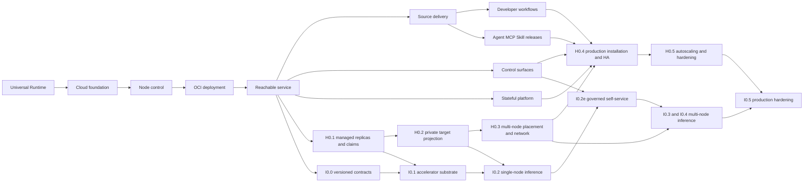

# A3S Cloud Product Roadmap

## 1. Scope and document hierarchy

**Status as of 2026-07-27.**

This is the product-level roadmap for A3S Cloud. It summarizes the complete
Cloud portfolio, current gate status, dependencies, delivery order, and the
boundary with A3S Gateway. It does not replace the detailed implementation
plans.

| Document | Authority |
| --- | --- |
| This `ROADMAP.md` | Product outcomes, portfolio ordering, public gate status, and cross-product ownership |
| [Cloud development plan](docs/development-plan.md) | Detailed implementation sequence, exit criteria, provider evidence, recovery gates, and definition of done |
| [Inference plan](docs/inference-plan.md) | Detailed `I0` domain, protocol, scheduling, Gateway, usage, and conformance contracts |
| [Gateway roadmap](https://github.com/A3S-Lab/Gateway/blob/main/ROADMAP.md) | Gateway-local current capability truth and implementation backlog |

The documents must change together when a product gate changes state. The
owning detailed plan decides whether its exit evidence is sufficient to mark a
gate verified; this roadmap then publishes that state without weakening or
reinterpreting the gate.

The roadmap is gate-driven, not date-driven:

| State | Meaning |
| --- | --- |
| Verified | The complete real-provider, failure, recovery, cleanup, and release evidence passes |
| In progress | A usable implementation slice exists, but named exit evidence remains |
| Planned | The capability is unavailable until its owning gate passes |

## 2. Product position

**A3S Cloud is the self-hosted control plane for applications, Agents, MCP
services, and model-serving workloads on operator-owned infrastructure.**

Cloud turns tenant-owned intent into durable, observable infrastructure state.
PostgreSQL is authoritative for desired state, A3S Flow coordinates long-lived
operations, node agents converge A3S Runtime resources, and A3S Gateway applies
the complete traffic policy produced by Cloud.

Cloud owns:

- organizations, projects, environments, identity, membership, and grants;
- immutable application, Agent, MCP, Skill, model, and provider revisions;
- Workloads, desired replica count, placement, rollout, and the sole
  production autoscaling evaluator;
- source resolution, isolated builds, artifact publication, and release
  provenance;
- domains, TLS intent, logical Gateway scopes, complete traffic snapshots, and
  exact applied-state projection;
- databases, volumes, fencing, backup, restore, and retention after `S0`;
- durable operations, audit, logs, usage ledgers, API, CLI, management MCP, and
  web surfaces; and
- installation, upgrades, high availability, disaster recovery, and
  operational policy after `H0`.

Cloud does not own:

- per-request proxying, protocol framing, or provider-byte forwarding;
- a second workload engine outside the common Workloads and Runtime path;
- Kubernetes as an alternative Cloud scheduler;
- raw provider configuration formats at the product boundary;
- a built-in mail server or a separate native-desktop feature set; or
- commercial prices, balances, invoices, settlement, and managed-service
  plans.

All Cloud product configuration uses closed, validated A3S ACL and is parsed
and generated through `a3s-acl`.

## 3. Current roadmap

| Gate | Product outcome | State |
| --- | --- | --- |
| `R0` — Universal Runtime | General Task and Service contracts, durable identity, capability matching, and real Docker conformance | Verified |
| `F0` — Foundation | Boot control plane, PostgreSQL, tenancy, identity, Flow operations, outbox, projections, API, and web shell | Verified |
| `N0` — Node control | Enrollment, outbound mTLS, command leases, observations, durable command journal, and Docker driver | Verified |
| `D0` — OCI deployment | Immutable digest-pinned Workload revisions, scheduling, apply, health, activation, stop, cancellation, and recovery | Verified |
| `E0` — Reachable service | Managed TLS, complete Gateway snapshots, encrypted Secrets, durable ordered logs, immutable update, cloned rollback, web operations, and a clean-host release loop | Verified |
| `G0` — External source delivery | Pinned Git sources, isolated builds, OCI validation/publication, provenance, and deployment through the common Workload path | In progress |
| `P0` — Developer workflows | Build detection, web/worker/scheduled profiles, previews, monorepos, and closed Compose import | Planned |
| `C0` — Control surfaces | REST/CLI/management MCP parity, grants, search, collaboration, notifications, audit, and bounded exec/terminal | In progress |
| `A0` — Release catalog | Agent and MCP releases plus Skill publication through the common source, artifact, and deployment paths | Planned |
| `S0` — Stateful platform | Databases, volumes, fencing, backup, restore, retention, and stateful import mappings | Planned |
| `H0` — Production scale | Durable replicas, multi-node placement, private networking, Gateway replication, control-plane HA, and measured autoscaling | In progress |
| `I0` — Inference profile | Accelerator-backed model serving, OpenAI-compatible traffic, scoped keys, routing/fallback, Providers, durable usage, and governed self-service | Planned |

### 3.1 Verified baseline

`R0` through `E0` form one cumulative verified release:

```text
general Runtime
  -> durable Cloud desired state
  -> outbound node control
  -> digest-pinned deployment
  -> managed HTTPS, logs, update, rollback, and clean-host recovery
```

Later work must reuse this path. A new interface, asset type, import format,
accelerator, replica policy, or provider never creates a second deployment or
reconciliation engine.

### 3.2 Current in-progress gates

`G0` currently includes:

- canonical GitHub identities, repository policy, immutable source revisions,
  and versioned build recipes;
- signed replay-safe GitHub ingress, tenant-owned App connections,
  subscriptions, lifecycle reconciliation, and short-lived private access;
- exact-commit checkout, deterministic initial BuildRuns, retry-as-new-attempt
  lineage, cancellation, log streaming, and web controls;
- command-bound Artifact transport and isolated `cloud.build@3` Runtime Tasks;
- content-addressed BuildKit cache validation, parent-bound retry reuse, and
  worker-pruned real cache-hit evidence;
- complete OCI graph validation, deterministic registry targets,
  authenticated digest-only publication, remote verification, replay adoption,
  cleanup, and explicit deployment handoff to `cloud.deployment@3`; and
- deterministic SPDX 2.3 and SLSA provenance, locally verified Ed25519 DSSE
  signing through persistent local or Vault Transit providers, durable
  evidence restoration, and tenant-scoped API/web inspection and download; and
- a manual external-provider gate for a private GitHub repository, HTTPS OCI
  Registry, Vault Transit Ed25519 signing, PostgreSQL 17, rootless BuildKit,
  exact remote replay, and two real `SIGKILL` recovery boundaries.

The gate implementation and a local real-provider rehearsal pass, but `G0`
remains in progress because no operator-owned external run is recorded. The
repository currently has no configured G0 provider secrets.

`C0` now includes the initial `C0.1` automation slices:

- one maintained TypeScript client is shared by the web console and CLI;
- the client validates success and error envelopes, preserves bounded error
  metadata, applies request timeouts, and maps malformed or failed transport to
  stable non-secret errors;
- the CLI accepts authentication only through `A3S_CLOUD_TOKEN`, resolves URL
  and tenant context from flags or environment without a credential file, and
  emits bounded table or stable JSON output;
- organization, project, environment, node, and operation queries use the same
  public REST paths and tenant guards as the web console; and
- workload, deployment, route, BuildRun, signed-evidence, and bounded paged-log
  queries extend that same transport without reading PostgreSQL or contacting a
  node directly; and
- workload stop/rollback plus deployment and BuildRun cancel/retry commands
  require a caller-owned validated `Idempotency-Key`, surface replay state, and
  call the existing application commands without a hidden confirmation path;
  and
- Workload create/update and SourceRevision deployment accept bounded A3S ACL
  through the same public REST paths. Cloud parses the exact document with
  `a3s-acl`, rejects unknown version-1 fields, and preserves JSON-client
  idempotency semantics; and
- Organization, Project, and Environment creation plus node ready/drain/revoke
  use the existing scoped REST and application commands. Every call has a
  caller-owned idempotency key, and node transitions also require the current
  aggregate version; and
- public administrative diagnostics read platform, liveness, and readiness
  through the shared client without sending a bearer token. A health endpoint's
  wrapped `503` down report remains diagnostic data, while an error envelope
  remains a failure; the CLI preserves the report and returns exit code `8`;
  and
- Edge automation lists and mutates DomainClaims, lists and creates logical
  Gateway scopes with one through 100 unique members and explicit rollout
  thresholds, and publishes routes through the existing tenant-guarded
  commands. DomainClaim and Gateway-scope mutations expose durable replay
  state, while route publication preserves request and Gateway-command replay;
  and
- Source automation lists immutable source revisions, inspects GitHub
  connection authority, starts the existing short-lived no-store installation
  flow, resolves branch/tag/commit inputs into pinned revisions, and
  lists/creates/deactivates GitHub repository subscriptions. Replayable
  mutations require caller-owned idempotency keys and expose durable replay
  state; and
- Secret automation lists metadata, inspects version state, creates Secrets,
  adds versions, and revokes versions through the existing public controllers.
  Plaintext enters the CLI only through bounded fatal-UTF-8 standard input,
  never appears in arguments, environment, configuration, output, or errors,
  and never bypasses Cloud encryption or A3S ORM persistence.
- Identity automation lists and reads tenant-scoped API-token metadata, creates
  scoped credentials, and revokes them through the existing public Identity
  controllers. New credentials enter the CLI only through exact 68-byte
  `--token-stdin` input, are cleared from the input buffer, never appear in
  arguments, environment, configuration, output, or errors, and are persisted
  only as digests through the A3S ORM repository; and
- Node bootstrap issues an idempotent, short-lived one-time enrollment
  credential through the existing tenant-guarded Fleet command. The CLI accepts
  the exact credential only through bounded standard input, clears its input
  bytes, projects no credential, and prints a Bash invocation that installs an
  HTTPS release only after an exact SHA-256 check. The target prompts for the
  credential and keeps it out of argv and the pre-provisioned A3S ACL config;
  Cloud persists only its digest through the Fleet A3S ORM repository.
- Organization-scoped authorized search registers credential-free Project,
  Environment, Node, Workload, Deployment, Route, DomainClaim, Gateway-scope,
  BuildRun, SourceRevision, Secret-metadata, and Operation projections. The API
  applies the tenant guard before a bounded A3S ORM query, while the shared
  client, CLI, and Web console use the same endpoint without broad local reads.
  Web adds debounced keyboard search and validated contextual navigation; and
- REST major version 1 publishes one unauthenticated raw OpenAPI 3.0.3 snapshot
  at `/api/v1/openapi.json`. The shared client and response headers pin contract
  `1.0.0`; route-snapshot tests and a PR-base semantic checker reject removed
  operations, new required inputs, removed responses or schema fields, missing
  version increments, and deprecations without a replacement and a 180-day
  minimum sunset window; and
- the real `C0.1` conformance gate runs raw REST, the exact shared client import
  used by Web, and the compiled CLI against one control-plane process and
  PostgreSQL 17. It proves cross-surface idempotency replay, stable conflicts,
  authorized-search parity, tenant denial, immediate token revocation, expected
  token-digest persistence through A3S ORM, and zero plaintext credentials in
  API/CLI evidence or the PostgreSQL dump.

`C0.1` is verified. `C0` remains in progress. `C0.2` now provides stateless
scoped management MCP for core Project, Environment, and authorized search
commands and queries plus Node, Operation, Workload, Deployment, Route, and
BuildRun reads. A dedicated real PostgreSQL gate proves scope-derived catalogs,
strict bounds, operational query dispatch, hidden mutation denial, REST-to-MCP
idempotency replay, foreign-resource non-disclosure, immediate revocation, and
digest-only A3S ORM persistence. Selected log, evidence, and replay-safe
mutation tools remain. Grant-derived search is a separate `C0.3` authorization
outcome; the current search boundary is the organization tenant guard.

## 4. Delivery horizons and dependencies

| Horizon | Required gates | Product outcome |
| --- | --- | --- |
| Usable service platform | `R0` through `E0` | One operator can deploy, reach, observe, update, roll back, and stop one stateless Service on one Linux node |
| Developer platform | `G0`, `P0`, `C0`, and `A0` | Source-to-release workflows, previews, stable automation, team operations, and A3S assets reuse the verified deployment path |
| Stateful production platform | `S0` and `H0` | Stateful resources, multi-node placement, HA, measured scaling, backup, and disaster recovery are production-operable |

Inference is an optional profile across these horizons, not a fourth deployment
engine or delivery horizon. It may begin after `E0` and becomes production-ready
only after its named `H0` and `C0` foundations pass.


```mermaid
flowchart LR
    R0[Universal Runtime] --> F0[Cloud foundation]
    F0 --> N0[Node control]
    N0 --> D0[OCI deployment]
    D0 --> E0[Reachable service]
    E0 --> G0[Source delivery]
    G0 --> P0[Developer workflows]
    G0 --> A0[Agent MCP Skill releases]
    E0 --> C0[Control surfaces]
    E0 --> S0[Stateful platform]
    E0 --> H01[H0.1 managed replicas and claims]
    H01 --> H02[H0.2 private target projection]
    H02 --> H03[H0.3 multi-node placement and network]
    P0 --> H04[H0.4 production installation and HA]
    C0 --> H04
    A0 --> H04
    S0 --> H04
    H03 --> H04
    H04 --> H05[H0.5 autoscaling and hardening]
    E0 --> I00[I0.0 versioned contracts]
    H01 --> I01[I0.1 accelerator substrate]
    I00 --> I01
    I01 --> I02[I0.2 single-node inference]
    H02 --> I02
    C0 --> I02E[I0.2e governed self-service]
    I02 --> I02E
    H03 --> I034[I0.3 and I0.4 multi-node inference]
    I02E --> I034
    H05 --> I05[I0.5 production hardening]
    I034 --> I05
```

Dependency rules:

- `G0`, `C0`, and `S0` may advance independently from the verified `E0`
  baseline.
- `P0` depends on the immutable source and build contracts from `G0`.
- `A0` reuses `G0` source, Artifact, publication, and deployment contracts.
- `H0.1` through `H0.3` may first be proven by an owning profile, but the full
  `H0` product gate also requires the single-node `P0`, `C0`, `A0`, and `S0`
  surfaces it must scale.
- `I0` is an optional product profile, not another deployment engine. It
  consumes Workloads, Fleet, Edge, Identity, Artifacts, Secrets, Operations,
  and the named `H0`/`C0` foundations.

## 5. Product delivery lanes

### 5.1 `G0`: external source delivery

Next outcome:

1. configure the bounded private GitHub, HTTPS Registry, and Vault Transit
   credentials required by the implemented manual workflow;
2. dispatch both external-provider jobs from the exact release candidate and
   retain their revision-bound evidence;
3. verify the recorded run proves both `SIGKILL` boundaries, one publication,
   one evidence document, and authoritative Runtime cleanup; and
4. promote `G0` only after the complete source-to-published-Workload evidence
   remains green with those operator-owned providers.

`G0` is complete only when an exact source revision produces a verifiable,
signed, digest-addressed OCI graph, survives retry/cancellation/process death,
deploys through the existing Workload path, and leaves no untracked provider
resource or credential.

### 5.2 `P0`: developer workflows

Ordered delivery:

1. Dockerfile and A3S build-plan detection;
2. explicit web, worker, and scheduled Task/Service profiles;
3. pull-request previews with bounded lifetime and cleanup;
4. monorepo affected-set planning; and
5. closed stateless Compose import, followed by `S0`-backed stateful mappings.

Detection produces a reviewable proposal. Accepted build, route, storage, and
deployment plans become explicit typed Cloud desired state; an external project
format never becomes a second mutable source of truth.

### 5.3 `C0`: control surfaces and team operations

| Sub-gate | State | Outcome |
| --- | --- | --- |
| `C0.1` | Verified | REST/CLI parity, stable errors, authorized search, and automation contracts |
| `C0.2` | In progress | Scoped management MCP and real PostgreSQL parity over the same commands and queries |
| `C0.3` | Planned | Memberships, grants, role-focused console, attribution, notifications, and audit |
| `C0.4` | Planned | Outbound-protocol exec and terminal with bounded sessions and full audit |

No presentation surface owns business rules or bypasses tenant guards,
idempotency, operations, or audit.

The verified `C0.1` slices establish the shared typed transport,
non-persistent environment/flag context, safe output and exit-code contracts,
read-only tenant commands, then add workload, deployment, route, BuildRun,
signed-evidence, and bounded paged-log queries. The
operational mutation slice adds explicit idempotent stop, rollback, cancel, and
retry commands, while the desired-state slice adds Cloud-admitted A3S ACL for
Workload create/update and SourceRevision deployment. The core-resource slice
adds Organization, Project, and Environment creation plus version-checked node
lifecycle transitions. The diagnostics slice adds tokenless platform and
health inspection with a stable unhealthy exit contract. The Edge slice adds
DomainClaim query/create/verify/revoke, logical Gateway-scope query/create, and
route publication with explicit idempotency and replay projections. The Source
slice adds GitHub connection inspection/bootstrap, immutable revision
list/resolve, and repository-subscription list/create/deactivate. The Secret
slice adds metadata list/get and idempotent create/add-version/revoke-version
without exposing plaintext outside the request body. The Identity slice adds
API-token metadata list/get and idempotent stdin-only create/revoke without
exposing credentials or bypassing digest-only A3S ORM persistence. The node
bootstrap slice adds stdin-only one-time enrollment issuance plus a
checksum-verified Agent installation invocation without adding an SSH path or
bypassing Fleet A3S ORM persistence. The authorized-search slice adds one
organization-scoped API query over registered credential-free projections,
bounded A3S ORM exact/prefix/contains ranking, typed client and CLI parity, and
debounced Web navigation without broad local reads. The contract slice adds a
public raw OpenAPI v1 snapshot, shared `1.0.0` client/response versioning,
route-snapshot synchronization, semantic compatibility enforcement, and a
minimum 180-day replacement-bound deprecation policy. The final conformance
slice runs raw REST, the Web client import, and compiled CLI against real
PostgreSQL, proves replay and authorization consistency, and rejects plaintext
credentials across responses, logs, and persisted data. `C0.2` adds raw
stateless Streamable HTTP JSON-RPC, current-token scope-derived tool discovery,
organization context derived only from the authenticated principal, three core
queries, two idempotent create commands, and ten operational Node, Operation,
Workload, Deployment, Route, and BuildRun queries through the existing
application buses. It rejects batches, foreign origins, hidden-tool invocation,
forged organization input, invalid query bounds, and revoked tokens without
adding business rules or a persistence path to the presentation surface. Its
dedicated real PostgreSQL gate proves exact administrator/read-only catalogs,
hidden-mutation zero-write, REST-to-MCP replay through one durable idempotency
record, indistinguishable foreign and missing Project errors, operational list
and detail semantics, next-request revocation, expected A3S ORM rows, and
credential-free logs, evidence, and database dumps. Selected log, evidence,
and replay-safe mutation tools remain before `C0.2` verification.

### 5.4 `A0`: Agent, MCP, and Skill releases

Ordered delivery:

1. repository and manifest safety;
2. immutable Agent and MCP releases;
3. deployment through the common Workload path;
4. immutable Skill bundle publication and binding; and
5. release provenance, rollback, and catalog operations.

Agent and MCP are asset and workload profiles, not separate schedulers.

### 5.5 `S0`: stateful platform

Ordered delivery:

1. fenced local volumes;
2. explicit PostgreSQL resources;
3. backup, restore, retention, and disaster evidence;
4. additional database engines and remote volume providers through
   conformance; and
5. stateful project-import mappings.

A stateful move cannot proceed until the prior writer is fenced. A backup is
not a product capability until restore passes against a clean environment.

### 5.6 `H0`: production scale

| Sub-gate | State | Foundation | Required evidence |
| --- | --- | --- | --- |
| `H0.1` | Verified | Managed-owner references, durable replica identity, effective placement policy, versioned Fleet inventory, generic hard-resource claims, and fencing | Concurrent create/reconcile/replay produces one provider unit for one replica generation and never reuses an unfenced claim |
| `H0.2` | Verified | Logical Gateway scopes, complete target sets, generation-bound private endpoints, exact snapshot acknowledgement, and rollback | Only healthy exact-generation targets become eligible; restart and rejected apply preserve the prior route |
| `H0.3` | Planned | Multi-node replica sets, placement groups, gang claims, drain, anti-affinity, cluster-private networking, and independently placed Gateways | Real-node scale, drain, partition, stale-node return, and partial preparation converge without duplicate units, claims, members, or targets |
| `H0.4` | Planned | Production installation/upgrade plus HA API, workers, relay, Gateway, migrations, and dependencies | Install, upgrade, loss, leadership fencing, migration, rollback, and Gateway readiness gates pass |
| `H0.5` | Planned | Sole Workloads autoscaling controller, quotas, telemetry bounds, load limits, backup/restore, and operational hardening | Stale, missing, duplicate, and bursty metrics stay safe without another scaling path; failover and restore meet published limits |

Kubernetes or Helm may package Cloud, but Workloads remains the only workload
scheduler and Cloud product configuration remains ACL.

The current `H0.1` foundation persists inference-neutral managed-owner
references, one effective single-replica placement policy, one stable
replica/member, and one exact deployment-to-Runtime binding for every existing
Workload. Migration 040 backfills legacy Workloads without changing their
Runtime unit identity. Workload list/detail responses expose owner, policy,
replica generation, member, node, and placement generation.

Migration 041 and the independent Resource Claim repository add canonical hard
resource slots, monotonic slot generations, unguessable fence tokens, and the
durable `reserved_in_db -> preparing_on_agent -> prepared_on_agent ->
bound_to_runtime_unit -> releasing -> released` lifecycle with an
operator-visible `orphaned` branch. Orphaning and timeout retain the active
lease. Only exact Agent release, provider NotFound, or trusted compute fencing
can release it. CPU, memory, and ephemeral-storage slots use shared scalar
capacity accounting, while accelerator, host-port, and volume slots remain
exclusive. Migration 043 narrows active-slot uniqueness to those exclusive
kinds. Each PostgreSQL reservation serializes the stable slot, totals active
allocations, rejects over-capacity requests, and advances the slot generation
and fence token.

Migration 044 extends the durable Fleet command queue with
`resource_claim_prepare` and `resource_claim_release`. The node agent journals
the exact Claim generation, digest, current inventory identity, Runtime
unit/generation, sorted slots, and per-slot fencing evidence before
acknowledgement. A resource-bound Runtime apply must match that prepared
binding, and its observation must carry the exact Claim ID and binding digest
before Cloud persists `bound_to_runtime_unit`. A bound Claim cannot release
until the same Agent journal has durable Runtime stopped-or-absent evidence;
the release command advances the Claim generation and digest and returns exact
slot evidence.

The schema-backed claim CRUD and aggregate JOIN use A3S ORM typed builders. The
full Workloads repository and its shared idempotency/outbox writes use typed
builders for every query and mutation, including PostgreSQL advisory and row
locks, `SKIP LOCKED`, and parameterized JSONPath Secret-binding predicates. An
architecture test rejects raw SQL and direct drivers anywhere in Workloads
production persistence. In-memory and PostgreSQL 17 gates prove exact replay,
competing exclusive and shared reservations, over-capacity rejection, orphan
blocking, safe release, and generation/token rotation after fencing.

Migration 042 adds strict, immutable Fleet inventory snapshots, normalized
slots, and one current generation/digest head per enrolled node. The node agent
persists its canonical inventory across restart, advances generation only for
changed slot content, reports detected CPU and state-filesystem capacity plus
Linux memory when available, and omits resources it cannot prove. The
authenticated inventory endpoint accepts exact and historical replay without
regressing the current head, requires exact next-generation content changes,
and rejects identity conflicts. New v2 heartbeats must reference the current
inventory while legacy v1 batches remain readable during migration. The
PostgreSQL adapter uses only typed A3S ORM tables and builders, and the real
PostgreSQL 17 gate verifies concurrent replay, recovery, head monotonicity, and
stale-heartbeat rejection.

Workloads now compiles CPU, memory, and optional ephemeral-storage requirements
from the current inventory, leaving PID limits Runtime-local. PostgreSQL locks
and verifies the exact Fleet inventory head in the same transaction that
reserves capacity. Deployment Flow reserves before node assignment, derives a
deterministic Claim ID from the Deployment ID, recovers a committed
reservation-before-placement gap, and tries another eligible node after a
typed capacity conflict. Normal cancellation, retirement, and stop paths may
cancel only a never-issued `reserved_in_db` claim; later states retain the
Agent/trusted-fence requirement.

New deployment operations use `cloud.deployment@3`; v1 and v2 remain executable
only for persisted Flow history. Create, update, rollback, source handoff, and
Secret rotation share one version source. The v3 workflow reserves, prepares,
binds, retires, and releases through deterministic commands. Reconciliation
adopts an exact bound Claim, retries failed release with a higher generation and
digest, and preserves allocation ownership when stop evidence is rejected or
ambiguous. Unit and PostgreSQL 17 gates cover Agent journal restart after every
boundary, reservation-before-placement recovery, activation-before-retirement
process death, healthy update stop-before-release ordering, and Secret-rotation
replay.

The isolated real-provider gate now closes the `H0.1` process boundary. It
persists prepare in the real Agent journal, pauses a bound apply after Docker
creates one provider unit but before acknowledgement, replaces the provider
process, kills the Agent process, and reconstructs both Runtime and command
journals. Exact replay must reattach the same sole container and carry the
matching Claim ID and binding digest. Release and a capacity-conflicting Claim
must remain rejected until real Runtime stop/removal and the exact
higher-generation Agent release; only then may the competing Claim prepare.
The provider gate requires one stable pass marker and zero provider or Artifact
residue. `H0.1` is a closed exact-SHA acceptance gate; `H0.3` is the next open
production-scale foundation after the verified `H0.2` Gateway projection gate.
The closing evidence is Cloud commit
`5cd7c4eebc21905cb2758856d0e96b31a111116c` in
[Docker provider conformance run 30157496417](https://github.com/A3S-Lab/Cloud/actions/runs/30157496417);
both the real-provider and Cloud-consumer jobs passed.

The verified `H0.2` foundation includes Cloud-owned logical Gateway scopes. Each
scope belongs to one organization, project, and environment and now stores an
ordered desired member set, a membership generation, and explicit `min_ready`
and `max_unavailable` policy. Environment-scoped create/list APIs persist the
resource idempotently and retain the legacy single-`nodeId` request. A
Cloud-owned planner now resolves every desired member through its exact active
or retiring Deployment, replica binding, Runtime command, generation, and fresh
healthy node-local endpoint. It rejects partial, ambiguous, mixed-revision, and
mixed-port target sets and compiles an independent complete snapshot,
certificate, command, and staged Route projection for every member.
Single-member publication retains the established path. Replicated publication
atomically commits the logical Route, every physical projection, rollout,
publication, certificate, ownership record, idempotency result, and outbox fact.
A conflict rolls back the complete bundle, preventing a bootstrap-primary or
partially addressable apply.

Cloud persists each private route target as an exact immutable revision,
deterministic Runtime unit, positive generation, declared port, canonical
node-local origin, and command-bound healthy observation. Revision, unit, and
generation enter the complete ACL digest. A cutover requires a different
revision and strictly newer generation; rejection retains the prior target,
while the exact applied acknowledgement atomically selects the candidate.
PostgreSQL migration 036 splits legacy shared nodes deterministically by
environment/node binding, backfills Route and serialized recovery documents,
and enforces the complete tenancy/node relationship across restart.

The node agent uses Gateway's native apply and exact-status APIs, Gateway's
journal remains the sole applied-state authority, and unchanged snapshots renew
inside a bounded pre-expiry window without replacing their ACL digest or active
certificate before acknowledgement. A real pinned-Gateway fixture also rotates
independently signed certificates and target origins, rejects the superseded
certificate and selector, and recovers only the replacement after restart.
Before mutation, the agent now selects an explicitly advertised
`a3s.gateway.management-protocol.v1` tuple or the closed legacy-v1 baseline.
Unknown and inconsistent descriptors fail closed. Gateway ack v4 and command
ack v2 persist the selected protocol, while the control plane reads legacy
v3/v1 acknowledgements and migration 037 leaves their unavailable evidence
null. Migrations 038 and 039 add backward-compatible scope membership and a
durable per-member `GatewayRollout` aggregate. Every physical member owns an
independent revision, command, digest, expiry, certificate, and result. Meeting
the configured threshold makes a rollout ready, exact success from every
member makes it succeeded, and a fully observed mixed result becomes degraded.
The worker-role rollout reconciler restores the complete active aggregate and
its publications through typed A3S ORM, idempotently redispatches pending Fleet
commands after restart, and projects exact command-deadline expiry as
unavailable. The complete Edge PostgreSQL repository uses typed A3S ORM tables,
queries, expressions, row locks, and table locks for logical scopes,
publications, routes, cutovers, acknowledgements, DomainClaims, certificates,
convergence, and rollouts. A source architecture test rejects raw SQL and direct
database drivers throughout Edge production persistence. Domain, in-memory,
migration, recreated-PostgreSQL 17, and durable Fleet queue tests cover this
foundation, including route cutover and certificate-convergence recovery.

Migration 045 adds the logical-to-physical Route projections and atomic rollout
ownership model. Migration 046 adds read-only Gateway observation commands;
migration 047 persists per-member physical-state recovery; migration 048 adds
deterministic exact rollback; and migration 049 makes expired certificate
convergence explicitly unavailable without disturbing the prior applied state.
A logical Route activates only when the exact applied projections meet its
threshold. A terminal rollout below threshold keeps the prior active Route,
records rejected or unavailable candidate state, observes ambiguous members,
and stages one higher-revision rollback to the exact known physical state.
Rollback reuses only still-valid Ready certificates and remains visibly blocked
when any compensation is rejected or unavailable. Domain revocation and
certificate replacement release physical ownership member by member only after
the matching acknowledgement.

The cross-repository gate builds Gateway commit
`7a146b6d53635861e5db4870fb4603a5c59c87ee`. Real Gateway processes prove
complete snapshot reload, independent certificate and target replacement, two
member-specific journals and trust roots, continued service after one member is
lost, exact native-journal recovery when it returns, independent Cloud cursors,
and Agent process death after native apply but before acknowledgement. Together
with the recreated PostgreSQL 17 gate, this closes `H0.2`. Independently placed
multi-node Gateways remain `H0.3`; production control-plane and Gateway HA remain
`H0.4`.

### 5.7 `I0`: inference profile

| Sub-gate | Outcome | Dependency |
| --- | --- | --- |
| `I0.0` | Versioned accelerator and node contracts with mixed-version safety | Verified `E0` node control |
| `I0.1` | Single-node accelerator inventory, claims, Docker/CDI enforcement, and recovery | `I0.0` + `H0.1` |
| `I0.2a` | Immutable model catalog/cache, typed backend compiler, and one healthy private vLLM Workload | `I0.1` |
| `I0.2b` | OpenAI Models, Chat Completions, Completions, and Embeddings data plane, scoped keys, grants, per-Gateway limits, Redis-backed globally exact limits, streaming, and fallback | `H0.2` + `I0.2a` |
| `I0.2c` | Durable Gateway usage spool, Cloud ledger, observability, model rollout, and rollback | `I0.2b` |
| `I0.2d` | Credential-isolated external OpenAI-compatible Provider targets | `I0.2b` + `I0.2c` |
| `I0.2e` | Grant-derived model/key self-service, diagnostics, playground, search, and usage showback | `C0.3` + `I0.2d` |
| `I0.3` | Multi-node independent serving replicas and failover | `I0.2e` + `H0.3` |
| `I0.4` | One typed Ray/vLLM distributed replica across multiple nodes | `I0.3` + `H0.3` placement-group and private-network gates |
| `I0.5` | Gateway/control-plane HA, autoscaling, quota, disaster recovery, provider breadth, and load hardening | `I0.4` + `H0.4` + `H0.5` |

The first provider combination is NVIDIA, Docker, and vLLM. Power, hardware
partitions, additional accelerator vendors, named external Providers, and
additional APIs remain unavailable until their real conformance gates pass.

## 6. Near-term execution order

The default portfolio priority is:

1. preserve the verified `E0` release and its clean-host regression gate;
2. execute and retain the remaining operator-owned `G0` certification through
   the implemented private-provider and signed-evidence process-death gates;
3. advance `C0.2` and the first `S0` foundation independently when staffed;
4. preserve the closed `H0.1` real-provider Claim certification while beginning
   `I0.0`, then follow the ordered inference slices without bypassing their
   generic platform dependencies;
5. start `P0` and `A0` only on the verified `G0` contracts they consume;
6. preserve the verified `H0.2` projection gate while advancing `H0.3`
   multi-node placement and networking; and
7. close full production packaging, HA, autoscaling, and inference hardening
   through `H0.4`, `H0.5`, and `I0.5`.

This order expresses dependency and product risk, not equal staffing or a
calendar promise. The next implementation is the smallest vertical slice that
can pass a real exit gate.

## 7. A3S Gateway relationship

Gateway coordination is one part of the Cloud roadmap, not a replacement for
the Cloud product lanes above.

### 7.1 Product boundary

| Product | Position | Owns |
| --- | --- | --- |
| A3S Cloud | Self-hosted control plane | Tenancy, identity, catalogs, Workloads, desired replicas, placement, rollout, autoscaling, complete Gateway policy, operations, usage ledger, and management surfaces |
| A3S Gateway | AI traffic and protocol data plane | Transport, TLS, streaming, local enforcement, healthy endpoint selection, atomic snapshot application, request-path telemetry, and the planned durable usage spool |

Cloud never becomes the per-request proxy or synchronous authorization
dependency. Gateway never becomes a tenant database, scheduler, production
rollout controller, production autoscaling authority, or long-term usage
ledger.

### 7.2 Gateway operating modes

| Concern | Standalone Gateway | Cloud-managed Gateway |
| --- | --- | --- |
| Desired-state authority | Operator-owned local ACL | Cloud PostgreSQL desired state |
| Traffic configuration | Local startup/watch/provider policy | Complete versioned ACL snapshot delivered through the node agent |
| Target lifecycle | External operator or orchestrator | Cloud Workloads and Edge |
| Rollout and autoscaling | Standalone experiments remain explicitly non-production until proven | Cloud is the only authority |
| Durable business state | None | Cloud |

A minimal managed bootstrap ACL may bind process, management listener,
identity, and Cloud-delivery settings. It cannot define or mutate managed
routes, target sets, rollout, or scaling policy.

### 7.3 Managed runtime contract

```text
Cloud commits desired state
  -> Cloud compiles one complete Gateway-scope ACL snapshot
  -> outbound node agent delivers identity, revision, digest, and validity
  -> Gateway natively applies, journals, and reports exact readiness
  -> node agent records the exact ready-applied or rejected result
  -> Cloud advances only after the matching acknowledgement
```

Gateway may temporarily suppress an unhealthy endpoint, open a circuit, or
drain a connection under the applied policy. It may never invent a target,
change desired weights, create a replica, or promote a revision.

The Cloud API, PostgreSQL, and workers stay off the request path. Authorization
and route snapshots are complete, bounded, and expiring; policy that requires
an unavailable or expired security snapshot fails closed. Retry and fallback
are allowed only before the first response byte.

### 7.4 Coordinated gates

| Gate | Cloud work | Gateway work | Joint result |
| --- | --- | --- | --- |
| `E0` | Edge desired state, managed TLS, complete snapshots, and exact acknowledgement | Native snapshot apply, HTTPS, routing, health, durable recovery, and prior-revision preservation | Verified clean-host A-to-B-to-cloned-A route and recovery evidence remains the regression baseline |
| `H0.2` | Logical Gateway scopes, ordered membership, exact target derivation, atomic Route-and-rollout staging, threshold activation, per-member recovery, certificate convergence, and exact rollback | Explicit managed mode, advertised management-protocol tuple, native exact apply/readiness, same-digest renewal, durable journal, read-only observation, and rejection of local control loops | Verified against Gateway `7a146b6`: two real members converge independently, preserve service through member loss, recover from native journals, reject cross-member trust, and replay apply-before-ack without duplicate mutation; PostgreSQL 17 proves atomic staging, threshold projection, failure retention, recovery, rollback, and typed A3S ORM persistence |
| `I0.2b` | Inference routes, keys, grants, typed local/global limits, and dispatch snapshots | Native OpenAI body-aware dispatch, cached enforcement, Redis-backed globally exact counters, streaming, and pre-first-byte fallback | Real SDK, denial, revocation, local and shared-counter enforcement, framing, disconnect, and acknowledgement gates pass |
| `I0.2c` | Usage ingestion, gaps, immutable ledger, rollups, and rollout authority | Durable ordered request/attempt spool, replay, backpressure, and weight execution | Every started request becomes terminal or visibly unknown after crash and replay |
| `I0.2d` | Same-environment credential-isolated Provider egress Workload | Route only to the internal egress target | Client and provider credentials never cross or enter traffic snapshots |
| `C0.3` + `I0.2e` | Grants, authorized search, key lifecycle, role-focused console, diagnostics, playground, and showback | Expose bounded operational state only | Consumer, steward, and operator surfaces cannot reveal an ungranted resource |
| `A0` + `C0` | Agent/MCP catalog, deployment, identity, and management contracts | Add a native protocol data plane only against a closed session and authorization contract | No second asset, identity, or deployment model appears in Gateway |
| `H0.3` through `I0.5` | Multi-node placement, Gateway HA, sole autoscaler, quotas, recovery, and provider policy | Private upstream identity, drain, exact-revision readiness, complete signals, and failure hardening | Node/Gateway loss, mixed versions, scale, backlog, and restore meet published limits |

No joint gate is complete because one repository passes unit tests alone.
Compatible Cloud and Gateway revisions must pass the real cross-repository
protocol and recovery gate.

## 8. Definition of done

A product gate is complete only when:

- its domain invariants, commands, queries, persistence, provider adapters,
  transport contracts, web, and applicable CLI/MCP surfaces land together;
- every mutation has tenant scope, idempotency, audit, timeout, cancellation,
  retry, cleanup, and documented error semantics;
- real-provider happy path, failure, process-death, replay, corruption, and
  cleanup gates pass from a clean environment;
- Secret handling, authorization, revocation, SSRF, path/URL validation, and
  cross-tenant fixtures pass;
- upgrades, mixed versions, rollback, backup/restore, observability, and
  runbooks pass where the gate requires them;
- README, this roadmap, the owning detailed plan, API documentation, examples,
  and current-evidence tables describe the same verified behavior; and
- unsupported or unverified capability fails explicitly instead of degrading
  silently.

See the [development plan](docs/development-plan.md) and
[inference plan](docs/inference-plan.md) for complete per-gate evidence.

## 9. Product non-goals

The current roadmap does not include:

- a second deployment or scheduling path for imports, Agents, MCP, stateful
  resources, or inference;
- Cloud on the live request or token-stream path;
- a Cloud-equivalent control plane inside Gateway;
- training, fine-tuning, or notebook lifecycle inside `I0`;
- GPU host creation or SSH credential custody inside Inference;
- Kubernetes as an alternative Workloads scheduler;
- plaintext credentials in ACL, desired state, operations, logs, or events;
- a built-in mail server or divergent native desktop feature set; or
- commercial billing inside the Cloud core.

New capabilities enter the roadmap only after they have one owning context,
one dependency path, a closed contract, and real failure, recovery, and cleanup
evidence.
