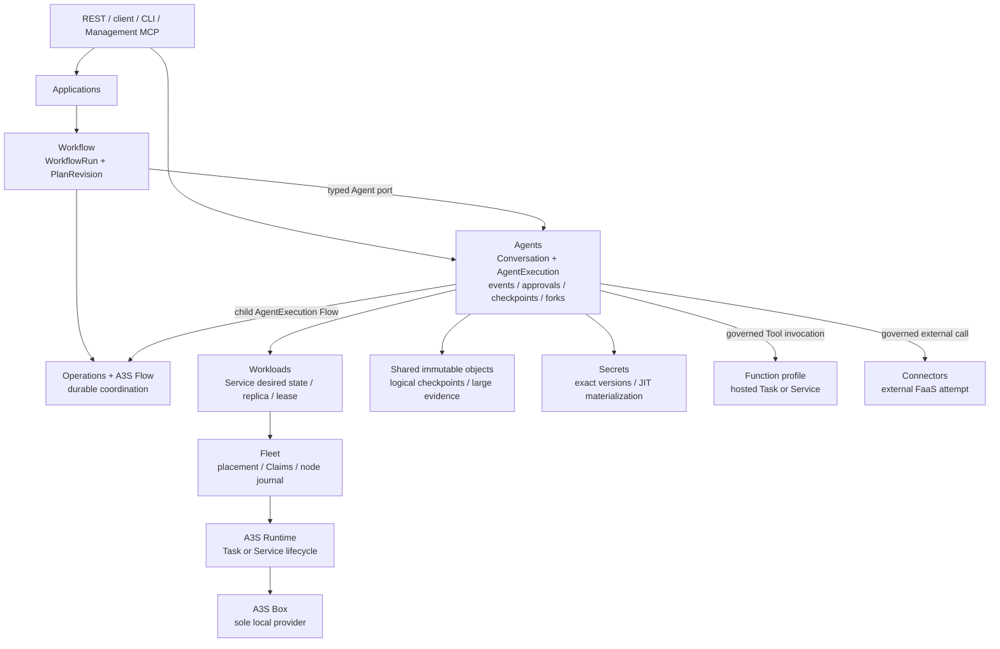
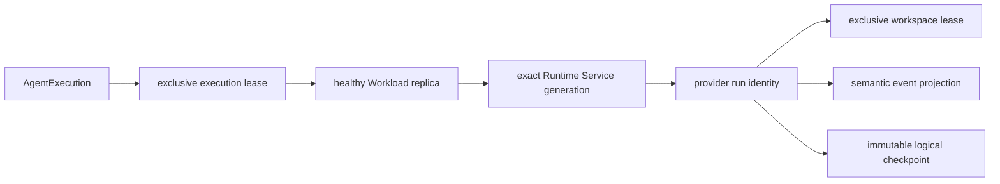

# A3S Cloud Agent Runtime Architecture

## 1. Authority and delivery status

This document is the canonical Cloud-local design for the Agent Runtime
experience. It applies first-principles and domain-driven design to the
existing `Agents`, `Workflow`, `Operations`, `Workloads`, `Fleet`,
`Executions`, `Secrets`, `Data`, and `Edge` contexts.

`A1` owns the Agent product semantics. `AR0` is a simplified application
projection over those existing authorities; it is **not** a new bounded
context, aggregate, database table, scheduler, queue, event log, object client,
autoscaler, Runtime unit class, or provider lifecycle.

Current implementation evidence and public availability remain gate-driven in
[ROADMAP.md](../ROADMAP.md). A target boundary in this document does not make
an unfinished gate available.

## 2. First principles

An Agent system has five irreducible concerns:

1. **Semantic truth.** The user must be able to identify one conversation,
   execution, event sequence, approval, checkpoint, fork, and terminal result.
2. **Durable orchestration.** A crash must not lose waits, cancellation,
   recovery, or compensation decisions.
3. **Compute placement.** A process needs an exact admitted artifact, node,
   replica, Runtime generation, endpoint, and writer fence.
4. **Mutable working state.** A coding Agent needs an exclusive workspace, but
   provider-private files cannot become Cloud semantic truth.
5. **External effects.** Model, Tool, MCP, and Function calls require exact
   release bindings, authorization, credentials, egress, deadlines,
   idempotency, and bounded evidence.

These concerns have different consistency and failure boundaries. Combining
them into an `AgentRuntime` aggregate would create a second Workflow engine,
Workload controller, Runtime lifecycle, object store, and credential system.
The design therefore composes one owner for each concern.

## 3. DDD context map



The arrows represent typed application ports or immutable committed facts.
No context writes another context's tables or imports its infrastructure.

### 3.1 Sole authorities

| Concern | Sole authority | Explicit exclusion |
| --- | --- | --- |
| Conversation and semantic events | Agents | Harness source log, Flow history, Runtime logs |
| Agent execution, approval, checkpoint, and fork trajectory | Agents | Workflow step state, provider session state |
| DAG branches, waits, retries, cancellation, compensation | Workflow + A3S Flow | Agent scheduler or provider retry loop |
| User-visible long-running progress | Operations | A second Agent operation table |
| Service desired state, rollout, replicas, leases, scaling | Workloads | Agent-specific deployment controller |
| Node placement, fencing, delivery, receipt replay | Fleet | Harness-to-node side channel |
| Generic process lifecycle | A3S Runtime `Task` / `Service` | `Agent`, `Function`, or `Cell` Runtime class |
| Local process/build/isolation mechanism | A3S Box | Direct product-to-container calls |
| Logical checkpoint bytes | Shared immutable-object client | Agent-specific S3 client |
| Workspace bytes | Selected workspace/volume provider under one lease | PostgreSQL event payload or Durable Cell |
| Credentials | Secrets | Provider profile, ACL, event, log, workspace |
| External Function/HTTP attempt | Function profile or Connectors | Raw provider credentials in the Harness |
| Autoscaling | `H0.5` Workloads autoscaler | Agent Runtime autoscaler |

## 4. Two first-class executions, one orchestration mechanism

A Workflow that contains Agent nodes creates nested ownership, not duplicate
orchestration:

```text
WorkflowRun / outer Flow
  owns graph order, branch, step attempt, timeout, retry and compensation
    -> Agents-owned start_or_adopt port
      -> AgentExecution / child Flow
         owns provider prepare, dispatch, observe, approval, recovery and cancel
           -> exact Workload Service replica and Runtime generation
```

The outer Flow never drives a Harness, interprets provider events, or persists
Agent output as its own semantic log. The child Agent Flow never chooses the
next Workflow node or retries a Workflow step. The parent stores an immutable
child `Operation` reference and resumes only from an Agents-owned terminal
observation.

Direct Agent execution and Workflow Agent nodes enter the same Agents
application commands. A Workflow step adds an immutable parent authority
(`WorkflowRun`, `PlanRevision`, plan digest, step identity, and attempt); it
does not create an alternative Agent lifecycle.

## 5. Unified invocation abstraction

All durable child calls use the same conceptual envelope, followed by one
owner-specific payload:

```text
InvocationAuthority
  tenant: organization / project / environment
  parent: kind / immutable identity / revision digest
  slot: node-or-tool identity / positive attempt
  target: capability / immutable release-or-revision / digest
  input: bounded inline value or immutable object reference / digest
  policy: deadline / idempotency / authorization / egress class
```

This is a value contract, not a universal executor. The target owner still
defines its own port and result:

- Agents validates Agent release, provider capability, conversation, events,
  approvals, checkpoints, and cancellation.
- Executions validates finite Task template, result, cleanup, and cancellation.
- Connectors validates external endpoint revision, dispatch fence, response
  evidence, and attempt outcome.
- Workflow owns retry and compensation policy for a Workflow node.

An abstraction is promoted into shared code only after at least three owners
need the identical invariant. Product-specific payloads, statuses, repository
methods, or provider types never enter the shared kernel.

## 6. Runtime topology for stateful Agents

The preferred deployment for A3S Code and other stateful coding Agents is a
warm, horizontally scalable pool of ordinary Runtime `Service` units:



Each `AgentExecution` is pinned before dispatch to an immutable provider
profile and invocation profile, then to the exact node, Workload,
WorkloadRevision, Deployment, replica, Runtime unit, Runtime generation,
Runtime spec digest, service port, and provider run identity. The binding is
evidence, not another desired-state aggregate.

### 6.1 Why a Service pool

- A coding Harness has warm model/tool clients, a long-running protocol, and a
  mutable workspace whose ownership must be fenced.
- Starting a container for every turn adds latency but does not remove the
  need for durable semantic state or workspace recovery.
- One Runtime Service process may host multiple bounded provider runs only when
  the provider contract proves tenant isolation, quotas, cancellation, and
  cleanup. Otherwise a replica admits one active run.
- New executions may be placed on another healthy replica. An active execution
  never migrates transparently.

A finite Runtime `Task` remains appropriate for a stateless batch Agent that
has no interactive protocol, approval pause, or reusable workspace. It is not
the default for A3S Code.

### 6.2 State classes

| State class | Durable owner | Recovery rule |
| --- | --- | --- |
| Conversation, execution, semantic sequence | Agents in PostgreSQL | Rebuild exactly from the aggregate projection and contiguous events |
| Workflow graph history | A3S Flow | Replay the pinned workflow/runtime version |
| Operation progress | Operations | Reconcile from owner facts; never infer semantic truth from logs |
| Workspace | Workspace/volume provider | One execution lease and monotonic writer fence; old writers fail closed |
| Logical checkpoint | Shared immutable objects + Agents metadata | Verify digest and lineage before resume or fork |
| Provider-private checkpoint | Harness/Box capability | Optional; cannot replace the logical checkpoint or Cloud binding |
| Process output | Runtime logs | Diagnostic only |
| Credentials | Secrets | Materialize JIT for the exact binding; never checkpoint plaintext |

Durable Cell is absent from this table because it is an independent first-class
shared collaboration-state service, not the storage substrate for Agent
conversations, workspaces, checkpoints, memory, or Tool state. An Agent may
use a Cell through an admitted Tool/service contract without transferring
either product's state ownership.

## 7. Failure, recovery, and fencing

| Failure | Required behavior |
| --- | --- |
| Cloud process loss before dispatch | Replay the committed AgentExecution and child Flow; create no duplicate run |
| Lost command acknowledgement | Fleet replays the same generation-bound command and accepts one receipt |
| Harness process death in the same Runtime generation | Adopt or create the deterministic provider recovery successor; preserve the execution and Operation |
| Runtime replica or node loss | Fence the old lease, verify a logical checkpoint, obtain a new exact binding, and issue one recovery command |
| Partition with uncertain old writer | Do not start a second workspace writer; fail closed until fencing evidence is durable |
| Missing or corrupt checkpoint | Terminal failure or explicit restart policy; never silently continue from provider memory |
| Approval while recovery races | Persist one approval decision; recover-before-resume and cancel deterministically |
| Tool/Function outcome unknown | Preserve an indeterminate owner result; Workflow or Agent policy may not guess success |
| Cancellation | Agents owns semantic cancellation; Flow owns durable ordering; Fleet/Runtime owns process cleanup |

Recovery changes the binding only when the failure requires it. Same-generation
provider recovery retains the Runtime binding. Cross-replica or cross-node
recovery creates a new fenced binding and retains predecessor lineage.

## 8. Scaling and rollout

Warm capacity is keyed by tenant/isolation policy, Agent release, provider
profile, security profile, workspace policy, and compatible Runtime revision.
Workloads owns desired replicas and `H0.5` owns autoscaling.

- Horizontal scaling adds or removes capacity for **new** execution leases.
- Scale-in drains a replica, refuses new leases, checkpoints or completes its
  active executions, then removes the Runtime unit through the existing path.
- Vertical scaling creates a new immutable Workload revision and Runtime
  generation. It never mutates an active unit in place.
- Rollout and rollback preserve exact AgentExecution-to-binding lineage.
- A checkpoint-capable execution may recover onto a new admitted replica;
  otherwise the rollout waits or the execution fails according to explicit
  policy.

No Gateway signal, queue depth, or Harness-local metric directly changes
desired state. They are bounded evidence consumed by the sole Workloads
autoscaler.

## 9. Function, Tool, and MCP calls

A Harness never receives an external FaaS provider credential or implements a
provider retry loop. It emits a bounded Tool request bound to its immutable
invocation profile. The AgentExecution Flow then:

1. validates the exact Tool/Function target, approval policy, deadline, input
   digest, and current grant;
2. invokes a hosted Function profile or an external Connector attempt through
   the owning application port;
3. stores large request/result content once in shared immutable objects;
4. records digest-only semantic and audit evidence; and
5. resumes the same provider run with one exact result or terminal failure.

Hosted and external Function deployment is defined in
[Function Runtime Architecture](function-runtime-architecture.md). Sessionless
MCP services may use its stateless Service profile, but MCP protocol admission
and Gateway enforcement remain MCP/Edge responsibilities.

## 10. Durable Cell relationship

`CELL0` is not a prerequisite for `A1`, `AR0`, `W0`, or Function Runtime. It
is nevertheless a first-class Cloud capability for human/Agent rooms,
multi-Agent blackboards, shared live sessions, presence, device state, alarms,
and other application-level named coordination. Agents access a Cell only
through an ordinary governed Tool/service contract.

The dependency direction is one-way:

```text
Human / Agent / Workflow -> governed service call -> Durable Cell application
Durable Cell -X-> AgentExecution, Flow history, workspace, checkpoint, Function
```

Durable Cell's later delivery order is a portfolio decision, not a weaker
architecture tier. It retains its own domain, public contract, runtime
projection, scaling/fencing semantics, and availability gate while remaining
independently releasable from the Agent/Workflow/Function critical path.

## 11. Architecture fitness rules

The source tree must preserve these rules:

- exactly one `AgentExecutionProvider` and one closed provider registry;
- exactly one Agents-owned semantic repository and AgentExecution Flow;
- exact Workflow parent authority on every Workflow Agent execution;
- exact Workload/replica/Runtime/provider binding before dispatch;
- no `agent_runtime` table, repository, scheduler, queue, event log, object
  client, autoscaler, or Runtime class;
- no production dependency between Agents and Durable Cells;
- no direct Harness-to-provider credential, FaaS, Runtime, Box, or object-store
  control path; and
- no public `AR0` availability until the corresponding `A1`, Runtime/Box,
  recovery, security, and scaling evidence passes.
