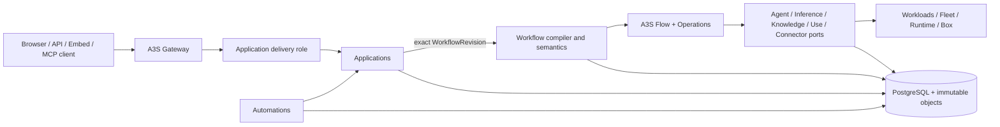

# A3S Cloud AI Application Platform Plan

## 1. Authority and target

This document is the detailed delivery authority for the A3S Cloud AI
application platform. It defines the `APP0`, `K0`, and `AUT0` boundaries,
their relationship to `W0`, and the evidence required before A3S Cloud may
claim parity with the public core capability set of Dify's commercial product.

The comparison baseline was recorded on 2026-08-13 from Dify's public
documentation. It includes:

- six current application experiences: Chatbot, Text Generator, classic Agent
  (`agent-chat`), New Agent Beta (`agent`), Chatflow, and Workflow;
- the common application toolkit: end-user identity, conversations,
  personalized openers, suggested follow-ups, files, citations, feedback,
  annotations and Annotation Reply, TTS/STT, moderation, More Like This message
  variants, and blocking/streaming cancellation;
- the 23 public built-in Workflow node labels listed in section 6, with
  classic and New Agent profiles under the Agent label;
- Workflow version control, reusable snippets, per-node error policy, single
  node test, variable inspection, run history, collaborative revision safety,
  authorized global discovery, templates, and release diagnostics;
- Knowledge Bases and Knowledge Pipeline authoring, including file/online/web
  and plugin data sources, document/Tool processors, General/Parent-child/Q&A
  chunking, multimodal attachments and retrieval, scoped input forms,
  test/debug history, reusable publication, and blocking/streaming execution;
- Tool, Model, Agent Strategy, Extension, Datasource, and Trigger plugin
  outcomes;
- browser-facing API, streaming, embed, MCP, internal invocation, and reusable
  application-template/catalog publication;
- run monitoring, feedback, annotation, usage, and operational diagnostics;
- public enterprise outcomes including multiple workspaces, SAML/OIDC SSO,
  SCIM, fine-grained access, session policy, tamper-evident audit/SIEM export,
  PII redaction, data residency/BYOK, isolation, quotas, high availability,
  air-gapped recovery, and branding.

The auditable seed is Dify's public
[documentation index](https://docs.dify.ai/llms.txt), including its
[Workflow/Chatflow](https://docs.dify.ai/en/cloud/use-dify/build/workflow-chatflow),
[New Agent](https://docs.dify.ai/en/self-host/use-dify/build/new-agent/overview),
[publication](https://docs.dify.ai/en/cloud/use-dify/publish/README),
[monitoring](https://docs.dify.ai/en/cloud/use-dify/monitor/analysis),
[Knowledge Pipeline](https://docs.dify.ai/en/cloud/use-dify/knowledge/knowledge-pipeline/knowledge-pipeline-orchestration),
and [plugin-type](https://docs.dify.ai/en/develop-plugin/getting-started/choose-plugin-type)
inventories, plus the public
[enterprise comparison](https://dify.ai/pricing/dify-enterprise). The ACL
capability manifest pins individual source URLs and the observation date so
later reference-product changes cannot silently alter a verified A3S release.
That manifest is now frozen at
[`contracts/app-platform/v1/parity-manifest.acl`](../contracts/app-platform/v1/parity-manifest.acl),
parsed strictly by `a3s-cloud-contracts`, and enforced by CI. It records 91
required outcomes and intentionally keeps `parity_claim = false`; an internal
implementation is not a public capability. The forty-three authority decisions are
registered under [`docs/decisions/app-platform`](decisions/app-platform/README.md).

This is a capability target, not a compatibility promise. A3S Cloud does not
copy another product's internal API, storage model, package format, execution
engine, or configuration authority. All admitted product configuration is
closed A3S ACL parsed and generated only through `a3s-acl`.
Product Studio/Web UI implementation and visual parity are intentionally
outside this repository's interface-only scope; baseline UI outcomes are
translated only into stable domain and protocol contracts where applicable.

The document hierarchy is:

| Document | Authority |
| --- | --- |
| [Technical architecture](architecture.md) | Stable component ownership and prohibited duplicates |
| [Product roadmap](../ROADMAP.md) | Public gate state, dependencies, and portfolio order |
| This document | Detailed `APP0`, `K0`, `AUT0`, node-coverage, and parity evidence |
| [Workflow and evolution plan](workflow-evolution-plan.md) | Detailed `W0`, heterogeneous `A1`, and `EV0` contracts |
| [Inference plan](inference-plan.md) | Detailed `I0` model-serving contracts |
| [Development plan](development-plan.md) | Cross-portfolio implementation policy and retained evidence |

If these documents disagree, the technical architecture decides ownership, the
roadmap decides availability, and this plan decides whether an AI application
platform sub-gate has enough evidence to advance.

## 2. Current position and preservation rule

A3S Cloud already has the correct execution foundation. `Workflow` owns
versioned business graphs, goals, plans, HumanTasks, and semantic step state.
A3S Flow plus Operations owns durable execution history, replay, scheduled
steps, retries, waits, hooks, cancellation, timeout, progress, and child
operation linkage. Provider work then converges through the existing owning
ports and the Workloads, Fleet, Runtime, and Box path.

The AI application platform is additive. It must not remove, narrow, replace,
or fork any existing A3S Flow capability. Existing Flow histories and pinned
runtime builds remain replayable throughout the work. A new product node is a
Cloud semantic descriptor or composite plan region; it is not a new Flow
command or a second workflow engine.

The current Cloud Workflow implementation covers the first local execution
slice: `input`, `transform`, `branch`, `human_decision`, finite `execution`, and
`output`. It also
declares coarse semantic kinds for Agent, MCP, model, Tool, service, memory, and
subworkflow steps. That is a foundation, not full application-platform or node
parity. Deterministic reachable-sink aggregation is now implemented in Cloud
Workflow: one declared Output preserves its historical value, multiple declared
Outputs aggregate active results by stable step ID, inactive branch sinks are
omitted, and completion waits for all sinks under the existing output bound.
This used Flow's existing completion contract and did not change Flow.

The current implementation already follows the intended non-duplication shape:

| Evidence | Boundary proved |
| --- | --- |
| [`FlowOperationEngine`](../crates/control-plane/src/modules/operations/infrastructure/flow_operation_engine.rs) | Operations delegates run start and snapshots to A3S Flow rather than persisting another history |
| [`FlowWorkflowRunCoordinator`](../crates/control-plane/src/modules/workflow/infrastructure/workflow_run_flow/coordinator.rs) | Workflow delegates cancel, timeout, and history decisions to the correlated Flow run |
| [`WorkflowRunHistoryReader`](../crates/control-plane/src/modules/workflow/infrastructure/workflow_run_flow/projection.rs) | Authorized Workflow history is a bounded projection of Flow history, not another event log |
| [`WorkflowStepProjection`](../crates/control-plane/src/modules/workflow/domain/entities/workflow_step_projection.rs) | Semantic step projection is sequence-fenced and rebuildable from the owning execution facts |
| [HumanTask resume relay](../crates/control-plane/src/modules/workflow/infrastructure/human_task_flow/resume_worker.rs) | The leased Inbox/Outbox closes the cross-store decision-to-Hook gap and calls Flow's Hook authority; it is not a step retry engine |

These adapters and their existing recovery tests are preserved. Future work may
replace polling with an A3S Event consumer projection, but it cannot create a
second Hook state, Flow history, completion decision, or retry authority.

## 3. Single-authority boundary

The following table is normative. Each row has one owner and an explicit
prohibited duplicate.

| Concern | Sole authority | Prohibited duplicate |
| --- | --- | --- |
| Workflow graph, node configuration, variables scoped to one run, composite regions, plan compilation, and semantic step state | Cloud `Workflow` | A node graph or planner inside Flow, Applications, Knowledge, a plugin, or Gateway |
| Durable run history, replay, step scheduling, retries, timers inside an existing run, hooks, cancellation, timeout, progress, and child-operation links | A3S Flow plus Cloud Operations projection | Cloud-local run journal, retry daemon, timer queue, or node executor |
| Application identity, immutable release, delivery mode, session, message, conversation variable, feedback, annotation, and publication policy | Cloud `Applications` | Six separate application runtimes, Workflow-owned conversations, or presentation-owned state |
| Application toolkit admission and message policy | Applications pins opener/follow-up/file/citation/moderation/annotation-reply/variant/voice policy; Files, Knowledge, Inference, Connectors, and Workflow execute through typed ports | A toolkit runtime, direct model/moderation client, or presentation-only policy |
| Application template/catalog lifecycle and authorized global discovery | Applications owns immutable A3S-native template revisions; Search owns rebuildable grant-filtered discovery | A Dify package/DSL compatibility store, second catalog index, or public listing that bypasses grants/review |
| Published application end-user identity and delivery audience | Applications `ApplicationEndUser`, optionally linked to an Identity Principal without copying membership or grants | Treating an arbitrary caller string as a workspace Principal, or an application-local RBAC evaluator |
| Knowledge Base, document, chunk, metadata, ingestion intent, index policy, retrieval policy, and external-Knowledge binding | Cloud `Knowledge` | Workflow-owned corpus tables, Search as corpus truth, or a plugin-owned Knowledge Base |
| Knowledge ingestion and transformation orchestration | An immutable `KnowledgePipelineRelease` binding to an exact `WorkflowRevision`, executed by Flow | A Knowledge worker DAG, ingestion queue, or second pipeline engine |
| User file upload session, metadata, scan state, quota, retention, and references | Cloud `Files` | Build Artifact rows used as user-file metadata or application-local blob tables |
| Immutable file bytes | The shared immutable-object infrastructure client and the selected `S0` provider | A Files-, Knowledge-, or Applications-specific object client |
| Schedule, webhook, and admitted event definitions that create new invocations | Cloud `Automations` | A Workflow timer service, P0-local scheduler, plugin scheduler, or per-application trigger worker |
| Source-provider connection, source revision, webhook authenticity, and normalized source fact | Cloud `Sources` | Automations copying provider connection or source revision state |
| Mapping an admitted source fact to an exact application or Workflow release | Cloud `Automations` | Sources starting Flow directly |
| Reusable outbound HTTP or business connection policy and execution evidence | Cloud `Connectors` | Ad hoc HTTP clients in node handlers or Secrets stored in node configuration |
| Model identity, route, Provider, credentials binding, usage, and fallback | Cloud `Inference` (`I0`) | A model registry or fallback loop in Workflow, Applications, or plugins |
| Agent, Skill, and MCP asset identity, immutable source/release, permanent capability files, and build-note evidence | Cloud `Assets` (`A0`) | Applications-owned Agent definitions/files, a New-Agent package store, or sandbox state used as release truth |
| Agent conversation execution, provider strategy, semantic events, approvals, checkpoints, and trajectories | Cloud `Agents` (`A1`) | An Agent loop or transcript in Workflow or Applications |
| Governed Agent sandbox/runtime projection, egress, brokered credentials, cost, idle, checkpoint, and scaling experience | Existing `AR0` over Agents, Workloads, Runtime, Box, Secrets, Operations, and `H0` | A New-Agent controller, sandbox engine, process store, Secret injector, or autoscaler in Applications |
| Package trust, catalog, install/apply lifecycle, grants, bindings, and executable capability registration | A3S Use Plugin Manager | A Cloud package installer or node-specific plugin registry |
| Tenant package assignment and host observation | Cloud `Plugins` (`U0`) | Application-owned installation state |
| Public route intent and live application traffic policy | Cloud Edge desired state and A3S Gateway applied state | Application-owned proxy rules or Gateway-owned product state |
| Identity, membership, Resource Grants, credentials, and revocation | Cloud `Identity` (`C0`) | An Applications credential/key store, application keys as roles, or a Studio-local authorization model |
| Run progress, timing, failure, and recovery evidence | Operations, Flow history, owning semantic sequences, and shared telemetry | Application-specific execution logs presented as a second run history |

The following similar-looking mechanisms remain intentionally distinct:

1. An Automations schedule creates a new invocation. A Flow timer advances an
   already-existing run. P0 scheduled Task profiles compile to the Automations
   target contract; they do not retain a separate scheduler.
2. Sources authenticates and normalizes an external provider event.
   Automations applies deduplication, filters, concurrency policy, and the exact
   target release. Neither writes the other's state.
3. Artifacts owns admitted build and release evidence. Files owns end-user file
   lifecycle. Both use the same typed immutable-object client for bytes.
4. An ApplicationSession owns channel-visible messages, conversation variables,
   delivery cursors, feedback, and annotations. An AgentConversation owns
   provider-neutral reasoning events, Tool calls, approvals, checkpoints, and
   trajectories. An Agent application links the two exact identities and never
   copies the Agent semantic sequence into the session.
5. A ConnectorProfile is a governed outbound HTTP/business connection used by
   a Workflow service step. A Tool is an A3S Use package capability invoked
   through the Use/Agent Tool contract. A connector cannot register itself as a
   package, and Workflow cannot bypass Use by treating a Tool as raw HTTP.
6. An ApplicationRelease owns product delivery and binds a WorkflowRevision by
   exact identity. It does not copy the Workflow graph, plan, or history, and a
   WorkflowRevision cannot acquire application session or publication state.
7. Inference may select an equivalent healthy provider target under one pinned
   model-route policy before returning a typed model outcome. Workflow may map
   that outcome to a declared semantic failure/default branch. Connector and
   provider adapters classify errors; only Flow persists attempts and schedules
   retry/backoff. None of these layers implements another layer's fallback or
   retry loop.
8. An authenticated published-application API caller uses an Identity-issued,
   Principal-bound credential and Resource Grant scoped to the exact application
   resource. Applications owns audience/session policy and retains only the
   credential reference and generation; it does not issue or verify a second
   kind of API key. Anonymous and explicitly linked ApplicationEndUser paths
   remain separate delivery policies.
9. A classic Agent application is an Applications preset over an exact
   A0/A1-owned Agent profile. A New Agent application binds a reusable exact
   AgentRelease and governed AR0 runtime. Both use an ApplicationSession for
   delivery and an AgentConversation for semantic execution; Applications owns
   neither Agent capability state nor sandbox lifecycle.

Cross-context mutations use application ports or committed Outbox facts. A
projection may be deleted and rebuilt from its owner. It never becomes a second
write authority.

## 4. Target composition

The application delivery role is a bounded public protocol projection in the
Cloud binary. It accepts published application invocations, emits the common
stream/cursor protocol, and calls the same Applications commands and queries as
the maintained interfaces. It does not plan graphs, call providers,
schedule work, persist an independent session, or proxy arbitrary hosted
workloads. Gateway remains the only live route and edge-policy authority.

All six application experiences compile to one execution contract. An
`ApplicationRelease` binds exactly one immutable `WorkflowRevision`:

| Experience | Authoring projection | Executable target |
| --- | --- | --- |
| Chatbot | Chat inputs, prompt/model policy, memory, tools, and response policy | Deterministically generated Workflow revision using model and optional Knowledge/Tool nodes |
| Text Generator | Completion inputs, prompt/model policy, and structured output | Deterministically generated Workflow revision with one-shot input/output semantics |
| Classic Agent | Chat inputs, prompt/model/strategy, tools, Knowledge, iteration/memory limits, and response policy | Deterministically generated A0/A1 Agent profile plus a Workflow revision containing the classic Agent step profile |
| New Agent Beta | Reusable AgentRelease, prompt, model, Skills, permanent capability files, Tools/Workflows/MCP, Knowledge, governed environment/Secret references, and standalone delivery policy | Workflow revision containing an exact new-Agent release step; A1/AR0 executes its provider-neutral sandbox and the same release is reusable from other Workflows |
| Chatflow | Interactive graph, Answer events, files, and conversation variables | User-authored Workflow revision with chat delivery policy |
| Workflow | One-shot or asynchronous graph with typed final outputs | User-authored Workflow revision with invocation delivery policy |

The preset compilers call the Workflow application port and produce ordinary
immutable Workflow revisions. They do not write Workflow tables and do not
introduce mode-specific run controllers.

### 4.1 Classic Agent and New Agent boundary

The current reference product exposes New Agent Beta as a separate app type
from classic Agent and exposes both behaviors through the Agent node label.
A3S retains that product distinction without adding another execution system:

- classic Agent authoring deterministically publishes an exact A0/A1-owned
  strategy profile and wrapper Workflow revision; model routing belongs to
  Inference and Tool/strategy packages belong to A3S Use;
- New Agent authoring publishes an A0-owned AgentRelease and immutable
  HarnessInvocationProfile. Standalone delivery adds only an ApplicationRelease
  whose wrapper Workflow calls that exact Agent release;
- inviting a New Agent into a Workflow uses the same `agent.release` descriptor.
  A node-local one-time copy becomes a new exact Agent release; a mutable link
  that silently follows the latest Agent release is prohibited;
- build-by-chat is an A1 AgentConversation whose Tool calls submit reviewable
  patches to an A0-owned Agent draft. Apply and Discard are A0 commands, and the
  retained build note is immutable release evidence. Applications may project
  the experience but cannot write Agent or Asset state;
- permanent prompt/Skill/reference-file state belongs to the Agent release,
  published-app uploads belong to Files, and task working files belong to the
  selected provider/AR0 runtime with typed export references. These three file
  lifecycles cannot substitute for one another; and
- egress, command execution, program installation, environment Secret
  materialization, isolation, idle/wake, checkpoint/fork, cost evidence, and
  scaling reuse AR0, Workloads, Runtime, Box, Secrets, Operations, and H0. No
  Applications-owned sandbox daemon or persisted working directory is allowed.

The New Agent delivery policy may require streaming and reject blocking calls.
That is one release-level channel constraint over the shared cursor protocol,
not a separate API runtime.

The Applications aggregate set is `Application`, immutable
`ApplicationRelease`, application-scoped `ApplicationEndUser`,
`ApplicationSession`, ordered `ApplicationMessage`, optimistic
`ConversationVariableRevision`, `ApplicationFeedback`, and
`ApplicationAnnotation`. Release policy also pins the admitted toolkit
features, schemas, provider bindings, and presentation digest. An
ApplicationEndUser may explicitly link to an Identity Principal, but a caller
identifier can never create workspace membership, roles, or Resource Grants.

An immutable `ApplicationTemplateRevision` may export an A3S-native application
and exact dependency manifest to an authorized catalog. Import creates new
draft identities through owning commands; it never copies run/session state or
silently follows source revisions. Search provides the sole grant-filtered
Go-to-Anything/global discovery projection. Collaboration uses C0 identities,
Resource Grants, optimistic revision commands, and audit; browser presence or
layout state cannot become an edit or release authority.

Openers and follow-up prompts are release-bound message templates. Annotation
Reply is an Applications policy over immutable annotations; matching uses an
exact Inference embedding/Search profile, and a hit appends an ordinary response
without creating a provider call. More Like This creates an idempotent
`ApplicationMessageVariant` linked to the exact source message, release, and
input; it never overwrites the ordered conversation. Moderation declares
pre-input and/or post-output stages whose keyword, model, or Connector adapter
is explicit. TTS/STT uses separately certified I0.6 profiles. Each behavior
shares the same session sequence, authorization, usage, audit, and cancellation
path.

## 5. Workflow descriptor and compiler contract

The current coarse `WorkflowStepKind` remains a small semantic dispatch set. It
must not grow by one enum variant for every built-in or marketplace node.
`W0.3` adds a versioned descriptor registry with at least:

- stable descriptor ID and immutable descriptor revision;
- owning context and coarse semantic kind;
- semantic profile such as `model.llm`, `knowledge.retrieve`, or
  `automation.webhook`;
- typed input and output ports, canonical ACL configuration-schema digest, and
  default policy digest;
- required capability, release, Secret, placement, and egress bindings;
- execution class: local, composite region, owning application port, or
  invocation-only;
- typed error output, retry classification, fallback/default, and failure-branch
  policy supported by that execution class;
- compatibility range and unavailable-reason contract; and
- a separate presentation digest that cannot change execution semantics.

The Workflow domain now implements this boundary as
`cloud.workflow.step-descriptor-registry.v1`, including canonical ACL restore,
exact revision lookup, compiler-range admission, semantic and presentation
digests, and fail-closed authority validation. The checked-in registry is a
two-descriptor execution-conformance fixture, not a global built-in registry and
not evidence that all public nodes are available. It deliberately adds no
scheduler, executor, queue, Flow command, Runtime provider, or invocation
subscription mechanism.

The frozen parity manifest is the acceptance authority for the exact built-in
inventory, owner, gate, dependencies, evidence, and availability; it is not an
executable descriptor registry. Those explicit owners follow the accepted
authority decisions and this architecture: for example, Code is
Executions-owned, an HTTP Request executes through a Connectors-owned
application port, and Automations owns only trigger definitions that create new
invocations. Changing an owner field requires an explicit manifest and decision
revision; a presentation projection cannot reinterpret it.

Built-in discovery is implemented as a separate read-only composition. The
exact 23-node `a3s.cloud.app-platform.workflow-node-profiles.v1` ACL binds the
canonical parity-manifest digest and adds only coarse kind, execution class, and
semantic profiles. Cloud fails closed on coverage, ordering, owner/class, or
digest drift and exposes one project-authorized result through REST `1.31.0`,
the maintained client, `workflow-nodes list`, and Management MCP. Five entries
are internal, eighteen remain unavailable, none are public, and `parityClaim`
remains false. The projection adds no catalog table, migration, index, writer,
worker, cache, or Flow state. Only a WorkflowRevision-owned exact descriptor
snapshot can admit execution semantics.

`cloud.workflow.plan.v1` remains unchanged for replay. Compiler schema 2 now
publishes `cloud.workflow.plan.v2`, which pins each exact descriptor revision
and semantic digest plus the revision semantic-contract-set and variable-
contract digests. A descriptor upgrade creates a new Workflow revision; it
cannot reinterpret a running or historical plan.

An invocation-only trigger descriptor is validated with the authoring graph but
is not scheduled as a Flow step. Publication asks Automations to create an
immutable AutomationRevision that targets the exact ApplicationRelease or
WorkflowRevision. The resulting invocation input begins one ordinary
WorkflowRun. This keeps trigger subscription/deduplication outside an existing
run while preserving one graph authoring experience.

The compiler owns these variable scopes:

| Scope | Owner and rule |
| --- | --- |
| Invocation input | Immutable input envelope on the Workflow run |
| Node output | Immutable, typed output referenced by stable node and attempt identity |
| Loop/iteration local | Composite-region frame, inaccessible outside the declared export ports |
| Run variable | Workflow semantic state with deterministic assignment order |
| Conversation variable | Applications state, changed only through an optimistic, idempotent application port |
| Secret | Secret reference only; plaintext never enters plan ACL, history, events, or logs |
| Large value | Typed immutable-object reference with digest, size, media type, tenant, and retention policy |

The Workflow domain now freezes these boundaries in
`cloud.workflow.variable-contract.v1`. Canonical ACL declarations, reads,
deterministic assignments, and explicit composite exports validate exact root/
leaf schemas, graph reachability and dominance, region confinement, opaque
Secret/object references, and optimistic Applications-port evidence. This is a
revision authority persisted by migration `103`: WorkflowRevision compiler
schema 2 atomically owns bindings, an exact recoverable registry snapshot, and
the variable contract. Migration `107` permits one optional immutable
`cloud.workflow.variable-defaults.v1` child whose bounded canonical JSON exactly
covers the contract's digest-backed defaults and participates in the semantic-set
identity. Migration `108` permits one optional immutable
`cloud.workflow.composite-regions.v1` child that exactly covers every admitted
Iteration/Loop descriptor with bounded policy and one exact non-nil child
WorkflowRevision binding.

Plan v2 can prove the owning descriptor and optionally pins
`compositeRegionsDigest`. WorkflowRun input/runtime/Flow v2 reconstructs
non-composite invocation, node-output, defaults, deterministic run-assignment,
direct-read, and opaque-reference values. Version 3 preserves exact composite
ACL/digest material, executes authority-bound child WorkflowRuns, and restores
reduced composite updates/exports from the same immutable input and Flow
history. A finite Execution graph that declares the exact descriptor error edge
emits Plan v3 and immutable WorkflowRun input/runtime/Flow v4. Dispatch
rejection, terminal failure, and terminal cancellation become one bounded
`cloud.workflow.step-failure.v1` result selected through the ordinary DAG; the
Execution projection remains failed while its reachable error branch may
complete the parent. The mutually exclusive exact default fallback emits Plan
v4 and immutable WorkflowRun input/runtime/Flow v7. Policy v3 freezes one
canonical output, and the same terminal observation becomes that exact graph
value with bounded `cloud.workflow.step-default-output.v1` projection evidence.
An exact Connector descriptor error edge emits Plan v5 and immutable
WorkflowRun input/runtime/Flow v9. It preserves v8's typed success path and
turns only a terminal closed provider classification into bounded
`cloud.workflow.step-failure.v2` data on the ordinary DAG; the Service source
projection remains failed while the selected error branch may complete the
parent. Migration `123` admits the already wired Service projection kind and
failed selected-handle shape, while immutable plan validation remains the sole
exact ConnectorRevision-and-handle authority. Plan v1-v4 and Run v1-v8 retain
their byte and replay shape, and no retry/provider mechanism moves into
Workflow. REST/OpenAPI `1.41.0` and the maintained client expose the exact
descriptor-failure/default contracts and their typed evidence. REST/OpenAPI
`1.35.0`, the client, CLI, and Management MCP accept
optional default and composite ACL material; the inspection surface added in
`1.33.0` exposes variable materialization through one authorized, bounded
`cloud.workflow-run.variable-inspection.v1` read projection. It reports the
observed Flow sequence and materialized/unavailable state, redacts Secret
references, adds no variable store, and rejects Plan v1. Composite-region
frames/exports and sequential Iteration/Loop dispatch are implemented through
exact Flow hooks, ordinary child WorkflowRuns, durable child references, and
parent cancellation/timeout propagation. Applications dispatch remains open
and fail closed. Answer and remaining non-Execution error semantics remain open.
Existing `cloud.workflow.plan.v1` histories are
unchanged.

The component-only Connector response path now has one internal read boundary
and one typed consumer. `IConnectorResponseObjectPort` authorizes the exact
environment, requires accepted terminal C6 evidence for the exact
attempt-scoped reference, and revalidates the immutable bytes before returning
transient Debug-redacted content. WorkflowRun input/runtime/Flow v8 invokes
that port only after verified accepted hook evidence in a dedicated no-retry
step. It parses exactly one duplicate-key-free JSON value, validates the
immutable node output schema and Workflow output bound, and records only that
typed value as ordinary Flow output. Raw response bytes and the object-read
capability never enter Flow or a public body-download surface. Historic v7
retains default-output behavior, v6 remains reference-only, and v5 remains
digest-only. WorkflowRun v9 preserves this v8 success behavior and, only for an
exact Plan-v5 Connector error edge, routes provider rejection, exhausted
attempts, indeterminate dispatch, exhausted observation, or invalid response
as a closed typed failure value. Historic v8 continues to fail closed without
that interpretation. This implements the
component HTTP Request response-consumption path, but the node remains publicly
unavailable until the remaining AUT0.5 provider, recovery, integration, and
interface gates pass.

The initial `Iteration` executor dispatches deterministic item ordinals
sequentially, preserving the declared maximum concurrency as a strict ceiling,
and applies bounded result ordering, failure, cancellation, and maximum-item
policy. `Loop` is sequential with a boolean condition, maximum iteration count,
time budget, stable iteration identity, previous-output carry, and explicit
exports. Any later bounded parallel waves must use existing Flow primitives;
Cloud must not create a parallel queue or expand unbounded state into Flow
history.

`Answer` and `Output` have different semantics. `Answer` appends ordered
interactive frames to an Applications session and may execute more than once.
`Output` contributes typed final values. A Workflow run completes only after
all reachable terminal branches satisfy the compiled termination policy, after
which Workflow writes one deterministic aggregate and asks Flow to complete.

## 6. Built-in node coverage plan

The following table accounts for all 23 public built-in node labels in the
2026-08-13 baseline. The owner column describes product semantics; every
durable node run still uses the same Flow execution.

The public Start documentation is a category. This count includes its four
concrete labels (User Input, Schedule Trigger, Integration Trigger, and
Webhook Trigger) and does not count the category header as a separate node.

| Public node label | A3S descriptor/profile | Owning delivery gate |
| --- | --- | --- |
| User Input | `input` / `workflow.user-input` | `W0.3`, completed for one-shot input; `APP0.2` adds chat/file input contracts |
| Schedule Trigger | invocation-only / `automation.schedule` | `AUT0.3` |
| Integration Trigger | invocation-only / `automation.plugin-trigger` | `AUT0.4` plus `U0.4` |
| Webhook Trigger | invocation-only / `automation.webhook` | `AUT0.2` |
| LLM | `model` / `model.llm` | `W0.4` plus `I0.2` |
| Knowledge Retrieval | `service` / `knowledge.retrieve` | `K0.4` plus `W0.4` |
| Agent | `agent` with `agent.classic` and `agent.release` profiles | `W0.4`; classic requires `I0.2`, `U0.4`, and `A1.3`, while New Agent requires exact `A0.5`, `A1.4`, and selected `AR0` gates |
| Question Classifier | `model` / `model.question-classifier` | `W0.4` plus `I0.2` |
| If-Else | `branch` / `workflow.if-else` | `W0.3` |
| Code | `execution` / `execution.code` | `W0.4` plus Executions, A3S Code, Runtime, and Box |
| Template | `transform` / `workflow.template` | `W0.3` |
| Variable Assigner | `service` / `application.conversation-variable-assign` | `APP0.2` plus `W0.4` |
| Variable Aggregator | `transform` / `workflow.variable-aggregate` | `W0.3` |
| HTTP Request | `service` / `connector.http` | `AUT0.5` plus `W0.4` |
| Tool | `tool` / `use.tool` | `W0.4` plus `U0.4` |
| Parameter Extractor | `model` / `model.parameter-extract` | `W0.4` plus `I0.2` |
| Iteration | `subworkflow` / `workflow.iteration` | `W0.3` composite-region slice |
| Loop | `subworkflow` / `workflow.loop` | `W0.3` composite-region slice |
| Document Extractor | `service` / `knowledge.document-extract` | `K0.2` plus `W0.4` |
| List Operator | `transform` / `workflow.list-operator` | `W0.3` |
| Human Input | `human_decision` / `workflow.human-input` | `W0.3` HumanTask public-surface completion |
| Answer | `output` / `application.answer` | `APP0.2` plus `W0.3` ordered stream semantics |
| Output | `output` / `workflow.output` | `W0.3` reachable-sink aggregation correction |

Node parity is a cross-gate result. Adding a descriptor or drawing a node in a
Designer does not make that node available. Its type checks, authorization,
provider contract, execution, cancellation, recovery, surfaces, and evidence
must all pass.

## 7. Knowledge architecture

`Knowledge` owns retrieval-augmented-generation business state, not a second
knowledge graph and not a vector database as truth. The minimum aggregate set
is:

- `KnowledgeBase` and immutable `KnowledgeBaseRevision`;
- `KnowledgeDocument`, source revision/provenance, lifecycle, and retention;
- `KnowledgeChunk`, typed metadata, tags, General/Parent-child/Q&A structure,
  text/media content references, attachment lineage, and provenance;
- `IndexRevision`, embedding model revision, dimension, strategy, and rebuild
  cursor, including declared input and retrieval modalities;
- `RetrievalPolicyRevision` with search, filter, rerank, score, top-k, and
  citation policy;
- `ExternalKnowledgeBinding` for a provider-owned corpus; and
- `KnowledgePipeline` and immutable `KnowledgePipelineRelease`, which bind an
  exact Workflow revision, datasource entrances, global/source-local input
  schemas, chunk structure, and output contract.

PostgreSQL through A3S ORM owns metadata and lifecycle. Text and large content
use typed immutable-object references. pgvector or another admitted Search
provider is a rebuildable index. Deleting a document tombstones its source,
chunks, indexes, citations, and provider work through one audited saga.

Ingestion uses Workflow/Flow. Datasource capabilities come from exact A3S Use
packages; web and HTTP access use Sources/Connectors; parsing and extraction use
Executions/Runtime/Box; embedding and reranking use Inference. Knowledge owns
the resulting document and index decisions but none of those provider
mechanisms.

The Workflow ontology and the Knowledge corpus remain separate authorities.
Ontology represents governed business objects, relations, rules, goals, and
constraints. Knowledge represents retrievable source material. A Workflow may
reference both by exact revision without copying either.

### 7.1 Knowledge Pipeline outcome mapping

Knowledge Pipeline nodes are a separate authoring inventory from the 23
application Workflow nodes. They still compile to the same descriptor, plan,
and Flow contracts:

| Public pipeline outcome | A3S owner and delivery gate |
| --- | --- |
| File-upload datasource | Files admits bytes and metadata; Knowledge admits the document in `K0.1`/`K0.2` |
| Online document or drive datasource | Sources owns connection/authenticity, an admitted A3S Use Datasource capability reads it, and Knowledge owns the imported document in `K0.2` |
| Web-crawler datasource | Connectors owns bounded web egress and evidence; Knowledge owns crawl intent/provenance in `AUT0.5` plus `K0.2` |
| Marketplace/custom datasource | A3S Use owns package/capability lifecycle; Knowledge binds the exact Datasource revision in `U0.4` plus `K0.2` |
| Document extractor/processor | Executions/Runtime/Box owns isolated parsing/OCR/layout work; Knowledge owns admitted structured output in `K0.2` |
| Tool processor, including multimodal output | A3S Use owns the Tool capability; Knowledge validates typed text/media output and attachment limits in `U0.4` plus `K0.2` |
| General chunker | Deterministic Knowledge transformation profile in `K0.3` |
| Parent-child chunker | Deterministic two-level Knowledge transformation profile in `K0.3` |
| Q&A processor/chunk mode | Deterministic structured-column mapping and Q&A Knowledge profile in `K0.3` |
| Knowledge Base sink | Knowledge validates the immutable chunk structure and creates an exact index/retrieval revision in `K0.3` |
| Global and datasource-local input fields | Native Form/Workflow input schemas with compiler-enforced scope and explicit exports in `W0.3` plus `K0.5` |
| Test run, single-datasource debug, history, and variable inspection | Knowledge commands project the same Workflow/Flow semantic history and values in `K0.5` |
| Publish/reuse and blocking/streaming run API | An immutable KnowledgePipelineRelease and one shared sequence protocol in `K0.5` |

The chunk structure becomes immutable once a Knowledge Base revision is
published. A change creates a new Knowledge Base/index migration revision; it
cannot reinterpret stored chunks. High-quality vector, full-text, hybrid, and
economical inverted-index strategies are explicit retrieval profiles. A
multimodal profile pins compatible extraction, embedding, rerank, attachment,
and citation contracts end to end rather than silently dropping non-text
results.

## 8. Plugin and extension projection

A3S Use remains the sole package and capability lifecycle. `U0` projects tenant
assignments into Cloud. The six reference plugin outcomes map as follows:

| Plugin outcome | A3S owner and integration |
| --- | --- |
| Tool | A3S Use capability invoked by the Workflow Tool port or Agent tool binding |
| Model | A3S Use package supplies a versioned provider adapter; Inference owns model, route, credential, fallback, and usage state |
| Agent Strategy | A3S Use package supplies an admitted classic-Agent strategy/provider capability; Agents owns the execution, events, approvals, and trajectory; a strategy plugin cannot replace a New Agent release or AR0 sandbox |
| Extension | A3S Use package supplies an admitted endpoint capability; Gateway and the owning application context retain routing and authorization |
| Datasource | A3S Use package supplies ingestion capabilities; Knowledge owns documents and pipeline intent |
| Trigger | A3S Use package supplies subscription/event normalization; Automations owns the target, deduplication, and invocation |

A3S Skills and hosted MCP services remain native additional capability types.
They reuse the same package/release, grant, binding, Runtime, and Gateway
authorities and are not renamed or removed to mimic the reference product.

Plugin interoperability also stays behind A3S Use. An admitted package may
invoke only typed, grant-checked App, Model, Tool, or supported Workflow-node
capabilities. App invocation pins an exact ApplicationRelease; model calls use
Inference; Tool-to-Tool calls use Use; supported node calls enter the owning
Workflow application port. OAuth and provider credentials remain Secret-owned.
Package-scoped durable state, quotas, migration, backup/restore, and uninstall
cleanup remain with the shared Use manager contract rather than Cloud context
tables. Endpoint, Datasource, and Trigger projections still obey the Gateway,
Knowledge, and Automations owners above.

## 9. Publication, monitoring, and enterprise completion

One published `ApplicationRelease` may expose any allowed combination of:

- a browser-facing application API;
- authenticated blocking and streaming APIs;
- an embed contract with explicit origin and capability policy;
- a hosted MCP application facade; and
- internal application-to-application invocation.

All channels resolve the same release, authorization policy, input schema,
session semantics, Workflow revision, output schema, rate limit, and audit
identity. Channel adapters cannot implement separate business logic. Gateway
routes only exact applied revisions; the Applications delivery role performs
the semantic invocation and shared cursor stream.

Monitoring is a projection over existing authorities. Operations and Flow
provide run state and recovery; Workflow provides semantic steps; Applications
provides messages, feedback, annotations, and delivery outcomes; Inference
provides token/usage/cost facts; AnySentry/OpenTelemetry provides correlated
metrics, logs, and traces. Monitoring may not retry, cancel, or mutate a run
outside the owning command.

Commercial completion reuses the platform foundation:

| Outcome | Required authority |
| --- | --- |
| Multiple organizations/workspaces/projects/environments | Identity and Projects |
| Baseline external sign-in, membership, roles, Resource Grants, keys, and revocation | `C0.3` Identity |
| Enterprise SAML/OIDC federation, SCIM provisioning/deprovisioning, session policy, and application/Workflow/Knowledge-granular grants | Planned `C0.5` over the same Identity authority |
| Tenant data isolation, quotas, concurrency, and retention | Owning contexts plus shared policy and audit |
| Custom domain, certificate, and application branding | Edge/Gateway for traffic; Applications for presentation policy |
| High availability, backup, restore, and disaster recovery | `H0`, `S0`, and owning-context runbooks |
| Tamper-evident audit, SIEM export, security investigation, per-call trace, and PII-redaction policy | `C0.5`, shared audit, and authorized telemetry projections |
| BYOK binding, data residency, VPC/on-prem, and air-gapped governance | Secrets, `C0.5`, `S0`, `H0`, and clean-install evidence |

Commercial billing, license enforcement, and private vendor support processes
remain outside Cloud core. They are not required to claim technical core
capability parity.

## 10. A3S Flow preservation and extension policy

The implementation starts with conformance tests against the currently pinned
Flow revision. It must first express a feature with existing commands,
deterministic Cloud planning, and owning ports. An upstream Flow change is
allowed only when a repository-level test demonstrates a domain-neutral missing
primitive.

Candidate additions are limited to backward-compatible, general orchestration
primitives such as:

- additional domain-neutral structured failure fields beyond the existing
  `RetryPolicy` and `StepFailureAction`, only where a conformance test proves
  the current retry/backoff/timeout metadata cannot express the requirement;
- a step execution context for cancellation, lease loss, heartbeat, and bounded
  transient progress;
- a signal wait with an optional deadline/race while retaining existing Hook
  behavior; and
- bounded batch scheduling or payload-reference limits that are useful to every
  Flow consumer.

Any accepted Flow addition must:

1. preserve existing public commands and default behavior;
2. keep old serialized histories and unpinned legacy Cloud histories replayable;
3. add versioned fixtures in Flow and Cloud's compatibility lock;
4. pass Build, Deployment, Executions, and Workflow recovery regressions; and
5. avoid tenant, model, Knowledge, Tool, application, graph, ACL, or UI semantics.

Moving an existing Flow ability into Cloud, deleting it from Flow, or
implementing a Cloud substitute is prohibited by this plan.

## 11. Delivery gates

### 11.1 `APP0`: application lifecycle and delivery

| Sub-gate | Outcome | Dependencies |
| --- | --- | --- |
| `APP0.1-C1` | Implemented; component-only | Strong Application/Release identities, one canonical `cloud.application.release.v1` A3S ACL, six closed experiences with immutable classic/New Agent distinction, bounded delivery/audience policy, exact Workflow definition/revision plus contract/payload/semantic/input/output digests, evidence matching, and immutable release/head lineage | `F0`, `W0.3` definition/revision foundation |
| `APP0.1-C2` | Implemented; component-only | Migration `124` and one PostgreSQL/A3S ORM repository persist immutable canonical releases and sequence-fenced heads, check exact Workflow revision content/payload evidence, reparse ACL on reads, and atomically commit idempotency, audit, and Outbox facts without copying graph, Flow, provider, session, Secret, or Gateway authority | `APP0.1-C1`, `W0.3` definition/revision persistence |
| `APP0.1-C3` | Implemented; component-only | Project-authorized create/publish/get/list CQRS authorizes before replay, reconstructs exact historical idempotency results before Workflow re-resolution, and uses one metadata-only port over the existing semantic Workflow repository. New publication matches definition/revision plus contract/payload/semantic/input/output digests; v1 admits exactly one Workflow Output while Workflow retains broader multi-output authority | `APP0.1-C2`, `W0.3` semantic definition/revision persistence |
| `APP0.1` | Implemented; later APP0 availability gates remain | Production composition, REST/OpenAPI `1.42.0`, typed client, CLI, and six Management MCP create/publish/list/current/exact-history tools all reuse the C1/C2/C3 authority. Focused domain, HTTP, MCP, client, CLI, OpenAPI, and PostgreSQL persistence evidence passes without adding graph, Flow, provider, session, Secret, or Gateway authority | `APP0.1-C3`, `C0.1` |
| `APP0.2-C1` | Implemented; component-only | Freeze Application-scoped end users, exact-release sessions, invocation-to-WorkflowRun correlation, monotonic input/Answer/final-output messages, optimistic immutable conversation-variable revisions, cancellation/terminal correlation, and stable `WorkflowRun + step + attempt + ordinal` effect identities. One atomic in-memory conformance repository proves exact replay, cross-kind effect exclusion, one final output, stale-write rejection, and no duplicate Flow or Identity authority. No PostgreSQL, production composition, interface, or availability is claimed | `APP0.1`, protected `W0.3` WorkflowRun identity |
| `APP0.2-C2` | Implemented; component-only | Migration `125`, one A3S ORM repository, and the production adapter factory persist the C1 end-user/session/invocation/message/variable/effect authority atomically. Advisory and row locks, optimistic versions, deferred head/claim checks, immutable children, and deterministic identities preserve exact replay across reconnect while an ordinary WorkflowRun foreign key retains Flow and Workflow ownership. The PostgreSQL 17 gate rejects partial, cross-kind, late-message, and direct-mutation drift. No WorkflowRun creator, delivery command, public interface, or availability is claimed | `APP0.2-C1`, `APP0.1-C2`, protected `W0.3` WorkflowRun persistence |
| `APP0.2-C3` | Implemented; component-only | One typed request/evidence port and internal CQRS handler derive stable Workflow Goal, Plan, and Run identities from the exact persisted invocation. The production adapter validates immutable release, Workflow revision, Ontology revision, input, Principal, Environment, and timeout authority before using the existing Workflow compilers and repositories. Exact retries adopt after restart, drift conflicts, and a cancellation race compensates through the existing WorkflowRun state machine. The production process registers the handler; no Flow/provider/queue or public delivery path is added | `APP0.2-C2`, protected `W0.3` Goal/Plan/WorkflowRun compilers and persistence |
| `APP0.2-C4` | Implemented; component-only | One project-authorized internal command compiles Chatbot, Text Generator, classic Agent, and New Agent into stable three-step wrapper Workflows over exact ModelRevision or AgentRelease targets. Organization/Project/Application/release-scoped UUIDv5 identities, canonical A3S ACL payload and semantic contracts, exact replay validation, and collision fences survive independent process state. Chatflow/Workflow fail closed to user-authored revisions. Both public Workflow creation and presets use one Workflow-owned publication port that checks the Project before reparsing and persists through the existing repository; no Workflow table write, provider, Flow command, or public availability is added | `APP0.2-C3`, protected `W0.3` semantic Workflow publication |
| `APP0.2-C5` | Implemented; component-only | Migration `126` and the existing session repositories atomically retain one immutable invocation execution authority with exact release, Ontology revision/digest, optional Environment, requesting Principal, and bounded timeout alongside the invocation, input message, and session head. Composition commands now carry identity only and reconstruct every start/adopt or cancellation request from persisted authority. Exact authority reuse conflicts, failed foreign authority rolls the whole request back, and restart cancellation never starts a new WorkflowRun. No credential, grant, Secret, Workflow/Flow history, public delivery route, or second cancellation authority is added | `APP0.2-C3`, `APP0.2-C2`, protected `W0.3` WorkflowRun cancellation |
| `APP0.2-C6` | Implemented; component-only | Project authorization precedes replay and validation for open/close session, request/cancel invocation, exact session/invocation reads, and bounded contiguous message-cursor replay. Stable caller session/invocation identities, deterministic Principal-linked ApplicationEndUsers, exact persisted-authority comparison, ambiguous-commit recovery, and the existing identity-only Workflow composition/cancellation ports prevent duplicate semantic writes or runs. Migration `127` aligns persisted timeout authority with WorkflowRun's 30-day maximum. The production CQRS process registers the handlers, but adds no REST/OpenAPI/client/CLI/MCP/browser/embed/SSE route, application credential, anonymous delivery, Gateway state, or second execution history | `APP0.2-C5`, `C0.1`, protected `W0.3` WorkflowRun composition and cancellation |
| `APP0.2-C7` | Implemented; component-only | One typed internal Workflow consumer port resolves the sole bound invocation from Organization plus exact WorkflowRun, reads the Applications-owned variable snapshot and compare-and-swap version, and applies Answer, final-output, variable, and terminal observations through the existing repository. Stable effect-derived message/revision identities recover exact replay before or after ambiguous commits even when later session state advanced; stale versions, changed reuse, cross-kind claims, duplicate final output, late frames, and terminal drift fail closed. No migration, Workflow runtime dispatch, public protocol, credential, Gateway state, retry rail, or second execution history is added | `APP0.2-C6`, protected `W0.3` WorkflowRun and semantic step identity |
| `APP0.2-C8` | Implemented; management interface only | A thin project-member admission adapter reuses C6 as the sole delivery command/query authority. It admits only `project_members` releases under `application:write`, derives Principal-bound end-user/session/invocation UUIDv5 identities from the idempotency scope and key, resolves exact Ontology and optional Environment authority, and delegates session open plus invocation request to the existing C6 handlers. Caller-owned session, invocation, and bounded ordered-message reads are exposed through REST/OpenAPI `1.43.0`, the maintained client, CLI, and five Management MCP tools. It adds no second session, invocation, Workflow composition, cancellation, replay, credential, anonymous-delivery, provider, or Gateway authority | `APP0.2-C6`, `C0.2m`, protected `W0.3` WorkflowRun composition |
| `APP0.2-C9` | Implemented; component-only | Application composition emits immutable WorkflowRun input/runtime/Flow v10 with one compiler-derived final Output projection. The Workflow coordinator appends the aggregate final output before terminal observation and blocks WorkflowRun projection persistence on any missing port or Applications failure; exact Flow replay recovers committed effects after a lost response or lost projection save. Failed and timed-out runs map to failed invocations, cancelled runs map to cancelled invocations, and v1-v9 never probe Applications. Runtime build `a3s-cloud-workflows@10` explicitly retains `@1`-`@9`. Answer and Application-variable step dispatch remain closed | `APP0.2-C7`, `APP0.2-C6`, protected `W0.3` Flow reconciliation |
| `APP0.2-C10` | Implemented; component-only | Exact Applications-owned `application.answer` and Workflow-owned `workflow.output` descriptor semantics partition Application Output leaves. Answer-bearing composition alone emits immutable WorkflowRun input/runtime/Flow v11 plus projection v2; v10 bytes and behavior remain unchanged when no Answer exists, and standalone compilation rejects Applications-owned steps. Flow evaluates the existing typed Output template, suspends on one authority-bound Answer hook, and resumes only after C7 returns exact committed-message evidence. Missing ports, drifted evidence, and write failures remain unresolved; lost responses replay the same effect. Multiple graph Answers dispatch in immutable Plan order, final output remains the projected `workflow.output`, and v1-v10 never probe Answer hooks. Runtime build `a3s-cloud-workflows@11` retains `@1`-`@10`; no public stream, migration, queue, or second history is added. Focused contract/compiler/runtime/coordinator tests pass, and the [retained PostgreSQL 17 C6-C11 recovery job](https://github.com/A3S-Lab/Cloud/actions/runs/32474020740/job/96746540732) proves exact Answer commit-before-response loss and restart replay through the production C6-C11 path | `APP0.2-C9`, `APP0.2-C7`, protected `W0.3` Flow reconciliation |
| `APP0.2-C11` | Implemented; component-only | Only the exact Applications-owned `application.conversation-variable-assign` Service descriptor is admitted in Application semantic composition; capability-free Service structure is deferred to that owner-specific check while legacy Workflow revision and Plan validation still reject it. Variable-bearing composition alone emits immutable WorkflowRun input/runtime/Flow v12 plus projection v3, pinning the final Output, ordered Answers, ordered variable steps, and assignment subset without changing v10/v11 behavior. Flow first records a history-redacted C7 variable snapshot, evaluates the assignment, then records and replays one exact expected-revision CAS request until matching commit evidence exists; stale or drifted evidence fails closed. Authorized inspection reconstructs the latest Application variable object from that same Hook history. Runtime build `a3s-cloud-workflows@12` retains `@1`-`@11`; no migration, public surface, queue, or second history is added. Focused contract/compiler/runtime/coordinator/replay/inspection and production-adapter tests pass, and the [retained PostgreSQL 17 C6-C11 recovery job](https://github.com/A3S-Lab/Cloud/actions/runs/32474020740/job/96746540732) proves snapshot/CAS commit-before-response loss, exact replay, final-output/terminal replay, and durable cardinalities | `APP0.2-C10`, `APP0.2-C7`, protected `W0.3` Flow reconciliation |
| `APP0.2-C12` | Implemented; project-member management interface only | REST/OpenAPI `1.44.0`, the maintained client, CLI, and three additional `application:write` Management MCP tools expose C6's close-session, cancel-invocation, and complete bounded session-replay contracts. Close/cancel retain exact optimistic versions and C6 replay evidence; cancellation still delegates to Workflow's sole state machine. Replay returns the Applications-owned session head, contiguous messages, current variable revision, next sequence, and `hasMore` without projecting Workflow or Flow history. No repository, migration, application credential, anonymous delivery, blocking wait, answer stream, Gateway state, or availability claim is added | `APP0.2-C6`, `APP0.2-C8`, `C0.2m`, protected `W0.3` WorkflowRun cancellation |
| `APP0.2-C13` | Implemented; component-only, retained PostgreSQL evidence pending | Composite Application roots alone emit immutable WorkflowRun input/runtime/Flow v13 with projection v5. Every semantic child receives projection v4 plus an exact tenant/root/parent/Plan/region/child/path/frame authority; descriptor-bound Answers address the invocation-bound root Run with a logical-path-derived stable step and the current zero-based frame ordinal. Sibling ordinals share the logical step, nested outer paths remain collision-free, lost responses replay the exact root effect, and child final-output/terminal lifecycle is suppressed. Application-scoped variables remain prohibited inside frames; legacy semantic-free children and v1-v12 histories retain their prior behavior. Replay build `a3s-cloud-workflows@13` retains `@1`-`@12`. Focused contract/compiler/runtime/coordinator/lost-response/production-adapter/variable/Connector tests and the full library suite pass. The existing PostgreSQL C6-C13 gate is extended with ordinal 0/1 and ordinal-1 commit-before-response replay without a migration, table, queue, public surface, or second history | `APP0.2-C11`, `APP0.2-C10`, protected `W0.3` composite child and Flow reconciliation |
| `APP0.2` | Complete preset authoring-profile publication over the deterministic C4 wrappers, application-scoped credential and anonymous/end-user admission, remaining message variants, file references, citations, feedback, annotations, blocking/streaming parity, and retained delivery recovery evidence over the C1-C13 contract | `APP0.2-C4`, `APP0.2-C6`, `APP0.2-C7`, `APP0.2-C8`, `APP0.2-C9`, `APP0.2-C10`, `APP0.2-C11`, `APP0.2-C12`, `APP0.2-C13`, public `W0.3` execution and HumanTask surfaces; `K0.1` for file admission |
| `APP0.3` | Add the bounded application delivery role, Identity-issued application-scoped credentials/grants, browser/API/embed routes, shared SSE/cursors, rate limits, exact-release routing, drain, rollback, and failure recovery | `APP0.2`, `E0`, `H0.2`, `C0.3` |
| `APP0.4` | Complete Chatbot, Text Generator, classic Agent, New Agent Beta, Chatflow, and Workflow behavior; New Agent reusable release/sandbox/build-chat projection; opener/follow-up, file/citation, moderation, Annotation Reply, More Like This, and TTS/STT toolkit policy; reusable snippets and immutable application templates/catalog; authorized global discovery; collaborative revision safety; version control; node test; variable inspection; per-node error handling; canonical ACL import/export; internal app invocation; and hosted MCP facade | `APP0.3`, `A0.5`, `A1.4`, selected `AR0.1`-`AR0.5`, `I0.2`, `U0.4`, `MCP0.5`; relevant `W0.3`/`W0.4` ports and certified `I0.6` media/speech profiles |
| `APP0.5` | Add run-history and monitor projections, token/usage/cost correlation, latency and failure diagnostics, feedback/annotation review, retention/redaction, external telemetry export, and operator alerts without a second run log | `APP0.3`, `I0.2c`, Operations and telemetry foundations |
| `APP0.6` | Pass the complete interface parity manifest, multi-workspace enterprise identity/governance, quotas, HA, backup/restore, upgrade, air-gap, and disaster-recovery evidence | `APP0.4`, `APP0.5`, `A1.6`, `AR0.8`, `W0.5`, `K0.6`, `AUT0.6`, `U0.5`, `C0.5`, `S0`, `H0.5` |

### 11.2 `K0`: Knowledge and Knowledge Pipeline

| Sub-gate | Outcome | Dependencies |
| --- | --- | --- |
| `K0.1-C1` | Implemented component foundation: freeze strong Files/Knowledge/KnowledgePipeline identities and one canonical `cloud.user-file.v1` Files admission ACL with exact tenant/file/upload identities, derived typed immutable-object reference, distinct bounded upload expiry and retention, mandatory scan policy, optimistic upload/scan/reject/expire/tombstone lifecycle, metadata-only event, and one thin `user-files` streaming adapter over the shared immutable-object client's verified multipart path. Only an admitted aggregate exposes its reference. Add no whole-file buffer, table, quota counter, provider/scanner client, uploader, queue, Knowledge lineage, application state, or public interface. | `F0`, shared immutable-object client |
| `K0.1-C2` | Persist Files metadata and lifecycle through one PostgreSQL/A3S ORM authority with atomic tenant quota reservation/release, optimistic transitions, authorization-before-replay, idempotency, audit, Outbox, retention/cleanup intent, and corruption checks. Expose the same CQRS through REST/OpenAPI, maintained client, CLI, and applicable Management MCP without a second upload or object authority. | `K0.1-C1`, `C0.1` |
| `K0.1-C3` | Freeze canonical KnowledgeBase/immutable revision, KnowledgeDocument, KnowledgeChunk, index/retrieval revision, external binding, and KnowledgePipeline/immutable release contracts. Bind exact admitted Files or shared immutable-object references, metadata/tags, provenance, retention, chunk structure, and exact Workflow revision without a corpus index, provider client, DAG engine, or worker queue. | `K0.1-C1`, `W0.3` |
| `K0.1-C4` | Persist and expose Knowledge/KnowledgePipeline lifecycle through one PostgreSQL/A3S ORM, authorization, idempotency, audit, Outbox, REST/OpenAPI, maintained client, CLI, and applicable Management MCP authority. Search remains a rebuildable projection and pipeline execution remains unavailable until later K0 gates. | `K0.1-C2`, `K0.1-C3`, `C0.1` |
| `K0.1` | Freeze Files, Knowledge, and KnowledgePipeline identities/revisions, canonical ACL, typed object references, upload/scan/quota/retention state, authorization, idempotency, audit, document/chunk/metadata/tag lifecycle, and maintained interfaces | `F0`, `C0.1`, shared immutable-object client |
| `K0.2` | Add file/text, online-document/drive, web-crawler, and admitted Datasource ingestion; built-in and Tool document processors; OCR/layout and multimodal attachments; provenance; incremental update; cancellation; failure cleanup; and exact source tombstones | `K0.1`, Executions/Runtime/Box; `AUT0.5` for web/HTTP; applicable `U0.4` Datasource/Tool capability and Sources connection contract |
| `K0.3` | Add deterministic General, Parent-child, and Q&A chunk profiles; immutable published chunk structure; metadata/tags; high-quality and economical indexes; vector/full-text/hybrid/inverted retrieval; text/multimodal embedding and reranking; retrieval test/citations; index rebuild; and model-revision migration | `K0.1`, `I0.2`, `S0` immutable-object production contract; certified `I0.6` rerank/media profiles are required to close the full gate |
| `K0.4` | Add Knowledge Retrieval and Document Extractor Workflow ports plus external Knowledge bindings with exact revisions and bounded evidence | `K0.2`, `K0.3`, `W0.4` |
| `K0.5` | Add immutable KnowledgePipelineRelease lifecycle over exact Workflow revisions, global and datasource-local native Form inputs, whole-pipeline test, single-datasource debug, history/variable inspection, publish/reuse, blocking/streaming run APIs, resume, repair, and Flow-backed observation | `K0.4`, native Form/public `W0.3`, and selected `W0.4` steps |
| `K0.6` | Pass tenant isolation, deletion, quota, large-corpus, incremental synchronization, provider outage, rebuild, backup/restore, HA, upgrade, runbook, and interface gates | `K0.5`, `C0.3`, `S0`, `H0.5` |

### 11.3 `AUT0`: Automations and Connectors

| Sub-gate | Outcome | Dependencies |
| --- | --- | --- |
| `AUT0.1` | Freeze AutomationDefinition, immutable revision, target union, invocation envelope, subscription reference, deduplication key, concurrency/misfire policy, canonical ACL, authorization, audit, and Outbox contracts | `F0`, `C0.1`, `W0.3` run-start contract |
| `AUT0.2` | Add signed webhook trigger endpoints, bounded request capture, schema validation, exact target pinning, replay, disable/revoke, and Gateway recovery | `AUT0.1`, `E0`, `C0.3` |
| `AUT0.3` | Add timezone-aware schedules, catch-up/misfire/concurrency rules, lease-safe due evaluation, and P0 scheduled Task adaptation through the existing Boot task rail | `AUT0.1`, Boot compatibility lock, P0 profile contract |
| `AUT0.4` | Add plugin-trigger subscriptions and normalized event dispatch; preserve Sources connection/revision authority and U0 package authority | `AUT0.1`, `U0.4`, applicable Sources contracts |
| `AUT0.5-C1` | Component foundation implemented: one provider-neutral exact-revision execution port and bounded HTTP executor own fixed method/content type, typed request/response/time limits, zeroized HMAC material, redirect rejection, immediate egress authorization, closed error classification, bounded responses, and exactly one external attempt. Notifications consumes this port without a direct HTTP client; no production repository, materializer, dispatcher, or availability is claimed. | `F0`, `C0.3-N2a` |
| `AUT0.5-C2` | Verified component foundation: persist one environment-scoped Connector profile head and immutable digest-linked ACL revisions with exact Secret ID/version bindings, optimistic concurrency, shared idempotency, Outbox, audit, A3S ORM, and database immutability/lineage constraints. | `AUT0.5-C1`, Secrets |
| `AUT0.5-C3` | Verified component foundation: add Resource Grant-aware create/revise/get/list/history application contracts; atomic exact-scope active Secret-version lookup owned by Secrets; race-safe admission row fencing; just-in-time redacted, non-serializable HTTP revision materialization; authorization before replay and stable replay after later Secret revoke. | `AUT0.5-C2`, Secrets, `C0.3` |
| `AUT0.5-C4` | Implement the production public-Internet egress authorizer and make the sole HTTP executor consume its exact per-attempt destination authorization: absolute-name DNS lookup, all-answer public-address validation, DNS-rebinding-safe address pinning, system-proxy disablement, endpoint binding, and closed retryable DNS failures. Add no egress configuration language, cache, second HTTP client authority, retry rail, evidence store, or product surface. | `AUT0.5-C3` |
| `AUT0.5-C5` | Verified component foundation: persist one immutable bounded terminal evidence fact for an exact profile/revision/attempt with request/accepted-response digests, byte counts, closed outcome, optional status and bounded Retry-After, canonical times, exact revision FK, Resource Grant-aware bounded keyset reads, redaction, and no body/credential/provider-text/retry/queue/idempotency duplication or product surface. C6 makes atomic attempt settlement its exclusive write path. | `AUT0.5-C4` |
| `AUT0.5-C6` | Verified component foundation: persist one durable exact-request pre-dispatch reservation/fence; permit only expired `reserved` takeover; make `dispatching` non-reacquirable and observably indeterminate after its outcome deadline; compose internal authorization, exact revision loading, just-in-time Secret materialization, egress authorization, one consumed external attempt, and atomic terminal evidence. Evidence failure or process death cannot authorize blind provider retry; Flow or the owning A3S Event consumer retains retry/backoff/cancellation/acknowledgement. | `AUT0.5-C5`, Operations/Flow recovery contracts |
| `AUT0.5-C7` | Implemented presentation foundation: expose the same environment-authorized Connector profile/revision CQRS through REST/OpenAPI `1.36.0`, the maintained TypeScript client, CLI, and six Management MCP tools. Reuse one PostgreSQL repository, canonical A3S ACL admission, optimistic concurrency, idempotency, Resource Grants, Outbox, audit, and response DTOs; expose no resolved Secret, endpoint, provider body, attempt/evidence, retry, or second management authority. | `AUT0.5-C3`, `C0.2m` |
| `AUT0.5-C8` | Implemented component foundation: add one Connectors-owned Workflow exact-attempt port over C6. It binds immutable WorkflowRun/plan/step-attempt and profile/revision/digest authority to a stable UUIDv5 attempt, canonical bounded JSON, exact-environment authorization, digest verification during C6's sole revision load, body-free terminal evidence, and typed deferred/indeterminate observations. Correct `ConnectorRevision` ownership to `connectors` and require an exact revision UUID plus `connector.http`. Add no response-body store, retry/wait policy, queue, scheduler, credential authority, or HTTP client. | `AUT0.5-C6`, `W0.3` |
| `AUT0.5-C9` | Implemented component foundation: add bounded provider-attempt and fallback-delay semantics as `cloud.workflow.policy.v2` through the existing per-step policy payload/digest channel. Require exact v2 material for ConnectorRevision steps in WorkflowRevision and immutable WorkflowRun admission; reject retry material for provider runtimes not yet admitted; bind Connector retry classification to the Connectors-owned `connector.http` descriptor. Preserve policy v1 bytes and add no policy table/semantic child, Plan/Run version, scheduler, wait worker, queue, or configuration language. | `AUT0.5-C8`, `W0.3` |
| `AUT0.5-C10` | Implemented component foundation: own `cloud.connector.response-object.v1` in Connectors over the shared immutable-object client's `connector-responses` child namespace. WorkflowRun v6 requests idempotent storage of an accepted bounded body by exact tenant/profile/revision/attempt/digest path before C6 terminal evidence, and records only an exact `cloud.workflow.connector-response-object.v1` reference, digest, and length in versioned Flow evidence/results. Fail closed on missing, corrupt, conflicting, or unavailable content; preserve digest-only callers and historic body-free v5 bytes. Add no table, migration, second object client, queue, scheduler, retry counter, provider client, or configuration language. | `AUT0.5-C9`, shared immutable-object authority, `W0.4` |
| `AUT0.5-C11` | Implemented component foundation: make the existing Connector execution application service the sole internal response-object read port. Authorize the exact environment, require the exact accepted terminal C6 attempt/evidence, prove the derived reference against that evidence, and revalidate the shared immutable object before returning transient non-serializable, non-cloneable, Debug-redacted content. An orphaned object grants no authority. Add no public download surface, Flow body, table, migration, second object client, queue, scheduler, retry counter, or provider call. | `AUT0.5-C10`; typed `W0.4` consumers |
| `AUT0.5` | WorkflowRun input/runtime/Flow v9 retains v8's exact Connector hook history, bounded durable observation/retry waits, `Retry-After` or C9 fallback pacing, deterministic next-attempt identity, deferred same-attempt observation, fail-closed indeterminate handling, C10's exact immutable response-object reference, and the no-retry C11 typed JSON success projection. Only an exact Plan-v5 Connector error edge converts a terminal closed classification into `cloud.workflow.step-failure.v2` data on the ordinary DAG. Historic v8 remains fail-closed without that interpretation, v7 retains default-output behavior, v6 remains reference-only, and v5 remains digest-only. Remaining provider/consumer wiring beyond the first Notification NATS-to-C6 composition, revocation/recovery operations, and retained PostgreSQL/integration evidence still block availability. | `AUT0.5-C11`; remaining `AUT0.5` and `W0.4` availability gates |
| `AUT0.6` | Pass duplicate delivery, out-of-order event, clock shift, lease loss, process death, provider outage, revoke, quota, multi-node HA, replay, disaster-recovery, and interface gates | `AUT0.2` through `AUT0.5`, `H0.5` |

The sub-gates are dependency gates, not calendar promises. `K0.1`, `AUT0.1`,
and `APP0.1` may advance in parallel after their prerequisites. Full `APP0`
availability is the composite public parity claim and remains unavailable until
`APP0.6` passes.

## 12. Implementation sequence

Each slice follows the repository's interface-only policy: tests and ACL
contracts, domain invariants, application commands/queries, A3S ORM persistence,
real adapters, REST/OpenAPI, maintained client, CLI, applicable Management MCP,
and failure/recovery evidence.

The recommended sequence is:

1. **Freeze the parity manifest and ADRs.** Completed for the 2026-08-13 v1
   baseline. The canonical ACL manifest accounts for every application mode,
   toolkit/authoring outcome, node, plugin outcome, Knowledge outcome,
   publication channel, monitor outcome, and enterprise outcome with one owner,
   owning gate, dependencies, availability, and typed evidence. Strict tests
   reject inventory/schema drift and false public claims. All thirty-nine
   application-platform decisions covering Flow preservation, application
   delivery, descriptors, triggers, Files, Knowledge, typed variables, Plan v2,
   discovery, Flow-derived variable inspection, and digest-bound variable
   defaults, revision-bound composite policy, the single Flow DAG compiler,
   exact runtime registry, versioned runtime builds, deterministic composite
   frames, ordered composite-region reduction, authority-bound child
   WorkflowRun coordination, descriptor-bound finite-Execution failure routing,
   Flow-owned Connector attempt/wait decisions, immutable Connector response
   objects, terminal-evidence-authorized Connector response reads, exact
   default-output folding, schema-bound typed JSON response projection,
   descriptor-bound Connector failure routing, the single Application release
   authority, its atomic persistence boundary, authorization-before-replay
   CQRS, one management interface over that same authority, canonical UserFile
   admission through the shared immutable-object authority, the single
   Application session authority and its atomic persistence, typed exact
   invocation-to-ordinary-WorkflowRun composition, deterministic preset
   wrapper Workflow publication, durable invocation execution authority, and
   authorization-first component delivery CQRS, the Run-resolved Workflow
   semantic-effect consumer with deterministic ambiguous-commit recovery, the
   Principal-owned project-member management admission adapter, and the
   versioned Application Workflow lifecycle projection are accepted and
   versioned.
   The exact digest-bound 23-node
   profile ACL and read-only project-authorized discovery projection are also
   implemented without creating a registry writer or execution authority.
2. **Finish the W0 semantic foundation.** Retain protected WorkflowRun and
   HumanTask surfaces, revision-owned exact descriptors and Plan v2 pins,
   typed-variable foundations, digest-bound defaults, Flow-derived inspection,
   built-in discovery, multi-output aggregation, bounded composite
   policy/child bindings, deterministic frame/export and ordered region
   reducers, Flow-backed sequential Iteration/Loop child lifecycle, Plan v3
   finite-Execution failure routing, Plan v4 exact default-output
   folding/evidence, and Plan v5 Connector failure routing; retain the
   `APP0.2-C1/C2/C3/C4/C5/C6/C7/C8/C9/C10/C11` Applications-owned variable, Answer,
   final-output, terminal-effect, typed WorkflowRun composition, preset wrapper
   publication, persisted execution-authority contracts, v10 aggregate
   final-output/terminal reconciliation, v11 descriptor-bound Answer dispatch,
   and v12 descriptor-bound Application-variable snapshot/CAS dispatch, then
   complete remaining non-Execution error branches,
   and retained Flow replay tests. Prove any proposed Flow primitive
   is genuinely missing before changing Flow.
3. **Land the three owning contracts.** Retain the implemented `APP0.1`
   vertical slice, component-only `APP0.2-C1/C2/C3/C4/C5/C6/C7`, the
   `APP0.2-C8` management adapter, and component-only `APP0.2-C9/C10/C11`, and implement
   `K0.1` and
   `AUT0.1` independently. Do not add provider behavior to these contract
   slices.
4. **Complete the provider spine.** Advance `I0.2`, the required certified
   `I0.6` rerank/media profiles, `A1.3`, `U0.4`, `MCP0.5`, the shared object
   provider in `S0`, and `AUT0.5`. Bind exact revisions through typed ports; do
   not insert temporary direct clients in Workflow.
5. **Deliver Knowledge end to end.** Complete `K0.2` through `K0.5`, including
   file, online, web, and plugin sources; all three chunk structures; text and
   multimodal embedding/rerank paths; one external Knowledge binding; scoped
   inputs; single-source debug; and one Flow-recovered published pipeline.
6. **Deliver application modes and channels.** Complete `APP0.2` through
   `APP0.5`, with the six modes sharing one release and invocation path. Add
   Gateway-routed blocking, streaming, embed, internal, and MCP channels only
   after exact-release authorization and recovery pass.
7. **Deliver invocation automation.** Complete `AUT0.2` through `AUT0.5`,
   reconcile P0 scheduled profiles to the one schedule owner, and prove every
   trigger starts one idempotent exact-release invocation.
8. **Close production and enterprise evidence.** Complete `K0.6`, `AUT0.6`,
   then `APP0.6` against `A1.6`, `AR0.8`, `C0.5`, `S0`, `H0.5`, backup/restore,
   upgrade, mixed versions, quotas, isolation, security, and clean-host runbooks.

## 13. Required evidence and parity decision

Every node and product capability advances through the same evidence ladder:

1. **Contract:** canonical ACL fixtures, descriptor/revision compatibility,
   schemas, typed errors, authoring/toolkit capability entries, and unavailable
   behavior.
2. **Compile:** deterministic plan digest, type/port checks, exact bindings,
   authorization, quotas, and Secret/egress policy.
3. **Execute:** happy path with the real owning adapter and bounded evidence.
4. **Recover:** process death before and after each external effect, replay,
   retry classification, timeout, cancel, duplicate delivery, and cleanup.
5. **Surface:** REST/OpenAPI, maintained client, CLI, applicable Management MCP,
   and application delivery protocols invoke the same application handler.
6. **Operate:** telemetry, audit, retention, upgrade, rollback, backup/restore,
   HA, security, runbooks, and clean supported Linux installation.

The minimum golden end-to-end suite is:

- a scheduled RAG report using a Knowledge Pipeline and exact citations;
- a streaming Chatflow with multiple Answer frames, conversation variables,
  file input, and a recoverable HumanTask;
- an Agent application using Tool, HTTP, Code, model fallback, approval, and
  cancellation without duplicated effects;
- a classic Agent and a New Agent using distinct immutable profiles while
  sharing A1 execution, with New Agent build-chat Apply/Discard, Skill and
  permanent/session/working-file isolation, standalone streaming, Workflow-node
  reuse, sandbox restart, and exact-release rollback through AR0/Runtime/Box;
- Iteration and Loop with bounded concurrency, failure policy, multiple Output
  sinks, restart, and deterministic final ordering;
- file, online-drive/document, web, datasource-plugin, and external-Knowledge
  ingestion with General/Parent-child/Q&A chunks, multimodal attachments,
  update, deletion, index rebuild, single-source debug, and provider outage
  recovery; and
- two isolated organizations using external identity, Resource Grants, keys,
  quotas, audit export, rolling upgrade, node loss, backup, and restore.

The capability manifest is the machine-checkable source for parity. CI must
fail if a required item has no owner, references an unverified dependency,
lacks evidence, or is advertised while unavailable. A document checklist or
visible Designer node alone is not sufficient.

## 14. Explicit non-goals

This plan does not authorize:

- another workflow engine, Flow history, retry loop, timer queue, hook store, or
  node executor in Cloud;
- a graph, application mode, Knowledge pipeline, or plugin catalog inside Flow;
- six application runtimes or channel-specific execution behavior;
- a Knowledge-specific DAG engine, queue, vector database authority, object
  client, model client, or datasource package manager;
- a P0-, Workflow-, plugin-, or application-local schedule evaluator;
- arbitrary outbound HTTP from node handlers, plaintext credentials in ACL, or
  provider-native desired state;
- a Cloud package installer, model registry, Agent transcript, or Gateway
  control plane owned by Applications;
- a second session, audit, usage, telemetry, identity, authorization, routing,
  storage, placement, or rollout authority; or
- a public parity claim before the composite `APP0.6` interface, provider,
  recovery, and evidence gates pass.
