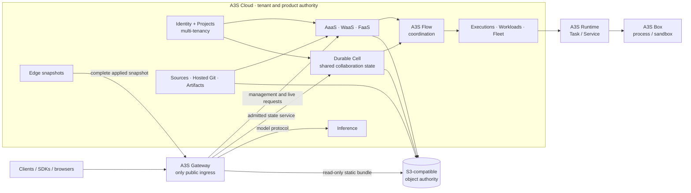

# A3S Cloud AI Service Platform Architecture

## 1. Product boundary

A3S Cloud is an Agent-first, Flow-native control plane with four first-class
service capabilities:

- **AaaS — Agent as a Service:** durable, governed Agent executions, including
  stateful coding Agents such as A3S Code;
- **WaaS — Workflow as a Service:** durable graphs that chain, parallelize,
  suspend, resume, cancel, and compensate Agent and Function work; and
- **FaaS — Function as a Service:** finite hosted Functions, low-latency
  stateless Functions, and governed calls to external FaaS providers; and
- **Durable Cell:** tenant-scoped persistent collaboration spaces in which
  humans and multiple Agents share serialized state, alarms, presence, and
  hibernatable connections under one fenced writer epoch.

AaaS, WaaS, and FaaS remain the first delivery sequence. Durable Cell's lower
near-term implementation priority is sequencing only: it has equal
architectural status, an explicit domain owner, public contract, deployment
profile, scaling model, and availability gate.

Cloud also supplies the platform capabilities those services require:
multi-tenancy, identity, Secrets, audit, code hosting, source integration, OCI
artifacts, S3-compatible object storage, model inference, static Web hosting,
traffic policy, operations, search, and observability.

This document is the canonical high-level boundary. Named product gates in
[ROADMAP.md](../ROADMAP.md) remain the authority for availability.

## 2. First-principles architecture

The design follows seven invariants:

1. External traffic has one ingress: A3S Gateway.
2. Product semantics have one durable owner in Cloud.
3. Durable coordination has one mechanism: A3S Flow under the owning context.
4. Executable lifecycle has one library contract: A3S Runtime `Task` and
   `Service`.
5. Production process and sandbox mechanics have one provider: A3S Box behind
   Runtime.
6. Mutable state and immutable bytes are different authorities.
7. A supporting capability may be shared, but it may not become a second
   scheduler, queue, credential store, object authority, or route publisher.



The diagram shows authority, not network shortcuts. Gateway never mutates
product state or starts a Runtime Unit. Cloud never controls a Box process
directly. Runtime/Box endpoints are internal and become reachable only after
Cloud admits exact generation-bound evidence into an Edge snapshot.

## 3. Service scenarios and purpose

| Service | Primary scenarios | Why it exists |
| --- | --- | --- |
| AaaS | Coding Agents, research Agents, support Agents, autonomous operations, long-running tool use | Preserve semantic execution, approvals, checkpoints, workspace ownership, provider recovery, and audit across process loss |
| WaaS | Agent pipelines, human approval flows, evaluation loops, ingestion, scheduled automation, multi-Agent coordination | Make ordering, parallel waves, waits, retry, cancellation, and compensation durable without embedding orchestration in Agents or Functions |
| FaaS | Workflow steps, Agent Tools, transforms, webhooks, scheduled jobs, sessionless MCP, low-latency APIs, external Lambda/Workers calls | Offer bounded compute and integration without a product-specific scheduler or provider retry loop |
| Durable Cell | Human/Agent rooms, multi-Agent blackboards, live shared sessions, presence, device sessions, per-key coordination, alarms, and hibernatable connections | Provide named low-latency collaboration state with serialized turns, durable acknowledgement, and explicit storage/writer fencing without turning Workflow or Agent history into a shared mutable database |

## 4. Runtime projection

A3S Runtime is the unified execution library. A3S Box is its production
provider. Product types never enter the Runtime wire contract.

| Cloud semantic shape | Runtime projection | What is explicitly not projected |
| --- | --- | --- |
| Stateful Agent Harness | Fenced warm `Service`; bounded batch Agent may use `Task` | Conversation, AgentExecution, semantic sequence, approval, checkpoint, provider run |
| WorkflowRun | No Unit | Graph, step attempt, wait, retry, compensation, Flow history |
| Finite hosted Function | `Task` through Executions | Function invocation aggregate or scheduler |
| Stateless hosted Function / sessionless MCP | `Service` through Workloads | Function/MCP protocol fields or public route |
| External FaaS | No local Unit; Connector attempt | External provider control plane or guessed retry |
| Durable Cell application replica | Ordinary `Service` | Individual named Cell, SQLite lineage, alarm, writer epoch |
| Static React/Vue build | Sandboxed `Task` | The published static site; serving has no per-site process |
| SSR/BFF or stateful Web server | Ordinary `Service` | Framework-specific Runtime class |

Cloud consumers compose the generic `a3s-runtime::RuntimeConsumerRequirements`
for capability, semantics-profile, health, and endpoint admission. They retain
their own product checks. No context may reproduce generic class/capability/
observation readiness logic or invoke A3S Box outside Runtime.

**Component status on 2026-09-01:** Cloud pins `a3s-runtime` `0.5.0` at
`4c5fbd56bedd84d1007a7d9cd046a9f7083bbdcd` and Box `3.2.0` at
`7604995e3cef057a8122ccc9b30e501e917e37f6`; Box resolves that exact Runtime
source identity. Runtime preserves one opaque Identity attachment across Unit
Spec and provider evidence and now separates Service readiness, liveness, and
graceful-shutdown intent. Confidential Box attestation binds the attachment to
the exact provider resource. The exact
[Box CI](https://github.com/A3S-Lab/Box/actions/runs/33429756832) passes native
and aarch64 OCI lifecycle and SDK certification, Linux and macOS build checks,
Windows WHPX, Clippy, and unit tests. Execution Tasks, ordinary and
placement-group Services, Agent readiness, and the Durable Cell provider gate
call `RuntimeConsumerRequirements` instead of maintaining local generic
capability/readiness rules. Hosted Agents additionally require the
`ServiceLifecycle` feature and bind both health signals plus shutdown grace to
the Code-owned manifest. This closes the pinned library and Box integration
slice only; current hardware-provider, recovery, and product release gates
still decide availability.

## 5. DDD context map

### 5.1 Core domains

| Product capability | Owning context and aggregate |
| --- | --- |
| AaaS | Agents owns `AgentConversation`, `AgentExecution`, semantic events, approval/checkpoint/fork lineage, and provider binding |
| WaaS | Workflow owns ontology, immutable Workflow definition/revision/plan, `WorkflowRun`, HumanTask, and graph outcome |
| FaaS | Assets owns immutable Function release/profile; an invocation delegates to Executions, Workloads, or Connectors according to its mode until distinct Function invariants justify a bounded context |
| Durable Cell | Durable Cells owns application identity, immutable revision, compatibility/retention intent, and exact deployment/storage correlation |

### 5.2 Supporting and generic subdomains

| Capability | Sole authority | Reused by |
| --- | --- | --- |
| Multi-tenancy and authorization | Identity + Projects | Every command, query, route, object reference, and usage fact |
| Hosted code | Assets Hosted Git | Agent, Function, Web, MCP, Skill source releases |
| External source discovery | Sources | GitHub and later admitted providers; no persistent provider inventory cache |
| Build and OCI registry publication | Artifacts | Agent, Function, MCP, Web/SSR build outputs |
| Immutable bytes | One deployment S3-compatible object authority with typed namespaces | Files, snapshots, Function outputs, static Web bundles, artifacts, evidence |
| Mutable storage | Data / S0 | Durable Cell namespaces, backup, restore, retention, deletion and fencing |
| Model and weight supply | Inference Model/Revision/WeightVariant + Artifacts manifest + shared S3 objects + Fleet cache | Exact ModelScope/Hugging Face/import resolution, license/trust, sharded weights, tokenizer/config/card objects, node prewarm, and reproducible Power admission |
| Model serving | Inference over Workloads/Fleet/Runtime/Box and A3S Power | AaaS, WaaS and FaaS model calls, including independent replicas, gang-distributed model replicas, and phase-disaggregated serving; currently planned under `I0` |
| Static Web delivery | Assets + Applications + Edge; Gateway serves the admitted object target | Agent UIs, Workflow consoles, Function frontends, preview deployments; planned under `WEB0` |
| Credentials | Secrets | Runtime projection, Connectors, object access, registry access, Gateway policy |
| Public traffic | Edge desired state + Gateway applied snapshot | All management and live service access |
| Durable operations | Operations + A3S Flow | Every long-running product mutation |
| Placement and scaling | Workloads + Fleet | Agent, Function Service, MCP, Durable Cell, inference, SSR |

Hosted Git is an Asset source boundary, not a general-purpose forge. OCI
registry publication is an Artifact concern. S3 is supplied externally: Cloud
uses Rust `object_store` with the AWS/S3 adapter and does not bundle an S3
server.

## 6. AaaS

A stateful Agent execution has two independent durable scopes:

- Agents owns semantic state: conversation, AgentExecution, provider command,
  ordered events, approvals, checkpoints, fork and trajectory.
- Runtime owns process state: exact Service unit, generation, provider resource,
  health, endpoint, logs and cleanup.

The execution binds tenant, release, provider profile, Workload revision,
Deployment, replica, node, Runtime unit/generation/spec digest, endpoint,
provider run and exclusive workspace lease before dispatch. Same-generation
provider recovery preserves the binding. Cross-node recovery first fences the
old workspace writer and verifies a logical checkpoint.

A3S Code invokes hosted or external Functions as governed Tools through the
AgentExecution Flow. The Harness receives no provider credential and owns no
external retry loop.

## 7. WaaS

Workflow is a first-class product, not an Agent implementation detail. Its
outer Flow owns graph order, parallel waves, step attempt, waits, timeout,
retry, cancellation and compensation. An Agent node starts or adopts one
Agents-owned AgentExecution and waits for an Agents-owned terminal result. A
Function node starts or adopts the selected Execution, Workload request, or
Connector attempt.

An AgentExecution may have its own child Flow for provider recovery and Tools.
The outer and child histories have different authorities and are linked by
immutable parent/child identities; neither copies or drives the other.

## 8. FaaS

One immutable Function profile selects exactly one mode:

- `hosted_task`: finite/asynchronous work through Executions and Runtime Task;
- `hosted_service`: low-latency stateless HTTP through Workloads and Runtime
  Service, published only by Edge/Gateway; or
- `external`: one Connector revision and attempt with explicit indeterminate
  outcome semantics.

Scale-to-zero belongs to the sole Workloads autoscaler. Gateway may publish
bounded demand evidence but cannot start Runtime units. Sessionless MCP may use
the stateless Service profile; MCP admission and protocol enforcement remain
Assets/MCP and Gateway responsibilities.

## 9. Durable Cell

Durable Cell is a first-class stateful collaboration service. One application
replica is an ordinary Runtime Service on Box. A named Cell commonly represents
one room, team, session, shared Agent blackboard, or another application-local
coordination key. It may serialize human and Agent turns, retain shared values,
deliver alarms, preserve hibernatable connections, and recover acknowledged
state after process or node loss.

A named Cell is provider-owned online state, not a Cloud aggregate or Runtime
Unit. Data/S0 owns the namespace and recovery lifecycle; Durable Cells owns
application compatibility and correlation; Workloads/Fleet owns placement;
Edge/Gateway owns exposure. Identity and Gateway authenticate participants,
while application code owns the room-level collaboration rules.

Agents and Workflows may call a Cell only through an admitted service/Tool
contract. A Cell can hold a live shared view or coordination object, but it
does not replace AgentExecution semantic history, A3S Flow ordering,
WorkflowRun state, durable documents, Function invocation evidence, workspace
checkpoints, or the object store.

## 10. Distributed inference service

Inference is a first-class shared platform service and reuses the same generic
deployment chain. An `InferenceDeployment` owns model, backend, serving
objective, phase topology, cache policy, and immutable role intent. It projects
one or more managed Workload role slots. Each slot is an ordinary Runtime
Service or a gang placement group of Services; A3S Power remains the sole local
model-serving boundary.

The architecture preserves the useful outcomes of llm-d-like systems without
importing a second control plane:

- an inference pool is a read projection over eligible Workload endpoints;
- request endpoint picking is an A3S Gateway inference strategy, distinct from
  Workloads/Fleet resource placement;
- aggregated, tensor/pipeline/expert-parallel, and encode/prefill/decode role
  topologies are typed values under one deployment revision;
- Power owns model execution and opaque KV transfer; Gateway never handles KV
  bytes and Cloud never persists prompt/token/block contents; and
- role pools may scale independently through the sole Workloads autoscaler,
  while one distributed replica remains all-or-none through PlacementGroup and
  gang Claims.

Gateway publishes and selects only a complete compatible serving cohort from
one deployment revision. Cache affinity, queue depth, TTFT, token throughput,
and phase pressure are bounded observations, not desired-state or placement
authority. See [Inference Platform Plan](inference-plan.md) and
[Elastic Service Deployment Architecture](elastic-service-deployment-architecture.md).
Model discovery and bytes follow
[Model and Weight Supply Architecture](model-supply-architecture.md): Inference
owns the semantic revision, Artifacts owns the canonical weight manifest, S3
owns immutable files, and Fleet owns only cache observations.

## 11. Shared invocation authority

Workflow nodes, Agent Tools, APIs, and Automations carry one conceptual
invocation authority:

```text
tenant + parent + immutable target + slot/attempt + input digest/reference
+ deadline + idempotency key + authorization/grant + egress class
```

Each target retains a typed owner-specific port and result. The shared envelope
does not become a universal executor, repository, queue, provider SDK, or result
union.

## 12. Architecture fitness rules

Source and review gates must reject:

- product-specific Runtime unit classes or direct Cloud-to-Box lifecycle calls;
- a Workflow Runtime Unit or a second Flow history;
- Agent-, Function-, Cell-, model-, Web-, or MCP-specific schedulers,
  autoscalers, node journals, endpoint registries, object clients, Secret
  stores, audit stores, or Gateway publishers;
- public Runtime/Box endpoints or a Gateway-created Unit;
- Function retry on ambiguous external transport outcome;
- a per-site Runtime Service for a purely static bundle;
- Durable Cell as hidden storage for another product aggregate;
- a second inference resource scheduler, endpoint registry, KV authority, or
  model process lifecycle outside Inference/Workloads/Fleet/Gateway/Power; and
- inference, Web hosting, FaaS, or Durable Cell availability claims before
  their named real-provider and cross-repository gates pass.

## 13. Delivery order

1. Preserve the verified multi-tenant foundation and shared mechanism owners.
2. Keep Cloud pinned to the landed unified Runtime consumer contract and
   re-certify A3S Box; the library-adoption slice is complete, provider evidence
   remains open.
3. Close AaaS and first-class Workflow Agent-node recovery.
4. Deliver finite and external FaaS, then hosted stateless Service FaaS.
5. Deliver static Web hosting for Agent/Application UIs.
6. Complete model inference gates required by Agents and Functions.
7. Continue the first-class Durable Cell provider/state/traffic certification
   as an independently releasable lane; its later sequence does not weaken its
   service boundary or public contract.

Parallel work is allowed only when it does not create a second authority or
claim availability before shared dependencies close.
