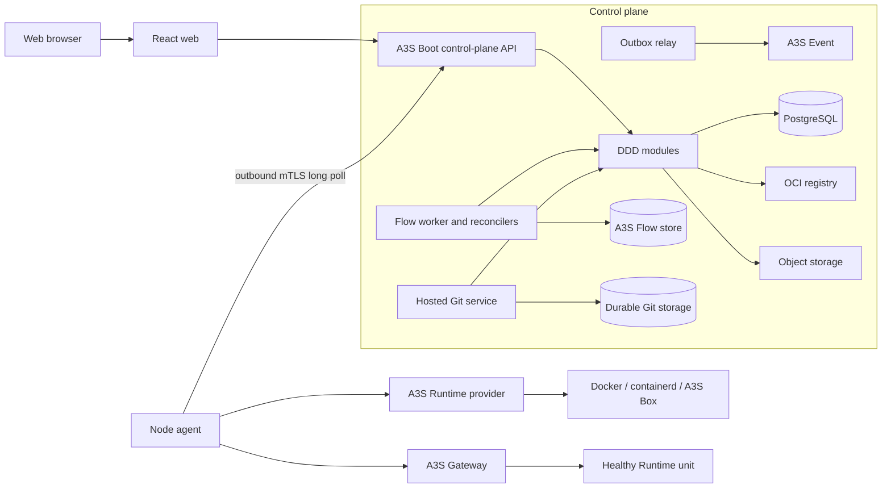

# A3S Cloud Technical Architecture

## 1. Status and decisions

R0 through D0 are implemented and verified. E0 now has durable Edge route
ownership, healthy target resolution, complete snapshot compilation, Fleet
dispatch, and exact acknowledgement projection verified against PostgreSQL.
The routed data-plane and later sections remain the accepted design until their
exit gates pass. A3S Cloud ships as a Rust modular monolith, a separate Linux
node agent, and a React web application. The first release still requires the
E0 routed Gateway/TLS, logs, update, and rollback loop before multi-node
scheduling or hosted assets begin.

The following decisions are fixed for the first architecture:

- A3S Runtime is the required provider-neutral data-plane contract.
- A3S Runtime is general purpose. Candidate and Judge remain Bench concepts and
  do not appear in the Runtime core contract.
- PostgreSQL stores business desired state.
- A3S Flow stores durable operation history and coordinates long-running work.
- A transactional outbox publishes committed facts through A3S Event.
- Node agents connect outward over mutually authenticated HTTPS. Nodes never
  receive PostgreSQL or NATS credentials.
- A3S Gateway receives complete, versioned configuration snapshots.
- Asset hosting supports exactly Agent, MCP, and Skill.
- AHP is not a dependency.

## 2. System shape



The API, Flow worker, outbox relay, and reconcilers initially ship in one
control-plane binary with selectable process roles. They share modules and
ports but not in-memory correctness assumptions. A production deployment may
run the roles as separate processes without splitting the domain into network
services.

## 3. Universal A3S Runtime boundary

### 3.1 Resolved Runtime prerequisite

The earlier Runtime contract encoded Candidate and Judge roles, Bench-specific
validation, and caller-owned provider policy. R0 replaced that surface with a
small provider-neutral execution unit. The same managed client now runs finite
Tasks and long-running Services, including ports, health, restart policy,
capability matching, durable identity, and idempotent recovery. Bench-specific
profiles remain outside Runtime.

### 3.2 Core model

The core noun is `RuntimeUnit`, not Candidate, Judge, Asset, Deployment, or
Cloud Workload. A unit has an immutable specification and one of two lifecycle
classes:

```text
RuntimeUnitClass
├── Task       # finite execution: build, evaluation, migration, one-off job
└── Service    # long-running execution: application, Agent, MCP server
```

The general contract contains typed fields for:

- stable `unit_id`, monotonically increasing `generation`, and spec digest;
- a digest-pinned runnable artifact and process definition;
- artifact, volume, and secret-reference inputs;
- resource limits and an isolation requirement;
- network mode, declared service ports, and egress policy;
- optional health checks and restart policy;
- named output artifacts for finite tasks;
- an optional semantics-profile digest used for higher-level attestation.

Mutable image tags, provider command lines, organization IDs, Cloud deployment
states, and arbitrary provider option maps do not belong in this contract.
Providers advertise accepted artifact media types and capabilities before an
application submits a unit.

The core may own `ProviderId`, provider factories, and a provider registry. It
does not choose a provider based on login state, an operator config file, or a
hard-coded Docker fallback. Cloud selects a node/provider by required
capabilities; Bench and Code own their own explicit selection policies.

The provider-neutral client surface is:

```text
capabilities()       -> RuntimeCapabilities
apply(request)       -> RuntimeObservation
inspect(unit_id)     -> RuntimeObservation
stop(request)        -> RuntimeObservation
remove(request)      -> RuntimeObservation
logs(query)          -> ordered log chunks       # capability-gated
exec(request)        -> attached execution       # capability-gated
```

`apply` covers both initial creation and convergence to a newer generation.
Every mutating request has an idempotency key and deadline. Repeating the same
key and canonical request returns the same logical result; reusing the key for
different content is a conflict. A lower generation is rejected, and provider
loss is reported as `unknown`, never silently recreated under a new identity.

Observations distinguish desired convergence from lifecycle state. A Task may
reach `succeeded`; a Service converges while `running` and healthy. The common
states are `accepted`, `preparing`, `starting`, `running`, `stopping`,
`stopped`, `succeeded`, `failed`, and `unknown`. Removal is represented by an
explicit not-found observation rather than a fabricated successful execution.

Capabilities use structured sets instead of provider names or a growing list
of product-specific booleans. They describe supported unit classes, artifact
media types, isolation levels, network modes, mount kinds, health-check kinds,
resource controls, logs, exec, durable identity, and cancellation. Scheduling
fails closed when the required capability set is unavailable.

### 3.3 Domain profiles stay outside Runtime

Bench owns Candidate/Judge validation and converts a validated Bench execution
profile into a Task `RuntimeUnitSpec`. Candidate checkpoints, submission
snapshots, Judge protected results, and their privacy rules are interpreted by
Bench. Runtime only enforces the generic mounts, output descriptors, isolation
requirements, resource policy, and bound semantics-profile digest.

A3S Cloud performs a similar projection from an immutable `WorkloadRevision`
to a Service `RuntimeUnitSpec`. Runtime does not import Cloud domain types.
Builds and migrations use the same client with Task units. Agent and MCP are
ordinary Service units at this boundary; Skill is an immutable input binding,
not a runnable Runtime class.

Runtime deliberately does not own:

- tenants, projects, environments, assets, or releases;
- scheduling across nodes;
- build graphs, deployment workflows, routes, certificates, or DNS;
- Candidate/Judge rules or evaluation scoring;
- caller authentication state or default-provider selection policy;
- provider installation and cluster membership.

This keeps Runtime reusable without turning it into a second control plane.
Function invocation, schedules, interactive sessions, and batch fan-out are
higher-level profiles or orchestration patterns over Task and Service; they do
not require more product-role variants in the core lifecycle enum.

### 3.4 Provider conformance

`RuntimeClient` owns protocol semantics. `RuntimeDriver` owns provider calls.
The shared managed client owns idempotent reservation, monotonic generation,
reattachment, terminal-state protection, and durable operation identity.
Drivers may use Docker, containerd, A3S Box, or another provider, but callers
never branch on those names to weaken semantics.

The Runtime repository must expose a conformance suite. Each provider must
prove duplicate apply, process restart and reattachment, stale-generation
rejection, capability mismatch, stop/remove idempotency, bounded cancellation,
log ordering, and truthful loss reporting against a real provider.

## 4. Control-plane modular monolith

The control plane uses A3S Boot modules, typed dependency injection, CQRS, the
request pipeline, OpenAPI, configuration validation, and lifecycle hooks. Each
business module follows the repository's four-layer DDD rules in Rust form:

```text
modules/{context}/
├── domain/
│   ├── entities/
│   ├── value_objects/
│   ├── repositories/
│   ├── services/             # traits only
│   └── events/
├── application/
│   ├── commands/{use_case}/
│   └── queries/{use_case}/
├── infrastructure/
│   ├── persistence/
│   └── integrations/
├── presentation/
│   ├── controllers/
│   └── dto/{request,response}/
└── module.rs
```

Domain code has no A3S Boot, SQL, HTTP, Runtime, Flow, Event, or provider
imports. Application handlers depend on domain repository and service traits.
Infrastructure implements those ports. Controllers only validate transport
input, establish tenant context, and dispatch a command or query.

Cross-context mutation happens through application ports or commands, never by
writing another module's tables. Domain events are integration facts after the
originating transaction commits; they are not a substitute for an invariant
inside the same transaction.

| Module | Commands owned by the module | Important outbound ports |
| --- | --- | --- |
| Identity | create organization, manage membership/token | password/identity provider, audit |
| Projects | create project/environment, request deletion | operation coordinator |
| Assets | create asset, accept Git revision, publish/yank release | Git store, artifact registry |
| Artifacts | register, verify, sign, retain artifact | OCI registry, object store, signer |
| Fleet | issue enrollment, accept node observation, drain/revoke node | certificate authority, node control |
| Workloads | create revision, deploy, stop, update, roll back | scheduler, Runtime dispatch, Flow |
| Edge | claim domain, publish/remove route | DNS verifier, Gateway publisher, ACME |
| Data | provision database/volume, back up, restore | Runtime dispatch, object store |
| Secrets | create version, bind, rotate, revoke | envelope encryption, node secret delivery |
| Operations | start/cancel operation, rebuild projection | A3S Flow, audit, notification |

## 5. Data and consistency ownership

PostgreSQL is authoritative for aggregates, desired state, idempotency records,
the outbox, and UI projections. A3S ORM supplies parameterized queries,
transactions, migrations, and PostgreSQL access. Each aggregate row carries a
version; commands use optimistic concurrency rather than last-write-wins.

The Flow event store uses a separate PostgreSQL schema. A business transaction
does not attempt a distributed transaction with Flow. The deployment command
first commits a `Deployment` and outbox row. An idempotent operation starter
then ensures the Flow run exists with `deployment_id` as its business key.
Periodic reconciliation repairs a crash between those two actions.

The outbox relay publishes through A3S Event and records delivery attempts.
Consumers deduplicate by `event_id`. In a single-process installation Event may
use its local provider; scaled installations may use NATS. Event delivery is
never the only way to discover unfinished desired state.

## 6. Deployment and reconciliation

A deployment follows these durable steps:

1. Resolve the source to a commit SHA and/or OCI digest.
2. Commit an immutable workload revision and queued deployment.
3. Select a ready node whose reported Runtime capabilities satisfy the spec.
4. Lease an apply command to that node using `deployment_id` and generation.
5. Wait for a matching Runtime observation from the node.
6. Run the declared health check through the actual service path.
7. Publish a complete Gateway configuration revision when a route is required.
8. Wait for the Gateway acknowledgement of that exact revision.
9. Atomically select the healthy deployment as active.
10. Stop the old revision after the rollback window policy permits it.

The reconciler compares database desired state with the last accepted node and
Gateway observations. It periodically scans all nonterminal and stale records,
so a lost event, restarted worker, or expired command lease cannot strand work.
Only one reconciler lease may advance an aggregate generation at a time.

Each external step has its own attempt timeout, retry policy, and total
deadline. Source resolution, image pull, Runtime apply, health stabilization,
Gateway publication, certificate issuance, log idle time, and Flow run lifetime
must not share one global timer. Cancellation stops new steps, propagates to the
active Runtime request, waits for a bounded acknowledgement, and records any
cleanup that still requires reconciliation.

A deployment succeeds only when observed Runtime generation equals desired
generation, required health is real and current, and the requested Gateway
revision is active. A failed update leaves the prior healthy revision selected.

## 7. Node agent and control protocol

The node agent is intentionally small. It discovers provider capabilities,
leases commands, calls the local Runtime provider, persists command outcomes,
reports observations, streams bounded log chunks, and publishes local Gateway
snapshots. It does not schedule workloads or evaluate tenant authorization.

Enrollment uses a short-lived one-time token. The node creates its private key
locally and exchanges a proof for a short-lived client certificate. Normal
traffic is outbound mutually authenticated HTTPS:

```text
POST /v1/node-control/commands:lease       # bounded long poll
POST /v1/node-control/commands/{id}:ack
POST /v1/node-control/observations
POST /v1/node-control/log-chunks
POST /v1/node-control/gateway-acks
```

A command envelope contains `command_id`, `node_id`, `sequence`,
`aggregate_id`, `generation`, `payload_schema`, `payload_digest`, `issued_at`,
`not_after`, and a correlation ID. The server may redeliver until a durable
acknowledgement exists. The agent rejects expired, regressed, mismatched, or
digest-conflicting commands and returns the previous result for an exact
duplicate.

Gateway publication is a distinct node command and never enters A3S Runtime.
Its payload carries one complete ACL snapshot, a positive revision, the
expected installed revision, and a SHA-256 digest. The node compares the
expected revision, calls the node-local management API with independent
validation and reload deadlines, and atomically persists the installed snapshot
only after Gateway confirms a transactional reload. Its acknowledgement binds
`command_id`, `node_id`, revision, and snapshot digest; the control plane rejects
an acknowledgement that does not match the exact persisted command.

The agent persists its command journal and last accepted generation locally.
Provider labels also bind resources to unit ID, generation, and spec digest so
the journal can be reconstructed after partial disk loss. SSH remains an
explicit break-glass operator action, never the control protocol.

## 8. Gateway and edge publication

For the first vertical slice, A3S Gateway runs on the workload node. The Edge
module persists one hostname/path owner per Gateway node scope. A publication
may target only the workload's active immutable revision, a declared TCP port,
and a current healthy Runtime observation. Docker observations expose the
selected node-local HTTP origin as a typed evidence claim; Docker-specific
container and port-binding details do not cross into the Route domain.

The compiler sorts every active route plus the proposed route and emits one
deterministic, versioned ACL snapshot. A Gateway scope permits only one pending
complete snapshot. Its PostgreSQL transaction binds route, scope revision,
snapshot digest, command ID, original correlation ID, idempotency record, and
outbox fact. A replay therefore reuses the first Fleet command identity even
when the retry arrives under a new HTTP request ID. The application checks this
durable replay before consulting current workload health, so later observation
expiry or workload-state drift cannot turn an already accepted identical
request into a conflict.

Incremental route mutation is forbidden because a partial retry could expose a
route to the wrong tenant or revision. Snapshot publication uses compare-and-
swap against the previous installed revision. Fleet persists a Gateway
acknowledgement before projecting it into Edge. Only an `applied`
acknowledgement matching the exact node, command, revision, and digest moves a
route from `publishing` to `active`; rejection is terminal and replay is
idempotent.

Certificate references and HTTPS compilation remain part of E0, not current
behavior. A3S Gateway 1.0.12 fixes route ACL parsing. Cloud's release gate now
validates the exact compiler output, atomically reloads two route-bearing
snapshots through the management API, proves live HTTP traffic switches to the
new backend, and verifies a rejected successor preserves the last good live and
durable revision. The deterministic certificate and real TLS gates remain open.

## 9. Source, build, and asset hosting

The generic source pipeline is:

```text
source reference -> immutable revision -> build/provenance -> artifact digest
                 -> workload revision -> deployment
```

External Git inputs resolve a branch or tag once, then build the pinned commit
with a Runtime Task. OCI inputs resolve a tag once and deploy only the manifest
digest. Build cache keys include source digest, recipe digest, builder digest,
platform, and declared inputs.

Hosted assets follow a separate publication chain:

```text
Asset -> Git commit -> validation/release gate -> Artifact -> Listing -> Deployment
```

PostgreSQL stores asset and release metadata. The authoritative bare Git
repository lives on durable POSIX storage and is addressed by immutable
`asset_id`; a distributed single-writer lease protects ref updates. Smart HTTP
is implemented before SSH. Object storage holds atomic repository bundles,
backups, release archives, and other content-addressed artifacts, not a live
file-by-file mirror of Git objects.

`.a3s/asset.acl` accepts only Agent, MCP, or Skill manifests. Published releases
bind commit SHA, manifest digest, and artifact digest. Agent and MCP releases
may produce Service units. Skill releases produce bundles that may be bound as
immutable inputs; they are not deployed alone.

## 10. Secrets and security

- Every tenant-owned row includes `organization_id`; repository methods require
  tenant context and cross-tenant references fail before persistence.
- Secret versions use envelope encryption. Ciphertext, key ID, and metadata are
  stored separately from access policy.
- A node receives only the secret versions needed for a leased generation,
  encrypted to the node identity with a short validity period.
- Plaintext secrets are excluded from Runtime specs, events, Flow payloads,
  command journals, logs, traces, and API responses.
- Build network access is deny-by-default and separately configurable from a
  deployed service's network policy.
- Node certificate revocation immediately prevents new command leases. Drain
  and revoke are different operations.
- Artifact digest verification is mandatory; signing and provenance policy can
  be tightened without changing workload identity.

## 11. API and web application

HTTP APIs are versioned under `/api/v1`. Mutating endpoints accept an
`Idempotency-Key`. Fast commands return the committed resource; long-running
commands return `202` with an Operation link. The shared A3S Boot interceptor
wraps every response in the repository-standard shape:

```json
{
  "code": 200,
  "message": "Success",
  "data": {},
  "requestId": "uuid",
  "timestamp": "2026-07-14T00:00:00.000Z"
}
```

Errors include HTTP `code`, stable business `statusCode`, safe `details`,
`requestId`, and `timestamp`, and are documented in OpenAPI. Queries use cursor
pagination. Operation updates use resumable SSE with an event sequence; the UI
always reloads the authoritative projection after reconnecting.

The React application is organized by the same bounded contexts. It never
derives success from an emitted event or an optimistic spinner. Deployment,
health, route, and operation states remain visually distinct.

## 12. Observability and audit

Every API request, command, Flow run, Runtime unit, Gateway revision, event, and
log stream carries the same correlation chain. Structured logs redact by field,
not by best-effort string replacement. Metrics cover queue age, reconcile lag,
command lease expiry, Runtime convergence, health latency, Gateway publication,
outbox lag, certificate expiry, and node heartbeat age.

Audit records capture actor, tenant, command, target, result, request ID, and
time. They are append-only business records, not copies of debug logs. A3S
Observer and A3S Sentry remain optional until their identity and redaction
boundaries satisfy these requirements.

## 13. Dependency policy

| Component | Decision | Owned capability |
| --- | --- | --- |
| A3S Boot | Required | HTTP, DI, CQRS, validation, OpenAPI, lifecycle |
| A3S ACL | Required | Typed block-structured product configuration and asset manifests |
| A3S ORM | Required | PostgreSQL queries, transactions, migrations |
| A3S Runtime | Required after generalization | Provider-neutral Task and Service lifecycle |
| A3S Flow | Required | Durable deployment/build/backup operations |
| A3S Event | Required | Committed integration-fact API over local or NATS providers |
| A3S Gateway | Required for public routes | Proxy, TLS, ACME, atomic reload target |
| A3S Box | Conditional | Stronger Agent/MCP isolation where selected |
| A3S Observer / Sentry | Conditional | Telemetry or wire security after boundary review |
| A3S Lane | Not initially used | Flow's PostgreSQL task leases already own durable work |
| AHP | Excluded | No required Cloud capability |
| A3S Code, Memory, Search, Power, Bench, Updater | Not product dependencies | No capability in the first Cloud loop |

The A3S dependency list is not the complete infrastructure design. Build,
artifact, key-management, certificate, telemetry, and storage capabilities are
provided by the middleware below rather than reimplemented in A3S Cloud.

## 14. Distributed middleware and infrastructure

### 14.1 Adoption matrix

| Capability | Local / first-node profile | Distributed production profile | Decision |
| --- | --- | --- | --- |
| Transactional state and coordination | PostgreSQL | HA PostgreSQL; PgBouncer when measured connection pressure requires it | Required from F0; remains the source of desired state and leases |
| Durable workflow work | A3S Flow PostgreSQL store and task queue | The same store/queue with multiple leased workers | Required; do not add another job queue for the same work |
| Integration event fan-out | A3S Event local provider | NATS JetStream durable streams and consumers | NATS is required when API, workers, or integrations run as independent replicas |
| OCI build execution | Rootless BuildKit | Isolated BuildKit workers selected by platform/architecture | Required when external Git or hosted source builds are enabled |
| OCI artifact storage | Existing external registry for image-only deployment | CNCF Distribution or Harbor with retention, replication, and access policy | Cloud-owned registry is required when Cloud owns builds |
| Object and log-segment storage | Filesystem adapter for development | S3-compatible storage such as RustFS, MinIO, or a managed S3 service | Required for production logs, asset archives, backups, SBOMs, and provenance |
| Hosted Git repository storage | Local durable POSIX filesystem | Replicated POSIX/block storage with PostgreSQL single-writer leases and object-store backups | Required only when hosted assets are enabled; live loose Git objects do not use S3 |
| Workload persistent volumes | Node-local, single-writer volume provider | Ceph RBD or another fenced attach/detach provider | Required for stateful services; multi-node failover is forbidden without fencing evidence |
| Secret key encryption | Development-only local key provider | OpenBao/Vault Transit or a cloud KMS/HSM-backed key provider | A production profile may not keep the master key as a plain environment variable |
| Node certificate authority | Development intermediate CA | OpenBao/Vault PKI, step-ca, or an HSM/KMS-backed intermediate | Required from node enrollment; root material stays outside the control-plane database |
| Metrics and traces | Structured logs plus local OpenTelemetry export | OpenTelemetry Collector, Prometheus-compatible metrics storage, and Tempo/Jaeger when trace retention is enabled | Required before production support; backends remain replaceable |
| Durable log search | PostgreSQL metadata plus S3 chunk objects | Loki or ClickHouse only when cross-node ad-hoc search/retention measurements justify it | Do not put high-volume log bodies in PostgreSQL |
| Cache and distributed rate limits | Bounded in-process cache | Redis only when multiple API replicas need shared ephemeral counters/cache | Optional; never an authority for deployments, sessions, or operations |
| Identity federation | Bootstrap owner and scoped API tokens | External OIDC provider such as Zitadel or Keycloak | Optional until SSO is required; authorization remains in the Cloud domain |

NATS does not replace the transactional outbox or reconciliation. JetStream
provides durable distributed delivery after commit; PostgreSQL still proves
whether a command is required. NATS subjects carry event IDs and compact fact
payloads, not secret material, logs, or Runtime command authority.

BuildKit is a build engine, not the Runtime. A build Flow submits an isolated
Runtime Task containing a BuildKit client and typed recipe; the Build service
selects a BuildKit endpoint, captures provenance, and registers the resulting
digest. Runtime remains unaware of Dockerfiles, buildpacks, or registry policy.

The initial log design writes ordered, checksummed chunks to object storage and
keeps cursors, time ranges, stream identity, and retention state in PostgreSQL.
Live subscribers receive bounded fan-out directly from the ingestion service.
Loki or ClickHouse is introduced only when product requirements demand global
text search at a volume that the chunk index cannot serve.

### 14.2 Middleware deliberately not selected

- Kafka or RabbitMQ: NATS JetStream covers current event fan-out; Flow/Postgres
  covers business work queues.
- Redis as a primary requirement: no authoritative state, lock, or queue needs
  it in the first architecture.
- etcd or Consul: PostgreSQL leases and the Fleet registry already own control-
  plane coordination and node discovery.
- Elasticsearch/OpenSearch: PostgreSQL metadata search is sufficient until a
  measured asset or audit search requirement exceeds it.
- Kubernetes and a service mesh: neither is required to operate the outbound
  node protocol or first-node deployment loop.
- Temporal: A3S Flow owns durable workflows; adding a second workflow authority
  would split operation history.

Every optional middleware is hidden behind a typed application port. A new
provider is selected by validated A3S ACL and capability discovery, never by
branching on raw backend-name strings inside a domain module.

## 15. Deployment profiles

Development runs one control-plane process, PostgreSQL, a local registry and
object-store adapter, one node agent, Docker, and A3S Gateway. Production adds
external KMS/PKI, S3-compatible storage, OpenTelemetry collection, and NATS
JetStream when roles are replicated. Git builds add BuildKit and an owned OCI
registry. Correctness must remain unchanged: all coordination uses
PostgreSQL/Flow leases, idempotent commands, and observed state rather than
process memory.

Multi-node scheduling, stateful failover, provider-specific autoscaling, and
federated control planes are later capabilities. The first release does not
claim them through placeholder abstractions.
