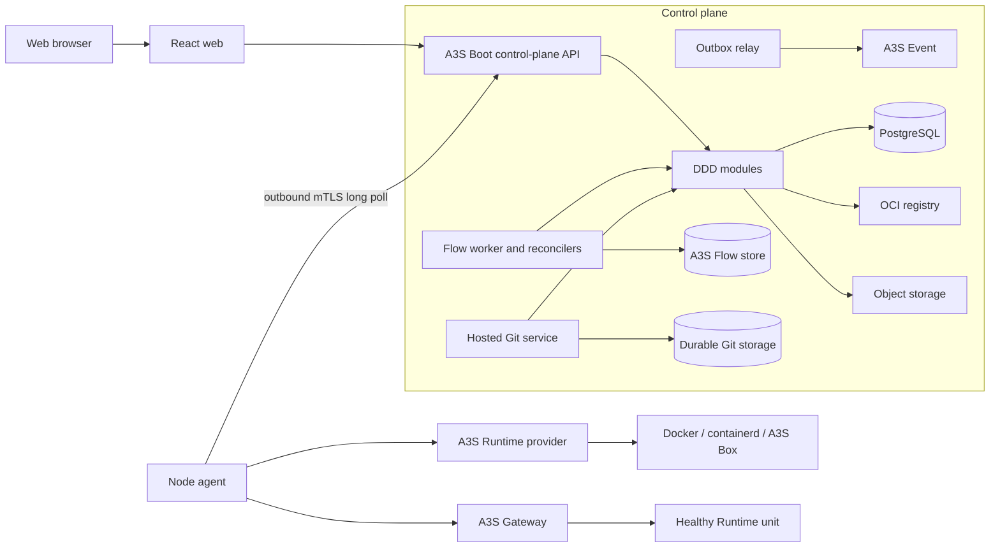

# A3S Cloud Technical Architecture

## 1. Status and decisions

R0 through E0 are implemented and verified. E0 has durable Edge route
ownership, exact and wildcard domain claims, managed Gateway certificate
provisioning, HTTPS-only snapshot compilation, Fleet dispatch, exact
acknowledgement projection, and injected-time renewal/revocation convergence
with delayed provider-serial revocation. It also has tenant-scoped Secret
identities, immutable encrypted versions, rotation and version revocation APIs,
and metadata-only events and idempotency records, typed workload bindings, and
late Docker environment/file injection plus authenticated registry pulls. Committed
rotation events now drive an idempotent worker that derives a new resolved
revision for each affected active workload, advances only matching Secret
references, and atomically records the deployment operation, causal event, and
restart checkpoint. A
dedicated Linux acceptance gate now uses real PostgreSQL
authorization/decryption and Docker to prove active-version environment and
`0400` tmpfs-file injection, and uses a separate encrypted credential to pull
an uncached digest from a registry that rejects anonymous access. The
first-node log slice now
projects active Runtime targets durably, persists bounded batches before mTLS
upload, redacts bound Secret values at the Docker boundary, stores verified
chunk objects through a typed filesystem or S3-compatible adapter, indexes
metadata in PostgreSQL, and exposes tenant-scoped cursor queries with explicit
provider/missing/corrupt gaps. Typed Runtime cursor-loss and source-disconnect
boundaries are persisted and replayed by the node, stored atomically with batch
headers in PostgreSQL, and merged into the same sequence pages and bounded
resumable SSE feed. A bounded control-plane worker removes object bodies after
the configured receipt age while durable `retained` tombstones preserve every
cursor position. An independently configured bounded worker later replaces old
per-chunk tombstones with coalesced durable sequence ranges, and queries expose
those ranges as explicit `compacted` gaps. A dedicated digest-pinned MinIO CI
job defines the real S3-compatible lifecycle gate, and a separate remote
Gateway job exercises managed TLS plus a forced reload-before-acknowledgement
agent crash. The Linux acceptance gate also captures real Docker stdout/stderr
after redaction, persists immutable filesystem objects and PostgreSQL metadata,
kills a child control plane after object publication but before receipt
persistence, adopts the exact object after restart, corrupts a non-secret
record, and reads its ordered `corrupt` gap through the REST API. The Docker
gate also preserves an exact log cursor across provider restart, while the
pinned-MinIO gate verifies deliberate corruption and immutable repair
rejection. The one-node update slice now commits complete
immutable replacement templates, runs candidates on the previous Runtime node,
gates routed cutover on health plus an exact Gateway acknowledgement, and
recovers deterministic old-revision retirement after activation. Unhealthy,
mismatched, and rejected outcomes preserve the previous active revision and
route rows. Manual rollback now selects an older successfully activated
revision, derives a new generation from its exact resolved template, and reuses
the version 2 deployment, cutover, and retirement workflow. PostgreSQL API
coverage proves the durable clone and replay contract, the routed suite proves
exact Gateway cutover, and the isolated Docker suite proves real rollback apply
and retirement. Workload queries now project the complete immutable requested
template with reference-only Secret bindings, and operation queries expose
explicit rollback lineage. The React console consumes those authoritative
projections for deployment history, route/certificate state, complete-template
differences and updates, eligible rollback, and browser-local terminal
operation cleanup. Production now performs bounded DNS TXT ownership
verification through the host resolver. The clean-host release gate now builds
the exact clean Cloud and pinned Runtime revisions, starts pinned PostgreSQL and
registry fixtures, A3S Gateway 1.0.12, the control plane, and one outbound
Docker node, then certifies bootstrap through A→B→cloned-A TLS cutover, ordered
resumable logs, durable stop, source cleanliness, host-inventory equality, and
credential-safe cleanup. This closes the first release. The current G0 slices
add a Sources context with canonical GitHub repository identities, an exact
allow/deny policy, provider-neutral anonymous-first branch/tag/commit
resolution, full
immutable commit IDs, explicit digest-bound Dockerfile recipes, atomic webhook
source-identity reservation, PostgreSQL persistence, and tenant-scoped REST
acceptance/query. A separate public GitHub ingress authenticates the exact raw
body with HMAC-SHA256 and stores only a typed branch-push identity and payload
digest in a durable provider-level replay inbox. A provider-neutral checkout
port and Git adapter fetch an accepted commit under isolated Git configuration,
accept an ephemeral repository-bound credential only for the provider fetch,
reject unsafe tree entries, strip `.git`, and commit an immutable content
receipt. The Artifacts context also owns deterministic PostgreSQL-backed
`BuildRun` attempts and a production reconciler that reserve one initial build
per accepted revision, create fresh child attempts for failed or cancelled
runs, and enqueue one exact `cloud.build@2` Operation for each attempt. The
registered Flow replays and packages the credential-free checkout, selects a
compatible node, dispatches a digest-pinned BuildKit client as a Runtime Task,
validates the complete OCI output graph, persists a deterministic digest-only
registry target, publishes and remotely verifies every reachable descriptor,
generates SPDX and SLSA documents, signs and locally verifies their DSSE
envelope with an Ed25519 local or Vault Transit provider, persists the complete
evidence, and durably removes both the Task and checkout before terminal
completion. The
node-control boundary now also provides command-bound mTLS Artifact streaming:
the control plane stores content-addressed directory archives, and the node
agent verifies, safely materializes, mounts, captures, replays, and reclaims
their exact Runtime input/output identities. A
tenant-scoped GitHub App connection boundary now binds one
verified installation/account to one Cloud organization using single-use
installation and OAuth state, S256 PKCE, and transient GitHub user-token
verification. Environment-owned repository
subscriptions now bind that verified installation to exact
repository/branch/recipe policy,
and the provider inbox atomically fans out immutable revisions only through
the exact active connection. Signed GitHub installation, installation-target,
and App-authorization deliveries reconcile versioned connection status,
retain terminal history, and write typed replay receipts plus outbox facts.
Installation-token authentication and private checkout are
implemented with local provider evidence: the App PEM key and token are
materialized only per attempt, and no credential enters source state, URLs,
receipts, responses, or events. The operator-supplied real private-repository
gate has not been run without provider credentials. External private-provider
certification remains unimplemented. Signed build evidence is implemented and
restored fail-closed from PostgreSQL. The published-build
deployment handoff is implemented: it
accepts an artifact-free service template only for an exact tenant-owned
successful BuildRun whose source revision and remotely verified digest match,
then reuses `cloud.deployment@2` with durable source/build lineage.
Registry publication is implemented and covered by hostile-protocol fixtures
plus an authenticated private Distribution CI gate. The combined
Runtime/BuildKit/Registry gate provisions the operator-controlled shared socket
volume and records the exact isolated Task, publication, replay, and cleanup
evidence.
Unimplemented portions of later milestone sections remain accepted design
until their own exit gates pass. A3S Cloud ships as a Rust modular monolith, a
separate Linux node agent, and a React web application.

The following decisions are fixed for the first architecture:

- A3S Runtime is the required provider-neutral data-plane contract.
- A3S Runtime is general purpose. Candidate and Judge remain Bench concepts and
  do not appear in the Runtime core contract.
- PostgreSQL stores business desired state.
- A3S Flow stores durable operation history and coordinates long-running work.
- A transactional outbox publishes committed facts through A3S Event.
- Node agents connect outward over mutually authenticated HTTPS. Nodes never
  receive PostgreSQL or NATS credentials.
- A3S Gateway receives complete, versioned configuration snapshots.
- Asset hosting supports exactly Agent, MCP, and Skill.
- AHP is not a dependency.

## 2. System shape



The API, Flow worker, outbox relay, and reconcilers initially ship in one
control-plane binary with selectable process roles. They share modules and
ports but not in-memory correctness assumptions. A production deployment may
run the roles as separate processes without splitting the domain into network
services.

## 3. Universal A3S Runtime boundary

### 3.1 Resolved Runtime prerequisite

The earlier Runtime contract encoded Candidate and Judge roles, Bench-specific
validation, and caller-owned provider policy. R0 replaced that surface with a
small provider-neutral execution unit. The same managed client now runs finite
Tasks and long-running Services, including ports, health, restart policy,
capability matching, durable identity, and idempotent recovery. Bench-specific
profiles remain outside Runtime.

### 3.2 Core model

The core noun is `RuntimeUnit`, not Candidate, Judge, Asset, Deployment, or
Cloud Workload. A unit has an immutable specification and one of two lifecycle
classes:

```text
RuntimeUnitClass
├── Task       # finite execution: build, evaluation, migration, one-off job
└── Service    # long-running execution: application, Agent, MCP server
```

The general contract contains typed fields for:

- stable `unit_id`, monotonically increasing `generation`, and spec digest;
- a digest-pinned runnable artifact and process definition;
- artifact, volume, and secret-reference inputs;
- resource limits and an isolation requirement;
- network mode, declared service ports, and egress policy;
- optional health checks and restart policy;
- named output artifacts for finite tasks;
- an optional semantics-profile digest used for higher-level attestation.

Mutable image tags, provider command lines, organization IDs, Cloud deployment
states, and arbitrary provider option maps do not belong in this contract.
Providers advertise accepted artifact media types and capabilities before an
application submits a unit.

The core may own `ProviderId`, provider factories, and a provider registry. It
does not choose a provider based on login state, an operator config file, or a
hard-coded Docker fallback. Cloud selects a node/provider by required
capabilities; Bench and Code own their own explicit selection policies.

The provider-neutral client surface is:

```text
capabilities()       -> RuntimeCapabilities
apply(request)       -> RuntimeObservation
inspect(unit_id)     -> RuntimeObservation
stop(request)        -> RuntimeObservation
remove(request)      -> RuntimeObservation
logs(query)          -> ordered log chunks       # capability-gated
exec(request)        -> attached execution       # capability-gated
```

`apply` covers both initial creation and convergence to a newer generation.
Every mutating request has an idempotency key and deadline. Repeating the same
key and canonical request returns the same logical result; reusing the key for
different content is a conflict. A lower generation is rejected, and provider
loss is reported as `unknown`, never silently recreated under a new identity.

Observations distinguish desired convergence from lifecycle state. A Task may
reach `succeeded`; a Service converges while `running` and healthy. The common
states are `accepted`, `preparing`, `starting`, `running`, `stopping`,
`stopped`, `succeeded`, `failed`, and `unknown`. Removal is represented by an
explicit not-found observation rather than a fabricated successful execution.

Capabilities use structured sets instead of provider names or a growing list
of product-specific booleans. They describe supported unit classes, artifact
media types, isolation levels, network modes, mount kinds, health-check kinds,
resource controls, logs, exec, durable identity, and cancellation. Scheduling
fails closed when the required capability set is unavailable.

### 3.3 Domain profiles stay outside Runtime

Bench owns Candidate/Judge validation and converts a validated Bench execution
profile into a Task `RuntimeUnitSpec`. Candidate checkpoints, submission
snapshots, Judge protected results, and their privacy rules are interpreted by
Bench. Runtime only enforces the generic mounts, output descriptors, isolation
requirements, resource policy, and bound semantics-profile digest.

A3S Cloud performs a similar projection from an immutable `WorkloadRevision`
to a Service `RuntimeUnitSpec`. Runtime does not import Cloud domain types.
Builds and migrations use the same client with Task units. Agent and MCP are
ordinary Service units at this boundary; Skill is an immutable input binding,
not a runnable Runtime class.

The planned Inference profile follows the same boundary. Runtime may advertise
generic accelerator capabilities and enforcement modes, accept exact device
bindings, mount Artifacts, and report allocation evidence. Models, inference
backends, tensor/pipeline parallelism, model routes, usage, Inference scaling
intent, and the Workloads-owned effective autoscaling policy remain Cloud
concepts. A typed backend compiler converts an immutable
Inference deployment revision into an inference-managed Workload execution
plan; neither Runtime nor the node agent branches on `vllm`, `power`, or `ray`.
Inference route revisions persist only a validated same-environment reference to
an Edge-owned DomainClaim, logical Gateway scope, hostname and binding
generation. Edge remains authoritative for certificate, target-set and applied
Gateway state.
The complete design and release gates are in
[`inference-plan.md`](inference-plan.md).

Runtime deliberately does not own:

- tenants, projects, environments, assets, or releases;
- scheduling across nodes;
- build graphs, deployment workflows, routes, certificates, or DNS;
- Candidate/Judge rules or evaluation scoring;
- caller authentication state or default-provider selection policy;
- provider installation and cluster membership.

This keeps Runtime reusable without turning it into a second control plane.
Function invocation, schedules, interactive sessions, and batch fan-out are
higher-level profiles or orchestration patterns over Task and Service; they do
not require more product-role variants in the core lifecycle enum.

### 3.4 Provider conformance

`RuntimeClient` owns protocol semantics. `RuntimeDriver` owns provider calls.
The shared managed client owns idempotent reservation, monotonic generation,
reattachment, terminal-state protection, and durable operation identity.
Drivers may use Docker, containerd, A3S Box, or another provider, but callers
never branch on those names to weaken semantics.

The Runtime repository must expose a conformance suite. Each provider must
prove duplicate apply, process restart and reattachment, stale-generation
rejection, capability mismatch, stop/remove idempotency, bounded cancellation,
log ordering, and truthful loss reporting against a real provider.

## 4. Control-plane modular monolith

The control plane uses A3S Boot modules, typed dependency injection, CQRS, the
request pipeline, OpenAPI, configuration validation, and lifecycle hooks. Each
business module follows the repository's four-layer DDD rules in Rust form:

```text
modules/{context}/
├── domain/
│   ├── entities/
│   ├── value_objects/
│   ├── repositories/
│   ├── services/             # traits only
│   └── events/
├── application/
│   ├── commands/{use_case}/
│   └── queries/{use_case}/
├── infrastructure/
│   ├── persistence/
│   └── integrations/
├── presentation/
│   ├── controllers/
│   └── dto/{request,response}/
└── module.rs
```

Domain code has no A3S Boot, SQL, HTTP, Runtime, Flow, Event, or provider
imports. Application handlers depend on domain repository and service traits.
Infrastructure implements those ports. Controllers only validate transport
input, establish tenant context, and dispatch a command or query.

Cross-context mutation happens through application ports or commands, never by
writing another module's tables. Domain events are integration facts after the
originating transaction commits; they are not a substitute for an invariant
inside the same transaction.

| Module | Commands owned by the module | Important outbound ports |
| --- | --- | --- |
| Identity | create organization, manage membership/token | password/identity provider, audit |
| Projects | create project/environment, request deletion | operation coordinator |
| Sources | verify and own a provider installation; authenticate and accept provider webhook delivery; resolve and accept immutable external source revision | GitHub App authorization, provider webhook verifier, source resolver, build coordinator |
| Assets | create asset, accept Git revision, publish/yank release | Git store, artifact registry |
| Artifacts | build, register, verify, sign, retain artifact | BuildKit, OCI registry, object store, signer |
| Fleet | issue enrollment, accept node observation/log batch, drain/revoke node | certificate authority, node control, log object store |
| Workloads | create revision, deploy, stop, update, roll back | scheduler, Runtime dispatch, Flow, Fleet log metadata |
| Inference (planned I0) | register model/backend revisions, create/revise/scale model service, publish model route | artifact resolver, managed Workloads, Fleet inventory, Edge target sets, Identity principals, metrics |
| Edge | claim domain, publish/remove route | DNS verifier, Gateway publisher, ACME |
| Data | provision database/volume, back up, restore | Runtime dispatch, object store |
| Secrets | create version, bind, rotate, revoke | envelope encryption, node secret delivery |
| Operations | start/cancel operation, rebuild projection | A3S Flow, audit, notification |

### 4.1 Management web delivery

The production React output is not served by the control-plane API and A3S
Gateway does not read application files. `a3s-cloud-web-server` is a bounded
private HTTP service for the immutable `web/dist` tree. It provides exact
content types, non-cached HTML entrypoints, immutable caching for hashed
assets, client-route fallback, path containment, and browser security headers.
It reserves `/api` so bypassing Gateway cannot turn an API request into an HTML
success response.

The shipped Gateway ACL profile is the public same-origin boundary. Exact
`/api` and `/api/*` routers have higher priority and preserve the request path
to the control plane; the catch-all router sends every other path to the SPA
service. Gateway owns the listener, observability, and deployment TLS while
both upstreams remain private. This avoids embedding generated frontend bytes
in the business API, avoids a second public origin and CORS policy, and does not
require Cloud to deploy its own UI as a tenant Workload during first bootstrap.

Local development intentionally remains separate: the Rsbuild server owns hot
reload and proxies `/api` directly. The monorepo `just cloud` command starts the
API and development web process under one signal boundary; `just
cloud-gateway` exercises the production topology after building the SPA.

## 5. Data and consistency ownership

PostgreSQL is authoritative for aggregates, desired state, idempotency records,
the outbox, and UI projections. A3S ORM supplies parameterized queries,
transactions, migrations, and PostgreSQL access. Each aggregate row carries a
version; commands use optimistic concurrency rather than last-write-wins.

The Flow event store uses a separate PostgreSQL schema. A business transaction
does not attempt a distributed transaction with Flow. The deployment command
first commits a `Deployment` and outbox row. An idempotent operation starter
then ensures the Flow run exists with `deployment_id` as its business key.
Periodic reconciliation repairs a crash between those two actions.

The outbox relay publishes through A3S Event and records delivery attempts.
Consumers deduplicate by `event_id`. In a single-process installation Event may
use its local provider; scaled installations may use NATS. Event delivery is
never the only way to discover unfinished desired state.

## 6. Deployment and reconciliation

A deployment follows these durable steps:

1. Commit an immutable requested template and queued deployment.
2. Resolve the source to a commit SHA and/or OCI digest.
3. For an initial deployment, select a ready node whose reported Runtime
   capabilities satisfy the spec; for an update, require the previous Runtime
   node to remain eligible and select that same node.
4. Lease an apply command to that node using `deployment_id` and generation.
5. Wait for a matching Runtime observation from the node.
6. Run the declared health check through the actual service path.
7. When the previous revision owns routes, stage a complete Gateway snapshot
   and a durable `GatewayRouteCutover` without mutating the active route rows.
8. Wait for an `applied` acknowledgement matching the exact node, command,
   Gateway revision, and snapshot digest.
9. Replace all affected route targets atomically and select the healthy
   candidate as active. The deployment enters `retiring` when a previous
   Runtime revision exists.
10. Issue the deterministic stop command for the previous Runtime revision and
    require durable stopped-or-absent evidence before the deployment becomes
    terminal `active`.

New deployment operations use `cloud.deployment@2`. The version 1 workflow is
registered only to replay runs persisted before routed update semantics. At
most one nonterminal deployment may exist for a workload. Cancellation is
available during resolution, scheduling, and apply, but closes when the
deployment enters `verifying`, because health-verified work may already be
participating in a Gateway cutover.

Manual rollback enters this same workflow through:

```text
POST /api/v1/organizations/{organization}/workloads/{workload}/rollback
{"revisionId":"<older-revision-id>"}
```

The application accepts only an active running workload and an older revision
of that same workload whose deployment reached `active` with an activation
timestamp. It never changes `active_revision_id` back to the source identity.
Instead, it clones the source's exact resolved template and template digest into
the next monotonically increasing generation, pins the request to the resolved
artifact digest, and revalidates all referenced Secret versions. The new
operation input carries `rollbackSourceRevisionId`, allowing the workflow to
reject a candidate that does not exactly clone its declared source or whose
source was never active.

The rollback idempotency scope is bound to organization and workload. Durable
replay is checked before mutable workload and Secret validation, so an exact
retry returns the first committed revision, deployment, and operation even
after the workload later stops or its referenced Secret state changes. A
different source revision under the same key is an idempotency conflict. Once
accepted, rollback has no special data-plane branch: health, routed cutover,
activation, `retiring`, and deterministic cleanup of the revision it replaces
use steps 7–10 above.

The reconciler compares database desired state with the last accepted node and
Gateway observations. It periodically scans all nonterminal and stale records,
so a lost event, restarted worker, or expired command lease cannot strand work.
Only one reconciler lease may advance an aggregate generation at a time.

Each external step has its own attempt timeout, retry policy, and total
deadline. Source resolution, image pull, Runtime apply, health stabilization,
Gateway publication, certificate issuance, log idle time, and Flow run lifetime
must not share one global timer. Cancellation stops new steps, propagates to the
active Runtime request, waits for a bounded acknowledgement, and records any
cleanup that still requires reconciliation.

A deployment succeeds only when observed Runtime generation equals desired
generation, required health is real and current, and the requested Gateway
revision is active. A failed update leaves the prior healthy revision selected.
If the coordinator restarts after activation, it adopts or replays the
deterministic retirement command and finishes only from durable Runtime
stopped-or-absent evidence.

The PostgreSQL crash gate makes that boundary a real process failure. Its parent
holds retirement command access closed while a child reconstructs Flow and
atomically selects the candidate revision as `retiring`. After proving the
workload points at the candidate and no retirement command exists, the parent
sends `SIGKILL`. A fresh coordinator replays the completed activation, enqueues
one deterministic stop for the previous immutable Runtime, and reaches
terminal `active` only after stopped-or-absent evidence. The same probe passes
inside both the Linux Secret/log gate and the isolated real-Docker Cloud
consumer gate.

## 7. Node agent and control protocol

The node agent is intentionally small. It discovers provider capabilities,
leases commands, calls the local Runtime provider, persists command outcomes,
reports observations, streams bounded log chunks, and publishes local Gateway
snapshots. It does not schedule workloads or evaluate tenant authorization.

Enrollment uses a short-lived one-time token. The node creates its private key
locally and exchanges a proof for a short-lived client certificate. Normal
traffic is outbound mutually authenticated HTTPS:

```text
POST /v1/node-control/commands:lease       # bounded long poll
POST /v1/node-control/commands/{id}:ack
POST /v1/node-control/observations
POST /v1/node-control/log-chunks
POST /v1/node-control/gateway-acks
POST /v1/node-control/gateway-certificates:sign
```

A command envelope contains `command_id`, `node_id`, `sequence`,
`aggregate_id`, `generation`, `payload_schema`, `payload_digest`, `issued_at`,
`not_after`, and a correlation ID. The server may redeliver until a durable
acknowledgement exists. The agent rejects expired, regressed, mismatched, or
digest-conflicting commands and returns the previous result for an exact
duplicate.

Gateway publication is a distinct node command and never enters A3S Runtime.
Its payload carries one complete ACL snapshot, a positive revision, the
expected installed revision, a typed certificate request when TLS is required,
and a SHA-256 digest over both ACL and certificate intent. Before validation or
reload, the node generates or reuses its private key and CSR, obtains public
certificate material through the authenticated signing endpoint, and verifies
identity, SANs, serial, fingerprint, validity, server usage, CA chain, and
private-key match. It then calls the node-local management API with independent
validation and reload deadlines and atomically persists the installed snapshot
only after Gateway confirms a transactional reload. Its acknowledgement binds
`command_id`, `node_id`, revision, and snapshot digest; the control plane rejects
an acknowledgement that does not match the exact persisted command.

The agent persists its command journal and last accepted generation locally.
Provider labels also bind resources to unit ID, generation, and spec digest so
the journal can be reconstructed after partial disk loss. SSH remains an
explicit break-glass operator action, never the control protocol.

Workload revisions bind Secrets as typed immutable
`secret_id + version + target` records. Runtime specs and Fleet commands carry
only canonical `a3s-cloud-secret://` references. During authoritative artifact
resolution, the control plane performs an anonymous manifest request first. A
Basic or Bearer challenge causes it to reload the exact bound Secret version,
revalidate tenant/project/environment and active-version scope, decrypt only
for the request, and discard the redacted, zeroizing credential afterward.
Only the resolved digest and original reference are persisted. When Docker
must create or restart a container, the driver resolves references through the
existing authenticated node-control mTLS client. The control plane authorizes
the exact revision, assigned node, tenant scope, deployment state, Secret
state, and version before node-boundary decryption. Environment material is
passed directly into the Docker create boundary; file material is written only
beneath the configured Linux tmpfs root and mounted read-only. The node
resolves a registry credential only when the digest-pinned artifact is absent
locally, and derives its registry address from that artifact before Docker
receives pull authentication. Registry credentials never become container
environment, files, or log-redaction inputs. Runtime state files, command
journals, Flow input, events, and provider labels never receive the plaintext.

Rotation restart orchestration begins only from the committed
`secret.version.created` outbox row. A worker locks that event, reloads the
authoritative current version, and ignores an unavailable version or an older
event superseded before work began. It selects only active revisions of
running workloads in the Secret's project and environment. A workload with a
nonterminal deployment is deferred. Otherwise the worker clones the resolved
template, keeps the exact OCI artifact digest and every unrelated field,
advances all bindings for that Secret, and creates the next immutable
generation. The revision, deployment, `cloud.deployment@2` operation,
`workload.deployment.requested` event whose `causation_id` is the Secret event,
idempotency record, and per-workload restart record commit in one PostgreSQL
transaction. A terminal event checkpoint is written only when no affected
workload remains. Advisory locking and unique event/workload records make
concurrent workers and post-commit process loss converge to one deployment.
The later operation reconciler cannot dispatch a Runtime command until that
transaction is visible, so the Secret version is necessarily durable first.

The isolated Cloud consumer gate exercises the rotated Runtime apply across
both provider and agent process death. A child durably reserves the exact
Runtime request, creates the healthy Docker container with materialized Secret
bindings, and pauses before completing the pending receipt. The parent verifies
the receipt and provider identity, restarts only the labeled isolated Docker
provider, proves the same container remains, and sends `SIGKILL` to the child.
A reconstructed Runtime client rebinds the same node and Secret transport,
reattaches the exact container, completes and locally replays the original
receipt, verifies `0400` file material and fully redacted logs, then removes the
container and tmpfs material. Runtime receipts, command state, and provider
labels remain reference-only throughout.

Successful Runtime apply/remove completions are also projected from the command
journal into restart-safe active log targets. A separate node-agent loop reads
ordered provider chunks after the durable cursor, persists at most one pending
batch before upload, and replays that exact batch ID and content after restart.
It advances per-unit-generation cursors only after an exact validated receipt.
ACL configuration bounds polling independently and closes each batch at 256
chunk/gap records and 16 MiB of log text.

Before Docker returns stdout/stderr, the driver resolves every immutable Secret
reference bound to that Runtime unit. Authorization or materialization failure
fails the log read closed. Exact values are redacted in overlap-safe order, and
the temporary raw Docker text buffer is zeroized before the sanitized chunks
leave the driver. A missing requested cursor returns the typed permanent
`cursor_lost` Runtime boundary. A durable Runtime unit whose Docker source is
absent, including an explicit Docker 404 during the read, returns
`source_disconnected`; transient Docker transport and availability errors stay
retryable and never become gaps.

The Linux Secret/log acceptance path binds one active encrypted PostgreSQL
Secret version to both an environment variable and a `0400` file, plus a
separate encrypted credential to an authenticated private registry. It proves
anonymous registry access fails, resolves the exact digest through the
credential-aware production control-plane resolver, removes the cached fixture
image, and pulls the private digest through the production node Secret
materialization path.
The workload proves both injected values agree without embedding plaintext in
its Runtime spec, emits the value on real stdout and stderr, and verifies that
only redaction markers leave the Docker driver. The node-side fixture runs as
root, matching the isolated release runner, while the workload container stays
unprivileged with every capability dropped. A child test process writes part of
the sanitized batch through the production immutable filesystem adapter and
exits immediately after the synced object publication, before PostgreSQL
receipt persistence. The parent proves no batch or chunk metadata committed,
reconstructs the repository/store/handler boundary, adopts every exact object,
and receives one non-replayed receipt followed by an exact replay. It then
overwrites only the non-secret recovery marker, requires replay to leave the
accepted immutable object untouched, and queries the same position as an
ordered `corrupt` gap through the tenant-authorized REST API while both
redacted Secret records remain readable. The gate scans control-plane rows,
Flow history, node state, and durable log objects for both Secret plaintexts
and requires its run-specific tmpfs Secret root to contain no files after
cleanup. The separate real Docker recovery profile retains the pre-restart log
cursor across isolated provider process death.

The node validates the discontinuity's exact unit, generation, and requested
cursor, assigns the next monotonic Cloud sequence, and includes the gap in the
same durable replay protocol as chunks. An acknowledged gap clears the provider
cursor but retains the delivery watermark. The next read starts at the earliest
available provider record, and each returned source sequence is rebased to at
least the prior delivery sequence plus one. A continuous source disconnect is
reported once; a successful source read re-arms detection for a later,
independent disconnect.

For either selected object adapter, control-plane `all` and `worker` roles also
run a bounded retention scan. Eligibility uses the durable Fleet `received_at`
timestamp, not a node-supplied observation time. The worker first performs an
idempotent object deletion and only then compare-and-sets `retained_at` on the
metadata row. A deletion failure leaves active metadata for retry; a metadata
commit interruption repeats the idempotent deletion on the next scan. Multiple
workers may inspect the same row safely. Persisted batch replays are recognized
before object writes, so an acknowledged retained batch cannot recreate its
body.

An independent `all`/`worker` loop selects at most the configured number of
tombstones whose durable `retained_at` predates the tombstone retention cutoff.
One PostgreSQL transaction locks eligible rows with `SKIP LOCKED`, deletes their
batch memberships and per-chunk metadata, and inserts continuous sequence-range
markers. Adjacent markers for one node, unit, and generation are coalesced
across cycles. Batch headers and payload digests remain durable for exact replay,
and the maximum live, provider-gap, or compacted sequence is a durable watermark
that rejects an unseen non-advancing sequence. Queries surface each marker as an
explicit `compacted` gap. Original provider cursors, observation times, and
stream values are intentionally discarded, so stream-filtered queries
conservatively include compacted ranges.

The S3-compatible adapter uses conditional create for every immutable object.
An exact replay compares the existing bytes and returns the original logical
result; different bytes at the same key are a conflict. Reads enforce the same
size, schema, report, and checksum validation as the filesystem adapter, and
deletion is idempotent. Readiness uses a unique write/read/delete probe.
Credentials are resolved only from configured environment-variable names.
Production ACL must select the S3 adapter and forbids HTTP endpoints; custom
HTTP endpoints remain an explicit development-only option.

## 8. Gateway and edge publication

For the first vertical slice, A3S Gateway runs on the workload node. The Edge
module persists one hostname/path owner per Gateway node scope. A publication
may target only the workload's active immutable revision, a declared TCP port,
and a current healthy Runtime observation. Docker observations expose the
selected node-local HTTP origin as a typed evidence claim; Docker-specific
container and port-binding details do not cross into the Route domain.

The compiler sorts every active route plus the proposed route and emits one
deterministic, versioned ACL snapshot. A Gateway scope permits only one pending
complete snapshot. Its PostgreSQL transaction binds route, scope revision,
snapshot digest, command ID, original correlation ID, idempotency record, and
outbox fact. A replay therefore reuses the first Fleet command identity even
when the retry arrives under a new HTTP request ID. The application checks this
durable replay before consulting current workload health, so later observation
expiry or workload-state drift cannot turn an already accepted identical
request into a conflict.

Incremental route mutation is forbidden because a partial retry could expose a
route to the wrong tenant or revision. Snapshot publication uses compare-and-
swap against the previous installed revision. Fleet persists a Gateway
acknowledgement before projecting it into Edge. Only an `applied`
acknowledgement matching the exact node, command, revision, and digest moves a
route from `publishing` to `active`; rejection is terminal and replay is
idempotent. Rejected direct publications and revoked-claim convergence release
their hostname/path ownership only after they are no longer reachable, so a
later verified claim can publish the same tuple without weakening uniqueness
for `publishing` or `active` routes.

Routed workload updates use a separate `GatewayRouteCutover` record because the
candidate is healthy but is not yet the active workload revision. Staging
stores candidate route projections and the complete publication identity while
leaving every live route row byte-identical. A mismatched acknowledgement is
rejected without changing the cutover, route rows, or active revision. A
matching `rejected` acknowledgement makes only the cutover terminal and
preserves the prior routes. A matching `applied` acknowledgement atomically
replaces every affected route target; deployment activation may select the
candidate only after that applied cutover is durable.

Domain claims are organization, project, and environment scoped. Canonical
exact names cover only themselves; a wildcard covers exactly one label. A route
can compile only from verified claims that cover every hostname in the complete
snapshot. Development uses a deterministic local proof verifier, while
production constructs an asynchronous resolver from the host DNS configuration
and fails startup closed when that configuration is unavailable. The production
verifier requires the caller's proof to exactly match the issued challenge
before lookup, joins split TXT fragments in wire order, and accepts only an
exact constant-time match from a bounded response. An absent or stale TXT value
leaves the claim `pending` without consuming the idempotency key so the same
request can be retried; timeout and resolver failures expose only a sanitized
temporary-unavailability error.

The compiler emits one HTTPS entrypoint with TLS 1.2 as the minimum, unions and
sorts the required SAN patterns, and binds one typed certificate request into
snapshot schema v2. The control plane stores claim state, CSR digest, serial,
fingerprint, leaf certificate, and CA bundle. It never receives or persists the
Gateway private key. The node creates that key and CSR under its configured
managed directory, keeps the key at mode `0600`, reuses the pair after
interruption, and atomically writes the verified certificate chain before
Gateway validation and reload.

The node command journal is committed before Gateway mutation. The dedicated
real-process crash gate pauses immediately after A3S Gateway accepts the reload,
verifies that the new listener is live while neither installer state nor an
acknowledgement exists, and sends `SIGKILL` to the child agent. A reconstructed
executor rebinds the same command ID to a new lease, repeats the reload
idempotently, persists the exact installed revision and applied Gateway
acknowledgement, then survives another reconstruction without a third reload.
Only the simulated command-ack receipt advances the durable journal cursor.

Gateway certificates move from `provisioning` to `issued`, then become `ready`
only after the exact applied Gateway acknowledgement; provisioning may fail and
a ready certificate may be revoked. The development Gateway CA is separate from
the Fleet/node CA and overrides CSR SANs with the desired set. Production uses
an independently selected Vault Gateway PKI provider, mount, and role over the
same bounded HTTPS/token client used by node PKI and Transit. The request sends
only the CSR, requested DNS set, and lifetime; Vault returns the public leaf, CA
bundle, and provider serial. The private key remains on the node. The adapter
accepts only one non-CA ServerAuth leaf with the exact requested DNS set, a
matching provider serial, bounded actual validity, and a CA-only bundle. It
records actual certificate validity, revokes by that provider serial, sanitizes
provider failures, and bounds each successful Vault response to 2 MiB.
Transport, timeout, HTTP 429, and server failures leave the certificate
`provisioning` so the node can retry its same persisted CSR; invalid or
policy-rejected responses remain terminal.

The worker/all process roles run `GatewayCertificateReconciler` with
`run_once(now)` as the injected-time seam. Each cycle first redispatches durable
pending publications, then scans installed scopes at
`now + certificate_renewal_window_ms`. Renewal, provider-certificate
revocation, revoked domain ownership, and projection drift stage a separate
`GatewayCertificateConvergence` record with deterministic node/revision
command and certificate identities. Staging does not mutate active route rows.
A matching rejected acknowledgement preserves the previous installed
certificate and routes. A matching applied acknowledgement atomically binds
every retained route to the replacement certificate, rejects revoked-claim
routes, and advances the installed scope revision. When no verified routes
remain, the complete management-only snapshot intentionally carries no
certificate request.

Provider revocation is a later retryable phase. A ready certificate is selected
only after a newer revision is installed and no active route references it.
The provider serial is revoked first, then the public certificate projection is
marked `revoked`; provider or projection failure leaves the certificate
eligible for another idempotent attempt. The REST command
`POST /api/v1/organizations/{organization_id}/domain-claims/{claim_id}/revoke`
is idempotent under `route:write`, emits `edge.domain-claim.revoked`, and never
removes reachability before the exact route-less or filtered snapshot
acknowledgement.

Production configuration requires Vault for node PKI, Gateway PKI, and Transit
and fails startup closed without valid credentials or provider names. A
dedicated Ubuntu CI job installs A3S Gateway 1.0.12 and proves the
node-generated key, managed chain, exact reload, trusted DNS/SNI HTTPS request,
durable revision against a loopback upstream, and forced process-death recovery
at the reload-before-acknowledgement boundary.

I0 extends this projection from one upstream to complete healthy target sets.
Inference owns model aliases, primary/fallback intent, access policy, and usage
semantics; Edge owns transport targets and Gateway revision state. OpenAI model
selection runs in an optional Gateway inference-dispatch stage, not in a
control-plane HTTP handler. Gateway receives only complete, versioned ACL
snapshots, forwards only healthy Workload revisions explicitly allowed by the
current prior/candidate rollout generation, and durably spools ordered usage
facts without becoming the authority for models or tenants.

## 9. Source, build, and asset hosting

The generic source pipeline is:

```text
source reference -> immutable revision -> build/provenance -> artifact digest
                 -> workload revision -> deployment
```

External Git inputs resolve a branch or tag once, then build the pinned commit
with a Runtime Task. OCI inputs resolve a tag once and deploy only the manifest
digest. Build cache keys include source digest, recipe digest, builder digest,
platform, and declared inputs.

The GitHub App connection boundary owns installation authorization, not
repository subscription or checkout credentials. An organization-authorized
`POST /api/v1/organizations/{organization_id}/source-connections/github`
creates or replaces one short-lived awaiting-installation flow and returns the
fixed GitHub App installation URL. PostgreSQL stores only the SHA-256 digest of
its random 32-byte state. GitHub returns to the public
`GET /api/v1/source-connections/github/setup`; Cloud atomically consumes that
state, records the positive installation ID, rotates to a second random
state, and redirects to GitHub OAuth with an S256 PKCE challenge.

The PKCE verifier is not server-side state. It is carried only in a bounded
`Secure`, `HttpOnly`, `SameSite=Lax` callback-path cookie while PostgreSQL
stores its digest. The public OAuth callback matches both digests, reads the
current client secret from its configured environment variable, exchanges the
bounded code without following redirects, and uses the transient user token
for `GET /user` plus at most ten 100-entry pages of
`GET /user/installations`. The setup-provided installation ID is accepted only
when it is present in that user-token intersection; the setup query alone is
never installation authority. Provider bodies and requests are bounded, and
OAuth codes, client secrets, access/refresh tokens, PKCE verifiers, and
provider response buffers are never durable.

Completion atomically consumes the flow, persists one active
`GithubConnection`, and writes `source.github-connection.created` to the
outbox. A Cloud organization has at most one current active/suspended
connection; current GitHub installation ID and account identity are exclusive
across organizations. Terminal history is retained under its original
connection ID. Durable state contains only numeric
installation/account/verifying-user IDs, account kind, display logins, status,
aggregate version, and connection/update times. The tenant GET prefers the
current connection and otherwise returns the latest terminal record, including
`status` and `updatedAt`. Flow responses use no-store and no-referrer policy.
Explicitly disabled GitHub App ACL fields construct a closed unavailable
adapter rather than partial provider behavior.

Connection status is `active`, `suspended`, `verification_revoked`,
`installation_deleted`, or `account_changed`. Only `active` is provider
authority. Both `active` and `suspended` prevent a competing connection;
terminal states require the full installation/OAuth proof again and create a
new connection ID. A terminal record cannot be reactivated by a webhook, and
subscriptions retain their old connection ID rather than inheriting a new
proof.

The durable connection does not enumerate repositories or contain a token.
After anonymous resolution reports unavailable, the application may use only
the same tenant's active verified installation ID to mint a bounded App JWT and
request one repository-scoped installation token with `contents: read`. The
App PEM key is read from its configured environment variable for each attempt. The
provider must confirm selected-repository scope and only read-only contents plus
implicit metadata permission. Any issuance or authenticated-provider
failure collapses to the same unavailable source result. Repository binding and
fanout remain separate transactions beneath this verified ownership record.
Already-issued credentials are provider-managed and may remain usable until
expiry or revocation.

An environment-owned `GithubRepositorySubscription` binds the organization's
verified connection and installation to one canonical GitHub repository, one
exact safe branch, and one explicit canonical build recipe. Tenant commands and
queries use:

```text
POST /api/v1/organizations/{organization_id}/projects/{project_id}/environments/{environment_id}/source-subscriptions/github
GET  /api/v1/organizations/{organization_id}/projects/{project_id}/environments/{environment_id}/source-subscriptions/github
POST /api/v1/organizations/{organization_id}/projects/{project_id}/environments/{environment_id}/source-subscriptions/github/{subscription_id}/deactivate
```

Creation requires `source:write`, the configured exact repository policy, an
existing environment in the complete tenant hierarchy, and the same
organization's active verified connection. Composite PostgreSQL foreign keys
bind both the environment hierarchy and connection/installation identity. The
transaction locks and rechecks the exact connection in `active` state, so a
concurrent lifecycle change cannot authorize a stale creation. Active natural
identity is environment, connection, repository, branch, and recipe digest;
idempotency and canonical duplicates return the original binding. Explicit
deactivation changes `active` to `inactive` and retains the historical record.
Creation and deactivation atomically persist their idempotency response and the
`source.github-repository-subscription.created` or
`source.github-repository-subscription.deactivated` outbox fact. Subscription
state contains neither a provider credential nor a credential reference.

`POST /api/v1/webhooks/github` is a public provider boundary. It requires JSON
plus GitHub event, delivery, and
`X-Hub-Signature-256` headers. The verifier rejects bodies beyond the configured
bound, reads the configured secret environment variable for each request, and
authenticates the exact raw bytes with HMAC-SHA256 before parsing. The accepted
signature syntax is exactly `sha256=` plus 64 lowercase hexadecimal digits.
Bearer authentication cannot substitute for or bypass this proof.

Deleted pushes, non-branch refs, unsupported lifecycle actions, and unrelated
authenticated events are acknowledged without persistence. A branch push is
reduced to the GitHub provider, bounded delivery ID, canonical repository
identity, positive installation ID, safe branch, full commit object ID,
exact-payload SHA-256 digest, and canonical receipt time. The PostgreSQL inbox
is keyed by provider and delivery ID. An exact-payload replay returns the
stored fact; reusing the key with any changed typed identity or raw-body digest
conflicts in the same transaction. Neither secret material nor the raw payload
is stored.

Only a newly inserted push delivery may fan out. Before the transaction, Cloud
resolves the currently authoritative connection ID for the installation. In
the inbox transaction it joins that exact connection and selects only active
subscriptions whose installation, repository identity, and branch match while
requiring `connection.status = 'active'`. Share locks on the connection and
subscription serialize fanout against lifecycle reconciliation. The immutable
commit is derived directly from the authenticated delivery without resolving
the branch again. Each matching
environment/recipe natural identity creates one `ExternalSourceRevision` and
one `source.revision.accepted` outbox fact. Multiple environments and recipes
fan out independently; no match creates no tenant revision. Tenant delivery
reservations bind one organization and provider delivery to the
repository-plus-commit source identity, so multiple recipes in that
organization remain legal while changed identity conflicts.

Inbox insertion, reservations, every new revision, and every outbox fact are
one PostgreSQL transaction. An outbox failure rolls back the provider inbox as
well. Exact replay never re-evaluates subscriptions, preventing duplicate or
retroactive fanout. This transaction still does not create a build or
deployment. The optional source-revision `webhookDeliveryId` remains a separate
authenticated mutation-time entry to the same tenant reservation invariant.

The same signed ingress recognizes `installation` `suspend`, `unsuspend`, and
`deleted`; `installation_target` `renamed`; and
`github_app_authorization` `revoked`. These deliveries are reduced to typed
event/action, installation-or-user subject, exact-payload digest, and receipt
time in a separate lifecycle inbox. Raw provider bodies and credentials are
not stored. The first accepted fact locks matching active/suspended
connections, applies the state transition, advances aggregate version/update
time, and atomically emits `source.github-connection.reconciled`. Exact replay
does not reconcile again; changed event, subject, action, or digest under the
same lifecycle delivery ID conflicts.

Suspend and unsuspend preserve a same-identity account login; rename updates
that login without losing active/suspended state. Numeric account or account
kind mismatch fails closed to `account_changed`. Installation deletion is
terminal. App-authorization revocation invalidates every current connection
whose proof was supplied by that user; it is not interpreted as installation
deletion. Because GitHub does not supply one uniformly reliable event time for
all of these deliveries, this slice orders first acceptance by local receipt
and remains webhook-driven. Periodic authoritative polling, missed/out-of-order
repair, delayed pre-reconnection delivery disambiguation, and a fresh provider
check immediately before checkout remain subsequent G0 work.

`POST .../source-revisions` accepts a typed branch, tag, or full Git object ID,
normalizes an exact GitHub HTTPS locator, enforces the configured exact
allow/deny policy, and resolves the reference through a provider-neutral port.
The GitHub adapter uses only the fixed HTTPS API origin, disables
redirects, confirms the response repository identity, requires exact ref
echoing, bounds annotated-tag peeling, and verifies full commit IDs. The
application checks for an idempotent response before contacting the provider;
after one resolution it validates `a3s.cloud.build-recipe.v1`, computes the
canonical digest, and atomically stores the environment-owned immutable
revision, idempotency response, optional webhook repository-plus-commit
reservation, and `source.revision.accepted` outbox fact. Natural identity is
environment, repository, commit, and recipe digest. Mutable ref names and
credential references are not durable source-revision state. Resolution is
anonymous first. Only an anonymous `Unavailable` result may look up the same
organization's verified GitHub connection, issue one short-lived credential
bound to the canonical repository, and retry with a Bearer header. Public
success, non-availability provider failures, and idempotency replay never issue
a token. Token-service and authenticated-provider errors are sanitized so even
a defective adapter cannot reflect a credential. The Build Flow consumes only
the resulting immutable revision and transient checkout authority described
below.

The provider-neutral source-checkout port accepts only a canonical repository,
one full commit object ID, and an immutable checkout ID. Its Git adapter uses a
fresh staging directory and empty Git home, disables system/global
configuration, redirects, credential helpers, hooks, unsafe protocols, tags,
and recursive submodules, and fetches the accepted object ID directly. A valid
repository-bound credential is converted to transient Basic authentication for
`x-access-token:TOKEN` and supplied only through Git's
`--config-env=http.extraHeader=...`; it never enters the remote URL or argument
list. The adapter
requires the detached `HEAD` and tree to match, bounds file count, content
bytes, command output, and total time, rejects unsupported Git tree modes,
gitlinks, unsafe paths, and symlinks that escape the checkout root, then
removes `.git`. Atomic publication records the repository, commit, Git tree,
and a deterministic SHA-256 filesystem digest without credentials. Replaying
the same checkout ID recomputes that digest; another source identity conflicts
and mutated content fails integrity validation. Existing checkout replay never
requires a credential because it performs no provider access. The dedicated
public GitHub CI gate resolves a branch and exercises checkout/replay. A local
smart-HTTP Git fixture proves authenticated fetch, exact header transport, and
credential-free receipt/replay. The ignored real GitHub App test is ready for
operator credentials but has not produced external private-repository
evidence.

Every accepted source revision now has one deterministic initial `BuildRun`
identity. Failed or cancelled runs may form a linear retry chain: attempt
identity is deterministic from the source revision and positive attempt number,
each child records its immediate parent, and every attempt owns a fresh
Operation with the same UUID as its BuildRun. PostgreSQL reservation uses row
locking and a source/attempt uniqueness constraint so concurrent reconcilers
create one initial row. Atomic retry creation locks the parent, permits at most
one child per parent, records the idempotency response in the same transaction,
and rejects nonterminal or successful parents. The aggregate binds the
organization/project/environment, source revision, attempt and parent,
operation ID, immutable input and Runtime artifact identities, exact
node/command identities, validated OCI output, cancellation/failure outcome,
cleanup command, timestamps, and optimistic version. Its state transitions are
exact-replay no-ops; storage accepts only one transition generated by the
aggregate and rejects stale or forged state. A separate reconciler repairs the
durable gap after source or retry commit by enqueuing the same deterministic
`cloud.build@2` request for that attempt. The PostgreSQL gate covers concurrent
reservation and retry, one-child parent lineage, the pre-enqueue crash gap,
operation replay, tenant ownership, foreign-key integrity, cleanup order, and
optimistic conflicts. The production worker runs this reconciler before the
generic operation coordinator; a closed Flow router keeps
`cloud.deployment@1/@2`, `cloud.workload.stop@1`, and `cloud.build@1/@2` on their
own Runtime implementations.

The Artifacts presentation layer exposes environment-scoped BuildRun lists and
tenant-scoped detail. Its public projection includes source/Operation lineage,
status, timestamps, validated OCI metadata, publication state, a bounded
evidence summary, and bounded failure, while excluding node/command identities
and internal input or Runtime Artifact URIs. A tenant-scoped evidence resource
returns the complete immutable SPDX, SLSA provenance, DSSE envelope, and public
signing-key identity; the web console loads and downloads that JSON only on
demand. `build:write` cancellation persists the aggregate transition and
idempotency response atomically. It is deliberately cooperative: the Flow
continues through publication-race adoption, attestation, Runtime removal, and
checkout cleanup before projecting a terminal cancellation. The `build:write`
retry endpoint atomically creates a queued child BuildRun and fresh Operation
only for a failed or cancelled parent; exact request replay returns that same
child, while another key or a second child conflicts. Public REST and web
projections show the attempt number and parent BuildRun and offer retry only
when eligible.

The Artifact transport prerequisite is implemented below that Flow boundary.
Typed download and upload requests bind the authenticated node, durable command
ID, Runtime specification digest, exact mount or output name, media type,
SHA-256 digest, and byte size. The mTLS node-control API authorizes those fields
against the persisted unexpired `RuntimeApply` command before opening a blob or
accepting a body. It streams raw bytes rather than base64, returns explicit
length/content/digest metadata, applies a total transfer deadline, and persists
content-addressed blobs plus atomic replay receipts. A blob/receipt crash gap
is repaired only after the bytes are rehashed.

The node agent independently verifies downloaded and captured bytes before
admission. Its persistent cache separates immutable read-only blobs from
spec-bound mount/output receipts. Directory archives are planned and hashed
before extraction, reject absolute or parent paths, escaping links, devices,
FIFOs, duplicates, non-directory ancestors, and configured entry/file/expanded
limits, and are reverified by path, type, content, link identity, and
permissions after restart. Artifact views are reference-counted by durable spec
receipts; Runtime removal deletes the view and reclaims only blobs with no
remaining reference.

Docker advertises `MountKind::Artifact` and `OutputArtifacts`; node startup
binds this manager before it begins command processing. Artifact inputs become
exact read-only host binds. A successful finite Task is archived through the
Docker API into its declared named output, then the command executor uploads
the verified node-local blob and replaces the local URI with the control-plane
content URI. Exact command replay, node/client restart, inspection, and removal
retain or retire the same output identity. The registered `cloud.build@2` Flow
now composes this transport with checkout replay, BuildKit execution, OCI
validation, authoritative registry publication, and cleanup. A separate
Workload command resolves only the deterministic successful BuildRun for the
exact organization, project, environment, and source revision, converts its
verified publication to a digest-pinned Workload artifact, and reuses
`cloud.deployment@2`. Its idempotency identity covers the BuildRun, published
digest, name, and complete artifact-free service template. The resulting
revision retains an `ExternalBuildReference` across rollback and Secret
rotation so Workload and Operation projections expose the originating source
revision and build without trusting a caller-supplied artifact locator.
`cloud.build@1` is retained only to drain upgrade-invalidated work without
changing its persisted step history.

The Artifact-owned `IBuildService` accepts one immutable build ID, an absolute
materialized source directory, the source content receipt digest, and the
accepted recipe. The BuildKit adapter resolves only recipe-owned context and
Dockerfile paths beneath that directory, runs `buildctl` with an empty client
home and no credential, SSH, cache import/export, push, or
privileged-entitlement inputs, and exports an OCI image layout. Unix sockets
and mTLS are the production-capable transports; unauthenticated TCP is
constructible only through an explicitly named conformance option and only for
a literal loopback address.

Acceptance requires the BuildKit metadata digest and descriptor to agree, the
OCI root to bind that descriptor, every reachable index, manifest,
config, and layer to have its declared size and SHA-256 bytes, the inventory to
contain no unreferenced blob, and the config platforms to equal the recipe.
The bounded result and receipt publish atomically by build ID; replay validates
the whole graph again, changed input conflicts, and changed output fails
integrity validation. The local-context CI gate still certifies this adapter
directly.

The production Build Flow closes the previously separate source, Runtime, and
validation boundaries. `SourceBuildInputPreparer` checks tenant identity,
materializes the exact commit anonymously or with one ephemeral installation
token, packages deterministic archive bytes, admits them to the Artifact store,
then performs an offline checkout receipt replay to reject package-time change.
Only nodes advertising Task, container isolation, Artifact/Volume mounts,
output Artifacts, resource controls, `NetworkMode::None`, and the builder media
type are eligible. The projected Task mounts source and the BuildKit socket
read-only, drops Runtime networking, and also passes
`force-network-mode=none`; it accepts no secret, SSH, entitlement, or cache
channel. Successful output is rehashed from the mTLS Artifact store and its
complete OCI graph is validated before a deterministic `RuntimeRemove` command
and checkout deletion. Flow history persists dispatch identities before replay,
so a crash cannot duplicate apply or removal.

The Runtime gate uses the exact projector, node command journal, Docker driver,
Artifact upload, and OCI validator. Its Dockerfile requires a `RUN` environment
without `eth0` and a failed `wget` attempt while the overall build succeeds.
CI provisions the operator-controlled rootless BuildKit socket volume and
authenticated registry for this implemented gate. Authoritative registry
publication, locally verified signed evidence, evidence API/web inspection,
and explicit published-build deployment are implemented. Cache trust and the
remaining production fault-injection evidence are later slices. BuildRun
status, cancellation, retry-as-new-attempt, ordered log page/SSE, and web
controls are implemented; the log projection reuses Fleet metadata and object
storage while redacting node and internal Runtime identities.

Hosted assets follow a separate publication chain:

```text
Asset -> Git commit -> validation/release gate -> Artifact -> Listing -> Deployment
```

PostgreSQL stores asset and release metadata. The authoritative bare Git
repository lives on durable POSIX storage and is addressed by immutable
`asset_id`; a distributed single-writer lease protects ref updates. Smart HTTP
is implemented before SSH. Object storage holds atomic repository bundles,
backups, release archives, and other content-addressed artifacts, not a live
file-by-file mirror of Git objects.

`.a3s/asset.acl` accepts only Agent, MCP, or Skill manifests. Published releases
bind commit SHA, manifest digest, and artifact digest. Agent and MCP releases
may produce Service units. Skill releases produce bundles that may be bound as
immutable inputs; they are not deployed alone.

## 10. Secrets and security

- Every tenant-owned aggregate row includes `organization_id`; child rows are
  reachable only through tenant-bound foreign keys. Repository methods require
  tenant context and cross-tenant references fail before persistence.
- Secret versions use authenticated provider encryption with a key identifier.
  Ciphertext, key ID, and metadata are stored separately from access policy;
  production Transit/KMS providers own their internal key hierarchy.
- Secret mutation idempotency rows store only the Secret ID and immutable
  version number, then reload authoritative records. Domain events and API
  responses contain metadata but no key ID, ciphertext, or plaintext.
- Rotation restart rows, derived templates, operation inputs, causal events,
  and reconciliation checkpoints contain only Secret/revision/version
  references. The restart worker never invokes a decryption provider.
- A node receives only the exact versions referenced by a revision currently
  assigned to it, inside its authenticated mTLS session and a short-lived,
  non-cacheable material response.
- Plaintext secrets are excluded from Runtime specs, events, Flow payloads,
  command journals, logs, traces, and API responses.
- Build network access is deny-by-default and separately configurable from a
  deployed service's network policy.
- Node certificate revocation immediately prevents new command leases. Drain
  and revoke are different operations.
- Artifact digest verification is mandatory. A successful source build also
  requires locally verified Ed25519-signed evidence bound to that digest;
  admission policy can be tightened without changing workload identity.

## 11. API and web application

HTTP APIs are versioned under `/api/v1`. Mutating endpoints accept an
`Idempotency-Key`. Fast commands return the committed resource; long-running
commands return `202` with an Operation link. The shared A3S Boot interceptor
wraps every response in the repository-standard shape:

```json
{
  "code": 200,
  "message": "Success",
  "data": {},
  "requestId": "uuid",
  "timestamp": "2026-07-14T00:00:00.000Z"
}
```

Errors include HTTP `code`, stable business `statusCode`, safe `details`,
`requestId`, and `timestamp`, and are documented in OpenAPI. Queries use cursor
pagination. Operation updates use resumable SSE with an event sequence; the UI
always reloads the authoritative projection after reconnecting.

Secret mutations require the `secret:write` scope. The initial resource API is:

- `POST /organizations/{organization}/projects/{project}/environments/{environment}/secrets`
- `POST /organizations/{organization}/secrets/{secret}/versions`
- `POST /organizations/{organization}/secrets/{secret}/versions/{version}/revoke`
- `GET /organizations/{organization}/projects/{project}/environments/{environment}/secrets`
- `GET /organizations/{organization}/secrets/{secret}`

Mutation bodies accept a plaintext `value`, but request debugging redacts it
and every response returns version metadata only.

Workload log snapshots use:

- `GET /organizations/{organization}/workloads/{workload}/revisions/{revision}/logs`

The query validates organization, workload, and revision ownership before it
selects the newest assigned deployment for that revision. `cursor=v1:<sequence>`
pages strictly after that sequence; omitting the cursor includes sequence zero.
`limit` is closed to 1 through 256, and an optional
`stream=stdout|stderr` filter preserves sequence order. Each active object key
is validated, then its bounded size, JSON schema, report checksum, and expected
metadata are verified before its body is returned. The filesystem adapter also
rejects non-files and symbolic links. Deleted and invalid objects remain
visible as ordered `missing` and `corrupt` gap records. A row whose body was
removed by the configured retention worker remains visible as a `retained` gap
without an object-store read. Object-storage unavailability is an error rather
than a fabricated gap. Durable provider discontinuities appear as
`provider_cursor_lost` or `provider_disconnected`; they carry the exact nullable
requested cursor and observation time but no stream, so they remain visible
under a stream filter. Once old tombstones are compacted, the query returns a
`compacted` gap with inclusive `fromSequence` and `throughSequence` bounds plus
the number of compacted chunks. Its source cursor, observation time, and stream
are null; paging advances to the terminal sequence. Compacted ranges remain
visible under a stream filter because their original stream metadata no longer
exists.

Live reads use:

- `GET /organizations/{organization}/workloads/{workload}/revisions/{revision}/logs/stream`

The controller validates ownership with the same query before opening SSE.
Each one-second poll requests at most 16 records, and the encoder truncates only
at an ordered record boundary so one event never exceeds 8 MiB of JSON.
`records` event IDs are the terminal `v1:<sequence>`; `Last-Event-ID` resumes
strictly after that position, and idle feeds send keepalives every 15 polls.
Query or object-storage failure terminates the feed instead of fabricating a
gap. The React client reconnects with bounded backoff, deduplicates replayed
sequences, resets when the revision or stream filter changes, and retains at
most 500 records in memory.

The React application is organized by the same bounded contexts. It never
derives success from an emitted event or an optimistic spinner. Deployment,
health, route, operation, log data, and explicit log gaps remain visually
distinct. Workload list and detail polling supply complete immutable requested
templates and exact route projections; organization polling supplies managed
certificate projections; operation SSE remains the live progress path. Update
dialogs retain one idempotency key for their lifetime, validate and compare the
complete JSON template, and refresh all authoritative projections only after
the command commits. Rollback choices are older `active` deployments with a
persisted `activatedAt`, and operation lineage identifies the selected source
revision. Terminal-operation cleanup changes only a browser-local dismissed-ID
set; Flow history, operation projections, and audit records remain durable.

## 12. Observability and audit

Every API request, command, Flow run, Runtime unit, Gateway revision, event, and
log stream carries the same correlation chain. Control-plane structured logs
redact by field. Unstructured Docker stdout/stderr additionally redacts exact
bound Secret values at the provider boundary before durable shipping. Metrics
cover queue age, reconcile lag, command lease expiry, Runtime convergence,
health latency, Gateway publication, outbox lag, certificate expiry, and node
heartbeat age.

Audit records capture actor, tenant, command, target, result, request ID, and
time. They are append-only business records, not copies of debug logs. A3S
Observer and A3S Sentry remain optional until their identity and redaction
boundaries satisfy these requirements.

## 13. Dependency policy

| Component | Decision | Owned capability |
| --- | --- | --- |
| A3S Boot | Required | HTTP, DI, CQRS, validation, OpenAPI, lifecycle |
| A3S ACL | Required | Typed block-structured product configuration and asset manifests |
| A3S ORM | Required | PostgreSQL queries, transactions, migrations |
| A3S Runtime | Required after generalization | Provider-neutral Task and Service lifecycle |
| A3S Flow | Required | Durable deployment/build/backup operations |
| A3S Event | Required | Committed integration-fact API over local or NATS providers |
| A3S Gateway | Required for public routes | Proxy, TLS, ACME, atomic reload target |
| A3S Box | Conditional | Stronger Agent/MCP isolation where selected |
| A3S Observer / Sentry | Conditional | Telemetry or wire security after boundary review |
| A3S Power | Optional after I0 backend conformance | One typed inference backend; never model, placement, or device authority |
| A3S Lane | Not initially used | Flow's PostgreSQL task leases already own durable work |
| AHP | Excluded | No required Cloud capability |
| A3S Code, Memory, Search, Bench, Updater | Not product dependencies | No capability in the first Cloud loop |

The A3S dependency list is not the complete infrastructure design. Build,
artifact, key-management, certificate, telemetry, and storage capabilities are
provided by the middleware below rather than reimplemented in A3S Cloud.

## 14. Distributed middleware and infrastructure

### 14.1 Adoption matrix

| Capability | Local / first-node profile | Distributed production profile | Decision |
| --- | --- | --- | --- |
| Transactional state and coordination | PostgreSQL | HA PostgreSQL; PgBouncer when measured connection pressure requires it | Required from F0; remains the source of desired state and leases |
| Durable workflow work | A3S Flow PostgreSQL store and task queue | The same store/queue with multiple leased workers | Required; do not add another job queue for the same work |
| Integration event fan-out | A3S Event local provider | NATS JetStream durable streams and consumers | NATS is required when API, workers, or integrations run as independent replicas |
| OCI build execution | Operator-provisioned rootless BuildKit Unix socket volume | Isolated BuildKit workers selected by platform/architecture | Required when external Git or hosted source builds are enabled; Runtime Volume capability alone does not prove the configured socket exists |
| OCI artifact storage | Existing external registry for image-only deployment | CNCF Distribution or Harbor with retention, replication, and access policy | Cloud-owned registry is required when Cloud owns builds |
| Object and log-segment storage | Filesystem adapter for development | S3-compatible storage such as RustFS, MinIO, or a managed S3 service | Required for production logs, asset archives, backups, SBOMs, and provenance |
| Hosted Git repository storage | Local durable POSIX filesystem | Replicated POSIX/block storage with PostgreSQL single-writer leases and object-store backups | Required only when hosted assets are enabled; live loose Git objects do not use S3 |
| Workload persistent volumes | Node-local, single-writer volume provider | Ceph RBD or another fenced attach/detach provider | Required for stateful services; multi-node failover is forbidden without fencing evidence |
| Secret key encryption | Development-only local key provider | OpenBao/Vault Transit or a cloud KMS/HSM-backed key provider | A production profile may not keep the master key as a plain environment variable |
| Node certificate authority | Development intermediate CA | OpenBao/Vault PKI, step-ca, or an HSM/KMS-backed intermediate | Required from node enrollment; root material stays outside the control-plane database |
| Gateway certificate authority | Separate development Gateway CA | Dedicated Vault PKI mount and server-only role | Node private keys never enter the control plane; production validates the returned SANs, usage, serial, validity, and CA bundle before persistence |
| Metrics and traces | Structured logs plus local OpenTelemetry export | OpenTelemetry Collector, Prometheus-compatible metrics storage, and Tempo/Jaeger when trace retention is enabled | Required before production support; backends remain replaceable |
| Durable log search | PostgreSQL metadata plus S3 chunk objects | Loki or ClickHouse only when cross-node ad-hoc search/retention measurements justify it | Do not put high-volume log bodies in PostgreSQL |
| Cache and distributed rate limits | Bounded in-process cache | Redis only when multiple API replicas need shared ephemeral counters/cache | Optional; never an authority for deployments, sessions, or operations |
| Identity federation | Bootstrap owner and scoped API tokens | External OIDC provider such as Zitadel or Keycloak | Optional until SSO is required; authorization remains in the Cloud domain |

NATS does not replace the transactional outbox or reconciliation. JetStream
provides durable distributed delivery after commit; PostgreSQL still proves
whether a command is required. NATS subjects carry event IDs and compact fact
payloads, not secret material, logs, or Runtime command authority.

BuildKit is a build engine, not the Runtime. The implemented build Flow submits
an isolated Runtime Task containing a digest-pinned BuildKit client and typed
recipe; Runtime remains unaware of Dockerfiles, buildpacks, and registry
policy. On Docker nodes, the operator must provision the physical volume as
`a3s-{namespace}-volume-{first16(sha256(volume_id))}`, mount it into a rootless
BuildKit daemon at `/run/user/1000/a3s-buildkit`, and keep
`buildkitd.sock` available there. The Task sees that volume read-only. Missing
or stale socket infrastructure fails the build; node capability advertisement
does not satisfy this operator readiness gate.

Registry publication is a separate typed Artifacts port. The Flow first commits
an immutable target containing registry, repository, root digest, media type,
and size. The publisher reopens and revalidates the admitted OCI layout, streams
non-manifest blobs, publishes deeper manifests before the root index or
manifest, and accepts success only after `HEAD` verifies the complete remote
graph. Upload `Location` values may not leave the configured registry origin
and repository. Basic and Bearer credentials are read from the configured
environment reference for each attempt, zeroized after use, and never enter
BuildRun JSON or Flow history. Production rejects anonymous or HTTP
publication; development requires explicit opt-ins. Registry lookup adopts a
completed push after response loss, Flow event loss, or a cancellation/CAS
race without changing the durable target.

The implemented first-node log path writes ordered, checksummed report objects
through an immutable filesystem or S3-compatible adapter and keeps node, unit,
generation, cursor, sequence, observation time, stream, checksum, and object key
metadata in PostgreSQL. Reads revalidate the object and surface missing or
corrupt objects without putting log bodies in PostgreSQL. The retention worker
deletes expired bodies first and then records durable `retained_at` tombstones,
so snapshot queries never silently skip old positions. The production profile
requires HTTPS S3-compatible storage, and the dedicated CI job provisions
digest-pinned MinIO to exercise conditional create, exact replay, verified
read, deliberate corruption, immutable repair rejection, and idempotent
deletion. A separate bounded worker compacts aged tombstones into coalesced
sequence ranges while preserving batch replay and durable sequence watermarks.
Provider cursor loss and source disconnects use typed Runtime errors, durable
node replay, and ordered PostgreSQL gap metadata without creating object
bodies. Real Docker provider restart, control-plane object-before-receipt
process death, filesystem REST corruption projection, and real MinIO
corruption are certified independently. Loki or ClickHouse is introduced only
when product requirements demand global text search at a volume that the chunk
index cannot serve.

### 14.2 Middleware deliberately not selected

- Kafka or RabbitMQ: NATS JetStream covers current event fan-out; Flow/Postgres
  covers business work queues.
- Redis as a primary requirement: no authoritative state, lock, or queue needs
  it in the first architecture.
- etcd or Consul: PostgreSQL leases and the Fleet registry already own control-
  plane coordination and node discovery.
- Elasticsearch/OpenSearch: PostgreSQL metadata search is sufficient until a
  measured asset or audit search requirement exceeds it.
- Kubernetes and a service mesh: neither is required to operate the outbound
  node protocol or first-node deployment loop.
- Temporal: A3S Flow owns durable workflows; adding a second workflow authority
  would split operation history.

Every optional middleware is hidden behind a typed application port. A new
provider is selected by validated A3S ACL and capability discovery, never by
branching on raw backend-name strings inside a domain module.

## 15. Deployment profiles

The verified E0 profile runs one control-plane process, PostgreSQL, a local
registry and object-store adapter, one node agent, Docker, and A3S Gateway.
Production adds external KMS/PKI, S3-compatible storage, OpenTelemetry
collection, and NATS JetStream when roles are replicated. Git builds add
BuildKit and an owned OCI registry. Correctness must remain unchanged: all
coordination uses
PostgreSQL/Flow leases, idempotent commands, and observed state rather than
process memory.

Multi-node scheduling, stateful failover, provider-specific autoscaling, and
federated control planes are later capabilities. The verified E0 release does
not claim them through placeholder abstractions.
