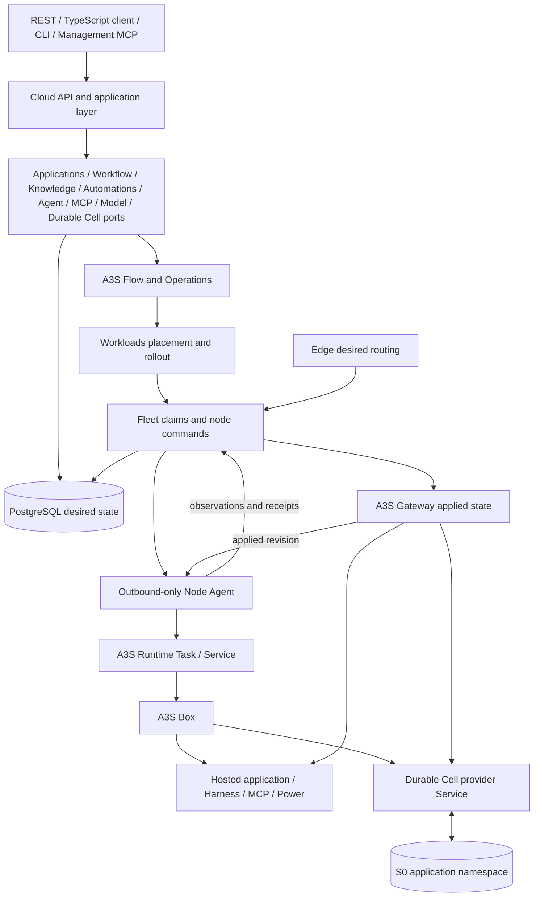

# A3S Cloud Technical Architecture

## 1. Document authority and scope

This document is the stable target architecture for A3S Cloud. It defines
component ownership, allowed dependency directions, control loops, consistency
boundaries, deployment profiles, and failure behavior. It deliberately does
not contain milestone history, pull-request evidence, migration-by-migration
notes, or an implementation diary.

Capability availability is gate-driven. A target described here is not a
shipped claim unless its gate is marked `Verified` in the product roadmap.

| Document | Owns |
| --- | --- |
| [README](../README.md) | Product introduction, current capabilities, and operator entry points |
| This document | Stable target architecture and authority boundaries |
| [Product roadmap](../ROADMAP.md) | Product gates, status, dependencies, and delivery order |
| [Development plan](development-plan.md) | Implementation slices, recovery evidence, and exit gates |
| [Domain model](domain-model.md) | Aggregates, state machines, invariants, and data ownership |
| [Workflow and evolution plan](workflow-evolution-plan.md) | Detailed `W0`, heterogeneous `A1`, and governed `EV0` contracts, ordering, and failure evidence |
| [AI application platform plan](ai-application-platform-plan.md) | Detailed `APP0`, `K0`, `AUT0`, built-in node coverage, and public parity evidence |
| [Durable Cell Service plan](durable-cell-platform-plan.md) | Detailed `CELL0` authority, provider/storage boundary, fencing, gates, and fault evidence |
| [Inference plan](inference-plan.md) | Detailed `I0` model-serving design |
| [Management MCP contract](management-mcp.md) | Management MCP transport and authorization contract |
| [A3S Use plugin roadmap](https://github.com/A3S-Lab/Use/blob/main/ROADMAP.md) | Canonical package, catalog, plan/apply, grant, binding, capability-generation, and shared Plugin Manager delivery |

When the documents disagree, this document decides architectural ownership,
the roadmap decides public availability, and the owning detailed plan decides
whether implementation evidence is sufficient to advance a gate.

## 2. Product objective and non-goals

The A3S Cloud product stack is an A3S-native platform for durable, isolated,
resumable Agent and application execution on operator-owned Linux systems. Its
target is to replace the operational roles commonly assembled from Google AX
and Kubernetes without requiring either system.

The outward-facing application layer groups that platform into five products:

| Product | Customer outcome | Reused authorities |
| --- | --- | --- |
| Unified Gateway | Give Workflow, Agent, MCP, model APIs, and business services one governed cloud-edge ingress with identity, protocol, policy, routing, and evidence | Cloud API and Identity own management policy; Edge owns desired traffic state; A3S Gateway owns the applied live data plane; A3S Sentry and AnySentry contribute evidence |
| Workflow autonomous orchestrator | Turn ontology-defined business objects, relationships, rules, goals, and constraints into executable, recoverable workflows across Agents, tools, people, and services | Workflow owns ontology and plan semantics; A3S Flow and Operations remain the only durable orchestration path; existing Agent, MCP, Inference, and Use ports execute typed steps |
| Agent Factory | Turn heterogeneous Agent prototypes and Harnesses into versioned, evaluated, deployable products with one Cloud execution and evidence contract | Assets, Agents, Workloads, Fleet, Runtime, Box, and one provider-neutral Harness port; A3S Code is the first-party native provider rather than the only admissible Harness |
| AI Application Platform | Build, publish, monitor, and govern Chatbot, Text Generator, classic Agent, New Agent Beta, Chatflow, and Workflow experiences with Knowledge, plugins, triggers, APIs, embed, and MCP delivery | Applications projects every mode to an exact Workflow revision; classic/New Agent reuse A0/A1/AR0; Knowledge pipelines reuse Workflow/Flow; Automations starts exact releases; existing platform authorities remain authoritative |
| Durable Cell Service | Run named, SQLite-backed state entities with alarms, WebSockets, idle eviction/reactivation, and fenced recovery | Durable Cells owns application intent; Workloads/Fleet host an ordinary Runtime Service fleet; a selected provider and S0 own per-Cell state and single-writer fencing |

These are product compositions, not new control planes or bounded-context
authorities. Each product reuses the single-authority map below. Their public
availability and completion claims remain governed by the exact gates in
[`ROADMAP.md`](../ROADMAP.md).

Security monitoring and investigation remain a capability inside the Unified
Gateway product. Verified `C0.3-S1a` correlates exact Edge-owned Gateway Route
policy facts with shared audit metadata; later slices may admit Runtime, Box,
Agent, A3S Sentry, and AnySentry evidence only after its owner supplies a durable
typed boundary. The capability does not introduce a separate security product,
scheduler, or node channel.

The public website uses a product-layer vocabulary. The following projection
is normative so those names cannot turn into duplicate mechanisms:

| Website label | Architectural meaning | Reused authority; no duplicate |
| --- | --- | --- |
| Unified Gateway | Product composition spanning management policy and the live traffic plane | Cloud API/Identity/Edge compile desired policy; Gateway alone applies live traffic; Work and CLI management commands still enter Cloud API |
| AI Application Platform | Applications, Knowledge, Files, Automations, and Connectors product composition | Every application release binds one exact Workflow revision; Workflow/Flow remains the execution path; existing Inference, Agents, Use, Sources, Secrets, storage, Edge/Gateway, and Operations retain their authorities |
| Workflow Service and intelligent orchestration | `Workflow` context for ontology, goals, plan revisions, and Workflow semantic state | A3S Flow plus Operations remains the only durable workflow engine |
| Ontology Knowledge Graph | Versioned Workflow-owned objects, relationships, rules, goals, and constraints | PostgreSQL through A3S ORM is authoritative; Search/vector indexes are rebuildable projections and no graph database is introduced |
| Agent Service | `Agents` context with one versioned `AgentExecutionProvider` port | All Harnesses reuse one AgentExecution state model, Fleet channel, Runtime/Box lifecycle, event sequence, and conformance suite |
| MCP Service | Hosted MCP release and service profile | Existing `A0`/`MCP0`, Workloads, Edge, and Gateway contracts; no MCP scheduler or registry copy |
| Model Service | Inference model, deployment, route, provider, and usage semantics | Existing `I0`, Power, Workloads, Fleet, Edge, and Gateway contracts; no model scheduler in the service facade |
| Runtime WaaS/AaaS/FaaS | Product profiles compiled to existing primitives | WorkflowRun uses Flow, AgentExecution uses Agents, and finite functions use Executions; Runtime still exposes only Task and Service lifecycle |
| Asset Hosting | Federated catalog of exact AssetRelease, WorkflowRevision, ModelRevision, and A3S Use package references | Search provides one read projection; each owning context retains release authority and bytes use one immutable-object client |
| Distributed File Storage | Product storage plane over immutable objects and fenced mutable volumes | Shared immutable-object infrastructure plus `S0` Data providers and `H0` replication; it is never business desired-state authority |
| Durable Cell Service | Managed named-state application over one immutable profile and ordinary Service fleet | Durable Cells owns application revisions/projections; the Cell provider owns individual SQLite/ownership inside S0; no Cell scheduler, Runtime class, Gateway lookup, or PostgreSQL state mirror |
| A3S Event rail | Publication of committed integration facts | Transactional Outbox plus A3S Event; Fleet commands/receipts and audit records retain their distinct authorities |
| Workloads + Fleet scheduling rail | The only placement, resource-claim, rollout, and node-delivery path | Workflow, Agent, MCP, inference, and evolution cannot add schedulers or queues |
| Self-Evolution | Governed evidence, evaluation, candidate, and promotion policy | `EV0` reuses Flow, Workloads, Fleet, Runtime, Box, releases, and owning-context rollouts; no direct telemetry-to-production loop |
| AnySentry observability | Correlated metrics, logs, traces, security signals, and exportable evidence | Observation only; explicit authorized evidence manifests feed `EV0`, and AnySentry never becomes desired-state or promotion authority |

The website projection is additive and intentionally incomplete. It cannot
remove or collapse a Cloud capability merely because that capability is not a
box in the public diagram. The following preservation matrix is mandatory:

| Preserved Cloud capability | Existing authority and gate | Relationship to the website projection |
| --- | --- | --- |
| Organizations, projects, environments, identity, grants, REST/OpenAPI, TypeScript client, CLI, and Management MCP | Identity, Projects, `F0`, `C0` | Governance foundation for every product service; never replaced by Unified Gateway |
| External sources, webhooks, reproducible builds, provenance, previews, monorepos, and imports | Sources, Artifacts, `G0`, `P0` | Supply-chain path feeding hosted applications and capabilities |
| Hosted Git, immutable Agent/MCP/Skill releases, Skill binding, and A3S Use assignments | Assets, Plugins, `A0`, `U0` | Concrete authorities behind Asset Hosting and capability discovery |
| Generic finite Tasks and ordinary application Services | Executions, Workloads, `R0`, `D0` | Continue as first-class products; WaaS/AaaS/FaaS profiles compile to them rather than replacing them |
| Node enrollment, outbound mTLS, inventory, Claims, commands, receipts, fencing, and cleanup | Fleet, Node Agent, `N0`, `H0` | Single scheduling and node-control substrate for every new capability |
| Runtime/Box provider lifecycle, isolation, mounts, outputs, checkpoints, and builds | Runtime, Box, `BX0`, `PW0` | Sole execution substrate; new services do not add providers or executors |
| Domains, certificates, Edge desired state, Gateway snapshots, health, routing, update, rollback, and logs | Edge, Gateway, Secrets, `E0`, `H0` | Concrete live-traffic and recovery mechanisms inside the Unified Gateway product |
| Secrets, immutable objects, persistent volumes, databases, backup, restore, and retention | Secrets, Artifacts, Data, `S0` | Shared trust and storage plane; Distributed File Storage does not replace database or Secret semantics |
| Named SQLite-backed Durable Cells, alarms, WebSockets, idle eviction, and fenced handoff | Durable Cells, selected provider, `CELL0` | Product intent compiles to Workloads/Runtime/Box; per-Cell state and ownership never enter Cloud PostgreSQL or Gateway |
| Operations, idempotency, Outbox/Event, audit, Search, notifications, telemetry, and runbooks | Operations, Integration Events, Search, `F0`, `C0`, `H0` | Cross-cutting mechanisms reused by Workflow and Evolution; none becomes a new product-local implementation |

### 2.1 Reference capability preservation register

External products are references for useful outcomes, not authorities inside
Cloud. This register was reconciled with the public TokenHub and Google AX
capability inventories on 2026-08-06. A reference upgrade may add a candidate
to this register, but it cannot silently import another API, controller,
scheduler, event log, identity store, or data plane.

| Reference outcome worth retaining | A3S-owned outcome | Owning gate and current boundary | Deliberately not copied |
| --- | --- | --- | --- |
| Standalone A3S Workflow graph authoring, ten AI-native node outcomes, per-step placement intent, approvals, recovery, Runtime evidence, coding-agent automation, and a future Designer | Workflow owns closed ontology/graph/revision/plan semantics plus immutable descriptor, typed-variable, and composite-region policy contracts; typed steps call Agents, MCP, Inference, Use, Executions, and connector ports; Operations/Flow and the common execution path own recovery and compute | `W0.1` is implemented and `W0.2` is verified; `W0.3` includes immutable definition/payload/goal authority, revision-owned descriptor bindings/registry snapshot/variable/default/composite contracts, exact Plan v2 pinning, typed-variable Flow projection and authorized inspection, deterministic composite frame/export and ordered region reducers plus Flow-backed sequential Iteration/Loop child WorkflowRun dispatch/linkage/cancellation/recovery, descriptor-bound finite-Execution and Connector failure routes, a project-authorized read-only 23-node discovery catalog, WorkflowRun, the HumanTask loop, protected reads, and finite Execution. APP0.2-C7 supplies the Applications-owned variable/Answer effect consumer boundary; C9 adds versioned final-output and terminal lifecycle projection after exact Flow replay; C10 adds descriptor-bound Answer dispatch through Run v11; C11 adds exact Application-variable snapshot/CAS dispatch and Flow-derived inspection through Run v12. Remaining provider bindings/error routes, compensation, production recovery, and deferred Designer delivery remain gate-driven | The standalone Boot server, PostgreSQL bootstrap, Flow queue/worker, process Runtime provider, node runner, variable, region, or error store, Memory service, evidence store, CLI authority, deployment stack, legacy product-configuration authority, or React Studio |
| Six commercial application-platform experiences, including distinct classic and New Agent outcomes, 23 built-in Workflow node labels with classic/New Agent profiles under Agent, Knowledge Pipelines, six plugin extension outcomes, multi-channel publication, monitoring, and enterprise governance | `APP0` owns application releases and delivery; `K0` owns RAG corpus and pipeline intent; `AUT0` owns new-invocation triggers and outbound connection profiles; `W0` compiles every executable graph to Flow; existing `A0`, `A1`, `AR0`, `I0`, `U0`, `MCP0`, `C0`, `S0`, and `H0` provide the shared platform | In progress and unavailable; `APP0.1` freezes, persists, authorizes, and exposes the single immutable release management authority with exact Workflow evidence through all four maintained interfaces. Component-only `APP0.2-C1` through `C7` and `C9` through `C11` freeze and atomically persist one release-pinned session/message/variable, exactly-once semantic-effect, and immutable invocation execution authority through migrations `125`-`127`, compile deterministic Model/Agent preset wrappers through Workflow's sole publication port, compose or cancel its exact deterministic ordinary Workflow Goal, Plan, and Run, register authorization-first internal session/invocation/cancellation/cursor CQRS, add the Run-resolved semantic-effect consumer with ambiguous-commit recovery, project v10 aggregate final output plus terminal state, dispatch exact Answer ports through v11, and snapshot/dispatch/CAS exact Application-variable ports through v12 before saving WorkflowRun reconciliation. C8 exposes caller-owned project-member admission and reads through the maintained management interfaces without a second write authority; C12 adds optimistic session close, invocation cancellation, and complete bounded replay over that same authority. Application-scoped credentials and anonymous/public delivery, blocking/streaming answer delivery, Gateway routing, the remaining ownership/node gates, and the composite parity gate remain open | Third-party APIs, storage topology, package lifecycle, configuration authority, separate mode runtimes, another Agent/sandbox lifecycle, pipeline engine, plugin installer, vector database as truth, or scheduler |
| Deno celld-style named Durable Objects, one SQLite database per object, alarms, hibernatable WebSockets, inactive residency, object-store CAS ownership, write durability, and node handoff | `CELL0` owns immutable Durable Cell application intent and projects one ordinary Workload Service fleet; the selected Cell provider owns per-Cell execution/ownership/state in one S0 namespace | `CELL0.1-C1/C2/C3` and component-only `CELL0.2-C1/C2/C3` implement the application and S0 contracts/gate. `CELL0.3-C1/C2/C3` bind and provenance-pin the exact provider through the existing Workload/Runtime/Box/Fleet path with explicit negative storage scope; the [real-Box celld Runtime gate](https://github.com/A3S-Lab/Cloud/actions/runs/31946279906/job/95162662254) has a retained pass. `CELL0.4-C1/C2/C3` persist application/revision authority plus immutable deployment-correlation intent and recoverably compose the existing managed Workload/Deployment, Operation request, Outbox, and Fleet flow. `CELL0.4-C4` delegates only the ACL-derived public port of that exact Workload revision to Edge's existing healthy-target and complete-snapshot authority; the shared Workloads route updater retains cutover. `CELL0.4-C5` exposes the same authority through REST/OpenAPI `1.38.0`, maintained client, CLI, and Management MCP. Component-only `CELL0.5-C1` defines the exact non-secret S0 provider-profile ACL/digest and credential binding. Component-only `CELL0.5-C2` adds one immutable typed shared-artifact output to the existing successful BuildRun, signs its descriptor in existing provenance, persists it through migration `118`, and enforces exact application admission. Component-only `CELL0.5-C3a` extends the existing Execution aggregate through migration `119` with an internal-only exact-node Runtime Task policy for read-only shared artifacts, exact Workload-revision Secret references, outbound networking, and immutable authority/semantics digests; the existing Operations/Flow/Fleet apply/remove lifecycle remains sole authority and public Execution surfaces hide the task. Component-only `CELL0.5-C3b` adds migration `120` and Workload Deployment Flow v4's generic post-placement pre-start gate; it deterministically composes or adopts the pinned `celld deploy` Execution from the exact provider profile, typed bundle, Workload Secrets, and selected node, waits for terminal success before Service apply, cancels before Claim release, and preserves historic v1-v3 replay. Component-only `CELL0.5-C4a` pins the ordinary Workloads Service to that same provider and storage profile. Component-only `CELL0.5-C5a` adds migration `131`: for the stopped current managed single replica, Workloads binds the exact successful Fleet `RuntimeRemove` acknowledgement to an immutable writer-fence receipt and atomically commits the Runtime fence plus one deterministic `cloud.object-namespace.seal@2` Operation. Component-only `C5b` reuses that same pre-start gate to admit every later writer generation only after the exact receipt-bound seal and recovery-point lineage succeed; active seals wait, terminal failures fail closed, and stale Deployments are rejected. Retained real publication, `C4b/C4c` behavior/Gateway evidence, and the remaining lifecycle/fault evidence remain open. The [PostgreSQL 17 C6a/C6b recovery and lifecycle gate](https://github.com/A3S-Lab/Cloud/actions/runs/31938471588/job/95144015600) has a retained pass; real storage-backed application behavior, multi-node `CELL0.6`, and compatibility `CELL0.7` remain unavailable | celld control topology, raw configuration/deploy authority, public operator API, per-Cell Cloud rows, new Runtime class, Gateway owner lookup, or blanket Cloudflare compatibility |
| TokenHub-style private multi-provider model gateway, model catalog, priority/weight routing, fallback, and route-health diagnostics | Inference owns immutable model, Provider, route, and policy revisions; Edge owns route intent; Gateway applies the typed protocol/data-plane snapshot | Planned `I0.2b`, `I0.2d`, `I0.5`, and optional `I0.6` protocol/provider expansion | TokenHub API/storage topology, provider-native desired state, a second proxy, or Gateway-owned management state |
| TokenHub-style consumer, project-steward, and platform-operator workspaces with project/environment keys, enterprise sign-in, RBAC, quotas, and concurrency policy | Identity owns Principals, external OIDC subject links, Memberships, MembershipInvitations, Resource Grants, credentials, and revocation; `C0` owns authorized surfaces; Inference owns model access policy | The `C0.3` Principal/Membership/credential, exact-Principal invitation, project/environment/node Resource Grant, exact OIDC link/flow persistence, ordinary short-lived login credential, bounded OIDC discovery/JWKS/ID-token adapter, and production-wired REST/OpenAPI/client login-link-callback surfaces are implemented and pass focused persistence, local TLS, or cross-layer gates; retained OIDC PostgreSQL cross-surface evidence and role-focused projections remain open; model/key self-service is planned in `I0.2e` | Browser-only filtering, another user/key store, plaintext credential recovery, credential-owned roles, or UI modes as authorization |
| TokenHub-style usage, request attribution, diagnostics, API exploration, and cost showback | Gateway emits bounded request/attempt facts; Inference owns the durable usage ledger; Project attribution and authorized views belong to `C0` | Planned `I0.2c`, `C0.3`, and `I0.2e` | Prompts or responses in management telemetry, commercial balance/invoice/settlement authority, or client-side usage truth |
| TokenHub-style protocol and Provider breadth, including Responses, Anthropic Messages, media generation/editing, custom upstreams, and approved subscription-backed channels | Each protocol is a separately versioned `InferenceProtocolProfile`; each Provider/channel is a credential-isolated adapter behind the same Inference, Edge, Gateway, usage, and Secret boundaries | Optional post-production `I0.6`; every profile remains unavailable until its real protocol, terms, credential, usage, failure, and recovery conformance gate passes | A generic untyped byte proxy, capability claims inferred from a template, browser-held upstream credentials, or implied support for every vendor |
| Google AX-style isolated distributed Harness execution and bring-your-own Harness | One Agents-owned `AgentExecutionProvider` contract selects immutable providers; Workloads, Fleet, Runtime, and Box provide placement, delivery, isolation, and lifecycle | `A1.1` is implemented; native Code `A1.2` start, run-scoped cancellation, event-page, retention-gap, and recovery orchestration has retained clean Linux PostgreSQL 17 and real Box Runtime process-death evidence, while dependency publication remains; provider-neutral/non-Code `A1.3` is planned | AX server/controller deployment, AX configuration or wire compatibility, provider-specific schedulers, run stores, or direct clients |
| Google AX-style single-writer execution history, reconnect replay, approvals, suspension/resumption, snapshots, forks, trajectories, and telemetry | Agents owns one PostgreSQL semantic sequence; shared SSE/cursors provide reconnect; `A1.5`/`A1.6` add governed pause, provider/Box recovery, checkpoints, forks, trajectories, and telemetry correlation | `A1.1` foundation is implemented; `A1.5` and `A1.6` remain planned and unavailable | AX event-log authority, Flow history as transcript, Runtime logs as semantic state, or a second snapshot store |
| Google AX-style per-execution customization of Harness, instructions, environment, model, Skills, MCP, and Tools | `A1.4` binds one immutable, closed `HarnessInvocationProfile` and exact release/Secret references before dispatch | Planned `A1.4`, after the `A1.3` provider contract and applicable `A0`/`MCP0`/`I0` identities | Mutable provider JSON as desired state, arbitrary environment injection, copied Secret material, or provider-owned authorization |
| Security-operations correlation from Gateway policy, Agent semantics, Runtime/Box evidence, host signals, and audit | `C0.3` projects tenant-scoped investigation timelines over durable typed owner evidence and shared audit metadata; Identity, Edge/Gateway, Workloads, and owning contexts remain the only enforcement authorities | `C0.3-S1a` verifies one owner/admin Gateway MCP Route policy timeline over Edge Outbox facts and audit metadata; Gateway denials, Agent/Runtime/Box/host/AnySentry/OpenTelemetry correlation, signed export, and bounded detection lifecycle remain planned and owner-gated in `C0.3`/`H0.5` | A fourth product control plane, a security scheduler/node channel, telemetry-driven desired-state mutation, or a second audit store |

For the Durable Cells row, REST/OpenAPI `1.39.0` adds the exact S0 profile as
an optional fourth deployment ACL. Presence activates C3b's existing-flow
adapter; omission preserves the earlier v1 request behavior, and the CLI
requires the profile for new C3b deployments.

Reference preservation does not mean feature availability. Every row remains
governed by its named roadmap gate, and a deferred row cannot be advertised as
implemented. Conversely, deleting a reference name from the website cannot
delete the A3S-owned outcome in this register.

Any architecture change that removes one of these rows, changes its owner, or
weakens its gate must be proposed explicitly as a separate migration with
compatibility and recovery evidence. Website simplification alone is never
such authorization.

Replacement means that the A3S stack owns the complete product outcome:

- Cloud owns tenant intent, durable business state, orchestration policy, and
  management surfaces;
- the Cloud Plugins context owns tenant plugin assignments, while A3S Use owns
  package verification and the complete plugin-generation lifecycle;
- Flow and Operations own resumable long-running work;
- Workloads and Fleet own placement, claims, rollout, and outbound node
  control;
- Runtime defines provider-neutral Task and Service lifecycle;
- Box owns node-local execution, isolation, images, mounts, snapshots, and
  cleanup;
- Gateway owns the applied request path; and
- Power supplies the Box-hosted inference serving boundary.

The Cloud binary does not absorb every responsibility. The product is a set of
components with one authority for each concern, connected by versioned
contracts.

The target does not require AX or Kubernetes API, wire, manifest, CRD,
Operator, Helm, scheduler, event-log, or controller compatibility. Existing
tools may be admitted later only as bounded adapters behind an A3S-owned port.
They cannot become a second authority.

The architecture also excludes:

- a second scheduler, workflow engine, job queue, node-control channel, or
  autoscaler;
- a Cloud package installer, plugin capability registry, workspace-grant
  store, Runtime-binding store, or plugin-specific execution protocol;
- Docker, a Docker-compatible daemon, or a fallback execution provider;
- Cloud on the live opaque application, MCP, Durable Cell, or inference byte
  path;
- a Cell-specific scheduler, Runtime class, node channel, object client,
  Gateway ownership cache, or PostgreSQL copy of Cell state/leases/alarms;
- mutable provider configuration as product desired state;
- Redis as durable business, coordination, or replay state; and
- parallel domain-specific implementations of idempotency, object storage,
  streaming cursors, audit, or integration events.

## 3. Fixed architecture principles

1. **Intent is durable before work starts.** An accepted mutation commits
   tenant-scoped desired state and replay identity before asynchronous work is
   dispatched.
2. **Desired and observed state are separate.** Reconcilers advance only from
   exact generation-bound observations; absence of evidence is not success.
3. **Every concern has one authority.** New product profiles reuse the common
   control path instead of introducing profile-specific controllers.
4. **The control plane is a modular monolith.** Business contexts are isolated
   by ports and events, while one deployable keeps transactions and operations
   understandable.
5. **Nodes are outbound-only.** Node Agents establish authenticated mTLS
   sessions to Cloud; Cloud does not require an inbound node-management port.
6. **Execution is provider-neutral above Runtime and Box-only below it.** Cloud
   expresses Task or Service intent; Box is the sole concrete local provider.
7. **Identifiers and revisions are immutable.** Mutable source tags and
   manifests are resolved to exact digests before they become execution
   authority.
8. **Protocols are versioned and capability-negotiated.** Unknown versions,
   fields, states, or capability combinations fail closed.
9. **Recovery is a first-class path.** Every side effect has an adoption,
   replay, fencing, or cleanup rule for process death and ambiguous delivery.
10. **Configuration is ACL-only.** A3S ACL is parsed and generated with
    `a3s-acl`; no compatibility configuration language exists.
11. **Plugin management is assignment, not installation.** Cloud records who
    wants which exact A3S Use package on which authorized workspace host. The
    shared A3S Use Plugin Manager remains the only component allowed to plan,
    apply, reconcile, enable, disable, drain, or remove that package.
12. **Durable Cell residency is provider state, not Cloud scheduling.** Cloud
    schedules one ordinary Service fleet per application. The Cell provider
    alone activates, evicts, restores, and fences named Cells inside its S0
    namespace; Cloud and Gateway never mirror their ownership.
13. **Lower layers expose mechanisms, not product meanings.** Product contexts
    compile immutable intent down to existing Cloud lifecycles and Runtime
    capabilities. Runtime, Box, Fleet, and Gateway return bounded evidence up;
    they never acquire Agent, MCP, Workflow, inference, or Durable Cell
    business state.

### 3.1 Abstraction ladder and promotion test

Every deployable product is expressed through the same one-way abstraction
ladder. A lower layer must not call upward to recover meaning that its input
failed to carry.

| Layer | Owns | Admitted shapes | Must not own |
| --- | --- | --- | --- |
| Product semantics | Product bounded contexts | Agent execution, Workflow run, hosted MCP release, Durable Cell application, inference deployment, and their immutable revisions | Node placement, process identity, provider journals, or applied routes |
| Durable coordination | Operations and A3S Flow | Intent-before-work correlation, deterministic workflow identity, timers, retry, cancellation, and replay | Product aggregate truth, provider-local retry rails, or interface state |
| Cloud execution projection | Executions, Workloads, and Fleet | Finite Execution, desired Service fleet, placement, Claims, versioned node command, and exact receipt | Product-specific schedulers, provider mechanics, or request-path behavior |
| Provider-neutral unit lifecycle | A3S Runtime | Exactly `Task` and `Service`, immutable generation, apply, inspect, stop, remove, health, endpoints, and capability evidence | Agent, Cell, MCP, model, Workflow, route, retention, or tenant policy |
| Local and request-path mechanism | A3S Box, A3S OCI Runtime, selected data providers, and A3S Gateway | Process/isolation/network/storage mechanisms and applied request policy | Cloud desired state, semantic execution history, or another scheduler |

A product type compiles downward to an existing shape and receives only exact,
generation-bound observations upward. Product identity may cross Runtime as an
opaque ID or digest needed for replay and evidence, but product fields and
state machines do not.

A capability may be added to A3S Runtime only when all of these conditions
hold:

1. it can be specified without product vocabulary;
2. it is intrinsic to Task/Service lifecycle or is reusable by independent
   product profiles;
3. its command, capability advertisement, receipt, replay, and cleanup
   semantics can be versioned and fail closed;
4. Box and every advertised OCI Runtime backend can prove conformance; and
5. it introduces no business aggregate, placement decision, route policy,
   retention policy, or provider-native desired-state authority.

Outbound networking, pause/resume, checkpoint/restore, and fenced volume
attachment can pass this test as generic capabilities. Cell ownership, alarm
delivery, Agent Tool events, MCP discovery, and model routing cannot. Those
remain with their product or provider owner even when they use Runtime
mechanisms.

The Runtime Unit granularity is one provider process or replica generation,
never one logical product entity. One Cell provider replica may host many
named Cells; one Harness Service may execute many admitted Agent commands.
Creating one Runtime Unit per Cell, conversation, Workflow step, MCP method,
or model request is prohibited unless that item independently satisfies the
existing finite-Task contract rather than gaining a product-specific class.

## 4. Single-authority map

This table is the mandatory design-review checklist. A capability that needs a
second entry in an authority row must be redesigned before implementation.

| Concern | Sole authority | Prohibited duplicate |
| --- | --- | --- |
| Business desired state | PostgreSQL | Redis, event streams, node journals, or local files as product truth |
| Principal identity, organization roles, invitations, credentials, and revocation | Identity Principals, Memberships, MembershipInvitations, Resource Grants, and scoped credentials | Credential-owned roles, a console-local identity or invitation store, a second RBAC evaluator, or presentation-only authorization |
| Resource-to-scope resolution | The context owning the resource resolves its existing Project, Environment, or Node identity; Identity's shared `ResourceAccessEvaluator` makes the authorization decision | An Identity-owned cross-context ownership table, per-context grant evaluators, MCP-only bindings used as final authorization, or browser-side filtering |
| External human identity federation | Identity context through `C0.3` OIDC issuer/subject links and ordinary memberships/grants | Provider sessions as user truth, a console-local identity store, automatic organization ownership, or unverified email-domain trust |
| Enterprise federation, provisioning, and session governance | Identity context through planned `C0.5` SAML/OIDC provider revisions, SCIM bindings, session policy, and the same Membership/Resource Grant authority | Application-local SSO, SCIM-owned roles, duplicate users, provider groups as implicit grants, or presentation-only session enforcement |
| Tenant plugin registry enrollment and desired assignment | Cloud Plugins context in PostgreSQL | Asset kinds, node-local receipts, catalog caches, or Use capability snapshots as tenant intent |
| Plugin catalog, package trust, immutable generation, grant, binding, and capability lifecycle | Shared A3S Use Plugin Manager and its canonical contracts | Cloud installer, TUF implementation, package/grant/binding tables, capability registry, surface reconciler, or universal plugin action RPC |
| Relational access | A3S ORM | Raw SQL, direct database drivers, or a context-local data-access layer |
| PostgreSQL schema execution | One terminating `a3s-cloud-migrate` composition root using the sole A3S ORM mechanism and owner-scoped Cloud/Flow/Boot manifests and ledgers | Serving-process DDL, copied component manifests/admission, another runner, a shared credential reference, or resolving both secrets in one process |
| PostgreSQL adapter composition | One role-selected, I/O-free `PostgresAdapterFactory`; bounded-context families project one concrete repository instance to every implemented port | Direct constructors in the process root, per-role repository factories, duplicate concrete instances inside one family, or persistence behavior in composition |
| Long-running work | A3S Flow plus Operations | Agent controller, build queue, workflow engine, or ad-hoc retry loop |
| Flow runtime dispatch | One startup-validated exact registry assembled from owner-provided workflow and step identities | Prefix routing, an implicit default runtime, duplicate step ownership, or discovering collisions only after work is dispatched |
| Flow replay-code identity | A3S Flow `RuntimeBuildCompatibility`, configured from one Cloud manifest with current `a3s-cloud-workflows@10`, explicit `@1` through `@9` replay generations, and explicitly retained generations | A static identity reused after replay code changes, caller-selected identities, or another build router/queue |
| Portable Workflow DAG structure | A3S Flow `WorkflowDag` compiler | A Cloud compatibility parser, Cloud topology sorter, authoring-tool execution schema, or product-local graph compiler |
| Ontology, goal, plan, and Workflow semantic state | Workflow context in PostgreSQL | Flow history as business truth, a graph database authority, planner-local files, or a second workflow engine |
| Application identity, immutable release, delivery/toolkit policy, sessions, messages/variants, conversation variables, feedback, and annotations | Applications context in PostgreSQL | Mode-specific/toolkit runtimes, Workflow-owned conversations, direct provider clients, delivery-local state, or presentation state as truth |
| Durable Cell application identity, immutable revision, retention intent, and deployment projection | Durable Cells context in PostgreSQL | Cell state/lease rows, provider-native deployment authority, a second Workload controller, or application code as mutable desired state |
| Individual Durable Cell SQLite, ownership epoch, alarm, WebSocket residency, and peer forwarding | Selected Cell provider inside one application-scoped S0 namespace | PostgreSQL mirrors, Cloud lease/peer tables, Runtime units per Cell, Gateway owner lookup, or Cloud timer rows |
| Application template/catalog revisions | Applications owns immutable A3S-native template manifests; Search owns rebuildable authorized discovery | A copied reference-product package/configuration format, public catalog as authority, or another Search index |
| Agent/Skill/MCP asset identity, immutable source/release, permanent capability files, and release evidence | Assets context through `A0` | Applications-owned Agent definitions/files, sandbox state as release truth, or a New-Agent package store |
| RAG Knowledge Bases, documents, General/Parent-child/Q&A and multimodal chunks, ingestion intent, index/retrieval policy, citations, and external Knowledge bindings | Knowledge context in PostgreSQL | Workflow-owned corpus tables, Search/vector indexes as business truth, or plugin-owned Knowledge state |
| User file upload, scan, quota, retention, and reference lifecycle | Files context in PostgreSQL with the shared immutable-object client for bytes | Build Artifacts used as user-file state, context-local blob clients, or application-local upload tables |
| Schedules, webhooks, and admitted events that create new application, Workflow, or Task invocations | Automations context, with Boot as the existing durable task rail | Flow timers used to create runs, P0-local scheduler, plugin scheduler, or per-application trigger worker |
| Reusable outbound HTTP and business connection profiles, execution evidence, and typed immutable response objects | Connectors context with Secret references, shared egress policy, and the sole shared immutable-object client | Ad hoc node HTTP clients, plaintext credentials in node configuration, provider state as desired state, response bodies in Flow/PostgreSQL, or a context-local object client |
| Agent provider admission and semantic run state | Agents context and one versioned `AgentExecutionProvider` contract | Code-only Cloud schema, provider-specific run controllers, Harness queues, or copied provider event logs |
| Governed Agent runtime/sandbox product projection | `AR0` over Agents, Workloads, Runtime, Box, Secrets, Operations, and `H0` | Applications-owned sandbox controller, process store, Secret injector, idle evaluator, checkpoint engine, or autoscaler |
| Evolution experiments, evaluations, candidates, and promotion decisions | Evolution context in PostgreSQL | Model-, Agent-, Workflow-, or telemetry-specific evaluation and promotion controllers |
| Request replay | Shared tenant-scoped idempotency records | Per-context idempotency tables or in-memory replay state |
| Integration facts | Transactional Outbox plus A3S Event; memory is limited to development all-in-one or a non-publishing API, while every event-owning production or split role requires NATS | Direct publish-before-commit, a process-local bus across process boundaries, or another queue |
| Personal and outbound notification projection | Notifications owns the exact-recipient inbox, deterministic delivery intent, and channel-specific dispatch evidence; A3S Event owns durable consumption; Connectors/Secrets own HTTP target and credential material; Identity owns exact verified recipient contacts, one-time verification proof consumption, and revocation; the sole SMTP ACL owns relay selection and secret references | Business desired state, source-fact mutation, a second event rail or queue, provider-local retry scheduler, synthetic Connector evidence, copied connection/Secret/contact authority, OIDC-claim email inference, or presentation-local inbox |
| Placement, replicas, rollout, and scaling | Workloads | Agent, MCP, Durable Cell, inference, Gateway, or import-specific schedulers and autoscalers |
| Node delivery | Fleet `node_commands`, leases, and the Node Agent journal | Direct Cloud-to-process control, second queue, or profile-specific node channel |
| Provider-neutral lifecycle | A3S Runtime Task and Service | Product policy inside Runtime or provider calls from Cloud contexts |
| Local execution and build | A3S Box | Docker, BuildKit, another Runtime driver, or a Cloud-owned local executor |
| Node resource ownership | Fleet Claims and fencing | In-memory reservations or provider state treated as a reusable claim |
| Routing intent | Edge | Gateway-local desired routes in managed mode |
| Applied request-path state | A3S Gateway | Cloud request proxying, Durable Cell owner lookup/stickiness, or Edge inferring an apply without acknowledgement |
| Product configuration | A3S ACL through `a3s-acl` | Non-ACL product configuration, provider-native manifests, or compatibility parsers |
| Hosted Asset Git refs, objects, and rollback evidence | Assets `LocalAssetGitRepository` on one identity-bound shared filesystem plus its same-lease checksummed journal | PostgreSQL ref mirrors, Source checkout clones, Artifact copies, or another Git runner |
| Hosted Asset Git writer, quota, commit, and backup-reference state | One `asset_git_repository_controls` row through A3S ORM | Redis/file locks, process-local writer flags, a second repository-control table, or event-stream authority |
| Object-store transport | One deployment-level infrastructure client with typed child namespaces; immutable consumers retain create-only exact-replay semantics, while S0 alone exposes version-token CAS through `IObjectNamespace` | Per-consumer filesystem/S3 clients, mutable operations in immutable adapters, and untyped cross-domain blob APIs |
| Deployment storage topology | Create-only, secret-free digests in PostgreSQL `infrastructure_bindings` for the one object root and Hosted Git filesystem identity | A storage backend attesting itself, mutable runtime overrides, ref/object mirrors, or a second topology registry |
| Mutable workload data and distributed volume intent | Data context plus typed `S0` provider contracts and fencing | Workflow filesystems, Agent volume managers, provider JSON as desired state, or unfenced shared writers |
| Unified capability discovery | Search projection over exact owning-context release references | Copied release rows, a second package registry, or a catalog that can mutate source identities |
| Audit | Shared append-only `audit_records` plus one owner/admin-only bounded read projection; frozen `C0.3-PA2a` adds explicit request-time Project/Environment/immutable-profile references and a closed attribution status to that same authority | Agent, Gateway, inference, or MCP-specific audit stores, duplicate writers, current-pointer lookup for historical facts, scope inference from private details, or public unstructured details |
| Security detection and investigation | `C0.3` read projections over exact typed owner facts and shared audit metadata; later AnySentry/OpenTelemetry references remain owner-authorized | A security control plane, direct telemetry enforcement, a second incident/audit store, or hidden node commands |
| Client sequence transport | Shared cursor, gap, polling, and SSE primitives | Controller-local cursor codecs or best-effort in-memory streams |
| Production autoscaling | The `H0.5` Workloads autoscaler | Gateway, inference backend, or metrics-provider scaling loops |

Redis is never an authority in this map. It may accelerate disposable fan-out,
short-lived counters, or a specifically gated globally exact request limit.
Correctness must remain intact when Redis is empty or unavailable. It never
owns conversations, commands, queues, locks, cursors, approvals, checkpoints,
leases, desired state, or durable usage.

If A3S ORM lacks a required typed query, expression, lock, or transaction
primitive, the primitive is added and certified in A3S ORM through its normal
issue, pull-request, release, and compatibility-lock flow. Cloud does not use
raw SQL as a local escape hatch.

## 5. System context and topology

### 5.1 Control and execution path


```mermaid
flowchart TB
    Client[REST / TypeScript client / CLI / Management MCP]
    API[Cloud API and application layer]
    Services[Applications / Workflow / Knowledge / Automations / Agent / MCP / Model / Durable Cell ports]
    DB[(PostgreSQL desired state)]
    Flow[A3S Flow and Operations]
    Workloads[Workloads placement and rollout]
    Fleet[Fleet claims and node commands]
    Agent[Outbound-only Node Agent]
    Runtime[A3S Runtime Task / Service]
    Box[A3S Box]
    Payload[Hosted application / Harness / MCP / Power]
    CellProvider[Durable Cell provider Service]
    CellStore[(S0 application namespace)]
    Edge[Edge desired routing]
    Gateway[A3S Gateway applied state]

    Client --> API
    API --> Services
    Services --> DB
    Services --> Flow
    Flow --> Workloads
    Workloads --> Fleet
    Fleet --> Agent
    Agent --> Runtime
    Runtime --> Box
    Box --> Payload
    Box --> CellProvider
    CellProvider <--> CellStore
    Edge --> Fleet
    Fleet --> Gateway
    Gateway --> Payload
    Gateway --> CellProvider
    Agent -->|observations and receipts| Fleet
    Fleet --> DB
    Gateway -->|applied revision| Agent
```

The diagram shows authority, not synchronous call nesting. Database commits,
Flow progress, Fleet leases, node journal entries, Runtime receipts, and
Gateway acknowledgements form explicit recovery boundaries.

The website service labels are application capabilities inside the
modular control plane, not five deployable control planes. Their executable
steps converge through the same Flow, Workloads, Fleet, Runtime, and Box path.
The Unified Gateway product spans Cloud management policy and Gateway live
traffic, but the concrete Gateway component never receives Work/CLI management
commands or becomes a synchronous Cloud authorization dependency.

### 5.2 Request path

```text
external client
  -> A3S Gateway
  -> healthy exact-generation Runtime endpoint
  -> application, MCP service, Harness endpoint, or Power service
```

For opaque hosted workloads, Cloud API, workers, PostgreSQL, and the event
backend stay off this path. Gateway operates from a complete, bounded,
expiring snapshot and reports the exact applied revision asynchronously.

A managed `APP0` application has a separate, explicit semantic path:

```text
application client
  -> A3S Gateway
  -> Cloud application delivery role
  -> Applications command/query and shared cursor contracts
  -> exact WorkflowRevision on A3S Flow
```

The delivery role is not a generic reverse proxy and does not interpret plans,
invoke providers, schedule steps, or own a second session/event store. It is
the sole public managed-application exception to the opaque workload rule.

A `CELL0` application remains on the opaque workload path:

```text
HTTP or WebSocket client
  -> A3S Gateway
  -> any healthy public Cell-provider Service endpoint
  -> current Cell owner, resolved or privately forwarded by the provider
  -> SQLite state in the application-scoped S0 namespace
```

Cloud and Gateway never resolve the named Cell owner. The internal peer and
operator endpoint is not a Route, and a dispatched request is never replayed
by Gateway to compensate for provider ambiguity.

### 5.3 Deployable processes

The Rust control-plane binary currently supports four roles; `APP0.3` adds the
fifth `delivery` role. A role selects both background ownership and the
externally registered route set:

| Role | Responsibility |
| --- | --- |
| `all` | API, planned application delivery, reconcilers/workers, and integration-event relay in one process |
| `api` | REST, SSE, Management MCP, and node-control endpoints |
| `delivery` | Planned `APP0` published application API, embed/MCP facade, and shared cursor/SSE projection; no management or worker authority |
| `worker` | Flow advancement, reconciliation, scheduling, and cleanup; HTTP exposes process identity and health only |
| `relay` | Transactional Outbox delivery through A3S Event; initializes only PostgreSQL, NATS, the existing notification projector, and process-status HTTP |

`a3s-cloud-migrate` is deliberately outside this role matrix. It is a
terminating deployment process with exactly one capability: apply Cloud's
compiled SQL manifest and invoke the published Flow and Boot migration owners
through A3S ORM. It cannot serve HTTP, advance Flow, publish events, construct
repositories, or initialize providers. A serving role cannot acquire migration
authority by changing `server.role`.
The single ACL names distinct `postgres.migration_url_env` and
`postgres.serving_url_env` references plus the non-secret
`postgres.serving_role`. The migrator resolves only the migration credential;
every serving composition root resolves only the serving credential. ACL
admission rejects equal reference names, noncanonical role identifiers, and
the former shared `url_env` field, so capability separation cannot silently
fall back to the old configuration shape.

The Node Agent is a separate process because it crosses a machine and trust
boundary. Gateway, Runtime, Box, and workload processes remain independently
versioned components. Cloud ships no management Web UI or static SPA server;
all product management enters through `all` or `api`. A worker or relay never
registers REST, OpenAPI, or Management MCP product routes merely to obtain a
health listener. The dedicated relay also does not initialize Flow, Runtime,
Box, OIDC, GitHub, Vault, Gateway certificate, or object-storage providers. Its
readiness is the conjunction of the PostgreSQL and A3S Event dependencies it
actually uses.

The Worker composition omits the typed `ManagementSurfaceDependencies`
capability bundle. It therefore does not resolve the bootstrap credential,
OIDC provider, source-webhook verifier, management source resolver, node CA,
node-control server identity, plugin trust/catalog state, domain verifier, or
management-only application services. Its readiness is the exact conjunction
of PostgreSQL, A3S Event, executable Flow, Gateway certificate authority, key
encryption, and shared object storage. A real PostgreSQL 17 plus NATS gate checks that
dependency set, the status-only route set, and the absence of management-owned
local state.

The API composition owns no event transport and therefore does not resolve or
health-check NATS. It connects a query-only `FlowReadInfrastructure` directly
to the sole A3S Flow PostgreSQL event store for workflow history and variable
projection. That adapter has no Boot queue or task manager and its guarded
runtime rejects workflow or step execution. Checkout, build input/output
staging, evidence signing, the exact runtime registry, executable Flow queue,
and every reconciler are constructed only behind the Worker capability. API
readiness is exactly PostgreSQL, query-only Flow, node CA, Gateway CA, key
encryption, and shared object storage. A PostgreSQL-only gate uses an unresolved NATS URL
and proves both that readiness set and the absence of Worker staging state.

`all` composes the same management, Worker, and Relay capabilities rather than
building an alternate mechanism. One I/O-free `PostgresAdapterFactory` is the
only production constructor boundary for PostgreSQL repository adapters.
Identity, Projects, Workflow, Notifications, Plugins, Fleet, Workloads, Edge,
Assets, and Sources each have one bounded-context family: when one concrete
repository implements several ports, that family creates one `Arc` and
projects every port from it. The dedicated Relay selects only Memberships,
Notifications, and Outbox; Worker-only Connector attempts and `all`-only
Outbox construction remain behind their existing role conditions. The factory
contains no connection, migration, SQL, async task, cache, or domain behavior.
A source architecture gate rejects direct repository constructors in the
process root and requires exactly one constructor rule per concrete adapter.
The first Box-hosted `H0.4` installation slice is implemented: one shared
closed Cloud ACL is narrowed into API/Worker/Relay units without cloned
configuration, a terminating migration unit is ordered after PostgreSQL health
and before serving, and Box's sole transient Secret mechanism exposes only the
applicable credential. A new local PostgreSQL volume receives distinct
migration-owner and serving roles, transfers ownership to the non-superuser
migrator, then disables bootstrap-superuser login. After all three owner
manifests, the same terminating process reconciles current schema, table,
sequence, and function privileges for the ACL-named serving role while keeping
all migration ledgers read-only. The replay works for new, existing, and
externally managed databases, revokes legacy default grants instead of
installing new ones, and uses no second-runner path. Production HA, Gateway
placement, operator credential rotation,
failover, backup/restore, and clean-Linux evidence remain substantive `H0.4`
boundaries.

Gateway certificate and managed-state paths describe the target Gateway
runtime, not the control-plane host. ACL admission and snapshot compilation
therefore share one lexical, host-neutral validator that admits POSIX,
Windows-drive, and UNC absolute paths and rejects relative or parent-traversal
paths. Local immutable-object and hosted-Git durability likewise share one
platform-aware directory flush; Windows obtains a directory handle with
backup semantics rather than silently skipping metadata durability. The
selected object root and Hosted Git filesystem each expose one canonical,
secret-free identity that is create-once bound to the same PostgreSQL
deployment; a split API/Worker mount or provider configuration fails startup.
Assets and Sources also retain one `GitCommandRunner`; canonical Windows
verbatim paths are normalized only at that external-process boundary instead
of by either product adapter.

## 6. Control-plane modular monolith and DDD boundaries

### 6.1 Layering

Each business context follows four layers:

```text
presentation -> application -> domain
                         ^
                         |
                 infrastructure
```

- Domain code owns aggregates, value objects, repository ports, service ports,
  events, and invariants. It has no framework, SQL, HTTP, Flow, Runtime, or
  provider imports.
- Application code owns commands, queries, policies, use-case transactions,
  and port orchestration.
- Infrastructure code implements repositories and external adapters.
- Presentation code maps authenticated inputs to command/query buses and maps
  results to the common API envelope.

Cross-context mutation occurs through an owning application port or a durable
integration fact. One context never writes another context's tables.
`shared_kernel` contains genuinely stable cross-context types and mechanisms,
not business ownership or convenience wrappers.

### 6.2 Bounded contexts

| Context | Responsibility | State |
| --- | --- | --- |
| Identity | Organizations, principals, tokens, membership, grants, authorization, exact verified-recipient contacts, and planned enterprise federation/provisioning/session policy | Current foundation; `C0.3-N5a` implements the component-only recipient-contact domain, migration `136`, repositories, CQRS boundary, proof adapter, and internal resolver. The [successful PostgreSQL 17 H0 job](https://github.com/A3S-Lab/Cloud/actions/runs/32583260303/job/97055668058) proves the exact lifecycle and redacted evidence. `C0.3-N5b` implements the asynchronous proof port, restart-stable local and production Vault Transit HMAC providers, fail-closed `security` A3S ACL selection, and API/Worker CQRS composition without another configuration authority; its [successful Rust 1.88 CI job](https://github.com/A3S-Lab/Cloud/actions/runs/32586365680/job/97063223412) covers the local/Vault protocol, composition, strict Clippy, documentation, and full workspace gates without claiming live Vault conformance. `C0.3-N5c` implements a Worker-only, durable/manual-ack SMTP challenge consumer whose Identity-owned migration `137` records only a pre-dispatch lease/fence and closed terminal outcome; it prepares TLS/auth/proof before persisting `dispatching`, permits one SMTP submission, makes every unknown post-fence outcome terminal, and excludes mailbox/proof/message/credential/provider text from durable or diagnostic evidence. The [successful PostgreSQL 17, NATS JetStream, and Mailpit H0 job](https://github.com/A3S-Lab/Cloud/actions/runs/32594431022/job/97083071084) proves migration, authority drift, redaction, dispatch fencing, authenticated required STARTTLS, one submission, terminal replay, and Relay/Worker composition; the same run's [Rust 1.88 job](https://github.com/A3S-Lab/Cloud/actions/runs/32594431022/job/97083071082) retains the full workspace gates. `C0.3-N5d` implements that exact-owner authenticated REST/OpenAPI `1.52.0`, maintained-client, stdin-safe CLI, and redacted-safe Management MCP surface over the existing CQRS; focused cross-surface, catalog, permission, lifecycle, replay, strict-input, and redaction tests pass, while no mailbox or proof may enter CLI argv/output or MCP arguments. Enterprise `C0.5` remains planned |
| Projects | Projects, environments, tenant boundaries, and immutable attribution-profile lineage | Current; `C0.3-PA1` verified on PostgreSQL 17 |
| Sources | External source identities, revisions, webhooks, and subscriptions | Current |
| Assets | Agent, MCP, and Skill identities, hosted Git, immutable release lifecycle, Agent deployment, and Skill-to-Agent-Workload release binding | `A0.1` and `A0.2` verified; `A0.3` through `A0.5` implemented but awaiting retained provider and PostgreSQL/Box lifecycle evidence |
| Artifacts | Immutable admitted bytes, receipts, evidence, and retention | Current |
| Executions | Generic finite Runtime Task product, immutable ACL-native ExecutionTemplate revisions, cancellation lifecycle, and one typed Workflow child port | Current; finite Workflow binding implemented, retained real-provider verification pending |
| Workloads | Service desired state, placement, replicas, claims, deployment, rollout, autoscaling policy, and bounded typed rollout-health facts | Current; `C0.3-N4d` schema-v1 failed/healthy owner facts over the existing deployment state machine and transactional Outbox are verified by the [PostgreSQL 17.5 H0 gate](https://github.com/A3S-Lab/Cloud/actions/runs/32557820241/job/96994701683) |
| Fleet | Nodes, enrollment, inventory, command leases, observations, claims, and fencing | Current; `C0.3-N4h` implements a Worker-only bounded node-availability fact reconciler, migration `139` fact-head cursor, silent first-observation baseline, and atomic heartbeat/revoke-plus-Outbox recovery boundary. The [retained PostgreSQL 17 H0 job](https://github.com/A3S-Lab/Cloud/actions/runs/32611449889/job/97125126982) verifies strict deadlines, production recovery, concurrency, rollback, restart, tenancy, and bounded private-data-free facts; Notifications admits the facts only through N4i's implemented exact-Node policy and current-grant boundary |
| Edge | Domains, certificates, logical Gateway scopes, routes, snapshots, applied projection, and bounded typed certificate-renewal and certificate-expiry lifecycle facts | Current; `C0.3-N4b` renewal failure/recovery facts and `C0.3-N4f` expiry firing/resolution facts remain per logical Route and physical Gateway node over the existing certificate reconciler and transactional Outbox. The [N4f PostgreSQL 17.5 H0 gate](https://github.com/A3S-Lab/Cloud/actions/runs/32569725403/job/97023376773) verifies atomic firing, retry deduplication, applied resolution, and private-data exclusion without another certificate state table |
| Secrets | Immutable Secret versions, bindings, authorization, and materialization policy | Current |
| Operations | User-visible long-running operation identity and progress projection | Current |
| Security | Owner/admin-only tenant-scoped investigation projections over typed owner facts and shared redacted audit metadata; never evidence or enforcement authority | `C0.3-S1a` is verified through migration `141`, REST/OpenAPI `1.55.0`, maintained client, CLI, and one read-only Management MCP operation. The [retained PostgreSQL 17 H0 job](https://github.com/A3S-Lab/Cloud/actions/runs/32626495022/job/97162528129) proves exact Gateway Route policy correlation, gaps, duplicate rejection, pagination, tenancy, and private-detail exclusion; later evidence families remain owner-gated |
| Integration Events | Transactional outbox publication and consumer coordination | Current |
| Notifications | Deterministic personal in-app projections of curated committed Outbox facts, exact-recipient and Resource Grant filtering, idempotent read state, immutable versioned personal outbound-subscription A3S ACLs with REST/client/CLI/MCP management, transactional delivery authorization facts, bounded immutable event-time suppression, immutable personal alert-policy A3S ACLs over closed typed DomainClaim, Gateway certificate-renewal, verified Workload deployment-health and Gateway certificate-expiry facts plus the exact-Node Fleet availability source, side-effect-free signed-webhook/Slack-compatible request builders, a NATS durable/manual-ack consumer composed with fenced Connector and SMTP delivery services, monotonic logical terminal receipts, C6 `Retry-After` plus SMTP retryable-evidence pacing, and delivery-pinned one-through-eight-attempt `Exhausted` termination without another retry mechanism | `C0.3-N1`, `N2g`, `N3a`, `N3b`, `N4a`, `N4c`, `N4e`, `N4g`, `N4i`, and `N5e` are verified; component slices `C0.3-N2a` through `N2f` are implemented. Migrations `114`-`115` pass the retained PostgreSQL 17 foundation. The [N3a H0 gate](https://github.com/A3S-Lab/Cloud/actions/runs/32503892384/job/96839623052) verifies migration `128`, immutable one-through-eight provider-attempt budgets, exact-bound Exhausted settlement, real JetStream durable delivery, and ACK-only terminal replay through persisted C6 evidence. The [N3b H0 gate](https://github.com/A3S-Lab/Cloud/actions/runs/32516778570/job/96880061349) verifies migration `129`, cutoff non-null/bounds/immutability enforcement, pre-cutoff inbox-only projection, forged-delivery rejection, equality admission, and the unchanged delivery-v2 consumer contract over PostgreSQL 17 and NATS JetStream. The [N4a H0 gate](https://github.com/A3S-Lab/Cloud/actions/runs/32532413143/job/96926885588) verifies migration `130`, immutable create/revoke and ACL guards, idempotent Outbox/audit writes, exact rejection/recovery projection and replay deduplication, post-policy-revocation silence, durable NATS delivery, and terminal ACK-only replay. The [N4c H0 gate](https://github.com/A3S-Lab/Cloud/actions/runs/32552766140/job/96982067518) verifies migration `133`, closed-source coexistence and rejection, initial-success silence, node-local failure/recovery projection and replay deduplication, durable NATS delivery, and terminal ACK-only replay. Migration `133`, REST/OpenAPI `1.49.0`, the maintained client, CLI, and four existing Management MCP tools expose the N4c source without another lifecycle or interface. `C0.3-N4e` uses that same policy and projection path for exact Workload deployment-health facts. Migration `134`, REST/OpenAPI `1.50.0`, the maintained client, CLI, and four existing Management MCP tools expose the source without another lifecycle or interface. The [N4e H0 gate](https://github.com/A3S-Lab/Cloud/actions/runs/32560830604/job/97001995638) verifies migration `134`, all three closed sources and unknown-source rejection, initial-health and other-Workload silence, warning retained-failure and critical unavailable projection, same-Workload recovery, replay deduplication, durable NATS delivery, and terminal ACK-only replay. `C0.3-N4g` uses the same policy and projection path for exact Gateway certificate-expiry facts through migration `135`, REST/OpenAPI `1.51.0`, the maintained client, CLI, and four existing Management MCP operations expose the enum without another interface. The [N4g H0 gate](https://github.com/A3S-Lab/Cloud/actions/runs/32574263264/job/97034204390) verifies all four closed sources and unknown-source rejection, initial-resolution silence, Route-plus-node-local warning/recovery projection, later-certificate refiring, replay deduplication, durable NATS delivery, and terminal replay. `C0.3-N5a` implements the separate Identity-owned verified-contact component through migration `136`, `C0.3-N5b` wires its production proof provider and API/Worker CQRS composition, `C0.3-N5c` verifies the one-shot Identity SMTP challenge transport, and `C0.3-N5d` exposes exact-owner REST/client/CLI plus redacted-safe Management MCP self-service. `C0.3-N5e` adds SMTP-only outbound-subscription v4, delivery-v3, migration `138`, and exact verified-contact re-resolution through the same public surfaces. The [N5e H0 provider gate](https://github.com/A3S-Lab/Cloud/actions/runs/32607194447/job/97113956621) verifies accepted, retryable/exhausted, rejected, indeterminate, obsolete, and ACK-only replay outcomes over PostgreSQL 17, NATS JetStream, and authenticated required-STARTTLS Mailpit. `C0.3-N4i` adds alert-policy v2, the closed Fleet Node-availability source, exact Node Resource Grant revalidation, migration `140`, and REST/OpenAPI `1.54.0`. The [N4i retained PostgreSQL 17 and NATS JetStream H0 gate](https://github.com/A3S-Lab/Cloud/actions/runs/32616589469/job/97138232995) verifies exact-Node policy persistence/replay, critical firing, opt-in recovery, stale/initial/replay silence, durable delivery, and terminal replay; the [complete CI run](https://github.com/A3S-Lab/Cloud/actions/runs/32616589469) passes all ten jobs, including current-grant and REST/MCP cross-surface gates. Live external relay availability depends on the deployment's sole top-level `smtp` ACL. |
| Search | Tenant-authorized resource, capability-catalog, ontology, and evidence projections and bounded discovery; never an owning registry or graph | Current, including the rebuildable `W0.2` Ontology projection; later projections remain gate-driven |
| Workflow | Ontologies, immutable ontology and Workflow revisions, goals, deterministic plan revisions, immutable step-descriptor, typed-variable, composite-region, and per-step provider-retry semantics, built-in node discovery, Workflow runs, reachable-Output termination, HumanTasks, human decisions, finite-child coordination, exact Connector capability ownership, and semantic step projections | `W0.1` is implemented and `W0.2` is verified; `W0.3` planning/API, revision-owned semantic contracts, exact Plan v2 pinning, digest-bound variable defaults, bounded composite policy/child bindings, deterministic composite frame/export and ordered region reducers, Flow-backed sequential Iteration/Loop child WorkflowRun dispatch/linkage/cancellation/recovery, Plan v3/Run v4 descriptor-bound typed finite-Execution failure routing, Plan v4/Run v7 exact finite-Execution default-output fallback with typed projection evidence, Plan v5/Run v9 descriptor-bound typed Connector failure routing, initial typed-variable Flow projection, Flow-derived authorized variable inspection, the read-only 23-node catalog, Workflow-local steps, deterministic Output aggregation, HumanTask, finite `execution`, the Connectors-owned exact-attempt port, immutable policy v2 retry budgets, Run v5 Connector observation/wait/retry interpretation, Run v6 immutable response-object references, the Connectors-owned terminal-evidence read boundary, and Run v8 strict schema-bound JSON response consumption are implemented. APP0.2-C7 supplies the Applications-owned variable/Answer/final-output/terminal consumer port; C9 adds Run v10 final-output/terminal reconciliation with exact replay; C10 adds descriptor-bound Answer dispatch through Run v11; C11 adds two-phase Application-variable snapshot/CAS dispatch and inspection through Run v12; C13 adds Run v13 root/child frame authority, stable repeated-Answer ordinals, and child lifecycle suppression. Remaining non-Execution error semantics, remaining application ports and provider runtimes, compensation, expanded real-provider conformance, and public availability remain |
| Applications | Application identities, immutable releases, six authoring/delivery projections including classic/New Agent distinction, sessions, messages/variants, conversation variables, toolkit/feedback/annotation/publication policy, and managed application delivery | `APP0.1` implements strong identities, canonical immutable release ACL, exact Workflow revision/digest evidence, release/head invariants, migration `124` PostgreSQL/A3S ORM persistence, authorization before replay, and REST/OpenAPI `1.42.0` plus maintained client, CLI, and six Management MCP tools over the same CQRS/repository. `APP0.2-C1` through `C13` add and persist Application-scoped end users, exact-release sessions, invocation correlation, ordered input/Answer/final-output messages, optimistic immutable conversation variables, stable exactly-once Workflow semantic effects, and immutable invocation execution authority through migrations `125`-`127`, and compile exact Model/Agent preset wrappers through Workflow's shared canonical publication port. Internal commands use stored authority to create, adopt, or cancel deterministic ordinary Workflow Goals, Plans, and Runs through the existing Workflow compilers, repositories, and state machine. Project authorization precedes exact session/invocation/cancellation and bounded cursor replay; C8 exposes the Principal-owned open/read/request subset through REST/OpenAPI `1.43.0`, and C12 exposes close/cancel/complete replay through `1.44.0`, the maintained client, CLI, and eight total `application:write` delivery tools. The internal Workflow consumer port resolves all Application scope from the bound Run and recovers exact Answer/final-output/variable/terminal effects without caller-owned session versions; v10 reconciles aggregate final output before terminal state, v11 dispatches exact Answer ports, and v12 snapshots and dispatches exact Application-variable ports before CAS assignment and reconstructs their latest values from Flow history. C13 carries immutable root/path/frame authority through v13 so repeated composite child Answers use stable zero-based ordinals without child lifecycle effects. Graph, provider, Secret, application credential, answer stream, grant, and Gateway state remain with their owners or later gates; public delivery and later APP0 gates remain unavailable |
| Knowledge | Knowledge Bases, documents, General/Parent-child/Q&A and multimodal chunks, metadata, ingestion intent, index/retrieval policy, citations, external Knowledge bindings, and immutable KnowledgePipelineRelease-to-Workflow bindings | Planned `K0`; pipeline execution reuses `W0` and Flow, while Search/vector indexes remain rebuildable projections |
| Files | User upload sessions, metadata, scan/quota/retention state, and typed immutable-object references | Planned `K0.1`; bytes reuse the shared immutable-object client and are not Build Artifacts |
| Automations | Schedule, webhook, plugin-event, and source-event definitions that create exact-release invocations with deduplication, filtering, concurrency, and misfire policy | Planned `AUT0`; Flow timers remain scoped to existing runs and P0 scheduled Task profiles adapt to this one invocation-schedule authority |
| Connectors | Reusable outbound HTTP/business connection profiles, immutable revisions, exact Secret-version bindings/materialization, egress policy, bounded request/response contracts, one provider-neutral execution port, durable exact-attempt fencing/recovery, immutable terminal execution evidence, one Workflow exact-attempt adapter, an immutable per-step retry budget, and typed immutable response objects | Component-only `AUT0.5-C1` execution plus verified `C2`-`C6` foundations are implemented; `C7` exposes the same profile/revision CQRS through REST/OpenAPI `1.36.0`, the maintained client, CLI, and six Management MCP tools. `C8` binds exact WorkflowRun/plan/step-attempt and Connector profile/revision/digest authority to the same C6 execution/evidence path; `C9` freezes its attempt budget and fallback delay; `C10` writes an accepted bounded response through the sole shared immutable-object authority before terminal evidence and exposes only its exact reference, digest, and length to WorkflowRun v6; `C11` authorizes exact transient reads only after matching accepted terminal evidence and revalidating the object. WorkflowRun v8 consumes that port through a no-retry Flow step and persists only strict schema-validated bounded JSON as ordinary typed node output. Plan v5/Run v9 routes closed provider and response-validation failures through the exact descriptor edge as bounded v2 values while preserving the failed source projection; v8 remains fail closed without a route, v7 retains default-output semantics, v6 remains reference-only, and v5 remains digest-only. `C0.3-N2b` composes the first NATS A3S Event consumer with C6, while `N2c`-`N2e` retain Notification delivery decisions. General provider wiring, revocation/recovery operations, retained integration evidence, and product availability remain planned; callers never create direct HTTP or object-storage clients |
| Evolution | Authorized evidence-dataset manifests, evaluation suites, experiments, candidate revisions, promotion decisions, and rollback evidence | Planned `EV0` |
| Plugins | Tenant registry enrollment, desired A3S Use package assignments, reviewed-plan projection, and applied-host observations | Planned `U0` |
| Agents | Conversations, heterogeneous-provider Agent executions, semantic events, approvals, checkpoints, forks, and trajectories | `A1.1` implemented; the `A1.2` native Code provider, including run-scoped cancellation, retention-gap rotation, and same-generation process recovery, has retained clean Linux PostgreSQL 17 and real Box Runtime process-death evidence, while dependency publication remains; provider-neutral `A1.3` and `A1.4` through `A1.6` are planned |
| Durable Cells | Durable Cell application identity, immutable revision/profile, retention intent, and exact Workload/S0/Operation correlation plus Edge-owned public route projection; never individual Cell state or ownership | `CELL0.1-C1/C2/C3` and component-only `CELL0.2-C1/C2/C3` correlate the current revision with exact S0 contracts and the shared provider gate. `CELL0.3-C1/C2/C3` bind and pin that provider through the ordinary Runtime Service, Box, and Fleet authorities without another runner or evidence store; their runtime-only real-Box apply/observe/replay/stop/remove gate has a retained pass. `CELL0.4-C1/C2` add application/revision persistence and authorized CQRS through migration `116` and existing shared mechanisms. Component-only `C3` adds one immutable, lifecycle-free correlation table through migration `117`; it persists exact intent before replay-safe composition into the existing managed Workload revision/Deployment, Operation request, Outbox, and Fleet flow, while S0 and Secrets retain credential/namespace authority. Component-only `C4` authorizes before replay and delegates the exact correlated revision plus ACL-derived public port to Edge's sole verified-claim, healthy-target, complete-snapshot, idempotency, and Fleet-dispatch path; Workloads retains later route cutover. `C5` adds bounded REST/OpenAPI `1.38.0`, the maintained TypeScript client, CLI, and ten Management MCP tools with canonical ACL admission over C2-C4; it adds no state, parser, OCI/DNS validator, or authorization system. `CELL0.5-C1/C2` add the exact S0 provider-profile binding and migration `118` for one signed, typed existing-BuildRun output with exact application admission. Component-only `CELL0.5-C3a/C3b` use migrations `119`-`120` to add exact-node Artifact/Secret-bound inputs to the existing Execution aggregate and a generic Workload Deployment Flow v4 post-placement pre-start gate that deterministically composes the pinned publisher, waits for its existing lifecycle, cancels it before Claim release, and preserves historic Flow replay; public Execution create/get/list/cancel does not expose the primitive. `CELL0.5-C4a` pins the ordinary Service projection to the same provider/storage semantics. `CELL0.5-C5a` adds migration `131` and a Workloads-owned immutable writer-fence receipt; only the stopped current canonical single replica can atomically pair its exact successful `RuntimeRemove` evidence with the Runtime fence and deterministic namespace-seal Operation, while ordinary, evacuation, unplaced, and old-revision retirements bypass the adapter. Component-only `C5b` makes the same pre-start gate validate the exact successful prior seal and monotonic recovery-point lineage before any later writer generation. The retained PostgreSQL 17 C6a/C6b gate proves actual projection process death plus reconstructed stop, existing-owner retirement, same-replica restart, and exact replay. Retained real bundle publication, seal admission, and storage-backed behavior remain open |
| Data | Managed databases, immutable-object and volume provider policy, distributed volumes, backup, restore, retention, and writer fencing | Component-only `S0.1-C1/C2` expose the sole-client namespace, exact Secret, recovery, retention, restore, and deletion contracts. `S0.1-C3` centralizes real S3 test construction and retains an HTTPS CAS/cleanup gate with secret scanning and evidence hashes; the former duplicate raw log-test client is removed. A retained provider pass, persistence, volume/database, and executable backup/restore/deletion remain planned |
| Inference | Models, backends, deployments, routes, provider egress, and durable usage | Planned `I0` |

General Notifications SMTP is implemented by `C0.3-N5e` as a
Notifications-owned target, delivery-v3 fact, per-generation fence/evidence
path, and terminal receipt over an Identity-owned opaque contact reference. The
[retained H0 provider job](https://github.com/A3S-Lab/Cloud/actions/runs/32607194447/job/97113956621)
verifies the production composition over PostgreSQL 17, NATS JetStream, and
authenticated required-STARTTLS Mailpit. Only the low-level authenticated SMTP
session transport is shared with N5c; contact and verification authority stay
in Identity, HTTP attempts stay in Connector C6, and old subscription/event
bytes remain unchanged.

The Operations application reconciler is deliberately clockless: it exposes
one bounded projection pass only. `FlowOperationCoordinator` is the sole owner
of the poll interval, A3S Flow due-work scheduling, A3S Boot queue lifecycle,
and the before/after projection calls. A source guard rejects an autonomous
Operations timer or worker entry point.

The process builds one Flow runtime registry before connecting the engine.
Each owning runtime supplies its complete exact step-name set; the composition
root binds those steps and every current or replay-supported workflow
name/version to that owner. Duplicate workflow identities or step names abort
startup. Unknown workflow identities and unknown steps fail at the router;
there is no prefix dispatch and no default Deployment or other product runtime.
Historic Deployment v1-v4, placement-group v1-v2, and WorkflowRun v1-v9
identities remain explicit registry entries rather than compatibility guesses.

New Operation histories also pin runtime build `a3s-cloud-workflows@15` and
the immutable `cloud.flow.bounded-step-retries-v1` marker. Agent, Build, Data
recovery, Deployment, and Execution infrastructure steps all obtain retry
behavior from one Cloud adapter over A3S Flow: eight total attempts, a
configured initial delay clamped to 30 seconds, capped exponential progression,
and Flow's deterministic full jitter. Exhaustion replays the owning workflow,
which already converts the durable failed step into its explicit terminal or
cleanup path. Unmarked and `@1`-`@14` histories retain the exact fixed
`u32::MAX` policy that their `step_created` events recorded. No product runtime
owns a retry counter, clock, random source, scheduler, or queue.

Data object-namespace recovery v2 divides seal, restore, verification, and
cleanup into deterministic Flow steps capped at 32 objects or 64 MiB per page,
with at most 4,096 checkpoints. Each completed page is immutable Flow history;
delete freezes its exact recovery cleanup plan before mutation and removes the
latest manifest replay anchor only after retained-restore verification. The
router keeps v1's exact one-step replay path rather than aliasing old histories
to the new step graph. PostgreSQL CI uses a checksum-pinned, process-shared
S3-compatible fixture, exercises process death before the second seal, restore,
and recovery-cleanup page completions, and reconstructs each run with a fresh
runtime and durable store.

Workflow also owns the implemented immutable descriptor and typed-variable
domain contracts. They define semantic metadata, typed value ownership,
compiler admission, and the implemented initial runtime projection. Secret and
large values remain opaque references; Applications state remains behind its
optimistic, idempotent owning port. A3S Flow remains the sole durable
orchestration engine, and Automations remains the owner of invocation-only
trigger subscriptions. Migration `103` persists the three mandatory
revision-owned semantic contracts; migration `107` permits one optional exact
`cloud.workflow.variable-defaults.v1` child. Migration `108` permits a second
optional `cloud.workflow.composite-regions.v1` child without adding a table.
New publication requires that child to exactly cover every admitted
`composite_region` descriptor, match its Iteration or Loop profile, and bind
the existing `subworkflow` step to one exact non-nil child WorkflowRevision.
Historical revisions without it remain readable.

Plan v2 pins exact descriptors, variable semantics, and the semantic set
containing any default or composite material. Its optional
`compositeRegionsDigest` and immutable Run v3 input preserve the exact bounded
region ACL and digest for composite execution; non-composite Plan v2 runs keep
their v2 bytes. When an Execution graph opts into its descriptor error port,
Plan v3 additionally pins every exact failure contract and Run v4 routes one
typed `cloud.workflow.step-failure.v1` value through the matching ordinary DAG
edge. Plan v4 retains those contracts, pins the descriptor's typed
default-output port, and binds the exact policy v3 material through the existing
step `policyDigest`; Run v7 folds the same terminal Execution observation into
that exact value and records `cloud.workflow.step-default-output.v1` evidence.
When a ConnectorRevision Service selects its exact descriptor error port, Plan
v5 pins the same complete failure-contract set and Run v9 routes one bounded
`cloud.workflow.step-failure.v2` provider classification through the ordinary
DAG edge. Plans v1-v4 and Run inputs v1-v8 retain their canonical bytes and replay
behavior. WorkflowRun v2 reconstructs supported values and defaults, v3 also
restores reduced composite updates and exports, and v4 composes both with
descriptor-bound Execution failure routing from immutable input plus existing
Flow history; v5 adds Connector attempt/wait interpretation, v6 adds immutable
response-object references, and v7 adds only the descriptor-selected default
over the same hook and history; v8 adds schema-bound typed Connector response
projection, and v9 adds only descriptor-bound Connector failure selection. A step
with explicit reads can consume only its typed `current` projection; a step
without reads retains legacy dependency input. REST/OpenAPI `1.34.0` transports
digest-bound defaults, while `1.35.0` adds optional `compositeRegionsAcl`
across the maintained client, CLI, and Management MCP. The `1.33.0` inspection
path inspects variable materialization through one project-authorized
`cloud.workflow-run.variable-inspection.v1` query. The response is bounded,
sequence-aware, declaration-ordered, explicit about unavailable values, and
redacts Secret references; Plan v1 conflicts.

Migration `123` changes no ownership or runtime mechanism. It only admits the
already wired `service` projection kind and failed selected-handle shape in the
existing PostgreSQL table. Before persistence, the WorkflowRun aggregate still
proves the exact ConnectorRevision binding, descriptor failure contract,
declared edge, failed status, and selected handle.

The separate built-in discovery projection fail-closed composes the parity
manifest's exact 23-node owner/gate/dependency/availability inventory with its
digest-bound kind/execution-class/semantic-profile ACL. It is a
project-authorized read query with no store or write path and cannot admit a
descriptor; exact execution semantics still come only from the immutable
WorkflowRevision registry snapshot. Composite policy is revision-bound;
runtime v3 drives the deterministic frames and ordinal reducer through exact
Flow hooks and deterministic ordinary child WorkflowRuns. The coordinator
creates or adopts the existing Goal/Plan/Run/Operation/Outbox path, links exact
child Flow identity, resumes digest-bound results, and cancels/awaits children
before parent termination. Iteration is initially sequential, with declared
concurrency retained as an upper bound. Applications variable adapters remain
open and fail closed. No variable/region table, cache, event log, worker,
scheduler, queue, or second Flow mechanism was added. Runtime v4 uses the same
authority-bound finite Execution hook and projection: dispatch rejection,
failed child, or cancelled child becomes one bounded typed error result only
when the Plan declares the exact descriptor handle. Its selected handle
activates the ordinary error edge; without that edge the historical fail-fast
path remains. Runtime v7 uses that same observation to return the exact
policy-owned value only when Plan v4 declares default output, while retaining
the typed terminal evidence in the completed projection. Executions still owns
retry and child lifecycle.

Runtime v9 applies the same rule to a ConnectorRevision Service. Flow keeps
attempt, wait, and no-retry response interpretation; Connectors keeps C6
attempt/evidence and immutable response objects. Only after the exact Plan-v5
error edge is found does Workflow materialize a sanitized v2 failure value and
select that ordinary edge. Projection reconstructs the same selection from
immutable input and verified Flow history, keeps the Connector source failed,
and may complete the reachable failure sink. Without that edge, version 8
continues to fail the parent. No error table, evidence copy, provider retry,
second branch engine, or public body surface is introduced.

`Executions` and `Agents` are intentionally different. `Executions` owns the
generic finite Task product. `Agents` owns conversation semantics and binds an
immutable Agent release to the common orchestration path; it is not another
execution engine. Both reuse Flow, Workloads placement policy, Fleet, Runtime,
and Box.

`Workflow` and `Evolution` are also semantic authorities rather than execution
engines. Workflow compiles immutable plans and Evolution governs evidence,
evaluation, candidates, and promotion decisions. Both delegate every durable
run and provider side effect to the same Operations, Flow, Workloads, Fleet,
Runtime, and Box mechanisms. The complete contracts are defined in the
[Workflow and evolution plan](workflow-evolution-plan.md).

For a finite step, Workflow stores only the exact Executions-owned template
identity/digest and parent-local step authority. It calls
`IWorkflowExecutionPort`, then links the ordinary Execution's existing
Operation as an A3S Flow child. Executions alone resolves and materializes the
template, persists the child, and owns cancellation/cleanup. This dependency
direction prevents a Workflow-owned task repository, scheduler, queue, Runtime
adapter, or copied execution state machine.
The optional finite failure branch does not change that dependency: Plan v3
pins the Executions descriptor error port, Run v4 derives a typed terminal
value from the same hook payload, and normal DAG dependency matching chooses
the exact handled edge. The Execution projection remains failed even when the
parent completes its reachable failure branch. The mutually exclusive default
path also keeps this direction: Plan v4 binds one exact policy value, Run v7
folds the same terminal observation into it, and the completed projection keeps
why the fallback occurred without creating another provider or runtime path.

`Applications`, `Knowledge`, and `Automations` are semantic authorities too.
Applications projects six current product experiences onto exact Workflow
revisions;
Knowledge pipelines bind exact Workflow revisions; Automations only creates a
new exact-release invocation. None advances a Workflow step, owns Flow history,
or adds a provider scheduler. Detailed contracts live in the
[AI application platform plan](ai-application-platform-plan.md).

### 6.3 Hosted Asset Git boundary

`A0.2` adds source hosting to the existing Assets context without turning
Cloud into a generic forge. One repository is addressed only by
`(organization_id, asset_id)` and lives at
`{root}/{organization_id}/{asset_id}.git`; a mutable Asset name never selects a
path. The local adapter owns Git refs and objects. PostgreSQL owns only writer
admission, quota, applied usage, audit commit, and the latest immutable backup
reference. Those facts are complementary consistency boundaries, not mirrored
repository state.

The repository root contains one bounded, fsynced, create-once storage UUID.
API and Worker bind that UUID through the generic PostgreSQL deployment
topology table before exposing capabilities. Reopening the same shared mount
replays the exact binding; pointing any replica at another local or network
mount conflicts even if its path string looks valid. PostgreSQL stores only
the secret-free digest and never mirrors Git refs, objects, journals, or
backup bytes. Replacing the filesystem therefore requires an explicit
migration and restore procedure rather than an implicit startup override.

```text
Git client
  -> tenant guard + cloud:read or asset:write scope
  -> thin Smart HTTP controller
  -> one Assets command/query handler
  -> AssetGitApplicationService
       -> PostgresAssetRepository through A3S ORM (lease/quota/commit)
       -> LocalAssetGitRepository through the shared Git runner (refs/objects)
       -> shared immutable-object client (backup bundle)
```

Every ref mutation, backup, or restore obtains one PostgreSQL lease and prepares
one checksummed local journal with the same lease ID before the side effect.
The journal records the exact prior refs digest and pre-existing object paths.
If the database row still contains an expired uncommitted lease, recovery
restores refs and removes objects introduced by that operation before releasing
the lease. If completion committed, the row contains the same cleanup lease ID
and recovery only removes the journal. A transaction whose completion is
unknown leaves the journal intact; no request guesses whether to roll back or
starts another writer. Reads fail explicitly while a writer or recovery owns
the repository.

The adapter disables receive auto-maintenance so a write cannot rewrite or
collect pre-existing immutable objects behind the journal. Provisioning,
Smart HTTP, backup, restore, and manifest admission all revalidate the bare
repository identity and reject symlinks, special files, changed configuration,
or cross-tenant paths. Backup and restore use one namespaced typed adapter over
the shared immutable-object client. `.a3s/asset.acl` is read from an exact
reachable commit and parsed only through `a3s-acl`; it never becomes a second
mutable repository configuration source.

### 6.4 A3S Use plugin management boundary

`Plugins` is a deliberately thin bounded context in progress under `U0`. It owns
organization- and environment-scoped registry enrollment plus one desired
assignment for each `(package_id, target host)` tuple. The initial assignment
binds exactly one workspace scope, one exact signed catalog record, one exact
set of named surfaces, and the imported A3S Use `PluginDesiredState` value
`enabled`, `installed-disabled`, or `absent`. `SetPluginAssignment` is the sole
application mutation for those transitions; REST/client/CLI/MCP removal and
enablement are presentation aliases, while retry uses the common Operation/Flow
resume path. This prevents two Cloud operations or lifecycle vocabularies from
competing for the one Use-owned package generation on a host. Multi-workspace
binding remains unavailable until A3S Use exposes a canonical multi-scope
parent-saga contract; Cloud will not invent its own coordinator. An assignment
does not copy package metadata into `Assets`: a Use package is a multi-surface
package, while a Cloud Asset is exactly one Agent, MCP, or Skill release.

The stable package identity is the A3S Use identity
`<publisher>/<name>`. `use/<publisher>/<name>` is its component identity and a
route is only an alias. Cloud consumes these identities, surface kinds,
operation plans, confirmations, and observations from the pinned
`a3s-use-core` contracts. Registry/TUF verification, catalog hosts, searches,
snapshots, pages, inspections, and their validation come from the pinned
`a3s-use-extension` contract. Cloud must not restate their validation rules or
fork their schemas. If a future required value object or remote-host API is not
public in A3S Use, it is added and released there before the compatibility lock
advances; no Cloud-local substitute is accepted.

One assignment converges through this control path:

```text
REST / TypeScript client / CLI / Management MCP
  -> one Plugins command or query bus
  -> commit PluginAssignment + idempotency + Operation + Outbox
  -> one cloud.plugin-assignment@1 Flow
  -> one typed Fleet plan command to the assigned Plugin Host
  -> Node Agent journal
  -> shared A3S Use Plugin Manager creates one immutable canonical plan
  -> Cloud stores only the exact digest and bounded review projection
  -> trusted user confirmation or canonical ACL allow decision
  -> one typed Fleet apply command carrying operationId + planDigest
  -> A3S Use resumes its own parent saga and publishes one capability generation
  -> exact receipt and applied observation return through Fleet
  -> Cloud advances the assignment's observed projection
```

Fleet delivery replay and the A3S Use operation journal protect different
boundaries. The first proves that one remote command is not executed twice;
the second resumes package, grant, binding, projection, capability cutover,
drain, and cleanup side effects inside that command. Neither replaces the
other, and Cloud Flow never reproduces the Use child saga.

The Cloud Node Agent provides one host adapter around the shared Plugin
Manager. It does not call an extension CLI or its management MCP. Registry
verification, package generations, install receipts, Workspace Grants,
Runtime Binding receipts, Route Leases, capability snapshots, Skill/UI/OKF
projections, dependency closure, reference counts, and local reconciliation
remain Use-owned node-local evidence. Cloud persists only the registry and
assignment desired state plus exact plan, policy, receipt, generation, command,
and observation digests needed for review, audit, convergence, and recovery.
The host-local registry record is a fenced applied projection of the Cloud
umbrella-host configuration, not another enrollment authority or independently
mutable registry service.

In a cloud-managed workspace scope, the Node Agent host adapter is the only
enabled mutation adapter. Local CLI and A3S Use management MCP mutation
are disabled or policy-denied for that scope, while bounded read-only
inspection may remain available. The managed-scope ownership/fence is part of
the versioned U0 host contract, so a local adapter cannot create competing
desired state behind Cloud. Standalone A3S Use scopes keep their existing local
authority and are not silently adopted by Cloud.

Cloud Identity authorization and a Use Workspace Grant answer different
questions. Identity decides whether the current principal may change a tenant
assignment. The canonical A3S Use policy and exact-generation Workspace Grant
decide what the installed package may do inside its assigned scope. Plugins
stores only the latter's reviewed digest/effect projection; it never translates
it into a Cloud role or mirrors its grant store.

Executable plugin surfaces cannot create a Cloud-side provider path. `U0`
targets an already authorized Plugin Host; its A3S Use manager may use only the
host's explicitly injected A3S Runtime-to-Box provider and private scoped
bindings. It cannot create a Cloud Workload, select a node or replica count,
publish a Cloud Edge/Gateway route, choose an autoscaling policy, receive a
Secret value from the management plane, or fall back to another provider. A
Tool Service or MCP server that needs Cloud-managed reachability, replicas, or
rollout must be published and deployed through the existing A0/MCP0,
Workloads, Fleet, Edge, and Gateway path; `U0` does not synthesize that product
from a local plugin. Secret and OKF surfaces use the existing Secrets and A3S
Knowledge host adapters. The first `U0` release is single-host and
TUF-registry-only. Later multi-host operations manage the same independent
per-host assignments over existing H0/Fleet membership; they do not introduce
a group rollout aggregate or plugin scheduler.

REST, the maintained TypeScript client, CLI, and Management MCP are presentation adapters over the same
Plugins application service. Cloud does not proxy the local A3S Use management
MCP or add `execute(plugin, action, payload)`. Runtime Tools retain native
argv/HTTP behavior, MCP remains standard MCP, and active surfaces are consumed
through their normal host bindings rather than through the management plane.

## 7. Data, consistency, and recovery model

### 7.1 PostgreSQL and A3S ORM

PostgreSQL is the sole business desired-state authority. All production
relational reads, writes, joins, locks, and transactions use typed A3S ORM
tables, builders, and expressions. Schema migrations evolve that authority;
repositories preserve aggregate boundaries and never expose database records
as domain entities.

Schema execution has one process root and one mechanism. The terminating
`a3s-cloud-migrate` executable passes the compiled Cloud manifest to A3S ORM;
ORM alone validates versions, takes the PostgreSQL advisory transaction lock,
applies pending SQL atomically, and writes version/checksum records. API,
Worker, Relay, and `all` never invoke the migrator. Their PostgreSQL connection
path reads the ledger and requires every migration compiled into that binary
with the exact checksum before constructing product capabilities.
The same closed ACL names the two capability references, but each composition
root resolves only one: `migration_url_env` for the terminating job and
`serving_url_env` for long-lived roles. Equal reference names and the old
shared field fail configuration admission. The ACL also names one canonical,
non-secret `serving_role`. After Cloud, Flow, and Boot finish their owner
migrations, the same process reconciles that role's access to the current
objects in `public`, `a3s_flow`, and `a3s_boot`. It revokes schema creation and
migration-ledger writes, so admission can read version evidence without being
able to forge it. Before schema mutation, a catalog preflight proves the role
exists, differs from the migration connection's `current_user`, does not
inherit that role, and has no database-administration attributes. Role
provisioning and credential rotation remain database-administrator
responsibilities rather than a second Cloud controller.

The admission rule is intentionally subset-based: an older serving binary may
observe additional later records while every release change remains
expand-compatible, which permits old and new replicas to overlap. Missing or
changed required records fail startup and readiness. A later contract phase
may remove compatibility only after old replicas are drained; the presence of
a future record is not itself proof that a breaking change is safe. The
complete operator contract is maintained in
[`postgres-schema-management.md`](postgres-schema-management.md).

Commands use optimistic versions for aggregate conflicts and scoped locks only
where a shared invariant requires serialization. Transactions are short and do
not span node, Gateway, object-store, or provider calls.

Migration `121` adds one small infrastructure exception with deliberately
narrow semantics: `infrastructure_bindings` stores create-once, secret-free
digests of deployment topology, not business state or provider content. The
same PostgreSQL authority independently binds the object-provider root and
Hosted Git filesystem UUID. Exact process restart is a replay; drift is a
startup conflict, and replacement requires an explicit migration procedure.

### 7.2 Commit and publication

A business mutation atomically commits:

1. the aggregate change;
2. its idempotency result where applicable;
3. an Operation or Flow correlation when long-running work follows;
4. an audit record where required; and
5. bounded transactional Outbox facts.

A3S Event transports integration facts through a local or NATS-backed provider.
Events accelerate coordination but never replace PostgreSQL recovery scans.
Every unfinished consumer intent is reconstructible from its owning PostgreSQL
state and can republish the same deterministic event identity after stream
loss. An Outbox row marked published proves transport handoff, not downstream
business completion; recovery reuses the same Outbox/Event path and consumer
idempotency instead of introducing another queue or retry authority.
Consumers are idempotent, and an event contains identifiers, versions, states,
and digests rather than secret or transcript payloads.

### 7.3 Durable histories are distinct

| History | Purpose | Must not be used as |
| --- | --- | --- |
| Flow history | Workflow progress, timers, retries, and recovery | Agent transcript or audit log |
| Operation projection | User-visible asynchronous command progress | Workflow authority |
| Agent semantic events | Conversation, tool, approval, checkpoint, and terminal semantics | Runtime log or integration bus |
| Runtime logs | Ordered process output and explicit gaps | Business events or approval evidence |
| Durable Cell provider lineage | Per-Cell SQLite segments/snapshots, ownership epochs, seals, alarms, and residency | Cloud desired state, a PostgreSQL aggregate, Gateway routing state, or audit |
| Audit records | Security-relevant actor, action, target, and outcome | Domain state or telemetry |
| Telemetry | Metrics, traces, and diagnostic correlation | Desired state or durable usage ledger |

Collapsing these histories would create ambiguous retention, authorization,
and recovery semantics; duplicating one into another is equally prohibited.

### 7.4 Immutable objects

Large logs, artifacts, hosted Git backup bundles, plugin trust roots, Connector
responses, Agent content, checkpoints, and evidence share one low-level
content-addressed object client. Composition constructs the provider exactly
once and derives closed `logs`, `artifacts`, `asset-git-backups`,
`connector-responses`, and `plugin-trust-roots`
children from the same handle. Each domain keeps only its typed adapter,
namespace, size/media admission policy, authorization, and retention rule.
Filesystem is a development choice; production requires one shared HTTPS
S3-compatible root for every API and Worker replica.

Before binding a previously unseen provider identity, startup performs an
actual bounded create/read/delete probe. The canonical secret-free identity
includes the provider location and root prefix, excludes credentials and
timeouts, and is bound in PostgreSQL. Credential rotation therefore preserves
identity, while a bucket, endpoint, prefix, or canonical local-root change
fails closed. Child namespaces inherit the same identity and cannot construct
parallel provider authorities.

Object publication is digest-verified and adoptable after a crash. A database
reference is committed only with sufficient identity to replay or clean up an
ambiguous object write. Garbage collection is retention-aware and never treats
an unverified listing as permission to delete referenced content.

## 8. Unified desired-state lifecycle

Every deployable capability follows one lifecycle:

```text
authenticate and authorize intent
  -> commit desired state, replay identity, Operation, and Outbox
  -> start or resume one Flow
  -> compile immutable Runtime and resource requirements
  -> Workloads selects placement and reserves Fleet Claims
  -> Fleet leases one versioned command
  -> Node Agent journals the command before the side effect
  -> Runtime applies one Task or Service through Box
  -> Agent reports exact receipt, provider identity, health, and endpoints
  -> Cloud persists observed state
  -> Edge publishes complete Gateway policy when required
  -> Cloud activates only after exact Gateway acknowledgement
  -> cancellation, replacement, or failure stops/removes the unit
  -> Claims and materialized Secrets release only after fenced cleanup evidence
```

The same path serves different products:

| Product shape | Domain owner | Runtime class | Additional policy |
| --- | --- | --- | --- |
| Finite command, migration, evaluation, or backup | Executions or owning context | Task | Deadline, result, cancellation, and output retention |
| Stateless application or hosted MCP server | Workloads | Service | Health, replicas, rollout, and Gateway publication |
| Agent Harness | Agents over Workloads | Service, with versioned Harness commands | Semantic events, immutable bindings, approval, checkpoint, and fork |
| Stateful service | Data over Workloads | Service | Volume claim, writer fencing, backup, and restore |
| Durable Cell application | Durable Cells over Workloads | Service | Dedicated application fleet, S0 namespace, provider-owned per-Cell SQLite/epoch fencing, alarms, WebSockets, and idle reactivation |
| Inference backend | Inference over Workloads | Service | A3S Power profile, accelerator claims, model cache, routing, limits, and usage |

`AR0` and `CELL0` are sibling product projections over this table, not
subtypes of one another and not Runtime extensions. An Agent may consume a
Durable Cell through an admitted service binding, but Agents retain semantic
execution identity while the Cell provider retains named-state identity. One
context never adopts, scales, checkpoints, or deletes the other's aggregate.

No import format or product profile may bypass this lifecycle. An importer
produces reviewable immutable desired state; it does not remain a second source
of truth.

## 9. Node and execution plane

### 9.1 Fleet and Node Agent

Fleet owns enrollment, node identity, versioned inventory, capability matching,
leases, commands, observations, and resource Claims. The Node Agent maintains
one durable journal for received commands and outbound receipt-gated batches.

The control protocol is outbound-only over mTLS and binds every request to the
current node identity. Commands contain an idempotency identity, protocol
version, desired generation, expiry, and typed payload. A receipt settles only
the exact command or batch it names. Redelivery after a lost acknowledgement
must return the same outcome without repeating a side effect.

The A3S Use host adapter is another typed executor behind this same command
lease and journal. Capabilities inspection, package planning, reviewed
enablement planning, digest-only apply, and observation are versioned payload
variants in the existing Fleet envelope; they are not a second node endpoint,
queue, stream, or generic action envelope. Both package and enablement plans
converge through the same apply variant, so the Node Agent cannot create a
direct enable/disable mutation path.

### 9.2 Claims and fencing

Placement is not complete when a database row names a node. Workloads asks
Fleet to reserve capacity against a specific inventory generation. The Agent
prepares the Claim locally, Runtime binds the exact allocation to the unit, and
cleanup releases it only after exact provider removal or trusted compute
fencing.

CPU, memory, and ephemeral-storage capacity may be shared scalar slots.
Accelerators, host ports, and volumes remain exclusive unless a future typed
contract proves otherwise. Stale nodes, leases, or observations cannot make a
Claim reusable.

### 9.3 Runtime and Box

A3S Runtime owns idempotent provider-neutral `apply`, `inspect`, `stop`, and
`remove` semantics for two lifecycle classes:

- `Task` is finite and reaches a terminal result only after authoritative
  cleanup semantics are satisfied.
- `Service` is long-running and publishes generation-bound health and typed
  endpoints.

A3S Box is the sole provider behind Runtime and the sole local authority for
builds, images, isolation, networks, health probes, mounts, Secret
materialization, volumes, logs, snapshots, adoption, and cleanup. Every node
profile selects a supported Box isolation mode explicitly; no automatic
downgrade or provider fallback exists.

Cloud persists Box identities and receipts needed for recovery but does not
reimplement Box journals or infer provider success. Suspend, resume, and
provider-level checkpoint capability remain unavailable until the exact
Runtime/Box contract passes crash, compatibility, integrity, and cleanup
certification.

## 10. Source, build, artifact, and release pipeline

External source is resolved to an immutable commit before a build starts. The
sole build workflow is `cloud.build@5`:

```text
Source revision
  -> Flow build operation
  -> Workloads/Fleet placement and command lease
  -> Node Agent journal
  -> Box build operation and content-addressed cache
  -> OCI output revalidation
  -> Artifact publication and signed evidence
  -> immutable release or Workload revision
```

Ownership is intentionally split:

| Stage | Authority |
| --- | --- |
| Workflow, retry, cancellation, and recovery | Flow plus Operations |
| Remote command persistence and leasing | Fleet |
| Node delivery replay | Node Agent journal |
| Build journal, cache, layers, and local images | Box |
| Admitted bytes, OCI validation, publication, and evidence | Artifacts |
| Agent, MCP, and Skill release identity | Assets |
| Deployment and rollout | Workloads |

Migration 063 persists the BuildRun subject as one closed relational union.
External revisions and hosted Asset releases enter the same bounded A3S
ORM-backed reservation transaction and the same BuildRun reconciler. Draft
Agent and MCP releases are scanned only as missing work; PostgreSQL row locks,
per-subject attempt uniqueness, and exact foreign keys repair restart gaps
without introducing an Assets queue, Redis authority, or another Flow.

Migration 064 extends that same repository transaction into the successful
hosted publication boundary. The BuildRun terminal CAS, draft-to-published OCI
release transition, immutable BuildRun/provenance binding, and schema-v2 Outbox
fact commit together through A3S ORM. Exact replay validates or repairs the
same identity. Ordinary BuildRun saves reject terminal transitions, and the
generic Assets transition path publishes only Skill bundles, so Agent and MCP
publication cannot fork into a second worker, queue, or release service.

A failed or cancelled hosted BuildRun finalizes without changing its draft
release. Recovery calls the existing organization-scoped BuildRun retry
command, which preserves the closed Asset/AssetRelease subject and creates the
next deterministic attempt. The existing reconciler enqueues that attempt as
another `cloud.build@5` Operation. Parent locking, attempt uniqueness, and the
shared idempotency record converge concurrent requests; the same atomic
finalizer then converges concurrent successful completion on one release
binding and one Outbox event. Assets therefore owns no retry queue, recovery
worker, or second lifecycle.

Cloud does not create another Git runner, cache, image builder, or deployment
path. Until Box supplies an authoritative durable build-log contract, BuildRun
log endpoints return `503 Service Unavailable`; Cloud does not fabricate empty
pages or project Runtime logs as build logs.

## 11. Native Agent platform replacing AX and Kubernetes

### 11.1 Responsibility replacement

| AX or Kubernetes responsibility | A3S authority |
| --- | --- |
| AX Server | Cloud API and Agents application context |
| AX Event Log | Agent semantic events in PostgreSQL through A3S ORM |
| AX Actor Controller | Flow, Operations, and Workloads |
| AX Harness Actor | One Agents-owned `AgentExecutionProvider` contract; A3S Code Core and `a3s code harness` are the native provider, while conforming heterogeneous Harnesses use the same Runtime Service and Box path |
| AX Snapshot Service | Shared immutable-object infrastructure plus Box checkpoint capability |
| Kubernetes API and CRDs | Cloud domain commands and ACL desired state |
| Scheduler and ReplicaSet | Workloads placement, replica identities, and Fleet Claims |
| Kubelet and container runtime | Outbound Node Agent, Runtime, and Box |
| Job | Executions plus Runtime Task |
| Service and Ingress | Workloads endpoints, Edge, and Gateway |
| Secret and Volume | Secrets, Artifacts, Data, and Box VolumeStore |
| RBAC | Identity and `C0.3` grants |
| HPA | The sole `H0.5` Workloads autoscaler |
| Cluster network | `H0.3` private networking |

This is responsibility compatibility, not API compatibility. The A3S model is
smaller because it does not preserve two declarative control planes or map an
Agent actor controller onto a generic cluster controller.

### 11.2 Agent bounded context

`A1.0` has verified shared sequence/SSE transport, polling transport,
immutable-object infrastructure, and the reusable Node Agent outbound-batch
receipt primitive. `A1.1` implements the durable `Agents` context foundation.
The `A1.2` integration is retained as the first-party A3S Code provider:
it binds exact Code/Workload/Runtime delivery, reuses Operations/Flow and
Fleet, and derives semantic output/terminal facts from receipt-gated Code pages
without copying Code's source event log. The root Code Harness entrypoint is
implemented locally. Run-scoped cancellation, retention-gap rotation, and
same-generation provider-process recovery are also implemented locally. The
[retained PostgreSQL 17 and real Box Runtime recovery job](https://github.com/A3S-Lab/Cloud/actions/runs/32535528277/job/96935585380)
verifies durable retention recovery, control-plane restart,
recover-before-cancel ordering, a stable Runtime generation and provider
identity across process death, a strictly newer process-incarnation timestamp,
and cleanup. Dependency publication remains, so `A1.2` is still in progress.
Provider-neutral `A1.3` and semantic/governance `A1.4` through `A1.6` remain
planned.

The current `A1.1` context owns:

- `AgentConversation`, including the sole monotonic semantic event-stream head;
- `AgentExecution`, its exact published Agent-release binding, logical
  lifecycle, and reserved Operation identity; and
- contiguous bounded semantic events for request, model output, failure,
  completion, and cancellation, exposed through the shared cursor/SSE
  transport.

The current `A1.2` integration adds:

- the `A1.2` exact A3S Code release/run identity, Code-owned command/receipt and
  event-page protocol, Cloud delivery envelope, Fleet delivery, and
  existing Workload/Runtime binding for the native `a3s code harness` process;
- deterministic UUIDv5 successor-run rotation for Code retention gaps and
  Runtime observations whose process start identity changes inside the same
  immutable generation;
- Code Core's native `Recover` command through the existing Fleet command and
  Node Agent journal, with the predecessor run ID as its checkpoint and a
  run-scoped deterministic cancellation command for recovery races; and
- receipt-only settlement of an already-pending predecessor batch, plus a
  recovery-drained Node Agent cursor, so binding replacement neither projects
  a discontinuous semantic page nor wedges durable outbound replay. Code event
  time remains separate from Cloud receipt and aggregate time.

Later A1 sub-gates extend that same context with:

- the `A1.3` provider-neutral `AgentExecutionProvider` contract, immutable
  provider profile, capability negotiation, Code adapter migration,
  conformance suite, and one non-Code reference Harness;
- the `A1.4` closed immutable `HarnessInvocationProfile` with exact
  instructions, environment/security policy, Skill, MCP, model, workspace,
  Secret-reference, Tool, and provider bindings plus auditable Tool
  request/result events;
- the `A1.5` grant-checked approval checkpoints and logical pause/resume; and
- the `A1.6` immutable checkpoint references, explicit fork lineage,
  trajectory export, telemetry correlation, capability fallback, and complete
  provider recovery certification.

It reuses the common request-idempotency record, Flow and Operations, Workloads
placement, Fleet commands, the Node Agent journal, Runtime, Box, A3S Code Core,
Outbox/Event, audit chain, sequence transport, and immutable-object
infrastructure. Each selected Harness provider owns only its private
in-process/session implementation and source events. Cloud owns one logical
AgentExecution lifecycle and one provider port. A provider adapter cannot add
an Agent queue, controller, scheduler, Cloud-visible run store, direct
client-to-Harness path, second semantic event log, or mutable content store.

Every execution binds an immutable provider kind, provider revision,
capability digest, Workload/Runtime identity, and protocol version before
dispatch. All providers receive commands and return generation-bound receipts
through the existing Fleet and Node Agent journal. Unsupported checkpoint,
pause, tool, or streaming capability fails closed; Cloud does not emulate it
with a provider-specific lifecycle.

Flow history controls orchestration recovery; Agent semantic events are the
user-visible conversation history. Runtime logs remain process output. This
separation makes pause, approval, replay, retention, and audit behavior
unambiguous.

An execution binds exact published Agent, Skill, MCP, model, workspace, Tool,
and Harness-provider identities before dispatch. Large content and logical
checkpoints are stored once as digest-addressed immutable objects. Provider
suspend/resume uses the same logical execution and Operation but cannot be
advertised until the selected provider and Box checkpoint recovery contracts
are certified.

Google AX and other frameworks may implement the `A1.3` provider contract only
after its conformance suite is frozen. An adapter cannot import another
controller, scheduler, event-log authority, native configuration authority, or
client control path into Cloud. A3S Code remains the native provider and must
pass the same contract rather than owning a privileged parallel path.

### 11.3 Replacement completion gate

The AX-plus-Kubernetes replacement outcome is complete only when the relevant
`A0.3` through `A0.5`, `A1.1` through `A1.6`, `C0.3`, `H0.3` through `H0.5`,
and Box checkpoint/suspend/resume gates pass together. A clean supported Linux
installation must publish an immutable Agent, execute it, stream exact semantic
events, gate a tool approval, survive process and node loss, resume or fork
from a verified checkpoint, scale and roll out replicas, route traffic, and
clean up without AX, Kubernetes, Helm, CRDs, Operators, Docker, or a
Docker-compatible daemon.

### 11.4 Workflow and ontology composition

`W0` adds one `Workflow` bounded context for ontology revisions, Workflow
definitions, goals, deterministic plan revisions, Workflow runs, and semantic
step projections. Closed ontology and Workflow ACL is parsed only through
`a3s-acl`. PostgreSQL through A3S ORM remains authoritative for objects,
relations, rules, constraints, lineage, and current revisions; Search and
vector indexes are disposable projections rather than another knowledge-graph
authority.

The implemented backend `W0.2` slice stores one mutable Ontology aggregate
head and immutable canonical `OntologyRevision` lineage in that authority.
Create and revise commands share Cloud idempotency, audit, Outbox, tenant, and
optimistic-concurrency mechanisms. Deterministic structural diffs infer
compatible migration policy; a breaking change is admitted only when the
caller names a target ACL rule whose kind is `migration`. REST, the maintained
client, CLI, and Management MCP call the same command/query handlers, while
Search projects only the current aggregate. There is no parallel graph store,
migration registry, revision-byte store, or surface-specific lifecycle.

The implemented `W0.3` planning slice adds migration `076` to the same
PostgreSQL/A3S ORM authority. A `WorkflowDefinition` is only the optimistic
aggregate head; immutable `WorkflowRevision` rows atomically own the canonical
definition ACL and the exact closed configuration, data-schema, and policy
payloads referenced by digest. An immutable `WorkflowGoal` binds exact
Workflow and Ontology revisions, optional Environment identity, and canonical
input. Compiler `cloud.workflow.plan-compiler.v1` maps the canonical ACL-backed
steps and edges programmatically into A3S Flow's `WorkflowDag` and consumes its
deterministic structural order. Flow alone rejects generic duplicate
identities, missing endpoints, self-edges, scopes, and cycles. Cloud then binds
that order to exact ontology, capability, policy, payload, reachable-input/
output, and branch semantics before emitting one content-addressed
`PlanRevision`. Cloud constructs only the programmatic DAG surface and keeps
`a3s-acl` as its sole product-configuration parser. REST, client, CLI, and
Management MCP reuse the same CQRS lifecycle and historical replay. No Flow
history, Search row, external payload, or presentation transport becomes
semantic authority.

Workflow planning and Workflow execution are separate responsibilities. The
planner compiles exact ontology, Workflow, policy, capability, and input
digests into one immutable plan. A3S Flow plus Operations remains the only
durable execution engine. Agent, MCP, model, Tool, human, and business-service
steps invoke typed owning-context ports and never write their tables or start
Runtime units directly.

The website's `WaaS` label is this product composition, not a third Runtime
unit type. A WorkflowRun may coordinate many ordinary Runtime Tasks or
Services, but its durable replay, retry, cancellation, and compensation remain
one Flow run and one Operation. Detailed `W0` gates and recovery rules live in
the [Workflow and evolution plan](workflow-evolution-plan.md).

### 11.5 AI application, Knowledge, and automation composition

`APP0`, `K0`, and `AUT0` add product semantics around `W0`; they do not add an
execution substrate. Every published application release binds one exact
Workflow revision. Chatbot, Text Generator, and classic Agent use deterministic
preset compilers. New Agent binds an exact A0 AgentRelease and A1/AR0 execution
profile through a wrapper Workflow revision. Chatflow and Workflow use
user-authored revisions. All six execute through one WorkflowRun, Operation,
and Flow path.

The component `APP0.2-C4` wrapper compiler derives stable Workflow definition
and initial-revision identities from Organization, Project, Application, and
release number, then emits canonical Input -> exact Model/Agent capability ->
Output ACL plus complete payload, descriptor, and variable material. It calls
the same Workflow-owned definition-publication application port as public
Workflow creation; Applications never writes Workflow tables. Chatflow and
Workflow fail closed to user-authored revisions, and generated wrappers do not
make their later Inference/Agent execution ports publicly available.

Component `APP0.2-C8` is the first management-plane invocation admission over
that authority. A project-authorized Principal may open and read only its own
session on a `project_members` release, request one exact Ontology-bound
invocation, and read that invocation plus ordered messages. UUIDv5 identities
bind the Principal and idempotency scope/key; repository replay compares the
semantic request while excluding server-owned timestamps and message sequence,
so concurrent admission remains exact. The request transaction stores input
and immutable Workflow authority before the shared composer creates or adopts
the ordinary Goal, Plan, and Run. REST/OpenAPI `1.43.0`, the maintained client,
CLI, and Management MCP all delegate to these commands and queries. This does
not implement application-scoped credentials, waiting/streaming answers,
anonymous delivery, or Gateway routing.

`APP0.2-C12` exposes C6's existing close, cancellation, and complete replay
contracts through REST/OpenAPI `1.44.0`, the maintained client, CLI, and three
additional Management MCP tools. Exact optimistic versions and Principal
ownership remain in Applications; invocation cancellation still uses
Workflow's sole state machine. Replay projects only the Applications-owned
session/message/variable heads and cursor evidence, never Workflow or Flow
history.

Classic Agent and New Agent remain different product projections. The classic
form compiles prompt/model/strategy/Tool policy to an exact A0/A1 profile. New
Agent owns reusable capability releases, Skills, permanent files, build-chat
review, and governed sandbox execution only through A0, A1, and AR0. An
ApplicationSession links to the AgentConversation and never copies its events;
Applications cannot own the Agent release, provider loop, working directory,
egress, Secret materialization, idle policy, checkpoint, or scaling mechanism.

Workflow node extensibility uses immutable `WorkflowStepDescriptor` revisions
over a small coarse semantic-kind set. A descriptor pins its owning context,
typed ports, canonical ACL schema digest, required capabilities, execution
class, and compatibility range. A plugin or new built-in node registers a
descriptor and an owning application port; it cannot extend Flow with product
semantics or install a second executor.

Built-in node discovery is not that registry. The frozen parity manifest owns
the accepted node labels, owners, gates, dependencies, evidence, and
availability; the exact digest-bound node-profile ACL adds only the coarse kind,
execution class, and semantic profiles. Workflow composes them into one
deterministic project-authorized response across REST, client, CLI, and
Management MCP. There is no catalog table, writer, synchronization loop, or
Flow state, and an `internal` catalog entry does not authorize arbitrary
descriptor publication or execution.

Knowledge owns corpus, document, General/Parent-child/Q&A and multimodal chunk,
index-policy, retrieval-policy, and citation state. A KnowledgePipelineRelease
binds an exact Workflow revision, datasource entrances, scoped input schemas,
and an immutable published chunk structure, then uses Flow for ingestion and
recovery. Search/vector data is a rebuildable projection, large bytes use the
shared immutable-object client, Inference embeds/reranks, and A3S Use supplies
admitted Datasource and Tool processor capabilities.

Automations owns definitions that create new invocations. Flow timers continue
to advance only existing runs. Sources owns provider connections and normalized
source facts; Automations owns filtering, deduplication, concurrency, misfire
policy, and the exact target release. P0 scheduled Task profiles adapt to this
same authority rather than adding a scheduler.

The 23-node label/variant matrix, six application projections, publication paths,
Flow preservation rules, and detailed `APP0`, `K0`, and `AUT0` gates are defined
in the [AI application platform plan](ai-application-platform-plan.md).

### 11.6 Governed self-evolution

`EV0` adds one `Evolution` bounded context for authorized evidence-dataset
manifests, evaluation suites, experiments, candidate revisions, promotion
decisions, and rollback evidence. It does not add a training scheduler, model
registry, Agent registry, object store, deployment controller, or telemetry
control plane.

AnySentry, Agent trajectories, Workflow outcomes, audit, metrics, logs, and
traces become evolution input only after an explicit tenant-authorized export
creates a redacted, retention-bound, provenance-complete immutable dataset
manifest. Evaluation and Agentic RL jobs are ordinary Flow-coordinated,
Workloads-placed Runtime Tasks on Box. GPU allocation uses Fleet Claims and the
same accelerator inventory as `I0`.

An evaluation result cannot mutate production. Evolution records one exact
candidate and promotion decision, then submits a normal command to the owning
Workflow, Agents, Assets, or Inference context. That context creates a new
immutable revision and uses its existing rollout and rollback path. Human or
policy approval, canary evidence, halt conditions, and an exact rollback target
are mandatory. Metrics and traces remain diagnostic evidence, never success,
receipt, desired-state, or promotion authority.

## 12. Edge, Gateway, and managed traffic

Edge owns domains, certificate intent, logical Gateway scopes, route policy,
complete snapshot compilation, rollout thresholds, and desired revision.
Gateway owns native snapshot validation, atomic application, its local durable
journal, request-path health suppression, endpoint selection, TLS, protocol
framing, streaming, and bounded telemetry.

Managed publication follows one direction:

```text
healthy generation-bound Runtime endpoints
  -> Edge compiles one complete expiring ACL snapshot
  -> Fleet delivers it to each Gateway member through the Node Agent
  -> Gateway validates, journals, and atomically applies the snapshot
  -> Gateway reports exact identity, revision, digest, and readiness
  -> Edge projects the applied state and advances the rollout threshold
```

Gateway may drain connections, open a circuit, or temporarily suppress an
unhealthy endpoint under applied policy. It cannot invent targets, change
weights, create replicas, approve an execution, or scale a Workload. Cloud does
not infer success from command delivery and preserves the prior healthy route
until the exact candidate acknowledgement satisfies policy.

Standalone Gateway uses operator-owned local ACL. Cloud-managed Gateway uses a
minimal bootstrap ACL plus complete Cloud-owned snapshots and rejects local
route, rollout, provider, and scaling control. The modes share request-path
mechanics but never share desired-state authority.

Private service networking, independently placed Gateway members, and
partition recovery are `H0.3` concerns. They extend the same endpoint identity
and snapshot acknowledgement model instead of adding a service mesh or a
second discovery database.

## 13. Stateful, Durable Cell, and inference profiles

### 13.1 Stateful resources

`S0` adds a `Data` context for managed databases, volumes, backups, restores,
retention, and writer fencing. A data resource still uses Workloads placement,
Fleet Claims, Runtime Service, Box VolumeStore, Secrets, Artifacts, Operations,
and the common audit path.

The website's Distributed File Storage label is delivered through this same
storage plane, not through another filesystem service. Immutable code, model,
artifact, checkpoint, dataset, and evidence bytes use the already shared
content-addressed object client. Mutable workload data uses typed `S0` volume
providers with attachment state and fencing. Distributed production claims
require provider conformance, encryption, quota, replication, failover, and
clean-restore evidence under `S0` and `H0`; neither byte store becomes business
desired-state authority.

A stateful move is forbidden until the previous writer is stopped and its
volume Claim is released or a trusted provider fencing event proves it cannot
write. A backup is not a product capability until restore succeeds in a clean
environment and retained objects pass integrity checks.

### 13.2 Durable Cells

`CELL0` adds a `Durable Cells` context for named, long-lived state application
intent. The context owns application identity, immutable revisions, exact
Service-profile ACL/digest, retention policy, and the correlation to existing
Workload, S0 namespace, Gateway scope, Operation, and audit identities. It does
not own individual Cell aggregates.

One application revision projects to one dedicated ordinary Workload Service
fleet. A digest-pinned Cell provider runs inside Box through the existing
Runtime Service contract. Its public endpoint receives Gateway traffic; its
distinct internal endpoint is restricted to provider peers and the Node
Agent's typed operator adapter. Runtime does not gain a Cell unit class, Fleet
does not gain a Cell scheduler, and Gateway does not gain owner lookup or
stickiness.

The Runtime Unit is the Cell provider replica, not an individual named Cell.
The governed Agent Runtime projection is a sibling consumer of the same
Workloads, Fleet, Runtime, and Box substrate. It may bind a Durable Cell as an
external state dependency, but neither product shares aggregate ownership or
inherits the other's lifecycle.

The typed Node Agent operator adapter is read-only adoption evidence for the
exact already-running Runtime Service. It may return bounded, sanitized health
or capacity observations. It must not create, route, migrate, wake, evict, or
delete Cells, expose the provider operator API, or become a second provider
lifecycle channel. Such behavior remains provider-local or must pass the
generic Runtime capability promotion test in section 3.1.

The provider owns each named Cell's private SQLite lineage, serial execution,
alarm wakeups, WebSocket residency, idle eviction/reactivation, ownership
record, and fencing epoch inside one application-scoped S0 namespace. The S0
provider contract must prove conditional create, conditional overwrite, and
read-after-write consistency. A mutation is acknowledged only after durable
replication and current-epoch validation; loss of storage reachability
self-fences writes. Cloud stores only bounded observations and never mirrors
state bytes, leases, epochs, peers, or alarms.

The first profile uses one provider fleet and credential scope per application.
Hostile applications do not share a provider process until a later isolation
gate passes. Provider deployment pointers and local SQLite copies are applied
state derived from the immutable Cloud revision. See the
[Durable Cell Service plan](durable-cell-platform-plan.md) for ordered gates,
rollout rules, and the exact fault matrix.

### 13.3 Inference

`I0` adds an `Inference` context for model identities, backend compilations,
accelerator requirements, deployments, routes, provider egress, limits, and
durable usage. A3S Power is the required local serving and attestation boundary.
Cloud compiles an immutable Power profile into an ordinary Box-hosted Runtime
Service.

Inference reuses Workloads placement and autoscaling, Fleet accelerator Claims,
Box model cache and execution, Edge target sets, Gateway's OpenAI-compatible
request path, Identity grants, Secrets, and the shared usage ingestion path.
Power does not become a scheduler; Gateway does not become a usage ledger; and
Cloud does not proxy tokens. See the [inference plan](inference-plan.md) for the
full contract and delivery gates.

## 14. API, security, observability, and audit

### 14.1 Management surfaces

REST, the maintained TypeScript client, CLI, and Management MCP are adapters over the same application
commands and queries. Controllers are thin and cannot call repositories or
providers directly. Every REST result uses the common success/error envelope
with HTTP `code`, business `statusCode` for errors, `requestId`, and timestamp.

Long-running mutations return or replay an Operation identity. SSE and polling
are resumable projections, not command transports or new state authorities.
Management MCP derives tool visibility and tenant scope from the authenticated
principal and cannot accept caller-forged tenant identity.

Plugin assignment tools call the Plugins application bus. They never tunnel to
the local Use management MCP. Agent callers may request only operations
pre-authorized by the current canonical A3S Use ACL policy; they cannot enroll
or rotate a registry trust root, confirm an `ask` decision, install unsigned
local content, grant a Secret, or request destructive user-data purge.

### 14.2 Security boundaries

- Identity authenticates globally and authorizes at organization, project,
  environment, resource, and action scope.
- Node and Gateway identities use bounded, rotated mTLS credentials.
- Secrets are encrypted at rest, versioned immutably, authorized again at the
  assigned-node boundary, materialized only through Box, redacted before log
  persistence, and removed during fenced cleanup.
- External source, registry, model-provider, and certificate credentials never
  enter product ACL, events, operations, telemetry, or traffic snapshots.
- Plugin registry roots and signed catalog metadata are protocol evidence, not
  product configuration. Registry enrollment and policy selection are
  authenticated, tenant-scoped, immutable-digest-bound, and audited; only A3S
  Use performs TUF and plugin-policy validation. Secret names may appear in a
  reviewed permission plan, but values never enter a plan, Fleet command,
  receipt, capability snapshot, log, or audit record.
- Snapshot and command validity is bounded; missing, expired, cross-tenant, or
  version-incompatible security state fails closed.

### 14.3 Observability and audit

Every asynchronous path carries request, Operation, Flow, tenant, resource,
command, unit, and trace correlation where applicable. Metrics and traces use
OpenTelemetry-compatible adapters. Logs preserve ordering, gaps, bounds, and
Secret redaction. Audit records capture authenticated actor, action, target,
decision, correlation, and outcome through one append-only chain.

Observability can diagnose a decision but cannot make one authoritative. A
metric cannot create a replica except through the bounded Workloads autoscaler
command, and a trace cannot prove a deployment, approval, or Gateway apply.
AnySentry may export a tenant-authorized, redacted, provenance-complete evidence
manifest to `EV0`; it cannot select a candidate, assign reward, approve a
promotion, or call a deployment path directly. Evolution output returns to an
owning context as an ordinary audited command and advances only through exact
rollout acknowledgements.

## 15. Deployment profiles and failure model

### 15.1 Profiles

| Profile | Shape | Availability state |
| --- | --- | --- |
| Development | One `all` control-plane process, PostgreSQL, and explicit local Box/Node Agent/Gateway processes as needed | Developer convenience; never a production evidence substitute |
| Single node | One `all` control plane plus outbound Node Agent, Box, Gateway, durable PostgreSQL, and selected object backend | Base product gate |
| Multi-node | Separated `api`, `worker`, and `relay` roles; multiple Box nodes and independently placed Gateways | `H0.3` target |
| Highly available | Replicated roles, leader/lease fencing, PostgreSQL failover, durable event delivery, replicated object storage, upgrade and disaster procedures | `H0.4` and `H0.5` target |

The current split-role foundation fails closed when replicas disagree about
the shared object root or Hosted Git filesystem. It does not yet certify the
mount implementation, object-provider replication, PostgreSQL failover,
rolling migration, backup/restore, or process-placement procedures required
to call the highly available profile complete.

Cloud's production installation is ACL-native and Box-hosted. It packages the
same Cloud roles, migrations, Node Agent, Gateway, and required dependencies
without Kubernetes, Helm, CRDs, Operators, Docker, or a compatibility daemon.
PostgreSQL must become healthy before the one-shot migrator runs; serving roles
start only after that job exits successfully. A duplicate job is harmless
because both instances converge through the A3S ORM lock and ledger. Production
composition resolves distinct ACL-named migration and serving credential
references without a legacy shared alias. The checked-in single-host Box
baseline now binds those references to distinct new-volume schema-owner and
serving principals and enforces per-unit Secret exposure. The sole migration
job replays current cross-schema serving grants after every owner manifest,
including on an existing or externally managed database, and keeps all three
migration ledgers read-only. Completion still requires operator rotation
evidence, replicated placement, Gateway installation, and retained upgrade,
rollback, failover, backup, and restore evidence.

### 15.2 Failure behavior

Every mandatory background component is registered in one process-level
`JoinSet` supervisor. A clean exit before shutdown, returned error, or panic
ends serving, broadcasts shutdown to the remaining workers, and fails the
process. Bounded contexts do not own failure channels or detached supervisors;
their worker futures own behavior while the process shell alone owns lifetime.

| Failure | Required behavior |
| --- | --- |
| API process loss after commit | Caller retry replays the same result; workers recover from durable state |
| Worker loss | Flow and Operation leases expire and another worker resumes the same step |
| Event relay or backend loss | Outbox remains durable; recovery scans keep correctness independent of event delivery |
| Command delivery or acknowledgement loss | Fleet redelivers the same command; Agent journal and Runtime identity prevent another side effect |
| Node Agent loss after Box apply | Restart adopts the exact provider unit and settles the pending receipt |
| Node partition or stale inventory | No new placement uses stale capacity; Claims remain fenced until exact recovery evidence |
| Gateway apply before acknowledgement loss | Redelivery observes the exact native revision and does not repeat or infer the apply |
| Candidate deployment failure | Prior healthy generation and route remain active; cleanup is explicit and resumable |
| Hosted Git process death before PostgreSQL completion | The expired lease is claimed for recovery; the same local journal restores refs and removes only newly introduced objects before another writer starts |
| Hosted Git completion acknowledged by PostgreSQL before journal cleanup | The committed cleanup lease causes restart to remove the same journal without rolling back applied refs |
| API/Worker object provider or Hosted Git mount drift | Create-once PostgreSQL topology binding rejects startup before routes or workers become available; no backend is selected by first successful read |
| Plugin plan/apply acknowledgement loss | Fleet replays the exact command; the A3S Use manager reloads the same operation and plan digest, preserves the prior active generation until cutover, and returns the same receipt |
| Plugin plan expiry or policy/trust drift | Apply fails closed; Cloud records the blocked attempt and may create a new immutable plan attempt only inside the still-current desired-generation reconciliation, never by mutating or silently reauthorizing the reviewed plan |
| Workflow plan commit or child-dispatch ambiguity | Replay resolves the same plan digest and exact child identity; it never compiles a replacement plan or starts a second child |
| Harness provider batch, cancellation, or checkpoint ambiguity | The shared Node Agent journal and provider receipt replay the same generation; one semantic sequence advances and unsupported recovery remains explicit |
| Evolution evaluation or promotion ambiguity | The exact dataset, suite, candidate, decision, and owning-context Operation are adopted; no telemetry signal or retry starts another promotion |
| Empty, behind, or altered PostgreSQL schema | Every serving role fails before constructing product capabilities; only the one-shot migrator may change the schema |
| Duplicate migration jobs | A3S ORM serializes them; one applies each pending version and every other exact runner returns an idempotent up-to-date result |
| PostgreSQL unavailability | New mutations and authoritative progress stop safely; no cache is promoted to authority |
| Object backend unavailability | Metadata remains readable where safe; content-dependent work blocks explicitly and resumes |
| Durable Cell storage probe or reachability failure | The provider fails readiness or self-fences writes; no mutation is acknowledged from uncertain ownership and Cloud does not substitute PostgreSQL state |
| Durable Cell owner/process/node loss | A new provider owner advances the fencing epoch and restores only a sealed durable lineage; stale writes cannot enter it, while Gateway never replays an already dispatched request |
| Durable Cell rollout or drain interruption | Existing healthy generation remains routable until exact replacement readiness; resident Cells hand off through provider state, and Claims/Secrets release only after the old Runtime generation is fenced and removed |
| Redis loss | Optional acceleration degrades or exact-limit traffic follows its fail policy; business state is unchanged |

No recovery path may create a second provider unit, advance a semantic sequence
twice, release an unfenced Claim, expose an unacknowledged route, or silently
discard an approval, command, log gap, usage gap, or cleanup obligation.

## 16. Dependencies, middleware, and evolution rules

| Dependency | Role | Policy |
| --- | --- | --- |
| PostgreSQL | Desired state, operations, idempotency, audit, and durable projections | Required; sole business database authority |
| A3S ORM | Typed relational persistence and transactions | Required for every production relational path |
| A3S ACL | Product configuration and immutable profile compilation | Required; sole configuration language |
| A3S Flow | Portable Workflow DAG structure plus durable workflows, retries, timers, and leases | Required for Workflow structural compilation and long-running work |
| A3S Event | Integration-fact transport | Required abstraction; local or NATS provider does not own state |
| A3S Runtime | Provider-neutral Task and Service lifecycle | Required execution contract |
| A3S Box | Local execution, build, image, isolation, mount, snapshot, and cleanup | Required sole provider |
| A3S Gateway | Managed application, MCP, and inference traffic | Required when a profile exposes traffic |
| A3S Power | Local inference serving | Required only for `I0` |
| A3S Use | Signed plugin catalog, canonical plan/confirmation/receipt contracts, shared Plugin Manager, package generations, grants, bindings, and capability reconciliation | Required only for `U0`; Cloud pins and adapts it rather than reimplementing it |
| Filesystem or S3-compatible objects | Immutable large content | One selected root per Cloud deployment behind the shared client; local is development-only and production requires shared HTTPS S3 |
| NATS JetStream | Replicated A3S Event delivery | Required for every event-owning production `all`, worker, or relay role; a dedicated API owns no event transport; never workflow or desired-state authority |
| Redis | Ephemeral fan-out or specifically gated exact distributed counters | Optional and disposable; prohibited for durable control state |
| OpenTelemetry Collector | Telemetry routing | Production profile dependency, not a decision authority |
| PgBouncer | Connection pressure control | Added only after measured need |

Dependency identity is also an authority boundary. The root lock permits only
one source for a given A3S package name and version. Cloud, Code, and Box now
resolve A3S ACL `0.3.0` from the exact ACL revision
`5317e166222495585909d81f2caffdca90273c99`; resolving that same version from
both crates.io and Git is rejected by a contract test. One upstream version
debt remains explicit: A3S Use/Search still require ACL `0.2.2`. Cloud and Code
now resolve the same exact Flow `1.0.0` release, closing the former Flow
`0.11.0`/`0.13.1` split without copying or forking the implementation. The
upgraded lock still requires the complete `F0` re-certification before that gate
can return to `Verified`.

Evolution follows these rules:

1. Extend an existing authority before creating a context. Create a context
   only for a new business language, aggregate boundary, and lifecycle.
2. Introduce a provider through a typed port and real conformance suite. Raw
   backend names never enter domain options or ACL decisions.
3. Version cross-process commands, receipts, observations, snapshots, and
   capabilities. Prove mixed-version upgrade, downgrade rejection, and replay.
4. Update the exact component revision, Cargo dependency, compatibility lock,
   contract fixtures, architecture, roadmap, and operational evidence together.
   One package name/version may resolve from only one source; any temporary
   cross-version debt has a named upstream owner and cannot expand silently.
5. Remove retired adapters, exports, configuration, tests, and documentation
   when a replacement becomes authoritative; do not retain a hidden fallback.
6. Add middleware only for a measured limit and state its failure semantics.
   Middleware may optimize an authority but cannot become one.
7. Treat website service names as product projections. A new Workflow, Agent,
   MCP, model, storage, observability, or evolution label cannot add another
   Flow engine, scheduler, queue, event bus, object client, catalog authority,
   or rollout controller.
8. Apply the section 3.1 promotion test before adding a bounded context,
   Runtime class, Fleet payload, worker, repository, or provider adapter. Every
   accepted product profile records its semantic owner, Operation/Flow owner,
   Execution or Workload projection, data authority, provider mechanism,
   route owner, observation, and recovery path.

## 17. Architecture definition of done

An architectural capability is complete only when:

- exactly one bounded context and one component own every new decision;
- domain, application, infrastructure, and presentation boundaries pass source
  architecture checks;
- every relational path uses A3S ORM and every product configuration path uses
  A3S ACL through `a3s-acl`;
- all side effects have idempotency, timeout, cancellation, replay, fencing,
  adoption, and cleanup semantics appropriate to their boundary;
- clean-environment real-provider tests cover success, denial, failure,
  process death, redelivery, corruption, mixed versions, recovery, and cleanup;
- security tests cover tenancy, grants, revocation, Secret redaction, SSRF,
  path/URL validation, and forged identity relevant to the capability;
- REST/OpenAPI, TypeScript client, CLI, Management MCP, audit, metrics, traces, runbooks, migrations,
  upgrade, rollback, backup, and restore are included where the gate requires
  them;
- unsupported capability fails explicitly instead of silently degrading;
- no Docker, Kubernetes, AX, Redis, or middleware dependency becomes a hidden
  second control plane; and
- README and website claims, generated gate data, roadmap state, detailed
  plans, domain model, contracts, and compatibility locks describe the same
  verified behavior.

The full native Agent-platform outcome additionally requires the clean Linux
replacement gate in [section 11.3](#113-replacement-completion-gate). Until
that gate passes, A3S Cloud remains on the documented delivery path toward
replacing AX plus Kubernetes rather than claiming completed equivalence.
