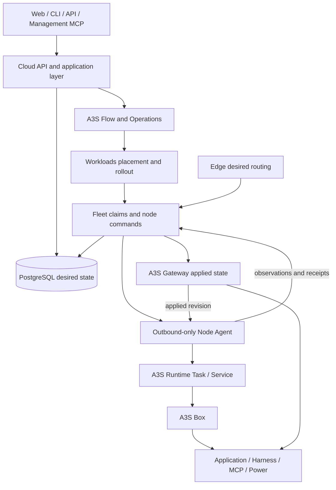

# A3S Cloud Technical Architecture

## 1. Document authority and scope

This document is the stable target architecture for A3S Cloud. It defines
component ownership, allowed dependency directions, control loops, consistency
boundaries, deployment profiles, and failure behavior. It deliberately does
not contain milestone history, pull-request evidence, migration-by-migration
notes, or an implementation diary.

Capability availability is gate-driven. A target described here is not a
shipped claim unless its gate is marked `Verified` in the product roadmap.

| Document | Owns |
| --- | --- |
| [README](../README.md) | Product introduction, current capabilities, and operator entry points |
| This document | Stable target architecture and authority boundaries |
| [Product roadmap](../ROADMAP.md) | Product gates, status, dependencies, and delivery order |
| [Development plan](development-plan.md) | Implementation slices, recovery evidence, and exit gates |
| [Domain model](domain-model.md) | Aggregates, state machines, invariants, and data ownership |
| [Inference plan](inference-plan.md) | Detailed `I0` model-serving design |
| [Management MCP contract](management-mcp.md) | Management MCP transport and authorization contract |
| [A3S Use plugin roadmap](https://github.com/A3S-Lab/Use/blob/main/ROADMAP.md) | Canonical package, catalog, plan/apply, grant, binding, capability-generation, and shared Plugin Manager delivery |

When the documents disagree, this document decides architectural ownership,
the roadmap decides public availability, and the owning detailed plan decides
whether implementation evidence is sufficient to advance a gate.

## 2. Product objective and non-goals

The A3S Cloud product stack is an A3S-native platform for durable, isolated,
resumable Agent and application execution on operator-owned Linux systems. Its
target is to replace the operational roles commonly assembled from Google AX
and Kubernetes without requiring either system.

Replacement means that the A3S stack owns the complete product outcome:

- Cloud owns tenant intent, durable business state, orchestration policy, and
  management surfaces;
- the Cloud Plugins context owns tenant plugin assignments, while A3S Use owns
  package verification and the complete plugin-generation lifecycle;
- Flow and Operations own resumable long-running work;
- Workloads and Fleet own placement, claims, rollout, and outbound node
  control;
- Runtime defines provider-neutral Task and Service lifecycle;
- Box owns node-local execution, isolation, images, mounts, snapshots, and
  cleanup;
- Gateway owns the applied request path; and
- Power supplies the Box-hosted inference serving boundary.

The Cloud binary does not absorb every responsibility. The product is a set of
components with one authority for each concern, connected by versioned
contracts.

The target does not require AX or Kubernetes API, wire, manifest, CRD,
Operator, Helm, scheduler, event-log, or controller compatibility. Existing
tools may be admitted later only as bounded adapters behind an A3S-owned port.
They cannot become a second authority.

The architecture also excludes:

- a second scheduler, workflow engine, job queue, node-control channel, or
  autoscaler;
- a Cloud package installer, plugin capability registry, workspace-grant
  store, Runtime-binding store, or plugin-specific execution protocol;
- Docker, a Docker-compatible daemon, or a fallback execution provider;
- Cloud on the live application, MCP, or inference byte path;
- mutable provider configuration as product desired state;
- Redis as durable business, coordination, or replay state; and
- parallel domain-specific implementations of idempotency, object storage,
  streaming cursors, audit, or integration events.

## 3. Fixed architecture principles

1. **Intent is durable before work starts.** An accepted mutation commits
   tenant-scoped desired state and replay identity before asynchronous work is
   dispatched.
2. **Desired and observed state are separate.** Reconcilers advance only from
   exact generation-bound observations; absence of evidence is not success.
3. **Every concern has one authority.** New product profiles reuse the common
   control path instead of introducing profile-specific controllers.
4. **The control plane is a modular monolith.** Business contexts are isolated
   by ports and events, while one deployable keeps transactions and operations
   understandable.
5. **Nodes are outbound-only.** Node Agents establish authenticated mTLS
   sessions to Cloud; Cloud does not require an inbound node-management port.
6. **Execution is provider-neutral above Runtime and Box-only below it.** Cloud
   expresses Task or Service intent; Box is the sole concrete local provider.
7. **Identifiers and revisions are immutable.** Mutable source tags and
   manifests are resolved to exact digests before they become execution
   authority.
8. **Protocols are versioned and capability-negotiated.** Unknown versions,
   fields, states, or capability combinations fail closed.
9. **Recovery is a first-class path.** Every side effect has an adoption,
   replay, fencing, or cleanup rule for process death and ambiguous delivery.
10. **Configuration is ACL-only.** A3S ACL is parsed and generated with
    `a3s-acl`; no compatibility configuration language exists.
11. **Plugin management is assignment, not installation.** Cloud records who
    wants which exact A3S Use package on which authorized workspace host. The
    shared A3S Use Plugin Manager remains the only component allowed to plan,
    apply, reconcile, enable, disable, drain, or remove that package.

## 4. Single-authority map

This table is the mandatory design-review checklist. A capability that needs a
second entry in an authority row must be redesigned before implementation.

| Concern | Sole authority | Prohibited duplicate |
| --- | --- | --- |
| Business desired state | PostgreSQL | Redis, event streams, node journals, or local files as product truth |
| Tenant plugin registry enrollment and desired assignment | Cloud Plugins context in PostgreSQL | Asset kinds, node-local receipts, catalog caches, or Use capability snapshots as tenant intent |
| Plugin catalog, package trust, immutable generation, grant, binding, and capability lifecycle | Shared A3S Use Plugin Manager and its canonical contracts | Cloud installer, TUF implementation, package/grant/binding tables, capability registry, surface reconciler, or universal plugin action RPC |
| Relational access | A3S ORM | Raw SQL, direct database drivers, or a context-local data-access layer |
| Long-running work | A3S Flow plus Operations | Agent controller, build queue, workflow engine, or ad-hoc retry loop |
| Request replay | Shared tenant-scoped idempotency records | Per-context idempotency tables or in-memory replay state |
| Integration facts | Transactional Outbox plus A3S Event | Direct publish-before-commit or a profile-specific event bus |
| Placement, replicas, rollout, and scaling | Workloads | Agent, MCP, inference, Gateway, or import-specific schedulers and autoscalers |
| Node delivery | Fleet `node_commands`, leases, and the Node Agent journal | Direct Cloud-to-process control, second queue, or profile-specific node channel |
| Provider-neutral lifecycle | A3S Runtime Task and Service | Product policy inside Runtime or provider calls from Cloud contexts |
| Local execution and build | A3S Box | Docker, BuildKit, another Runtime driver, or a Cloud-owned local executor |
| Node resource ownership | Fleet Claims and fencing | In-memory reservations or provider state treated as a reusable claim |
| Routing intent | Edge | Gateway-local desired routes in managed mode |
| Applied request-path state | A3S Gateway | Cloud request proxying or Edge inferring an apply without acknowledgement |
| Product configuration | A3S ACL through `a3s-acl` | Non-ACL product configuration, provider-native manifests, or compatibility parsers |
| Hosted Asset Git refs, objects, and rollback evidence | Assets `LocalAssetGitRepository` plus its same-lease checksummed journal | PostgreSQL ref mirrors, Source checkout clones, Artifact copies, or another Git runner |
| Hosted Asset Git writer, quota, commit, and backup-reference state | One `asset_git_repository_controls` row through A3S ORM | Redis/file locks, process-local writer flags, a second repository-control table, or event-stream authority |
| Immutable bytes | One shared immutable-object infrastructure client with typed domain adapters | Parallel filesystem or S3 clients and untyped cross-domain blob APIs |
| Audit | Shared append-only audit records | Agent, Gateway, inference, or MCP-specific audit stores |
| Client sequence transport | Shared cursor, gap, polling, and SSE primitives | Controller-local cursor codecs or best-effort in-memory streams |
| Production autoscaling | The `H0.5` Workloads autoscaler | Gateway, inference backend, or metrics-provider scaling loops |

Redis is never an authority in this map. It may accelerate disposable fan-out,
short-lived counters, or a specifically gated globally exact request limit.
Correctness must remain intact when Redis is empty or unavailable. It never
owns conversations, commands, queues, locks, cursors, approvals, checkpoints,
leases, desired state, or durable usage.

If A3S ORM lacks a required typed query, expression, lock, or transaction
primitive, the primitive is added and certified in A3S ORM through its normal
issue, pull-request, release, and compatibility-lock flow. Cloud does not use
raw SQL as a local escape hatch.

## 5. System context and topology

### 5.1 Control and execution path


```mermaid
flowchart TB
    Client[Web / CLI / API / Management MCP]
    API[Cloud API and application layer]
    DB[(PostgreSQL desired state)]
    Flow[A3S Flow and Operations]
    Workloads[Workloads placement and rollout]
    Fleet[Fleet claims and node commands]
    Agent[Outbound-only Node Agent]
    Runtime[A3S Runtime Task / Service]
    Box[A3S Box]
    Payload[Application / Harness / MCP / Power]
    Edge[Edge desired routing]
    Gateway[A3S Gateway applied state]

    Client --> API
    API --> DB
    API --> Flow
    Flow --> Workloads
    Workloads --> Fleet
    Fleet --> Agent
    Agent --> Runtime
    Runtime --> Box
    Box --> Payload
    Edge --> Fleet
    Fleet --> Gateway
    Gateway --> Payload
    Agent -->|observations and receipts| Fleet
    Fleet --> DB
    Gateway -->|applied revision| Agent
```

The diagram shows authority, not synchronous call nesting. Database commits,
Flow progress, Fleet leases, node journal entries, Runtime receipts, and
Gateway acknowledgements form explicit recovery boundaries.

### 5.2 Request path

```text
external client
  -> A3S Gateway
  -> healthy exact-generation Runtime endpoint
  -> application, MCP service, Harness endpoint, or Power service
```

Cloud API, workers, PostgreSQL, and the event backend stay off this path.
Gateway operates from a complete, bounded, expiring snapshot and reports the
exact applied revision asynchronously.

### 5.3 Deployable processes

The Rust control-plane binary supports four roles:

| Role | Responsibility |
| --- | --- |
| `all` | API, reconcilers/workers, and integration-event relay in one process |
| `api` | REST, SSE, management MCP, node-control endpoints, and web delivery |
| `worker` | Flow advancement, reconciliation, scheduling, and cleanup |
| `relay` | Transactional Outbox delivery through A3S Event |

The Node Agent is a separate process because it crosses a machine and trust
boundary. Gateway, Runtime, Box, and workload processes remain independently
versioned components. The management web application is static content served
by a bounded private web server behind Gateway; it is not another control
plane.

## 6. Control-plane modular monolith and DDD boundaries

### 6.1 Layering

Each business context follows four layers:

```text
presentation -> application -> domain
                         ^
                         |
                 infrastructure
```

- Domain code owns aggregates, value objects, repository ports, service ports,
  events, and invariants. It has no framework, SQL, HTTP, Flow, Runtime, or
  provider imports.
- Application code owns commands, queries, policies, use-case transactions,
  and port orchestration.
- Infrastructure code implements repositories and external adapters.
- Presentation code maps authenticated inputs to command/query buses and maps
  results to the common API envelope.

Cross-context mutation occurs through an owning application port or a durable
integration fact. One context never writes another context's tables.
`shared_kernel` contains genuinely stable cross-context types and mechanisms,
not business ownership or convenience wrappers.

### 6.2 Bounded contexts

| Context | Responsibility | State |
| --- | --- | --- |
| Identity | Organizations, principals, tokens, membership, grants, and authorization | Current |
| Projects | Projects, environments, and tenant boundaries | Current |
| Sources | External source identities, revisions, webhooks, and subscriptions | Current |
| Assets | Agent, MCP, and Skill identities, hosted Git, immutable release lifecycle, and Agent-to-Workload release binding | `A0.1` and `A0.2` verified; `A0.3` and `A0.4` implemented but awaiting retained provider evidence; `A0.5` planned |
| Artifacts | Immutable admitted bytes, receipts, evidence, and retention | Current |
| Executions | Generic finite Runtime Task product and cancellation lifecycle | Current |
| Workloads | Service desired state, placement, replicas, claims, deployment, rollout, and autoscaling policy | Current foundation; later `H0` gates planned |
| Fleet | Nodes, enrollment, inventory, command leases, observations, claims, and fencing | Current |
| Edge | Domains, certificates, logical Gateway scopes, routes, snapshots, and applied projection | Current |
| Secrets | Immutable Secret versions, bindings, authorization, and materialization policy | Current |
| Operations | User-visible long-running operation identity and progress projection | Current |
| Integration Events | Transactional outbox publication and consumer coordination | Current |
| Search | Tenant-authorized resource projections and bounded discovery | Current |
| Plugins | Tenant registry enrollment, desired A3S Use package assignments, reviewed-plan projection, and applied-host observations | Planned `U0` |
| Agents | Conversations, Agent executions, semantic events, approvals, checkpoints, forks, and trajectories | Planned `A1.1` through `A1.5` |
| Data | Managed databases, volumes, backup, restore, retention, and writer fencing | Planned `S0` |
| Inference | Models, backends, deployments, routes, provider egress, and durable usage | Planned `I0` |

`Executions` and `Agents` are intentionally different. `Executions` owns the
generic finite Task product. `Agents` owns conversation semantics and binds an
immutable Agent release to the common orchestration path; it is not another
execution engine. Both reuse Flow, Workloads placement policy, Fleet, Runtime,
and Box.

### 6.3 Hosted Asset Git boundary

`A0.2` adds source hosting to the existing Assets context without turning
Cloud into a generic forge. One repository is addressed only by
`(organization_id, asset_id)` and lives at
`{root}/{organization_id}/{asset_id}.git`; a mutable Asset name never selects a
path. The local adapter owns Git refs and objects. PostgreSQL owns only writer
admission, quota, applied usage, audit commit, and the latest immutable backup
reference. Those facts are complementary consistency boundaries, not mirrored
repository state.

```text
Git client
  -> tenant guard + cloud:read or asset:write scope
  -> thin Smart HTTP controller
  -> one Assets command/query handler
  -> AssetGitApplicationService
       -> PostgresAssetRepository through A3S ORM (lease/quota/commit)
       -> LocalAssetGitRepository through the shared Git runner (refs/objects)
       -> shared immutable-object client (backup bundle)
```

Every ref mutation, backup, or restore obtains one PostgreSQL lease and prepares
one checksummed local journal with the same lease ID before the side effect.
The journal records the exact prior refs digest and pre-existing object paths.
If the database row still contains an expired uncommitted lease, recovery
restores refs and removes objects introduced by that operation before releasing
the lease. If completion committed, the row contains the same cleanup lease ID
and recovery only removes the journal. A transaction whose completion is
unknown leaves the journal intact; no request guesses whether to roll back or
starts another writer. Reads fail explicitly while a writer or recovery owns
the repository.

The adapter disables receive auto-maintenance so a write cannot rewrite or
collect pre-existing immutable objects behind the journal. Provisioning,
Smart HTTP, backup, restore, and manifest admission all revalidate the bare
repository identity and reject symlinks, special files, changed configuration,
or cross-tenant paths. Backup and restore use one namespaced typed adapter over
the shared immutable-object client. `.a3s/asset.acl` is read from an exact
reachable commit and parsed only through `a3s-acl`; it never becomes a second
mutable repository configuration source.

### 6.4 A3S Use plugin management boundary

`Plugins` is a deliberately thin bounded context planned under `U0`. It owns
organization- and environment-scoped registry enrollment plus one desired
assignment for each `(package_id, target host)` tuple. The initial assignment
binds exactly one workspace scope, one exact signed catalog record, one exact
set of named surfaces, and the imported A3S Use `PluginDesiredState` value
`enabled`, `installed-disabled`, or `absent`. `SetPluginAssignment` is the sole
application mutation for those transitions; REST/CLI/Web removal and
enablement are presentation aliases, while retry uses the common Operation/Flow
resume path. This prevents two Cloud operations or lifecycle vocabularies from
competing for the one Use-owned package generation on a host. Multi-workspace
binding remains unavailable until A3S Use exposes a canonical multi-scope
parent-saga contract; Cloud will not invent its own coordinator. An assignment
does not copy package metadata into `Assets`: a Use package is a multi-surface
package, while a Cloud Asset is exactly one Agent, MCP, or Skill release.

The stable package identity is the A3S Use identity
`<publisher>/<name>`. `use/<publisher>/<name>` is its component identity and a
route is only an alias. Cloud consumes these identities, surface kinds,
catalog records, operation plans, confirmations, and observations from the
pinned `a3s-use-core` contracts. It must not restate their validation rules or
fork their schemas. If a future required value object or remote-host API is not
public in A3S Use, it is added and released there before `U0.1` advances the
compatibility lock; no Cloud-local substitute is accepted.

One assignment converges through this control path:

```text
REST / Web / CLI / Management MCP
  -> one Plugins command or query bus
  -> commit PluginAssignment + idempotency + Operation + Outbox
  -> one cloud.plugin-assignment@1 Flow
  -> one typed Fleet plan command to the assigned Plugin Host
  -> Node Agent journal
  -> shared A3S Use Plugin Manager creates one immutable canonical plan
  -> Cloud stores only the exact digest and bounded review projection
  -> trusted user confirmation or canonical ACL allow decision
  -> one typed Fleet apply command carrying operationId + planDigest
  -> A3S Use resumes its own parent saga and publishes one capability generation
  -> exact receipt and applied observation return through Fleet
  -> Cloud advances the assignment's observed projection
```

Fleet delivery replay and the A3S Use operation journal protect different
boundaries. The first proves that one remote command is not executed twice;
the second resumes package, grant, binding, projection, capability cutover,
drain, and cleanup side effects inside that command. Neither replaces the
other, and Cloud Flow never reproduces the Use child saga.

The Cloud Node Agent provides one host adapter around the shared Plugin
Manager. It does not call an extension CLI or its management MCP. Registry
verification, package generations, install receipts, Workspace Grants,
Runtime Binding receipts, Route Leases, capability snapshots, Skill/UI/OKF
projections, dependency closure, reference counts, and local reconciliation
remain Use-owned node-local evidence. Cloud persists only the registry and
assignment desired state plus exact plan, policy, receipt, generation, command,
and observation digests needed for review, audit, convergence, and recovery.
The host-local registry record is a fenced applied projection of the Cloud
umbrella-host configuration, not another enrollment authority or independently
mutable registry service.

In a cloud-managed workspace scope, the Node Agent host adapter is the only
enabled mutation adapter. Local CLI, Web, and A3S Use management MCP mutation
are disabled or policy-denied for that scope, while bounded read-only
inspection may remain available. The managed-scope ownership/fence is part of
the versioned U0 host contract, so a local adapter cannot create competing
desired state behind Cloud. Standalone A3S Use scopes keep their existing local
authority and are not silently adopted by Cloud.

Cloud Identity authorization and a Use Workspace Grant answer different
questions. Identity decides whether the current principal may change a tenant
assignment. The canonical A3S Use policy and exact-generation Workspace Grant
decide what the installed package may do inside its assigned scope. Plugins
stores only the latter's reviewed digest/effect projection; it never translates
it into a Cloud role or mirrors its grant store.

Executable plugin surfaces cannot create a Cloud-side provider path. `U0`
targets an already authorized Plugin Host; its A3S Use manager may use only the
host's explicitly injected A3S Runtime-to-Box provider and private scoped
bindings. It cannot create a Cloud Workload, select a node or replica count,
publish a Cloud Edge/Gateway route, choose an autoscaling policy, receive a
Secret value from the management plane, or fall back to another provider. A
Tool Service or MCP server that needs Cloud-managed reachability, replicas, or
rollout must be published and deployed through the existing A0/MCP0,
Workloads, Fleet, Edge, and Gateway path; `U0` does not synthesize that product
from a local plugin. Secret and OKF surfaces use the existing Secrets and A3S
Knowledge host adapters. The first `U0` release is single-host and
TUF-registry-only. Later multi-host operations manage the same independent
per-host assignments over existing H0/Fleet membership; they do not introduce
a group rollout aggregate or plugin scheduler.

REST, Web, CLI, and Management MCP are presentation adapters over the same
Plugins application service. Cloud does not proxy the local A3S Use management
MCP or add `execute(plugin, action, payload)`. Runtime Tools retain native
argv/HTTP behavior, MCP remains standard MCP, and active surfaces are consumed
through their normal host bindings rather than through the management plane.

## 7. Data, consistency, and recovery model

### 7.1 PostgreSQL and A3S ORM

PostgreSQL is the sole business desired-state authority. All production
relational reads, writes, joins, locks, and transactions use typed A3S ORM
tables, builders, and expressions. Schema migrations evolve that authority;
repositories preserve aggregate boundaries and never expose database records
as domain entities.

Commands use optimistic versions for aggregate conflicts and scoped locks only
where a shared invariant requires serialization. Transactions are short and do
not span node, Gateway, object-store, or provider calls.

### 7.2 Commit and publication

A business mutation atomically commits:

1. the aggregate change;
2. its idempotency result where applicable;
3. an Operation or Flow correlation when long-running work follows;
4. an audit record where required; and
5. bounded transactional Outbox facts.

A3S Event transports integration facts through a local or NATS-backed provider.
Events accelerate coordination but never replace PostgreSQL recovery scans.
Consumers are idempotent, and an event contains identifiers, versions, states,
and digests rather than secret or transcript payloads.

### 7.3 Durable histories are distinct

| History | Purpose | Must not be used as |
| --- | --- | --- |
| Flow history | Workflow progress, timers, retries, and recovery | Agent transcript or audit log |
| Operation projection | User-visible asynchronous command progress | Workflow authority |
| Agent semantic events | Conversation, tool, approval, checkpoint, and terminal semantics | Runtime log or integration bus |
| Runtime logs | Ordered process output and explicit gaps | Business events or approval evidence |
| Audit records | Security-relevant actor, action, target, and outcome | Domain state or telemetry |
| Telemetry | Metrics, traces, and diagnostic correlation | Desired state or durable usage ledger |

Collapsing these histories would create ambiguous retention, authorization,
and recovery semantics; duplicating one into another is equally prohibited.

### 7.4 Immutable objects

Large logs, artifacts, hosted Git backup bundles, Agent content, checkpoints,
and evidence share one
low-level content-addressed object client. Each domain keeps a typed adapter,
namespace, size/media admission policy, authorization, and retention rule.
Filesystem and S3-compatible implementations are deployment choices behind
that client, not simultaneous business authorities.

Object publication is digest-verified and adoptable after a crash. A database
reference is committed only with sufficient identity to replay or clean up an
ambiguous object write. Garbage collection is retention-aware and never treats
an unverified listing as permission to delete referenced content.

## 8. Unified desired-state lifecycle

Every deployable capability follows one lifecycle:

```text
authenticate and authorize intent
  -> commit desired state, replay identity, Operation, and Outbox
  -> start or resume one Flow
  -> compile immutable Runtime and resource requirements
  -> Workloads selects placement and reserves Fleet Claims
  -> Fleet leases one versioned command
  -> Node Agent journals the command before the side effect
  -> Runtime applies one Task or Service through Box
  -> Agent reports exact receipt, provider identity, health, and endpoints
  -> Cloud persists observed state
  -> Edge publishes complete Gateway policy when required
  -> Cloud activates only after exact Gateway acknowledgement
  -> cancellation, replacement, or failure stops/removes the unit
  -> Claims and materialized Secrets release only after fenced cleanup evidence
```

The same path serves different products:

| Product shape | Domain owner | Runtime class | Additional policy |
| --- | --- | --- | --- |
| Finite command, migration, evaluation, or backup | Executions or owning context | Task | Deadline, result, cancellation, and output retention |
| Stateless application or hosted MCP server | Workloads | Service | Health, replicas, rollout, and Gateway publication |
| Agent Harness | Agents over Workloads | Service, with versioned Harness commands | Semantic events, immutable bindings, approval, checkpoint, and fork |
| Stateful service | Data over Workloads | Service | Volume claim, writer fencing, backup, and restore |
| Inference backend | Inference over Workloads | Power Service | Accelerator claims, model cache, routing, limits, and usage |

No import format or product profile may bypass this lifecycle. An importer
produces reviewable immutable desired state; it does not remain a second source
of truth.

## 9. Node and execution plane

### 9.1 Fleet and Node Agent

Fleet owns enrollment, node identity, versioned inventory, capability matching,
leases, commands, observations, and resource Claims. The Node Agent maintains
one durable journal for received commands and outbound receipt-gated batches.

The control protocol is outbound-only over mTLS and binds every request to the
current node identity. Commands contain an idempotency identity, protocol
version, desired generation, expiry, and typed payload. A receipt settles only
the exact command or batch it names. Redelivery after a lost acknowledgement
must return the same outcome without repeating a side effect.

The planned A3S Use host adapter is another typed executor behind this same
command lease and journal. Plan, apply, enablement, and observation are
versioned payload variants in the existing Fleet envelope; they are not a
second node endpoint, queue, stream, or generic action envelope.

### 9.2 Claims and fencing

Placement is not complete when a database row names a node. Workloads asks
Fleet to reserve capacity against a specific inventory generation. The Agent
prepares the Claim locally, Runtime binds the exact allocation to the unit, and
cleanup releases it only after exact provider removal or trusted compute
fencing.

CPU, memory, and ephemeral-storage capacity may be shared scalar slots.
Accelerators, host ports, and volumes remain exclusive unless a future typed
contract proves otherwise. Stale nodes, leases, or observations cannot make a
Claim reusable.

### 9.3 Runtime and Box

A3S Runtime owns idempotent provider-neutral `apply`, `inspect`, `stop`, and
`remove` semantics for two lifecycle classes:

- `Task` is finite and reaches a terminal result only after authoritative
  cleanup semantics are satisfied.
- `Service` is long-running and publishes generation-bound health and typed
  endpoints.

A3S Box is the sole provider behind Runtime and the sole local authority for
builds, images, isolation, networks, health probes, mounts, Secret
materialization, volumes, logs, snapshots, adoption, and cleanup. Every node
profile selects a supported Box isolation mode explicitly; no automatic
downgrade or provider fallback exists.

Cloud persists Box identities and receipts needed for recovery but does not
reimplement Box journals or infer provider success. Suspend, resume, and
provider-level checkpoint capability remain unavailable until the exact
Runtime/Box contract passes crash, compatibility, integrity, and cleanup
certification.

## 10. Source, build, artifact, and release pipeline

External source is resolved to an immutable commit before a build starts. The
sole build workflow is `cloud.build@5`:

```text
Source revision
  -> Flow build operation
  -> Workloads/Fleet placement and command lease
  -> Node Agent journal
  -> Box build operation and content-addressed cache
  -> OCI output revalidation
  -> Artifact publication and signed evidence
  -> immutable release or Workload revision
```

Ownership is intentionally split:

| Stage | Authority |
| --- | --- |
| Workflow, retry, cancellation, and recovery | Flow plus Operations |
| Remote command persistence and leasing | Fleet |
| Node delivery replay | Node Agent journal |
| Build journal, cache, layers, and local images | Box |
| Admitted bytes, OCI validation, publication, and evidence | Artifacts |
| Agent, MCP, and Skill release identity | Assets |
| Deployment and rollout | Workloads |

Migration 063 persists the BuildRun subject as one closed relational union.
External revisions and hosted Asset releases enter the same bounded A3S
ORM-backed reservation transaction and the same BuildRun reconciler. Draft
Agent and MCP releases are scanned only as missing work; PostgreSQL row locks,
per-subject attempt uniqueness, and exact foreign keys repair restart gaps
without introducing an Assets queue, Redis authority, or another Flow.

Migration 064 extends that same repository transaction into the successful
hosted publication boundary. The BuildRun terminal CAS, draft-to-published OCI
release transition, immutable BuildRun/provenance binding, and schema-v2 Outbox
fact commit together through A3S ORM. Exact replay validates or repairs the
same identity. Ordinary BuildRun saves reject terminal transitions, and the
generic Assets transition path publishes only Skill bundles, so Agent and MCP
publication cannot fork into a second worker, queue, or release service.

A failed or cancelled hosted BuildRun finalizes without changing its draft
release. Recovery calls the existing organization-scoped BuildRun retry
command, which preserves the closed Asset/AssetRelease subject and creates the
next deterministic attempt. The existing reconciler enqueues that attempt as
another `cloud.build@5` Operation. Parent locking, attempt uniqueness, and the
shared idempotency record converge concurrent requests; the same atomic
finalizer then converges concurrent successful completion on one release
binding and one Outbox event. Assets therefore owns no retry queue, recovery
worker, or second lifecycle.

Cloud does not create another Git runner, cache, image builder, or deployment
path. Until Box supplies an authoritative durable build-log contract, BuildRun
log endpoints return `503 Service Unavailable`; Cloud does not fabricate empty
pages or project Runtime logs as build logs.

## 11. Native Agent platform replacing AX and Kubernetes

### 11.1 Responsibility replacement

| AX or Kubernetes responsibility | A3S authority |
| --- | --- |
| AX Server | Cloud API and Agents application context |
| AX Event Log | Agent semantic events in PostgreSQL through A3S ORM |
| AX Actor Controller | Flow, Operations, and Workloads |
| AX Harness Actor | Runtime Service, Box, and the versioned Harness port |
| AX Snapshot Service | Shared immutable-object infrastructure plus Box checkpoint capability |
| Kubernetes API and CRDs | Cloud domain commands and ACL desired state |
| Scheduler and ReplicaSet | Workloads placement, replica identities, and Fleet Claims |
| Kubelet and container runtime | Outbound Node Agent, Runtime, and Box |
| Job | Executions plus Runtime Task |
| Service and Ingress | Workloads endpoints, Edge, and Gateway |
| Secret and Volume | Secrets, Artifacts, Data, and Box VolumeStore |
| RBAC | Identity and `C0.3` grants |
| HPA | The sole `H0.5` Workloads autoscaler |
| Cluster network | `H0.3` private networking |

This is responsibility compatibility, not API compatibility. The A3S model is
smaller because it does not preserve two declarative control planes or map an
Agent actor controller onto a generic cluster controller.

### 11.2 Agent bounded context

`A1.0` has verified shared sequence/SSE transport, polling transport,
immutable-object infrastructure, and the reusable Node Agent outbound-batch
receipt primitive. `A1.1` through `A1.5` remain planned.

The planned `Agents` context owns:

- `AgentConversation`, including the sole monotonic semantic event-stream head;
- `AgentExecution`, its immutable bindings, lifecycle, Operation, Harness
  identity, and optional parent;
- contiguous semantic events for model, tool, approval, checkpoint, failure,
  and terminal outcomes;
- grant-checked approval checkpoints and logical pause/resume;
- immutable checkpoint references, explicit fork lineage, trajectory export,
  and telemetry correlation.

It reuses the common request-idempotency record, Flow and Operations, Workloads
placement, Fleet commands, the Node Agent journal, Runtime, Box, Outbox/Event,
audit chain, sequence transport, and immutable-object infrastructure. It may
not add an Agent queue, controller, scheduler, direct client-to-Harness path,
second event log, or mutable content store.

Flow history controls orchestration recovery; Agent semantic events are the
user-visible conversation history. Runtime logs remain process output. This
separation makes pause, approval, replay, retention, and audit behavior
unambiguous.

An execution binds exact published Agent, Skill, MCP, workspace, and tool
identities before dispatch. Large content and logical checkpoints are stored
once as digest-addressed immutable objects. Provider suspend/resume uses the
same logical execution and Operation but cannot be advertised until Box
checkpoint recovery is certified.

Google AX may be evaluated only after native `A1.5` is complete and AX exposes
a stable integration contract. Any adapter implements the A3S Harness port. It
cannot import AX's controller, scheduler, event-log authority, native
configuration, or client control path.

### 11.3 Replacement completion gate

The AX-plus-Kubernetes replacement outcome is complete only when the relevant
`A0.3` through `A0.5`, `A1.1` through `A1.5`, `C0.3`, `H0.3` through `H0.5`,
and Box checkpoint/suspend/resume gates pass together. A clean supported Linux
installation must publish an immutable Agent, execute it, stream exact semantic
events, gate a tool approval, survive process and node loss, resume or fork
from a verified checkpoint, scale and roll out replicas, route traffic, and
clean up without AX, Kubernetes, Helm, CRDs, Operators, Docker, or a
Docker-compatible daemon.

## 12. Edge, Gateway, and managed traffic

Edge owns domains, certificate intent, logical Gateway scopes, route policy,
complete snapshot compilation, rollout thresholds, and desired revision.
Gateway owns native snapshot validation, atomic application, its local durable
journal, request-path health suppression, endpoint selection, TLS, protocol
framing, streaming, and bounded telemetry.

Managed publication follows one direction:

```text
healthy generation-bound Runtime endpoints
  -> Edge compiles one complete expiring ACL snapshot
  -> Fleet delivers it to each Gateway member through the Node Agent
  -> Gateway validates, journals, and atomically applies the snapshot
  -> Gateway reports exact identity, revision, digest, and readiness
  -> Edge projects the applied state and advances the rollout threshold
```

Gateway may drain connections, open a circuit, or temporarily suppress an
unhealthy endpoint under applied policy. It cannot invent targets, change
weights, create replicas, approve an execution, or scale a Workload. Cloud does
not infer success from command delivery and preserves the prior healthy route
until the exact candidate acknowledgement satisfies policy.

Standalone Gateway uses operator-owned local ACL. Cloud-managed Gateway uses a
minimal bootstrap ACL plus complete Cloud-owned snapshots and rejects local
route, rollout, provider, and scaling control. The modes share request-path
mechanics but never share desired-state authority.

Private service networking, independently placed Gateway members, and
partition recovery are `H0.3` concerns. They extend the same endpoint identity
and snapshot acknowledgement model instead of adding a service mesh or a
second discovery database.

## 13. Stateful and inference profiles

### 13.1 Stateful resources

`S0` adds a `Data` context for managed databases, volumes, backups, restores,
retention, and writer fencing. A data resource still uses Workloads placement,
Fleet Claims, Runtime Service, Box VolumeStore, Secrets, Artifacts, Operations,
and the common audit path.

A stateful move is forbidden until the previous writer is stopped and its
volume Claim is released or a trusted provider fencing event proves it cannot
write. A backup is not a product capability until restore succeeds in a clean
environment and retained objects pass integrity checks.

### 13.2 Inference

`I0` adds an `Inference` context for model identities, backend compilations,
accelerator requirements, deployments, routes, provider egress, limits, and
durable usage. A3S Power is the required local serving and attestation boundary.
Cloud compiles an immutable Power profile into an ordinary Box-hosted Runtime
Service.

Inference reuses Workloads placement and autoscaling, Fleet accelerator Claims,
Box model cache and execution, Edge target sets, Gateway's OpenAI-compatible
request path, Identity grants, Secrets, and the shared usage ingestion path.
Power does not become a scheduler; Gateway does not become a usage ledger; and
Cloud does not proxy tokens. See the [inference plan](inference-plan.md) for the
full contract and delivery gates.

## 14. API, security, observability, and audit

### 14.1 Management surfaces

REST, Web, CLI, and Management MCP are adapters over the same application
commands and queries. Controllers are thin and cannot call repositories or
providers directly. Every REST result uses the common success/error envelope
with HTTP `code`, business `statusCode` for errors, `requestId`, and timestamp.

Long-running mutations return or replay an Operation identity. SSE and polling
are resumable projections, not command transports or new state authorities.
Management MCP derives tool visibility and tenant scope from the authenticated
principal and cannot accept caller-forged tenant identity.

Plugin assignment tools call the Plugins application bus. They never tunnel to
the local Use management MCP. Agent callers may request only operations
pre-authorized by the current canonical A3S Use ACL policy; they cannot enroll
or rotate a registry trust root, confirm an `ask` decision, install unsigned
local content, grant a Secret, or request destructive user-data purge.

### 14.2 Security boundaries

- Identity authenticates globally and authorizes at organization, project,
  environment, resource, and action scope.
- Node and Gateway identities use bounded, rotated mTLS credentials.
- Secrets are encrypted at rest, versioned immutably, authorized again at the
  assigned-node boundary, materialized only through Box, redacted before log
  persistence, and removed during fenced cleanup.
- External source, registry, model-provider, and certificate credentials never
  enter product ACL, events, operations, telemetry, or traffic snapshots.
- Plugin registry roots and signed catalog metadata are protocol evidence, not
  product configuration. Registry enrollment and policy selection are
  authenticated, tenant-scoped, immutable-digest-bound, and audited; only A3S
  Use performs TUF and plugin-policy validation. Secret names may appear in a
  reviewed permission plan, but values never enter a plan, Fleet command,
  receipt, capability snapshot, log, or audit record.
- Snapshot and command validity is bounded; missing, expired, cross-tenant, or
  version-incompatible security state fails closed.

### 14.3 Observability and audit

Every asynchronous path carries request, Operation, Flow, tenant, resource,
command, unit, and trace correlation where applicable. Metrics and traces use
OpenTelemetry-compatible adapters. Logs preserve ordering, gaps, bounds, and
Secret redaction. Audit records capture authenticated actor, action, target,
decision, correlation, and outcome through one append-only chain.

Observability can diagnose a decision but cannot make one authoritative. A
metric cannot create a replica except through the bounded Workloads autoscaler
command, and a trace cannot prove a deployment, approval, or Gateway apply.

## 15. Deployment profiles and failure model

### 15.1 Profiles

| Profile | Shape | Availability state |
| --- | --- | --- |
| Development | One `all` control-plane process, PostgreSQL, and explicit local Box/Node Agent/Gateway processes as needed | Developer convenience; never a production evidence substitute |
| Single node | One `all` control plane plus outbound Node Agent, Box, Gateway, durable PostgreSQL, and selected object backend | Base product gate |
| Multi-node | Separated `api`, `worker`, and `relay` roles; multiple Box nodes and independently placed Gateways | `H0.3` target |
| Highly available | Replicated roles, leader/lease fencing, PostgreSQL failover, durable event delivery, replicated object storage, upgrade and disaster procedures | `H0.4` and `H0.5` target |

Cloud's production installation is ACL-native and Box-hosted. It packages the
same Cloud roles, migrations, Node Agent, Gateway, and required dependencies
without Kubernetes, Helm, CRDs, Operators, Docker, or a compatibility daemon.

### 15.2 Failure behavior

| Failure | Required behavior |
| --- | --- |
| API process loss after commit | Caller retry replays the same result; workers recover from durable state |
| Worker loss | Flow and Operation leases expire and another worker resumes the same step |
| Event relay or backend loss | Outbox remains durable; recovery scans keep correctness independent of event delivery |
| Command delivery or acknowledgement loss | Fleet redelivers the same command; Agent journal and Runtime identity prevent another side effect |
| Node Agent loss after Box apply | Restart adopts the exact provider unit and settles the pending receipt |
| Node partition or stale inventory | No new placement uses stale capacity; Claims remain fenced until exact recovery evidence |
| Gateway apply before acknowledgement loss | Redelivery observes the exact native revision and does not repeat or infer the apply |
| Candidate deployment failure | Prior healthy generation and route remain active; cleanup is explicit and resumable |
| Hosted Git process death before PostgreSQL completion | The expired lease is claimed for recovery; the same local journal restores refs and removes only newly introduced objects before another writer starts |
| Hosted Git completion acknowledged by PostgreSQL before journal cleanup | The committed cleanup lease causes restart to remove the same journal without rolling back applied refs |
| Plugin plan/apply acknowledgement loss | Fleet replays the exact command; the A3S Use manager reloads the same operation and plan digest, preserves the prior active generation until cutover, and returns the same receipt |
| Plugin plan expiry or policy/trust drift | Apply fails closed; Cloud records the blocked attempt and may create a new immutable plan attempt only inside the still-current desired-generation reconciliation, never by mutating or silently reauthorizing the reviewed plan |
| PostgreSQL unavailability | New mutations and authoritative progress stop safely; no cache is promoted to authority |
| Object backend unavailability | Metadata remains readable where safe; content-dependent work blocks explicitly and resumes |
| Redis loss | Optional acceleration degrades or exact-limit traffic follows its fail policy; business state is unchanged |

No recovery path may create a second provider unit, advance a semantic sequence
twice, release an unfenced Claim, expose an unacknowledged route, or silently
discard an approval, command, log gap, usage gap, or cleanup obligation.

## 16. Dependencies, middleware, and evolution rules

| Dependency | Role | Policy |
| --- | --- | --- |
| PostgreSQL | Desired state, operations, idempotency, audit, and durable projections | Required; sole business database authority |
| A3S ORM | Typed relational persistence and transactions | Required for every production relational path |
| A3S ACL | Product configuration and immutable profile compilation | Required; sole configuration language |
| A3S Flow | Durable workflows, retries, timers, and leases | Required for long-running work |
| A3S Event | Integration-fact transport | Required abstraction; local or NATS provider does not own state |
| A3S Runtime | Provider-neutral Task and Service lifecycle | Required execution contract |
| A3S Box | Local execution, build, image, isolation, mount, snapshot, and cleanup | Required sole provider |
| A3S Gateway | Managed application, MCP, and inference traffic | Required when a profile exposes traffic |
| A3S Power | Local inference serving | Required only for `I0` |
| A3S Use | Signed plugin catalog, canonical plan/confirmation/receipt contracts, shared Plugin Manager, package generations, grants, bindings, and capability reconciliation | Required only for `U0`; Cloud pins and adapts it rather than reimplementing it |
| Filesystem or S3-compatible objects | Immutable large content | One selected backend per namespace/profile behind the shared client |
| NATS JetStream | Replicated A3S Event delivery | Conditional on the HA profile; never workflow or desired-state authority |
| Redis | Ephemeral fan-out or specifically gated exact distributed counters | Optional and disposable; prohibited for durable control state |
| OpenTelemetry Collector | Telemetry routing | Production profile dependency, not a decision authority |
| PgBouncer | Connection pressure control | Added only after measured need |

Evolution follows these rules:

1. Extend an existing authority before creating a context. Create a context
   only for a new business language, aggregate boundary, and lifecycle.
2. Introduce a provider through a typed port and real conformance suite. Raw
   backend names never enter domain options or ACL decisions.
3. Version cross-process commands, receipts, observations, snapshots, and
   capabilities. Prove mixed-version upgrade, downgrade rejection, and replay.
4. Update the exact component revision, Cargo dependency, compatibility lock,
   contract fixtures, architecture, roadmap, and operational evidence together.
5. Remove retired adapters, exports, configuration, tests, and documentation
   when a replacement becomes authoritative; do not retain a hidden fallback.
6. Add middleware only for a measured limit and state its failure semantics.
   Middleware may optimize an authority but cannot become one.

## 17. Architecture definition of done

An architectural capability is complete only when:

- exactly one bounded context and one component own every new decision;
- domain, application, infrastructure, and presentation boundaries pass source
  architecture checks;
- every relational path uses A3S ORM and every product configuration path uses
  A3S ACL through `a3s-acl`;
- all side effects have idempotency, timeout, cancellation, replay, fencing,
  adoption, and cleanup semantics appropriate to their boundary;
- clean-environment real-provider tests cover success, denial, failure,
  process death, redelivery, corruption, mixed versions, recovery, and cleanup;
- security tests cover tenancy, grants, revocation, Secret redaction, SSRF,
  path/URL validation, and forged identity relevant to the capability;
- API, Web, CLI, Management MCP, audit, metrics, traces, runbooks, migrations,
  upgrade, rollback, backup, and restore are included where the gate requires
  them;
- unsupported capability fails explicitly instead of silently degrading;
- no Docker, Kubernetes, AX, Redis, or middleware dependency becomes a hidden
  second control plane; and
- README claims, roadmap state, detailed plans, domain model, contracts, and
  compatibility locks describe the same verified behavior.

The full native Agent-platform outcome additionally requires the clean Linux
replacement gate in [section 11.3](#113-replacement-completion-gate). Until
that gate passes, A3S Cloud remains on the documented delivery path toward
replacing AX plus Kubernetes rather than claiming completed equivalence.
