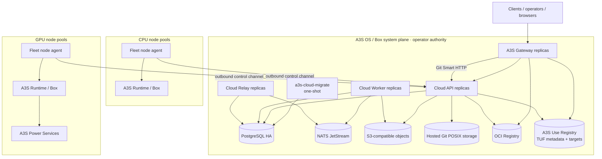

# A3S Cloud Deployment and CPU/GPU Cluster Architecture

## 1. Decision

A3S Cloud uses two deployment planes with one execution mechanism:

- the **system plane** bootstraps Cloud itself and its required middleware from
  an operator-owned A3S OS/Box package; and
- the **tenant workload plane** is reconciled by Cloud through Workloads,
  Fleet, A3S Runtime, and A3S Box after the system plane is healthy.

This separation removes a circular dependency. Cloud cannot require its own
API, database, scheduler, or Gateway to start the services on which those
components depend. System-plane services may reuse Runtime/Box mechanics, but
their desired state is owned by the operator/A3S OS bootstrap, not by a tenant
Cloud Workload.

A3S Gateway is the only public ingress for Cloud APIs, Hosted Git Smart HTTP,
public OCI/Use Registry endpoints when enabled, AaaS, WaaS, FaaS, tenant
static Web, inference, MCP, and Durable Cell traffic. A3S Cloud ships no
management Dashboard.

This document extends the existing `H0.1`-`H0.5`, `BX0`, `I0`, `G0`, `U0`, and
`WEB0` gates. It does not create another scheduler or deployment control plane.
State-aware drain, migration, scale-to-zero, and node-capacity decisions are
defined in
[Elastic Service Deployment Architecture](elastic-service-deployment-architecture.md).

## 2. Deployment topology



The diagram is a logical deployment. PostgreSQL, NATS, S3, Git storage, OCI
Registry, Vault, DNS, and Use Registry may be operator-managed or external
managed services as long as they meet the same identity, security, durability,
backup, recovery, and conformance contracts.

## 3. System-plane process roles

| Component | Responsibility | Must not own |
| --- | --- | --- |
| `a3s-cloud-migrate` | Apply the Cloud, Flow, and Boot owner manifests once; reconcile serving-role grants; terminate | Serving, reconciliation, traffic, or a second migration path |
| `api` | REST/OpenAPI, Management MCP, health, authorized commands/queries, node long-poll/control endpoints, current Hosted Git Smart HTTP | Background reconciliation, Outbox relay, direct Box process control, schema migration |
| `worker` | A3S Flow execution, operations, builds, reconciliation, cleanup, schedules and owner workers selected by its closed role | Public management surface, local durable state, migration |
| `relay` | Transactional Outbox/A3S Event delivery and exact owner projections | Business command handling, schedulers, Runtime registry, build staging |
| A3S Gateway | TLS, public authentication/policy, routing, streaming, drain, inference dispatch, planned static object targets | Product desired state, scheduling, Runtime/Box lifecycle, object mutation |
| Fleet node agent | Outbound enrollment, inventory, Claim preparation, versioned command journal and observations | Product policy, placement, route publication |
| A3S Runtime + Box | Generic Task/Service lifecycle and node-local execution | Tenant/Product/Workflow semantics or public ingress |

The current code supports `all`, `api`, `worker`, and `relay`. Production uses
the split roles. `all` is a development/single-node convenience and is not the
HA topology.

Hosted Git currently enters through the API Smart HTTP boundary. If load or
security isolation justifies a separate `git` process role, it must reuse the
same Assets Application contracts, PostgreSQL writer lease, Hosted Git storage
identity, and journal. It cannot introduce another repository or ref authority.

## 4. Bootstrap and upgrade order

The installation is a dependency DAG, not a best-effort collection of
containers:

1. Provision private networking, host identities, DNS, time, and operator
   Secret injection.
2. Start and verify PostgreSQL, S3-compatible objects, Hosted Git storage, OCI
   Registry, and NATS when event-owning roles are enabled.
3. Install exact digest-pinned A3S Box/Runtime/Gateway/Cloud packages.
4. Run the singleton migrator with its non-serving database principal.
5. Start API, Worker, and Relay replicas with distinct serving principals and
   role-scoped dependencies.
6. Start Gateway replicas, apply the first complete Cloud snapshot, and require
   the configured readiness threshold before publishing DNS/traffic.
7. Enroll CPU and GPU nodes through the outbound Fleet channel; only then admit
   tenant workloads.

Upgrade reverses risk rather than order: validate expand-compatible migrations,
upgrade consumers within their mixed-version window, apply exact Gateway
snapshots, drain old roles, and contract only in a later release. Rollback uses
immutable prior process and snapshot revisions; it never rewrites a migration
ledger or a release in place.

## 5. Required middleware and data services

| Service | Role in A3S Cloud | Deployment contract |
| --- | --- | --- |
| PostgreSQL | Sole durable product desired state, idempotency, Operations/Flow state, Claims, Outbox and audit metadata | HA/failover, PITR, TLS, distinct migrator/serving principals, checksummed owner migrations |
| NATS JetStream | Production transport for event-owning Worker/Relay roles | Never business truth, Workflow history, retry authority, or required by query-only API roles |
| S3-compatible object storage | One immutable-byte authority for files, artifacts/evidence, model weights/tokenizers/config/cards, checkpoints, logs, Web bundles and backups | HTTPS, versioned identity binding, create-only or owner-specific CAS, retention and external-provider gates; Cloud bundles no S3 server |
| Hosted Git storage | Bare Asset repositories, refs, objects, journal and rollback evidence | One identity-bound replicated POSIX filesystem plus PostgreSQL writer lease/control; not stored as S3 objects or ref mirrors |
| OCI Registry | Digest-pinned Runtime/Box images and build publication | Standards-compliant external service; Artifacts owns publication/provenance, Secrets owns credentials, Box pulls exact digests |
| A3S Use Registry | Signed TUF metadata, reviewed catalog records and immutable cognitive-package targets | Separate `A3S-Lab/Use-Registry`; `a3s-use` owns formats/tooling and package lifecycle; Cloud Plugins owns tenant enrollment/assignment only |
| Vault or selected Secret backend | Production cryptographic/signing/materialization boundary where configured | Secret references only in Cloud state; no plaintext in ACL, events, snapshots, logs or workspaces |
| Redis | Optional profile-specific exact distributed rate/admission state, primarily later inference Gateway gates | Never a global Cloud database, Workflow queue, session store, lock, replay or business authority |
| A3S Power | GPU model-serving and opaque phase-transfer process | Ordinary Runtime Service or placement-group member on Box with exact accelerator/fabric Claims; no scheduler, endpoint registry, model catalog, or Cloud control process |

### 5.1 Registry separation

The three registries have different identities and cannot be collapsed:

| Registry/service | Stores | Owner |
| --- | --- | --- |
| Hosted Git | Mutable source refs and Git objects for tenant Assets | Cloud Assets |
| OCI Registry | Immutable OCI blobs/manifests addressed by digest | External registry mechanism; Cloud Artifacts owns accepted publication evidence |
| A3S Use Registry | Signed TUF metadata, catalog v3 admission and cognitive-package targets | A3S Use formats/tooling + separate Use Registry publication repository |

Cloud's Plugins context may enroll a trusted Use Registry endpoint and root
digest, query its verified catalog through the A3S Use port, and store exact
desired package assignments. It must not implement TUF, cache packages, resolve
graphs, install packages, or create a second capability registry.

The official Use Registry is naturally served as immutable HTTPS metadata and
targets. It may use the same S3/Gateway static delivery mechanism after `WEB0.4`
only if TUF content types, range behavior, immutable digests, expiry and mirror
semantics pass Use-owned conformance. Its offline root/signing authority remains
outside Cloud and Gateway.

OCI Registry and Git Smart HTTP may be public only through explicit Gateway
routes. Internal build publication and Box pulls should use private endpoints
and least-privilege credentials; public exposure is not required for normal
tenant execution.

### 5.2 Model supply is not another Registry mechanism

Inference owns logical Models, immutable ModelRevisions, weight variants,
license/trust, and deployment compatibility. Artifacts owns canonical sorted
model-file manifests and provenance. The shared S3 authority stores sharded
weights, tokenizer/config, model card, license, and related immutable bytes.
Fleet reports only verified node-cache observations; Power consumes an exact
revision/variant after placement.

ModelScope, Hugging Face, operator object imports, or admitted model OCI
artifacts are external source adapters. Every mutable provider tag resolves to
an exact upstream revision before streaming/resume, verification, publication,
and cache prewarm. Cloud does not run a second model hub, place weights in Git
or PostgreSQL, or treat an OCI executable image as a model artifact. See
[Model and Weight Supply Architecture](model-supply-architecture.md).

## 6. One CPU/GPU scheduler

Cloud has one placement authority: Workloads plus Fleet. CPU and GPU are
different resource dimensions, not different schedulers.

```text
immutable Workload/Execution plan
  -> tenant quota and policy admission
  -> candidate nodes from one fresh Fleet inventory
  -> deterministic placement plan
  -> PostgreSQL Claim reservation / placement-group generation
  -> node prepare through outbound Fleet commands
  -> all required Claims commit or all compensate
  -> Runtime Task/Service apply through Box
  -> exact observation and endpoint admission
```

### 6.1 CPU pools

Fleet inventory reports allocatable CPU millicores, memory, PIDs, ephemeral and
artifact-cache storage, architecture, operating-system/runtime revision,
network/failure domain, health, maintenance state, and supported isolation.

CPU workloads may share a node only within the committed scalar Claims and Box
enforcement. Dedicated/isolated CPU, architecture, NUMA, confidential-compute,
locality, anti-affinity, and pool requirements are explicit placement policy,
not labels interpreted by product contexts.

Typical pools are:

- `system`: Cloud/Gateway/middleware bootstrap, never tenant scheduled;
- `cpu-general`: stateless Functions, builds, Workflow Tasks and ordinary
  Services;
- `cpu-agent`: stateful Agent Harnesses with workspace and stronger isolation;
  and
- `cpu-confidential`: only nodes with certified confidential Runtime support.

Pool names are operator policy. They select candidates in the same scheduler
and do not create a scheduler per pool.

### 6.2 GPU pools

GPU inventory extends the same Fleet snapshot with typed accelerator devices:
vendor, model, device/partition identity, VRAM, driver/runtime compatibility,
health, reset epoch, PCIe/NUMA/NVLink/fabric topology, supported partition mode,
and attestation where required.

One accelerator Claim binds exact devices or hardware-enforced partitions plus
CPU, memory, disk, ports and topology. Soft fractional GPU or VRAM sharing is
not admitted as production isolation. MIG or another hardware partition is a
typed device identity and requires its own health/reset/fencing evidence.

Typical pools are:

- `gpu-inference`: long-running A3S Power model Services;
- `gpu-batch`: finite training, evaluation, media or embedding Tasks; and
- `gpu-confidential`: only independently certified confidential accelerators.

Inference owns model/topology/role intent; Workloads owns placement, rollout,
and the sole per-role scaling evaluator; Fleet owns inventory/Claims;
Runtime/Box owns process enforcement; Power owns serving and opaque KV or
embedding transfer. No component may add a model scheduler or GPU side queue.

### 6.3 Distributed GPU placement

A multi-node model replica uses the existing `H0.3` placement-group/gang-Claim
extension:

1. Inference compiles one immutable member topology and failure-domain/fabric
   constraints.
2. Workloads computes a complete member-to-node/device plan from one inventory
   fence.
3. PostgreSQL reserves one placement-group generation and every member Claim
   atomically.
4. Fleet prepares all nodes. Any rejection, timeout, stale inventory, device
   reset, or partial network setup compensates every prepared member.
5. Only an all-ready plan commits and launches the generation-bound Runtime
   Services through Box.
6. Gateway receives only the complete healthy target topology selected by
   Inference/Edge.

Runtime Unit count is determined by executable members, not GPU count. Tensor
parallel, pipeline parallel, and prefill/decode roles are typed topology values,
not new Runtime classes.

Prefill/decode disaggregation and multi-node model parallelism are orthogonal.
An Inference deployment may project independently scaled `prefill` and
`decode` managed Workload slots, and each slot replica may itself be a
multi-node placement group. Gateway sees one compatible serving cohort and
performs request-scoped role endpoint selection; it never places processes.
Workloads/Fleet never inspects prompts or KV-cache entries. The independently
gated multimodal `encode` slot follows the same rule.

## 7. Quotas, fairness, and autoscaling

- Identity/Projects supplies canonical tenant/project/environment scope.
- Workloads admits resource requests against versioned CPU, memory, storage,
  accelerator, replica and concurrency quotas before placement.
- Claims, not metrics, are allocation truth.
- The sole `H0.5` autoscaler changes desired replicas/capacity policy from
  bounded trusted evidence. Gateway and Power may publish signals but cannot
  mutate desired replicas.
- Durable Cell is a first-class collaboration-state service. Provider shard
  scaling and named-partition movement reuse Workloads retirement and S0
  writer-fence evidence; Cloud never scales by creating one Service per Cell.
- Node/VM provisioning, cloud-instance credentials and SSH lifecycle are not
  implicitly part of the scheduler. A future Compute provider requires its own
  explicit owner and evidence.
- The first production baseline uses admission and queue order, not unsafe
  opportunistic preemption. Any later priority/preemption contract must fence
  the victim, release its Claim, and preserve product recovery semantics before
  reallocation.

## 8. HA and failure domains

| Failure | Required behavior |
| --- | --- |
| API replica loss | Gateway routes to healthy replicas; no desired state is lost |
| Worker/Relay loss | PostgreSQL/Flow/Outbox leases expire and another replica replays exact work |
| Gateway replica loss | Complete-snapshot threshold and remaining members preserve traffic; recovery applies the exact revision |
| PostgreSQL failover | Serving roles reconnect within bounded policy; no migration runs automatically |
| NATS loss | Event delivery waits/replays from Outbox; product transactions remain committed |
| S3 loss/corruption | Object-dependent operations fail closed; digest mismatch is never served or adopted |
| Git mount drift | Create-once topology identity rejects startup before writes or routes |
| OCI Registry loss | Existing digest-pinned cached/running Units remain; new pulls/build publication wait or fail explicitly |
| Use Registry loss/expiry | Existing verified installed generations may continue by policy; refresh/install fails closed; no silent source switch |
| CPU node loss | Claims fence, targets drain, and stateless workloads reschedule through one generation transition |
| GPU/device loss | Exact device/reset epoch becomes ineligible; complete model member/group is removed until a fenced replacement converges |
| System-plane host loss | Operator bootstrap restores system roles independently of tenant Cloud scheduling |

## 9. Management surfaces and tenant Web delivery

A3S Cloud itself ships no Dashboard or management SPA. Operators and automation
use REST/OpenAPI, the maintained client, CLI and Management MCP, all backed by
the same Application commands and queries.

`WEB0` is a tenant platform capability for Agent and Application UIs. Those
immutable Web releases are deployed independently through Gateway and may call
authorized public Cloud or application APIs. They do not become a Cloud
management surface, receive privileged internal endpoints, or store
authorization truth, Secret material, Workflow state, registry state, or a
local mutation queue.

## 10. Production gates

| Gate | Required outcome |
| --- | --- |
| `H0.4-SYS1` | Freeze the system-plane dependency DAG, role-specific ACL, identities, private/public ports and bootstrap ownership |
| `H0.4-SYS2` | Clean-host install of PostgreSQL/NATS/S3/Git/OCI/Use Registry dependencies plus migrator/API/Worker/Relay/Gateway with exact versions and no circular Cloud scheduling |
| `H0.4-SYS3` | HA API/Worker/Relay/Gateway placement, process/host loss, credential rotation, expand/rollback and dependency failover evidence |
| `H0.4-SYS4` | Replicated object/Git topology identity, backup/restore, registry outage/expiry/rollback, disaster recovery and zero-secret evidence |
| `H0.3-CPU` | Multi-node CPU placement, Claims, pool selection, anti-affinity, drain, maintenance, stale return and cleanup on real nodes |
| `I0.1-GPU` | Single-node exact accelerator inventory/Claim/Box/Power enforcement, device reset and cleanup evidence |
| `I0.4-GANG` | Multi-node all-or-none GPU placement group, private fabric, partial prepare compensation, node/device loss and target removal evidence |
| `H0.5-SCALE` | Sole autoscaler, quotas, bounded signals, load limits, safe scale-to-zero/up and no second mutation path |

No gate is complete from configuration, a fixture, an environment-skipped test,
or the existence of a driver. Evidence binds exact Cloud, Runtime, Box, Gateway,
Power, Use, Registry fixture and middleware revisions.

## 11. Non-goals

- Using Kubernetes, Helm, a CRD, or another controller as a second Cloud
  control plane.
- Scheduling the bootstrap PostgreSQL/Gateway/API through the unavailable Cloud
  they are starting.
- A CPU scheduler, GPU scheduler, inference scheduler, Function scheduler and
  Agent scheduler with separate Claims or queues.
- Treating NATS, Redis, S3, Git, OCI Registry, Use Registry, Runtime or Box state
  as Cloud product truth.
- Implementing an OCI Registry, Git forge, TUF client, package manager, S3
  server or model server inside a product bounded context.
- Direct public access to Cloud system processes, Runtime endpoints, Box,
  PostgreSQL, NATS, object storage or node agents.
- Shipping an A3S Cloud management Dashboard or a UI-specific backend.
