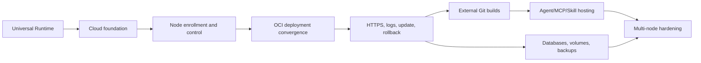

# A3S Cloud Development Plan

## 1. Delivery objective

The first usable release is one verified vertical slice:

```text
enroll one Linux node
  -> deploy one digest-pinned OCI image
  -> observe a real health check
  -> activate an HTTPS route
  -> stream ordered logs
  -> update and roll back to the previous healthy revision
```

The plan is gate-driven rather than date-driven. A milestone is complete only
when its exit evidence passes against real dependencies. Later milestones do
not compensate for an unproven Runtime contract, lost-operation recovery, or a
mock-only deployment path.

## 2. Engineering rules

- Implement vertical behavior through domain, application, infrastructure,
  transport, web UI, documentation, and tests in the same milestone.
- Write aggregate and protocol tests before the implementation they constrain.
- Keep the repository root as orchestration only. The Rust workspace lives at
  `apps/cloud/Cargo.toml` when implementation starts.
- Commit changes in external crate submodules separately from the root pointer
  update. Never mix an A3S Runtime release with unrelated Cloud code.
- Pin A3S dependency revisions and keep one app-local `Cargo.lock`.
- Put every external middleware behind a typed application port and test its
  real provider; backend names never enter domain decisions.
- Do not mark an integration complete with an in-memory repository, fake
  Runtime driver, fake Gateway acknowledgement, or mocked health response.
- Every long-running command is idempotent, cancellable, resumable after
  process death, and visible as one Operation timeline.
- Documentation describes shipped behavior only; planned behavior stays marked
  as planned.

## 3. Critical path



The first release gate is `E0`. Hosted assets and stateful services begin only
after that loop is repeatable under crash and retry tests.

### 3.1 Verified delivery status

Status as of 2026-07-15:

| Gate | State | Release evidence |
| --- | --- | --- |
| R0 | Verified | General Task and Service conformance passes against the real Docker provider |
| F0 | Verified | Isolated PostgreSQL migrations, tenancy, idempotency, Flow recovery, and local/NATS outbox gates pass |
| N0 | Verified | Outbound mTLS protocol, durable command journal, replay, provider reattachment, and lost-provider recovery pass |
| D0 | Verified | Real digest-pinned apply and health, restart recovery, failed-update retention, cancellation cleanup, and registry resolution pass |
| E0 | In progress | PostgreSQL-backed route ownership, healthy target resolution, complete snapshot dispatch/replay, exact acknowledgement activation, and route-less node CAS validate/reload pass. A3S Gateway 1.0.11 stack-overflows on the route-bearing ACL gate; TLS, logs, update, rollback, and crash gates remain |

The MVP is not complete until E0 passes. D0 verification does not imply public
reachability, production log retention, rolling update, or rollback support.

## 4. Milestone R0: generalize A3S Runtime

### Goal

Replace the Bench-shaped core contract with a genuinely general Runtime
contract before Cloud depends on it.

### Work

1. Write a Runtime ADR and contract tests for Task and Service units.
2. Introduce versioned, provider-neutral types for unit spec, generation,
   process, artifact inputs, mounts, secret references, resources, networking,
   ports, health, restart, outputs, observation, logs, and failure.
3. Replace `submit/inspect/cancel` with idempotent
   `apply/inspect/stop/remove`; add capability-gated logs and exec surfaces.
4. Replace the closed capability booleans with structured supported-capability
   sets and a required-capability matcher.
5. Keep provider ID, factories, and the registry in Runtime, but move session,
   login-state, operator-precedence, default-Docker, and Bench capability
   selection policies to their owning callers.
6. Generalize the managed client and durable operation store around unit ID,
   request ID, generation, and canonical spec digest.
7. Export a provider conformance harness that exercises task and service
   lifecycle semantics with an injectable clock and fault points.
8. Move Candidate/Judge construction, artifact interpretation, privacy rules,
   and result validation into A3S Bench as a Task profile adapter.
9. Define a versioned migration policy for existing v1 records. Terminal v1
   records remain readable through Bench-owned legacy decoding; they are not
   silently rewritten as general Runtime records.
10. Update Runtime and Bench documentation together and publish a breaking
   pre-1.0 release only after all known consumers compile.

### Exit gate

- Runtime core source has no Candidate/Judge role enum or role-specific
  validation.
- Runtime core has no Bench support predicate, login-state policy, or implicit
  provider fallback.
- The same client runs one finite Task and one long-running Service.
- Exact duplicate apply reattaches; conflicting reuse and stale generation fail
  deterministically.
- Restarting the managed client preserves identity and reattaches without
  launching a duplicate provider resource.
- Capability mismatch fails before provider start.
- Stop and remove are idempotent and bounded; lost provider state is reported
  as unknown/not found rather than success.
- Bench profile tests still enforce protected evaluation semantics outside the
  Runtime core.
- `cargo fmt`, focused tests, Clippy, documentation checks, and the exported
  conformance suite pass in the Runtime repository.

## 5. Milestone F0: Cloud foundation

### Goal

Create the smallest app-local workspace and modular-monolith skeleton that can
commit and query tenant-scoped desired state.

### Work

- Create `contracts`, `control-plane`, and `node-agent` crates under
  `apps/cloud`, plus the React application under `web`.
- Bootstrap A3S Boot with API, worker, relay, and all-in-one process roles.
- Add validated `cloud.hcl` configuration, environment-secret resolution,
  startup checks, structured logging, request IDs, health endpoints, and clean
  shutdown.
- Add a reproducible local infrastructure profile and readiness probes for
  PostgreSQL, the development object-store adapter, and optional NATS
  JetStream; keep every service disabled until a milestone needs it.
- Add A3S ORM PostgreSQL connectivity, locked migrations, transaction helpers,
  optimistic aggregate versions, idempotency records, transactional outbox,
  and audit tables.
- Implement Identity and Projects aggregates, repositories, commands, queries,
  tenant guards, API tokens, and the shared API response/error interceptors.
- Integrate A3S Flow with a separate PostgreSQL schema and add an idempotent
  operation starter plus projection rebuilder.
- Add the first web shell: sign-in, organization/project/environment selection,
  operation drawer, and reconnecting SSE client.

### Exit gate

- A real PostgreSQL test creates an organization, project, and environment and
  rejects every cross-tenant reference exercised by the suite.
- Reusing an idempotency key with identical input returns the same result;
  different input returns a documented conflict.
- Killing the process after aggregate commit but before Flow start is repaired
  by reconciliation with exactly one run.
- Killing the outbox relay before or after publish produces one logical event
  at a deduplicating consumer and never loses the row.
- The same outbox consumer contract passes with the local A3S Event provider
  and a real NATS JetStream provider.
- API success and documented error responses match the repository contract.
- Migration apply, checksum mismatch, rollback-on-failure, and concurrent
  startup are tested against PostgreSQL.

## 6. Milestone N0: node enrollment and outbound control

### Goal

Enroll one real Linux node and establish a durable, replay-safe control path to
its general Runtime provider.

### Work

- Implement Fleet domain entities, one-time enrollment tokens, certificate
  issuance/rotation/revocation, node capabilities, ready/drain state, and
  heartbeat-derived offline projection.
- Implement typed certificate-authority and key-encryption ports, a safe local
  development provider, and at least one production integration using
  OpenBao/Vault, step-ca, or a cloud KMS/PKI.
- Implement the versioned node protocol in `contracts`; do not share database
  rows or domain entities over the wire.
- Implement bounded mTLS long polling, command leasing, durable acknowledgement,
  observation batches, log chunks, and Gateway acknowledgements.
- Implement the node command journal and provider-label reconstruction.
- Implement the first Docker `RuntimeDriver` in the node agent without leaking
  Docker fields into the Runtime contract.
- Run the Runtime provider conformance harness against a real Docker daemon.
- Add a deterministic node simulator for protocol fault injection; retain the
  real Docker test as the release gate.

### Exit gate

- A token can enroll only once; a revoked or expired certificate cannot lease
  commands; rotation does not change node identity.
- Production configuration rejects a plaintext environment master key and a CA
  root stored in the control-plane database.
- An exact redelivered command returns the durable prior outcome. Regressed
  generation, payload conflict, wrong node, and expired command fail closed.
- Restarting the agent after Docker create but before acknowledgement discovers
  the same provider resource and does not create another container.
- Offline is derived by the server after heartbeat expiry and does not rewrite
  the node's last observation.
- The Task and Service Runtime conformance suites pass on real Linux/Docker.

## 7. Milestone D0: digest-pinned OCI deployment

**Status:** Verified on 2026-07-15.

### Goal

Converge one stateless Service workload on the enrolled node without public
routing yet.

### Work

- Implement Workload, WorkloadRevision, and Deployment aggregates plus source
  resolution for an OCI repository and digest.
- Add a one-node capability-aware scheduler and an explicit no-eligible-node
  result.
- Implement the deployment Flow: resolve, schedule, dispatch, observe, verify,
  activate, and cleanup.
- Project the immutable workload revision into a Service `RuntimeUnitSpec`.
- Implement actual container health checks, observed-generation projection,
  periodic reconciliation, stop, cancel, and failed-update retention.
- Add workload and deployment pages that separately display desired revision,
  observed Runtime state, health, node, and operation progress.

### Exit gate

- Mutable tags are resolved once; Runtime receives and provider labels record
  the OCI digest.
- A real HTTP fixture becomes active only after its health check succeeds.
- A permanently unhealthy revision fails without replacing the prior active
  revision.
- Duplicate deploy requests, Flow replay, control-plane restart, agent restart,
  lost observation, and expired command lease converge to one provider unit.
- Cancellation reaches a terminal Operation state and leaves no untracked
  active child command. Deferred cleanup is visible and reconciled.

## 8. Milestone E0: HTTPS, logs, update, and rollback

### Goal

Complete the first user-visible release loop.

### Work

- Implemented: Edge route and Gateway publication records, hostname/path
  ownership, versioned complete snapshot generation, and closed route APIs.
- Implemented: healthy immutable target resolution from typed Runtime endpoint
  evidence, Fleet command dispatch, stable correlation across retries, and
  exact-revision acknowledgement projection.
- Implemented for route-less snapshots: node-local A3S Gateway validation,
  atomic compare-and-swap install, reload, and durable acknowledgement ordering.
- Blocked on A3S Gateway: fix and release route-bearing router/service ACL
  validation; 1.0.11 currently stack-overflows on the real compiler gate.
- Implement certificate policy, ACME for production, and a local test CA for
  deterministic CI.
- Implement ordered stdout/stderr log chunks with cursor resume, bounded
  ingestion, checksummed S3-compatible chunk storage, PostgreSQL indexes,
  redaction, backpressure, retention, and disconnect recovery.
- Export metrics and traces through OpenTelemetry and publish the initial
  Prometheus-compatible service/node/operation dashboard contract.
- Implement rolling update for one node, activation after health and route
  acknowledgement, a rollback window, and explicit manual rollback.
- Complete the web deployment timeline, live logs, route/certificate state,
  update diff, rollback action, and terminal-operation cleanup.

### Exit gate

- A real client reaches the fixture through A3S Gateway over TLS only after the
  exact desired Gateway revision is acknowledged.
- A failed Gateway reload cannot mark the route or deployment active.
- Losing the Gateway acknowledgement and restarting either process converges
  without duplicating or partially applying routes.
- Log reconnect resumes from the last cursor without silent gaps or unbounded
  buffering; secret fixtures never appear in logs or operation payloads.
- Deleting or corrupting a log chunk creates an explicit gap; log bodies never
  enter PostgreSQL, NATS, or Flow history.
- Updating from image A to B and rolling back to A passes through real Runtime,
  health, and Gateway paths.
- The full scenario runs from a clean machine in CI and on a separately managed
  Linux host; screenshots or mocks are not release evidence.

## 9. Milestone G0: external Git builds

### Goal

Build a pinned external Git commit into a verifiable OCI artifact and deploy it
through the proven loop.

### Work

- Add Git credential references, repository allow/deny policy, ref resolution,
  webhook deduplication, and immutable source revisions.
- Define a typed build recipe and run builds as isolated Runtime Tasks with
  deny-by-default network policy.
- Use rootless BuildKit through a typed Build service port; BuildKit endpoint,
  Dockerfile, buildpack, and cache details do not leak into Runtime contracts.
- Push by digest to the configured OCI registry and record source, recipe,
  builder, platform, SBOM, signature, and artifact provenance.
- Add content-addressed build caching without allowing cache hits to weaken
  digest or provenance validation.
- Add build logs and source-to-deployment traceability to the web UI.

### Exit gate

- Moving a branch after request acceptance cannot change the built commit.
- Duplicate webhook delivery creates one logical build/deployment request.
- Build timeout, cancellation, Runtime restart, registry failure, cache
  corruption, and invalid provenance all terminate truthfully and are retryable
  through a new operation where appropriate.
- A built digest deploys through the same path as a user-supplied OCI digest.
- A real BuildKit worker and OCI registry pass build, push, pull, cancellation,
  provenance, and architecture-mismatch tests.

## 10. Milestone A0: hosted Agent, MCP, and Skill assets

### Goal

Add hosted source and releases without creating a second deployment engine or a
generic asset metadata platform.

### Work

- Implement Asset and AssetRelease aggregates with the exact `agent`, `mcp`,
  and `skill` kind set.
- Add Git Smart HTTP backed by bare repositories on durable POSIX storage,
  immutable asset IDs, repository leases, authorization, quotas, and atomic
  backup bundles.
- Validate `.a3s/asset.acl` at a pinned commit and reject every unsupported kind.
- Build and publish immutable releases binding commit SHA, manifest digest, and
  artifact digest; keep release, listing visibility, and deployment separate.
- Deploy Agent and MCP releases through the existing Workload path.
- Bind Skill releases as immutable Service inputs and never schedule a Skill as
  a standalone Runtime unit.
- Add asset/release/catalog UI without Issues, pull requests, stars, watches,
  wikis, or generic repository features.

### Exit gate

- Concurrent Git pushes cannot corrupt refs; authorization and path traversal
  tests fail closed; backup restore reproduces all advertised refs.
- Release publication is atomic and immutable. A failed build leaves a draft,
  and yanking does not break existing pinned deployments.
- Agent and MCP use the same deployment Flow, Runtime Service contract, health,
  Gateway, logs, update, and rollback behavior as ordinary applications.
- Skill binding changes create a new workload revision and preserve the old
  version for rollback.
- Database constraints, parsers, API schemas, and UI contain no compatibility
  asset kinds.

## 11. Milestone S0: databases, volumes, and backups

### Goal

Add stateful platform resources without treating them as assets or hiding
provider state in workload metadata.

### Work

- Implement ManagedDatabase, PersistentVolume, and Backup aggregates.
- Define a typed volume-provider port. Start with node-local single-writer
  volumes; add a Ceph RBD or equivalent provider only with durable fencing and
  attach/detach observations.
- Add engine/version contracts, volume creation and attachment, retain/delete
  policy, database-specific readiness, credential rotation, and maintenance
  operations.
- Run backup and restore through Flow with Runtime Tasks where execution is
  required; store verified backup artifacts in S3-compatible storage.
- Add restore drills, retention, point-in-time metadata where supported, and
  explicit unsupported-capability errors.
- Add database, volume, backup, and restore views to the web application.

### Exit gate

- Workload revision changes do not silently change volume identity.
- The first provider enforces single read-write attachment and refuses unsafe
  rescheduling.
- A multi-node move is rejected unless the provider proves the previous writer
  is fenced before attaching the volume to the new node.
- A backup is successful only after digest verification, and an automated drill
  restores it into an isolated target and passes an engine query.
- Deleting a workload obeys volume retention policy; no implicit cascade loses
  retained data.

## 12. Milestone H0: multi-node and production hardening

### Goal

Scale the proven semantics rather than replace them with a new control path.

### Work

- Add placement constraints, capacity accounting, anti-affinity, drain and
  evacuation, maintenance windows, and node pools.
- Support dedicated or replicated Gateway placement through the same snapshot
  protocol.
- Add highly available control-plane roles, leader/lease contention tests,
  backup/restore for control-plane PostgreSQL, and disaster runbooks.
- Deploy NATS JetStream for replicated event consumers, OpenTelemetry Collector
  for telemetry routing, and PgBouncer only if measured database connection
  pressure crosses the documented capacity threshold.
- Add quotas, rate limits, image and build policy, stronger artifact signing,
  certificate automation, vulnerability reporting, and audit export.
- Establish scale targets from measured operator scenarios before tuning or
  introducing another queue/broker.

### Exit gate

- Concurrent reconcilers never advance one aggregate twice or schedule two
  units for a single desired generation.
- Draining a node admits no new work and produces a visible, policy-compliant
  outcome for every existing stateless and stateful unit.
- Control-plane process loss, NATS loss when configured, node partition, and
  PostgreSQL failover have documented and tested recovery behavior.
- A restore into a clean control plane reconstructs desired state, Flow runs,
  operations, assets, and node reconciliation without inventing provider state.

## 13. Independent timeout and cancellation model

Timeouts are typed policy owned by the step that can act on expiry. They are
not subtractions from one model-call-style global timer.

| Boundary | Independent policy | Expiry action |
| --- | --- | --- |
| API command transaction | request deadline | roll back; no operation exists |
| Flow run | total operation deadline | request cancellation and record timeout |
| Flow step | attempt deadline and retry backoff | retry or fail that step |
| Node long poll | transport idle deadline | reconnect without failing a command |
| Command lease | acknowledgement deadline | redeliver the same command ID |
| Runtime apply | start and convergence deadlines | inspect, then stop only by policy |
| Image pull/build | attempt and total deadlines | cancel Task; preserve diagnostics |
| Health check | per-probe timeout and stabilization window | keep prior revision active |
| Gateway publish | validation/reload deadline | retain prior config revision |
| Log stream | idle and retention policies | reconnect or truncate with an explicit gap |
| Cleanup | bounded synchronous wait plus reconcile deadline | expose pending cleanup |

All policies use an injected monotonic clock in tests and validated HCL in
production. A parent Operation cannot report success or cancellation while it
still owns live child steps. If remote cleanup outlives the foreground request,
the Operation projection must show `cleanup_pending` until reconciliation
proves the resource stopped or records an operator-visible orphan.

## 14. Verification matrix

### Test levels

| Level | Required evidence |
| --- | --- |
| Domain | Pure aggregate/value-object tests, invariant and state-machine properties |
| Application | Command/query tests with port fakes and deterministic clocks |
| Persistence | Real PostgreSQL transactions, isolation, migrations, cancellation cleanup |
| Protocol | Golden versioned payloads, backward-read policy, malformed and replay cases |
| Runtime | Exported conformance suite plus real Docker Task and Service execution |
| Integration | Real Flow PostgreSQL store, Event relay, registry, Gateway, object/Git storage |
| End to end | Real Linux node enrollment through TLS route, logs, update, rollback |
| Recovery | Process kill and network fault at every durable boundary |
| Security | Tenant isolation, certificate revocation, secret redaction, Git/path/SSRF tests |

### Mandatory crash points

The release suite kills a process after each of these transitions and verifies
eventual convergence:

1. aggregate commit before outbox publish;
2. deployment commit before Flow run creation;
3. command lease before node receipt;
4. provider create before agent journal update;
5. node result persistence before server acknowledgement;
6. health success before deployment projection update;
7. Gateway reload before acknowledgement;
8. activation before old-revision cleanup.

For every case, the assertions are the same: one desired generation, at most
one live provider unit for that generation, no false success, a terminal or
explicitly cleanup-pending Operation, and a complete audit/correlation chain.

### Current crash-point evidence

| # | Durable boundary | State | Evidence |
| ---: | --- | --- | --- |
| 1 | Aggregate commit before outbox publish | Verified | `postgres_foundation_is_migrated_atomic_and_idempotent` commits the outbox with state, injects lost publish acknowledgements for local and real NATS providers, and proves one logical event after retry |
| 2 | Deployment commit before Flow run creation | Verified | The PostgreSQL integration gate accepts deployment intent before Flow work, then concurrent operation reconciliation creates one run and replay leaves one history |
| 3 | Command lease before node receipt | Verified | Fleet persistence and node-agent journal tests redeliver the same command ID, reject conflicts and sequence gaps, and execute Runtime once |
| 4 | Provider create before agent journal update | Verified | `provider_create_before_state_update_reattaches_the_same_container` uses real Docker and proves restart reattaches one container |
| 5 | Node result persistence before server acknowledgement | Verified | `command_observation_precedes_ack_and_only_ack_advances_the_cursor` plus the PostgreSQL deployment gate preserve observation and exact acknowledgement replay |
| 6 | Health success before deployment projection update | Verified | `exercise_deployment_flow` reconstructs Flow and the coordinator after durable real Runtime health evidence, then activates exactly once |
| 7 | Gateway reload before acknowledgement | In progress | Route-less Gateway validate/reload, atomic installed-state publication, journal replay, and Gateway-before-command acknowledgement ordering pass. PostgreSQL API tests prove exact route activation and replay. The real route-bearing gate is blocked by the A3S Gateway 1.0.11 parser stack overflow; process-death injection remains |
| 8 | Activation before old-revision cleanup | Planned for E0 | Rolling update and rollback cleanup are not implemented |

The real-provider commands and PostgreSQL isolation contract are documented in
the repository README. The integration test creates and removes a unique
database, so a failed assertion cannot truncate or leave fixture rows in the
development database.

## 15. Next implementation backlog

D0 is closed. E0's route desired-state and versioned complete snapshot transport
are verified through the PostgreSQL/Fleet boundary. The remaining changes should
land as vertical, independently verified slices:

1. Fix and release A3S Gateway route ACL validation, then add certificate
   policy, a local deterministic test CA, and a real TLS fixture.
2. Ordered stdout/stderr chunk ingestion with cursor resume, bounded buffering,
   checksummed object storage, redaction, retention, and explicit gaps.
3. One-node update orchestration that keeps the prior healthy revision until
   Runtime health and Gateway acknowledgement both succeed.
4. Manual rollback through the same immutable revision and operation path.
5. Web route, certificate, log, update-diff, rollback, and terminal-operation
   surfaces backed only by authoritative projections.
6. Crash gates for Gateway reload before acknowledgement and activation before
   old-revision cleanup, followed by the clean-host end-to-end release run.

Hosted assets, stateful services, and multi-node work remain out of scope until
E0 passes. This keeps every merged surface usable or a tested prerequisite for
the release loop.
