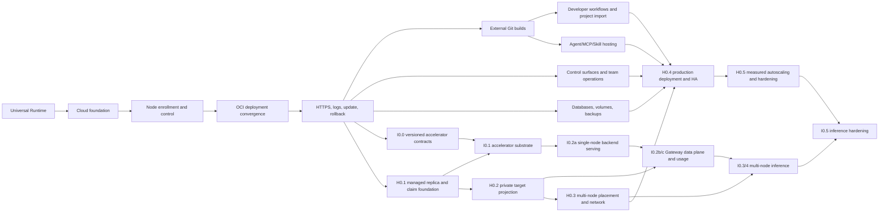

# A3S Cloud Development Plan

## 1. Delivery objective

The first usable release is one verified vertical slice:

```text
enroll one Linux node
  -> deploy one digest-pinned OCI image
  -> observe a real health check
  -> activate an HTTPS route
  -> stream ordered logs
  -> update and roll back to the previous healthy revision
```

The plan is gate-driven rather than date-driven. A milestone is complete only
when its exit evidence passes against real dependencies. Later milestones do
not compensate for an unproven Runtime contract, lost-operation recovery, or a
mock-only deployment path.

The roadmap has three delivery horizons:

| Horizon | Required gates | Product outcome |
| --- | --- | --- |
| Usable service platform | `R0` through `E0` | One operator can deploy, reach, observe, update, and roll back one stateless Service on one Linux node |
| Developer platform | `G0`, `P0`, `C0`, and `A0` | Source-to-release workflows, previews, multi-service import, stable automation surfaces, and A3S asset releases use the same deployment path |
| Stateful production platform | `S0` and `H0` | Stateful resources, verified recovery, multi-node placement, high availability, and measured scaling are production-operable |

These horizons are cumulative. A broader interface or import format never
creates a second orchestration path and never weakens an earlier durability,
security, or recovery gate.

Inference is an optional product profile over the same platform, not a fourth
deployment engine. Its single-node accelerator and model-serving gates begin
after E0; its multi-node replica and distributed-serving gates consume H0's
generic replica, placement, target-set, networking, and HA primitives. The
detailed I0 design is maintained in [`inference-plan.md`](inference-plan.md).

## 2. Engineering rules

- Implement vertical behavior through domain, application, infrastructure,
  transport, web UI, documentation, and tests in the same milestone.
- Write aggregate and protocol tests before the implementation they constrain.
- Keep the repository root as orchestration only. The Rust workspace lives at
  `apps/cloud/Cargo.toml`.
- Commit changes in external crate submodules separately from the root pointer
  update. Never mix an A3S Runtime release with unrelated Cloud code.
- Pin A3S dependency revisions and keep one app-local `Cargo.lock`.
- Put every external middleware behind a typed application port and test its
  real provider; backend names never enter domain decisions.
- Do not mark an integration complete with an in-memory repository, fake
  Runtime driver, fake Gateway acknowledgement, or mocked health response.
- Every long-running command is idempotent, cancellable, resumable after
  process death, and visible as one Operation timeline.
- REST, web, CLI, and MCP surfaces call the same application commands and
  queries. No interface owns business rules or bypasses tenant guards.
- External project formats such as Git repositories and Compose files are
  immutable inputs. Cloud normalizes them into versioned typed desired state;
  they never become a second mutable source of truth.
- Detected configuration is a reviewable proposal. Accepted build, deployment,
  route, and storage plans are explicit and digest-addressed.
- A provider-backed capability remains unavailable until its real conformance,
  failure, cleanup, and recovery gates pass. Unsupported input fails explicitly
  instead of degrading silently.
- Documentation describes shipped behavior only; planned behavior stays marked
  as planned.

## 3. Critical path



The first release gate is `E0`, and it is verified. Source delivery (`G0`),
stable control surfaces (`C0`), and stateful foundations (`S0`) may advance as
independent lanes. Project import (`P0`) depends on the immutable source and
build contracts from G0. Hosted assets (`A0`) reuse the same source-to-artifact
path. Production multi-node work (`H0`) starts only after the product surfaces
it must scale have passed their single-node gates.

H0 is delivered through the numbered sub-gates below. H0.1 through H0.3 may be
proved against an owning profile after that profile's single-node gate. I0 uses
that rule to exercise inference-neutral replica, claim, target-set, placement,
and network primitives. This does not mark the broader H0 milestone complete
for P0, C0, A0, S0, production packaging, control-plane HA, or autoscaling.

### 3.1 Verified delivery status

Status as of 2026-07-22:

| Gate | State | Release evidence |
| --- | --- | --- |
| R0 | Verified | General Task and Service conformance passes against the real Docker provider |
| F0 | Verified | Isolated PostgreSQL migrations, tenancy, idempotency, Flow recovery, and local/NATS outbox gates pass |
| N0 | Verified | Outbound mTLS protocol, durable command journal, replay, provider reattachment, and lost-provider recovery pass |
| D0 | Verified | Real digest-pinned apply and health, restart recovery, failed-update retention, cancellation cleanup, and registry resolution pass |
| E0 | Verified | All isolated route, Gateway, Secret, log, update, rollback, Web, and crash-boundary gates pass. The clean-host Linux release gate builds exact Cloud/Runtime revisions, enrolls one outbound Docker node, deploys digest-pinned A, activates managed TLS, proves ordered logs and cursor-resumed SSE, cuts over to B, rolls back through a cloned A revision, stops durably, restores host inventory exactly, and finds no generated credential in evidence |
| G0 | In progress | Exact source, isolated Runtime build, complete OCI validation, deterministic registry target, authenticated digest-only publication, remote graph verification, combined Runtime/BuildKit/Registry evidence, replay/cancellation adoption, explicit published-build deployment through `cloud.deployment@2`, periodic installation/account authority polling, fresh private-credential/checkout revalidation, and BuildRun status/cancellation/log API and web controls are implemented. Provenance/SBOM/signing, external private-provider evidence, cache trust, and retry-as-new-attempt still block G0 verification |

E0 closes the first usable-service MVP. D0 verification alone did not imply
public reachability, durable log retention, immutable update, or rollback; the
verified E0 release evidence now supplies that complete single-node loop.

### 3.2 Capability ownership

Cloud does not pursue feature parity by adding unrelated subsystems to the
control plane. Each broader platform capability has one milestone and one
authoritative model:

| Capability | Owning gate | Planning decision |
| --- | --- | --- |
| Prebuilt OCI deployment | `D0` | Verified; remains the common deployment path |
| HTTPS, logs, update, and rollback | `E0` | Verified first release; later milestones reuse this path without weakening it |
| Workload and provider secrets | `E0` | Store encrypted values behind tenant-scoped references; never persist or project plaintext |
| Logs, metrics, traces, and alerts | `E0`/`C0`/`H0` | Establish truthful single-node signals first, then notifications, SLOs, and measured scaling |
| External Git and reproducible builds | `G0` | Explicit recipes first; automatic detection builds on the proven contract |
| Stack detection, previews, monorepos, and Compose import | `P0` | Normalize into Workload, Route, and later Volume resources; no second orchestrator |
| Web, worker, and scheduled Task profiles | `P0` | Compile explicit product profiles into the common Runtime Service or Task contracts |
| CLI, management MCP, collaboration, notifications, and audited exec | `C0` | Reuse public commands, queries, scopes, idempotency, and audit |
| Agent, MCP, and Skill releases | `A0` | A3S-specific catalog over the common build and deployment path |
| Databases, volumes, and backups | `S0` | Model state explicitly with fencing and verified restore |
| Replicas, multi-node placement, HA, and autoscaling | `H0` | Scale only measured, recovery-proven semantics |
| Generic accelerator inventory, claims, and enforcement | `I0.0`/`I0.1` with `H0` placement ownership | Extend Runtime, Fleet, and Workloads without introducing model or backend semantics into their core contracts |
| Model catalog, inference deployment, model routes, and usage | `I0` | Add a separate Inference bounded context that compiles into managed Workloads and Edge target sets |
| Edge caching and transport optimization | `E0`/`H0` | A3S Gateway owns HTTP, TLS, compression, and cache mechanics; Cloud owns desired policy |
| Mail hosting, native desktop, and commercial billing | Outside core | Use integrations or separately owned products; do not couple them to workload orchestration |

## 4. Milestone R0: generalize A3S Runtime

### Goal

Replace the Bench-shaped core contract with a genuinely general Runtime
contract before Cloud depends on it.

### Work

1. Write a Runtime ADR and contract tests for Task and Service units.
2. Introduce versioned, provider-neutral types for unit spec, generation,
   process, artifact inputs, mounts, secret references, resources, networking,
   ports, health, restart, outputs, observation, logs, and failure.
3. Replace `submit/inspect/cancel` with idempotent
   `apply/inspect/stop/remove`; add capability-gated logs and exec surfaces.
4. Replace the closed capability booleans with structured supported-capability
   sets and a required-capability matcher.
5. Keep provider ID, factories, and the registry in Runtime, but move session,
   login-state, operator-precedence, default-Docker, and Bench capability
   selection policies to their owning callers.
6. Generalize the managed client and durable operation store around unit ID,
   request ID, generation, and canonical spec digest.
7. Export a provider conformance harness that exercises task and service
   lifecycle semantics with an injectable clock and fault points.
8. Move Candidate/Judge construction, artifact interpretation, privacy rules,
   and result validation into A3S Bench as a Task profile adapter.
9. Define a versioned migration policy for existing v1 records. Terminal v1
   records remain readable through Bench-owned legacy decoding; they are not
   silently rewritten as general Runtime records.
10. Update Runtime and Bench documentation together and publish a breaking
   pre-1.0 release only after all known consumers compile.

### Exit gate

- Runtime core source has no Candidate/Judge role enum or role-specific
  validation.
- Runtime core has no Bench support predicate, login-state policy, or implicit
  provider fallback.
- The same client runs one finite Task and one long-running Service.
- Exact duplicate apply reattaches; conflicting reuse and stale generation fail
  deterministically.
- Restarting the managed client preserves identity and reattaches without
  launching a duplicate provider resource.
- Capability mismatch fails before provider start.
- Stop and remove are idempotent and bounded; lost provider state is reported
  as unknown/not found rather than success.
- Bench profile tests still enforce protected evaluation semantics outside the
  Runtime core.
- `cargo fmt`, focused tests, Clippy, documentation checks, and the exported
  conformance suite pass in the Runtime repository.

## 5. Milestone F0: Cloud foundation

### Goal

Create the smallest app-local workspace and modular-monolith skeleton that can
commit and query tenant-scoped desired state.

### Work

- Create `contracts`, `control-plane`, and `node-agent` crates under
  `apps/cloud`, plus the React application under `web`.
- Bootstrap A3S Boot with API, worker, relay, and all-in-one process roles.
- Add validated `cloud.acl` configuration, environment-secret resolution,
  startup checks, structured logging, request IDs, health endpoints, and clean
  shutdown.
- Add a reproducible local infrastructure profile and readiness probes for
  PostgreSQL, the development object-store adapter, and optional NATS
  JetStream; keep every service disabled until a milestone needs it.
- Add A3S ORM PostgreSQL connectivity, locked migrations, transaction helpers,
  optimistic aggregate versions, idempotency records, transactional outbox,
  and audit tables.
- Implement Identity and Projects aggregates, repositories, commands, queries,
  tenant guards, API tokens, and the shared API response/error interceptors.
- Integrate A3S Flow with a separate PostgreSQL schema and add an idempotent
  operation starter plus projection rebuilder.
- Add the first web shell: sign-in, organization/project/environment selection,
  operation drawer, and reconnecting SSE client.

### Exit gate

- A real PostgreSQL test creates an organization, project, and environment and
  rejects every cross-tenant reference exercised by the suite.
- Reusing an idempotency key with identical input returns the same result;
  different input returns a documented conflict.
- Killing the process after aggregate commit but before Flow start is repaired
  by reconciliation with exactly one run.
- Killing the outbox relay before or after publish produces one logical event
  at a deduplicating consumer and never loses the row.
- The same outbox consumer contract passes with the local A3S Event provider
  and a real NATS JetStream provider.
- API success and documented error responses match the repository contract.
- Migration apply, checksum mismatch, rollback-on-failure, and concurrent
  startup are tested against PostgreSQL.

## 6. Milestone N0: node enrollment and outbound control

### Goal

Enroll one real Linux node and establish a durable, replay-safe control path to
its general Runtime provider.

### Work

- Implement Fleet domain entities, one-time enrollment tokens, certificate
  issuance/rotation/revocation, node capabilities, ready/drain state, and
  heartbeat-derived offline projection.
- Implement typed certificate-authority and key-encryption ports, a safe local
  development provider, and at least one production integration using
  OpenBao/Vault, step-ca, or a cloud KMS/PKI.
- Implement the versioned node protocol in `contracts`; do not share database
  rows or domain entities over the wire.
- Implement bounded mTLS long polling, command leasing, durable acknowledgement,
  observation batches, log chunks, and Gateway acknowledgements.
- Implement the node command journal and provider-label reconstruction.
- Implement the first Docker `RuntimeDriver` in the node agent without leaking
  Docker fields into the Runtime contract.
- Run the Runtime provider conformance harness against a real Docker daemon.
- Add a deterministic node simulator for protocol fault injection; retain the
  real Docker test as the release gate.

### Exit gate

- A token can enroll only once; a revoked or expired certificate cannot lease
  commands; rotation does not change node identity.
- Production configuration rejects a plaintext environment master key and a CA
  root stored in the control-plane database.
- An exact redelivered command returns the durable prior outcome. Regressed
  generation, payload conflict, wrong node, and expired command fail closed.
- Restarting the agent after Docker create but before acknowledgement discovers
  the same provider resource and does not create another container.
- Offline is derived by the server after heartbeat expiry and does not rewrite
  the node's last observation.
- The Task and Service Runtime conformance suites pass on real Linux/Docker.

## 7. Milestone D0: digest-pinned OCI deployment

**Status:** Verified on 2026-07-15.

### Goal

Converge one stateless Service workload on the enrolled node without public
routing yet.

### Work

- Implement Workload, WorkloadRevision, and Deployment aggregates plus source
  resolution for an OCI repository and digest.
- Add a one-node capability-aware scheduler and an explicit no-eligible-node
  result.
- Implement the deployment Flow: resolve, schedule, dispatch, observe, verify,
  activate, and cleanup.
- Project the immutable workload revision into a Service `RuntimeUnitSpec`.
- Implement actual container health checks, observed-generation projection,
  periodic reconciliation, stop, cancel, and failed-update retention.
- Add workload and deployment pages that separately display desired revision,
  observed Runtime state, health, node, and operation progress.

### Exit gate

- Mutable tags are resolved once; Runtime receives and provider labels record
  the OCI digest.
- A real HTTP fixture becomes active only after its health check succeeds.
- A permanently unhealthy revision fails without replacing the prior active
  revision.
- Duplicate deploy requests, Flow replay, control-plane restart, agent restart,
  lost observation, and expired command lease converge to one provider unit.
- Cancellation reaches a terminal Operation state and leaves no untracked
  active child command. Deferred cleanup is visible and reconciled.

## 8. Milestone E0: HTTPS, logs, update, and rollback

**Status:** Verified on 2026-07-20.

### Goal

Complete the first user-visible release loop.

### Work

- Implemented: Edge route and Gateway publication records, hostname/path
  ownership, versioned complete snapshot generation, and closed route APIs.
- Implemented: healthy immutable target resolution from typed Runtime endpoint
  evidence, Fleet command dispatch, stable correlation across retries, and
  exact-revision acknowledgement projection.
- Implemented: node-local A3S Gateway validation, atomic compare-and-swap
  install, reload, durable acknowledgement ordering, and the real route-bearing
  router/service ACL gate against A3S Gateway 1.0.12.
- Implemented: tenant-scoped exact and one-label wildcard claims, deterministic
  development proof verification, closed certificate policy, TLS 1.2 snapshot
  compilation, public certificate persistence, sanitized failure projection,
  and a separate local Gateway CA.
- Implemented: authenticated CSR signing, replay binding, node-local `0600`
  private keys, full chain/identity/key verification, atomic chain storage
  before Gateway reload, and a dedicated real HTTPS fixture for Gateway 1.0.12.
- Implemented: the production security profile performs bounded TXT ownership
  verification through the host's asynchronous system DNS resolver, fails
  startup closed without resolver configuration, sanitizes provider failures,
  and leaves absent or stale proofs pending and retryable.
- Implemented: production selects a dedicated Vault Gateway PKI provider,
  mount, and role, sends only the node-generated CSR and desired server
  identity, validates the returned leaf/serial/validity/CA bundle, and revokes
  by the provider serial through the bounded shared Vault client. Temporary
  transport, rate-limit, and server failures leave the same persisted CSR
  retryable.
- Implemented: an injected-time Gateway certificate reconciler redispatches
  pending commands, renews within the configured window, filters revoked
  claims into a separately persisted convergence record, preserves active
  routes and the old certificate until an exact applied acknowledgement, emits
  a certificate-free management snapshot when no verified routes remain, and
  retries provider serial revocation only after old material is uninstalled
  and unreferenced.
- Implemented: tenant-scoped Secret identities, immutable encrypted versions,
  local AES-GCM and Vault Transit providers, create/rotate/version-revoke REST
  commands, metadata-only queries and events, and idempotency records that
  persist only Secret ID/version references.
- Implemented: exact active Secret-version bindings in immutable workload
  environment/file/registry-credential targets, reference-only Runtime and
  Fleet projection, transient control-plane materialization for challenged
  Basic/Bearer manifest resolution, assigned-node authorization over the
  existing mTLS control channel, late Docker environment injection or Linux
  tmpfs-backed read-only file mounts, and authenticated pulls whose registry
  address comes from the digest-pinned artifact.
- Implemented: a dedicated Linux/PostgreSQL/Docker gate invokes the production
  assigned-node authorization and decryption handler, injects the active
  version into a real environment variable and `0400` tmpfs-backed file,
  verifies equal material without embedding it in Runtime state, and proves
  stdout/stderr are redacted before durable filesystem/PostgreSQL persistence
  and REST readback. The gate reconstructs the log adapters and handler and
  verifies exact batch replay.
- Implemented: the dedicated Linux gate provisions an authenticated private
  registry, rejects anonymous access, resolves its digest through the
  production control-plane resolver, removes the cached image, resolves the
  separate encrypted credential again only at Docker pull, and scans desired
  state, Runtime/Fleet state, Flow history, events, logs, audit, and API
  responses for both plaintext Secrets.
- Implemented: a worker consumes only committed `secret.version.created`
  events, advances matching bindings on active running workloads in a new
  resolved revision while preserving the pinned artifact, defers competing
  deployments, and atomically records the deployment operation, causal event,
  and unique restart/checkpoint rows. The PostgreSQL gate races reconstructed
  workers after the version commit, proves one Runtime command and terminal
  operation across a second Flow reconstruction, and scans desired state,
  Runtime/Fleet state, Flow history, restart/checkpoint rows, events, logs,
  audit, API responses, and revision digests for plaintext.
- Implemented: the isolated Cloud consumer gate pauses a child after the real
  rotated Docker apply creates a healthy container but before its Runtime
  receipt completes, verifies the pending receipt and exact provider identity,
  restarts the labeled Docker provider, kills the child agent, and reconstructs
  Runtime to reattach the same container and complete and replay the exact
  receipt. It then verifies `0400` Secret material, log redaction, durable-state
  plaintext exclusion, and complete container/tmpfs cleanup.
- Implemented scope: the clean-host gate reaches ordinary HTTPS only after the
  exact acknowledged Gateway revision, while the authenticated log path proves
  bounded cursor-resumed SSE. Generic streaming-response and WebSocket proxy
  mechanics remain A3S Gateway transport conformance and do not create a
  separate Cloud desired-state feature. Advanced caching and transport tuning
  remain outside E0.
- Implemented: successful Runtime apply/remove outcomes project restart-safe
  active log targets from the command journal. A separate retrying node loop
  persists one bounded pending batch before upload, replays the exact batch
  after restart, and advances each cursor only after a validated receipt.
  ACL-only settings close a batch at 256 chunk/gap records and 16 MiB.
- Implemented: Docker log reads resolve every bound immutable Secret, fail
  closed on authorization or materialization failure, redact exact overlapping
  values, and zeroize the temporary raw text buffer before returning chunks.
- Implemented: the control plane keeps ordered log metadata in PostgreSQL,
  writes immutable checksummed objects through typed filesystem or
  S3-compatible adapters, verifies objects on read, and exposes
  tenant-authorized cursor pages with stdout/stderr filtering and explicit
  missing/corrupt gap records.
- Implemented: validated control-plane ACL configures receipt-age retention,
  polling, and bounded scan size. The `all` and `worker` roles delete objects
  before compare-and-setting durable `retained_at` tombstones, retry
  interrupted deletion or metadata commits, preserve sequence zero, and return
  explicit `retained` gaps without reading deleted objects. Persisted batch
  replay is checked before object writes so it cannot recreate a retained body.
- Implemented: production configuration selects an HTTPS S3-compatible adapter
  whose conditional create, exact immutable replay, verified read, idempotent
  deletion, and readiness lifecycle share the filesystem semantics. Credentials
  come only from named environment variables, and a dedicated CI job provisions
  digest-pinned MinIO and a disposable bucket for the real lifecycle gate.
- Implemented: independent ACL policy bounds tombstone retention, compaction
  polling, and transaction size. The `all` and `worker` roles atomically delete
  old per-chunk tombstones and batch memberships, write and coalesce durable
  sequence ranges, preserve exact batch-header replay and sequence watermarks,
  and return explicit `compacted` gaps even under stream filtering.
- Implemented: Runtime exposes typed permanent cursor-loss/source-disconnect
  boundaries separately from retryable transport failure. Docker returns exact
  identities, the node persists/replays provider gaps and monotonically rebases
  replacement chunks, PostgreSQL atomically stores gap membership and sequence
  watermarks, and snapshot pages expose provider gaps under every stream filter.
- Implemented: the authorized live-log SSE endpoint polls at most 16 ordered
  records, caps encoded events at 8 MiB, resumes from `Last-Event-ID`, and
  terminates on authoritative-query failure. The web console reconnects with
  bounded backoff, retains 500 deduplicated records, filters stdout/stderr, and
  preserves provider and compaction gaps.
- Implemented: the real Linux/PostgreSQL/Docker gate reads sanitized provider
  stdout/stderr, persists immutable filesystem objects and PostgreSQL metadata,
  reconstructs the persistence boundary for exact batch replay, scans durable
  objects for the bound plaintext, and reads the records through the REST API.
- Implemented: real Docker recovery preserves and resumes an exact log cursor
  across isolated provider restart. The PostgreSQL gate kills a child control
  plane after a synced immutable object write but before receipt persistence,
  verifies zero batch metadata, reconstructs the handler, adopts the exact
  orphan without duplication, corrupts a non-secret real Docker record, and
  requires its ordered REST position to become a `corrupt` gap. The pinned
  MinIO gate independently overwrites a real object and requires verified reads
  plus immutable repair rejection.
- Deferred to C0/H0 production operations: export metrics and traces through
  OpenTelemetry and publish Prometheus-compatible service/node/operation
  dashboards. E0 exposes structured correlation, durable observations, logs,
  health, and Operation timelines but does not claim a production telemetry
  backend.
- Implemented: `POST
  /organizations/{organization_id}/workloads/{workload_id}/deployments`
  commits a complete immutable replacement template and a
  `cloud.deployment@2` operation. Version 1 remains executable only for
  persisted-run replay. A workload permits one nonterminal deployment, the
  candidate stays on the previous Runtime node, cancellation closes at
  `verifying`, and health must converge before any routed cutover is staged.
- Implemented: routed updates preserve the old route rows and active revision
  through unhealthy candidates, mismatched acknowledgements, and rejected
  reloads. Only the exact node, command, Gateway revision, and snapshot digest
  acknowledgement atomically replaces route targets. The candidate then enters
  `retiring`; a deterministic stop command targets the previous Runtime
  revision, and durable stopped-or-absent evidence completes the operation.
  Reconciliation adopts staged cutovers and retirement commands after
  coordinator recovery.
- Implemented: the PostgreSQL recovery gate holds retirement command access
  closed while a child Flow process durably activates the candidate into
  `retiring`, proves no cleanup command committed, and sends `SIGKILL`. A
  reconstructed coordinator replays activation, dispatches one deterministic
  previous-revision stop, and completes only from stopped-or-absent evidence.
  The probe passes in both the Linux Secret/log job and the isolated real-Docker
  Cloud consumer suite.
- Implemented: `POST
  /api/v1/organizations/{organization_id}/workloads/{workload_id}/rollback`
  accepts only an older, successfully activated revision of the same active
  running workload. It clones the exact resolved template into the next
  generation, revalidates Secret bindings, records
  `rollbackSourceRevisionId`, and uses the same `cloud.deployment@2` health,
  Gateway cutover, activation, and retirement path without reactivating the
  source revision ID.
- Implemented: the PostgreSQL API gate verifies the persisted clone, operation
  lineage, atomic idempotency record, and replay after the workload stops; the
  routed suite verifies exact Gateway acknowledgement and C retirement; the
  isolated Docker A→failed B→distinct C→cloned A scenario verifies real apply,
  health, selection, and deterministic retirement of C.
- Implemented: workload queries expose complete immutable requested templates
  with reference-only Secret bindings, operation queries expose explicit
  rollback lineage, and the web console renders the deployment timeline plus
  route/certificate state, commits complete-template updates after field-level
  comparison, offers only eligible activated rollback sources, and dismisses
  terminal operations locally without deleting durable history.
- Implemented post-E0: the production SPA build is served from a private,
  fail-fast Rust service with history fallback, bounded content types, cache
  policy, path containment, security headers, and a product favicon. A3S
  Gateway 1.0.12 validates the same-origin profile that routes exact `/api`
  paths to the control plane and everything else to the SPA. CI exercises the
  real built assets, deep-link fallback, headers, API isolation, process
  cleanup, and Gateway ACL validation; `just cloud` supervises the local API
  and hot-reloading web process from the monorepo root.

### Exit gate

- A real client reaches the fixture through A3S Gateway over TLS only after the
  exact desired Gateway revision is acknowledged.
- Unverified, expired, revoked, cross-tenant, and conflicting domain claims
  cannot receive an active route or certificate. Renewal under an injected
  clock preserves the prior valid certificate until the replacement is proven.
- Workload secret create, bind, rotate, revoke, restart, and authorization
  fixtures pass with encrypted PostgreSQL state and real Runtime injection;
  provider and agent death during the rotated apply reattach one exact resource
  and receipt, and plaintext scans of database rows, events, Flow history, logs,
  and API payloads find no secret value.
- A failed Gateway reload cannot mark the route or deployment active.
- Losing the Gateway acknowledgement and restarting either process converges
  without duplicating or partially applying routes.
- Log reconnect resumes from the last cursor or, after an acknowledged typed
  provider gap, from the earliest available record with a monotonic delivery
  sequence and no unbounded buffering; secret fixtures never appear in logs or
  operation payloads.
- Provider cursor loss/source disconnect and deleting, corrupting, retaining, or
  compacting a log chunk create explicit ordered gaps; log bodies never enter
  PostgreSQL, NATS, or Flow history.
- Updating from image A to B and rolling back to A passes through real Runtime,
  health, and Gateway paths. Process death after candidate activation but before
  retirement dispatch reconstructs to one cleanup command and no false terminal
  success.
- The production management SPA opens through the Gateway origin, a direct
  client route returns the same entrypoint, hashed assets retain immutable
  cache headers, `/api` cannot fall through to HTML, and stopping the launcher
  leaves no API or web child process.
- The full scenario runs from a clean machine in CI and on a separately managed
  Linux host; screenshots or mocks are not release evidence.

## 9. Milestone G0: external Git builds

### Goal

Build a pinned external Git commit into a verifiable OCI artifact and deploy it
through the proven loop.

### Current implementation

The current independently testable G0 slices are implemented:

- A dedicated Sources bounded context accepts and lists tenant-, project-, and
  environment-scoped `ExternalSourceRevision` aggregates.
- GitHub repository locators fail closed unless they use exact HTTPS
  owner/repository syntax without user information, ports, queries, fragments,
  encoded path bytes, or extra path segments. Accepted locators normalize to
  one lowercase repository identity.
- Source revisions pin a full lowercase 40- or 64-hex Git object ID and a
  versioned `a3s.cloud.build-recipe.v1` Dockerfile recipe. Relative checkout
  paths, optional targets, and supported Linux platforms are validated and
  canonicalized before the recipe digest is calculated.
- HTTP idempotency, natural source-revision deduplication, the
  `source.revision.accepted` outbox fact, and PostgreSQL persistence commit in
  one transaction. A GitHub delivery ID is reserved against the immutable
  repository-plus-commit digest, so a changed delivery payload conflicts while
  later monorepo fan-out may still attach more than one recipe.
- The REST mutation requires `source:write`; list and mutation paths enforce
  the organization/project/environment hierarchy. Source revisions, events,
  and idempotency responses contain no credential value or reference.
- The mutation accepts a typed branch, tag, or full commit and resolves it
  through a provider-neutral source port. The GitHub adapter uses a
  fixed HTTPS origin, disables redirects, confirms the exact repository,
  requires an exact ref response, peels annotated tags with a bounded chain,
  and verifies the returned full commit.
- Closed A3S ACL configuration supplies an exact nonempty repository allowlist
  and a denylist with deny precedence. Policy is evaluated before provider
  access.
- The idempotency digest binds the mutable ref request, while replay is checked
  before provider access. A moved ref therefore cannot alter an accepted
  revision or trigger a second resolution for the same request.
- Unit/API tests cover policy, URL/ref confusion, annotated tags, provider
  identity mismatch, and moving-ref replay. A dedicated CI job resolves the
  real public `A3S-Lab/Cloud` branch and then confirms the pinned commit.
- Closed A3S ACL configuration can explicitly enable one GitHub App by slug,
  client ID, client-secret environment name, exact HTTPS callback, and a 1- to
  30-minute connection-state TTL. Disabled configuration requires every App
  field to be empty; shipped and release-gate ACL keeps the feature disabled.
- An organization-authorized `source:write` command begins one replaceable
  installation flow and the tenant query returns its completed connection.
  GitHub setup and OAuth callback routes are public provider callbacks with
  non-cacheable/no-referrer responses rather than bearer-token alternatives.
- Setup and OAuth use separate 32-byte random, expiring, single-use state
  values. PostgreSQL stores only SHA-256 digests. OAuth uses S256 PKCE; the
  verifier exists only in a short-lived secure, HTTP-only, same-site cookie
  while its digest is durable.
- The callback reads the client secret per attempt, exchanges the bounded code
  without redirects, calls `GET /user` and at most ten 100-entry pages of
  `GET /user/installations`, and accepts the setup installation ID only from
  that transient user-token intersection. Code, client secret, access/refresh
  tokens, verifier, and provider bodies are never durable.
- Completion atomically consumes the flow, stores numeric installation,
  account, and verifying-user identities, and emits
  `source.github-connection.created`. PostgreSQL enforces one connection per
  Cloud organization plus exclusive installation and account ownership across
  organizations.
- Domain/API tests cover expiry, stage/replay binding, tenant/scope checks,
  spoofed setup state, missing PKCE, rejected OAuth, duplicate ownership, and
  secretless responses. Local HTTP fixtures prove exact OAuth form/API headers,
  inaccessible installation rejection, body bounds, malformed responses, and
  secretless errors. The isolated PostgreSQL gate exercises prepare, complete,
  replay, uniqueness rollback, query, and outbox persistence.
- GitHub connections have explicit `active`, `suspended`,
  `verification_revoked`, `installation_deleted`, and `account_changed` state.
  Only `active` supplies authority. Current active/suspended installation,
  account, and organization uniqueness is enforced with partial indexes while
  terminal connection records remain durable history.
- A public `POST /api/v1/webhooks/github` provider boundary requires JSON and
  the GitHub event, delivery, and `X-Hub-Signature-256` headers. It bounds the
  body, reads a configured secret environment variable per request, and
  authenticates the exact raw bytes with canonical lowercase HMAC-SHA256 before
  interpreting provider data. Bearer authentication cannot bypass the proof.
- Deleted/non-branch pushes, unsupported lifecycle actions, and unrelated
  authenticated events are acknowledged without persistence. A branch push is
  reduced to typed provider, delivery, canonical repository, installation,
  branch, commit, payload-digest, and receipt-time fields; raw payload and
  secret material are never durable.
- The PostgreSQL provider inbox atomically replays the same delivery and exact
  payload while rejecting delivery-ID reuse with changed bytes or typed
  identity. Unit, API, and PostgreSQL integration tests cover signature
  authentication, payload bounds, ignored events, replay, and conflict.
- The signed ingress also accepts `installation` suspend/unsuspend/deleted,
  `installation_target` renamed, and `github_app_authorization` revoked. A
  separate lifecycle inbox stores only typed event/action, installation-or-user
  subject, exact-payload digest, and receipt time. Exact replay is a no-op and
  changed reuse conflicts without persisting the provider body.
- Same-identity suspension/unsuspension and rename preserve authority state and
  update the display login. Account ID/kind mismatch, installation deletion,
  and verifying-user authorization revocation fail closed to terminal states.
  Every changed connection advances its aggregate version and atomically emits
  `source.github-connection.reconciled`; terminal state cannot be reactivated
  by a webhook.
- A terminal organization must complete fresh installation and OAuth proof,
  producing a new connection ID while retaining the old record. Existing
  subscriptions remain bound to the prior ID. API projections expose status
  and update time so the loss of authority is operator-visible.
- A bounded worker signs an App JWT and calls
  `GET /app/installations/{installation_id}` for due active or suspended
  connections. A successful response repairs missed suspension, unsuspension,
  account-login, and numeric account-identity facts; `404` confirms installation
  deletion. Authentication, rate-limit, transport, and server failures remain
  retryable, while malformed or identity-confused responses fail closed as
  protocol errors.
- Provider authority health is durable: last successful check, last attempt,
  next attempt, bounded consecutive-failure count, and a closed generic error
  category. PostgreSQL selects bounded due batches and compare-and-sets the
  aggregate version with any lifecycle event in one transaction. Exponential
  retry is capped, concurrent workers lose safely, and only lifecycle/account
  changes emit `source.github-connection.reconciled`.
- Installation deletion or account-change webhooks schedule immediate provider
  confirmation. A delayed terminal fact can be repaired when GitHub still
  reports the original active or suspended installation; optimistic versions
  and current-connection uniqueness prevent that repair from changing a newly
  verified replacement connection.
- GitHub does not expose a tokenless current-user App-grant query. Cloud keeps
  user OAuth access and refresh tokens non-durable, so the signed
  `github_app_authorization.revoked` delivery remains authoritative for
  verifying-user revocation rather than introducing durable user credentials.
- Environment-owned `GithubRepositorySubscription` commands and queries bind
  the same organization's verified connection/installation to a canonical
  allowlisted repository, exact branch, and explicit recipe. PostgreSQL
  composite foreign keys enforce both connection ownership and the full
  organization/project/environment hierarchy. Active natural duplicates and
  HTTP idempotency return one identity.
- Subscription creation and explicit `active -> inactive` deactivation retain
  history and atomically emit
  `source.github-repository-subscription.created` and
  `source.github-repository-subscription.deactivated`. Neither API, durable
  state, idempotency response, nor event contains provider credentials or raw
  webhook payloads.
- Only a newly inserted provider delivery selects active bindings by exact
  connection, installation, repository, and branch. PostgreSQL joins and share
  locks the exact active connection, serializing fanout with lifecycle updates;
  stale lookup results and old bindings therefore create no revision. The
  authenticated delivery commit is never re-resolved. Inbox, tenant
  reservations, every matching immutable
  revision, and every `source.revision.accepted` fact commit in one transaction;
  exact replay does not re-fanout, unmatched delivery creates no revision, and
  outbox failure rolls back the inbox.
- Domain/API tests cover tenant scope, missing/cross-tenant connection and
  environment ownership, invalid repository/branch/recipe, natural and HTTP
  replay, changed delivery conflicts, installation/repository/branch mismatch,
  multi-recipe fanout, inactive exclusion, and secretless state. The isolated
  PostgreSQL gate covers schema ownership, active uniqueness, fanout replay,
  outbox atomic rollback, lifecycle, and secretless database/event state.
- Anonymous source resolution remains the first attempt. Only anonymous
  `Unavailable` may look up the same organization's verified connection, issue
  a newly signed GitHub App JWT, request one exact repository with
  `contents: read`, and retry with the returned short-lived Bearer credential.
  Public success, anonymous provider/protocol errors, missing or cross-tenant
  connection, and idempotency replay never issue a token.
- Before any private-repository credential is issued, a decorator requires the
  exact organization, connection, and installation identities, performs a fresh
  installation/account authority check, persists its outcome, and confirms the
  connection is still `active`. Provider uncertainty or terminal authority
  prevents the underlying issuer from running. The same path protects both
  authenticated ref resolution and Build Flow checkout.
- The App PEM key is read from its configured environment variable for every
  issuance. The provider response must confirm selected-repository scope and
  only read-only contents plus implicit metadata permission. Credential values
  are repository-bound, non-cloneable, non-serializable, zeroizing, strictly
  expiring, and redacted from `Debug`; issuance and authenticated-provider
  errors are collapsed before the API boundary.
- A provider-neutral checkout port accepts only the canonical repository, full
  accepted commit, and immutable checkout ID. The Git adapter uses a fresh
  bounded staging directory and isolated empty Git home, disables redirects,
  credential helpers, hooks, unsafe protocols, tags, and submodule recursion,
  and fetches the full object ID rather than a mutable ref.
- Checkout verifies the detached commit and tree, rejects unsupported modes,
  gitlinks, unsafe paths, and symlinks that escape the source root, removes
  `.git`, and atomically publishes a credential-free receipt containing the Git
  tree and deterministic SHA-256 filesystem digest. Replay recomputes the
  digest, conflicting source identity fails, and failed staging is removed.
- Unit tests cover moving-branch pinning, immutable replay, tampering, limits,
  gitlinks, and escaping symlinks. The public GitHub CI job also materializes
  the just-resolved commit and verifies metadata-free replay.
- Private HTTPS checkout supplies `x-access-token:TOKEN` only as a transient
  Basic header through Git's `--config-env=http.extraHeader`; credentials never
  enter repository URLs, arguments, receipts, or replay. A real local smart-HTTP
  Git backend proves exact header transport and credential-free replay. An
  ignored test composes real GitHub token issuance, authenticated resolution,
  checkout, and replay from operator-supplied environment values; no external
  private-repository pass is claimed because those credentials are unavailable.
- The Artifacts context owns a provider-neutral `IBuildService`. Its request
  binds an immutable build ID, absolute materialized source directory, checkout
  content digest, and accepted recipe without exposing BuildKit semantics to
  Sources or Runtime.
- One deterministic tenant-owned `BuildRun` is reserved for every accepted
  source revision. Its operation ID is the build ID, and its aggregate records
  exact input, node/command, Runtime output, validated OCI result, immutable
  publication target, verified published artifact, cancellation/failure,
  cleanup, timestamps, and optimistic version.
  Repository saves accept only one aggregate-generated transition; exact
  replay changes no timestamp or version.
- Concurrent PostgreSQL reservation creates one build, and a dedicated
  reconciler repairs the source-commit-to-operation crash gap by enqueuing the
  same `cloud.build@2` request. The isolated PostgreSQL gate covers concurrent
  reservation, crash-gap repair, exact operation replay, stale writes, forged
  ownership, tenant/environment isolation, the complete publication state
  round trip, and rejection of multi-transition saves.
- Typed node Artifact download/upload contracts bind the authenticated node,
  command, Runtime spec digest, exact mount/output, digest, media type, and
  size. The mTLS node-control endpoints authorize against the persisted
  unexpired `RuntimeApply` command and stream raw bytes under a total deadline.
- The control plane stores content-addressed blobs with hash/length admission,
  exact replay, same-length tamper detection, and blob-before-receipt crash-gap
  repair. The node agent independently verifies and seals blobs, persists
  spec-bound receipts, revalidates materialized trees after restart, and
  reference-collects blobs when Runtime specs are removed.
- Directory Artifact extraction rejects absolute/parent paths, escaping
  symlinks or hardlinks, devices, FIFOs, duplicate paths, non-directory
  ancestors, and configured entry/file/expanded limits. Files and directories
  are mounted read-only; planned and extracted content hashes must agree.
- Docker advertises Artifact mounts and output Artifacts, binds exact
  materialized inputs read-only, captures declared successful Task outputs via
  the Docker archive API, and preserves output identity through replay,
  reconstructed clients/drivers, and removal. The exported Docker conformance
  fixture now exercises both capability profiles.
- The BuildKit adapter accepts Unix or mTLS endpoints and permits
  unauthenticated TCP only through an explicit literal-loopback conformance
  constructor. It runs `buildctl` with an empty home and no credential, SSH,
  cache import/export, push, or privileged-entitlement inputs, applies total
  deadlines, and removes failed staging output.
- Build output is accepted only when BuildKit metadata binds the root
  descriptor, the OCI layout contains exactly the reachable SHA-256 inventory,
  every index/manifest/config/layer has the declared digest and size, and image
  configs exactly match the recipe platforms. Build-ID replay revalidates the
  full graph, conflicting input fails, tampering fails, and removal is
  idempotent.
- `OciRegistryArtifactPublisher` derives one tenant/project/environment/build
  repository under the configured prefix and binds the validated root digest,
  media type, and size before external I/O. It re-materializes and revalidates
  the admitted layout for every attempt, streams blobs, publishes child
  manifests before the root, and accepts only a remotely complete graph with
  exact digest, media type, and content length.
- Registry upload redirects are disabled and upload `Location` values must stay
  inside the configured origin and repository. Basic and Bearer credentials are
  read from an environment reference per attempt and zeroized without entering
  BuildRun or Flow history. Production configuration requires authenticated
  HTTPS; anonymous and HTTP publication are development-only explicit modes.
- Protocol fixtures cover single-manifest and multi-platform graphs,
  Basic/Bearer authentication, 401/403 and token failure, hostile upload
  locations, descriptor mismatches, and partial-response replay. The Linux CI
  private Distribution fixture exercises authenticated push, remote lookup,
  and idempotent replay through the production adapter.
- A dedicated Linux gate starts the digest-pinned `moby/buildkit` 0.31.2
  rootless image on the exact operator Unix socket volume, proves its non-root
  image user, and retains the typed local-context adapter build and replay
  check. The same job provisions an authenticated private Distribution
  registry and runs the production Runtime Task through Artifact capture, full
  graph validation, deterministic publication targeting, authenticated push,
  remote verification, idempotent replay, removal, and terminal BuildRun
  completion.
- `cloud.build@1/@2` are registered in the production Flow router alongside
  `cloud.deployment@1/@2` and `cloud.workload.stop@1`. New work uses v2; v1 is
  retained only to drain upgrade-invalidated builds without rewriting
  persisted history. The worker-role BuildRun reconciler reserves revisions
  and enqueues their deterministic operation before generic Flow coordination.
- `SourceBuildInputPreparer` performs exact tenant/revision checks, ephemeral
  private checkout when needed, deterministic directory packaging, Artifact
  admission, and credential-free offline receipt replay to reject package-time
  mutation. Failure cleanup removes the checkout.
- The Build Flow selects only nodes with the full Task, isolation, mount,
  resource, output, network, and builder-media capability set. It persists
  apply identity before dispatch, mounts source and BuildKit socket read-only,
  uses both Runtime `NetworkMode::None` and BuildKit
  `force-network-mode=none`, accepts no secret/SSH/entitlement/cache channel,
  and returns one bounded OCI directory Artifact.
- Runtime output is re-read and rehashed from the control-plane Artifact store,
  extracted with path/entry/byte bounds, and subjected to complete OCI graph
  validation. Successful completion additionally requires a persisted and
  remotely verified publication. Terminal success, failure, or cancellation
  requires deterministic Runtime removal followed by checkout cleanup; replay
  does not duplicate prepare, apply, validate, publish, remove, or completion
  side effects. Flow-event-loss and push/cancellation race tests prove an exact
  completed push is adopted without changing its target.
- The combined real gate drives the exact projected Task through the node
  command journal, Docker Runtime, Artifact transport, OCI validator, and
  production registry publisher. Its Dockerfile succeeds only when a BuildKit
  `RUN` has no `eth0` and a `wget` attempt fails. CI provisions the exact named
  volume and shared Unix socket, exports the bounded root filesystem of a
  digest-pinned linux/amd64 BusyBox fixture into a scratch-only offline context,
  rejects anonymous registry access, verifies the complete remote digest graph
  twice, and removes the Runtime Task and fixture volume. The root filesystem
  carries BusyBox and its exact dynamic-loader closure without base-image
  resolution. BuildKit endpoint and cache details remain outside Runtime
  contracts; G0 still requires an explicit recipe, while automatic stack
  detection is a P0 input that may propose but never silently replace that
  contract.

These slices establish source persistence, anonymous-first and
installation-token resolution, authenticated provider ingress, verified tenant
ownership of a GitHub installation,
authoritative repository subscription/fanout, periodic installation/account
authority reconciliation, fresh private-credential and checkout revalidation,
credential-safe checkout,
durable build intent/crash-gap repair, command-bound mTLS Artifact transport,
restart-safe Docker inputs/outputs, a real local-context BuildKit/OCI engine
boundary, the production isolated Build Flow, and authoritative registry
publication, and explicit artifact-free deployment of a successful published
BuildRun through the existing Workload path. The deployment handoff durably
binds tenant, source revision, BuildRun, published digest, and resulting
Workload revision; rollback and Secret rotation preserve that lineage. Signed
webhooks remain the immediate lifecycle path, periodic provider inspection
repairs installation/account drift, and every private credential requires a
fresh successful check. Verifying-user OAuth revocation remains signed-webhook
authoritative because no tokenless GitHub query exists and user tokens are not
persisted. Environment-scoped BuildRun list and tenant-scoped detail queries,
atomic idempotent cancellation, public response redaction, and the
corresponding polled web status/control surface are implemented. Tenant-scoped
BuildRun log pages and resumable SSE reuse the same durable node log metadata,
local/S3 objects, sequence cursors, retention gaps, and provider discontinuity
records as Workload logs while keeping node and internal Runtime identities out
of the public response. The web console provides BuildRun selection, stream
filtering, bounded deduplication, and last-event-ID recovery. External
private-provider certification, provenance/SBOM/signing, cache trust, retry as
a new BuildRun/Operation attempt, and the remaining product surfaces are still
required.

### Work

- Provision an operator-controlled GitHub App/private repository and run the
  implemented installation-token resolution/checkout gate. Do not promote the
  local fixture evidence to external-provider certification until that pass is
  recorded; never persist token or private-key material in source state.
  GitLab, Bitbucket, and other providers require their own real webhook,
  credential, ref-race, and retry evidence before becoming available.
- Record source, recipe, builder, platform, SBOM, signature, and artifact
  provenance for the already published digest.
- Add content-addressed build caching without allowing cache hits to weaken
  digest or provenance validation.
- Keep source and registry credentials as secret references. They may be
  materialized only inside the bounded build attempt and must not enter source
  revisions, Flow history, logs, cache keys, or provenance documents.
- Add retry-as-new-attempt controls, provenance, and the remaining build
  surfaces. Preserve the implemented source/build lineage in
  BuildRun, Workload, and Operation API/web projections; keep cancellation
  cooperative so publication-race adoption and cleanup remain authoritative.

### Exit gate

- Moving a branch after request acceptance cannot change the built commit.
- Duplicate webhook delivery creates one logical build request; replaying the
  same explicit published-build handoff creates one logical deployment.
- Build timeout, cancellation, Runtime restart, registry failure, cache
  corruption, and invalid provenance all terminate truthfully and are retryable
  through a new operation where appropriate.
- A built digest deploys through the same path as a user-supplied OCI digest.
- A real BuildKit worker and OCI registry pass build, push, pull, cancellation,
  provenance, and architecture-mismatch tests.
- Untrusted fork webhooks, repository URL confusion, submodule credential
  forwarding, malicious archive paths, and source/build network-policy bypasses
  fail closed without exposing whether a protected credential exists.

## 10. Milestone P0: developer workflows and project import

### Goal

Turn the explicit G0 source-to-artifact path into a productive developer
workflow for detected applications, pull-request previews, monorepos, and
multi-service project imports without introducing another desired-state or
deployment engine.

### Work

- Add typed stack-detector ports whose output is a versioned, reviewable
  `BuildPlan` proposal. Detection may select defaults for supported language,
  build, start, port, health, and output settings, but an accepted plan is
  persisted explicitly and bound to the source revision.
- Deliver detectors incrementally. Start with Dockerfile and the A3S asset
  manifest, then add measured Node.js, Python, Go, Rust, Java, .NET, Ruby, and
  PHP profiles only when each profile has a real build-and-run fixture.
- Add explicit `web`, `worker`, and `scheduled_task` workload profiles that
  compile into the existing Runtime Service or Task contracts. Workers have no
  implicit route; scheduled Tasks have timezone, concurrency, catch-up, retry,
  and history-retention policy owned by a durable scheduler.
- Model a preview as an ordinary Environment with an explicit source revision,
  owner, pull-request identity, expiration time, quota, and cleanup Operation.
  Preview routing, logs, updates, and deletion reuse E0 behavior.
- Add environment promotion that binds the exact accepted source revision,
  artifact digest, build provenance, and deployment template. Promotion from
  preview to staging or production never rebuilds a moving branch and may
  require an environment-owned approval policy.
- Deduplicate provider webhook deliveries and reconcile pull-request open,
  synchronize, reopen, merge, and close events. Forked contributions receive
  no protected build secrets unless an explicit policy grants them.
- Add monorepo project roots, shared dependency paths, and a deterministic
  affected-workload planner. A shared-path change invalidates every dependent
  build; an unrelated change must not rebuild or redeploy another workload.
- Add a closed Compose import adapter. The first slice supports `image`,
  `build`, `command`, `environment`, `ports`, `healthcheck`, and
  `depends_on`; unsupported keys produce structured diagnostics.
- Normalize every imported service into typed Workload and Route intent with
  source provenance. A later import creates a new normalized project revision
  and an authoritative diff; Cloud never edits the source repository or keeps
  the raw Compose document as a parallel mutable authority.
- Reject inline Compose secret material. A later `secrets` mapping may bind
  existing E0 Secret references without importing plaintext.
- Keep volume, database, and cross-node Compose semantics disabled until the
  corresponding S0 and H0 resources can represent them truthfully.
- Add preview, detected-plan, monorepo, import-diff, and unsupported-capability
  surfaces to the web application and, when available, the C0 CLI.

### Exit gate

- The same source revision and accepted BuildPlan produce the same canonical
  plan digest and artifact identity regardless of checkout directory or caller.
- A duplicate or reordered webhook sequence creates one logical preview. Closing
  or expiring it eventually removes its route, Runtime units, Operations, and
  temporary artifacts without crossing tenant boundaries.
- A real pull request deploys through build, health, TLS, logs, update, and
  cleanup. A fork cannot read protected credentials or reuse a trusted cache
  entry that contains them.
- Promotion from preview through staging to production uses the exact accepted
  artifact and provenance, records every approval, and cannot be changed by a
  later branch update.
- Monorepo changed-path and shared-path fixtures select exactly the expected
  workload set, including rename, delete, force-push, and provider compare-API
  failure cases.
- Re-importing identical Compose input is a no-op. A supported change produces
  a deterministic diff and new desired revision; an unsupported or ambiguous
  field fails before any resource mutation.
- A real stateless multi-service fixture reaches healthy routes and rolls back
  through the existing Workload path. Stateful Compose fields remain rejected
  until their S0 provider gates pass.
- Real worker and scheduled-Task fixtures restart, cancel, retry, and recover
  without an unintended public route or duplicate logical schedule occurrence.

## 11. Milestone C0: control surfaces and team operations

### Goal

Expose one stable, least-privilege control plane through web, REST, CLI, and a
management MCP endpoint, then add the collaboration and audited operator
surfaces required to run it safely.

The management MCP endpoint in this milestone is not an A0 hosted MCP asset.
It is another authenticated interface to Cloud application commands and
queries; hosted MCP releases remain ordinary deployable workloads.

### Work

- Version the public REST and OpenAPI contracts, define compatibility and
  deprecation policy, and generate or maintain one typed client used by the web
  console and Cloud CLI.
- Implement a thin Cloud CLI first for authentication, context selection,
  projects, environments, nodes, deployments, operations, routes, logs, and
  administrative diagnostics. Later gates add build, preview, release, and
  backup commands with their owning capability. The CLI contains presentation
  logic only and never reads PostgreSQL or contacts a node directly.
- Add a node bootstrap command that issues one short-lived enrollment
  credential and prints a checksum-verified agent installation invocation.
  Package publication and upgrade reuse signed A3S release channels; Cloud never
  accepts or stores a server SSH password or private key.
- Implement a stateless Streamable HTTP management MCP endpoint with a curated
  tool set. Derive tool visibility from the caller's effective scopes, separate
  read and mutation tools, reject batching initially, and route every call
  through the same command/query bus and response contract as REST.
- Start MCP authentication with bounded API tokens. Add OAuth 2.1 discovery,
  dynamic client registration, PKCE, consent, and revocation only after the
  token-scoped tool contract and confused-deputy tests pass.
- Add organization membership with `owner`, `admin`, `member`, and `restricted`
  roles, invitations, and explicit project/environment/node grants. Platform
  administration remains a separate role and cannot be inferred from
  organization ownership.
- Add in-app, signed webhook, external SMTP, and Slack-compatible notification
  adapters over transactional outbox facts. Notification delivery is
  deduplicated, retryable, rate-limited, and never an operation authority.
- Add tenant-scoped alert policies over authoritative workload health,
  certificate expiry, backup status, node availability, operation latency, and
  resource signals. Alert evaluation has bounded missing-data and recovery
  semantics and emits notifications without mutating the monitored resource.
- Add tenant-scoped audit queries, retention, signed export, and correlation
  across REST, CLI, MCP, Flow, node commands, and provider resources.
- Add capability-gated one-shot exec before interactive terminal support.
  Interactive sessions use short-lived grants, bounded input/output, idle and
  total timeouts, explicit cancellation, command/session audit, and the outbound
  node protocol; Cloud does not expose or proxy node SSH credentials.
- Keep destructive MCP and terminal capabilities disabled by default and make
  their policy explicit in validated A3S ACL.

### Exit gate

- The same command exposed through more than one of REST, CLI, web, and MCP
  produces the same idempotency identity, authorization result, Operation,
  audit record, and documented error shape.
- Revoking a token, membership, invitation, OAuth grant, or resource grant takes
  effect on the next request and stream reconnect. A denied caller cannot infer
  a protected resource's existence from status, timing, events, or tool lists.
- A read-only MCP client cannot discover or invoke mutation tools. A
  project-scoped client cannot act on another project even when it guesses an
  identifier or supplies a forged organization context.
- Notification retry and provider outage create one logical notification and
  never change deployment state. Payloads and audit exports pass secret
  redaction fixtures.
- Alert firing, recovery, stale data, evaluator restart, and duplicate metric
  samples produce one bounded incident timeline without hiding an unknown
  state as healthy.
- A clean supported Linux host installs, enrolls, upgrades, rotates identity,
  drains, and removes the node through documented CLI/API operations without
  opening an inbound control-plane port or transferring SSH credentials.
- Disconnect, process death, command replay, and node loss terminate or recover
  exec and terminal sessions without leaving an unbounded process, open grant,
  live child command, or unaudited output stream.

## 12. Milestone A0: hosted Agent, MCP, and Skill assets

### Goal

Add hosted source and releases without creating a second deployment engine or a
generic asset metadata platform.

### Work

- Implement Asset and AssetRelease aggregates with the exact `agent`, `mcp`,
  and `skill` kind set.
- Add Git Smart HTTP backed by bare repositories on durable POSIX storage,
  immutable asset IDs, repository leases, authorization, quotas, and atomic
  backup bundles.
- Validate `.a3s/asset.acl` at a pinned commit and reject every unsupported kind.
- Build and publish immutable releases binding commit SHA, manifest digest, and
  artifact digest; keep release, listing visibility, and deployment separate.
- Deploy Agent and MCP releases through the existing Workload path.
- Bind Skill releases as immutable Service inputs and never schedule a Skill as
  a standalone Runtime unit.
- Add asset/release/catalog UI without Issues, pull requests, stars, watches,
  wikis, or generic repository features.

### Exit gate

- Concurrent Git pushes cannot corrupt refs; authorization and path traversal
  tests fail closed; backup restore reproduces all advertised refs.
- Release publication is atomic and immutable. A failed build leaves a draft,
  and yanking does not break existing pinned deployments.
- Agent and MCP use the same deployment Flow, Runtime Service contract, health,
  Gateway, logs, update, and rollback behavior as ordinary applications.
- Skill binding changes create a new workload revision and preserve the old
  version for rollback.
- Database constraints, parsers, API schemas, and UI contain no compatibility
  asset kinds.

## 13. Milestone S0: databases, volumes, and backups

### Goal

Add stateful platform resources without treating them as assets or hiding
provider state in workload metadata.

### Work

- Implement ManagedDatabase, PersistentVolume, and Backup aggregates.
- Define a typed volume-provider port. Start with node-local single-writer
  volumes; add a Ceph RBD or equivalent provider only with durable fencing and
  attach/detach observations.
- Deliver providers in evidence order: node-local PersistentVolume and
  PostgreSQL first, Redis and MySQL next, and MongoDB only after its backup,
  restore, upgrade, and failure semantics have dedicated real-provider gates.
- Add engine/version contracts, volume creation and attachment, retain/delete
  policy, database-specific readiness, secret-reference credentials, credential
  rotation, version policy, and bounded maintenance operations.
- Run backup and restore through Flow with Runtime Tasks where execution is
  required; store verified backup artifacts in S3-compatible storage.
- Support manual, scheduled, and pre-change backups through one Backup
  Operation. Provider webhooks may request a backup but never bypass policy,
  quotas, retention, or idempotency.
- Add checksummed manifests, encryption, retention, corruption and missing-part
  detection, restore into an isolated target, promotion as an explicit command,
  point-in-time metadata where supported, and explicit
  unsupported-capability errors.
- Enable only the Compose volume and stateful-service fields that map exactly to
  verified S0 resources. An imported database becomes a ManagedDatabase or a
  clearly user-managed Workload; it is never inferred from an image name.
- Add database, volume, backup, and restore views to the web application.

### Exit gate

- Workload revision changes do not silently change volume identity.
- The first provider enforces single read-write attachment and refuses unsafe
  rescheduling.
- A multi-node move is rejected unless the provider proves the previous writer
  is fenced before attaching the volume to the new node.
- A backup is successful only after digest verification, and an automated drill
  restores it into an isolated target and passes an engine query.
- Backup cancellation, destination outage, credential rotation, retention
  pruning, corrupt manifests, and partial restore all terminate truthfully
  without deleting the last verified recovery point.
- Deleting a workload obeys volume retention policy; no implicit cascade loses
  retained data.

## 14. Milestone H0: multi-node, replicas, and production hardening

### Goal

Scale the proven semantics rather than replace them with a new control path.
One desired replica must retain one durable identity across rescheduling,
reconciliation, process death, and provider recovery.

### Delivery sub-gates

| Gate | Owned foundation | Exit evidence before a consumer advances |
| --- | --- | --- |
| `H0.1` | Inference-neutral managed-owner reference, one durable replica/member, effective placement policy, generic hard-resource requirements and full claim/fencing state machine | Concurrent create/reconcile/replay produces one provider unit for one replica generation; a claim is not reusable until release or trusted fencing evidence is durable |
| `H0.2` | Logical Gateway scopes, cardinality-one complete target sets, generation-bound private service endpoints, Gateway projection, exact acknowledgement and rollback | A private endpoint becomes eligible only after workload health and the exact target-set acknowledgement; restart cannot expose a stale generation, and a route cannot publish without a same-environment DomainClaim/scope binding |
| `H0.3` | Multi-node replica sets, placement groups and gang claims, drain/evacuation, anti-affinity, cluster-private networking, and independently placed Gateways | Real-node scale, drain, partition, partial group preparation, stale-node return, and Gateway separation converge without a duplicate unit, claim, member, or stale target |
| `H0.4` | Cloud-owned production installation/upgrade profile and highly available API, worker/reconciler, relay, Gateway, migration and dependency wiring | Install and upgrade gates cover RBAC, service accounts, disruption budgets, network policy, migrations and rollback; process/node loss preserves leadership fencing and the configured Gateway readiness threshold |
| `H0.5` | The sole Workloads autoscaling controller plus quotas, telemetry, load limits, disaster recovery and operational hardening | Stale, missing, duplicated and bursty metrics remain within configured bounds; load, failover, restore and backlog gates meet published limits without an alternative scaling path |

H0.4 packages the Cloud API, workers/reconcilers, relay, A3S Gateway and migration
job. PostgreSQL, NATS JetStream, S3-compatible storage, optional Redis and the
OpenTelemetry Collector remain replaceable dependencies with explicit health
and recovery contracts. Kubernetes/Helm may be one installation profile, but it
does not become a second workload scheduler, and Cloud product configuration
remains ACL.

### Work

- Add desired replica count, durable replica identity, per-replica generation,
  placement constraints, capacity accounting, anti-affinity, drain and
  evacuation, maintenance windows, and node pools.
- Add inference-neutral managed-owner references, multi-member execution plans,
  atomic placement groups, exact resource claims, and fencing epochs. These
  primitives support I0 gang scheduling but contain no model, backend, rank
  launcher, or tensor-parallel policy.
- Extend rolling update policy with explicit surge and unavailable bounds.
  Route projection contains only healthy replicas from the explicitly allowed
  prior/candidate revisions of one rollout generation. Prior replicas remain
  eligible until replacement health and Gateway acknowledgement are proven.
- Support dedicated or replicated Gateway placement through the same snapshot
  protocol, complete target-set publication, and exact acknowledgement model.
- Add measured autoscaling policy with min/max replicas, stabilization,
  cooldown, and scale-rate bounds. The autoscaler changes desired replica count
  through the same idempotent command path; it never creates provider resources
  or edits projections directly.
- Define provider-neutral service-network and egress requirements before adding
  an overlay. Private networking becomes available only with identity,
  isolation, partition, and recovery evidence across real nodes.
- Add highly available control-plane roles, leader/lease contention tests,
  backup/restore for control-plane PostgreSQL, and disaster runbooks.
- Define per-Gateway rollout readiness with explicit `min_ready` and
  `max_unavailable`. Success requires every desired Gateway replica to
  acknowledge the exact revision or the rollout to terminate as explicitly
  degraded; no global atomic reload is assumed.
- Add versioned control-plane export/import manifests for tenant-owned desired
  state, provenance, audit metadata, and referenced artifacts. Secret values are
  re-encrypted for the destination through an explicit migration ceremony;
  node identities and live provider observations are reconciled, never copied
  as proof of current state.
- Deploy NATS JetStream for replicated event consumers, OpenTelemetry Collector
  for telemetry routing, and PgBouncer only if measured database connection
  pressure crosses the documented capacity threshold.
- Add quotas, rate limits, image and build policy, stronger artifact signing,
  certificate automation, vulnerability reporting, and audit export.
- Establish scale targets from measured operator scenarios before tuning or
  introducing another queue/broker.

### Exit gate

- Concurrent reconcilers never advance one aggregate twice or schedule two
  provider units for one replica generation.
- Scaling from one replica to many and back routes only to healthy exact-revision
  targets, respects surge/unavailable bounds, and leaves no duplicate or
  untracked provider units after crash and replay.
- Autoscaling remains within configured bounds under stale, missing, duplicated,
  and bursty metrics; a metrics outage preserves a safe desired count rather
  than oscillating or scaling to zero.
- Draining a node admits no new work and produces a visible, policy-compliant
  outcome for every existing stateless and stateful unit.
- A stateful move is rejected until the volume provider proves the prior writer
  fenced. Stateless evacuation retains replica identity and converges through
  the ordinary scheduler and Runtime path.
- Control-plane process loss, NATS loss when configured, node partition, and
  PostgreSQL failover have documented and tested recovery behavior.
- A restore into a clean control plane reconstructs desired state, Flow runs,
  operations, assets, and node reconciliation without inventing provider state.
- Export/import between supported versions preserves tenant ownership,
  immutable digests, retention policy, and audit correlation, rejects tampering
  and missing artifacts, and requires nodes and external providers to prove
  their state again.

## 15. Product boundaries and optional extensions

The following capabilities are useful integrations but are not allowed to
expand the Cloud core or delay its critical path:

| Capability | Decision |
| --- | --- |
| Edge caching, HTTP/3, Brotli, and purge | Implement transport and cache mechanics in A3S Gateway. Cloud may add versioned route cache policy after E0 and must project exact applied policy. |
| Built-in mail server | Keep outside Cloud. Use external SMTP for notifications and treat a user-deployed mail stack as an ordinary workload, or create a separately owned A3S Mail product with its own security and operations model. |
| Native desktop application | Do not create a separate client feature set. Keep web responsive/PWA-capable and consider a thin shell only after C0 interface parity and demonstrated offline or local-host needs. |
| Commercial billing and managed-cloud plans | Keep in a separately deployed service/profile that consumes public usage and entitlement contracts. Billing cannot enter scheduling, deployment, or domain aggregates. |
| Development tunnels | Allow an optional, explicitly non-production C0 adapter with expiring credentials and visible routing state. Tunnels are never the production ingress or node-control path. |
| Additional Runtime providers | Add containerd, A3S Box, or cloud compute only through Runtime conformance plus Cloud deployment, recovery, logs, routing, cancellation, and cleanup gates. |

These boundaries are revisited only with an operator use case and an owning
domain. Feature breadth alone is not sufficient evidence.

## 16. Independent timeout and cancellation model

Timeouts are typed policy owned by the step that can act on expiry. They are
not subtractions from one model-call-style global timer.

| Boundary | Independent policy | Expiry action |
| --- | --- | --- |
| API command transaction | request deadline | roll back; no operation exists |
| Flow run | total operation deadline | request cancellation and record timeout |
| Flow step | attempt deadline and retry backoff | retry or fail that step |
| Node long poll | transport idle deadline | reconnect without failing a command |
| Command lease | acknowledgement deadline | redeliver the same command ID |
| Runtime apply | start and convergence deadlines | inspect, then stop only by policy |
| Image pull/build | attempt and total deadlines | cancel Task; preserve diagnostics |
| Health check | per-probe timeout and stabilization window | keep prior revision active |
| Gateway publish | validation/reload deadline | retain prior config revision |
| Log stream | idle and retention policies | reconnect or truncate with an explicit gap |
| Cleanup | bounded synchronous wait plus reconcile deadline | expose pending cleanup |

All policies use an injected monotonic clock in tests and validated A3S ACL in
production. A parent Operation cannot report success or cancellation while it
still owns live child steps. If remote cleanup outlives the foreground request,
the Operation projection must show `cleanup_pending` until reconciliation
proves the resource stopped or records an operator-visible orphan.

## 17. Verification matrix

### Test levels

| Level | Required evidence |
| --- | --- |
| Domain | Pure aggregate/value-object tests, invariant and state-machine properties |
| Application | Command/query tests with port fakes and deterministic clocks |
| Persistence | Real PostgreSQL transactions, isolation, migrations, cancellation cleanup |
| Protocol | Golden versioned payloads, backward-read policy, malformed and replay cases |
| Runtime | Exported conformance suite plus real Docker Task and Service execution |
| Integration | Real Flow PostgreSQL store, Event relay, registry, Gateway, object/Git storage |
| Build | Real source provider, isolated builder, registry, cache, provenance, cancellation, and credential-boundary evidence |
| Project import | Golden detection/Compose plans, unsupported input, webhook disorder, preview cleanup, and monorepo affected-set evidence |
| Interfaces | REST/web/CLI/MCP contract parity, scope equivalence, revocation, redaction, and terminal lifetime evidence |
| Stateful | Real volume fencing, engine readiness, backup corruption, restore query, credential rotation, and retention evidence |
| Scale | Real multi-node placement, replica identity, Gateway target sets, drain, partition, autoscaling, and failover evidence |
| Inference | Real accelerator isolation, immutable model cache, backend conformance, OpenAI streaming, model authorization, usage deduplication, multi-node replica and gang recovery evidence |
| End to end | Real Linux node enrollment through TLS route, logs, update, rollback |
| Recovery | Process kill and network fault at every durable boundary |
| Security | Tenant isolation, certificate revocation, secret redaction, Git/path/SSRF tests |

### Mandatory E0 crash points

The release suite kills a process after each of these transitions and verifies
eventual convergence:

1. aggregate commit before outbox publish;
2. deployment commit before Flow run creation;
3. command lease before node receipt;
4. provider create before agent journal update;
5. node result persistence before server acknowledgement;
6. health success before deployment projection update;
7. Gateway reload before acknowledgement;
8. activation before old-revision cleanup;
9. Secret version commit before workload restart command.

For every case, the assertions are the same: one desired generation, at most
one live provider unit for that generation, no false success, a terminal or
explicitly cleanup-pending Operation, and a complete audit/correlation chain.

### Current crash-point evidence

| # | Durable boundary | State | Evidence |
| ---: | --- | --- | --- |
| 1 | Aggregate commit before outbox publish | Verified | `postgres_foundation_is_migrated_atomic_and_idempotent` commits the outbox with state, injects lost publish acknowledgements for local and real NATS providers, and proves one logical event after retry |
| 2 | Deployment commit before Flow run creation | Verified | The PostgreSQL integration gate accepts deployment intent before Flow work, then concurrent operation reconciliation creates one run and replay leaves one history |
| 3 | Command lease before node receipt | Verified | Fleet persistence and node-agent journal tests redeliver the same command ID, reject conflicts and sequence gaps, and execute Runtime once |
| 4 | Provider create before agent journal update | Verified | `provider_create_before_state_update_reattaches_the_same_container` uses real Docker and proves restart reattaches one container; the Secret-rotation consumer gate additionally restarts the isolated provider and kills the applying child while the exact Runtime receipt is pending, then reconstructs and reattaches the same container without duplicate material |
| 5 | Node result persistence before server acknowledgement | Verified | `command_observation_precedes_ack_and_only_ack_advances_the_cursor` plus the PostgreSQL deployment gate preserve observation and exact acknowledgement replay |
| 6 | Health success before deployment projection update | Verified | `exercise_deployment_flow` reconstructs Flow and the coordinator after durable real Runtime health evidence, then activates exactly once |
| 7 | Gateway reload before acknowledgement | Verified | `installed_a3s_gateway_recovers_reload_after_agent_process_death` durably begins the node command, reloads A3S Gateway 1.0.12, proves the new listener is live with no installed-state or acknowledgement projection, sends `SIGKILL`, reconstructs the executor, redelivers the same command under a new lease, persists one exact applied acknowledgement, and proves a second restart performs no third reload |
| 8 | Activation before old-revision cleanup | Verified | `activation_before_retirement_crash_probe` runs inside the PostgreSQL/Linux and isolated Cloud consumer gates: the parent prevents retirement command access, a child durably selects the candidate as `retiring`, the parent proves no cleanup command exists and sends `SIGKILL`, and a reconstructed coordinator emits one deterministic stop and requires stopped-or-absent evidence before terminal `active` |
| 9 | Secret version commit before workload restart command | Verified | `exercise_secret_rotation_restart` begins from the committed rotation outbox fact, confirms no restart row exists in the mutation transaction, races reconstructed workers, commits one derived revision/deployment with causal linkage, emits one reference-only Runtime apply command, reconstructs Flow after its durable result, and finishes with plaintext scans across every durable boundary and revision digest |

The real-provider commands and PostgreSQL isolation contract are documented in
the repository README. The integration test creates and removes a unique
database, so a failed assertion cannot truncate or leave fixture rows in the
development database.

### Post-E0 mandatory crash points

Later gates extend the same fault-injection discipline:

| # | Durable boundary | Owning gate | Required outcome |
| ---: | --- | --- | --- |
| 10 | Source revision commit before build run creation | `G0` | The durable repository/reconciler gate reserves one deterministic build and repairs the operation enqueue gap; the registered Build Flow persists dispatch identity and restart tests prove apply/remove replay, while promotion to current evidence still requires the operator Runtime gate and OS process-death run |
| 11 | OCI push before artifact and provenance projection | `G0` | Artifact adoption is implemented: deterministic Flow event-loss, transient-response, and cancellation/CAS race tests adopt the exact pushed graph once. Provenance projection and an OS process-death run remain before this row becomes release evidence |
| 12 | Preview route activation before close/expiry cleanup | `P0` | Cleanup removes the exact preview without touching a reused source revision or another environment |
| 13 | Notification fact commit before provider acknowledgement | `C0` | Retry produces one logical notification and never replays the business command |
| 14 | Remote exec start before session acknowledgement | `C0` | Reconnect adopts or terminates the exact bounded process and expires its grant |
| 15 | Backup object upload before manifest commit | `S0` | Reconciliation verifies and adopts the object or records and removes an orphan; no false successful backup exists |
| 16 | Volume detach before replacement attach | `S0`/`H0` | A replacement writer remains blocked until durable fencing evidence exists |
| 17 | Replica provider create before placement projection | `H0` | Restart adopts one provider unit for the replica generation and does not consume an extra replica slot |
| 18 | Accelerator reservation commit before node prepare | `I0.1` | Replay prepares the exact claim or compensates it; no device is allocated twice |
| 19 | Some placement-group members prepare before another rejects | `I0.4` | The complete group converges to all ready or no committed claims and no Gateway target |
| 20 | Gateway usage batch send before contiguous ingestion acknowledgement | `I0.2c` | Replay records one request/attempt fact; interruption or loss remains an explicit gap rather than zero |

Each owning milestone must add its row to the current-evidence table when the
real fault gate passes. Planned rows are not release evidence.

## 18. Delivery sequence and next backlog

### 18.1 E0 completion record

D0 and E0 are closed. E0's route desired-state, managed TLS mechanics, versioned
complete snapshot transport, Secret injection, filesystem/S3-compatible
durable log query/retention/compaction path, one-node immutable update, and
manual rollback are implemented through the PostgreSQL, Fleet, node/Runtime,
and Gateway boundaries, including typed provider
cursor-loss/source-disconnect recovery, real provider restart cursor
continuity, control-plane
object-before-receipt process-death recovery, exact route cutover, deterministic
previous-revision retirement, and filesystem/MinIO corruption certification.
Provider and agent process death during a rotated Secret apply also reattaches
the exact container and completes the original Runtime receipt. The completion
record is:

1. Implemented on 2026-07-20: one-node update orchestration keeps the prior
   healthy revision and byte-identical route rows until Runtime health and the
   exact Gateway acknowledgement both succeed, then recovers deterministic
   previous-revision retirement.
2. Implemented on 2026-07-20: manual rollback clones an older successfully
   activated, resolved revision into a new generation and sends it through the
   same versioned operation, exact routed cutover, and deterministic retirement
   path. PostgreSQL API persistence/replay, routed control-plane, and isolated
   Docker A→B→C→A evidence cover the slice.
3. Implemented on 2026-07-20: Web route, certificate, deployment-timeline,
   complete-template update-diff, eligible rollback, lineage, and
   terminal-operation cleanup surfaces are backed only by authoritative
   projections; cleanup is browser-local and preserves durable operation and
   audit history.
4. Implemented on 2026-07-20: the production profile verifies the issued
   ownership challenge against bounded system-resolver DNS TXT responses,
   rejects incorrect caller proofs before lookup, keeps absent or stale DNS
   evidence pending without consuming the idempotency key, and sanitizes
   resolver failures.
5. Implemented on 2026-07-20: production requires a distinct Vault Gateway PKI
   provider/mount/role, signs only node-generated CSRs, validates the exact
   server identity and provider-owned certificate metadata before persistence,
   revokes by the real serial, sanitizes provider failures, and keeps temporary
   provider outages retryable.
6. Implemented on 2026-07-20: certificate renewal/revocation convergence uses
   deterministic node/revision identities, durable pending redispatch,
   verified-claim filtering, exact acknowledgement projection, route-less
   snapshots, and retryable sanitized provider revocation. Unit coverage and
   the isolated PostgreSQL acceptance scenario cover rejected and applied
   renewal, pre-ack route preservation, revoked-claim removal, and obsolete
   serial retry.
7. Implemented on 2026-07-20: the dedicated A3S Gateway 1.0.12 job durably
   begins a snapshot command, pauses after the real reload but before local
   installed-state or acknowledgement completion, sends `SIGKILL`, and proves
   reconstructed redelivery produces one exact applied acknowledgement. A
   second reconstruction replays the outcome without another reload.
8. Implemented on 2026-07-20: the isolated Cloud consumer gate pauses after a
   healthy rotated Docker resource is created with a pending Runtime receipt,
   restarts the labeled provider, kills the child agent, and proves
   reconstructed exact-container reattachment, receipt completion/replay,
   Secret file/log safety, plaintext exclusion, and cleanup.
9. Implemented on 2026-07-20: the PostgreSQL/Linux and isolated Cloud consumer
   gates block retirement command access, let a child durably select the new
   revision as `retiring`, prove no cleanup command committed, send `SIGKILL`,
   and require reconstructed Flow to emit one deterministic stop and finish only
   from stopped-or-absent evidence.
10. Implemented on 2026-07-20: the clean-host Linux gate builds release
    binaries from exact clean Cloud and pinned Runtime revisions, starts pinned
    PostgreSQL and registry fixtures, A3S Gateway 1.0.12, the control plane, and
    one outbound Docker node, then proves enrollment, digest-pinned A,
    acknowledged TLS, ordered and resumable logs, B, cloned-A rollback, durable
    stop, source cleanliness, exact host-inventory restoration, and an empty
    generated-credential scan.

E0 is verified. Post-E0 product surfaces may now land only through their owning
milestone gates; they cannot create tables, routes, providers, or user-visible
claims that bypass the verified E0 contracts.

### 18.2 Post-E0 delivery lanes

With E0 verified, work may proceed in parallel only along these owned lanes:

| Lane | Dependency | Ordered delivery |
| --- | --- | --- |
| Source delivery | `E0` | `G0` source/recipe contracts -> public GitHub resolution -> secure checkout -> typed rootless BuildKit/OCI gate -> signed provider inbox -> GitHub App installation connection -> repository subscription/fanout -> installation-token checkout -> connection lifecycle reconciliation -> durable build intent/crash-gap repair -> command-bound node Artifact transport -> isolated Build Flow Runtime -> registry publication -> combined operator gate evidence -> deployment handoff -> provenance and build UI |
| Developer workflows | `G0` | `P0` Dockerfile/A3S detection -> previews -> monorepos -> stateless Compose -> S0-backed Compose |
| Control surfaces | Stable E0 API | `C0.1` REST/CLI parity -> `C0.2` scoped MCP -> `C0.3` membership/notifications/audit -> `C0.4` exec/terminal |
| A3S assets | `G0` | `A0` repository safety -> immutable release -> Agent/MCP deployment -> Skill binding |
| Stateful platform | `E0` | `S0` local volume -> PostgreSQL -> backup/restore -> additional engines and remote volume provider |
| Production scale | `P0`, `C0`, `A0`, and `S0` single-node contracts; H0.1-H0.3 may first be proven by an owning profile | `H0.1` managed replicas/claims -> `H0.2` private target projection -> `H0.3` multi-node placement/network -> `H0.4` installation/HA -> `H0.5` autoscaling/hardening |
| Inference profile | `E0`; each inference slice also consumes its named H0 foundation | `I0.0` contracts + `H0.1` claims -> `I0.1` accelerator substrate -> `I0.2a` single-node backend + `H0.2` target projection -> `I0.2b/c` data plane and usage -> `H0.3` multi-node foundation -> `I0.3` replicas -> `I0.4` distributed replica -> `H0.4/H0.5` -> `I0.5` hardening |

The lane table expresses dependency, not a promise of equal staffing or calendar
dates. The next slice is always the smallest vertical behavior that can pass a
real exit gate.

E0 is verified, so I0 implementation may proceed in the order above. No
user-visible Inference capability is claimed before its owning I0 and H0 exit
gates pass. See
[`inference-plan.md`](inference-plan.md) for ownership, protocol evolution,
scheduling, persistence slices, crash points, and exit evidence.

### 18.3 Milestone definition of done

A milestone is complete only when all of the following are true:

- Its domain invariants, application commands/queries, PostgreSQL schema,
  provider adapters, transport contracts, web and applicable CLI/MCP surfaces
  land together.
- Every mutation has tenant scope, idempotency, audit, timeout, cancellation,
  retry, and cleanup semantics with documented errors.
- Real-provider happy path, failure, process-death, replay, corruption, and
  cleanup gates pass from a clean environment.
- Security fixtures cover secret handling, path and URL validation, SSRF,
  authorization, revocation, and cross-tenant identifiers relevant to the
  milestone.
- Formatting, checks, tests, Clippy, documentation, migrations, upgrade and
  rollback policy, operational dashboards, and runbooks pass from their owning
  workspace.
- README capability claims, roadmap state, examples, and the current-evidence
  tables describe only the behavior proven by those gates.
