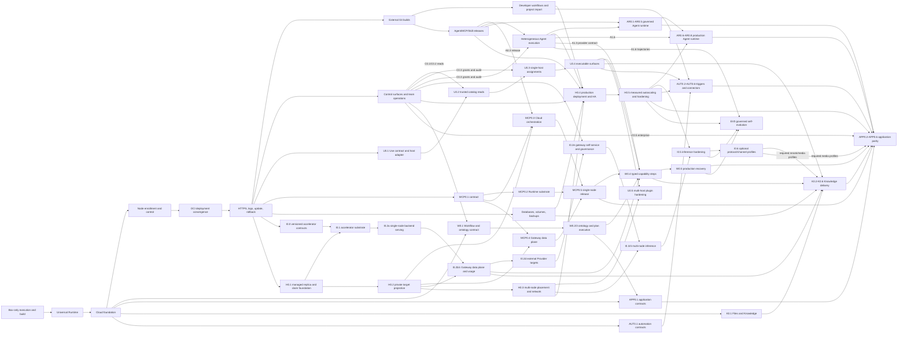

# A3S Cloud Development Plan

## 1. Delivery objective

The first usable release is one verified vertical slice:

```text
enroll one Linux node
  -> deploy one digest-pinned OCI image
  -> observe a real health check
  -> activate an HTTPS route
  -> stream ordered logs
  -> update and roll back to the previous healthy revision
```

The plan is gate-driven rather than date-driven. A milestone is complete only
when its exit evidence passes against real dependencies. Later milestones do
not compensate for an unproven Runtime contract, lost-operation recovery, or a
mock-only deployment path.

The cumulative delivery objective is an A3S-native Agent and application
platform that replaces the operational responsibilities commonly split between
Google AX and Kubernetes. A clean supported Linux installation must reach that
outcome through Cloud, Flow, Workloads, Fleet, Runtime, Box, Gateway, and Power
without requiring AX, Kubernetes, Helm, CRDs, Operators, Docker, or a
compatibility daemon. This is a cumulative exit outcome across existing gates,
not a second controller or delivery lane.

The root [product roadmap](../ROADMAP.md) publishes the complete Cloud
portfolio, current gate status, dependencies, and the boundary between the
Cloud control plane and Gateway data plane. This document owns detailed
implementation order, exit criteria, and evidence. It reuses the roadmap
boundary without creating a second Gateway control loop.

The [AI application platform plan](ai-application-platform-plan.md) is the
owning detailed plan for `APP0`, `K0`, and `AUT0`, including the public
application/node/plugin parity manifest. This development plan retains their
portfolio order and shared evidence policy rather than restating a competing
implementation design.

The [technical architecture](architecture.md) is authoritative for component
ownership, control paths, deployment profiles, and failure behavior. This plan
may record historical provider evidence, but historical Docker evidence never
defines the active Box-only architecture or certifies a current gate.

The roadmap has cumulative delivery horizons:

| Horizon | Required gates | Product outcome |
| --- | --- | --- |
| Usable service platform | `BX0` plus `R0` through `E0` | One operator can deploy, reach, observe, update, and roll back one Box-hosted stateless Service on one Linux node |
| Developer platform | `G0`, `P0`, `C0`, and `A0` | Source-to-release workflows, previews, multi-service import, stable automation surfaces, and A3S asset releases use the same deployment path |
| Plugin-managed cognitive platform | `U0`, `C0.3`, required A3S Use gates, and named `BX0`/`H0` host foundations | Signed multi-surface Use packages converge as tenant workspace assignments through the shared Plugin Manager and existing Cloud control paths |
| Hosted MCP platform | `A0.3`, `MCP0.1` through `MCP0.5`, and their named `BX0`/`H0` foundations | One immutable modern MCP release runs as a Box-hosted Runtime Service and is reached through a conforming, authorized Gateway data plane |
| Heterogeneous Agent platform | `A0`, `A1`, and the relevant `C0` grants and audit gates | Immutable Agent releases use one provider-neutral Harness contract, durable approvals, recovery, and replayable trajectories without another controller |
| Ontology-driven Workflow platform | `W0` plus the selected `A1`, `MCP0`, `I0`, `U0`, and `C0` dependencies | Versioned business semantics compile into deterministic, recoverable plans on the existing A3S Flow path |
| AI application platform | `APP0`, `K0`, `AUT0`, `W0`, and their named A0/A1/AR0, provider, identity, storage, Gateway, and production gates | Six current application experiences, including distinct classic/New Agent outcomes, 23 built-in Workflow node labels with classic/New Agent profiles under Agent, Knowledge Pipelines, six plugin outcomes, publication, monitoring, and enterprise policy share one release and Flow path |
| Stateful production platform | `S0` and `H0` | Stateful resources, verified recovery, multi-node placement, high availability, and measured scaling are production-operable |
| Governed evolution platform | `EV0`, `W0`, `A1.6`, `I0`, and named `H0`/`C0` safety foundations | Authorized evidence produces reproducible evaluations and immutable candidates promoted only through existing rollout and rollback authorities |

These horizons are cumulative. A broader interface or import format never
creates a second orchestration path and never weakens an earlier durability,
security, or recovery gate.

Inference is an optional product profile over the same platform, not another
deployment engine. When enabled, A3S Power is its required local serving
boundary and runs through A3S Box. Its single-node accelerator and model-serving
gates begin after the Box re-certification of E0; its multi-node replica and
distributed-serving gates consume H0's generic replica, placement, target-set,
networking, and HA primitives. The detailed I0 design is maintained in
[`inference-plan.md`](inference-plan.md).

The detailed Workflow, ontology, heterogeneous Harness, and self-evolution
contracts are maintained in
[`workflow-evolution-plan.md`](workflow-evolution-plan.md). Website capability
names are product projections over these gates; they do not authorize another
Flow engine, scheduler, queue, event bus, registry, object client, or rollout
controller.

The detailed five-mode application, 23-node, Knowledge, plugin projection,
publication, monitoring, and enterprise contracts are maintained in
[`ai-application-platform-plan.md`](ai-application-platform-plan.md). They add
Applications, Knowledge, Files, Automations, and Connectors semantic ownership;
they preserve the existing Flow, Workflow, Inference, Agents, Use, Sources,
Secrets, storage, Gateway, identity, and Operations mechanisms.

This expansion is additive. Existing tenant/project management, source and
build delivery, ordinary Task/Service execution, Asset and A3S Use lifecycle,
Secrets, Workloads/Fleet, Edge/Gateway, Operations, Search, stateful data,
production scale, audit, update, rollback, backup/restore, and disaster
recovery milestones remain in scope with their existing gates. A website
omission cannot retire a capability or weaken its evidence.

Reference-product outcomes are also tracked explicitly so useful behavior is
not lost when the implementation is made A3S-native:

| Reference capability set | Required A3S delivery | Gate boundary |
| --- | --- | --- |
| TokenHub-style private model gateway | Typed model protocols, Provider catalog and routing, project/environment keys, external OIDC identity federation, role-focused workspaces, diagnostics, API exploration, prompt-free usage and cost attribution, plus optional protocol/subscription channels | `C0.3`, `I0.2b` through `I0.2e`, `I0.5`, optional `I0.6`; commercial billing stays external and no TokenHub API/UI/storage compatibility is required |
| Google AX-style distributed Harness runtime | Isolated heterogeneous providers, one semantic event writer and reconnect stream, immutable invocation profiles, approvals, resume, checkpoints, forks, trajectories, and telemetry correlation | `A1.1` through `A1.6`, `BX0`, and `H0`; no AX controller, event log, scheduler, config authority, or wire compatibility enters Cloud |
| Dify-style public commercial core | Six current application projections including distinct classic/New Agent outcomes, 23 built-in Workflow node labels with classic/New Agent profiles under Agent, Knowledge Bases/Pipelines, six plugin outcomes, Web/API/embed/MCP delivery, monitoring/feedback, and enterprise governance | Composite `APP0.6` over `W0`, `K0`, `AUT0`, A0/A1/AR0, and named provider/platform gates; no copied API, storage topology, package lifecycle, configuration authority, mode runtime, Agent/sandbox lifecycle, pipeline engine, or scheduler enters Cloud |
| Cross-layer security operations | Authorized correlation of Gateway policy, Agent semantics, Runtime/Box and host evidence, tenant-scoped detections, investigation timelines, signed export, and explicit enforcement through the owning context | `C0.3` plus `E0`/`H0.5` evidence foundations; no fourth control plane, security node channel, telemetry-driven mutation, or second audit store |

The [architecture reference capability register](architecture.md#21-reference-capability-preservation-register)
is the detailed authority. A
delivery slice may defer one of these outcomes only by retaining its named gate
and unavailable status; deleting its marketing label is not retirement.

## 1.1 Active backend-first execution policy

Effective 2026-08-06, feature delivery is backend and interface first until the
operator explicitly lifts this policy. Existing frontend behavior remains a
supported projection, but it is frozen: planned work does not add or redesign
pages, components, interactions, product-site sections, or architecture
visualizations under `web/`, `website/`, or `architecture-3d/`. An unavoidable
security or build-break repair in those paths requires explicit operator scope.

An active delivery slice proceeds in this order:

1. freeze the closed ACL, domain invariants, ownership, and versioned protocol;
2. implement application commands and queries, A3S ORM migrations,
   idempotency, Operations, Outbox facts, and audit;
3. implement the real Runtime, Box, Gateway, Power, A3S Use, storage, or other
   provider adapter without an in-memory production fallback;
4. expose stable REST and OpenAPI contracts with typed errors, pagination,
   cancellation, replay, and compatibility rules;
5. expose the same application boundary through the maintained client, CLI,
   and applicable Management MCP tools;
6. pass real-provider, failure, process-death, recovery, cleanup, security, and
   cross-repository conformance gates; and
7. retain the future frontend projection as an explicit backlog item without
   implementing it during this phase.

No backend endpoint is added only to fit a screen, and no frontend state may
become business, authorization, routing, execution, or recovery truth. A
backend/interface slice may be verified without a new Web projection. When a
named product gate promises a Web or console outcome, the backend slice can
land first, but the full product gate remains in progress until that retained
projection is delivered after this policy is lifted. Existing frontend tests
remain regression evidence and are not rewritten as part of backend feature
work.

## 2. Engineering rules

- During the active backend-first phase, implement vertical behavior through
  domain, application, infrastructure, transport, maintained non-Web
  interfaces, documentation, and tests. Defer new frontend projections under
  section 1.1.
- Write aggregate and protocol tests before the implementation they constrain.
- Keep the repository root as orchestration only. The Rust workspace lives at
  `apps/cloud/Cargo.toml`.
- Commit changes in external crate submodules separately from the root pointer
  update. Never mix an A3S Runtime release with unrelated Cloud code.
- Pin A3S dependency revisions and keep one app-local `Cargo.lock`.
- Put every external middleware behind a typed application port and test its
  real provider; backend names never enter domain decisions.
- Compose the shared A3S Box Runtime driver directly. Do not add another Box
  lifecycle adapter, provider selector, or Docker-compatible fallback.
- Compile local inference only to the A3S Power Service contract. An engine
  used inside Power never becomes a Cloud backend, scheduler, or control path.
- Do not mark an integration complete with an in-memory repository, fake
  Runtime driver, fake Gateway acknowledgement, or mocked health response.
- Every long-running command is idempotent, cancellable, resumable after
  process death, and visible as one Operation timeline.
- REST, the maintained client, CLI, and MCP surfaces call the same application
  commands and queries. Existing Web surfaces remain adapters over that same
  boundary; no interface owns business rules or bypasses tenant guards.
- Cloud plugin APIs manage one desired `PluginAssignment`; they never copy or
  proxy A3S Use's installer, management MCP, TUF/catalog verifier, plan
  generator, Workspace Grants, Runtime Bindings, capability registry, surface
  reconciler, or package operation journal.
- External project formats such as Git repositories and Compose files are
  immutable inputs. Cloud normalizes them into versioned typed desired state;
  they never become a second mutable source of truth.
- Detected configuration is a reviewable proposal. Accepted build, deployment,
  route, and storage plans are explicit and digest-addressed.
- A provider-backed capability remains unavailable until its real conformance,
  failure, cleanup, and recovery gates pass. Unsupported input fails explicitly
  instead of degrading silently.
- Documentation describes shipped behavior only; planned behavior stays marked
  as planned.
- Implement Workflow, Agent, MCP, model, storage, observability, and evolution
  website capabilities by extending their named authorities. Architecture
  tests must reject profile-specific Flow engines, schedulers, queues, event
  buses, registries, object clients, and rollout controllers.

## 3. Critical path


```mermaid
flowchart LR
    BX0[Box-only execution and build] --> R0[Universal Runtime]
    R0 --> F0[Cloud foundation]
    F0 --> N0[Node enrollment and control]
    N0 --> D0[OCI deployment convergence]
    D0 --> E0[HTTPS, logs, update, rollback]
    E0 --> G0[External Git builds]
    E0 --> C0[Control surfaces and team operations]
    E0 --> U01[U0.1 Use contract and host adapter]
    U01 --> U02[U0.2 trusted catalog reads]
    C0 -->|C0.1/C0.2 reads| U02
    U02 --> U03[U0.3 single-host assignments]
    C0 -->|C0.3 grants and audit| U03
    U03 --> U04[U0.4 executable surfaces]
    G0 --> P0[Developer workflows and project import]
    G0 --> A0[Agent/MCP/Skill releases]
    E0 --> MCP01[MCP0.1 contract]
    A0 -->|A0.3 release| MCP03[MCP0.3 Cloud orchestration]
    MCP01 --> MCP02[MCP0.2 Runtime substrate]
    MCP01 --> MCP03
    MCP01 --> MCP04[MCP0.4 Gateway data plane]
    H02 --> MCP03
    H02 --> MCP04
    MCP02 --> MCP05[MCP0.5 single-node release]
    MCP03 --> MCP05
    MCP04 --> MCP05
    A0 --> A1[Heterogeneous Agent execution]
    C0 -->|C0.3 grants and audit| A1
    A0 --> AR05[AR0.1-AR0.5 governed Agent runtime]
    A1 --> AR05
    E0 --> S0[Databases, volumes, backups]
    E0 --> I00[I0.0 versioned accelerator contracts]
    E0 --> H01[H0.1 managed replica and claim foundation]
    I00 --> I01[I0.1 accelerator substrate]
    H01 --> I01
    I01 --> I02A[I0.2a single-node backend serving]
    H01 --> H02[H0.2 private target projection]
    I02A --> I02BC[I0.2b/c Gateway data plane and usage]
    H02 --> I02BC
    I02BC --> I02D[I0.2d external Provider targets]
    I02D --> I02E[I0.2e gateway self-service and governance]
    C0 --> I02E
    H02 --> H03[H0.3 multi-node placement and network]
    H03 --> U05[U0.5 multi-host plugin hardening]
    U04 --> U05
    I02E --> I034[I0.3/4 multi-node inference]
    H03 --> I034
    P0 --> H04[H0.4 production deployment and HA]
    C0 --> H04
    A0 --> H04
    A1 --> H04
    S0 --> H04
    H03 --> H04
    H04 --> H05[H0.5 measured autoscaling and hardening]
    AR05 --> AR08[AR0.6-AR0.8 production Agent runtime]
    A1 -->|A1.6| AR08
    H05 --> AR08
    I034 --> I05[I0.5 inference hardening]
    H05 --> I05
    I05 --> I06[I0.6 optional protocol/channel profiles]
    F0 --> W01[W0.1 Workflow and ontology contract]
    C0 --> W01
    W01 --> W023[W0.2/3 ontology and plan execution]
    W023 --> W04[W0.4 typed capability steps]
    A1 -->|A1.3 provider contract| W04
    MCP05 --> W04
    I02BC --> W04
    U04 --> W04
    W04 --> W05[W0.5 production recovery]
    F0 --> APP01[APP0.1 application contracts]
    W023 --> APP01
    F0 --> K01[K0.1 Files and Knowledge]
    F0 --> AUT01[AUT0.1 automation contracts]
    K01 --> K06[K0.2-K0.6 Knowledge delivery]
    W04 --> K06
    I02BC --> K06
    I06 -->|required rerank/media profiles| K06
    S0 --> K06
    U04 --> K06
    AUT01 --> AUT06[AUT0.2-AUT0.6 triggers and connectors]
    P0 --> AUT06
    U04 --> AUT06
    H05 --> AUT06
    APP01 --> APP06[APP0.2-APP0.6 application parity]
    W05 --> APP06
    K06 --> APP06
    AUT06 --> APP06
    MCP05 --> APP06
    I06 -->|required media profiles| APP06
    AR05 --> APP06
    AR08 --> APP06
    H05 --> APP06
    C0 -->|C0.5 enterprise| APP06
    W05 --> EV0[EV0 governed self-evolution]
    A1 -->|A1.6 trajectories| EV0
    I05 --> EV0
    H05 --> EV0
```

The first behavioral release gate is `E0`; its prior provider evidence is now
historical until `BX0` re-certifies it on A3S Box. Source delivery (`G0`),
stable control surfaces (`C0`), and stateful foundations (`S0`) may advance as
independent lanes. Project import (`P0`) depends on the immutable source and
build contracts from G0. Hosted assets (`A0`) reuse the same source-to-artifact
path. `A1.0` has consolidated existing sequence streaming, immutable object
storage, and durable node-agent delivery primitives; user-visible
`A1.1` work starts only after `A0.3` supplies a published immutable release,
`A1.2` consumes `A0.4` Agent deployment for the native Code provider, `A1.3`
freezes one provider-neutral Harness contract, and `A1.4` consumes `A0.5`
bindings. The `A1.5` approval slice consumes `C0.3` grants and audit.
Production multi-node work
(`H0`) starts only after the product surfaces it must scale have passed their
single-node gates.

`W0.1` through `W0.3` may define ontology authority and prove deterministic
Flow-backed plan execution before every external step provider is available.
`W0.4` consumes only verified typed `A1.3`, `MCP0.5`, `I0.2`, and applicable
`U0.4` ports. `EV0` follows `W0`, `A1.6`, inference, and production safety
foundations; it reuses existing compute, storage, release, rollout, and audit
paths instead of creating an evolution platform beside them.

`APP0.1`, `K0.1`, and `AUT0.1` may freeze independent semantic contracts after
the protected `W0.3` run-start and descriptor foundations pass. Knowledge
delivery consumes the selected `W0.4`, Inference, Use, Connectors, and storage
ports. Automations owns only new-invocation triggers and reuses Boot's durable
task rail; Flow timers remain scoped to existing runs. Full `APP0.6` follows
`W0.5`, `K0.6`, `AUT0.6`, and the named production gates and remains open until
the retained visual product is delivered after the frontend freeze.

`U0` is a control-plane integration lane, not another plugin platform. `U0.1`
pins and adapts the frozen typed remote-host boundary from the exact A3S Use
contracts; any future missing public type or manager API is added upstream
rather than reimplemented in Cloud. `U0.2` is read-only. `U0.3` begins mutation
only after the shared A3S Use Plugin Manager owns the complete parent saga and
`C0.3` supplies Cloud authorization and audit. `U0.4` executable surfaces must
prove that their host adapters use only the injected Runtime/Box and private
A3S Use bindings, while any public or replicated service remains an explicit
A0/MCP0 Workload; Secrets and Knowledge keep their existing boundaries. `U0.5`
operates the same independent per-host assignments over H0/Fleet membership
instead of adding a group rollout aggregate or plugin scheduler.

`MCP0.1` is contract work and may begin from the E0 model. Its implementation
does not become available until `A0.3` provides an immutable release,
Runtime/Box close `MCP0.2`, Cloud closes `MCP0.3`, Gateway closes `MCP0.4`, and
their exact revisions pass `MCP0.5`. `MCP0.6` then consumes the multi-node and
grant/audit foundations rather than inventing MCP-specific controllers.

H0 is delivered through the numbered sub-gates below. H0.1 through H0.3 may be
proved against an owning profile after that profile's single-node gate. I0 uses
that rule to exercise inference-neutral replica, claim, target-set, placement,
and network primitives. This does not mark the broader H0 milestone complete
for P0, C0, A0, A1, S0, production packaging, control-plane HA, or autoscaling.

### 3.1 Verified delivery status

Status as of 2026-08-15:

| Gate | State | Release evidence |
| --- | --- | --- |
| BX0 | In progress | `BX0.1` and the complete `BX0.2` lifecycle, recovery, hard-resource Claim, cancellation, and abnormal-interruption cleanup path are verified on the exact Runtime/Box pair. `BX0.3` now has Runtime-owned typed Service TCP endpoints, Box-owned generation-fenced forwarding and HTTP/TCP/command probes, one stateless Cloud-to-Gateway origin adapter, one real Cloud health consumer gate, one authenticated Cloud-to-Box adapter for restart-safe environment/file Secrets, log redaction, and pull-only registry credentials, one Artifact port that reuses the existing node cache plus Box's sole VolumeStore for Artifact/Volume/tmpfs mounts and Task-output publication, a composite allocation gate that binds Box's complete advertised Resources profile to Cloud's existing inventory-bound Claim lifecycle, and an ACL-native SEV-SNP composition that consumes generation-bound Box attestation while keeping simulation distinct from hardware evidence. Complete Sandbox plus hardware-backed MicroVM/TEE isolation, builds, and the clean-host loop keep `BX0.3` through `BX0.5` open in A3S-Lab/Cloud#85 and A3S-Lab/Box#172 |
| PW0 | Planned | ACL-native Power and Box MicroVM/TEE integration is tracked by A3S-Lab/Power#3; no Cloud inference capability is claimed yet |
| R0 | Historical | General Task and Service behavior passed against the retired provider; Box conformance is required |
| F0 | Verified | Isolated PostgreSQL migrations, tenancy, idempotency, local/NATS outbox, A3S Flow `0.12.0` history, A3S Boot `0.2.0` PostgreSQL task management, A3S ORM `0.3.0`, queue-failure readiness, and the nine-boundary persistent Build Flow `SIGKILL` gates pass. The exact root compatibility lock publishes this verified composition |
| N0 | Historical | Outbound mTLS protocol, durable command journal, replay, provider reattachment, and lost-provider recovery passed against the retired provider; Box re-certification is required |
| D0 | Historical | Digest-pinned apply and health, restart recovery, failed-update retention, cancellation cleanup, and registry resolution passed against the retired provider; Box re-certification is required |
| E0 | Historical | Route, Gateway, Secret, log, update, rollback, Web, and crash-boundary behaviors passed against the retired provider; the complete clean-host loop must be reproduced without Docker or a compatible daemon |
| G0 | In progress | Exact source resolution, the sole `cloud.build@5` Box-native workflow, command-bound Artifact transport, complete OCI admission, authenticated digest-only publication, remote graph verification, replay/cancellation, deterministic SPDX/SLSA generation, locally verified Ed25519 DSSE signing, durable evidence restoration, evidence API/web download, explicit deployment through `cloud.deployment@3`, periodic provider revalidation, and BuildRun status/cancellation/retry controls are implemented. The Box provider workflow defines a revision-bound real Linux build consumer for post-publication Agent-process death, exact Box/Artifact replay, cleared-cache hydration from the immediate parent, idempotent removal, and live-state baseline restoration, plus a nine-boundary Fleet/Flow completion-event-loss matrix for the exact start/cancel/inspect/remove command chain in both logical and PostgreSQL-backed nine-`SIGKILL` forms. The manual external-provider workflow now binds a private GitHub revision and production input to that exact Box output, an operator HTTPS Registry graph, a locally verified Vault Transit signature, a restart-restored PostgreSQL BuildRun, and one `cloud.deployment@3` Workload handoff. BuildRun logs fail explicitly until Box supplies an authoritative durable log contract. Retained successful executions of both operator gates still block G0 verification |
| C0 | In progress | `C0.1`, `C0.2`, and `C0.2m` are verified. One typed TypeScript client is shared by Web and CLI; the versioned OpenAPI envelope, bounded transport, safe token handling, tenant/operational reads, replay-safe mutations, evidence, logs, diagnostics, Search, Workload/Source/Secret/Identity/Fleet/Edge parity, and compatibility checks pass focused tests. The verified pre-extension Management MCP gate proved exact 23-tool administrator and 16-tool read-only catalogs. The current 101-tool administrator and 60-tool read-only catalogs retain those tools and add fifteen Identity, two Project-attribution, one bounded tenant-administrator audit query, three personal-notification tools, four personal outbound-subscription tools, seven verified `W0.2` Ontology, ten `W0.3` Workflow definition/goal/plan, one read-only built-in Workflow node-catalog query, seven native Form lifecycle, eight WorkflowRun lifecycle including Flow-derived variable inspection, five protected HumanTask read/assignment/submission tools, three ExecutionTemplate tools, six Connector profile/revision tools, and six verified `U0.2` plugin Registry/catalog read tools; focused catalog, permission, strict-argument, lifecycle, deterministic-plan, Workflow node-catalog, WorkflowRun/HumanTask/ExecutionTemplate/Connector, plugin tenant, role, invitation, audit, attribution, notification, outbound-subscription, and replay conformance pass. `C0.2m` uses the `2026-07-28` sessionless protocol with per-request metadata and `server/discover`. The `C0.3` slice implements stable human/service Principals, one explicit Principal-plus-Membership creation path, Membership roles, exact-Principal MembershipInvitations, Principal-bound credentials, exact OIDC issuer/subject links and replay-safe one-time flows, a bounded OIDC discovery/JWKS/ID-token adapter, production-wired login/link/callback routes and maintained-client entry points, immediate role/revocation enforcement, last-owner protection, closed project/environment/node Resource Grants, immutable versioned Project attribution, a personal in-app notification inbox, immutable outbound-subscription A3S ACLs with REST/client/CLI/MCP management, transactional delivery authorization facts, signed-webhook/Slack-compatible request builders, the first NATS A3S Event-to-fenced-Connector consumer composition, monotonic Delivered/Rejected/Indeterminate/Exhausted terminal receipts, C6 `Retry-After` pacing, and fixed eight-attempt termination, plus A3S ORM/Outbox/audit writes and the redacted keyset audit and outbound-subscription projections through REST/OpenAPI `1.37.0`, client, CLI, and Management MCP. Focused attribution and notification tests pass. The retained [PostgreSQL 17 subscription/receipt job](https://github.com/A3S-Lab/Cloud/actions/runs/31870067201/job/94977216459) proves migration `114`, exact Connector binding, atomic delivery-fact emission, idempotent terminal-receipt settlement, and the earlier attribution/inbox persistence boundaries; the retained [PostgreSQL 17 bounded-attempt job](https://github.com/A3S-Lab/Cloud/actions/runs/31872285521/job/94982690995) proves migration `115`, Exhausted receipt persistence, and exact C6 evidence binding. The notification slice reuses the transactional Outbox relay, A3S Event, shared Resource Grant evaluator, idempotency, audit, and A3S ORM migrator without another queue, provider authority, retry mechanism, or configuration format. User-configured suppression/delivery budgets, SMTP, alert policy, retained production evidence, security investigation, usage-fact profile snapshots, audit retention/export, and the intentionally deferred role-focused frontend projections remain planned; `C0.3` is in progress and `C0.4` remains planned. |
| A0 | In progress | `A0.1` and `A0.2` are verified. `A0.3` has the typed external-or-hosted build path, deterministic hosted input, migrations 063-064 through typed A3S ORM, concurrent draft BuildRun reservation, restart repair, atomic successful BuildRun/AssetRelease/provenance/Outbox finalization, failed-draft recovery, product yanking, semantic deterministic selection, and tenant-authorized API/client/CLI/Web management projections. `A0.4` has immutable exact Agent release-to-Workload binding, server-side OCI injection, lifecycle reuse, migration 066 persistence, and REST/client/CLI/Web projections. `A0.5` now publishes exact hosted Git archives as immutable Skill bundles and binds them to Agent Workload revisions through migration 067, read-only Runtime Artifact mounts, rollback-safe revision history, and REST/client/CLI/Web surfaces. Retained external-provider and real PostgreSQL/Box evidence still blocks `A0.3` through `A0.5` verification. |
| A1 | In progress | `A1.0` is verified and `A1.1` implements the durable conversation/execution foundation. The local `A1.2` native Code provider pins the Code-owned protocol, persists exact Workload/Runtime/run delivery identity through migration 069, reconciles the reserved Operation through the existing Flow runtime, forwards commands through Fleet and the node journal, settles Code pages through the shared outbound-batch primitive, derives only bounded semantic output/terminal facts, and implements the root `a3s code harness` HTTP entrypoint. Dependency publication, cancel/recover orchestration, and clean Linux PostgreSQL/Runtime recovery evidence remain open; provider-neutral `A1.3` and `A1.4` through `A1.6` remain planned. |
| W0 | In progress; unavailable | `W0.1` implements the closed ACL-native Workflow/Ontology foundation and `W0.2` verifies immutable Ontology revisions, deterministic migration policy, and authorized Search. `W0.3` includes immutable definitions and Goals, native Forms, Goal/Plan-bound WorkflowRuns, HumanTasks, reachable-Output aggregation, finite Execution, Flow-derived authorized variable inspection, deterministic project-authorized 23-node discovery, and the immutable composite-region policy/binding foundation. Migration `103` persists three mandatory semantic children; migration `107` permits optional exact variable-default material; migration `108` permits optional `cloud.workflow.composite-regions.v1` material without adding a table and requires new composite publication to exactly cover Iteration/Loop descriptors and child WorkflowRevision bindings. Compiler schema 2 emits Plan v2 with exact descriptor, semantic, variable, and optional composite-region digest pins, prevents authority downgrade, and preserves Plan v1 byte shape. WorkflowRun input/runtime/Flow v2 freezes exact variable/default/composite material and reconstructs the supported variable subset from immutable input plus existing Flow history; migrations `105`, `107`, and `108` only expand that immutable input's bound. REST/OpenAPI `1.35.0`, client, CLI, MCP, focused domain/REST/replay/catalog/default/inspection/composite tests, and PostgreSQL migration/replay/rollback/immutability plus reconnect gates cover the foundation. Variable inspection and composite binding add no table, cache, event log, worker, scheduler, queue, or Flow mechanism; the catalog has no persistence or write path and cannot admit descriptors or claim public parity. Composite frames/exports and Flow-backed Iteration/Loop dispatch, Applications-owned variables, Answer/error semantics, remaining application ports, compensation, expanded provider conformance, `W0.4`-`W0.5`, and public availability remain planned. |
| APP0 | Planned; unavailable | Applications, immutable releases, six authoring/delivery projections including classic/New Agent, sessions, publishing, monitoring, and enterprise completion are specified in `ai-application-platform-plan.md`. Full public parity is a composite `APP0.6` claim and no application-platform availability exists yet. |
| K0 | Planned; unavailable | Files, Knowledge Bases/documents/chunks, multi-source ingestion, General/Parent-child/Q&A and multimodal processing, indexing/retrieval, external Knowledge, and Flow-backed Knowledge Pipelines are specified in `ai-application-platform-plan.md`; no Knowledge product availability exists yet. |
| AUT0 | Planned; unavailable | New-invocation schedules/webhooks/plugin events and reusable outbound connection profiles are specified in `ai-application-platform-plan.md`. Component-only `AUT0.5-C1` supplies the exact-revision execution port and bounded HTTP executor; verified `C2` adds canonical HTTP A3S ACL admission plus immutable environment-scoped profile/revision persistence and exact Secret-version bindings; verified `C3` adds Resource Grant-aware application contracts and Secrets-owned just-in-time materialization; verified `C4` adds public-Internet DNS/SSRF evaluation and exact address pinning; verified `C5` adds immutable exact-attempt terminal evidence through migration `112` and authorized bounded reads; verified `C6` adds durable pre-dispatch fencing, conservative indeterminate recovery, authorized one-shot composition, and atomic attempt/evidence settlement through migration `113`; implemented `C7` exposes that same profile/revision CQRS through REST/OpenAPI `1.36.0`, the maintained client, CLI, and six Management MCP tools without resolving Secrets or adding another repository; component-only `C0.3-N2b` supplies the first exact-subject Notification NATS-to-C6 composition, while `N2c`-`N2e` keep subscription, delivery authorization, logical receipt, `Retry-After` pacing, and fixed attempt-budget authority in Notifications by consuming the same C6 evidence. Workflow ports, remaining provider/consumer wiring, revocation/recovery operations, retained end-to-end integration evidence, and all Automations/Connectors product availability remain open. |
| EV0 | Planned | Evidence admission, reproducible evaluation, candidate/Agentic RL jobs, promotion safety, and rollback are specified in `workflow-evolution-plan.md`; no training or production self-evolution availability exists yet. |
| U0 | In progress; `U0.1` host compatibility and `U0.2` trusted Registry/catalog reads and Search verified | Verified `U0.1` pins the canonical A3S Use protocol-level-4 host contract and adds explicit capabilities, package-plan, enablement-plan, digest-only apply, and observation Fleet payloads plus one optional Node Agent adapter over the sole shared `PluginHostManager`. They reuse the existing command queue and journal. The root compatibility lock pins the same immutable Use revision and all ten consumed host schemas. Verified `U0.2` adds the `PluginRegistry` domain, migration 084 persistence, migration 085 integration with the sole authorized global Search view, one typed trust-root adapter over the shared immutable-object client, one published `a3s-use-extension` adapter for public-network refresh and online/cached catalog search/inspection, application enrollment plus tenant queries, REST `1.15.0`, the maintained client, CLI, and six read-only Management MCP tools. Cloud adds no TUF, catalog, query, cursor, cache, Search store/worker, object-storage, authorization, or cleanup mechanism. Stable CI verifies both the production public-HTTPS provider against the metadata-only fixture at the exact pinned Use revision and a strict `12/12` PostgreSQL 17 transaction, replay, tenancy, Search, fail-closed, and migration gate. Assignments and complete Manager mutation composition remain open; no assignment capability is claimed. |
| MCP0 | In progress; unavailable | Closed cross-repository contracts, Runtime profile/generation fencing, Cloud immutable profiles plus mutable route policies, typed persistence, release-bound Runtime projection, hosted credential authority, scope-complete healthy local-target planning, ordinary-plus-MCP complete Gateway snapshot composition, credential-lifecycle route cleanup, bounded encrypted-receipt sweeping, complete version-vector CAS, and atomic publication/certificate/scope/Outbox staging pass focused and PostgreSQL fixture tests alongside Gateway request/auth/single-dispatch/JSON-SSE/snapshot-swap/drain foundations. Retained clean-host lifecycle execution, real Box/Linux hosting, Gateway forced-drain/readiness/telemetry, and joint conformance remain open |
| H0.1 | Historical | Claim fencing, conflicting-capacity rejection, higher-generation release, Agent process death, and residue behavior passed against the retired provider; Box process/VM-loss re-certification is required |
| H0.2 | Historical | PostgreSQL/Gateway projection behavior passed, but the joint release gate must be repeated with Box-hosted upstreams on exact revisions |

In the `W0` summary above, revision-owned descriptor semantics, exact Plan v2
pinning, and project-authorized discovery of the full 23-node acceptance
inventory are implemented. Discovery composes checked-in digest-bound ACL and
adds no persistent registry; descriptor admission still belongs only to an
exact WorkflowRevision snapshot. Neither the catalog nor the conformance
fixtures make a public node available.

E0 defines the first usable-service MVP. The prior evidence supplies complete
historical regression coverage, but the Box-only release remains blocked until
`BX0` reproduces that single-node loop.

### 3.2 Capability ownership

Cloud does not pursue feature parity by adding unrelated subsystems to the
control plane. Each broader platform capability has one milestone and one
authoritative model:

| Capability | Owning gate | Planning decision |
| --- | --- | --- |
| Local execution and image build | `BX0` | A3S Box is the sole provider; no Docker-compatible fallback, socket, fixture, or lifecycle implementation remains |
| Prebuilt OCI deployment | `D0` | Verified; remains the common deployment path |
| HTTPS, logs, update, and rollback | `E0` | Verified first release; later milestones reuse this path without weakening it |
| Workload and provider secrets | `E0` | Store encrypted values behind tenant-scoped references; never persist or project plaintext |
| Logs, metrics, traces, and alerts | `E0`/`C0`/`H0` | Establish truthful single-node signals first, then notifications, SLOs, and measured scaling |
| External Git and reproducible builds | `G0` | Explicit recipes first; automatic detection builds on the proven contract |
| Stack detection, previews, monorepos, and Compose import | `P0` | Normalize into Workload, Route, and later Volume resources; no second orchestrator |
| Web, worker, and scheduled Task profiles | `P0` + `AUT0` | P0 detects and compiles explicit product profiles into common Runtime Service/Task targets; Automations is the sole due-time and new-invocation schedule authority |
| CLI, management MCP, collaboration, notifications, and audited exec | `C0` | Reuse public commands, queries, scopes, idempotency, and audit |
| Agent, MCP, and Skill releases | `A0` | A3S-specific immutable catalog over the common source, build, and publication path |
| A3S Use plugin management | `U0` | Cloud owns only registry enrollment and desired host/workspace assignments; the shared A3S Use Plugin Manager owns signed catalog, plan/apply, package generations, grants, bindings, capability publication, drain, and cleanup |
| Hosted modern MCP Service deployment and traffic | `MCP0` | Compile one immutable MCP release through Workloads/Runtime and one complete Gateway policy; no second scheduler, endpoint registry, or request-path Cloud call |
| Heterogeneous Agent conversations, executions, approvals, checkpoints, forks, and trajectories | `A1` | One Cloud semantic execution history and one provider-neutral Harness contract over A0 releases, Operations/Flow, Fleet, Workloads, Runtime, and shared streaming; native Code and external providers cannot add controllers or run stores |
| Ontologies, Workflow plans, and recoverable Workflow runs | `W0` | Workflow owns semantics and deterministic compilation; A3S Flow plus Operations remains the only durable orchestration mechanism |
| Application releases, six current experiences, sessions, messages, publishing, feedback, and monitoring | `APP0` | Every ApplicationRelease binds one exact WorkflowRevision; classic/New Agent reuse A0/A1/AR0 and all delivery modes/channels share one Applications/Workflow execution path |
| RAG corpus, Files metadata, multi-source ingestion, General/Parent-child/Q&A and multimodal processing, retrieval/citations, and Knowledge Pipelines | `K0` | Knowledge owns semantic state; pipeline releases bind Workflow revisions, bytes use the shared object client, and indexes are rebuildable projections |
| New-invocation schedules, webhooks, plugin/source events, and outbound connection profiles | `AUT0` | Automations owns exact-target trigger policy and Connectors owns egress profiles; neither advances Flow steps or copies Sources/Secrets state |
| Evidence datasets, evaluation, candidates, and promotion policy | `EV0` | Evolution owns experiment semantics only and reuses shared compute, storage, release, rollout, audit, halt, and rollback authorities |
| Databases, distributed storage providers, volumes, and backups | `S0` | Model mutable data explicitly with fencing and verified restore while reusing the shared immutable-object infrastructure |
| Replicas, multi-node placement, HA, and autoscaling | `H0` | Scale only measured, recovery-proven semantics |
| Generic accelerator inventory, claims, and enforcement | `I0.0`/`I0.1` with `H0` placement ownership | Extend Runtime, Fleet, and Workloads without introducing model or backend semantics into their core contracts |
| Model catalog, inference deployment, model routes, and usage | `I0` | Add a separate Inference bounded context that compiles the required A3S Power profile into Box-hosted managed Workloads and Edge target sets |
| Enterprise inference-gateway self-service and governance | `C0` + `I0.2d`/`I0.2e` | C0 owns principals, grants, role-focused navigation, authorized search, and project attribution; I0 owns provider certification, model/key self-service, route diagnostics, API exploration, and usage showback |
| Edge caching and transport optimization | `E0`/`H0` | A3S Gateway owns HTTP, TLS, compression, and cache mechanics; Cloud owns desired policy |
| Mail hosting, native desktop, and commercial billing | Outside core | Use integrations or separately owned products; do not couple them to workload orchestration |

### 3.3 Milestone BX0: sole A3S Box provider

#### Goal

Remove every Docker/Bollard/runtime-socket dependency from Cloud and certify
the existing product behavior through the shared A3S Box Runtime driver. This
is a provider migration, not a new scheduler, lifecycle contract, node channel,
build controller, state store, or object store.

#### Work

1. `BX0.1`: align the exact Box and Runtime revisions, configure one `box`
   provider through closed A3S ACL, compose the shared driver in the Node Agent,
   and remove provider selection and fallback.
2. `BX0.2`: pass digest-pinned Task and Service apply, inspect, health-neutral
   lifecycle, generation recovery, logs, exec, CPU/memory/PID/time bounds,
   cancellation, stop, remove, and residue cleanup.
3. `BX0.3`: pass private networking and endpoint evidence, HTTP/TCP/command
   health, Secret materialization, Artifact/Volume/tmpfs mounts, Task outputs,
   registry credentials, allocation evidence, and Box Sandbox/MicroVM/TEE
   isolation without silent downgrade.
4. `BX0.4`: replace the BuildKit/Docker-oriented source-build implementation
   with the typed Box build boundary and immutable ACL build plans. Preserve
   complete OCI graph validation, trusted content-addressed cache identity,
   publication, SPDX/SLSA evidence, signing, replay, cancellation, and cleanup.
5. `BX0.5`: port provider, consumer, source-build, Claim, Gateway, and clean-host
   gates; remove Bollard, Docker source/configuration/environment variables,
   daemon sockets, fixtures, workflows, and stale docs; add a zero-Docker
   architecture test covering source, tests, examples, scripts, and workflows.

The Node Agent is still the authenticated remote boundary. Box is node-local.
Runtime owns provider-neutral lifecycle semantics; Box owns execution, images,
networks, mounts, logs, snapshots, isolation, builds, and cleanup. All
relational state remains in PostgreSQL through A3S ORM.

The verified deployment-cancellation slice reuses `cloud.deployment@3`, the
Fleet command lease, the Node Agent journal, the shared Box Runtime driver, and
the existing resource Claim state machine. Its
[real-provider gate](https://github.com/A3S-Lab/Cloud/actions/runs/30429412890)
omits `port` and `health` from the Service template, projects
`NetworkMode::None` with no Runtime probe, and proves
`RuntimeRemove -> ResourceClaimRelease -> Cancelled` with empty Box state.
The
[final interruption gate](https://github.com/A3S-Lab/Cloud/actions/runs/30456965598)
kills the Agent after Box removal and proves a reconstructed Agent and Flow
adopt the exact receipt, keep capacity held until acknowledgement, release the
Claim once, and finish cancellation without provider residue. This completes
`BX0.2`; networking and health are owned by `BX0.3`.

The first `BX0.3` slice has landed through
[Runtime PR #8](https://github.com/A3S-Lab/Runtime/pull/8),
[Box PR #185](https://github.com/A3S-Lab/Box/pull/185), and
[Cloud PR #95](https://github.com/A3S-Lab/Cloud/pull/95). A3S Runtime owns the
typed endpoint observation; Box owns loopback forwarding through its existing
generation-fenced execution connector; and Cloud consumes that type directly
for Gateway target compilation. Cloud has no product-specific endpoint evidence
encoding. One stateless Edge adapter accepts only a typed TCP endpoint and
produces the canonical HTTP origin expected by Gateway. The dedicated Linux
gate starts a real Box Service, proves the observation remains stable across
inspection, sends HTTP through the compiled origin, removes the Service, and
requires the listener to close. It starts no Box CLI forwarder and introduces
no endpoint registry, forwarding daemon, Runtime driver, or lifecycle store.

The second `BX0.3` slice pins
[Box PR #186](https://github.com/A3S-Lab/Box/pull/186). Box's shared Runtime
driver advertises and provider-certifies HTTP, TCP, and command probes through
the existing generation-fenced port and exec boundaries. Cloud keeps its one
existing health mechanism: the A3S ACL Workload compiler emits the HTTP Runtime
policy, the Node Agent journals the kind-neutral observation, and the existing
stateless Edge adapter consumes only the typed endpoint. The dedicated real
Box consumer gate requires `Healthy` at apply, reconstructs Runtime and the
Agent executor, replays the exact durable observation, requires a fresh healthy
inspection with unchanged Runtime identity, proves the replayed listener closes,
consumes the freshly published typed endpoint, sends HTTP through its compiled
Gateway origin, removes the Service, observes `NotFound`, and requires listener
closure. It adds no health worker, registry, scheduler, queue, Runtime driver,
endpoint authority, or lifecycle store.

The third `BX0.3` slice pins A3S Box
`9fb9bf528f6c648bbecf203de991106fc39bccdb` and closes the Node Agent isolation
configuration. Every ACL profile must select exactly `microvm` or `sandbox`;
missing, `automatic`, and unknown selections fail parsing. The shipped product
profile chooses MicroVM, hosted real-Box tests choose Sandbox explicitly, and
the Node Agent passes the selection into the one shared `BoxRuntimeDriver`
without automatic downgrade, a fallback provider, or another lifecycle path.
This completes deterministic isolation selection but not the required
Sandbox/MicroVM/TEE provider certification.

The fourth `BX0.3` slice pins A3S Box
`211b6bdaa572ba0ad5d55c7988a5b4a72ca36251`, merged through
[Box PR #187](https://github.com/A3S-Lab/Box/pull/187) after the
[provider certification](https://github.com/A3S-Lab/Box/actions/runs/30506005198).
The Node Agent installs
one `CloudBoxSecretMaterializer` in the same `BoxRuntimeDriver` before
enrollment, then binds it exactly once to the existing reloadable authenticated
node Secret transport. Box owns process-create environment and read-only file
materialization, restart refresh, log-value reauthorization and redaction,
pull-only registry authentication, and node-tmpfs cleanup. The real consumer
gate reconstructs the driver without rematerializing a live generation,
requires refreshed material after restart, proves `0400` file projection and
redacted stdout/stderr, rejects anonymous private-registry access, performs one
authenticated uncached pull, reuses the cache without resolving credentials,
scans persistent state for plaintext, removes the exact resources, and leaves
empty Secret tmpfs and provider/process state. It introduces no second Secret
channel, credential store, Runtime driver, scheduler, queue, or lifecycle path.

The fifth `BX0.3` slice pins A3S Box
`7f29f6314827b1f572401cdda189bae9f34b7f9f`, merged through
[Box PR #190](https://github.com/A3S-Lab/Box/pull/190), and is integrated by
[Cloud PR #100](https://github.com/A3S-Lab/Cloud/pull/100). The Node Agent
installs one `CloudBoxArtifactPort` before enrollment and binds it exactly once
to the existing authenticated `NodeArtifactManager`. Cloud continues to own
Artifact authorization, transfer, hashing, durable receipts, and publication.
Box continues to own mount wiring, its one VolumeStore, persistent-Volume
attachments, Task-output staging, generation fencing, recovery validation, and
cleanup. Output capture accepts only bounded plain directories and regular
files and encodes them deterministically into the existing node-local Artifact
flow. The real consumer gate proves read-only Artifact input, persistent Volume
reuse across driver reconstruction, tmpfs isolation, exact output upload and
journal replay, removal, and empty Box, Volume, and node Artifact state. No
second Artifact store, output database, VolumeStore, Runtime driver, scheduler,
queue, or lifecycle path is introduced.

The sixth `BX0.3` slice closes allocation evidence in the existing provider and
Claim boundaries. Box advertises CPU, memory, PID, and execution-timeout
controls, which activate and pass the shared Runtime Resources profile. In the
same exact-revision job, Cloud requires those controls and proves prepare,
bound apply, reconstructed inspection with the exact binding digest, release
rejection before Runtime fencing, durable stop, release, removal, and cleanup.
The workflow retains the complete advertised-profile result and one
machine-checkable allocation marker together. No provider resource model,
Claim repository, scheduler, queue, Runtime driver, or node channel is added.

The seventh `BX0.3` slice pins A3S Box
`150a1d068e5b6d073ac93352f83d03eb6d7285fa` and wires its confidential
Runtime constructor into the Node Agent's closed ACL configuration. The
optional unique `box.sev_snp` block selects Milan or Genoa and carries the
measurement, debug/SMT checks, policy mask, and minimum TCB versions without a
second provider or lifecycle path. Hardware mode fails closed without a
canonical lowercase SHA-384 measurement or debug rejection. Explicit
simulation supports development and the provider conformance gate but cannot
satisfy hardware evidence. The pinned Box implementation binds the Runtime
spec digest into generation-private RA-TLS evidence, defers the guest workload
until validation succeeds, reacquires evidence after recovery and restart, and
adds distinct simulated and hardware CI gates. The hardware gate remains
unexecuted for this integration revision.

The eighth `BX0.3` slice advances the A3S Box pin to
`9ee75351ed1c5b5648639476e664c97825879f89`. Box's sole native OCI assembly
boundary now uses the canonical epoch for config and history creation fields
because the build contract carries no creation clock. The existing Cloud build
consumer gate clears the one local native cache, hydrates the immediate-parent
cache Artifact through the same `BuildCache`, and requires the rebuilt manifest
descriptor to match the original exactly before cleanup. This adds no clock
option, alternate build engine, cache store, adapter, or replay mechanism.

The rest of `BX0.3` remains open only for complete Sandbox plus hardware-backed
MicroVM/TEE isolation certification.

#### Exit gate

On a clean supported Linux host with no Docker or compatible daemon, install
exact Cloud, Runtime, Box, Gateway, and Power revisions; enroll one outbound
node; build and publish an OCI Artifact; deploy, route, observe, update, roll
back, stop, and remove a Service; serve one bounded Power request with exact
generation-bound evidence; recover provider process/VM and Agent/control-plane
death at the named durable boundaries; and restore the preflight inventory with
no workload, Secret, credential, mount, network, volume, VM, image-build, or
temporary-file residue.

Provider-specific completion records in the milestone sections below describe
the retired implementation. They remain regression requirements, not current
release evidence, until the corresponding Box gate passes. `BX0.5` removes the
retired procedures after their behavior has been ported.

### 3.4 Milestone PW0.1: required A3S Power profile

#### Goal

Make A3S Power the sole local inference serving and attestation boundary. Power
runs as a digest-pinned ordinary Runtime Service inside A3S Box and never gains
its own scheduler, deployment controller, device allocator, route authority,
authorization authority, usage ledger, queue, or lifecycle store.

#### Work

- Replace Power's product configuration with closed A3S ACL parsed by
  `a3s-acl`; no compatibility parser or generated alternate configuration.
- Define one immutable typed Power Service profile for image, model, endpoint,
  resources, internal engine policy, TEE, attestation, health, graceful stop,
  logs, and exact endpoint discovery.
- Compile the profile through Inference into the existing Workloads, Flow,
  Fleet Claim, Runtime, Box, Edge/Gateway, Operations, and audit paths.
- Bind attestation and allocation evidence to the exact model, Power, Box,
  node, Claim, Runtime unit, and Service generation. Fail readiness on missing,
  stale, replayed, or invalid required evidence without leaking plaintext.
- Accept model/provider credentials only through immutable Secret references
  and typed Box materialization.

#### Exit gate

Deploy Power through Cloud onto Box, become healthy, serve bounded streaming
and non-streaming requests, update and roll back through the common Workload
path, and stop cleanly. Repeat across Power process death, Agent death, Box VM
loss, and required TEE/non-TEE profiles. Persist no prompt, response, Secret,
credential, or alternate configuration in PostgreSQL, ACL, Runtime specs, logs,
metrics, evidence, diagnostics, or Outbox facts.

## 4. Milestone R0: generalize A3S Runtime

### Goal

Replace the Bench-shaped core contract with a genuinely general Runtime
contract before Cloud depends on it.

### Work

1. Write a Runtime ADR and contract tests for Task and Service units.
2. Introduce versioned, provider-neutral types for unit spec, generation,
   process, artifact inputs, mounts, secret references, resources, networking,
   ports, health, restart, outputs, observation, logs, and failure.
3. Replace `submit/inspect/cancel` with idempotent
   `apply/inspect/stop/remove`; add capability-gated logs and exec surfaces.
4. Replace the closed capability booleans with structured supported-capability
   sets and a required-capability matcher.
5. Keep provider ID, factories, and the registry in Runtime, but move session,
   login-state, operator-precedence, default-Docker, and Bench capability
   selection policies to their owning callers.
6. Generalize the managed client and durable operation store around unit ID,
   request ID, generation, and canonical spec digest.
7. Export a provider conformance harness that exercises task and service
   lifecycle semantics with an injectable clock and fault points.
8. Move Candidate/Judge construction, artifact interpretation, privacy rules,
   and result validation into A3S Bench as a Task profile adapter.
9. Define a versioned migration policy for existing v1 records. Terminal v1
   records remain readable through Bench-owned legacy decoding; they are not
   silently rewritten as general Runtime records.
10. Update Runtime and Bench documentation together and publish a breaking
   pre-1.0 release only after all known consumers compile.

### Exit gate

- Runtime core source has no Candidate/Judge role enum or role-specific
  validation.
- Runtime core has no Bench support predicate, login-state policy, or implicit
  provider fallback.
- The same client runs one finite Task and one long-running Service.
- Exact duplicate apply reattaches; conflicting reuse and stale generation fail
  deterministically.
- Restarting the managed client preserves identity and reattaches without
  launching a duplicate provider resource.
- Capability mismatch fails before provider start.
- Stop and remove are idempotent and bounded; lost provider state is reported
  as unknown/not found rather than success.
- Bench profile tests still enforce protected evaluation semantics outside the
  Runtime core.
- `cargo fmt`, focused tests, Clippy, documentation checks, and the exported
  conformance suite pass in the Runtime repository.

## 5. Milestone F0: Cloud foundation

### Goal

Create the smallest app-local workspace and modular-monolith skeleton that can
commit and query tenant-scoped desired state.

### Work

- Create `contracts`, `control-plane`, and `node-agent` crates under
  `apps/cloud`, plus the React application under `web`.
- Bootstrap A3S Boot with API, worker, relay, and all-in-one process roles.
- Add validated `cloud.acl` configuration, environment-secret resolution,
  startup checks, structured logging, request IDs, health endpoints, and clean
  shutdown.
- Add a reproducible local infrastructure profile and readiness probes for
  PostgreSQL, the development object-store adapter, and optional NATS
  JetStream; keep every service disabled until a milestone needs it.
- Add A3S ORM PostgreSQL connectivity, locked migrations, transaction helpers,
  optimistic aggregate versions, idempotency records, transactional outbox,
  and audit tables.
- Implement Identity and Projects aggregates, repositories, commands, queries,
  tenant guards, API tokens, and the shared API response/error interceptors.
- Integrate A3S Flow with an isolated ORM-backed PostgreSQL schema, execute its
  durable tasks through A3S Boot's isolated PostgreSQL queue, and add an
  idempotent runtime-build-pinned Operation starter plus projection rebuilder.
- Add the first web shell: sign-in, organization/project/environment selection,
  operation drawer, and reconnecting SSE client.

### Current compatibility evidence

- Cloud pins A3S Flow `0.12.0`, A3S Boot `0.2.0` with `queue-postgres`, and
  A3S ORM `0.3.0`-backed PostgreSQL stores. Flow events live in `a3s_flow`; Boot task
  state lives in `a3s_boot`; Cloud business tables remain separately owned.
- Cloud pins native `a3s-form-core` `0.1.0` at exact revision
  `8d73dba5e88ded0de7ae0e1c7b1e599a5d9134de`, consumes the owner repository's
  byte-identical interaction and submitted-value evaluation fixtures, reuses
  its `FormReleaseRef`, request, submission, canonicalization, and digest types,
  and calls its compiler and evaluator through one application port without a
  Cloud copy.
- New Operation histories pin runtime build `a3s-cloud-workflows@1`. Legacy
  unpinned histories remain replayable for compatibility, but Cloud does not
  create new unpinned Operation runs.
- The coordinator drains the Boot queue on bounded one-shot execution, reports
  retry exhaustion instead of silently succeeding, exposes terminal queue
  failure through readiness, and shuts the worker down cleanly. Flow
  `cancelling` remains non-terminal until cleanup reaches a terminal outcome.
- The focused PostgreSQL gate proves successful scheduling, task completion,
  schema isolation, four-attempt retry exhaustion, terminal failure surfacing,
  and unhealthy readiness. The persistent Build Flow gate passes all nine
  Fleet completion-event `SIGKILL` boundaries on the same Flow baseline.

This refresh supplies the shared durable execution substrate. Migrations `079`
through `081` add Form draft/release persistence, the minimal WorkflowRun,
and typed A3S ORM persistence for HumanTask, accepted Submission, immutable
Decision, Flow-hook Inbox, and leased resume Outbox/receipt records. Worker-role
coordination closes the internal A3S Form-to-Flow decision loop with real
PostgreSQL/Flow recovery evidence. Migration `096` reuses that coordinator and
Outbox for deterministic Run/Plan-bound automatic expiry, with indexed overdue
candidates and exact parent `RunTimedOut` supersession receipts. Migration
`097` records the cancelling Principal and reuses the same automatic-decision
transaction and resume worker for cancellation-over-expiry precedence plus
exact parent `RunCancelled` supersession receipts. Protected
HumanTask reads and claim/release/submission now
reuse the existing Workflow repository, domain state machine, transaction-bound
idempotency/Outbox/audit path, and shared Identity Resource Grant evaluator.
An end-to-end human workflow product surface remains open.

### Exit gate

- A real PostgreSQL test creates an organization, project, and environment and
  rejects every cross-tenant reference exercised by the suite.
- Reusing an idempotency key with identical input returns the same result;
  different input returns a documented conflict.
- Killing the process after aggregate commit but before Flow start is repaired
  by reconciliation with exactly one run.
- Killing the outbox relay before or after publish produces one logical event
  at a deduplicating consumer and never loses the row.
- The same outbox consumer contract passes with the local A3S Event provider
  and a real NATS JetStream provider.
- API success and documented error responses match the repository contract.
- Migration apply, checksum mismatch, rollback-on-failure, and concurrent
  startup are tested against PostgreSQL.

## 6. Milestone N0: node enrollment and outbound control

### Goal

Enroll one real Linux node and establish a durable, replay-safe control path to
its general Runtime provider.

### Work

- Implement Fleet domain entities, one-time enrollment tokens, certificate
  issuance/rotation/revocation, node capabilities, ready/drain state, and
  heartbeat-derived offline projection.
- Implement typed certificate-authority and key-encryption ports, a safe local
  development provider, and at least one production integration using
  OpenBao/Vault, step-ca, or a cloud KMS/PKI.
- Implement the versioned node protocol in `contracts`; do not share database
  rows or domain entities over the wire.
- Implement bounded mTLS long polling, command leasing, durable acknowledgement,
  observation batches, log chunks, and Gateway acknowledgements.
- Implement the node command journal and provider-label reconstruction.
- Implement the first Docker `RuntimeDriver` in the node agent without leaking
  Docker fields into the Runtime contract.
- Run the Runtime provider conformance harness against a real Docker daemon.
- Add a deterministic node simulator for protocol fault injection; retain the
  real Docker test as the release gate.

### Exit gate

- A token can enroll only once; a revoked or expired certificate cannot lease
  commands; rotation does not change node identity.
- Production configuration rejects a plaintext environment master key and a CA
  root stored in the control-plane database.
- An exact redelivered command returns the durable prior outcome. Regressed
  generation, payload conflict, wrong node, and expired command fail closed.
- Restarting the agent after Docker create but before acknowledgement discovers
  the same provider resource and does not create another container.
- Offline is derived by the server after heartbeat expiry and does not rewrite
  the node's last observation.
- The Task and Service Runtime conformance suites pass on real Linux/Docker.

## 7. Milestone D0: digest-pinned OCI deployment

**Status:** Verified on 2026-07-15.

### Goal

Converge one stateless Service workload on the enrolled node without public
routing yet.

### Work

- Implement Workload, WorkloadRevision, and Deployment aggregates plus source
  resolution for an OCI repository and digest.
- Add a one-node capability-aware scheduler and an explicit no-eligible-node
  result.
- Implement the deployment Flow: resolve, schedule, dispatch, observe, verify,
  activate, and cleanup.
- Project the immutable workload revision into a Service `RuntimeUnitSpec`.
- Implement actual container health checks, observed-generation projection,
  periodic reconciliation, stop, cancel, and failed-update retention.
- Add workload and deployment pages that separately display desired revision,
  observed Runtime state, health, node, and operation progress.

### Exit gate

- Mutable tags are resolved once; Runtime receives and provider labels record
  the OCI digest.
- A real HTTP fixture becomes active only after its health check succeeds.
- A permanently unhealthy revision fails without replacing the prior active
  revision.
- Duplicate deploy requests, Flow replay, control-plane restart, agent restart,
  lost observation, and expired command lease converge to one provider unit.
- Cancellation reaches a terminal Operation state and leaves no untracked
  active child command. Deferred cleanup is visible and reconciled.

## 8. Milestone E0: HTTPS, logs, update, and rollback

**Status:** Verified on 2026-07-20.

### Goal

Complete the first user-visible release loop.

### Work

- Implemented: Edge route and Gateway publication records, hostname/path
  ownership, versioned complete snapshot generation, and closed route APIs.
- Implemented: healthy immutable target resolution from the exact deployment
  command's typed Runtime endpoint evidence, durable revision/unit/generation
  binding, Fleet command dispatch, stable correlation across retries, and
  exact-revision acknowledgement projection.
- Implemented: node-local A3S Gateway native snapshot application,
  identity/revision/digest/expiry/readiness verification, durable
  acknowledgement ordering, and the real route-bearing router/service ACL gate
  against the repository-pinned Gateway revision.
- Implemented: tenant-scoped exact and one-label wildcard claims, deterministic
  development proof verification, closed certificate policy, TLS 1.2 snapshot
  compilation, public certificate persistence, sanitized failure projection,
  and a separate local Gateway CA.
- Implemented: authenticated CSR signing, replay binding, node-local `0600`
  private keys, full chain/identity/key verification, atomic chain storage
  before native Gateway apply, and a dedicated real HTTPS fixture for the
  repository-pinned Gateway revision.
- Implemented: the production security profile performs bounded TXT ownership
  verification through the host's asynchronous system DNS resolver, fails
  startup closed without resolver configuration, sanitizes provider failures,
  and leaves absent or stale proofs pending and retryable.
- Implemented: production selects a dedicated Vault Gateway PKI provider,
  mount, and role, sends only the node-generated CSR and desired server
  identity, validates the returned leaf/serial/validity/CA bundle, and revokes
  by the provider serial through the bounded shared Vault client. Temporary
  transport, rate-limit, and server failures leave the same persisted CSR
  retryable.
- Implemented: an injected-time Gateway certificate reconciler redispatches
  pending commands, renews within the configured window, filters revoked
  claims into a separately persisted convergence record, preserves active
  routes and the old certificate until an exact applied acknowledgement, emits
  a certificate-free management snapshot when no verified routes remain, and
  retries provider serial revocation only after old material is uninstalled
  and unreferenced.
- Implemented: tenant-scoped Secret identities, immutable encrypted versions,
  local AES-GCM and Vault Transit providers, create/rotate/version-revoke REST
  commands, metadata-only queries and events, and idempotency records that
  persist only Secret ID/version references.
- Implemented: exact active Secret-version bindings in immutable workload
  environment/file/registry-credential targets, reference-only Runtime and
  Fleet projection, transient control-plane materialization for challenged
  Basic/Bearer manifest resolution, assigned-node authorization over the
  existing mTLS control channel, late Docker environment injection or Linux
  tmpfs-backed read-only file mounts, and authenticated pulls whose registry
  address comes from the digest-pinned artifact.
- Implemented: a dedicated Linux/PostgreSQL/Docker gate invokes the production
  assigned-node authorization and decryption handler, injects the active
  version into a real environment variable and `0400` tmpfs-backed file,
  verifies equal material without embedding it in Runtime state, and proves
  stdout/stderr are redacted before durable filesystem/PostgreSQL persistence
  and REST readback. The gate reconstructs the log adapters and handler and
  verifies exact batch replay.
- Implemented: the dedicated Linux gate provisions an authenticated private
  registry, rejects anonymous access, resolves its digest through the
  production control-plane resolver, removes the cached image, resolves the
  separate encrypted credential again only at Docker pull, and scans desired
  state, Runtime/Fleet state, Flow history, events, logs, audit, and API
  responses for both plaintext Secrets.
- Implemented: a worker consumes only committed `secret.version.created`
  events, advances matching bindings on active running workloads in a new
  resolved revision while preserving the pinned artifact, defers competing
  deployments, and atomically records the deployment operation, causal event,
  and unique restart/checkpoint rows. The PostgreSQL gate races reconstructed
  workers after the version commit, proves one Runtime command and terminal
  operation across a second Flow reconstruction, and scans desired state,
  Runtime/Fleet state, Flow history, restart/checkpoint rows, events, logs,
  audit, API responses, and revision digests for plaintext.
- Implemented: the isolated Cloud consumer gate pauses a child after the real
  rotated Docker apply creates a healthy container but before its Runtime
  receipt completes, verifies the pending receipt and exact provider identity,
  restarts the labeled Docker provider, kills the child agent, and reconstructs
  Runtime to reattach the same container and complete and replay the exact
  receipt. It then verifies `0400` Secret material, log redaction, durable-state
  plaintext exclusion, and complete container/tmpfs cleanup.
- Implemented scope: the clean-host gate reaches ordinary HTTPS only after the
  exact acknowledged Gateway revision, while the authenticated log path proves
  bounded cursor-resumed SSE. Generic streaming-response and WebSocket proxy
  mechanics remain A3S Gateway transport conformance and do not create a
  separate Cloud desired-state feature. Advanced caching and transport tuning
  remain outside E0.
- Implemented: successful Runtime apply/remove outcomes project restart-safe
  active log targets from the command journal. A separate retrying node loop
  persists one bounded pending batch before upload, replays the exact batch
  after restart, and advances each cursor only after a validated receipt.
  ACL-only settings close a batch at 256 chunk/gap records and 16 MiB.
- Implemented: Docker log reads resolve every bound immutable Secret, fail
  closed on authorization or materialization failure, redact exact overlapping
  values, and zeroize the temporary raw text buffer before returning chunks.
- Implemented: the control plane keeps ordered log metadata in PostgreSQL,
  writes immutable checksummed objects through typed filesystem or
  S3-compatible adapters, verifies objects on read, and exposes
  tenant-authorized cursor pages with stdout/stderr filtering and explicit
  missing/corrupt gap records.
- Implemented: validated control-plane ACL configures receipt-age retention,
  polling, and bounded scan size. The `all` and `worker` roles delete objects
  before compare-and-setting durable `retained_at` tombstones, retry
  interrupted deletion or metadata commits, preserve sequence zero, and return
  explicit `retained` gaps without reading deleted objects. Persisted batch
  replay is checked before object writes so it cannot recreate a retained body.
- Implemented: production configuration selects an HTTPS S3-compatible adapter
  whose conditional create, exact immutable replay, verified read, idempotent
  deletion, and readiness lifecycle share the filesystem semantics. Credentials
  come only from named environment variables, and a dedicated CI job provisions
  digest-pinned MinIO and a disposable bucket for the real lifecycle gate.
- Implemented: independent ACL policy bounds tombstone retention, compaction
  polling, and transaction size. The `all` and `worker` roles atomically delete
  old per-chunk tombstones and batch memberships, write and coalesce durable
  sequence ranges, preserve exact batch-header replay and sequence watermarks,
  and return explicit `compacted` gaps even under stream filtering.
- Implemented: Runtime exposes typed permanent cursor-loss/source-disconnect
  boundaries separately from retryable transport failure. Docker returns exact
  identities, the node persists/replays provider gaps and monotonically rebases
  replacement chunks, PostgreSQL atomically stores gap membership and sequence
  watermarks, and snapshot pages expose provider gaps under every stream filter.
- Implemented: the authorized live-log SSE endpoint polls at most 16 ordered
  records, caps encoded events at 8 MiB, resumes from `Last-Event-ID`, and
  terminates on authoritative-query failure. The web console reconnects with
  bounded backoff, retains 500 deduplicated records, filters stdout/stderr, and
  preserves provider and compaction gaps.
- Implemented: the real Linux/PostgreSQL/Docker gate reads sanitized provider
  stdout/stderr, persists immutable filesystem objects and PostgreSQL metadata,
  reconstructs the persistence boundary for exact batch replay, scans durable
  objects for the bound plaintext, and reads the records through the REST API.
- Implemented: real Docker recovery preserves and resumes an exact log cursor
  across isolated provider restart. The PostgreSQL gate kills a child control
  plane after a synced immutable object write but before receipt persistence,
  verifies zero batch metadata, reconstructs the handler, adopts the exact
  orphan without duplication, corrupts a non-secret real Docker record, and
  requires its ordered REST position to become a `corrupt` gap. The pinned
  MinIO gate independently overwrites a real object and requires verified reads
  plus immutable repair rejection.
- Deferred to C0/H0 production operations: export metrics and traces through
  OpenTelemetry and publish Prometheus-compatible service/node/operation
  dashboards. E0 exposes structured correlation, durable observations, logs,
  health, and Operation timelines but does not claim a production telemetry
  backend.
- Implemented: `POST
  /organizations/{organization_id}/workloads/{workload_id}/deployments`
  commits a complete immutable replacement template and a
  `cloud.deployment@3` operation. Versions 1 and 2 remain executable only for
  persisted-run replay. A workload permits one nonterminal deployment, the
  candidate stays on the previous Runtime node, cancellation closes at
  `verifying`, and health must converge before any routed cutover is staged.
- Implemented: routed updates preserve the old route rows and active revision
  through unhealthy candidates, mismatched acknowledgements, and rejected
  reloads. A candidate must use a different immutable revision, a strictly
  newer Runtime generation, its deterministic Runtime unit, the unchanged
  declared port, and the exact deployment command's healthy observation. Only
  the exact node, command, Gateway revision, and snapshot digest
  acknowledgement atomically replaces every target field. The candidate then
  enters `retiring`; a deterministic stop command targets the previous Runtime
  revision, and durable stopped-or-absent evidence completes the operation.
  Reconciliation adopts staged cutovers and retirement commands after
  coordinator recovery.
- Implemented: the PostgreSQL recovery gate holds retirement command access
  closed while a child Flow process durably activates the candidate into
  `retiring`, proves no cleanup command committed, and sends `SIGKILL`. A
  reconstructed coordinator replays activation, dispatches one deterministic
  previous-revision stop, and completes only from stopped-or-absent evidence.
  The probe passes in both the Linux Secret/log job and the isolated real-Docker
  Cloud consumer suite.
- Implemented: `POST
  /api/v1/organizations/{organization_id}/workloads/{workload_id}/rollback`
  accepts only an older, successfully activated revision of the same active
  running workload. It clones the exact resolved template into the next
  generation, revalidates Secret bindings, records
  `rollbackSourceRevisionId`, and uses the same `cloud.deployment@3` health,
  Gateway cutover, activation, and retirement path without reactivating the
  source revision ID.
- Implemented: the PostgreSQL API gate verifies the persisted clone, operation
  lineage, atomic idempotency record, and replay after the workload stops; the
  routed suite verifies exact Gateway acknowledgement and C retirement; the
  isolated Docker A→failed B→distinct C→cloned A scenario verifies real apply,
  health, selection, and deterministic retirement of C.
- Implemented: workload queries expose complete immutable requested templates
  with reference-only Secret bindings, operation queries expose explicit
  rollback lineage, and the web console renders the deployment timeline plus
  route/certificate state, commits complete-template updates after field-level
  comparison, offers only eligible activated rollback sources, and dismisses
  terminal operations locally without deleting durable history.
- Implemented post-E0: the production SPA build is served from a private,
  fail-fast Rust service with history fallback, bounded content types, cache
  policy, path containment, security headers, and a product favicon. A3S
  repository-pinned Gateway revision validates the same-origin profile that
  routes exact `/api` paths to the control plane and everything else to the
  SPA. CI exercises the real built assets, deep-link fallback, headers, API
  isolation, process cleanup, and Gateway ACL validation; `just cloud`
  supervises the local API and hot-reloading web process from the monorepo
  root.

### Exit gate

- A real client reaches the fixture through A3S Gateway over TLS only after the
  exact desired Gateway revision is acknowledged.
- Unverified, expired, revoked, cross-tenant, and conflicting domain claims
  cannot receive an active route or certificate. Renewal under an injected
  clock preserves the prior valid certificate until the replacement is proven.
- Workload secret create, bind, rotate, revoke, restart, and authorization
  fixtures pass with encrypted PostgreSQL state and real Runtime injection;
  provider and agent death during the rotated apply reattach one exact resource
  and receipt, and plaintext scans of database rows, events, Flow history, logs,
  and API payloads find no secret value.
- A rejected, expired, mismatched, or not-ready Gateway apply cannot mark the
  route or deployment active.
- Losing the Gateway acknowledgement and restarting either process converges
  without duplicating or partially applying routes.
- Log reconnect resumes from the last cursor or, after an acknowledged typed
  provider gap, from the earliest available record with a monotonic delivery
  sequence and no unbounded buffering; secret fixtures never appear in logs or
  operation payloads.
- Provider cursor loss/source disconnect and deleting, corrupting, retaining, or
  compacting a log chunk create explicit ordered gaps; log bodies never enter
  PostgreSQL, NATS, or Flow history.
- Updating from image A to B and rolling back to A passes through real Runtime,
  health, and Gateway paths. Process death after candidate activation but before
  retirement dispatch reconstructs to one cleanup command and no false terminal
  success.
- The production management SPA opens through the Gateway origin, a direct
  client route returns the same entrypoint, hashed assets retain immutable
  cache headers, `/api` cannot fall through to HTML, and stopping the launcher
  leaves no API or web child process.
- The full scenario runs from a clean machine in CI and on a separately managed
  Linux host; screenshots or mocks are not release evidence.

## 9. Milestone G0: external Git builds

### Goal

Build a pinned external Git commit into a verifiable OCI artifact and deploy it
through the proven loop.

### Current implementation

The current independently testable G0 slices are implemented:

- A dedicated Sources bounded context accepts and lists tenant-, project-, and
  environment-scoped `ExternalSourceRevision` aggregates.
- GitHub repository locators fail closed unless they use exact HTTPS
  owner/repository syntax without user information, ports, queries, fragments,
  encoded path bytes, or extra path segments. Accepted locators normalize to
  one lowercase repository identity.
- Source revisions pin a full lowercase 40- or 64-hex Git object ID and a
  versioned `a3s.cloud.build-recipe.v1` Dockerfile recipe. Relative checkout
  paths, optional targets, and supported Linux platforms are validated and
  canonicalized before the recipe digest is calculated.
- HTTP idempotency, natural source-revision deduplication, the
  `source.revision.accepted` outbox fact, and PostgreSQL persistence commit in
  one transaction. A GitHub delivery ID is reserved against the immutable
  repository-plus-commit digest, so a changed delivery payload conflicts while
  later monorepo fan-out may still attach more than one recipe.
- The REST mutation requires `source:write`; list and mutation paths enforce
  the organization/project/environment hierarchy. Source revisions, events,
  and idempotency responses contain no credential value or reference.
- The mutation accepts a typed branch, tag, or full commit and resolves it
  through a provider-neutral source port. The GitHub adapter uses a
  fixed HTTPS origin, disables redirects, confirms the exact repository,
  requires an exact ref response, peels annotated tags with a bounded chain,
  and verifies the returned full commit.
- Closed A3S ACL configuration supplies an exact nonempty repository allowlist
  and a denylist with deny precedence. Policy is evaluated before provider
  access.
- The idempotency digest binds the mutable ref request, while replay is checked
  before provider access. A moved ref therefore cannot alter an accepted
  revision or trigger a second resolution for the same request.
- Unit/API tests cover policy, URL/ref confusion, annotated tags, provider
  identity mismatch, and moving-ref replay. A dedicated CI job resolves the
  real public `A3S-Lab/Cloud` branch and then confirms the pinned commit.
- Closed A3S ACL configuration can explicitly enable one GitHub App by slug,
  client ID, client-secret environment name, exact HTTPS callback, and a 1- to
  30-minute connection-state TTL. Disabled configuration requires every App
  field to be empty; shipped and release-gate ACL keeps the feature disabled.
- An organization-authorized `source:write` command begins one replaceable
  installation flow and the tenant query returns its completed connection.
  GitHub setup and OAuth callback routes are public provider callbacks with
  non-cacheable/no-referrer responses rather than bearer-token alternatives.
- Setup and OAuth use separate 32-byte random, expiring, single-use state
  values. PostgreSQL stores only SHA-256 digests. OAuth uses S256 PKCE; the
  verifier exists only in a short-lived secure, HTTP-only, same-site cookie
  while its digest is durable.
- The callback reads the client secret per attempt, exchanges the bounded code
  without redirects, calls `GET /user` and at most ten 100-entry pages of
  `GET /user/installations`, and accepts the setup installation ID only from
  that transient user-token intersection. Code, client secret, access/refresh
  tokens, verifier, and provider bodies are never durable.
- Completion atomically consumes the flow, stores numeric installation,
  account, and verifying-user identities, and emits
  `source.github-connection.created`. PostgreSQL enforces one connection per
  Cloud organization plus exclusive installation and account ownership across
  organizations.
- Domain/API tests cover expiry, stage/replay binding, tenant/scope checks,
  spoofed setup state, missing PKCE, rejected OAuth, duplicate ownership, and
  secretless responses. Local HTTP fixtures prove exact OAuth form/API headers,
  inaccessible installation rejection, body bounds, malformed responses, and
  secretless errors. The isolated PostgreSQL gate exercises prepare, complete,
  replay, uniqueness rollback, query, and outbox persistence.
- GitHub connections have explicit `active`, `suspended`,
  `verification_revoked`, `installation_deleted`, and `account_changed` state.
  Only `active` supplies authority. Current active/suspended installation,
  account, and organization uniqueness is enforced with partial indexes while
  terminal connection records remain durable history.
- A public `POST /api/v1/webhooks/github` provider boundary requires JSON and
  the GitHub event, delivery, and `X-Hub-Signature-256` headers. It bounds the
  body, reads a configured secret environment variable per request, and
  authenticates the exact raw bytes with canonical lowercase HMAC-SHA256 before
  interpreting provider data. Bearer authentication cannot bypass the proof.
- Deleted/non-branch pushes, unsupported lifecycle actions, and unrelated
  authenticated events are acknowledged without persistence. A branch push is
  reduced to typed provider, delivery, canonical repository, installation,
  branch, commit, payload-digest, and receipt-time fields; raw payload and
  secret material are never durable.
- The PostgreSQL provider inbox atomically replays the same delivery and exact
  payload while rejecting delivery-ID reuse with changed bytes or typed
  identity. Unit, API, and PostgreSQL integration tests cover signature
  authentication, payload bounds, ignored events, replay, and conflict.
- The signed ingress also accepts `installation` suspend/unsuspend/deleted,
  `installation_target` renamed, and `github_app_authorization` revoked. A
  separate lifecycle inbox stores only typed event/action, installation-or-user
  subject, exact-payload digest, and receipt time. Exact replay is a no-op and
  changed reuse conflicts without persisting the provider body.
- Same-identity suspension/unsuspension and rename preserve authority state and
  update the display login. Account ID/kind mismatch, installation deletion,
  and verifying-user authorization revocation fail closed to terminal states.
  Every changed connection advances its aggregate version and atomically emits
  `source.github-connection.reconciled`; terminal state cannot be reactivated
  by a webhook.
- A terminal organization must complete fresh installation and OAuth proof,
  producing a new connection ID while retaining the old record. Existing
  subscriptions remain bound to the prior ID. API projections expose status
  and update time so the loss of authority is operator-visible.
- A bounded worker signs an App JWT and calls
  `GET /app/installations/{installation_id}` for due active or suspended
  connections. A successful response repairs missed suspension, unsuspension,
  account-login, and numeric account-identity facts; `404` confirms installation
  deletion. Authentication, rate-limit, transport, and server failures remain
  retryable, while malformed or identity-confused responses fail closed as
  protocol errors.
- Provider authority health is durable: last successful check, last attempt,
  next attempt, bounded consecutive-failure count, and a closed generic error
  category. PostgreSQL selects bounded due batches and compare-and-sets the
  aggregate version with any lifecycle event in one transaction. Exponential
  retry is capped, concurrent workers lose safely, and only lifecycle/account
  changes emit `source.github-connection.reconciled`.
- Installation deletion or account-change webhooks schedule immediate provider
  confirmation. A delayed terminal fact can be repaired when GitHub still
  reports the original active or suspended installation; optimistic versions
  and current-connection uniqueness prevent that repair from changing a newly
  verified replacement connection.
- GitHub does not expose a tokenless current-user App-grant query. Cloud keeps
  user OAuth access and refresh tokens non-durable, so the signed
  `github_app_authorization.revoked` delivery remains authoritative for
  verifying-user revocation rather than introducing durable user credentials.
- Environment-owned `GithubRepositorySubscription` commands and queries bind
  the same organization's verified connection/installation to a canonical
  allowlisted repository, exact branch, and explicit recipe. PostgreSQL
  composite foreign keys enforce both connection ownership and the full
  organization/project/environment hierarchy. Active natural duplicates and
  HTTP idempotency return one identity.
- Subscription creation and explicit `active -> inactive` deactivation retain
  history and atomically emit
  `source.github-repository-subscription.created` and
  `source.github-repository-subscription.deactivated`. Neither API, durable
  state, idempotency response, nor event contains provider credentials or raw
  webhook payloads.
- Only a newly inserted provider delivery selects active bindings by exact
  connection, installation, repository, and branch. PostgreSQL joins and share
  locks the exact active connection, serializing fanout with lifecycle updates;
  stale lookup results and old bindings therefore create no revision. The
  authenticated delivery commit is never re-resolved. Inbox, tenant
  reservations, every matching immutable
  revision, and every `source.revision.accepted` fact commit in one transaction;
  exact replay does not re-fanout, unmatched delivery creates no revision, and
  outbox failure rolls back the inbox.
- Domain/API tests cover tenant scope, missing/cross-tenant connection and
  environment ownership, invalid repository/branch/recipe, natural and HTTP
  replay, changed delivery conflicts, installation/repository/branch mismatch,
  multi-recipe fanout, inactive exclusion, and secretless state. The isolated
  PostgreSQL gate covers schema ownership, active uniqueness, fanout replay,
  outbox atomic rollback, lifecycle, and secretless database/event state.
- Anonymous source resolution remains the first attempt. Only anonymous
  `Unavailable` may look up the same organization's verified connection, issue
  a newly signed GitHub App JWT, request one exact repository with
  `contents: read`, and retry with the returned short-lived Bearer credential.
  Public success, anonymous provider/protocol errors, missing or cross-tenant
  connection, and idempotency replay never issue a token.
- Before any private-repository credential is issued, a decorator requires the
  exact organization, connection, and installation identities, performs a fresh
  installation/account authority check, persists its outcome, and confirms the
  connection is still `active`. Provider uncertainty or terminal authority
  prevents the underlying issuer from running. The same path protects both
  authenticated ref resolution and Build Flow checkout.
- The App PEM key is read from its configured environment variable for every
  issuance. The provider response must confirm selected-repository scope and
  only read-only contents plus implicit metadata permission. Credential values
  are repository-bound, non-cloneable, non-serializable, zeroizing, strictly
  expiring, and redacted from `Debug`; issuance and authenticated-provider
  errors are collapsed before the API boundary.
- A provider-neutral checkout port accepts only the canonical repository, full
  accepted commit, and immutable checkout ID. The Git adapter uses a fresh
  bounded staging directory and isolated empty Git home, disables redirects,
  credential helpers, hooks, unsafe protocols, tags, and submodule recursion,
  and fetches the full object ID rather than a mutable ref.
- Checkout verifies the detached commit and tree, rejects unsupported modes,
  gitlinks, unsafe paths, and symlinks that escape the source root, removes
  `.git`, and atomically publishes a credential-free receipt containing the Git
  tree and deterministic SHA-256 filesystem digest. Replay recomputes the
  digest, conflicting source identity fails, and failed staging is removed.
- Unit tests cover moving-branch pinning, immutable replay, tampering, limits,
  gitlinks, and escaping symlinks. The public GitHub CI job also materializes
  the just-resolved commit and verifies metadata-free replay.
- Private HTTPS checkout supplies `x-access-token:TOKEN` only as a transient
  Basic header through Git's `--config-env=http.extraHeader`; credentials never
  enter repository URLs, arguments, receipts, or replay. A real local smart-HTTP
  Git backend proves exact header transport and credential-free replay. An
  ignored test composes real GitHub token issuance, authenticated resolution,
  checkout, and replay from operator-supplied environment values; no external
  private-repository pass is claimed because those credentials are unavailable.
- `cloud.build@5` is the sole build workflow. Flow owns workflow state and
  recovery; Fleet `node_commands` owns remote delivery; the Node Agent journal
  owns command replay; Box owns its `BuildOperationJournal`, `BuildCache`, and
  `ImageStore`. The only build commands are `BoxBuildStart`,
  `BoxBuildInspect`, `BoxBuildCancel`, and `BoxBuildRemove`.
- Cloud has no parallel build service, Runtime build Task, local executor,
  build journal, cache aggregate, image store, or second remote-command queue.
  Any future engine migration must replace the Box command path atomically and
  remove the superseded adapter in the same compatibility transition.
- One deterministic tenant-owned initial `BuildRun` is reserved for every
  accepted source revision. A failed or cancelled run may create one
  deterministic child attempt with a fresh BuildRun and Operation ID while
  preserving the exact source revision and parent lineage. Each aggregate
  records its attempt, parent, exact input, node/command, Box output,
  validated OCI result, immutable publication target, verified published
  artifact, cancellation/failure, cleanup, timestamps, and optimistic version.
  Repository saves accept only one aggregate-generated transition; exact
  replay changes no timestamp or version.
- Concurrent PostgreSQL reservation creates one build, and a dedicated
  reconciler repairs the source-commit-to-operation crash gap by enqueuing the
  same `cloud.build@5` request. The isolated PostgreSQL gate covers concurrent
  reservation, crash-gap repair, exact operation replay, retry concurrency,
  one-child parent lineage, stale writes, forged ownership,
  tenant/environment isolation, the complete publication state round trip, and
  rejection of multi-transition saves.
- Typed node Artifact download/upload contracts bind the authenticated node,
  command, Runtime specification or Box build-request digest, exact
  mount/source/cache/output name, digest, media type, and size. The mTLS
  node-control endpoints authorize against the matching persisted unexpired
  Runtime or Box build command and stream raw bytes under a total deadline.
- The control plane stores content-addressed blobs with hash/length admission,
  exact replay, same-length tamper detection, and blob-before-receipt crash-gap
  repair. The node agent independently verifies and seals blobs, persists
  spec-bound receipts, revalidates materialized trees after restart, and
  reference-collects blobs when Runtime specs are removed.
- Directory Artifact extraction rejects absolute/parent paths, escaping
  symlinks or hardlinks, devices, FIFOs, duplicate paths, non-directory
  ancestors, and configured entry/file/expanded limits. Files and directories
  are mounted read-only; planned and extracted content hashes must agree.
- A3S Box advertises Artifact mounts and output Artifacts through one
  caller-owned port, binds exact materialized inputs read-only, stages declared
  successful Task outputs in its existing VolumeStore, and preserves output
  identity through replay, reconstructed clients/drivers, and removal. Cloud
  deterministically archives the quiescent directory into its existing node
  Artifact cache and publishes it through the command-bound upload contract.
- Box build source and optional parent-cache Artifacts are downloaded through
  that same command-bound transport. Box uploads one OCI layout and one cache
  Artifact per platform with receipts bound to the canonical request. Cloud
  rehashes every transfer; transport storage never becomes build, cache, or
  image authority.
- The Artifacts context owns one output-validation port. Its Box receipt
  adapter validates the closed wire shape, then the shared provider-neutral OCI
  graph validator requires exactly the reachable SHA-256 inventory, declared
  descriptor sizes, no unreferenced blobs, and image platforms equal to the
  recipe. Validation, publication, and evidence all use this same
  implementation.
- `OciRegistryArtifactPublisher` derives one tenant/project/environment/build
  repository under the configured prefix and binds the validated root digest,
  media type, and size before external I/O. It re-materializes and revalidates
  the admitted layout for every attempt, streams blobs, publishes child
  manifests before the root, and accepts only a remotely complete graph with
  exact digest, media type, and content length.
- Registry upload redirects are disabled and upload `Location` values must stay
  inside the configured origin and repository. Basic and Bearer credentials are
  read from an environment reference per attempt and zeroized without entering
  BuildRun or Flow history. Production configuration requires authenticated
  HTTPS; anonymous and HTTP publication are development-only explicit modes.
- Protocol fixtures cover single-manifest and multi-platform graphs,
  Basic/Bearer authentication, 401/403 and token failure, hostile upload
  locations, descriptor mismatches, and partial-response replay. The Linux CI
  private Distribution fixture exercises authenticated push, remote lookup,
  and idempotent replay through the production adapter.
- Known `cloud.build@1` through `@4` histories are never routed for execution.
  Startup terminalizes them through Flow's official cancellation API.
  Migration `060` marks their BuildRuns failed and rebuild-required, cancels
  associated operation projections, and clears superseded Runtime, output,
  publication, evidence, and Cloud-cache projections. Unknown future workflow
  versions and unrelated histories are preserved.
- The worker-role BuildRun reconciler reserves revisions and enqueues their
  deterministic `cloud.build@5` operation before generic Flow coordination.
  Deployment v1/v2 retain only their required historical replay support; new
  deployment work uses `cloud.deployment@3`.
- `SourceBuildInputPreparer` performs exact tenant/revision checks, ephemeral
  private checkout when needed, deterministic directory packaging, Artifact
  admission, and credential-free offline receipt replay to reject package-time
  mutation. Failure cleanup removes the checkout.
- The Build Flow selects only ready nodes advertising the pinned `a3s-box`
  provider. It projects sorted canonical ACL plans with `network = "none"`, one
  platform per operation, bounded source/output/cache sizes, no credential or
  entitlement channel, and optional immediate-parent cache receipts.
- Cache identity and reuse remain Box-owned. Cloud binds a retry only to its
  immediate terminal parent's matching receipt and treats returned cache bytes
  as opaque command-bound Artifacts. A cache hit never skips OCI admission,
  registry publication, SPDX/SLSA generation, DSSE signing, or local signature
  verification.
- Flow persists deterministic start, inspect, cancel, and remove command
  identities before dispatch. Terminal success, failure, or cancellation uses
  that one command state machine and then removes the checkout. Replay cannot
  duplicate preparation, execution, validation, publication, cleanup, or
  completion. Flow-event-loss and push/cancellation race tests prove an exact
  completed push is adopted without changing its target.
- Focused tests cover canonical ACL projection, wire bounds, start/inspect
  replay, cancellation, timeout, rejected output, OCI tampering, parent-cache
  binding, process restart during cleanup, and nine exact Fleet/Flow completion
  event-loss boundaries across start, output receipt, cancel, inspect, and
  remove. A PostgreSQL 17 gate now repeats those nine boundaries with a fresh
  production runtime and store connection in each subprocess, kills each host
  with `SIGKILL` before the targeted Flow completion append, and requires exact
  Fleet command, BuildRun, evidence, and side-effect recovery. Retained
  executions of that persistent matrix and the combined private-source, exact
  Linux Box/cache/removal, external Registry/Vault, and published-Workload gate
  remain open.

These slices establish source persistence, anonymous-first and
installation-token resolution, authenticated provider ingress, verified tenant
ownership of a GitHub installation,
authoritative repository subscription/fanout, periodic installation/account
authority reconciliation, fresh private-credential and checkout revalidation,
credential-safe checkout,
durable build intent/crash-gap repair, command-bound mTLS Artifact transport,
the production Box-native Build Flow, independent OCI admission, and
authoritative registry publication. Before cleanup, the Flow generates deterministic SPDX 2.3 and
SLSA provenance, signs the DSSE PAE through a private local Ed25519 key or Vault
Transit, verifies the exact returned public key and signature locally, and
persists the immutable evidence with the BuildRun. Durable restore rechecks the
signature and all derived digests. An explicit artifact-free deployment of a
successful published BuildRun then uses the existing Workload path. The
deployment handoff durably
binds tenant, source revision, BuildRun, published digest, and resulting
Workload revision; rollback and Secret rotation preserve that lineage. Signed
webhooks remain the immediate lifecycle path, periodic provider inspection
repairs installation/account drift, and every private credential requires a
fresh successful check. Verifying-user OAuth revocation remains signed-webhook
authoritative because no tokenless GitHub query exists and user tokens are not
persisted. Environment-scoped BuildRun lists, tenant-scoped detail and evidence
queries, atomic idempotent cancellation and retry-as-new-attempt commands,
public response redaction, and the corresponding web status/control/evidence
surface are implemented. Retry accepts only failed or cancelled runs, creates
one fresh BuildRun and Operation for each parent, preserves the exact source
revision, and records attempt and parent lineage. BuildRun log page and SSE
queries return explicit `503 Service Unavailable` until Box exposes an
authoritative durable build-log contract; Cloud neither fabricates empty pages
nor projects Runtime logs for Box operations. The web console provides
BuildRun selection, cancellation and retry controls, signed-evidence
summary/view/download, and an explicit log-unavailable state. The exact Box
provider workflow now contains the first real build certification slice:
post-publication Agent-process death, byte-identical Box/Artifact replay,
immediate-parent cache download and hydration after clearing the local native
cache, idempotent removal, and restoration of operation receipts, ImageStore
references, and node Artifact state. It also contains the nine-boundary
Fleet/Flow completion-event-loss matrix for the exact build command chain.
That matrix is also implemented as nine OS-process `SIGKILL` boundaries over
the PostgreSQL Flow, Fleet, and BuildRun stores. The manual external-provider
workflow now passes one private source and production Artifact through the exact
Box handoff, external HTTPS Registry publication/replay, locally verified Vault
Transit signing, durable BuildRun restoration, and one idempotent published
Workload handoff. Retained successful executions of this combined workflow and
the persistent process-death gate remain open.

### Work

- Configure an operator-controlled GitHub App/private repository and run the
  implemented combined external-provider workflow. Do not promote local fixture
  or rehearsal evidence until that run and the separate persistent Box/Flow
  run are recorded; never persist token or private-key material in source state.
  GitLab, Bitbucket, and other providers require their own real webhook,
  credential, ref-race, and retry evidence before becoming available.
- Keep source and registry credentials as secret references. They may be
  materialized only inside the bounded build attempt and must not enter source
  revisions, Flow history, logs, cache keys, or provenance documents.
- Run the exact Linux Box build revision with an operator-controlled HTTPS
  Registry and Vault Transit key. Retain revision-bound evidence for one
  publication, one verified evidence document, immediate-parent cache reuse,
  process death after publication and evidence persistence, exact command and
  Box-journal replay, and authoritative removal with no residue.
- Add the remaining build surfaces without weakening the implemented
  source/build/attempt/evidence lineage in BuildRun, Workload, and Operation
  API/web projections.

### Exit gate

- Moving a branch after request acceptance cannot change the built commit.
- Duplicate webhook delivery creates one logical build request; replaying the
  same explicit published-build handoff creates one logical deployment.
- Build timeout, cancellation, Node Agent/Box restart, registry failure, cache
  corruption, and invalid provenance all terminate truthfully and are retryable
  through a new operation where appropriate.
- A built digest deploys through the same path as a user-supplied OCI digest.
- The exact A3S Box build provider and OCI registry pass build, cache reuse,
  push, pull, cancellation, restart, provenance, architecture-mismatch, and
  zero-residue tests.
- Untrusted fork webhooks, repository URL confusion, submodule credential
  forwarding, malicious archive paths, and source/build network-policy bypasses
  fail closed without exposing whether a protected credential exists.

## 10. Milestone P0: developer workflows and project import

### Goal

Turn the explicit G0 source-to-artifact path into a productive developer
workflow for detected applications, pull-request previews, monorepos, and
multi-service project imports without introducing another desired-state or
deployment engine.

### Work

- Add typed stack-detector ports whose output is a versioned, reviewable
  `BuildPlan` proposal. Detection may select defaults for supported language,
  build, start, port, health, and output settings, but an accepted plan is
  persisted explicitly and bound to the source revision.
- Deliver detectors incrementally. Start with Dockerfile and the A3S asset
  ACL, then add measured Node.js, Python, Go, Rust, Java, .NET, Ruby, and
  PHP profiles only when each profile has a real build-and-run fixture.
- Add explicit `web`, `worker`, and `scheduled_task` workload profiles that
  compile into the existing Runtime Service or Task contracts. Workers have no
  implicit route; scheduled Tasks have timezone, concurrency, catch-up, retry,
  and history-retention policy compiled to the sole `AUT0.3` Automations
  schedule authority and transported through the existing Boot task rail.
- Model a preview as an ordinary Environment with an explicit source revision,
  owner, pull-request identity, expiration time, quota, and cleanup Operation.
  Preview routing, logs, updates, and deletion reuse E0 behavior.
- Add environment promotion that binds the exact accepted source revision,
  artifact digest, build provenance, and deployment template. Promotion from
  preview to staging or production never rebuilds a moving branch and may
  require an environment-owned approval policy.
- Deduplicate provider webhook deliveries and reconcile pull-request open,
  synchronize, reopen, merge, and close events. Forked contributions receive
  no protected build secrets unless an explicit policy grants them.
- Add monorepo project roots, shared dependency paths, and a deterministic
  affected-workload planner. A shared-path change invalidates every dependent
  build; an unrelated change must not rebuild or redeploy another workload.
- Add a closed Compose import adapter. The first slice supports `image`,
  `build`, `command`, `environment`, `ports`, `healthcheck`, and
  `depends_on`; unsupported keys produce structured diagnostics.
- Normalize every imported service into typed Workload and Route intent with
  source provenance. A later import creates a new normalized project revision
  and an authoritative diff; Cloud never edits the source repository or keeps
  the raw Compose document as a parallel mutable authority.
- Reject inline Compose secret material. A later `secrets` mapping may bind
  existing E0 Secret references without importing plaintext.
- Keep volume, database, and cross-node Compose semantics disabled until the
  corresponding S0 and H0 resources can represent them truthfully.
- Add preview, detected-plan, monorepo, import-diff, and unsupported-capability
  surfaces to the web application and, when available, the C0 CLI.

### Exit gate

- The same source revision and accepted BuildPlan produce the same canonical
  plan digest and artifact identity regardless of checkout directory or caller.
- A duplicate or reordered webhook sequence creates one logical preview. Closing
  or expiring it eventually removes its route, Runtime units, Operations, and
  temporary artifacts without crossing tenant boundaries.
- A real pull request deploys through build, health, TLS, logs, update, and
  cleanup. A fork cannot read protected credentials or reuse a trusted cache
  entry that contains them.
- Promotion from preview through staging to production uses the exact accepted
  artifact and provenance, records every approval, and cannot be changed by a
  later branch update.
- Monorepo changed-path and shared-path fixtures select exactly the expected
  workload set, including rename, delete, force-push, and provider compare-API
  failure cases.
- Re-importing identical Compose input is a no-op. A supported change produces
  a deterministic diff and new desired revision; an unsupported or ambiguous
  field fails before any resource mutation.
- A real stateless multi-service fixture reaches healthy routes and rolls back
  through the existing Workload path. Stateful Compose fields remain rejected
  until their S0 provider gates pass.
- Real worker and scheduled-Task fixtures restart, cancel, retry, and recover
  without an unintended public route or duplicate logical schedule occurrence;
  P0 contains no due-time evaluator, timer queue, or schedule history store.

## 11. Milestone C0: control surfaces and team operations

### Goal

Expose one stable, least-privilege control plane through web, REST, CLI, and a
management MCP endpoint, then add the collaboration and audited operator
surfaces required to run it safely.

The management MCP endpoint in this milestone is not an A0 hosted MCP asset.
It is another authenticated interface to Cloud application commands and
queries; hosted MCP releases remain ordinary deployable workloads.

Enterprise AI gateway products such as
[TokenHub](https://github.com/astaxie/TokenHub) are useful product references
for role-focused self-service, provider and route diagnostics, project-scoped
keys, and usage showback. Cloud adopts those outcomes through C0 and I0 without
pursuing TokenHub API or UI compatibility, a SQLite-first topology, or embedded
commercial billing.

### Current `C0.1` implementation

The first vertical automation slice is implemented as two presentation-only
packages:

- `packages/cloud-client` owns the shared TypeScript REST transport and public
  response types used by both Web and CLI. It validates the standard API
  envelope, retains bounded business error metadata, applies a finite request
  timeout, and converts malformed JSON, malformed envelopes, cancellation, and
  network failure into stable client errors without returning credentials or
  transport implementation details.
- `web` composes that client, the existing authorized search, one operation SSE
  stream, authoritative projection refreshes, and existing mutation handlers
  into responsive Overview, Workloads, Delivery, and Edge workspaces.
  Validated search results and deep links select the owning workspace. This is
  the focused operational `C0.1` console foundation; grant-derived personas,
  navigation, counts, and filtering remain one coordinated `C0.3` outcome.
- `cli` builds the standalone `a3s-cloud` binary. It accepts tokens only from
  `A3S_CLOUD_TOKEN`, resolves API and organization/project/environment context
  from flags or environment without persisting a credential file, requires
  HTTPS outside literal loopback, and provides table or JSON queries for
  organizations, projects, environments, nodes, operations, workloads,
  deployments, routes, BuildRuns, signed evidence, and bounded cursor-paginated
  Workload logs and explicit BuildRun-log unavailability. Resource identifiers
  and log bounds fail before network
  access, while cursors remain opaque. Workload stop/rollback and
  Deployment/BuildRun cancel/retry require a caller-supplied validated
  idempotency key and return the API replay projection. Organization, Project,
  and Environment creation reuse the existing resource commands; node
  ready/drain/revoke also require the current aggregate version. Workload
  create/update and SourceRevision deployment read bounded UTF-8 A3S ACL files
  and send their exact bytes to Cloud; the API uses `a3s-acl` limits and a
  closed version-1 schema before dispatching the same application commands as
  JSON clients. Public administrative diagnostics read platform, liveness, and
  readiness without sending a token, preserve wrapped HTTP `503` down reports,
  and return stable CLI exit code `8` for unhealthy state. Edge automation
  lists and mutates DomainClaims, lists and creates one-to-100-member logical
  Gateway scopes with explicit rollout thresholds, and publishes Routes. These
  commands use the existing tenant guards and application handlers, expose
  durable replay state, and retain typed A3S ORM persistence as the sole
  production database path. Source automation lists and resolves immutable
  source revisions, inspects and starts the short-lived no-store GitHub
  connection flow, and lists/creates/deactivates repository subscriptions.
  Replayable Source mutations carry explicit idempotency keys and reuse the
  existing provider, policy, application, and A3S ORM persistence boundaries.
  Secret automation lists metadata, reads version state, and executes
  create/add-version/revoke-version through the existing controllers. Material
  is bounded to 1 MiB of fatal UTF-8 from explicit standard input, is excluded
  from arguments, environment, configuration, output, and errors, and remains
  behind Cloud encryption and typed A3S ORM repositories.
- Identity automation lists and reads tenant-scoped API-token metadata and
  executes create/revoke through the existing controller. Creation accepts a
  new credential only through exact 68-byte `--token-stdin` input, validates
  scopes and optional RFC 3339 expiry before transport, clears the input byte
  buffer, and projects every result and mutation error without credentials.
  Cloud retains tenant guards, scope delegation, digest-only storage,
  idempotency, and typed A3S ORM persistence authority.
- Node bootstrap reuses the existing tenant-guarded Fleet enrollment-token
  command. The CLI accepts exactly 69 bytes formed by `a3sn_` plus 64 lowercase
  hexadecimal digits only through `--enrollment-token-stdin`, clears the input
  byte buffer, replaces credential-bearing errors, and projects only safe token
  metadata. It prints a Bash invocation that downloads a caller-selected HTTPS
  Agent release, verifies an exact SHA-256 before installation, then prompts on
  the target and starts the Agent with a pre-provisioned absolute `.acl` config.
  No credential enters argv, configuration, output, or errors; Cloud retains
  one-time use, maximum 24-hour lifetime, tenant guards, idempotency, and
  digest-only Fleet persistence through A3S ORM.
- Organization-scoped search uses one tenant-guarded public query over
  credential-free projections for the registered C0 resource kinds. PostgreSQL
  execution stays inside a typed A3S ORM repository, ranks exact, prefix, then
  contained matches, and returns at most 50 results. The shared client and CLI
  validate the same bounds before transport. Web calls only that server query,
  debounces input, supports keyboard selection, and verifies returned context
  before updating navigation. It does not claim the grant-derived filtering
  reserved for `C0.3`.
- The REST contract boundary serves committed `openapi/v1.json` as raw public
  OpenAPI 3.0.3 at `/api/v1/openapi.json`. It assigns stable operation IDs,
  explicit authentication, mutation inputs, response statuses, and shared
  envelope schemas. Control-plane routes, the maintained TypeScript client,
  and every API response pin the current contract `1.29.0`. Focused tests regenerate the
  candidate from the resolved route table and reject snapshot drift. CI compares
  the committed contract with the pull request base and rejects operation
  removal, new required input, removed response or schema fields, semantic
  changes without a contract increment, and deprecation without a live
  replacement and at least 180 days before sunset.
- The real `C0.1` cross-surface gate boots the production control-plane binary
  with the shipped ACL and PostgreSQL 17, then executes raw REST, the exact
  shared client import used by Web, and the compiled CLI. It proves Web-to-CLI
  and REST-to-CLI idempotency replay, stable conflict errors, authorized-search
  parity, cross-tenant denial, immediate token revocation, expected token
  digests through A3S ORM, and zero plaintext credentials in responses, logs,
  evidence, or the PostgreSQL dump.

`C0.1`, `C0.2`, and `C0.2m` are verified. `C0.3` is in progress, and the broader
`C0` milestone remains in progress. The modern management MCP adapter passes focused conformance and its
clean real PostgreSQL/A3S Box gate. It runs through the same application
commands and queries. Core-resource tools, ten operational resource reads, two
bounded paged-log reads, one signed-evidence read, and five replay-safe
operational commands retain the verified boundary.
Desired-state files and CLI configuration remain A3S ACL; the CLI must not add
a second configuration format. No CLI command may read PostgreSQL or contact a
node.

### Work

- Implemented: version the public REST and OpenAPI contracts, define
  compatibility and deprecation policy, and maintain one typed client used by
  the web console and Cloud CLI.
- Implemented for `C0.1`: a thin Cloud CLI for authentication, context selection,
  projects, environments, nodes, deployments, operations, routes, logs, and
  administrative diagnostics. Later gates add build, preview, release, and
  backup commands with their owning capability. The CLI contains presentation
  logic only and never reads PostgreSQL or contacts a node directly.
- Implemented for `C0.1`: a node bootstrap command that issues one short-lived enrollment
  credential and prints a checksum-verified agent installation invocation.
  Package publication and upgrade reuse signed A3S release channels; Cloud never
  accepts or stores a server SSH password or private key.
- Implemented as the first `C0.2` slice: a sessionless Streamable HTTP
  management MCP endpoint with Project,
  Environment, and authorized-search queries plus
  idempotent Project and Environment create commands. Tool visibility and
  invocation derive from the current API-token scopes, organization context
  derives only from the principal, batches and foreign origins fail closed,
  and every tool runs through the existing command/query bus. Tool results
  carry the same success or business-error envelope as REST. A dedicated gate
  boots the production binary with PostgreSQL 17 and proves scope-derived tool
  catalogs, hidden-mutation zero-write, REST-to-MCP replay, indistinguishable
  foreign and missing Project errors, immediate revocation, digest-only A3S ORM
  persistence, and credential-free evidence.
- Implemented as the operational-read `C0.2` slice: Node list/detail,
  bounded Operation list, Workload list/detail, Deployment detail, Route
  list/detail, and bounded BuildRun list/detail tools. Domain-specific MCP
  presentation adapters reuse the existing QueryBus handlers and REST response
  DTOs. The expanded PostgreSQL gate creates one Environment, executes every
  new list tool, checks every missing-detail contract, rejects invalid bounds,
  requires the expected A3S ORM Environment row, and keeps evidence free of
  credentials.
- Implemented as the observability-read `C0.2` slice: bounded
  cursor-paginated Workload log pages with optional stream filtering, explicit
  BuildRun-log unavailability, and signed BuildRun evidence. The read-only
  tools reuse the existing QueryBus handlers and REST response DTOs, accept no
  organization input, and perform no live node access. The PostgreSQL gate
  verifies exact expanded catalogs, missing-resource non-disclosure, bounds,
  cursors, stream filters, the BuildRun `503`, and credential-free evidence.
- Implemented as the operational-mutation `C0.2` slice: Workload stop and
  rollback plus Deployment cancel require `workload:write`; BuildRun cancel and
  retry require `build:write`. Every tool requires a caller-owned idempotency
  key, derives the organization from the authenticated principal, invokes the
  existing CommandBus handler with the REST response DTO, and exposes no
  repository, Redis, object-store, or node path. Focused tests prove exact
  replay and strict argument rejection. The verified pre-extension real
  PostgreSQL gate proves the 23-tool administrator and 16-tool read-only
  catalogs, all five missing-resource command boundaries, durable
  Workload-stop replay, A3S ORM state, and credential-free evidence. Focused
  tests prove the current 101-tool administrator and 60-tool read-only catalogs,
  including Identity, Ontology, Workflow planning, native Form lifecycle,
  WorkflowRun lifecycle, protected HumanTask read/assignment/submission, and
  Connector profile/revision and personal outbound-subscription extensions. The expanded clean A3S Box/PostgreSQL
  rerun passes against the same production process; its strict `W0.2` result
  also certifies exact Ontology persistence, rejected-write rollback,
  idempotency, Outbox, audit, Search, immutability, replay, and tenant
  non-disclosure. `C0.2` itself remains verified.
- Implemented for `C0.2m`: the same presentation adapter now uses modern
  `2026-07-28` MCP. It removes `initialize`, requires per-request version/client
  metadata and matching `MCP-Protocol-Version`, `Mcp-Method`, and applicable
  `Mcp-Name` headers, returns complete-result metadata, implements
  `server/discover`, ignores legacy session identifiers without creating state,
  and retains POST-only sessionless behavior. Focused tests
  cover version negotiation, metadata/header mismatch, discovery, legacy-flow
  removal, and the existing authorization boundary. The clean real
  PostgreSQL/A3S Box gate reruns the exact authorization, revocation,
  idempotency, malformed-request, and redaction scenarios and passes.
  This migration changes no command, query, tool authorization, A3S ORM
  persistence, or audit authority and is independent of hosted-service `MCP0`.
  `C0.2m` is verified.
- Start MCP authentication with bounded API tokens. Add OAuth 2.1 discovery,
  dynamic client registration, PKCE, consent, and revocation only after the
  token-scoped tool contract and confused-deputy tests pass.
- Implemented as the first backend-only `C0.3` slice: one stable human or
  service Principal owns scoped credentials, while one organization Membership
  assigns `owner`, `admin`, `member`, or `restricted`. API tokens bind to the
  Principal, cannot exceed issuer scopes, and ordinary members cannot bind a
  credential to another Principal. Role changes and revocation take effect on
  the next request, restricted memberships fail closed until active Resource
  Grants exist, and the last active owner is protected. Migration `074` backfills the
  same authority through A3S ORM. New membership writes atomically commit
  idempotency, Outbox facts, and shared audit records. Migration `087` adds
  Membership-bound, closed project/environment/node Resource Grants with exact
  target validation, active-scope uniqueness, optimistic revocation, immediate
  request enforcement, and collection filtering through one shared evaluator.
  REST/OpenAPI `1.16.0`, the maintained client, CLI, and nine
  administrator-only Management MCP tools reuse the same commands, queries,
  guards, and DTOs. The first `C0.3-RG2` vertical slice adds typed deferred
  route metadata plus one Workloads-owned resolver. Workload, Deployment, and
  workload-log reads and all indirect Workload/Deployment mutations derive the
  canonical environment scope from the existing Workloads repository and
  reuse the shared evaluator across REST and Management MCP, with denied and
  missing IDs returning the same `404` contract. Mutation authorization occurs
  before idempotency replay, so grant revocation takes effect on the next
  request. No frontend identity surface, second RBAC evaluator, identity store,
  or audit path is introduced. The Artifacts vertical slice applies the same
  contract to BuildRun detail, evidence, logs, cancellation, and retry by
  resolving the existing BuildRun before authorization. External-source runs
  use their canonical project/environment identity. Hosted Asset-release runs
  are organization-scoped today, so organization-wide roles retain access and
  restricted memberships fail closed instead of receiving synthetic project
  ownership. The Edge vertical slice resolves ordinary Route detail through
  the existing Edge repository and authorizes its stored environment scope for
  REST and Management MCP. Route collection and publication paths continue to
  use their explicit project/environment parameters. MCP Route Policy,
  DomainClaim, and Credential remain independent Edge aggregates and do not
  inherit scope through an ordinary Route lookup. The Secrets vertical slice
  resolves detail, rotation, and version revocation through the existing
  Secret repository and authorizes its immutable environment scope before
  replay. Explicitly scoped Secret list/create paths remain direct. Internal
  materialization keeps its stricter Workload revision, binding, and
  environment validation instead of reusing an end-user request evaluator.
  The Forms vertical slice resolves every indirect draft/release request
  through the existing Form draft, then authorizes its canonical project
  before reads, revisions, publication, or idempotency replay across REST and
  Management MCP. Environment-only grants do not imply project-level Form
  access. Releases inherit the draft's project identity; FormSubmission and
  HumanTask remain Workflow-owned boundaries and do not borrow this resolver.
  The Assets vertical slice routes indirect catalog reads and mutations,
  release selection, hosted Git Smart HTTP, and MCP Service profile reads and
  bindings through one Assets-owned resolver backed by the existing Asset
  repository. Asset and AssetRelease are organization-scoped today, so
  organization-wide roles retain access while restricted memberships fail
  closed even when they hold a project, environment, or node grant. Assets and
  Identity do not fabricate project ownership or persist a second ownership
  index.
  The Workflow vertical slice resolves Ontology, WorkflowDefinition,
  WorkflowGoal, WorkflowRun, and HumanTask through their existing repositories and
  authorizes each aggregate's canonical project before indirect reads,
  revision/plan/history/output access, revision publication, cancellation, or
  idempotency replay. Revisions and PlanRevision inherit their parent
  aggregate's project identity. Explicit project create/list/start paths keep
  their direct guard; an environment-only grant cannot authorize a
  project-scoped Workflow aggregate. REST and Management MCP share the same
  application resolver and denied or missing aggregate IDs return the same
  `404` contract. HumanTask authorizes its stored canonical project, lists omit
  interaction requests, and only the claimant receives the request-bound
  interaction. It does not borrow Goal or Form ownership.
  The Agents vertical slice resolves AgentConversation directly and
  AgentExecution through its owning conversation, then authorizes the
  conversation's canonical project/environment pair before indirect detail,
  execution-list, change-set, event, SSE, start, cancellation, or idempotency
  replay. Exact environment grants and their parent project grants cover the
  execution; unrelated environments fail as the same `404` as missing IDs.
  Explicit conversation create/list routes retain their direct environment
  guard. SSE captures the request evaluator at connection time, so revocation
  applies on reconnect; internal provider binding and event-ingestion commands
  remain separate authority boundaries and do not receive an end-user grant
  evaluator.
  The generic Executions slice resolves finite Task detail and cancellation
  through the stored project/environment pair before reads or idempotency
  replay. The Operations slice is the single polymorphic composition boundary:
  it dispatches the closed `workload`, `deployment`, `build_run`, `execution`,
  `agent_execution`, and `workflow_run` subject kinds to their existing owning
  resolvers. Restricted lists keyset-page until they have the requested visible
  records; REST, the snapshot SSE connection, and Management MCP pass the same
  evaluator. Unknown, missing, or denied subjects are hidden, workflow input is
  never treated as ownership evidence, and no Operation or Identity ownership
  table is added.
  The dedicated `C0.3-RG3` PostgreSQL gate now builds one production
  application and runs the same owner/admin/member/restricted matrix through
  REST, Management MCP, and Operation SSE reconnects. It covers project
  ancestry, exact environment and node grants, collection filtering, direct
  and owner-resolved commands, guessed-ID equivalence, tenant isolation,
  next-request revocation, replay authorization, and exact Grant,
  idempotency, Outbox, and audit rows. The existing PostgreSQL 17 foundation CI
  job supplies `A3S_CLOUD_TEST_POSTGRES_URL` and runs it without creating a
  second database job. The
  [successful RG3 run](https://github.com/A3S-Lab/Cloud/actions/runs/31589844014)
  verifies the Resource Grant closure. Migration `101` implements one immutable
  MembershipInvitation history bound to an existing exact Principal, one
  organization role, the inviter Principal, and an expiry no more than 30 days
  ahead. Administrators create/list/get/revoke invitations; the authenticated
  Principal lists its own invitations and accepts only an invitation bound to
  itself. Acceptance locks and expected-version-checks the invitation, creates
  the ordinary Membership, and records acceptance, idempotency, Outbox, and
  audit in one transaction. Wrong principals receive the same `404` as missing
  invitations, while stale, expired, revoked, duplicate-membership, and exact
  replay outcomes fail or replay deterministically without a partial
  Membership. REST/OpenAPI `1.29.0`, the maintained client, CLI, and six new
  Management MCP tools reuse the Identity CQRS and permission boundaries. The
  focused lifecycle suites and dedicated PostgreSQL promotion test pass in the
  existing PostgreSQL 17 foundation CI job; the
  [successful MI1 job](https://github.com/A3S-Lab/Cloud/actions/runs/31679314189/job/94380946460)
  is the retained verification evidence. The slice adds no email lookup,
  OIDC/session authority, notification queue, role evaluator, store, or
  scheduler. The tenant-administrator audit query reuses the foundation
  `audit_records` table, its organization/time/ID index, the shared action
  validator, CQRS, tenant and administrator guards, and typed A3S ORM. REST,
  client, CLI, and Management MCP expose exact actor/action/aggregate/request
  and inclusive time filters plus a stable `(occurredAt, auditId)` cursor;
  only seven typed metadata fields are returned and `details` is never public.
  No audit table, writer, queue, event rail, scheduler, or authorization
  mechanism is added. Migration `102` and one Identity Repository port now
  persist exact issuer/subject links and bounded one-time login/link flows.
  PostgreSQL completes flow consumption with link verification or an ordinary
  short-lived API token, Outbox facts, and shared audit records in one
  transaction; concurrent callbacks produce exactly one success, configuration
  digest drift fails closed, and interactive credentials receive neither
  `platform:write` nor self-renewing `token:write`. The internal provider
  adapter performs bounded redirect-free HTTPS discovery, refreshes JWKS per
  callback, sends exact state/nonce/S256 PKCE, and validates exact issuer,
  single audience, asymmetric signature, `azp`, `at_hash`, time bounds, and
  subject. Identity and Sources reuse one shared OAuth flow-secret/digest/PKCE
  primitive. Identity application commands now compose that adapter with the
  existing one-time flow/link/token Repository: begin persists digests only,
  while complete state-resolves before provider access, rejects provider
  identity/configuration drift, and atomically links or returns one generated
  short-lived credential. Production wiring now exposes the bounded public
  login redirect, authenticated human-principal link start, and public callback
  through REST/OpenAPI `1.29.0`; state-scoped callback-only HttpOnly cookies
  carry nonce/PKCE, and the maintained client composes login URL construction
  plus browser-safe link start. The PostgreSQL 17 cross-surface gate rebuilds
  the production application across callbacks, proves exact link/flow/token,
  Outbox, and audit persistence, rejects replay before provider access, and
  authenticates with the returned credential after restart. Project
  attribution is also implemented through migration `104`: each accepted
  Project-version-checked write creates one immutable business-owner,
  external-cost-code, and bounded-label profile, advances the current pointer,
  and commits existing idempotency, Outbox, and audit records atomically. REST,
  OpenAPI `1.30.0`, client, CLI, and two Management MCP tools share Projects
  CQRS and the Resource Grant evaluator; exact prior profiles remain readable,
  while PostgreSQL rejects UPDATE, DELETE, and cross-project lineage. It adds
  neither commercial billing authority nor another migration mechanism.
  `C0.3` remains in progress because user-configured suppression/delivery
  budgets, SMTP plus alert policy, retained production evidence, security
  investigation, usage-fact profile snapshots, audit retention/export, and
  role-focused frontend projections remain open.
- Add optional enterprise OIDC identity sources inside the existing Identity
  context. Pin issuer and audience policy, validate discovery/JWKS, signature,
  state, nonce, PKCE, time bounds, and exact issuer/subject identity, and store
  only the durable external-subject link needed for ordinary memberships and
  grants. Just-in-time access requires an explicit invitation or closed
  organization policy and can never infer owner or platform-administrator
  authority from an email address or provider claim.
- Continue closing indirect Resource Grant authorization before adding any
  restricted-role product surface. Workload, Deployment, and workload-log read
  boundaries plus ordinary/Agent updates, rollback, Skill binding/unbinding,
  stop, and cancellation now implement the required pattern. Their route and
  Management MCP metadata grant only coarse project-family admission, while
  the Workloads application layer resolves the existing entity and makes the
  final shared-evaluator decision before replay or side effects.
  Form draft/release detail, revision, publication, and release queries now
  implement the same pattern through the Forms repository. Ontology,
  WorkflowDefinition, WorkflowGoal, WorkflowRun, and their inherited child
  records now implement it through one Workflow application resolver. The
  AgentConversation and AgentExecution REST boundaries now implement it
  through one Agents application resolver. Generic Execution detail and
  cancellation use the Executions-owned environment resolver. The Operation
  collection, snapshot stream, and Management MCP tool compose those owner
  resolvers from the subject kind and ID and filter at the application query
  boundary using keyset pages.
  Collection queries receive the evaluator and filter at the authoritative
  query boundary. Do not add an Identity cross-context ownership table, a
  context-local grant evaluator, presentation-only filtering, or an MCP-only
  authorization result. Denied and missing indirect IDs must have the same
  response shape and observable behavior.
- Add one tenant-authorized global-search command/query and REST/client/CLI/MCP
  interface over registered resource projections. Retain grant-derived console
  modes for consumers, project stewards, and platform operators as a deferred
  frontend projection under section 1.1. Those later modes may change
  navigation and default queries only; they are not authorization roles, and
  hidden navigation never substitutes for a command/query guard. Optional
  product profiles such as I0 register backend search projections only after
  their exit gates pass.
- Implemented: a bounded Project-owned attribution profile contains a business
  owner reference, optional external cost-attribution code, and validated
  labels. Each write appends an immutable revision, links its predecessor, and
  advances the current Project pointer through migration `104` registered in
  the existing A3S ORM migrator. REST/OpenAPI `1.30.0`, client, CLI, and MCP
  share the same CQRS, Resource Grant, idempotency, Outbox, and audit paths.
  The existing PostgreSQL 17 foundation job proves lineage, replay,
  stale-write rejection, immutable history, and exact transaction evidence for
  this slice.
  Audit and product usage producers still need to snapshot the applicable
  project/environment and attribution reference in their future facts so later
  metadata changes never rewrite history. Pricing, balance, invoice,
  settlement, and entitlement authority remain in a separately deployed
  service/profile.
- Implemented as `C0.3-N1`: the in-app Notifications adapter projects committed
  active-Membership creation and role-change transactional-Outbox facts into
  one deterministic notification per source event and exact recipient
  Principal. Invitation and revocation stay on Identity's existing lifecycle
  surfaces because those recipients cannot reach the organization-scoped inbox.
  REST/OpenAPI `1.32.0`, client, CLI, and three Management MCP tools reuse one
  Notifications CQRS boundary for grant-filtered list/get and idempotent,
  version-checked mark-read. Migration `106` is registered by the existing A3S
  ORM migrator; relay retry and concurrent projection cannot create a second
  logical inbox record. The existing PostgreSQL 17 foundation job proves exact
  recipient isolation, projection deduplication, concurrent replay, mark-read
  idempotency, and transaction evidence. The slice adds no second event rail,
  provider queue, template/subscription authority, scheduler, or configuration
  format.
- Implemented as the component-only `C0.3-N2a` and `AUT0.5-C1` boundary: one
  deterministic, provider-neutral delivery envelope derives from the immutable
  N1 notification, channel, and typed exact Connector target without carrying an
  endpoint, credential, provider response, or read state. Signed-webhook and
  Slack-compatible adapters are side-effect-free builders of only a bounded
  canonical request, non-secret headers, and optional signing context; the sole
  C6 Connector application service owns execution. The adapters own no HTTP
  client, Secret material, status policy, or retry loop. The bounded Connector
  executor owns the fixed resolved
  endpoint/method/content type, production HTTPS, redirect rejection,
  request/response/time limits, immediate per-attempt egress authorization,
  zeroized HMAC-SHA-256 material, closed status classification, and bounded
  `Retry-After` for exactly one attempt. Focused Rust 1.88 tests prove exact
  revision/receipt fencing, canonical signing context, endpoint/credential/body
  redaction, egress denial before network access, redirect rejection, response
  bounds, and no adapter-local retry.
- Implemented as component-only `C0.3-N2b`: one deterministic
  `notification.delivery.requested` fact carries the exact Connector
  project/environment/profile/revision reference. One exact-subject NATS durable
  consumer uses explicit acknowledgement and composes the fact with the C6
  fenced Connector application service. Its deterministic attempt generation
  advances only past replayed immutable `retryable` evidence; accepted,
  rejected, in-flight, and indeterminate attempts never authorize another
  provider call. Infrastructure and retryable outcomes remain unacknowledged for
  A3S Event `AckWait`; Cloud adds no `nak`, sleep, queue, scheduler, or retry
  counter. Transport delivery count may exceed the bounded 1,000 logical
  Connector generations without poisoning the committed fact. The non-durable
  memory provider never enables this worker.
- Implemented as component-only `C0.3-N2c`: one immutable personal outbound
  subscription is authored as canonical
  `cloud.notification.outbound-subscription.v1` A3S ACL and pins a channel,
  minimum severity, and exact Connector project/environment/profile/revision.
  Configuration changes create another subscription; the only mutation is an
  active-to-revoked transition, so Cloud adds no parallel configuration or
  revision mechanism. Migration `114`, registered through the existing A3S ORM
  migrator, stores the subscription and commits each matching inbox projection,
  delivery authorization, and `notification.delivery.requested` Outbox fact in
  one transaction. The NATS consumer admits only that exact persisted fact,
  crosses C6 once, commits a monotonic Delivered, Rejected, or Indeterminate
  receipt referencing the exact C6 attempt, and only then ACKs. A receipt commit
  followed by ACK loss replays as ACK-only without another Provider call;
  admission, dispatch, or settlement infrastructure failure remains under A3S
  Event `AckWait`. Focused tests cover ACL closure, revoke-only lifecycle,
  projection atomicity, unauthorized facts, settlement failure, and ACK loss;
  the retained [PostgreSQL 17 fixture](https://github.com/A3S-Lab/Cloud/actions/runs/31870067201/job/94977216459)
  passes migration, Connector binding, fact emission, exact C6 evidence, and
  idempotent receipt settlement. This slice adds no queue, retry
  schedule/counter, provider body/response authority, Secret/contact copy,
  scheduler, or second event rail. Rate policy, SMTP, alert policy, and supported
  management surfaces remain later gates.
- Implemented as component-only `C0.3-N2d`: a replayed C6 `retryable` evidence
  record with bounded `Retry-After` defers every later deterministic Connector
  generation until the exact evidence completion-plus-delay deadline. Before
  that deadline the consumer remains unacknowledged and A3S Event `AckWait`
  remains the only clock/redelivery mechanism; at the deadline the existing C6
  generation walk resumes. Focused tests prove no second Provider call, no
  terminal receipt, no ACK/NAK, and the exact deadline boundary while deferred.
  This adds no token bucket, rate table, mutable counter, timer worker, sleep,
  queue, scheduler, or second retry policy. User-configured notification
  suppression and delivery budgets remain a separate later semantic gate.
- Implemented as component-only `C0.3-N2e`: Notifications permits at most eight
  deterministic Provider attempts for one delivery, deriving progress solely
  from the existing immutable C6 attempt evidence. Fresh retryable evidence for
  generation eight remains under A3S Event `AckWait`; its next replay produces
  one monotonic Exhausted receipt referencing that exact evidence, persists it,
  and only then ACKs. Receipt-commit/ACK loss replays as ACK-only and cannot
  authorize generation nine. Migration `115` expands the existing terminal
  receipt constraint without adding a table or column and rejects Exhausted
  receipts unless the attempt is terminal, its C6 outcome is `retryable`, its
  completion time matches, and its generation is exactly eight. Focused tests
  cover all eight generations, no ninth Provider call, settlement-before-ACK,
  ACK-loss replay, and the migration guard. The retained
  [PostgreSQL 17 foundation job](https://github.com/A3S-Lab/Cloud/actions/runs/31872285521/job/94982690995)
  proves migration `115`, the Exhausted receipt, exact C6 evidence binding, and
  idempotent settlement. This slice adds no mutable retry counter, rate/token
  bucket, timer, sleep, queue, scheduler, or second retry policy.
  User-configured budgets require a later versioned ACL semantic gate and may
  not mutate the v1 subscription definition.
- Implemented as component-only `AUT0.5-C2`: one environment-scoped
  `ConnectorProfile` head advances through immutable `ConnectorRevision`
  lineage. The owner parser accepts and emits canonical
  `cloud.connector.http.v1` A3S ACL, rejects plaintext token-bearing URLs, and
  derives at most two exact Secret ID/version bindings. Migration `109` stores
  the head, immutable ACL/digest revisions, and relational Secret bindings with
  tenant/environment foreign keys, sequential/no-op lineage rejection, shared
  idempotency, Outbox, audit, and A3S ORM. Focused domain and in-memory tests
  pass, and the existing PostgreSQL 17 foundation job carries the migration,
  replay, tenant, immutability, and transaction-evidence gate. Secret state and
  ciphertext are neither copied nor materialized by this slice.
- Verified as component-only `AUT0.5-C3`: create, revise, current,
  list, exact-revision, and history CQRS reuse Identity's
  `ResourceAccessEvaluator`, authorize the exact environment before replay, and
  preserve successful replay after a later Secret revoke. Secrets adds one
  repository operation that evaluates organization/project/environment plus
  Secret and exact-version active state in a single snapshot. Its shared
  materializer owns decryption and is now reused by node delivery; Connectors
  maps an authorized immutable revision into one non-serializable redacted HTTP
  execution object and requires rematerialization for every later attempt.
  Migration `110` takes admission-only shared row locks over the exact active
  Secret/version pair, closing the application-check-to-Connector-commit race
  without preventing later Secrets-owned revocation. Migration `111` preserves
  the existing typed missing-reference repository contract for that trigger.
  Focused in-memory authorization/replay/revoke/redaction tests pass and the
  PostgreSQL 17 job proves the production-repository, migration, race, and
  materialization gate.
- Implemented as component-only `AUT0.5-C4`: the production public-Internet
  egress authorizer accepts HTTPS only, resolves an absolute DNS name for each
  attempt, rejects special-use names and every mixed/non-public answer set, and
  returns one bounded authorization bound to the exact endpoint. The existing
  bounded executor disables system proxies and pins that exact address set in
  an attempt-scoped Rustls client, preserving the original HTTP/TLS authority
  without a second DNS resolution. Rust 1.88 tests cover rebinding, mixed and
  oversized answers, literals, DNS timeout, endpoint substitution, address
  pinning, proxy bypass, redirect rejection, and redaction. This adds no egress
  ACL/configuration, cache, retry rail, scheduler, evidence store, provider
  wiring, or product surface.
- Verified as component-only `AUT0.5-C5`: one immutable exact-scope
  `ConnectorExecutionEvidence` terminal fact stores only the complete request
  digest/body byte count, closed outcome, optional status, accepted response
  digest/body byte count, bounded `Retry-After`, and canonical times. Migration
  `112` adds the exact revision foreign key, update/delete rejection, and
  revision-local keyset index through A3S ORM. Concurrent identical records
  converge through the natural attempt identity and changed replays conflict;
  Resource Grant-aware get/list queries are bounded and add no presentation
  surface. No headers, bodies, signing input, endpoint/address/credential,
  provider text, shared idempotency record, Outbox/audit fact, retry counter,
  queue, or scheduler is copied. The PostgreSQL 17 gate passed in the
  [successful CI job](https://github.com/A3S-Lab/Cloud/actions/runs/31857834202/job/94945770009).
- Verified as component-only `AUT0.5-C6`: migration `113` persists
  one exact request as `reserved`, `dispatching`, or `terminal`. Only an
  expired pre-dispatch reservation may rotate generation/token; a durable
  dispatch is never reacquired and becomes an indeterminate observation after
  its bounded deadline. The authorized application service composes exact
  revision load, just-in-time Secret materialization, egress admission, a
  non-replayable dispatch intent, one consumed network handle, and atomic
  terminal-attempt/evidence settlement. A known outcome whose commit is
  uncertain yields settlement-only recovery, so full execution replay cannot
  call the provider again. In-memory fault/concurrency coverage and the
  migration `113` PostgreSQL 17 gate cover this boundary without adding a
  queue, scheduler, retry counter, second HTTP client, audit, or Outbox path.
  The [successful PostgreSQL 17 job](https://github.com/A3S-Lab/Cloud/actions/runs/31863226596/job/94960033185)
  certifies the migration, restart reads, immutability, deferred pairing, and
  concurrent transaction behavior.
  Flow or the owning durable A3S Event consumer remains retry/backoff,
  cancellation, and acknowledgement authority.
- Implemented as `AUT0.5-C7`: REST/OpenAPI `1.36.0`, the maintained TypeScript
  client, CLI, and six Management MCP tools expose the existing
  environment-authorized Connector profile/revision create, revise, current,
  list, and history CQRS. The surfaces reuse one PostgreSQL repository, the
  shared Resource Grant evaluator, canonical A3S ACL parser, optimistic
  concurrency, idempotency, Outbox, audit, and response DTOs. Focused REST,
  OpenAPI, client, CLI, MCP catalog/permission, strict-argument, replay,
  isolation, and lifecycle tests pass. No surface resolves Secrets or exposes
  endpoint, credential, provider-body, attempt, evidence, or retry state; Web
  remains intentionally deferred.
- Implemented as `C0.3-N2f`: REST/OpenAPI `1.37.0`, the maintained client, CLI,
  and four Management MCP tools expose the existing recipient-bound outbound
  subscription create/list/get/revoke CQRS. Bounded keyset reads apply current
  Resource Grants, exact denials remain nondisclosing, and mutations reuse the
  existing ACL, Connector revision, idempotency, Outbox, audit, and single
  Notifications repository authorities. Responses do not resolve endpoints,
  Secrets, credentials, provider bodies, attempts, receipts, or retry state;
  no Web work, table, migration, parser, queue, scheduler, or counter is added.
- Workflow ports, provider/Event-consumer wiring, revocation/recovery
  operations, and retained PostgreSQL/end-to-end evidence
  remain open in `AUT0.5`; these components create no product availability
  claim.
- Complete outbound delivery product availability by retaining the NATS
  production-evidence gate and the intentionally deferred Web projection. The
  immutable Notification-owned subscription ACL is already exposed through
  REST, the maintained client, CLI, and Management MCP. Any future
  user-configured suppression or delivery budget must be a versioned semantic
  extension over the same delivery, C6 evidence, A3S Event `AckWait`, and receipt
  authorities; it may not introduce another counter, timer, queue, scheduler,
  or configuration format. External SMTP also requires an exact Identity-owned
  verified recipient contact reference and may not infer email from OIDC claims.
  Provider outage must not block unrelated integration events, replay the
  business command, or create another provider/configuration authority.
- Add tenant-scoped alert policies over authoritative workload health,
  certificate expiry, backup status, node availability, operation latency, and
  resource signals. Alert evaluation has bounded missing-data and recovery
  semantics and emits notifications without mutating the monitored resource.
- Add a tenant-scoped security investigation projection that correlates
  authorized Gateway denials/policy revisions, Agent semantic events,
  Runtime/Box and host evidence, shared audit records, and AnySentry or
  OpenTelemetry references into one bounded incident timeline. Detection rules
  may open, update, or close an incident and notify responders, but enforcement
  remains an explicit audited command to Identity, Edge/Gateway, Workloads, or
  another owning context.
- Extend the implemented tenant-administrator audit query with explicit
  retention policy, signed export, and correlation across Flow, node commands,
  and provider resources. Reuse the same shared records and read projection;
  do not add another audit authority.
- In `C0.5`, add versioned SAML/OIDC identity-provider admission, SCIM
  provisioning and deprovisioning, session policy, and application/Workflow/
  Knowledge-granular Resource Grants over the same Principal, Membership,
  grant, revocation, and audit authority. Provider groups and SCIM records are
  inputs, never implicit roles or grants.
- In `C0.5`, add tamper-evident audit/SIEM export, PII-redaction policy,
  BYOK/data-residency bindings, and air-gapped governance evidence by composing
  the existing audit, Secrets, `S0`, and `H0` mechanisms. Do not add an
  enterprise identity store, audit log, key store, or deployment controller.
- Add capability-gated one-shot exec before interactive terminal support.
  Interactive sessions use short-lived grants, bounded input/output, idle and
  total timeouts, explicit cancellation, command/session audit, and the outbound
  node protocol; Cloud does not expose or proxy node SSH credentials.
- Keep destructive MCP and terminal capabilities disabled by default and make
  their policy explicit in validated A3S ACL.

### Exit gate

- The same command exposed through more than one of REST, CLI, web, and MCP
  produces the same idempotency identity, authorization result, Operation,
  audit record, and documented error shape.
- Revoking a token, membership, invitation, OAuth grant, or resource grant takes
  effect on the next request and stream reconnect. A denied caller cannot infer
  a protected resource's existence from status, timing, events, or tool lists.
- External OIDC fixtures reject unknown issuers, invalid audience/signature,
  stale or replayed state/nonce, unsafe redirects, stale JWKS, uninvited
  subjects, ambiguous account linking, and provider logout used as proof of
  Cloud revocation. Link, unlink, membership, and grant changes retain one
  Identity authority and take effect on the next request.
- `C0.5` SAML/OIDC and SCIM fixtures cover assertion/token replay, signed
  metadata/key rotation, stale provisioning version, rename/deprovision,
  provider-group ambiguity, session expiry, next-request revocation, and
  cross-workspace denial without creating duplicate Principals or implicit
  grants. SIEM loss/replay, PII redaction, BYOK rotation, data-residency denial,
  and air-gapped restore preserve one audit, Secret, storage, and Identity
  authority.
- A read-only MCP client cannot discover or invoke mutation tools. A
  project-scoped client cannot act on another project even when it guesses an
  identifier or supplies a forged organization context.
- Backend persona fixtures prove consumer, project-steward, and
  platform-operator REST/client/CLI/MCP calls expose only authorized query
  results. Global search, counts, timing, and guessed identifiers do not reveal
  a denied resource. Console, empty-state, navigation, and deep-link fixtures
  remain a retained later frontend exit gate and do not block the active
  backend/interface slice.
- Updating a project attribution profile affects only future audit and usage
  facts. Historical records retain the exact prior attribution reference, and
  export fixtures contain no Secret, prompt, response, or commercial balance
  data.
- The implemented in-app relay retry gate creates one logical notification and
  never replays the source business command. Future outbound-provider outage
  gates must preserve that identity, never change deployment state, and pass
  payload and audit-export secret-redaction fixtures.
- Alert firing, recovery, stale data, evaluator restart, and duplicate metric
  samples produce one bounded incident timeline without hiding an unknown
  state as healthy.
- Security investigation fixtures preserve evidence provenance, tenant and
  grant filtering, redaction, gaps, clock skew, deduplication, signed export,
  and replay after evaluator failure. A detection or telemetry sample cannot
  mutate identity, routing, workload, Agent, or evolution desired state.
- A clean supported Linux host installs, enrolls, upgrades, rotates identity,
  drains, and removes the node through documented CLI/API operations without
  opening an inbound control-plane port or transferring SSH credentials.
- Disconnect, process death, command replay, and node loss terminate or recover
  exec and terminal sessions without leaving an unbounded process, open grant,
  live child command, or unaudited output stream.

## 12. Milestone A0: hosted Agent, MCP, and Skill assets

### Goal

Add hosted source and releases without creating a second deployment engine or a
generic asset metadata platform.

### Current state

`A0` is in progress. `A0.1` establishes the durable release identity that later
publication and Agent execution slices consume. `A0.2` is verified and exposes
the authorized hosted Git boundary. The current `A0.3` foundation admits and
packages an exact hosted commit through the existing Git, Artifact, and
`cloud.build@5` path, then atomically publishes a successful hosted release
with immutable provenance. Its tenant-authorized management catalog exposes
Asset and release lifecycle reads and mutations without becoming a generic
forge.

| Sub-gate | State | Scope |
| --- | --- | --- |
| `A0.1` | Verified | Exact Asset/AssetRelease domain, immutable identities, tenant-scoped PostgreSQL schema and A3S ORM repository, optimistic concurrency, shared idempotency/Outbox, and real PostgreSQL behavior evidence |
| `A0.2` | Verified | Tenant-authorized Git Smart HTTP, tenant-qualified durable bare repositories, immutable identity checks, atomic concurrent provisioning, shared Git runner, A3S ORM-backed leases/quotas/audit, same-lease recovery, immutable backup/restore, and pinned `.a3s/asset.acl` admission |
| `A0.3` | In progress | Typed external-or-hosted build admission, deterministic pinned hosted-Git input, the shared Build Flow/OCI/evidence path, migrations 063-064 typed persistence, concurrent reservation, restart repair, atomic successful BuildRun/AssetRelease/provenance/Outbox finalization, failed-draft recovery, product yanking, semantic deterministic selection, and tenant-authorized REST/client/CLI/Web management projections are implemented; retained execution of the exact `G0` external-provider gate still blocks verification |
| `A0.4` | In progress | Exact published Agent releases bind immutably to ordinary Workload revisions through the existing Deployment, Operation, Flow, Fleet, and Runtime path. Server-side artifact injection, replay, update, rollback, Secret restart, persistence, REST, client, CLI, and Web projections are implemented; real-provider lifecycle evidence still blocks verification. Hosted MCP deployment is owned by `MCP0` |
| `A0.5` | In progress | Exact Git archive publication, immutable Skill release binding/rebinding/unbinding, migration 067 persistence, read-only Runtime Artifact mounts, rollback-safe revisions, and authorized REST/client/CLI/Web/catalog surfaces are implemented; focused and real PostgreSQL/Box lifecycle evidence still blocks verification |

Migration 051 stores organization-scoped Asset names and immutable release
identities. The repository uses only typed A3S ORM queries and transactions;
aggregate writes commit their existing shared idempotency record and Outbox
event in the same transaction. Its isolated PostgreSQL gate covers concurrent
exact replay, changed-request conflicts, uniqueness, stale versions,
cross-tenant denial, archived-Asset publication denial, published identity
immutability, yanked addressability, and failed-write atomicity.

`A0.2` uses one `IAssetGitRepository` domain port and one local durable adapter.
Repositories live at
`{root}/{organization_id}/{asset_id}.git`, use `main`, carry immutable schema,
organization, and Asset metadata, enable receive and transfer object checks,
and are published by staging-directory rename followed by directory sync.
Concurrent attempts converge on one repository; archived Assets remain
inspectable but cannot provision missing repositories; symlinked paths and
changed identity fail closed. The adapter and Source checkout use the same
hardened Git command runner.

The thin Smart HTTP controllers apply the existing tenant guard, require
`cloud:read` for upload-pack and `asset:write` for receive-pack, validate exact
Git media types and bounded bodies, and dispatch through the Assets CQRS buses.
One PostgreSQL `asset_git_repository_controls` row accessed through A3S ORM is
the only writer/quota/audit authority. It stores one lease ID; the repository
adapter persists one checksummed journal under the same ID before any mutation.
An expired uncommitted lease replays refs rollback and deletes only objects
introduced by that write. A committed lease enters cleanup instead. If
transaction completion is unknown, the journal remains and restart decides
from the locked PostgreSQL row rather than guessing or starting a new writer.

Backup and restore create digest-verified Git bundles through the existing
typed immutable-object client. Restore verifies object size, digest, advertised
refs, quota, and the same write journal before atomically replacing refs. Asset
manifest admission reads only `.a3s/asset.acl` from an exact reachable commit,
parses it with `a3s-acl`, accepts one closed `asset` block, and requires its kind
to match the owning Asset. `A0.3` optionally admits one closed `build` block for
Agent and MCP releases, resolves it into the same canonical `BuildRecipe`, and
uses the shared Git runner to materialize a deterministic pinned tar input in
the existing node Artifact store. A typed `BuildSubject` and `BuildSource`
carry either the unchanged external revision identity or an AssetRelease
identity through the sole Build Flow, OCI target, and evidence contracts. No
path adds Redis, a second Git runner, another build engine, another database
layer, another object client, or a second configuration language.

Migration 063 stores the same closed subject union directly on `build_runs`:
external Project, Environment, and Source identities are mutually exclusive
with hosted Asset and AssetRelease identities, and both shapes retain database
foreign keys and per-subject attempt uniqueness. The existing A3S ORM
repository locks bounded pending candidates from external revisions and draft
releases for active Agent or MCP Assets, orders them deterministically, and
creates at most one initial BuildRun. The existing BuildRun reconciler then
repairs a process crash between release drafting, BuildRun reservation, and
Operation enqueue; no release-specific queue or worker exists.

Migration 064 makes successful hosted completion the sole Agent/MCP publication
authority. `IBuildRunRepository::finalize` locks the BuildRun, Asset, and exact
draft release in one transaction, applies the terminal BuildRun CAS, publishes
the OCI release, binds its immutable BuildRun ID and verified provenance
digest, and stores one schema-v2 `asset.release.published` Outbox event. Exact
replay validates or repairs the same binding. Ordinary BuildRun saves reject
terminal transitions, and the generic Asset repository publishes only Skill
bundles, so no second publication service, queue, worker, or database path
exists.

Failed or cancelled hosted completion leaves the exact AssetRelease draft and
unpublished. The organization-scoped BuildRun retry command preserves the
Asset/AssetRelease subject, creates one deterministic next attempt, and lets
the existing reconciler enqueue the same `cloud.build@5` Flow. PostgreSQL parent
locking, attempt uniqueness, shared idempotency, and atomic finalization make
concurrent retry and successful replay converge on one retry, release binding,
and Outbox fact. No Asset-specific recovery worker or state machine exists.

The public Asset catalog uses the existing tenant guard and `cloud:read` or
`asset:write` scopes. Caller-owned idempotency protects Asset create/archive
and release draft/yank. Release drafting accepts only a semantic version and
exact Git commit; Cloud derives the manifest digest from pinned hosted-Git
admission and requires the Agent/MCP build recipe. Exact release reads retain
draft and yanked visibility for management and pinned deployments. New-binding
selection accepts an optional exact semantic version or otherwise chooses the
highest stable published version by semantic precedence; it excludes drafts,
yanked releases, prereleases by default, and every release of an archived
Asset. The same contract is exposed by OpenAPI `1.9.0`, the shared TypeScript
client, the standalone CLI, and the Web catalog summary.

Migration 066 stores one optional immutable Agent binding on each Workload
revision: organization, Asset, AssetRelease, and successful BuildRun identities.
All fields are present or absent together, are tenant- and Workload-scoped, and
are mutually exclusive with hosted MCP bindings. New deployment and update
commands accept an artifact-free source-style Workload template, require an
active Agent Asset and Published release, load that release's exact successful
BuildRun publication, and inject its OCI URI, digest, and media type before
using the existing Deployment, Operation, `cloud.deployment@3` Flow, Fleet, and
Runtime path. Ordinary Workload update cannot bypass the release lifecycle.
Exact idempotency replay resolves the persisted revision before lifecycle
admission, so a later yank does not invalidate replay. Rollback and
Secret-triggered restart copy the pinned binding without selecting a new
release. Tenant-authorized REST routes, OpenAPI, the typed client, CLI, and Web
projections expose the same boundary; hosted MCP deployment remains in `MCP0`.

Migration 067 stores an ordered set of exact Skill release inputs for every
Agent Workload revision. Each row binds organization, Workload, revision,
Skill Asset, published AssetRelease, bundle digest, media type, and size through
database foreign keys. Cloud publishes a Skill release by archiving its exact
reachable hosted-Git commit, verifying and storing the bytes under the existing
content-addressed Node Artifact boundary, and transitioning the draft release
without a BuildRun. Bind, rebind, and unbind commands clone the active Agent
revision into the next generation and use the existing Deployment, Operation,
`cloud.deployment@3`, Fleet, and Runtime path. Runtime receives one derived
read-only Artifact mount per Skill under `/a3s/skills/{asset_id}`; callers
cannot inject mount names or paths, and Skills never become standalone Runtime
units. Replay resolves the committed revision before fresh release admission,
while rollback, Agent release updates, and Secret restarts preserve the exact
Skill set. OpenAPI `1.9.0`, the shared client, CLI, and Web expose the same
tenant-authorized lifecycle.

### Remaining A0 work

- Retain real-provider evidence for Agent deployment, health, logs, update,
  rollback, Secret restart, and cleanup through the existing Workload path.
  Publish MCP releases here, but admit and deploy them only through `MCP0`.
- Retain focused, real PostgreSQL, and Box lifecycle evidence for exact Skill
  publication, Artifact hydration, binding, rebind, unbind, rollback, and
  cleanup without scheduling a standalone Skill unit.

### Exit gate

- Verified `A0.2` evidence proves concurrent Git pushes cannot corrupt refs;
  authorization, path traversal, journal corruption, quota, process-death, and
  stale-lease tests fail closed; backup restore reproduces all advertised refs.
- Release publication is atomic and immutable. A failed build leaves a draft,
  and yanking does not break existing pinned deployments.
- Agent uses the same deployment Flow, Runtime Service contract, health, logs,
  update, and rollback behavior as ordinary applications. Hosted MCP proves
  the corresponding Runtime and Gateway behavior in `MCP0`.
- Skill binding changes create a new workload revision and preserve the old
  version for rollback.
- Database constraints, parsers, API schemas, and UI contain no compatibility
  asset kinds.

## 12.1 Milestone MCP0: hosted modern MCP services

### Goal

Turn one immutable `A0.3` MCP AssetRelease into an authorized, reachable,
observable, updateable, and recoverable modern MCP Service through the existing
Workload, Flow, Fleet, Runtime, Edge, and Gateway paths.

The initial protocol baseline is MCP revision `2026-07-28`. It is modern and
stateless: there is no initialization handshake or protocol session, every
request carries version/client metadata, and the server implements
`server/discover`.

### Current state

`MCP0` foundation development is in progress, but the product remains
unavailable. As of 2026-08-07:

- `MCP0.1` has closed A3S ACL contract values, stable errors, digest bindings,
  and frozen Runtime/Gateway fixtures with focused cross-repository tests;
- Runtime consumes the semantics-profile digest and rejects stale generation
  or profile evidence, while real Linux Box hosting and recovery remain the
  `MCP0.2` gate;
- Cloud admits one canonical immutable Service-profile ACL, binds it to a
  published MCP AssetRelease through migration 053, and stores a separately
  revisioned, expiring Edge route-policy ACL through migration 054. Each policy
  now pins an exact tenant-qualified DomainClaim; candidates require its
  verified hostname coverage and retain its aggregate version for publication
  CAS. Migration 055 binds an ordinary WorkloadRevision to the exact tenant,
  AssetRelease, OCI artifact digest/media type, and profile digest; the ordinary
  Runtime projection now inherits that opaque digest automatically. These paths
  use typed A3S ORM, and route desired state contains authorization references
  but no Runtime endpoints or credential verifiers. Cloud now validates one healthy
  exact-generation target per desired Gateway member, then emits a node-bound
  one-route projection containing only the receiving Gateway's loopback-safe
  target. It resolves only the credential IDs named by the route within the
  exact tenant/environment, and bounds projection expiry by both policy and
  credentials. An internal bounded issuer now generates one
  zeroizing bearer value, stores only its Argon2id verifier, retries complete
  random material after uniqueness conflicts, and exposes no serializable or
  cloneable secret result. A pure assembler now combines only same-node
  one-route fragments, deduplicates exact profile/credential authority, rejects
  ownership or authority conflicts, and emits one canonical complete snapshot
  with the earliest expiry. One exact typed ORM query now enumerates at most
  1,000 unexpired policies for one tenant-qualified Gateway scope, joins their
  immutable profiles, and rejects overflow rather than truncating. The input
  reader now requires every route to resolve to a verified covering
  DomainClaim and a running Workload's exact active release-bound revision; the
  complete-set planner uses bounded concurrency, aborts on any partial,
  duplicate, or ingress-conflicting input, retains canonical ingress bindings,
  and represents an empty active set explicitly. A rotated, revoked, or expired
  credential makes only its referencing route ineligible; other valid routes
  remain in the same complete snapshot. The candidate retains exact policy,
  DomainClaim, Workload/active-revision, and credential generation,
  aggregate-version, and observed lifecycle-state evidence even for removed
  routes. The complete-snapshot composer aggregates every active or previously
  published logical MCP scope for one physical Gateway, then joins that
  node-wide projection with every ordinary active Route and verified
  DomainClaim. It preserves ordinary traffic, rejects prefix bypass, unions
  certificate authority, emits exact MCP routers/targets, and removes stale MCP
  policy when an active set becomes empty. Durable staging locks the physical
  Node, the exact logical scope set and membership generations, physical scope,
  complete ordinary and MCP route sets, every Claim, Workload revision, and
  credential generation before atomically writing the pending publication,
  optional certificate, scope advance, immutable composition marker, and one
  secret-free Outbox event. Policy mutations take the same logical-scope lock,
  closing the concurrent active-policy insertion gap. Migrations 057 and 058
  bind each marker to its exact tenant, receiving node, revision, command,
  digest, stable desired-state identity, and route count. Migration 072 adds
  sorted node-wide logical-scope evidence, and migration 073 assigns exactly one
  durable dispatcher to each composed publication.

  One node desired-state planner and complete snapshot compiler now serve MCP
  reconciliation plus ordinary Route publication, deployment cutover, rollout,
  exact rollback, and certificate convergence. The originating ordinary flow
  dispatches ordinary-owned publications; the MCP worker scans only
  MCP-reconciler-owned markers. Both owners persist the same complete scope-set
  CAS and acknowledgement evidence, so an ordinary change cannot erase MCP
  routes and the MCP worker cannot duplicate an ordinary dispatch. The
  registered cursor-fair worker discovers scopes with active or previously
  published MCP state, defers any physical pending publication, replans the
  complete node, rereads all ordinary Route inputs, and feeds only changed,
  due-retry, displaced, or empty-removal candidates into the same atomic stage.
  Physical revision, command/certificate identity, ordinary acknowledgement
  binding, and observation time cannot create churn.

  The separate bounded dispatch reconciler scans durable pending markers,
  idempotently dispatches the existing Fleet Gateway command, survives queue
  interruption, replays the same command after restart, and makes deadline
  expiry terminal without advancing installed state. The acknowledgement
  projector recognizes that marker, validates exact identity/digest and
  certificate cardinality, then atomically records Rejected or advances
  certificate readiness and installed scope on Applied. Focused tests now
  cover automatic no-op convergence, cursor fairness, pending deferral,
  route-less expiry cleanup, terminal retry, displacement repair, stable
  desired identity, dispatch failure/restart, replay, expiry, clock regression,
  revoked-route cleanup, and mixed valid/revoked route isolation. The real
  PostgreSQL fixture additionally checks persisted desired identity, automatic
  post-acknowledgement no-churn, atomic credential delivery and replay, bounded
  expired-receipt removal, and rotation-triggered zero-route staging, together
  with stale-policy rejection, transaction rollback when the final Outbox
  insert fails, Fleet replay, certificate issuance, and exact Applied
  projection. A registered bounded worker removes only expired encrypted
  delivery receipts through the existing Edge lifecycle repository; credential
  aggregates and caller idempotency records remain authoritative.
  For an applied MCP publication without ordinary Routes, the same
  desired-state worker now reads its exact certificate aggregate and stages a
  fresh complete snapshot through the existing atomic publication path when
  shared renewal policy reaches its threshold or certificate evidence is
  missing, failed, or revoked. Mixed-route certificates remain solely owned by
  the ordinary certificate reconciler. Retained clean-host PostgreSQL lifecycle
  execution and joint real-process recovery remain `MCP0.3`. The tenant-guarded
  backend now exposes the immutable release-owned Service profile through raw
  A3S ACL REST/OpenAPI `1.9.0`, the maintained TypeScript client, and CLI. One
  Asset repository transaction reuses migration 053 and atomically stores the
  binding, caller idempotency, one secret-free Outbox event, and control-plane
  audit; canonical-equivalent ACL is the same digest and an identical binding
  is a no-op. Web lifecycle views remain intentionally deferred until backend
  conformance; no profile table, parser, scheduler, or publication mechanism is
  duplicated; and
- Gateway validates/authenticates each modern request, selects one exact
  healthy target, never replays after dispatch, and has focused
  JSON/notification/SSE/subscription/cancellation evidence. Snapshot swaps
  preserve old in-flight streams while routing new work to the new target, and
  listener-first graceful drain releases backend accounting. Managed
  stale/rejected snapshots, forced drain, exact readiness, telemetry,
  real-client/server, fault, and release evidence remain `MCP0.4`.

None of these local foundations is a joint product conformance claim.

Cloud's verified `C0.2` management MCP is a separate presentation surface over
Cloud commands and queries. Its `C0.2m` modern-protocol migration does not
deploy an AssetRelease and does not satisfy any hosted-service sub-gate.

### Ownership

| Concern | Runtime | Cloud | Gateway |
| --- | --- | --- | --- |
| Service process | Durable lifecycle, provider recovery, typed endpoint, and cleanup for one Unit | Desired Workload, replica identity, placement, rollout, and stop order | No lifecycle mutation |
| MCP product profile and route policy | Opaque semantics-profile digest only | Immutable Service-profile ACL plus separately mutable route-policy ACL, AssetRelease binding, validation, persistence, and compilation | Read-only compiled profile and policy |
| Public request | No request-path role | No synchronous request-path role | Header/body validation, local authorization, healthy-target selection, streaming, cancellation, and drain |
| Server behavior | Black-box fixture only | Admit and pin release/capability contract | Forward server responses; never synthesize tools, resources, prompts, or discovery identity |
| Durable business state | Runtime receipts only | Operations, desired state, grants, control-plane audit, and later retained request audit/usage | No tenant, asset, session, or application-state database |

The hosted server owns its tool/resource/prompt behavior and any application
state. A stateful implementation may use an explicitly attached `S0` resource
or another admitted external dependency; Runtime or Gateway protocol sessions
never become its state store.

### Protocol invariants

- The public route exposes one POST endpoint. GET and DELETE return `405`.
- Every request is one JSON-RPC request or notification and carries modern
  `_meta` version and capabilities. Recommended `clientInfo`, when present, is
  validated but never trusted as an authenticated identity.
- `MCP-Protocol-Version`, `Mcp-Method`, and applicable `Mcp-Name` headers must
  match the parsed body before Gateway applies authorization, routing, limits,
  or telemetry policy.
- `server/discover` is forwarded to an exact eligible Service target. Cloud and
  Gateway do not invent or merge server capabilities.
- Responses are one JSON object or request-scoped SSE. A
  `subscriptions/listen` response may remain open under explicit idle, total,
  backpressure, cancellation, and drain bounds.
- Origin policy and authentication are evaluated on every request. Cloud
  provides one complete, bounded, expiring authorization snapshot; Gateway
  never calls Cloud to authorize live traffic.
- `MCP0.5` provides service-level authorization. Gateway strips the external
  credential and forwards no ad hoc user, organization, project, or grant
  header to the hosted server.
- `Mcp-Session-Id`, sticky routing, a standalone GET stream, DELETE session
  termination, and `Last-Event-ID` resumption are unavailable.
- Gateway may choose another healthy target before dispatch. Once upstream
  dispatch begins it must not replay the MCP request. Protocol statelessness
  does not imply application idempotency.
- Every simultaneously eligible target for one logical route binds the same
  semantics-profile digest. An explicit rollout may mix AssetReleases only
  while that public digest is unchanged. A server protocol/discovery contract
  change is a new immutable profile, separately proven target set, and
  acknowledged cutover.
- The semantics-profile digest covers canonical hosted-server protocol
  behavior. Workload and Gateway targets separately bind AssetRelease and
  artifact identity; the Gateway snapshot revision/digest separately binds
  mutable origin, authorization, grants, and limits. A route-policy change does
  not restart the Runtime Service, and equal profile digests do not collapse
  release identity or bypass rollout evidence.

### Ordered sub-gates

| Sub-gate | Work | Dependency |
| --- | --- | --- |
| `MCP0.1` | Freeze the modern protocol baseline, canonical immutable Service-profile ACL, separate route-policy ACL projection, identity/digests, Runtime projection, Gateway snapshot, authorization model, retry rule, errors, bounds, telemetry redaction, and pinned fixture | Verified domain and managed-snapshot foundations |
| `MCP0.2` | Certify one and multiple Box-hosted generic Runtime Service replicas, each with a distinct Unit ID, exact profile digest, typed TCP endpoint, health, logs, restart recovery, generation fencing, and cleanup | Required `BX0.3` and Runtime provider profiles |
| `MCP0.3` | Implement the Cloud Service profile and route policy, A3S ORM persistence, Workload/Runtime compiler, replica and rollout reconciliation, Gateway ACL compiler, API/client/CLI lifecycle interfaces, operations, control-plane audit, and recovery; defer Web lifecycle views until backend conformance is complete | `MCP0.1`, `A0.3`, `H0.2`; implementation may proceed with `MCP0.2`, but closing waits for its exact Runtime contract and evidence |
| `MCP0.4` | Implement and certify Gateway's native modern MCP data plane without sessions, sticky routing, Cloud calls, or post-dispatch replay | `MCP0.1`, `H0.2` |
| `MCP0.5` | Run a real single-node client-to-Gateway-to-Box-Service gate at exact Cloud, Runtime, Box, Gateway, and fixture revisions | `MCP0.2`-`MCP0.4` |
| `MCP0.6` | Add multi-node replica placement, zero/one/many target transitions, rollout, drain, policy expiry, partition, load, HA, disaster recovery, and operational limits | `MCP0.5`, `H0.3`, relevant `H0.4`/`H0.5`, `C0.3` |

### Cloud work for `MCP0.3`

1. Add one closed `McpServiceProfile` value object to the immutable MCP
   AssetRelease projection. Its A3S ACL fields cover supported modern protocol
   versions, one server endpoint path, the named Runtime TCP port and health
   probe, server capability/discovery expectations, and server request,
   response, and stream maxima.
2. Add a separate `McpRoutePolicy` projection to existing Edge desired state.
   Its A3S ACL fields cover public host/path/TLS, allowed origins,
   authentication and grant references, effective header/body/stream bounds,
   method/name admission, local rate/concurrency limits, telemetry budget,
   audit requirements, and policy expiry. Effective limits may not exceed the
   immutable Service-profile maxima.
3. Parse and generate both only with `a3s-acl`. Canonical Service-profile bytes
   produce the semantics-profile digest; the complete Gateway snapshot
   revision/digest binds the mutable route policy. Unknown fields, legacy
   session behavior, unsupported versions, unsafe paths/origins, unbounded
   values, and conflicting policies fail before persistence or Runtime work.
4. Store the immutable profile, route desired state, and their bindings with
   typed A3S ORM persistence. A WorkloadRevision references the exact
   AssetRelease and semantics digest; it does not copy a mutable tool catalog
   or add an MCP-specific scheduler.
5. Compile an ordinary Runtime Service specification: digest-pinned artifact,
   command, resources, Secrets, mounts, TCP port, health probe, and opaque
   semantics-profile digest. Every desired replica gets its own stable Runtime
   Unit ID and generation.
6. Admit a target only from a healthy exact-generation Runtime observation
   whose endpoint and semantics digest match the desired replica. Cloud never
   constructs an origin or endpoint absent from Runtime evidence.
7. Compile one complete Gateway ACL snapshot per physical Gateway containing
   the logical MCP route, Service-profile digest, separately bound route
   policy, only that Gateway's node-local target under the current loopback
   endpoint contract, TLS, origin and authorization policy, request/stream
   bounds, method/name policy, telemetry budget, and expiry. Bind the result to
   its receiving node before aggregation or publication. The snapshot contains
   references or verifiers, never plaintext credentials. Multi-node upstream
   routing waits for the `H0.3` cluster-private endpoint contract.
   Deterministically assemble all independently planned routes for that node,
   deduplicating only identical shared profiles and credentials and taking the
   earliest validity bound before managed revision assignment.
8. Activate only after Gateway acknowledges the exact identity, revision, and
   digest. Update and rollback use immutable revisions; drain removes a target
   from acknowledged traffic before Runtime stop.
9. Expose deployment, health, logs, update, rollback, stop, route readiness,
   and bounded protocol diagnostics through the existing API, client, CLI,
   Operation, and control-plane audit paths. Defer Web lifecycle views until
   backend conformance is complete.
10. Recover every commit-before-dispatch and apply-before-acknowledgement gap
   through Flow, Fleet journals, Runtime inspection, Gateway exact readiness,
   and deterministic reconciliation.

The current backend-first credential slice exposes create, list, get, rotate,
and revoke through the existing tenant-guarded REST boundary, maintained
TypeScript client, and CLI. One Edge lifecycle repository atomically persists
the credential verifier, a generation-bound encrypted delivery receipt,
caller-owned idempotency, Outbox fact, and control-plane audit record. Create
and rotate can replay the exact committed bearer for at most ten minutes;
rotation, revocation, or receipt expiry makes stale delivery recovery fail
closed. The existing complete Gateway reconciler treats those lifecycle changes
as route ineligibility, retains their exact authority version in the same CAS
vector, and publishes one complete cleanup snapshot without removing unrelated
valid routes. A bounded worker sweeps expired encrypted receipts through that
same lifecycle repository while preserving credential and idempotency records.
This reuses the existing Secret encryption provider and common
idempotency/audit authorities and does not add TokenHub, another credential
store, or another Gateway publication path. Web views remain planned and
intentionally deferred during this phase.

The current backend-first route-policy slice exposes create, list, get, and
revision writes through REST/OpenAPI `1.9.0`, the maintained TypeScript client,
and `mcp-routes` CLI commands. Requests carry only a bounded raw A3S ACL
document; Cloud parses and canonicalizes it once with `a3s-acl`, admits it
against the exact immutable Service profile and current policy revision, and
uses the existing migration 054 table and Edge repository. One transaction
stores desired state, a full historical idempotency response snapshot,
changed-only Outbox event, and audit record. Exact-key replay resolves before
current-expiry and revision checks, so a committed historical response remains
recoverable after later revisions. The same route policy continues into the
existing node desired-state planner, complete snapshot compiler, MCP
reconciler, Fleet command, and Gateway acknowledgement path. No second policy
store, ACL parser, scheduler, publication worker, or frontend implementation is
introduced.

MCP-only certificate renewal is also owned by that existing desired-state
worker. When no ordinary Route owns the installed certificate, reconciliation
loads the persisted `GatewayCertificate` associated with the latest logical
marker and exact physical publication, compares its material expiry with the
shared Edge certificate-renewal window, and compiles a new complete snapshot
with fresh certificate intent when renewal or repair is required. A mixed
ordinary/MCP snapshot remains solely under the ordinary certificate
reconciler, preventing two workers from competing for one certificate. Atomic
staging, Fleet delivery, and exact acknowledgement remain the same path used by
all MCP desired-state changes. Focused tests cover renewal, missing-projection,
and mixed-route ownership decisions; the retained PostgreSQL fixture proves
threshold-triggered staging, a distinct replacement certificate, and terminal
unavailable projection. This adds no MCP certificate scheduler, certificate
store, or publication protocol.

### Exit gate

`MCP0.5` closes the first hosted MCP release only when:

- canonical A3S ACL round-trip, unknown-field, version, path, origin, bound,
  grant, and digest tests pass;
- a published immutable AssetRelease produces one ordinary Runtime Service and
  one exact Gateway snapshot with no alternate deployment or endpoint path;
- a real modern client obtains the real server's `server/discover`, lists and
  calls a fixture tool, receives JSON and request-scoped SSE responses, and
  cancels a stream by disconnecting;
- missing/mismatched protocol, method, name, and body metadata fail before
  upstream dispatch; invalid Origin, expired policy, revoked credentials, and
  cross-tenant identifiers fail closed;
- the hosted fixture proves the external bearer credential and unsigned
  caller-identity headers never cross the Gateway boundary;
- request routing needs no protocol session or sticky affinity, and injected
  ambiguous upstream failure never causes an automatic duplicate tool call;
- Cloud, Agent, Runtime, Box, Gateway, and hosted-server process loss at every
  named boundary converges to one desired replica generation and one exact
  applied route;
- update and rollback never mix two public profile digests in one logical
  target set, and acknowledged drain precedes Runtime stop;
- logs, metrics, traces, audit, and evidence contain no credentials, tool
  arguments, resource URIs or contents, prompts, or responses;
- stop and cleanup restore Runtime provider, listeners, Gateway targets,
  Secrets leases, and Cloud operations to their expected terminal state; and
- the evidence bundle records exact repository SHAs, image/profile/snapshot
  digests, fixture version, case IDs, failure points, and cleanup inventory.

`MCP0.6` additionally requires real multi-node placement, Gateway replica loss,
network partition, stale-node return, mixed binary versions, policy expiry,
load limits, upgrade, rollback, restore, and published operational bounds. If
delegated caller identity is enabled, `MCP0.6` and `C0.3` additionally define a
versioned, short-lived, audience/release/profile-bound signed assertion and
prove key rotation, expiry, replay denial, mixed versions, redaction, and
server verification. Raw client bearer forwarding and unsigned identity
headers remain forbidden. The same gate adds durable per-request audit only by
reusing one ordered, acknowledged Gateway-to-Cloud event path with
deduplication and gaps; it does not add an MCP-specific spool or audit store.

## 12.2 Milestone U0: A3S Use plugin assignments

### Goal

Let an authorized tenant discover a signed A3S Use package and converge one
exact package/surface selection into an authorized workspace without building
a second package manager or bypassing an existing Cloud authority.

Cloud manages desired assignment. A3S Use manages package lifecycle. This
boundary is the milestone's primary acceptance condition, not merely an
implementation preference.

### Authority and module boundary

| Concern | Owner | U0 rule |
| --- | --- | --- |
| Registry enrollment | Cloud Plugins | Store tenant ownership, endpoint, exact trust-root object reference/digest/version, state, and audit; A3S Use alone verifies TUF metadata |
| Catalog search and inspection | A3S Use | Call its bounded signed-catalog API and return canonical records; do not create a Cloud catalog schema or cache authority |
| Desired package state | Cloud Plugins using `a3s_use_core::PluginDesiredState` | One `PluginAssignment` for one package/host, initially bound to exactly one workspace, with one monotonically increasing Cloud assignment generation; Cloud does not define another lifecycle enum, and multi-workspace coordination waits for a canonical Use parent saga |
| Package identity and surfaces | `a3s-use-core` | Reuse `<publisher>/<name>`, exact catalog records, and canonical Tool/MCP/Skill/UI/OKF surface types; route aliases never own state |
| Lifecycle plan and confirmation | A3S Use canonical contracts | Persist only validated immutable review projection and digest; never edit, regenerate, or reinterpret the plan in Cloud |
| Actor versus package authorization | Cloud Identity and A3S Use Workspace Grants respectively | Identity authorizes changing the tenant assignment; Use authorizes the exact package generation inside the workspace; neither grant model is copied or translated into the other |
| Package apply and recovery | Shared A3S Use Plugin Manager | One parent saga owns package generations, receipts, Workspace Grants, Runtime Bindings, Route Leases, capability cutover, drain, and cleanup |
| Remote operation | Cloud Operations/Flow and Fleet | One Cloud Flow coordinates remote plan/confirmation/apply/observe; one Fleet queue and Node Agent journal deliver every host command |
| Managed-scope mutation ownership | Versioned Node Agent host fence | The Cloud adapter is the only mutation adapter for that scope; local CLI/Web/Use management MCP are read-only or policy-denied and cannot create competing intent |
| Executable surfaces | A3S Use host adapters plus existing owners | Host-local Tool/MCP surfaces use only the explicitly injected Runtime-to-Box provider and private scoped bindings; public/replicated services remain explicit A0/MCP0 Workloads; no plugin-specific provider, scheduler, route owner, Secret path, or Knowledge index |
| Management interfaces | Cloud Plugins application bus | REST, client, CLI, Web, and Management MCP are thin adapters; none calls another presentation interface |

The Cloud module is named `plugins`, not `plugin_manager`, `installer`, or
`marketplace`, because it does not own those semantics. Its intended DDD shape
is:

```text
modules/plugins/
├── domain/
│   ├── entities/plugin_registry.rs
│   ├── entities/plugin_assignment.rs
│   ├── value_objects/
│   ├── repositories/plugin_registry_repository.rs
│   ├── repositories/plugin_assignment_repository.rs
│   ├── repositories/plugin_observation_repository.rs
│   └── services/
│       ├── plugin_catalog.rs
│       └── plugin_host.rs
├── application/
│   ├── commands/enroll_registry/
│   ├── commands/rotate_registry_root/
│   ├── commands/set_assignment/
│   ├── commands/confirm_plan/
│   ├── queries/search_catalog/
│   ├── queries/inspect_catalog/
│   ├── queries/list_assignments/
│   ├── queries/get_assignment/
│   ├── queries/get_plan/
│   └── plugin_assignment_reconciler.rs
├── infrastructure/
│   ├── persistence/
│   ├── use_catalog/
│   ├── use_host/
│   └── plugin_assignment_flow/
└── presentation/
    ├── controllers/
    └── dto/request + dto/response
```

Domain code depends only on pure canonical contract types where needed. In
particular, package/surface identity, `PluginDesiredState`, plan/confirmation,
managed scope, host capabilities, and package-plan/apply/enablement-plan/
observation request and result types come directly from `a3s-use-core`.
Registry/TUF, verified catalog selection, host/search inputs, snapshots, pages,
and inspection results come directly from `a3s-use-extension`; Cloud does not
wrap, fork, or restate them. The Use catalog, Fleet, Flow, object, and persistence implementations remain infrastructure
adapters behind constructor-injected ports. If a future required canonical type
or host operation is missing, it is added and released in A3S Use before Cloud
consumes it; Cloud does not create a similarly named local value object or JSON
schema.
`domain/services` contains traits only; adapters and manager composition live
under `infrastructure`, and controllers delegate to the command/query buses.

The upstream protocol-level-4 `PluginHostManager` contract is frozen in
`a3s-use-core` 0.2.2, and the Registry/catalog API is pinned at
`a3s-use-extension` 0.3.0. Both resolve to exact Use revision
`7f7319486b75b09f53496ac5b6884872f7242b5b`. Verified `U0.1` pins the released
Cargo dependencies and Use gitlink and registers the sorted Use component plus
all ten consumed plugin-host schemas in `compat/cloud-stack.acl`. The gitlink,
dependency, lock entry, canonical
fixtures, and Cloud contract tests advance together; a branch, path dependency,
or unrecorded compatible range is not release evidence. The remaining shared
Manager composition is an upstream mutation gate, not work to be recreated in
Cloud.

Cloud reads the exact canonical host capabilities through one bounded Fleet
capabilities-inspection command. The result remains command-bound evidence and
is not copied into Heartbeat, a Plugins-owned capability table, or another
registry. Package-plan, enablement-plan, apply, and observation results carry
the same exact capabilities value so the pinned upstream validators can reject
substitution or drift before Cloud accepts an acknowledgement.

### Persistent model

U0 migrations add only these Plugins-owned tables through typed A3S ORM:

| Record | Durable content | Explicitly excluded |
| --- | --- | --- |
| `plugin_registries` | Organization, normalized HTTPS endpoint, root-object reference, exact root digest/version, state, optimistic version, actor/audit correlation | TUF catalog rows, registry credentials, package targets, or package bytes |
| `plugin_assignments` | Organization/project/environment, workspace scope, target host, registry, exact root catalog record/digest, selected surfaces, policy reference/digest, canonical A3S Use desired state, Cloud assignment generation, optimistic version, current Operation | A Cloud-local lifecycle enum, installed files, dependencies, grants, bindings, Runtime units, routes, or capability snapshots |
| `plugin_plan_projections` | Cloud Operation, assignment/host generation, Use operation ID, schema, plan digest, expiry, action, exact root transition, authority decision/digest, bounded impact and permission/provider evidence digests, confirmation reference, terminal reason | Mutable plan, package payload, provider client, credential, Secret value, or Use child-saga state |
| `plugin_host_observations` | Assignment/host generation, Fleet command, Use operation, package/manifest/receipt digests, installed generation, capability generation/digest, enabled state, observed time, exact result code | Desired state, inferred health, local receipt content, Runtime Binding store, or capability registry |

Current `U0.2` implementation state: the `PluginRegistry` aggregate, canonical
HTTPS endpoint and content-addressed root evidence, migration 084, and A3S ORM
in-memory/PostgreSQL repositories are implemented. Repository creation shares
one fail-closed aggregate/event validation path and commits the registry,
Outbox fact, audit record, and organization-scoped idempotency result in the
same PostgreSQL transaction after active-human membership authorization. No
catalog or TUF metadata is persisted. The enrolled root version is the version
decoded from the exact caller-pinned bootstrap trust anchor; it is not the
current root version reported after a later verified TUF refresh. The typed Plugins trust-root adapter
reuses the shared immutable-object client for exact content-addressed write,
replay, read, bound, conflict, and corruption semantics. Host composition must
inject A3S Use's public bootstrap-root size bound; Cloud defines no duplicate
constant or TUF verifier. The published `a3s-use-extension` adapter forces its
`PublicInternet` policy, isolates the Use-owned metadata datastore by tenant,
Registry, and root digest, re-pins and compares exact bootstrap-root evidence,
and delegates refresh plus online/cached search and inspection through the
upstream request/result types. The application enrollment handler performs an
active-human preflight before object storage, derives digest/version/size only
through Use's state-free bootstrap inspector, admits the exact root through the
shared immutable client, then commits through the existing repository. The
PostgreSQL transaction reuses the same active-human query as the preflight and
remains the final authority for aggregate, Outbox, audit, and idempotency state.
An unreferenced content-addressed object after a failed/conflicting transaction
has no tenant authority and does not justify a second cleanup saga. Tenant
get/list handlers reuse the repository's organization fence. Catalog
application queries now preserve the exact Use request/result contracts,
resolve the tenant-owned Registry first, and keep online and cached reads
explicit without fallback. REST `1.15.0`, the maintained client, the CLI, and
six read-only Management MCP tools now reuse those same queries while keeping
the Use JSON contract authoritative. Migration `085` adds bounded Registry
metadata to the existing authorized global Search view and reuses its tenant
query, REST response, client, CLI, and Management MCP path without another
index or worker. A stable-CI provider gate runs this production adapter against
the metadata-only signed fixture at the exact pinned Use revision and certifies
public HTTPS refresh, exact bootstrap and role versions, online and cached
bounded reads, root/cache drift rejection, SSRF and cursor rejection, and no
package-target download. The strict `12/12` PostgreSQL 17 gate now verifies
transactional persistence, replay, tenant isolation, Search, fail-closed
behavior, and migrations `084`-`085`; the Web projection stays deferred by
section 1.1.

The exact catalog selection is immutable within one assignment generation.
Cloud assignment generation, Use installed generation, and Use capability
generation are three different counters and must never be compared or copied
as if they shared a sequence.

`PluginRegistry` is the umbrella Cloud host's desired registry configuration,
not a second TUF implementation. Any registry state retained by A3S Use on the
target host is a fenced applied projection used by the sole Plugin Manager; it
has no independent Cloud-facing mutation API, and its exact root/source digest
returns only as observation evidence.

U0.3 enforces one live Cloud assignment per `(organization, target host,
package_id)`. A second workspace cannot request another version or surface set
for the same host package. Multi-workspace reuse is admitted only after A3S Use
defines one canonical multi-scope plan/apply and reference-retirement saga;
Cloud will not coordinate several local plans or mirror Use reference counts.

The root trust document, immutable policy ACL, and any retained canonical
review evidence use the existing shared immutable-object client through typed
Plugins adapters when they do not fit the bounded relational projection. TUF
`root.json` is protocol metadata, not product configuration. Human-authored
registry and policy configuration remains A3S ACL parsed through `a3s-acl` and
the canonical A3S Use policy parser.

### Commands, queries, and interfaces

`SetPluginAssignment` is the only package desired-state mutation. It accepts a
catalog selection returned by the trusted query path, canonical selected
surfaces, one existing same-tenant workspace/host, and the canonical A3S Use
desired state `enabled`, `installed-disabled`, or `absent`. Exact replay returns
the original aggregate and Operation; changed input under one idempotency key
conflicts. REST `DELETE`, CLI remove, and UI enable/disable actions translate to
this same command. `absent` retains the assignment evidence and requests the
canonical A3S Use uninstall; it does not delete the aggregate or imply that
node-local bytes are gone. Canonical uninstall retains user data. A future
destructive purge would be a separate human-only product decision and is
outside U0.

There are no Cloud `InstallPlugin`, `UpgradePlugin`, `EnablePlugin`,
`DisablePlugin`, and `UninstallPlugin` aggregates or workflows. Reconciliation
compares the one desired assignment with the exact host observation and calls
the corresponding canonical Use Manager operation. A release upgrade is an
explicit new exact catalog selection; U0 has no background "latest" mutation.

The assignment also creates no Cloud Workload or public Gateway route. Tool and
MCP surfaces remain private A3S Use workspace bindings on the already selected
host. Publishing one as a Cloud-managed, replicated, or public service is an
explicit A0/MCP0 release and follows the ordinary Workloads/Fleet/Edge/Gateway
path; it is not an automatic projection of `PluginAssignment`.

`ConfirmPluginPlan` accepts only a still-current `ask` plan and authenticated
human actor. It constructs the canonical `PluginOperationConfirmation` through
`a3s-use-core`, commits its digest/audit correlation, and wakes the same Flow.
An agent, package, Skill, Tool, MCP server, UI, OKF content, or local host
observation cannot confirm a plan. A canonical `allow` decision proceeds
without confirmation; `deny` becomes an explicit blocked result.

Read queries are catalog search/inspect, assignment list/detail, plan review,
and observed status. Catalog pages retain the A3S Use bounds and cursors.
Search metadata does not install or download a package. REST, the shared
TypeScript client, CLI, Web, and Management MCP map to these same commands and
queries. Cloud does not proxy the local Use management MCP, and no management
surface exposes plugin execution.

Plugin management adds no `RetryPluginAssignment` command. The existing
Operation retry/resume surface wakes the same Flow and preserves the current
assignment generation, Use operation identity, and plan digest. A
plugin-specific retry endpoint, queue, timer service, or recovery table would
be a duplicate mechanism and fails the U0 architecture gate.

Catalog search remains the canonical bounded A3S Use/TUF query and is not
mirrored into Cloud Search. The existing Cloud Search context indexes only
tenant-owned PluginRegistry and PluginAssignment projections for cross-resource
navigation. It stores no external catalog, permission, package, or capability
record and introduces no second catalog cursor.

Registry enrollment and trust-root rotation are user-only REST/CLI/Web
mutations with audit. Management MCP can receive read tools in `U0.2` and
assignment mutations in `U0.3` only when the current Cloud grant and canonical
Use ACL policy produce `allow`; it cannot supply a registry URL/root, local
path, executable, provider, endpoint, credential, Secret, confirmation, or
purge flag.

### Reconciliation and node protocol

One `cloud.plugin-assignment@1` Flow owns remote orchestration for install,
upgrade, enablement changes, and removal:

1. Lock and reload the current tenant assignment generation through A3S ORM.
2. Resolve the exact target node/workspace and require its advertised A3S Use
   host version, canonical schema set, selected surfaces, and required provider
   profiles plus the current managed-scope ownership fence. The host derives an
   opaque canonical workspace scope from the tenant binding; no request or
   Fleet payload supplies a filesystem path, and no local adapter may mutate
   the fenced scope.
3. Authorize the enrolled registry's exact trust-root object and selected
   immutable policy ACL for the target through the existing command-bound Node
   Artifact transfer. The Agent verifies both digests, parses the policy only
   through the canonical A3S Use ACL path, and gives the root bytes to A3S Use
   as TUF bootstrap evidence; no registry-sync endpoint, package cache, policy
   evaluator, or trust parser is added to Cloud.
4. Enqueue the versioned Fleet package-plan or enablement-plan command carrying
   a bounded canonical Use manager request. The Cloud Operation correlation and
   deterministic attempt identity become the Use request identity; replay
   cannot allocate another plan.
5. The Node Agent journals the command and invokes the shared Plugin Manager
   library. The Manager revalidates registry, installed evidence, capability
   generation, policy, grants, provider evidence, and state revision, stores
   one immutable plan, and returns its canonical envelope.
6. Cloud validates the envelope through the pinned `a3s-use-core`, stores one
   immutable review projection, and either continues on `allow`, waits on
   `ask`, or records `deny` without an apply command.
7. Enqueue one versioned Fleet apply command containing only the exact Use
   operation ID, plan digest, and canonical confirmation when required. The
   node rejects a caller-supplied package path, provider, executable, endpoint,
   Secret value, or changed plan.
8. The Manager reloads the stored plan and its own operation journal, resumes
   the complete parent saga, preserves the prior active capability generation
   until the candidate dependency closure is ready, publishes one new
   generation, drains the old generation, and performs receipt-owned cleanup.
9. The Agent returns exact terminal receipt and capability observations through
   the existing Fleet acknowledgement/outbound-batch path. Cloud advances only
   when every assignment, node, workspace, command, operation, plan, receipt,
   and generation identity matches.
10. The existing Flow recovery runner uses its ordinary lease/timer path to
    scan non-converged assignments and resume the same Flow. Outbox events
    reduce latency but are never the only repair path; Plugins adds no scheduler,
    retry queue, or independent worker journal.

Enable and disable first use the canonical reviewed enablement-plan request.
The Manager returns either `no-change` or the same immutable operation-plan
envelope used by package planning. The existing digest-only apply payload is
then the sole mutation path for install, upgrade, uninstall, enable, and
disable; there is no direct enablement command. The assignment Flow selects one
Use-owned plan based on desired/observed drift and waits for its exact result.
An observation payload is read-only. None of these variants is a generic action
envelope or another node-control transport.

Fleet's command journal and A3S Use's operation journal are both retained:
Fleet makes remote delivery and acknowledgement replay-safe, while Use makes
the nested multi-resource plugin saga replay-safe. Flow never checkpoints the
Use stages individually. Once Use records apply intent, later policy drift
cannot abandon partial side effects; the Manager resumes from recorded
authority exactly as its canonical lifecycle requires.

### Ordered sub-gates

| Sub-gate | Work | Exit evidence |
| --- | --- | --- |
| `U0.1` | Pin the exact Use revision that contains the frozen protocol-level-4 `PluginHostManager`, managed-scope, capabilities, package-plan/apply/enablement-plan/observation contracts, package lock, and selected-surface evidence; add compatibility fixtures, inspect exact host capabilities through the existing Fleet command path, and freeze corresponding Fleet payloads | Cross-repository canonical bytes/digests match; standalone and managed scopes cannot mutate each other; unknown schema/capability and mixed versions fail closed; enablement cannot bypass reviewed apply; no duplicate Cloud contract, lifecycle enum, Heartbeat capability schema, capability store, or node channel exists |
| `U0.2` | Add `PluginRegistry`, root evidence, A3S ORM persistence, A3S Use catalog adapter, tenant queries, authorized search projection, API/client/CLI/Management MCP reads, and retain the Web projection for the later frontend phase | Real TUF registry refresh/cache verification, offline bounded read, root/metadata drift, SSRF, tenant denial, cursor, and no-package-download tests pass |
| `U0.3` | Add `PluginAssignment`, one Flow, plan review/confirmation, Fleet/Agent adapter, safe non-executable apply, enable/disable/uninstall, observations, audit, and recovery | One exact Skill/UI package converges on one host; OKF joins only after Use M0K-C-B; cross-tenant scope/path/symlink attacks fail closed; install/upgrade/uninstall and every named crash point return one receipt and no partial capability generation |
| `U0.4` | Inject production permission/grant and host adapters for Tool Task, private Tool Service, standard MCP, UI, OKF, Secrets, Runtime/Box, private bindings, and Knowledge; require explicit A0/MCP0 promotion for any public or replicated service | A3S Use M5/M6 plus each owning component gate proves native semantics, exact authority, no fallback, no automatic Cloud deployment, prior-generation preservation, drain, and cleanup |
| `U0.5` | Operate independent per-host assignments over existing H0/Fleet host membership; add node replacement/fencing, trust rotation/revocation, mixed-version upgrade, backup/restore, quotas, observability, and runbooks without a group rollout aggregate | Real multi-node loss/partition/return, supply-chain compromise, HA, load, restore, zero-residue, and compatibility-lock evidence passes without a plugin scheduler or second authority |

### Security and recovery gates

The initial mutation source is a TUF-signed registry only. Explicit local
directories, unsigned archives, user-data purge, and agent-controlled trust
roots are excluded. Registry credentials, if later required, are existing
Secret references and never appear in ACL, catalog results, plan projections,
Fleet payloads, receipts, logs, telemetry, or errors.

The release suite injects process or network loss after:

1. assignment/Operation commit before Flow creation;
2. Use plan persistence before Fleet acknowledgement;
3. Cloud plan projection before user confirmation;
4. confirmation commit before apply dispatch;
5. Use apply intent before Node Agent acknowledgement;
6. candidate package/grant/binding preparation before capability publication;
7. capability publication before old-generation drain;
8. terminal Use receipt before Cloud observation persistence; and
9. Cloud observation persistence before Fleet acknowledgement.

Every case must converge to one Cloud assignment generation, one Use operation
and plan digest per plan attempt, at most one visible capability generation,
the same terminal receipt on replay, and explicit cleanup or unavailability.
The old generation stays active until exact cutover evidence. A plan that
expires or drifts before apply intent may be replaced by a new immutable plan
attempt inside the same still-current Cloud assignment Operation; any `ask`
decision requires a new confirmation. After apply intent, the Use journal must
finish or expose cleanup debt rather than silently replan.

### Exit gate

`U0.3` is the first user-visible plugin-management release. It closes only
when:

- PostgreSQL migrations and every Plugins repository use typed A3S ORM; no raw
  SQL, Redis authority, or context-local idempotency/outbox/audit table exists;
- package identity, surface selection, catalog record, plan, confirmation, and
  observation validate with the exact pinned A3S Use contracts and golden
  fixtures;
- REST, client, CLI, Web, and applicable Management MCP surfaces dispatch the
  same commands/queries and cannot forge tenant, host, workspace, policy,
  provider, or confirmation authority;
- registry browsing performs no package mutation, and assignment mutation
  accepts only an exact verified signed record;
- plan/apply replay, expiry, denial, confirmation, enable/disable, explicit
  upgrade, uninstall, node loss, process death, capability cutover, drain, and
  cleanup pass on a real supported host;
- the prior generation remains usable on candidate failure, dependency
  failure, or missing confirmation, and no partial new generation becomes
  visible;
- user data survives normal uninstall, all receipt-owned paths are removed,
  and no package, grant, binding, route, Runtime, Secret, or temporary residue
  remains after successful cleanup; and
- source architecture checks prove Cloud contains no Plugin Installer, TUF
  verifier, catalog contract, operation-plan generator, permission evaluator,
  Workspace Grant store, Runtime Binding store, capability registry, surface
  reconciler, plugin scheduler, private execution RPC, or second node channel.

## 13. Milestone A1: heterogeneous Agent execution

### Goal

Turn a published immutable `A0.3` Agent release into a tenant-scoped, durable,
resumable, and approval-governed execution without introducing a second
scheduler, event log, node-control channel, object store, audit path, or source
of truth.

Together with the existing Cloud control path and the native A3S Code runtime,
this milestone replaces AX's Agent server, actor controller, and snapshot
responsibilities. Cloud owns one provider-neutral `AgentExecutionProvider`
contract and one logical execution lifecycle. `a3s code harness` is the native
first-party provider; conforming Harnesses implemented with other languages and
frameworks use the same contract, Workload/Runtime path, semantic sequence, and
recovery evidence. Cloud does not import another controller or AX as a required
dependency.

The Cloud API is the client control boundary. A selected immutable Harness
provider executes on an existing managed Workload, while A3S Flow, Operations,
Fleet node control, and A3S Runtime retain their existing responsibilities.
Cloud transports versioned provider commands, receipts, and bounded semantic
event pages with authenticated Node/Workload/Runtime identity; it does not add
provider-specific run stores, schedulers, or lifecycles. Gateway may transport
a future native protocol, but it never owns conversations, executions,
approvals, checkpoints, or replay.

### Work

Deliver the capability through these ordered sub-gates:

| Sub-gate | Work | Dependency |
| --- | --- | --- |
| `A1.0` | Extract one shared sequence cursor/SSE transport for durable sequence streams and a shared polling transport for Operation snapshots; consolidate filesystem and S3-compatible immutable-object backends behind one infrastructure client with typed domain adapters and namespaces; extract the node-agent log shipper's durable pending-batch/receipt behavior as a reusable outbound-batch primitive | Verified `E0`; independent of `A0` |
| `A1.1` | Add `AgentConversation` and `AgentExecution` aggregates, commands, queries, projections, and one monotonically sequenced semantic event stream | Published immutable `A0.3` `AssetRelease` identity plus `A1.0` |
| `A1.2` | Retain the versioned command, receipt, event-page, cancellation, and recovery contract owned by A3S Code Core as the native provider; carry exact Code values over existing Fleet long poll, `node_commands`, leases, and the node-agent journal to `a3s code harness` through the existing Workload and Runtime identity | `A1.1` plus `A0.4` Agent deployment |
| `A1.3` | Freeze one provider-neutral `AgentExecutionProvider` contract, immutable provider profile, capability negotiation, Code adapter migration, conformance suite, and one non-Code reference Harness; reuse the same logical execution, Fleet channel, Workload/Runtime identity, and semantic event sequence | `A1.2` native provider evidence |
| `A1.4` | Resolve and persist one closed immutable `HarnessInvocationProfile` with exact Agent, provider, instructions digest, environment/security policy, Skill, MCP, model, workspace, Secret-reference, and Tool bindings before dispatch; record bounded Tool request/result events and correlate audit without copying mutable manifests or Secret material | `A1.3` plus `A0.5` immutable bindings and applicable MCP/model identities |
| `A1.5` | Add grant-checked approval checkpoints, expiry policy, logical pause/resume, denial/cancellation, and exact provider resume-command replay through Operations | `A1.4` plus `C0.3` grants and audit |
| `A1.6` | Persist immutable checkpoint objects and projections, create explicit parent/fork lineage, expose trajectory query/export and telemetry correlation, certify provider capability fallback and exact provider/Box checkpoint recovery where resume is enabled, and close real-provider crash and cleanup gates | `A1.5` |

Current `A1.0` implementation:

- `presentation::sequence_stream` is the sole version-1 sequence cursor codec
  and shared bounded SSE page transport for durable sequence logs; Workload
  logs use it today, while BuildRun endpoints fail explicitly until Box owns a
  durable build-log contract;
- `Last-Event-ID` consistently takes precedence over a query cursor, empty
  headers fall back to the query cursor, and invalid cursors retain the
  resource-specific public error;
- one poll interval, delayed missed-tick policy, keepalive cadence, retry
  value, record limit, event-byte bound, and exact terminal-sequence advance
  govern every enabled sequence stream;
- `presentation::polling_sse` is the sole interval, missed-tick, keepalive, and
  retry transport for sequence streams and the Operation snapshot stream;
- Operation snapshots retain their existing content-hash event IDs and do not
  fabricate a semantic sequence merely to share the polling transport;
- `infrastructure::immutable_object` is the sole low-level namespaced client
  for filesystem and S3-compatible conditional creation, byte and streaming
  admission, exact replay, bounded reads, digest verification, idempotent
  deletion, and health probes;
- `LogChunkObjectStore` and `LocalNodeArtifactStore` remain typed domain
  adapters. Log validation and retention, Artifact media/size admission, the
  versioned Artifact receipt, and blob-before-receipt repair remain in their
  bounded contexts;
- the former filesystem and S3 log-store implementations are removed, and the
  Artifact adapter no longer owns another lock, staging, publication, hashing,
  or raw filesystem read mechanism;
- `outbound_batch::DurableOutboundBatch` is the sole node-agent lifecycle for
  staging one typed outbound batch, replaying it exactly after restart,
  validating its typed receipt, and settling it;
- `LogShippingState` embeds that primitive transparently in its existing
  version-1 JSON field. The validated receipt advances every included cursor
  and removes the pending batch in the same atomic state-file publication;
- the duplicate `workload_log_stream.rs`, `build_run_log_stream.rs`, and
  `log_cursor.rs` implementations are removed; and
- unit, HTTP/controller, Management MCP, DTO-redaction, and source-architecture
  tests prevent a domain-local cursor codec, sequence stream, polling loop, or
  low-level object-store mechanism from returning. Node-agent compatibility,
  restart, receipt-integrity, and architecture tests likewise prevent a second
  outbound-batch lifecycle.

These three consolidation slices close `A1.0`. They add no Agent-specific
queue, cursor, object backend, or node-control channel.

Current `A1.1` implementation:

- `AgentConversation` owns organization/project/environment identity, active or
  closed lifecycle, optimistic aggregate version, and the sole
  `last_event_sequence` head;
- `AgentExecution` owns one logical run, the exact published Agent
  AssetRelease/BuildRun/OCI identity, current logical state, and a reserved
  Operation identity;
- creation and start commands reuse the common caller-scoped idempotency record
  and transactional Outbox, while event append remains an internal command;
- migration 068 and the split PostgreSQL repository use typed A3S ORM tables,
  builders, row locks, and one transaction to append a contiguous event batch
  and advance the conversation head atomically;
- event content is canonical bounded inline JSON of at most 64 KiB with a
  stored SHA-256 digest; immutable-object references begin only when a later
  gate admits larger content;
- REST, OpenAPI `1.9.0`, the shared TypeScript client, CLI, and Web expose
  conversation creation/list/get, execution start/list/get, paged event reads,
  and the shared resumable SSE stream; and
- domain, application, concurrency, controller, contract, client, CLI, Web,
  migration-registration, and source-architecture tests cover the slice.

`A1.1` deliberately reserves rather than runs the Operation. It has no Harness
identity, parent execution, tool, approval, or checkpoint fields and does not
dispatch Fleet, Runtime, or Workload work. `A1.2` adds the native Code provider
identity and versioned command/event-batch delivery; `A1.3` freezes the common
provider contract and certifies a second Harness without another lifecycle;
`A1.4` adds one closed immutable invocation profile, the remaining exact
bindings, and Tool events; `A1.5` adds
approvals; and `A1.6` adds checkpoints, forks, and trajectories. Model output,
failures, and terminal state already use semantic execution events rather than
Flow history or Runtime logs.

Current `A1.2` transport foundation (in progress):

- A3S Code Core owns the canonical start/cancel/recover command, exact
  release/session/run identity, receipt, event-page cursor, and HTTP paths;
- the Cloud contract adds one exact execution/Workload revision/deployment/
  replica/Runtime binding around the unmodified Code command or event page;
- the existing `NodeCommandPayload`, Fleet lease path, and Node Agent command
  journal carry and replay that envelope without adding another command queue
  or run lifecycle;
- the reserved Agent Operation is reconciled into the existing A3S Flow store;
  its Agent workflow selects no new placement and only dispatches `Start` to
  one exact already-active Agent Workload/Runtime binding;
- the Node Agent inspects the bound running Runtime Service, verifies its exact
  generation and spec digest, resolves its node-local TCP endpoint, and
  forwards the command to `a3s code harness`;
- the Node Agent uses the shared durable pending-batch/receipt primitive to
  ship exact Code event pages, while Cloud advances one contiguous Code cursor
  and derives only `model_output` plus terminal semantic facts; raw Code event
  records remain exclusively Code-owned; and
- the native root CLI Harness HTTP entrypoint is implemented locally; dependency
  publication, cancel/recover orchestration, clean Linux PostgreSQL
  verification, and real Runtime/process-death gates remain open before
  `A1.2` is complete.

Across `A1.1` through `A1.6`, the bounded context may add only these durable
record families:

- `agent_conversations`, including the sole `last_event_sequence` head;
- `agent_executions`;
- `agent_execution_events`;
- immutable Harness invocation profile and execution-provider binding records;
- immutable execution-binding child records;
- `agent_approval_checkpoints`; and
- `agent_execution_checkpoints`.

`A1.1` creates only the first three families and stores the exact Agent release
binding on `agent_executions`; later migrations may add only the named provider,
binding, approval, and checkpoint records when their owning sub-gates are
implemented.

Bounded event content may be stored inline. Larger prompt, response, tool, and
checkpoint content must be written once to the shared immutable object backend
and referenced by digest, length, media type, and namespace. Do not add
`agent_execution_heads`, an Agent-specific content table, or another mutable
blob API. Consolidating the low-level backend does not collapse domain ports:
logs, build artifacts, Agent content, and checkpoints retain typed admission,
retention, and authorization policies.

Use the following single-authority map for every A1 design review:

| Concern | Authority to reuse | Prohibited duplicate |
| --- | --- | --- |
| Request replay | `idempotency_records` | Agent-specific idempotency table or in-memory replay authority |
| Long-running work | A3S Flow plus Operations | Agent job queue, workflow engine, or controller |
| Semantic conversation history | `agent_execution_events` with `agent_conversations.last_event_sequence` | Flow history as transcript, Runtime logs as events, or a second event log |
| Node commands and results | `node_commands`, leases, Fleet long poll, and the node-agent durable journal | Direct client-to-Agent channel, Harness control socket exposed to clients, or Agent command queue |
| Durable outbound batches | Shared node-agent pending-batch/receipt primitive extracted in `A1.0` | Agent-only spool, cursor, or acknowledgement journal |
| Integration publication | Transactional Outbox plus A3S Event | Agent event bus or transcript publication; Outbox carries only bounded lifecycle IDs, states, and digests |
| Authorization and audit | Identity grants plus `C0.3` and `audit_records` | Agent-local grants, approval ACL, or audit store |
| Scheduling and provider lifecycle | Workloads plus A3S Runtime | Harness scheduler, Agent placement engine, or provider-specific lifecycle controller |
| Agent provider admission and protocol | Agents `AgentExecutionProvider` contract; A3S Code Core through `a3s code harness` is the native adapter | Provider-specific Cloud controller, parallel run store, copied provider events, privileged Code-only path, or direct client protocol |
| Harness invocation customization | One closed immutable `HarnessInvocationProfile` with exact instructions digest, environment/security policy, capability digest, provider and release/Secret references | Mutable provider JSON, arbitrary environment injection, copied Secret bytes, provider-owned grants, or request-local configuration as recovery truth |
| Asset identity | Published `A0.3` through `A0.5` `AssetRelease` | Mutable repository refs or copied profile ACL state inside an execution |
| Immutable content | Shared infrastructure object client with typed domain adapters | Parallel filesystem/S3 clients or an untyped cross-domain object service |
| Client streaming | Shared sequence cursor, reconnect, gap, and SSE transport | Agent-specific cursor codec or best-effort in-memory stream |
| Optional Redis | No durable Agent authority | Redis-backed sessions, queues, locks, cursors, approvals, or checkpoints |

All A1 relational reads, writes, locks, and transactions use migrations and
typed A3S ORM tables/builders. Add an architecture test that rejects raw SQL
and direct database drivers in A1 production persistence. PostgreSQL remains
authoritative when Redis, SSE subscribers, the control-plane process, the node
agent, or the Harness is unavailable.

Google AX and other frameworks may be evaluated only behind the stable `A1.3`
provider contract and conformance suite. They cannot import another controller,
event-log authority, scheduler, native configuration authority, or direct
client protocol into the Cloud domain or transport contract. A3S Code remains
the native provider but passes the same contract instead of owning a privileged
parallel path. AX-style per-execution customization is compiled into the
`A1.4` immutable invocation profile; Cloud never persists AX YAML/JSON as a
second configuration authority.

### Exit gate

- One immutable `A0` Agent release executes through the existing Workload,
  Runtime, Fleet command, and node-agent journal path; no client or Gateway
  endpoint can bypass Cloud authorization or create work directly.
- Concurrent create/retry requests resolve through the common idempotency
  record to one execution and one Operation. Flow replay and process death do
  not duplicate the Runtime unit, Harness command, semantic event, tool call,
  approval, or checkpoint.
- Event sequences are contiguous and immutable. SSE reconnect from every
  committed cursor returns the same suffix, reports retention gaps explicitly,
  and never treats Runtime logs, Flow history, or telemetry as semantic events.
- Every execution binds one closed immutable invocation profile plus exact
  Agent, provider, instructions, environment/security policy, Skill, MCP,
  model, workspace, Secret-reference, and Tool identities before dispatch. A
  yanked release remains readable for a pinned execution, while an unbound or
  changed digest fails closed.
- Approval-required tool work cannot execute before a current authorized grant
  commits an explicit decision. Duplicate approval and resume requests replay;
  denial, expiry, cancellation, and process death cannot emit a hidden resume.
- Checkpoint creation is digest-verified and adoptable after a crash. Forking
  creates one new execution with immutable parent/checkpoint lineage and cannot
  mutate the parent trajectory.
- Real PostgreSQL, object-store, exact pinned A3S Runtime/A3S Box provider,
  Node Agent, Harness, SSE, checkpoint/suspend/resume, and process-death gates
  pass all A1 crash rows in the verification matrix and leave no unreferenced
  object, live Runtime unit, pending command, open grant, or secret-bearing
  evidence.
- Tenant denial, revocation, redaction, bounded-content, malformed protocol,
  stale sequence, conflicting receipt, and object-tamper fixtures fail closed.
- Source architecture tests prove A3S ORM is the only A1 relational
  persistence path and reject new idempotency, Outbox, audit, scheduler, queue,
  node-channel, cursor-codec, and low-level object-store mechanisms.

## 13.1 Milestone W0: ontology-driven Workflow Service

### Goal

Add versioned business ontology, deterministic goal-to-plan compilation, and
recoverable Workflow runs without adding another workflow engine, scheduler,
queue, graph database authority, object client, or provider launcher.

### Delivery

Deliver `W0.1` through `W0.5` in order:

1. retain the implemented Workflow/Ontology closed ACL, canonical digest,
   bounded DAG/ontology validation, authority, quota, federated capability
   reference, standalone-node migration map, and duplicate-mechanism guards;
2. persist immutable ontologies through A3S ORM and rebuild authorized Search
   and vector projections;
3. persist Workflow definitions, exact canonical step payloads, and goals;
   compile immutable plan revisions; execute human, service, and finite-task
   steps through one Operation and A3S Flow; and expose authorized lifecycle,
   history, evidence, tracing, and statistics projections;
4. add typed Agent, MCP, model, Tool, and business-service steps only through
   their verified owning application ports; and
5. close migration, pause/resume, replay, cancellation, compensation,
   history/tracing/statistics integrity, multi-day recovery, tenant, scale,
   and operator evidence.

Items 1 and 2 plus the planning/persistence and minimal Workflow-local
execution portions of item 3 are implemented in the backend. `W0.2` uses
migration `075`,
one A3S ORM repository, immutable canonical ACL revisions, optimistic aggregate
heads, deterministic structural diffs, target-rule validation for breaking
changes, one authorized Search projection, REST `1.15.0`, the maintained
client, CLI, and seven Management MCP tools. Focused domain, REST, OpenAPI,
client, CLI, MCP catalog/permission, lifecycle, and historical-replay tests
pass. Migration `076` adds immutable Workflow definitions/revisions, atomically
owned canonical configuration/data-schema/policy payloads, immutable Goals,
and deterministic Plans through the same A3S ORM, idempotency, audit, and
Outbox mechanisms. REST `1.15.0`, the maintained client, CLI, and ten additional
Management MCP tools reuse the same commands and queries. Migration `079`
persists canonical native Form draft heads and immutable owner-compiled
releases through A3S ORM. REST `1.15.0`, the maintained client, CLI, and seven
Management MCP tools reuse the same create/list/get/revise/publish commands and
queries, `form:write` scope, tenant boundary, optimistic versions, and
historical idempotency replay. Focused PostgreSQL 17, REST, OpenAPI, client,
CLI, and MCP role/tenant/lifecycle tests pass without copying the Form compiler
or validator. Migration `080` persists the exact Goal/Plan-bound WorkflowRun,
correlated Operation, semantic step projections, idempotency, audit, and Outbox
atomically through A3S ORM. Migration `081` persists immutable accepted
FormSubmission records, optimistic HumanTasks, immutable WorkflowDecisions,
hook Inbox evidence, and a leased resume Outbox with immutable receipts through
typed A3S ORM queries. The existing worker and reconciler execute Workflow-local
`input`, `transform`, `branch`, `human_decision`, and `output` steps through one
A3S Flow run. They verify immutable plan, input, payload, FormRelease, and hook
authority during replay, reject drift, create and activate the task, and resume
the same hook from the immutable decision with lease/retry/conflict recovery.
Migration `096` adds a typed indexed scan for overdue non-terminal HumanTasks;
the same coordinator recomputes the exact Run/Plan deadline authority and
atomically stores a deterministic expiry decision through the existing
decision/Outbox path. Migration `097` adds exact parent-cancellation candidates,
persists the cancelling Principal, makes cancellation preempt expiry, and stores
the deterministic cancellation decision through that same transaction. The
same resume worker accepts exact `HookReceived` evidence, a matching parent
`RunTimedOut` event for expiry, or exact `RunCancelled` terminal supersession
evidence, closing both races without a timer service or a second queue.
The maintained client, `workflow-runs` CLI commands, and seven additional Management MCP tools expose
start, cancel, list, get, wait, output, and history through the same CQRS
handlers. Focused PostgreSQL 17, domain, REST, OpenAPI, client, CLI, MCP,
replay, cancellation, and timeout tests pass. A real PostgreSQL plus Flow test
also covers concurrent HumanTask coordinators, claim/submission/decision,
automatic expiry after parent Flow timeout, parent cancellation and attribution,
cancellation-over-expiry precedence, expired-lease takeover, Flow commit
before receipt acknowledgement, replay, and tenant-scoped reads. A separate
four-boundary PostgreSQL `SIGKILL` matrix
kills the API after start commit, the worker after terminal Flow commit, the
worker after terminal observation but before WorkflowRun projection, and the
API after cancellation commit but before Flow delivery. Restart preserves one
WorkflowRun, Operation, Flow run, terminal event sequence, cancellation event
pair, and monotonic aggregate version at every boundary. REST `1.24.0`, the
maintained client, `human-tasks` CLI commands, and five Management MCP tools
additionally expose bounded protected HumanTask reads and versioned
claim/release/submission through
the same Workflow repository, domain state machine, transaction-bound
idempotency/Outbox/audit path, and shared Resource Grant evaluator. Migrations
`098` and `099` add Executions-owned immutable ACL-native ExecutionTemplate
revisions plus an exact WorkflowRun/Plan/step/attempt/template/digest binding
on the ordinary Execution. Migration `100` evolves the existing
WorkflowStepProjection kind constraint to admit `execution`; it adds no
parallel projection, child store, or executor. The `execution` plan step
requires one exact environment and
`executions/execution_template/execution.run` capability. The
Workflow coordinator calls one typed Executions application port, creates or
adopts the replay-safe child, links its existing Operation into the parent A3S
Flow run, resumes only after cleanup reaches an authority-bound terminal
result, and waits for child cleanup on cancellation or timeout. REST/OpenAPI
`1.24.0`, the maintained client, `execution-templates` CLI commands, and three
Management MCP tools reuse the same CQRS, Resource Grant, idempotency, A3S ORM,
Outbox, and audit paths. The retained `SIGKILL` fixture now adds child-commit-
before-enqueue, exact-link-before-parent-projection, and terminal-resume-before-
parent-projection boundaries to the four parent/HumanTask boundaries above.
The Management MCP scenario publishes the same
`contracts/w0.3/execution-template.acl` through REST, replays and reads it
through MCP, and checks accepted/rejected idempotency, Outbox, audit, migration
`098`, immutability, and tenant non-disclosure against PostgreSQL. Focused
domain/application/coordinator/REST/MCP/client/CLI tests, a local real PostgreSQL
seven-boundary run, and provider-gate source checks pass; retained clean Linux
PostgreSQL/provider gates still govern verification. Business-service
and remaining provider capability dispatch, compensation, expanded clean
provider evidence, and public availability remain open; no frontend was added.

The shared Operations adapter has moved to A3S Flow `0.12.0` with A3S Boot `0.2.0`
PostgreSQL task management, isolated ORM-backed stores, runtime-build-pinned
new runs, and process-death regression evidence. The minimal WorkflowRun slice
and HumanTask submission/automatic-expiry/parent-cancellation plus finite
Execution coordination now consume that foundation. Business-service and
remaining provider dispatch, compensation, multi-day recovery, and the
remaining `W0.3`/`W0.4` claim boundaries stay open.

`WaaS` is the resulting product profile. It does not add a Runtime unit type;
only executable steps create existing Runtime Tasks or Services. The complete
aggregate, dependency, security, crash, and exit contracts are authoritative
in [`workflow-evolution-plan.md`](workflow-evolution-plan.md).

The former standalone feature inventory is acceptance input, not a source
tree to embed. `input`, `transform`, `branch`, `output`, and decision
coordination remain deterministic Workflow semantics. Agent, MCP, model, Tool,
memory, finite execution, subworkflow, and business-service steps bind exact
owning-context capability and policy digests. REST, maintained client, CLI,
and Management MCP must expose one Cloud lifecycle before the separate
`a3s-workflow` CLI/Skill contract is considered replaced. Designer delivery
remains deferred by the backend-first freeze.

### Exit gate

- Identical ontology, Workflow, policy, capability, compiler, and input digests
  produce one identical PlanRevision.
- Process death and ambiguous child dispatch adopt the same WorkflowRun,
  Operation, Flow run, and exact child identity without recompilation or
  duplicate work.
- Search/vector loss rebuilds from PostgreSQL and cannot change ontology or
  plan truth.
- Every connector uses a typed owning-context port and cannot write another
  context's tables, publish Fleet commands, or start Runtime work directly.
- Real PostgreSQL, A3S Flow, selected Agent/MCP/model/Use providers, multi-day
  interruption, compensation, denial, cleanup, and runbook gates pass.

## 13.2 Milestones APP0, K0, and AUT0: AI application platform

### Goal

Deliver the public core outcomes of a commercial AI application platform while
preserving the existing A3S authorities. Applications owns releases and
sessions, Knowledge owns RAG corpus semantics, Files owns user-file metadata,
Automations owns definitions that create new invocations, and Connectors owns
reusable outbound connection policy. Workflow and Flow remain the only graph
semantic and durable execution path.

### Delivery

Follow the detailed gates in
[`ai-application-platform-plan.md`](ai-application-platform-plan.md):

1. retain the frozen versioned ACL parity manifest, its exact digest-bound
   23-node profile contract, twelve accepted authority decisions, the immutable
   step-descriptor domain contract, the read-only discovery projection, and
   Plan v2 exact semantic pins while retaining the no-duplicate authority
   tests;
2. retain protected `W0.3` runs, reachable-sink Output aggregation, and the
   immutable bounded composite policy/child-binding foundation; complete
   composite frames/exports and Flow-backed Iteration/Loop dispatch, ordered
   Answer frames, typed error branches/fallback, and Flow replay preservation
   before exposing product claims;
3. land `APP0.1`, `K0.1`, and `AUT0.1` as independent contract/persistence/API
   slices with no temporary provider clients;
4. complete the `I0.2`, required `I0.6` rerank/media, `A0.5`, `A1.4`, selected
   `AR0.1`-`AR0.5`, `U0.4`, `MCP0.5`, `S0`, and Connector ports, then deliver
   `K0.2` through `K0.5` and `AUT0.2` through `AUT0.5`;
5. deliver `APP0.2` through `APP0.5` so all six application experiences,
   including independently verified classic and New Agent projections, and
   every publication channel resolve one ApplicationRelease, WorkflowRevision,
   session contract, authorization policy, and shared sequence;
6. close `A1.6`, `AR0.8`, enterprise `C0.5`, then `K0.6` and `AUT0.6` on the
   `H0.5` production foundation; and
7. after the operator lifts the frontend freeze, deliver the retained Studio,
   Knowledge, publication, monitor, plugin, and enterprise projections and
   close composite `APP0.6` only when the machine-checked parity manifest and
   all golden scenarios pass.

P0 may still detect a `scheduled_task` profile, but it submits the resulting
exact Task target to Automations. Flow timers advance existing runs and cannot
be reused as an invocation scheduler. Sources authenticates and normalizes
provider events; Automations filters and targets them. Knowledge Pipelines bind
Workflow revisions and cannot create an ingestion queue or DAG runtime.

### Exit gate

- The manifest accounts for all six application experiences including the
  distinct classic/New Agent profiles, application toolkit and authoring/debug
  outcomes, 23 built-in Workflow node labels with classic/New Agent profiles
  under Agent,
  Knowledge Pipeline source/processor/General/Parent-child/Q&A/index/input/debug
  outcomes, six plugin outcomes, publication, monitoring, and enterprise
  outcomes with one owner and verified dependency each.
- Existing Flow histories and pinned runtime builds replay unchanged, and
  Build, Deployment, Executions, and Workflow recovery suites reject a Cloud
  retry/timer/history substitute.
- Blocking, streaming, Web, embed, MCP, and internal invocation channels share
  one application command and exact release; mode-specific runtimes do not
  exist.
- File, Knowledge, trigger, connection, model, Agent, Tool, Secret, route,
  identity, usage, and run state remain with their named owners under tenant,
  failure, cleanup, upgrade, backup/restore, and disaster-recovery evidence.
- Full `APP0` remains unavailable until its retained visual product and
  composite `APP0.6` gate pass.

## 13.3 Milestone EV0: governed self-evolution

### Goal

Turn explicitly authorized evidence into reproducible evaluation and immutable
model, Agent, Harness-policy, or Workflow candidates without allowing
telemetry-driven production mutation or adding a training scheduler, model or
Agent registry, dataset store, deployment controller, or rollout mechanism.

### Delivery

Deliver `EV0.1` through `EV0.5` in order:

1. seal tenant-authorized, redacted, retention-bound, provenance-complete
   evidence-dataset manifests with explicit gaps;
2. add immutable evaluation suites and reward policies with deterministic
   offline replay, baselines, and integrity evidence;
3. run candidate generation and Agentic RL as ordinary accelerator-aware Flow,
   Workloads, Fleet, Runtime, and Box jobs;
4. bind risk policy and human approval to exact candidates, request canaries
   from the owning context, observe acknowledged rollout, halt safely, and
   roll back to an exact revision; and
5. close adversarial data/reward, drift, tenant, quota, cost/compute,
   mixed-version, disaster-recovery, and production runbook evidence.

AnySentry and OpenTelemetry supply evidence only. They never create a
CandidateRevision, PromotionDecision, deployment, route, or desired-state
mutation. The complete contract is authoritative in
[`workflow-evolution-plan.md`](workflow-evolution-plan.md).

### Exit gate

- Every evaluation and promotion binds exact dataset, suite, candidate,
  policy, approval, target, halt, and rollback digests.
- Duplicate, reordered, missing, revoked, poisoned, or cross-tenant evidence
  cannot produce a positive result or a production mutation.
- Candidate jobs reuse the common execution and storage path and recover from
  process/node loss without duplicate compute or leaked GPU Claims.
- Candidate-ready state is inert; only an owning-context command and exact
  rollout acknowledgement can project canary, promoted, halted, or rolled-back
  state.
- Real provider, adversarial safety, process-death, canary halt, rollback,
  cleanup, audit, and disaster-recovery gates pass.

## 14. Milestone S0: databases, distributed storage, volumes, and backups

### Goal

Add stateful and distributed storage capabilities without treating them as
assets, duplicating the shared immutable-object client, or hiding provider
state in workload metadata.

### Work

- Implement ManagedDatabase, PersistentVolume, and Backup aggregates.
- Certify one production distributed immutable-object provider behind the
  existing shared client, including encryption, quota, integrity, replication,
  failover, restore, and cleanup without a second metadata authority.
- Define a typed volume-provider port. Start with node-local single-writer
  volumes; add a Ceph RBD or equivalent provider only with durable fencing and
  attach/detach observations.
- Deliver providers in evidence order: node-local PersistentVolume and
  PostgreSQL first, Redis and MySQL next, and MongoDB only after its backup,
  restore, upgrade, and failure semantics have dedicated real-provider gates.
- Add engine/version contracts, volume creation and attachment, retain/delete
  policy, database-specific readiness, secret-reference credentials, credential
  rotation, version policy, and bounded maintenance operations.
- Run backup and restore through Flow with Runtime Tasks where execution is
  required; store verified backup artifacts in S3-compatible storage.
- Support manual, scheduled, and pre-change backups through one Backup
  Operation. Provider webhooks may request a backup but never bypass policy,
  quotas, retention, or idempotency.
- Add checksummed manifests, encryption, retention, corruption and missing-part
  detection, restore into an isolated target, promotion as an explicit command,
  point-in-time metadata where supported, and explicit
  unsupported-capability errors.
- Enable only the Compose volume and stateful-service fields that map exactly to
  verified S0 resources. An imported database becomes a ManagedDatabase or a
  clearly user-managed Workload; it is never inferred from an image name.
- Add database, volume, backup, and restore views to the web application.

### Exit gate

- Workload revision changes do not silently change volume identity.
- The first provider enforces single read-write attachment and refuses unsafe
  rescheduling.
- A multi-node move is rejected unless the provider proves the previous writer
  is fenced before attaching the volume to the new node.
- A backup is successful only after digest verification, and an automated drill
  restores it into an isolated target and passes an engine query.
- Backup cancellation, destination outage, credential rotation, retention
  pruning, corrupt manifests, and partial restore all terminate truthfully
  without deleting the last verified recovery point.
- Deleting a workload obeys volume retention policy; no implicit cascade loses
  retained data.

## 15. Milestone H0: multi-node, replicas, and production hardening

### Goal

Scale the proven semantics rather than replace them with a new control path.
One desired replica must retain one durable identity across rescheduling,
reconciliation, process death, and provider recovery.

### Delivery sub-gates

| Gate | State | Owned foundation | Exit evidence before a consumer advances |
| --- | --- | --- | --- |
| `H0.1` | Verified | Inference-neutral managed-owner reference, one durable replica/member, effective placement policy, versioned Fleet inventory, generic hard-resource requirements and full claim/fencing state machine | Concurrent create/reconcile/replay produces one provider unit for one replica generation; a claim is not reusable until release or trusted fencing evidence is durable |
| `H0.2` | Verified | Logical Gateway scopes, cardinality-one complete target sets, generation-bound private service endpoints, Gateway projection, exact acknowledgement and rollback | A private endpoint becomes eligible only after workload health and the exact target-set acknowledgement; restart cannot expose a stale generation, and a route cannot publish without a same-environment DomainClaim/scope binding |
| `H0.3` | Foundation in progress | Multi-node replica sets, generation-fenced node-pool membership, bounded atomic multi-Claim reservation, durable placement-group identity and immutable multi-member execution plans, one generation-fenced group Deployment/operation with exact member and plan bindings, gang preparation/compensation, drain/evacuation, anti-affinity, cluster-private networking, and independently placed Gateways | Real-node scale, drain, safe member removal, partition, partial group preparation, stale-node return, and Gateway separation converge without a duplicate unit, claim, member, or stale target |
| `H0.4` | Planned | ACL-native, Box-hosted production installation/upgrade profile and highly available API, worker/reconciler, relay, Gateway, migration and dependency wiring | Clean-Linux install and upgrade gates cover process identities, least privilege, availability policy, private networking, migrations, and rollback; process/node loss preserves leadership fencing and the configured Gateway readiness threshold without Kubernetes or Docker |
| `H0.5` | Planned | The sole Workloads autoscaling controller plus quotas, telemetry, load limits, disaster recovery and operational hardening | Stale, missing, duplicated and bursty metrics remain within configured bounds; load, failover, restore and backlog gates meet published limits without an alternative scaling path |

The implemented `H0.1` foundation introduces `WorkloadControl`,
`WorkloadReplica`, `WorkloadReplicaMember`, and
`DeploymentReplicaBinding`. Existing single-instance deployments map to
canonical ordinal zero without changing their revision-derived Runtime unit
identity. Replica identity remains stable as immutable revisions advance;
deployment resolution, reconciliation, route targeting, logs, and query
responses validate the exact replica, member, placement, Runtime unit, and
generation projection. Migration 040 backfills these records and managed
Workloads reject direct mutation outside their exact owner and effective
placement policy.

The same slice defines generic CPU, memory, ephemeral-storage, host-port,
accelerator, and volume slot allocations plus a complete `ResourceClaim`
aggregate. Each claim binds tenant, deployment, replica/member, placement,
node inventory, topology, Runtime identity, canonical slot set, claim digest,
slot generation, and fence token. Migration 041 persists claims, immutable
claim-slot evidence, and the current slot ledger. Migration 043 makes CPU,
memory, and ephemeral storage shared scalar capacities while preserving
exclusive accelerator, host-port, and volume ownership. A PostgreSQL
reservation takes a transaction-scoped advisory lock for each stable slot,
totals active shared allocations in Rust from typed query results, rejects
over-capacity requests, and advances the slot generation and fence token.
Migration 044 admits exact `resource_claim_prepare` and
`resource_claim_release` payloads to the durable Fleet command queue.

Its PostgreSQL persistence and all pre-existing Workloads persistence use A3S
ORM typed tables and builders for ordinary reads, JOINs, ordering, counts,
inserts, and optimistic updates. Shared idempotency and outbox operations on
this path are typed as well. PostgreSQL advisory and row locks, `SKIP LOCKED`,
and parameterized JSONPath Secret-binding predicates are represented by the
same typed AST. Source architecture tests prohibit raw SQL or direct database
drivers throughout Workloads production persistence. In-memory and isolated
PostgreSQL 17 tests cover exact replay, competing exclusive and shared claims,
over-capacity rejection, orphan retention, trusted fencing, safe release, and
generation/token rotation.

The implemented inventory slice moves the generic resource types into the
shared Cloud contract crate and adds strict `NodeResourceInventory`, receipt,
reference, heartbeat-v2, and observation-batch-v2 contracts while retaining
legacy v1 reads. The node agent detects CPU and state-filesystem capacity, adds
Linux `MemTotal` when available, and never invents accelerator, port, volume,
unsupported memory, or network capacity. It persists one canonical inventory
locally, reuses its generation and digest across restart while content is
unchanged, advances exactly once when canonical slots change, and reports the
inventory before sending a v2 heartbeat.

Fleet accepts authenticated inventories at
`POST /v1/node-control/inventories`. Migration 042 persists immutable
snapshots, normalized slots, and a current head. In-memory and PostgreSQL
repositories require generation one for the first snapshot, exact increments
for changed content, exact replay for a reused generation, and current
generation/digest identity for every v2 heartbeat. Historical exact replay
cannot move the head backward. The PostgreSQL inventory adapter uses only A3S
ORM typed tables, query builders, transactions, joins, row and advisory locks,
bulk inserts, and optimistic updates; a source test forbids untyped access in
that adapter. Contract, Agent, mTLS API, in-memory, and isolated PostgreSQL 17
tests cover canonical digesting, restart reuse, concurrent replay, recovery,
head monotonicity, and stale-heartbeat rejection.

The implemented scheduler slice compiles CPU, memory, and optional
ephemeral-storage requirements into canonical slot requests and one topology
digest from the current Fleet inventory. PID limits remain Runtime-local
because the inventory contract has no PID resource kind. The PostgreSQL claim
transaction locks and verifies the exact current inventory head, including
tenant, node, Agent, generation, and digest, before reserving slots.

Deployment Flow reserves the deterministic Deployment-ID claim before
persisting node assignment. Replay recovers the exact node after a crash in
that gap, and a typed capacity conflict falls through to another eligible node.
The v3 workflow then dispatches deterministic Claim preparation before Runtime
apply. The Agent revalidates the exact current inventory, journals the prepared
binding before acknowledgement, rejects bound apply without that exact
binding, and stamps the Claim ID and binding digest into Runtime apply and
inspection evidence. Cloud validates and persists that evidence before
advancing `bound_to_runtime_unit`.

Cancellation, failed-candidate cleanup, prior-runtime retirement, and Workload
stop cancel a database-only reservation only while it remains
`reserved_in_db`. Prepared and bound Claims require an exact
higher-generation/higher-digest Agent release acknowledgement. The Agent
journal rejects release of a bound Claim until the same Runtime
unit/generation has successful stopped-or-absent evidence. A rejected
`not_found` or `stale_generation` stop never counts as fencing. Failed release
is retried with the new durable Claim identity; ambiguous outcomes retain an
operator-visible active or orphaned allocation.

The implementation gates cover command replay, Agent restart after prepare,
apply, stop, and release, exact bound-Claim adoption, healthy update
stop-before-release ordering, release retry, Secret-rotation derivation through
`cloud.deployment@3`, reservation-before-placement recovery, and
activation-before-retirement process death on PostgreSQL 17. Deployment v1 and
v2 remain registered only for persisted histories. `H0.1` is complete at Cloud
commit
`5cd7c4eebc21905cb2758856d0e96b31a111116c`. The exact
[Docker provider conformance run 30157496417](https://github.com/A3S-Lab/Cloud/actions/runs/30157496417)
passed both `Real Docker provider` and `Cloud consumer recovery`, including the
combined isolated process-death, Claim fencing, provider cleanup, and consumer
restart gates.

The verified `H0.2` slice implements Cloud-owned logical Gateway scopes and
private target projection. A scope belongs to one organization, project, and
environment and persists ordered desired physical membership, a membership
generation, and explicit readiness policy. Environment-scoped create/list APIs
persist it idempotently and retain the legacy single-member request. A
Cloud-owned planner resolves every desired member through the exact active or
retiring Deployment, replica binding, Runtime command, generation, and fresh
healthy node-local endpoint. It rejects partial, ambiguous, mixed-revision, and
mixed-port sets, then compiles an independent complete snapshot, certificate,
command, and staged Route projection for every member.

Single-member publication continues through the established path. Replicated
publication commits the logical Route, every physical Route projection,
rollout, publication, certificate, physical ownership row, idempotency result,
and outbox fact in one PostgreSQL transaction. Any ownership, version, or
idempotency conflict rolls back the entire bundle. A logical Route remains
publishing until exact applied member acknowledgements meet `min_ready`; only
those exact physical projections become active. A later rejection can produce
an explicitly degraded rollout without withdrawing the threshold-ready Route,
while a terminal rollout below threshold rejects or marks the candidate
unavailable and preserves the prior active Route.

Each Route persists its immutable revision, deterministic Runtime unit,
positive generation, port, canonical node-local origin, and command-bound
observation time. The complete snapshot digest binds revision, unit, and
generation. Migration 035 backfills target projections; migration 036 creates
one scope per legacy environment/node binding and enforces composite tenancy;
migration 037 stores exact protocol-selection evidence; and migrations 038 and
039 add backward-compatible scope membership and the per-member rollout
aggregate. Mixed-version delivery selects the advertised Gateway management
protocol and request/status tuple before mutation, accepts only the closed
legacy-v1 response as fallback, and rejects unknown or inconsistent tuples.

Migration 045 adds atomic logical-to-physical Route projections and retained
Route rebinding. Migration 046 adds exact read-only Gateway observation
commands, migration 047 persists per-member physical recovery, migration 048
adds deterministic rollout rollback, and migration 049 makes an expired
certificate convergence explicitly unavailable without changing the prior
applied certificate. An unavailable member is observed through the Agent's
durable command journal before Cloud decides whether the candidate, prior, or
an unknown revision is physically present. A terminal below-threshold rollout
stages one higher-revision compensation from that exact evidence. The rollback
reuses only valid Ready certificates, requires exact acknowledgement from every
member, and remains visibly blocking after rejected or unavailable
compensation. DomainClaim revocation and certificate replacement release
physical ownership one member at a time only after its exact convergence
acknowledgement.

The complete Edge production persistence path uses A3S ORM typed tables,
queries, expressions, transactions, CTEs, joins, correlated `EXISTS`, scalar
aggregate subqueries, `COALESCE`/`LEAST` deadline ordering, optimistic updates,
row locks, and the DomainClaim table lock. Source architecture tests reject raw
SQL and direct database drivers throughout Edge production persistence. The
recreated PostgreSQL 17 gate covers migration rollback, atomic staging,
idempotent replay, threshold activation, partial failure, retained Route
rebinding, recovery observation, exact rollback, certificate renewal,
revocation, rejection, unavailability, restart-safe Fleet redispatch, and stale
writer rejection.

The cross-repository tests build Gateway commit
`e92896769953aee28ef69261f77265e427f9d396`. Cloud-compiled ordinary snapshots
first validate against that exact binary. The MCP compiler emits the same typed
target shape, but the full MCP Gateway policy remains behind its separate joint
gate. Two real Gateway processes receive
independent identities, snapshots, certificates, Agent journals, and native
journals. Both serve the same healthy target; cross-CA trust fails; either
member keeps serving after peer loss; the returning member restores the exact
snapshot from its native journal; and Agent replay does not repeat certificate
issuance, apply, or acknowledgement. A separate process-death gate kills the
Agent after native apply but before Cloud acknowledgement and proves exact
redelivery advances one durable cursor without another apply. The single-member
fixture also proves typed target/Unit/generation replacement, opaque stable
telemetry identity, rejected-apply retention, same-digest renewal, and exact
restart recovery. These provider, failure, recovery, and PostgreSQL gates close
`H0.2` and deliver the target-identity slice of `H0.3`. Independently placed
multi-node Gateways remain `H0.3`, and production control-plane/Gateway HA
remains `H0.4`.

The active `H0.3` foundation makes desired replica count durable and
executable without introducing another scheduler. Migration 086 extends the
placement policy to zero through one hundred desired replicas, records each
replica's exact revision generation and desired/retiring/retired lifecycle,
and permits multiple replica-bound Deployments for one Workload revision. An
atomic, versioned reconfiguration preserves stable ordinal identities, creates
the missing desired replicas and members, marks scaled-down replicas retiring,
and emits one replay-safe fact. A deterministic materializer then creates at
most one Deployment and one workflow operation for each desired replica
generation. Runtime reconciliation, commands, Claims, and cleanup use the
replica-specific Unit and generation instead of aliasing every member to the
canonical revision Runtime identity.

Edge target resolution now follows each active Deployment binding through the
current desired replica and member, accepts only exact fresh healthy Runtime
evidence, and publishes the replica-specific Unit and generation. Retiring and
stale replica generations are excluded even while their historical Deployment
is still active. The focused multi-node flow proves three independently placed
replica identities, a two-target healthy projection, exact replica cleanup,
and immediate route contraction during a three-to-one scale-down.

Migration 088 advances existing effective placement policies to schema v2 and
records required sibling-replica anti-affinity in the digest-bound policy. A
semantic upgrade advances both policy generation and WorkloadControl aggregate
version, rejects pre-existing conflicting active Claims, and is covered by a
non-empty v1-to-v2 PostgreSQL 17 replay gate. Resource Claim reservation takes
one transaction-scoped lock per tenant, Workload, and node before testing for a
different active replica. Concurrent sibling placements therefore have one
winner, releasing or orphaned Claims remain exclusionary until trusted release
evidence is durable, and overlapping rollout generations of the same stable
replica may still use its prior node. The multi-node flow gives every candidate
enough capacity, proving that its three-node spread comes from policy rather
than incidental resource exhaustion.

Migration 089 makes replica retirement evidence durable. Scaling down now
fences every forward Deployment transition for the retired exact generation,
issues and retries a replica-scoped Runtime removal command for every placed
member, and rejects any same-generation Runtime apply that arrives after that
removal fence. It persists the successful Runtime fence and only then releases
the exact Resource Claim.
Agent-backed Claims require validated release acknowledgement; database-only
reservations can be cancelled locally. Retirement completion atomically clears
the member placement, advances the replica to retired, and emits one replay-safe
event, while a later scale-up reuses the stable ordinal identity with a new
generation and cleared retirement evidence.

Migration 090 adds a durable evacuation source to the retiring replica
generation. A bounded worker scans Fleet nodes that are still `draining`,
selects only their exact current placed desired replicas, and atomically records
one replay-safe evacuation intent and event. That lifecycle change immediately
removes the old generation from forward Deployment and Edge target projection.
The existing retirement reconciler then removes and durably fences the exact
Runtime generation and releases its exact Resource Claim before completion may
clear the member placement. Completion preserves the stable replica ID,
ordinal, and revision, advances only the replica generation, and returns it to
`desired`; the existing materializer and scheduler create and place the new
Deployment generation on a ready node. In-memory and PostgreSQL 17 gates cover
concurrent intent replay, stale-generation rejection, exact fence ordering,
single-event persistence, stable-identity rematerialization, and monotonically
advancing placement generation.

The supported Service template currently compiles only CPU, memory, and
optional ephemeral-storage Claims, so this closes the stateless
drain/evacuation foundation without admitting a volume move. Migration 091
now owns versioned node pools in Fleet, admits members additively with
one-pool-per-node uniqueness, bounds exact-target maintenance windows, and
projects the same active-maintenance decision into the existing scheduler and
evacuation path. It remains short of the `H0.3` exit: stateful volume
evacuation and an operator-visible blocked outcome wait for the `S0`
prior-writer fence contract. Migration 092 advances the digest-bound effective
placement policy to schema v3 and gives every Workload an optional immutable,
same-organization Node Pool selection. All ACL-backed creation paths validate
that selection before persistence; follow-up revisions and replica scaling
preserve it; and the sole Workloads scheduler asks Fleet for only selected
members after applying active maintenance exclusions. Migration 093 makes
member removal a two-phase, generation-fenced transition. A removal request is
durable and immediately excludes its nodes from selected and unconstrained
scheduling; the existing evacuation and retirement path fences Runtime and
releases the exact Claim. Claim reservation, replica placement, and membership
transitions share one transaction-scoped node fence. Membership is deleted
only after Workloads reports no durable replica placement or non-released Claim
on the node, with the pool version and removal generation revalidated under
that fence. The released node may then join another pool. The existing generic
Claim repository now admits a bounded canonical reservation batch and commits
all Claims and slot leases in one PostgreSQL transaction. Single-member
scheduling delegates to that same path. Claim IDs are locked in stable order;
node, inventory, anti-affinity, and slot checks run inside the transaction;
exact replay succeeds only when every requested Claim already matches; and a
partial replay, stale inventory, or any capacity/member conflict rolls back the
whole batch. In-memory and PostgreSQL 17 gates prove zero partial Claim or slot
residue and unchanged slot generations after rollback. Migration 094 then
admits the bounded `multi_node` policy shape and persists one deterministic
placement-group identity per replica generation with a canonical leader/worker
plan. The immutable plan binds stable member and Runtime Unit identities, exact
Service templates and their digests, the effective placement-policy
generation/digest, and one whole-plan digest. One transaction inserts every
missing stable replica member, the group, and all member plans. Concurrent
exact writers converge to one create plus one replay; a different plan for the
same replica generation conflicts; stale policy or replica state rolls back
without member/group residue; and a later replica generation reuses reliably
released members without resetting their placement generation or aggregate
version. Typed A3S ORM queries retain tenant and generation fences, and the
legacy single-member Deployment materializer explicitly rejects and skips
multi-node policies rather than dispatching a partial group. Migration 095
backfills a durable per-member binding for every historical Deployment and
makes each Resource Claim reference its exact Deployment member. For a planned
multi-node generation, one transaction now creates exactly one Deployment, one
dedicated placement-group workflow operation, every immutable member binding,
the exact group/plan binding, and one outbox fact. Exact concurrent writers
converge to one create plus one replay; candidate discovery and the locked
write both fence policy digest, revision generation, replica generation, and
group plan. The immutable version-one workflow continues to validate that
complete durable shape without entering the single-node dispatch path. New
operations use the version-two placement-group workflow. It compiles each
member's exact Runtime and resource requirements, computes a complete
distinct-node maximum matching, derives one deterministic Claim per Deployment
member, and reserves the whole Claim set through the existing bounded atomic
reservation port. A complete reservation committed before a process failure is
recovered without candidate reselection; a partial durable set fails closed.
One Workloads transaction then places every member, updates every member
binding, and projects only the leader node onto the compatibility Deployment
row. Exact concurrent PostgreSQL writers converge to one commit plus one
replay. Before any Agent preparation, cancellation releases every database-only
Claim and clears every member placement atomically while retaining immutable
placement history. The Flow now fails truthfully at the original convergence
deadline and otherwise suspends at the explicit Agent preparation boundary.
Concurrent Agent preparation with whole-group compensation, group health,
bounded rolling updates, independent Gateway placement, provider-neutral
private networking, and stateful moves remain open.

H0.4 packages the Cloud API, workers/reconcilers, relay, A3S Gateway, and
migration job as ACL-native Box-hosted units. PostgreSQL, NATS JetStream,
S3-compatible storage, profile-conditional Redis, and the OpenTelemetry
Collector remain replaceable dependencies with explicit health and recovery
contracts. Redis is required only when replicated Gateways advertise the
`I0.2b` globally exact limit contract; otherwise limits remain explicitly
per-Gateway approximations. The production profile requires no Kubernetes,
Helm, CRD, Operator, Docker, or compatibility daemon, and Workloads remains the
sole scheduler.

### Work

- Extend the verified replica identity, capacity, anti-affinity, stateless
  evacuation, and generation-fenced Fleet member removal with operator-visible
  stateful drain blocking once `S0` supplies prior-writer fence evidence.
- Extend the verified inference-neutral Claim and fencing model to multi-member
  execution plans, atomic placement groups, and gang claims. These primitives
  support I0 without containing model, backend, rank-launcher, or
  tensor-parallel policy.
- Extend rolling update policy with explicit surge and unavailable bounds.
  Route projection contains only healthy replicas from the explicitly allowed
  prior/candidate revisions of one rollout generation. Prior replicas remain
  eligible until replacement health and Gateway acknowledgement are proven.
- Place the verified logical Gateway members independently across real nodes
  through the same snapshot, complete target-set, observation, and exact
  acknowledgement model.
- Add measured autoscaling policy with min/max replicas, stabilization,
  cooldown, and scale-rate bounds. The autoscaler changes desired replica count
  through the same idempotent command path; it never creates provider resources
  or edits projections directly.
- Define provider-neutral service-network and egress requirements before adding
  an overlay. Private networking becomes available only with identity,
  isolation, partition, and recovery evidence across real nodes.
- Add highly available control-plane roles, leader/lease contention tests,
  backup/restore for control-plane PostgreSQL, and disaster runbooks.
- Package the control-plane roles, migration job, Node Agent, Gateway, and
  required dependencies as versioned Box-hosted units generated from closed
  A3S ACL, with explicit process identity, least privilege, upgrade ordering,
  rollback, health, and cleanup contracts.
- Add versioned control-plane export/import manifests for tenant-owned desired
  state, provenance, audit metadata, and referenced artifacts. Secret values are
  re-encrypted for the destination through an explicit migration ceremony;
  node identities and live provider observations are reconciled, never copied
  as proof of current state.
- Deploy NATS JetStream for replicated event consumers, OpenTelemetry Collector
  for telemetry routing, and PgBouncer only if measured database connection
  pressure crosses the documented capacity threshold.
- Add quotas, rate limits, image and build policy, stronger artifact signing,
  certificate automation, vulnerability reporting, and audit export.
- Establish scale targets from measured operator scenarios before tuning or
  introducing another queue/broker.

### Exit gate

- Concurrent reconcilers never advance one aggregate twice or schedule two
  provider units for one replica generation.
- Scaling from one replica to many and back routes only to healthy exact-revision
  targets, respects surge/unavailable bounds, and leaves no duplicate or
  untracked provider units after crash and replay.
- Autoscaling remains within configured bounds under stale, missing, duplicated,
  and bursty metrics; a metrics outage preserves a safe desired count rather
  than oscillating or scaling to zero.
- Draining a node admits no new work and produces a visible, policy-compliant
  outcome for every existing stateless and stateful unit.
- A stateful move is rejected until the volume provider proves the prior writer
  fenced. Stateless evacuation retains replica identity and converges through
  the ordinary scheduler and Runtime path.
- Control-plane process loss, NATS loss when configured, node partition, and
  PostgreSQL failover have documented and tested recovery behavior.
- A clean supported Linux host installs, upgrades, rolls back, and removes the
  complete production profile through A3S ACL and Box without AX, Kubernetes,
  Helm, CRDs, Operators, Docker, or a compatibility daemon.
- A restore into a clean control plane reconstructs desired state, Flow runs,
  operations, assets, and node reconciliation without inventing provider state.
- Export/import between supported versions preserves tenant ownership,
  immutable digests, retention policy, and audit correlation, rejects tampering
  and missing artifacts, and requires nodes and external providers to prove
  their state again.

## 16. Product boundaries and optional extensions

The following capabilities are useful integrations but are not allowed to
expand the Cloud core or delay its critical path:

| Capability | Decision |
| --- | --- |
| Edge caching, HTTP/3, Brotli, and purge | Implement transport and cache mechanics in A3S Gateway. Cloud may add versioned route cache policy after E0 and must project exact applied policy. |
| Built-in mail server | Keep outside Cloud. Use external SMTP for notifications and treat a user-deployed mail stack as an ordinary workload, or create a separately owned A3S Mail product with its own security and operations model. |
| Native desktop application | Do not create a separate client feature set. Keep web responsive/PWA-capable and consider a thin shell only after C0 interface parity and demonstrated offline or local-host needs. |
| Commercial billing and managed-cloud plans | Keep in a separately deployed service/profile that consumes public usage and entitlement contracts. Billing cannot enter scheduling, deployment, or domain aggregates. |
| Development tunnels | Allow an optional, explicitly non-production C0 adapter with expiring credentials and visible routing state. Tunnels are never the production ingress or node-control path. |
| Additional Runtime providers | Excluded from Cloud. A3S Box is the sole provider; cloud compute must produce an ordinarily enrolled Box node rather than another Runtime driver. |
| Agent framework integrations | Freeze `A1.3` after native `A1.2` evidence. Preserve Google AX-style isolation, single-writer replay, custom invocation, approval, resumption, snapshot/fork, trajectory, and telemetry outcomes through `A1.3`-`A1.6`; AX and other frameworks may implement only the provider-neutral Harness port and cannot import another controller, event log, scheduler, configuration authority, run store, or client control path. |
| Optional inference protocols and Provider channels | Preserve Responses, rerank, Anthropic Messages, media, custom upstream, and approved subscription-backed outcomes in post-production `I0.6`. Admit one closed protocol/channel profile at a time behind existing Identity, Secrets, Inference, Edge/Gateway, usage, and recovery authorities; never add an untyped proxy or infer compatibility from a template. |

These boundaries are revisited only with an operator use case and an owning
domain. Feature breadth alone is not sufficient evidence.

## 17. Independent timeout and cancellation model

Timeouts are typed policy owned by the step that can act on expiry. They are
not subtractions from one model-call-style global timer.

| Boundary | Independent policy | Expiry action |
| --- | --- | --- |
| API command transaction | request deadline | roll back; no operation exists |
| Flow run | total operation deadline | request cancellation and record timeout |
| Flow step | attempt deadline and retry backoff | retry or fail that step |
| Node long poll | transport idle deadline | reconnect without failing a command |
| Command lease | acknowledgement deadline | redeliver the same command ID |
| Runtime apply | start and convergence deadlines | inspect, then stop only by policy |
| Image pull/build | attempt and total deadlines | cancel Task; preserve diagnostics |
| Health check | per-probe timeout and stabilization window | keep prior revision active |
| Gateway publish | native apply/readiness deadline | retain prior config revision |
| Log stream | idle and retention policies | reconnect or truncate with an explicit gap |
| Harness event batch | delivery and receipt deadline | retain and replay the exact durable batch without advancing its cursor |
| Agent approval | explicit expiry and cancellation policy | remain logically paused, deny, or cancel; never infer approval or resume |
| Agent execution stream | subscriber idle and event-retention policies | reconnect from the committed sequence or report an explicit gap |
| Cleanup | bounded synchronous wait plus reconcile deadline | expose pending cleanup |

All policies use an injected monotonic clock in tests and validated A3S ACL in
production. A parent Operation cannot report success or cancellation while it
still owns live child steps. If remote cleanup outlives the foreground request,
the Operation projection must show `cleanup_pending` until reconciliation
proves the resource stopped or records an operator-visible orphan.

## 18. Verification matrix

### Test levels

| Level | Required evidence |
| --- | --- |
| Domain | Pure aggregate/value-object tests, invariant and state-machine properties |
| Application | Command/query tests with port fakes and deterministic clocks |
| Persistence | Real PostgreSQL transactions, isolation, migrations, cancellation cleanup |
| Protocol | Golden versioned payloads, backward-read policy, malformed and replay cases |
| Runtime | Exported conformance suite plus real A3S Box Task and Service execution |
| Integration | Real Flow PostgreSQL store, Event relay, registry, Gateway, object/Git storage |
| Build | Real source provider, isolated builder, registry, cache, provenance, cancellation, and credential-boundary evidence |
| Project import | Golden detection/Compose plans, unsupported input, webhook disorder, preview cleanup, and monorepo affected-set evidence |
| Interfaces | REST/web/CLI/MCP contract parity, scope equivalence, revocation, redaction, and terminal lifetime evidence |
| Hosted MCP | Canonical profile compilation, real Runtime/Box Service, modern header/body and discovery conformance, request-scoped SSE, per-request authorization, no post-dispatch replay, exact target rollout, process/node loss, and cleanup evidence |
| Agent execution | Real A0 release binding, native Code plus non-Code Harness conformance, exact event/SSE replay, Tool approval, checkpoint/fork lineage, redaction, process-death recovery, and cleanup evidence |
| Workflow | Ontology migration, deterministic plan compilation, typed child identity, Flow replay, human decision, compensation, multi-day recovery, Search rebuild, and connector-boundary evidence |
| Evolution | Consent/redaction/provenance, poisoned evidence/reward, deterministic evaluation, accelerator job recovery, approval, canary halt, owning-context promotion, exact rollback, and cleanup evidence |
| Stateful | Real volume fencing, engine readiness, backup corruption, restore query, credential rotation, and retention evidence |
| Scale | Real multi-node placement, replica identity, Gateway target sets, drain, partition, autoscaling, and failover evidence |
| Inference | Real accelerator isolation, immutable model cache, backend conformance, OpenAI streaming, model authorization, usage deduplication, multi-node replica and gang recovery evidence |
| End to end | Real Linux node enrollment through TLS route, logs, update, rollback |
| Recovery | Process kill and network fault at every durable boundary |
| Security | Tenant isolation, certificate revocation, secret redaction, Git/path/SSRF tests |

### Mandatory E0 crash points

The release suite kills a process after each of these transitions and verifies
eventual convergence:

1. aggregate commit before outbox publish;
2. deployment commit before Flow run creation;
3. command lease before node receipt;
4. provider create before agent journal update;
5. node result persistence before server acknowledgement;
6. health success before deployment projection update;
7. Gateway native apply before acknowledgement;
8. activation before old-revision cleanup;
9. Secret version commit before workload restart command.

For every case, the assertions are the same: one desired generation, at most
one live provider unit for that generation, no false success, a terminal or
explicitly cleanup-pending Operation, and a complete audit/correlation chain.

### Current crash-point evidence

| # | Durable boundary | State | Evidence |
| ---: | --- | --- | --- |
| 1 | Aggregate commit before outbox publish | Verified | `postgres_foundation_is_migrated_atomic_and_idempotent` commits the outbox with state, injects lost publish acknowledgements for local and real NATS providers, and proves one logical event after retry |
| 2 | Deployment commit before Flow run creation | Verified | The PostgreSQL integration gate accepts deployment intent before Flow work, then concurrent operation reconciliation creates one run and replay leaves one history |
| 3 | Command lease before node receipt | Verified | Fleet persistence and node-agent journal tests redeliver the same command ID, reject conflicts and sequence gaps, and execute Runtime once |
| 4 | Provider create before agent journal update | Verified | `provider_create_before_state_update_reattaches_the_same_container` uses real Docker and proves restart reattaches one container; the Secret-rotation consumer gate additionally restarts the isolated provider and kills the applying child while the exact Runtime receipt is pending, then reconstructs and reattaches the same container without duplicate material |
| 5 | Node result persistence before server acknowledgement | Verified | `command_observation_precedes_ack_and_only_ack_advances_the_cursor` plus the PostgreSQL deployment gate preserve observation and exact acknowledgement replay |
| 6 | Health success before deployment projection update | Verified | `exercise_deployment_flow` reconstructs Flow and the coordinator after durable real Runtime health evidence, then activates exactly once |
| 7 | Gateway apply before acknowledgement | Verified H0.2 | `installed_a3s_gateway_recovers_native_apply_after_agent_process_death` durably begins the node command, applies the exact snapshot through pinned Gateway `e928967`, proves Gateway readiness while Cloud has no acknowledgement projection, sends `SIGKILL`, redelivers the same command under a new lease, persists one exact applied acknowledgement, and restarts Gateway from its sole durable managed-state journal without another apply. The same pin validates typed ordinary target identity; MCP retains a separate joint gate. The two-member gate separately proves independent journals, continued service through peer loss, and exact recovery when the lost member returns |
| 8 | Activation before old-revision cleanup | Verified | `activation_before_retirement_crash_probe` runs inside the PostgreSQL/Linux and isolated Cloud consumer gates: the parent prevents retirement command access, a child durably selects the candidate as `retiring`, the parent proves no cleanup command exists and sends `SIGKILL`, and a reconstructed coordinator emits one deterministic stop and requires stopped-or-absent evidence before terminal `active` |
| 9 | Secret version commit before workload restart command | Verified | `exercise_secret_rotation_restart` begins from the committed rotation outbox fact, confirms no restart row exists in the mutation transaction, races reconstructed workers, commits one derived revision/deployment with causal linkage, emits one reference-only Runtime apply command, reconstructs Flow after its durable result, and finishes with plaintext scans across every durable boundary and revision digest |

The real-provider commands and PostgreSQL isolation contract are documented in
the repository README. The integration test creates and removes a unique
database, so a failed assertion cannot truncate or leave fixture rows in the
development database.

### Post-E0 mandatory crash points

Later gates extend the same fault-injection discipline:

| # | Durable boundary | Owning gate | Required outcome |
| ---: | --- | --- | --- |
| 10 | Source revision commit before build run creation | `G0` | The durable repository/reconciler gate reserves one deterministic build and repairs the operation enqueue gap; the registered Build Flow persists dispatch identity and restart tests prove apply/remove replay, while promotion to current evidence still requires the operator Runtime gate and OS process-death run |
| 11 | OCI push before artifact and provenance projection | `G0` | Artifact adoption and signed-evidence projection are implemented. The production harness now sends real `SIGKILL` after remote publication and after evidence persistence, reconstructs Flow twice, and proves one remote graph, one verified evidence document, one publish/attest completion, and authoritative cleanup. A local real-provider rehearsal passes; an operator-owned Registry/Vault workflow run remains before this row becomes release evidence |
| 12 | Preview route activation before close/expiry cleanup | `P0` | Cleanup removes the exact preview without touching a reused source revision or another environment |
| 13 | Notification fact commit before provider acknowledgement | `C0` | Retry produces one logical notification and never replays the business command |
| 14 | Remote exec start before session acknowledgement | `C0` | Reconnect adopts or terminates the exact bounded process and expires its grant |
| 15 | Harness output object persisted before database receipt | `A1.1`/`A1.2` | Reconciliation verifies and adopts the exact digest into one semantic event or safely removes an unreferenced object; no committed event references missing content |
| 16 | Semantic execution event committed before SSE visibility | `A1.1` | Reconnect queries the authoritative sequence and returns the committed suffix exactly once; loss of an in-memory notification cannot hide or duplicate an event |
| 17 | Harness event batch sent before contiguous receipt | `A1.2` | The node agent retains and replays the identical durable batch; Cloud deduplicates its sequence range and advances the cursor only in the exact receipt |
| 18 | Approval decision committed before resume command | `A1.5` | Reconciliation emits one deterministic resume for the approved checkpoint; denial, expiry, or cancellation emits none, and replay never repeats approved Tool work |
| 19 | Checkpoint object stored before checkpoint projection | `A1.6` | Reconciliation verifies and adopts the exact object or safely records/removes an orphan; a fork can reference only a committed digest-verified checkpoint |
| 20 | Backup object upload before manifest commit | `S0` | Reconciliation verifies and adopts the object or records and removes an orphan; no false successful backup exists |
| 21 | Volume detach before replacement attach | `S0`/`H0` | A replacement writer remains blocked until durable fencing evidence exists |
| 22 | Replica provider create before placement projection | `H0` | Restart adopts one provider unit for the replica generation and does not consume an extra replica slot |
| 23 | Accelerator reservation commit before node prepare | `I0.1` | Replay prepares the exact claim or compensates it; no device is allocated twice |
| 24 | Some placement-group members prepare before another rejects | `I0.4` | The complete group converges to all ready or no committed claims and no Gateway target |
| 25 | Gateway usage batch send before contiguous ingestion acknowledgement | `I0.2c` | Replay records one request/attempt fact; interruption or loss remains an explicit gap rather than zero |
| 26 | A3S Use capability generation publication before Cloud host observation | `U0.3` | Fleet redelivery and the Use operation journal return the same receipt and visible generation; Cloud never repeats apply, infers success, or exposes a partial generation |
| 27 | Ontology revision transaction interrupted before the aggregate-head update commits | `W0.2` | One A3S ORM transaction plus the deferred current-revision foreign key rolls back the head, immutable revision, idempotency record, audit, and Outbox fact together; no partial Ontology becomes current |
| 28 | Workflow plan compiled before WorkflowRun/Operation commit | `W0.3` | Replay selects the same PlanRevision digest and creates one WorkflowRun and Operation |
| 29 | Child capability command accepted before Workflow step receipt | `W0.4` | The parent adopts the exact child identity and never creates a second Agent, MCP, model, Tool, or finite Task step |
| 30 | Evaluation result object written before result projection | `EV0.2` | Replay verifies and imports the exact result once or removes the orphan; no missing evidence becomes success |
| 31 | Owning-context canary starts before Evolution observes the Operation | `EV0.4` | Evolution adopts the exact Operation and decision; replay cannot request another promotion or bypass halt/rollback policy |

Each owning milestone must add its row to the current-evidence table when the
real fault gate passes. Planned rows are not release evidence.

## 19. Delivery sequence and next backlog

### 19.1 E0 completion record

D0 and E0 are closed. E0's route desired-state, managed TLS mechanics, versioned
complete snapshot transport, Secret injection, filesystem/S3-compatible
durable log query/retention/compaction path, one-node immutable update, and
manual rollback are implemented through the PostgreSQL, Fleet, node/Runtime,
and Gateway boundaries, including typed provider
cursor-loss/source-disconnect recovery, real provider restart cursor
continuity, control-plane
object-before-receipt process-death recovery, exact route cutover, deterministic
previous-revision retirement, and filesystem/MinIO corruption certification.
Provider and agent process death during a rotated Secret apply also reattaches
the exact container and completes the original Runtime receipt. The completion
record is:

1. Implemented on 2026-07-20: one-node update orchestration keeps the prior
   healthy revision and byte-identical route rows until Runtime health and the
   exact Gateway acknowledgement both succeed, then recovers deterministic
   previous-revision retirement.
2. Implemented on 2026-07-20: manual rollback clones an older successfully
   activated, resolved revision into a new generation and sends it through the
   same versioned operation, exact routed cutover, and deterministic retirement
   path. PostgreSQL API persistence/replay, routed control-plane, and isolated
   Docker A→B→C→A evidence cover the slice.
3. Implemented on 2026-07-20: Web route, certificate, deployment-timeline,
   complete-template update-diff, eligible rollback, lineage, and
   terminal-operation cleanup surfaces are backed only by authoritative
   projections; cleanup is browser-local and preserves durable operation and
   audit history.
4. Implemented on 2026-07-20: the production profile verifies the issued
   ownership challenge against bounded system-resolver DNS TXT responses,
   rejects incorrect caller proofs before lookup, keeps absent or stale DNS
   evidence pending without consuming the idempotency key, and sanitizes
   resolver failures.
5. Implemented on 2026-07-20: production requires a distinct Vault Gateway PKI
   provider/mount/role, signs only node-generated CSRs, validates the exact
   server identity and provider-owned certificate metadata before persistence,
   revokes by the real serial, sanitizes provider failures, and keeps temporary
   provider outages retryable.
6. Updated on 2026-07-24: Gateway projection convergence uses independent
   certificate and snapshot-renewal windows with deterministic node/revision
   identities and durable pending redispatch. Snapshot validity renewal reuses
   the exact installed ACL digest and certificate without issuing another CSR;
   only an exact ready acknowledgement advances route and scope bindings, while
   rejection preserves the prior revision. Certificate renewal/revocation
   continues to use verified-claim filtering, route-less snapshots, and
   retryable sanitized provider revocation. Unit and isolated PostgreSQL
   acceptance cover both renewal types, pre-ack preservation, revoked-claim
   removal, and obsolete-serial retry.
7. Updated on 2026-07-24: the dedicated pinned-Gateway job durably begins a
   snapshot command, pauses after native apply and exact readiness but before
   Cloud acknowledgement completion, sends `SIGKILL`, and proves reconstructed
   redelivery produces one exact applied acknowledgement. Gateway's native
   journal is the sole applied-state authority, and Gateway restart restores
   the same readiness without another apply.
8. Implemented on 2026-07-20: the isolated Cloud consumer gate pauses after a
   healthy rotated Docker resource is created with a pending Runtime receipt,
   restarts the labeled provider, kills the child agent, and proves
   reconstructed exact-container reattachment, receipt completion/replay,
   Secret file/log safety, plaintext exclusion, and cleanup.
9. Implemented on 2026-07-20: the PostgreSQL/Linux and isolated Cloud consumer
   gates block retirement command access, let a child durably select the new
   revision as `retiring`, prove no cleanup command committed, send `SIGKILL`,
   and require reconstructed Flow to emit one deterministic stop and finish only
   from stopped-or-absent evidence.
10. Updated on 2026-07-24: the clean-host Linux gate builds release binaries
    from exact clean Cloud, Runtime, and Gateway revisions, starts pinned
    PostgreSQL and registry fixtures, the control plane, and one outbound
    Docker node, binds the enrolled node identity to a managed Gateway, then
    proves digest-pinned A, acknowledged TLS, ordered and resumable logs, B,
    cloned-A rollback, durable stop, source cleanliness, exact host-inventory
    restoration, and an empty generated-credential scan.
11. Updated on 2026-07-24: Edge routes and cutovers persist the exact immutable
    workload revision, deterministic Runtime unit, positive generation,
    declared port, node-local origin, and command-bound observation. Snapshot
    digests bind the revision/unit/generation tuple even when the origin is
    reused. Equal or stale generations and observations from another Runtime
    command fail closed; rejected acknowledgement preserves the previous
    target, while exact applied acknowledgement replaces every target field in
    one transaction. Migration 035 backfills legacy route and cutover
    projections and adds PostgreSQL identity, generation-order, observation,
    and composite revision-generation constraints. Recreated repositories
    retain the exact target, and the pinned real-Gateway fixture rotates
    independently signed certificates and target origins, rejects the
    superseded CA and selector, removes old certificate material, and recovers
    only the replacement after restart.

E0 is verified. Post-E0 product surfaces may now land only through their owning
milestone gates; they cannot create tables, routes, providers, or user-visible
claims that bypass the verified E0 contracts.

### 19.2 Post-E0 delivery lanes

With E0 verified, work may proceed in parallel only along these owned lanes:

| Lane | Dependency | Ordered delivery |
| --- | --- | --- |
| Box-only provider migration | Release blocking | `BX0.1` dependency/config alignment -> `BX0.2` lifecycle -> `BX0.3` networking/mounts/health/Secrets/outputs/evidence -> `BX0.4` typed Box builds -> `BX0.5` complete re-certification, retired-code removal, and zero-Docker guard |
| Source delivery | `E0` | `G0` source/recipe contracts -> public GitHub resolution -> secure checkout -> signed provider inbox -> GitHub App installation connection -> repository subscription/fanout -> installation-token checkout -> connection lifecycle reconciliation -> durable build intent/crash-gap repair -> command-bound node Artifact transport -> sole `cloud.build@5` Box command path -> Cloud OCI admission -> registry publication -> locally verified signed evidence -> evidence API/web -> deployment handoff -> parent-bound Box cache reuse -> external-provider and fault-injection operator gates |
| Developer workflows | `G0` | `P0` A3S ACL build-plan/source-layout detection -> previews -> monorepos -> stateless Compose -> S0-backed Compose |
| Control surfaces | Stable E0 API | `C0.1` REST/CLI parity and authorized search -> `C0.2` scoped management MCP -> `C0.2m` modern-protocol migration -> `C0.3` external OIDC identity federation/membership/grants/attribution/security-investigation/notification/audit APIs -> `C0.4` exec/terminal + `C0.5` enterprise SAML/OIDC/SCIM/session/audit/SIEM/data-governance contracts; role-focused projections are retained but deferred by section 1.1 |
| A3S assets | `G0` | `A0` repository safety -> immutable release -> Agent deployment -> Skill binding |
| A3S Use plugin assignments | `U0.1`: A3S Use M0/M2 contract; `U0.3`: completed shared Manager saga plus `C0.3`; executable/multi-host gates consume named Use M5-M7, BX0, H0, Gateway, and Knowledge foundations | `U0.1` compatibility/host contract -> `U0.2` trusted catalog reads -> `U0.3` single-host safe assignment -> `U0.4` permission-bearing executable surfaces -> `U0.5` multi-host production hardening |
| Hosted MCP services | `A0.3`, `BX0.3`, and `H0.2`; production scale also consumes `H0.3` and `C0.3` | `MCP0.1` contract -> `MCP0.2` Runtime/Box substrate + `MCP0.3` Cloud orchestration + `MCP0.4` Gateway data plane -> `MCP0.5` single-node release -> `MCP0.6` production scale |
| Heterogeneous Agent execution | `A1.0`: verified `E0`; `A1.1+`: immutable `A0` release identities; `A1.5`: `C0.3` grants and audit | `A1.0` shared primitives -> `A1.1` conversations/executions/events -> `A1.2` native Code provider -> `A1.3` provider-neutral contract/non-Code conformance -> `A1.4` immutable invocation profile/bindings/Tool events -> `A1.5` approval/pause/resume -> `A1.6` checkpoints/forks/trajectories/telemetry |
| Ontology-driven Workflow | `F0`, `C0`; typed steps consume verified `A1.3`, `MCP0.5`, `I0.2`, and applicable `U0.4` | `W0.1` authority/ACL -> `W0.2` ontology revisions -> `W0.3` deterministic plans/Flow runs -> `W0.4` typed capability steps -> `W0.5` production recovery |
| Application lifecycle and delivery | `W0.3` foundation; complete modes/channels consume selected `A0.5`, `A1.4`/`A1.6`, `AR0.1`-`AR0.8`, `I0.2`, `MCP0.5`, `K0`, `AUT0`, `C0`, `S0`, and `H0` | `APP0.1` contracts/releases -> `APP0.2` sessions/invocation -> `APP0.3` delivery -> `APP0.4` six modes/channels including classic/New Agent + `APP0.5` monitoring -> `APP0.6` composite parity and retained Web |
| Knowledge and Knowledge Pipeline | `F0`, shared immutable objects; ingestion/retrieval consumes selected `AUT0.5`, `U0.4`, `I0.2`, required `I0.6` rerank/media profiles, `S0`, and `W0.4` | `K0.1` Files/Knowledge authority -> `K0.2` multi-source/text-multimodal processing -> `K0.3` three chunk structures/index/retrieval -> `K0.4` Workflow ports -> `K0.5` scoped inputs/debug/published Flow-backed pipelines -> `K0.6` production and retained Web |
| Automations and Connectors | `F0`, `W0.3`; webhook, schedule, plugin, and production slices consume `E0`, P0 contract, `U0.4`, `C0.3`, and `H0.5` | `AUT0.1` authority -> `AUT0.2` webhook + `AUT0.3` schedule + `AUT0.4` plugin events + `AUT0.5` connectors -> `AUT0.6` production and retained Web |
| Stateful and distributed storage platform | `E0`; production distribution also consumes `H0` | shared immutable-object provider conformance -> `S0` local volume -> PostgreSQL -> backup/restore -> distributed object/remote volume providers -> additional engines |
| Production scale | `P0`, `C0`, `A0`, `A1`, and `S0` single-node contracts; H0.1-H0.3 may first be proven by an owning profile | `H0.1` managed replicas/claims -> `H0.2` private target projection -> `H0.3` multi-node placement/network -> `H0.4` installation/HA -> `H0.5` autoscaling/hardening |
| Inference profile | `E0`; each inference slice also consumes its named H0 foundation | `I0.0` contracts + `H0.1` claims -> `I0.1` accelerator substrate -> `I0.2a` single-node backend + `H0.2` target projection -> `I0.2b/c` data plane and usage -> `I0.2d` external providers -> `I0.2e` API/client/CLI/MCP self-service and governance -> `H0.3` multi-node foundation -> `I0.3` replicas -> `I0.4` distributed replica -> `H0.4/H0.5` -> `I0.5` hardening/provider breadth -> optional independently certified `I0.6` protocol/channel profiles; console and playground projections are retained for the later frontend phase |
| Governed self-evolution | `W0.5`, `A1.6`, `I0.5`, `H0.5`, `C0.3`, and shared storage/evidence foundations | `EV0.1` evidence admission -> `EV0.2` reproducible evaluation -> `EV0.3` candidate/Agentic RL jobs -> `EV0.4` approval/canary/halt/rollback -> `EV0.5` production safety and recovery |

The lane table expresses dependency, not a promise of equal staffing or calendar
dates. The next slice is always the smallest vertical behavior that can pass a
real exit gate.

`A1.0` is a prerequisite consolidation lane, not a parallel Agent platform.
It is complete without `A0`, but `A1.1` and later cannot invent temporary
release identities while waiting for the catalog. The approval slice cannot
ship ahead of the common `C0.3` grant evaluator and audit chain.

`U0.1` and `U0.2` may proceed without a mutation claim. `U0.3` cannot create a
temporary Cloud installer while the A3S Use parent saga is incomplete. Any
missing canonical identity, request, result, receipt, or host adapter is fixed
and released in A3S Use first, then pinned in Cloud and the compatibility lock.

E0 is verified, so I0 implementation may proceed in the order above. No
user-visible Inference capability is claimed before its owning I0 and H0 exit
gates pass. See
[`inference-plan.md`](inference-plan.md) for ownership, protocol evolution,
scheduling, persistence slices, crash points, and exit evidence.

### 19.3 Milestone definition of done

A milestone is complete only when all of the following are true:

- The capability-preservation check passes; removing a native Cloud,
  TokenHub-inspired, Google AX-inspired, Dify-inspired public core, or
  cross-layer security outcome requires an explicit architecture migration and
  replacement evidence.
- `APP0`, `K0`, and `AUT0` evidence updates the versioned ACL parity manifest;
  every required Workflow node and Knowledge Pipeline source/processor/chunk/
  index/input/debug item names one owner, verified dependency, recovery fixture,
  and availability state.
- A backend/interface milestone lands its domain invariants, application
  commands/queries, PostgreSQL schema, provider adapters, transport contracts,
  REST/OpenAPI, maintained client, and applicable CLI/MCP surfaces together.
  New Web work is excluded while section 1.1 is active; a broader product gate
  that promises Web remains in progress until the retained projection lands.
- Every mutation has tenant scope, idempotency, audit, timeout, cancellation,
  retry, and cleanup semantics with documented errors.
- Real-provider happy path, failure, process-death, replay, corruption, and
  cleanup gates pass from a clean environment.
- Native replacement milestones pass on clean supported Linux through A3S ACL
  and Box without AX, Kubernetes, Helm, CRDs, Operators, Docker, or a
  compatibility daemon.
- Security fixtures cover secret handling, path and URL validation, SSRF,
  authorization, revocation, and cross-tenant identifiers relevant to the
  milestone.
- Formatting, checks, tests, Clippy, documentation, migrations, upgrade and
  rollback policy, operational dashboards, and runbooks pass from their owning
  workspace.
- README capability claims, roadmap state, examples, and the current-evidence
  tables describe only the behavior proven by those gates.
