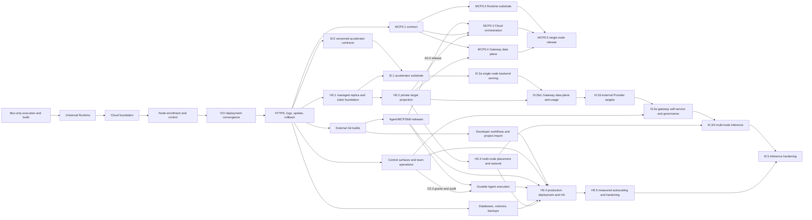

# A3S Cloud Development Plan

## 1. Delivery objective

The first usable release is one verified vertical slice:

```text
enroll one Linux node
  -> deploy one digest-pinned OCI image
  -> observe a real health check
  -> activate an HTTPS route
  -> stream ordered logs
  -> update and roll back to the previous healthy revision
```

The plan is gate-driven rather than date-driven. A milestone is complete only
when its exit evidence passes against real dependencies. Later milestones do
not compensate for an unproven Runtime contract, lost-operation recovery, or a
mock-only deployment path.

The root [product roadmap](../ROADMAP.md) publishes the complete Cloud
portfolio, current gate status, dependencies, and the boundary between the
Cloud control plane and Gateway data plane. This document owns detailed
implementation order, exit criteria, and evidence. It reuses the roadmap
boundary without creating a second Gateway control loop.

The roadmap has four delivery horizons:

| Horizon | Required gates | Product outcome |
| --- | --- | --- |
| Usable service platform | `BX0` plus `R0` through `E0` | One operator can deploy, reach, observe, update, and roll back one Box-hosted stateless Service on one Linux node |
| Developer platform | `G0`, `P0`, `C0`, and `A0` | Source-to-release workflows, previews, multi-service import, stable automation surfaces, and A3S asset releases use the same deployment path |
| Hosted MCP platform | `A0.3`, `MCP0.1` through `MCP0.5`, and their named `BX0`/`H0` foundations | One immutable modern MCP release runs as a Box-hosted Runtime Service and is reached through a conforming, authorized Gateway data plane |
| Agent execution platform | `A0`, `A1`, and the relevant `C0` grants and audit gates | Immutable Agent releases become durable, resumable, approval-governed executions with replayable trajectories |
| Stateful production platform | `S0` and `H0` | Stateful resources, verified recovery, multi-node placement, high availability, and measured scaling are production-operable |

These horizons are cumulative. A broader interface or import format never
creates a second orchestration path and never weakens an earlier durability,
security, or recovery gate.

Inference is an optional product profile over the same platform, not another
deployment engine. When enabled, A3S Power is its required local serving
boundary and runs through A3S Box. Its single-node accelerator and model-serving
gates begin after the Box re-certification of E0; its multi-node replica and
distributed-serving gates consume H0's generic replica, placement, target-set,
networking, and HA primitives. The detailed I0 design is maintained in
[`inference-plan.md`](inference-plan.md).

## 2. Engineering rules

- Implement vertical behavior through domain, application, infrastructure,
  transport, web UI, documentation, and tests in the same milestone.
- Write aggregate and protocol tests before the implementation they constrain.
- Keep the repository root as orchestration only. The Rust workspace lives at
  `apps/cloud/Cargo.toml`.
- Commit changes in external crate submodules separately from the root pointer
  update. Never mix an A3S Runtime release with unrelated Cloud code.
- Pin A3S dependency revisions and keep one app-local `Cargo.lock`.
- Put every external middleware behind a typed application port and test its
  real provider; backend names never enter domain decisions.
- Compose the shared A3S Box Runtime driver directly. Do not add another Box
  lifecycle adapter, provider selector, or Docker-compatible fallback.
- Compile local inference only to the A3S Power Service contract. An engine
  used inside Power never becomes a Cloud backend, scheduler, or control path.
- Do not mark an integration complete with an in-memory repository, fake
  Runtime driver, fake Gateway acknowledgement, or mocked health response.
- Every long-running command is idempotent, cancellable, resumable after
  process death, and visible as one Operation timeline.
- REST, web, CLI, and MCP surfaces call the same application commands and
  queries. No interface owns business rules or bypasses tenant guards.
- External project formats such as Git repositories and Compose files are
  immutable inputs. Cloud normalizes them into versioned typed desired state;
  they never become a second mutable source of truth.
- Detected configuration is a reviewable proposal. Accepted build, deployment,
  route, and storage plans are explicit and digest-addressed.
- A provider-backed capability remains unavailable until its real conformance,
  failure, cleanup, and recovery gates pass. Unsupported input fails explicitly
  instead of degrading silently.
- Documentation describes shipped behavior only; planned behavior stays marked
  as planned.

## 3. Critical path


```mermaid
flowchart LR
    BX0[Box-only execution and build] --> R0[Universal Runtime]
    R0 --> F0[Cloud foundation]
    F0 --> N0[Node enrollment and control]
    N0 --> D0[OCI deployment convergence]
    D0 --> E0[HTTPS, logs, update, rollback]
    E0 --> G0[External Git builds]
    E0 --> C0[Control surfaces and team operations]
    G0 --> P0[Developer workflows and project import]
    G0 --> A0[Agent/MCP/Skill releases]
    E0 --> MCP01[MCP0.1 contract]
    A0 -->|A0.3 release| MCP03[MCP0.3 Cloud orchestration]
    MCP01 --> MCP02[MCP0.2 Runtime substrate]
    MCP01 --> MCP03
    MCP01 --> MCP04[MCP0.4 Gateway data plane]
    H02 --> MCP03
    H02 --> MCP04
    MCP02 --> MCP05[MCP0.5 single-node release]
    MCP03 --> MCP05
    MCP04 --> MCP05
    A0 --> A1[Durable Agent execution]
    C0 -->|C0.3 grants and audit| A1
    E0 --> S0[Databases, volumes, backups]
    E0 --> I00[I0.0 versioned accelerator contracts]
    E0 --> H01[H0.1 managed replica and claim foundation]
    I00 --> I01[I0.1 accelerator substrate]
    H01 --> I01
    I01 --> I02A[I0.2a single-node backend serving]
    H01 --> H02[H0.2 private target projection]
    I02A --> I02BC[I0.2b/c Gateway data plane and usage]
    H02 --> I02BC
    I02BC --> I02D[I0.2d external Provider targets]
    I02D --> I02E[I0.2e gateway self-service and governance]
    C0 --> I02E
    H02 --> H03[H0.3 multi-node placement and network]
    I02E --> I034[I0.3/4 multi-node inference]
    H03 --> I034
    P0 --> H04[H0.4 production deployment and HA]
    C0 --> H04
    A0 --> H04
    A1 --> H04
    S0 --> H04
    H03 --> H04
    H04 --> H05[H0.5 measured autoscaling and hardening]
    I034 --> I05[I0.5 inference hardening]
    H05 --> I05
```

The first behavioral release gate is `E0`; its prior provider evidence is now
historical until `BX0` re-certifies it on A3S Box. Source delivery (`G0`),
stable control surfaces (`C0`), and stateful foundations (`S0`) may advance as
independent lanes. Project import (`P0`) depends on the immutable source and
build contracts from G0. Hosted assets (`A0`) reuse the same source-to-artifact
path. `A1.0` has consolidated existing sequence streaming, immutable object
storage, and durable node-agent delivery primitives; user-visible
`A1.1` work starts only after `A0.3` supplies a published immutable release,
`A1.2` consumes `A0.4` Agent deployment, and `A1.3` consumes `A0.5` bindings.
The approval slice consumes `C0.3` grants and audit. Production multi-node work
(`H0`) starts only after the product surfaces it must scale have passed their
single-node gates.

`MCP0.1` is contract work and may begin from the E0 model. Its implementation
does not become available until `A0.3` provides an immutable release,
Runtime/Box close `MCP0.2`, Cloud closes `MCP0.3`, Gateway closes `MCP0.4`, and
their exact revisions pass `MCP0.5`. `MCP0.6` then consumes the multi-node and
grant/audit foundations rather than inventing MCP-specific controllers.

H0 is delivered through the numbered sub-gates below. H0.1 through H0.3 may be
proved against an owning profile after that profile's single-node gate. I0 uses
that rule to exercise inference-neutral replica, claim, target-set, placement,
and network primitives. This does not mark the broader H0 milestone complete
for P0, C0, A0, A1, S0, production packaging, control-plane HA, or autoscaling.

### 3.1 Verified delivery status

Status as of 2026-07-30:

| Gate | State | Release evidence |
| --- | --- | --- |
| BX0 | In progress | `BX0.1` and the complete `BX0.2` lifecycle, recovery, hard-resource Claim, cancellation, and abnormal-interruption cleanup path are verified on the exact Runtime/Box pair. `BX0.3` now has Runtime-owned typed Service TCP endpoints, Box-owned generation-fenced forwarding and HTTP/TCP/command probes, one stateless Cloud-to-Gateway origin adapter, and one real Cloud health consumer gate across Node Agent journal replay and fresh inspection. Secrets, mounts, outputs, credentials, isolation, builds, and the clean-host loop keep `BX0.3` through `BX0.5` open in A3S-Lab/Cloud#85 and A3S-Lab/Box#172 |
| PW0 | Planned | ACL-native Power and Box MicroVM/TEE integration is tracked by A3S-Lab/Power#3; no Cloud inference capability is claimed yet |
| R0 | Historical | General Task and Service behavior passed against the retired provider; Box conformance is required |
| F0 | Verified | Isolated PostgreSQL migrations, tenancy, idempotency, Flow recovery, and local/NATS outbox gates pass |
| N0 | Historical | Outbound mTLS protocol, durable command journal, replay, provider reattachment, and lost-provider recovery passed against the retired provider; Box re-certification is required |
| D0 | Historical | Digest-pinned apply and health, restart recovery, failed-update retention, cancellation cleanup, and registry resolution passed against the retired provider; Box re-certification is required |
| E0 | Historical | Route, Gateway, Secret, log, update, rollback, Web, and crash-boundary behaviors passed against the retired provider; the complete clean-host loop must be reproduced without Docker or a compatible daemon |
| G0 | In progress | Exact source, isolated Runtime build, content-addressed BuildKit cache validation and worker-pruned retry reuse, complete OCI validation, authenticated digest-only publication, remote graph verification, replay/cancellation adoption, deterministic SPDX/SLSA generation, locally verified Ed25519 DSSE signing through persistent local or Vault Transit providers, durable evidence restoration, evidence API/web download, explicit deployment through `cloud.deployment@3`, periodic provider revalidation, and BuildRun status/cancellation/retry/log controls are implemented. The manual private-GitHub and external Registry/Vault gate now includes PostgreSQL 17, rootless BuildKit, and real process death after publication and evidence persistence. A local real-provider rehearsal passes, but no operator-owned run is recorded because the repository has no G0 provider secrets; external certification still blocks G0 verification |
| C0 | In progress | `C0.1` and `C0.2` are verified. One typed TypeScript client is shared by Web and the standalone CLI. Validated envelopes, bounded transport failures, environment-only token handling, safe URL/context resolution, table/JSON output, stable exit codes, tenant and operational reads, signed evidence, paged logs, explicit idempotent operational mutations, Cloud-admitted A3S ACL Workload create/update/source deployment, core tenant creation, version-checked node transitions, public administrative diagnostics, replay-aware DomainClaim/Gateway-scope/Route mutation parity, Source revision/GitHub connection/repository-subscription parity, stdin-only Secret metadata/version lifecycle parity, stdin-only API-token metadata/lifecycle parity, stdin-only checksum-verified node bootstrap, organization-scoped authorized search, and the versioned OpenAPI compatibility/deprecation gate pass focused tests. A real PostgreSQL gate proves raw REST, the Web client import, and the compiled CLI preserve replay, errors, tenant denial, revocation, digest-only A3S ORM persistence, and credential-free evidence. `C0.2` adds a sessionless `2025-06-18` initialization-based Streamable HTTP management MCP, per-request token/scope discovery, core Project/Environment/search tools, ten operational Node/Operation/Workload/Deployment/Route/BuildRun queries, bounded paged Workload/BuildRun logs, signed BuildRun evidence, five replay-safe operational commands, cross-surface idempotency, tenant-context derivation, and immediate revocation. Its dedicated real PostgreSQL gate proves exact 23-tool administrator and 16-tool read-only catalogs, strict arguments and annotations, operational query and command dispatch, hidden-mutation zero-write, Project and Workload replay, foreign-resource non-disclosure, next-request revocation, expected A3S ORM state, and credential-free evidence. `C0.2m` modern-protocol migration, `C0.3`, and `C0.4` remain planned. |
| A0 | In progress | `A0.1` is verified. Exact Agent/MCP/Skill Asset and AssetRelease aggregates, tenant-scoped migration 051, typed A3S ORM transactions, shared idempotency and Outbox, optimistic concurrency, immutable published identities, yanked addressability, and cross-tenant denial pass isolated real PostgreSQL tests. The first `A0.2` slice adds a tenant-qualified local bare-repository foundation with atomic provisioning, immutable identity checks, and the shared Git runner. Smart HTTP authorization, PostgreSQL leases and quotas, backup/restore, pinned `.a3s/asset.acl` admission, publication, deployment, Skill binding, and catalog surfaces remain. |
| MCP0 | In progress; unavailable | Closed cross-repository contracts, Runtime profile/generation fencing, Cloud canonical immutable profile ACL plus typed release-binding persistence and Runtime/Gateway compilers, and Gateway request/auth/single-dispatch/JSON-SSE foundations pass focused tests. Cloud route-policy/Workload binding and real PostgreSQL evidence, real Box/Linux, reconciliation, reload/drain/telemetry, and joint conformance remain open |
| H0.1 | Historical | Claim fencing, conflicting-capacity rejection, higher-generation release, Agent process death, and residue behavior passed against the retired provider; Box process/VM-loss re-certification is required |
| H0.2 | Historical | PostgreSQL/Gateway projection behavior passed, but the joint release gate must be repeated with Box-hosted upstreams on exact revisions |

E0 defines the first usable-service MVP. The prior evidence supplies complete
historical regression coverage, but the Box-only release remains blocked until
`BX0` reproduces that single-node loop.

### 3.2 Capability ownership

Cloud does not pursue feature parity by adding unrelated subsystems to the
control plane. Each broader platform capability has one milestone and one
authoritative model:

| Capability | Owning gate | Planning decision |
| --- | --- | --- |
| Local execution and image build | `BX0` | A3S Box is the sole provider; no Docker-compatible fallback, socket, fixture, or lifecycle implementation remains |
| Prebuilt OCI deployment | `D0` | Verified; remains the common deployment path |
| HTTPS, logs, update, and rollback | `E0` | Verified first release; later milestones reuse this path without weakening it |
| Workload and provider secrets | `E0` | Store encrypted values behind tenant-scoped references; never persist or project plaintext |
| Logs, metrics, traces, and alerts | `E0`/`C0`/`H0` | Establish truthful single-node signals first, then notifications, SLOs, and measured scaling |
| External Git and reproducible builds | `G0` | Explicit recipes first; automatic detection builds on the proven contract |
| Stack detection, previews, monorepos, and Compose import | `P0` | Normalize into Workload, Route, and later Volume resources; no second orchestrator |
| Web, worker, and scheduled Task profiles | `P0` | Compile explicit product profiles into the common Runtime Service or Task contracts |
| CLI, management MCP, collaboration, notifications, and audited exec | `C0` | Reuse public commands, queries, scopes, idempotency, and audit |
| Agent, MCP, and Skill releases | `A0` | A3S-specific immutable catalog over the common source, build, and publication path |
| Hosted modern MCP Service deployment and traffic | `MCP0` | Compile one immutable MCP release through Workloads/Runtime and one complete Gateway policy; no second scheduler, endpoint registry, or request-path Cloud call |
| Agent conversations, executions, approvals, checkpoints, forks, and trajectories | `A1` | Cloud-owned semantic execution history over A0 releases, Operations/Flow, Fleet node control, Workloads, Runtime, and shared streaming; no second controller or data plane |
| Databases, volumes, and backups | `S0` | Model state explicitly with fencing and verified restore |
| Replicas, multi-node placement, HA, and autoscaling | `H0` | Scale only measured, recovery-proven semantics |
| Generic accelerator inventory, claims, and enforcement | `I0.0`/`I0.1` with `H0` placement ownership | Extend Runtime, Fleet, and Workloads without introducing model or backend semantics into their core contracts |
| Model catalog, inference deployment, model routes, and usage | `I0` | Add a separate Inference bounded context that compiles the required A3S Power profile into Box-hosted managed Workloads and Edge target sets |
| Enterprise inference-gateway self-service and governance | `C0` + `I0.2d`/`I0.2e` | C0 owns principals, grants, role-focused navigation, authorized search, and project attribution; I0 owns provider certification, model/key self-service, route diagnostics, API exploration, and usage showback |
| Edge caching and transport optimization | `E0`/`H0` | A3S Gateway owns HTTP, TLS, compression, and cache mechanics; Cloud owns desired policy |
| Mail hosting, native desktop, and commercial billing | Outside core | Use integrations or separately owned products; do not couple them to workload orchestration |

### 3.3 Milestone BX0: sole A3S Box provider

#### Goal

Remove every Docker/Bollard/runtime-socket dependency from Cloud and certify
the existing product behavior through the shared A3S Box Runtime driver. This
is a provider migration, not a new scheduler, lifecycle contract, node channel,
build controller, state store, or object store.

#### Work

1. `BX0.1`: align the exact Box and Runtime revisions, configure one `box`
   provider through closed A3S ACL, compose the shared driver in the Node Agent,
   and remove provider selection and fallback.
2. `BX0.2`: pass digest-pinned Task and Service apply, inspect, health-neutral
   lifecycle, generation recovery, logs, exec, CPU/memory/PID/time bounds,
   cancellation, stop, remove, and residue cleanup.
3. `BX0.3`: pass private networking and endpoint evidence, HTTP/TCP/command
   health, Secret materialization, Artifact/Volume/tmpfs mounts, Task outputs,
   registry credentials, allocation evidence, and Box Sandbox/MicroVM/TEE
   isolation without silent downgrade.
4. `BX0.4`: replace the BuildKit/Docker-oriented source-build implementation
   with the typed Box build boundary and immutable ACL build plans. Preserve
   complete OCI graph validation, trusted content-addressed cache identity,
   publication, SPDX/SLSA evidence, signing, replay, cancellation, and cleanup.
5. `BX0.5`: port provider, consumer, source-build, Claim, Gateway, and clean-host
   gates; remove Bollard, Docker source/configuration/environment variables,
   daemon sockets, fixtures, workflows, and stale docs; add a zero-Docker
   architecture test covering source, tests, examples, scripts, and workflows.

The Node Agent is still the authenticated remote boundary. Box is node-local.
Runtime owns provider-neutral lifecycle semantics; Box owns execution, images,
networks, mounts, logs, snapshots, isolation, builds, and cleanup. All
relational state remains in PostgreSQL through A3S ORM.

The verified deployment-cancellation slice reuses `cloud.deployment@3`, the
Fleet command lease, the Node Agent journal, the shared Box Runtime driver, and
the existing resource Claim state machine. Its
[real-provider gate](https://github.com/A3S-Lab/Cloud/actions/runs/30429412890)
omits `port` and `health` from the Service template, projects
`NetworkMode::None` with no Runtime probe, and proves
`RuntimeRemove -> ResourceClaimRelease -> Cancelled` with empty Box state.
The
[final interruption gate](https://github.com/A3S-Lab/Cloud/actions/runs/30456965598)
kills the Agent after Box removal and proves a reconstructed Agent and Flow
adopt the exact receipt, keep capacity held until acknowledgement, release the
Claim once, and finish cancellation without provider residue. This completes
`BX0.2`; networking and health are owned by `BX0.3`.

The first `BX0.3` slice has landed through
[Runtime PR #8](https://github.com/A3S-Lab/Runtime/pull/8),
[Box PR #185](https://github.com/A3S-Lab/Box/pull/185), and
[Cloud PR #95](https://github.com/A3S-Lab/Cloud/pull/95). A3S Runtime owns the
typed endpoint observation; Box owns loopback forwarding through its existing
generation-fenced execution connector; and Cloud consumes that type directly
for Gateway target compilation. Cloud has no product-specific endpoint evidence
encoding. One stateless Edge adapter accepts only a typed TCP endpoint and
produces the canonical HTTP origin expected by Gateway. The dedicated Linux
gate starts a real Box Service, proves the observation remains stable across
inspection, sends HTTP through the compiled origin, removes the Service, and
requires the listener to close. It starts no Box CLI forwarder and introduces
no endpoint registry, forwarding daemon, Runtime driver, or lifecycle store.

The second `BX0.3` slice pins
[Box PR #186](https://github.com/A3S-Lab/Box/pull/186). Box's shared Runtime
driver advertises and provider-certifies HTTP, TCP, and command probes through
the existing generation-fenced port and exec boundaries. Cloud keeps its one
existing health mechanism: the A3S ACL Workload compiler emits the HTTP Runtime
policy, the Node Agent journals the kind-neutral observation, and the existing
stateless Edge adapter consumes only the typed endpoint. The dedicated real
Box consumer gate requires `Healthy` at apply, reconstructs Runtime and the
Agent executor, replays the exact durable observation, requires a fresh healthy
inspection with unchanged Runtime identity, proves the replayed listener closes,
consumes the freshly published typed endpoint, sends HTTP through its compiled
Gateway origin, removes the Service, observes `NotFound`, and requires listener
closure. It adds no health worker, registry, scheduler, queue, Runtime driver,
endpoint authority, or lifecycle store.

The rest of `BX0.3` remains open: Secret materialization,
Artifact/Volume/tmpfs mounts, Task outputs, registry credentials, allocation
evidence, and complete Sandbox/MicroVM/TEE isolation certification.

#### Exit gate

On a clean supported Linux host with no Docker or compatible daemon, install
exact Cloud, Runtime, Box, Gateway, and Power revisions; enroll one outbound
node; build and publish an OCI Artifact; deploy, route, observe, update, roll
back, stop, and remove a Service; serve one bounded Power request with exact
generation-bound evidence; recover provider process/VM and Agent/control-plane
death at the named durable boundaries; and restore the preflight inventory with
no workload, Secret, credential, mount, network, volume, VM, image-build, or
temporary-file residue.

Provider-specific completion records in the milestone sections below describe
the retired implementation. They remain regression requirements, not current
release evidence, until the corresponding Box gate passes. `BX0.5` removes the
retired procedures after their behavior has been ported.

### 3.4 Milestone PW0.1: required A3S Power profile

#### Goal

Make A3S Power the sole local inference serving and attestation boundary. Power
runs as a digest-pinned ordinary Runtime Service inside A3S Box and never gains
its own scheduler, deployment controller, device allocator, route authority,
authorization authority, usage ledger, queue, or lifecycle store.

#### Work

- Replace Power's product configuration with closed A3S ACL parsed by
  `a3s-acl`; no compatibility parser or generated alternate configuration.
- Define one immutable typed Power Service profile for image, model, endpoint,
  resources, internal engine policy, TEE, attestation, health, graceful stop,
  logs, and exact endpoint discovery.
- Compile the profile through Inference into the existing Workloads, Flow,
  Fleet Claim, Runtime, Box, Edge/Gateway, Operations, and audit paths.
- Bind attestation and allocation evidence to the exact model, Power, Box,
  node, Claim, Runtime unit, and Service generation. Fail readiness on missing,
  stale, replayed, or invalid required evidence without leaking plaintext.
- Accept model/provider credentials only through immutable Secret references
  and typed Box materialization.

#### Exit gate

Deploy Power through Cloud onto Box, become healthy, serve bounded streaming
and non-streaming requests, update and roll back through the common Workload
path, and stop cleanly. Repeat across Power process death, Agent death, Box VM
loss, and required TEE/non-TEE profiles. Persist no prompt, response, Secret,
credential, or alternate configuration in PostgreSQL, ACL, Runtime specs, logs,
metrics, evidence, diagnostics, or Outbox facts.

## 4. Milestone R0: generalize A3S Runtime

### Goal

Replace the Bench-shaped core contract with a genuinely general Runtime
contract before Cloud depends on it.

### Work

1. Write a Runtime ADR and contract tests for Task and Service units.
2. Introduce versioned, provider-neutral types for unit spec, generation,
   process, artifact inputs, mounts, secret references, resources, networking,
   ports, health, restart, outputs, observation, logs, and failure.
3. Replace `submit/inspect/cancel` with idempotent
   `apply/inspect/stop/remove`; add capability-gated logs and exec surfaces.
4. Replace the closed capability booleans with structured supported-capability
   sets and a required-capability matcher.
5. Keep provider ID, factories, and the registry in Runtime, but move session,
   login-state, operator-precedence, default-Docker, and Bench capability
   selection policies to their owning callers.
6. Generalize the managed client and durable operation store around unit ID,
   request ID, generation, and canonical spec digest.
7. Export a provider conformance harness that exercises task and service
   lifecycle semantics with an injectable clock and fault points.
8. Move Candidate/Judge construction, artifact interpretation, privacy rules,
   and result validation into A3S Bench as a Task profile adapter.
9. Define a versioned migration policy for existing v1 records. Terminal v1
   records remain readable through Bench-owned legacy decoding; they are not
   silently rewritten as general Runtime records.
10. Update Runtime and Bench documentation together and publish a breaking
   pre-1.0 release only after all known consumers compile.

### Exit gate

- Runtime core source has no Candidate/Judge role enum or role-specific
  validation.
- Runtime core has no Bench support predicate, login-state policy, or implicit
  provider fallback.
- The same client runs one finite Task and one long-running Service.
- Exact duplicate apply reattaches; conflicting reuse and stale generation fail
  deterministically.
- Restarting the managed client preserves identity and reattaches without
  launching a duplicate provider resource.
- Capability mismatch fails before provider start.
- Stop and remove are idempotent and bounded; lost provider state is reported
  as unknown/not found rather than success.
- Bench profile tests still enforce protected evaluation semantics outside the
  Runtime core.
- `cargo fmt`, focused tests, Clippy, documentation checks, and the exported
  conformance suite pass in the Runtime repository.

## 5. Milestone F0: Cloud foundation

### Goal

Create the smallest app-local workspace and modular-monolith skeleton that can
commit and query tenant-scoped desired state.

### Work

- Create `contracts`, `control-plane`, and `node-agent` crates under
  `apps/cloud`, plus the React application under `web`.
- Bootstrap A3S Boot with API, worker, relay, and all-in-one process roles.
- Add validated `cloud.acl` configuration, environment-secret resolution,
  startup checks, structured logging, request IDs, health endpoints, and clean
  shutdown.
- Add a reproducible local infrastructure profile and readiness probes for
  PostgreSQL, the development object-store adapter, and optional NATS
  JetStream; keep every service disabled until a milestone needs it.
- Add A3S ORM PostgreSQL connectivity, locked migrations, transaction helpers,
  optimistic aggregate versions, idempotency records, transactional outbox,
  and audit tables.
- Implement Identity and Projects aggregates, repositories, commands, queries,
  tenant guards, API tokens, and the shared API response/error interceptors.
- Integrate A3S Flow with a separate PostgreSQL schema and add an idempotent
  operation starter plus projection rebuilder.
- Add the first web shell: sign-in, organization/project/environment selection,
  operation drawer, and reconnecting SSE client.

### Exit gate

- A real PostgreSQL test creates an organization, project, and environment and
  rejects every cross-tenant reference exercised by the suite.
- Reusing an idempotency key with identical input returns the same result;
  different input returns a documented conflict.
- Killing the process after aggregate commit but before Flow start is repaired
  by reconciliation with exactly one run.
- Killing the outbox relay before or after publish produces one logical event
  at a deduplicating consumer and never loses the row.
- The same outbox consumer contract passes with the local A3S Event provider
  and a real NATS JetStream provider.
- API success and documented error responses match the repository contract.
- Migration apply, checksum mismatch, rollback-on-failure, and concurrent
  startup are tested against PostgreSQL.

## 6. Milestone N0: node enrollment and outbound control

### Goal

Enroll one real Linux node and establish a durable, replay-safe control path to
its general Runtime provider.

### Work

- Implement Fleet domain entities, one-time enrollment tokens, certificate
  issuance/rotation/revocation, node capabilities, ready/drain state, and
  heartbeat-derived offline projection.
- Implement typed certificate-authority and key-encryption ports, a safe local
  development provider, and at least one production integration using
  OpenBao/Vault, step-ca, or a cloud KMS/PKI.
- Implement the versioned node protocol in `contracts`; do not share database
  rows or domain entities over the wire.
- Implement bounded mTLS long polling, command leasing, durable acknowledgement,
  observation batches, log chunks, and Gateway acknowledgements.
- Implement the node command journal and provider-label reconstruction.
- Implement the first Docker `RuntimeDriver` in the node agent without leaking
  Docker fields into the Runtime contract.
- Run the Runtime provider conformance harness against a real Docker daemon.
- Add a deterministic node simulator for protocol fault injection; retain the
  real Docker test as the release gate.

### Exit gate

- A token can enroll only once; a revoked or expired certificate cannot lease
  commands; rotation does not change node identity.
- Production configuration rejects a plaintext environment master key and a CA
  root stored in the control-plane database.
- An exact redelivered command returns the durable prior outcome. Regressed
  generation, payload conflict, wrong node, and expired command fail closed.
- Restarting the agent after Docker create but before acknowledgement discovers
  the same provider resource and does not create another container.
- Offline is derived by the server after heartbeat expiry and does not rewrite
  the node's last observation.
- The Task and Service Runtime conformance suites pass on real Linux/Docker.

## 7. Milestone D0: digest-pinned OCI deployment

**Status:** Verified on 2026-07-15.

### Goal

Converge one stateless Service workload on the enrolled node without public
routing yet.

### Work

- Implement Workload, WorkloadRevision, and Deployment aggregates plus source
  resolution for an OCI repository and digest.
- Add a one-node capability-aware scheduler and an explicit no-eligible-node
  result.
- Implement the deployment Flow: resolve, schedule, dispatch, observe, verify,
  activate, and cleanup.
- Project the immutable workload revision into a Service `RuntimeUnitSpec`.
- Implement actual container health checks, observed-generation projection,
  periodic reconciliation, stop, cancel, and failed-update retention.
- Add workload and deployment pages that separately display desired revision,
  observed Runtime state, health, node, and operation progress.

### Exit gate

- Mutable tags are resolved once; Runtime receives and provider labels record
  the OCI digest.
- A real HTTP fixture becomes active only after its health check succeeds.
- A permanently unhealthy revision fails without replacing the prior active
  revision.
- Duplicate deploy requests, Flow replay, control-plane restart, agent restart,
  lost observation, and expired command lease converge to one provider unit.
- Cancellation reaches a terminal Operation state and leaves no untracked
  active child command. Deferred cleanup is visible and reconciled.

## 8. Milestone E0: HTTPS, logs, update, and rollback

**Status:** Verified on 2026-07-20.

### Goal

Complete the first user-visible release loop.

### Work

- Implemented: Edge route and Gateway publication records, hostname/path
  ownership, versioned complete snapshot generation, and closed route APIs.
- Implemented: healthy immutable target resolution from the exact deployment
  command's typed Runtime endpoint evidence, durable revision/unit/generation
  binding, Fleet command dispatch, stable correlation across retries, and
  exact-revision acknowledgement projection.
- Implemented: node-local A3S Gateway native snapshot application,
  identity/revision/digest/expiry/readiness verification, durable
  acknowledgement ordering, and the real route-bearing router/service ACL gate
  against the repository-pinned Gateway revision.
- Implemented: tenant-scoped exact and one-label wildcard claims, deterministic
  development proof verification, closed certificate policy, TLS 1.2 snapshot
  compilation, public certificate persistence, sanitized failure projection,
  and a separate local Gateway CA.
- Implemented: authenticated CSR signing, replay binding, node-local `0600`
  private keys, full chain/identity/key verification, atomic chain storage
  before native Gateway apply, and a dedicated real HTTPS fixture for the
  repository-pinned Gateway revision.
- Implemented: the production security profile performs bounded TXT ownership
  verification through the host's asynchronous system DNS resolver, fails
  startup closed without resolver configuration, sanitizes provider failures,
  and leaves absent or stale proofs pending and retryable.
- Implemented: production selects a dedicated Vault Gateway PKI provider,
  mount, and role, sends only the node-generated CSR and desired server
  identity, validates the returned leaf/serial/validity/CA bundle, and revokes
  by the provider serial through the bounded shared Vault client. Temporary
  transport, rate-limit, and server failures leave the same persisted CSR
  retryable.
- Implemented: an injected-time Gateway certificate reconciler redispatches
  pending commands, renews within the configured window, filters revoked
  claims into a separately persisted convergence record, preserves active
  routes and the old certificate until an exact applied acknowledgement, emits
  a certificate-free management snapshot when no verified routes remain, and
  retries provider serial revocation only after old material is uninstalled
  and unreferenced.
- Implemented: tenant-scoped Secret identities, immutable encrypted versions,
  local AES-GCM and Vault Transit providers, create/rotate/version-revoke REST
  commands, metadata-only queries and events, and idempotency records that
  persist only Secret ID/version references.
- Implemented: exact active Secret-version bindings in immutable workload
  environment/file/registry-credential targets, reference-only Runtime and
  Fleet projection, transient control-plane materialization for challenged
  Basic/Bearer manifest resolution, assigned-node authorization over the
  existing mTLS control channel, late Docker environment injection or Linux
  tmpfs-backed read-only file mounts, and authenticated pulls whose registry
  address comes from the digest-pinned artifact.
- Implemented: a dedicated Linux/PostgreSQL/Docker gate invokes the production
  assigned-node authorization and decryption handler, injects the active
  version into a real environment variable and `0400` tmpfs-backed file,
  verifies equal material without embedding it in Runtime state, and proves
  stdout/stderr are redacted before durable filesystem/PostgreSQL persistence
  and REST readback. The gate reconstructs the log adapters and handler and
  verifies exact batch replay.
- Implemented: the dedicated Linux gate provisions an authenticated private
  registry, rejects anonymous access, resolves its digest through the
  production control-plane resolver, removes the cached image, resolves the
  separate encrypted credential again only at Docker pull, and scans desired
  state, Runtime/Fleet state, Flow history, events, logs, audit, and API
  responses for both plaintext Secrets.
- Implemented: a worker consumes only committed `secret.version.created`
  events, advances matching bindings on active running workloads in a new
  resolved revision while preserving the pinned artifact, defers competing
  deployments, and atomically records the deployment operation, causal event,
  and unique restart/checkpoint rows. The PostgreSQL gate races reconstructed
  workers after the version commit, proves one Runtime command and terminal
  operation across a second Flow reconstruction, and scans desired state,
  Runtime/Fleet state, Flow history, restart/checkpoint rows, events, logs,
  audit, API responses, and revision digests for plaintext.
- Implemented: the isolated Cloud consumer gate pauses a child after the real
  rotated Docker apply creates a healthy container but before its Runtime
  receipt completes, verifies the pending receipt and exact provider identity,
  restarts the labeled Docker provider, kills the child agent, and reconstructs
  Runtime to reattach the same container and complete and replay the exact
  receipt. It then verifies `0400` Secret material, log redaction, durable-state
  plaintext exclusion, and complete container/tmpfs cleanup.
- Implemented scope: the clean-host gate reaches ordinary HTTPS only after the
  exact acknowledged Gateway revision, while the authenticated log path proves
  bounded cursor-resumed SSE. Generic streaming-response and WebSocket proxy
  mechanics remain A3S Gateway transport conformance and do not create a
  separate Cloud desired-state feature. Advanced caching and transport tuning
  remain outside E0.
- Implemented: successful Runtime apply/remove outcomes project restart-safe
  active log targets from the command journal. A separate retrying node loop
  persists one bounded pending batch before upload, replays the exact batch
  after restart, and advances each cursor only after a validated receipt.
  ACL-only settings close a batch at 256 chunk/gap records and 16 MiB.
- Implemented: Docker log reads resolve every bound immutable Secret, fail
  closed on authorization or materialization failure, redact exact overlapping
  values, and zeroize the temporary raw text buffer before returning chunks.
- Implemented: the control plane keeps ordered log metadata in PostgreSQL,
  writes immutable checksummed objects through typed filesystem or
  S3-compatible adapters, verifies objects on read, and exposes
  tenant-authorized cursor pages with stdout/stderr filtering and explicit
  missing/corrupt gap records.
- Implemented: validated control-plane ACL configures receipt-age retention,
  polling, and bounded scan size. The `all` and `worker` roles delete objects
  before compare-and-setting durable `retained_at` tombstones, retry
  interrupted deletion or metadata commits, preserve sequence zero, and return
  explicit `retained` gaps without reading deleted objects. Persisted batch
  replay is checked before object writes so it cannot recreate a retained body.
- Implemented: production configuration selects an HTTPS S3-compatible adapter
  whose conditional create, exact immutable replay, verified read, idempotent
  deletion, and readiness lifecycle share the filesystem semantics. Credentials
  come only from named environment variables, and a dedicated CI job provisions
  digest-pinned MinIO and a disposable bucket for the real lifecycle gate.
- Implemented: independent ACL policy bounds tombstone retention, compaction
  polling, and transaction size. The `all` and `worker` roles atomically delete
  old per-chunk tombstones and batch memberships, write and coalesce durable
  sequence ranges, preserve exact batch-header replay and sequence watermarks,
  and return explicit `compacted` gaps even under stream filtering.
- Implemented: Runtime exposes typed permanent cursor-loss/source-disconnect
  boundaries separately from retryable transport failure. Docker returns exact
  identities, the node persists/replays provider gaps and monotonically rebases
  replacement chunks, PostgreSQL atomically stores gap membership and sequence
  watermarks, and snapshot pages expose provider gaps under every stream filter.
- Implemented: the authorized live-log SSE endpoint polls at most 16 ordered
  records, caps encoded events at 8 MiB, resumes from `Last-Event-ID`, and
  terminates on authoritative-query failure. The web console reconnects with
  bounded backoff, retains 500 deduplicated records, filters stdout/stderr, and
  preserves provider and compaction gaps.
- Implemented: the real Linux/PostgreSQL/Docker gate reads sanitized provider
  stdout/stderr, persists immutable filesystem objects and PostgreSQL metadata,
  reconstructs the persistence boundary for exact batch replay, scans durable
  objects for the bound plaintext, and reads the records through the REST API.
- Implemented: real Docker recovery preserves and resumes an exact log cursor
  across isolated provider restart. The PostgreSQL gate kills a child control
  plane after a synced immutable object write but before receipt persistence,
  verifies zero batch metadata, reconstructs the handler, adopts the exact
  orphan without duplication, corrupts a non-secret real Docker record, and
  requires its ordered REST position to become a `corrupt` gap. The pinned
  MinIO gate independently overwrites a real object and requires verified reads
  plus immutable repair rejection.
- Deferred to C0/H0 production operations: export metrics and traces through
  OpenTelemetry and publish Prometheus-compatible service/node/operation
  dashboards. E0 exposes structured correlation, durable observations, logs,
  health, and Operation timelines but does not claim a production telemetry
  backend.
- Implemented: `POST
  /organizations/{organization_id}/workloads/{workload_id}/deployments`
  commits a complete immutable replacement template and a
  `cloud.deployment@3` operation. Versions 1 and 2 remain executable only for
  persisted-run replay. A workload permits one nonterminal deployment, the
  candidate stays on the previous Runtime node, cancellation closes at
  `verifying`, and health must converge before any routed cutover is staged.
- Implemented: routed updates preserve the old route rows and active revision
  through unhealthy candidates, mismatched acknowledgements, and rejected
  reloads. A candidate must use a different immutable revision, a strictly
  newer Runtime generation, its deterministic Runtime unit, the unchanged
  declared port, and the exact deployment command's healthy observation. Only
  the exact node, command, Gateway revision, and snapshot digest
  acknowledgement atomically replaces every target field. The candidate then
  enters `retiring`; a deterministic stop command targets the previous Runtime
  revision, and durable stopped-or-absent evidence completes the operation.
  Reconciliation adopts staged cutovers and retirement commands after
  coordinator recovery.
- Implemented: the PostgreSQL recovery gate holds retirement command access
  closed while a child Flow process durably activates the candidate into
  `retiring`, proves no cleanup command committed, and sends `SIGKILL`. A
  reconstructed coordinator replays activation, dispatches one deterministic
  previous-revision stop, and completes only from stopped-or-absent evidence.
  The probe passes in both the Linux Secret/log job and the isolated real-Docker
  Cloud consumer suite.
- Implemented: `POST
  /api/v1/organizations/{organization_id}/workloads/{workload_id}/rollback`
  accepts only an older, successfully activated revision of the same active
  running workload. It clones the exact resolved template into the next
  generation, revalidates Secret bindings, records
  `rollbackSourceRevisionId`, and uses the same `cloud.deployment@3` health,
  Gateway cutover, activation, and retirement path without reactivating the
  source revision ID.
- Implemented: the PostgreSQL API gate verifies the persisted clone, operation
  lineage, atomic idempotency record, and replay after the workload stops; the
  routed suite verifies exact Gateway acknowledgement and C retirement; the
  isolated Docker A→failed B→distinct C→cloned A scenario verifies real apply,
  health, selection, and deterministic retirement of C.
- Implemented: workload queries expose complete immutable requested templates
  with reference-only Secret bindings, operation queries expose explicit
  rollback lineage, and the web console renders the deployment timeline plus
  route/certificate state, commits complete-template updates after field-level
  comparison, offers only eligible activated rollback sources, and dismisses
  terminal operations locally without deleting durable history.
- Implemented post-E0: the production SPA build is served from a private,
  fail-fast Rust service with history fallback, bounded content types, cache
  policy, path containment, security headers, and a product favicon. A3S
  repository-pinned Gateway revision validates the same-origin profile that
  routes exact `/api` paths to the control plane and everything else to the
  SPA. CI exercises the real built assets, deep-link fallback, headers, API
  isolation, process cleanup, and Gateway ACL validation; `just cloud`
  supervises the local API and hot-reloading web process from the monorepo
  root.

### Exit gate

- A real client reaches the fixture through A3S Gateway over TLS only after the
  exact desired Gateway revision is acknowledged.
- Unverified, expired, revoked, cross-tenant, and conflicting domain claims
  cannot receive an active route or certificate. Renewal under an injected
  clock preserves the prior valid certificate until the replacement is proven.
- Workload secret create, bind, rotate, revoke, restart, and authorization
  fixtures pass with encrypted PostgreSQL state and real Runtime injection;
  provider and agent death during the rotated apply reattach one exact resource
  and receipt, and plaintext scans of database rows, events, Flow history, logs,
  and API payloads find no secret value.
- A rejected, expired, mismatched, or not-ready Gateway apply cannot mark the
  route or deployment active.
- Losing the Gateway acknowledgement and restarting either process converges
  without duplicating or partially applying routes.
- Log reconnect resumes from the last cursor or, after an acknowledged typed
  provider gap, from the earliest available record with a monotonic delivery
  sequence and no unbounded buffering; secret fixtures never appear in logs or
  operation payloads.
- Provider cursor loss/source disconnect and deleting, corrupting, retaining, or
  compacting a log chunk create explicit ordered gaps; log bodies never enter
  PostgreSQL, NATS, or Flow history.
- Updating from image A to B and rolling back to A passes through real Runtime,
  health, and Gateway paths. Process death after candidate activation but before
  retirement dispatch reconstructs to one cleanup command and no false terminal
  success.
- The production management SPA opens through the Gateway origin, a direct
  client route returns the same entrypoint, hashed assets retain immutable
  cache headers, `/api` cannot fall through to HTML, and stopping the launcher
  leaves no API or web child process.
- The full scenario runs from a clean machine in CI and on a separately managed
  Linux host; screenshots or mocks are not release evidence.

## 9. Milestone G0: external Git builds

### Goal

Build a pinned external Git commit into a verifiable OCI artifact and deploy it
through the proven loop.

### Current implementation

The current independently testable G0 slices are implemented:

- A dedicated Sources bounded context accepts and lists tenant-, project-, and
  environment-scoped `ExternalSourceRevision` aggregates.
- GitHub repository locators fail closed unless they use exact HTTPS
  owner/repository syntax without user information, ports, queries, fragments,
  encoded path bytes, or extra path segments. Accepted locators normalize to
  one lowercase repository identity.
- Source revisions pin a full lowercase 40- or 64-hex Git object ID and a
  versioned `a3s.cloud.build-recipe.v1` Dockerfile recipe. Relative checkout
  paths, optional targets, and supported Linux platforms are validated and
  canonicalized before the recipe digest is calculated.
- HTTP idempotency, natural source-revision deduplication, the
  `source.revision.accepted` outbox fact, and PostgreSQL persistence commit in
  one transaction. A GitHub delivery ID is reserved against the immutable
  repository-plus-commit digest, so a changed delivery payload conflicts while
  later monorepo fan-out may still attach more than one recipe.
- The REST mutation requires `source:write`; list and mutation paths enforce
  the organization/project/environment hierarchy. Source revisions, events,
  and idempotency responses contain no credential value or reference.
- The mutation accepts a typed branch, tag, or full commit and resolves it
  through a provider-neutral source port. The GitHub adapter uses a
  fixed HTTPS origin, disables redirects, confirms the exact repository,
  requires an exact ref response, peels annotated tags with a bounded chain,
  and verifies the returned full commit.
- Closed A3S ACL configuration supplies an exact nonempty repository allowlist
  and a denylist with deny precedence. Policy is evaluated before provider
  access.
- The idempotency digest binds the mutable ref request, while replay is checked
  before provider access. A moved ref therefore cannot alter an accepted
  revision or trigger a second resolution for the same request.
- Unit/API tests cover policy, URL/ref confusion, annotated tags, provider
  identity mismatch, and moving-ref replay. A dedicated CI job resolves the
  real public `A3S-Lab/Cloud` branch and then confirms the pinned commit.
- Closed A3S ACL configuration can explicitly enable one GitHub App by slug,
  client ID, client-secret environment name, exact HTTPS callback, and a 1- to
  30-minute connection-state TTL. Disabled configuration requires every App
  field to be empty; shipped and release-gate ACL keeps the feature disabled.
- An organization-authorized `source:write` command begins one replaceable
  installation flow and the tenant query returns its completed connection.
  GitHub setup and OAuth callback routes are public provider callbacks with
  non-cacheable/no-referrer responses rather than bearer-token alternatives.
- Setup and OAuth use separate 32-byte random, expiring, single-use state
  values. PostgreSQL stores only SHA-256 digests. OAuth uses S256 PKCE; the
  verifier exists only in a short-lived secure, HTTP-only, same-site cookie
  while its digest is durable.
- The callback reads the client secret per attempt, exchanges the bounded code
  without redirects, calls `GET /user` and at most ten 100-entry pages of
  `GET /user/installations`, and accepts the setup installation ID only from
  that transient user-token intersection. Code, client secret, access/refresh
  tokens, verifier, and provider bodies are never durable.
- Completion atomically consumes the flow, stores numeric installation,
  account, and verifying-user identities, and emits
  `source.github-connection.created`. PostgreSQL enforces one connection per
  Cloud organization plus exclusive installation and account ownership across
  organizations.
- Domain/API tests cover expiry, stage/replay binding, tenant/scope checks,
  spoofed setup state, missing PKCE, rejected OAuth, duplicate ownership, and
  secretless responses. Local HTTP fixtures prove exact OAuth form/API headers,
  inaccessible installation rejection, body bounds, malformed responses, and
  secretless errors. The isolated PostgreSQL gate exercises prepare, complete,
  replay, uniqueness rollback, query, and outbox persistence.
- GitHub connections have explicit `active`, `suspended`,
  `verification_revoked`, `installation_deleted`, and `account_changed` state.
  Only `active` supplies authority. Current active/suspended installation,
  account, and organization uniqueness is enforced with partial indexes while
  terminal connection records remain durable history.
- A public `POST /api/v1/webhooks/github` provider boundary requires JSON and
  the GitHub event, delivery, and `X-Hub-Signature-256` headers. It bounds the
  body, reads a configured secret environment variable per request, and
  authenticates the exact raw bytes with canonical lowercase HMAC-SHA256 before
  interpreting provider data. Bearer authentication cannot bypass the proof.
- Deleted/non-branch pushes, unsupported lifecycle actions, and unrelated
  authenticated events are acknowledged without persistence. A branch push is
  reduced to typed provider, delivery, canonical repository, installation,
  branch, commit, payload-digest, and receipt-time fields; raw payload and
  secret material are never durable.
- The PostgreSQL provider inbox atomically replays the same delivery and exact
  payload while rejecting delivery-ID reuse with changed bytes or typed
  identity. Unit, API, and PostgreSQL integration tests cover signature
  authentication, payload bounds, ignored events, replay, and conflict.
- The signed ingress also accepts `installation` suspend/unsuspend/deleted,
  `installation_target` renamed, and `github_app_authorization` revoked. A
  separate lifecycle inbox stores only typed event/action, installation-or-user
  subject, exact-payload digest, and receipt time. Exact replay is a no-op and
  changed reuse conflicts without persisting the provider body.
- Same-identity suspension/unsuspension and rename preserve authority state and
  update the display login. Account ID/kind mismatch, installation deletion,
  and verifying-user authorization revocation fail closed to terminal states.
  Every changed connection advances its aggregate version and atomically emits
  `source.github-connection.reconciled`; terminal state cannot be reactivated
  by a webhook.
- A terminal organization must complete fresh installation and OAuth proof,
  producing a new connection ID while retaining the old record. Existing
  subscriptions remain bound to the prior ID. API projections expose status
  and update time so the loss of authority is operator-visible.
- A bounded worker signs an App JWT and calls
  `GET /app/installations/{installation_id}` for due active or suspended
  connections. A successful response repairs missed suspension, unsuspension,
  account-login, and numeric account-identity facts; `404` confirms installation
  deletion. Authentication, rate-limit, transport, and server failures remain
  retryable, while malformed or identity-confused responses fail closed as
  protocol errors.
- Provider authority health is durable: last successful check, last attempt,
  next attempt, bounded consecutive-failure count, and a closed generic error
  category. PostgreSQL selects bounded due batches and compare-and-sets the
  aggregate version with any lifecycle event in one transaction. Exponential
  retry is capped, concurrent workers lose safely, and only lifecycle/account
  changes emit `source.github-connection.reconciled`.
- Installation deletion or account-change webhooks schedule immediate provider
  confirmation. A delayed terminal fact can be repaired when GitHub still
  reports the original active or suspended installation; optimistic versions
  and current-connection uniqueness prevent that repair from changing a newly
  verified replacement connection.
- GitHub does not expose a tokenless current-user App-grant query. Cloud keeps
  user OAuth access and refresh tokens non-durable, so the signed
  `github_app_authorization.revoked` delivery remains authoritative for
  verifying-user revocation rather than introducing durable user credentials.
- Environment-owned `GithubRepositorySubscription` commands and queries bind
  the same organization's verified connection/installation to a canonical
  allowlisted repository, exact branch, and explicit recipe. PostgreSQL
  composite foreign keys enforce both connection ownership and the full
  organization/project/environment hierarchy. Active natural duplicates and
  HTTP idempotency return one identity.
- Subscription creation and explicit `active -> inactive` deactivation retain
  history and atomically emit
  `source.github-repository-subscription.created` and
  `source.github-repository-subscription.deactivated`. Neither API, durable
  state, idempotency response, nor event contains provider credentials or raw
  webhook payloads.
- Only a newly inserted provider delivery selects active bindings by exact
  connection, installation, repository, and branch. PostgreSQL joins and share
  locks the exact active connection, serializing fanout with lifecycle updates;
  stale lookup results and old bindings therefore create no revision. The
  authenticated delivery commit is never re-resolved. Inbox, tenant
  reservations, every matching immutable
  revision, and every `source.revision.accepted` fact commit in one transaction;
  exact replay does not re-fanout, unmatched delivery creates no revision, and
  outbox failure rolls back the inbox.
- Domain/API tests cover tenant scope, missing/cross-tenant connection and
  environment ownership, invalid repository/branch/recipe, natural and HTTP
  replay, changed delivery conflicts, installation/repository/branch mismatch,
  multi-recipe fanout, inactive exclusion, and secretless state. The isolated
  PostgreSQL gate covers schema ownership, active uniqueness, fanout replay,
  outbox atomic rollback, lifecycle, and secretless database/event state.
- Anonymous source resolution remains the first attempt. Only anonymous
  `Unavailable` may look up the same organization's verified connection, issue
  a newly signed GitHub App JWT, request one exact repository with
  `contents: read`, and retry with the returned short-lived Bearer credential.
  Public success, anonymous provider/protocol errors, missing or cross-tenant
  connection, and idempotency replay never issue a token.
- Before any private-repository credential is issued, a decorator requires the
  exact organization, connection, and installation identities, performs a fresh
  installation/account authority check, persists its outcome, and confirms the
  connection is still `active`. Provider uncertainty or terminal authority
  prevents the underlying issuer from running. The same path protects both
  authenticated ref resolution and Build Flow checkout.
- The App PEM key is read from its configured environment variable for every
  issuance. The provider response must confirm selected-repository scope and
  only read-only contents plus implicit metadata permission. Credential values
  are repository-bound, non-cloneable, non-serializable, zeroizing, strictly
  expiring, and redacted from `Debug`; issuance and authenticated-provider
  errors are collapsed before the API boundary.
- A provider-neutral checkout port accepts only the canonical repository, full
  accepted commit, and immutable checkout ID. The Git adapter uses a fresh
  bounded staging directory and isolated empty Git home, disables redirects,
  credential helpers, hooks, unsafe protocols, tags, and submodule recursion,
  and fetches the full object ID rather than a mutable ref.
- Checkout verifies the detached commit and tree, rejects unsupported modes,
  gitlinks, unsafe paths, and symlinks that escape the source root, removes
  `.git`, and atomically publishes a credential-free receipt containing the Git
  tree and deterministic SHA-256 filesystem digest. Replay recomputes the
  digest, conflicting source identity fails, and failed staging is removed.
- Unit tests cover moving-branch pinning, immutable replay, tampering, limits,
  gitlinks, and escaping symlinks. The public GitHub CI job also materializes
  the just-resolved commit and verifies metadata-free replay.
- Private HTTPS checkout supplies `x-access-token:TOKEN` only as a transient
  Basic header through Git's `--config-env=http.extraHeader`; credentials never
  enter repository URLs, arguments, receipts, or replay. A real local smart-HTTP
  Git backend proves exact header transport and credential-free replay. An
  ignored test composes real GitHub token issuance, authenticated resolution,
  checkout, and replay from operator-supplied environment values; no external
  private-repository pass is claimed because those credentials are unavailable.
- The Artifacts context owns a provider-neutral `IBuildService`. Its request
  binds an immutable build ID, absolute materialized source directory, checkout
  content digest, and accepted recipe without exposing BuildKit semantics to
  Sources or Runtime.
- One deterministic tenant-owned initial `BuildRun` is reserved for every
  accepted source revision. A failed or cancelled run may create one
  deterministic child attempt with a fresh BuildRun and Operation ID while
  preserving the exact source revision and parent lineage. Each aggregate
  records its attempt, parent, exact input, node/command, Runtime output,
  validated OCI result, immutable publication target, verified published
  artifact, cancellation/failure, cleanup, timestamps, and optimistic version.
  Repository saves accept only one aggregate-generated transition; exact
  replay changes no timestamp or version.
- Concurrent PostgreSQL reservation creates one build, and a dedicated
  reconciler repairs the source-commit-to-operation crash gap by enqueuing the
  same `cloud.build@3` request. The isolated PostgreSQL gate covers concurrent
  reservation, crash-gap repair, exact operation replay, retry concurrency,
  one-child parent lineage, stale writes, forged ownership,
  tenant/environment isolation, the complete publication state round trip, and
  rejection of multi-transition saves.
- Typed node Artifact download/upload contracts bind the authenticated node,
  command, Runtime spec digest, exact mount/output, digest, media type, and
  size. The mTLS node-control endpoints authorize against the persisted
  unexpired `RuntimeApply` command and stream raw bytes under a total deadline.
- The control plane stores content-addressed blobs with hash/length admission,
  exact replay, same-length tamper detection, and blob-before-receipt crash-gap
  repair. The node agent independently verifies and seals blobs, persists
  spec-bound receipts, revalidates materialized trees after restart, and
  reference-collects blobs when Runtime specs are removed.
- Directory Artifact extraction rejects absolute/parent paths, escaping
  symlinks or hardlinks, devices, FIFOs, duplicate paths, non-directory
  ancestors, and configured entry/file/expanded limits. Files and directories
  are mounted read-only; planned and extracted content hashes must agree.
- Docker advertises Artifact mounts and output Artifacts, binds exact
  materialized inputs read-only, captures declared successful Task outputs via
  the Docker archive API, and preserves output identity through replay,
  reconstructed clients/drivers, and removal. The exported Docker conformance
  fixture now exercises both capability profiles.
- The BuildKit adapter accepts Unix or mTLS endpoints and permits
  unauthenticated TCP only through an explicit literal-loopback conformance
  constructor. It runs `buildctl` with an empty home and no credential, SSH,
  cache import/export, push, or privileged-entitlement inputs, applies total
  deadlines, and removes failed staging output.
- Build output is accepted only when BuildKit metadata binds the root
  descriptor, the OCI layout contains exactly the reachable SHA-256 inventory,
  every index/manifest/config/layer has the declared digest and size, and image
  configs exactly match the recipe platforms. Build-ID replay revalidates the
  full graph, conflicting input fails, tampering fails, and removal is
  idempotent.
- `OciRegistryArtifactPublisher` derives one tenant/project/environment/build
  repository under the configured prefix and binds the validated root digest,
  media type, and size before external I/O. It re-materializes and revalidates
  the admitted layout for every attempt, streams blobs, publishes child
  manifests before the root, and accepts only a remotely complete graph with
  exact digest, media type, and content length.
- Registry upload redirects are disabled and upload `Location` values must stay
  inside the configured origin and repository. Basic and Bearer credentials are
  read from an environment reference per attempt and zeroized without entering
  BuildRun or Flow history. Production configuration requires authenticated
  HTTPS; anonymous and HTTP publication are development-only explicit modes.
- Protocol fixtures cover single-manifest and multi-platform graphs,
  Basic/Bearer authentication, 401/403 and token failure, hostile upload
  locations, descriptor mismatches, and partial-response replay. The Linux CI
  private Distribution fixture exercises authenticated push, remote lookup,
  and idempotent replay through the production adapter.
- A dedicated Linux gate starts the digest-pinned `moby/buildkit` 0.31.2
  rootless image on the exact operator Unix socket volume, proves its non-root
  image user, and retains the typed local-context adapter build and replay
  check. The same job provisions an authenticated private Distribution
  registry and runs the production Runtime Task through Artifact capture, full
  graph validation, deterministic publication targeting, authenticated push,
  remote verification, idempotent replay, removal, and terminal BuildRun
  completion.
- `cloud.build@1/@2/@3` are registered in the production Flow router alongside
  `cloud.deployment@1/@2/@3` and `cloud.workload.stop@1`. New deployment work
  uses deployment v3; deployment v1/v2 replay their persisted histories. New
  build work uses build v3; build v2
  replays publication-era runs without evidence, while v1 drains
  upgrade-invalidated pre-publication runs without rewriting persisted history.
  The worker-role BuildRun reconciler reserves revisions and enqueues their
  deterministic operation before generic Flow coordination.
- `SourceBuildInputPreparer` performs exact tenant/revision checks, ephemeral
  private checkout when needed, deterministic directory packaging, Artifact
  admission, and credential-free offline receipt replay to reject package-time
  mutation. Failure cleanup removes the checkout.
- The Build Flow selects only nodes with the full Task, isolation, mount,
  resource, output, network, and builder-media capability set. It persists
  apply identity before dispatch, mounts source and BuildKit socket read-only,
  uses both Runtime `NetworkMode::None` and BuildKit
  `force-network-mode=none`, accepts no secret, SSH, or entitlement channel,
  and returns one bounded directory Artifact containing the OCI output and an
  exact local BuildKit cache export.
- The cache key length-binds the tenant and environment, immutable checkout
  digest, canonical recipe digest and platforms, digest-pinned builder,
  operator socket-volume identity, cache schema, and execution-semantics
  profile. Cache-required attempts persist the exact Artifact, OCI cache root
  descriptor, reachable byte count, and blob count. Restore and projection
  reject an invalid schema, ownership, key, descriptor, bound, or parent
  lineage.
- Cache validation accepts only one complete BuildKit OCI cache graph with
  exact SHA-256 descriptor bytes, supported config/layer media types, no
  missing or unreferenced blob, and an empty `ingest` directory. A retry may
  import only its immediate terminal parent's matching validated cache. The
  parent Artifact remains a read-only bind; the Task copies its validated
  `cache/` tree into an exact size-bounded, non-executable tmpfs because the
  BuildKit local importer needs a writable lock file.
- Runtime output is re-read and rehashed from the control-plane Artifact store,
  extracted with path/entry/byte bounds, and subjected to complete OCI graph
  and cache validation. Cache reuse never bypasses OCI revalidation,
  publication, SPDX/SLSA generation, DSSE signing, or local signature
  verification. Successful completion additionally requires a persisted and
  remotely verified publication. Terminal success, failure, or cancellation
  requires deterministic Runtime removal followed by checkout cleanup; replay
  does not duplicate prepare, apply, validate, publish, remove, or completion
  side effects. Flow-event-loss and push/cancellation race tests prove an exact
  completed push is adopted without changing its target.
- The combined real gate drives the exact projected Task through the node
  command journal, Docker Runtime, Artifact transport, OCI validator, and
  production registry publisher. Its Dockerfile succeeds only when a BuildKit
  `RUN` has no `eth0` and a `wget` attempt fails. CI provisions the exact named
  volume and shared Unix socket, exports the bounded root filesystem of a
  digest-pinned linux/amd64 BusyBox fixture into a scratch-only offline context,
  rejects anonymous registry access, validates and cancels the parent, removes
  its Runtime Task, prunes all internal BuildKit worker cache, and retries from
  only the parent Artifact. It requires the imported cache manifest and a real
  `CACHED` log record, revalidates identical OCI/cache graphs, publishes and
  signs the child, and removes its Task with no managed-container residue. The
  root filesystem carries BusyBox and its exact dynamic-loader closure without
  base-image resolution. BuildKit endpoint and cache details remain outside
  Runtime contracts; G0 still requires an explicit recipe, while automatic
  stack detection is a P0 input that may propose but never silently replace
  that contract.

These slices establish source persistence, anonymous-first and
installation-token resolution, authenticated provider ingress, verified tenant
ownership of a GitHub installation,
authoritative repository subscription/fanout, periodic installation/account
authority reconciliation, fresh private-credential and checkout revalidation,
credential-safe checkout,
durable build intent/crash-gap repair, command-bound mTLS Artifact transport,
restart-safe Docker inputs/outputs, a real local-context BuildKit/OCI engine
boundary, the production isolated Build Flow, and authoritative registry
publication. Before cleanup, the Flow now generates deterministic SPDX 2.3 and
SLSA provenance, signs the DSSE PAE through a private local Ed25519 key or Vault
Transit, verifies the exact returned public key and signature locally, and
persists the immutable evidence with the BuildRun. Durable restore rechecks the
signature and all derived digests. An explicit artifact-free deployment of a
successful published BuildRun then uses the existing Workload path. The
deployment handoff durably
binds tenant, source revision, BuildRun, published digest, and resulting
Workload revision; rollback and Secret rotation preserve that lineage. Signed
webhooks remain the immediate lifecycle path, periodic provider inspection
repairs installation/account drift, and every private credential requires a
fresh successful check. Verifying-user OAuth revocation remains signed-webhook
authoritative because no tokenless GitHub query exists and user tokens are not
persisted. Environment-scoped BuildRun lists, tenant-scoped detail and evidence
queries, atomic idempotent cancellation and retry-as-new-attempt commands,
public response redaction, and the corresponding web status/control/evidence
surface are implemented. Retry accepts only failed or cancelled runs, creates
one fresh BuildRun and Operation for each parent, preserves the exact source
revision, and records attempt and parent lineage. Tenant-scoped BuildRun log
pages and resumable SSE reuse the same durable node log metadata, local/S3
objects, sequence cursors, retention gaps, and provider discontinuity records
as Workload logs while keeping node and internal Runtime identities out of the
public response. The web console provides BuildRun selection, cancellation and
retry controls, signed-evidence summary/view/download, stream filtering,
bounded deduplication, and last-event-ID recovery. External private-provider
certification is still required. The manual workflow and production
fault-injection harness are implemented: a local real-provider rehearsal uses
an HTTPS Registry, Vault Transit Ed25519, PostgreSQL 17, rootless BuildKit, and
two real `SIGKILL` boundaries. It proves publication and evidence adoption,
single apply/remove acknowledgement, and credential-free durable evidence.
This local rehearsal is not operator certification. Content-addressed cache
trust remains covered by unit, Flow, isolated PostgreSQL migration, and real
Runtime/BuildKit/Registry evidence.

### Work

- Configure an operator-controlled GitHub App/private repository and run the
  implemented installation-token resolution/checkout workflow. Do not promote
  local fixture or rehearsal evidence to external-provider certification until
  that run is recorded; never persist token or private-key material in source
  state.
  GitLab, Bitbucket, and other providers require their own real webhook,
  credential, ref-race, and retry evidence before becoming available.
- Keep source and registry credentials as secret references. They may be
  materialized only inside the bounded build attempt and must not enter source
  revisions, Flow history, logs, cache keys, or provenance documents.
- Configure the implemented production signed-evidence workflow with an
  operator-controlled Vault Transit key and HTTPS Registry, run it from the
  exact release candidate, and retain the revision-bound evidence. The harness
  already injects process death after remote push and after evidence
  persistence; the external run must prove one publication, one verified
  evidence document, and authoritative cleanup.
- Add the remaining build surfaces without weakening the implemented
  source/build/attempt/evidence lineage in BuildRun, Workload, and Operation
  API/web projections.

### Exit gate

- Moving a branch after request acceptance cannot change the built commit.
- Duplicate webhook delivery creates one logical build request; replaying the
  same explicit published-build handoff creates one logical deployment.
- Build timeout, cancellation, Runtime restart, registry failure, cache
  corruption, and invalid provenance all terminate truthfully and are retryable
  through a new operation where appropriate.
- A built digest deploys through the same path as a user-supplied OCI digest.
- A real BuildKit worker and OCI registry pass build, push, pull, cancellation,
  provenance, and architecture-mismatch tests.
- Untrusted fork webhooks, repository URL confusion, submodule credential
  forwarding, malicious archive paths, and source/build network-policy bypasses
  fail closed without exposing whether a protected credential exists.

## 10. Milestone P0: developer workflows and project import

### Goal

Turn the explicit G0 source-to-artifact path into a productive developer
workflow for detected applications, pull-request previews, monorepos, and
multi-service project imports without introducing another desired-state or
deployment engine.

### Work

- Add typed stack-detector ports whose output is a versioned, reviewable
  `BuildPlan` proposal. Detection may select defaults for supported language,
  build, start, port, health, and output settings, but an accepted plan is
  persisted explicitly and bound to the source revision.
- Deliver detectors incrementally. Start with Dockerfile and the A3S asset
  ACL, then add measured Node.js, Python, Go, Rust, Java, .NET, Ruby, and
  PHP profiles only when each profile has a real build-and-run fixture.
- Add explicit `web`, `worker`, and `scheduled_task` workload profiles that
  compile into the existing Runtime Service or Task contracts. Workers have no
  implicit route; scheduled Tasks have timezone, concurrency, catch-up, retry,
  and history-retention policy owned by a durable scheduler.
- Model a preview as an ordinary Environment with an explicit source revision,
  owner, pull-request identity, expiration time, quota, and cleanup Operation.
  Preview routing, logs, updates, and deletion reuse E0 behavior.
- Add environment promotion that binds the exact accepted source revision,
  artifact digest, build provenance, and deployment template. Promotion from
  preview to staging or production never rebuilds a moving branch and may
  require an environment-owned approval policy.
- Deduplicate provider webhook deliveries and reconcile pull-request open,
  synchronize, reopen, merge, and close events. Forked contributions receive
  no protected build secrets unless an explicit policy grants them.
- Add monorepo project roots, shared dependency paths, and a deterministic
  affected-workload planner. A shared-path change invalidates every dependent
  build; an unrelated change must not rebuild or redeploy another workload.
- Add a closed Compose import adapter. The first slice supports `image`,
  `build`, `command`, `environment`, `ports`, `healthcheck`, and
  `depends_on`; unsupported keys produce structured diagnostics.
- Normalize every imported service into typed Workload and Route intent with
  source provenance. A later import creates a new normalized project revision
  and an authoritative diff; Cloud never edits the source repository or keeps
  the raw Compose document as a parallel mutable authority.
- Reject inline Compose secret material. A later `secrets` mapping may bind
  existing E0 Secret references without importing plaintext.
- Keep volume, database, and cross-node Compose semantics disabled until the
  corresponding S0 and H0 resources can represent them truthfully.
- Add preview, detected-plan, monorepo, import-diff, and unsupported-capability
  surfaces to the web application and, when available, the C0 CLI.

### Exit gate

- The same source revision and accepted BuildPlan produce the same canonical
  plan digest and artifact identity regardless of checkout directory or caller.
- A duplicate or reordered webhook sequence creates one logical preview. Closing
  or expiring it eventually removes its route, Runtime units, Operations, and
  temporary artifacts without crossing tenant boundaries.
- A real pull request deploys through build, health, TLS, logs, update, and
  cleanup. A fork cannot read protected credentials or reuse a trusted cache
  entry that contains them.
- Promotion from preview through staging to production uses the exact accepted
  artifact and provenance, records every approval, and cannot be changed by a
  later branch update.
- Monorepo changed-path and shared-path fixtures select exactly the expected
  workload set, including rename, delete, force-push, and provider compare-API
  failure cases.
- Re-importing identical Compose input is a no-op. A supported change produces
  a deterministic diff and new desired revision; an unsupported or ambiguous
  field fails before any resource mutation.
- A real stateless multi-service fixture reaches healthy routes and rolls back
  through the existing Workload path. Stateful Compose fields remain rejected
  until their S0 provider gates pass.
- Real worker and scheduled-Task fixtures restart, cancel, retry, and recover
  without an unintended public route or duplicate logical schedule occurrence.

## 11. Milestone C0: control surfaces and team operations

### Goal

Expose one stable, least-privilege control plane through web, REST, CLI, and a
management MCP endpoint, then add the collaboration and audited operator
surfaces required to run it safely.

The management MCP endpoint in this milestone is not an A0 hosted MCP asset.
It is another authenticated interface to Cloud application commands and
queries; hosted MCP releases remain ordinary deployable workloads.

Enterprise AI gateway products such as
[TokenHub](https://github.com/astaxie/TokenHub) are useful product references
for role-focused self-service, provider and route diagnostics, project-scoped
keys, and usage showback. Cloud adopts those outcomes through C0 and I0 without
pursuing TokenHub API or UI compatibility, a SQLite-first topology, or embedded
commercial billing.

### Current `C0.1` implementation

The first vertical automation slice is implemented as two presentation-only
packages:

- `packages/cloud-client` owns the shared TypeScript REST transport and public
  response types used by both Web and CLI. It validates the standard API
  envelope, retains bounded business error metadata, applies a finite request
  timeout, and converts malformed JSON, malformed envelopes, cancellation, and
  network failure into stable client errors without returning credentials or
  transport implementation details.
- `web` composes that client, the existing authorized search, one operation SSE
  stream, authoritative projection refreshes, and existing mutation handlers
  into responsive Overview, Workloads, Delivery, and Edge workspaces.
  Validated search results and deep links select the owning workspace. This is
  the focused operational `C0.1` console foundation; grant-derived personas,
  navigation, counts, and filtering remain one coordinated `C0.3` outcome.
- `cli` builds the standalone `a3s-cloud` binary. It accepts tokens only from
  `A3S_CLOUD_TOKEN`, resolves API and organization/project/environment context
  from flags or environment without persisting a credential file, requires
  HTTPS outside literal loopback, and provides table or JSON queries for
  organizations, projects, environments, nodes, operations, workloads,
  deployments, routes, BuildRuns, signed evidence, and bounded cursor-paginated
  workload/build logs. Resource identifiers and log bounds fail before network
  access, while cursors remain opaque. Workload stop/rollback and
  Deployment/BuildRun cancel/retry require a caller-supplied validated
  idempotency key and return the API replay projection. Organization, Project,
  and Environment creation reuse the existing resource commands; node
  ready/drain/revoke also require the current aggregate version. Workload
  create/update and SourceRevision deployment read bounded UTF-8 A3S ACL files
  and send their exact bytes to Cloud; the API uses `a3s-acl` limits and a
  closed version-1 schema before dispatching the same application commands as
  JSON clients. Public administrative diagnostics read platform, liveness, and
  readiness without sending a token, preserve wrapped HTTP `503` down reports,
  and return stable CLI exit code `8` for unhealthy state. Edge automation
  lists and mutates DomainClaims, lists and creates one-to-100-member logical
  Gateway scopes with explicit rollout thresholds, and publishes Routes. These
  commands use the existing tenant guards and application handlers, expose
  durable replay state, and retain typed A3S ORM persistence as the sole
  production database path. Source automation lists and resolves immutable
  source revisions, inspects and starts the short-lived no-store GitHub
  connection flow, and lists/creates/deactivates repository subscriptions.
  Replayable Source mutations carry explicit idempotency keys and reuse the
  existing provider, policy, application, and A3S ORM persistence boundaries.
  Secret automation lists metadata, reads version state, and executes
  create/add-version/revoke-version through the existing controllers. Material
  is bounded to 1 MiB of fatal UTF-8 from explicit standard input, is excluded
  from arguments, environment, configuration, output, and errors, and remains
  behind Cloud encryption and typed A3S ORM repositories.
- Identity automation lists and reads tenant-scoped API-token metadata and
  executes create/revoke through the existing controller. Creation accepts a
  new credential only through exact 68-byte `--token-stdin` input, validates
  scopes and optional RFC 3339 expiry before transport, clears the input byte
  buffer, and projects every result and mutation error without credentials.
  Cloud retains tenant guards, scope delegation, digest-only storage,
  idempotency, and typed A3S ORM persistence authority.
- Node bootstrap reuses the existing tenant-guarded Fleet enrollment-token
  command. The CLI accepts exactly 69 bytes formed by `a3sn_` plus 64 lowercase
  hexadecimal digits only through `--enrollment-token-stdin`, clears the input
  byte buffer, replaces credential-bearing errors, and projects only safe token
  metadata. It prints a Bash invocation that downloads a caller-selected HTTPS
  Agent release, verifies an exact SHA-256 before installation, then prompts on
  the target and starts the Agent with a pre-provisioned absolute `.acl` config.
  No credential enters argv, configuration, output, or errors; Cloud retains
  one-time use, maximum 24-hour lifetime, tenant guards, idempotency, and
  digest-only Fleet persistence through A3S ORM.
- Organization-scoped search uses one tenant-guarded public query over
  credential-free projections for the registered C0 resource kinds. PostgreSQL
  execution stays inside a typed A3S ORM repository, ranks exact, prefix, then
  contained matches, and returns at most 50 results. The shared client and CLI
  validate the same bounds before transport. Web calls only that server query,
  debounces input, supports keyboard selection, and verifies returned context
  before updating navigation. It does not claim the grant-derived filtering
  reserved for `C0.3`.
- The REST contract boundary serves committed `openapi/v1.json` as raw public
  OpenAPI 3.0.3 at `/api/v1/openapi.json`. It assigns stable operation IDs,
  explicit authentication, mutation inputs, response statuses, and shared
  envelope schemas. Control-plane routes, the maintained TypeScript client,
  and every API response pin contract `1.0.0`. Focused tests regenerate the
  candidate from the resolved route table and reject snapshot drift. CI compares
  the committed contract with the pull request base and rejects operation
  removal, new required input, removed response or schema fields, semantic
  changes without a contract increment, and deprecation without a live
  replacement and at least 180 days before sunset.
- The real `C0.1` cross-surface gate boots the production control-plane binary
  with the shipped ACL and PostgreSQL 17, then executes raw REST, the exact
  shared client import used by Web, and the compiled CLI. It proves Web-to-CLI
  and REST-to-CLI idempotency replay, stable conflict errors, authorized-search
  parity, cross-tenant denial, immediate token revocation, expected token
  digests through A3S ORM, and zero plaintext credentials in responses, logs,
  evidence, or the PostgreSQL dump.

`C0.1` and `C0.2` are verified. The broader `C0` milestone remains in progress.
The scoped management MCP runs through the same application commands and
queries. Core-resource tools, ten operational resource reads, two bounded
paged-log reads, one signed-evidence read, and five replay-safe operational
commands pass its real PostgreSQL cross-surface gate.
Desired-state files and CLI configuration remain A3S ACL; the CLI must not add
a second configuration format. No CLI command may read PostgreSQL or contact a
node.

### Work

- Implemented: version the public REST and OpenAPI contracts, define
  compatibility and deprecation policy, and maintain one typed client used by
  the web console and Cloud CLI.
- Implemented for `C0.1`: a thin Cloud CLI for authentication, context selection,
  projects, environments, nodes, deployments, operations, routes, logs, and
  administrative diagnostics. Later gates add build, preview, release, and
  backup commands with their owning capability. The CLI contains presentation
  logic only and never reads PostgreSQL or contacts a node directly.
- Implemented for `C0.1`: a node bootstrap command that issues one short-lived enrollment
  credential and prints a checksum-verified agent installation invocation.
  Package publication and upgrade reuse signed A3S release channels; Cloud never
  accepts or stores a server SSH password or private key.
- Implemented as the first `C0.2` slice: a sessionless, initialization-based
  `2025-06-18` Streamable HTTP management MCP endpoint with Project,
  Environment, and authorized-search queries plus
  idempotent Project and Environment create commands. Tool visibility and
  invocation derive from the current API-token scopes, organization context
  derives only from the principal, batches and foreign origins fail closed,
  and every tool runs through the existing command/query bus. Tool results
  carry the same success or business-error envelope as REST. A dedicated gate
  boots the production binary with PostgreSQL 17 and proves scope-derived tool
  catalogs, hidden-mutation zero-write, REST-to-MCP replay, indistinguishable
  foreign and missing Project errors, immediate revocation, digest-only A3S ORM
  persistence, and credential-free evidence.
- Implemented as the operational-read `C0.2` slice: Node list/detail,
  bounded Operation list, Workload list/detail, Deployment detail, Route
  list/detail, and bounded BuildRun list/detail tools. Domain-specific MCP
  presentation adapters reuse the existing QueryBus handlers and REST response
  DTOs. The expanded PostgreSQL gate creates one Environment, executes every
  new list tool, checks every missing-detail contract, rejects invalid bounds,
  requires the expected A3S ORM Environment row, and keeps evidence free of
  credentials.
- Implemented as the observability-read `C0.2` slice: bounded
  cursor-paginated Workload and BuildRun log pages with optional stream
  filtering plus signed BuildRun evidence. The three read-only tools reuse the
  existing QueryBus handlers and REST response DTOs, accept no organization
  input, perform no live node access, and share the authoritative maximum log
  page invariant. The PostgreSQL gate verifies exact expanded catalogs,
  missing-resource non-disclosure, invalid bounds, cursors, and stream filters,
  and credential-free evidence.
- Implemented as the operational-mutation `C0.2` slice: Workload stop and
  rollback plus Deployment cancel require `workload:write`; BuildRun cancel and
  retry require `build:write`. Every tool requires a caller-owned idempotency
  key, derives the organization from the authenticated principal, invokes the
  existing CommandBus handler with the REST response DTO, and exposes no
  repository, Redis, object-store, or node path. Focused tests prove exact
  replay and strict argument rejection. The real PostgreSQL gate proves the
  23-tool administrator and 16-tool read-only catalogs, annotations, all five
  missing-resource command boundaries, a durable Workload-stop replay, A3S ORM
  state, and credential-free evidence. `C0.2` is verified.
- Planned as `C0.2m`: migrate the same presentation adapter to modern
  `2026-07-28` MCP. Remove `initialize`, require per-request version/client
  metadata and matching transport headers, implement `server/discover`, retain
  POST-only sessionless behavior, and rerun the exact authorization,
  revocation, idempotency, PostgreSQL, malformed-request, and redaction gates.
  This migration changes no command, query, tool authorization, or persistence
  authority and is independent of hosted-service `MCP0`.
- Start MCP authentication with bounded API tokens. Add OAuth 2.1 discovery,
  dynamic client registration, PKCE, consent, and revocation only after the
  token-scoped tool contract and confused-deputy tests pass.
- Add organization membership with `owner`, `admin`, `member`, and `restricted`
  roles, invitations, and explicit project/environment/node grants. Platform
  administration remains a separate role and cannot be inferred from
  organization ownership.
- Add grant-derived console modes for consumers, project stewards, and platform
  operators, plus one tenant-authorized global search over registered resource
  projections. These modes change navigation and default queries only; they are
  not new authorization roles, and hidden navigation never substitutes for a
  command/query guard. Optional product profiles such as I0 register their own
  cards and searches only after their exit gates pass.
- Add a bounded project attribution profile containing a business owner
  reference, an optional external cost-attribution code, and validated labels.
  Audit and product usage facts snapshot the applicable project/environment and
  attribution reference so later metadata changes never rewrite history.
  Pricing, balance, invoice, settlement, and entitlement authority remain in a
  separately deployed service/profile.
- Add in-app, signed webhook, external SMTP, and Slack-compatible notification
  adapters over transactional outbox facts. Notification delivery is
  deduplicated, retryable, rate-limited, and never an operation authority.
- Add tenant-scoped alert policies over authoritative workload health,
  certificate expiry, backup status, node availability, operation latency, and
  resource signals. Alert evaluation has bounded missing-data and recovery
  semantics and emits notifications without mutating the monitored resource.
- Add tenant-scoped audit queries, retention, signed export, and correlation
  across REST, CLI, MCP, Flow, node commands, and provider resources.
- Add capability-gated one-shot exec before interactive terminal support.
  Interactive sessions use short-lived grants, bounded input/output, idle and
  total timeouts, explicit cancellation, command/session audit, and the outbound
  node protocol; Cloud does not expose or proxy node SSH credentials.
- Keep destructive MCP and terminal capabilities disabled by default and make
  their policy explicit in validated A3S ACL.

### Exit gate

- The same command exposed through more than one of REST, CLI, web, and MCP
  produces the same idempotency identity, authorization result, Operation,
  audit record, and documented error shape.
- Revoking a token, membership, invitation, OAuth grant, or resource grant takes
  effect on the next request and stream reconnect. A denied caller cannot infer
  a protected resource's existence from status, timing, events, or tool lists.
- A read-only MCP client cannot discover or invoke mutation tools. A
  project-scoped client cannot act on another project even when it guesses an
  identifier or supplies a forged organization context.
- Consumer, project-steward, and platform-operator console fixtures expose only
  resources returned by the same authorized queries used by REST and CLI.
  Global search, counts, empty states, timing, and deep links do not reveal a
  denied resource, and changing presentation mode never changes effective
  grants.
- Updating a project attribution profile affects only future audit and usage
  facts. Historical records retain the exact prior attribution reference, and
  export fixtures contain no Secret, prompt, response, or commercial balance
  data.
- Notification retry and provider outage create one logical notification and
  never change deployment state. Payloads and audit exports pass secret
  redaction fixtures.
- Alert firing, recovery, stale data, evaluator restart, and duplicate metric
  samples produce one bounded incident timeline without hiding an unknown
  state as healthy.
- A clean supported Linux host installs, enrolls, upgrades, rotates identity,
  drains, and removes the node through documented CLI/API operations without
  opening an inbound control-plane port or transferring SSH credentials.
- Disconnect, process death, command replay, and node loss terminate or recover
  exec and terminal sessions without leaving an unbounded process, open grant,
  live child command, or unaudited output stream.

## 12. Milestone A0: hosted Agent, MCP, and Skill assets

### Goal

Add hosted source and releases without creating a second deployment engine or a
generic asset metadata platform.

### Current state

`A0` is in progress. `A0.1` is verified; it establishes the durable release
identity that later publication and Agent execution slices consume without
claiming a usable hosted catalog. `A0.2` has started with the local repository
safety foundation, but no hosted Git endpoint is public.

| Sub-gate | State | Scope |
| --- | --- | --- |
| `A0.1` | Verified | Exact Asset/AssetRelease domain, immutable identities, tenant-scoped PostgreSQL schema and A3S ORM repository, optimistic concurrency, shared idempotency/Outbox, and real PostgreSQL behavior evidence |
| `A0.2` | In progress | Tenant-qualified local bare repositories, immutable identity checks, atomic concurrent provisioning, and the shared Git runner are implemented; authorized Smart HTTP, A3S ORM-backed write leases and quotas, backup/restore, and pinned `.a3s/asset.acl` admission remain |
| `A0.3` | Planned | Atomic release build, artifact publication, provenance, selection, and yank lifecycle |
| `A0.4` | Planned | Agent deployment through the existing Workload path; hosted MCP deployment is owned by `MCP0` |
| `A0.5` | Planned | Immutable Skill binding and authorized catalog surfaces |

Migration 051 stores organization-scoped Asset names and immutable release
identities. The repository uses only typed A3S ORM queries and transactions;
aggregate writes commit their existing shared idempotency record and Outbox
event in the same transaction. Its isolated PostgreSQL gate covers concurrent
exact replay, changed-request conflicts, uniqueness, stale versions,
cross-tenant denial, archived-Asset publication denial, published identity
immutability, yanked addressability, and failed-write atomicity.

The first `A0.2` slice adds one `IAssetGitRepository` domain port and a local
durable adapter. Repositories live at
`{root}/{organization_id}/{asset_id}.git`, use `main`, carry immutable schema,
organization, and Asset metadata, enable receive and transfer object checks,
and are published by staging-directory rename followed by directory sync.
Concurrent attempts converge on one repository; archived Assets remain
inspectable but cannot provision missing repositories; symlinked paths and
changed identity fail closed. The adapter and Source checkout use the same
hardened Git command runner.

### Remaining work

- Add tenant-authorized Git Smart HTTP over the implemented durable POSIX bare
  repositories, then add A3S ORM-backed PostgreSQL single-writer leases and
  quotas without introducing Redis or another coordination store.
- Create and restore atomic repository bundles through the shared
  immutable-object boundary rather than another object-storage client.
- Validate `.a3s/asset.acl` at a pinned commit and reject every unsupported kind.
- Build and publish immutable releases binding commit SHA, profile ACL digest,
  and artifact digest; keep release, listing visibility, and deployment
  separate.
- Deploy Agent releases through the existing Workload path. Publish MCP
  releases here, but admit and deploy them only through `MCP0`.
- Bind Skill releases as immutable Service inputs and never schedule a Skill as
  a standalone Runtime unit.
- Add asset/release/catalog UI without Issues, pull requests, stars, watches,
  wikis, or generic repository features.

### Exit gate

- Concurrent Git pushes cannot corrupt refs; authorization and path traversal
  tests fail closed; backup restore reproduces all advertised refs.
- Release publication is atomic and immutable. A failed build leaves a draft,
  and yanking does not break existing pinned deployments.
- Agent uses the same deployment Flow, Runtime Service contract, health, logs,
  update, and rollback behavior as ordinary applications. Hosted MCP proves
  the corresponding Runtime and Gateway behavior in `MCP0`.
- Skill binding changes create a new workload revision and preserve the old
  version for rollback.
- Database constraints, parsers, API schemas, and UI contain no compatibility
  asset kinds.

## 12.1 Milestone MCP0: hosted modern MCP services

### Goal

Turn one immutable `A0.3` MCP AssetRelease into an authorized, reachable,
observable, updateable, and recoverable modern MCP Service through the existing
Workload, Flow, Fleet, Runtime, Edge, and Gateway paths.

The initial protocol baseline is MCP revision `2026-07-28`. It is modern and
stateless: there is no initialization handshake or protocol session, every
request carries version/client metadata, and the server implements
`server/discover`.

### Current state

`MCP0` foundation development is in progress, but the product remains
unavailable. As of 2026-07-30:

- `MCP0.1` has closed A3S ACL contract values, stable errors, digest bindings,
  and frozen Runtime/Gateway fixtures with focused cross-repository tests;
- Runtime consumes the semantics-profile digest and rejects stale generation
  or profile evidence, while real Linux Box hosting and recovery remain the
  `MCP0.2` gate;
- Cloud admits one canonical immutable Service-profile ACL, binds it to a
  published MCP AssetRelease through migration 052 and typed A3S ORM, and
  compiles the ordinary Runtime Service specification plus deterministic
  Gateway ACL projection. Route-policy and WorkloadRevision binding, the real
  PostgreSQL gate, reconciliation, lifecycle surfaces, recovery, and audit
  remain `MCP0.3`; and
- Gateway validates/authenticates each modern request, selects one exact
  healthy target, never replays after dispatch, and has focused
  JSON/notification/SSE/subscription/cancellation evidence. Snapshot swaps
  preserve old in-flight streams while routing new work to the new target, and
  listener-first graceful drain releases backend accounting. Managed
  stale/rejected snapshots, forced drain, exact readiness, telemetry,
  real-client/server, fault, and release evidence remain `MCP0.4`.

None of these local foundations is a joint product conformance claim.

Cloud's verified `C0.2` management MCP is a separate presentation surface over
Cloud commands and queries. Its `C0.2m` modern-protocol migration does not
deploy an AssetRelease and does not satisfy any hosted-service sub-gate.

### Ownership

| Concern | Runtime | Cloud | Gateway |
| --- | --- | --- | --- |
| Service process | Durable lifecycle, provider recovery, typed endpoint, and cleanup for one Unit | Desired Workload, replica identity, placement, rollout, and stop order | No lifecycle mutation |
| MCP product profile and route policy | Opaque semantics-profile digest only | Immutable Service-profile ACL plus separately mutable route-policy ACL, AssetRelease binding, validation, persistence, and compilation | Read-only compiled profile and policy |
| Public request | No request-path role | No synchronous request-path role | Header/body validation, local authorization, healthy-target selection, streaming, cancellation, and drain |
| Server behavior | Black-box fixture only | Admit and pin release/capability contract | Forward server responses; never synthesize tools, resources, prompts, or discovery identity |
| Durable business state | Runtime receipts only | Operations, desired state, grants, control-plane audit, and later retained request audit/usage | No tenant, asset, session, or application-state database |

The hosted server owns its tool/resource/prompt behavior and any application
state. A stateful implementation may use an explicitly attached `S0` resource
or another admitted external dependency; Runtime or Gateway protocol sessions
never become its state store.

### Protocol invariants

- The public route exposes one POST endpoint. GET and DELETE return `405`.
- Every request is one JSON-RPC request or notification and carries modern
  `_meta` version and capabilities. Recommended `clientInfo`, when present, is
  validated but never trusted as an authenticated identity.
- `MCP-Protocol-Version`, `Mcp-Method`, and applicable `Mcp-Name` headers must
  match the parsed body before Gateway applies authorization, routing, limits,
  or telemetry policy.
- `server/discover` is forwarded to an exact eligible Service target. Cloud and
  Gateway do not invent or merge server capabilities.
- Responses are one JSON object or request-scoped SSE. A
  `subscriptions/listen` response may remain open under explicit idle, total,
  backpressure, cancellation, and drain bounds.
- Origin policy and authentication are evaluated on every request. Cloud
  provides one complete, bounded, expiring authorization snapshot; Gateway
  never calls Cloud to authorize live traffic.
- `MCP0.5` provides service-level authorization. Gateway strips the external
  credential and forwards no ad hoc user, organization, project, or grant
  header to the hosted server.
- `Mcp-Session-Id`, sticky routing, a standalone GET stream, DELETE session
  termination, and `Last-Event-ID` resumption are unavailable.
- Gateway may choose another healthy target before dispatch. Once upstream
  dispatch begins it must not replay the MCP request. Protocol statelessness
  does not imply application idempotency.
- Every simultaneously eligible target for one logical route binds the same
  semantics-profile digest. An explicit rollout may mix AssetReleases only
  while that public digest is unchanged. A server protocol/discovery contract
  change is a new immutable profile, separately proven target set, and
  acknowledged cutover.
- The semantics-profile digest covers canonical hosted-server protocol
  behavior. Workload and Gateway targets separately bind AssetRelease and
  artifact identity; the Gateway snapshot revision/digest separately binds
  mutable origin, authorization, grants, and limits. A route-policy change does
  not restart the Runtime Service, and equal profile digests do not collapse
  release identity or bypass rollout evidence.

### Ordered sub-gates

| Sub-gate | Work | Dependency |
| --- | --- | --- |
| `MCP0.1` | Freeze the modern protocol baseline, canonical immutable Service-profile ACL, separate route-policy ACL projection, identity/digests, Runtime projection, Gateway snapshot, authorization model, retry rule, errors, bounds, telemetry redaction, and pinned fixture | Verified domain and managed-snapshot foundations |
| `MCP0.2` | Certify one and multiple Box-hosted generic Runtime Service replicas, each with a distinct Unit ID, exact profile digest, typed TCP endpoint, health, logs, restart recovery, generation fencing, and cleanup | Required `BX0.3` and Runtime provider profiles |
| `MCP0.3` | Implement the Cloud Service profile and route policy, A3S ORM persistence, Workload/Runtime compiler, replica and rollout reconciliation, Gateway ACL compiler, API/client/CLI/Web lifecycle views, operations, control-plane audit, and recovery | `MCP0.1`, `A0.3`, `H0.2`; implementation may proceed with `MCP0.2`, but closing waits for its exact Runtime contract and evidence |
| `MCP0.4` | Implement and certify Gateway's native modern MCP data plane without sessions, sticky routing, Cloud calls, or post-dispatch replay | `MCP0.1`, `H0.2` |
| `MCP0.5` | Run a real single-node client-to-Gateway-to-Box-Service gate at exact Cloud, Runtime, Box, Gateway, and fixture revisions | `MCP0.2`-`MCP0.4` |
| `MCP0.6` | Add multi-node replica placement, zero/one/many target transitions, rollout, drain, policy expiry, partition, load, HA, disaster recovery, and operational limits | `MCP0.5`, `H0.3`, relevant `H0.4`/`H0.5`, `C0.3` |

### Cloud work for `MCP0.3`

1. Add one closed `McpServiceProfile` value object to the immutable MCP
   AssetRelease projection. Its A3S ACL fields cover supported modern protocol
   versions, one server endpoint path, the named Runtime TCP port and health
   probe, server capability/discovery expectations, and server request,
   response, and stream maxima.
2. Add a separate `McpRoutePolicy` projection to existing Edge desired state.
   Its A3S ACL fields cover public host/path/TLS, allowed origins,
   authentication and grant references, effective header/body/stream bounds,
   method/name admission, local rate/concurrency limits, telemetry budget,
   audit requirements, and policy expiry. Effective limits may not exceed the
   immutable Service-profile maxima.
3. Parse and generate both only with `a3s-acl`. Canonical Service-profile bytes
   produce the semantics-profile digest; the complete Gateway snapshot
   revision/digest binds the mutable route policy. Unknown fields, legacy
   session behavior, unsupported versions, unsafe paths/origins, unbounded
   values, and conflicting policies fail before persistence or Runtime work.
4. Store the immutable profile, route desired state, and their bindings with
   typed A3S ORM persistence. A WorkloadRevision references the exact
   AssetRelease and semantics digest; it does not copy a mutable tool catalog
   or add an MCP-specific scheduler.
5. Compile an ordinary Runtime Service specification: digest-pinned artifact,
   command, resources, Secrets, mounts, TCP port, health probe, and opaque
   semantics-profile digest. Every desired replica gets its own stable Runtime
   Unit ID and generation.
6. Admit a target only from a healthy exact-generation Runtime observation
   whose endpoint and semantics digest match the desired replica. Cloud never
   constructs an origin or endpoint absent from Runtime evidence.
7. Compile one complete Gateway ACL snapshot containing the logical MCP route,
   Service-profile digest, separately bound route policy, exact target set,
   TLS, origin and authorization policy, request/stream bounds, method/name
   policy, telemetry budget, expiry, and rollout weights. The snapshot contains
   references or verifiers, never plaintext credentials.
8. Activate only after Gateway acknowledges the exact identity, revision, and
   digest. Update and rollback use immutable revisions; drain removes a target
   from acknowledged traffic before Runtime stop.
9. Expose deployment, health, logs, update, rollback, stop, route readiness,
   and bounded protocol diagnostics through the existing API, client, CLI,
   Web, Operation, and control-plane audit paths.
10. Recover every commit-before-dispatch and apply-before-acknowledgement gap
   through Flow, Fleet journals, Runtime inspection, Gateway exact readiness,
   and deterministic reconciliation.

### Exit gate

`MCP0.5` closes the first hosted MCP release only when:

- canonical A3S ACL round-trip, unknown-field, version, path, origin, bound,
  grant, and digest tests pass;
- a published immutable AssetRelease produces one ordinary Runtime Service and
  one exact Gateway snapshot with no alternate deployment or endpoint path;
- a real modern client obtains the real server's `server/discover`, lists and
  calls a fixture tool, receives JSON and request-scoped SSE responses, and
  cancels a stream by disconnecting;
- missing/mismatched protocol, method, name, and body metadata fail before
  upstream dispatch; invalid Origin, expired policy, revoked credentials, and
  cross-tenant identifiers fail closed;
- the hosted fixture proves the external bearer credential and unsigned
  caller-identity headers never cross the Gateway boundary;
- request routing needs no protocol session or sticky affinity, and injected
  ambiguous upstream failure never causes an automatic duplicate tool call;
- Cloud, Agent, Runtime, Box, Gateway, and hosted-server process loss at every
  named boundary converges to one desired replica generation and one exact
  applied route;
- update and rollback never mix two public profile digests in one logical
  target set, and acknowledged drain precedes Runtime stop;
- logs, metrics, traces, audit, and evidence contain no credentials, tool
  arguments, resource URIs or contents, prompts, or responses;
- stop and cleanup restore Runtime provider, listeners, Gateway targets,
  Secrets leases, and Cloud operations to their expected terminal state; and
- the evidence bundle records exact repository SHAs, image/profile/snapshot
  digests, fixture version, case IDs, failure points, and cleanup inventory.

`MCP0.6` additionally requires real multi-node placement, Gateway replica loss,
network partition, stale-node return, mixed binary versions, policy expiry,
load limits, upgrade, rollback, restore, and published operational bounds. If
delegated caller identity is enabled, `MCP0.6` and `C0.3` additionally define a
versioned, short-lived, audience/release/profile-bound signed assertion and
prove key rotation, expiry, replay denial, mixed versions, redaction, and
server verification. Raw client bearer forwarding and unsigned identity
headers remain forbidden. The same gate adds durable per-request audit only by
reusing one ordered, acknowledged Gateway-to-Cloud event path with
deduplication and gaps; it does not add an MCP-specific spool or audit store.

## 13. Milestone A1: durable Agent execution

### Goal

Turn a published immutable `A0.3` Agent release into a tenant-scoped, durable,
resumable, and approval-governed execution without introducing a second
scheduler, event log, node-control channel, object store, audit path, or source
of truth.

The Cloud API is the client control boundary. A Harness executes behind a typed
port on an existing managed Workload, while A3S Flow, Operations, Fleet node
control, and A3S Runtime retain their existing responsibilities. Gateway may
transport a future native protocol, but it never owns conversations,
executions, approvals, checkpoints, or replay.

### Work

Deliver the capability through these ordered sub-gates:

| Sub-gate | Work | Dependency |
| --- | --- | --- |
| `A1.0` | Extract one shared sequence cursor/SSE transport from the Workload, BuildRun, and Operation streams; consolidate filesystem and S3-compatible immutable-object backends behind one infrastructure client with typed domain adapters and namespaces; extract the node-agent log shipper's durable pending-batch/receipt behavior as a reusable outbound-batch primitive | Verified `E0`; independent of `A0` |
| `A1.1` | Add `AgentConversation` and `AgentExecution` aggregates, commands, queries, projections, and one monotonically sequenced semantic event stream | Published immutable `A0.3` `AssetRelease` identity plus `A1.0` |
| `A1.2` | Define a versioned Harness command, event-batch, receipt, cancellation, and recovery contract in `contracts`; carry it over existing Fleet long poll, `node_commands`, leases, and the node-agent journal; run the Agent release through its existing Workload and Runtime identity | `A1.1` plus `A0.4` Agent deployment |
| `A1.3` | Resolve and persist immutable Agent, Skill, MCP, workspace, and tool bindings before dispatch; record bounded tool request/result events and correlate audit without copying mutable manifests or secret material | `A1.2` plus `A0.5` immutable bindings |
| `A1.4` | Add grant-checked approval checkpoints, expiry policy, logical pause/resume, denial/cancellation, and exact resume-command replay through Operations and the Harness lifecycle | `A1.3` plus `C0.3` grants and audit |
| `A1.5` | Persist immutable checkpoint objects and projections, create explicit parent/fork lineage, expose trajectory query/export and telemetry correlation, and close the real-provider crash and cleanup gates | `A1.4` |

Current `A1.0` implementation:

- `presentation::sequence_stream` is the sole version-1 sequence cursor codec
  and shared bounded SSE page transport for Workload and BuildRun logs;
- `Last-Event-ID` consistently takes precedence over a query cursor, empty
  headers fall back to the query cursor, and invalid cursors retain the
  resource-specific public error;
- one poll interval, delayed missed-tick policy, keepalive cadence, retry
  value, record limit, event-byte bound, and exact terminal-sequence advance
  now govern both streams;
- `presentation::polling_sse` is the sole interval, missed-tick, keepalive, and
  retry transport for sequence streams and the Operation snapshot stream;
- Operation snapshots retain their existing content-hash event IDs and do not
  fabricate a semantic sequence merely to share the polling transport;
- `infrastructure::immutable_object` is the sole low-level namespaced client
  for filesystem and S3-compatible conditional creation, byte and streaming
  admission, exact replay, bounded reads, digest verification, idempotent
  deletion, and health probes;
- `LogChunkObjectStore` and `LocalNodeArtifactStore` remain typed domain
  adapters. Log validation and retention, Artifact media/size admission, the
  versioned Artifact receipt, and blob-before-receipt repair remain in their
  bounded contexts;
- the former filesystem and S3 log-store implementations are removed, and the
  Artifact adapter no longer owns another lock, staging, publication, hashing,
  or raw filesystem read mechanism;
- `outbound_batch::DurableOutboundBatch` is the sole node-agent lifecycle for
  staging one typed outbound batch, replaying it exactly after restart,
  validating its typed receipt, and settling it;
- `LogShippingState` embeds that primitive transparently in its existing
  version-1 JSON field. The validated receipt advances every included cursor
  and removes the pending batch in the same atomic state-file publication;
- the duplicate `workload_log_stream.rs`, `build_run_log_stream.rs`, and
  `log_cursor.rs` implementations are removed; and
- unit, HTTP/controller, Management MCP, DTO-redaction, and source-architecture
  tests prevent a domain-local cursor codec, sequence stream, polling loop, or
  low-level object-store mechanism from returning. Node-agent compatibility,
  restart, receipt-integrity, and architecture tests likewise prevent a second
  outbound-batch lifecycle.

These three consolidation slices close `A1.0`. They add no Agent-specific
queue, cursor, object backend, or node-control channel.

Implement `AgentConversation` as the aggregate that owns the next event
sequence and conversation lifecycle. Implement `AgentExecution` as the
aggregate that owns one run, its immutable bindings, current logical state,
Operation identity, Harness identity, and optional parent execution. Tool
calls, approvals, checkpoint creation, model output, failures, and terminal
state are semantic execution events, not Flow history or Runtime logs.

The bounded context may add only these durable record families:

- `agent_conversations`, including the sole `last_event_sequence` head;
- `agent_executions`;
- `agent_execution_events`;
- immutable execution-binding child records;
- `agent_approval_checkpoints`; and
- `agent_execution_checkpoints`.

Bounded event content may be stored inline. Larger prompt, response, tool, and
checkpoint content must be written once to the shared immutable object backend
and referenced by digest, length, media type, and namespace. Do not add
`agent_execution_heads`, an Agent-specific content table, or another mutable
blob API. Consolidating the low-level backend does not collapse domain ports:
logs, build artifacts, Agent content, and checkpoints retain typed admission,
retention, and authorization policies.

Use the following single-authority map for every A1 design review:

| Concern | Authority to reuse | Prohibited duplicate |
| --- | --- | --- |
| Request replay | `idempotency_records` | Agent-specific idempotency table or in-memory replay authority |
| Long-running work | A3S Flow plus Operations | Agent job queue, workflow engine, or controller |
| Semantic conversation history | `agent_execution_events` with `agent_conversations.last_event_sequence` | Flow history as transcript, Runtime logs as events, or a second event log |
| Node commands and results | `node_commands`, leases, Fleet long poll, and the node-agent durable journal | Direct client-to-Agent channel, Harness control socket exposed to clients, or Agent command queue |
| Durable outbound batches | Shared node-agent pending-batch/receipt primitive extracted in `A1.0` | Agent-only spool, cursor, or acknowledgement journal |
| Integration publication | Transactional Outbox plus A3S Event | Agent event bus or transcript publication; Outbox carries only bounded lifecycle IDs, states, and digests |
| Authorization and audit | Identity grants plus `C0.3` and `audit_records` | Agent-local grants, approval ACL, or audit store |
| Scheduling and provider lifecycle | Workloads plus A3S Runtime | Harness scheduler, Agent placement engine, or provider-specific lifecycle controller |
| Asset identity | Published `A0.3` through `A0.5` `AssetRelease` | Mutable repository refs or copied profile ACL state inside an execution |
| Immutable content | Shared infrastructure object client with typed domain adapters | Parallel filesystem/S3 clients or an untyped cross-domain object service |
| Client streaming | Shared sequence cursor, reconnect, gap, and SSE transport | Agent-specific cursor codec or best-effort in-memory stream |
| Optional Redis | No durable Agent authority | Redis-backed sessions, queues, locks, cursors, approvals, or checkpoints |

All A1 relational reads, writes, locks, and transactions use migrations and
typed A3S ORM tables/builders. Add an architecture test that rejects raw SQL
and direct database drivers in A1 production persistence. PostgreSQL remains
authoritative when Redis, SSE subscribers, the control-plane process, the node
agent, or the Harness is unavailable.

Google AX may be evaluated only after `A1.5` as an optional implementation of
the versioned Harness port, and only after its integration contract is stable.
Do not import AX's controller, event-log authority, scheduler, native
configuration, or unstable wire protocol into the Cloud domain or transport
contract.

### Exit gate

- One immutable `A0` Agent release executes through the existing Workload,
  Runtime, Fleet command, and node-agent journal path; no client or Gateway
  endpoint can bypass Cloud authorization or create work directly.
- Concurrent create/retry requests resolve through the common idempotency
  record to one execution and one Operation. Flow replay and process death do
  not duplicate the Runtime unit, Harness command, semantic event, tool call,
  approval, or checkpoint.
- Event sequences are contiguous and immutable. SSE reconnect from every
  committed cursor returns the same suffix, reports retention gaps explicitly,
  and never treats Runtime logs, Flow history, or telemetry as semantic events.
- Every execution binds exact Agent, Skill, MCP, workspace, and tool identities
  before dispatch. A yanked release remains readable for a pinned execution,
  while an unbound or changed digest fails closed.
- Approval-required tool work cannot execute before a current authorized grant
  commits an explicit decision. Duplicate approval and resume requests replay;
  denial, expiry, cancellation, and process death cannot emit a hidden resume.
- Checkpoint creation is digest-verified and adoptable after a crash. Forking
  creates one new execution with immutable parent/checkpoint lineage and cannot
  mutate the parent trajectory.
- Real PostgreSQL, object-store, Docker Runtime, node-agent, Harness, SSE, and
  process-death gates pass all A1 crash rows in the verification matrix and
  leave no unreferenced object, live Runtime unit, pending command, open grant,
  or secret-bearing evidence.
- Tenant denial, revocation, redaction, bounded-content, malformed protocol,
  stale sequence, conflicting receipt, and object-tamper fixtures fail closed.
- Source architecture tests prove A3S ORM is the only A1 relational
  persistence path and reject new idempotency, Outbox, audit, scheduler, queue,
  node-channel, cursor-codec, and low-level object-store mechanisms.

## 14. Milestone S0: databases, volumes, and backups

### Goal

Add stateful platform resources without treating them as assets or hiding
provider state in workload metadata.

### Work

- Implement ManagedDatabase, PersistentVolume, and Backup aggregates.
- Define a typed volume-provider port. Start with node-local single-writer
  volumes; add a Ceph RBD or equivalent provider only with durable fencing and
  attach/detach observations.
- Deliver providers in evidence order: node-local PersistentVolume and
  PostgreSQL first, Redis and MySQL next, and MongoDB only after its backup,
  restore, upgrade, and failure semantics have dedicated real-provider gates.
- Add engine/version contracts, volume creation and attachment, retain/delete
  policy, database-specific readiness, secret-reference credentials, credential
  rotation, version policy, and bounded maintenance operations.
- Run backup and restore through Flow with Runtime Tasks where execution is
  required; store verified backup artifacts in S3-compatible storage.
- Support manual, scheduled, and pre-change backups through one Backup
  Operation. Provider webhooks may request a backup but never bypass policy,
  quotas, retention, or idempotency.
- Add checksummed manifests, encryption, retention, corruption and missing-part
  detection, restore into an isolated target, promotion as an explicit command,
  point-in-time metadata where supported, and explicit
  unsupported-capability errors.
- Enable only the Compose volume and stateful-service fields that map exactly to
  verified S0 resources. An imported database becomes a ManagedDatabase or a
  clearly user-managed Workload; it is never inferred from an image name.
- Add database, volume, backup, and restore views to the web application.

### Exit gate

- Workload revision changes do not silently change volume identity.
- The first provider enforces single read-write attachment and refuses unsafe
  rescheduling.
- A multi-node move is rejected unless the provider proves the previous writer
  is fenced before attaching the volume to the new node.
- A backup is successful only after digest verification, and an automated drill
  restores it into an isolated target and passes an engine query.
- Backup cancellation, destination outage, credential rotation, retention
  pruning, corrupt manifests, and partial restore all terminate truthfully
  without deleting the last verified recovery point.
- Deleting a workload obeys volume retention policy; no implicit cascade loses
  retained data.

## 15. Milestone H0: multi-node, replicas, and production hardening

### Goal

Scale the proven semantics rather than replace them with a new control path.
One desired replica must retain one durable identity across rescheduling,
reconciliation, process death, and provider recovery.

### Delivery sub-gates

| Gate | State | Owned foundation | Exit evidence before a consumer advances |
| --- | --- | --- | --- |
| `H0.1` | Verified | Inference-neutral managed-owner reference, one durable replica/member, effective placement policy, versioned Fleet inventory, generic hard-resource requirements and full claim/fencing state machine | Concurrent create/reconcile/replay produces one provider unit for one replica generation; a claim is not reusable until release or trusted fencing evidence is durable |
| `H0.2` | Verified | Logical Gateway scopes, cardinality-one complete target sets, generation-bound private service endpoints, Gateway projection, exact acknowledgement and rollback | A private endpoint becomes eligible only after workload health and the exact target-set acknowledgement; restart cannot expose a stale generation, and a route cannot publish without a same-environment DomainClaim/scope binding |
| `H0.3` | Planned | Multi-node replica sets, placement groups and gang claims, drain/evacuation, anti-affinity, cluster-private networking, and independently placed Gateways | Real-node scale, drain, partition, partial group preparation, stale-node return, and Gateway separation converge without a duplicate unit, claim, member, or stale target |
| `H0.4` | Planned | Cloud-owned production installation/upgrade profile and highly available API, worker/reconciler, relay, Gateway, migration and dependency wiring | Install and upgrade gates cover RBAC, service accounts, disruption budgets, network policy, migrations and rollback; process/node loss preserves leadership fencing and the configured Gateway readiness threshold |
| `H0.5` | Planned | The sole Workloads autoscaling controller plus quotas, telemetry, load limits, disaster recovery and operational hardening | Stale, missing, duplicated and bursty metrics remain within configured bounds; load, failover, restore and backlog gates meet published limits without an alternative scaling path |

The implemented `H0.1` foundation introduces `WorkloadControl`,
`WorkloadReplica`, `WorkloadReplicaMember`, and
`DeploymentReplicaBinding`. Existing single-instance deployments map to
canonical ordinal zero without changing their revision-derived Runtime unit
identity. Replica identity remains stable as immutable revisions advance;
deployment resolution, reconciliation, route targeting, logs, and query
responses validate the exact replica, member, placement, Runtime unit, and
generation projection. Migration 040 backfills these records and managed
Workloads reject direct mutation outside their exact owner and effective
placement policy.

The same slice defines generic CPU, memory, ephemeral-storage, host-port,
accelerator, and volume slot allocations plus a complete `ResourceClaim`
aggregate. Each claim binds tenant, deployment, replica/member, placement,
node inventory, topology, Runtime identity, canonical slot set, claim digest,
slot generation, and fence token. Migration 041 persists claims, immutable
claim-slot evidence, and the current slot ledger. Migration 043 makes CPU,
memory, and ephemeral storage shared scalar capacities while preserving
exclusive accelerator, host-port, and volume ownership. A PostgreSQL
reservation takes a transaction-scoped advisory lock for each stable slot,
totals active shared allocations in Rust from typed query results, rejects
over-capacity requests, and advances the slot generation and fence token.
Migration 044 admits exact `resource_claim_prepare` and
`resource_claim_release` payloads to the durable Fleet command queue.

Its PostgreSQL persistence and all pre-existing Workloads persistence use A3S
ORM typed tables and builders for ordinary reads, JOINs, ordering, counts,
inserts, and optimistic updates. Shared idempotency and outbox operations on
this path are typed as well. PostgreSQL advisory and row locks, `SKIP LOCKED`,
and parameterized JSONPath Secret-binding predicates are represented by the
same typed AST. Source architecture tests prohibit raw SQL or direct database
drivers throughout Workloads production persistence. In-memory and isolated
PostgreSQL 17 tests cover exact replay, competing exclusive and shared claims,
over-capacity rejection, orphan retention, trusted fencing, safe release, and
generation/token rotation.

The implemented inventory slice moves the generic resource types into the
shared Cloud contract crate and adds strict `NodeResourceInventory`, receipt,
reference, heartbeat-v2, and observation-batch-v2 contracts while retaining
legacy v1 reads. The node agent detects CPU and state-filesystem capacity, adds
Linux `MemTotal` when available, and never invents accelerator, port, volume,
unsupported memory, or network capacity. It persists one canonical inventory
locally, reuses its generation and digest across restart while content is
unchanged, advances exactly once when canonical slots change, and reports the
inventory before sending a v2 heartbeat.

Fleet accepts authenticated inventories at
`POST /v1/node-control/inventories`. Migration 042 persists immutable
snapshots, normalized slots, and a current head. In-memory and PostgreSQL
repositories require generation one for the first snapshot, exact increments
for changed content, exact replay for a reused generation, and current
generation/digest identity for every v2 heartbeat. Historical exact replay
cannot move the head backward. The PostgreSQL inventory adapter uses only A3S
ORM typed tables, query builders, transactions, joins, row and advisory locks,
bulk inserts, and optimistic updates; a source test forbids untyped access in
that adapter. Contract, Agent, mTLS API, in-memory, and isolated PostgreSQL 17
tests cover canonical digesting, restart reuse, concurrent replay, recovery,
head monotonicity, and stale-heartbeat rejection.

The implemented scheduler slice compiles CPU, memory, and optional
ephemeral-storage requirements into canonical slot requests and one topology
digest from the current Fleet inventory. PID limits remain Runtime-local
because the inventory contract has no PID resource kind. The PostgreSQL claim
transaction locks and verifies the exact current inventory head, including
tenant, node, Agent, generation, and digest, before reserving slots.

Deployment Flow reserves the deterministic Deployment-ID claim before
persisting node assignment. Replay recovers the exact node after a crash in
that gap, and a typed capacity conflict falls through to another eligible node.
The v3 workflow then dispatches deterministic Claim preparation before Runtime
apply. The Agent revalidates the exact current inventory, journals the prepared
binding before acknowledgement, rejects bound apply without that exact
binding, and stamps the Claim ID and binding digest into Runtime apply and
inspection evidence. Cloud validates and persists that evidence before
advancing `bound_to_runtime_unit`.

Cancellation, failed-candidate cleanup, prior-runtime retirement, and Workload
stop cancel a database-only reservation only while it remains
`reserved_in_db`. Prepared and bound Claims require an exact
higher-generation/higher-digest Agent release acknowledgement. The Agent
journal rejects release of a bound Claim until the same Runtime
unit/generation has successful stopped-or-absent evidence. A rejected
`not_found` or `stale_generation` stop never counts as fencing. Failed release
is retried with the new durable Claim identity; ambiguous outcomes retain an
operator-visible active or orphaned allocation.

The implementation gates cover command replay, Agent restart after prepare,
apply, stop, and release, exact bound-Claim adoption, healthy update
stop-before-release ordering, release retry, Secret-rotation derivation through
`cloud.deployment@3`, reservation-before-placement recovery, and
activation-before-retirement process death on PostgreSQL 17. Deployment v1 and
v2 remain registered only for persisted histories. `H0.1` is complete at Cloud
commit
`5cd7c4eebc21905cb2758856d0e96b31a111116c`. The exact
[Docker provider conformance run 30157496417](https://github.com/A3S-Lab/Cloud/actions/runs/30157496417)
passed both `Real Docker provider` and `Cloud consumer recovery`, including the
combined isolated process-death, Claim fencing, provider cleanup, and consumer
restart gates.

The verified `H0.2` slice implements Cloud-owned logical Gateway scopes and
private target projection. A scope belongs to one organization, project, and
environment and persists ordered desired physical membership, a membership
generation, and explicit readiness policy. Environment-scoped create/list APIs
persist it idempotently and retain the legacy single-member request. A
Cloud-owned planner resolves every desired member through the exact active or
retiring Deployment, replica binding, Runtime command, generation, and fresh
healthy node-local endpoint. It rejects partial, ambiguous, mixed-revision, and
mixed-port sets, then compiles an independent complete snapshot, certificate,
command, and staged Route projection for every member.

Single-member publication continues through the established path. Replicated
publication commits the logical Route, every physical Route projection,
rollout, publication, certificate, physical ownership row, idempotency result,
and outbox fact in one PostgreSQL transaction. Any ownership, version, or
idempotency conflict rolls back the entire bundle. A logical Route remains
publishing until exact applied member acknowledgements meet `min_ready`; only
those exact physical projections become active. A later rejection can produce
an explicitly degraded rollout without withdrawing the threshold-ready Route,
while a terminal rollout below threshold rejects or marks the candidate
unavailable and preserves the prior active Route.

Each Route persists its immutable revision, deterministic Runtime unit,
positive generation, port, canonical node-local origin, and command-bound
observation time. The complete snapshot digest binds revision, unit, and
generation. Migration 035 backfills target projections; migration 036 creates
one scope per legacy environment/node binding and enforces composite tenancy;
migration 037 stores exact protocol-selection evidence; and migrations 038 and
039 add backward-compatible scope membership and the per-member rollout
aggregate. Mixed-version delivery selects the advertised Gateway management
protocol and request/status tuple before mutation, accepts only the closed
legacy-v1 response as fallback, and rejects unknown or inconsistent tuples.

Migration 045 adds atomic logical-to-physical Route projections and retained
Route rebinding. Migration 046 adds exact read-only Gateway observation
commands, migration 047 persists per-member physical recovery, migration 048
adds deterministic rollout rollback, and migration 049 makes an expired
certificate convergence explicitly unavailable without changing the prior
applied certificate. An unavailable member is observed through the Agent's
durable command journal before Cloud decides whether the candidate, prior, or
an unknown revision is physically present. A terminal below-threshold rollout
stages one higher-revision compensation from that exact evidence. The rollback
reuses only valid Ready certificates, requires exact acknowledgement from every
member, and remains visibly blocking after rejected or unavailable
compensation. DomainClaim revocation and certificate replacement release
physical ownership one member at a time only after its exact convergence
acknowledgement.

The complete Edge production persistence path uses A3S ORM typed tables,
queries, expressions, transactions, CTEs, joins, correlated `EXISTS`, scalar
aggregate subqueries, `COALESCE`/`LEAST` deadline ordering, optimistic updates,
row locks, and the DomainClaim table lock. Source architecture tests reject raw
SQL and direct database drivers throughout Edge production persistence. The
recreated PostgreSQL 17 gate covers migration rollback, atomic staging,
idempotent replay, threshold activation, partial failure, retained Route
rebinding, recovery observation, exact rollback, certificate renewal,
revocation, rejection, unavailability, restart-safe Fleet redispatch, and stale
writer rejection.

The cross-repository tests build Gateway commit
`7a146b6d53635861e5db4870fb4603a5c59c87ee`. Two real Gateway processes receive
independent identities, snapshots, certificates, Agent journals, and native
journals. Both serve the same healthy target; cross-CA trust fails; either
member keeps serving after peer loss; the returning member restores the exact
snapshot from its native journal; and Agent replay does not repeat certificate
issuance, apply, or acknowledgement. A separate process-death gate kills the
Agent after native apply but before Cloud acknowledgement and proves exact
redelivery advances one durable cursor without another apply. These provider,
failure, recovery, and PostgreSQL gates close `H0.2`. Independently placed
multi-node Gateways remain `H0.3`, and production control-plane/Gateway HA
remains `H0.4`.

H0.4 packages the Cloud API, workers/reconcilers, relay, A3S Gateway and migration
job. PostgreSQL, NATS JetStream, S3-compatible storage, profile-conditional
Redis, and the OpenTelemetry Collector remain replaceable dependencies with
explicit health and recovery contracts. Redis is required only when replicated
Gateways advertise the `I0.2b` globally exact limit contract; otherwise limits
remain explicitly per-Gateway approximations. Kubernetes/Helm may be one
installation profile, but it
does not become a second workload scheduler, and Cloud product configuration
remains ACL.

### Work

- Extend the verified single-replica identity and capacity model to desired
  replica counts, per-member placement generations, anti-affinity, drain and
  evacuation, maintenance windows, and node pools.
- Extend the verified inference-neutral Claim and fencing model to multi-member
  execution plans, atomic placement groups, and gang claims. These primitives
  support I0 without containing model, backend, rank-launcher, or
  tensor-parallel policy.
- Extend rolling update policy with explicit surge and unavailable bounds.
  Route projection contains only healthy replicas from the explicitly allowed
  prior/candidate revisions of one rollout generation. Prior replicas remain
  eligible until replacement health and Gateway acknowledgement are proven.
- Place the verified logical Gateway members independently across real nodes
  through the same snapshot, complete target-set, observation, and exact
  acknowledgement model.
- Add measured autoscaling policy with min/max replicas, stabilization,
  cooldown, and scale-rate bounds. The autoscaler changes desired replica count
  through the same idempotent command path; it never creates provider resources
  or edits projections directly.
- Define provider-neutral service-network and egress requirements before adding
  an overlay. Private networking becomes available only with identity,
  isolation, partition, and recovery evidence across real nodes.
- Add highly available control-plane roles, leader/lease contention tests,
  backup/restore for control-plane PostgreSQL, and disaster runbooks.
- Add versioned control-plane export/import manifests for tenant-owned desired
  state, provenance, audit metadata, and referenced artifacts. Secret values are
  re-encrypted for the destination through an explicit migration ceremony;
  node identities and live provider observations are reconciled, never copied
  as proof of current state.
- Deploy NATS JetStream for replicated event consumers, OpenTelemetry Collector
  for telemetry routing, and PgBouncer only if measured database connection
  pressure crosses the documented capacity threshold.
- Add quotas, rate limits, image and build policy, stronger artifact signing,
  certificate automation, vulnerability reporting, and audit export.
- Establish scale targets from measured operator scenarios before tuning or
  introducing another queue/broker.

### Exit gate

- Concurrent reconcilers never advance one aggregate twice or schedule two
  provider units for one replica generation.
- Scaling from one replica to many and back routes only to healthy exact-revision
  targets, respects surge/unavailable bounds, and leaves no duplicate or
  untracked provider units after crash and replay.
- Autoscaling remains within configured bounds under stale, missing, duplicated,
  and bursty metrics; a metrics outage preserves a safe desired count rather
  than oscillating or scaling to zero.
- Draining a node admits no new work and produces a visible, policy-compliant
  outcome for every existing stateless and stateful unit.
- A stateful move is rejected until the volume provider proves the prior writer
  fenced. Stateless evacuation retains replica identity and converges through
  the ordinary scheduler and Runtime path.
- Control-plane process loss, NATS loss when configured, node partition, and
  PostgreSQL failover have documented and tested recovery behavior.
- A restore into a clean control plane reconstructs desired state, Flow runs,
  operations, assets, and node reconciliation without inventing provider state.
- Export/import between supported versions preserves tenant ownership,
  immutable digests, retention policy, and audit correlation, rejects tampering
  and missing artifacts, and requires nodes and external providers to prove
  their state again.

## 16. Product boundaries and optional extensions

The following capabilities are useful integrations but are not allowed to
expand the Cloud core or delay its critical path:

| Capability | Decision |
| --- | --- |
| Edge caching, HTTP/3, Brotli, and purge | Implement transport and cache mechanics in A3S Gateway. Cloud may add versioned route cache policy after E0 and must project exact applied policy. |
| Built-in mail server | Keep outside Cloud. Use external SMTP for notifications and treat a user-deployed mail stack as an ordinary workload, or create a separately owned A3S Mail product with its own security and operations model. |
| Native desktop application | Do not create a separate client feature set. Keep web responsive/PWA-capable and consider a thin shell only after C0 interface parity and demonstrated offline or local-host needs. |
| Commercial billing and managed-cloud plans | Keep in a separately deployed service/profile that consumes public usage and entitlement contracts. Billing cannot enter scheduling, deployment, or domain aggregates. |
| Development tunnels | Allow an optional, explicitly non-production C0 adapter with expiring credentials and visible routing state. Tunnels are never the production ingress or node-control path. |
| Additional Runtime providers | Excluded from Cloud. A3S Box is the sole provider; cloud compute must produce an ordinarily enrolled Box node rather than another Runtime driver. |
| Agent framework integrations | Keep Google AX and other frameworks behind the versioned A1 Harness port. An adapter may translate framework behavior, but cannot import another controller, event log, scheduler, configuration authority, or client control path. |

These boundaries are revisited only with an operator use case and an owning
domain. Feature breadth alone is not sufficient evidence.

## 17. Independent timeout and cancellation model

Timeouts are typed policy owned by the step that can act on expiry. They are
not subtractions from one model-call-style global timer.

| Boundary | Independent policy | Expiry action |
| --- | --- | --- |
| API command transaction | request deadline | roll back; no operation exists |
| Flow run | total operation deadline | request cancellation and record timeout |
| Flow step | attempt deadline and retry backoff | retry or fail that step |
| Node long poll | transport idle deadline | reconnect without failing a command |
| Command lease | acknowledgement deadline | redeliver the same command ID |
| Runtime apply | start and convergence deadlines | inspect, then stop only by policy |
| Image pull/build | attempt and total deadlines | cancel Task; preserve diagnostics |
| Health check | per-probe timeout and stabilization window | keep prior revision active |
| Gateway publish | native apply/readiness deadline | retain prior config revision |
| Log stream | idle and retention policies | reconnect or truncate with an explicit gap |
| Harness event batch | delivery and receipt deadline | retain and replay the exact durable batch without advancing its cursor |
| Agent approval | explicit expiry and cancellation policy | remain logically paused, deny, or cancel; never infer approval or resume |
| Agent execution stream | subscriber idle and event-retention policies | reconnect from the committed sequence or report an explicit gap |
| Cleanup | bounded synchronous wait plus reconcile deadline | expose pending cleanup |

All policies use an injected monotonic clock in tests and validated A3S ACL in
production. A parent Operation cannot report success or cancellation while it
still owns live child steps. If remote cleanup outlives the foreground request,
the Operation projection must show `cleanup_pending` until reconciliation
proves the resource stopped or records an operator-visible orphan.

## 18. Verification matrix

### Test levels

| Level | Required evidence |
| --- | --- |
| Domain | Pure aggregate/value-object tests, invariant and state-machine properties |
| Application | Command/query tests with port fakes and deterministic clocks |
| Persistence | Real PostgreSQL transactions, isolation, migrations, cancellation cleanup |
| Protocol | Golden versioned payloads, backward-read policy, malformed and replay cases |
| Runtime | Exported conformance suite plus real A3S Box Task and Service execution |
| Integration | Real Flow PostgreSQL store, Event relay, registry, Gateway, object/Git storage |
| Build | Real source provider, isolated builder, registry, cache, provenance, cancellation, and credential-boundary evidence |
| Project import | Golden detection/Compose plans, unsupported input, webhook disorder, preview cleanup, and monorepo affected-set evidence |
| Interfaces | REST/web/CLI/MCP contract parity, scope equivalence, revocation, redaction, and terminal lifetime evidence |
| Hosted MCP | Canonical profile compilation, real Runtime/Box Service, modern header/body and discovery conformance, request-scoped SSE, per-request authorization, no post-dispatch replay, exact target rollout, process/node loss, and cleanup evidence |
| Agent execution | Real A0 release binding, Harness protocol conformance, exact event/SSE replay, tool approval, checkpoint/fork lineage, redaction, process-death recovery, and cleanup evidence |
| Stateful | Real volume fencing, engine readiness, backup corruption, restore query, credential rotation, and retention evidence |
| Scale | Real multi-node placement, replica identity, Gateway target sets, drain, partition, autoscaling, and failover evidence |
| Inference | Real accelerator isolation, immutable model cache, backend conformance, OpenAI streaming, model authorization, usage deduplication, multi-node replica and gang recovery evidence |
| End to end | Real Linux node enrollment through TLS route, logs, update, rollback |
| Recovery | Process kill and network fault at every durable boundary |
| Security | Tenant isolation, certificate revocation, secret redaction, Git/path/SSRF tests |

### Mandatory E0 crash points

The release suite kills a process after each of these transitions and verifies
eventual convergence:

1. aggregate commit before outbox publish;
2. deployment commit before Flow run creation;
3. command lease before node receipt;
4. provider create before agent journal update;
5. node result persistence before server acknowledgement;
6. health success before deployment projection update;
7. Gateway native apply before acknowledgement;
8. activation before old-revision cleanup;
9. Secret version commit before workload restart command.

For every case, the assertions are the same: one desired generation, at most
one live provider unit for that generation, no false success, a terminal or
explicitly cleanup-pending Operation, and a complete audit/correlation chain.

### Current crash-point evidence

| # | Durable boundary | State | Evidence |
| ---: | --- | --- | --- |
| 1 | Aggregate commit before outbox publish | Verified | `postgres_foundation_is_migrated_atomic_and_idempotent` commits the outbox with state, injects lost publish acknowledgements for local and real NATS providers, and proves one logical event after retry |
| 2 | Deployment commit before Flow run creation | Verified | The PostgreSQL integration gate accepts deployment intent before Flow work, then concurrent operation reconciliation creates one run and replay leaves one history |
| 3 | Command lease before node receipt | Verified | Fleet persistence and node-agent journal tests redeliver the same command ID, reject conflicts and sequence gaps, and execute Runtime once |
| 4 | Provider create before agent journal update | Verified | `provider_create_before_state_update_reattaches_the_same_container` uses real Docker and proves restart reattaches one container; the Secret-rotation consumer gate additionally restarts the isolated provider and kills the applying child while the exact Runtime receipt is pending, then reconstructs and reattaches the same container without duplicate material |
| 5 | Node result persistence before server acknowledgement | Verified | `command_observation_precedes_ack_and_only_ack_advances_the_cursor` plus the PostgreSQL deployment gate preserve observation and exact acknowledgement replay |
| 6 | Health success before deployment projection update | Verified | `exercise_deployment_flow` reconstructs Flow and the coordinator after durable real Runtime health evidence, then activates exactly once |
| 7 | Gateway apply before acknowledgement | Verified H0.2 | `installed_a3s_gateway_recovers_native_apply_after_agent_process_death` durably begins the node command, applies the exact snapshot through pinned Gateway `7a146b6`, proves Gateway readiness while Cloud has no acknowledgement projection, sends `SIGKILL`, redelivers the same command under a new lease, persists one exact applied acknowledgement, and restarts Gateway from its sole durable managed-state journal without another apply. The two-member gate separately proves independent journals, continued service through peer loss, and exact recovery when the lost member returns |
| 8 | Activation before old-revision cleanup | Verified | `activation_before_retirement_crash_probe` runs inside the PostgreSQL/Linux and isolated Cloud consumer gates: the parent prevents retirement command access, a child durably selects the candidate as `retiring`, the parent proves no cleanup command exists and sends `SIGKILL`, and a reconstructed coordinator emits one deterministic stop and requires stopped-or-absent evidence before terminal `active` |
| 9 | Secret version commit before workload restart command | Verified | `exercise_secret_rotation_restart` begins from the committed rotation outbox fact, confirms no restart row exists in the mutation transaction, races reconstructed workers, commits one derived revision/deployment with causal linkage, emits one reference-only Runtime apply command, reconstructs Flow after its durable result, and finishes with plaintext scans across every durable boundary and revision digest |

The real-provider commands and PostgreSQL isolation contract are documented in
the repository README. The integration test creates and removes a unique
database, so a failed assertion cannot truncate or leave fixture rows in the
development database.

### Post-E0 mandatory crash points

Later gates extend the same fault-injection discipline:

| # | Durable boundary | Owning gate | Required outcome |
| ---: | --- | --- | --- |
| 10 | Source revision commit before build run creation | `G0` | The durable repository/reconciler gate reserves one deterministic build and repairs the operation enqueue gap; the registered Build Flow persists dispatch identity and restart tests prove apply/remove replay, while promotion to current evidence still requires the operator Runtime gate and OS process-death run |
| 11 | OCI push before artifact and provenance projection | `G0` | Artifact adoption and signed-evidence projection are implemented. The production harness now sends real `SIGKILL` after remote publication and after evidence persistence, reconstructs Flow twice, and proves one remote graph, one verified evidence document, one publish/attest completion, and authoritative cleanup. A local real-provider rehearsal passes; an operator-owned Registry/Vault workflow run remains before this row becomes release evidence |
| 12 | Preview route activation before close/expiry cleanup | `P0` | Cleanup removes the exact preview without touching a reused source revision or another environment |
| 13 | Notification fact commit before provider acknowledgement | `C0` | Retry produces one logical notification and never replays the business command |
| 14 | Remote exec start before session acknowledgement | `C0` | Reconnect adopts or terminates the exact bounded process and expires its grant |
| 15 | Harness output object persisted before database receipt | `A1.1`/`A1.2` | Reconciliation verifies and adopts the exact digest into one semantic event or safely removes an unreferenced object; no committed event references missing content |
| 16 | Semantic execution event committed before SSE visibility | `A1.1` | Reconnect queries the authoritative sequence and returns the committed suffix exactly once; loss of an in-memory notification cannot hide or duplicate an event |
| 17 | Harness event batch sent before contiguous receipt | `A1.2` | The node agent retains and replays the identical durable batch; Cloud deduplicates its sequence range and advances the cursor only in the exact receipt |
| 18 | Approval decision committed before resume command | `A1.4` | Reconciliation emits one deterministic resume for the approved checkpoint; denial, expiry, or cancellation emits none, and replay never repeats approved tool work |
| 19 | Checkpoint object stored before checkpoint projection | `A1.5` | Reconciliation verifies and adopts the exact object or safely records/removes an orphan; a fork can reference only a committed digest-verified checkpoint |
| 20 | Backup object upload before manifest commit | `S0` | Reconciliation verifies and adopts the object or records and removes an orphan; no false successful backup exists |
| 21 | Volume detach before replacement attach | `S0`/`H0` | A replacement writer remains blocked until durable fencing evidence exists |
| 22 | Replica provider create before placement projection | `H0` | Restart adopts one provider unit for the replica generation and does not consume an extra replica slot |
| 23 | Accelerator reservation commit before node prepare | `I0.1` | Replay prepares the exact claim or compensates it; no device is allocated twice |
| 24 | Some placement-group members prepare before another rejects | `I0.4` | The complete group converges to all ready or no committed claims and no Gateway target |
| 25 | Gateway usage batch send before contiguous ingestion acknowledgement | `I0.2c` | Replay records one request/attempt fact; interruption or loss remains an explicit gap rather than zero |

Each owning milestone must add its row to the current-evidence table when the
real fault gate passes. Planned rows are not release evidence.

## 19. Delivery sequence and next backlog

### 19.1 E0 completion record

D0 and E0 are closed. E0's route desired-state, managed TLS mechanics, versioned
complete snapshot transport, Secret injection, filesystem/S3-compatible
durable log query/retention/compaction path, one-node immutable update, and
manual rollback are implemented through the PostgreSQL, Fleet, node/Runtime,
and Gateway boundaries, including typed provider
cursor-loss/source-disconnect recovery, real provider restart cursor
continuity, control-plane
object-before-receipt process-death recovery, exact route cutover, deterministic
previous-revision retirement, and filesystem/MinIO corruption certification.
Provider and agent process death during a rotated Secret apply also reattaches
the exact container and completes the original Runtime receipt. The completion
record is:

1. Implemented on 2026-07-20: one-node update orchestration keeps the prior
   healthy revision and byte-identical route rows until Runtime health and the
   exact Gateway acknowledgement both succeed, then recovers deterministic
   previous-revision retirement.
2. Implemented on 2026-07-20: manual rollback clones an older successfully
   activated, resolved revision into a new generation and sends it through the
   same versioned operation, exact routed cutover, and deterministic retirement
   path. PostgreSQL API persistence/replay, routed control-plane, and isolated
   Docker A→B→C→A evidence cover the slice.
3. Implemented on 2026-07-20: Web route, certificate, deployment-timeline,
   complete-template update-diff, eligible rollback, lineage, and
   terminal-operation cleanup surfaces are backed only by authoritative
   projections; cleanup is browser-local and preserves durable operation and
   audit history.
4. Implemented on 2026-07-20: the production profile verifies the issued
   ownership challenge against bounded system-resolver DNS TXT responses,
   rejects incorrect caller proofs before lookup, keeps absent or stale DNS
   evidence pending without consuming the idempotency key, and sanitizes
   resolver failures.
5. Implemented on 2026-07-20: production requires a distinct Vault Gateway PKI
   provider/mount/role, signs only node-generated CSRs, validates the exact
   server identity and provider-owned certificate metadata before persistence,
   revokes by the real serial, sanitizes provider failures, and keeps temporary
   provider outages retryable.
6. Updated on 2026-07-24: Gateway projection convergence uses independent
   certificate and snapshot-renewal windows with deterministic node/revision
   identities and durable pending redispatch. Snapshot validity renewal reuses
   the exact installed ACL digest and certificate without issuing another CSR;
   only an exact ready acknowledgement advances route and scope bindings, while
   rejection preserves the prior revision. Certificate renewal/revocation
   continues to use verified-claim filtering, route-less snapshots, and
   retryable sanitized provider revocation. Unit and isolated PostgreSQL
   acceptance cover both renewal types, pre-ack preservation, revoked-claim
   removal, and obsolete-serial retry.
7. Updated on 2026-07-24: the dedicated pinned-Gateway job durably begins a
   snapshot command, pauses after native apply and exact readiness but before
   Cloud acknowledgement completion, sends `SIGKILL`, and proves reconstructed
   redelivery produces one exact applied acknowledgement. Gateway's native
   journal is the sole applied-state authority, and Gateway restart restores
   the same readiness without another apply.
8. Implemented on 2026-07-20: the isolated Cloud consumer gate pauses after a
   healthy rotated Docker resource is created with a pending Runtime receipt,
   restarts the labeled provider, kills the child agent, and proves
   reconstructed exact-container reattachment, receipt completion/replay,
   Secret file/log safety, plaintext exclusion, and cleanup.
9. Implemented on 2026-07-20: the PostgreSQL/Linux and isolated Cloud consumer
   gates block retirement command access, let a child durably select the new
   revision as `retiring`, prove no cleanup command committed, send `SIGKILL`,
   and require reconstructed Flow to emit one deterministic stop and finish only
   from stopped-or-absent evidence.
10. Updated on 2026-07-24: the clean-host Linux gate builds release binaries
    from exact clean Cloud, Runtime, and Gateway revisions, starts pinned
    PostgreSQL and registry fixtures, the control plane, and one outbound
    Docker node, binds the enrolled node identity to a managed Gateway, then
    proves digest-pinned A, acknowledged TLS, ordered and resumable logs, B,
    cloned-A rollback, durable stop, source cleanliness, exact host-inventory
    restoration, and an empty generated-credential scan.
11. Updated on 2026-07-24: Edge routes and cutovers persist the exact immutable
    workload revision, deterministic Runtime unit, positive generation,
    declared port, node-local origin, and command-bound observation. Snapshot
    digests bind the revision/unit/generation tuple even when the origin is
    reused. Equal or stale generations and observations from another Runtime
    command fail closed; rejected acknowledgement preserves the previous
    target, while exact applied acknowledgement replaces every target field in
    one transaction. Migration 035 backfills legacy route and cutover
    projections and adds PostgreSQL identity, generation-order, observation,
    and composite revision-generation constraints. Recreated repositories
    retain the exact target, and the pinned real-Gateway fixture rotates
    independently signed certificates and target origins, rejects the
    superseded CA and selector, removes old certificate material, and recovers
    only the replacement after restart.

E0 is verified. Post-E0 product surfaces may now land only through their owning
milestone gates; they cannot create tables, routes, providers, or user-visible
claims that bypass the verified E0 contracts.

### 19.2 Post-E0 delivery lanes

With E0 verified, work may proceed in parallel only along these owned lanes:

| Lane | Dependency | Ordered delivery |
| --- | --- | --- |
| Box-only provider migration | Release blocking | `BX0.1` dependency/config alignment -> `BX0.2` lifecycle -> `BX0.3` networking/mounts/health/Secrets/outputs/evidence -> `BX0.4` typed Box builds -> `BX0.5` complete re-certification, retired-code removal, and zero-Docker guard |
| Source delivery | `E0` | `G0` source/recipe contracts -> public GitHub resolution -> secure checkout -> typed rootless BuildKit/OCI gate -> signed provider inbox -> GitHub App installation connection -> repository subscription/fanout -> installation-token checkout -> connection lifecycle reconciliation -> durable build intent/crash-gap repair -> command-bound node Artifact transport -> isolated Build Flow Runtime -> registry publication -> locally verified signed evidence -> evidence API/web -> deployment handoff -> content-addressed cache trust -> external-provider and fault-injection operator gates |
| Developer workflows | `G0` | `P0` A3S ACL build-plan/source-layout detection -> previews -> monorepos -> stateless Compose -> S0-backed Compose |
| Control surfaces | Stable E0 API | `C0.1` REST/CLI parity and authorized search -> `C0.2` scoped management MCP -> `C0.2m` modern-protocol migration -> `C0.3` membership/role-focused console/attribution/notifications/audit -> `C0.4` exec/terminal |
| A3S assets | `G0` | `A0` repository safety -> immutable release -> Agent deployment -> Skill binding |
| Hosted MCP services | `A0.3`, `BX0.3`, and `H0.2`; production scale also consumes `H0.3` and `C0.3` | `MCP0.1` contract -> `MCP0.2` Runtime/Box substrate + `MCP0.3` Cloud orchestration + `MCP0.4` Gateway data plane -> `MCP0.5` single-node release -> `MCP0.6` production scale |
| Agent execution | `A1.0`: verified `E0`; `A1.1+`: immutable `A0` release identities; `A1.4`: `C0.3` grants and audit | `A1.0` shared SSE/object/outbound-batch primitives -> `A1.1` conversations/executions/events -> `A1.2` Harness protocol -> `A1.3` immutable bindings/tool events -> `A1.4` approval/pause/resume -> `A1.5` checkpoints/forks/trajectories |
| Stateful platform | `E0` | `S0` local volume -> PostgreSQL -> backup/restore -> additional engines and remote volume provider |
| Production scale | `P0`, `C0`, `A0`, `A1`, and `S0` single-node contracts; H0.1-H0.3 may first be proven by an owning profile | `H0.1` managed replicas/claims -> `H0.2` private target projection -> `H0.3` multi-node placement/network -> `H0.4` installation/HA -> `H0.5` autoscaling/hardening |
| Inference profile | `E0`; each inference slice also consumes its named H0 foundation | `I0.0` contracts + `H0.1` claims -> `I0.1` accelerator substrate -> `I0.2a` single-node backend + `H0.2` target projection -> `I0.2b/c` data plane and usage -> `I0.2d` external providers -> `I0.2e` enterprise gateway self-service/governance -> `H0.3` multi-node foundation -> `I0.3` replicas -> `I0.4` distributed replica -> `H0.4/H0.5` -> `I0.5` hardening/provider breadth |

The lane table expresses dependency, not a promise of equal staffing or calendar
dates. The next slice is always the smallest vertical behavior that can pass a
real exit gate.

`A1.0` is a prerequisite consolidation lane, not a parallel Agent platform.
It is complete without `A0`, but `A1.1` and later cannot invent temporary
release identities while waiting for the catalog. The approval slice cannot
ship ahead of the common `C0.3` grant evaluator and audit chain.

E0 is verified, so I0 implementation may proceed in the order above. No
user-visible Inference capability is claimed before its owning I0 and H0 exit
gates pass. See
[`inference-plan.md`](inference-plan.md) for ownership, protocol evolution,
scheduling, persistence slices, crash points, and exit evidence.

### 19.3 Milestone definition of done

A milestone is complete only when all of the following are true:

- Its domain invariants, application commands/queries, PostgreSQL schema,
  provider adapters, transport contracts, web and applicable CLI/MCP surfaces
  land together.
- Every mutation has tenant scope, idempotency, audit, timeout, cancellation,
  retry, and cleanup semantics with documented errors.
- Real-provider happy path, failure, process-death, replay, corruption, and
  cleanup gates pass from a clean environment.
- Security fixtures cover secret handling, path and URL validation, SSRF,
  authorization, revocation, and cross-tenant identifiers relevant to the
  milestone.
- Formatting, checks, tests, Clippy, documentation, migrations, upgrade and
  rollback policy, operational dashboards, and runbooks pass from their owning
  workspace.
- README capability claims, roadmap state, examples, and the current-evidence
  tables describe only the behavior proven by those gates.
