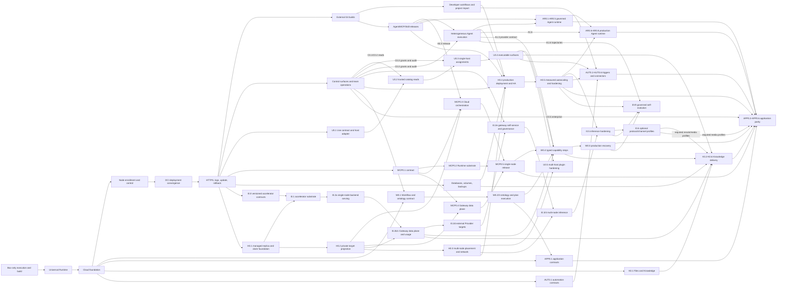

# A3S Cloud Development Plan

## 1. Delivery objective

The first usable release is one verified vertical slice:

```text
enroll one Linux node
  -> deploy one digest-pinned OCI image
  -> observe a real health check
  -> activate an HTTPS route
  -> stream ordered logs
  -> update and roll back to the previous healthy revision
```

The plan is gate-driven rather than date-driven. A milestone is complete only
when its exit evidence passes against real dependencies. Later milestones do
not compensate for an unproven Runtime contract, lost-operation recovery, or a
mock-only deployment path.

The cumulative delivery objective is an A3S-native Agent and application
platform that replaces the operational responsibilities commonly split between
Google AX and Kubernetes. A clean supported Linux installation must reach that
outcome through Cloud, Flow, Workloads, Fleet, Runtime, Box, Gateway, and Power
without requiring AX, Kubernetes, Helm, CRDs, Operators, Docker, or a
compatibility daemon. This is a cumulative exit outcome across existing gates,
not a second controller or delivery lane.

The root [product roadmap](../ROADMAP.md) publishes the complete Cloud
portfolio, current gate status, dependencies, and the boundary between the
Cloud control plane and Gateway data plane. This document owns detailed
implementation order, exit criteria, and evidence. It reuses the roadmap
boundary without creating a second Gateway control loop.

The [AI application platform plan](ai-application-platform-plan.md) is the
owning detailed plan for `APP0`, `K0`, and `AUT0`, including the public
application/node/plugin parity manifest. This development plan retains their
portfolio order and shared evidence policy rather than restating a competing
implementation design.

The [Durable Cell Service plan](durable-cell-platform-plan.md) owns `CELL0`
application, provider, S0 namespace, fencing, rollout, compatibility, and fault
contracts. This plan places those gates in the shared delivery order without
creating another Runtime class, scheduler, node channel, object client, or
per-Cell Cloud store.

The [technical architecture](architecture.md) is authoritative for component
ownership, control paths, deployment profiles, and failure behavior. This plan
may record historical provider evidence, but historical Docker evidence never
defines the active Box-only architecture or certifies a current gate.

The roadmap has cumulative delivery horizons:

| Horizon | Required gates | Product outcome |
| --- | --- | --- |
| Usable service platform | `BX0` plus `R0` through `E0` | One operator can deploy, reach, observe, update, and roll back one Box-hosted stateless Service on one Linux node |
| Developer platform | `G0`, `P0`, `C0`, and `A0` | Source-to-release workflows, previews, multi-service import, stable automation surfaces, and A3S asset releases use the same deployment path |
| Plugin-managed cognitive platform | `U0`, `C0.3`, required A3S Use gates, and named `BX0`/`H0` host foundations | Signed multi-surface Use packages converge as tenant workspace assignments through the shared Plugin Manager and existing Cloud control paths |
| Hosted MCP platform | `A0.3`, `MCP0.1` through `MCP0.5`, and their named `BX0`/`H0` foundations | One immutable modern MCP release runs as a Box-hosted Runtime Service and is reached through a conforming, authorized Gateway data plane |
| Heterogeneous Agent platform | `A0`, `A1`, and the relevant `C0` grants and audit gates | Immutable Agent releases use one provider-neutral Harness contract, durable approvals, recovery, and replayable trajectories without another controller |
| Ontology-driven Workflow platform | `W0` plus the selected `A1`, `MCP0`, `I0`, `U0`, and `C0` dependencies | Versioned business semantics compile into deterministic, recoverable plans on the existing A3S Flow path |
| AI application platform | `APP0`, `K0`, `AUT0`, `W0`, and their named A0/A1/AR0, provider, identity, storage, Gateway, and production gates | Six current application experiences, including distinct classic/New Agent outcomes, 23 built-in Workflow node labels with classic/New Agent profiles under Agent, Knowledge Pipelines, six plugin outcomes, publication, monitoring, and enterprise policy share one release and Flow path |
| Stateful production platform | `S0` and `H0` | Stateful resources, verified recovery, multi-node placement, high availability, and measured scaling are production-operable |
| Durable entity platform | `CELL0.1` through `CELL0.5` plus named `BX0`/`E0`/`S0`/`H0` foundations | One named SQLite-backed application survives idle eviction and process loss with alarms, WebSockets, single-writer fencing, durable acknowledgement, and no parallel control path |
| Governed evolution platform | `EV0`, `W0`, `A1.6`, `I0`, and named `H0`/`C0` safety foundations | Authorized evidence produces reproducible evaluations and immutable candidates promoted only through existing rollout and rollback authorities |

These horizons are cumulative. A broader interface or import format never
creates a second orchestration path and never weakens an earlier durability,
security, or recovery gate.

Inference is an optional product profile over the same platform, not another
deployment engine. When enabled, A3S Power is its required local serving
boundary and runs through A3S Box. Its single-node accelerator and model-serving
gates begin after the Box re-certification of E0; its multi-node replica and
distributed-serving gates consume H0's generic replica, placement, target-set,
networking, and HA primitives. The detailed I0 design is maintained in
[`inference-plan.md`](inference-plan.md).

The detailed Workflow, ontology, heterogeneous Harness, and self-evolution
contracts are maintained in
[`workflow-evolution-plan.md`](workflow-evolution-plan.md). Website capability
names are product projections over these gates; they do not authorize another
Flow engine, scheduler, queue, event bus, registry, object client, or rollout
controller.

The detailed five-mode application, 23-node, Knowledge, plugin projection,
publication, monitoring, and enterprise contracts are maintained in
[`ai-application-platform-plan.md`](ai-application-platform-plan.md). They add
Applications, Knowledge, Files, Automations, and Connectors semantic ownership;
they preserve the existing Flow, Workflow, Inference, Agents, Use, Sources,
Secrets, storage, Gateway, identity, and Operations mechanisms.

This expansion is additive. Existing tenant/project management, source and
build delivery, ordinary Task/Service execution, Asset and A3S Use lifecycle,
Secrets, Workloads/Fleet, Edge/Gateway, Operations, Search, stateful data,
production scale, audit, update, rollback, backup/restore, and disaster
recovery milestones remain in scope with their existing gates. A website
omission cannot retire a capability or weaken its evidence.

Reference-product outcomes are also tracked explicitly so useful behavior is
not lost when the implementation is made A3S-native:

| Reference capability set | Required A3S delivery | Gate boundary |
| --- | --- | --- |
| TokenHub-style private model gateway | Typed model protocols, Provider catalog and routing, project/environment keys, external OIDC identity federation, role-focused workspaces, diagnostics, API exploration, prompt-free usage and cost attribution, plus optional protocol/subscription channels | `C0.3`, `I0.2b` through `I0.2e`, `I0.5`, optional `I0.6`; commercial billing stays external and no TokenHub API/UI/storage compatibility is required |
| Google AX-style distributed Harness runtime | Isolated heterogeneous providers, one semantic event writer and reconnect stream, immutable invocation profiles, approvals, resume, checkpoints, forks, trajectories, and telemetry correlation | `A1.1` through `A1.6`, `BX0`, and `H0`; no AX controller, event log, scheduler, config authority, or wire compatibility enters Cloud |
| Commercial application-platform core | Six current application projections including distinct classic/New Agent outcomes, 23 built-in Workflow node labels with classic/New Agent profiles under Agent, Knowledge Bases/Pipelines, six plugin outcomes, API/embed/MCP delivery, monitoring/feedback, and enterprise governance | Composite `APP0.6` over `W0`, `K0`, `AUT0`, A0/A1/AR0, and named provider/platform gates; no copied API, storage topology, package lifecycle, configuration authority, mode runtime, Agent/sandbox lifecycle, pipeline engine, or scheduler enters Cloud |
| Deno celld-style Durable Objects | Named SQLite state, alarms, hibernatable WebSockets, inactive residency, object-store CAS ownership, replication-before-acknowledgement, and node handoff | `CELL0.1` through `CELL0.7`; Cloud owns application intent only, the provider owns per-Cell state inside S0, and no celld control topology, raw configuration authority, public operator API, Runtime class, or blanket compatibility claim enters Cloud |
| Cross-layer security operations | Authorized correlation of Gateway policy, Agent semantics, Runtime/Box and host evidence, tenant-scoped detections, investigation timelines, signed export, and explicit enforcement through the owning context | `C0.3` plus `E0`/`H0.5` evidence foundations; no fourth control plane, security node channel, telemetry-driven mutation, or second audit store |

The [architecture reference capability register](architecture.md#21-reference-capability-preservation-register)
is the detailed authority. A
delivery slice may defer one of these outcomes only by retaining its named gate
and unavailable status; deleting its marketing label is not retirement.

## 1.1 Management-interface and tenant-Web separation policy

Effective 2026-08-18, A3S Cloud ships no Cloud management Dashboard. The former
management `web/`, static `crates/web-server/`, `deploy/web/`, and `tools/web/`
paths and their build/runtime/CI wiring are removed. The former `website/`
documentation SPA, the former `architecture-3d/` interactive application, and
their Pages pipeline are removed as well. Project documentation remains
Markdown and static README assets, outside every product delivery and
availability gate. This does not prohibit `WEB0`: immutable tenant-owned
React/Vue or other Web releases are Application/Agent content built through
Task/Box and served through Gateway without a Cloud UI authority.

An active delivery slice proceeds in this order:

1. freeze the closed ACL, domain invariants, ownership, and versioned protocol;
2. implement application commands and queries, A3S ORM migrations,
   idempotency, Operations, Outbox facts, and audit;
3. implement the real Runtime, Box, Gateway, Power, A3S Use, storage, or other
   provider adapter without an in-memory production fallback;
4. expose stable REST and OpenAPI contracts with typed errors, pagination,
   cancellation, replay, and compatibility rules;
5. expose the same application boundary through the maintained client, CLI,
   and applicable Management MCP tools;
6. pass real-provider, failure, process-death, recovery, cleanup, security, and
   cross-repository conformance gates.

No backend endpoint is added only to fit a management screen. Cloud-Dashboard
state, UI-only business behavior, and UI-specific lifecycles are outside Cloud
scope. Tenant Web delivery reuses the same public API and Gateway policies and
cannot weaken authorization. A management gate is judged only by its supported
REST/OpenAPI, maintained client, CLI,
Management MCP, provider, recovery, and evidence contracts.

## 2. Engineering rules

- Implement vertical behavior through domain, application, infrastructure,
  transport, maintained interfaces, documentation, and tests. Product UI is
  outside the section 1.1 boundary.
- Write aggregate and protocol tests before the implementation they constrain.
- Keep the repository root as orchestration only. The Rust workspace is the
  repository-root `Cargo.toml`; crates remain under `crates/`.
- Commit changes in external crate submodules separately from the root pointer
  update. Never mix an A3S Runtime release with unrelated Cloud code.
- Pin A3S dependency revisions and keep one repository-root `Cargo.lock`. A
  package name/version resolves from exactly one source; temporary
  cross-version debt must name its upstream owner and is guarded from growth.
- Put every external middleware behind a typed application port and test its
  real provider; backend names never enter domain decisions.
- Permit the process-local A3S Event adapter only in the development
  all-in-one process or a dedicated API that owns no event transport. Every
  event-owning production `all`, worker, or relay role requires NATS JetStream
  so integration facts cannot disappear at a process boundary.
- Compose the shared A3S Box Runtime driver directly. Do not add another Box
  lifecycle adapter, provider selector, or Docker-compatible fallback.
- Compile local inference only to the A3S Power Service contract. An engine
  used inside Power never becomes a Cloud backend, scheduler, or control path.
- Do not mark an integration complete with an in-memory repository, fake
  Runtime driver, fake Gateway acknowledgement, or mocked health response.
- Every long-running command is idempotent, cancellable, resumable after
  process death, and visible as one Operation timeline.
- REST, the maintained client, CLI, and MCP surfaces call the same application
  commands and queries; no interface owns business rules or bypasses tenant guards.
- Cloud plugin APIs manage one desired `PluginAssignment`; they never copy or
  proxy A3S Use's installer, management MCP, TUF/catalog verifier, plan
  generator, Workspace Grants, Runtime Bindings, capability registry, surface
  reconciler, or package operation journal.
- External project formats such as Git repositories and Compose files are
  immutable inputs. Cloud normalizes them into versioned typed desired state;
  they never become a second mutable source of truth.
- Detected configuration is a reviewable proposal. Accepted build, deployment,
  route, and storage plans are explicit and digest-addressed.
- A provider-backed capability remains unavailable until its real conformance,
  failure, cleanup, and recovery gates pass. Unsupported input fails explicitly
  instead of degrading silently.
- Documentation describes shipped behavior only; planned behavior stays marked
  as planned.
- Implement Workflow, Agent, MCP, model, storage, observability, and evolution
  website capabilities by extending their named authorities. Architecture
  tests must reject profile-specific Flow engines, schedulers, queues, event
  buses, registries, object clients, and rollout controllers.

### 2.1 Architecture convergence before feature expansion

New product families do not compensate for ambiguity or duplicate mechanisms
in the shared control path. Before opening implementation for another planned
bounded context, close the following convergence work in order. These items
change shared mechanisms only; they do not add a parallel platform gate.

1. **Make Operation coordination fair and deterministic — implemented.**
   Requests without a Flow projection use an independent bounded start batch.
   Active projections use a stable ascending keyset cursor that wraps after the
   final page, so old running or suspended Operations cannot starve a newly
   committed request or another active page. A Flow snapshot whose sequence and
   semantic content did not change is an explicit no-write replay and cannot
   advance the user-visible projection timestamp. The same repository contract
   is enforced by the in-memory conformance tests and PostgreSQL foundation
   gate without adding a scheduling table, timer, or second Flow worker.
2. **Supervise every mandatory background worker once — implemented.** One
   process-level `JoinSet` observes every worker exit, returned error, and
   panic. An unexpected completion ends serving, broadcasts shutdown to the
   remaining workers, and fails the process; individual contexts have no
   failure channels or detached supervisors.
3. **Route Flow work from one exact registry — implemented.** Workflow
   name/version and the complete exact step-name set are registered together
   and checked for collisions at startup. Unknown workflows and steps fail at
   the router; there is no default product runtime.
4. **Bound retries and durable activities — implemented for current
   object-namespace recovery.** Flow remains the sole retry and timer
   authority. New Operation histories pin one replay-safe marker and use eight
   attempts with capped exponential backoff, deterministic full jitter,
   visible suspension, and workflow-owned terminal handling. Existing
   unmarked histories retain their exact fixed retry contract. Current object
   recovery v2 checkpoints deterministic pages of at most 32 objects or 64 MiB
   in Flow history, freezes recovery cleanup plans before mutation, and retains
   v1's exact one-step replay path. A checked-in PostgreSQL process-death gate
   uses one process-shared S3-compatible namespace, kills the worker at three
   second-page boundaries, and reconstructs the run from the durable store.
   Other large activities must adopt the same bounded
   pattern when introduced. No context adds a retry table, sleep loop, random
   state, or queue.
5. **Keep event delivery reconstructible from PostgreSQL.** A3S Event remains
   transport and acceleration, never the only recoverable copy of unfinished
   business work. Every pending consumer intent, including outbound
   notification delivery, can republish the same deterministic event identity
   after stream-state loss. This recovery scan reuses the Outbox/Event path and
   consumer idempotency; it is not a second queue or retry authority.
6. **Make endpoint metadata one source of truth.** Existing Rust route and DTO
   metadata, not a new configuration language, owns paths, methods, schemas,
   stable errors, permissions, and operation identity. OpenAPI, TypeScript
   transport/types, and the mechanical Management MCP catalog/registration are
   generated or verified from it. CLI UX and human-authored MCP descriptions
   remain overlays over the same application commands and queries.
7. **Finish the single A3S ORM path.** Production repositories contain no raw
   SQL escape hatch. Missing expressions, joins, locks, or transaction
   primitives are implemented and certified in A3S ORM. The one A3S ORM
   Migrator remains authoritative while its SQL-file registry is generated or
   context-composed and validated instead of repeated by hand.
8. **Remove executable fallbacks and duplicated live status.** Edge always
   compiles one complete managed Gateway snapshot, with historic adapters kept
   only where persisted replay requires them. `ROADMAP.md` remains the sole
   live gate-status source; architecture and detailed plans hold invariants,
   dependencies, and evidence rather than competing status summaries.

The architecture definition of done in
[`architecture.md`](architecture.md#17-architecture-definition-of-done) and
its abstraction-promotion test remain the acceptance authority. A focused
test is evidence only for the exact invariant it exercises; mock or
component-only evidence cannot close a provider or production claim.

## 3. Critical path


```mermaid
flowchart LR
    BX0[Box-only execution and build] --> R0[Universal Runtime]
    R0 --> F0[Cloud foundation]
    F0 --> N0[Node enrollment and control]
    N0 --> D0[OCI deployment convergence]
    D0 --> E0[HTTPS, logs, update, rollback]
    E0 --> G0[External Git builds]
    E0 --> C0[Control surfaces and team operations]
    E0 --> U01[U0.1 Use contract and host adapter]
    U01 --> U02[U0.2 trusted catalog reads]
    C0 -->|C0.1/C0.2 reads| U02
    U02 --> U03[U0.3 single-host assignments]
    C0 -->|C0.3 grants and audit| U03
    U03 --> U04[U0.4 executable surfaces]
    G0 --> P0[Developer workflows and project import]
    G0 --> A0[Agent/MCP/Skill releases]
    E0 --> MCP01[MCP0.1 contract]
    A0 -->|A0.3 release| MCP03[MCP0.3 Cloud orchestration]
    MCP01 --> MCP02[MCP0.2 Runtime substrate]
    MCP01 --> MCP03
    MCP01 --> MCP04[MCP0.4 Gateway data plane]
    H02 --> MCP03
    H02 --> MCP04
    MCP02 --> MCP05[MCP0.5 single-node release]
    MCP03 --> MCP05
    MCP04 --> MCP05
    A0 --> A1[Heterogeneous Agent execution]
    C0 -->|C0.3 grants and audit| A1
    A0 --> AR05[AR0.1-AR0.5 governed Agent runtime]
    A1 --> AR05
    E0 --> S0[Databases, volumes, backups]
    E0 --> I00[I0.0 versioned accelerator contracts]
    E0 --> H01[H0.1 managed replica and claim foundation]
    I00 --> I01[I0.1 accelerator substrate]
    H01 --> I01
    I01 --> I02A[I0.2a single-node backend serving]
    H01 --> H02[H0.2 private target projection]
    I02A --> I02BC[I0.2b/c Gateway data plane and usage]
    H02 --> I02BC
    I02BC --> I02D[I0.2d external Provider targets]
    I02D --> I02E[I0.2e gateway self-service and governance]
    C0 --> I02E
    H02 --> H03[H0.3 multi-node placement and network]
    H03 --> U05[U0.5 multi-host plugin hardening]
    U04 --> U05
    I02E --> I034[I0.3/4 multi-node inference]
    H03 --> I034
    P0 --> H04[H0.4 production deployment and HA]
    C0 --> H04
    A0 --> H04
    A1 --> H04
    S0 --> H04
    H03 --> H04
    H04 --> H05[H0.5 measured autoscaling and hardening]
    AR05 --> AR08[AR0.6-AR0.8 production Agent runtime]
    A1 -->|A1.6| AR08
    H05 --> AR08
    I034 --> I05[I0.5 inference hardening]
    H05 --> I05
    I05 --> I06[I0.6 optional protocol/channel profiles]
    F0 --> W01[W0.1 Workflow and ontology contract]
    C0 --> W01
    W01 --> W023[W0.2/3 ontology and plan execution]
    W023 --> W04[W0.4 typed capability steps]
    A1 -->|A1.3 provider contract| W04
    MCP05 --> W04
    I02BC --> W04
    U04 --> W04
    W04 --> W05[W0.5 production recovery]
    F0 --> APP01[APP0.1 application contracts]
    W023 --> APP01
    F0 --> K01[K0.1 Files and Knowledge]
    F0 --> AUT01[AUT0.1 automation contracts]
    K01 --> K06[K0.2-K0.6 Knowledge delivery]
    W04 --> K06
    I02BC --> K06
    I06 -->|required rerank/media profiles| K06
    S0 --> K06
    U04 --> K06
    AUT01 --> AUT06[AUT0.2-AUT0.6 triggers and connectors]
    P0 --> AUT06
    U04 --> AUT06
    H05 --> AUT06
    APP01 --> APP06[APP0.2-APP0.6 application parity]
    W05 --> APP06
    K06 --> APP06
    AUT06 --> APP06
    MCP05 --> APP06
    I06 -->|required media profiles| APP06
    AR05 --> APP06
    AR08 --> APP06
    H05 --> APP06
    C0 -->|C0.5 enterprise| APP06
    W05 --> EV0[EV0 governed self-evolution]
    A1 -->|A1.6 trajectories| EV0
    I05 --> EV0
    H05 --> EV0
```

The first behavioral release gate is `E0`; its prior provider evidence is now
historical until `BX0` re-certifies it on A3S Box. Source delivery (`G0`),
stable control surfaces (`C0`), and stateful foundations (`S0`) may advance as
independent lanes. Project import (`P0`) depends on the immutable source and
build contracts from G0. Hosted assets (`A0`) reuse the same source-to-artifact
path. `A1.0` has consolidated existing sequence streaming, immutable object
storage, and durable node-agent delivery primitives; user-visible
`A1.1` work starts only after `A0.3` supplies a published immutable release,
`A1.2` consumes `A0.4` Agent deployment for the native Code provider, `A1.3`
freezes one provider-neutral Harness contract, and `A1.4` consumes `A0.5`
bindings. The `A1.5` approval slice consumes `C0.3` grants and audit.
Production multi-node work
(`H0`) starts only after the product surfaces it must scale have passed their
single-node gates.

`W0.1` through `W0.3` may define ontology authority and prove deterministic
Flow-backed plan execution before every external step provider is available.
`W0.4` consumes only verified typed `A1.3`, `MCP0.5`, `I0.2`, and applicable
`U0.4` ports. `EV0` follows `W0`, `A1.6`, inference, and production safety
foundations; it reuses existing compute, storage, release, rollout, and audit
paths instead of creating an evolution platform beside them.

`APP0.1`, `K0.1`, and `AUT0.1` may freeze independent semantic contracts after
the protected `W0.3` run-start and descriptor foundations pass. Knowledge
delivery consumes the selected `W0.4`, Inference, Use, Connectors, and storage
ports. Automations owns only new-invocation triggers and reuses Boot's durable
task rail; Flow timers remain scoped to existing runs. Full `APP0.6` follows
`W0.5`, `K0.6`, `AUT0.6`, and the named production gates. Product UI delivery
is outside Cloud scope and does not block `APP0.6`.

`U0` is a control-plane integration lane, not another plugin platform. `U0.1`
pins and adapts the frozen typed remote-host boundary from the exact A3S Use
contracts; any future missing public type or manager API is added upstream
rather than reimplemented in Cloud. `U0.2` is read-only. `U0.3` begins mutation
only after the shared A3S Use Plugin Manager owns the complete parent saga and
`C0.3` supplies Cloud authorization and audit. `U0.4` executable surfaces must
prove that their host adapters use only the injected Runtime/Box and private
A3S Use bindings, while any public or replicated service remains an explicit
A0/MCP0 Workload; Secrets and Knowledge keep their existing boundaries. `U0.5`
operates the same independent per-host assignments over H0/Fleet membership
instead of adding a group rollout aggregate or plugin scheduler.

`MCP0.1` is contract work and may begin from the E0 model. Its implementation
does not become available until `A0.3` provides an immutable release,
Runtime/Box close `MCP0.2`, Cloud closes `MCP0.3`, Gateway closes `MCP0.4`, and
their exact revisions pass `MCP0.5`. `MCP0.6` then consumes the multi-node and
grant/audit foundations rather than inventing MCP-specific controllers.

H0 is delivered through the numbered sub-gates below. H0.1 through H0.3 may be
proved against an owning profile after that profile's single-node gate. I0 uses
that rule to exercise inference-neutral replica, claim, target-set, placement,
and network primitives. This does not mark the broader H0 milestone complete
for P0, C0, A0, A1, S0, production packaging, control-plane HA, or autoscaling.

### 3.1 Retained delivery evidence snapshot

Evidence retained through 2026-08-15 is summarized below. Later component-only
implementation records may be incorporated without advancing retained-provider
evidence. The root
[`ROADMAP.md`](../ROADMAP.md) owns current product gate state; this table keeps
the detailed implementation and provider evidence needed to reproduce or
supersede those claims rather than acting as a second live status source.

| Gate | State | Release evidence |
| --- | --- | --- |
| P0 | In progress; unavailable | `P0.1-C1` through `C6` production-compose bounded canonical BuildPlan detection, immutable exact-SourceRevision acceptance/reads, shared authorization, trusted accepted-revision SourceLayout acquisition, and the REST/OpenAPI `1.72.0`, maintained client/CLI, and four Management MCP surfaces. `P0.2-C1` through `C6` production-compose canonical WorkloadProfile intent, immutable migration `147` acceptance/reads, exact compilation, owner anti-corruption adapters, and REST/OpenAPI `1.74.0`, maintained client/CLI, and four additional MCP tools over the same authorities. `P0.3-C1` through `C7` production-compose the durable Preview Policy/projection foundations and expose ACL-only policy acceptance/current/history/exact reads plus one exact behavioral Preview read through REST/OpenAPI `1.75.0`, maintained client/CLI, and five Management MCP tools over two narrow Application query authorities. The Sources-owned pre-acceptance discovery slice exposes installation repositories and exact branch/tag pages through REST/OpenAPI `1.76.0`, maintained client/CLI, and two Management MCP tools over one transient Application query authority. Live GitHub evidence, Workloads/Executions/Edge/Operations/schedule and cleanup owner handoffs, Preview expiry execution, monorepos, Compose import, retained PostgreSQL cross-surface Preview evidence, and retained WorkloadProfile certification remain open. |
| BX0 | In progress | `BX0.1` and the complete `BX0.2` lifecycle, recovery, hard-resource Claim, cancellation, and abnormal-interruption cleanup path are verified on the exact Runtime/Box pair. `BX0.3` now has Runtime-owned typed Service TCP endpoints, Box-owned generation-fenced forwarding and HTTP/TCP/command probes, one stateless Cloud-to-Gateway origin adapter, one real Cloud health consumer gate, one authenticated Cloud-to-Box adapter for restart-safe environment/file Secrets, log redaction, and pull-only registry credentials, one Artifact port that reuses the existing node cache plus Box's sole VolumeStore for Artifact/Volume/tmpfs mounts and Task-output publication, a composite allocation gate that binds Box's complete advertised Resources profile to Cloud's existing inventory-bound Claim lifecycle, and an ACL-native SEV-SNP composition that consumes generation-bound Box attestation while keeping simulation distinct from hardware evidence. Complete Sandbox plus hardware-backed MicroVM/TEE isolation, builds, and the clean-host loop keep `BX0.3` through `BX0.5` open in A3S-Lab/Cloud#85 and A3S-Lab/Box#172 |
| PW0 | Planned | ACL-native Power and Box MicroVM/TEE integration is tracked by A3S-Lab/Power#3; no Cloud inference capability is claimed yet |
| R0 | Historical | General Task and Service behavior passed against the retired provider; Box conformance is required |
| F0 | Verified | The [2026-08-19 `main` PostgreSQL 17 plus local/NATS foundation job](https://github.com/A3S-Lab/Cloud/actions/runs/32266327719/job/96111906175) passes tenancy, idempotency, one-run Operation reconciliation, lost Outbox acknowledgement recovery, API envelopes, and migration apply/checksum/rollback/concurrency against A3S Flow `1.0.0`, A3S Boot `0.2.0`, and A3S ORM `0.3.1`; it also retains queue-failure readiness and the nine-boundary persistent Build Flow `SIGKILL` gates |
| N0 | Historical | Outbound mTLS protocol, durable command journal, replay, provider reattachment, and lost-provider recovery passed against the retired provider; Box re-certification is required |
| D0 | Historical | Digest-pinned apply and health, restart recovery, failed-update retention, cancellation cleanup, and registry resolution passed against the retired provider; Box re-certification is required |
| E0 | Historical | Route, Gateway, Secret, log, update, rollback, interface, and crash-boundary behaviors passed against the retired provider; the complete clean-host loop must be reproduced without Docker or a compatible daemon |
| G0 | In progress | Exact source resolution, the sole `cloud.build@5` Box-native workflow, command-bound Artifact transport, complete OCI admission, authenticated digest-only publication, remote graph verification, replay/cancellation, deterministic SPDX/SLSA generation, locally verified Ed25519 DSSE signing, durable evidence restoration, evidence API/client/CLI download, explicit deployment through `cloud.deployment@3`, periodic provider revalidation, and BuildRun status/cancellation/retry controls are implemented. The Box provider workflow defines a revision-bound real Linux build consumer for post-publication Agent-process death, exact Box/Artifact replay, cleared-cache hydration from the immediate parent, idempotent removal, and live-state baseline restoration, plus a nine-boundary Fleet/Flow completion-event-loss matrix for the exact start/cancel/inspect/remove command chain in both logical and PostgreSQL-backed nine-`SIGKILL` forms. The manual external-provider workflow now binds a private GitHub revision and production input to that exact Box output, an operator HTTPS Registry graph, a locally verified Vault Transit signature, a restart-restored PostgreSQL BuildRun, and one `cloud.deployment@3` Workload handoff. BuildRun logs fail explicitly until Box supplies an authoritative durable log contract. Retained successful executions of both operator gates still block G0 verification |
| C0 | In progress | `C0.1`, `C0.2`, and `C0.2m` are verified. One typed TypeScript client is shared by the CLI and external integrators; the versioned OpenAPI envelope, bounded transport, safe token handling, tenant/operational reads, replay-safe mutations, evidence, logs, diagnostics, Search, Workload/Source/Secret/Identity/Fleet/Edge parity, and compatibility checks pass focused tests. The verified pre-extension Management MCP gate proved exact 23-tool administrator and 16-tool read-only catalogs. The current 157-tool administrator and 90-tool read-only catalogs retain those tools and add eighteen Identity (including three exact-self redacted recipient-contact tools), two Project-attribution, one bounded tenant-administrator audit query, one signed-audit export, one audit-retention status query, one read-only Gateway Route policy security-timeline tool, three personal-notification tools, four personal alert-policy tools, four personal outbound-subscription tools, seven verified `W0.2` Ontology, ten `W0.3` Workflow definition/goal/plan, one read-only built-in Workflow node-catalog query, seven native Form lifecycle, nine WorkflowRun lifecycle including Flow-derived variable inspection and diagnostics, five protected HumanTask read/assignment/submission tools, three ExecutionTemplate tools, fourteen Application tools (six release-management and eight Principal-owned project-member session/invocation/message delivery tools), six Connector profile/revision tools, ten Durable Cell application/revision/deployment/route tools, six verified `U0.2` plugin Registry/catalog read tools, four Developer Workflows BuildPlan tools (three reads and one acceptance mutation), four WorkloadProfile tools (three reads and one acceptance mutation), five Preview Management tools (four reads and one policy-acceptance mutation), five Files tools (three reads and two `file:write` mutations), and two Sources-owned GitHub discovery tools (both `source:write` reads); focused catalog, permission, strict-argument, lifecycle, deterministic-plan, Workflow node-catalog, WorkflowRun/HumanTask/ExecutionTemplate/Application/Connector/Durable Cell/BuildPlan/WorkloadProfile/Preview Management/Files/Source discovery, plugin tenant, role, invitation, audit, security-timeline, attribution, notification, alert-policy, outbound-subscription, recipient-contact, and replay conformance pass. `C0.2m` uses the `2026-07-28` sessionless protocol with per-request metadata and `server/discover`. The `C0.3` slice implements stable human/service Principals, one explicit Principal-plus-Membership creation path, Membership roles, exact-Principal MembershipInvitations, Principal-bound credentials, exact OIDC issuer/subject links and replay-safe one-time flows, a bounded OIDC discovery/JWKS/ID-token adapter, production-wired login/link/callback routes and maintained-client entry points, immediate role/revocation enforcement, last-owner protection, closed project/environment/node Resource Grants, immutable versioned Project attribution, a personal in-app notification inbox, immutable outbound-subscription A3S ACLs with REST/client/CLI/MCP management, transactional delivery authorization facts, signed-webhook/Slack-compatible request builders, the first NATS A3S Event-to-fenced-Connector consumer composition, monotonic Delivered/Rejected/Indeterminate/Exhausted terminal receipts, C6 `Retry-After` pacing, v1 fixed-eight plus v2/v3 user-configured one-through-eight termination and v3 bounded immutable event-time suppression, and immutable personal alert-policy A3S ACLs over four closed Environment-scoped firing/recovery sources (DomainClaim, Gateway certificate renewal, Workload deployment health, and Gateway certificate expiry) plus the exact-Node Fleet availability source, alongside A3S ORM/Outbox/audit writes and redacted keyset projections; `C0.3-S1a` exposes one bounded owner/admin Gateway MCP Route policy investigation timeline over typed Edge Outbox facts and shared redacted audit metadata; exact-owner recipient-contact self-service is exposed through REST/OpenAPI `1.52.0`, client, stdin-safe CLI, and redacted list/get/revoke Management MCP. General Notifications SMTP is exposed through outbound-subscription v4 and delivery-v3 over the same REST/OpenAPI `1.53.0`, client, CLI, and four Management MCP operations. REST/OpenAPI `1.38.0`, the maintained client, CLI, and ten Management MCP tools expose Durable Cells C5 over its existing C2-C4 authority. REST/OpenAPI `1.42.0` adds six APP0.1 Application/release tools over the sole Applications authority. REST/OpenAPI `1.43.0` adds five `application:write` APP0.2-C8 project-member session/invocation/message tools, and `1.44.0` adds three C12 close/cancel/full-replay tools over the same Applications and Workflow authorities. Focused attribution, notification, alert-policy, Durable Cell, BuildPlan, WorkloadProfile, Preview Management, and Application surface tests pass. The retained [PostgreSQL 17 subscription/receipt job](https://github.com/A3S-Lab/Cloud/actions/runs/31870067201/job/94977216459) proves migration `114`, exact Connector binding, atomic delivery-fact emission, idempotent terminal-receipt settlement, and the earlier attribution/inbox persistence boundaries; the retained [PostgreSQL 17 bounded-attempt job](https://github.com/A3S-Lab/Cloud/actions/runs/31872285521/job/94982690995) proves migration `115`, Exhausted receipt persistence, and exact C6 evidence binding. The [N3a PostgreSQL 17 and NATS H0 job](https://github.com/A3S-Lab/Cloud/actions/runs/32503892384/job/96839623052) proves migration `128`, contract-v2 budget pinning across subscription, delivery, event, and receipt facts, exact-bound Exhausted settlement, and terminal ACK-only replay. The [N3b PostgreSQL 17 and NATS H0 job](https://github.com/A3S-Lab/Cloud/actions/runs/32516778570/job/96880061349) proves migration `129`, cutoff non-null/bounds/immutability enforcement, pre-cutoff inbox retention, forged-delivery rejection, equality admission, unchanged delivery-v2 publication, and terminal replay. The [N4a PostgreSQL 17 and NATS H0 job](https://github.com/A3S-Lab/Cloud/actions/runs/32532413143/job/96926885588) proves migration `130`, immutable create/revoke and ACL guards, idempotent Outbox/audit writes, exact rejection/recovery projection and replay deduplication, post-policy-revocation silence, durable delivery, and terminal ACK-only replay. The [N5e PostgreSQL 17, NATS JetStream, and Mailpit H0 job](https://github.com/A3S-Lab/Cloud/actions/runs/32607194447/job/97113956621) proves migration `138`, closed SMTP outcomes, exact exhaustion, zero generic Connector settlements, production Relay/Worker composition, and terminal replay. The [N4i PostgreSQL 17 and NATS JetStream H0 job](https://github.com/A3S-Lab/Cloud/actions/runs/32616589469/job/97138232995) proves migration `140`, exact-Node persistence/replay, critical firing, opt-in recovery, stale/initial/replay silence, durable delivery, and terminal replay; the [complete N4i CI run](https://github.com/A3S-Lab/Cloud/actions/runs/32616589469) passes all ten jobs, including current-grant and REST/MCP cross-surface gates. The [S1a PostgreSQL 17 H0 job](https://github.com/A3S-Lab/Cloud/actions/runs/32626495022/job/97162528129) proves exact typed correlation, evidence gaps, ambiguous-match rejection, stable pagination, tenant isolation, migration `141`, and private-detail exclusion; the [Management MCP job](https://github.com/A3S-Lab/Cloud/actions/runs/32626495022/job/97162528171) proves the exact 133/73 catalogs, and the [complete S1a CI run](https://github.com/A3S-Lab/Cloud/actions/runs/32626495022) passes all ten jobs. The notification slice reuses the transactional Outbox relay, A3S Event, shared Resource Grant evaluator, idempotency, audit, and A3S ORM migrator without another queue, provider authority, retry mechanism, or configuration format. The bounded S1a Gateway Route policy investigation timeline is verified; `C0.3-PA2a` request-time audit attribution is verified as the prerequisite to signed export by the [PostgreSQL 17 H0 job](https://github.com/A3S-Lab/Cloud/actions/runs/32632245460/job/97176670880), the [Management MCP job](https://github.com/A3S-Lab/Cloud/actions/runs/32632245460/job/97176671002), and the [complete PA2a CI run](https://github.com/A3S-Lab/Cloud/actions/runs/32632245460); `C0.3-PA2b` is verified for one bounded canonical DSSE audit-export page by the [PostgreSQL 17 H0 job](https://github.com/A3S-Lab/Cloud/actions/runs/32640730087/job/97197306605), the [Management MCP job](https://github.com/A3S-Lab/Cloud/actions/runs/32640730087/job/97197306596), and the [complete PA2b main CI run](https://github.com/A3S-Lab/Cloud/actions/runs/32640730087); `C0.3-PA2c` audit retention is verified through migration `144` and REST/OpenAPI `1.58.0` by the [PostgreSQL 17 H0 job](https://github.com/A3S-Lab/Cloud/actions/runs/32651905148/job/97224767294), the [Management MCP job](https://github.com/A3S-Lab/Cloud/actions/runs/32651905148/job/97224767287), and the [complete PA2c main CI run](https://github.com/A3S-Lab/Cloud/actions/runs/32651905148); `C0.3-PA2d` implements the transient complete same-key signed multi-page audit-export manifest through REST/OpenAPI `1.59.0`, the maintained client, CLI, and one read-only Management MCP tool, with remote PostgreSQL and cross-surface certification pending; later cross-layer security investigation, persisted export orchestration, authorized SIEM delivery, and product usage-fact profile snapshots remain planned; `C0.3` is in progress and `C0.4` remains planned. |
| A0 | In progress | `A0.1` and `A0.2` are verified. `A0.3` has the typed external-or-hosted build path, deterministic hosted input, migrations 063-064 and the migration 152 fact-fed Artifacts candidate projection through typed A3S ORM, concurrent local-only BuildRun reservation, restart repair, and a two-owner pipeline: Artifacts atomically commits the successful BuildRun plus one versioned Outbox outcome, then Assets idempotently commits release/provenance plus its publication fact. Agent/MCP draft creation likewise atomically emits its owner build-request fact; the generic Relay is the sole projection retry mechanism. Failed-draft recovery, product yanking, semantic deterministic selection, and tenant-authorized API/client/CLI management projections are implemented. `A0.4` has immutable exact Agent release-to-Workload binding, server-side OCI injection, lifecycle reuse, migration 066 persistence, and REST/client/CLI projections. `A0.5` now publishes exact hosted Git archives as immutable Skill bundles and binds them to Agent Workload revisions through migration 067, read-only Runtime Artifact mounts, rollback-safe revision history, and REST/client/CLI surfaces. Retained external-provider and real PostgreSQL/Box evidence still blocks `A0.3` through `A0.5` verification. |
| A1 | In progress | `A1.0` is verified and `A1.1` implements the durable conversation/execution foundation. The verified `A1.2` native Code provider pins the Code-owned protocol, persists exact Workload/Runtime/run delivery identity through migration 069, reconciles the reserved Operation through the existing Flow runtime, forwards start/run-scoped-cancel/deterministic-recover commands through Fleet and the node journal, settles Code pages and retention gaps through the shared outbound-batch primitive, detects same-generation provider-process replacement from existing Runtime observations, derives only bounded semantic output/terminal facts, and implements the root `a3s code harness` HTTP entrypoint. The retained clean Linux PostgreSQL 17 and real Box Runtime gate verifies retention recovery, control-plane restart, provider-process death with a newer incarnation timestamp, and cleanup while Cloud consumes exact crates.io releases `a3s-code-core 8.0.1` and `a3s-flow 1.1.0`. Component-level `A1.3` adds the canonical immutable provider profile/capability contract, generic start/cancel/recover and event evidence, Code adapter migration, migrations 160/164, closed REST/OpenAPI `1.69.0` plus client/CLI provider selection, exact Flow registry recovery, fail-closed Node common-protocol routing, durable non-Code binding reconstruction, and shared outbound-batch event shipping for the deterministic reference provider without another lifecycle. A retained [PostgreSQL 17 and real Box reference-provider gate](https://github.com/A3S-Lab/Cloud/actions/runs/33164609764/job/98827188366) proves exact common-HTTP Start and cursor pages, durable node-journal and semantic replay, approved/denied/expired/cancelled approval outcomes, exact provider Resume/Cancel delivery, provider-process replacement, unsupported-Recovery terminal fallback with zero Recover commands, digest-only audit, and empty Runtime/Artifact cleanup. The capability gate also rejects a pre-upgrade persisted recovery successor terminally without binding rotation or Recover enqueue and replays that result idempotently. It certifies fail-closed fallback only, not a Recovery-capable external provider. Component-level `A1.4` adds migrations 165/166, one fail-closed immutable invocation profile before dispatch, digest binding in the provider run identity, digest-only Tool request/result semantics, same-transaction shared audit correlation, OpenAPI `1.70.0`, and maintained client types. Component-level `A1.5` adds migration 167, durable approval-required Tool checkpoints, authorization and shared audit evidence for approve/deny, deterministic expiry/cancellation, one exact provider-neutral resume, closed REST/OpenAPI `1.71.0`, and maintained client types. Component-level `A1.6` adds migrations 168/169, shared immutable logical trajectory snapshots, exact projection and Runtime telemetry evidence, immutable fork lineage, provider-neutral fork prompt materialization, PostgreSQL capture/inventory/cleanup fencing, one S3-only supervised grace-delayed orphan reconciler over the shared object client, closed REST/OpenAPI `1.73.0`, and maintained client types. A Recovery-capable external provider, real-provider/Box fork execution, external HTTPS S3-compatible evidence, provider-private checkpoint capability certification, production model/Tool binding producers, and any additional independent MCP binding remain open. |
| W0 | In progress; unavailable | `W0.1` implements the closed ACL-native Workflow/Ontology foundation and `W0.2` verifies immutable Ontology revisions, deterministic migration policy, and authorized Search. `W0.3` includes immutable definitions and Goals, native Forms, Goal/Plan-bound WorkflowRuns, HumanTasks, reachable-Output aggregation, finite Execution plus its descriptor-bound typed failure edge and exact default-output fallback, Flow-derived authorized variable inspection, deterministic project-authorized 23-node discovery, immutable composite-region policy/bindings, deterministic frame/export and ordered reducers, Flow-backed bounded-parallel Iteration and sequential Loop child WorkflowRun lifecycle, Flow-owned Connector observation/wait/retry interpretation plus descriptor-bound failure routing, descriptor-bound Application-variable and Application-Answer failure routing, Workflow-local Transform/Output/Branch and descriptor-bound composite-region failure routing, exact typed Variable Aggregation through Run v20, exact typed List Operator execution through Run v21, bounded-parallel Iteration waves through Run v22, exact Connector cancellation compensation through Run v23, component-only exact AgentRelease dispatch through Run v24 and descriptor-bound Agent failure routing through Plan v12/Run v25, bounded finite-Execution/Agent/Connector/HumanDecision/Subworkflow evidence correlations, and authorized bounded WorkflowRun diagnostics/statistics. Migrations `103`, `107`, and `108` retain exact semantic, variable-default, and composite-region material; migration `122` adds only nullable default-output projection evidence and corrects the existing selected-handle constraint for terminal Execution failures; migration `123` admits the already wired Service/Connector projection kind and widens that same structural handle constraint for failed Service projections; migration `143` widens it only for failed Output projections; migration `145` admits failed Transform selected-handle evidence; migration `148` admits only failed Subworkflow selected-handle evidence; migration `149` widens only the closed Workflow payload-schema registry for Variable Aggregator configuration and policy v2/v3; migration `151` widens only that registry for List Operator configuration; migration `158` admits only policy v4 cancellation-compensation material; migration `161` admits the exact Agent projection kind while restoring the full current runtime-kind constraint; migration `163` admits only the exact failed Agent selected-handle shape; immutable plan validation remains the exact descriptor, binding, handle, and canonical ACL authority. Compiler schema 2 emits Plan v2 with exact descriptor, semantic, variable, optional composite-region, and provider-policy pins while preserving Plan v1 bytes; a graph that opts into the finite-Execution error port emits Plan v3, the mutually exclusive exact default fallback emits Plan v4 with one typed output-port contract and policy v3 material, an exact Connector error port emits Plan v5, an exact Application conversation-variable error port emits Plan v6, an exact Application Answer error port emits Plan v7, exact Workflow-local Transform, Output, and Branch error ports emit Plans v8-v10, an exact Workflow-owned Iteration or Loop error port emits Plan v11, and an exact Agent error port emits Plan v12 without reinterpreting earlier Plans. WorkflowRun input/runtime/Flow v2 retains non-composite typed-variable/default execution; v3 freezes composite execution; v4 preserves typed finite-Execution failure routing; historic v5 composes exact Connector attempts, durable waits, bounded retry, and digest-only results; v6 adds an exact immutable response-object reference after Connectors stores accepted bytes through the shared object authority; v7 folds terminal finite-Execution observations into exact defaults with typed evidence; v8 composes those authorities with one no-retry C11 read, strict duplicate-key-free JSON parsing, immutable output-schema validation, and bounded typed node output; v9 routes a closed Connector terminal classification through the exact ordinary DAG edge using `cloud.workflow.step-failure.v2`; Application-only v10 composes those Plan-v2-v5 authorities with one compiler-derived final Output projection; only Answer-bearing Application composition emits v11 with projection v2 and one commit-evidence-bound Answer hook at a time; exact `application.conversation-variable-assign` composition emits v12 with projection v3 plus snapshot/CAS Hooks; composite Application roots plus semantic children emit v13 with root projection v5, child projection v4, immutable frame-path authority, and stable zero-based repeated-Answer ordinals; Plan-v6 Application composition emits v14, mapping only deterministic terminal variable owner rejections to redacted `cloud.workflow.step-failure.v3`; Plan-v7 Application composition emits v15, mapping deterministic terminal root/frame Answer owner rejections to redacted `cloud.workflow.step-failure.v4`, while transient or internal errors remain unresolved; Workflow-local v16-v18 route deterministic Transform, Output, and Branch failures through redacted failure values v5-v7; v19 routes deterministic composite child/policy/finalization failures through redacted failure v8 while retaining non-deterministic resume drift; v20 adds exact typed Variable Aggregation over authoritative candidate reads; v21 adds exact typed List Operator execution over authoritative array and operation reads; v22 adds authority-bound bounded-parallel Iteration waves with ordinal-stable reduction; v23 adds reverse-order Flow-owned cancellation compensation for completed exact Connector effects; v24 adds exact AgentRelease dispatch, restart adoption, terminal semantic output, provider evidence, and cancellation through the Agents-owned port; and v25 maps Agent dispatch rejection, terminal failure, and terminal cancellation to redacted failure v9 through an exact descriptor-bound error edge. Current replay build `a3s-cloud-workflows@27` keeps `@1` through `@26` explicitly compatible and pins finite infrastructure-step retries only on new marked histories. REST/OpenAPI `1.41.0` exposes descriptor-failure contracts, the Plan v4 default contract, and projection evidence through the maintained client; v14-v19 and bounded evidence correlation change no public schema and required no OpenAPI version bump; REST/OpenAPI `1.60.0` adds the project-authorized diagnostics/statistics read through the maintained client, CLI, and one read-only Management MCP tool; REST/OpenAPI `1.61.0` and the maintained client enumerate `cloud.workflow.configuration.variable-aggregate.v1`; REST/OpenAPI `1.62.0` additionally enumerates `cloud.workflow.configuration.list-operator.v1`; REST/OpenAPI `1.68.0` enumerates Plan/compiler v12, failure v9, and the three closed Agent failure classifications without adding a route or JSON property. `AUT0.5-C8` supplies the Connectors-owned C6 attempt adapter, `C9` freezes its retry budget, `C10` freezes response-object composition, and `C11` adds the environment-authorized terminal-evidence read boundary. Flow alone owns Connector scheduling, uses bounded `Retry-After` or the fallback delay, re-observes deferred attempts, and fails indeterminate attempts closed; only v9 with an exact bound error edge converts that terminal fact into handled DAG data. Public surfaces remain body-free and C6 remains the sole provider-attempt authority. These slices add no Workflow table, cache, event log, worker, scheduler, queue, retry counter, child Operation, credential authority, provider mechanism, or public body-read surface. `APP0.2-C7` supplies the Applications-owned variable/Answer/final-output/terminal consumer boundary, C9 projects aggregate final output plus terminal state through it before WorkflowRun persistence, C10 commits exact descriptor-bound Answer effects, C11 composes exact descriptor-bound Application variable snapshot/CAS effects and history-derived inspection, C13 binds repeated composite Answers to the one root invocation while suppressing child Application lifecycle, C14 supplies deterministic Application-variable failure routing, and C15 supplies deterministic root/frame Application-Answer failure routing. Public Agent and business-service availability, MCP/model/Tool ports, general or multi-provider compensation, broader provider conformance and revocation, `W0.5`, and public availability remain planned. |
| APP0 | In progress; unavailable | `APP0.1` implements strong Application/Release identities, one canonical immutable release ACL, all six experiences with immutable classic/New Agent distinction, exact Workflow revision evidence, migration `124` persistence, authorization before replay, CQRS, and REST/OpenAPI `1.42.0` plus maintained client, CLI, and six Management MCP tools over the same repository. `APP0.2-C1` through `C15` freeze and atomically persist Application-scoped end users, exact-release sessions, invocation-to-WorkflowRun correlation, monotonic input/Answer/final-output messages, optimistic immutable conversation-variable revisions, exactly-once Workflow semantic effects, and immutable invocation execution authority through migrations `125`-`127`; they also compile deterministic preset wrapper Workflows. The platform composes each exact invocation into deterministic ordinary Workflow Goal, Plan, and Run records, recovers cancellation from persisted authority, registers project-authorization-first session/invocation/cancellation and bounded cursor CQRS, exposes a Run-resolved Workflow semantic-effect consumer with exact ambiguous-commit recovery, uses v10 reconciliation to append aggregate final output before terminal observation and WorkflowRun projection persistence, uses v11 only for exact descriptor-bound Answer hooks that require committed C7 message evidence, uses v12 only for exact descriptor-bound Application variable snapshot/CAS hooks with Flow-derived inspection, uses v13 only for C13 composite root/child frame authority that maps repeated Answers to the root invocation with stable ordinals and no child lifecycle effects, uses Plan v6/Run v14 only for C14 deterministic terminal Application-variable write failure branches, and uses Plan v7/Run v15 only for C15 deterministic terminal root/frame Answer write failure branches. Migration `143` admits only failed Output selected-handle evidence. C8 exposes session open/read, invocation request/read, and ordered-message reads through REST/OpenAPI `1.43.0`; C12 exposes optimistic close/cancel and complete session replay through `1.44.0`. Both use the maintained client, CLI, and `application:write` Management MCP tools without adding another session, invocation, Workflow, or Flow authority. Focused C12 interface and C13/C14/C15 contract/compiler/runtime/coordinator/replay/inspection tests pass. The [retained PostgreSQL 17 C6-C11 recovery job](https://github.com/A3S-Lab/Cloud/actions/runs/32474020740/job/96746540732) proves the production command path across reconnect, lost Answer and variable responses, final-output/terminal replay, and exact durable counts. The [retained PostgreSQL 17 C6-C13 recovery job](https://github.com/A3S-Lab/Cloud/actions/runs/32486698014/job/96784727028) proves repeated-frame ordinal 0/1, ordinal-1 commit-before-response replay, and the complete production Applications effect chain. Application-scoped and anonymous credentials, blocking/streaming answers, remaining APP0.2 records, Gateway delivery, monitoring, and enterprise completion remain. Full public parity is a composite `APP0.6` claim and no application-platform availability exists yet. |
| K0 | In progress; unavailable | `K0.1-C1/C2` implement the canonical UserFile ACL/lifecycle, shared streaming object adapter, atomic organization quota and PostgreSQL persistence, authorization-first CQRS, shared Outbox/audit/idempotency, REST/OpenAPI `1.77.0`, maintained client/CLI, and five Management MCP tools. The retained [PostgreSQL 17 H0 persistence step](https://github.com/A3S-Lab/Cloud/actions/runs/33159659047/job/98810769471) verifies transaction rollback, concurrent quota serialization, exact lifecycle replay, quota release, and atomic side effects through the production owner ports. Public byte transfer, live scanner/cleanup execution, Knowledge Bases/documents/chunks, ingestion, retrieval, external Knowledge, and Flow-backed Knowledge Pipelines remain unavailable. |
| AUT0 | In progress; unavailable | New-invocation schedules/webhooks/plugin events and reusable outbound connection profiles are specified in `ai-application-platform-plan.md`. Component-only `AUT0.5-C1` supplies the exact-revision execution port and bounded HTTP executor; verified `C2`-`C6` add immutable profiles/revisions, exact Secret materialization, public-Internet egress, exact-attempt evidence, durable fencing, conservative recovery, and atomic settlement; implemented `C7` exposes the same profile/revision CQRS without resolving Secrets; component-only `C8` binds exact WorkflowRun/Plan/step-attempt and Connector authority to C6; `C9` freezes its bounded attempt budget and fallback delay; `C10` stores accepted response bytes through the sole shared immutable-object authority before terminal evidence; `C11` permits only environment-authorized, accepted-terminal-evidence-backed transient reads; `C12` serializes exact revision revocation with dispatch admission; and `C13` atomically closes an expired dispatch only as audited body-free `Indeterminate` evidence through migration `155` and REST/OpenAPI `1.66.0`. WorkflowRun v9 keeps the exact v8 hook observation, durable wait, bounded retry, fail-closed indeterminate decisions, and strict schema-bound JSON output in Flow, then routes a terminal closed classification only through an exact Plan-v5 Connector error edge; a C13 terminal replay remains indeterminate and never calls, retries, or cancels the provider. Historic v8 remains fail-closed without that interpretation, v7 retains default-output behavior, v6 stays reference-only, v5 stays digest-only, and C6 remains the sole provider-attempt authority. Component-only `C0.3-N2b` supplies the first exact-subject Notification NATS-to-C6 composition, while `N2c`-`N2e` retain Notification delivery decisions. Remaining general provider/consumer wiring, retained end-to-end external-provider and recovery evidence, and all Automations/Connectors product availability remain open. |
| EV0 | Planned | Evidence admission, reproducible evaluation, candidate/Agentic RL jobs, promotion safety, and rollback are specified in `workflow-evolution-plan.md`; no training or production self-evolution availability exists yet. |
| CELL0 | In progress; unavailable | `CELL0.1-C1/C2/C3` implement the canonical application foundation. Component-only `CELL0.2-C1/C2` freeze the sole-client CAS, exact Secret, storage, recovery, retention, restore, and deletion contracts without another lifecycle. `CELL0.2-C3` checks in the shared HTTPS S3-compatible CAS/cleanup gate, credential-safe evidence script, and manual workflow while removing the former duplicate raw test client. Shared `S0.1-C4` adds exact bounded recovery/delete execution and three Operations/Flow workflows with runtime routing, durable retry/wait, JIT Secrets, and completion-loss replay; Workloads-owned fence production/enqueue and retained provider evidence remain. `CELL0.3-C1/C2` bind the exact digest-pinned provider through the existing Workload/Runtime Service projector and Fleet apply receipt, add a bounded Cell-name-free operator observation over the same Fleet journal, and reuse Runtime stop/remove evidence for drain/cleanup. `CELL0.3-C3` pins celld v0.2.1 supply-chain identity and adds a runtime-only real Box gate to the existing provider workflow with an explicit negative storage/product scope; the [retained gate](https://github.com/A3S-Lab/Cloud/actions/runs/31946279906/job/95162662254) passes. `CELL0.4-C1/C2` persist application heads and immutable canonical-ACL revisions through migration `116` and add authorization-before-replay mutation/query CQRS over existing owners. Component-only `C3` adds migration `117` for immutable projection-correlation intent and an internal crash-replay-safe composition into the existing managed Workload revision/Deployment, Operation request, Outbox, and Fleet flow after exact S0/Secrets admission; Workloads alone advances managed-owner and placement authority. Component-only `C4` delegates the exact C3 Workload revision and ACL-derived public port to the existing Edge/Gateway healthy-target publication path, while the existing Workloads route updater remains the only later-revision cutover path. `C5` exposes those same commands and queries through bounded REST/OpenAPI `1.38.0`, the maintained TypeScript client, CLI, and ten Management MCP tools with canonical A3S ACL inputs, existing permissions, and no new state or configuration parser. Component-only `CELL0.5-C1/C2` bind the exact S0 provider profile and add migration `118` for one immutable typed output on the existing successful BuildRun, signed in existing provenance and admitted only on exact application media/digest/size. Component-only `CELL0.5-C3a/C3b` add migrations `119`-`120`, reuse the existing Execution exact-node Task authority, and add Workload Deployment Flow v4's generic post-placement pre-start gate. It deterministically composes or adopts the pinned `celld deploy` Task from the exact profile, bundle, Secret references, and node, blocks Service apply until success, cancels publication before Claim release, and leaves persisted v1-v3 semantics unchanged. Component-only `C4a` reuses the same adapter to require that the long-running ordinary Workloads Service consumes that exact S0 bucket/application namespace/endpoint/region with the pinned image/profile, startup-safe single-node listener/advertise arguments, exact Secret targets, and an environment that cannot weaken RPO=0; initial admission and publication recovery share the drift check. The [retained PostgreSQL 17 C6a/C6b recovery and lifecycle gate](https://github.com/A3S-Lab/Cloud/actions/runs/31938471588/job/95144015600) passes through fresh production repositories after a real projection child SIGKILL and after an application-only stopped commit, then proves the existing Workloads retirement transaction and same-replica restart exactly once. Retained real bundle publication, real S0 named-application behavior, and the remaining `CELL0.5-C4/C5` availability evidence remain open. |
| U0 | In progress; `U0.1` host compatibility and `U0.2` trusted Registry/catalog reads and Search verified | Verified `U0.1` pins the canonical A3S Use protocol-level-4 host contract and adds explicit capabilities, package-plan, enablement-plan, digest-only apply, and observation Fleet payloads plus one optional Node Agent adapter over the sole shared `PluginHostManager`. They reuse the existing command queue and journal. The root compatibility lock pins the same immutable Use revision and all ten consumed host schemas. Verified `U0.2` adds the `PluginRegistry` domain, migration 084 persistence, migration 085 integration with the sole authorized global Search view, one typed trust-root adapter over the shared immutable-object client, one published `a3s-use-extension` adapter for public-network refresh and online/cached catalog search/inspection, application enrollment plus tenant queries, REST `1.15.0`, the maintained client, CLI, and six read-only Management MCP tools. Cloud adds no TUF, catalog, query, cursor, cache, Search store/worker, object-storage, authorization, or cleanup mechanism. Stable CI verifies both the production public-HTTPS provider against the metadata-only fixture at the exact pinned Use revision and a strict `12/12` PostgreSQL 17 transaction, replay, tenancy, Search, fail-closed, and migration gate. Assignments and complete Manager mutation composition remain open; no assignment capability is claimed. |
| MCP0 | In progress; unavailable | Closed cross-repository contracts, Runtime profile/generation fencing, Cloud immutable profiles plus mutable route policies, typed persistence, release-bound Runtime projection, hosted credential authority, scope-complete healthy local-target planning, ordinary-plus-MCP complete Gateway snapshot composition, credential-lifecycle route cleanup, bounded encrypted-receipt sweeping, complete version-vector CAS, and atomic publication/certificate/scope/Outbox staging pass focused and PostgreSQL fixture tests alongside Gateway request/auth/single-dispatch/JSON-SSE/snapshot-swap/drain foundations. Retained clean-host lifecycle execution, real Box/Linux hosting, Gateway forced-drain/readiness/telemetry, and joint conformance remain open |
| H0.1 | Historical | Claim fencing, conflicting-capacity rejection, higher-generation release, Agent process death, and residue behavior passed against the retired provider; Box process/VM-loss re-certification is required |
| H0.2 | Historical | PostgreSQL/Gateway projection behavior passed, but the joint release gate must be repeated with Box-hosted upstreams on exact revisions |

`W0.3` status update (this supersedes the compact W0 row's version inventory
above): descriptor-bound Workflow-local Transform failure routing is
implemented through Plan v8, WorkflowRun input/runtime/Flow v16, fixed redacted
failure v5, and projection migration `145`. Descriptor-bound Workflow-local
Output failure routing is implemented through Plan v9, WorkflowRun
input/runtime/Flow v17, fixed redacted failure v6, and migration `143`'s existing
failed Output projection shape. Runtime build `a3s-cloud-workflows@19` retains
`@1` through `@18` for replay. Descriptor-bound Workflow-local Branch failure
routing is implemented through Plan v10, WorkflowRun input/runtime/Flow v18,
fixed redacted failure v7, and the existing failed Branch projection shape.
Descriptor-bound composite-region failure routing is implemented through Plan
v11, WorkflowRun input/runtime/Flow v19, fixed redacted failure v8, and
constraint-only migration `148` for failed Subworkflow selected-handle
evidence. Runtime build `a3s-cloud-workflows@21` retains `@1` through
`@20` for replay. Exact Workflow-local Variable Aggregation is now implemented
through the versioned `cloud.workflow.configuration.variable-aggregate.v1`
payload and WorkflowRun input/runtime/Flow v20 while retaining Plan v2-v11.
Exact Workflow-local List Operator execution is implemented through
`cloud.workflow.configuration.list-operator.v1` and WorkflowRun
input/runtime/Flow v21 while retaining Plan v2-v11. Bounded-parallel Iteration
execution is implemented through WorkflowRun input/runtime/Flow v22 for new
policies with `maximum_concurrency > 1`; v3-v21 histories retain serial replay.
One digest-bound Flow Hook admits at most ten ordinary child WorkflowRuns per
wave, and termination or parent cancellation awaits every admitted child.
Current runtime build `a3s-cloud-workflows@27` retains `@1` through `@26` for
replay. Constraint-only migration `149` widens the existing closed payload
schema registry for this configuration and the already supported policy v2/v3
schemas; migration `151` adds only the List Operator schema to that registry.
Neither adds a table or column. One exact Connector domain-result compensation
composition is implemented with ordinary durable Service, Branch, and Output
steps at component scope. Deferred Connector cancellation and immutable-deadline
projection are also fenced against redispatch across coordinator replacement.
Policy v4, Connector Hook v4, migration `158`, and WorkflowRun/Flow v23 now
compose accepted exact Connector effects in reverse Plan order during
Flow-owned cancellation. A distinct stable cleanup response step closes the
race where cancellation preempts ordinary typed-response materialization,
without a compensation table or scheduler.
WorkflowRun/Flow v24 now composes exact `agent.classic` and `agent.release`
steps through one Agents-owned application port, immutable AgentRelease digest,
restart-safe conversation/execution adoption, terminal semantic output,
provider evidence, child cancellation, and bounded correlations. Migration
`161` admits the Agent projection kind. The milestone remains in progress:
public Agent and business-service availability, MCP/model/Tool dispatch,
broader provider conformance and revocation, general domain-driven or
multi-provider compensation, `W0.5`, and public availability remain open.

The `C0` summary's remaining SMTP item means a general Notifications
subscription/dispatch channel. Identity's separate recipient-contact challenge
transport is verified by the
[N5c PostgreSQL 17, NATS JetStream, and Mailpit H0 job](https://github.com/A3S-Lab/Cloud/actions/runs/32594431022/job/97083071084)
and does not widen Notifications or the HTTP-only Connector contract.

The current REST/OpenAPI contract is `1.77.0`. It adds authorization-first
UserFile reservation, bounded metadata reads, optimistic tombstone, and
organization quota through one Files Application authority. Migration `170`
commits aggregate metadata, quota, audit, Outbox, and idempotency atomically;
the maintained client, CLI, and five Management MCP tools share the same CQRS
and expose no binary transfer or provider/scanner configuration. It retains
`1.76.0`'s bounded GitHub installation-repository and canonical repository
branch/tag discovery through one Sources Application query authority and two
Management MCP tools with no credential or provider body, plus `1.75.0`'s closed Developer
Workflows Preview Policy acceptance, immutable lineage, and exact behavioral
pull-request Preview read, `1.74.0`'s WorkloadProfile acceptance/current/
history/exact-revision boundary and four Management MCP tools, plus `1.73.0`'s closed
logical Agent execution checkpoint capture/list/read/snapshot, paged semantic
trajectory, and immutable fork APIs with exact object, lineage, and Runtime
telemetry evidence. It also retains `1.72.0`'s BuildPlan detection,
idempotent acceptance, exact accepted-plan list/get APIs, maintained client and
CLI, and four Management MCP tools over the same CQRS/application authority
without exposing source bytes, credentials, checkout paths, or a downstream
lifecycle, plus `1.71.0`'s closed, bounded Agent
approval-checkpoint list/read/decision APIs, the `awaiting_approval` execution
state, and digest-only approval-resolution evidence without Tool payload or
Secret material, plus `1.70.0`'s nullable closed immutable Harness
invocation profile and typed digest-only Tool request/result event content,
plus `1.69.0`'s optional closed Agent `providerKind` selector and complete
typed Agent conversation, execution, provider-evidence, event-page, and Code
change-set responses in OpenAPI and the maintained TypeScript client, plus
`1.68.0`'s Plan/compiler v12, failure
v9, and three closed Agent failure classifications, plus `1.67.0`'s exact
`cloud.workflow.policy.v4` cancellation-compensation
authority and `1.66.0`'s bounded unresolved
Connector-attempt reads and exact idempotent operator conclusion that can close
an expired dispatch only as body-free `indeterminate` evidence, plus `1.65.0`'s
exact Connector revision revocation and closed reusable
Connector profile/revision schemas, plus `1.64.0`'s complete
Workflow-tagged schemas, including Ontology aggregate, revision, mutation, and
diff payloads; HumanTask lifecycle and Form interaction payloads; and
`1.63.0`'s Goal, Plan, node-catalog, run, output, variable-inspection,
diagnostics, and history payloads. It also retains `1.62.0`'s versioned List Operator and
Variable Aggregator Workflow payload enums through the existing ACL transport
and maintained client. It retains
`1.60.0`'s authorized bounded WorkflowRun diagnostics/statistics over
`1.59.0`'s complete signed audit manifest, `1.58.0`'s retention status,
`1.57.0`'s signed page,
`1.56.0`'s request-time attribution, and `1.55.0`'s Gateway Route policy
timeline. It retains `1.54.0`'s alert-policy v2, `1.53.0`'s SMTP-only
outbound-subscription v4 target union, and `1.52.0`'s exact-owner
recipient-contact self-service surface without exposing challenge identity,
mailbox, or proof. It adds alert-policy v2 only for the closed Fleet Node
availability source and one exact Node target. The legacy alert-policy
project/environment fields remain nullable for v1 response compatibility. The four legacy
Connector fields remain deprecated nullable response projections for `1.52`
clients and are `null` for SMTP. It
also retains `1.48.0`'s complete human-readable operation, tag,
parameter, request, response, example, authentication, and compatibility
documentation for the entire REST surface, while retaining `1.46.0`'s
nullable immutable outbound-notification
event-time suppression and the caller-owned
Application session close and invocation cancellation plus complete bounded
session replay through the `APP0.2-C12` adapter over the sole C6 authority. It
retains `1.43.0`'s project-member session open/read, invocation request/read,
and ordered-message reads and `1.42.0`'s project-authorized Application
create/publish/list/current/exact-history management over the immutable
`APP0.1` authority and `1.41.0`'s optional exact Plan v3/v5
descriptor failure contracts, Plan v4 default-output port contract, and typed
projection evidence without adding a failure-control surface. REST/OpenAPI `1.39.0` added the optional
Durable Cell `storageProviderProfileAcl` input for C3b without changing the
original `1.38.0` C5 request: omission retains the earlier behavior, while the
CLI requires the profile for new C3b deployments.

In the `W0` summary above, revision-owned descriptor semantics, exact Plan v2
pinning, and project-authorized discovery of the full 23-node acceptance
inventory are implemented. Discovery composes checked-in digest-bound ACL and
adds no persistent registry; descriptor admission still belongs only to an
exact WorkflowRevision snapshot. Neither the catalog nor the conformance
fixtures make a public node available.

E0 defines the first usable-service MVP. The prior evidence supplies complete
historical regression coverage, but the Box-only release remains blocked until
`BX0` reproduces that single-node loop.

### 3.2 Capability ownership

Cloud does not pursue feature parity by adding unrelated subsystems to the
control plane. Each broader platform capability has one milestone and one
authoritative model:

| Capability | Owning gate | Planning decision |
| --- | --- | --- |
| Local execution and image build | `BX0` | A3S Box is the sole provider; no Docker-compatible fallback, socket, fixture, or lifecycle implementation remains |
| Prebuilt OCI deployment | `D0` | Verified; remains the common deployment path |
| HTTPS, logs, update, and rollback | `E0` | Verified first release; later milestones reuse this path without weakening it |
| Workload and provider secrets | `E0` | Store encrypted values behind tenant-scoped references; never persist or project plaintext |
| Logs, metrics, traces, and alerts | `E0`/`C0`/`H0` | Establish truthful single-node signals first, then notifications, SLOs, and measured scaling |
| External Git and reproducible builds | `G0` | Explicit recipes first; automatic detection builds on the proven contract |
| Stack detection, previews, monorepos, and Compose import | `P0` | Normalize into Workload, Route, and later Volume resources; no second orchestrator |
| HTTP Service, worker, and scheduled Task profiles | `P0` + `AUT0` | P0 detects and compiles explicit product profiles into common Runtime Service/Task targets; Automations is the sole due-time and new-invocation schedule authority |
| CLI, management MCP, collaboration, notifications, and audited exec | `C0` | Reuse public commands, queries, scopes, idempotency, and audit |
| Agent, MCP, and Skill releases | `A0` | A3S-specific immutable catalog over the common source, build, and publication path |
| A3S Use plugin management | `U0` | Cloud owns only registry enrollment and desired host/workspace assignments; the shared A3S Use Plugin Manager owns signed catalog, plan/apply, package generations, grants, bindings, capability publication, drain, and cleanup |
| Hosted modern MCP Service deployment and traffic | `MCP0` | Compile one immutable MCP release through Workloads/Runtime and one complete Gateway policy; no second scheduler, endpoint registry, or request-path Cloud call |
| Heterogeneous Agent conversations, executions, approvals, checkpoints, forks, and trajectories | `A1` | One Cloud semantic execution history and one provider-neutral Harness contract over A0 releases, Operations/Flow, Fleet, Workloads, Runtime, and shared streaming; native Code and external providers cannot add controllers or run stores |
| Ontologies, Workflow plans, and recoverable Workflow runs | `W0` | Workflow owns semantics and deterministic compilation; A3S Flow plus Operations remains the only durable orchestration mechanism |
| Application releases, six current experiences, sessions, messages, publishing, feedback, and monitoring | `APP0` | Every ApplicationRelease binds one exact WorkflowRevision; classic/New Agent reuse A0/A1/AR0 and all delivery modes/channels share one Applications/Workflow execution path |
| RAG corpus, Files metadata, multi-source ingestion, General/Parent-child/Q&A and multimodal processing, retrieval/citations, and Knowledge Pipelines | `K0` | Knowledge owns semantic state; pipeline releases bind Workflow revisions, bytes use the shared object client, and indexes are rebuildable projections |
| New-invocation schedules, webhooks, plugin/source events, and outbound connection profiles | `AUT0` | Automations owns exact-target trigger policy and Connectors owns egress profiles; neither advances Flow steps or copies Sources/Secrets state |
| Evidence datasets, evaluation, candidates, and promotion policy | `EV0` | Evolution owns experiment semantics only and reuses shared compute, storage, release, rollout, audit, halt, and rollback authorities |
| Databases, distributed storage providers, volumes, and backups | `S0` | Model mutable data explicitly with fencing and verified restore while reusing the shared immutable-object infrastructure |
| Named SQLite-backed state entities, alarms, hibernatable WebSockets, idle reactivation, and fenced handoff | `CELL0` | Durable Cells owns immutable application intent and projects one ordinary Service fleet; the provider owns per-Cell state/ownership in S0, with no Cell scheduler, Runtime class, Gateway lookup, or PostgreSQL mirror |
| Replicas, multi-node placement, HA, and autoscaling | `H0` | Scale only measured, recovery-proven semantics |
| Generic accelerator inventory, claims, and enforcement | `I0.0`/`I0.1` with `H0` placement ownership | Extend Runtime, Fleet, and Workloads without introducing model or backend semantics into their core contracts |
| Model catalog, inference deployment, model routes, and usage | `I0` | Add a separate Inference bounded context that compiles the required A3S Power profile into Box-hosted managed Workloads and Edge target sets |
| Enterprise inference-gateway self-service and governance | `C0` + `I0.2d`/`I0.2e` | C0 owns principals, grants, role-focused navigation, authorized search, and project attribution; I0 owns provider certification, model/key self-service, route diagnostics, API exploration, and usage showback |
| Edge caching and transport optimization | `E0`/`H0` | A3S Gateway owns HTTP, TLS, compression, and cache mechanics; Cloud owns desired policy |
| Mail hosting, native desktop, and commercial billing | Outside core | Use integrations or separately owned products; do not couple them to workload orchestration |

### 3.3 Milestone BX0: sole A3S Box provider

#### Goal

Remove every Docker/Bollard/runtime-socket dependency from Cloud and certify
the existing product behavior through the shared A3S Box Runtime driver. This
is a provider migration, not a new scheduler, lifecycle contract, node channel,
build controller, state store, or object store.

#### Work

1. `BX0.1`: align the exact Box and Runtime revisions, configure one `box`
   provider through closed A3S ACL, compose the shared driver in the Node Agent,
   and remove provider selection and fallback.
2. `BX0.2`: pass digest-pinned Task and Service apply, inspect, health-neutral
   lifecycle, generation recovery, logs, exec, CPU/memory/PID/time bounds,
   cancellation, stop, remove, and residue cleanup.
3. `BX0.3`: pass private networking and endpoint evidence, HTTP/TCP/command
   health, Secret materialization, Artifact/Volume/tmpfs mounts, Task outputs,
   registry credentials, allocation evidence, and Box Sandbox/MicroVM/TEE
   isolation without silent downgrade.
4. `BX0.4`: replace the BuildKit/Docker-oriented source-build implementation
   with the typed Box build boundary and immutable ACL build plans. Preserve
   complete OCI graph validation, trusted content-addressed cache identity,
   publication, SPDX/SLSA evidence, signing, replay, cancellation, and cleanup.
5. `BX0.5`: port provider, consumer, source-build, Claim, Gateway, and clean-host
   gates; remove Bollard, Docker source/configuration/environment variables,
   daemon sockets, fixtures, workflows, and stale docs; add a zero-Docker
   architecture test covering source, tests, examples, scripts, and workflows.

The Node Agent is still the authenticated remote boundary. Box is node-local.
Runtime owns provider-neutral lifecycle semantics; Box owns execution, images,
networks, mounts, logs, snapshots, isolation, builds, and cleanup. All
relational state remains in PostgreSQL through A3S ORM.

The verified deployment-cancellation slice reuses `cloud.deployment@3`, the
Fleet command lease, the Node Agent journal, the shared Box Runtime driver, and
the existing resource Claim state machine. Its
[real-provider gate](https://github.com/A3S-Lab/Cloud/actions/runs/30429412890)
omits `port` and `health` from the Service template, projects
`NetworkMode::None` with no Runtime probe, and proves
`RuntimeRemove -> ResourceClaimRelease -> Cancelled` with empty Box state.
The
[final interruption gate](https://github.com/A3S-Lab/Cloud/actions/runs/30456965598)
kills the Agent after Box removal and proves a reconstructed Agent and Flow
adopt the exact receipt, keep capacity held until acknowledgement, release the
Claim once, and finish cancellation without provider residue. This completes
`BX0.2`; networking and health are owned by `BX0.3`.

The first `BX0.3` slice has landed through
[Runtime PR #8](https://github.com/A3S-Lab/Runtime/pull/8),
[Box PR #185](https://github.com/A3S-Lab/Box/pull/185), and
[Cloud PR #95](https://github.com/A3S-Lab/Cloud/pull/95). A3S Runtime owns the
typed endpoint observation; Box owns loopback forwarding through its existing
generation-fenced execution connector; and Cloud consumes that type directly
for Gateway target compilation. Cloud has no product-specific endpoint evidence
encoding. One stateless Edge adapter accepts only a typed TCP endpoint and
produces the canonical HTTP origin expected by Gateway. The dedicated Linux
gate starts a real Box Service, proves the observation remains stable across
inspection, sends HTTP through the compiled origin, removes the Service, and
requires the listener to close. It starts no Box CLI forwarder and introduces
no endpoint registry, forwarding daemon, Runtime driver, or lifecycle store.

The second `BX0.3` slice pins
[Box PR #186](https://github.com/A3S-Lab/Box/pull/186). Box's shared Runtime
driver advertises and provider-certifies HTTP, TCP, and command probes through
the existing generation-fenced port and exec boundaries. Cloud keeps its one
existing health mechanism: the A3S ACL Workload compiler emits the HTTP Runtime
policy, the Node Agent journals the kind-neutral observation, and the existing
stateless Edge adapter consumes only the typed endpoint. The dedicated real
Box consumer gate requires `Healthy` at apply, reconstructs Runtime and the
Agent executor, replays the exact durable observation, requires a fresh healthy
inspection with unchanged Runtime identity, proves the replayed listener closes,
consumes the freshly published typed endpoint, sends HTTP through its compiled
Gateway origin, removes the Service, observes `NotFound`, and requires listener
closure. It adds no health worker, registry, scheduler, queue, Runtime driver,
endpoint authority, or lifecycle store.

The third `BX0.3` slice pins A3S Box
`9fb9bf528f6c648bbecf203de991106fc39bccdb` and closes the Node Agent isolation
configuration. Every ACL profile must select exactly `microvm` or `sandbox`;
missing, `automatic`, and unknown selections fail parsing. The shipped product
profile chooses MicroVM, hosted real-Box tests choose Sandbox explicitly, and
the Node Agent passes the selection into the one shared `BoxRuntimeDriver`
without automatic downgrade, a fallback provider, or another lifecycle path.
This completes deterministic isolation selection but not the required
Sandbox/MicroVM/TEE provider certification.

The fourth `BX0.3` slice pins A3S Box
`211b6bdaa572ba0ad5d55c7988a5b4a72ca36251`, merged through
[Box PR #187](https://github.com/A3S-Lab/Box/pull/187) after the
[provider certification](https://github.com/A3S-Lab/Box/actions/runs/30506005198).
The Node Agent installs
one `CloudBoxSecretMaterializer` in the same `BoxRuntimeDriver` before
enrollment, then binds it exactly once to the existing reloadable authenticated
node Secret transport. Box owns process-create environment and read-only file
materialization, restart refresh, log-value reauthorization and redaction,
pull-only registry authentication, and node-tmpfs cleanup. The real consumer
gate reconstructs the driver without rematerializing a live generation,
requires refreshed material after restart, proves `0400` file projection and
redacted stdout/stderr, rejects anonymous private-registry access, performs one
authenticated uncached pull, reuses the cache without resolving credentials,
scans persistent state for plaintext, removes the exact resources, and leaves
empty Secret tmpfs and provider/process state. It introduces no second Secret
channel, credential store, Runtime driver, scheduler, queue, or lifecycle path.

The fifth `BX0.3` slice pins A3S Box
`7f29f6314827b1f572401cdda189bae9f34b7f9f`, merged through
[Box PR #190](https://github.com/A3S-Lab/Box/pull/190), and is integrated by
[Cloud PR #100](https://github.com/A3S-Lab/Cloud/pull/100). The Node Agent
installs one `CloudBoxArtifactPort` before enrollment and binds it exactly once
to the existing authenticated `NodeArtifactManager`. Cloud continues to own
Artifact authorization, transfer, hashing, durable receipts, and publication.
Box continues to own mount wiring, its one VolumeStore, persistent-Volume
attachments, Task-output staging, generation fencing, recovery validation, and
cleanup. Output capture accepts only bounded plain directories and regular
files and encodes them deterministically into the existing node-local Artifact
flow. The real consumer gate proves read-only Artifact input, persistent Volume
reuse across driver reconstruction, tmpfs isolation, exact output upload and
journal replay, removal, and empty Box, Volume, and node Artifact state. No
second Artifact store, output database, VolumeStore, Runtime driver, scheduler,
queue, or lifecycle path is introduced.

The sixth `BX0.3` slice closes allocation evidence in the existing provider and
Claim boundaries. Box advertises CPU, memory, PID, and execution-timeout
controls, which activate and pass the shared Runtime Resources profile. In the
same exact-revision job, Cloud requires those controls and proves prepare,
bound apply, reconstructed inspection with the exact binding digest, release
rejection before Runtime fencing, durable stop, release, removal, and cleanup.
The workflow retains the complete advertised-profile result and one
machine-checkable allocation marker together. No provider resource model,
Claim repository, scheduler, queue, Runtime driver, or node channel is added.

The seventh `BX0.3` slice pins A3S Box
`150a1d068e5b6d073ac93352f83d03eb6d7285fa` and wires its confidential
Runtime constructor into the Node Agent's closed ACL configuration. The
optional unique `box.sev_snp` block selects Milan or Genoa and carries the
measurement, debug/SMT checks, policy mask, and minimum TCB versions without a
second provider or lifecycle path. Hardware mode fails closed without a
canonical lowercase SHA-384 measurement or debug rejection. Explicit
simulation supports development and the provider conformance gate but cannot
satisfy hardware evidence. The pinned Box implementation binds the Runtime
spec digest into generation-private RA-TLS evidence, defers the guest workload
until validation succeeds, reacquires evidence after recovery and restart, and
adds distinct simulated and hardware CI gates. The hardware gate remains
unexecuted for this integration revision.

The eighth `BX0.3` slice advances the A3S Box pin to
`9ee75351ed1c5b5648639476e664c97825879f89`. Box's sole native OCI assembly
boundary now uses the canonical epoch for config and history creation fields
because the build contract carries no creation clock. The existing Cloud build
consumer gate clears the one local native cache, hydrates the immediate-parent
cache Artifact through the same `BuildCache`, and requires the rebuilt manifest
descriptor to match the original exactly before cleanup. This adds no clock
option, alternate build engine, cache store, adapter, or replay mechanism.

The rest of `BX0.3` remains open only for complete Sandbox plus hardware-backed
MicroVM/TEE isolation certification.

#### Exit gate

On a clean supported Linux host with no Docker or compatible daemon, install
exact Cloud, Runtime, Box, Gateway, and Power revisions; enroll one outbound
node; build and publish an OCI Artifact; deploy, route, observe, update, roll
back, stop, and remove a Service; serve one bounded Power request with exact
generation-bound evidence; recover provider process/VM and Agent/control-plane
death at the named durable boundaries; and restore the preflight inventory with
no workload, Secret, credential, mount, network, volume, VM, image-build, or
temporary-file residue.

Provider-specific completion records in the milestone sections below describe
the retired implementation. They remain regression requirements, not current
release evidence, until the corresponding Box gate passes. `BX0.5` removes the
retired procedures after their behavior has been ported.

### 3.4 Milestone PW0.1: required A3S Power profile

#### Goal

Make A3S Power the sole local inference serving and attestation boundary. Power
runs as a digest-pinned ordinary Runtime Service inside A3S Box and never gains
its own scheduler, deployment controller, device allocator, route authority,
authorization authority, usage ledger, queue, or lifecycle store.

#### Work

- Replace Power's product configuration with closed A3S ACL parsed by
  `a3s-acl`; no compatibility parser or generated alternate configuration.
- Define one immutable typed Power Service profile for image, model, endpoint,
  resources, internal engine policy, TEE, attestation, health, graceful stop,
  logs, and exact endpoint discovery.
- Compile the profile through Inference into the existing Workloads, Flow,
  Fleet Claim, Runtime, Box, Edge/Gateway, Operations, and audit paths.
- Bind attestation and allocation evidence to the exact model, Power, Box,
  node, Claim, Runtime unit, and Service generation. Fail readiness on missing,
  stale, replayed, or invalid required evidence without leaking plaintext.
- Accept model/provider credentials only through immutable Secret references
  and typed Box materialization.

#### Exit gate

Deploy Power through Cloud onto Box, become healthy, serve bounded streaming
and non-streaming requests, update and roll back through the common Workload
path, and stop cleanly. Repeat across Power process death, Agent death, Box VM
loss, and required TEE/non-TEE profiles. Persist no prompt, response, Secret,
credential, or alternate configuration in PostgreSQL, ACL, Runtime specs, logs,
metrics, evidence, diagnostics, or Outbox facts.

## 4. Milestone R0: generalize A3S Runtime

### Goal

Replace the Bench-shaped core contract with a genuinely general Runtime
contract before Cloud depends on it.

### Work

1. Write a Runtime ADR and contract tests for Task and Service units.
2. Introduce versioned, provider-neutral types for unit spec, generation,
   process, artifact inputs, mounts, secret references, resources, networking,
   ports, health, restart, outputs, observation, logs, and failure.
3. Replace `submit/inspect/cancel` with idempotent
   `apply/inspect/stop/remove`; add capability-gated logs and exec surfaces.
4. Replace the closed capability booleans with structured supported-capability
   sets and a required-capability matcher.
5. Keep provider ID, factories, and the registry in Runtime, but move session,
   login-state, operator-precedence, default-Docker, and Bench capability
   selection policies to their owning callers.
6. Generalize the managed client and durable operation store around unit ID,
   request ID, generation, and canonical spec digest.
7. Export a provider conformance harness that exercises task and service
   lifecycle semantics with an injectable clock and fault points.
8. Move Candidate/Judge construction, artifact interpretation, privacy rules,
   and result validation into A3S Bench as a Task profile adapter.
9. Define a versioned migration policy for existing v1 records. Terminal v1
   records remain readable through Bench-owned legacy decoding; they are not
   silently rewritten as general Runtime records.
10. Update Runtime and Bench documentation together and publish a breaking
   pre-1.0 release only after all known consumers compile.

### Exit gate

- Runtime core source has no Candidate/Judge role enum or role-specific
  validation.
- Runtime core has no Bench support predicate, login-state policy, or implicit
  provider fallback.
- The same client runs one finite Task and one long-running Service.
- Exact duplicate apply reattaches; conflicting reuse and stale generation fail
  deterministically.
- Restarting the managed client preserves identity and reattaches without
  launching a duplicate provider resource.
- Capability mismatch fails before provider start.
- Stop and remove are idempotent and bounded; lost provider state is reported
  as unknown/not found rather than success.
- Bench profile tests still enforce protected evaluation semantics outside the
  Runtime core.
- `cargo fmt`, focused tests, Clippy, documentation checks, and the exported
  conformance suite pass in the Runtime repository.

## 5. Milestone F0: Cloud foundation

### Goal

Create the smallest repository-root Rust workspace and modular-monolith
skeleton that can
commit and query tenant-scoped desired state.

### Work

- Create `contracts`, `control-plane`, and `node-agent` crates under `crates/`.
- Bootstrap A3S Boot with API, worker, relay, and all-in-one process roles.
- Add validated `cloud.acl` configuration, environment-secret resolution,
  startup checks, structured logging, request IDs, health endpoints, and clean
  shutdown.
- Add a reproducible local infrastructure profile and readiness probes for
  PostgreSQL, the development object-store adapter, and optional NATS
  JetStream; keep every service disabled until a milestone needs it.
- Add A3S ORM PostgreSQL connectivity, locked migrations, transaction helpers,
  optimistic aggregate versions, idempotency records, transactional outbox,
  and audit tables.
- Implement Identity and Projects aggregates, repositories, commands, queries,
  tenant guards, API tokens, and the shared API response/error interceptors.
- Integrate A3S Flow with an isolated ORM-backed PostgreSQL schema, execute its
  durable tasks through A3S Boot's isolated PostgreSQL queue, and add an
  idempotent runtime-build-pinned Operation starter plus projection rebuilder.
- Retired on 2026-08-18: the former product Web shell and its frontend-only
  projections were removed; the REST/SSE/client/CLI contracts remain.

### Current compatibility evidence

- Cloud pins the exact A3S Flow `1.1.0` release at revision `2948ad51`, A3S
  Boot `0.2.0` with
  `queue-postgres`, and
  A3S ORM `0.3.1`-backed PostgreSQL stores. Flow events live in `a3s_flow`; Boot
  task state lives in `a3s_boot`; Cloud business tables remain separately
  owned. The complete foundation suite remains a mandatory real PostgreSQL 17
  plus local/NATS provider gate. The
  [2026-08-19 `main` job](https://github.com/A3S-Lab/Cloud/actions/runs/32266327719/job/96111906175)
  certifies the earlier locked composition; the updated revisions require a new
  `main` certification run. Code `8.0.1` at revision `85b2dc63` resolves the
  same exact Flow source, so the transitive graph contains one Flow authority.
- The root source override pins every ACL `0.3.0` consumer, including Cloud,
  Code, and Box, to exact ACL revision `5317e166`; a contract test rejects a
  second source for the same A3S package version. Use/Search still pull ACL
  `0.2.2`; their owning releases must converge that explicit version debt.
- Cloud pins native `a3s-form-core` `0.1.0` at exact revision
  `b0446169548aacfcb95117de42728d6e273fc843`, consumes the owner repository's
  byte-identical interaction and submitted-value evaluation fixtures, reuses
  its `FormReleaseRef`, request, submission, canonicalization, and digest types,
  and calls its compiler and evaluator through one application port without a
  Cloud copy.
- New Operation histories pin runtime build `a3s-cloud-workflows@27` and patch
  marker `cloud.flow.bounded-step-retries-v1`. The former `@1` through `@26`
  generations are explicit replay-compatible migration entries; unknown
  pinned generations fail closed. Legacy unpinned histories remain replayable
  only as visible migration debt, and Cloud does not create new unpinned
  Operation runs. Flow readiness reports the current and complete compatible
  build set plus the unpinned-migration switch.
- The process constructs one exact Flow runtime registry before serving. Each
  owning runtime contributes its complete step-name set; the registry binds it
  together with every current and replay-supported workflow name/version,
  rejects either kind of collision at startup, and fails unknown work closed.
  Prefix matching and the former implicit Deployment fallback are removed.
- The shared infrastructure-step policy gives marked histories eight total
  attempts, a configured initial delay clamped to 30 seconds, capped
  exponential progression, deterministic full jitter, and explicit workflow
  replay after exhaustion. Agent, Build, Data recovery, Deployment, and
  Execution runtimes consume that one policy. Unmarked histories still emit
  the legacy fixed `u32::MAX` policy so persisted `step_created` events replay
  byte-for-byte; Cloud adds no retry counter, timer, queue, or random state.
- The coordinator drains the Boot queue on bounded one-shot execution, reports
  retry exhaustion instead of silently succeeding, exposes terminal queue
  failure through readiness, and shuts the worker down cleanly. Flow
  `cancelling` remains non-terminal until cleanup reaches a terminal outcome.
- The focused PostgreSQL gate proves successful scheduling, task completion,
  schema isolation, four-attempt retry exhaustion, terminal failure surfacing,
  and unhealthy readiness. The persistent Build Flow gate passes all nine
  Fleet completion-event `SIGKILL` boundaries on the same Flow baseline.

This refresh supplies the shared durable execution substrate. Migrations `079`
through `081` add Form draft/release persistence, the minimal WorkflowRun,
and typed A3S ORM persistence for HumanTask, accepted Submission, immutable
Decision, Flow-hook Inbox, and leased resume Outbox/receipt records. Worker-role
coordination closes the internal A3S Form-to-Flow decision loop with real
PostgreSQL/Flow recovery evidence. Migration `096` reuses that coordinator and
Outbox for deterministic Run/Plan-bound automatic expiry, with indexed overdue
candidates and exact parent `RunTimedOut` supersession receipts. Migration
`097` records the cancelling Principal and reuses the same automatic-decision
transaction and resume worker for cancellation-over-expiry precedence plus
exact parent `RunCancelled` supersession receipts. Protected
HumanTask reads and claim/release/submission now
reuse the existing Workflow repository, domain state machine, transaction-bound
idempotency/Outbox/audit path, and shared Identity Resource Grant evaluator.
An end-to-end human workflow product surface remains open.

### Exit gate

- A real PostgreSQL test creates an organization, project, and environment and
  rejects every cross-tenant reference exercised by the suite.
- Reusing an idempotency key with identical input returns the same result;
  different input returns a documented conflict.
- Killing the process after aggregate commit but before Flow start is repaired
  by reconciliation with exactly one run.
- Killing the outbox relay before or after publish produces one logical event
  at a deduplicating consumer and never loses the row.
- The same outbox consumer contract passes with the local A3S Event provider
  and a real NATS JetStream provider.
- API success and documented error responses match the repository contract.
- Migration apply, checksum mismatch, rollback-on-failure, and concurrent
  startup are tested against PostgreSQL.

## 6. Milestone N0: node enrollment and outbound control

### Goal

Enroll one real Linux node and establish a durable, replay-safe control path to
its general Runtime provider.

### Work

- Implement Fleet domain entities, one-time enrollment tokens, certificate
  issuance/rotation/revocation, node capabilities, ready/drain state, and
  heartbeat-derived offline projection.
- Implement typed certificate-authority and key-encryption ports, a safe local
  development provider, and at least one production integration using
  OpenBao/Vault, step-ca, or a cloud KMS/PKI.
- Implement the versioned node protocol in `contracts`; do not share database
  rows or domain entities over the wire.
- Implement bounded mTLS long polling, command leasing, durable acknowledgement,
  observation batches, log chunks, and Gateway acknowledgements.
- Implement the node command journal and provider-label reconstruction.
- Implement the first Docker `RuntimeDriver` in the node agent without leaking
  Docker fields into the Runtime contract.
- Run the Runtime provider conformance harness against a real Docker daemon.
- Add a deterministic node simulator for protocol fault injection; retain the
  real Docker test as the release gate.

### Exit gate

- A token can enroll only once; a revoked or expired certificate cannot lease
  commands; rotation does not change node identity.
- Production configuration rejects a plaintext environment master key and a CA
  root stored in the control-plane database.
- An exact redelivered command returns the durable prior outcome. Regressed
  generation, payload conflict, wrong node, and expired command fail closed.
- Restarting the agent after Docker create but before acknowledgement discovers
  the same provider resource and does not create another container.
- Offline is derived by the server after heartbeat expiry and does not rewrite
  the node's last observation.
- The Task and Service Runtime conformance suites pass on real Linux/Docker.

## 7. Milestone D0: digest-pinned OCI deployment

**Status:** Verified on 2026-07-15.

### Goal

Converge one stateless Service workload on the enrolled node without public
routing yet.

### Work

- Implement Workload, WorkloadRevision, and Deployment aggregates plus source
  resolution for an OCI repository and digest.
- Add a one-node capability-aware scheduler and an explicit no-eligible-node
  result.
- Implement the deployment Flow: resolve, schedule, dispatch, observe, verify,
  activate, and cleanup.
- Project the immutable workload revision into a Service `RuntimeUnitSpec`.
- Implement actual container health checks, observed-generation projection,
  periodic reconciliation, stop, cancel, and failed-update retention.
- Add workload and deployment pages that separately display desired revision,
  observed Runtime state, health, node, and operation progress.

### Exit gate

- Mutable tags are resolved once; Runtime receives and provider labels record
  the OCI digest.
- A real HTTP fixture becomes active only after its health check succeeds.
- A permanently unhealthy revision fails without replacing the prior active
  revision.
- Duplicate deploy requests, Flow replay, control-plane restart, agent restart,
  lost observation, and expired command lease converge to one provider unit.
- Cancellation reaches a terminal Operation state and leaves no untracked
  active child command. Deferred cleanup is visible and reconciled.

## 8. Milestone E0: HTTPS, logs, update, and rollback

**Status:** Verified on 2026-07-20.

### Goal

Complete the first user-visible release loop.

### Work

- Implemented: Edge route and Gateway publication records, hostname/path
  ownership, versioned complete snapshot generation, and closed route APIs.
- Implemented: healthy immutable target resolution from the exact deployment
  command's typed Runtime endpoint evidence, durable revision/unit/generation
  binding, Fleet command dispatch, stable correlation across retries, and
  exact-revision acknowledgement projection.
- Implemented: node-local A3S Gateway native snapshot application,
  identity/revision/digest/expiry/readiness verification, durable
  acknowledgement ordering, and the real route-bearing router/service ACL gate
  against the repository-pinned Gateway revision.
- Implemented: tenant-scoped exact and one-label wildcard claims, deterministic
  development proof verification, closed certificate policy, TLS 1.2 snapshot
  compilation, public certificate persistence, sanitized failure projection,
  and a separate local Gateway CA.
- Implemented: authenticated CSR signing, replay binding, node-local `0600`
  private keys, full chain/identity/key verification, atomic chain storage
  before native Gateway apply, and a dedicated real HTTPS fixture for the
  repository-pinned Gateway revision.
- Implemented: the production security profile performs bounded TXT ownership
  verification through the host's asynchronous system DNS resolver, fails
  startup closed without resolver configuration, sanitizes provider failures,
  and leaves absent or stale proofs pending and retryable.
- Implemented: production selects a dedicated Vault Gateway PKI provider,
  mount, and role, sends only the node-generated CSR and desired server
  identity, validates the returned leaf/serial/validity/CA bundle, and revokes
  by the provider serial through the bounded shared Vault client. Temporary
  transport, rate-limit, and server failures leave the same persisted CSR
  retryable.
- Implemented: an injected-time Gateway certificate reconciler redispatches
  pending commands, renews within the configured window, filters revoked
  claims into a separately persisted convergence record, preserves active
  routes and the old certificate until an exact applied acknowledgement, emits
  a certificate-free management snapshot when no verified routes remain, and
  retries provider serial revocation only after old material is uninstalled
  and unreferenced.
- Implemented: tenant-scoped Secret identities, immutable encrypted versions,
  local AES-GCM and Vault Transit providers, create/rotate/version-revoke REST
  commands, metadata-only queries and events, and idempotency records that
  persist only Secret ID/version references.
- Implemented: exact active Secret-version bindings in immutable workload
  environment/file/registry-credential targets, reference-only Runtime and
  Fleet projection, transient control-plane materialization for challenged
  Basic/Bearer manifest resolution, assigned-node authorization over the
  existing mTLS control channel, late Docker environment injection or Linux
  tmpfs-backed read-only file mounts, and authenticated pulls whose registry
  address comes from the digest-pinned artifact.
- Implemented: a dedicated Linux/PostgreSQL/Docker gate invokes the production
  assigned-node authorization and decryption handler, injects the active
  version into a real environment variable and `0400` tmpfs-backed file,
  verifies equal material without embedding it in Runtime state, and proves
  stdout/stderr are redacted before durable filesystem/PostgreSQL persistence
  and REST readback. The gate reconstructs the log adapters and handler and
  verifies exact batch replay.
- Implemented: the dedicated Linux gate provisions an authenticated private
  registry, rejects anonymous access, resolves its digest through the
  production control-plane resolver, removes the cached image, resolves the
  separate encrypted credential again only at Docker pull, and scans desired
  state, Runtime/Fleet state, Flow history, events, logs, audit, and API
  responses for both plaintext Secrets.
- Implemented: a worker consumes only committed `secret.version.created`
  events, advances matching bindings on active running workloads in a new
  resolved revision while preserving the pinned artifact, defers competing
  deployments, and atomically records the deployment operation, causal event,
  and unique restart/checkpoint rows. The PostgreSQL gate races reconstructed
  workers after the version commit, proves one Runtime command and terminal
  operation across a second Flow reconstruction, and scans desired state,
  Runtime/Fleet state, Flow history, restart/checkpoint rows, events, logs,
  audit, API responses, and revision digests for plaintext.
- Implemented: the isolated Cloud consumer gate pauses a child after the real
  rotated Docker apply creates a healthy container but before its Runtime
  receipt completes, verifies the pending receipt and exact provider identity,
  restarts the labeled Docker provider, kills the child agent, and reconstructs
  Runtime to reattach the same container and complete and replay the exact
  receipt. It then verifies `0400` Secret material, log redaction, durable-state
  plaintext exclusion, and complete container/tmpfs cleanup.
- Implemented scope: the clean-host gate reaches ordinary HTTPS only after the
  exact acknowledged Gateway revision, while the authenticated log path proves
  bounded cursor-resumed SSE. Generic streaming-response and WebSocket proxy
  mechanics remain A3S Gateway transport conformance and do not create a
  separate Cloud desired-state feature. Advanced caching and transport tuning
  remain outside E0.
- Implemented: successful Runtime apply/remove outcomes project restart-safe
  active log targets from the command journal. A separate retrying node loop
  persists one bounded pending batch before upload, replays the exact batch
  after restart, and advances each cursor only after a validated receipt.
  ACL-only settings close a batch at 256 chunk/gap records and 16 MiB.
- Implemented: Docker log reads resolve every bound immutable Secret, fail
  closed on authorization or materialization failure, redact exact overlapping
  values, and zeroize the temporary raw text buffer before returning chunks.
- Implemented: the control plane keeps ordered log metadata in PostgreSQL,
  writes immutable checksummed objects through typed filesystem or
  S3-compatible adapters, verifies objects on read, and exposes
  tenant-authorized cursor pages with stdout/stderr filtering and explicit
  missing/corrupt gap records.
- Implemented: validated control-plane ACL configures receipt-age retention,
  polling, and bounded scan size. The `all` and `worker` roles delete objects
  before compare-and-setting durable `retained_at` tombstones, retry
  interrupted deletion or metadata commits, preserve sequence zero, and return
  explicit `retained` gaps without reading deleted objects. Persisted batch
  replay is checked before object writes so it cannot recreate a retained body.
- Implemented: production configuration selects an HTTPS S3-compatible adapter
  whose conditional create, exact immutable replay, verified read, idempotent
  deletion, and readiness lifecycle share the filesystem semantics. Credentials
  come only from named environment variables, and a dedicated CI job provisions
  digest-pinned MinIO and a disposable bucket for the real lifecycle gate.
- Implemented: independent ACL policy bounds tombstone retention, compaction
  polling, and transaction size. The `all` and `worker` roles atomically delete
  old per-chunk tombstones and batch memberships, write and coalesce durable
  sequence ranges, preserve exact batch-header replay and sequence watermarks,
  and return explicit `compacted` gaps even under stream filtering.
- Implemented: Runtime exposes typed permanent cursor-loss/source-disconnect
  boundaries separately from retryable transport failure. Docker returns exact
  identities, the node persists/replays provider gaps and monotonically rebases
  replacement chunks, PostgreSQL atomically stores gap membership and sequence
  watermarks, and snapshot pages expose provider gaps under every stream filter.
- Implemented: the authorized live-log SSE endpoint polls at most 16 ordered
  records, caps encoded events at 8 MiB, resumes from `Last-Event-ID`, and
  terminates on authoritative-query failure while preserving provider and
  compaction gaps for interface consumers.
- Implemented: the real Linux/PostgreSQL/Docker gate reads sanitized provider
  stdout/stderr, persists immutable filesystem objects and PostgreSQL metadata,
  reconstructs the persistence boundary for exact batch replay, scans durable
  objects for the bound plaintext, and reads the records through the REST API.
- Implemented: real Docker recovery preserves and resumes an exact log cursor
  across isolated provider restart. The PostgreSQL gate kills a child control
  plane after a synced immutable object write but before receipt persistence,
  verifies zero batch metadata, reconstructs the handler, adopts the exact
  orphan without duplication, corrupts a non-secret real Docker record, and
  requires its ordered REST position to become a `corrupt` gap. The pinned
  MinIO gate independently overwrites a real object and requires verified reads
  plus immutable repair rejection.
- Deferred to C0/H0 production operations: export metrics and traces through
  OpenTelemetry and publish Prometheus-compatible service/node/operation
  dashboards. E0 exposes structured correlation, durable observations, logs,
  health, and Operation timelines but does not claim a production telemetry
  backend.
- Implemented: `POST
  /organizations/{organization_id}/workloads/{workload_id}/deployments`
  commits a complete immutable replacement template and a
  `cloud.deployment@3` operation. Versions 1 and 2 remain executable only for
  persisted-run replay. A workload permits one nonterminal deployment, the
  candidate stays on the previous Runtime node, cancellation closes at
  `verifying`, and health must converge before any routed cutover is staged.
- Implemented: routed updates preserve the old route rows and active revision
  through unhealthy candidates, mismatched acknowledgements, and rejected
  reloads. A candidate must use a different immutable revision, a strictly
  newer Runtime generation, its deterministic Runtime unit, the unchanged
  declared port, and the exact deployment command's healthy observation. Only
  the exact node, command, Gateway revision, and snapshot digest
  acknowledgement atomically replaces every target field. The candidate then
  enters `retiring`; a deterministic stop command targets the previous Runtime
  revision, and durable stopped-or-absent evidence completes the operation.
  Reconciliation adopts staged cutovers and retirement commands after
  coordinator recovery.
- Implemented: the PostgreSQL recovery gate holds retirement command access
  closed while a child Flow process durably activates the candidate into
  `retiring`, proves no cleanup command committed, and sends `SIGKILL`. A
  reconstructed coordinator replays activation, dispatches one deterministic
  previous-revision stop, and completes only from stopped-or-absent evidence.
  The probe passes in both the Linux Secret/log job and the isolated real-Docker
  Cloud consumer suite.
- Implemented: `POST
  /api/v1/organizations/{organization_id}/workloads/{workload_id}/rollback`
  accepts only an older, successfully activated revision of the same active
  running workload. It clones the exact resolved template into the next
  generation, revalidates Secret bindings, records
  `rollbackSourceRevisionId`, and uses the same `cloud.deployment@3` health,
  Gateway cutover, activation, and retirement path without reactivating the
  source revision ID.
- Implemented: the PostgreSQL API gate verifies the persisted clone, operation
  lineage, atomic idempotency record, and replay after the workload stops; the
  routed suite verifies exact Gateway acknowledgement and C retirement; the
  isolated Docker A→failed B→distinct C→cloned A scenario verifies real apply,
  health, selection, and deterministic retirement of C.
- Implemented: workload queries expose complete immutable requested templates
  with reference-only Secret bindings, and operation queries expose explicit
  rollback lineage plus route/certificate state through the supported
  interfaces without deleting durable history.
- Retired on 2026-08-18: the former Cloud management SPA, private static
  server, Gateway management-SPA profile, local frontend supervision, and their
  CI gates were removed. This retirement does not remove the separate `WEB0`
  immutable tenant-release and Gateway object-target architecture.

### Exit gate

- A real client reaches the fixture through A3S Gateway over TLS only after the
  exact desired Gateway revision is acknowledged.
- Unverified, expired, revoked, cross-tenant, and conflicting domain claims
  cannot receive an active route or certificate. Renewal under an injected
  clock preserves the prior valid certificate until the replacement is proven.
- Workload secret create, bind, rotate, revoke, restart, and authorization
  fixtures pass with encrypted PostgreSQL state and real Runtime injection;
  provider and agent death during the rotated apply reattach one exact resource
  and receipt, and plaintext scans of database rows, events, Flow history, logs,
  and API payloads find no secret value.
- A rejected, expired, mismatched, or not-ready Gateway apply cannot mark the
  route or deployment active.
- Losing the Gateway acknowledgement and restarting either process converges
  without duplicating or partially applying routes.
- Log reconnect resumes from the last cursor or, after an acknowledged typed
  provider gap, from the earliest available record with a monotonic delivery
  sequence and no unbounded buffering; secret fixtures never appear in logs or
  operation payloads.
- Provider cursor loss/source disconnect and deleting, corrupting, retaining, or
  compacting a log chunk create explicit ordered gaps; log bodies never enter
  PostgreSQL, NATS, or Flow history.
- Updating from image A to B and rolling back to A passes through real Runtime,
  health, and Gateway paths. Process death after candidate activation but before
  retirement dispatch reconstructs to one cleanup command and no false terminal
  success.
- REST/OpenAPI, the maintained client, CLI, and Management MCP reach the same
  application boundary through Gateway; the API-only launcher leaves no child
  process and no Cloud management SPA/static-server fallback exists. A tenant
  `WEB0` release is independently published as immutable Gateway content.
- The full scenario runs from a clean machine in CI and on a separately managed
  Linux host; screenshots or mocks are not release evidence.

## 9. Milestone G0: external Git builds

### Goal

Build a pinned external Git commit into a verifiable OCI artifact and deploy it
through the proven loop.

### Current implementation

The current independently testable G0 slices are implemented:

- A dedicated Sources bounded context accepts and lists tenant-, project-, and
  environment-scoped `ExternalSourceRevision` aggregates.
- GitHub repository locators fail closed unless they use exact HTTPS
  owner/repository syntax without user information, ports, queries, fragments,
  encoded path bytes, or extra path segments. Accepted locators normalize to
  one lowercase repository identity.
- Source revisions pin a full lowercase 40- or 64-hex Git object ID and a
  versioned `a3s.cloud.build-recipe.v1` Dockerfile recipe. Relative checkout
  paths, optional targets, and supported Linux platforms are validated and
  canonicalized before the recipe digest is calculated.
- HTTP idempotency, natural source-revision deduplication, the
  `source.revision.accepted` outbox fact, and PostgreSQL persistence commit in
  one transaction. A GitHub delivery ID is reserved against the immutable
  repository-plus-commit digest, so a changed delivery payload conflicts while
  later monorepo fan-out may still attach more than one recipe.
- The REST mutation requires `source:write`; list and mutation paths enforce
  the organization/project/environment hierarchy. Source revisions, events,
  and idempotency responses contain no credential value or reference.
- The mutation accepts a typed branch, tag, or full commit and resolves it
  through a provider-neutral source port. The GitHub adapter uses a
  fixed HTTPS origin, disables redirects, confirms the exact repository,
  requires an exact ref response, peels annotated tags with a bounded chain,
  and verifies the returned full commit.
- Closed A3S ACL configuration supplies an exact nonempty repository allowlist
  and a denylist with deny precedence. Policy is evaluated before provider
  access.
- The idempotency digest binds the mutable ref request, while replay is checked
  before provider access. A moved ref therefore cannot alter an accepted
  revision or trigger a second resolution for the same request.
- Unit/API tests cover policy, URL/ref confusion, annotated tags, provider
  identity mismatch, and moving-ref replay. A dedicated CI job resolves the
  real public `A3S-Lab/Cloud` branch and then confirms the pinned commit.
- Closed A3S ACL configuration can explicitly enable one GitHub App by slug,
  client ID, client-secret environment name, exact HTTPS callback, and a 1- to
  30-minute connection-state TTL. Disabled configuration requires every App
  field to be empty; shipped and release-gate ACL keeps the feature disabled.
- An organization-authorized `source:write` command begins one replaceable
  installation flow and the tenant query returns its completed connection.
  GitHub setup and OAuth callback routes are public provider callbacks with
  non-cacheable/no-referrer responses rather than bearer-token alternatives.
- Setup and OAuth use separate 32-byte random, expiring, single-use state
  values. PostgreSQL stores only SHA-256 digests. OAuth uses S256 PKCE; the
  verifier exists only in a short-lived secure, HTTP-only, same-site cookie
  while its digest is durable.
- The callback reads the client secret per attempt, exchanges the bounded code
  without redirects, calls `GET /user` and at most ten 100-entry pages of
  `GET /user/installations`, and accepts the setup installation ID only from
  that transient user-token intersection. Code, client secret, access/refresh
  tokens, verifier, and provider bodies are never durable.
- Completion atomically consumes the flow, stores numeric installation,
  account, and verifying-user identities, and emits
  `source.github-connection.created`. PostgreSQL enforces one connection per
  Cloud organization plus exclusive installation and account ownership across
  organizations.
- Domain/API tests cover expiry, stage/replay binding, tenant/scope checks,
  spoofed setup state, missing PKCE, rejected OAuth, duplicate ownership, and
  secretless responses. Local HTTP fixtures prove exact OAuth form/API headers,
  inaccessible installation rejection, body bounds, malformed responses, and
  secretless errors. The isolated PostgreSQL gate exercises prepare, complete,
  replay, uniqueness rollback, query, and outbox persistence.
- GitHub connections have explicit `active`, `suspended`,
  `verification_revoked`, `installation_deleted`, and `account_changed` state.
  Only `active` supplies authority. Current active/suspended installation,
  account, and organization uniqueness is enforced with partial indexes while
  terminal connection records remain durable history.
- A public `POST /api/v1/webhooks/github` provider boundary requires JSON and
  the GitHub event, delivery, and `X-Hub-Signature-256` headers. It bounds the
  body, reads a configured secret environment variable per request, and
  authenticates the exact raw bytes with canonical lowercase HMAC-SHA256 before
  interpreting provider data. Bearer authentication cannot bypass the proof.
- Deleted/non-branch pushes, unsupported lifecycle actions, and unrelated
  authenticated events are acknowledged without persistence. A branch push is
  reduced to typed provider, delivery, canonical repository, installation,
  branch, commit, payload-digest, and receipt-time fields; raw payload and
  secret material are never durable.
- The PostgreSQL provider inbox atomically replays the same delivery and exact
  payload while rejecting delivery-ID reuse with changed bytes or typed
  identity. Unit, API, and PostgreSQL integration tests cover signature
  authentication, payload bounds, ignored events, replay, and conflict.
- The signed ingress also accepts `installation` suspend/unsuspend/deleted,
  `installation_target` renamed, and `github_app_authorization` revoked. A
  separate lifecycle inbox stores only typed event/action, installation-or-user
  subject, exact-payload digest, and receipt time. Exact replay is a no-op and
  changed reuse conflicts without persisting the provider body.
- Same-identity suspension/unsuspension and rename preserve authority state and
  update the display login. Account ID/kind mismatch, installation deletion,
  and verifying-user authorization revocation fail closed to terminal states.
  Every changed connection advances its aggregate version and atomically emits
  `source.github-connection.reconciled`; terminal state cannot be reactivated
  by a webhook.
- A terminal organization must complete fresh installation and OAuth proof,
  producing a new connection ID while retaining the old record. Existing
  subscriptions remain bound to the prior ID. API projections expose status
  and update time so the loss of authority is operator-visible.
- A bounded worker signs an App JWT and calls
  `GET /app/installations/{installation_id}` for due active or suspended
  connections. A successful response repairs missed suspension, unsuspension,
  account-login, and numeric account-identity facts; `404` confirms installation
  deletion. Authentication, rate-limit, transport, and server failures remain
  retryable, while malformed or identity-confused responses fail closed as
  protocol errors.
- Provider authority health is durable: last successful check, last attempt,
  next attempt, bounded consecutive-failure count, and a closed generic error
  category. PostgreSQL selects bounded due batches and compare-and-sets the
  aggregate version with any lifecycle event in one transaction. Exponential
  retry is capped, concurrent workers lose safely, and only lifecycle/account
  changes emit `source.github-connection.reconciled`.
- Installation deletion or account-change webhooks schedule immediate provider
  confirmation. A delayed terminal fact can be repaired when GitHub still
  reports the original active or suspended installation; optimistic versions
  and current-connection uniqueness prevent that repair from changing a newly
  verified replacement connection.
- GitHub does not expose a tokenless current-user App-grant query. Cloud keeps
  user OAuth access and refresh tokens non-durable, so the signed
  `github_app_authorization.revoked` delivery remains authoritative for
  verifying-user revocation rather than introducing durable user credentials.
- Environment-owned `GithubRepositorySubscription` commands and queries bind
  the same organization's verified connection/installation to a canonical
  allowlisted repository, exact branch, and explicit recipe. PostgreSQL
  composite foreign keys enforce both connection ownership and the full
  organization/project/environment hierarchy. Active natural duplicates and
  HTTP idempotency return one identity.
- Subscription creation and explicit `active -> inactive` deactivation retain
  history and atomically emit
  `source.github-repository-subscription.created` and
  `source.github-repository-subscription.deactivated`. Neither API, durable
  state, idempotency response, nor event contains provider credentials or raw
  webhook payloads.
- Only a newly inserted provider delivery selects active bindings by exact
  connection, installation, repository, and branch. PostgreSQL joins and share
  locks the exact active connection, serializing fanout with lifecycle updates;
  stale lookup results and old bindings therefore create no revision. The
  authenticated delivery commit is never re-resolved. Inbox, tenant
  reservations, every matching immutable
  revision, and every `source.revision.accepted` fact commit in one transaction;
  exact replay does not re-fanout, unmatched delivery creates no revision, and
  outbox failure rolls back the inbox.
- Domain/API tests cover tenant scope, missing/cross-tenant connection and
  environment ownership, invalid repository/branch/recipe, natural and HTTP
  replay, changed delivery conflicts, installation/repository/branch mismatch,
  multi-recipe fanout, inactive exclusion, and secretless state. The isolated
  PostgreSQL gate covers schema ownership, active uniqueness, fanout replay,
  outbox atomic rollback, lifecycle, and secretless database/event state.
- Anonymous source resolution remains the first attempt. Only anonymous
  `Unavailable` may look up the same organization's verified connection, issue
  a newly signed GitHub App JWT, request one exact repository with
  `contents: read`, and retry with the returned short-lived Bearer credential.
  Public success, anonymous provider/protocol errors, missing or cross-tenant
  connection, and idempotency replay never issue a token.
- Before any private-repository credential is issued, a decorator requires the
  exact organization, connection, and installation identities, performs a fresh
  installation/account authority check, persists its outcome, and confirms the
  connection is still `active`. Provider uncertainty or terminal authority
  prevents the underlying issuer from running. The same path protects both
  authenticated ref resolution and Build Flow checkout.
- The App PEM key is read from its configured environment variable for every
  issuance. The provider response must confirm selected-repository scope and
  only read-only contents plus implicit metadata permission. Credential values
  are repository-bound, non-cloneable, non-serializable, zeroizing, strictly
  expiring, and redacted from `Debug`; issuance and authenticated-provider
  errors are collapsed before the API boundary.
- A provider-neutral checkout port accepts only the canonical repository, full
  accepted commit, and immutable checkout ID. The Git adapter uses a fresh
  bounded staging directory and isolated empty Git home, disables redirects,
  credential helpers, hooks, unsafe protocols, tags, and submodule recursion,
  and fetches the full object ID rather than a mutable ref.
- Checkout verifies the detached commit and tree, rejects unsupported modes,
  gitlinks, unsafe paths, and symlinks that escape the source root, removes
  `.git`, and atomically publishes a credential-free receipt containing the Git
  tree and deterministic SHA-256 filesystem digest. Replay recomputes the
  digest, conflicting source identity fails, and failed staging is removed.
- Unit tests cover moving-branch pinning, immutable replay, tampering, limits,
  gitlinks, and escaping symlinks. The public GitHub CI job also materializes
  the just-resolved commit and verifies metadata-free replay.
- Private HTTPS checkout supplies `x-access-token:TOKEN` only as a transient
  Basic header through Git's `--config-env=http.extraHeader`; credentials never
  enter repository URLs, arguments, receipts, or replay. A real local smart-HTTP
  Git backend proves exact header transport and credential-free replay. An
  ignored test composes real GitHub token issuance, authenticated resolution,
  checkout, and replay from operator-supplied environment values; no external
  private-repository pass is claimed because those credentials are unavailable.
- `cloud.build@5` is the sole build workflow. Flow owns workflow state and
  recovery; Fleet `node_commands` owns remote delivery; the Node Agent journal
  owns command replay; Box owns its `BuildOperationJournal`, `BuildCache`, and
  `ImageStore`. The only build commands are `BoxBuildStart`,
  `BoxBuildInspect`, `BoxBuildCancel`, and `BoxBuildRemove`.
- Cloud has no parallel build service, Runtime build Task, local executor,
  build journal, cache aggregate, image store, or second remote-command queue.
  Any future engine migration must replace the Box command path atomically and
  remove the superseded adapter in the same compatibility transition.
- One deterministic tenant-owned initial `BuildRun` is reserved for every
  accepted source revision. A failed or cancelled run may create one
  deterministic child attempt with a fresh BuildRun and Operation ID while
  preserving the exact source revision and parent lineage. Each aggregate
  records its attempt, parent, exact input, node/command, Box output,
  validated OCI result, immutable publication target, verified published
  artifact, cancellation/failure, cleanup, timestamps, and optimistic version.
  Repository saves accept only one aggregate-generated transition; exact
  replay changes no timestamp or version.
- Concurrent PostgreSQL reservation creates one build, and a dedicated
  reconciler repairs the source-commit-to-operation crash gap by enqueuing the
  same `cloud.build@5` request. The isolated PostgreSQL gate covers concurrent
  reservation, crash-gap repair, exact operation replay, retry concurrency,
  one-child parent lineage, stale writes, forged ownership,
  tenant/environment isolation, the complete publication state round trip, and
  rejection of multi-transition saves.
- Typed node Artifact download/upload contracts bind the authenticated node,
  command, Runtime specification or Box build-request digest, exact
  mount/source/cache/output name, digest, media type, and size. The mTLS
  node-control endpoints authorize against the matching persisted unexpired
  Runtime or Box build command and stream raw bytes under a total deadline.
- The control plane stores content-addressed blobs with hash/length admission,
  exact replay, same-length tamper detection, and blob-before-receipt crash-gap
  repair. The node agent independently verifies and seals blobs, persists
  spec-bound receipts, revalidates materialized trees after restart, and
  reference-collects blobs when Runtime specs are removed.
- Directory Artifact extraction rejects absolute/parent paths, escaping
  symlinks or hardlinks, devices, FIFOs, duplicate paths, non-directory
  ancestors, and configured entry/file/expanded limits. Files and directories
  are mounted read-only; planned and extracted content hashes must agree.
- A3S Box advertises Artifact mounts and output Artifacts through one
  caller-owned port, binds exact materialized inputs read-only, stages declared
  successful Task outputs in its existing VolumeStore, and preserves output
  identity through replay, reconstructed clients/drivers, and removal. Cloud
  deterministically archives the quiescent directory into its existing node
  Artifact cache and publishes it through the command-bound upload contract.
- Box build source and optional parent-cache Artifacts are downloaded through
  that same command-bound transport. Box uploads one OCI layout and one cache
  Artifact per platform with receipts bound to the canonical request. Cloud
  rehashes every transfer; transport storage never becomes build, cache, or
  image authority.
- The Artifacts context owns one output-validation port. Its Box receipt
  adapter validates the closed wire shape, then the shared provider-neutral OCI
  graph validator requires exactly the reachable SHA-256 inventory, declared
  descriptor sizes, no unreferenced blobs, and image platforms equal to the
  recipe. Validation, publication, and evidence all use this same
  implementation.
- `OciRegistryArtifactPublisher` derives one tenant/project/environment/build
  repository under the configured prefix and binds the validated root digest,
  media type, and size before external I/O. It re-materializes and revalidates
  the admitted layout for every attempt, streams blobs, publishes child
  manifests before the root, and accepts only a remotely complete graph with
  exact digest, media type, and content length.
- Registry upload redirects are disabled and upload `Location` values must stay
  inside the configured origin and repository. Basic and Bearer credentials are
  read from an environment reference per attempt and zeroized without entering
  BuildRun or Flow history. Production configuration requires authenticated
  HTTPS; anonymous and HTTP publication are development-only explicit modes.
- Protocol fixtures cover single-manifest and multi-platform graphs,
  Basic/Bearer authentication, 401/403 and token failure, hostile upload
  locations, descriptor mismatches, and partial-response replay. The Linux CI
  private Distribution fixture exercises authenticated push, remote lookup,
  and idempotent replay through the production adapter.
- Known `cloud.build@1` through `@4` histories are never routed for execution.
  Startup terminalizes them through Flow's official cancellation API.
  Migration `060` marks their BuildRuns failed and rebuild-required, cancels
  associated operation projections, and clears superseded Runtime, output,
  publication, evidence, and Cloud-cache projections. Unknown future workflow
  versions and unrelated histories are preserved.
- The worker-role BuildRun reconciler reserves revisions and enqueues their
  deterministic `cloud.build@5` operation before generic Flow coordination.
  Deployment v1/v2 retain only their required historical replay support; new
  deployment work uses `cloud.deployment@3`.
- `IBuildInputPreparer` is an Artifacts Application port, not a Domain service.
  Its external branch delegates through `IExternalSourceArchivePort` to the
  Sources-owned adapter, which performs exact tenant/revision checks,
  ephemeral private checkout when needed, deterministic bounded directory
  packaging, credential-free receipt replay to reject package-time mutation,
  and temporary-file cleanup. Artifacts alone admits the returned stream to
  the node Artifact store; Flow cleanup removes the checkout.
- The Build Flow selects only ready nodes advertising the pinned `a3s-box`
  provider. It projects sorted canonical ACL plans with `network = "none"`, one
  platform per operation, bounded source/output/cache sizes, no credential or
  entitlement channel, and optional immediate-parent cache receipts.
- Cache identity and reuse remain Box-owned. Cloud binds a retry only to its
  immediate terminal parent's matching receipt and treats returned cache bytes
  as opaque command-bound Artifacts. A cache hit never skips OCI admission,
  registry publication, SPDX/SLSA generation, DSSE signing, or local signature
  verification.
- Flow persists deterministic start, inspect, cancel, and remove command
  identities before dispatch. Terminal success, failure, or cancellation uses
  that one command state machine and then removes the checkout. Replay cannot
  duplicate preparation, execution, validation, publication, cleanup, or
  completion. Flow-event-loss and push/cancellation race tests prove an exact
  completed push is adopted without changing its target.
- Focused tests cover canonical ACL projection, wire bounds, start/inspect
  replay, cancellation, timeout, rejected output, OCI tampering, parent-cache
  binding, process restart during cleanup, and nine exact Fleet/Flow completion
  event-loss boundaries across start, output receipt, cancel, inspect, and
  remove. A PostgreSQL 17 gate now repeats those nine boundaries with a fresh
  production runtime and store connection in each subprocess, kills each host
  with `SIGKILL` before the targeted Flow completion append, and requires exact
  Fleet command, BuildRun, evidence, and side-effect recovery. Retained
  executions of that persistent matrix and the combined private-source, exact
  Linux Box/cache/removal, external Registry/Vault, and published-Workload gate
  remain open.

These slices establish source persistence, anonymous-first and
installation-token resolution, authenticated provider ingress, verified tenant
ownership of a GitHub installation,
authoritative repository subscription/fanout, periodic installation/account
authority reconciliation, fresh private-credential and checkout revalidation,
credential-safe checkout,
durable build intent/crash-gap repair, command-bound mTLS Artifact transport,
the production Box-native Build Flow, independent OCI admission, and
authoritative registry publication. Before cleanup, the Flow generates deterministic SPDX 2.3 and
SLSA provenance, signs the DSSE PAE through a private local Ed25519 key or Vault
Transit, verifies the exact returned public key and signature locally, and
persists the immutable evidence with the BuildRun. Durable restore rechecks the
signature and all derived digests. An explicit artifact-free deployment of a
successful published BuildRun then uses the existing Workload path. The
deployment handoff durably
binds tenant, source revision, BuildRun, published digest, and resulting
Workload revision; rollback and Secret rotation preserve that lineage. Signed
webhooks remain the immediate lifecycle path, periodic provider inspection
repairs installation/account drift, and every private credential requires a
fresh successful check. Verifying-user OAuth revocation remains signed-webhook
authoritative because no tokenless GitHub query exists and user tokens are not
persisted. Environment-scoped BuildRun lists, tenant-scoped detail and evidence
queries, atomic idempotent cancellation and retry-as-new-attempt commands, and
public response redaction are implemented. Retry accepts only failed or cancelled runs, creates
one fresh BuildRun and Operation for each parent, preserves the exact source
revision, and records attempt and parent lineage. BuildRun log page and SSE
queries return explicit `503 Service Unavailable` until Box exposes an
authoritative durable build-log contract; Cloud neither fabricates empty pages
nor projects Runtime logs for Box operations. The exact Box
provider workflow now contains the first real build certification slice:
post-publication Agent-process death, byte-identical Box/Artifact replay,
immediate-parent cache download and hydration after clearing the local native
cache, idempotent removal, and restoration of operation receipts, ImageStore
references, and node Artifact state. It also contains the nine-boundary
Fleet/Flow completion-event-loss matrix for the exact build command chain.
That matrix is also implemented as nine OS-process `SIGKILL` boundaries over
the PostgreSQL Flow, Fleet, and BuildRun stores. The manual external-provider
workflow now passes one private source and production Artifact through the exact
Box handoff, external HTTPS Registry publication/replay, locally verified Vault
Transit signing, durable BuildRun restoration, and one idempotent published
Workload handoff. Retained successful executions of this combined workflow and
the persistent process-death gate remain open.

### Work

- Configure an operator-controlled GitHub App/private repository and run the
  implemented combined external-provider workflow. Do not promote local fixture
  or rehearsal evidence until that run and the separate persistent Box/Flow
  run are recorded; never persist token or private-key material in source state.
  GitLab, Bitbucket, and other providers require their own real webhook,
  credential, ref-race, and retry evidence before becoming available.
- Keep source and registry credentials as secret references. They may be
  materialized only inside the bounded build attempt and must not enter source
  revisions, Flow history, logs, cache keys, or provenance documents.
- Run the exact Linux Box build revision with an operator-controlled HTTPS
  Registry and Vault Transit key. Retain revision-bound evidence for one
  publication, one verified evidence document, immediate-parent cache reuse,
  process death after publication and evidence persistence, exact command and
  Box-journal replay, and authoritative removal with no residue.
- Add the remaining build surfaces without weakening the implemented
  source/build/attempt/evidence lineage in BuildRun, Workload, and Operation
  API/client/CLI projections.

### Exit gate

- Moving a branch after request acceptance cannot change the built commit.
- Duplicate webhook delivery creates one logical build request; replaying the
  same explicit published-build handoff creates one logical deployment.
- Build timeout, cancellation, Node Agent/Box restart, registry failure, cache
  corruption, and invalid provenance all terminate truthfully and are retryable
  through a new operation where appropriate.
- A built digest deploys through the same path as a user-supplied OCI digest.
- The exact A3S Box build provider and OCI registry pass build, cache reuse,
  push, pull, cancellation, restart, provenance, architecture-mismatch, and
  zero-residue tests.
- Untrusted fork webhooks, repository URL confusion, submodule credential
  forwarding, malicious archive paths, and source/build network-policy bypasses
  fail closed without exposing whether a protected credential exists.

## 10. Milestone P0: developer workflows and project import

### Goal

Turn the explicit G0 source-to-artifact path into a productive developer
workflow for detected applications, pull-request previews, monorepos, and
multi-service project imports without introducing another desired-state or
deployment engine.

### Work

- Add typed stack-detector ports whose output is a versioned, reviewable
  `BuildPlan` proposal. Detection may select defaults for supported language,
  build, start, port, health, and output settings, but an accepted plan is
  persisted explicitly and bound to the source revision.
- Deliver detectors incrementally. Start with Dockerfile and the A3S asset
  ACL, then add measured Node.js, Python, Go, Rust, Java, .NET, Ruby, and
  PHP profiles only when each profile has a real build-and-run fixture.
- Add explicit `web`, `worker`, and `scheduled_task` workload profiles that
  compile into the existing Runtime Service or Task contracts. Workers have no
  implicit route; scheduled Tasks have timezone, concurrency, catch-up, retry,
  and history-retention policy compiled to the sole `AUT0.3` Automations
  schedule authority and transported through the existing Boot task rail.
- Model a preview as an ordinary Environment with an explicit source revision,
  owner, pull-request identity, expiration time, quota, and cleanup Operation.
  Preview routing, logs, updates, and deletion reuse E0 behavior.
- Add environment promotion that binds the exact accepted source revision,
  artifact digest, build provenance, and deployment template. Promotion from
  preview to staging or production never rebuilds a moving branch and may
  require an environment-owned approval policy.
- Deduplicate provider webhook deliveries and reconcile pull-request open,
  synchronize, reopen, merge, and close events. Forked contributions receive
  no protected build secrets unless an explicit policy grants them.
- Add monorepo project roots, shared dependency paths, and a deterministic
  affected-workload planner. A shared-path change invalidates every dependent
  build; an unrelated change must not rebuild or redeploy another workload.
- Add a closed Compose import adapter. The first slice supports `image`,
  `build`, `command`, `environment`, `ports`, `healthcheck`, and
  `depends_on`; unsupported keys produce structured diagnostics.
- Normalize every imported service into typed Workload and Route intent with
  source provenance. A later import creates a new normalized project revision
  and an authoritative diff; Cloud never edits the source repository or keeps
  the raw Compose document as a parallel mutable authority.
- Reject inline Compose secret material. A later `secrets` mapping may bind
  existing E0 Secret references without importing plaintext.
- Keep volume, database, and cross-node Compose semantics disabled until the
  corresponding S0 and H0 resources can represent them truthfully.
- Add preview, detected-plan, monorepo, import-diff, and unsupported-capability
  surfaces to the web application and, when available, the C0 CLI.

### Current implementation

Component-only `P0.1-C1` now defines the first independent Developer Workflows
boundary:

- `SourceLayoutSnapshot` accepts at most 16,384 canonical relative POSIX paths,
  rejects duplicate/unsafe paths and symlink inspection, caps retained inspected
  files at 64 KiB, and binds exact source-identity, commit, and content digests.
- One typed detector port evaluates a fixed, unique, bounded detector set and
  rejects proposal overflow or ambiguous project roots rather than truncating.
- The Dockerfile detector emits deterministic root and nested-project proposals;
  the A3S Asset ACL detector reuses the Assets-owned `.a3s/asset.acl` parser and
  is authoritative over heuristic detection, including explicit no-build and
  invalid-manifest outcomes.
- Every proposal is canonical `a3s.cloud.build-plan-proposal.v1` A3S ACL produced
  and parsed by `a3s-acl`, with exact source, detector-revision, evidence,
  project-root, and existing Sources-owned `BuildRecipe` digests/values.

The C1 slice is deliberately transient and component-only. It accepts no Source
revision and persists no accepted plan.

Component-only `P0.1-C2` now defines the independent acceptance authority:

- Canonical `a3s.cloud.build-plan.v1` embeds the exact proposal and adds the
  existing Sources-owned `SourceRevisionId`; plan identity and digest exclude
  caller, time, checkout directory, and persistence adapter state.
- `BuildPlanId` is deterministic for Organization, Source revision, and project
  root. Both repositories enforce one immutable accepted plan per Source
  revision/project root, converge independent idempotency keys on that natural
  record, and reject a competing contract.
- An authorization-first internal command resolves exact source identity,
  commit, recipe, scope, and acceptance-time evidence through a typed Sources
  port before persistence. Sources remains the only revision acceptance owner.
- Migration `146` and the A3S ORM PostgreSQL repository reparse canonical ACL on
  every read and atomically persist the plan, idempotency reference, audit, and
  Outbox. Foreign keys and a source-admission trigger fence exact tenant,
  Project, Environment, revision, source identity, commit, recipe, and time
  ordering; accepted rows reject update and deletion.

C2 itself exposes no public API/client/CLI/MCP surface and did not register its
handler in production composition. It starts no BuildRun, creates no Workload
or Route, and owns no scheduler. Those handoffs remain later owner-reviewed P0
slices.

`P0.1-C3` production-composes the closed detection read path:

- one internal CQRS query accepts only a canonical `SourceLayoutSnapshot` and
  returns the existing bounded `BuildPlanDetection` value;
- its Application handler depends only on `BuildPlanDetectionService`; and
- the production root selects exactly one authoritative Asset ACL detector and
  one heuristic Dockerfile detector through the existing detector interface.

The existing service remains the sole authority for detector ordering,
precedence, proposal/diagnostic bounds, canonical output, and ambiguity
rejection. C3 adds no source checkout/provider access, repository, acceptance,
public interface, table, migration, event, relay, queue, worker, BuildRun,
Workload/Execution, Route, Operation, scheduler, or other lifecycle. Trusted
source-layout acquisition remains open.

`P0.1-C4` production-composes the C2 acceptance command:

- one Developer Workflows Infrastructure adapter implements the consumer-owned
  authorization port over existing Identity Membership/Resource Grant and
  Projects Environment repository interfaces;
- the adapter validates owner evidence and delegates scope policy to Identity's
  sole `ResourceAccessEvaluator`, querying Projects only after exact scope
  admission;
- the existing Sources adapter supplies exact SourceRevision evidence; and
- the existing migration `146` repository remains the only BuildPlan,
  idempotency, audit, and transactional Outbox writer.

The command remains internal and authorization-first. C4 adds no public
surface, source checkout/layout acquisition, table, migration, grant evaluator,
provider, queue, relay, worker, retry rail, BuildRun, Workload/Execution, Route,
Operation, timer, scheduler, or downstream lifecycle authority.

`P0.1-C5` closes the trusted accepted-revision source-layout boundary without
adding a second source or credential mechanism:

- the internal detection query now accepts exact Organization, Project,
  Environment, SourceRevision, and Principal identities instead of trusting a
  caller-supplied `SourceLayoutSnapshot`;
- it authorizes the closed `DetectBuildPlan` action through the same
  consumer-owned authorization port before any Sources or provider access;
- Developer Workflows owns only `IBuildPlanSourceLayoutPort`; one Sources-owned
  adapter resolves the exact accepted `SourceRevision` through the existing
  `ISourceBuildInputQueryPort`, then maps the owner checkout receipt to the
  bounded canonical layout value;
- one Sources-owned `SourceRepositoryCredentialService` is now the sole
  organization-connection and installation-token authority shared by
  SourceRevision resolution and checkout, while one
  `AuthorizedSourceCheckoutService` owns public/private fallback for both
  BuildPlan inspection and the existing Artifacts external-source archive
  adapter; and
- `GitSourceCheckout` remains the sole source-inventory traversal and
  whole-tree digest authority. Its existing scan also emits canonical per-file
  metadata; the layout adapter reads only the fixed `.a3s/asset.acl` evidence,
  invokes the distinct credential-free replay operation, and removes its unique
  transient checkout before returning. Missing replay bytes fail closed and
  cannot trigger another provider acquisition.

C5 adds no public API/client/CLI/MCP surface, pre-acceptance repository
discovery, BuildPlan persistence, table, migration, event, Outbox, relay,
queue, worker, retry rail, cache lifecycle, BuildRun, deployment, route,
operation, or scheduler.

`P0.1-C6` production-composes the BuildPlan public boundary:

- one `DeveloperWorkflowsModule` maps detection, acceptance, and exact
  accepted-plan list/get REST routes to the existing typed CQRS bus;
- one `BuildPlanQueryService` is the sole Application read authority and shares
  the exact production authorization port with detection and acceptance before
  using the existing `IBuildPlanRepository`; it rejects nil identities,
  tenant/project/environment/source drift, invalid aggregate state, page-bound
  overflow, duplicates, and non-canonical repository order;
- REST/OpenAPI `1.72.0` publishes closed request, response, evidence, ACL byte,
  finite-list, idempotency, and status contracts. The maintained TypeScript
  client and CLI call only those routes, while four Management MCP tools
  dispatch the same query/command handlers; and
- all server route classifiers consume the controller's single Developer
  Workflows route contract. Public adapters parse no ACL, load no repository,
  and evaluate no authorization policy themselves.

C6 changes no table, migration, aggregate, ACL schema, detector, checkout,
credential, Outbox, relay, queue, worker, retry rail, BuildRun, Workload,
Execution, Route, Operation, timer, scheduler, or owner lifecycle. It exposes
no source bytes, credentials, checkout receipt, or local path.

Component-only `P0.2-C1` defines explicit workload-profile intent:

- canonical `a3s.cloud.workload-profile.v1` closes `web`, `worker`, and
  `scheduled_task` process, resource, Secret-reference, port, health, route,
  and schedule policy fields and rejects unknown or non-canonical ACL;
- exact accepted-BuildPlan plus successful BuildRun/BuildEvidence validation
  projects web/worker profiles to existing Workloads `ServiceTemplate` values
  and scheduled profiles to existing Executions `ExecutionTemplate` values;
- the compiler writes no Workload, Route, Execution, Automation, or timer and
  starts no build.

Component-only `P0.2-C2` defines the independent acceptance authority:

- deterministic logical profile identity spans BuildPlans for the same
  Organization, Project, Environment, project root, and profile name; stable
  revision identity binds its continuous number and canonical contract digest;
- authorization precedes ACL parsing, replay, and exact BuildPlan lookup;
  same-actor identical-current input converges, while another actor or changed
  desired state creates the next immutable audit-visible revision;
- migration `147` plus the A3S ORM repository atomically persist canonical ACL,
  exact-plan redundant evidence, idempotency, audit, and Outbox, reparse every
  read, and reject scope drift, sequence gaps, update, and deletion.

C2's components remain internal at that slice; `P0.2-C5` later
production-composes the acceptance command and `P0.2-C6` exposes it through
one public management boundary. C2 itself adds no
BuildRun/Workload/Route/Execution/Automation authority and no scheduler.

Component-only `P0.2-C3a` adds the first concrete target-owner adapter:

- `WorkloadsServiceProfileAdapter` alone imports Workloads models and implements
  the consumer-owned `IServiceProfileAdmissionPort`;
- it validates the complete request, maps the exact digest-pinned OCI artifact,
  process, Secret-version targets, resources, ports, and HTTP health contract to
  the existing Workloads `ServiceTemplate`, and uses that owner's validation and
  digest as the immutable receipt evidence; and
- receipt validation remains bound to the exact target, Organization, Project,
  Environment, BuildPlan, BuildRun, SourceRevision, profile, and Artifact.

C3a writes no Workload, WorkloadRevision, Deployment, Operation, Outbox, retry,
or rollout state.

Component-only `P0.2-C3b` adds the second concrete target-owner adapter:

- `ExecutionsScheduledTaskProfileAdapter` alone imports Executions models and
  implements the consumer-owned `IScheduledTaskProfileAdmissionPort`;
- it validates the complete request, maps the exact digest-pinned OCI artifact,
  process, null input, resources, and required timeout into the existing
  `ExecutionTemplate`, and uses that owner's validation and digest as immutable
  receipt evidence; and
- the schedule remains in the compiled Developer Workflows result rather than
  becoming an Execution, timer, or scheduler record.

C3b writes no ExecutionTemplate revision, Execution, Operation, Outbox,
scheduler, retry, or timer state.

Component-only `P0.2-C3c` adds the exact build-outcome anti-corruption adapter:

- Artifacts alone loads its BuildRun aggregate and publishes the immutable
  `a3s.cloud.external-source-build-outcome.v1` value only for a terminal,
  successful external-source build with verified evidence and a digest-pinned
  OCI publication;
- that owner value carries exact source, recipe, provenance, artifact, attempt,
  aggregate-version, Operation, and chronology evidence but no BuildPlan,
  placement, command, credential, retry, or cleanup vocabulary; and
- `ArtifactsWorkloadBuildOutcomeAdapter` alone imports the Artifacts
  Application query and Published Language, implements the Developer
  Workflows-owned `IWorkloadBuildOutcomePort`, derives and loads the exact local
  accepted BuildPlan, validates scope/source/recipe/time binding, and only then
  adds the local plan identity and digest to the consumer view.

C3c adds no table, repository, Outbox event, relay, queue, worker, Operation,
or owner lifecycle write. Workloads/Executions lifecycle handoff remains open.

`P0.2-C4` production-composes the exact accepted-profile compilation read path:

- one internal CQRS query requires exact Organization, Project, Environment,
  BuildPlan, logical profile, profile revision, and successful BuildRun
  identities;
- its Application handler loads the exact accepted plan and revision through
  Developer Workflows-owned repository interfaces, rejects identity or
  relationship drift, then invokes the sole C3 Artifacts, Workloads, and
  Executions anti-corruption adapters; and
- the output retains the logical profile, revision identity, and revision
  number so a later owner handoff can preserve exact causation.

The typed PostgreSQL factory selects one API/Worker management repository
family while keeping the Relay-only Preview projection family separate. The
existing CQRS bus registers the query once. C4 adds no public interface or
authorization claim, table, migration, write, Outbox, relay, queue, worker,
Operation, Workload/Execution, route, retry, timer, scheduler, or owner
lifecycle.

`P0.2-C5` production-composes the workload-profile acceptance command:

- the production root constructs one
  `Arc<dyn IDeveloperWorkflowAuthorizationPort>` and shares that exact instance
  with BuildPlan and workload-profile acceptance;
- the existing authorization adapter remains the only Identity membership/grant
  evaluator and exact Projects Environment boundary, while the Application
  handler retains only consumer-owned interfaces; and
- one existing workload-profile repository remains the only revision,
  idempotency, audit, and Outbox writer through migration `147`.

The existing CQRS bus registers `AcceptWorkloadProfile` exactly once.
Authorization still precedes ACL parsing and replay. C5 adds no public
interface, source-layout acquisition, table, migration, evaluator, repository,
event rail, relay, queue, worker, BuildRun, Workload/Execution, Route,
Operation, retry, timer, scheduler, or owner lifecycle handoff.

`P0.2-C6` production-composes the WorkloadProfile public boundary:

- one `DeveloperWorkflowsModule` maps ACL-only acceptance, current revision,
  bounded revision-history, and exact revision REST routes to the existing
  typed CQRS bus;
- one `WorkloadProfileQueryService` is the sole Application read authority. It
  shares the exact production authorization port, reads only the existing
  `IWorkloadProfileRepository`, and rejects nil identity, invalid restored ACL,
  tenant/project/environment/profile/revision drift, page overflow, or a
  discontinuous/non-ascending revision page;
- REST/OpenAPI `1.74.0` publishes closed request, fully typed response,
  canonical ACL byte, `1..=100` history, idempotency, and status contracts. The
  maintained TypeScript client and CLI call only those routes, while four
  additional Management MCP tools dispatch the same command/query handlers;
  and
- REST and MCP reuse one response projection containing references and typed
  intent but no Secret material, source bytes, checkout state, or downstream
  lifecycle.

C6 adds no table, migration, aggregate, ACL schema, parser, compiler,
repository, evaluator, Outbox, relay, queue, worker, retry rail, BuildRun,
Workload, Execution, Route, Operation, timer, scheduler, or cleanup authority.
It is production-composed in source; retained PostgreSQL and complete
cross-surface certification remain pending.

Component-only `P0.3-C1` defines the first pull-request Preview lifecycle:

- GitHub webhook HMAC authentication still precedes parsing; only `opened`,
  `synchronize`, `reopened`, and `closed` actions become typed changes bound to
  exact installation, base/head repository, branches, head commit, provider
  creation/update times, pull-request identity, and raw-payload digest evidence;
- one stable logical Preview and deterministic ordinary Environment identity
  bind exact Sources subscription, owner, base repository/branch, lifetime,
  active-count and resource quota, and fork policy;
- duplicate, stale, same-timestamp, and reordered events use a deterministic
  provider/content order, while close, merge, and an explicit clock input
  request cleanup and a later reopen reuses the same identities; and
- known forks are denied or isolated, never protected-Secret eligible. A newer
  denied-fork fact requests cleanup of an existing Preview. Only an active
  same-repository Preview may be eligible when the policy explicitly enables
  protected Secrets.

C1's reducer remains component-only. C3 supplies its Sources-owned production
fact producer, C4 supplies the durable Developer Workflows projection, and C5a
supplies only the ordinary Projects Environment handoff. There is still no
timer, public interface, SourceRevision/BuildRun/Workload/Route write, cleanup
Operation, or Environment cleanup. Those owner handoffs remain later P0.3
slices.

Component-only `P0.3-C2` adds the independent Preview Policy authority:

- canonical `a3s.cloud.pull-request-preview-policy.v1` A3S ACL binds one exact
  Organization, Project, active Sources subscription, installation,
  repository, base branch, owner, lifetime, active-count/resource quota, fork
  isolation, and trusted-source protected-Secret decision;
- authorization precedes ACL parsing, replay, and the consumer-owned
  `IPreviewSourceSubscriptionQueryPort`; the port returns only the exact
  Organization/Project/source-Environment/subscription and canonical GitHub
  binding, never a Sources aggregate, repository, recipe, credential, or
  webhook inbox;
- one deterministic policy-revision identity and continuous sequence retain
  append-only history. Identical desired state converges across authorized
  callers, while changed policy creates the next immutable revision; and
- migration `153` plus the A3S ORM repository atomically persist canonical ACL,
  relational projections, idempotency, audit, and Outbox, reparse ACL on every
  read, bind every insert to the exact active Sources row and Organization
  membership of both owner and accepting actor, and reject mutation, source
  drift, tenant-principal drift, or sequence gaps.

C2 itself adds no public interface. `P0.3-C6` production-composes the
acceptance command and `P0.3-C7` exposes that same authority, but policy persistence still
creates no webhook delivery, individual Preview lifecycle state, Environment,
SourceRevision, BuildRun, Workload, Route, Operation, timer, scheduler,
checkout, or credential authority.

`P0.3-C6` production-composes the Preview Policy acceptance command:

- BuildPlan, workload-profile, and Preview Policy acceptance share one exact
  `Arc<dyn IDeveloperWorkflowAuthorizationPort>` production instance;
- one Developer Workflows Infrastructure adapter performs the exact Sources
  Organization/subscription lookup, delegates aggregate validation to Sources,
  rejects returned identity drift, and maps only C2's minimal binding;
- management and Relay select separate role-scoped instances of the existing
  migration `153` repository through one concrete-constructor rule; and
- the existing CQRS bus registers `AcceptPullRequestPreviewPolicy` exactly
  once.

C6 adds no public interface, table, migration, authorization evaluator,
subscription lifecycle, event rail, Inbox, relay, queue, worker, Preview
lifecycle mutation, owner resource, retry, timer, scheduler, or cleanup
handoff.

`P0.3-C3` defines the committed Sources producer boundary:

- one closed `SourceWebhookDelivery` envelope distinguishes push from
  pull-request evidence after the existing HMAC-first GitHub verifier;
- migration `156` extends the sole `source_webhook_inbox` with exact PR fields
  and typed shape constraints. The existing `(provider, delivery_id)` key stays
  the only provider-delivery deduplication authority;
- one new PR delivery locks the authoritative active connection and exact
  active repository Subscriptions, then writes one
  `source.pull-request-change.committed@1` fact per match through the shared
  transactional Outbox. Replay emits nothing, changed content conflicts, and
  any publication failure rolls back the complete Inbox and fanout write;
- each Published Language fact has a stable opaque identity and exact tenant,
  Subscription, installation, base/head repository and branch, head commit,
  PR identity, action, merge, and provider-time semantics. Delivery ID,
  signature, raw body, and raw-body digest remain Sources-private; and
- push deliveries retain their existing exact SourceRevision behavior. PR
  deliveries create neither SourceRevision nor the push-only revision delivery
  reservation.

C3 is production-composed at the Sources HTTP/command/repository boundary and
reuses the existing Inbox, Outbox, Relay, and transaction mechanism. It adds no
queue, retry rail, worker, Preview aggregate, Environment, BuildRun, Workload,
Route, Operation, timer, or scheduler. C4 supplies Developer Workflows
consumption; all resource-owner handoffs remain later P0.3 slices.

Component-only `P0.3-C4` defines the single durable consumer authority:

- one `IIntegrationEventProjector` anti-corruption adapter accepts only the
  closed Sources Published Language and calls a Developer Workflows-owned
  Application port from the existing Outbox Relay;
- the first applicable fact selects policy by fact `occurred_at`; the exact
  revision remains immutable lifecycle authority so delayed delivery or a
  later policy cannot rewrite owner, quota, trust, Secret eligibility, or
  expiry. A later rebind requires a separate explicit policy-reconciliation
  decision;
- migration `157` stores one local `PullRequestPreview` projection and one
  immutable consumer receipt per Sources fact. Exact replay returns the first
  outcome, changed content/binding conflicts, and a PR-scoped advisory lock
  plus observed-version CAS atomically commits at most one `+1` mutation with
  the receipt; and
- no-policy, first denied-fork, duplicate, and stale facts are terminal local
  decisions. All-in-one and dedicated Relay processes use the same typed
  PostgreSQL adapter family and projector composition.

C4 itself introduces no second Inbox, Outbox, event publisher, relay, queue,
retry loop, worker, Environment, BuildRun, Workload, Deployment, Route,
Operation, timer, scheduler, or interface. C5a closes only its first explicit
owner follow-up.

Component-only `P0.3-C5a` defines the Projects Environment handoff:

- an actual Preview mutation and its immutable Sources-fact receipt now commit
  one bounded `developer.pull-request-preview.lifecycle-committed@1` Outbox
  fact in the same transaction. No mutation means no lifecycle publication;
- the existing single `PullRequestPreviewProjector` consumes that fact through
  the shared Relay and invokes the Developer Workflows-owned
  `IPreviewEnvironmentPort`. The port is required at construction and exposes
  only one exact `PreviewEnvironmentBinding`, never a Projects aggregate or
  repository;
- one Infrastructure adapter translates an active lifecycle into Projects'
  existing ordinary `Environment`, repository idempotency, transactional
  Outbox, and `project.environment.created` event. Full deterministic Preview
  UUID naming, exact-state validation, and conflict reread close replay,
  restart, preclaim, and concurrent-create behavior; and
- cleanup-required lifecycle facts are a bounded no-op because Projects does
  not yet expose the required archive/delete owner lifecycle.

C5a adds no Inbox, Outbox implementation, publisher, relay, queue, retry loop,
saga, worker, or scheduler. It creates no SourceRevision, BuildRun, Workload,
Deployment, Route, Operation, Secret material, cleanup/expiry execution, or
interface.

`P0.3-C5b` defines the Sources SourceRevision handoff:

- one `PullRequestPreviewSourceProjector` consumes only the bounded committed
  Preview lifecycle fact through the existing Relay and invokes the
  Sources-owned `IPreviewSourceRevisionProjectionPort`;
- an active version validates the exact active Subscription and already-created
  Preview Environment before creating or adopting one ordinary immutable
  external `SourceRevision`. Cleanup and inactive-Subscription versions carry
  no revision and never delete Sources history;
- migration `159` persists an append-only Sources receipt keyed by exact Preview
  aggregate version. A Preview-scoped advisory lock, replay/content checks,
  SourceRevision write, receipt, and Outbox publication are one transaction;
  and
- every newly applied version publishes one exact bounded
  `source.pull-request-preview-revision.lifecycle-committed@1` fact. Ignored
  stale versions publish nothing and consumers never read Sources storage.

C5b adds no provider Inbox, delivery reservation, SourceRevision lifecycle,
queue, retry loop, worker, scheduler, BuildRun, or cleanup controller.

Component-only `P0.3-C5c` defines the Artifacts build handoff:

- the existing `BuildCandidateProjector` consumes only the specialized Sources
  Published Language and calls the Artifacts-owned
  `IPreviewBuildLifecycleProjectionPort`. One composite
  `IArtifactBuildProjectionPort` supplies both ordinary candidate and Preview
  projection interfaces without merging their semantics or importing a foreign
  aggregate;
- migration `162` adds immutable optional Preview provenance to the existing
  candidate projection and one append-only receipt per Preview version. Exact
  replay returns the original receipt, reused event/content/scope conflicts,
  and the maximum version is the local admission head;
- only the latest applied active head may reserve a BuildRun. Cleanup,
  suppression, or replacement locks the candidate and latest existing BuildRun
  in the same projection transaction and records pending suppression, terminal
  observation, or one ordinary BuildRun cancellation request; and
- a later active version for the same SourceRevision authorizes at most one
  retry only when an earlier immutable receipt names that exact cancelled or
  failed BuildRun. Without a new retirement/reopen pair, repeated reservation
  remains empty.

C5c adds no Inbox, queue, worker, saga, scheduler, second candidate table,
BuildRun lifecycle, or retry mechanism. Focused unit and architecture tests
pass; the checked-in real PostgreSQL gate covers concurrent projection and
reservation, stale delivery, atomic cancellation, bounded retry, restart, and
immutability, but retained evidence is still pending. Workloads, Edge,
Operations, Environment archive/delete, and Preview expiry/cleanup execution
remain explicit later handoffs; Preview availability remains false.

`P0.3-C7` production-composes the Preview Management public boundary:

- one `PreviewPolicyQueryService` owns current, exact-revision, and bounded
  continuous history reads through only the existing Preview Policy repository
  interface and shared authorization port;
- one separate `PullRequestPreviewQueryService` owns the exact current
  behavioral projection read through only the existing Preview projection
  repository interface. Both services authorize the Environment before private
  identity validation and reject invalid restored state or scope drift;
- REST/OpenAPI `1.75.0` exposes ACL-only acceptance, policy current/history/
  exact reads, and one exact pull-request Preview read. The maintained client
  and CLI use those routes, and five Management MCP tools dispatch the same
  command and four queries with one shared response projection; and
- a single portable positive-integer bound is shared by Domain, Application,
  OpenAPI, client, and MCP, while CLI policy input requires a `.acl` file and
  no adapter parses product configuration.

C7 adds no schema, table, migration, aggregate, parser, repository,
authorization evaluator, Inbox, Outbox, Relay, queue, worker, retry rail,
provider client, lifecycle transition, owner handoff, timer, scheduler, or
cleanup authority. Focused Rust, REST/OpenAPI, client, CLI, catalog, permission,
strict-argument, and cross-surface tests pass. Retained PostgreSQL
cross-surface evidence remains pending.

The Sources-owned pre-acceptance discovery slice production-composes one
transient provider read boundary:

- one `GithubSourceDiscoveryQueryService` restores the current organization
  connection through `IGithubConnectionRepository`, applies the shared
  `SourceRepositoryPolicy`, validates bounded scope-bound cursors, and rejects
  invalid, duplicate, oversized, or mismatched provider projections;
- one `IGithubSourceDiscoveryProvider` port exposes installation-accessible
  repositories and exact branch/tag pages. Its production decorator reuses
  `IGithubConnectionAuthorityService` immediately before the existing GitHub
  installation-token issuer performs a bounded provider request;
- REST/OpenAPI `1.76.0`, the maintained client, CLI, and two `source:write`
  Management MCP reads dispatch the same queries and serialize the same closed
  repository/reference page DTOs; and
- the provider credential remains short-lived Infrastructure memory, is
  zeroized, and never enters an aggregate, repository, log, error, cursor, or
  response.

This slice adds no accepted `SourceRevision`, aggregate, schema, table,
migration, Inbox, Outbox, Relay, cache, queue, worker, retry rail, lifecycle,
timer, or scheduler. Focused local cross-surface tests are required; retained
live-GitHub evidence remains pending.

### Exit gate

- The same source revision and accepted BuildPlan produce the same canonical
  plan digest and artifact identity regardless of checkout directory or caller.
- A duplicate or reordered webhook sequence creates one logical preview. Closing
  or expiring it eventually removes its route, Runtime units, Operations, and
  temporary artifacts without crossing tenant boundaries.
- A real pull request deploys through build, health, TLS, logs, update, and
  cleanup. A fork cannot read protected credentials or reuse a trusted cache
  entry that contains them.
- Promotion from preview through staging to production uses the exact accepted
  artifact and provenance, records every approval, and cannot be changed by a
  later branch update.
- Monorepo changed-path and shared-path fixtures select exactly the expected
  workload set, including rename, delete, force-push, and provider compare-API
  failure cases.
- Re-importing identical Compose input is a no-op. A supported change produces
  a deterministic diff and new desired revision; an unsupported or ambiguous
  field fails before any resource mutation.
- A real stateless multi-service fixture reaches healthy routes and rolls back
  through the existing Workload path. Stateful Compose fields remain rejected
  until their S0 provider gates pass.
- Real worker and scheduled-Task fixtures restart, cancel, retry, and recover
  without an unintended public route or duplicate logical schedule occurrence;
  P0 contains no due-time evaluator, timer queue, or schedule history store.

## 11. Milestone C0: control surfaces and team operations

### Goal

Expose one stable, least-privilege control plane through web, REST, CLI, and a
management MCP endpoint, then add the collaboration and audited operator
surfaces required to run it safely.

The management MCP endpoint in this milestone is not an A0 hosted MCP asset.
It is another authenticated interface to Cloud application commands and
queries; hosted MCP releases remain ordinary deployable workloads.

Enterprise AI gateway products such as
[TokenHub](https://github.com/astaxie/TokenHub) are useful product references
for role-focused self-service, provider and route diagnostics, project-scoped
keys, and usage showback. Cloud adopts those outcomes through C0 and I0 without
pursuing TokenHub API or UI compatibility, a SQLite-first topology, or embedded
commercial billing.

### Current `C0.1` implementation

The first vertical automation slice is implemented as two presentation-only
packages:

- `packages/cloud-client` owns the shared TypeScript REST transport and public
  response types used by the maintained client and CLI. It validates the standard API
  envelope, retains bounded business error metadata, applies a finite request
  timeout, and converts malformed JSON, malformed envelopes, cancellation, and
  network failure into stable client errors without returning credentials or
  transport implementation details.
- `web` composes that client, the existing authorized search, one operation SSE
  stream, authoritative projection refreshes, and existing mutation handlers
  into responsive Overview, Workloads, Delivery, and Edge workspaces.
  Validated search results and deep links select the owning workspace. This is
  the focused operational `C0.1` console foundation; grant-derived personas,
  navigation, counts, and filtering remain one coordinated `C0.3` outcome.
- `cli` builds the standalone `a3s-cloud` binary. It accepts tokens only from
  `A3S_CLOUD_TOKEN`, resolves API and organization/project/environment context
  from flags or environment without persisting a credential file, requires
  HTTPS outside literal loopback, and provides table or JSON queries for
  organizations, projects, environments, nodes, operations, workloads,
  deployments, routes, BuildRuns, signed evidence, and bounded cursor-paginated
  Workload logs and explicit BuildRun-log unavailability. Resource identifiers
  and log bounds fail before network
  access, while cursors remain opaque. Workload stop/rollback and
  Deployment/BuildRun cancel/retry require a caller-supplied validated
  idempotency key and return the API replay projection. Organization, Project,
  and Environment creation reuse the existing resource commands; node
  ready/drain/revoke also require the current aggregate version. Workload
  create/update and SourceRevision deployment read bounded UTF-8 A3S ACL files
  and send their exact bytes to Cloud; the API uses `a3s-acl` limits and a
  closed version-1 schema before dispatching the same application commands as
  JSON clients. Public administrative diagnostics read platform, liveness, and
  readiness without sending a token, preserve wrapped HTTP `503` down reports,
  and return stable CLI exit code `8` for unhealthy state. Edge automation
  lists and mutates DomainClaims, lists and creates one-to-100-member logical
  Gateway scopes with explicit rollout thresholds, and publishes Routes. These
  commands use the existing tenant guards and application handlers, expose
  durable replay state, and retain typed A3S ORM persistence as the sole
  production database path. Source automation lists and resolves immutable
  source revisions, inspects and starts the short-lived no-store GitHub
  connection flow, and lists/creates/deactivates repository subscriptions.
  Replayable Source mutations carry explicit idempotency keys and reuse the
  existing provider, policy, application, and A3S ORM persistence boundaries.
  Secret automation lists metadata, reads version state, and executes
  create/add-version/revoke-version through the existing controllers. Material
  is bounded to 1 MiB of fatal UTF-8 from explicit standard input, is excluded
  from arguments, environment, configuration, output, and errors, and remains
  behind Cloud encryption and typed A3S ORM repositories.
- Identity automation lists and reads tenant-scoped API-token metadata and
  executes create/revoke through the existing controller. Creation accepts a
  new credential only through exact 68-byte `--token-stdin` input, validates
  scopes and optional RFC 3339 expiry before transport, clears the input byte
  buffer, and projects every result and mutation error without credentials.
  Cloud retains tenant guards, scope delegation, digest-only storage,
  idempotency, and typed A3S ORM persistence authority.
- Node bootstrap reuses the existing tenant-guarded Fleet enrollment-token
  command. The CLI accepts exactly 69 bytes formed by `a3sn_` plus 64 lowercase
  hexadecimal digits only through `--enrollment-token-stdin`, clears the input
  byte buffer, replaces credential-bearing errors, and projects only safe token
  metadata. It prints a Bash invocation that downloads a caller-selected HTTPS
  Agent release, verifies an exact SHA-256 before installation, then prompts on
  the target and starts the Agent with a pre-provisioned absolute `.acl` config.
  No credential enters argv, configuration, output, or errors; Cloud retains
  one-time use, maximum 24-hour lifetime, tenant guards, idempotency, and
  digest-only Fleet persistence through A3S ORM.
- Organization-scoped search uses one tenant-guarded public query over
  credential-free projections for the registered C0 resource kinds. PostgreSQL
  execution stays inside a typed A3S ORM repository, ranks exact, prefix, then
  contained matches, and returns at most 50 results. The shared client and CLI
  validate the same bounds before transport. Grant-derived filtering remains
  owned by `C0.3`.
- The REST contract boundary serves committed `openapi/v1.json` as raw public
  OpenAPI 3.0.3 at `/api/v1/openapi.json`. It assigns stable operation IDs,
  explicit authentication, mutation inputs, response statuses, and shared
  envelope schemas. Control-plane routes, the maintained TypeScript client,
  and every API response pin the current contract `1.77.0`. Focused tests
  regenerate the candidate from the resolved route table and reject snapshot
  drift. CI compares
  the committed contract with the pull request base and rejects operation
  removal, new required input, removed response or schema fields, semantic
  changes without a contract increment, and deprecation without a live
  replacement and at least 180 days before sunset.
- The real `C0.1` cross-surface gate boots the production control-plane binary
  with the shipped ACL and PostgreSQL 17, then executes raw REST, the exact
  shared client import used by the maintained client, and the compiled CLI. It proves client-to-CLI
  and REST-to-CLI idempotency replay, stable conflict errors, authorized-search
  parity, cross-tenant denial, immediate token revocation, expected token
  digests through A3S ORM, and zero plaintext credentials in responses, logs,
  evidence, or the PostgreSQL dump.

`C0.1`, `C0.2`, and `C0.2m` are verified. `C0.3` is in progress, and the broader
`C0` milestone remains in progress. The modern management MCP adapter passes focused conformance and its
clean real PostgreSQL/A3S Box gate. It runs through the same application
commands and queries. Core-resource tools, ten operational resource reads, two
bounded paged-log reads, one signed-evidence read, and five replay-safe
operational commands retain the verified boundary.
Desired-state files and CLI configuration remain A3S ACL; the CLI must not add
a second configuration format. No CLI command may read PostgreSQL or contact a
node.

### Work

- Implemented: version the public REST and OpenAPI contracts, define
  compatibility and deprecation policy, and maintain one typed client used by
  the Cloud CLI and external integrators.
- Implemented for `C0.1`: a thin Cloud CLI for authentication, context selection,
  projects, environments, nodes, deployments, operations, routes, logs, and
  administrative diagnostics. Later gates add build, preview, release, and
  backup commands with their owning capability. The CLI contains presentation
  logic only and never reads PostgreSQL or contacts a node directly.
- Implemented for `C0.1`: a node bootstrap command that issues one short-lived enrollment
  credential and prints a checksum-verified agent installation invocation.
  Package publication and upgrade reuse signed A3S release channels; Cloud never
  accepts or stores a server SSH password or private key.
- Implemented as the first `C0.2` slice: a sessionless Streamable HTTP
  management MCP endpoint with Project,
  Environment, and authorized-search queries plus
  idempotent Project and Environment create commands. Tool visibility and
  invocation derive from the current API-token scopes, organization context
  derives only from the principal, batches and foreign origins fail closed,
  and every tool runs through the existing command/query bus. Tool results
  carry the same success or business-error envelope as REST. A dedicated gate
  boots the production binary with PostgreSQL 17 and proves scope-derived tool
  catalogs, hidden-mutation zero-write, REST-to-MCP replay, indistinguishable
  foreign and missing Project errors, immediate revocation, digest-only A3S ORM
  persistence, and credential-free evidence.
- Implemented as the operational-read `C0.2` slice: Node list/detail,
  bounded Operation list, Workload list/detail, Deployment detail, Route
  list/detail, and bounded BuildRun list/detail tools. Domain-specific MCP
  presentation adapters reuse the existing QueryBus handlers and REST response
  DTOs. The expanded PostgreSQL gate creates one Environment, executes every
  new list tool, checks every missing-detail contract, rejects invalid bounds,
  requires the expected A3S ORM Environment row, and keeps evidence free of
  credentials.
- Implemented as the observability-read `C0.2` slice: bounded
  cursor-paginated Workload log pages with optional stream filtering, explicit
  BuildRun-log unavailability, and signed BuildRun evidence. The read-only
  tools reuse the existing QueryBus handlers and REST response DTOs, accept no
  organization input, and perform no live node access. The PostgreSQL gate
  verifies exact expanded catalogs, missing-resource non-disclosure, bounds,
  cursors, stream filters, the BuildRun `503`, and credential-free evidence.
- Implemented as the operational-mutation `C0.2` slice: Workload stop and
  rollback plus Deployment cancel require `workload:write`; BuildRun cancel and
  retry require `build:write`. Every tool requires a caller-owned idempotency
  key, derives the organization from the authenticated principal, invokes the
  existing CommandBus handler with the REST response DTO, and exposes no
  repository, Redis, object-store, or node path. Focused tests prove exact
  replay and strict argument rejection. The verified pre-extension real
  PostgreSQL gate proves the 23-tool administrator and 16-tool read-only
  catalogs, all five missing-resource command boundaries, durable
  Workload-stop replay, A3S ORM state, and credential-free evidence. Focused
  tests prove the current 157-tool administrator and 90-tool read-only catalogs,
  including Identity, both signed Audit export tools, audit retention, the
  Gateway Route policy security timeline, Ontology,
  Workflow planning, native Form lifecycle,
  WorkflowRun lifecycle, protected HumanTask read/assignment/submission, and
  Connector profile/revision, personal alert-policy, personal
  outbound-subscription, Developer Workflows BuildPlan/WorkloadProfile/Preview
  Management, Files-owned UserFile lifecycle/quota, and Sources-owned GitHub repository/reference discovery
  extensions. The
  expanded clean A3S Box/PostgreSQL
  rerun passes against the same production process; its strict `W0.2` result
  also certifies exact Ontology persistence, rejected-write rollback,
  idempotency, Outbox, audit, Search, immutability, replay, and tenant
  non-disclosure. `C0.2` itself remains verified.
- Implemented for `C0.2m`: the same presentation adapter now uses modern
  `2026-07-28` MCP. It removes `initialize`, requires per-request version/client
  metadata and matching `MCP-Protocol-Version`, `Mcp-Method`, and applicable
  `Mcp-Name` headers, returns complete-result metadata, implements
  `server/discover`, ignores legacy session identifiers without creating state,
  and retains POST-only sessionless behavior. Focused tests
  cover version negotiation, metadata/header mismatch, discovery, legacy-flow
  removal, and the existing authorization boundary. The clean real
  PostgreSQL/A3S Box gate reruns the exact authorization, revocation,
  idempotency, malformed-request, and redaction scenarios and passes.
  This migration changes no command, query, tool authorization, A3S ORM
  persistence, or audit authority and is independent of hosted-service `MCP0`.
  `C0.2m` is verified.
- Start MCP authentication with bounded API tokens. Add OAuth 2.1 discovery,
  dynamic client registration, PKCE, consent, and revocation only after the
  token-scoped tool contract and confused-deputy tests pass.
- Implemented as the first backend-only `C0.3` slice: one stable human or
  service Principal owns scoped credentials, while one organization Membership
  assigns `owner`, `admin`, `member`, or `restricted`. API tokens bind to the
  Principal, cannot exceed issuer scopes, and ordinary members cannot bind a
  credential to another Principal. Role changes and revocation take effect on
  the next request, restricted memberships fail closed until active Resource
  Grants exist, and the last active owner is protected. Migration `074` backfills the
  same authority through A3S ORM. New membership writes atomically commit
  idempotency, Outbox facts, and shared audit records. Migration `087` adds
  Membership-bound, closed project/environment/node Resource Grants with exact
  target validation, active-scope uniqueness, optimistic revocation, immediate
  request enforcement, and collection filtering through one shared evaluator.
  REST/OpenAPI `1.16.0`, the maintained client, CLI, and nine
  administrator-only Management MCP tools reuse the same commands, queries,
  guards, and DTOs. The first `C0.3-RG2` vertical slice adds typed deferred
  route metadata plus one Workloads-owned resolver. Workload, Deployment, and
  workload-log reads and all indirect Workload/Deployment mutations derive the
  canonical environment scope from the existing Workloads repository and
  reuse the shared evaluator across REST and Management MCP, with denied and
  missing IDs returning the same `404` contract. Mutation authorization occurs
  before idempotency replay, so grant revocation takes effect on the next
  request. No presentation-specific identity state, second RBAC evaluator, identity store,
  or audit path is introduced. The Artifacts vertical slice applies the same
  contract to BuildRun detail, evidence, logs, cancellation, and retry by
  resolving the existing BuildRun before authorization. External-source runs
  use their canonical project/environment identity. Hosted Asset-release runs
  are organization-scoped today, so organization-wide roles retain access and
  restricted memberships fail closed instead of receiving synthetic project
  ownership. The Edge vertical slice resolves ordinary Route detail through
  the existing Edge repository and authorizes its stored environment scope for
  REST and Management MCP. Route collection and publication paths continue to
  use their explicit project/environment parameters. MCP Route Policy,
  DomainClaim, and Credential remain independent Edge aggregates and do not
  inherit scope through an ordinary Route lookup. The Secrets vertical slice
  resolves detail, rotation, and version revocation through the existing
  Secret repository and authorizes its immutable environment scope before
  replay. Explicitly scoped Secret list/create paths remain direct. Internal
  materialization keeps its stricter Workload revision, binding, and
  environment validation instead of reusing an end-user request evaluator.
  The Forms vertical slice resolves every indirect draft/release request
  through the existing Form draft, then authorizes its canonical project
  before reads, revisions, publication, or idempotency replay across REST and
  Management MCP. Environment-only grants do not imply project-level Form
  access. Releases inherit the draft's project identity; HumanTaskSubmission
  evidence (with its historical FormSubmission identity) and HumanTask remain
  Workflow-owned boundaries and do not borrow this resolver.
  The Assets vertical slice routes indirect catalog reads and mutations,
  release selection, hosted Git Smart HTTP, and MCP Service profile reads and
  bindings through one Assets-owned resolver backed by the existing Asset
  repository. Asset and AssetRelease are organization-scoped today, so
  organization-wide roles retain access while restricted memberships fail
  closed even when they hold a project, environment, or node grant. Assets and
  Identity do not fabricate project ownership or persist a second ownership
  index.
  The Workflow vertical slice resolves Ontology, WorkflowDefinition,
  WorkflowGoal, WorkflowRun, and HumanTask through their existing repositories and
  authorizes each aggregate's canonical project before indirect reads,
  revision/plan/history/output access, revision publication, cancellation, or
  idempotency replay. Revisions and PlanRevision inherit their parent
  aggregate's project identity. Explicit project create/list/start paths keep
  their direct guard; an environment-only grant cannot authorize a
  project-scoped Workflow aggregate. REST and Management MCP share the same
  application resolver and denied or missing aggregate IDs return the same
  `404` contract. HumanTask authorizes its stored canonical project, lists omit
  interaction requests, and only the claimant receives the request-bound
  interaction. It does not borrow Goal or Form ownership.
  The Agents vertical slice resolves AgentConversation directly and
  AgentExecution through its owning conversation, then authorizes the
  conversation's canonical project/environment pair before indirect detail,
  execution-list, change-set, event, SSE, start, cancellation, or idempotency
  replay. Exact environment grants and their parent project grants cover the
  execution; unrelated environments fail as the same `404` as missing IDs.
  Explicit conversation create/list routes retain their direct environment
  guard. SSE captures the request evaluator at connection time, so revocation
  applies on reconnect; internal provider binding and event-ingestion commands
  remain separate authority boundaries and do not receive an end-user grant
  evaluator.
  The generic Executions slice resolves finite Task detail and cancellation
  through the stored project/environment pair before reads or idempotency
  replay. The Operations slice is the single polymorphic composition boundary:
  it dispatches the closed `workload`, `deployment`, `build_run`, `execution`,
  `agent_execution`, and `workflow_run` subject kinds to their existing owning
  resolvers. Restricted lists keyset-page until they have the requested visible
  records; REST, the snapshot SSE connection, and Management MCP pass the same
  evaluator. Unknown, missing, or denied subjects are hidden, workflow input is
  never treated as ownership evidence, and no Operation or Identity ownership
  table is added.
  The dedicated `C0.3-RG3` PostgreSQL gate now builds one production
  application and runs the same owner/admin/member/restricted matrix through
  REST, Management MCP, and Operation SSE reconnects. It covers project
  ancestry, exact environment and node grants, collection filtering, direct
  and owner-resolved commands, guessed-ID equivalence, tenant isolation,
  next-request revocation, replay authorization, and exact Grant,
  idempotency, Outbox, and audit rows. The existing PostgreSQL 17 foundation CI
  job supplies `A3S_CLOUD_TEST_POSTGRES_URL` and runs it without creating a
  second database job. The
  [successful RG3 run](https://github.com/A3S-Lab/Cloud/actions/runs/31589844014)
  verifies the Resource Grant closure. Migration `101` implements one immutable
  MembershipInvitation history bound to an existing exact Principal, one
  organization role, the inviter Principal, and an expiry no more than 30 days
  ahead. Administrators create/list/get/revoke invitations; the authenticated
  Principal lists its own invitations and accepts only an invitation bound to
  itself. Acceptance locks and expected-version-checks the invitation, creates
  the ordinary Membership, and records acceptance, idempotency, Outbox, and
  audit in one transaction. Wrong principals receive the same `404` as missing
  invitations, while stale, expired, revoked, duplicate-membership, and exact
  replay outcomes fail or replay deterministically without a partial
  Membership. REST/OpenAPI `1.29.0`, the maintained client, CLI, and six new
  Management MCP tools reuse the Identity CQRS and permission boundaries. The
  focused lifecycle suites and dedicated PostgreSQL promotion test pass in the
  existing PostgreSQL 17 foundation CI job; the
  [successful MI1 job](https://github.com/A3S-Lab/Cloud/actions/runs/31679314189/job/94380946460)
  is the retained verification evidence. The slice adds no email lookup,
  OIDC/session authority, notification queue, role evaluator, store, or
  scheduler. The tenant-administrator audit query reuses the foundation
  `audit_records` table, its organization/time/ID index, the shared action
  validator, CQRS, tenant and administrator guards, and typed A3S ORM. REST,
  client, CLI, and Management MCP expose exact actor/action/aggregate/request
  and inclusive time filters plus a stable `(occurredAt, auditId)` cursor;
  only seven typed metadata fields are returned and `details` is never public.
  No audit table, writer, queue, event rail, scheduler, or authorization
  mechanism is added. Migration `102` and one Identity Repository port now
  persist exact issuer/subject links and bounded one-time login/link flows.
  PostgreSQL completes flow consumption with link verification or an ordinary
  short-lived API token, Outbox facts, and shared audit records in one
  transaction; concurrent callbacks produce exactly one success, configuration
  digest drift fails closed, and interactive credentials receive neither
  `platform:write` nor self-renewing `token:write`. The internal provider
  adapter performs bounded redirect-free HTTPS discovery, refreshes JWKS per
  callback, sends exact state/nonce/S256 PKCE, and validates exact issuer,
  single audience, asymmetric signature, `azp`, `at_hash`, time bounds, and
  subject. Identity and Sources reuse one shared OAuth flow-secret/digest/PKCE
  primitive. Identity application commands now compose that adapter with the
  existing one-time flow/link/token Repository: begin persists digests only,
  while complete state-resolves before provider access, rejects provider
  identity/configuration drift, and atomically links or returns one generated
  short-lived credential. Production wiring now exposes the bounded public
  login redirect, authenticated human-principal link start, and public callback
  through REST/OpenAPI `1.29.0`; state-scoped callback-only HttpOnly cookies
  carry nonce/PKCE, and the maintained client composes login URL construction
  plus browser-safe link start. The PostgreSQL 17 cross-surface gate rebuilds
  the production application across callbacks, proves exact link/flow/token,
  Outbox, and audit persistence, rejects replay before provider access, and
  authenticates with the returned credential after restart. Project
  attribution is also implemented through migration `104`: each accepted
  Project-version-checked write creates one immutable business-owner,
  external-cost-code, and bounded-label profile, advances the current pointer,
  and commits existing idempotency, Outbox, and audit records atomically. REST,
  OpenAPI `1.30.0`, client, CLI, and two Management MCP tools share Projects
  CQRS and the Resource Grant evaluator; exact prior profiles remain readable,
  while PostgreSQL rejects UPDATE, DELETE, and cross-project lineage. It adds
  neither commercial billing authority nor another migration mechanism.
  `C0.3` remains in progress because, although `C0.3-PA2a` request-time audit
  attribution, `C0.3-PA2b` signed-page export, and `C0.3-PA2c` retention are
  verified and `C0.3-PA2d` complete transient manifest export is implemented
  with remote certification pending, later cross-layer security investigation,
  product usage-fact profile snapshots, and SIEM delivery remain open.
- Add optional enterprise OIDC identity sources inside the existing Identity
  context. Pin issuer and audience policy, validate discovery/JWKS, signature,
  state, nonce, PKCE, time bounds, and exact issuer/subject identity, and store
  only the durable external-subject link needed for ordinary memberships and
  grants. Just-in-time access requires an explicit invitation or closed
  organization policy and can never infer owner or platform-administrator
  authority from an email address or provider claim.
- Continue closing indirect Resource Grant authorization before adding any
  restricted-role product surface. Workload, Deployment, and workload-log read
  boundaries plus ordinary/Agent updates, rollback, Skill binding/unbinding,
  stop, and cancellation now implement the required pattern. Their route and
  Management MCP metadata grant only coarse project-family admission, while
  the Workloads application layer resolves the existing entity and makes the
  final shared-evaluator decision before replay or side effects.
  Form draft/release detail, revision, publication, and release queries now
  implement the same pattern through the Forms repository. Ontology,
  WorkflowDefinition, WorkflowGoal, WorkflowRun, and their inherited child
  records now implement it through one Workflow application resolver. The
  AgentConversation and AgentExecution REST boundaries now implement it
  through one Agents application resolver. Generic Execution detail and
  cancellation use the Executions-owned environment resolver. The Operation
  collection, snapshot stream, and Management MCP tool compose those owner
  resolvers from the subject kind and ID and filter at the application query
  boundary using keyset pages.
  Collection queries receive the evaluator and filter at the authoritative
  query boundary. Do not add an Identity cross-context ownership table, a
  context-local grant evaluator, presentation-only filtering, or an MCP-only
  authorization result. Denied and missing indirect IDs must have the same
  response shape and observable behavior.
- Add one tenant-authorized global-search command/query and REST/client/CLI/MCP
  interface over registered resource projections. Consumer, project-steward,
  and platform-operator access remains a server-side authorization contract;
  client-side filtering never substitutes for a command/query guard. Optional
  product profiles such as I0 register backend search projections only after
  their exit gates pass.
- Implemented: a bounded Project-owned attribution profile contains a business
  owner reference, optional external cost-attribution code, and validated
  labels. Each write appends an immutable revision, links its predecessor, and
  advances the current Project pointer through migration `104` registered in
  the existing A3S ORM migrator. REST/OpenAPI `1.30.0`, client, CLI, and MCP
  share the same CQRS, Resource Grant, idempotency, Outbox, and audit paths.
  The existing PostgreSQL 17 foundation job proves lineage, replay,
  stale-write rejection, immutable history, and exact transaction evidence for
  this slice.
  Verified as `C0.3-PA2a`: each new audit write states whether Project
  attribution is applicable and, when it is, snapshot the exact tenant Project,
  optional child Environment, and immutable profile selected at occurrence
  time. Product usage producers remain blocked on the owning `I0` usage ledger
  and must later retain equivalent request-time references rather than reuse the
  then-current Project pointer. Pricing, balance, invoice, settlement, and
  entitlement authority remain in a separately deployed service/profile.
- Implemented as `C0.3-N1`: the in-app Notifications adapter projects committed
  active-Membership creation and role-change transactional-Outbox facts into
  one deterministic notification per source event and exact recipient
  Principal. Invitation and revocation stay on Identity's existing lifecycle
  surfaces because those recipients cannot reach the organization-scoped inbox.
  REST/OpenAPI `1.32.0`, client, CLI, and three Management MCP tools reuse one
  Notifications CQRS boundary for grant-filtered list/get and idempotent,
  version-checked mark-read. Migration `106` is registered by the existing A3S
  ORM migrator; relay retry and concurrent projection cannot create a second
  logical inbox record. The existing PostgreSQL 17 foundation job proves exact
  recipient isolation, projection deduplication, concurrent replay, mark-read
  idempotency, and transaction evidence. The slice adds no second event rail,
  provider queue, template/subscription authority, scheduler, or configuration
  format.
- Implemented as the component-only `C0.3-N2a` and `AUT0.5-C1` boundary: one
  deterministic, provider-neutral delivery envelope derives from the immutable
  N1 notification, channel, and typed exact Connector target without carrying an
  endpoint, credential, provider response, or read state. Signed-webhook and
  Slack-compatible adapters are side-effect-free builders of only a bounded
  canonical request, non-secret headers, and optional signing context; the sole
  C6 Connector application service owns execution. The adapters own no HTTP
  client, Secret material, status policy, or retry loop. The bounded Connector
  executor owns the fixed resolved
  endpoint/method/content type, production HTTPS, redirect rejection,
  request/response/time limits, immediate per-attempt egress authorization,
  zeroized HMAC-SHA-256 material, closed status classification, and bounded
  `Retry-After` for exactly one attempt. Focused Rust 1.88 tests prove exact
  revision/receipt fencing, canonical signing context, endpoint/credential/body
  redaction, egress denial before network access, redirect rejection, response
  bounds, and no adapter-local retry.
- Implemented as component-only `C0.3-N2b`: one deterministic
  `notification.delivery.requested` fact carries the exact Connector
  project/environment/profile/revision reference. One exact-subject NATS durable
  consumer uses explicit acknowledgement and composes the fact with the C6
  fenced Connector application service. Its deterministic attempt generation
  advances only past replayed immutable `retryable` evidence; accepted,
  rejected, in-flight, and indeterminate attempts never authorize another
  provider call. Infrastructure and retryable outcomes remain unacknowledged for
  A3S Event `AckWait`; Cloud adds no `nak`, sleep, queue, scheduler, or retry
  counter. Transport delivery count may exceed the bounded 1,000 logical
  Connector generations without poisoning the committed fact. The non-durable
  memory provider never enables this worker.
- Implemented as component-only `C0.3-N2c`: one immutable personal outbound
  subscription is authored as canonical
  `cloud.notification.outbound-subscription.v1` A3S ACL and pins a channel,
  minimum severity, and exact Connector project/environment/profile/revision.
  Configuration changes create another subscription; the only mutation is an
  active-to-revoked transition, so Cloud adds no parallel configuration or
  revision mechanism. Migration `114`, registered through the existing A3S ORM
  migrator, stores the subscription and commits each matching inbox projection,
  delivery authorization, and `notification.delivery.requested` Outbox fact in
  one transaction. The NATS consumer admits only that exact persisted fact,
  crosses C6 once, commits a monotonic Delivered, Rejected, or Indeterminate
  receipt referencing the exact C6 attempt, and only then ACKs. A receipt commit
  followed by ACK loss replays as ACK-only without another Provider call;
  admission, dispatch, or settlement infrastructure failure remains under A3S
  Event `AckWait`. Focused tests cover ACL closure, revoke-only lifecycle,
  projection atomicity, unauthorized facts, settlement failure, and ACK loss;
  the retained [PostgreSQL 17 fixture](https://github.com/A3S-Lab/Cloud/actions/runs/31870067201/job/94977216459)
  passes migration, Connector binding, fact emission, exact C6 evidence, and
  idempotent receipt settlement. This slice adds no queue, retry
  schedule/counter, provider body/response authority, Secret/contact copy,
  scheduler, or second event rail. At this N2c gate, SMTP, alert policy, and
  retained production evidence remained later work; the N3/N4 entries below
  supersede that historical status.
- Implemented as component-only `C0.3-N2d`: a replayed C6 `retryable` evidence
  record with bounded `Retry-After` defers every later deterministic Connector
  generation until the exact evidence completion-plus-delay deadline. Before
  that deadline the consumer remains unacknowledged and A3S Event `AckWait`
  remains the only clock/redelivery mechanism; at the deadline the existing C6
  generation walk resumes. Focused tests prove no second Provider call, no
  terminal receipt, no ACK/NAK, and the exact deadline boundary while deferred.
  This adds no token bucket, rate table, mutable counter, timer worker, sleep,
  queue, scheduler, or second retry policy. `C0.3-N3b` later adds suppression
  as an immutable event-time admission policy over these same authorities.
- Implemented as component-only `C0.3-N2e`: Notifications permits at most eight
  deterministic Provider attempts for one delivery, deriving progress solely
  from the existing immutable C6 attempt evidence. Fresh retryable evidence for
  generation eight remains under A3S Event `AckWait`; its next replay produces
  one monotonic Exhausted receipt referencing that exact evidence, persists it,
  and only then ACKs. Receipt-commit/ACK loss replays as ACK-only and cannot
  authorize generation nine. Migration `115` expands the existing terminal
  receipt constraint without adding a table or column and rejects Exhausted
  receipts unless the attempt is terminal, its C6 outcome is `retryable`, its
  completion time matches, and its generation is exactly eight. Focused tests
  cover all eight generations, no ninth Provider call, settlement-before-ACK,
  ACK-loss replay, and the migration guard. The retained
  [PostgreSQL 17 foundation job](https://github.com/A3S-Lab/Cloud/actions/runs/31872285521/job/94982690995)
  proves migration `115`, the Exhausted receipt, exact C6 evidence binding, and
  idempotent settlement. This slice adds no mutable retry counter, rate/token
  bucket, timer, sleep, queue, scheduler, or second retry policy.
  User-configured budgets require a later versioned ACL semantic gate and may
  not mutate the v1 subscription definition.
- Implemented as component-only `C0.3-N3a`: canonical
  `cloud.notification.outbound-subscription.v2` adds one immutable
  `maximum_provider_attempts` value from 1 through 8. Historic v1 ACL and
  delivery payload bytes remain unchanged and mean exactly eight. The selected
  value is pinned into the schema-v2 subscription event, delivery payload,
  migration `128` subscription/delivery columns, and terminal receipt; replay
  never reads mutable subscription state. Dispatch cannot create a generation
  past the pinned value, and Exhausted requires exact retryable C6 evidence at
  that value. PostgreSQL rejects definition/budget drift, Outbox schema or
  payload mismatch, post-admission budget mutation, over-budget terminal facts,
  and early Exhausted settlement. REST/OpenAPI `1.45.0`, the maintained client,
  CLI `ATTEMPTS` column, and the four existing Management MCP tools expose the
  actual definition schema and required budget without endpoints, credentials,
  attempts, evidence, receipts, or provider bodies. Focused Rust, REST/MCP,
  OpenAPI snapshot, TypeScript client, and CLI tests pass. The retained
  [PostgreSQL 17 and NATS H0 job](https://github.com/A3S-Lab/Cloud/actions/runs/32503892384/job/96839623052)
  proves migration `128`, immutable budget persistence, exact-bound Exhausted
  settlement, durable delivery, and terminal ACK-only replay. This adds no
  mutable counter, rate/token bucket,
  timer, sleep, queue, scheduler, second event rail, or configuration parser.
- Verified on PostgreSQL 17 and NATS JetStream as component-only `C0.3-N3b`:
  canonical
  `cloud.notification.outbound-subscription.v3` retains exact v1/v2 bytes and
  adds one immutable RFC 3339 UTC `suppress_before` event-time cutoff beside
  the v2 one-through-eight Provider-attempt budget. The cutoff must be later
  than subscription creation and no more than 30 days later. Notifications
  with immutable source `occurred_at` strictly before the cutoff remain in the
  personal inbox but create no outbound delivery authorization; equality is
  eligible, projection delay never releases a suppressed fact, and changing
  the cutoff requires revoke plus create. Eligible v3 notifications emit the
  existing delivery-v2 contract and reuse the same Outbox, A3S Event, C6, and
  receipt authorities. Migration `129` persists the nullable cutoff and rejects
  schema/cutoff drift, mutation, and forged pre-cutoff delivery facts.
  REST/OpenAPI `1.46.0`, the maintained client, CLI `SUPPRESS BEFORE` column,
  and the four existing Management MCP tools expose the same authority.
  Focused Rust, REST/MCP, OpenAPI snapshot, TypeScript client, and CLI gates
  pass. The retained
  [PostgreSQL 17 and NATS H0 job](https://github.com/A3S-Lab/Cloud/actions/runs/32516778570/job/96880061349)
  proves the migration, cutoff policy, inbox-only suppression, forged-delivery
  rejection, equality admission, delivery-v2 publication, and terminal replay.
  This admission-only policy adds no mutable silence record,
  counter, clock worker, deferred release, timer, queue, scheduler, second
  event rail, or configuration format.
- Implemented as component-only `AUT0.5-C2`: one environment-scoped
  `ConnectorProfile` head advances through immutable `ConnectorRevision`
  lineage. The owner parser accepts and emits canonical
  `cloud.connector.http.v1` A3S ACL, rejects plaintext token-bearing URLs, and
  derives at most two exact Secret ID/version bindings. Migration `109` stores
  the head, immutable ACL/digest revisions, and relational Secret bindings with
  tenant/environment foreign keys, sequential/no-op lineage rejection, shared
  idempotency, Outbox, audit, and A3S ORM. Focused domain and in-memory tests
  pass, and the existing PostgreSQL 17 foundation job carries the migration,
  replay, tenant, immutability, and transaction-evidence gate. Secret state and
  ciphertext are neither copied nor materialized by this slice.
- Verified as component-only `AUT0.5-C3`: create, revise, current,
  list, exact-revision, and history CQRS reuse Identity's
  `ResourceAccessEvaluator`, authorize the exact environment before replay, and
  preserve successful replay after a later Secret revoke. Secrets adds one
  repository operation that evaluates organization/project/environment plus
  Secret and exact-version active state in a single snapshot. Its shared
  materializer owns decryption and is now reused by node delivery; Connectors
  maps an authorized immutable revision into one non-serializable redacted HTTP
  execution object and requires rematerialization for every later attempt.
  Migration `110` takes admission-only shared row locks over the exact active
  Secret/version pair, closing the application-check-to-Connector-commit race
  without preventing later Secrets-owned revocation. Migration `111` preserves
  the existing typed missing-reference repository contract for that trigger.
  Focused in-memory authorization/replay/revoke/redaction tests pass and the
  PostgreSQL 17 job proves the production-repository, migration, race, and
  materialization gate.
- Implemented as component-only `AUT0.5-C4`: the production public-Internet
  egress authorizer accepts HTTPS only, resolves an absolute DNS name for each
  attempt, rejects special-use names and every mixed/non-public answer set, and
  returns one bounded authorization bound to the exact endpoint. The existing
  bounded executor disables system proxies and pins that exact address set in
  an attempt-scoped Rustls client, preserving the original HTTP/TLS authority
  without a second DNS resolution. Rust 1.88 tests cover rebinding, mixed and
  oversized answers, literals, DNS timeout, endpoint substitution, address
  pinning, proxy bypass, redirect rejection, and redaction. This adds no egress
  ACL/configuration, cache, retry rail, scheduler, evidence store, provider
  wiring, or product surface.
- Verified as component-only `AUT0.5-C5`: one immutable exact-scope
  `ConnectorExecutionEvidence` terminal fact stores only the complete request
  digest/body byte count, closed outcome, optional status, accepted response
  digest/body byte count, bounded `Retry-After`, and canonical times. Migration
  `112` adds the exact revision foreign key, update/delete rejection, and
  revision-local keyset index through A3S ORM. Concurrent identical records
  converge through the natural attempt identity and changed replays conflict;
  Resource Grant-aware get/list queries are bounded and add no presentation
  surface. No headers, bodies, signing input, endpoint/address/credential,
  provider text, shared idempotency record, Outbox/audit fact, retry counter,
  queue, or scheduler is copied. The PostgreSQL 17 gate passed in the
  [successful CI job](https://github.com/A3S-Lab/Cloud/actions/runs/31857834202/job/94945770009).
- Verified as component-only `AUT0.5-C6`: migration `113` persists
  one exact request as `reserved`, `dispatching`, or `terminal`. Only an
  expired pre-dispatch reservation may rotate generation/token; a durable
  dispatch is never reacquired and becomes an indeterminate observation after
  its bounded deadline. The authorized application service composes exact
  revision load, just-in-time Secret materialization, egress admission, a
  non-replayable dispatch intent, one consumed network handle, and atomic
  terminal-attempt/evidence settlement. A known outcome whose commit is
  uncertain yields settlement-only recovery, so full execution replay cannot
  call the provider again. In-memory fault/concurrency coverage and the
  migration `113` PostgreSQL 17 gate cover this boundary without adding a
  queue, scheduler, retry counter, second HTTP client, audit, or Outbox path.
  The [successful PostgreSQL 17 job](https://github.com/A3S-Lab/Cloud/actions/runs/31863226596/job/94960033185)
  certifies the migration, restart reads, immutability, deferred pairing, and
  concurrent transaction behavior.
  Flow or the owning durable A3S Event consumer remains retry/backoff,
  cancellation, and acknowledgement authority.
- Implemented as `AUT0.5-C7`: REST/OpenAPI `1.36.0`, the maintained TypeScript
  client, CLI, and six Management MCP tools expose the existing
  environment-authorized Connector profile/revision create, revise, current,
  list, and history CQRS. The surfaces reuse one PostgreSQL repository, the
  shared Resource Grant evaluator, canonical A3S ACL parser, optimistic
  concurrency, idempotency, Outbox, audit, and response DTOs. Focused REST,
  OpenAPI, client, CLI, MCP catalog/permission, strict-argument, replay,
  isolation, and lifecycle tests pass. No surface resolves Secrets or exposes
  endpoint, credential, provider-body, attempt, evidence, or retry state.
- Implemented as component-only `AUT0.5-C8`: one Connectors-owned
  `IWorkflowConnectorPort` maps immutable WorkflowRun/Plan/step-attempt and
  exact profile/revision/digest authority to a stable UUIDv5 C6 attempt and
  canonical bounded JSON request. The existing C6 service checks the pinned
  digest during its sole revision load before reservation or dispatch. Exact
  redelivery returns the same body-free evidence; reservation/in-flight and
  ambiguous-dispatch recovery return typed deferred/indeterminate observations.
  Workflow `ConnectorRevision` references now belong only to `connectors`, use
  exact non-nil revision UUIDs, and name `connector.http`. Focused identity,
  replay, digest-drift, and owner tests pass. The adapter exposes no transient
  response body or fence and owns no retry, wait, queue, scheduler, credential,
  repository, or HTTP client. Decision 0054 exposes this exact foundation as an
  internal catalog capability while public HTTP Request availability remains
  closed.
- Implemented as component-only `AUT0.5-C9`: `cloud.workflow.policy.v2`
  freezes one explicit provider-attempt budget and fallback delay through the
  existing per-step policy payload and digest. WorkflowRevision admission and
  immutable WorkflowRun input require this exact v2 material for
  ConnectorRevision steps, reject retry material for provider runtimes not yet
  admitted, and bind owner-classified failure semantics to the Connectors-owned
  `connector.http` descriptor. Policy v1 bytes remain unchanged. Focused ACL,
  bounds, ownership, revision-binding, and run-input tests pass. This adds no
  policy table or semantic child, Plan/Run version, retry counter, timer worker,
  queue, scheduler, or configuration language. WorkflowRun v5 through v9
  consume this policy while public HTTP Request availability remains open.
- Implemented as component-only `AUT0.5-C10`: Connectors owns
  `cloud.connector.response-object.v1` over the shared immutable-object
  client's `connector-responses` child namespace. WorkflowRun v6 requests the
  mode, and an accepted bounded provider body is written idempotently by exact
  tenant/profile/revision/attempt/digest path before C6 can commit terminal
  evidence. Versioned Workflow hook evidence, resume payloads, results, and
  projections retain only `cloud.workflow.connector-response-object.v1`, the
  attempt ID, opaque relative reference, digest, and length. Missing, corrupt,
  conflicting, or unavailable storage fails closed and cannot authorize a
  blind provider retry. Digest-only callers and historic v5 bytes remain
  unchanged. This adds no table, migration, second object client, queue,
  scheduler, retry counter, provider client, or configuration language.
- Implemented as component-only `AUT0.5-C11`: the existing Connector execution
  application service implements the internal response-object port. It first
  authorizes the exact environment, then loads the exact attempt, requires
  accepted terminal C6 evidence, proves the derived object reference against
  that evidence, and revalidates the bounded immutable bytes. Orphaned objects,
  denied scopes, nonterminal attempts, changed references, missing/corrupt
  objects, and unavailable storage fail closed. Returned content is transient,
  non-serializable, non-cloneable, and Debug-redacted. Flow and
  REST/OpenAPI/client/CLI/MCP expose no response-body read. This adds no table,
  migration, public route, second object client, queue, scheduler, retry
  counter, or provider call.
- Implemented as component-only `AUT0.5-C12`: migration `154` persists one
  immutable exact revision-revocation fact with bounded reason, authorization
  before replay, idempotency, audit, and Outbox evidence. Revocation and C6
  `begin_dispatch` serialize on the same exact revision row, so it either
  follows an already durable dispatch or blocks the provider boundary. The
  blocked reservation settles body-free `Rejected` evidence; historic
  dispatching and terminal attempts are not rewritten. REST/OpenAPI `1.65.0`
  and the maintained client expose the exact read/write authority without
  adding provider cancellation or Secret lifecycle ownership.
- Implemented as component-only `AUT0.5-C13`: migration `155` persists one
  immutable exact attempt resolution and permits only the closed
  `indeterminate` conclusion after the stored dispatch outcome deadline. The
  same transaction writes body-free `Indeterminate` evidence, transitions the
  attempt to terminal, and stores idempotency, audit, and Outbox facts;
  deferred constraints reject either half without its exact pair. The generic
  settlement path cannot create this outcome. Authorization-first
  REST/OpenAPI `1.66.0` and maintained-client operations expose a bounded
  unresolved keyset feed, a safe exact attempt projection, the immutable
  resolution, and its idempotent write without fence tokens, bodies, endpoint,
  credentials, or provider text. Terminal replay remains indeterminate to Flow
  and every C6 consumer, so it authorizes no provider retry, cancellation, or
  fabricated accepted/rejected outcome.
- Implemented as the component-only Workflow Connector Flow slice
  (`2026-08-20`): WorkflowRun input/runtime/Flow v8 binds every exact provider
  attempt and observation to
  one deterministic hook. The coordinator verifies hook creation history and
  delegates only to the C8 port over C6. Retryable evidence schedules one
  bounded durable Flow wait and the next deterministic attempt, using bounded
  `Retry-After` before the C9 fallback; deferred evidence waits before observing
  the same attempt; indeterminate evidence fails closed without blind retry.
  Accepted hook evidence contains only the exact immutable response reference,
  digest, and length. A dedicated no-retry response step then reads through
  C11, accepts exactly one duplicate-key-free JSON value, enforces the
  immutable output schema and Workflow output bound, and records only the typed
  node result. WorkflowRun v9 preserves that success path and, only for an
  exact Plan-v5 Connector error edge, turns a
  terminal closed provider classification into bounded
  `cloud.workflow.step-failure.v2` data on the ordinary DAG. Historic v8 still
  fails closed without that interpretation, v7 retains default-output behavior,
  v6 output stays reference-only, and v5 output stays digest-only and
  byte-compatible. Current replay build `a3s-cloud-workflows@27` keeps
  versions/builds `@1` through `@26` explicitly replayable. Migration `123`
  only admits the already wired Service projection
  shape and its failed selected handle; it adds no table, queue, timer worker,
  scheduler, retry counter, child Operation,
  credential authority, provider configuration, HTTP client, or public
  response-body read is added.
- Implemented as a component-only `W0.4` Connector compensation composition
  (`2026-08-25`): an accepted typed domain result selects an ordinary Branch
  after the exact reserve and charge Service steps. The `ok = false` path runs
  one exact release Service step before the aggregate can complete, retaining
  both the original domain failure and release result. Each step keeps its own
  immutable Connector revision/digest and stable Flow-derived attempt identity;
  exact terminal release-hook redelivery adds no history, response-object read,
  or second attempt. This reuses Plan v2 and WorkflowRun input/runtime/Flow v8
  and adds no compensation runtime, schema, table, queue, scheduler, retry
  counter, HTTP client, object client, or public surface. General domain-driven
  and multi-provider compensation, provider recovery evidence, and the
  remaining `W0.4`/`W0.5` gates stay open.
- Implemented as component-only deferred Connector termination fencing
  (`2026-08-25`): parent cancellation and immutable deadline expiry project the
  terminal Flow event rather than changing the Service status at an older
  response-step sequence. Cancellation closes the Flow wait; a timed-out run
  exposes no scheduled wakeup. Both paths retain the exact attempt URN, and a
  replacement coordinator cannot redispatch the provider or append another
  terminal event. This adds no schema, table, queue, scheduler, retry counter,
  provider cancellation API, or second history. Provider-side revocation,
  retained PostgreSQL/provider recovery, and complete `W0.5` certification
  remain open.
- Implemented as component-only exact Connector cancellation compensation
  (`2026-08-26`): policy v4 binds an accepted exact Connector Service effect to
  one downstream exact Connector compensation step with a matching typed schema
  and one explicit handled route. Migration `158` widens only the closed Workflow
  payload-schema registry. WorkflowRun/Flow v23 traverses completed sources in
  reverse immutable Plan order during Flow 1.1 cleanup-aware cancellation. If
  cancellation preempts the ordinary typed-response materializer, a distinct
  stable cleanup step performs the same immutable response-object read before
  dispatching purpose-bound Connector Hook v4 attempts. The runtime skips an
  already accepted ordinary target effect, fails closed on indeterminate
  authority, and reaches `Cancelled` only after compensation is terminal. It
  adds no table, provider cancellation API, queue, scheduler, retry rail, or
  second history.
  General domain-driven and multi-provider compensation, retained production
  recovery evidence, and public Workflow availability remain open.
- Implemented as component-only exact Agent dispatch (`2026-08-26`): the
  admitted `agent.classic` and `agent.release` descriptors require Agents
  ownership, one exact non-nil Assets-owned `AgentRelease`, its immutable
  artifact digest, and `agent.execute`. WorkflowRun/Flow v24 creates one
  authority-bound Hook and delegates conversation, execution, provider event,
  and cancellation lifecycle to an Agents-owned application port. The port
  creates or adopts one dedicated conversation and Agent execution, and the
  coordinator verifies and links the exact Agent Flow operation before resuming
  only a matching terminal semantic event. Successful output retains immutable
  provider profile/run evidence; completed and cancelled projections retain the
  exact conversation, Agent execution, and Operation URNs. Parent cancellation
  waits for terminal child cleanup, replacement coordinators adopt the same
  idempotent child, migration `161` admits the projection kind, and runtime build
  `a3s-cloud-workflows@27` retains `@1` through `@26`. An exact descriptor-owned
  Agent `error` output emits Plan v12/Run v25. Dispatch rejection, terminal
  execution failure, and terminal child cancellation materialize redacted
  `cloud.workflow.step-failure.v9` data on that ordinary edge while the Agent
  projection remains failed and preserves exact child evidence. Constraint-only
  migration `163` admits precisely that selected-handle shape. This adds no Agent table,
  provider, queue, scheduler, event log, or public route. Public Agent node
  availability, MCP/model/Tool and remaining business-service dispatch,
  broader provider conformance/revocation, and `W0.5` remain open.
- Implemented as component-only `APP0.2-C14`: only the exact
  `application.conversation-variable-assign` descriptor may bind one required
  static object `error` edge. Its graph emits Plan v6 and Application-composed
  WorkflowRun input/runtime/Flow v14. The existing write Hook resumes
  Applications `Invalid`, `NotFound`, `Conflict`, and `Forbidden` results as
  classification-only authority evidence; Flow materializes redacted
  `cloud.workflow.step-failure.v3`, selects the ordinary edge, leaves the source
  Service failed, and may complete the parent through the reachable branch.
  `Unavailable` and `Internal` leave the Hook active for the existing
  idempotent retry path, and replay does not repeat a terminal rejected write.
  Plans v1-v5 and Run inputs v1-v13 preserve their exact behavior. Migration
  `123` already admits the projection shape, and no migration, raw owner error,
  OpenAPI version change, queue, retry rail, or second history is added.
- Implemented as component-only `APP0.2-C15`: only the exact
  Applications-owned `application.answer` Output descriptor may bind one
  required static object `error` edge. Its graph emits Plan v7 and
  Application-composed WorkflowRun input/runtime/Flow v15 for root and
  semantic composite-frame execution. The existing Answer Hook resumes
  Applications `Invalid`, `NotFound`, `Conflict`, and `Forbidden` results as
  classification-only root/frame authority; Flow materializes redacted
  `cloud.workflow.step-failure.v4`, selects the ordinary edge, leaves the
  source Output failed, and may complete the parent through the reachable
  branch. Frame failures retain root effect identity and ordinal without child
  lifecycle effects. `Unavailable` and `Internal` leave the Hook active, and
  replay does not repeat a terminal rejected write. Plans v1-v6 and Run inputs
  v1-v14 preserve their exact behavior. Migration `143` admits only failed
  Output selected-handle evidence and rejects completed aliases; no raw owner
  error, OpenAPI version change, queue, retry rail, or second history is added.
- Implemented as component-only `W0.3` local failure interpretation: only an
  exact Workflow-owned Transform descriptor with one required static object
  `error` edge emits Plan v8 and WorkflowRun input/runtime/Flow v16. A failed
  deterministic evaluation runs once without retry and materializes fixed
  redacted `cloud.workflow.step-failure.v5` data on the ordinary DAG. The
  source projection remains failed with the exact selected handle while its
  reachable sink may complete the parent. Migration `145` only widens the
  existing projection constraint for failed Transform routing evidence;
  Plans v1-v7, Run inputs v1-v15, and runtime builds `@1` through `@17` retain
  exact replay, with no new table, column, OpenAPI shape, queue, or retry rail.
- Implemented as component-only `W0.3` local Output failure interpretation:
  only the exact Workflow-owned `workflow.output` descriptor with one required
  static object `error` edge emits Plan v9 and WorkflowRun input/runtime/Flow
  v17. Template or output-schema evaluation runs once without retry and
  materializes fixed redacted `cloud.workflow.step-failure.v6` data on the
  ordinary DAG. The source projection remains failed with the exact selected
  handle while its reachable sink may complete the parent. Migration `143`
  already admits failed Output selected-handle evidence and rejects completed
  aliases. Plans v1-v8, Run inputs v1-v16, and runtime builds `@1` through `@18`
  retain exact replay, with no new table, column, OpenAPI shape, queue, or retry
  rail.
- Implemented as component-only `W0.3` local Branch failure interpretation:
  only an exact Workflow-owned Branch descriptor with semantic profile
  `workflow.if-else` and one required static object `error` edge emits Plan v10
  and WorkflowRun input/runtime/Flow v18. Missing or invalid selector evaluation
  runs once without retry and materializes fixed redacted
  `cloud.workflow.step-failure.v7` data on the ordinary DAG. The source Branch
  projection remains failed with the exact descriptor handle while its error
  sink may complete the parent. Business routes and the default remain disjoint
  ordinary If / Else handles. Plans v1-v9, Run inputs v1-v17, and runtime builds
  `@1` through `@19` retain exact replay, with no migration, new table, column,
  OpenAPI shape, queue, or retry rail.
- Implemented as component-only `W0.3` composite-region failure
  interpretation: only an exact Workflow-owned `workflow.iteration` or
  `workflow.loop` descriptor with one required static object `error` edge emits
  Plan v11 and WorkflowRun input/runtime/Flow v19. Validated child failure,
  immutable item bound, Loop time budget, maximum iteration exhaustion, or
  local composite finalization failure is materialized once by one durable
  no-retry local step as fixed redacted `cloud.workflow.step-failure.v8` data.
  The source Subworkflow projection remains failed with the exact descriptor
  handle while its error sink may complete the parent. Resume-authority drift
  remains non-deterministic. Constraint-only migration `148` admits that handle
  only on a failed Subworkflow. Plans v1-v10, Run inputs v1-v18, and runtime
  builds `@1` through `@20` retain exact replay, with no new table, column,
  public OpenAPI shape, queue, or retry rail.
- Implemented as component-only `W0.3` Workflow-local Variable Aggregation:
  only the exact Workflow-owned `workflow.variable-aggregate` Transform may
  use `cloud.workflow.configuration.variable-aggregate.v1`. Publication proves
  bounded concrete groups, contiguous zero-based candidate priority, optional
  type-exact direct reads, and exact descriptor/data-schema input and output
  coverage. The graph retains Plan v2-v11 and emits WorkflowRun
  input/runtime/Flow v20. Runtime selects the first available non-null value
  only from authoritative typed projection and fails closed on missing values
  or type drift. Runtime build `a3s-cloud-workflows@22` retains `@1` through
  `@21`. Constraint-only migration `149` widens the existing closed payload
  schema registry; no table, column, store, public route, provider call, queue,
  or retry rail is added.
- Implemented as component-only `W0.3` Workflow-local List Operator execution:
  only the exact Workflow-owned `workflow.list-operator` Transform may use
  `cloud.workflow.configuration.list-operator.v1`. Publication proves one typed
  array source, at most 64 contiguous conditions, optional one-based
  extraction, optional typed ordering and limit, one required type-exact direct
  source read, optional type-exact direct operation reads, and exact
  descriptor/data-schema input and output coverage. The graph
  retains Plan v2-v11 and emits WorkflowRun input/runtime/Flow v21. Runtime
  validates up to 10,000 object, string, number, or boolean items and applies
  filter, extract, order, then limit over authoritative typed projection. Empty
  input succeeds before operands are resolved; invalid values fail closed.
  Runtime build `a3s-cloud-workflows@23` retains `@1` through `@22`.
  Constraint-only migration `151` widens only the closed payload-schema
  registry; no table, column, store, public route, provider call, queue, or
  retry rail is added.
- Implemented as component-only `W0.3` bounded-parallel Iteration execution:
  a new graph with an immutable `maximum_concurrency` greater than one emits
  WorkflowRun input/runtime/Flow v22. Runtime partitions zero-based items into
  contiguous waves of at most ten, stores shared variables once in one
  digest-bound Flow Hook, reconstructs exact frames, and concurrently starts or
  adopts their ordinary child WorkflowRuns. Every created child is verified and
  linked before resume. `continue_null` and `remove_failed` reduce the complete
  wave by ordinal; `terminate` cancels and awaits in-flight siblings. Parent
  cancellation and timeout adopt, cancel, and await every wave child. Historic
  v3-v21 runs remain serial. Runtime build `a3s-cloud-workflows@24` retains
  `@1` through `@23`; no public route, migration, table, store, queue, worker,
  retry rail, or second orchestration authority is added.
- Implemented as `C0.3-N2f`: REST/OpenAPI `1.37.0`, the maintained client, CLI,
  and four Management MCP tools expose the existing recipient-bound outbound
  subscription create/list/get/revoke CQRS. Bounded keyset reads apply current
  Resource Grants, exact denials remain nondisclosing, and mutations reuse the
  existing ACL, Connector revision, idempotency, Outbox, audit, and single
  Notifications repository authorities. Responses do not resolve endpoints,
  Secrets, credentials, provider bodies, attempts, receipts, or retry state;
  no presentation-specific state, table, migration, parser, queue, scheduler, or counter is added.
- Verified as `C0.3-N2g` by the retained
  [PostgreSQL 17 plus NATS H0 job](https://github.com/A3S-Lab/Cloud/actions/runs/31881826576/job/95005391069):
  the existing notification fixture publishes through a real, checksum-pinned
  NATS JetStream and the production exact-subject A3S Event durable/manual-ack
  consumer. It persists the exact C6 attempt/evidence and terminal receipt
  before ACK, restarts the durable consumer, and proves ACK-only replay without
  another dispatcher call while reusing the same Outbox relay and Notifications
  repository. This is an evidence gate only; it adds no product queue, retry
  mechanism, table, repository, parser, or configuration format.
- Remaining W0.4 nodes, provider/Event-consumer wiring, revocation/recovery
  operations, and retained
  PostgreSQL/end-to-end evidence
  remain open in `AUT0.5`; these components create no product availability
  claim.
- Outbound delivery product availability remains gated by the broader
  Connector/Workflow provider work; the
  retained NATS production-evidence gate is complete. The immutable
  Notification-owned subscription ACL is already exposed through REST, the
  maintained client, CLI, and Management MCP. `C0.3-N3a` adds the v2
  user-configured delivery budget as a versioned semantic extension over the
  same delivery, C6 evidence, A3S Event `AckWait`, and receipt authorities.
  `C0.3-N3b` adds user-configured suppression as an immutable event-time cutoff
  over those same authorities without another counter, timer, queue, scheduler,
  or configuration format. External SMTP also requires an exact Identity-owned
  verified recipient contact reference and may not infer email from OIDC claims.
  Provider outage must not block unrelated integration events, replay the
  business command, or create another provider/configuration authority.
- Verified on PostgreSQL 17 and NATS JetStream as `C0.3-N4a`: one immutable
  personal `cloud.notification.alert-policy.v1` A3S ACL over the first closed
  registered source family, `edge.domain-claim-status.v1`. The policy binds
  the exact recipient; its ACL binds one exact project/environment scope and whether
  recovery is wanted. Only typed schema-v1 `edge.domain-claim.rejected` and
  `edge.domain-claim.verified` owner facts are admitted. A rejection produces a
  warning; a verification produces informational recovery only when that same
  recipient and claim has a most-recent policy-covered projected rejection
  after the policy was created. Initial success and pre-policy history stay
  silent; malformed payloads fail projection without an inbox write, while
  revoked Memberships and currently unauthorized scopes stay silent.
  Creation and projection both reuse the shared Resource Grant evaluator;
  create/list/get/revoke use the same repository, idempotency, Outbox, audit,
  REST/client/CLI/MCP, and canonical ACL boundaries as the personal outbound
  subscription. Edge remains the sole claim-transition authority and the
  existing Outbox-to-inbox-to-outbound path remains the sole delivery path.
  Migration `130` persists the revoke-only lifecycle and exact ACL projection;
  REST/OpenAPI `1.47.0`, the maintained client, CLI, and four Management MCP
  tools expose the same CQRS. Focused domain, projection, cross-surface,
  contract, client, and CLI gates pass. The retained
  [PostgreSQL 17 and NATS H0 job](https://github.com/A3S-Lab/Cloud/actions/runs/32532413143/job/96926885588)
  also proves migration `130`, immutable create/revoke and ACL guards,
  idempotent Outbox/audit writes, exact rejection/recovery projection and replay
  deduplication, post-policy-revocation silence, durable delivery, and terminal
  ACK-only replay.
  There is no arbitrary event selector, JSON-path/expression evaluator, metrics
  store, mutable incident/counter, poller, timer, scheduler, queue, second event
  rail, or configuration parser.
- Verified as `C0.3-N4b`: Edge first supplies bounded certificate-renewal owner
  facts through its existing Gateway certificate reconciler. Only an exact
  certificate-replacement convergence with reason `Renewal` participates.
  Terminal `Rejected` and `Unavailable` outcomes emit schema-v1
  `edge.gateway-certificate.renewal-failed`; terminal `Applied` emits schema-v1
  `edge.gateway-certificate.renewed`. Staging, command dispatch failure,
  snapshot-validity renewal, revocation, projection repair, and pending work are
  silent. The terminal mutation and per-retained-Route Outbox facts are one Edge
  transaction, and terminal replay emits nothing again. Each fact binds one
  exact project/environment, logical Route, physical Gateway node, monotonic
  node-local revision, hostname/path, Workload, previous/replacement/active
  certificate identity, active-certificate expiry, and closed public outcome;
  provider-private failure text is excluded. Its deterministic Route-plus-node
  subject prevents one replica from recovering another. The frozen `C0.3-N4c`
  slice below registers `edge.gateway-certificate-renewal-status.v1`; a routine
  `renewed` fact remains silent unless the same policy-covered subject previously
  fired.
  This owner-fact prerequisite adds no alert policy version, certificate state,
  incident table, poller, timer, scheduler, queue, event rail, migration,
  configuration parser, or public surface. The
  [retained PostgreSQL 17.5 H0 job](https://github.com/A3S-Lab/Cloud/actions/runs/32543351641/job/96957381856)
  proves injected-Outbox-failure rollback, exact failure/recovery facts,
  private-error exclusion, terminal replay deduplication, node-local projection
  identity, and non-renewal silence. The
  [successful Rust 1.88 gate](https://github.com/A3S-Lab/Cloud/actions/runs/32543351641/job/96957381665)
  proves independent subjects across two Gateway replicas, while the H0 job's
  separate durable NATS/manual-ack gate also remains green.
- Verified as `C0.3-N4c` on PostgreSQL 17 and NATS JetStream in CI:
  register only
  `edge.gateway-certificate-renewal-status.v1` in the existing compile-time
  alert source registry and preserve `cloud.notification.alert-policy.v1`.
  The source admits exact schema-v1 `edge.gateway-certificate.renewal-failed`
  and `edge.gateway-certificate.renewed` owner facts and decodes the bounded
  Edge payload rather than selecting arbitrary keys or fields. A rejected
  replacement projects one warning and an unavailable replacement one critical
  notification. A renewed fact projects informational recovery only when the
  policy opts in and its recipient has a most-recent covered failure for the
  same deterministic Route-plus-node subject after policy creation. Routine or
  initial success, stale pre-policy history, and another physical Gateway
  member's success remain silent. Projection rechecks active Membership and
  current Resource Grants before using the existing personal inbox and outbound
  delivery path. Migration `133` widens only the closed policy-source check;
  REST/OpenAPI `1.49.0` and the maintained client expose the new value
  through the existing create/list/get/revoke REST, CLI, and Management MCP
  operations. Focused domain, projection, malformed-payload, migration,
  REST/OpenAPI snapshot, maintained-client, and CLI gates pass.
  The
  [retained H0 job](https://github.com/A3S-Lab/Cloud/actions/runs/32552766140/job/96982067518)
  proves migration `133`, coexistence of both closed policy sources in one
  scope, unknown-source rejection, initial-success silence, critical
  unavailable projection, peer-replica silence, same-node informational
  recovery, replay deduplication, and the unchanged durable NATS/manual-ack
  delivery and terminal-replay path.
  Edge remains the sole renewal authority, and this slice adds no policy
  version, endpoint, tool, certificate state, incident table, mutable counter,
  poller, timer, scheduler, queue, second event rail, or configuration parser.
- Verified as `C0.3-N4d` on PostgreSQL 17.5 in CI:
  Workloads supplies bounded rollout-health owner
  facts through its existing deployment state machine. A desired deployment
  that first reaches `Failed` from `Queued`, `Resolving`, `Scheduled`,
  `Applying`, or `Verifying` emits schema-v1 `workload.deployment.failed`; the
  first health-verified activation that selects a revision emits schema-v1
  `workload.deployment.healthy`, including when predecessor retirement remains.
  The logical Workload ID is the fact subject, and the database-enforced,
  strictly increasing WorkloadRevision generation is its aggregate version.
  Each payload binds the exact organization/project/environment, Workload/name,
  Deployment, revision/generation, Operation, optional selected node, and closed
  status. A failed payload additionally carries only a closed failure phase and
  the closed availability impact `unavailable` or
  `previous_revision_retained`; raw deployment failure text, Runtime/provider
  diagnostics, commands, observations, and Secret material are excluded.
  Additional replica materializations or failures for an already selected
  revision, cancellation, `Cancelled`, `Orphaned`, retirement
  completion/failure, stop, replay, and every nonparticipating transition are
  silent. In particular,
  orphan cleanup cannot be inferred as recovered by a later healthy revision;
  it needs an explicit owner resolution fact before a future source covers it.
  The state mutation and fact commit atomically through the existing Workloads
  repository and transactional Outbox; an Outbox failure rolls both mutations
  back. In-memory coverage proves exact typed payloads, replay deduplication,
  same-revision silence, and private-error exclusion. The PostgreSQL foundation
  additionally injects failed and healthy Outbox writes and verifies complete
  rollback before exact retry. The
  [successful H0 job](https://github.com/A3S-Lab/Cloud/actions/runs/32557820241/job/96994701683)
  proves those rollback boundaries, exact persisted failed/healthy facts,
  replay deduplication, same-revision silence, and private-error exclusion on
  checksum-pinned PostgreSQL 17.5. The `C0.3-N4e` slice below registers only the
  closed `workload.deployment-health.v1` source and treats `healthy` as recovery
  after a policy-covered failure; initial and routine health remain silent.
  This prerequisite adds no alert policy version, health table, incident state,
  counter, poller, timer, scheduler, queue, second event rail, migration,
  configuration parser, or public surface.
- Verified as `C0.3-N4e` on PostgreSQL 17 and NATS JetStream in CI: register only
  `workload.deployment-health.v1` in the existing compile-time alert source
  registry and preserve `cloud.notification.alert-policy.v1`. Admit only exact
  schema-v1 `workload.deployment.failed` and `workload.deployment.healthy`
  owner facts after decoding the bounded Workloads payload and validating its
  envelope identity, logical Workload subject, revision generation, status,
  failure phase, and availability impact. An `unavailable` failure projects
  one critical notification, while `previous_revision_retained` projects one
  warning. A healthy fact projects informational recovery only when the policy
  opts in and the same recipient has a most-recent covered failed projection
  for the same Workload after policy creation. Initial or routine health, stale
  pre-policy history, post-recovery health, another Workload's health, malformed
  payloads, and unsupported events remain silent or fail closed as appropriate.
  Projection rechecks active Membership and current Resource Grants before
  reusing the existing personal inbox and outbound delivery path. Migration
  `134` widens only the persisted closed source check; REST/OpenAPI `1.50.0`,
  the maintained client, CLI, and the four existing Management MCP operations
  expose the new source value without another interface. Focused domain,
  projection, malformed-payload, migration, contract, maintained-client, and
  CLI gates pass. The
  [successful H0 job](https://github.com/A3S-Lab/Cloud/actions/runs/32560830604/job/97001995638)
  proves migration `134`, coexistence of all three closed sources,
  unknown-source rejection, initial-health and other-Workload silence, warning
  retained-failure and critical unavailable projection, same-Workload recovery,
  replay deduplication, durable NATS/manual-ack delivery, and terminal ACK-only
  replay. Workloads retains rollout authority, and this slice adds no arbitrary
  selector, expression evaluator, health or incident table, mutable counter,
  poller, timer, scheduler, queue, second event rail, configuration parser,
  endpoint, or tool.
- Verified as `C0.3-N4f` on PostgreSQL 17.5 in CI: the Edge owner-fact
  prerequisite for certificate-expiry alerts uses the existing Gateway
  certificate reconciler to emit
  `edge.gateway-certificate.expiring` exactly once per retained logical Route
  and physical Node when the first `Renewal` convergence is staged for a
  still-active certificate. A later applied replacement emits
  `edge.gateway-certificate.expiry-resolved` for the same subjects. Both facts
  are schema version 1 and carry only exact organization/project/environment,
  Route, Workload, node, hostname/path, previous/replacement/active certificate
  identities, active-certificate expiry, certificate revision, renewal
  revision, and closed status. The deterministic Route-plus-node subject and
  phase-encoded aggregate versions use twice the active certificate revision
  for firing and twice the replacement revision minus one for resolution. This
  orders each resolution before the next firing for that now-active certificate.
  A deterministic firing-event identity and typed comparison of its stable
  owner/certificate binding make retries for the same active certificate silent
  even when a later attempt has a different replacement, renewal revision,
  correlation, or occurrence time, without suppressing the first fact after an
  upgrade. Firing commits with convergence staging;
  resolution commits with the existing terminal acknowledgement transaction.
  Rejected Routes, snapshot renewal, revocation, projection repair, and every
  non-renewal path remain silent. Certificate material, provider responses,
  acknowledgement text, and private failure details are excluded. This slice
  adds no certificate or incident table, mutable counter, poller, timer,
  scheduler, queue, second event rail, migration, configuration parser, or
  public surface. Local formatting, strict Clippy, focused expiry/replica
  regressions, and the full workspace test suite pass. The
  [successful H0 job](https://github.com/A3S-Lab/Cloud/actions/runs/32569725403/job/97023376773)
  proves on checksum-pinned PostgreSQL 17.5 that an injected firing-Outbox
  failure rolls back the scope, convergence, and every fact; an exact retry
  then commits one firing fact per Route, later failed-attempt retry stays
  silent, and applied replacement commits the exact resolution facts without
  private acknowledgement text.
- Verified as `C0.3-N4g`: register only
  `edge.gateway-certificate-expiry-status.v1` in the existing compile-time
  alert source registry while preserving `cloud.notification.alert-policy.v1`.
  Admit exact schema-v1 `edge.gateway-certificate.expiring` and
  `edge.gateway-certificate.expiry-resolved` owner facts only after decoding
  `GatewayCertificateExpiryChanged` and validating key/status, tenant and
  project/environment scope, deterministic Route-plus-node subject,
  phase-encoded aggregate version, hostname/path, certificate identities and
  revisions, canonical expiry, and envelope correlation. An `expiring` fact is
  a warning. Resolution is informational only when the policy opts in and the
  same recipient has a most-recent policy-covered projected firing for that
  exact subject after policy creation. Stale pre-policy firing, initial or
  repeated resolution, another Route or node's resolution, replay, malformed
  payload, unsupported key, and schema drift stay silent or fail closed as
  appropriate; a later certificate lifecycle may warn again at its higher
  phase. Recheck active Membership and current Resource Grants before reusing
  the personal inbox and outbound path. Migration `135` widens only the
  persisted closed source constraint; REST/OpenAPI `1.51.0`, the maintained
  client, CLI, and four existing Management MCP operations expose the enum
  without another interface. Edge remains the expiry authority. Focused domain,
  projection, malformed-payload, migration, contract, client, and CLI gates
  pass. The [successful H0 job](https://github.com/A3S-Lab/Cloud/actions/runs/32574263264/job/97034204390)
  proves migration `135`, coexistence of all four closed sources, unknown-source
  rejection, initial-resolution silence, Route-plus-node-local warning and
  recovery projection, later-certificate refiring, replay deduplication, and the
  unchanged durable NATS/manual-ack delivery and terminal-replay path. This adds
  no second policy lifecycle, certificate or incident state, configurable
  threshold or severity,
  arbitrary selector, payload expression, poller, timer, scheduler, queue,
  second event rail, configuration parser, endpoint, or tool.
- Implemented as the component-only `C0.3-N5a` foundation: Identity owns one
  exact human-Principal-bound email
  `RecipientContact` plus a short-lived one-time
  `RecipientContactVerification`. A contact starts pending and only possession
  of a cryptographically verified proof bound to its exact Principal,
  canonical-address digest, contact version, challenge ID, signing-key identity,
  issue time, and expiry may atomically mark it verified. Reissue invalidates
  prior pending challenges; completion consumes exactly one; revocation is
  terminal for that contact identity and applies on the next resolution. OIDC
  claims, Membership metadata, administrators, presentation input, and
  Notifications cannot assert verification. Identity retains the canonical
  mailbox as PII and exposes it only through an internal exact-owner resolver
  for an active verified contact; public projections are redacted. Outbox and
  audit evidence contain only opaque IDs, closed state, address digest,
  versions, and timestamps. They never contain the mailbox, proof, signature,
  provider response, or Secret material. A signer/verifier port owns proof
  cryptography. Migration `136`, in-memory and PostgreSQL repositories,
  begin/complete/revoke commands, exact-owner queries, the HMAC-SHA-256 adapter,
  redacted transactional evidence, the internal active-verified resolver, and
  focused tests are implemented. The
  [successful PostgreSQL 17 H0 job](https://github.com/A3S-Lab/Cloud/actions/runs/32583260303/job/97055668058)
  proves migration `136`, exact ownership, reissue invalidation, one-time
  completion, redacted evidence, active verified resolution, and terminal
  revocation. Each challenge stays pinned to its initiating organization for
  Outbox/audit correlation while the contact remains Principal-global.
  N5b supplies production proof-provider wiring, and N5c now supplies the
  one-shot Worker-owned SMTP challenge delivery component. Public interfaces
  and notification subscription/dispatch composition remain open. No email
  inference, second directory,
  plaintext proof persistence, provider configuration, queue, scheduler,
  retry counter, or SMTP client is authorized by this slice.
- Implemented as `C0.3-N5b`: the N5a signer/verifier is wired into real
  API/Worker composition without opening an email surface. The proof port is
  asynchronous so production can use Vault Transit HMAC SHA2-256 through the
  shared bounded HTTPS Vault client. Its opaque physical key version remains in
  the proof authenticator while one closed logical signing-key ID is pinned in
  each challenge; key material never leaves Vault. Development instead loads
  or atomically creates one restart-stable 32-byte local HMAC key below
  `security.state_dir` with private directory/file permissions. The existing
  `security` A3S ACL is the sole provider-selection authority, production
  rejects a local proof provider, and Vault credentials are required when this
  provider is the only Vault consumer. Both providers retain the bounded
  `a3srcv1` claims envelope, redacted diagnostics, exact key/expiry checks, and
  rejected-versus-unavailable failure semantics. The sole PostgreSQL adapter
  factory exposes the existing recipient-contact repository; API/Worker
  composition registers begin/complete/revoke and exact-owner get/list, with
  completion consuming one proof provider. Focused configuration, local
  restart/permission, mock Vault protocol/failure, proof, and composition tests
  pass, as do formatting, strict Clippy, documentation, and the full workspace
  suite in the
  [successful Rust 1.88 CI job](https://github.com/A3S-Lab/Cloud/actions/runs/32586365680/job/97063223412).
  The [successful H0 PostgreSQL job](https://github.com/A3S-Lab/Cloud/actions/runs/32586365680/job/97063223218)
  retains recipient-contact and split-role persistence coverage; no live Vault
  conformance is claimed. No migration,
  mailbox/proof persistence, SMTP transport, public interface, notification
  subscription, provider profile, Secret record, queue, scheduler, retry
  mechanism, or second configuration language is authorized by this slice.
- Verified on PostgreSQL 17, NATS JetStream, and Mailpit in CI as `C0.3-N5c`:
  Identity
  consumes only its exact
  `identity.recipient-contact.verification-requested` transactional Outbox fact
  through a Worker-owned A3S Event durable/manual-ack subscription. Migration
  `137` retains one deterministic challenge/event delivery identity, a
  lease-fenced pre-dispatch reservation, the durable `dispatching` boundary,
  and only `delivered`, `rejected`, `indeterminate`, or `obsolete` terminal
  outcomes. It must never retain the canonical mailbox, proof, message bytes,
  SMTP credentials, or provider response text. Before crossing the dispatch
  fence, the application re-resolves the exact current pending challenge and
  Identity-owned mailbox, issues the N5b proof, and prepares the relay TCP/TLS,
  EHLO, and optional AUTH session. The repository atomically rechecks that exact
  challenge immediately before persisting `dispatching`; only then may the
  adapter issue its first `MAIL`, `RCPT`, or `DATA` command. One challenge
  authorizes at most one SMTP submission. A clear acceptance or rejection is
  settled before ACK, while any timeout, process death, or lost outcome after
  the fence is terminal `indeterminate`; replay may settle or ACK it but may
  never resend it. Pre-fence unavailability leaves the event unacknowledged and
  only an expired reservation may be reacquired. Reissue, consumption, expiry,
  revocation, payload drift, or Principal disablement settles `obsolete`
  without provider access. The sole top-level `smtp` A3S ACL selects `disabled`
  or an external relay, pins implicit TLS or required STARTTLS, one canonical
  sender, optional explicit CA file, bounded connection/command timeouts, and
  environment-variable names for paired credentials. Production fails closed
  on a disabled relay, missing credentials, plaintext/opportunistic TLS, or an
  invalid trust policy. This slice uses a fixed bounded text message and adds no
  template/configuration language, queue, scheduler, retry counter, public
  recipient-contact surface, general Notification SMTP subscription, or
  widening of the HTTP-specific Connector revision/execution contract.
  In-process protocol fixtures prove implicit TLS, explicit trust, EHLO/AUTH,
  one SMTP envelope/message submission, permanent rejection, lost final reply,
  and required-STARTTLS downgrade rejection. Repository, dispatcher, event
  consumer, configuration, composition, and migration tests pass together with
  the full workspace suite, strict Clippy, formatting, and documentation. The
  [successful H0 job](https://github.com/A3S-Lab/Cloud/actions/runs/32594431022/job/97083071084)
  proves migration `137`, exact authority and redaction guards, obsolete
  reissue, durable dispatch fencing, terminal indeterminate/delivered replay,
  an official checksum-pinned Mailpit `1.30.6` relay with authentication and
  required STARTTLS, exactly one captured submission, and the PostgreSQL/NATS
  Relay/Worker composition. The same run's
  [successful Rust 1.88 job](https://github.com/A3S-Lab/Cloud/actions/runs/32594431022/job/97083071082)
  retains the full workspace, strict Clippy, formatting, and documentation
  gates.
- Implemented with focused cross-surface verification as `C0.3-N5d`: expose
  only the five existing
  exact-owner recipient-contact CQRS operations through one authenticated
  self-service surface. REST paths are exactly
  `GET /organizations/{organization_id}/recipient-contacts`,
  `GET /organizations/{organization_id}/recipient-contacts/{recipient_contact_id}`,
  `POST /organizations/{organization_id}/recipient-contacts`,
  `POST /organizations/{organization_id}/recipient-contacts/{recipient_contact_id}/verification`,
  and
  `POST /organizations/{organization_id}/recipient-contacts/{recipient_contact_id}/revocation`.
  Reads require `cloud:read`; mutations require `identity:write`. The
  presentation layer derives the actor solely from the authenticated
  credential, and the repository remains the final authority for an exact
  active human Principal plus active organization Membership. No administrator
  may act for another Principal.

  REST/OpenAPI contract `1.52.0`, the maintained TypeScript client, and CLI
  return only contact and Principal IDs, the canonical-address digest,
  `***@domain` hint, closed status, aggregate version, timestamps, and mutation
  replay state. Beginning verification returns no challenge ID or proof. The
  mailbox and proof are accepted only in separate closed, bounded HTTPS JSON
  bodies; the proof is write-only in OpenAPI. CLI commands are
  `recipient-contacts list|get|request|verify|revoke`. Request and verify require
  bounded `--address-stdin` and `--proof-stdin`, respectively, zero their input
  byte buffers, and reject mailbox/proof in argv, stdout, stderr, diagnostics,
  and remapped server errors. Begin uses `202` for a new asynchronous request
  and `200` for idempotent replay; complete and version-checked revoke are
  synchronous `200` mutations. Every mutation retains the existing caller-owned
  idempotency boundary.

  Management MCP adds only exact-self redacted list/get and optimistic revoke.
  It deliberately omits begin and complete because model-visible mailbox or
  proof arguments would violate the private presentation boundary. Focused
  tests cover scope separation, exact actor derivation,
  service/foreign/disabled rejection, status codes, replay, and response/error
  redaction. Contract, client, CLI, and MCP conformance cover closed
  schemas, bounded secret inputs, no argv/output leakage, exact tool catalogs,
  and the absence of begin/complete tools; all of those focused gates pass.
  This slice adds no repository,
  migration, business rule, configuration, event, provider, queue, scheduler,
  notification subscription, general SMTP channel, or second authorization
  path.
- Implemented and verified as `C0.3-N5e`: general SMTP is a fourth immutable
  version of the existing personal outbound-subscription ACL. Version 4 is
  SMTP-only and replaces the exact Connector revision attributes with one opaque
  `recipient_contact_id`; it retains the severity floor, one-through-eight
  immutable Provider-attempt budget, and an optional bounded event-time
  suppression cutoff. Existing v1-v3 canonical ACL bytes and Connector
  delivery-v1/v2 facts parse and replay unchanged. The in-memory domain is
  a closed Connector-or-recipient-contact target union, and migration `138`
  makes the same exactly-one-target rule, channel binding, and immutability
  database-enforced.

  Subscription creation and each SMTP dispatch call an
  organization-scoped Identity resolver for the exact owner Principal and
  contact. Only an active human Principal with an active Membership and an
  active verified contact is admissible. The subscription and delivery-v3 fact
  retain only the contact ID, never its current version or mailbox, so Identity
  revocation, Principal disablement, or Membership revocation takes effect on
  the next resolution. Definitive authority loss settles `obsolete` without
  Provider access; repository unavailability remains retryable through A3S
  Event rather than being misclassified as revocation.

  Notifications owns a per-delivery-generation SMTP reservation, lease,
  `dispatching` fence, and closed terminal evidence in migration `138`. It
  shares only the N5c transport's low-level TLS, EHLO, authentication, envelope,
  and byte-submission implementation selected by the sole top-level `smtp` A3S
  ACL. It does not call Identity's proof/message workflow, synthesize Connector
  IDs, or write Connector C6 attempts/evidence. Contact resolution, bounded
  fixed plain-text message composition, connection, TLS, EHLO, and
  authentication all finish before the fence; the fence commits before the
  first `MAIL`, `RCPT`, or `DATA` command. Explicit acceptance maps to
  Delivered, permanent rejection to Rejected, and explicit transient rejection
  to durable Retryable evidence. A timeout, crash, connection loss, or any
  unknown post-fence result maps to terminal Indeterminate and can never
  authorize an automatic resend.

  Only exact durable Retryable evidence advances to the next deterministic
  generation. The delivery-pinned bound settles Exhausted at equality, while
  A3S Event `AckWait` remains the only redelivery clock and terminal receipt
  durability still precedes ACK. Mailbox, address digest/hint, SMTP credentials,
  composed bytes, and Provider text are prohibited from ACL, Outbox/A3S Event,
  PostgreSQL evidence, audit/idempotency payloads, logs, diagnostics, and
  `Debug`. REST/OpenAPI `1.53.0`, the maintained client, CLI, and the existing
  four Management MCP operations expose a closed Connector-or-contact target
  union and add no endpoint or tool. The
  [successful H0 job](https://github.com/A3S-Lab/Cloud/actions/runs/32607194447/job/97113956621)
  proves accepted delivery, one explicit transient retry, permanent rejection,
  authority-obsolete silence, ambiguous terminal replay, exact exhaustion, and
  terminal ACK-only replay over PostgreSQL 17, NATS JetStream, and authenticated
  required-STARTTLS Mailpit; the
  [complete CI run](https://github.com/A3S-Lab/Cloud/actions/runs/32607194447)
  passes all ten jobs.
  This slice adds no template language, arbitrary headers, HTML/attachments,
  built-in mail server, copied contact store, direct HTTP fallback, mutable retry
  counter, sleep, timer, queue, scheduler, second event rail, or non-ACL
  configuration.
- Verified as `C0.3-N4h` on retained PostgreSQL 17:
  Fleet, not Notifications, owns the first explicit node-
  availability missing-data fact. Backup status remains blocked because Data has
  no executable backup lifecycle; hosted-Git backups, object seals,
  `data.backup.completed` documentation, logs, and silence are not substitute
  authority. A Worker-only bounded `NodeAvailabilityReconciler` uses the
  existing `fleet` A3S ACL's heartbeat interval and timeout through one Fleet
  repository port. It adds no configuration field, generic scheduler, queue, or
  event rail.

  Only non-Pending, non-Revoked Nodes participate. The first observation
  initializes a silent deadline anchor. On a following scan at the strict
  boundary `evaluated_at > last_observed_at + heartbeat_timeout`, the reconciler
  emits schema-v1 `fleet.node.unavailable`; equality remains online. A later heartbeat
  resolves an open firing only when its canonical `last_observed_at` strictly
  advances, using schema-v1 `fleet.node.availability-resolved` with closed reason
  `heartbeat_restored`. Explicit revocation resolves one open firing with reason
  `node_revoked`. Initial/fresh observation, Pending Nodes, a Ready/Draining-only
  state change, heartbeat replay, repeated scans, timeout drift without a new
  heartbeat, and already-resolved or revoked subjects are silent.

  The exact Node ID is the stable subject. Unavailable uses aggregate phase
  `2 * node.aggregate_version`; resolution uses
  `2 * node.aggregate_version - 1`. Heartbeat or revocation therefore places
  resolution after its firing and before another possible firing at the new
  Node version. Deterministic event identity binds the Node, closed key, and
  phase. Payloads retain only organization and Node IDs, Node and phase versions,
  closed status/reason, last observation, the unavailable deadline, and
  detection or resolution time. Capabilities, inventory, commands, logs,
  metrics, provider/private errors, credentials, and arbitrary diagnostics are
  forbidden.

  Migration `139` adds one Fleet-owned per-Node fact-head/cursor because the
  unbounded Outbox is not a current-state query store. It is not a generic
  health or incident table. Heartbeat/revoke, fact-head, and Outbox writes lock
  the same Node/head order and commit atomically. Bounded
  `FOR UPDATE SKIP LOCKED` scans make concurrent Workers disjoint; transaction,
  process, or Outbox failure leaves no partial fact, while restart and replay are
  silent. The
  [retained PostgreSQL 17 H0 job](https://github.com/A3S-Lab/Cloud/actions/runs/32611449889/job/97125126982)
  proves migration `139`, strict deadline equality, initial and state-change
  silence, seven firings, production heartbeat and replay-safe revoke
  resolution, disjoint bounded pages, three rollback boundaries, restart
  silence, tenant isolation, typed payloads, and private-data exclusion. N4h
  adds no Notifications source or polling, alert-policy version, REST/client/
  CLI/MCP surface, mutable retry counter, generic timer, or second authority.
  N4i below now admits those facts through an exact-node alert-policy-v2 target
  and current Node Resource Grant revalidation on top of this verified owner
  evidence.
- Verified as `C0.3-N4i` by the [retained PostgreSQL 17 and NATS JetStream H0 job](https://github.com/A3S-Lab/Cloud/actions/runs/32616589469/job/97138232995): canonical
  `cloud.notification.alert-policy.v2` adds only the closed
  `fleet.node-availability-status.v1` source and one required exact `node_id`.
  Preserve every v1 canonical ACL byte and its four project/environment source
  families. V1 continues to require `project_id` plus `environment_id` and to
  forbid `node_id`; v2 requires `node_id`, forbids both project/environment
  fields, and may not select a v1 source. A schema therefore determines exactly
  one target kind without a compatibility parser or another policy lifecycle.

  Admit only exact schema-v1 `fleet.node.unavailable` and
  `fleet.node.availability-resolved` owner facts by reconstructing their event
  envelope and using `NodeAvailabilityChanged` to validate key/status, tenant,
  exact Node subject, deterministic event identity, phase-encoded aggregate
  version, canonical timestamps, correlation/causation, and the closed
  `heartbeat_restored` or `node_revoked` resolution reason. Unavailable is one
  critical Node-scoped notification. Resolution is informational only when the
  policy opts in and the same recipient has a most-recent policy-covered
  projected unavailable fact for that exact Node after policy creation. Initial
  or repeated resolution, stale pre-policy firing, another Node, replay, an
  unsupported key, malformed payload, and schema drift stay silent or fail
  closed as appropriate.

  Policy creation must resolve the exact Node inside the organization and use
  the existing Resource Grant evaluator. Projection must re-resolve the active
  Membership and its current grants before every write; a restricted member
  needs that exact Node grant, while project and environment grants never cross
  scope kinds. Migration `140` adds nullable `node_id`, makes the legacy
  project/environment columns nullable only under a strict schema/source/target
  XOR, adds the tenant-scoped Node foreign key, pins all target columns in the
  revoke-only trigger, and replaces nullable uniqueness with separate partial
  environment and Node indexes. REST/OpenAPI `1.54.0`, the maintained client,
  CLI, and the same four Management MCP operations expose a closed typed
  Environment-or-Node `target`; the legacy `projectId` and `environmentId`
  response fields remain nullable compatibility projections and are null for a
  Node policy. Focused domain, projection, malformed-payload, migration,
  OpenAPI, client, and CLI gates pass locally. The retained gate verifies
  migration `140`, exact-Node policy persistence/replay, critical firing,
  opt-in recovery, stale/initial/replay silence, durable NATS delivery, and
  terminal replay; the [complete CI run](https://github.com/A3S-Lab/Cloud/actions/runs/32616589469)
  passes all ten jobs, including current-grant and REST/MCP cross-surface gates.
  Reuse the existing inbox history, Outbox,
  outbound subscription, A3S Event, and C6 delivery rails. Add no Node poller or copied state, second policy
  lifecycle, health/incident table, mutable counter, threshold/severity rule,
  arbitrary selector or expression, timer, scheduler, queue, second event rail,
  endpoint, tool, compatibility parser, or non-ACL configuration.
- In later `C0.3-N4` slices, extend the closed source registry over authoritative
  backup status,
  operation latency, and resource signals only after each owning context or its
  existing reconciler emits bounded typed missing-data, firing, and recovery
  transitions. Notifications may project those facts but never poll telemetry,
  infer health from silence, or mutate the monitored resource.
- Verified as `C0.3-S1a`: security investigation begins with one owner/admin-only,
  `cloud:read` Gateway MCP Route policy timeline over the existing transactional
  Outbox and shared audit records. Admit only exact schema-v1
  `edge.mcp-route-policy.created` and `edge.mcp-route-policy.revised` owner facts
  after the Edge decoder validates the closed payload and envelope. Correlate an
  event only when organization, Route aggregate, action, canonical occurrence
  time, and correlation/request ID all match. Descending keyset pagination uses
  `(occurred_at, event_id)`; expose a missing audit match as an evidence gap and
  fail closed on duplicate matches. Public output is limited to typed policy-
  revision metadata and optional audit/actor references, and neither the query
  nor its DTO may read or project `audit_records.details`. Migration `141` adds
  only partial query indexes over those existing tables. REST/OpenAPI
  `1.55.0`, maintained client, CLI, and one read-only Management MCP operation
  reuse the same query and owner/admin guard. The [successful PostgreSQL 17 H0
  job](https://github.com/A3S-Lab/Cloud/actions/runs/32626495022/job/97162528129)
  proves exact typed correlation, verified and missing audit outcomes, duplicate
  rejection, stable pagination, tenancy, migration indexes, and private-detail
  exclusion. The [successful Management MCP
  job](https://github.com/A3S-Lab/Cloud/actions/runs/32626495022/job/97162528171)
  proves the exact 133-tool administrator and 73-tool read-only catalogs; the
  [complete CI run](https://github.com/A3S-Lab/Cloud/actions/runs/32626495022)
  passes all ten jobs. Add no incident/detection state,
  evidence copy, writer, policy engine, denial inference, enforcement command,
  table, queue, scheduler, event rail, configuration field, parser, or non-ACL
  configuration.
- In later `C0.3-S1` slices, extend the tenant-scoped investigation timeline
  with authorized Gateway denials, Agent semantic events, Runtime/Box and host
  evidence, and AnySentry or OpenTelemetry references only after the owning
  contexts supply durable, typed, tenant-authorizable evidence. Detection rules
  may then open, update, or close an incident and notify responders, but
  enforcement remains an explicit audited command to Identity, Edge/Gateway,
  Workloads, or another owning context.
- Verified in main CI as `C0.3-PA2a`: signed audit export must wait until every
  new audit fact carries explicit request-time attribution. Migration `142`
  extends
  only the shared `audit_records` table with nullable Project, Environment, and
  immutable attribution-profile references plus the closed statuses
  `legacy_unknown`, `not_applicable`, `profile_missing`, and `profile_bound`.
  Existing rows become `legacy_unknown`; production writes cannot choose that
  status, and neither migration nor application code may infer scope from or
  backfill private `details`. Every `AuditWrite` must explicitly select
  `not_applicable` with no Project references or provide an exact tenant Project
  and optional exact child Environment. For an applicable write, the repository
  selects the newest immutable profile no later than `occurred_at`, ordered by
  `(created_at, id)`; absence becomes `profile_missing`, while a match becomes
  `profile_bound` and pins that exact profile ID. Tenant, Project, Environment,
  and profile mismatch fails closed. The existing owner/admin-only `cloud:read`
  query accepts exact Project, Environment, profile, and status filters and
  returns those typed references with its current seven redacted fields. It
  never selects `audit_records.details`, profile labels, business-owner text, or
  cost-attribution text. REST/OpenAPI `1.56.0`, client, CLI, and the existing
  read-only Management MCP operation share the query and retain the 133/73
  catalogs. The [retained PostgreSQL 17 audit
  gate](https://github.com/A3S-Lab/Cloud/actions/runs/32632245460/job/97176670880)
  proves migration `142`, legacy handling,
  all four statuses, occurrence-time stability after a later Project-pointer
  advance, reference rejection, filtering, keyset pagination, and redaction.
  The [Management MCP
  job](https://github.com/A3S-Lab/Cloud/actions/runs/32632245460/job/97176671002)
  retains the exact 133/73 catalogs, and the [complete PA2a CI
  run](https://github.com/A3S-Lab/Cloud/actions/runs/32632245460) passes all ten
  jobs.
  This slice adds no usage ledger, export, retention deletion, signing
  key/provider, table, writer, queue, scheduler, event rail, configuration,
  pricing, balance, invoice, settlement, or entitlement authority.
- Verified in main CI as `C0.3-PA2b`: expose one
  owner/admin-only, `cloud:read` signed
  export page over exactly the existing redacted `AuditRecord` repository and
  filters. Require explicit inclusive `from` and `to` timestamps no more than
  31 days apart; accept the existing cursor and one-through-200 limit so every
  database read remains bounded. The canonical schema
  `a3s.cloud.audit-export.v1` contains the exact organization, canonical filter
  and window, input and next cursor, injected generation time, and the same
  eleven public fields for each record in descending `(occurred_at, audit_id)`
  order. It must never contain `audit_records.details`, profile labels,
  business-owner text, cost-attribution text, Secrets, prompts, responses, or
  commercial balance data.
  Wrap those canonical JSON bytes in one DSSE envelope with payload type
  `application/vnd.a3s.cloud.audit-export.v1+json`. Return one Ed25519 signature
  together with the SHA-256 key ID, public key, and optional external key
  version needed for offline verification. Consumers must compare that key ID
  or public key with an independently trusted deployment fingerprint; embedded
  public material is not its own trust anchor. Audit owns a typed asynchronous
  signing port; the composition root extracts the existing bounded Ed25519
  implementation and selects a purpose-separated `audit_export_signing`
  provider/key through the sole `security` A3S ACL. Development uses one
  restart-stable private local key below `security.state_dir`; production must
  use the existing Vault Transit client and never materialize private key bytes.
  Provider unavailability, invalid/malformed signatures, local verification
  failure, unauthorized tenancy, invalid range/limit, and cursor/filter failure
  all fail closed.
  REST/OpenAPI `1.57.0`, the maintained client, CLI, and one new read-only
  Management MCP operation call the same handler, taking the exact catalogs to
  134 administrator and 74 read-only tools. Focused and PostgreSQL gates cover
  canonical-byte stability under an injected clock, exact cross-surface page
  parity, key restart stability and versioned rotation metadata, mocked Vault
  protocol rejection, offline verification, payload/signature tampering,
  tenant/role denial, pagination, attribution stability, and private-data
  exclusion. PA2b adds no migration, audit/export/retention table, writer,
  persisted envelope, object copy, S0 namespace, deletion, retention scheduler,
  queue, event rail, Connector/SIEM push, or commercial authority.
  The [PostgreSQL 17 H0
  job](https://github.com/A3S-Lab/Cloud/actions/runs/32640730087/job/97197306605)
  proves persisted-query parity, canonical signed export, offline verification,
  tamper rejection, tenant isolation, and private-data exclusion. The
  [Management MCP
  job](https://github.com/A3S-Lab/Cloud/actions/runs/32640730087/job/97197306596)
  proves the exact 134/74 catalogs and shared-handler dispatch; the
  [TypeScript client and CLI
  job](https://github.com/A3S-Lab/Cloud/actions/runs/32640730087/job/97197306645)
  proves maintained-surface parity; and the [complete PA2b main CI
  run](https://github.com/A3S-Lab/Cloud/actions/runs/32640730087) is successful.
  The implementation commit's [real A3S Box provider
  job](https://github.com/A3S-Lab/Cloud/actions/runs/32639523519/job/97194351057)
  also remains green.
- Verified as `C0.3-PA2c`: add one
  deployment-wide `a3s.cloud.audit-retention-policy.v1` through a required
  top-level `audit` block in the sole A3S ACL. Migration `144` owns one
  per-organization monotonic `records_available_from` watermark, physical
  deletion-completion boundary, applied semantic policy digest, aggregate
  deleted-record count, bounded next-scan cursor, and version. Existing and
  newly inserted organizations receive exactly one state row. An audit insert
  takes a shared state lock and rejects any `occurred_at` before the watermark,
  so a late event cannot resurrect discarded history.
  The existing list and signed-export repository takes that same shared lock
  across retention-boundary validation and redacted row selection. Explicit
  `from`, `to`, or cursor values below the watermark fail closed as `409`; all
  reads also exclude residual rows below the watermark while bounded physical
  cleanup catches up. A Worker-only cycle selects a bounded fair organization
  batch with `FOR UPDATE SKIP LOCKED`, atomically advances each watermark,
  deletes at most the configured record batch through typed A3S ORM, and
  advances `records_deleted_before` only after no older row remains. State and
  deletion commit together, policy relaxation cannot move a watermark
  backward, and process death can expose neither partial deletion nor a false
  completeness claim.
  The configured/current applied policy and both boundaries are exposed through one
  owner/admin-only `cloud:read` status handler shared by REST/OpenAPI `1.58.0`,
  maintained client, CLI, and one read-only Management MCP operation, taking
  the exact catalogs to 135 administrator and 75 read-only tools. The
  [PostgreSQL 17 H0
  job](https://github.com/A3S-Lab/Cloud/actions/runs/32651905148/job/97224767294)
  proves migration, rollback, concurrency, tenant, late-write, query/export
  gap, redaction, and bounded cleanup behavior. The [Management MCP
  job](https://github.com/A3S-Lab/Cloud/actions/runs/32651905148/job/97224767287)
  proves the exact 135/75 catalogs and shared handler, the [TypeScript client
  and CLI
  job](https://github.com/A3S-Lab/Cloud/actions/runs/32651905148/job/97224767217)
  proves maintained-surface parity, and the [complete main CI
  run](https://github.com/A3S-Lab/Cloud/actions/runs/32651905148) passes all ten
  jobs. The same commit's broader [real A3S Box provider
  job](https://github.com/A3S-Lab/Cloud/actions/runs/32651905141/job/97224763345)
  is also successful.
  This slice adds no second audit authority, per-tenant mutable policy,
  non-ACL configuration, persisted export, object copy, manifest chain, SIEM
  delivery, Connector, queue, event rail, or commercial authority. After PA2c,
  extend the same authority with chained or persisted multi-page manifests,
  authorized SIEM delivery, and correlation across Flow, node commands, and
  provider resources.
- Implemented with remote certification pending as `C0.3-PA2d`: expose one
  owner/admin-only, `cloud:read` complete
  multi-page audit export bundle without adding another audit authority. Reuse
  PA2b's exact filters and required inclusive canonical window of at most 31
  days, accept no input cursor, and accept a one-through-200 `pageSize` with a
  default of 200. The repository must lock the organization's retention row
  `FOR UPDATE`, validate the watermark, and select no more than
  `8 * pageSize + 1` redacted records in one transaction. This bounded
  exclusive capture serializes with both retention advancement and the
  insert-time shared lock; it is released before canonicalization or signing.
  A ninth page is `422` before the first signature and tells the caller to
  narrow the window or add exact filters.
  Partition a successful capture into zero through eight existing
  `a3s.cloud.audit-export.v1` pages with one generation time and an exact cursor
  chain. Sign every page and one canonical
  `a3s.cloud.audit-export-manifest.v1` document with the same
  purpose-separated Ed25519 key. The manifest binds the exact organization,
  filter/window/page size, configured and applied retention-policy digests,
  availability and physical-deletion watermarks, retention version, total
  records, and each ordered page's record count, input/next cursor, signing-key
  ID, and `sha256:` payload digest. Its DSSE payload type is
  `application/vnd.a3s.cloud.audit-export-manifest.v1+json`. Empty selections
  produce a signed zero-page manifest. Signer unavailability, provider output
  rejection, signing-key drift, partial signing, retention conflict, capacity
  overflow, and any offline manifest/page mismatch fail closed without a
  partial response.
  REST/OpenAPI `1.59.0`, the maintained client, CLI, and one new read-only
  Management MCP operation share this handler and take the exact
  catalogs to 136 administrator and 76 read-only tools. Focused and PostgreSQL
  tests must prove one-query capture, writer/retention serialization,
  zero/one/eight-page behavior, overflow silence, exact cursor/digest/count
  continuity, same-key enforcement, offline tamper rejection, tenant and role
  denial, cross-surface parity, and exclusion of private audit details and all
  other sensitive domains. PA2d adds no migration, export table, persisted
  envelope, object copy, S0 namespace, audit writer, per-tenant mutable policy,
  SIEM/Connector delivery, queue, scheduler, event rail, or commercial
  authority.
- Implemented as component-only `C0.5-MT1-C1`: one shared `ScopeContext`
  carries the exact Installation/Organization/Project/Environment lineage and
  only narrows by ancestor intersection. Identity owns canonical
  `cloud.identity.platform-role-policy.v1`, its closed roles and permissions,
  deterministic accepted revisions, immutable role ceilings, and the
  installation-scoped `PlatformRoleBinding` domain lifecycle. This slice has
  no repository, public interface or effective authority.
- Implemented as component-only `C0.5-MT1-C2`: canonical bounded
  `cloud.identity.tenant-support-grant.v1`, terminal revocation, closed
  non-sensitive support permissions and one canonical-JSON/SHA-256 privileged
  decision fact. Platform authorization requires active Principal, current
  policy and active binding; tenant support additionally requires an active
  exact human, grant, descendant scope and closed permission. The decision
  embeds exact policy/grant ACL snapshots and reuses the one decision-reference
  representation. This slice has no repository, Application interface or
  production authority.
- Implemented `MT1-C3`: migrations `174`-`176` persist one immutable database-owned
  Installation identity, assign it to every Organization, and evolve the
  existing Audit and Outbox tables in place with one exact discriminated
  Installation/Organization/Project/Environment scope. The shared persistence
  boundary locks and resolves canonical lineage before writing; one shared
  bounded rolling-upgrade trigger derives omitted scope only for old tenant
  writers from their existing lineage, while omitted Installation scope fails
  closed. One insert-time validator shared by both tables key-share locks the
  complete live lineage; historical facts retain immutable identity snapshots
  instead of lifecycle foreign keys, so tenant deletion cannot erase audit or
  Outbox evidence. Global facts use no synthetic Organization, and the
  relay/audit mechanisms remain singular. The A3S Event publisher and every
  consumer use one strict Integration Events-owned `PublishedOutboxEnvelope`;
  its bounded legacy Organization projection is checked against canonical
  scope, and tenant-only consumers fail closed on Installation facts.
  The [retained PostgreSQL 17, NATS JetStream, and Mailpit H0
  job](https://github.com/A3S-Lab/Cloud/actions/runs/33216764575/job/99002026417)
  verifies migrations, historical tenant deletion, scoped security projection,
  SMTP delivery and both terminal replay paths; the [complete main CI
  run](https://github.com/A3S-Lab/Cloud/actions/runs/33216764575) passes all ten
  jobs.
  Verified `MT2-C1` adds migration `177` and the sole
  `IPlatformRbacRepository`: immutable accepted-policy history, one exact head,
  versioned active bindings, current-policy/actor loading, optimistic CAS,
  idempotency, self-escalation denial, owner-only owner administration and
  deferred database last-owner/Principal-disable recovery. One canonical
  Installation-row lock serializes replicas and each transition reuses the
  shared Audit/Outbox transaction. Fresh-install composition now belongs to
  the dedicated `IIdentityBootstrapRepository`: its validated result joins the
  initial Organization, service Principal, owner Membership, token digest,
  accepted baseline policy and matching `PlatformOwner`. The production
  implementation acquires the bootstrap and canonical Installation locks,
  checks replay after serialization, writes the identity rows, and invokes the
  same transaction-local platform bootstrap writer used by
  `IPlatformRbacRepository`; shared facts and one idempotent result commit or
  roll back with the entire root. The retained failure-injection gate rejects
  partial rows and the concurrency gate requires one commit plus one replay.
  The [complete main CI
  run](https://github.com/A3S-Lab/Cloud/actions/runs/33249012696) and its
  [PostgreSQL 17 H0
  job](https://github.com/A3S-Lab/Cloud/actions/runs/33249012696/job/99091360732)
  recertify atomic fresh bootstrap, racing bootstrap, policy-head advancement
  and owner revocation across two repository instances, and direct-SQL bypass
  rejection. Only a controlled operator transition for older installations
  without this root remains open.
  Verified `MT2-C2` adds migration `178` and the sole
  `ITenantSupportGrantRepository`: immutable support intent, declared
  requirements, actual human approvals, activated grants, and terminal
  revocation. Every approval binds exact authentication, current policy and
  role-binding evidence; the threshold-crossing transaction uses the maximum
  persisted approval time and reuses shared Installation locking,
  idempotency, Audit, and Outbox. The [complete main CI
  run](https://github.com/A3S-Lab/Cloud/actions/runs/33224399567) and its
  [PostgreSQL 17 H0
  job](https://github.com/A3S-Lab/Cloud/actions/runs/33224399567/job/99025035853)
  prove concurrent dual approval, forged/incomplete evidence rejection,
  disabled final-approver rollback, terminal history, and replay. Verified
  `MT2-C3` adds the sole
  `IPrivilegedAuthorizationDecisionRepository` and registered
  `AuthorizePrivilegedAccess` Application command. One PostgreSQL transaction
  share-locks the active Principal, exact API-token version, current
  policy/binding and optional exact support grant, commits the complete
  digest-bound allow through shared scoped Audit, and conflicts with every
  corresponding revocation path. No decision table, Outbox, Redis/Lane lock,
  or cache truth is added. The [complete main CI
  run](https://github.com/A3S-Lab/Cloud/actions/runs/33226790289) and its
  [PostgreSQL 17 H0
  job](https://github.com/A3S-Lab/Cloud/actions/runs/33226790289/job/99031980422)
  pass all retained gates, including role, API-token, and support-grant
  revocation races. Every non-bootstrap platform role-policy/binding and
  tenant-support proposal/approval/revocation mutation now reuses that same
  issuer after acquiring the canonical Installation mutation lock. The write
  boundary carries only the actor Principal and exact credential identity;
  the concrete use case fixes permission, action, scope, and resource, derives
  authentication evidence from the issued decision, and stores the protected
  business fact plus its decision reference in the same transaction. A new
  PostgreSQL gate races a binding write with exact-token revocation and
  requires authorization and business Audit facts to commit or roll back
  together. Maintained REST/OpenAPI, TypeScript client, CLI, and Management MCP
  interfaces derive actor and exact credential identity from verified request
  context and expose no generic client-authored evaluator. The organization
  catalog is also an exact Identity owner port: `ReadOrganizationCatalog`
  carries Installation/Principal/credential/request identity, the PostgreSQL
  transaction issues `TenantLifecycleRead` before returning the installation
  catalog, and a still-active exact `cloud:read` credential without that allow
  is narrowed to its own Organization. Invalid credentials fail closed; token
  verification and controllers no longer mint or inspect an ambient platform
  role. The [complete main CI
  run](https://github.com/A3S-Lab/Cloud/actions/runs/33251290420) and its
  [PostgreSQL 17 H0
  job](https://github.com/A3S-Lab/Cloud/actions/runs/33251290420/job/99097293875)
  pass the concurrent catalog-read/binding-revocation and cross-surface
  multi-replica gates. `MT3` remains open for the broader system/organization
  role matrix, owner-port cleanup, complete scope enforcement, and adversarial
  tenant evidence.
- In `C0.5`, add versioned SAML/OIDC identity-provider admission, SCIM
  provisioning and deprovisioning, session policy, and application/Workflow/
  Knowledge-granular Resource Grants over the same Principal, Membership,
  grant, revocation, and audit authority. Provider groups and SCIM records are
  inputs, never implicit roles or grants.
- In `C0.5`, add tamper-evident audit/SIEM export, PII-redaction policy,
  BYOK/data-residency bindings, and air-gapped governance evidence by composing
  the existing audit, Secrets, `S0`, and `H0` mechanisms. Do not add an
  enterprise identity store, audit log, key store, or deployment controller.
- Add capability-gated one-shot exec before interactive terminal support.
  Interactive sessions use short-lived grants, bounded input/output, idle and
  total timeouts, explicit cancellation, command/session audit, and the outbound
  node protocol; Cloud does not expose or proxy node SSH credentials.
- Keep destructive MCP and terminal capabilities disabled by default and make
  their policy explicit in validated A3S ACL.

### Exit gate

- The same command exposed through more than one of REST, CLI, web, and MCP
  produces the same idempotency identity, authorization result, Operation,
  audit record, and documented error shape.
- Revoking a token, membership, invitation, OAuth grant, or resource grant takes
  effect on the next request and stream reconnect. A denied caller cannot infer
  a protected resource's existence from status, timing, events, or tool lists.
- External OIDC fixtures reject unknown issuers, invalid audience/signature,
  stale or replayed state/nonce, unsafe redirects, stale JWKS, uninvited
  subjects, ambiguous account linking, and provider logout used as proof of
  Cloud revocation. Link, unlink, membership, and grant changes retain one
  Identity authority and take effect on the next request.
- `C0.5` SAML/OIDC and SCIM fixtures cover assertion/token replay, signed
  metadata/key rotation, stale provisioning version, rename/deprovision,
  provider-group ambiguity, session expiry, next-request revocation, and
  cross-workspace denial without creating duplicate Principals or implicit
  grants. SIEM loss/replay, PII redaction, BYOK rotation, data-residency denial,
  and air-gapped restore preserve one audit, Secret, storage, and Identity
  authority.
- A read-only MCP client cannot discover or invoke mutation tools. A
  project-scoped client cannot act on another project even when it guesses an
  identifier or supplies a forged organization context.
- Backend persona fixtures prove consumer, project-steward, and
  platform-operator REST/client/CLI/MCP calls expose only authorized query
  results. Global search, counts, timing, and guessed identifiers do not reveal
  a denied resource. Cloud management-UI fixtures are outside this gate;
  tenant `WEB0` clients must pass the same public-contract authorization cases.
- The `C0.3-PA2a` gate proves that updating a Project attribution profile affects
  only future audit facts: historical records retain the exact prior reference,
  legacy absence stays explicit, and exports contain no Secret, prompt,
  response, private audit details, or commercial balance data. Product usage
  snapshots remain a separate future gate owned by the `I0` usage ledger.
- The implemented in-app relay retry gate creates one logical notification and
  never replays the source business command. Future outbound-provider outage
  gates must preserve that identity, never change deployment state, and pass
  payload and audit-export secret-redaction fixtures.
- Alert firing, recovery, stale data, evaluator restart, and duplicate metric
  samples produce one bounded incident timeline without hiding an unknown
  state as healthy.
- Security investigation fixtures preserve evidence provenance, tenant and
  grant filtering, redaction, gaps, clock skew, deduplication, signed export,
  and replay after evaluator failure. A detection or telemetry sample cannot
  mutate identity, routing, workload, Agent, or evolution desired state.
- A clean supported Linux host installs, enrolls, upgrades, rotates identity,
  drains, and removes the node through documented CLI/API operations without
  opening an inbound control-plane port or transferring SSH credentials.
- Disconnect, process death, command replay, and node loss terminate or recover
  exec and terminal sessions without leaving an unbounded process, open grant,
  live child command, or unaudited output stream.

## 12. Milestone A0: hosted Agent, MCP, and Skill assets

### Goal

Add hosted source and releases without creating a second deployment engine or a
generic asset metadata platform.

### Current state

`A0` is in progress. `A0.1` establishes the durable release identity that later
publication and Agent execution slices consume. `A0.2` is verified and exposes
the authorized hosted Git boundary. The current `A0.3` foundation admits and
packages an exact hosted commit through the existing Git, Artifact, and
`cloud.build@5` path. Artifacts atomically commits the terminal BuildRun and a
versioned, location-free Outbox fact; Assets consumes that fact and atomically
commits its immutable release/provenance transition and publication event. Its
tenant-authorized management catalog exposes
Asset and release lifecycle reads and mutations without becoming a generic
forge.

| Sub-gate | State | Scope |
| --- | --- | --- |
| `A0.1` | Verified | Exact Asset/AssetRelease domain, immutable identities, tenant-scoped PostgreSQL schema and A3S ORM repository, optimistic concurrency, shared idempotency/Outbox, and real PostgreSQL behavior evidence |
| `A0.2` | Verified | Tenant-authorized Git Smart HTTP, tenant-qualified durable bare repositories, immutable identity checks, atomic concurrent provisioning, shared Git runner, A3S ORM-backed leases/quotas/audit, same-lease recovery, immutable backup/restore, and pinned `.a3s/asset.acl` admission |
| `A0.3` | In progress | Typed external-or-hosted build admission, deterministic pinned hosted-Git input, the shared Build Flow/OCI/evidence path, migrations 063-064 typed persistence, migration 150 boundary documentation, migration 152's owner-fact-fed Artifacts candidate projection, concurrent local-only reservation, restart repair, owner-atomic BuildRun-plus-outcome publication followed by an idempotent Assets release/provenance projection, failed-draft recovery, product yanking, semantic deterministic selection, and tenant-authorized REST/client/CLI management projections are implemented; retained execution of the exact `G0` external-provider gate still blocks verification |
| `A0.4` | In progress | Exact published Agent releases bind immutably to ordinary Workload revisions through the existing Deployment, Operation, Flow, Fleet, and Runtime path. Server-side artifact injection, replay, update, rollback, Secret restart, persistence, REST, client, CLI projections are implemented; real-provider lifecycle evidence still blocks verification. Hosted MCP deployment is owned by `MCP0` |
| `A0.5` | In progress | Exact Git archive publication, immutable Skill release binding/rebinding/unbinding, migration 067 persistence, read-only Runtime Artifact mounts, rollback-safe revisions, and authorized REST/client/CLI/catalog surfaces are implemented; focused and real PostgreSQL/Box lifecycle evidence still blocks verification |

Migration 051 stores organization-scoped Asset names and immutable release
identities. The repository uses only typed A3S ORM queries and transactions;
aggregate writes commit their existing shared idempotency record and Outbox
event in the same transaction. Its isolated PostgreSQL gate covers concurrent
exact replay, changed-request conflicts, uniqueness, stale versions,
cross-tenant denial, archived-Asset publication denial, published identity
immutability, yanked addressability, and failed-write atomicity.

`A0.2` uses one `IAssetGitRepository` domain port and one local durable adapter.
Repositories live at
`{root}/{organization_id}/{asset_id}.git`, use `main`, carry immutable schema,
organization, and Asset metadata, enable receive and transfer object checks,
and are published by staging-directory rename followed by directory sync.
Concurrent attempts converge on one repository; archived Assets remain
inspectable but cannot provision missing repositories; symlinked paths and
changed identity fail closed. The adapter and Source checkout use the same
hardened Git command runner. That runner is also the sole boundary that
normalizes canonical Windows verbatim paths into the representation accepted
by Git for Windows; Assets and Sources do not carry independent path fixes.

The thin Smart HTTP controllers apply the existing tenant guard, require
`cloud:read` for upload-pack and `asset:write` for receive-pack, validate exact
Git media types and bounded bodies, and dispatch through the Assets CQRS buses.
One PostgreSQL `asset_git_repository_controls` row accessed through A3S ORM is
the only writer/quota/audit authority. It stores one lease ID; the repository
adapter persists one checksummed journal under the same ID before any mutation.
An expired uncommitted lease replays refs rollback and deletes only objects
introduced by that write. A committed lease enters cleanup instead. If
transaction completion is unknown, the journal remains and restart decides
from the locked PostgreSQL row rather than guessing or starting a new writer.

Backup and restore create digest-verified Git bundles through the existing
typed immutable-object client. Restore verifies object size, digest, advertised
refs, quota, and the same write journal before atomically replacing refs. Asset
manifest admission reads only `.a3s/asset.acl` from an exact reachable commit,
parses it with `a3s-acl`, accepts one closed `asset` block, and requires its kind
to match the owning Asset. `A0.3` optionally admits one closed `build` block for
Agent and MCP releases, resolves it into the same canonical `BuildRecipe`, and
uses the shared Git runner to materialize a deterministic pinned tar input in
the existing node Artifact store. A typed `BuildSubject` and `BuildSource`
carry either the unchanged external revision identity or an AssetRelease
identity through the sole Build Flow, OCI target, and evidence contracts. No
path adds Redis, a second Git runner, another build engine, another database
layer, another object client, or a second configuration language.

Migration 063 stores the same closed subject union directly on `build_runs`:
external Project, Environment, and Source identities are mutually exclusive
with hosted Asset and AssetRelease identities, and both shapes retain database
foreign keys and per-subject attempt uniqueness. Migration 152 adds one
Artifacts-owned immutable candidate projection. Sources publishes the existing
`source.revision.accepted@1` fact; Assets atomically publishes
`asset.hosted-build.requested@1` beside every active Agent/MCP draft and forbids
it for Skill releases. The existing generic Outbox Relay maps those published
facts through `IBuildCandidateProjectionPort`. Exact replay is idempotent,
conflicting replay fails closed, and the projection contains no processing,
lease, retry, or lifecycle columns. The A3S ORM repository locks bounded rows
only from this local projection with `FOR UPDATE SKIP LOCKED`, orders them
deterministically, and creates at most one initial BuildRun. The existing
BuildRun reconciler repairs process crashes across fact projection, BuildRun
reservation, and Operation enqueue; no release-specific queue or worker
exists. The migration seeds historical owner rows once, and its release phase
must drain pre-152 Assets writers before that seed runs.

Migration 064 introduced the hosted publication shape; the current owner
boundary is the migration 150 model. `IBuildRunRepository::finalize` locks and
advances only the BuildRun and atomically stores one versioned
`artifact.hosted-build.succeeded` Outbox fact. Assets consumes that immutable,
location-free fact through `HostedBuildOutcomeProjector`, locks its own Asset
and exact draft release, binds the BuildRun ID and verified provenance digest,
and stores one schema-v2 `asset.release.published` fact in its own transaction.
Exact replay validates the same binding. Ordinary BuildRun saves reject
terminal transitions, and the generic Asset repository publishes only Skill
bundles directly, so no second publication service, queue, worker, or foreign
database write exists.

Failed or cancelled hosted completion leaves the exact AssetRelease draft and
unpublished. The organization-scoped BuildRun retry command preserves the
Asset/AssetRelease subject, creates one deterministic next attempt, and lets
the existing reconciler enqueue the same `cloud.build@5` Flow. PostgreSQL parent
locking, attempt uniqueness, shared idempotency, and atomic finalization make
concurrent retry and successful replay converge on one retry, release binding,
and Outbox fact. No Asset-specific recovery worker or state machine exists.

The public Asset catalog uses the existing tenant guard and `cloud:read` or
`asset:write` scopes. Caller-owned idempotency protects Asset create/archive
and release draft/yank. Release drafting accepts only a semantic version and
exact Git commit; Cloud derives the manifest digest from pinned hosted-Git
admission and requires the Agent/MCP build recipe. Exact release reads retain
draft and yanked visibility for management and pinned deployments. New-binding
selection accepts an optional exact semantic version or otherwise chooses the
highest stable published version by semantic precedence; it excludes drafts,
yanked releases, prereleases by default, and every release of an archived
Asset. The same contract is exposed by OpenAPI `1.9.0`, the shared TypeScript
client, the standalone CLI, and the catalog summary.

Migration 066 stores one optional immutable Agent binding on each Workload
revision: organization, Asset, AssetRelease, and successful BuildRun identities.
All fields are present or absent together, are tenant- and Workload-scoped, and
are mutually exclusive with hosted MCP bindings. New deployment and update
commands accept an artifact-free source-style Workload template, require an
active Agent Asset and Published release, load that release's exact successful
BuildRun publication, and inject its OCI URI, digest, and media type before
using the existing Deployment, Operation, `cloud.deployment@3` Flow, Fleet, and
Runtime path. Ordinary Workload update cannot bypass the release lifecycle.
Exact idempotency replay resolves the persisted revision before lifecycle
admission, so a later yank does not invalidate replay. Rollback and
Secret-triggered restart copy the pinned binding without selecting a new
release. Tenant-authorized REST routes, OpenAPI, the typed client, CLI
projections expose the same boundary; hosted MCP deployment remains in `MCP0`.

Migration 067 stores an ordered set of exact Skill release inputs for every
Agent Workload revision. Each row binds organization, Workload, revision,
Skill Asset, published AssetRelease, bundle digest, media type, and size through
database foreign keys. Cloud publishes a Skill release by archiving its exact
reachable hosted-Git commit, verifying and storing the bytes under the existing
content-addressed Node Artifact boundary, and transitioning the draft release
without a BuildRun. Bind, rebind, and unbind commands clone the active Agent
revision into the next generation and use the existing Deployment, Operation,
`cloud.deployment@3`, Fleet, and Runtime path. Runtime receives one derived
read-only Artifact mount per Skill under `/a3s/skills/{asset_id}`; callers
cannot inject mount names or paths, and Skills never become standalone Runtime
units. Replay resolves the committed revision before fresh release admission,
while rollback, Agent release updates, and Secret restarts preserve the exact
Skill set. OpenAPI `1.9.0`, the shared client, CLI exposes the same
tenant-authorized lifecycle.

### Remaining A0 work

- Retain real-provider evidence for Agent deployment, health, logs, update,
  rollback, Secret restart, and cleanup through the existing Workload path.
  Publish MCP releases here, but admit and deploy them only through `MCP0`.
- Retain focused, real PostgreSQL, and Box lifecycle evidence for exact Skill
  publication, Artifact hydration, binding, rebind, unbind, rollback, and
  cleanup without scheduling a standalone Skill unit.

### Exit gate

- Verified `A0.2` evidence proves concurrent Git pushes cannot corrupt refs;
  authorization, path traversal, journal corruption, quota, process-death, and
  stale-lease tests fail closed; backup restore reproduces all advertised refs.
- Release publication is atomic and immutable. A failed build leaves a draft,
  and yanking does not break existing pinned deployments.
- Agent uses the same deployment Flow, Runtime Service contract, health, logs,
  update, and rollback behavior as ordinary applications. Hosted MCP proves
  the corresponding Runtime and Gateway behavior in `MCP0`.
- Skill binding changes create a new workload revision and preserve the old
  version for rollback.
- Database constraints, parsers, API schemas, and UI contain no compatibility
  asset kinds.

## 12.1 Milestone MCP0: hosted modern MCP services

### Goal

Turn one immutable `A0.3` MCP AssetRelease into an authorized, reachable,
observable, updateable, and recoverable modern MCP Service through the existing
Workload, Flow, Fleet, Runtime, Edge, and Gateway paths.

The initial protocol baseline is MCP revision `2026-07-28`. It is modern and
stateless: there is no initialization handshake or protocol session, every
request carries version/client metadata, and the server implements
`server/discover`.

### Current state

`MCP0` foundation development is in progress, but the product remains
unavailable. As of 2026-08-07:

- `MCP0.1` has closed A3S ACL contract values, stable errors, digest bindings,
  and frozen Runtime/Gateway fixtures with focused cross-repository tests;
- Runtime consumes the semantics-profile digest and rejects stale generation
  or profile evidence, while real Linux Box hosting and recovery remain the
  `MCP0.2` gate;
- Cloud admits one canonical immutable Service-profile ACL, binds it to a
  published MCP AssetRelease through migration 053, and stores a separately
  revisioned, expiring Edge route-policy ACL through migration 054. Each policy
  now pins an exact tenant-qualified DomainClaim; candidates require its
  verified hostname coverage and retain its aggregate version for publication
  CAS. Migration 055 binds an ordinary WorkloadRevision to the exact tenant,
  AssetRelease, OCI artifact digest/media type, and profile digest; the ordinary
  Runtime projection now inherits that opaque digest automatically. These paths
  use typed A3S ORM, and route desired state contains authorization references
  but no Runtime endpoints or credential verifiers. Cloud now validates one healthy
  exact-generation target per desired Gateway member, then emits a node-bound
  one-route projection containing only the receiving Gateway's loopback-safe
  target. It resolves only the credential IDs named by the route within the
  exact tenant/environment, and bounds projection expiry by both policy and
  credentials. An internal bounded issuer now generates one
  zeroizing bearer value, stores only its Argon2id verifier, retries complete
  random material after uniqueness conflicts, and exposes no serializable or
  cloneable secret result. A pure assembler now combines only same-node
  one-route fragments, deduplicates exact profile/credential authority, rejects
  ownership or authority conflicts, and emits one canonical complete snapshot
  with the earliest expiry. One exact typed ORM query now enumerates at most
  1,000 unexpired policies for one tenant-qualified Gateway scope, joins their
  immutable profiles, and rejects overflow rather than truncating. The input
  reader now requires every route to resolve to a verified covering
  DomainClaim and a running Workload's exact active release-bound revision; the
  complete-set planner uses bounded concurrency, aborts on any partial,
  duplicate, or ingress-conflicting input, retains canonical ingress bindings,
  and represents an empty active set explicitly. A rotated, revoked, or expired
  credential makes only its referencing route ineligible; other valid routes
  remain in the same complete snapshot. The candidate retains exact policy,
  DomainClaim, Workload/active-revision, and credential generation,
  aggregate-version, and observed lifecycle-state evidence even for removed
  routes. The complete-snapshot composer aggregates every active or previously
  published logical MCP scope for one physical Gateway, then joins that
  node-wide projection with every ordinary active Route and verified
  DomainClaim. It preserves ordinary traffic, rejects prefix bypass, unions
  certificate authority, emits exact MCP routers/targets, and removes stale MCP
  policy when an active set becomes empty. Durable staging locks the physical
  Node, the exact logical scope set and membership generations, physical scope,
  complete ordinary and MCP route sets, every Claim, Workload revision, and
  credential generation before atomically writing the pending publication,
  optional certificate, scope advance, immutable composition marker, and one
  secret-free Outbox event. Policy mutations take the same logical-scope lock,
  closing the concurrent active-policy insertion gap. Migrations 057 and 058
  bind each marker to its exact tenant, receiving node, revision, command,
  digest, stable desired-state identity, and route count. Migration 072 adds
  sorted node-wide logical-scope evidence, and migration 073 assigns exactly one
  durable dispatcher to each composed publication.

  One node desired-state planner and complete snapshot compiler now serve MCP
  reconciliation plus ordinary Route publication, deployment cutover, rollout,
  exact rollback, and certificate convergence. The originating ordinary flow
  dispatches ordinary-owned publications; the MCP worker scans only
  MCP-reconciler-owned markers. Both owners persist the same complete scope-set
  CAS and acknowledgement evidence, so an ordinary change cannot erase MCP
  routes and the MCP worker cannot duplicate an ordinary dispatch. The
  registered cursor-fair worker discovers scopes with active or previously
  published MCP state, defers any physical pending publication, replans the
  complete node, rereads all ordinary Route inputs, and feeds only changed,
  due-retry, displaced, or empty-removal candidates into the same atomic stage.
  Physical revision, command/certificate identity, ordinary acknowledgement
  binding, and observation time cannot create churn.

  The separate bounded dispatch reconciler scans durable pending markers,
  idempotently dispatches the existing Fleet Gateway command, survives queue
  interruption, replays the same command after restart, and makes deadline
  expiry terminal without advancing installed state. The acknowledgement
  projector recognizes that marker, validates exact identity/digest and
  certificate cardinality, then atomically records Rejected or advances
  certificate readiness and installed scope on Applied. Focused tests now
  cover automatic no-op convergence, cursor fairness, pending deferral,
  route-less expiry cleanup, terminal retry, displacement repair, stable
  desired identity, dispatch failure/restart, replay, expiry, clock regression,
  revoked-route cleanup, and mixed valid/revoked route isolation. The real
  PostgreSQL fixture additionally checks persisted desired identity, automatic
  post-acknowledgement no-churn, atomic credential delivery and replay, bounded
  expired-receipt removal, and rotation-triggered zero-route staging, together
  with stale-policy rejection, transaction rollback when the final Outbox
  insert fails, Fleet replay, certificate issuance, and exact Applied
  projection. A registered bounded worker removes only expired encrypted
  delivery receipts through the existing Edge lifecycle repository; credential
  aggregates and caller idempotency records remain authoritative.
  For an applied MCP publication without ordinary Routes, the same
  desired-state worker now reads its exact certificate aggregate and stages a
  fresh complete snapshot through the existing atomic publication path when
  shared renewal policy reaches its threshold or certificate evidence is
  missing, failed, or revoked. Mixed-route certificates remain solely owned by
  the ordinary certificate reconciler. Retained clean-host PostgreSQL lifecycle
  execution and joint real-process recovery remain `MCP0.3`. The tenant-guarded
  backend now exposes the immutable release-owned Service profile through raw
  A3S ACL REST/OpenAPI `1.9.0`, the maintained TypeScript client, and CLI. One
  Asset repository transaction reuses migration 053 and atomically stores the
  binding, caller idempotency, one secret-free Outbox event, and control-plane
  audit; canonical-equivalent ACL is the same digest and an identical binding
  is a no-op. No profile table, parser, scheduler, or publication mechanism is
  duplicated; and
- Gateway validates/authenticates each modern request, selects one exact
  healthy target, never replays after dispatch, and has focused
  JSON/notification/SSE/subscription/cancellation evidence. Snapshot swaps
  preserve old in-flight streams while routing new work to the new target, and
  listener-first graceful drain releases backend accounting. Managed
  stale/rejected snapshots, forced drain, exact readiness, telemetry,
  real-client/server, fault, and release evidence remain `MCP0.4`.

None of these local foundations is a joint product conformance claim.

Cloud's verified `C0.2` management MCP is a separate presentation surface over
Cloud commands and queries. Its `C0.2m` modern-protocol migration does not
deploy an AssetRelease and does not satisfy any hosted-service sub-gate.

### Ownership

| Concern | Runtime | Cloud | Gateway |
| --- | --- | --- | --- |
| Service process | Durable lifecycle, provider recovery, typed endpoint, and cleanup for one Unit | Desired Workload, replica identity, placement, rollout, and stop order | No lifecycle mutation |
| MCP product profile and route policy | Opaque semantics-profile digest only | Immutable Service-profile ACL plus separately mutable route-policy ACL, AssetRelease binding, validation, persistence, and compilation | Read-only compiled profile and policy |
| Public request | No request-path role | No synchronous request-path role | Header/body validation, local authorization, healthy-target selection, streaming, cancellation, and drain |
| Server behavior | Black-box fixture only | Admit and pin release/capability contract | Forward server responses; never synthesize tools, resources, prompts, or discovery identity |
| Durable business state | Runtime receipts only | Operations, desired state, grants, control-plane audit, and later retained request audit/usage | No tenant, asset, session, or application-state database |

The hosted server owns its tool/resource/prompt behavior and any application
state. A stateful implementation may use an explicitly attached `S0` resource
or another admitted external dependency; Runtime or Gateway protocol sessions
never become its state store.

### Protocol invariants

- The public route exposes one POST endpoint. GET and DELETE return `405`.
- Every request is one JSON-RPC request or notification and carries modern
  `_meta` version and capabilities. Recommended `clientInfo`, when present, is
  validated but never trusted as an authenticated identity.
- `MCP-Protocol-Version`, `Mcp-Method`, and applicable `Mcp-Name` headers must
  match the parsed body before Gateway applies authorization, routing, limits,
  or telemetry policy.
- `server/discover` is forwarded to an exact eligible Service target. Cloud and
  Gateway do not invent or merge server capabilities.
- Responses are one JSON object or request-scoped SSE. A
  `subscriptions/listen` response may remain open under explicit idle, total,
  backpressure, cancellation, and drain bounds.
- Origin policy and authentication are evaluated on every request. Cloud
  provides one complete, bounded, expiring authorization snapshot; Gateway
  never calls Cloud to authorize live traffic.
- `MCP0.5` provides service-level authorization. Gateway strips the external
  credential and forwards no ad hoc user, organization, project, or grant
  header to the hosted server.
- `Mcp-Session-Id`, sticky routing, a standalone GET stream, DELETE session
  termination, and `Last-Event-ID` resumption are unavailable.
- Gateway may choose another healthy target before dispatch. Once upstream
  dispatch begins it must not replay the MCP request. Protocol statelessness
  does not imply application idempotency.
- Every simultaneously eligible target for one logical route binds the same
  semantics-profile digest. An explicit rollout may mix AssetReleases only
  while that public digest is unchanged. A server protocol/discovery contract
  change is a new immutable profile, separately proven target set, and
  acknowledged cutover.
- The semantics-profile digest covers canonical hosted-server protocol
  behavior. Workload and Gateway targets separately bind AssetRelease and
  artifact identity; the Gateway snapshot revision/digest separately binds
  mutable origin, authorization, grants, and limits. A route-policy change does
  not restart the Runtime Service, and equal profile digests do not collapse
  release identity or bypass rollout evidence.

### Ordered sub-gates

| Sub-gate | Work | Dependency |
| --- | --- | --- |
| `MCP0.1` | Freeze the modern protocol baseline, canonical immutable Service-profile ACL, separate route-policy ACL projection, identity/digests, Runtime projection, Gateway snapshot, authorization model, retry rule, errors, bounds, telemetry redaction, and pinned fixture | Verified domain and managed-snapshot foundations |
| `MCP0.2` | Certify one and multiple Box-hosted generic Runtime Service replicas, each with a distinct Unit ID, exact profile digest, typed TCP endpoint, health, logs, restart recovery, generation fencing, and cleanup | Required `BX0.3` and Runtime provider profiles |
| `MCP0.3` | Implement the Cloud Service profile and route policy, A3S ORM persistence, Workload/Runtime compiler, replica and rollout reconciliation, Gateway ACL compiler, REST/client/CLI/MCP lifecycle interfaces, operations, control-plane audit, and recovery | `MCP0.1`, `A0.3`, `H0.2`; implementation may proceed with `MCP0.2`, but closing waits for its exact Runtime contract and evidence |
| `MCP0.4` | Implement and certify Gateway's native modern MCP data plane without sessions, sticky routing, Cloud calls, or post-dispatch replay | `MCP0.1`, `H0.2` |
| `MCP0.5` | Run a real single-node client-to-Gateway-to-Box-Service gate at exact Cloud, Runtime, Box, Gateway, and fixture revisions | `MCP0.2`-`MCP0.4` |
| `MCP0.6` | Add multi-node replica placement, zero/one/many target transitions, rollout, drain, policy expiry, partition, load, HA, disaster recovery, and operational limits | `MCP0.5`, `H0.3`, relevant `H0.4`/`H0.5`, `C0.3` |

### Cloud work for `MCP0.3`

1. Add one closed `McpServiceProfile` value object to the immutable MCP
   AssetRelease projection. Its A3S ACL fields cover supported modern protocol
   versions, one server endpoint path, the named Runtime TCP port and health
   probe, server capability/discovery expectations, and server request,
   response, and stream maxima.
2. Add a separate `McpRoutePolicy` projection to existing Edge desired state.
   Its A3S ACL fields cover public host/path/TLS, allowed origins,
   authentication and grant references, effective header/body/stream bounds,
   method/name admission, local rate/concurrency limits, telemetry budget,
   audit requirements, and policy expiry. Effective limits may not exceed the
   immutable Service-profile maxima.
3. Parse and generate both only with `a3s-acl`. Canonical Service-profile bytes
   produce the semantics-profile digest; the complete Gateway snapshot
   revision/digest binds the mutable route policy. Unknown fields, legacy
   session behavior, unsupported versions, unsafe paths/origins, unbounded
   values, and conflicting policies fail before persistence or Runtime work.
4. Store the immutable profile, route desired state, and their bindings with
   typed A3S ORM persistence. A WorkloadRevision references the exact
   AssetRelease and semantics digest; it does not copy a mutable tool catalog
   or add an MCP-specific scheduler.
5. Compile an ordinary Runtime Service specification: digest-pinned artifact,
   command, resources, Secrets, mounts, TCP port, health probe, and opaque
   semantics-profile digest. Every desired replica gets its own stable Runtime
   Unit ID and generation.
6. Admit a target only from a healthy exact-generation Runtime observation
   whose endpoint and semantics digest match the desired replica. Cloud never
   constructs an origin or endpoint absent from Runtime evidence.
7. Compile one complete Gateway ACL snapshot per physical Gateway containing
   the logical MCP route, Service-profile digest, separately bound route
   policy, only that Gateway's node-local target under the current loopback
   endpoint contract, TLS, origin and authorization policy, request/stream
   bounds, method/name policy, telemetry budget, and expiry. Bind the result to
   its receiving node before aggregation or publication. The snapshot contains
   references or verifiers, never plaintext credentials. Multi-node upstream
   routing waits for the `H0.3` cluster-private endpoint contract.
   Deterministically assemble all independently planned routes for that node,
   deduplicating only identical shared profiles and credentials and taking the
   earliest validity bound before managed revision assignment.
8. Activate only after Gateway acknowledges the exact identity, revision, and
   digest. Update and rollback use immutable revisions; drain removes a target
   from acknowledged traffic before Runtime stop.
9. Expose deployment, health, logs, update, rollback, stop, route readiness,
   and bounded protocol diagnostics through the existing REST, client, CLI,
   Management MCP, Operation, and control-plane audit paths.
10. Recover every commit-before-dispatch and apply-before-acknowledgement gap
   through Flow, Fleet journals, Runtime inspection, Gateway exact readiness,
   and deterministic reconciliation.

The current backend-first credential slice exposes create, list, get, rotate,
and revoke through the existing tenant-guarded REST boundary, maintained
TypeScript client, and CLI. One Edge lifecycle repository atomically persists
the credential verifier, a generation-bound encrypted delivery receipt,
caller-owned idempotency, Outbox fact, and control-plane audit record. Create
and rotate can replay the exact committed bearer for at most ten minutes;
rotation, revocation, or receipt expiry makes stale delivery recovery fail
closed. The existing complete Gateway reconciler treats those lifecycle changes
as route ineligibility, retains their exact authority version in the same CAS
vector, and publishes one complete cleanup snapshot without removing unrelated
valid routes. A bounded worker sweeps expired encrypted receipts through that
same lifecycle repository while preserving credential and idempotency records.
This reuses the existing Secret encryption provider and common
idempotency/audit authorities and does not add TokenHub, another credential
store, another Gateway publication path, or product UI lifecycle.

The current backend-first route-policy slice exposes create, list, get, and
revision writes through REST/OpenAPI `1.9.0`, the maintained TypeScript client,
and `mcp-routes` CLI commands. Requests carry only a bounded raw A3S ACL
document; Cloud parses and canonicalizes it once with `a3s-acl`, admits it
against the exact immutable Service profile and current policy revision, and
uses the existing migration 054 table and Edge repository. One transaction
stores desired state, a full historical idempotency response snapshot,
changed-only Outbox event, and audit record. Exact-key replay resolves before
current-expiry and revision checks, so a committed historical response remains
recoverable after later revisions. The same route policy continues into the
existing node desired-state planner, complete snapshot compiler, MCP
reconciler, Fleet command, and Gateway acknowledgement path. No second policy
store, ACL parser, scheduler, publication worker, or product UI implementation is
introduced.

MCP-only certificate renewal is also owned by that existing desired-state
worker. When no ordinary Route owns the installed certificate, reconciliation
loads the persisted `GatewayCertificate` associated with the latest logical
marker and exact physical publication, compares its material expiry with the
shared Edge certificate-renewal window, and compiles a new complete snapshot
with fresh certificate intent when renewal or repair is required. A mixed
ordinary/MCP snapshot remains solely under the ordinary certificate
reconciler, preventing two workers from competing for one certificate. Atomic
staging, Fleet delivery, and exact acknowledgement remain the same path used by
all MCP desired-state changes. Focused tests cover renewal, missing-projection,
and mixed-route ownership decisions; the retained PostgreSQL fixture proves
threshold-triggered staging, a distinct replacement certificate, and terminal
unavailable projection. This adds no MCP certificate scheduler, certificate
store, or publication protocol.

### Exit gate

`MCP0.5` closes the first hosted MCP release only when:

- canonical A3S ACL round-trip, unknown-field, version, path, origin, bound,
  grant, and digest tests pass;
- a published immutable AssetRelease produces one ordinary Runtime Service and
  one exact Gateway snapshot with no alternate deployment or endpoint path;
- a real modern client obtains the real server's `server/discover`, lists and
  calls a fixture tool, receives JSON and request-scoped SSE responses, and
  cancels a stream by disconnecting;
- missing/mismatched protocol, method, name, and body metadata fail before
  upstream dispatch; invalid Origin, expired policy, revoked credentials, and
  cross-tenant identifiers fail closed;
- the hosted fixture proves the external bearer credential and unsigned
  caller-identity headers never cross the Gateway boundary;
- request routing needs no protocol session or sticky affinity, and injected
  ambiguous upstream failure never causes an automatic duplicate tool call;
- Cloud, Agent, Runtime, Box, Gateway, and hosted-server process loss at every
  named boundary converges to one desired replica generation and one exact
  applied route;
- update and rollback never mix two public profile digests in one logical
  target set, and acknowledged drain precedes Runtime stop;
- logs, metrics, traces, audit, and evidence contain no credentials, tool
  arguments, resource URIs or contents, prompts, or responses;
- stop and cleanup restore Runtime provider, listeners, Gateway targets,
  Secrets leases, and Cloud operations to their expected terminal state; and
- the evidence bundle records exact repository SHAs, image/profile/snapshot
  digests, fixture version, case IDs, failure points, and cleanup inventory.

`MCP0.6` additionally requires real multi-node placement, Gateway replica loss,
network partition, stale-node return, mixed binary versions, policy expiry,
load limits, upgrade, rollback, restore, and published operational bounds. If
delegated caller identity is enabled, `MCP0.6` and `C0.3` additionally define a
versioned, short-lived, audience/release/profile-bound signed assertion and
prove key rotation, expiry, replay denial, mixed versions, redaction, and
server verification. Raw client bearer forwarding and unsigned identity
headers remain forbidden. The same gate adds durable per-request audit only by
reusing one ordered, acknowledged Gateway-to-Cloud event path with
deduplication and gaps; it does not add an MCP-specific spool or audit store.

## 12.2 Milestone U0: A3S Use plugin assignments

### Goal

Let an authorized tenant discover a signed A3S Use package and converge one
exact package/surface selection into an authorized workspace without building
a second package manager or bypassing an existing Cloud authority.

Cloud manages desired assignment. A3S Use manages package lifecycle. This
boundary is the milestone's primary acceptance condition, not merely an
implementation preference.

### Authority and module boundary

| Concern | Owner | U0 rule |
| --- | --- | --- |
| Registry enrollment | Cloud Plugins | Store tenant ownership, endpoint, exact trust-root object reference/digest/version, state, and audit; A3S Use alone verifies TUF metadata |
| Catalog search and inspection | A3S Use | Call its bounded signed-catalog API and return canonical records; do not create a Cloud catalog schema or cache authority |
| Desired package state | Cloud Plugins using `a3s_use_core::PluginDesiredState` | One `PluginAssignment` for one package/host, initially bound to exactly one workspace, with one monotonically increasing Cloud assignment generation; Cloud does not define another lifecycle enum, and multi-workspace coordination waits for a canonical Use parent saga |
| Package identity and surfaces | `a3s-use-core` | Reuse `<publisher>/<name>`, exact catalog records, and canonical Tool/MCP/Skill/UI/OKF surface types; route aliases never own state |
| Lifecycle plan and confirmation | A3S Use canonical contracts | Persist only validated immutable review projection and digest; never edit, regenerate, or reinterpret the plan in Cloud |
| Actor versus package authorization | Cloud Identity and A3S Use Workspace Grants respectively | Identity authorizes changing the tenant assignment; Use authorizes the exact package generation inside the workspace; neither grant model is copied or translated into the other |
| Package apply and recovery | Shared A3S Use Plugin Manager | One parent saga owns package generations, receipts, Workspace Grants, Runtime Bindings, Route Leases, capability cutover, drain, and cleanup |
| Remote operation | Cloud Operations/Flow and Fleet | One Cloud Flow coordinates remote plan/confirmation/apply/observe; one Fleet queue and Node Agent journal deliver every host command |
| Managed-scope mutation ownership | Versioned Node Agent host fence | The Cloud adapter is the only mutation adapter for that scope; local CLI/Use management MCP are read-only or policy-denied and cannot create competing intent |
| Executable surfaces | A3S Use host adapters plus existing owners | Host-local Tool/MCP surfaces use only the explicitly injected Runtime-to-Box provider and private scoped bindings; public/replicated services remain explicit A0/MCP0 Workloads; no plugin-specific provider, scheduler, route owner, Secret path, or Knowledge index |
| Management interfaces | Cloud Plugins application bus | REST, client, CLI, and Management MCP are thin adapters; none calls another presentation interface |

The Cloud module is named `plugins`, not `plugin_manager`, `installer`, or
`marketplace`, because it does not own those semantics. Its intended DDD shape
is:

```text
modules/plugins/
├── domain/
│   ├── entities/plugin_registry.rs
│   ├── entities/plugin_assignment.rs
│   ├── value_objects/
│   ├── repositories/plugin_registry_repository.rs
│   ├── repositories/plugin_assignment_repository.rs
│   ├── repositories/plugin_observation_repository.rs
│   └── services/
│       ├── plugin_catalog.rs
│       └── plugin_host.rs
├── application/
│   ├── commands/enroll_registry/
│   ├── commands/rotate_registry_root/
│   ├── commands/set_assignment/
│   ├── commands/confirm_plan/
│   ├── queries/search_catalog/
│   ├── queries/inspect_catalog/
│   ├── queries/list_assignments/
│   ├── queries/get_assignment/
│   ├── queries/get_plan/
│   └── plugin_assignment_reconciler.rs
├── infrastructure/
│   ├── persistence/
│   ├── use_catalog/
│   ├── use_host/
│   └── plugin_assignment_flow/
└── presentation/
    ├── controllers/
    └── dto/request + dto/response
```

Domain code depends only on pure canonical contract types where needed. In
particular, package/surface identity, `PluginDesiredState`, plan/confirmation,
managed scope, host capabilities, and package-plan/apply/enablement-plan/
observation request and result types come directly from `a3s-use-core`.
Registry/TUF, verified catalog selection, host/search inputs, snapshots, pages,
and inspection results come directly from `a3s-use-extension`; Cloud does not
wrap, fork, or restate them. The Use catalog, Fleet, Flow, object, and persistence implementations remain infrastructure
adapters behind constructor-injected ports. If a future required canonical type
or host operation is missing, it is added and released in A3S Use before Cloud
consumes it; Cloud does not create a similarly named local value object or JSON
schema.
`domain/services` contains traits only; adapters and manager composition live
under `infrastructure`, and controllers delegate to the command/query buses.

The upstream protocol-level-6 `PluginHostManager` contract is pinned in
`a3s-use-core` 0.2.4, and the Registry/catalog API is pinned at
`a3s-use-extension` 0.3.3. Both resolve to exact Use revision
`4c698b1f145a55e9bca88e5c1f5aea2bf294a669`. Verified `U0.1` pins the released
Cargo dependencies and Use gitlink and registers the sorted Use component plus
all ten consumed plugin-host schemas in `compat/cloud-stack.acl`. The gitlink,
dependency, lock entry, canonical
fixtures, and Cloud contract tests advance together; a branch, path dependency,
or unrecorded compatible range is not release evidence. The remaining shared
Manager composition is an upstream mutation gate, not work to be recreated in
Cloud.

Cloud reads the exact canonical host capabilities through one bounded Fleet
capabilities-inspection command. The result remains command-bound evidence and
is not copied into Heartbeat, a Plugins-owned capability table, or another
registry. Package-plan, enablement-plan, apply, and observation results carry
the same exact capabilities value so the pinned upstream validators can reject
substitution or drift before Cloud accepts an acknowledgement.

### Persistent model

U0 migrations add only these Plugins-owned tables through typed A3S ORM:

| Record | Durable content | Explicitly excluded |
| --- | --- | --- |
| `plugin_registries` | Organization, normalized HTTPS endpoint, root-object reference, exact root digest/version, state, optimistic version, actor/audit correlation | TUF catalog rows, registry credentials, package targets, or package bytes |
| `plugin_assignments` | Organization/project/environment, workspace scope, target host, registry, exact root catalog record/digest, selected surfaces, policy reference/digest, canonical A3S Use desired state, Cloud assignment generation, optimistic version, current Operation | A Cloud-local lifecycle enum, installed files, dependencies, grants, bindings, Runtime units, routes, or capability snapshots |
| `plugin_plan_projections` | Cloud Operation, assignment/host generation, Use operation ID, schema, plan digest, expiry, action, exact root transition, authority decision/digest, bounded impact and permission/provider evidence digests, confirmation reference, terminal reason | Mutable plan, package payload, provider client, credential, Secret value, or Use child-saga state |
| `plugin_host_observations` | Assignment/host generation, Fleet command, Use operation, package/manifest/receipt digests, installed generation, capability generation/digest, enabled state, observed time, exact result code | Desired state, inferred health, local receipt content, Runtime Binding store, or capability registry |

Current `U0.2` implementation state: the `PluginRegistry` aggregate, canonical
HTTPS endpoint and content-addressed root evidence, migration 084, and A3S ORM
in-memory/PostgreSQL repositories are implemented. Repository creation shares
one fail-closed aggregate/event validation path and commits the registry,
Outbox fact, audit record, and organization-scoped idempotency result in the
same PostgreSQL transaction after active-human membership authorization. No
catalog or TUF metadata is persisted. The enrolled root version is the version
decoded from the exact caller-pinned bootstrap trust anchor; it is not the
current root version reported after a later verified TUF refresh. The typed Plugins trust-root adapter
reuses the shared immutable-object client for exact content-addressed write,
replay, read, bound, conflict, and corruption semantics. Host composition must
inject A3S Use's public bootstrap-root size bound; Cloud defines no duplicate
constant or TUF verifier. The published `a3s-use-extension` adapter forces its
`PublicInternet` policy, isolates the Use-owned metadata datastore by tenant,
Registry, and root digest, re-pins and compares exact bootstrap-root evidence,
and delegates refresh plus online/cached search and inspection through the
upstream request/result types. The application enrollment handler performs an
active-human preflight before object storage, derives digest/version/size only
through Use's state-free bootstrap inspector, admits the exact root through the
shared immutable client, then commits through the existing repository. The
PostgreSQL transaction reuses the same active-human query as the preflight and
remains the final authority for aggregate, Outbox, audit, and idempotency state.
An unreferenced content-addressed object after a failed/conflicting transaction
has no tenant authority and does not justify a second cleanup saga. Tenant
get/list handlers reuse the repository's organization fence. Catalog
application queries now preserve the exact Use request/result contracts,
resolve the tenant-owned Registry first, and keep online and cached reads
explicit without fallback. REST `1.15.0`, the maintained client, the CLI, and
six read-only Management MCP tools now reuse those same queries while keeping
the Use JSON contract authoritative. Migration `085` adds bounded Registry
metadata to the existing authorized global Search view and reuses its tenant
query, REST response, client, CLI, and Management MCP path without another
index or worker. A stable-CI provider gate runs this production adapter against
the metadata-only signed fixture at the exact pinned Use revision and certifies
public HTTPS refresh, exact bootstrap and role versions, online and cached
bounded reads, root/cache drift rejection, SSRF and cursor rejection, and no
package-target download. The strict `12/12` PostgreSQL 17 gate now verifies
transactional persistence, replay, tenant isolation, Search, fail-closed
behavior, and migrations `084`-`085`; product UI is outside section 1.1.

The exact catalog selection is immutable within one assignment generation.
Cloud assignment generation, Use installed generation, and Use capability
generation are three different counters and must never be compared or copied
as if they shared a sequence.

`PluginRegistry` is the umbrella Cloud host's desired registry configuration,
not a second TUF implementation. Any registry state retained by A3S Use on the
target host is a fenced applied projection used by the sole Plugin Manager; it
has no independent Cloud-facing mutation API, and its exact root/source digest
returns only as observation evidence.

U0.3 enforces one live Cloud assignment per `(organization, target host,
package_id)`. A second workspace cannot request another version or surface set
for the same host package. Multi-workspace reuse is admitted only after A3S Use
defines one canonical multi-scope plan/apply and reference-retirement saga;
Cloud will not coordinate several local plans or mirror Use reference counts.

The root trust document, immutable policy ACL, and any retained canonical
review evidence use the existing shared immutable-object client through typed
Plugins adapters when they do not fit the bounded relational projection. TUF
`root.json` is protocol metadata, not product configuration. Human-authored
registry and policy configuration remains A3S ACL parsed through `a3s-acl` and
the canonical A3S Use policy parser.

### Commands, queries, and interfaces

`SetPluginAssignment` is the only package desired-state mutation. It accepts a
catalog selection returned by the trusted query path, canonical selected
surfaces, one existing same-tenant workspace/host, and the canonical A3S Use
desired state `enabled`, `installed-disabled`, or `absent`. Exact replay returns
the original aggregate and Operation; changed input under one idempotency key
conflicts. REST `DELETE`, CLI remove, and MCP enable/disable actions translate to
this same command. `absent` retains the assignment evidence and requests the
canonical A3S Use uninstall; it does not delete the aggregate or imply that
node-local bytes are gone. Canonical uninstall retains user data. A future
destructive purge would be a separate human-only product decision and is
outside U0.

There are no Cloud `InstallPlugin`, `UpgradePlugin`, `EnablePlugin`,
`DisablePlugin`, and `UninstallPlugin` aggregates or workflows. Reconciliation
compares the one desired assignment with the exact host observation and calls
the corresponding canonical Use Manager operation. A release upgrade is an
explicit new exact catalog selection; U0 has no background "latest" mutation.

The assignment also creates no Cloud Workload or public Gateway route. Tool and
MCP surfaces remain private A3S Use workspace bindings on the already selected
host. Publishing one as a Cloud-managed, replicated, or public service is an
explicit A0/MCP0 release and follows the ordinary Workloads/Fleet/Edge/Gateway
path; it is not an automatic projection of `PluginAssignment`.

`ConfirmPluginPlan` accepts only a still-current `ask` plan and authenticated
human actor. It constructs the canonical `PluginOperationConfirmation` through
`a3s-use-core`, commits its digest/audit correlation, and wakes the same Flow.
An agent, package, Skill, Tool, MCP server, UI, OKF content, or local host
observation cannot confirm a plan. A canonical `allow` decision proceeds
without confirmation; `deny` becomes an explicit blocked result.

Read queries are catalog search/inspect, assignment list/detail, plan review,
and observed status. Catalog pages retain the A3S Use bounds and cursors.
Search metadata does not install or download a package. REST, the shared
TypeScript client, CLI, and Management MCP map to these same commands and
queries. Cloud does not proxy the local Use management MCP, and no management
surface exposes plugin execution.

Plugin management adds no `RetryPluginAssignment` command. The existing
Operation retry/resume surface wakes the same Flow and preserves the current
assignment generation, Use operation identity, and plan digest. A
plugin-specific retry endpoint, queue, timer service, or recovery table would
be a duplicate mechanism and fails the U0 architecture gate.

Catalog search remains the canonical bounded A3S Use/TUF query and is not
mirrored into Cloud Search. The existing Cloud Search context indexes only
tenant-owned PluginRegistry and PluginAssignment projections for cross-resource
navigation. It stores no external catalog, permission, package, or capability
record and introduces no second catalog cursor.

Registry enrollment and trust-root rotation are user-only REST/client/CLI
mutations with audit. Management MCP can receive read tools in `U0.2` and
assignment mutations in `U0.3` only when the current Cloud grant and canonical
Use ACL policy produce `allow`; it cannot supply a registry URL/root, local
path, executable, provider, endpoint, credential, Secret, confirmation, or
purge flag.

### Reconciliation and node protocol

One `cloud.plugin-assignment@1` Flow owns remote orchestration for install,
upgrade, enablement changes, and removal:

1. Lock and reload the current tenant assignment generation through A3S ORM.
2. Resolve the exact target node/workspace and require its advertised A3S Use
   host version, canonical schema set, selected surfaces, and required provider
   profiles plus the current managed-scope ownership fence. The host derives an
   opaque canonical workspace scope from the tenant binding; no request or
   Fleet payload supplies a filesystem path, and no local adapter may mutate
   the fenced scope.
3. Authorize the enrolled registry's exact trust-root object and selected
   immutable policy ACL for the target through the existing command-bound Node
   Artifact transfer. The Agent verifies both digests, parses the policy only
   through the canonical A3S Use ACL path, and gives the root bytes to A3S Use
   as TUF bootstrap evidence; no registry-sync endpoint, package cache, policy
   evaluator, or trust parser is added to Cloud.
4. Enqueue the versioned Fleet package-plan or enablement-plan command carrying
   a bounded canonical Use manager request. The Cloud Operation correlation and
   deterministic attempt identity become the Use request identity; replay
   cannot allocate another plan.
5. The Node Agent journals the command and invokes the shared Plugin Manager
   library. The Manager revalidates registry, installed evidence, capability
   generation, policy, grants, provider evidence, and state revision, stores
   one immutable plan, and returns its canonical envelope.
6. Cloud validates the envelope through the pinned `a3s-use-core`, stores one
   immutable review projection, and either continues on `allow`, waits on
   `ask`, or records `deny` without an apply command.
7. Enqueue one versioned Fleet apply command containing only the exact Use
   operation ID, plan digest, and canonical confirmation when required. The
   node rejects a caller-supplied package path, provider, executable, endpoint,
   Secret value, or changed plan.
8. The Manager reloads the stored plan and its own operation journal, resumes
   the complete parent saga, preserves the prior active capability generation
   until the candidate dependency closure is ready, publishes one new
   generation, drains the old generation, and performs receipt-owned cleanup.
9. The Agent returns exact terminal receipt and capability observations through
   the existing Fleet acknowledgement/outbound-batch path. Cloud advances only
   when every assignment, node, workspace, command, operation, plan, receipt,
   and generation identity matches.
10. The existing Flow recovery runner uses its ordinary lease/timer path to
    scan non-converged assignments and resume the same Flow. Outbox events
    reduce latency but are never the only repair path; Plugins adds no scheduler,
    retry queue, or independent worker journal.

Enable and disable first use the canonical reviewed enablement-plan request.
The Manager returns either `no-change` or the same immutable operation-plan
envelope used by package planning. The existing digest-only apply payload is
then the sole mutation path for install, upgrade, uninstall, enable, and
disable; there is no direct enablement command. The assignment Flow selects one
Use-owned plan based on desired/observed drift and waits for its exact result.
An observation payload is read-only. None of these variants is a generic action
envelope or another node-control transport.

Fleet's command journal and A3S Use's operation journal are both retained:
Fleet makes remote delivery and acknowledgement replay-safe, while Use makes
the nested multi-resource plugin saga replay-safe. Flow never checkpoints the
Use stages individually. Once Use records apply intent, later policy drift
cannot abandon partial side effects; the Manager resumes from recorded
authority exactly as its canonical lifecycle requires.

### Ordered sub-gates

| Sub-gate | Work | Exit evidence |
| --- | --- | --- |
| `U0.1` | Pin the exact Use revision that contains the frozen protocol-level-4 `PluginHostManager`, managed-scope, capabilities, package-plan/apply/enablement-plan/observation contracts, package lock, and selected-surface evidence; add compatibility fixtures, inspect exact host capabilities through the existing Fleet command path, and freeze corresponding Fleet payloads | Cross-repository canonical bytes/digests match; standalone and managed scopes cannot mutate each other; unknown schema/capability and mixed versions fail closed; enablement cannot bypass reviewed apply; no duplicate Cloud contract, lifecycle enum, Heartbeat capability schema, capability store, or node channel exists |
| `U0.2` | Add `PluginRegistry`, root evidence, A3S ORM persistence, A3S Use catalog adapter, tenant queries, authorized search projection, API/client/CLI/Management MCP reads | Real TUF registry refresh/cache verification, offline bounded read, root/metadata drift, SSRF, tenant denial, cursor, and no-package-download tests pass |
| `U0.3` | Add `PluginAssignment`, one Flow, plan review/confirmation, Fleet/Agent adapter, safe non-executable apply, enable/disable/uninstall, observations, audit, and recovery | One exact Skill/UI package converges on one host; OKF joins only after Use M0K-C-B; cross-tenant scope/path/symlink attacks fail closed; install/upgrade/uninstall and every named crash point return one receipt and no partial capability generation |
| `U0.4` | Inject production permission/grant and host adapters for Tool Task, private Tool Service, standard MCP, UI, OKF, Secrets, Runtime/Box, private bindings, and Knowledge; require explicit A0/MCP0 promotion for any public or replicated service | A3S Use M5/M6 plus each owning component gate proves native semantics, exact authority, no fallback, no automatic Cloud deployment, prior-generation preservation, drain, and cleanup |
| `U0.5` | Operate independent per-host assignments over existing H0/Fleet host membership; add node replacement/fencing, trust rotation/revocation, mixed-version upgrade, backup/restore, quotas, observability, and runbooks without a group rollout aggregate | Real multi-node loss/partition/return, supply-chain compromise, HA, load, restore, zero-residue, and compatibility-lock evidence passes without a plugin scheduler or second authority |

### Security and recovery gates

The initial mutation source is a TUF-signed registry only. Explicit local
directories, unsigned archives, user-data purge, and agent-controlled trust
roots are excluded. Registry credentials, if later required, are existing
Secret references and never appear in ACL, catalog results, plan projections,
Fleet payloads, receipts, logs, telemetry, or errors.

The release suite injects process or network loss after:

1. assignment/Operation commit before Flow creation;
2. Use plan persistence before Fleet acknowledgement;
3. Cloud plan projection before user confirmation;
4. confirmation commit before apply dispatch;
5. Use apply intent before Node Agent acknowledgement;
6. candidate package/grant/binding preparation before capability publication;
7. capability publication before old-generation drain;
8. terminal Use receipt before Cloud observation persistence; and
9. Cloud observation persistence before Fleet acknowledgement.

Every case must converge to one Cloud assignment generation, one Use operation
and plan digest per plan attempt, at most one visible capability generation,
the same terminal receipt on replay, and explicit cleanup or unavailability.
The old generation stays active until exact cutover evidence. A plan that
expires or drifts before apply intent may be replaced by a new immutable plan
attempt inside the same still-current Cloud assignment Operation; any `ask`
decision requires a new confirmation. After apply intent, the Use journal must
finish or expose cleanup debt rather than silently replan.

### Exit gate

`U0.3` is the first user-visible plugin-management release. It closes only
when:

- PostgreSQL migrations and every Plugins repository use typed A3S ORM; no raw
  SQL, Redis authority, or context-local idempotency/outbox/audit table exists;
- package identity, surface selection, catalog record, plan, confirmation, and
  observation validate with the exact pinned A3S Use contracts and golden
  fixtures;
- REST, client, CLI, and applicable Management MCP surfaces dispatch the
  same commands/queries and cannot forge tenant, host, workspace, policy,
  provider, or confirmation authority;
- registry browsing performs no package mutation, and assignment mutation
  accepts only an exact verified signed record;
- plan/apply replay, expiry, denial, confirmation, enable/disable, explicit
  upgrade, uninstall, node loss, process death, capability cutover, drain, and
  cleanup pass on a real supported host;
- the prior generation remains usable on candidate failure, dependency
  failure, or missing confirmation, and no partial new generation becomes
  visible;
- user data survives normal uninstall, all receipt-owned paths are removed,
  and no package, grant, binding, route, Runtime, Secret, or temporary residue
  remains after successful cleanup; and
- source architecture checks prove Cloud contains no Plugin Installer, TUF
  verifier, catalog contract, operation-plan generator, permission evaluator,
  Workspace Grant store, Runtime Binding store, capability registry, surface
  reconciler, plugin scheduler, private execution RPC, or second node channel.

## 13. Milestone A1: heterogeneous Agent execution

### Goal

Turn a published immutable `A0.3` Agent release into a tenant-scoped, durable,
resumable, and approval-governed execution without introducing a second
scheduler, event log, node-control channel, object store, audit path, or source
of truth.

Release admission now has one Agents-owned application port shared by Start,
Fork, and Workflow dispatch. Its sole Infrastructure adapter composes the
Assets deployable-release and Artifacts OCI-location owner interfaces and
returns only the immutable `AgentReleaseBinding`; Agents Application imports
neither foreign authority and owns no parallel release/build mechanism.

Together with the existing Cloud control path and the native A3S Code runtime,
this milestone replaces AX's Agent server, actor controller, and snapshot
responsibilities. Cloud owns one provider-neutral `AgentExecutionProvider`
contract and one logical execution lifecycle. `a3s code harness` is the native
first-party provider; conforming Harnesses implemented with other languages and
frameworks use the same contract, Workload/Runtime path, semantic sequence, and
recovery evidence. Cloud does not import another controller or AX as a required
dependency.

The Cloud API is the client control boundary. A selected immutable Harness
provider executes on an existing managed Workload, while A3S Flow, Operations,
Fleet node control, and A3S Runtime retain their existing responsibilities.
Cloud transports versioned provider commands, receipts, and bounded semantic
event pages with authenticated Node/Workload/Runtime identity; it does not add
provider-specific run stores, schedulers, or lifecycles. Gateway may transport
a future native protocol, but it never owns conversations, executions,
approvals, checkpoints, or replay.

### Work

Deliver the capability through these ordered sub-gates:

| Sub-gate | Work | Dependency |
| --- | --- | --- |
| `A1.0` | Extract one shared sequence cursor/SSE transport for durable sequence streams and a shared polling transport for Operation snapshots; consolidate filesystem and S3-compatible immutable-object backends behind one infrastructure client with typed domain adapters and namespaces; extract the node-agent log shipper's durable pending-batch/receipt behavior as a reusable outbound-batch primitive | Verified `E0`; independent of `A0` |
| `A1.1` | Add `AgentConversation` and `AgentExecution` aggregates, commands, queries, projections, and one monotonically sequenced semantic event stream | Published immutable `A0.3` `AssetRelease` identity plus `A1.0` |
| `A1.2` | Retain the versioned command, receipt, event-page, cancellation, and recovery contract owned by A3S Code Core as the native provider; carry exact Code values over existing Fleet long poll, `node_commands`, leases, and the node-agent journal to `a3s code harness` through the existing Workload and Runtime identity | `A1.1` plus `A0.4` Agent deployment |
| `A1.3` | Freeze one provider-neutral `AgentExecutionProvider` contract, immutable provider profile, capability negotiation, Code adapter migration, conformance suite, and one non-Code reference Harness; reuse the same logical execution, Fleet channel, Workload/Runtime identity, and semantic event sequence | `A1.2` native provider evidence |
| `A1.4` | Resolve and persist one closed immutable `HarnessInvocationProfile` with exact Agent, provider, instructions digest, environment/security policy, Skill, MCP, model, workspace, Secret-reference, and Tool bindings before dispatch; record bounded Tool request/result events and correlate audit without copying mutable manifests or Secret material | `A1.3` plus `A0.5` immutable bindings and applicable MCP/model identities |
| `A1.5` | Add grant-checked approval checkpoints, expiry policy, logical pause/resume, denial/cancellation, and exact provider resume-command replay through Operations | `A1.4` plus `C0.3` grants and audit |
| `A1.6` | Persist immutable checkpoint objects and projections, create explicit parent/fork lineage, expose trajectory query/export and telemetry correlation, certify provider capability fallback and exact provider/Box checkpoint recovery where resume is enabled, and close real-provider crash and cleanup gates | `A1.5` |

Current `A1.0` implementation:

- `presentation::sequence_stream` is the sole version-1 sequence cursor codec
  and shared bounded SSE page transport for durable sequence logs; Workload
  logs use it today, while BuildRun endpoints fail explicitly until Box owns a
  durable build-log contract;
- `Last-Event-ID` consistently takes precedence over a query cursor, empty
  headers fall back to the query cursor, and invalid cursors retain the
  resource-specific public error;
- one poll interval, delayed missed-tick policy, keepalive cadence, retry
  value, record limit, event-byte bound, and exact terminal-sequence advance
  govern every enabled sequence stream;
- `presentation::polling_sse` is the sole interval, missed-tick, keepalive, and
  retry transport for sequence streams and the Operation snapshot stream;
- Operation snapshots retain their existing content-hash event IDs and do not
  fabricate a semantic sequence merely to share the polling transport;
- `infrastructure::immutable_object` is the sole low-level namespaced client
  for filesystem and S3-compatible conditional creation, byte and streaming
  admission, exact replay, bounded reads, digest verification, idempotent
  deletion, and health probes;
- `LogChunkObjectStore` and `NodeArtifactObjectStore` remain typed domain
  adapters. Log validation and retention, Artifact media/size admission, the
  versioned Artifact receipt, and blob-before-receipt repair remain in their
  bounded contexts;
- the former filesystem and S3 log-store implementations are removed, and the
  Artifact adapter no longer owns another lock, staging, publication, hashing,
  or raw filesystem read mechanism;
- `outbound_batch::DurableOutboundBatch` is the sole node-agent lifecycle for
  staging one typed outbound batch, replaying it exactly after restart,
  validating its typed receipt, and settling it;
- `LogShippingState` embeds that primitive transparently in its existing
  version-1 JSON field. The validated receipt advances every included cursor
  and removes the pending batch in the same atomic state-file publication;
- the duplicate `workload_log_stream.rs`, `build_run_log_stream.rs`, and
  `log_cursor.rs` implementations are removed; and
- unit, HTTP/controller, Management MCP, DTO-redaction, and source-architecture
  tests prevent a domain-local cursor codec, sequence stream, polling loop, or
  low-level object-store mechanism from returning. Node-agent compatibility,
  restart, receipt-integrity, and architecture tests likewise prevent a second
  outbound-batch lifecycle.

These three consolidation slices close `A1.0`. They add no Agent-specific
queue, cursor, object backend, or node-control channel.

Current `A1.1` implementation:

- `AgentConversation` owns organization/project/environment identity, active or
  closed lifecycle, optimistic aggregate version, and the sole
  `last_event_sequence` head;
- `AgentExecution` owns one logical run, the exact published Agent
  AssetRelease/BuildRun/OCI identity, current logical state, and a reserved
  Operation identity;
- creation and start commands reuse the common caller-scoped idempotency record
  and transactional Outbox, while event append remains an internal command;
- migration 068 and the split PostgreSQL repository use typed A3S ORM tables,
  builders, row locks, and one transaction to append a contiguous event batch
  and advance the conversation head atomically;
- event content is canonical bounded inline JSON of at most 64 KiB with a
  stored SHA-256 digest; immutable-object references begin only when a later
  gate admits larger content;
- REST, OpenAPI `1.9.0`, the shared TypeScript client, and CLI expose
  conversation creation/list/get, execution start/list/get, paged event reads,
  and the shared resumable SSE stream; and
- domain, application, concurrency, controller, contract, client, CLI,
  migration-registration, and source-architecture tests cover the slice.

`A1.1` deliberately reserves rather than runs the Operation. It has no Harness
identity, parent execution, tool, approval, or checkpoint fields and does not
dispatch Fleet, Runtime, or Workload work. `A1.2` adds the native Code provider
identity and versioned command/event-batch delivery. The component-level `A1.3`
foundation freezes the common provider contract, migrates new Code delivery
through that adapter, admits the common event-batch envelope through the
authenticated Node Control API with transactional replay receipts, and
certifies a deterministic second Harness without another lifecycle. The native
Code event endpoint remains compatible during migration. Closed public
selection, migration `164` creation-time profile persistence, exact Flow
registry recovery, the reference provider's fail-closed Node adapter, and its
durable common event shipper are implemented. A retained
[PostgreSQL 17 and real Box reference-provider gate](https://github.com/A3S-Lab/Cloud/actions/runs/33164609764/job/98827188366)
verifies common-HTTP execution, exact replay, provider-process replacement,
terminal unsupported-Recovery fallback with zero Recover commands, approval
resume/cancellation/restart-fail-closed behavior, and cleanup. The capability
gate also covers a pre-upgrade persisted recovery successor: observation fails
terminally without binding rotation or Recover enqueue, and repeated observation
is idempotent. Component-level `A1.4`
now persists one closed immutable invocation profile atomically before provider
dispatch, binds its digest into every start identity, and rejects legacy or
drifted redispatch. It resolves the current Agent, provider, artifact-covered
instructions, Runtime environment/security/workspace, Skill, MCP, and
Secret-reference authorities. Bounded Tool request/result semantic events
carry exact Tool binding and payload identity only, and PostgreSQL correlates
each Tool event into the shared audit store in the same receipt transaction.
Migrations `165` and `166`, OpenAPI `1.70.0`, and maintained client types expose
that component. Component-level `A1.5` adds one durable checkpoint for each
approval-required Tool request, authorization-first and same-transaction
audited approve/deny decisions, deterministic expiry and cancellation, and one
exact digest-bound provider-neutral resume. Migration `167`, OpenAPI `1.71.0`,
and the maintained client expose bounded list/read/decision APIs without Tool
payload or Secret material. Component-level `A1.6` writes at most 1,000
semantic events and 896 KiB of canonical JSON through the shared immutable
object client, persists exact projections and Runtime telemetry through
migration `168`, and creates a new execution with immutable parent/checkpoint
lineage for every fork. REST/OpenAPI `1.73.0` and the maintained client expose
capture/list/read/snapshot, paged trajectory, and fork operations. Runtime
dispatch reloads and verifies the snapshot before materializing a bounded
provider-neutral prompt; it does not emulate provider-private or Box
suspend/resume. Migration `169` adds one payload-free PostgreSQL fence per
exact object reference for capture, inventory grace, or cleanup. The production
S3 composition supervises one bounded reconciler over the same shared object
client; it first claims expired writes, then inventories valid keys, records an
observation grace period, and removes an object only under its exact cleanup
lease. Malformed keys are reported and retained rather than guessed or deleted.
A retained
[PostgreSQL 17 checkpoint/fork evidence step](https://github.com/A3S-Lab/Cloud/actions/runs/33123629294/job/98696476393)
uses a process-shared durable object authority, kills the writer after object
persistence but before projection, kills the fork caller after its transaction
but before response delivery, and proves fresh-repository exact-once
adoption/replay, Outbox and idempotency convergence, immutable parent state,
digest-bound lineage, and grace-delayed cleanup of an unreferenced valid object
with no residual lease. The retained real Box/PostgreSQL gate also verifies
approved, denied, expired, cancelled, and provider-restart fail-closed outcomes,
exact decision replay, digest-only audit, and exact provider Resume/Cancel
delivery. Production model/Tool binding producers, any additional independent
MCP binding, real-provider/Box fork execution and private checkpoint
certification, and external HTTPS S3-compatible inventory/cleanup evidence
remain open. A retained
[checksum-pinned MinIO reconciliation step](https://github.com/A3S-Lab/Cloud/actions/runs/33129678355/job/98716018308)
already exercises the production S3 client and proves observation grace, exact
cleanup leasing, idempotent removal, and empty namespace cleanup. Model output,
failures, and terminal state already use semantic execution events rather than
Flow history or Runtime logs.

Verified `A1.2` transport foundation:

- A3S Code Core owns the canonical start/cancel/recover command, exact
  release/session/run identity, receipt, event-page cursor, and HTTP paths;
- the Cloud contract adds one exact execution/Workload revision/deployment/
  replica/Runtime binding around the unmodified Code command or event page;
- the existing `NodeCommandPayload`, Fleet lease path, and Node Agent command
  journal carry and replay that envelope without adding another command queue
  or run lifecycle;
- the reserved Agent Operation is reconciled into the existing A3S Flow store;
  its Agent workflow selects no new placement and only dispatches `Start` to
  one exact already-active Agent Workload/Runtime binding;
- the Node Agent inspects the bound running Runtime Service, verifies its exact
  generation and spec digest, resolves its node-local TCP endpoint, and
  forwards the command to `a3s code harness`;
- the Node Agent uses the shared durable pending-batch/receipt primitive to
  ship exact Code event pages, while Cloud advances one contiguous Code cursor
  and derives only `model_output` plus terminal semantic facts; raw Code event
  records remain exclusively Code-owned;
- a Code retention gap rotates the existing execution binding to a
  deterministic UUIDv5 successor and marks the old node cursor
  recovery-drained only after the exact gap batch receives its durable Cloud
  receipt;
- Flow persists the observed Runtime process `started_at_ms`, detects provider
  replacement inside the same generation, and sends Code Core's native
  `Recover` with the prior run ID as its checkpoint through the same Fleet and
  node-journal path;
- cancellation uses a deterministic command identity scoped to the current
  Code run, so a recovery/cancellation race first recovers the successor and
  then cancels that exact run without colliding with the predecessor command;
- an old batch already durable on the node when Cloud rotates the binding is
  receipt-settled without semantic projection, allowing the shared outbound
  journal to adopt the journal-authorized successor without fabricating or
  silently discarding events;
- Code event timestamps are compared only with prior Code timestamps, while
  recovery and aggregate mutation use Cloud receipt time; and
- the native root CLI Harness HTTP entrypoint and cancel/recover orchestration
  are implemented locally; and
- the
  [retained PostgreSQL 17 and real Box Runtime recovery job](https://github.com/A3S-Lab/Cloud/actions/runs/32875814179/job/97893488672)
  certifies four durable commands and acknowledgements, three non-duplicated
  semantic events, two Code run rotations, one control-plane restart,
  recover-before-cancel ordering, same-generation provider-process death with
  a strictly newer incarnation timestamp, and complete provider cleanup.

The same certified revision consumes exact crates.io releases
`a3s-code-core 8.0.1` and `a3s-flow 1.1.0`, completing `A1.2`.

Across `A1.1` through `A1.6`, the bounded context may add only these durable
record families:

- `agent_conversations`, including the sole `last_event_sequence` head;
- `agent_executions`;
- `agent_execution_events`;
- immutable Harness invocation profile and execution-provider binding records;
- immutable execution-binding child records;
- `agent_approval_checkpoints`;
- `agent_execution_checkpoints`; and
- short-lived, payload-free `agent_execution_checkpoint_object_leases` fences.

`A1.1` created only the first three families and stored the exact Agent release
binding on `agent_executions`. Migrations `160`, `164`-`169` add only the named
provider, binding, approval, checkpoint, and object-fence records for their
implemented component sub-gates; later A1 work cannot add another record family
without an explicit ownership review.

Bounded event content may be stored inline. Larger prompt, response, tool, and
checkpoint content must be written once to the shared immutable object backend
and referenced by digest, length, media type, and namespace. Do not add
`agent_execution_heads`, an Agent-specific content table, or another mutable
blob API. Consolidating the low-level backend does not collapse domain ports:
logs, build artifacts, Agent content, and checkpoints retain typed admission,
retention, and authorization policies.

Use the following single-authority map for every A1 design review:

| Concern | Authority to reuse | Prohibited duplicate |
| --- | --- | --- |
| Request replay | `idempotency_records` | Agent-specific idempotency table or in-memory replay authority |
| Long-running work | A3S Flow plus Operations | Agent job queue, workflow engine, or controller |
| Semantic conversation history | `agent_execution_events` with `agent_conversations.last_event_sequence` | Flow history as transcript, Runtime logs as events, or a second event log |
| Node commands and results | `node_commands`, leases, Fleet long poll, and the node-agent durable journal | Direct client-to-Agent channel, Harness control socket exposed to clients, or Agent command queue |
| Durable outbound batches | Shared node-agent pending-batch/receipt primitive extracted in `A1.0` | Agent-only spool, cursor, or acknowledgement journal |
| Integration publication | Transactional Outbox plus A3S Event | Agent event bus or transcript publication; Outbox carries only bounded lifecycle IDs, states, and digests |
| Authorization and audit | Identity grants plus `C0.3` and `audit_records` | Agent-local grants, approval ACL, or audit store |
| Scheduling and provider lifecycle | Workloads plus A3S Runtime | Harness scheduler, Agent placement engine, or provider-specific lifecycle controller |
| Agent provider admission and protocol | Agents `AgentExecutionProvider` contract; A3S Code Core through `a3s code harness` is the native adapter | Provider-specific Cloud controller, parallel run store, copied provider events, privileged Code-only path, or direct client protocol |
| Harness invocation customization | One closed immutable `HarnessInvocationProfile` with exact instructions digest, environment/security policy, capability digest, provider and release/Secret references | Mutable provider state, arbitrary environment injection, copied Secret bytes, provider-owned grants, or request-local configuration as recovery truth |
| Asset identity | Published `A0.3` through `A0.5` `AssetRelease` | Mutable repository refs or copied profile ACL state inside an execution |
| Immutable content | Shared infrastructure object client with typed domain adapters | Parallel filesystem/S3 clients or an untyped cross-domain object service |
| Client streaming | Shared sequence cursor, reconnect, gap, and SSE transport | Agent-specific cursor codec or best-effort in-memory stream |
| Optional Redis | No durable Agent authority | Redis-backed sessions, queues, locks, cursors, approvals, or checkpoints |

All A1 relational reads, writes, locks, and transactions use migrations and
typed A3S ORM tables/builders. Add an architecture test that rejects raw SQL
and direct database drivers in A1 production persistence. PostgreSQL remains
authoritative when Redis, SSE subscribers, the control-plane process, the node
agent, or the Harness is unavailable.

Google AX and other frameworks may be evaluated only behind the stable `A1.3`
provider contract and conformance suite. They cannot import another controller,
event-log authority, scheduler, native configuration authority, or direct
client protocol into the Cloud domain or transport contract. A3S Code remains
the native provider but passes the same contract instead of owning a privileged
parallel path. AX-style per-execution customization is compiled into the
`A1.4` immutable invocation profile; Cloud never persists provider-native
configuration artifacts as a second authority.

### Exit gate

- One immutable `A0` Agent release executes through the existing Workload,
  Runtime, Fleet command, and node-agent journal path; no client or Gateway
  endpoint can bypass Cloud authorization or create work directly.
- Concurrent create/retry requests resolve through the common idempotency
  record to one execution and one Operation. Flow replay and process death do
  not duplicate the Runtime unit, Harness command, semantic event, tool call,
  approval, or checkpoint.
- Event sequences are contiguous and immutable. SSE reconnect from every
  committed cursor returns the same suffix, reports retention gaps explicitly,
  and never treats Runtime logs, Flow history, or telemetry as semantic events.
- Every execution binds one closed immutable invocation profile plus exact
  Agent, provider, instructions, environment/security policy, Skill, MCP,
  model, workspace, Secret-reference, and Tool identities before dispatch. A
  yanked release remains readable for a pinned execution, while an unbound or
  changed digest fails closed.
- Approval-required tool work cannot execute before a current authorized grant
  commits an explicit decision. Duplicate approval and resume requests replay;
  denial, expiry, cancellation, and process death cannot emit a hidden resume.
- Checkpoint creation is digest-verified and adoptable after a crash. Forking
  creates one new execution with immutable parent/checkpoint lineage and cannot
  mutate the parent trajectory.
- Real PostgreSQL, object-store, exact pinned A3S Runtime/A3S Box provider,
  Node Agent, Harness, SSE, checkpoint/suspend/resume, and process-death gates
  pass all A1 crash rows in the verification matrix and leave no unreferenced
  object, live Runtime unit, pending command, open grant, or secret-bearing
  evidence.
- Tenant denial, revocation, redaction, bounded-content, malformed protocol,
  stale sequence, conflicting receipt, and object-tamper fixtures fail closed.
- Source architecture tests prove A3S ORM is the only A1 relational
  persistence path and reject new idempotency, Outbox, audit, scheduler, queue,
  node-channel, cursor-codec, and low-level object-store mechanisms.

## 13.1 Milestone W0: ontology-driven Workflow Service

### Goal

Add versioned business ontology, deterministic goal-to-plan compilation, and
recoverable Workflow runs without adding another workflow engine, scheduler,
queue, graph database authority, object client, or provider launcher.

### Delivery

Deliver `W0.1` through `W0.5` in order:

1. retain the implemented Workflow/Ontology closed ACL, canonical digest,
   bounded DAG/ontology validation, authority, quota, federated capability
   reference, standalone-node migration map, and duplicate-mechanism guards;
2. persist immutable ontologies through A3S ORM and rebuild authorized Search
   and vector projections;
3. persist Workflow definitions, exact canonical step payloads, and goals;
   compile immutable plan revisions; execute human, service, and finite-task
   steps through one Operation and A3S Flow; and expose authorized lifecycle,
   history, evidence, tracing, statistics, and diagnostics projections;
4. add typed Agent, MCP, model, Tool, and business-service steps only through
   their verified owning application ports; and
5. close migration, pause/resume, replay, cancellation, compensation,
   history/tracing/statistics integrity, multi-day recovery, tenant, scale,
   and operator evidence.

Items 1 and 2 plus the planning/persistence and minimal Workflow-local
execution portions of item 3 are implemented in the backend. `W0.2` uses
migration `075`,
one A3S ORM repository, immutable canonical ACL revisions, optimistic aggregate
heads, deterministic structural diffs, target-rule validation for breaking
changes, one authorized Search projection, REST `1.15.0`, the maintained
client, CLI, and seven Management MCP tools. Focused domain, REST, OpenAPI,
client, CLI, MCP catalog/permission, lifecycle, and historical-replay tests
pass. Migration `076` adds immutable Workflow definitions/revisions, atomically
owned canonical configuration/data-schema/policy payloads, immutable Goals,
and deterministic Plans through the same A3S ORM, idempotency, audit, and
Outbox mechanisms. REST `1.15.0`, the maintained client, CLI, and ten additional
Management MCP tools reuse the same commands and queries. Migration `079`
persists canonical native Form draft heads and immutable owner-compiled
releases through A3S ORM. REST `1.15.0`, the maintained client, CLI, and seven
Management MCP tools reuse the same create/list/get/revise/publish commands and
queries, `form:write` scope, tenant boundary, optimistic versions, and
historical idempotency replay. Focused PostgreSQL 17, REST, OpenAPI, client,
CLI, and MCP role/tenant/lifecycle tests pass without copying the Form compiler
or validator. Migration `080` persists the exact Goal/Plan-bound WorkflowRun,
correlated Operation, semantic step projections, idempotency, audit, and Outbox
atomically through A3S ORM. Migration `081` persists immutable accepted
HumanTaskSubmission evidence under its historical `form_submissions` table,
optimistic HumanTasks, immutable WorkflowDecisions, hook Inbox evidence, and a
leased resume Outbox with immutable receipts through typed A3S ORM queries. The
existing worker and reconciler execute Workflow-local
`input`, `transform`, `branch`, `human_decision`, and `output` steps through one
A3S Flow run. They verify immutable plan, input, payload, FormRelease, and hook
authority during replay, reject drift, create and activate the task, and resume
the same hook from the immutable decision with lease/retry/conflict recovery.
Migration `096` adds a typed indexed scan for overdue non-terminal HumanTasks;
the same coordinator recomputes the exact Run/Plan deadline authority and
atomically stores a deterministic expiry decision through the existing
decision/Outbox path. Migration `097` adds exact parent-cancellation candidates,
persists the cancelling Principal, makes cancellation preempt expiry, and stores
the deterministic cancellation decision through that same transaction.
Migration `173` corrects the historical submission table's ownership
description without rewriting IDs, canonical record JSON, URNs, or replay
evidence. Forms owns definitions/releases and semantic evaluation; Workflow
owns the evidence and enters Forms only through one consumer-owned port and one
Infrastructure adapter. The
same resume worker accepts exact `HookReceived` evidence, a matching parent
`RunTimedOut` event for expiry, or exact `RunCancelled` terminal supersession
evidence, closing both races without a timer service or a second queue.
The maintained client, `workflow-runs` CLI commands, and seven additional Management MCP tools expose
start, cancel, list, get, wait, output, and history through the same CQRS
handlers. Focused PostgreSQL 17, domain, REST, OpenAPI, client, CLI, MCP,
replay, cancellation, and timeout tests pass. A real PostgreSQL plus Flow test
also covers concurrent HumanTask coordinators, claim/submission/decision,
automatic expiry after parent Flow timeout, parent cancellation and attribution,
cancellation-over-expiry precedence, expired-lease takeover, Flow commit
before receipt acknowledgement, replay, and tenant-scoped reads. A separate
four-boundary PostgreSQL `SIGKILL` matrix
kills the API after start commit, the worker after terminal Flow commit, the
worker after terminal observation but before WorkflowRun projection, and the
API after cancellation commit but before Flow delivery. Restart preserves one
WorkflowRun, Operation, Flow run, terminal event sequence, cancellation event
pair, and monotonic aggregate version at every boundary. REST `1.24.0`, the
maintained client, `human-tasks` CLI commands, and five Management MCP tools
additionally expose bounded protected HumanTask reads and versioned
claim/release/submission through
the same Workflow repository, domain state machine, transaction-bound
idempotency/Outbox/audit path, and shared Resource Grant evaluator. Migrations
`098` and `099` add Executions-owned immutable ACL-native ExecutionTemplate
revisions plus an exact WorkflowRun/Plan/step/attempt/template/digest binding
on the ordinary Execution. Migration `100` evolves the existing
WorkflowStepProjection kind constraint to admit `execution`; it adds no
parallel projection, child store, or executor. The `execution` plan step
requires one exact environment and
`executions/execution_template/execution.run` capability. The
Workflow coordinator calls one typed Executions application port, creates or
adopts the replay-safe child, links its existing Operation into the parent A3S
Flow run, resumes only after cleanup reaches an authority-bound terminal
result, and waits for child cleanup on cancellation or timeout. REST/OpenAPI
`1.24.0`, the maintained client, `execution-templates` CLI commands, and three
Management MCP tools reuse the same CQRS, Resource Grant, idempotency, A3S ORM,
Outbox, and audit paths. The `SIGKILL` fixture adds child-commit-before-enqueue,
exact-link-before-parent-projection, and terminal-resume-before-parent-projection
boundaries to the four parent/HumanTask boundaries above. It now also contains
exact child-commit and terminal-parent-resume boundaries for sequential Loop
and bounded-parallel Iteration, for eleven process-death boundaries in total.
The Management MCP scenario publishes the same
`contracts/w0.3/execution-template.acl` through REST, replays and reads it
through MCP, and checks accepted/rejected idempotency, Outbox, audit, migration
`098`, immutability, and tenant non-disclosure against PostgreSQL. Focused
domain/application/coordinator/REST/MCP/client/CLI tests, a retained local real
PostgreSQL seven-boundary run, and provider-gate source checks pass. The four
new composite boundaries compile in the same production-repository gate but
still require a retained PostgreSQL execution; retained clean Linux
PostgreSQL/provider gates govern verification. Business-service
and remaining provider capability dispatch, compensation, expanded clean
provider evidence, and public availability remain open; no UI mechanism is required.

User-authored Workflow revision publication also requires every graph step to
map to a dispatch path wired into the current Cloud runtime. Semantic-free
revisions admit Workflow-local, HumanDecision, finite Execution, and Connector
steps only; Subworkflow requires immutable descriptor/composite-region
authority. Descriptor admission metadata remains necessary but not sufficient,
so descriptor-bearing Execution steps require the exact `executions.finite`
identity and semantic profile, while `execution.code` and caller-named aliases
remain fenced. Structurally valid caller-provided Agent, MCP, model, Tool, and
Memory steps fail before persistence instead of reaching the unsupported
local-executor fallback. Exact Applications-generated presets retain their deferred internal
composition contract without claiming provider availability. Restore
deliberately keeps the older structural rule so immutable historic revisions,
Plans, Goals, and persisted Run histories remain readable. New Goal/Plan and
Run compilation rechecks the same closed dispatch set, preventing an unwired
historic revision or internal provider preset from launching a new execution.
Once resource authorization and exact request fingerprinting succeed, the
repository resolves a matching historic Definition, revision, Goal/Plan, or Run
idempotency record before availability admission. Same-key drift remains a
conflict and a new key still reaches compilation. The fence adds no table,
migration, protocol version, or provider implementation.

The shared Operations adapter now pins the exact A3S Flow `1.1.0` release with
A3S Boot `0.2.0` PostgreSQL task management, isolated ORM-backed
stores, runtime-build-pinned new runs, and retained process-death regression
evidence from the previously certified Flow `0.12.0` composition. Its
application reconciler is a clockless
projection pass; only `FlowOperationCoordinator` owns the interval, Flow
scheduler, and Boot queue lifecycle. The minimal WorkflowRun slice
and HumanTask submission/automatic-expiry/parent-cancellation plus finite
Execution and exact Agent child coordination now consume that foundation.
Business-service and remaining provider dispatch, compensation, multi-day recovery, and the
remaining `W0.3`/`W0.4` claim boundaries stay open.

`WaaS` is the resulting product profile. It does not add a Runtime unit type;
only executable steps create existing Runtime Tasks or Services. The complete
aggregate, dependency, security, crash, and exit contracts are authoritative
in [`workflow-evolution-plan.md`](workflow-evolution-plan.md).

The former standalone feature inventory is acceptance input, not a source
tree to embed. `input`, `transform`, `branch`, `output`, and decision
coordination remain deterministic Workflow semantics. Agent, MCP, model, Tool,
memory, finite execution, subworkflow, and business-service steps bind exact
owning-context capability and policy digests. REST, maintained client, CLI,
and Management MCP must expose one Cloud lifecycle before the separate
`a3s-workflow` CLI/Skill contract is considered replaced. Designer delivery
remains deferred by the backend-first freeze.

### Exit gate

- Identical ontology, Workflow, policy, capability, compiler, and input digests
  produce one identical PlanRevision.
- Process death and ambiguous child dispatch adopt the same WorkflowRun,
  Operation, Flow run, and exact child identity without recompilation or
  duplicate work.
- Search/vector loss rebuilds from PostgreSQL and cannot change ontology or
  plan truth.
- Every connector uses a typed owning-context port and cannot write another
  context's tables, publish Fleet commands, or start Runtime work directly.
- Real PostgreSQL, A3S Flow, selected Agent/MCP/model/Use providers, multi-day
  interruption, compensation, denial, cleanup, and runbook gates pass.

## 13.2 Milestones APP0, K0, and AUT0: AI application platform

### Goal

Deliver the public core outcomes of a commercial AI application platform while
preserving the existing A3S authorities. Applications owns releases and
sessions, Knowledge owns RAG corpus semantics, Files owns user-file metadata,
Automations owns definitions that create new invocations, and Connectors owns
reusable outbound connection policy. Workflow and Flow remain the only graph
semantic and durable execution path.

Applications enters WorkflowRun timeout admission through one consumer-owned
port and one Workflow adapter. Workflow's domain rule is the sole owner of the
default and maximum; public schemas reference that owner, and migration `171`
removes migration `127`'s historical copied database maximum without changing
persisted invocation authority.

### Delivery

Follow the detailed gates in
[`ai-application-platform-plan.md`](ai-application-platform-plan.md):

1. retain the frozen versioned ACL parity manifest, its exact digest-bound
   23-node profile contract, all registered accepted authority decisions, the
   immutable step-descriptor domain contract, the read-only discovery projection, Plan
   v2 exact semantic pins, Plan v3 descriptor-bound finite-Execution failure
   routing, Run v5 Connector attempt/wait replay, Run v6 immutable
   response-object interpretation, the C11 authorized transient read boundary,
   Plan v4/Run v7 exact default-output folding/evidence, Run v8 strict typed
   JSON projection, Plan v5/Run v9 descriptor-bound Connector failure routing,
   Plan v6/Run v14 descriptor-bound Application-variable failure routing, and
   Plan v7/Run v15 descriptor-bound Application-Answer failure routing,
   Plan v8/Run v16 descriptor-bound Workflow-local Transform failure routing,
   Plan v9/Run v17 descriptor-bound Workflow-local Output failure routing,
   Plan v10/Run v18 descriptor-bound Workflow-local Branch failure routing,
   Plan v11/Run v19 descriptor-bound Iteration/Loop failure routing,
   Run v20 exact typed Workflow-local Variable Aggregation, Run v21 exact typed
   Workflow-local List Operator execution, component-only Run v24 exact
   AgentRelease dispatch/adoption/cancellation/provider evidence, Plan v12/Run
   v25 descriptor-bound Agent failure routing,
   and closed, bounded finite-Execution/Agent/Connector/HumanDecision/Subworkflow
   evidence correlations reconstructed from verified Flow history without
   another evidence store, plus the authorized bounded WorkflowRun
   diagnostics/statistics projection over that same persisted run and Flow
   authority,
   while retaining the no-duplicate authority tests;
2. retain protected `W0.3` runs, reachable-sink Output aggregation, the
   immutable bounded composite policy/child-binding foundation, and the
   deterministic frame/export and ordered region reducers plus Flow-backed
   sequential Iteration/Loop child WorkflowRun dispatch, linkage, cancellation,
   and recovery; retain descriptor-bound graph Answer and Application-variable
   snapshot/CAS semantics, including v13 repeated-frame ordinals, v14
   deterministic variable write-failure routing, and v15 deterministic
   root/frame Answer write-failure routing, and complete business-service and
   remaining Agent/MCP/model/Tool error routes while
   preserving historical Flow replay
   before exposing product claims;
3. retain the implemented `APP0.1`, component-only
   `APP0.2-C1/C2/C3/C4/C5/C6/C7` authorities, the `APP0.2-C8` management
   adapter plus C12 management interface, and component-only
   `APP0.2-C9/C10/C11/C13/C14/C15`,
   and land `K0.1` and `AUT0.1` as independent contract/persistence/API slices
   with no temporary provider clients;
4. complete the `I0.2`, required `I0.6` rerank/media, `A0.5`, `A1.4`, selected
   `AR0.1`-`AR0.5`, `U0.4`, `MCP0.5`, `S0`, and Connector ports, then deliver
   `K0.2` through `K0.5` and `AUT0.2` through `AUT0.5`;
5. deliver `APP0.2` through `APP0.5` so all six application experiences,
   including independently verified classic and New Agent projections, and
   every publication channel resolve one ApplicationRelease, WorkflowRevision,
   session contract, authorization policy, and shared sequence;
6. close `A1.6`, `AR0.8`, enterprise `C0.5`, then `K0.6` and `AUT0.6` on the
   `H0.5` production foundation; and
7. close composite `APP0.6` only when its interface contracts, machine-checked
   parity manifest, and all golden scenarios pass.

P0 may still detect a `scheduled_task` profile, but it submits the resulting
exact Task target to Automations. Flow timers advance existing runs and cannot
be reused as an invocation scheduler. Sources authenticates and normalizes
provider events; Automations filters and targets them. Knowledge Pipelines bind
Workflow revisions and cannot create an ingestion queue or DAG runtime.

### Exit gate

- The manifest accounts for all six application experiences including the
  distinct classic/New Agent profiles, application toolkit and authoring/debug
  outcomes, 23 built-in Workflow node labels with classic/New Agent profiles
  under Agent,
  Knowledge Pipeline source/processor/General/Parent-child/Q&A/index/input/debug
  outcomes, six plugin outcomes, publication, monitoring, and enterprise
  outcomes with one owner and verified dependency each.
- Existing Flow histories and pinned runtime builds replay unchanged, and
  Build, Deployment, Executions, and Workflow recovery suites reject a Cloud
  retry/timer/history substitute.
- Blocking, streaming, API, embed, MCP, and internal invocation channels share
  one application command and exact release; mode-specific runtimes do not
  exist.
- File, Knowledge, trigger, connection, model, Agent, Tool, Secret, route,
  identity, usage, and run state remain with their named owners under tenant,
  failure, cleanup, upgrade, backup/restore, and disaster-recovery evidence.
- Full `APP0` remains unavailable until its composite `APP0.6` interface,
  provider, recovery, and parity gates pass.

## 13.3 Milestone EV0: governed self-evolution

### Goal

Turn explicitly authorized evidence into reproducible evaluation and immutable
model, Agent, Harness-policy, or Workflow candidates without allowing
telemetry-driven production mutation or adding a training scheduler, model or
Agent registry, dataset store, deployment controller, or rollout mechanism.

### Delivery

Deliver `EV0.1` through `EV0.5` in order:

1. seal tenant-authorized, redacted, retention-bound, provenance-complete
   evidence-dataset manifests with explicit gaps;
2. add immutable evaluation suites and reward policies with deterministic
   offline replay, baselines, and integrity evidence;
3. run candidate generation and Agentic RL as ordinary accelerator-aware Flow,
   Workloads, Fleet, Runtime, and Box jobs;
4. bind risk policy and human approval to exact candidates, request canaries
   from the owning context, observe acknowledged rollout, halt safely, and
   roll back to an exact revision; and
5. close adversarial data/reward, drift, tenant, quota, cost/compute,
   mixed-version, disaster-recovery, and production runbook evidence.

AnySentry and OpenTelemetry supply evidence only. They never create a
CandidateRevision, PromotionDecision, deployment, route, or desired-state
mutation. The complete contract is authoritative in
[`workflow-evolution-plan.md`](workflow-evolution-plan.md).

### Exit gate

- Every evaluation and promotion binds exact dataset, suite, candidate,
  policy, approval, target, halt, and rollback digests.
- Duplicate, reordered, missing, revoked, poisoned, or cross-tenant evidence
  cannot produce a positive result or a production mutation.
- Candidate jobs reuse the common execution and storage path and recover from
  process/node loss without duplicate compute or leaked GPU Claims.
- Candidate-ready state is inert; only an owning-context command and exact
  rollout acknowledgement can project canary, promoted, halted, or rolled-back
  state.
- Real provider, adversarial safety, process-death, canary halt, rollback,
  cleanup, audit, and disaster-recovery gates pass.

## 14. Milestone S0: databases, distributed storage, volumes, and backups

### Goal

Add stateful and distributed storage capabilities without treating them as
assets, duplicating the shared immutable-object client, or hiding provider
state in workload metadata.

### Work

- Implement ManagedDatabase, PersistentVolume, and Backup aggregates.
- Certify one production distributed immutable-object provider behind the
  existing shared client, including encryption, quota, integrity, replication,
  failover, restore, and cleanup without a second metadata authority.
- Define a typed volume-provider port. Start with node-local single-writer
  volumes; add a Ceph RBD or equivalent provider only with durable fencing and
  attach/detach observations.
- Deliver providers in evidence order: node-local PersistentVolume and
  PostgreSQL first, Redis and MySQL next, and MongoDB only after its backup,
  restore, upgrade, and failure semantics have dedicated real-provider gates.
- Add engine/version contracts, volume creation and attachment, retain/delete
  policy, database-specific readiness, secret-reference credentials, credential
  rotation, version policy, and bounded maintenance operations.
- Run backup and restore through Flow with Runtime Tasks where execution is
  required; store verified backup artifacts in S3-compatible storage.
- Support manual, scheduled, and pre-change backups through one Backup
  Operation. Provider webhooks may request a backup but never bypass policy,
  quotas, retention, or idempotency.
- Add checksummed manifests, encryption, retention, corruption and missing-part
  detection, restore into an isolated target, promotion as an explicit command,
  point-in-time metadata where supported, and explicit
  unsupported-capability errors.
- Enable only the Compose volume and stateful-service fields that map exactly to
  verified S0 resources. An imported database becomes a ManagedDatabase or a
  clearly user-managed Workload; it is never inferred from an image name.
- Add database, volume, backup, and restore views to the web application.

### Exit gate

- Workload revision changes do not silently change volume identity.
- The first provider enforces single read-write attachment and refuses unsafe
  rescheduling.
- A multi-node move is rejected unless the provider proves the previous writer
  is fenced before attaching the volume to the new node.
- A backup is successful only after digest verification, and an automated drill
  restores it into an isolated target and passes an engine query.
- Backup cancellation, destination outage, credential rotation, retention
  pruning, corrupt manifests, and partial restore all terminate truthfully
  without deleting the last verified recovery point.
- Deleting a workload obeys volume retention policy; no implicit cascade loses
  retained data.

## 14.1 Milestone CELL0: Durable Cell Service

### Goal

Deliver managed named, long-lived SQLite state entities with alarms,
hibernatable WebSockets, idle eviction/reactivation, single-writer epoch
fencing, and durable acknowledgement without adding another Cloud scheduler,
Runtime class, node channel, object client, or per-Cell desired-state store.

### Delivery

- `CELL0.1` freezes the Durable Cell application/revision/projection boundary,
  provider protocol, compatibility vocabulary, errors, bounds, and canonical
  ACL. `CELL0.1-C1` implements `cloud.durable-cell.service.v1`;
  `CELL0.1-C2` implements `cloud.durable-cell.application.v1`, exact
  BuildRun/bundle/profile bindings, state-schema compatibility, immutable
  revision lineage, and the desired-state aggregate; `CELL0.1-C3` implements
  digest-locked shared fixtures and deterministic application/revision-stable
  S0, Workload, Workload-revision, existing Deployment, and Operation
  identities. It deliberately adds no deployment aggregate, scheduler,
  Gateway-scope authority, or object client.
- `CELL0.2` consumes the one S0 object-provider/Secret path and proves
  conditional create, conditional overwrite, read-after-write, sealed lineage,
  backup, retention, restore, and namespace-safe deletion. Component-only
  `CELL0.2-C1` implements the shared conditional-object token path, typed S0
  port, destructive cleanup-verified CAS probe, exact Secret-version and
  namespace-credential lineage, and plaintext-free Durable Cell storage
  correlation. Component-only `CELL0.2-C2` reuses the Secrets-owned active
  exact-version and decryption services, adds JIT zeroizing credentials, and
  freezes digest-locked S0 retention, sealed recovery lineage, isolated restore
  evidence, and writer-fenced/grace-delayed deletion contracts. It deliberately
  adds no backup engine, deletion worker, Operation, Flow, or provider client
  and fails closed on the uncertified local backend. `CELL0.2-C3` centralizes
  disposable real-S3 construction in one test-only fixture used by both the
  existing immutable-log test and the typed S0 probe, checks in an HTTPS-only
  seven-check CAS/cleanup gate, scans retained evidence for credentials, and
  records exact revision/evidence hashes. Its operator-owned run, real recovery
  and deletion execution, retained fault evidence, and certification remain.
- `CELL0.3` certifies a pinned provider and typed operator adapter as one
  ordinary Box-hosted Runtime Service fleet with distinct public/internal
  endpoints, health, graceful drain, adoption, and cleanup. Component-only
  `CELL0.3-C1` now binds the exact application and deterministic existing
  Workload revision to the canonical profile, resolved Service-template, and
  OCI artifact digests. It calls the shared Workloads Runtime Service projector
  and admits readiness only from an exact healthy Fleet `RuntimeApply`
  acknowledgement with both typed Runtime endpoints. Component-only C2 adds
  one digest-bound `/state` observation through Fleet's existing journal,
  strips Cell names and provider-native state, combines that receipt with the
  healthy apply for adoption, and validates drain/cleanup through the existing
  Runtime stop/remove receipts. It adds no Cell Runtime class, Service template,
  shutdown/rollout command, lifecycle state machine, command journal, endpoint
  registry, or receipt store. Component-only C3 pins the celld v0.2.1 release,
  upstream revision, multi-platform image digest, Linux manifest/config, and
  GitHub Actions provenance. The existing Box workflow runs it as an ordinary
  Service and proves healthy apply, distinct endpoints, sanitized operator
  observation, exact Fleet replay, graceful Runtime stop, exact remove, and
  restart-safe absence. The [retained real-Box gate](https://github.com/A3S-Lab/Cloud/actions/runs/31946279906/job/95162662254)
  passes. Its evidence records `storage=not-certified`; every storage-backed
  application/fault gate remains.
- `CELL0.4-C1` registers migration `116` through the existing A3S ORM Migrator
  and persists only application heads plus immutable canonical-ACL revisions.
  The repository reuses the shared idempotency, transactional Outbox, audit,
  and PostgreSQL transaction helpers; it adds no migration runner, event log,
  deployment row, scheduler, Cell table, or provider receipt store.
- `CELL0.4-C2` registers authorized idempotent create, revise, start, and stop
  commands plus bounded current/revision queries on the existing command/query
  buses. It authorizes the exact environment before replay, treats denied and
  missing scope alike, validates the ACL-bound BuildRun through the existing
  tenant-scoped Artifacts repository, and stores no second authorization or
  application state.
- `CELL0.4-C3` registers migration `117` through the same A3S ORM Migrator and
  persists one immutable, status-free `DurableCellDeployment` correlation
  before crossing owner boundaries. The internal handler authorizes before
  replay, parses the Service profile only through `a3s-acl`, admits the exact
  current running revision, Secrets-backed S0 credential/retention binding,
  and node pool, then idempotently invokes Workloads' existing revision,
  Deployment, Operation request, Outbox, and Fleet flow. Workloads owns the
  sole managed-owner handoff and its contiguous placement generation; a
  process-death regression proves recovery from persisted intent without a
  second scheduler, namespace lifecycle, Operation engine, event rail, or
  receipt store.
- `CELL0.4-C4` adds one authorization-before-replay internal composition
  command and no persistence. It loads the exact C3 correlation, parses the
  Service profile only through `a3s-acl`, derives only its public Runtime port,
  and invokes the existing Edge `PublishRouteHandler`. That handler retains the
  sole verified-DomainClaim, healthy active Workload target, complete Gateway
  snapshot, publication idempotency, and Fleet dispatch authority. The existing
  Workloads `EdgeDeploymentRouteUpdater` remains the sole later-revision
  reconciliation path. Focused tests prove one persisted Edge Route survives a
  first dispatch failure and is replayed without target re-resolution or a
  duplicate Route; authorization revocation and profile drift fail before Edge
  replay. C4 adds no table, repository, controller, retry loop, internal-port
  route, Cell-owner lookup, or Gateway request replay. `C5` exposes bounded
  REST/OpenAPI `1.38.0`, the maintained TypeScript client, CLI, and ten
  Management MCP tools using the existing `cloud:read`, `workload:write`, and
  `route:write` permissions and canonical A3S ACLs. These adapters reuse the
  same C2-C4 buses, bounded ACL readers, and Edge hostname/path validation;
  they add no parser, OCI/DNS authority, or state. The
  [retained C6a/C6b PostgreSQL 17 gate](https://github.com/A3S-Lab/Cloud/actions/runs/31938471588/job/95144015600)
  holds Workloads unavailable, observes the child blocked on its insert after
  immutable correlation commit, sends SIGKILL, and reconstructs the exact
  Workload/revision/Deployment/Operation/Outbox/managed-replica projection once
  through fresh production repositories. C6b separately persists only the
  stopped application intent, reconstructs production repositories, requests
  scale-to-zero through Workloads' managed-owner transaction, completes the
  existing undispatched-replica retirement, and reactivates that same
  deterministic replica exactly once on start. No Durable Cell controller,
  retry loop, lifecycle table, or cleanup worker is added. The retained
  runtime-only `CELL0.3` gate now covers real provider Runtime stop/remove;
  `CELL0.5` still owns storage-backed application and lifecycle evidence rather
  than this control-plane gate.
- `CELL0.5` is the first availability gate. Component-only C1 implements S0's
  canonical non-secret `cloud.object-namespace.provider-profile.v1` ACL/digest,
  HTTPS origin/bucket/prefix semantics, exact namespace derivation, and exact
  credential-profile binding without a provider client, repository, or Secret
  material. Component-only C2 adds migration `118` and one immutable typed
  shared-artifact output to the existing successful Artifacts `BuildRun`; its
  full descriptor is signed in the existing provenance and must exactly match
  application media type, digest, and size. Component-only C3a registers
  migration `119` and extends the existing Execution aggregate with one
  internal exact-node Task policy: bounded read-only shared Artifact mounts,
  exact Workload-revision Cloud Secret references, outbound networking, and
  immutable authority/semantics digests. The existing
  Operations/Flow/Fleet/Runtime apply-observe-remove path owns the lifecycle;
  public Execution create/get/list/cancel cannot admit or manipulate it.
  Component-only C3b adds migration `120`, persists the exact S0 profile on
  the existing correlation, and versions the existing Workload Deployment
  Flow to v4. REST/OpenAPI `1.39.0` adds the profile as an optional fourth ACL:
  providing it activates C3b while omission preserves the pre-C3b v1 request
  behavior; the maintained CLI requires it for new C3b deployments. Its
  generic post-placement pre-start gate creates or adopts that
  deterministic pinned publisher Execution, binds the C1 profile and C2
  bundle plus exact Workload Secret references and selected node, and holds
  Service apply until matching terminal success. Cancellation first reuses
  Execution cancellation and then the existing resource-claim release;
  historic v1-v3 replays keep their old step graphs. Component-only C4a now
  reuses that reviewed adapter at deployment and publication recovery to bind
  the ordinary Workloads Service to the identical S0 bucket/application
  prefix/endpoint/region, pinned image/profile, public/internal sockets,
  single-replica advertise identity, and exact Secret targets; it rejects an
  environment that could disable the default RPO=0 output gate.
  Component-only C5a adds migration `131`: after the stopped current
  canonical single replica returns the exact successful Fleet
  `RuntimeRemove` acknowledgement, the sole Workloads retirement transaction
  commits its Runtime fence, immutable
  `cloud.workload.writer-fence-receipt.v1`, and deterministic
  `cloud.object-namespace.seal@2` request atomically. The receipt binds tenant,
  revision, writer epoch, member placement, managed owner, Runtime node/unit,
  command payload, and acknowledgement; ordinary Workloads, evacuation,
  unplaced, and old-revision rollout/rollback retirements do not enter this
  adapter. Component-only C5b reuses the existing Workload Deployment
  pre-start gate for every later canonical writer generation. It admits the
  first writer when no receipt exists, waits for queued/running seal state,
  fails closed on terminal failure or stale lineage, and admits start,
  rollout, or rollback only after the exact receipt-bound
  `cloud.object-namespace.seal@2` projection succeeds with a matching recovery
  point. It recognizes generation-derived Workload Deployments through their
  exact managed owner, replica binding, and current writer epoch rather than
  adding another lifecycle. C4b/C4c and the remaining C5 evidence must still
  make one real
  single-node application prove named state, alarms, WebSockets, idle
  recovery, RPO=0 process death, rollout/rollback, restore, complete stop,
  deletion, exact cleanup, and retained seal-before-writer behavior. No
  duplicate build, artifact, Secret, object-store, task, scheduler, Workload,
  route, or lifecycle mechanism is permitted.
- `CELL0.6` adds multi-node acquisition, peer forwarding, takeover, partition,
  pressure shedding, graceful handoff, upgrade, and stale-node return.
- `CELL0.7` publishes only a capability-tested Workers/Durable Objects matrix
  and closes quotas, observability, disaster recovery, and hostile-tenant
  isolation posture.

Cloud does not persist individual Cells, SQLite bytes, ownership records,
epochs, alarms, peers, or WebSocket residency. The selected provider owns that
data inside one application-scoped S0 namespace. Gateway routes to any healthy
public provider endpoint and never resolves the Cell owner. Full contracts and
the mandatory crash matrix live in the
[Durable Cell Service plan](durable-cell-platform-plan.md).

### Exit gate

- Every acknowledged mutation survives process or node loss, and a stale
  epoch cannot enter the restored lineage.
- Object-store capability failure blocks readiness; loss of reachability
  self-fences writes rather than serving uncertain ownership.
- Public and internal endpoints remain distinct, no Secret or Cell state leaks,
  and Gateway never replays after provider dispatch.
- Stop preserves state according to retention; delete proves the exact
  namespace and never cascades from Workload removal alone.
- Real provider, process-death, partition, rollout, rollback, backup/restore,
  tenant-isolation, and cleanup evidence passes at the gate that claims it.

## 15. Milestone H0: multi-node, replicas, and production hardening

### Goal

Scale the proven semantics rather than replace them with a new control path.
One desired replica must retain one durable identity across rescheduling,
reconciliation, process death, and provider recovery.

### Delivery sub-gates

| Gate | State | Owned foundation | Exit evidence before a consumer advances |
| --- | --- | --- | --- |
| `H0.1` | Verified | Inference-neutral managed-owner reference, one durable replica/member, effective placement policy, versioned Fleet inventory, generic hard-resource requirements and full claim/fencing state machine | Concurrent create/reconcile/replay produces one provider unit for one replica generation; a claim is not reusable until release or trusted fencing evidence is durable |
| `H0.2` | Verified | Logical Gateway scopes, cardinality-one complete target sets, generation-bound private service endpoints, Gateway projection, exact acknowledgement and rollback | A private endpoint becomes eligible only after workload health and the exact target-set acknowledgement; restart cannot expose a stale generation, and a route cannot publish without a same-environment DomainClaim/scope binding |
| `H0.3` | Foundation in progress | Multi-node replica sets, generation-fenced node-pool membership, bounded atomic multi-Claim reservation, durable placement-group identity and immutable multi-member execution plans, one generation-fenced group Deployment/operation with exact member and plan bindings, gang preparation/compensation, drain/evacuation, anti-affinity, cluster-private networking, and independently placed Gateways | Real-node scale, drain, safe member removal, partition, partial group preparation, stale-node return, and Gateway separation converge without a duplicate unit, claim, member, or stale target |
| `H0.4` | Foundation in progress | Closed role-to-capability wiring requires NATS only for event-owning `all`/worker/relay processes, limits worker/relay HTTP to process status, gives Relay a PostgreSQL/NATS/Outbox-only root, gives API a PostgreSQL-backed query-only Flow adapter with no NATS/Boot queue/runtime/reconciler/build staging, and removes the typed management capability and local state from Worker. One I/O-free, role-selected PostgreSQL adapter factory owns every repository constructor and bounded-context families project each multi-port concrete repository from one instance. The terminating `a3s-cloud-migrate` executable is the sole migration process root: it applies Cloud's manifest and delegates Flow/Boot owner manifests through one A3S ORM mechanism; serving constructors only verify their component-scoped ledger subsets and accept later expand-compatible records. The sole ACL requires distinct migration/serving credential references plus one canonical serving role. Each process root resolves only its own credential; after all owner manifests the migration job revokes legacy default grants, replays current database/schema/table/sequence/function access, revokes migration-ledger writes, and supports new, existing, or externally managed databases without installing default grants or a second grant runner. One deployment-level object client now owns all immutable-byte namespaces; production requires shared HTTPS S3, while migration `121` create-once binds its secret-free identity and the Hosted Git filesystem UUID in PostgreSQL so replica drift fails startup. The first ACL-native Box package shares one Cloud ACL across non-widening API/worker/relay role selection, uses Box's sole tmpfs Secret projection, provisions distinct new-volume PostgreSQL roles, transfers database ownership to the non-superuser migrator, disables bootstrap-superuser login, publishes API and node-control ports, and orders health -> migration/access reconciliation -> serving. HA API/worker/relay/Gateway placement, operator credential-rotation evidence, dependency failover, retained upgrade/rollback evidence, and storage-migration procedures remain | Clean-Linux install and upgrade gates cover process identities, least privilege, availability policy, private networking, migrations, and rollback; replicated object/Git storage plus process/node loss preserve topology identity, leadership fencing, and the configured Gateway readiness threshold without Kubernetes or Docker |
| `H0.5` | Planned | The sole Workloads autoscaling controller plus quotas, telemetry, load limits, disaster recovery and operational hardening | Stale, missing, duplicated and bursty metrics remain within configured bounds; load, failover, restore and backlog gates meet published limits without an alternative scaling path |

The implemented `H0.1` foundation introduces `WorkloadControl`,
`WorkloadReplica`, `WorkloadReplicaMember`, and
`DeploymentReplicaBinding`. Existing single-instance deployments map to
canonical ordinal zero without changing their revision-derived Runtime unit
identity. Replica identity remains stable as immutable revisions advance;
deployment resolution, reconciliation, route targeting, logs, and query
responses validate the exact replica, member, placement, Runtime unit, and
generation projection. Migration 040 backfills these records and managed
Workloads reject direct mutation outside their exact owner and effective
placement policy.

The same slice defines generic CPU, memory, ephemeral-storage, host-port,
accelerator, and volume slot allocations plus a complete `ResourceClaim`
aggregate. Each claim binds tenant, deployment, replica/member, placement,
node inventory, topology, Runtime identity, canonical slot set, claim digest,
slot generation, and fence token. Migration 041 persists claims, immutable
claim-slot evidence, and the current slot ledger. Migration 043 makes CPU,
memory, and ephemeral storage shared scalar capacities while preserving
exclusive accelerator, host-port, and volume ownership. A PostgreSQL
reservation takes a transaction-scoped advisory lock for each stable slot,
totals active shared allocations in Rust from typed query results, rejects
over-capacity requests, and advances the slot generation and fence token.
Migration 044 admits exact `resource_claim_prepare` and
`resource_claim_release` payloads to the durable Fleet command queue.

Its PostgreSQL persistence and all pre-existing Workloads persistence use A3S
ORM typed tables and builders for ordinary reads, JOINs, ordering, counts,
inserts, and optimistic updates. Shared idempotency and outbox operations on
this path are typed as well. PostgreSQL advisory and row locks, `SKIP LOCKED`,
and parameterized JSONPath Secret-binding predicates are represented by the
same typed AST. Source architecture tests prohibit raw SQL or direct database
drivers throughout Workloads production persistence. In-memory and isolated
PostgreSQL 17 tests cover exact replay, competing exclusive and shared claims,
over-capacity rejection, orphan retention, trusted fencing, safe release, and
generation/token rotation.

The implemented inventory slice moves the generic resource types into the
shared Cloud contract crate and adds strict `NodeResourceInventory`, receipt,
reference, heartbeat-v2, and observation-batch-v2 contracts while retaining
legacy v1 reads. The node agent detects CPU and state-filesystem capacity, adds
Linux `MemTotal` when available, and never invents accelerator, port, volume,
unsupported memory, or network capacity. It persists one canonical inventory
locally, reuses its generation and digest across restart while content is
unchanged, advances exactly once when canonical slots change, and reports the
inventory before sending a v2 heartbeat.

Fleet accepts authenticated inventories at
`POST /v1/node-control/inventories`. Migration 042 persists immutable
snapshots, normalized slots, and a current head. In-memory and PostgreSQL
repositories require generation one for the first snapshot, exact increments
for changed content, exact replay for a reused generation, and current
generation/digest identity for every v2 heartbeat. Historical exact replay
cannot move the head backward. The PostgreSQL inventory adapter uses only A3S
ORM typed tables, query builders, transactions, joins, row and advisory locks,
bulk inserts, and optimistic updates; a source test forbids untyped access in
that adapter. Contract, Agent, mTLS API, in-memory, and isolated PostgreSQL 17
tests cover canonical digesting, restart reuse, concurrent replay, recovery,
head monotonicity, and stale-heartbeat rejection.

The implemented scheduler slice compiles CPU, memory, and optional
ephemeral-storage requirements into canonical slot requests and one topology
digest from the current Fleet inventory. PID limits remain Runtime-local
because the inventory contract has no PID resource kind. The PostgreSQL claim
transaction locks and verifies the exact current inventory head, including
tenant, node, Agent, generation, and digest, before reserving slots.

Deployment Flow reserves the deterministic Deployment-ID claim before
persisting node assignment. Replay recovers the exact node after a crash in
that gap, and a typed capacity conflict falls through to another eligible node.
The v3 workflow then dispatches deterministic Claim preparation before Runtime
apply. The Agent revalidates the exact current inventory, journals the prepared
binding before acknowledgement, rejects bound apply without that exact
binding, and stamps the Claim ID and binding digest into Runtime apply and
inspection evidence. Cloud validates and persists that evidence before
advancing `bound_to_runtime_unit`.

Cancellation, failed-candidate cleanup, prior-runtime retirement, and Workload
stop cancel a database-only reservation only while it remains
`reserved_in_db`. Prepared and bound Claims require an exact
higher-generation/higher-digest Agent release acknowledgement. The Agent
journal rejects release of a bound Claim until the same Runtime
unit/generation has successful stopped-or-absent evidence. A rejected
`not_found` or `stale_generation` stop never counts as fencing. Failed release
is retried with the new durable Claim identity; ambiguous outcomes retain an
operator-visible active or orphaned allocation.

The implementation gates cover command replay, Agent restart after prepare,
apply, stop, and release, exact bound-Claim adoption, healthy update
stop-before-release ordering, release retry, Secret-rotation derivation through
`cloud.deployment@3`, reservation-before-placement recovery, and
activation-before-retirement process death on PostgreSQL 17. Deployment v1 and
v2 remain registered only for persisted histories. `H0.1` is complete at Cloud
commit
`5cd7c4eebc21905cb2758856d0e96b31a111116c`. The exact
[Docker provider conformance run 30157496417](https://github.com/A3S-Lab/Cloud/actions/runs/30157496417)
passed both `Real Docker provider` and `Cloud consumer recovery`, including the
combined isolated process-death, Claim fencing, provider cleanup, and consumer
restart gates.

The verified `H0.2` slice implements Cloud-owned logical Gateway scopes and
private target projection. A scope belongs to one organization, project, and
environment and persists ordered desired physical membership, a membership
generation, and explicit readiness policy. Environment-scoped create/list APIs
persist it idempotently and retain the legacy single-member request. A
Cloud-owned planner resolves every desired member through the exact active or
retiring Deployment, replica binding, Runtime command, generation, and fresh
healthy node-local endpoint. It rejects partial, ambiguous, mixed-revision, and
mixed-port sets, then compiles an independent complete snapshot, certificate,
command, and staged Route projection for every member.

Single-member publication continues through the established path. Replicated
publication commits the logical Route, every physical Route projection,
rollout, publication, certificate, physical ownership row, idempotency result,
and outbox fact in one PostgreSQL transaction. Any ownership, version, or
idempotency conflict rolls back the entire bundle. A logical Route remains
publishing until exact applied member acknowledgements meet `min_ready`; only
those exact physical projections become active. A later rejection can produce
an explicitly degraded rollout without withdrawing the threshold-ready Route,
while a terminal rollout below threshold rejects or marks the candidate
unavailable and preserves the prior active Route.

Each Route persists its immutable revision, deterministic Runtime unit,
positive generation, port, canonical node-local origin, and command-bound
observation time. The complete snapshot digest binds revision, unit, and
generation. Migration 035 backfills target projections; migration 036 creates
one scope per legacy environment/node binding and enforces composite tenancy;
migration 037 stores exact protocol-selection evidence; and migrations 038 and
039 add backward-compatible scope membership and the per-member rollout
aggregate. Mixed-version delivery selects the advertised Gateway management
protocol and request/status tuple before mutation, accepts only the closed
legacy-v1 response as fallback, and rejects unknown or inconsistent tuples.

Migration 045 adds atomic logical-to-physical Route projections and retained
Route rebinding. Migration 046 adds exact read-only Gateway observation
commands, migration 047 persists per-member physical recovery, migration 048
adds deterministic rollout rollback, and migration 049 makes an expired
certificate convergence explicitly unavailable without changing the prior
applied certificate. An unavailable member is observed through the Agent's
durable command journal before Cloud decides whether the candidate, prior, or
an unknown revision is physically present. A terminal below-threshold rollout
stages one higher-revision compensation from that exact evidence. The rollback
reuses only valid Ready certificates, requires exact acknowledgement from every
member, and remains visibly blocking after rejected or unavailable
compensation. DomainClaim revocation and certificate replacement release
physical ownership one member at a time only after its exact convergence
acknowledgement.

The complete Edge production persistence path uses A3S ORM typed tables,
queries, expressions, transactions, CTEs, joins, correlated `EXISTS`, scalar
aggregate subqueries, `COALESCE`/`LEAST` deadline ordering, optimistic updates,
row locks, and the DomainClaim table lock. Source architecture tests reject raw
SQL and direct database drivers throughout Edge production persistence. The
recreated PostgreSQL 17 gate covers migration rollback, atomic staging,
idempotent replay, threshold activation, partial failure, retained Route
rebinding, recovery observation, exact rollback, certificate renewal,
revocation, rejection, unavailability, restart-safe Fleet redispatch, and stale
writer rejection.

The cross-repository tests build Gateway commit
`e92896769953aee28ef69261f77265e427f9d396`. Cloud-compiled ordinary snapshots
first validate against that exact binary. The MCP compiler emits the same typed
target shape, but the full MCP Gateway policy remains behind its separate joint
gate. Two real Gateway processes receive
independent identities, snapshots, certificates, Agent journals, and native
journals. Both serve the same healthy target; cross-CA trust fails; either
member keeps serving after peer loss; the returning member restores the exact
snapshot from its native journal; and Agent replay does not repeat certificate
issuance, apply, or acknowledgement. A separate process-death gate kills the
Agent after native apply but before Cloud acknowledgement and proves exact
redelivery advances one durable cursor without another apply. The single-member
fixture also proves typed target/Unit/generation replacement, opaque stable
telemetry identity, rejected-apply retention, same-digest renewal, and exact
restart recovery. These provider, failure, recovery, and PostgreSQL gates close
`H0.2` and deliver the target-identity slice of `H0.3`. Independently placed
multi-node Gateways remain `H0.3`, and production control-plane/Gateway HA
remains `H0.4`.

The active `H0.3` foundation makes desired replica count durable and
executable without introducing another scheduler. Migration 086 extends the
placement policy to zero through one hundred desired replicas, records each
replica's exact revision generation and desired/retiring/retired lifecycle,
and permits multiple replica-bound Deployments for one Workload revision. An
atomic, versioned reconfiguration preserves stable ordinal identities, creates
the missing desired replicas and members, marks scaled-down replicas retiring,
and emits one replay-safe fact. A deterministic materializer then creates at
most one Deployment and one workflow operation for each desired replica
generation. Runtime reconciliation, commands, Claims, and cleanup use the
replica-specific Unit and generation instead of aliasing every member to the
canonical revision Runtime identity.

Edge target resolution now follows each active Deployment binding through the
current desired replica and member, accepts only exact fresh healthy Runtime
evidence, and publishes the replica-specific Unit and generation. Retiring and
stale replica generations are excluded even while their historical Deployment
is still active. The focused multi-node flow proves three independently placed
replica identities, a two-target healthy projection, exact replica cleanup,
and immediate route contraction during a three-to-one scale-down.

Migration 088 advances existing effective placement policies to schema v2 and
records required sibling-replica anti-affinity in the digest-bound policy. A
semantic upgrade advances both policy generation and WorkloadControl aggregate
version, rejects pre-existing conflicting active Claims, and is covered by a
non-empty v1-to-v2 PostgreSQL 17 replay gate. Resource Claim reservation takes
one transaction-scoped lock per tenant, Workload, and node before testing for a
different active replica. Concurrent sibling placements therefore have one
winner, releasing or orphaned Claims remain exclusionary until trusted release
evidence is durable, and overlapping rollout generations of the same stable
replica may still use its prior node. The multi-node flow gives every candidate
enough capacity, proving that its three-node spread comes from policy rather
than incidental resource exhaustion.

Migration 089 makes replica retirement evidence durable. Scaling down now
fences every forward Deployment transition for the retired exact generation,
issues and retries a replica-scoped Runtime removal command for every placed
member, and rejects any same-generation Runtime apply that arrives after that
removal fence. It persists the successful Runtime fence and only then releases
the exact Resource Claim.
Agent-backed Claims require validated release acknowledgement; database-only
reservations can be cancelled locally. Retirement completion atomically clears
the member placement, advances the replica to retired, and emits one replay-safe
event, while a later scale-up reuses the stable ordinal identity with a new
generation and cleared retirement evidence.

Migration 090 adds a durable evacuation source to the retiring replica
generation. A bounded worker scans Fleet nodes that are still `draining`,
selects only their exact current placed desired replicas, and atomically records
one replay-safe evacuation intent and event. That lifecycle change immediately
removes the old generation from forward Deployment and Edge target projection.
The existing retirement reconciler then removes and durably fences the exact
Runtime generation and releases its exact Resource Claim before completion may
clear the member placement. Completion preserves the stable replica ID,
ordinal, and revision, advances only the replica generation, and returns it to
`desired`; the existing materializer and scheduler create and place the new
Deployment generation on a ready node. In-memory and PostgreSQL 17 gates cover
concurrent intent replay, stale-generation rejection, exact fence ordering,
single-event persistence, stable-identity rematerialization, and monotonically
advancing placement generation.

The supported Service template currently compiles only CPU, memory, and
optional ephemeral-storage Claims, so this closes the stateless
drain/evacuation foundation without admitting a volume move. Migration 091
now owns versioned node pools in Fleet, admits members additively with
one-pool-per-node uniqueness, bounds exact-target maintenance windows, and
projects the same active-maintenance decision into the existing scheduler and
evacuation path. It remains short of the `H0.3` exit: stateful volume
evacuation and an operator-visible blocked outcome wait for the `S0`
prior-writer fence contract. Migration 092 advances the digest-bound effective
placement policy to schema v3 and gives every Workload an optional immutable,
same-organization Node Pool selection. All ACL-backed creation paths validate
that selection before persistence; follow-up revisions and replica scaling
preserve it; and the sole Workloads scheduler asks Fleet for only selected
members after applying active maintenance exclusions. Migration 093 makes
member removal a two-phase, generation-fenced transition. A removal request is
durable and immediately excludes its nodes from selected and unconstrained
scheduling; the existing evacuation and retirement path fences Runtime and
releases the exact Claim. Claim reservation, replica placement, and membership
transitions share one transaction-scoped node fence. Membership is deleted
only after Workloads reports no durable replica placement or non-released Claim
on the node, with the pool version and removal generation revalidated under
that fence. The released node may then join another pool. The existing generic
Claim repository now admits a bounded canonical reservation batch and commits
all Claims and slot leases in one PostgreSQL transaction. Single-member
scheduling delegates to that same path. Claim IDs are locked in stable order;
node, inventory, anti-affinity, and slot checks run inside the transaction;
exact replay succeeds only when every requested Claim already matches; and a
partial replay, stale inventory, or any capacity/member conflict rolls back the
whole batch. In-memory and PostgreSQL 17 gates prove zero partial Claim or slot
residue and unchanged slot generations after rollback. Migration 094 then
admits the bounded `multi_node` policy shape and persists one deterministic
placement-group identity per replica generation with a canonical leader/worker
plan. The immutable plan binds stable member and Runtime Unit identities, exact
Service templates and their digests, the effective placement-policy
generation/digest, and one whole-plan digest. One transaction inserts every
missing stable replica member, the group, and all member plans. Concurrent
exact writers converge to one create plus one replay; a different plan for the
same replica generation conflicts; stale policy or replica state rolls back
without member/group residue; and a later replica generation reuses reliably
released members without resetting their placement generation or aggregate
version. Typed A3S ORM queries retain tenant and generation fences, and the
legacy single-member Deployment materializer explicitly rejects and skips
multi-node policies rather than dispatching a partial group. Migration 095
backfills a durable per-member binding for every historical Deployment and
makes each Resource Claim reference its exact Deployment member. For a planned
multi-node generation, one transaction now creates exactly one Deployment, one
dedicated placement-group workflow operation, every immutable member binding,
the exact group/plan binding, and one outbox fact. Exact concurrent writers
converge to one create plus one replay; candidate discovery and the locked
write both fence policy digest, revision generation, replica generation, and
group plan. The immutable version-one workflow continues to validate that
complete durable shape without entering the single-node dispatch path. New
operations use the version-two placement-group workflow. It compiles each
member's exact Runtime and resource requirements, computes a complete
distinct-node maximum matching, derives one deterministic Claim per Deployment
member, and reserves the whole Claim set through the existing bounded atomic
reservation port. A complete reservation committed before a process failure is
recovered without candidate reselection; a partial durable set fails closed.
One Workloads transaction then places every member, updates every member
binding, and projects only the leader node onto the compatibility Deployment
row. Exact concurrent PostgreSQL writers converge to one commit plus one
replay. Before any Agent preparation, cancellation releases every database-only
Claim and clears every member placement atomically while retaining immutable
placement history. The Flow now fails truthfully at the original convergence
deadline and otherwise suspends at the explicit Agent preparation boundary.
Concurrent Agent preparation with whole-group compensation, group health,
bounded rolling updates, independent Gateway placement, provider-neutral
private networking, and stateful moves remain open.

H0.4's production target packages the Cloud API, workers/reconcilers, relay,
A3S Gateway, and migration job as ACL-native Box-hosted units. The terminating
`a3s-cloud-migrate` executable is implemented as the sole schema-mutation
root. The closed Cloud ACL now names distinct migration and serving credential
references; the migrator and serving composition roots resolve only their own,
the old shared field is rejected, and repository launchers discard the
migration variable before serving. The first versioned Box-hosted installation
slice now shares one ACL across a capability-narrowed API/Worker/Relay split,
uses Box's sole transient Secret projection, provisions separate migration and
serving roles on a new PostgreSQL volume, transfers ownership to the
non-superuser migrator, disables bootstrap-superuser login, publishes
management and node-control ports, and orders PostgreSQL health, the one-shot
migration/access reconciliation, then serving. The ACL names the canonical
serving role. After all three owner manifests, the same terminating job grants
current database/schema/table/sequence/function access and revokes writes to
the migration ledgers. This idempotent replay supports pre-provisioned managed
databases and role recreation without installing default grants or another
runner. Operator credential rotation, HA dependency orchestration, Gateway
packaging, and retained install/upgrade/rollback evidence remain open. The
current role boundary keeps management routes on `all`/`api` and process-status
routes on dedicated workers/relays. The Relay initializes only PostgreSQL,
NATS JetStream, the
transactional Outbox, and its notification projection. Worker now omits the
typed management capability bundle, including bootstrap, OIDC, webhook,
node-CA, plugin-catalog, domain-verification, and management application
adapters. Its exact readiness set is PostgreSQL, NATS, Flow, Gateway
certificate authority, key encryption, and shared object storage. API owns no event
transport, does not resolve NATS, and uses the sole A3S Flow PostgreSQL store
through a query-only adapter with no Boot queue, task manager, or execution
authority. Checkout, build staging, evidence signing, runtime registration,
Flow coordination, and every reconciler are Worker-only constructions. One
I/O-free `PostgresAdapterFactory` is now the sole production constructor
boundary for PostgreSQL repositories. Smaller Identity, Projects, Workflow,
Notifications, Plugins, Fleet, Workloads, Edge, Assets, and Sources families
create one concrete `Arc` and project all implemented ports from it. Dedicated
Relay selects only Memberships, Notifications, and Outbox; conditional Worker
Connector-attempt and `all` Outbox adapters remain role-reachable only. The
factory contains no connection, migration, query, cache, or domain mechanism,
and a source gate prevents a direct process-root constructor or second
constructor rule.

`H0.4-WI1-C1` and the locally implemented `WI1-C2` persistence core establish
the first production workload-trust contract inside Identity; main PostgreSQL
verification is pending. Strong installation, trust-domain, policy and revision
identities bind two canonical A3S ACL contracts. Exact A3S Runtime
`Task`/`Service` and isolation types are reused across closed Agent, Workflow,
Function, MCP, Durable Cell, inference, build, Gateway and Cloud system roles;
deterministic immutable revisions and predecessor-fenced repository ports
prevent mutable or competing policy heads. One replaceable provider port can
inspect only non-secret capability and trust-bundle evidence. It cannot issue
credentials before `WI2` supplies exact Fleet/Runtime attestation. Migration
`179` persists immutable TrustDomain and WorkloadIdentityPolicy histories plus
one CAS head per aggregate; the policy ACL binds the exact trust revision and
database FKs preserve Installation/tenant/Environment/Workload/revision/NodePool
lineage. The PostgreSQL adapter reuses the Installation lock, sole privileged
decision issuer and shared idempotency/Audit/Outbox transaction; in-memory
privileged composition fails closed. A retained two-replica H0 gate covers
competing successors, replay drift, stable names, one current policy per
Workload, stale trust, immutable history and token-revocation races. Main-gate
proof, public interfaces, real provider composition and `WI2` through `WI7`
remain open, so no workload identity availability is claimed.

Serving API, Worker, Relay, and `all` processes never invoke a migrator. Cloud
persistence, the Flow event store, and the Boot task queue each call the same
A3S ORM read-only admission mechanism against their owner-scoped `public`,
`a3s_flow`, and `a3s_boot` ledgers. Admission requires the exact
version/checksum of every required migration; a missing or altered record
fails before product capabilities are constructed and also fails readiness.
Later records are accepted so an old process can overlap an expand-compatible release. A
contract migration may run only after every old process has drained. A retained
PostgreSQL 17 gate starts from an empty database, proves serving startup creates
no ledger or business table, then launches two real migration executables
concurrently: A3S ORM serializes each component manifest and their combined
evidence contains every pending version exactly once, even if work is split
between processes; the next replay is fully current. The same gate creates
objects after the first run, proves no broad default privilege leaks to the
serving role, replays current-object access, injects grant drift, and proves a
second replay restores DML while keeping every migration ledger read-only. The
required deployment order is PostgreSQL health, successful one-shot migration
and access reconciliation, removal of the migration credential, then serving
startup. See
[PostgreSQL schema management](postgres-schema-management.md) for the commands,
failure contract, and remaining packaging boundary.

PostgreSQL, NATS JetStream,
S3-compatible storage, profile-conditional Redis, and the OpenTelemetry
Collector remain replaceable dependencies with explicit health and recovery
contracts. Redis is required only when replicated Gateways advertise the
`I0.2b` globally exact limit contract; otherwise limits remain explicitly
per-Gateway approximations. The production profile requires no Kubernetes,
Helm, CRD, Operator, Docker, or compatibility daemon, and Workloads remains the
sole scheduler.

The relay boundary is retained by
`postgres_relay_role_has_only_its_owned_dependencies_and_routes`: it creates a
random PostgreSQL database, uses the checksum-pinned NATS CI fixture, leaves a
unique bootstrap credential unresolved, requires an exact two-indicator
readiness result, and verifies that management, OpenAPI, and MCP routes are
absent. A source-level uniqueness gate separately prevents a second Outbox
constructor or timing projection.

The Worker boundary is retained by
`postgres_worker_role_has_only_its_owned_dependencies_and_routes` against the
same real PostgreSQL 17 and NATS fixtures. It leaves unique bootstrap and
webhook environment names unresolved, requires the exact six-indicator
readiness set, rejects management/OpenAPI/MCP routes, and proves no node CA,
node-control identity, or plugin-catalog state was created. ACL admission and
Gateway compilation also share one host-neutral target-path validator, while
immutable-object and hosted-Git persistence share one platform-aware
directory-sync primitive. A single deployment-level object client supplies
logs, Artifacts, Asset Git backups, and plugin trust roots. Migration `121`
uses the existing PostgreSQL authority and advisory-lock primitive to bind
only secret-free create-once digests for that object root and the Hosted Git
filesystem UUID; it does not mirror bytes, refs, objects, journals, or locks.
Replica drift now fails before serving or advancing work, while storage
replacement remains an explicit installer/migration responsibility.

The API boundary is retained before NATS starts by
`postgres_api_role_has_only_management_dependencies_and_routes`. It uses an
isolated PostgreSQL 17 database, a deliberately unresolved random NATS URL
environment name, and exact API readiness containing PostgreSQL, query-only
Flow, node and Gateway certificate authorities, key encryption, and shared
object storage. It requires management/OpenAPI registration and proves that source
checkout plus build input/output staging directories were never created. A
source gate separately forbids the read adapter from acquiring a Boot queue,
task manager, or incompatible-history retirement writer.

### Work

- Extend the verified replica identity, capacity, anti-affinity, stateless
  evacuation, and generation-fenced Fleet member removal with operator-visible
  stateful drain blocking once `S0` supplies prior-writer fence evidence.
- Extend the verified inference-neutral Claim and fencing model to multi-member
  execution plans, atomic placement groups, and gang claims. These primitives
  support I0 without containing model, backend, rank-launcher, or
  tensor-parallel policy.
- Extend rolling update policy with explicit surge and unavailable bounds.
  Route projection contains only healthy replicas from the explicitly allowed
  prior/candidate revisions of one rollout generation. Prior replicas remain
  eligible until replacement health and Gateway acknowledgement are proven.
- Place the verified logical Gateway members independently across real nodes
  through the same snapshot, complete target-set, observation, and exact
  acknowledgement model.
- Add measured autoscaling policy with min/max replicas, stabilization,
  cooldown, and scale-rate bounds. The autoscaler changes desired replica count
  through the same idempotent command path; it never creates provider resources
  or edits projections directly.
- Define provider-neutral service-network and egress requirements before adding
  an overlay. Private networking becomes available only with identity,
  isolation, partition, and recovery evidence across real nodes.
- Add highly available control-plane roles, leader/lease contention tests,
  backup/restore for control-plane PostgreSQL, and disaster runbooks.
- Package the control-plane roles, the implemented one-shot migration
  executable, Node Agent, Gateway, and required dependencies as versioned
  Box-hosted units generated from closed A3S ACL. Give migration and serving
  processes separate least-privilege PostgreSQL principals/grants, and retain
  explicit upgrade ordering, rollback, health, and cleanup contracts.
- Add versioned control-plane export/import manifests for tenant-owned desired
  state, provenance, audit metadata, and referenced artifacts. Secret values are
  re-encrypted for the destination through an explicit migration ceremony;
  node identities and live provider observations are reconciled, never copied
  as proof of current state.
- Deploy NATS JetStream for replicated event consumers, OpenTelemetry Collector
  for telemetry routing, and PgBouncer only if measured database connection
  pressure crosses the documented capacity threshold.
- Add quotas, rate limits, image and build policy, stronger artifact signing,
  certificate automation, vulnerability reporting, and audit export.
- Establish scale targets from measured operator scenarios before tuning or
  introducing another queue/broker.

### Exit gate

- Concurrent reconcilers never advance one aggregate twice or schedule two
  provider units for one replica generation.
- Scaling from one replica to many and back routes only to healthy exact-revision
  targets, respects surge/unavailable bounds, and leaves no duplicate or
  untracked provider units after crash and replay.
- Autoscaling remains within configured bounds under stale, missing, duplicated,
  and bursty metrics; a metrics outage preserves a safe desired count rather
  than oscillating or scaling to zero.
- Draining a node admits no new work and produces a visible, policy-compliant
  outcome for every existing stateless and stateful unit.
- A stateful move is rejected until the volume provider proves the prior writer
  fenced. Stateless evacuation retains replica identity and converges through
  the ordinary scheduler and Runtime path.
- Control-plane process loss, NATS loss when configured, node partition, and
  PostgreSQL failover have documented and tested recovery behavior.
- A clean supported Linux host installs, upgrades, rolls back, and removes the
  complete production profile through A3S ACL and Box without AX, Kubernetes,
  Helm, CRDs, Operators, Docker, or a compatibility daemon.
- A restore into a clean control plane reconstructs desired state, Flow runs,
  operations, assets, and node reconciliation without inventing provider state.
- Export/import between supported versions preserves tenant ownership,
  immutable digests, retention policy, and audit correlation, rejects tampering
  and missing artifacts, and requires nodes and external providers to prove
  their state again.

## 16. Product boundaries and optional extensions

The following capabilities are useful integrations but are not allowed to
expand the Cloud core or delay its critical path:

| Capability | Decision |
| --- | --- |
| Edge caching, HTTP/3, Brotli, and purge | Implement transport and cache mechanics in A3S Gateway. Cloud may add versioned route cache policy after E0 and must project exact applied policy. |
| Built-in mail server | Keep outside Cloud. Use external SMTP for notifications and treat a user-deployed mail stack as an ordinary workload, or create a separately owned A3S Mail product with its own security and operations model. |
| Native desktop application | Do not create a separate client feature set. Keep web responsive/PWA-capable and consider a thin shell only after C0 interface parity and demonstrated offline or local-host needs. |
| Commercial billing and managed-cloud plans | Keep in a separately deployed service/profile that consumes public usage and entitlement contracts. Billing cannot enter scheduling, deployment, or domain aggregates. |
| Development tunnels | Allow an optional, explicitly non-production C0 adapter with expiring credentials and visible routing state. Tunnels are never the production ingress or node-control path. |
| Additional Runtime providers | Excluded from Cloud. A3S Box is the sole provider; cloud compute must produce an ordinarily enrolled Box node rather than another Runtime driver. |
| Agent framework integrations | Freeze `A1.3` after native `A1.2` evidence. Preserve Google AX-style isolation, single-writer replay, custom invocation, approval, resumption, snapshot/fork, trajectory, and telemetry outcomes through `A1.3`-`A1.6`; AX and other frameworks may implement only the provider-neutral Harness port and cannot import another controller, event log, scheduler, configuration authority, run store, or client control path. |
| Optional inference protocols and Provider channels | Preserve Responses, rerank, Anthropic Messages, media, custom upstream, and approved subscription-backed outcomes in post-production `I0.6`. Admit one closed protocol/channel profile at a time behind existing Identity, Secrets, Inference, Edge/Gateway, usage, and recovery authorities; never add an untyped proxy or infer compatibility from a template. |

These boundaries are revisited only with an operator use case and an owning
domain. Feature breadth alone is not sufficient evidence.

## 17. Independent timeout and cancellation model

Timeouts are typed policy owned by the step that can act on expiry. They are
not subtractions from one model-call-style global timer.

| Boundary | Independent policy | Expiry action |
| --- | --- | --- |
| API command transaction | request deadline | roll back; no operation exists |
| Flow run | total operation deadline | request cancellation and record timeout |
| Flow step | attempt deadline and retry backoff | retry or fail that step |
| Node long poll | transport idle deadline | reconnect without failing a command |
| Command lease | acknowledgement deadline | redeliver the same command ID |
| Runtime apply | start and convergence deadlines | inspect, then stop only by policy |
| Image pull/build | attempt and total deadlines | cancel Task; preserve diagnostics |
| Health check | per-probe timeout and stabilization window | keep prior revision active |
| Gateway publish | native apply/readiness deadline | retain prior config revision |
| Log stream | idle and retention policies | reconnect or truncate with an explicit gap |
| Harness event batch | delivery and receipt deadline | retain and replay the exact durable batch without advancing its cursor |
| Agent approval | explicit expiry and cancellation policy | remain logically paused, deny, or cancel; never infer approval or resume |
| Agent execution stream | subscriber idle and event-retention policies | reconnect from the committed sequence or report an explicit gap |
| Cleanup | bounded synchronous wait plus reconcile deadline | expose pending cleanup |

All policies use an injected monotonic clock in tests and validated A3S ACL in
production. A parent Operation cannot report success or cancellation while it
still owns live child steps. If remote cleanup outlives the foreground request,
the Operation projection must show `cleanup_pending` until reconciliation
proves the resource stopped or records an operator-visible orphan.

## 18. Verification matrix

### Test levels

| Level | Required evidence |
| --- | --- |
| Domain | Pure aggregate/value-object tests, invariant and state-machine properties |
| Application | Command/query tests with port fakes and deterministic clocks |
| Persistence | Real PostgreSQL transactions, isolation, migrations, cancellation cleanup |
| Protocol | Golden versioned payloads, backward-read policy, malformed and replay cases |
| Runtime | Exported conformance suite plus real A3S Box Task and Service execution |
| Integration | Real Flow PostgreSQL store, Event relay, registry, Gateway, object/Git storage |
| Build | Real source provider, isolated builder, registry, cache, provenance, cancellation, and credential-boundary evidence |
| Project import | Golden detection/Compose plans, unsupported input, webhook disorder, preview cleanup, and monorepo affected-set evidence |
| Interfaces | REST/OpenAPI/client/CLI/MCP contract parity, scope equivalence, revocation, redaction, and terminal lifetime evidence |
| Hosted MCP | Canonical profile compilation, real Runtime/Box Service, modern header/body and discovery conformance, request-scoped SSE, per-request authorization, no post-dispatch replay, exact target rollout, process/node loss, and cleanup evidence |
| Agent execution | Real A0 release binding, native Code plus non-Code Harness conformance, exact event/SSE replay, Tool approval, checkpoint/fork lineage, redaction, process-death recovery, and cleanup evidence |
| Workflow | Ontology migration, deterministic plan compilation, typed child identity, Flow replay, human decision, compensation, multi-day recovery, Search rebuild, and connector-boundary evidence |
| Evolution | Consent/redaction/provenance, poisoned evidence/reward, deterministic evaluation, accelerator job recovery, approval, canary halt, owning-context promotion, exact rollback, and cleanup evidence |
| Stateful | Real volume fencing, engine readiness, backup corruption, restore query, credential rotation, and retention evidence |
| Scale | Real multi-node placement, replica identity, Gateway target sets, drain, partition, autoscaling, and failover evidence |
| Inference | Real accelerator isolation, immutable model cache, backend conformance, OpenAI streaming, model authorization, usage deduplication, multi-node replica and gang recovery evidence |
| End to end | Real Linux node enrollment through TLS route, logs, update, rollback |
| Recovery | Process kill and network fault at every durable boundary |
| Security | Tenant isolation, certificate revocation, secret redaction, Git/path/SSRF tests |

### Mandatory E0 crash points

The release suite kills a process after each of these transitions and verifies
eventual convergence:

1. aggregate commit before outbox publish;
2. deployment commit before Flow run creation;
3. command lease before node receipt;
4. provider create before agent journal update;
5. node result persistence before server acknowledgement;
6. health success before deployment projection update;
7. Gateway native apply before acknowledgement;
8. activation before old-revision cleanup;
9. Secret version commit before workload restart command.

For every case, the assertions are the same: one desired generation, at most
one live provider unit for that generation, no false success, a terminal or
explicitly cleanup-pending Operation, and a complete audit/correlation chain.

### Current crash-point evidence

| # | Durable boundary | State | Evidence |
| ---: | --- | --- | --- |
| 1 | Aggregate commit before outbox publish | Verified | `postgres_foundation_is_migrated_atomic_and_idempotent` commits the outbox with state, injects lost publish acknowledgements for local and real NATS providers, and proves one logical event after retry |
| 2 | Deployment commit before Flow run creation | Verified | The PostgreSQL integration gate accepts deployment intent before Flow work, then concurrent operation reconciliation creates one run and replay leaves one history |
| 3 | Command lease before node receipt | Verified | Fleet persistence and node-agent journal tests redeliver the same command ID, reject conflicts and sequence gaps, and execute Runtime once |
| 4 | Provider create before agent journal update | Verified | `provider_create_before_state_update_reattaches_the_same_container` uses real Docker and proves restart reattaches one container; the Secret-rotation consumer gate additionally restarts the isolated provider and kills the applying child while the exact Runtime receipt is pending, then reconstructs and reattaches the same container without duplicate material |
| 5 | Node result persistence before server acknowledgement | Verified | `command_observation_precedes_ack_and_only_ack_advances_the_cursor` plus the PostgreSQL deployment gate preserve observation and exact acknowledgement replay |
| 6 | Health success before deployment projection update | Verified | `exercise_deployment_flow` reconstructs Flow and the coordinator after durable real Runtime health evidence, then activates exactly once |
| 7 | Gateway apply before acknowledgement | Verified H0.2 | `installed_a3s_gateway_recovers_native_apply_after_agent_process_death` durably begins the node command, applies the exact snapshot through pinned Gateway `e928967`, proves Gateway readiness while Cloud has no acknowledgement projection, sends `SIGKILL`, redelivers the same command under a new lease, persists one exact applied acknowledgement, and restarts Gateway from its sole durable managed-state journal without another apply. The same pin validates typed ordinary target identity; MCP retains a separate joint gate. The two-member gate separately proves independent journals, continued service through peer loss, and exact recovery when the lost member returns |
| 8 | Activation before old-revision cleanup | Verified | `activation_before_retirement_crash_probe` runs inside the PostgreSQL/Linux and isolated Cloud consumer gates: the parent prevents retirement command access, a child durably selects the candidate as `retiring`, the parent proves no cleanup command exists and sends `SIGKILL`, and a reconstructed coordinator emits one deterministic stop and requires stopped-or-absent evidence before terminal `active` |
| 9 | Secret version commit before workload restart command | Verified | `exercise_secret_rotation_restart` begins from the committed rotation outbox fact, confirms no restart row exists in the mutation transaction, races reconstructed workers, commits one derived revision/deployment with causal linkage, emits one reference-only Runtime apply command, reconstructs Flow after its durable result, and finishes with plaintext scans across every durable boundary and revision digest |

The real-provider commands and PostgreSQL isolation contract are documented in
the repository README. The integration test creates and removes a unique
database, so a failed assertion cannot truncate or leave fixture rows in the
development database.

### Post-E0 mandatory crash points

Later gates extend the same fault-injection discipline:

| # | Durable boundary | Owning gate | Required outcome |
| ---: | --- | --- | --- |
| 10 | Owner build-request fact commit before candidate projection or BuildRun creation | `G0` | The single Outbox Relay idempotently repairs the local Artifacts projection, the durable repository/reconciler gate reserves one deterministic build and repairs the operation enqueue gap, and the registered Build Flow persists dispatch identity. Restart tests prove apply/remove replay, while promotion to current evidence still requires the operator Runtime gate and OS process-death run |
| 11 | OCI push before artifact and provenance projection | `G0` | Artifact adoption and signed-evidence projection are implemented. The production harness now sends real `SIGKILL` after remote publication and after evidence persistence, reconstructs Flow twice, and proves one remote graph, one verified evidence document, one publish/attest completion, and authoritative cleanup. A local real-provider rehearsal passes; an operator-owned Registry/Vault workflow run remains before this row becomes release evidence |
| 12 | Preview route activation before close/expiry cleanup | `P0` | Cleanup removes the exact preview without touching a reused source revision or another environment |
| 13 | Notification fact commit before provider acknowledgement | `C0` | Retry produces one logical notification and never replays the business command |
| 14 | Remote exec start before session acknowledgement | `C0` | Reconnect adopts or terminates the exact bounded process and expires its grant |
| 15 | Harness output object persisted before database receipt | `A1.1`/`A1.2` | Reconciliation verifies and adopts the exact digest into one semantic event or safely removes an unreferenced object; no committed event references missing content |
| 16 | Semantic execution event committed before SSE visibility | `A1.1` | Reconnect queries the authoritative sequence and returns the committed suffix exactly once; loss of an in-memory notification cannot hide or duplicate an event |
| 17 | Harness event batch sent before contiguous receipt | `A1.2` | The node agent retains and replays the identical durable batch; Cloud deduplicates its sequence range and advances the cursor only in the exact receipt |
| 18 | Approval decision committed before resume command | `A1.5` | Reconciliation emits one deterministic resume for the approved checkpoint; denial, expiry, or cancellation emits none, and replay never repeats approved Tool work |
| 19 | Checkpoint object stored before checkpoint projection | `A1.6` | A retained [PostgreSQL 17 checkpoint/fork evidence step](https://github.com/A3S-Lab/Cloud/actions/runs/33123629294/job/98696476393) kills the writer after a process-shared durable object is visible but before projection, then proves the same command retry adopts it once with one projection, Outbox fact, and idempotency record. It also kills the caller after the fork transaction but before response delivery and proves exact replay; a fork can reference only the committed digest-verified checkpoint. The same fixture inventories an unreferenced valid object, records grace, claims the exact migration-169 cleanup fence, removes the object idempotently, and clears the fence. A retained [checksum-pinned MinIO reconciliation step](https://github.com/A3S-Lab/Cloud/actions/runs/33129678355/job/98716018308) exercises the production S3 client over real list/delete requests and proves the same grace, exact cleanup lease, idempotent removal, and empty namespace cleanup. External HTTPS S3-compatible provider evidence remains open. |
| 20 | Backup object upload before manifest commit | `S0` | Reconciliation verifies and adopts the object or records and removes an orphan; no false successful backup exists |
| 21 | Volume detach before replacement attach | `S0`/`H0` | A replacement writer remains blocked until durable fencing evidence exists |
| 22 | Replica provider create before placement projection | `H0` | Restart adopts one provider unit for the replica generation and does not consume an extra replica slot |
| 23 | Accelerator reservation commit before node prepare | `I0.1` | Replay prepares the exact claim or compensates it; no device is allocated twice |
| 24 | Some placement-group members prepare before another rejects | `I0.4` | The complete group converges to all ready or no committed claims and no Gateway target |
| 25 | Gateway usage batch send before contiguous ingestion acknowledgement | `I0.2c` | Replay records one request/attempt fact; interruption or loss remains an explicit gap rather than zero |
| 26 | A3S Use capability generation publication before Cloud host observation | `U0.3` | Fleet redelivery and the Use operation journal return the same receipt and visible generation; Cloud never repeats apply, infers success, or exposes a partial generation |
| 27 | Ontology revision transaction interrupted before the aggregate-head update commits | `W0.2` | One A3S ORM transaction plus the deferred current-revision foreign key rolls back the head, immutable revision, idempotency record, audit, and Outbox fact together; no partial Ontology becomes current |
| 28 | Workflow plan compiled before WorkflowRun/Operation commit | `W0.3` | Replay selects the same PlanRevision digest and creates one WorkflowRun and Operation |
| 29 | Child capability command accepted before Workflow step receipt | `W0.4` | The parent adopts the exact child identity and never creates a second Agent, MCP, model, Tool, or finite Task step |
| 30 | Evaluation result object written before result projection | `EV0.2` | Replay verifies and imports the exact result once or removes the orphan; no missing evidence becomes success |
| 31 | Owning-context canary starts before Evolution observes the Operation | `EV0.4` | Evolution adopts the exact Operation and decision; replay cannot request another promotion or bypass halt/rollback policy |
| 32 | Durable Cell SQLite commit before replicated durability proof | `CELL0.5` | The provider withholds acknowledgement; restart either restores the write in the current lineage or exposes no successful response, never a lost acknowledged write |
| 33 | Durable Cell takeover before prior-epoch seal | `CELL0.5`/`CELL0.6` | Activation completes only after one immutable prior-epoch cut is sealed; later stale writes cannot enter any restore |
| 34 | Durable Cell handoff completes before old Runtime removal receipt | `CELL0.5`/`CELL0.6` | Reconciliation adopts the exact handoff, keeps the new generation routable, removes the old generation once, and releases Claims/Secrets only after fencing evidence |

Each owning milestone must add its row to the current-evidence table when the
real fault gate passes. Planned rows are not release evidence.

## 19. Delivery sequence and next backlog

### 19.1 E0 completion record

D0 and E0 are closed. E0's route desired-state, managed TLS mechanics, versioned
complete snapshot transport, Secret injection, filesystem/S3-compatible
durable log query/retention/compaction path, one-node immutable update, and
manual rollback are implemented through the PostgreSQL, Fleet, node/Runtime,
and Gateway boundaries, including typed provider
cursor-loss/source-disconnect recovery, real provider restart cursor
continuity, control-plane
object-before-receipt process-death recovery, exact route cutover, deterministic
previous-revision retirement, and filesystem/MinIO corruption certification.
Provider and agent process death during a rotated Secret apply also reattaches
the exact container and completes the original Runtime receipt. The completion
record is:

1. Implemented on 2026-07-20: one-node update orchestration keeps the prior
   healthy revision and byte-identical route rows until Runtime health and the
   exact Gateway acknowledgement both succeed, then recovers deterministic
   previous-revision retirement.
2. Implemented on 2026-07-20: manual rollback clones an older successfully
   activated, resolved revision into a new generation and sends it through the
   same versioned operation, exact routed cutover, and deterministic retirement
   path. PostgreSQL API persistence/replay, routed control-plane, and isolated
   Docker A→B→C→A evidence cover the slice.
3. Retired on 2026-08-18: the former Web route/timeline controls were removed
   with the product UI; route, certificate, rollback, lineage, Operation, and
   audit projections remain authoritative through supported interfaces.
4. Implemented on 2026-07-20: the production profile verifies the issued
   ownership challenge against bounded system-resolver DNS TXT responses,
   rejects incorrect caller proofs before lookup, keeps absent or stale DNS
   evidence pending without consuming the idempotency key, and sanitizes
   resolver failures.
5. Implemented on 2026-07-20: production requires a distinct Vault Gateway PKI
   provider/mount/role, signs only node-generated CSRs, validates the exact
   server identity and provider-owned certificate metadata before persistence,
   revokes by the real serial, sanitizes provider failures, and keeps temporary
   provider outages retryable.
6. Updated on 2026-07-24: Gateway projection convergence uses independent
   certificate and snapshot-renewal windows with deterministic node/revision
   identities and durable pending redispatch. Snapshot validity renewal reuses
   the exact installed ACL digest and certificate without issuing another CSR;
   only an exact ready acknowledgement advances route and scope bindings, while
   rejection preserves the prior revision. Certificate renewal/revocation
   continues to use verified-claim filtering, route-less snapshots, and
   retryable sanitized provider revocation. Unit and isolated PostgreSQL
   acceptance cover both renewal types, pre-ack preservation, revoked-claim
   removal, and obsolete-serial retry.
7. Updated on 2026-07-24: the dedicated pinned-Gateway job durably begins a
   snapshot command, pauses after native apply and exact readiness but before
   Cloud acknowledgement completion, sends `SIGKILL`, and proves reconstructed
   redelivery produces one exact applied acknowledgement. Gateway's native
   journal is the sole applied-state authority, and Gateway restart restores
   the same readiness without another apply.
8. Implemented on 2026-07-20: the isolated Cloud consumer gate pauses after a
   healthy rotated Docker resource is created with a pending Runtime receipt,
   restarts the labeled provider, kills the child agent, and proves
   reconstructed exact-container reattachment, receipt completion/replay,
   Secret file/log safety, plaintext exclusion, and cleanup.
9. Implemented on 2026-07-20: the PostgreSQL/Linux and isolated Cloud consumer
   gates block retirement command access, let a child durably select the new
   revision as `retiring`, prove no cleanup command committed, send `SIGKILL`,
   and require reconstructed Flow to emit one deterministic stop and finish only
   from stopped-or-absent evidence.
10. Updated on 2026-07-24: the clean-host Linux gate builds release binaries
    from exact clean Cloud, Runtime, and Gateway revisions, starts pinned
    PostgreSQL and registry fixtures, the control plane, and one outbound
    Docker node, binds the enrolled node identity to a managed Gateway, then
    proves digest-pinned A, acknowledged TLS, ordered and resumable logs, B,
    cloned-A rollback, durable stop, source cleanliness, exact host-inventory
    restoration, and an empty generated-credential scan.
11. Updated on 2026-07-24: Edge routes and cutovers persist the exact immutable
    workload revision, deterministic Runtime unit, positive generation,
    declared port, node-local origin, and command-bound observation. Snapshot
    digests bind the revision/unit/generation tuple even when the origin is
    reused. Equal or stale generations and observations from another Runtime
    command fail closed; rejected acknowledgement preserves the previous
    target, while exact applied acknowledgement replaces every target field in
    one transaction. Migration 035 backfills legacy route and cutover
    projections and adds PostgreSQL identity, generation-order, observation,
    and composite revision-generation constraints. Recreated repositories
    retain the exact target, and the pinned real-Gateway fixture rotates
    independently signed certificates and target origins, rejects the
    superseded CA and selector, removes old certificate material, and recovers
    only the replacement after restart.

E0 is verified. Post-E0 product surfaces may now land only through their owning
milestone gates; they cannot create tables, routes, providers, or user-visible
claims that bypass the verified E0 contracts.

### 19.2 Post-E0 delivery lanes

With E0 verified, work may proceed in parallel only along these owned lanes:

| Lane | Dependency | Ordered delivery |
| --- | --- | --- |
| Box-only provider migration | Release blocking | `BX0.1` dependency/config alignment -> `BX0.2` lifecycle -> `BX0.3` networking/mounts/health/Secrets/outputs/evidence -> `BX0.4` typed Box builds -> `BX0.5` complete re-certification, retired-code removal, and zero-Docker guard |
| Source delivery | `E0` | `G0` source/recipe contracts -> public GitHub resolution -> secure checkout -> signed provider inbox -> GitHub App installation connection -> repository subscription/fanout -> installation-token checkout -> connection lifecycle reconciliation -> durable build intent/crash-gap repair -> command-bound node Artifact transport -> sole `cloud.build@5` Box command path -> Cloud OCI admission -> registry publication -> locally verified signed evidence -> evidence API/client/CLI -> deployment handoff -> parent-bound Box cache reuse -> external-provider and fault-injection operator gates |
| Developer workflows | `G0` | `P0` A3S ACL build-plan/source-layout detection -> previews -> monorepos -> stateless Compose -> S0-backed Compose |
| Control surfaces | Stable E0 API | `C0.1` REST/CLI parity and authorized search -> `C0.2` scoped management MCP -> `C0.2m` modern-protocol migration -> `C0.3` external OIDC identity federation/membership/grants/attribution/security-investigation/notification/audit APIs -> `C0.4` exec/terminal + `C0.5` enterprise SAML/OIDC/SCIM/session/audit/SIEM/data-governance contracts; role-focused projections are retained but deferred by section 1.1 |
| A3S assets | `G0` | `A0` repository safety -> immutable release -> Agent deployment -> Skill binding |
| A3S Use plugin assignments | `U0.1`: A3S Use M0/M2 contract; `U0.3`: completed shared Manager saga plus `C0.3`; executable/multi-host gates consume named Use M5-M7, BX0, H0, Gateway, and Knowledge foundations | `U0.1` compatibility/host contract -> `U0.2` trusted catalog reads -> `U0.3` single-host safe assignment -> `U0.4` permission-bearing executable surfaces -> `U0.5` multi-host production hardening |
| Hosted MCP services | `A0.3`, `BX0.3`, and `H0.2`; production scale also consumes `H0.3` and `C0.3` | `MCP0.1` contract -> `MCP0.2` Runtime/Box substrate + `MCP0.3` Cloud orchestration + `MCP0.4` Gateway data plane -> `MCP0.5` single-node release -> `MCP0.6` production scale |
| Heterogeneous Agent execution | `A1.0`: verified `E0`; `A1.1+`: immutable `A0` release identities; `A1.5`: `C0.3` grants and audit | `A1.0` shared primitives -> `A1.1` conversations/executions/events -> `A1.2` native Code provider -> `A1.3` provider-neutral contract/non-Code conformance -> `A1.4` immutable invocation profile/bindings/Tool events -> `A1.5` approval/pause/resume -> `A1.6` checkpoints/forks/trajectories/telemetry |
| Ontology-driven Workflow | `F0`, `C0`; typed steps consume verified `A1.3`, `MCP0.5`, `I0.2`, and applicable `U0.4` | `W0.1` authority/ACL -> `W0.2` ontology revisions -> `W0.3` deterministic plans/Flow runs -> `W0.4` typed capability steps -> `W0.5` production recovery |
| Application lifecycle and delivery | `W0.3` foundation; complete modes/channels consume selected `A0.5`, `A1.4`/`A1.6`, `AR0.1`-`AR0.8`, `I0.2`, `MCP0.5`, `K0`, `AUT0`, `C0`, `S0`, and `H0` | `APP0.1` contracts/releases -> `APP0.2` sessions/invocation -> `APP0.3` delivery -> `APP0.4` six modes/channels including classic/New Agent + `APP0.5` monitoring -> `APP0.6` composite parity and retained interface |
| Knowledge and Knowledge Pipeline | `F0`, shared immutable objects; ingestion/retrieval consumes selected `AUT0.5`, `U0.4`, `I0.2`, required `I0.6` rerank/media profiles, `S0`, and `W0.4` | `K0.1` Files/Knowledge authority -> `K0.2` multi-source/text-multimodal processing -> `K0.3` three chunk structures/index/retrieval -> `K0.4` Workflow ports -> `K0.5` scoped inputs/debug/published Flow-backed pipelines -> `K0.6` production and retained interface |
| Automations and Connectors | `F0`, `W0.3`; webhook, schedule, plugin, and production slices consume `E0`, P0 contract, `U0.4`, `C0.3`, and `H0.5` | `AUT0.1` authority -> `AUT0.2` webhook + `AUT0.3` schedule + `AUT0.4` plugin events + `AUT0.5` connectors -> `AUT0.6` production and retained interface |
| Stateful and distributed storage platform | `E0`; production distribution also consumes `H0` | shared immutable-object provider conformance -> `S0` local volume -> PostgreSQL -> backup/restore -> distributed object/remote volume providers -> additional engines |
| Durable Cell Service | `CELL0.1` consumes `F0`; storage/provider/orchestration consume named `S0`, `BX0`, `E0`, `C0.3`, and `H0.2`; multi-node consumes `H0.3` | `CELL0.1` authority/ACL -> `CELL0.2` S0 namespace/fencing -> `CELL0.3` Runtime Service provider -> `CELL0.4` Cloud projection/interfaces -> `CELL0.5` single-node release -> `CELL0.6` multi-node -> `CELL0.7` tested compatibility/production |
| Production scale | `P0`, `C0`, `A0`, `A1`, and `S0` single-node contracts; H0.1-H0.3 may first be proven by an owning profile | `H0.1` managed replicas/claims -> `H0.2` private target projection -> `H0.3` multi-node placement/network -> `H0.4` installation/HA -> `H0.5` autoscaling/hardening |
| Inference profile | `E0`; each inference slice also consumes its named H0 foundation | `I0.0` contracts + `H0.1` claims -> `I0.1` accelerator substrate -> `I0.2a` single-node backend + `H0.2` target projection -> `I0.2b/c` data plane and usage -> `I0.2d` external providers -> `I0.2e` API/client/CLI/MCP self-service and governance -> `H0.3` multi-node foundation -> `I0.3` replicas -> `I0.4` distributed replica -> `H0.4/H0.5` -> `I0.5` hardening/provider breadth -> optional independently certified `I0.6` protocol/channel profiles |
| Governed self-evolution | `W0.5`, `A1.6`, `I0.5`, `H0.5`, `C0.3`, and shared storage/evidence foundations | `EV0.1` evidence admission -> `EV0.2` reproducible evaluation -> `EV0.3` candidate/Agentic RL jobs -> `EV0.4` approval/canary/halt/rollback -> `EV0.5` production safety and recovery |

The lane table expresses dependency, not a promise of equal staffing or calendar
dates. The next slice is always the smallest vertical behavior that can pass a
real exit gate.

`A1.0` is a prerequisite consolidation lane, not a parallel Agent platform.
It is complete without `A0`, but `A1.1` and later cannot invent temporary
release identities while waiting for the catalog. The approval slice cannot
ship ahead of the common `C0.3` grant evaluator and audit chain.

`U0.1` and `U0.2` may proceed without a mutation claim. `U0.3` cannot create a
temporary Cloud installer while the A3S Use parent saga is incomplete. Any
missing canonical identity, request, result, receipt, or host adapter is fixed
and released in A3S Use first, then pinned in Cloud and the compatibility lock.

E0 is verified, so I0 implementation may proceed in the order above. No
user-visible Inference capability is claimed before its owning I0 and H0 exit
gates pass. See
[`inference-plan.md`](inference-plan.md) for ownership, protocol evolution,
scheduling, persistence slices, crash points, and exit evidence.

### 19.3 Milestone definition of done

A milestone is complete only when all of the following are true:

- The capability-preservation check passes; removing a native Cloud,
  TokenHub-inspired, Google AX-inspired, commercial application-platform core,
  or cross-layer security outcome requires an explicit architecture migration
  and replacement evidence.
- `APP0`, `K0`, and `AUT0` evidence updates the versioned ACL parity manifest;
  every required Workflow node and Knowledge Pipeline source/processor/chunk/
  index/input/debug item names one owner, verified dependency, recovery fixture,
  and availability state.
- A backend/interface milestone lands its domain invariants, application
  commands/queries, PostgreSQL schema, provider adapters, transport contracts,
  REST/OpenAPI, maintained client, and applicable CLI/MCP surfaces together.
  Product UI is outside the section 1.1 boundary and never blocks a gate.
- Every mutation has tenant scope, idempotency, audit, timeout, cancellation,
  retry, and cleanup semantics with documented errors.
- Real-provider happy path, failure, process-death, replay, corruption, and
  cleanup gates pass from a clean environment.
- Native replacement milestones pass on clean supported Linux through A3S ACL
  and Box without AX, Kubernetes, Helm, CRDs, Operators, Docker, or a
  compatibility daemon.
- Security fixtures cover secret handling, path and URL validation, SSRF,
  authorization, revocation, and cross-tenant identifiers relevant to the
  milestone.
- Formatting, checks, tests, Clippy, documentation, migrations, upgrade and
  rollback policy, operational dashboards, and runbooks pass from their owning
  workspace.
- README capability claims, roadmap state, examples, and the current-evidence
  tables describe only the behavior proven by those gates.
