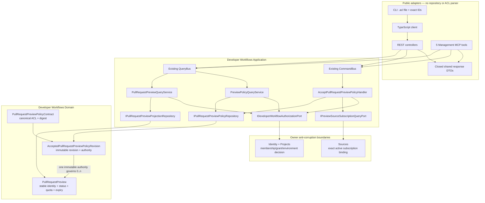

# A3S Cloud Domain Model

## 1. Domain objective

A3S Cloud manages the path from tenant intent to durable, reachable AI
services on operator-owned CPU/GPU infrastructure. AaaS, WaaS, FaaS, and
Durable Cell are first-class product capabilities; shared Inference, static Web
delivery, object storage, source/artifact/package supply, and multi-tenancy
support them. The model must support ordinary OCI applications and A3S-native
Agent, MCP, and Skill assets without pretending that every platform object is
an asset.

Planned I0 adds the first-class shared model-inference service. Aggregated,
independent-replica, gang-distributed, and prefill/decode-disaggregated serving
all compile into managed Workload role slots under the same Workloads/Fleet
path; I0 does not broaden the Asset kind set or create a second deployment or
GPU scheduling engine.

In-progress A1 adds durable Agent conversations, executions, semantic events,
approvals, checkpoints, forks, trajectories, and one provider-neutral Harness
contract. It binds published Asset releases and immutable provider profiles to
Flow, Workloads, Fleet, Runtime, and Box; it does not add another execution
engine, scheduler, node channel, provider-specific controller, or event-log
authority. A3S Code is the native provider rather than the only admissible
Harness.

W0 adds versioned ontologies, Workflow definitions, goals, deterministic plan
revisions, Workflow runs, and human decisions. `W0.1` implements their closed
contract foundation; later gates compile semantic intent to the existing
Operations and A3S Flow path. W0 does not add another workflow engine,
scheduler, graph database authority, or task queue.

Planned FN0 adds immutable Function profiles. A profile selects exactly one
finite Execution/Runtime Task, stateless Workload/Runtime Service, or external
Connector attempt. Workflow nodes and Agent Tools consume the same Function
authority; no Function scheduler, queue, Runtime class, or provider retry
store is introduced.

In-progress APP0 and planned K0/AUT0 add application release/session semantics, RAG
Knowledge and user-file metadata, and definitions that create exact-release
invocations. Every ApplicationRelease and KnowledgePipelineRelease binds an
exact Workflow revision; every durable run still uses Operations and Flow.
These contexts do not add mode-specific runtimes, an ingestion DAG, a trigger
queue, a package manager, a model registry, or another object client.

Planned WEB0 adds immutable Web Asset releases and Application UI bindings.
React/Vue and other static builds are Runtime Tasks whose successful output is
stored once in the shared object authority and served by Gateway. Static Web
delivery is not a per-site Service; SSR/BFF remains an ordinary Service.

Planned EV0 adds authorized evidence-dataset manifests, evaluation suites,
experiments, candidate revisions, promotion decisions, and rollback evidence.
It uses the existing execution, storage, release, rollout, and audit paths; it
does not make telemetry authoritative or add a training scheduler, model/Agent
registry, or deployment controller.

Planned U0 adds tenant desired assignments for signed A3S Use plugin packages.
It does not add a fourth Asset kind or a Cloud package manager. A3S Use remains
authoritative for catalog verification, immutable package generations,
Workspace Grants, Runtime Bindings, capability publication, drain, and
receipt-owned cleanup.

`CELL0` adds the first-class Durable Cell collaboration-state service. A named
Cell may represent a human/Agent room, multi-Agent blackboard, live shared
session, presence object, or another application-local key. Cloud owns
immutable application revisions and exact deployment projections; the
selected provider owns each Cell's state, ownership epoch, alarm, WebSocket
residency, and peer forwarding inside one S0 namespace. It does not add a Cell
table, scheduler, Runtime class, Gateway owner lookup, node channel, or object
client, and it does not replace Agent or Workflow history.

The domain uses ordinary transactional aggregates. It does not event-source all
business data. A3S Flow event-sources long-running operations, and A3S Event
distributes committed facts after the corresponding database transaction.

## 2. Ubiquitous language

| Term | Meaning |
| --- | --- |
| Organization | Tenant and security boundary. Commercial billing remains externally owned. |
| Membership invitation | Immutable offer for one existing exact Principal to receive one ordinary organization Membership role before a bounded expiry; it is not an email address, provider identity, session, or alternate role authority. |
| External identity link | Exact trusted OIDC issuer and subject bound to one Cloud principal under `C0.3`; provider email, session, or group claims never become Cloud authority by themselves. |
| Enterprise identity provider | Immutable planned `C0.5` SAML/OIDC provider revision with trusted metadata/keys, audience, claim policy, and session policy; it reuses Cloud Principals and Memberships. |
| Provisioning binding | Planned `C0.5` SCIM external identity/version bound idempotently to one Principal and explicit Membership lifecycle; provider groups never become implicit Resource Grants. |
| Project | Product grouping owned by one organization. |
| Project attribution profile | Immutable project showback metadata containing a business-owner reference, optional external cost-attribution code, and validated labels; it is not a price or billing account. |
| Personal notification | Exact-Principal in-app projection of one curated committed transactional Outbox fact. Source identity, content, recipient, and resource scope are immutable; only its unread-to-read state may change. |
| Environment | Isolated desired-state namespace such as production or staging. |
| Asset | Hosted reusable A3S unit. Its kind is exactly Agent, MCP, or Skill. |
| Asset revision | An immutable Git commit plus its validated manifest digest. |
| Asset release | An immutable, versioned publication of one asset revision and artifact. |
| Hosted Git repository | Assets-owned mutable Git refs and objects served through the one Hosted Git authority and writer lease; it is not an OCI Registry, object bucket, or Use catalog. |
| OCI Registry | External standards-compliant storage for digest-addressed OCI manifests/blobs. Artifacts owns accepted publication/provenance and Secrets owns credentials; Cloud does not implement the registry. |
| A3S Use Registry | Signed TUF metadata, reviewed catalog records, and immutable cognitive-package targets whose formats and verification are owned by A3S Use; Cloud stores only tenant enrollment/trust evidence and assignments. |
| Use plugin package | One immutable A3S Use package identified by `<publisher>/<name>` that may contribute named Tool Task, Tool Service, MCP, Skill, UI, and OKF surfaces. It is not a Cloud Asset. |
| Plugin registry | An organization-enrolled TUF registry reference and exact trust-root evidence consumed and verified by A3S Use. It is not a Source or OCI registry. |
| Plugin assignment | Environment-scoped Cloud desired state selecting one exact signed package record, named surfaces, one Use workspace scope, one target Plugin Host, and present/enabled intent. |
| Plugin operation plan | Immutable canonical A3S Use plan for install, upgrade, or uninstall. Cloud projects its digest and bounded review evidence but never becomes its apply authority. |
| Plugin host observation | Exact command-bound A3S Use receipt, installed generation, capability generation, and enabled state observed for one assignment generation on one host. |
| Ontology revision | Immutable Workflow-owned schema and semantic graph of object types, relationship types, rules, goals, and constraints. PostgreSQL is authoritative; indexes are projections. |
| Workflow revision | Immutable executable definition bound to one exact ontology revision and closed ACL digest. |
| Workflow goal | Tenant-scoped intent and constraints compiled against one exact Workflow and ontology revision. |
| Plan revision | Deterministic immutable compilation of a goal, policies, inputs, and exact capability references. |
| Workflow run | One semantic execution of an exact plan revision with one correlated Operation and Flow run. |
| Application | Tenant-scoped product identity whose immutable releases select one of six current authoring/delivery projections. It is not a Workflow or Asset. |
| Application release | Immutable publication binding one exact Workflow revision, schemas, delivery policy, authorization policy, and presentation digest. |
| Application template revision | Immutable A3S-native authoring/dependency manifest used to create new drafts through owning commands; it contains no run, session, Secret, or mutable source authority. |
| Application end user | Application-scoped delivery audience identity that may link to an Identity Principal but never gains workspace membership or grants by implication. |
| Application session | Chat or invocation conversation state owning ordered messages and conversation variables for one exact application release policy. It is not Agent or Flow history. |
| Application message variant | Idempotent alternative output linked to one exact source message, release, and input; it never replaces the ordered message or mutates history. |
| Classic Agent application | Applications preset that compiles prompt/model/strategy/Tool/Knowledge policy to an exact A0/A1 Agent profile and wrapper Workflow revision. |
| New Agent application | Applications projection over one reusable exact AgentRelease, HarnessInvocationProfile, A1 conversation/execution, and governed AR0 runtime; it owns no sandbox lifecycle. |
| User file | Tenant-scoped upload/scan/quota/retention identity referencing immutable bytes; it is not a Build Artifact. |
| Knowledge Base | Tenant-scoped RAG corpus authority with immutable index and retrieval policy revisions. It is separate from a Workflow Ontology. |
| Knowledge document and chunk | Provenance-bound source record and deterministic General, Parent-child, or Q&A segment with typed metadata, text/media attachments, and immutable content references. |
| Knowledge Pipeline release | Immutable Knowledge-owned binding to one exact Workflow revision, datasource entrances, global/source-local input schemas, chunk structure, and output contract; it is not an execution engine. |
| Automation definition | Immutable schedule, webhook, plugin-event, or source-event policy that creates an idempotent invocation of one exact ApplicationRelease, WorkflowRevision, or Task target. |
| Automation invocation receipt | Durable deduplication and outcome evidence for one admitted external event or due-time identity; the target owner still owns the resulting run. |
| Connector profile | Immutable outbound HTTP/business connection policy with typed schemas, egress rules, and Secret references; it contains no plaintext credential. |
| Agent conversation | Tenant-scoped logical interaction that owns one monotonic semantic event sequence across executions and forks. |
| Agent execution | One durable run of an immutable Agent release and one exact Harness invocation profile. |
| Harness provider profile | Immutable provider kind, revision, protocol version, capability digest, and Runtime delivery profile selected for one Agent execution. |
| Harness invocation profile | Closed immutable `A1.4` binding of provider, instructions digest, environment/security policy, Agent, Skill, MCP, model, workspace, Secret references, Tools, and capability expectations for one execution. |
| Agent semantic event | Immutable ordered conversation fact such as model output, tool request/result, approval, checkpoint, failure, or terminal outcome; it is not Flow history or a Runtime log. |
| Agent approval checkpoint | Grant-checked durable decision boundary that prevents Harness progress until an explicit allow, deny, expiry, or cancellation outcome commits. |
| Agent execution checkpoint | Digest-addressed immutable logical execution state used for verified resume or fork lineage. |
| Function release | Immutable Function code/artifact and closed profile selecting `hosted_task`, `hosted_service`, or `external`; it is not a Runtime subtype. |
| Function invocation | Tenant/parent/target/attempt/input/deadline/idempotency authority delegated to Executions, Workloads, or Connectors according to the exact Function profile. |
| Web release | Immutable verified static bundle manifest, object-prefix identity, entry point, MIME/cache/CSP policy, SPA fallback, provenance, and retention evidence. It is not a running Service. |
| Application UI binding | Exact Application or Agent release to Web-release and Edge-route correlation; it contains no browser-owned business state or hidden backend. |
| Evidence dataset | Immutable manifest of tenant-authorized, redacted, retention-bound evidence references with complete provenance and explicit gaps. |
| Evaluation suite | Immutable evaluator, reward-policy, baseline, integrity, and acceptance-policy revision. |
| Evolution experiment | One Flow-coordinated evaluation or candidate-generation intent bound to exact dataset, suite, inputs, and compute policy. |
| Candidate revision | Immutable proposed model, Agent, Harness-policy, or Workflow artifact that is not production desired state. |
| Promotion decision | Audited approval, rejection, halt, or rollback decision bound to exact candidate, evidence, policy, and target revision. |
| Security incident projection | Tenant- and grant-scoped `C0.3` investigation timeline derived from shared audit and authorized evidence references; it is not desired state or enforcement authority. |
| Source | Origin used to produce a workload revision: hosted asset release, external Git commit, or OCI digest. |
| Source webhook delivery | An authenticated Sources-private provider envelope keyed by provider and delivery ID with one closed push or pull-request payload; first acceptance atomically derives exact active-Subscription outputs, while replay is silent and changed content conflicts. |
| Verified pull-request change | An authenticated provider fact for one bounded open, synchronize, reopen, or close action with exact repository, branch, commit, pull-request, provider creation/update times, and raw-payload-digest evidence; it is not accepted Preview state. |
| Committed pull-request change | An immutable Sources Published Language fact for one exact active Subscription's view of a verified change. It contains semantic tenant/repository/branch/commit/PR/provider-time evidence and a stable opaque ID, but no provider delivery ID, signature, raw body, or raw-body digest. |
| BuildPlan proposal | A transient, canonical, reviewable P0 detection result bound to an exact source-layout identity, detector revision, evidence digest, project root, and Sources-owned build recipe; it is not accepted desired state. |
| Accepted BuildPlan | An immutable Developer Workflows-owned acceptance contract bound to one exact Sources-owned revision and project root; actor/time are audit facts outside its deterministic ACL digest. |
| Pull-request Preview | Developer Workflows lifecycle projection with a stable logical identity and deterministic ordinary Environment identity, exact source-subscription/PR and immutable policy-revision authority, provider-time/content ordering, owner, bounded lifetime/quota, fork trust, and cleanup decision; Projects, Sources, Workloads, Edge, and Operations retain their resource authorities. |
| Pull-request Preview projection receipt | Immutable Developer Workflows evidence that one opaque Sources fact reached one terminal local projection outcome and optional Preview version. It detects content/binding drift but is not an Inbox, queue, retry, or provider-delivery record. |
| Committed Preview lifecycle | Owner-neutral Developer Workflows fact for one exact committed Preview aggregate version. It freezes policy, source/PR, Environment identity, trust, quota, status, correlation, and causation evidence without exposing another context's aggregate or private provider delivery. |
| Preview Environment handoff | Consumer-owned Application request that asks Projects to ensure the one deterministic ordinary Environment for an active Preview. Projects alone validates and persists the aggregate, idempotency, uniqueness, and event. |
| Preview SourceRevision projection receipt | Immutable Sources evidence that one exact Preview version created or adopted an ordinary SourceRevision, required cleanup, was suppressed by an inactive Subscription, or was stale. It is a version fence, not another SourceRevision lifecycle or delivery queue. |
| Committed Preview SourceRevision lifecycle | Bounded Sources Published Language fact carrying the exact ordinary SourceRevision evidence for an active Preview version, or an explicit cleanup/suppression state with no revision. Artifacts consumes it without querying Sources storage. |
| Preview build lifecycle projection receipt | Immutable Artifacts version/admission/retirement fence that binds an exact Preview version to its optional candidate and prior BuildRun retirement evidence. It is not an Inbox, build queue, retry scheduler, or second BuildRun lifecycle. |
| Artifact | Content-addressed build output or bundle. OCI artifacts use a manifest digest. |
| Inference model | Tenant-scoped logical model with immutable, resolved model revisions. It is not an Asset. |
| Model revision | Immutable semantic model revision owning architecture, task/modality, context and compatibility, exact source, license/trust, derivation lineage, and admitted weight-variant references; it stores no weight bytes. |
| Model weight variant | Immutable precision/quantization/format/tokenizer compatibility selection bound to one exact Artifacts-owned model manifest. |
| Model artifact manifest | Canonical path-sorted file/shard roles, digests, sizes, root digest, provenance, and shared-object references for weights, tokenizer/config, model card, license, and notices; Artifacts owns it. |
| Node model cache observation | Fleet-owned age-bounded proof of verified manifest/files and cache capacity on one node; it is applied state, not model availability or durability truth. |
| Inference backend | Versioned, typed compiler profile that turns one model-serving revision into a generic Workload execution plan. |
| Inference deployment | Environment-scoped model-serving intent projected into a closed set of inference-managed Workload role slots. |
| Inference role slot | Stable `serve`, `prefill`, `decode`, or independently gated `encode` projection key for one managed Workload whose replicas scale together; a replica may itself be a gang placement group. |
| Inference serving cohort | Complete Gateway-visible set of required role endpoints bound to one compatible model, backend, deployment revision, and rollout generation. |
| Inference route | External model name, target and fallback policy projected into an Edge target set. |
| Workload | Environment-scoped desired long-running service. It is not an Asset. |
| Workload revision | Immutable desired runtime specification derived from one source. |
| Deployment | One attempt to make a workload revision active on a node. |
| Scaling policy revision | Immutable Workloads-owned bounds, targets, windows, change rates, cooldowns, zero policy, availability budget, and state-safety requirements. |
| Scaling signal window | Bounded source-attributed demand/capacity summary used as evidence; it is never desired replica truth. |
| Scaling decision | Idempotent Workloads mutation bound to one control generation, policy digest, signal-window digest, quota result, reason, and resulting placement generation. |
| Drain lease | Generation-bound closure of new admission plus a deadline and exact request/session/checkpoint/fence evidence required before retirement. |
| Capacity intent | Future Compute-owned pool capacity request derived from pending Claims and safety headroom; it cannot select placement or commit Claims. |
| Node | Enrolled Linux execution target running the A3S Cloud node agent. |
| Observation | Node-reported fact about the current provider resource and health. |
| Log chunk | One ordered stdout/stderr position for a Runtime unit generation, stored as verified object bytes with authoritative metadata until body retention leaves a durable tombstone and later compaction leaves a durable sequence range. |
| Provider log gap | One ordered, bodyless cursor-loss or source-disconnect boundary for a Runtime unit generation. |
| Route | Domain/path mapping from A3S Gateway to one healthy workload revision. |
| Gateway route cutover | Durable candidate route set and exact Gateway publication identity used to replace all routes for one workload update without mutating the active rows before acknowledgement. |
| Domain claim | Tenant-scoped proof that an exact or one-label wildcard DNS pattern may be routed. |
| Gateway certificate | Public certificate lifecycle bound to one node, claim set, Gateway revision, command, and snapshot digest. |
| Managed database | Stateful platform service with an engine contract, persistent volume, backup policy, and lifecycle. It is not an Asset. |
| Persistent volume | Node/provider-backed durable storage with explicit attachment, retention, and backup state. |
| Backup | Immutable, verified snapshot descriptor stored outside the source volume. |
| Durable Cell application | Tenant/project/environment identity for one immutable named-state program and one dedicated provider Service fleet. It is not a Workload or Asset. |
| Durable Cell application revision | Immutable bundle/provenance, compatibility and state-migration policy, declared Cell classes/bindings, exact Service-profile digest, retention policy, and deployment projection inputs. |
| Durable Cell Service profile | Canonical ACL fixing the provider protocol, dedicated-fleet isolation, SQLite/single-writer/epoch/durable-ack guarantees, handler/storage requirements, distinct ports, and traffic bounds. |
| Durable Cell | Application-addressed shared human/Agent collaboration name whose SQLite lineage, serialized turns, ownership epoch, alarm, WebSocket residency, and activation state belong solely to the selected provider; it is intentionally not a Cloud aggregate. |
| Secret | Tenant-owned secret identity with immutable encrypted versions. |
| Operation | Durable A3S Flow run coordinating a deployment, build, backup, restore, rollback, or repair. |

Terms such as resource, package, release, and status must not be used without
their bounded context. An asset release, deployment result, and catalog listing
are different facts.

## 3. Bounded contexts

### 3.1 Identity and access

Owns stable human and service Principals, organizations, Membership roles,
exact-Principal MembershipInvitations, Principal-bound API credentials,
revocation, Resource Grants, exact human-Principal recipient contacts and their
one-time verification challenges, exact external OIDC subject links and one-time
login/link flow persistence under `C0.3`, component-only installation Trust
Domains and exact Workload Identity Policy revisions under `H0.4-WI1-C1`,
  component-only explicit platform scope, role-policy revisions and role bindings
  under `C0.5-MT1-C1`, component-only tenant-support grants and privileged
  decision evidence under `C0.5-MT1-C2`, canonical persisted Installation and
  shared scoped fact persistence under `C0.5-MT1-C3`, and planned SAML/OIDC
  provider, SCIM, and session policy under
`C0.5`, and tenant context. It answers who may
issue a command. It does not decide runtime placement, treat a credential as a
role, treat an identity-provider session as Cloud authority, issue workload
credentials without exact Fleet/Runtime attestation, own network enforcement,
or store asset collaborator data in an unvalidated metadata document.

Primary aggregates:

- `IdentityPrincipal`
- `Organization`
- `Membership`
- `MembershipInvitation`
- `ApiToken`
- `ResourceGrant`
- `RecipientContact` and transient `RecipientContactVerification`
  (`C0.3-N5a` domain, migration, repositories, application boundary, proof
  adapter, and verified PostgreSQL evidence are implemented; `C0.3-N5b` adds
  production proof-provider and API/Worker composition; `C0.3-N5c` verifies
  the Worker-only SMTP verification-delivery state machine against PostgreSQL
  17, NATS JetStream, and Mailpit; `C0.3-N5d` implements the exact-owner
  REST/client/CLI and redacted-safe Management MCP self-service surface)
- `ExternalIdentityLink` and transient `OidcFlow` (`C0.3` persistence, the
  internal discovery/JWKS/ID-token adapter, and begin/complete application
  composition are implemented; production wiring and public callback surfaces
  remain gated)
- `EnterpriseIdentityProvider` and `ProvisioningBinding` (planned `C0.5`)
- `IdentitySessionPolicy` (planned `C0.5`)
- `PlatformRolePolicy` and immutable `AcceptedPlatformRolePolicyRevision`
  (`C0.5-MT2-C1` persists immutable revision history and one exact current head
  with predecessor CAS through the sole Identity repository)
- `PlatformRoleBinding` (`C0.5-MT1-C1` component lifecycle implemented;
  `C0.5-MT2-C1` adds version-CAS persistence, active-Principal loading,
  self-escalation denial, owner-only owner administration, deferred last-owner
  recovery, idempotency and Installation-scoped Audit/Outbox; Application and
  cross-surface authorization remain open)
- `TenantSupportGrant` (`C0.5-MT1-C2` canonical ACL and terminal component
  lifecycle implemented; approver/current-head loading, persistence and
  interfaces remain open)
- `TrustDomain` and immutable `TrustDomainRevision` (`H0.4-WI1-C1` component
  contract implemented; persistence and interfaces remain open)
- `WorkloadIdentityPolicy` and immutable
  `WorkloadIdentityPolicyRevision` (`H0.4-WI1-C1` component contract
  implemented; exact execution-attestation binding remains `WI2`)

#### Platform scope and RBAC (`C0.5-MT1-C1/C2/C3` foundation)

The shared `ScopeContext` is one closed resolved identity value with exactly
four forms: Installation, Organization, Project and Environment. Every child
repeats and validates its full parent lineage. `CloudScopeRef` is the matching
published reference for an uncommitted fact: an Installation reference names
the exact Installation, while a tenant reference carries its complete tenant
lineage. The single PostgreSQL persistence boundary locks canonical owner rows,
resolves the owning Installation, and only then admits a full `ScopeContext`.
Containment and intersection can only retain or narrow an already admitted
scope; an equal child UUID under another parent, an ambient request value or a
Workspace cannot expand authority. Installation records therefore need no
synthetic Organization. Neither value carries tenant, project, audit,
deployment or Runtime lifecycle into the shared kernel.

Identity owns canonical `cloud.identity.platform-role-policy.v1` A3S ACL,
closed `PlatformPermission` IDs, the four role bundles `platform_owner`,
`platform_admin`, `platform_operator` and `security_auditor`, plus deterministic
accepted revisions and installation-scoped role bindings. Immutable ceilings
prevent policy-defined privilege expansion; the owner retains the closed
recovery permission set. A binding names a role. The component
`PrivilegedAuthorizationDecision` resolves an active Principal, current
accepted policy and active exact-installation bindings rather than copying
permissions or pinning every binding to an obsolete revision. Its immutable
canonical-JSON evidence embeds that exact ACL revision/snapshot/digest and
reuses the one SHA-256 decision-reference representation.

Platform permission never implies tenant source, payload, Secret, model
credential, Cell state or runtime-exec access; that requires a separate bounded
canonical `cloud.identity.tenant-support-grant.v1` plus an active exact human,
an active binding admitting `platform:tenant-support:use`, a descendant scope
and one closed non-sensitive support permission. Grants are bounded,
  non-renewing and terminally revocable; break-glass requires tenant notification
  plus an independent security alert and post-incident review. `MT1-C3` adds
  migrations `174`-`176`: one database-owned immutable Installation,
  Organization ownership, and exact scope columns on the existing Audit and
  Outbox tables. Platform facts have a null Organization; one shared trigger
  derives omitted scope only for old tenant writers from existing lineage, while
  omitted Installation scope fails closed. One insert-time lineage trigger
  shared by both fact tables key-share
  locks and verifies live tenant lineage only when a fact is inserted; immutable
  fact snapshots then outlive tenant aggregate deletion without cascading or
  mutating identity. Scope lineage is immutable, and the existing relay and
  audit authority remain singular. Migration `177` and the one
  `IPlatformRbacRepository` now persist accepted policy history, its exact head
  and versioned bindings under the canonical Installation-row lock. Initial
  policy/owner visibility, idempotency, self-escalation and last-owner recovery,
  Audit and Outbox commit atomically and database triggers reject direct-SQL
  bypass. Migration `178` and the sole support repository now persist actual
  approval evidence and terminal grants. The `MT2-C3` core also provides one
  registered Application command and one Identity/PostgreSQL decision port:
  it share-locks the current Principal, API token, policy/binding and optional
  exact grant, then commits the complete digest-bound allow through shared
  scoped Audit. That same transaction-local issuer is now the only
  authorization step inside all seven non-bootstrap platform-RBAC and
  tenant-support mutations. Their repository writes carry actor Principal and
  exact credential identity only; the concrete use case owns the closed
  permission/action/scope/resource tuple, derives authentication evidence from
  the issued decision, and commits the protected business fact with a reference
  to it. Maintained concrete surfaces still need to derive those identities
  from verified request context; `MT3` then removes the legacy boolean
  administrator bypass. Until that cross-surface work lands, persisted RBAC is
  not general production authority.

#### Workload trust contract (`H0.4-WI1-C1` component)

Identity owns canonical `cloud.identity.trust-domain.v1` and
`cloud.identity.workload-policy.v1` ACLs. A Trust Domain binds one installation
to exact non-secret provider-profile and trust-bundle digests, allowed
node-attestation profiles, identity formats, credential bounds, revocation
mode, and explicit federation bundles. A Workload Identity Policy binds one
Organization/Project/Environment, Workload revision, closed product role,
node pool, semantics profile, Runtime Unit class and isolation level,
credential rotation policy, audiences, private service names, and peer-policy
revision digests.

The Contracts published language supplies Runtime's exact `Task`/`Service` and
isolation types, so Identity neither imports Runtime execution authority nor
creates parallel Agent, Function, Cell, inference, or system-service identity
classes. Accepted revisions derive deterministic IDs from stable owner,
revision number, and canonical contract digest. Repository ports carry an
expected predecessor revision; Redis or a distributed lock cannot replace
that durable compare-and-swap fence.

The replaceable provider port can inspect only capability and exact observed
root/federation trust-bundle evidence; a federation support boolean is not
accepted as proof. It cannot issue credentials, receive private keys, or
mutate a provider registration database. PostgreSQL persistence, authorization,
transactional Outbox/audit, REST/OpenAPI/client/CLI/Management MCP, exact
Fleet/Runtime attestation, local credential delivery, discovery, peer policy,
enforcement, revocation drills, and real-provider evidence remain open. No
workload identity availability is claimed by `WI1-C1`.

#### Verified recipient contact (`C0.3-N5a` implemented component)

Identity owns one opaque `RecipientContactId` for each exact human Principal and
canonical email mailbox. A contact begins pending and is never eligible for
notification delivery until an exact short-lived `RecipientContactVerification`
proof is cryptographically verified and consumed once. The proof binds its
contact ID, Principal, canonical-address digest, contact version, challenge ID,
signing-key identity, issue time, and expiry. Reissuing a challenge invalidates
every older pending challenge for that contact. Verification increments the
contact version atomically with challenge consumption; replay, expiry,
wrong-contact, wrong-Principal, address/version drift, and stale-key proof fail
closed. Revocation is version-checked, terminal for that contact identity, and
takes effect on the next resolution.

Only the exact active Principal may begin, inspect, complete, or revoke its
contact. Neither an OIDC `email`/`email_verified` claim, Membership metadata,
organization administrator, presentation input, nor Notifications may assert
verification. The canonical mailbox is PII retained only by Identity; list and
mutation results are redacted, while one internal exact-owner resolver may
return it only for an active verified contact. Notifications may later store
the opaque contact ID in a new immutable subscription revision and resolve it
at each dispatch, so contact revocation is immediate and no address copy is
created.

The verification-requested, verified, and revoked transactional Outbox facts
and shared audit records carry opaque IDs, closed state, canonical-address
digest, versions, and timestamps only. They never carry the mailbox, proof,
signature, provider response, or Secret material. A token signer/verifier port
owns proof cryptography; later SMTP challenge delivery must use the existing
Outbox/A3S Event and fenced provider evidence rather than a synchronous
presentation side effect. Migration `136`, the in-memory and PostgreSQL
repositories, begin/complete/revoke commands, exact-owner queries, the
HMAC-SHA-256 token adapter, and focused application tests are implemented. The
[successful PostgreSQL 17 H0 job](https://github.com/A3S-Lab/Cloud/actions/runs/32583260303/job/97055668058)
proves migration `136`, exact ownership, reissue invalidation, single-use
completion, redacted evidence, active verified resolution, and terminal
revocation. Challenges retain their initiating organization for
Outbox/audit correlation even though contact identity remains Principal-global.
N5b supplies production proof-provider wiring and N5c supplies one-shot SMTP
challenge delivery. N5d supplies the exact-owner REST/client/CLI surface and
redacted self list/get/revoke through Management MCP. General Notifications
SMTP composition remains open. This
boundary adds no directory, email inference, plaintext proof store, provider
configuration, queue, scheduler, retry counter, or SMTP client.

`C0.3-N5b` implements only proof-provider and process composition. The N5a proof
port is asynchronous. Development owns one restart-stable local HMAC key
file beneath `security.state_dir`; production delegates HMAC SHA2-256 to Vault
Transit through the shared bounded HTTPS client, so private key material never
enters Cloud memory. One closed logical signing-key ID remains in the challenge
claims, while Vault's opaque physical key version remains inside the proof
authenticator and is checked by Vault. Provider selection and key identity use
the existing `security` A3S ACL, and production fails closed unless the proof
provider is Vault. Both providers preserve the bounded `a3srcv1` envelope,
redacted diagnostics, exact key/expiry checks, and the rejected-versus-
unavailable error boundary. The existing recipient-contact repository and its
five CQRS handlers enter the sole API/Worker composition root, with completion
using the one configured proof provider. This slice owns
no new aggregate, table, migration, SMTP client or delivery fact, presentation
surface, notification subscription, provider profile, Secret record, queue,
scheduler, retry mechanism, or configuration language.

`C0.3-N5c` implements one Identity-owned verification-delivery component. Its
deterministic identity is the existing challenge/event ID. A delivery moves
from a lease-fenced pre-dispatch reservation to `dispatching`, then exactly one
of `delivered`, `rejected`, `indeterminate`, or `obsolete`. Before
`dispatching`, Identity resolves the exact still-current pending challenge and
its canonical mailbox, issues the N5b proof, and prepares the external relay's
TLS and authentication session. The repository rechecks the challenge and
persists the dispatch fence before the first SMTP envelope or message command.
Once that fence exists, no replay can authorize another provider call: a lost
or unknown result becomes `indeterminate`, and recovery requires an explicit
new challenge. A reissued, consumed, expired, revoked, drifted, or disabled-
Principal challenge becomes `obsolete` without SMTP access. Terminal state is
durable before A3S Event ACK, so ACK loss is ACK-only replay.

Migration `137` retains only the opaque challenge/event identity, fence and
lease, closed state, and timestamps. The canonical mailbox, proof, full message,
SMTP credentials, and provider response text remain memory-only and are absent
from database rows, Outbox, audit details, logs, and `Debug`. One top-level
`smtp` A3S ACL chooses `disabled` or an external relay and pins a canonical
sender, implicit TLS or required STARTTLS, optional explicit trust root,
environment-backed paired credentials, and bounded timeouts. Production rejects
disabled or downgrade-prone delivery. In-process protocol fixtures cover
TLS/authentication, one submission, permanent rejection, ambiguous final
response loss, and downgrade rejection; repository, event-consumer,
configuration, composition, and migration coverage pass locally. The
[successful PostgreSQL 17, NATS JetStream, and Mailpit H0 job](https://github.com/A3S-Lab/Cloud/actions/runs/32594431022/job/97083071084)
proves migration `137`, exact authority/redaction guards, authenticated required
STARTTLS, one captured submission, durable terminal replay, and the Relay/Worker
composition. The same run's
[successful Rust 1.88 job](https://github.com/A3S-Lab/Cloud/actions/runs/32594431022/job/97083071082)
retains the full-workspace, strict Clippy, formatting, and documentation gates.
N5c is not a general Notifications SMTP channel, an HTTP
Connector subtype, a second queue/retry/scheduler authority, a template system,
or a public recipient-contact interface.

`C0.3-N5d` implements a presentation-only self-service boundary over the
existing five recipient-contact CQRS handlers. An authenticated credential
supplies the organization and exact actor Principal; the client can never name another
Principal, and the repository continues to require that actor to be an active
human with an active Membership. `cloud:read` authorizes exact-self list/get,
while `identity:write` authorizes begin, complete, and version-checked revoke.
No organization administrator can inspect or mutate another Principal's
contact through this surface.

REST/OpenAPI `1.52.0` and the maintained client expose only the opaque contact
and Principal IDs, canonical-address digest, `***@domain` hint, closed status,
aggregate version, timestamps, and mutation replay state. The challenge ID,
mailbox, and proof are never responses. Mailbox and proof enter only their
separate closed, bounded HTTPS request bodies; OpenAPI marks proof write-only.
CLI consumes each private value only from bounded stdin, clears the mutable byte
buffer, and never accepts it in argv or emits it in output, diagnostics, or
remapped errors. Management MCP exposes redacted list/get and optimistic revoke
only: begin and complete are absent because mailbox and proof must not become
model-visible tool arguments. N5d adds no aggregate, repository, migration,
business rule, configuration, event, provider, queue, scheduler, notification
subscription, general SMTP channel, or second authorization path.

Focused HTTP, OpenAPI, maintained-client, CLI, Management MCP catalog,
permission, lifecycle, replay, strict-input, and redaction tests pass across
this boundary.

`C0.3-N5e` implements and provider-certifies the general Notifications SMTP
composition. It does not add another contact or subscription aggregate.
`cloud.notification.outbound-subscription.v4` is SMTP-only and binds the exact
recipient Principal's opaque
`RecipientContactId`, existing severity floor and immutable one-through-eight
attempt budget, with an optional bounded event-time cutoff. The domain target is
a closed Connector-or-recipient-contact union: signed webhook and
Slack-compatible v1-v3 definitions retain their exact Connector target and
byte-compatible delivery-v1/v2 facts; SMTP v4 produces delivery-v3 with the
contact ID and immutable notification content only.

Identity remains authoritative for the contact, its mailbox, the human
Principal, Membership, verification, and revocation. Subscription admission and
every provider attempt use an organization-scoped resolver. Definitive authority
loss yields a Notifications-owned `obsolete` terminal receipt without SMTP
access, while an unavailable resolver leaves the A3S Event fact unacknowledged.
No mailbox, digest/hint, credential, composed message, or Provider text may
enter the ACL, event, persistence, audit/idempotency evidence, logs,
diagnostics, or `Debug`.

Notifications owns the SMTP delivery attempt state. Each deterministic
generation is lease-reserved, fully prepares contact resolution, fixed bounded
plain-text composition, TLS, EHLO, and authentication, then durably crosses a
`dispatching` fence before the first envelope or message command. It shares only
the low-level SMTP session transport already used by N5c; it neither invokes the
Identity verification workflow nor writes a synthetic Connector attempt.
Accepted, permanent-rejected, explicit transient-rejected, and unknown
post-fence results become exact Delivered, Rejected, Retryable, or terminal
Indeterminate evidence. Only Retryable evidence admits the next generation;
equality with the pinned bound yields Exhausted. Terminal receipts commit before
A3S Event ACK, and post-terminal replay is ACK-only.

The [retained H0 provider job](https://github.com/A3S-Lab/Cloud/actions/runs/32607194447/job/97113956621)
proves migration `138`, the exact authority and fence transitions, accepted,
rejected, retryable/exhausted, indeterminate, and obsolete outcomes, terminal
ACK-only replay, and provider-call isolation over PostgreSQL 17, NATS JetStream,
and authenticated required-STARTTLS Mailpit.

### 3.2 Projects

Owns `Project`, its current immutable attribution-profile reference, and
`Environment`. An environment belongs to exactly one project and carries
configuration isolation boundaries. Deleting an environment is a workflow,
not a cascade hidden inside one request transaction. Project attribution is
non-monetary metadata for audit and usage showback; this context does not own
pricing, balances, invoices, settlement, tax, or commercial entitlements.

Primary aggregates:

- `Project`
- `ProjectAttributionProfile` (immutable revision selected by the Project)
- `Environment`

### 3.3 External sources

Owns tenant-to-provider installation identity, authenticated source-provider
delivery facts, and immutable external application source revisions accepted
after provider resolution. It deliberately does not own hosted A3S assets,
mutable provider refs, durable provider credentials, build execution,
artifacts, or deployments.

Primary aggregates:

- `GithubConnection`
- `GithubConnectionFlow`
- `GithubRepositorySubscription`
- `ExternalSourceRevision`
- `SourceWebhookDelivery`

The initial provider is GitHub. Provider adapters may resolve convenient refs,
but the immutable revision accepts only a canonical repository identity, a full
commit object ID, and an explicit versioned build recipe. The GitHub App
connection flow verifies one installation through OAuth user authority. An
environment-owned repository subscription then binds that connection and
installation to one canonical repository, exact branch, and recipe. The
provider inbox authenticates and deduplicates a closed push-or-pull-request
payload; only a new push delivery may create revisions through matching active
subscriptions. A new pull-request delivery instead commits one immutable
`source.pull-request-change.committed@1` fact for each exact matching active
Subscription through the existing transactional Outbox.
Connection, subscription, inbox, and revision state contain no durable provider
credential. A bounded installation-authority reconciler polls GitHub with an
App JWT and persists only typed lifecycle/account observations plus generic
check health. The same authority boundary is required immediately before any
private-repository credential is issued.

Pre-acceptance repository and ref discovery is an Application query model, not
an aggregate. The query restores the current `GithubConnection`, applies the
same `SourceRepositoryPolicy`, and asks one revalidating provider port for a
bounded page of installation-accessible repositories or branch/tag names. Its
opaque cursor is bound to organization, connection, installation, repository,
kind, and page size as applicable. Provider results are revalidated before
projection; repositories or ref names outside the existing safe-name value
objects are omitted without weakening acceptance rules. A discovered name
remains mutable provider information: it creates
no subscription or `ExternalSourceRevision`, and only the existing acceptance
authority may convert an exact selected ref into a full immutable commit.

Migration `156` extends the single `source_webhook_inbox` with a typed event
discriminator and exact PR evidence. The `(provider, delivery_id)` natural key
remains the sole delivery deduplication authority; a repeated identical
delivery emits no fact, changed content conflicts, and Outbox failure rolls
back the Inbox and complete Subscription fanout. A stable
`SourcePullRequestChangeId` is derived from Subscription, provider, and the
private delivery identity. Only the opaque ID plus exact tenant, Subscription,
installation, repository, branch, commit, PR, action, merge, and provider-time
semantics cross Published Language. Signature, delivery ID, raw body, and
raw-body digest do not. Pull requests create no `ExternalSourceRevision` and do
not use the push-only revision-delivery reservation.

For synchronous build admission, Sources publishes one immutable
`SourceBuildInputSnapshot` under schema
`a3s.cloud.source-build-input.v1`. A Sources Application service exposed by the
root facade projects it only from a fully validated `ExternalSourceRevision`.
The snapshot contains the minimum exact build input: Organization, Project,
Environment and revision identities, canonical repository, full commit ID,
versioned `BuildRecipe`, and a typed recipe digest. It excludes
connection/provider state, credentials, timestamps, and aggregate version
metadata. Consumers cannot construct or mutate an unvalidated snapshot; they
do not receive Sources aggregate behavior or repository semantics.

### 3.3.1 Developer workflows

Owns bounded, deterministic inspection of an already identified source layout
and emits versioned reviewable BuildPlan proposals. Component-only `P0.1-C1`
binds every proposal to the exact source identity, commit, whole-layout content
digest, detector kind/revision, evidence file/digest, project root, and existing
Sources-published Dockerfile `BuildRecipe`. The source-layout snapshot is canonical,
bounded, sorted, and independent of a local checkout directory.

The initial closed detector set contains Dockerfile and A3S Asset ACL detection.
The latter consumes the Assets-owned `.a3s/asset.acl` parser and is authoritative
over heuristics, so P0 does not reinterpret or copy Asset semantics. This context
does not accept Source revisions or own build execution, Artifacts, Workloads,
Routes, product interfaces, or scheduling.

Component-only `P0.1-C2` owns the explicit acceptance decision without taking
Sources authority. Canonical `a3s.cloud.build-plan.v1` embeds one exact C1
proposal plus its existing `SourceRevisionId`. Its digest excludes actor, time,
checkout, and adapter state; a deterministic `BuildPlanId` and natural key admit
one immutable acceptance per Source revision/project root. An
authorization-first internal command asks the Developer Workflows-owned
`IDeveloperWorkflowAuthorizationPort` with the closed `accept_build_plan`
action, then verifies exact source identity, commit, recipe, scope, and time
through a typed Sources port. Identity grant evaluators and policy types do not
enter the command. Migration `146` persists
canonical ACL, redundant closed evidence, idempotency, audit, and Outbox
atomically, reparses ACL on reads, and rejects mutation.

`P0.1-C4` now production-composes that internal command without changing the
model. One Developer Workflows Infrastructure adapter implements the existing
consumer authorization port by validating active Identity Membership/Resource
Grant evidence, reusing Identity's sole `ResourceAccessEvaluator`, and querying
the exact Projects Environment only after scope admission. The existing
Sources adapter remains the only source-revision evidence boundary, and the
existing BuildPlan repository remains the only acceptance transaction.

`P0.1-C5` closes the trusted accepted-revision SourceLayout boundary. The
internal detection query now carries exact scope, `SourceRevisionId`, and
Principal identity instead of caller-authored source bytes. It authorizes
through the same Developer Workflows port before one consumer-owned layout
port queries Sources' existing published build input. Sources alone resolves
its revision, while one repository-credential authority shared by revision
resolution and checkout alone restores the connection, validates installation
authority, and issues the ephemeral token. The checkout coordinator owns the
public/private fallback, immutable receipt, canonical file inventory, replay
fence, and transient cleanup. Replay is a separate credential-free operation;
it cannot recreate a missing checkout through a provider. Only the bounded
SourceLayout value crosses back; provider credentials and local paths do not.
The same authorized checkout service supplies the existing Artifacts archive
adapter, so C5 adds no second checkout, source-inventory traversal, credential
resolver, cache, queue, or lifecycle mechanism. Public interfaces,
pre-acceptance source discovery, BuildRun, Workload, Route, Operation,
scheduling, and downstream lifecycle handoffs remain outside this slice.

`P0.1-C6` exposes the existing detection and acceptance authorities without a
second workflow mechanism. One Application `BuildPlanQueryService` owns
accepted-plan read authorization, exact scope and canonical ACL validation,
the bounded page rule, and strict `(project_root, BuildPlanId)` ordering through
the repository interface. The REST controller and four Management MCP tools
dispatch only the existing typed commands/queries and share one response
projection; the maintained client and CLI remain transport adapters over REST.
Detection/list/get require coarse `cloud:read`, acceptance requires
`build:write`, and the shared Developer Workflows authorization port remains
the exact membership, Resource Grant, and Environment authority. Closed inputs
accept only identities and canonical `proposalAcl`. Outputs retain canonical
proposal/contract ACLs plus typed evidence while excluding source bytes,
credentials, checkout receipts, and local paths. C6 adds no parser, table,
migration, evaluator, provider, checkout, cache, queue, worker, Relay, scheduler,
or downstream lifecycle state.

Component-only `P0.2-C1/C2` owns explicit workload-profile intent and its
acceptance history. Canonical `a3s.cloud.workload-profile.v1` binds a closed
`web`, `worker`, or `scheduled_task` profile to one exact accepted BuildPlan;
stable profile identity spans source updates while an immutable continuous
revision identity binds each accepted contract. Authorization precedes ACL
parsing and replay through the same port's closed `accept_workload_profile`
action. Migration `147` stores canonical ACL, redundant exact-plan
evidence, idempotency, audit, and Outbox atomically and rejects update, delete,
scope drift, or sequence gaps. Identical current content converges only for the
same actor; a distinct actor acceptance remains a new audit-visible revision.

The Domain owns workload-profile process, Secret-binding, resource, port, and
health proposal values rather than embedding Workloads or Executions models.
The compilation service queries the consumer-owned
`IWorkloadBuildOutcomePort` by exact Organization and `BuildRunId`; it receives
only the immutable `a3s.cloud.developer-workflow-build-outcome.v1` view needed
to prove the exact BuildPlan ID/digest, source, recipe, attestation chronology,
and digest-pinned OCI output.
BuildRun state, retry, cleanup, publication, and aggregate-version mechanisms
remain private to Artifacts. Application submits the accepted local proposal
through `IServiceProfileAdmissionPort` or
`IScheduledTaskProfileAdmissionPort`; only the owning adapter may translate it
to a Workloads `ServiceTemplate` or Executions `ExecutionTemplate`, run the
owner's admission rules, and return an immutable contract-digest receipt.
That receipt is correlated to the target kind, complete Organization/Project/
Environment/BuildPlan/BuildRun/Source/Profile context, and exact Artifact
digest, so a stale or cross-target owner response fails closed. Developer
Workflows does not retain either owner template. Component-only `P0.2-C3a/C3b`
confine the concrete Workloads and Executions translations to one Infrastructure
adapter per owner; they use the existing `ServiceTemplate`/`ExecutionTemplate`
validation and digest contracts and return only the consumer receipt. The
scheduled profile's schedule remains in the compiled result and no adapter
creates a timer or scheduler row.

Component-only `P0.2-C3c` makes the build input equally explicit. Artifacts
owns `a3s.cloud.external-source-build-outcome.v1` and the owner-side query that
can project it only from a terminal, successful, verified external-source
BuildRun. The Published Language carries source/recipe, digest-pinned OCI,
provenance, attempt/version/Operation, and chronology evidence, but it has no
BuildPlan or lifecycle vocabulary. The sole Developer Workflows Infrastructure
adapter combines that owner fact with the deterministic exact accepted
BuildPlan loaded through the local repository, validates the complete binding,
and returns the existing consumer-owned view. It imports no Artifacts Domain or
Infrastructure model and creates no persistence, event, relay, queue, worker,
Operation, or lifecycle.

`P0.2-C4` production-composes one internal exact accepted-revision compilation
query. It loads the accepted BuildPlan and immutable workload-profile revision
only through local repository interfaces, verifies their exact identity and
relationship, and traverses the sole Artifacts, Workloads, and Executions
anti-corruption adapters. The result retains logical profile, revision, and
revision-number causation but creates no owner state.

`P0.2-C5` production-composes the existing authorization-first acceptance
command. The composition root constructs one
`Arc<dyn IDeveloperWorkflowAuthorizationPort>` shared with BuildPlan acceptance,
so both commands reuse the same Identity evaluator and exact Projects
Environment boundary. The command still owns only local ports and delegates the
only revision/idempotency/audit/Outbox write to migration `147`'s existing
repository transaction. No second authorization, persistence, event-delivery,
or orchestration mechanism exists.

`P0.2-C6` exposes that same authority without changing the model. One
Application `WorkloadProfileQueryService` owns current, exact-revision, and
bounded history reads through `IWorkloadProfileRepository` and the shared
authorization port. It revalidates restored canonical ACL and exact scope,
then requires a continuous ascending revision page within the single
`1..=100` bound. REST and Management MCP dispatch the existing acceptance
command and these queries; OpenAPI `1.74.0`, the maintained TypeScript client,
and CLI project the same closed ACL-only request and typed immutable revision
DTO. No adapter parses ACL, evaluates grants, loads a repository directly, or
creates compilation or downstream lifecycle state. Secret references remain
typed, while Secret material and owner-private state never cross the boundary.

Developer Workflows does not create BuildRuns, Workloads, Routes, Executions,
or Automations, or evaluate timers.

Component-only `P0.3-C1` adds authenticated typed GitHub pull-request changes
and a pure Preview lifecycle reducer. The reducer owns a minimal local
pull-request observation (installation reference, canonical branches,
repositories, commit, provider times, action, and merge state), not the Sources
webhook-verifier DTO, delivery payload, signature, or credential semantics. C3
publishes the committed Sources fact; C4's anti-corruption projector translates
only that Published Language into this input through the existing Outbox Relay.
Stable Preview identity includes exact
Organization, Project, Sources subscription, base repository, provider PR ID,
and number; a second stable identity denotes the ordinary Environment that a
`P0.3-C5a` Projects-owned handoff may create. Provider creation/update times,
closed-action precedence, and exact head content form a total order, so
duplicate, stale, same-timestamp, and reordered deliveries reach one logical
state independent of arrival order. Close/merge and an explicit clock input
produce only a cleanup decision; reopen retains both identities. Forks are
denied or isolated, a newer
denied-fork fact requests cleanup of an existing Preview, and forks are never
protected-Secret eligible in this slice. C1 itself adds no persistence; C4
persists the reducer's local lifecycle projection but creates no owner
resource. C5a adds only the ordinary Projects Environment handoff and still
creates no SourceRevision, BuildRun, Workload, Route, Operation, timer,
scheduler, or non-ACL configuration authority.

Component-only `P0.3-C2` adds the canonical
`a3s.cloud.pull-request-preview-policy.v1` policy aggregate and append-only
revision history. The ACL binds exact Organization, Project, Sources
subscription, GitHub installation/repository/base branch, owner, bounded
lifetime and quotas, fork isolation, and trusted-source protected-Secret
eligibility. `IDeveloperWorkflowAuthorizationPort` runs before parsing or
replay; the consumer-owned `IPreviewSourceSubscriptionQueryPort` returns only
the exact active source-Environment/subscription binding and imports no Sources
aggregate or repository. Migration `153` atomically stores each immutable
revision with idempotency, audit, and Outbox, reparses ACL on reads, and rejects
source drift, cross-Organization owner/actor identities, sequence gaps, or
mutation. Equal desired state is a semantic no-op even when another authorized
actor submits it. This is policy persistence, not individual Preview
persistence, and it creates none of the owner resources excluded by C1.

`P0.3-C6` supplies the production boundary for that authority. The composition
root shares one `IDeveloperWorkflowAuthorizationPort` instance across
BuildPlan, workload-profile, and Preview Policy acceptance, then registers the
policy command once on the existing CQRS bus. A single Infrastructure
anti-corruption adapter queries Sources' existing subscription repository by
exact Organization and subscription identity, delegates validation to the
Sources aggregate, rejects owner identity drift, and translates only the C2
binding. Developer Workflows Application therefore continues to see neither a
Sources aggregate nor repository. Management and Relay select separate
role-scoped instances of the same migration `153` repository through one
constructor rule; revision and event authority are not duplicated.

`P0.3-C7` exposes that model without changing its ownership. One Application
`PreviewPolicyQueryService` owns current, exact-revision, and bounded continuous
history reads over `IPullRequestPreviewPolicyRepository`; one separate
`PullRequestPreviewQueryService` owns the exact current behavioral read over
`IPullRequestPreviewProjectionRepository`. Both share the existing
`IDeveloperWorkflowAuthorizationPort`, authorize before private identity
validation, and revalidate restored Domain state plus exact scope. The split is
intentional: policy lineage and the pull-request lifecycle projection are
separate aggregates with separate repositories, while authorization and
transport projection are shared mechanisms. REST and Management MCP dispatch
only the existing command and four typed queries; OpenAPI `1.75.0`, the
maintained client, and CLI preserve the same ACL-only contract and bounds.



The management cardinalities are:

- one exact Sources subscription has zero or one logical policy head and an
  append-only sequence of immutable revisions;
- one policy revision belongs to exactly one Organization, Project, source
  Environment, and subscription and may govern many pull-request Previews;
- one logical Preview is keyed by the subscription plus portable provider
  pull-request identity and retains exactly one immutable policy revision;
- current/history/exact policy queries and the exact Preview query never create
  a second head, receipt, event, owner resource, or lifecycle transition; and
- REST, client, CLI, and MCP are replaceable adapters over the same command,
  queries, authorization port, repositories, bounds, and response projection.

`P0.3-C3` production-composes the Sources producer, not the Preview consumer.
`SourceWebhookPayload` is a closed sum type: Push retains the existing
SourceRevision fanout, while PullRequest produces
`PullRequestChangeCommittedFact`. The Inbox insert, exact active-Subscription
lookup, one-fact-per-Subscription Outbox writes, and all-or-nothing failure are
one repository transaction. The fact is owner-published and closed to unknown
fields; Developer Workflows cannot receive or depend on `SourceWebhookDelivery`,
`VerifiedPullRequestChange`, provider delivery identity, payload digest, or a
Sources repository. This is an asynchronous Published Language boundary, not a
shared aggregate or a synchronous read-back of mutable Sources state.

C3 adds no Preview aggregate or reducer persistence. Component-only
`P0.3-C4` supplies that consumer boundary without changing Sources. One
`PullRequestPreviewProjector` implements the existing shared Outbox Relay's
projector contract and maps the closed fact to the consumer-owned Application
port. It neither subscribes to A3S Event independently nor owns a publisher,
Inbox, queue, retry loop, or worker.

For the first applicable fact, the Application service queries the latest
policy accepted at or before the fact's `occurred_at`. The resulting exact
policy revision is embedded as immutable Preview lifecycle authority. Later
facts retain it even when a newer policy exists; explicit future policy
reconciliation alone may rebind owner, quota, fork trust, protected-Secret
eligibility, or lifetime. Exact fact replay returns the original receipt,
while changed digest, event time, tenant, Subscription, or PR binding
conflicts. Facts with no applicable policy and first denied-fork facts commit a
receipt without a Preview. Duplicate and stale facts commit a receipt pointing
to the unchanged Preview version.

Migration `157` persists `developer_pull_request_previews` and immutable
`developer_pull_request_change_projections`. One PR-scoped advisory lock,
observed-version comparison, optional exact `+1` aggregate mutation, and
receipt insert share one transaction. Foreign keys retain the exact immutable
policy revision; database triggers reject authority drift, skipped CAS,
Preview deletion, and receipt mutation. A restarted repository reconstructs
the policy-bound aggregate and resumes the same reducer. The in-memory adapter
implements the same contract.

Component-only `P0.3-C5a` adds one owner-neutral
`PullRequestPreviewLifecycleCommitted` fact for each actual aggregate advance.
Its aggregate-free wire type physically belongs to `published`; Domain owns
aggregate reconstruction, canonical derived-field validation, and envelope
generation. The lifecycle event, Preview mutation, and immutable projection
receipt share that C4 transaction; an unchanged, duplicate, stale, no-policy, or initially
denied decision emits no lifecycle event. Envelope and payload validation bind
nonzero event/correlation/causation IDs, canonical time, exact tenant and
aggregate identity/version, and a bounded canonical payload. Reconstructing
the Preview from that payload must reproduce every derived trust, status,
quota, repository, and deterministic Environment field.

The existing projector consumes the lifecycle fact through the same Outbox
Relay. For active state it builds only `PreviewEnvironmentBinding` and invokes
the required `IPreviewEnvironmentPort`; cleanup-required state performs no
Projects mutation. One Infrastructure adapter may import Projects internals
and translate that binding into the existing ordinary `Environment` aggregate,
`IEnvironmentRepository`, idempotency, and `EnvironmentCreated` event. The
adapter first verifies an existing deterministic identity, then handles a
concurrent unique-key race by rereading and accepting only an exact match.
Developer Workflows never persists a duplicate Environment or writes the
Projects table directly. This creation-only effect is monotonic and therefore
order-independent; later build, deployment, route, and cleanup consumers must
persist an aggregate-version fence before acting on lifecycle transitions.

`P0.3-C5b` supplies that fence at the Sources boundary. A separate
`PullRequestPreviewSourceProjector` consumes only the committed Developer
Workflows fact through the existing Outbox Relay and invokes the Sources-owned
`IPreviewSourceRevisionProjectionPort`. For an active version, Sources
validates the exact Subscription and Projects Environment, then creates or
adopts one ordinary immutable external `SourceRevision`; cleanup or inactive
Subscription state carries no revision and never deletes history. Migration
`159` stores one append-only `PreviewSourceRevisionProjectionReceipt` per
Preview aggregate version. The Preview-scoped advisory lock, exact replay and
scope checks, optional SourceRevision, receipt, and one bounded
`PreviewSourceRevisionLifecycleCommittedFact` share a Sources transaction.
Ignored stale versions publish nothing. Neither Developer Workflows nor a later
consumer reads Sources storage.

Component-only `P0.3-C5c` consumes that specialized Sources Published Language
through the existing `BuildCandidateProjector` and the Artifacts-owned
`IPreviewBuildLifecycleProjectionPort`. The composition-facing
`IArtifactBuildProjectionPort` combines the ordinary candidate projection and
Preview lifecycle interfaces on one adapter without combining their domain
semantics. Migration `162` adds optional immutable Preview provenance to the
existing `artifact_build_candidates` projection and stores one append-only
`PreviewBuildLifecycleProjectionReceipt` per Preview aggregate version. The
receipt is the sole Artifacts-local head used for admission; an old active fact
cannot make a candidate current after a later cleanup or replacement.

An applied active head inserts or adopts the immutable candidate. Cleanup,
suppression, or SourceRevision replacement locks the candidate and latest
BuildRun in the same transaction. It records pending suppression if no run was
reserved, observes an already terminal run, or requests cancellation on the
existing BuildRun aggregate. A later active version for the same
SourceRevision can reserve one retry only when an earlier immutable retirement
receipt names that exact cancelled or failed BuildRun; that receipt cannot
authorize another attempt. BuildRun remains the sole executable build state
machine, so C5c introduces no build queue, worker, scheduler, saga, retry rail,
or second lifecycle.

```mermaid
flowchart LR
  subgraph S[Sources authority]
    SI[Authenticated provider Inbox]
    SF[source.pull-request-change.committed@1]
    SI --> SF
  end

  O[(Shared transactional Outbox)]
  R[Single shared Outbox Relay]

  subgraph D[Developer Workflows authority]
    PJ[PullRequestPreviewProjector]
    PS[Preview projection service]
    PT[(Preview + immutable fact receipt)]
    LF[developer.pull-request-preview.lifecycle-committed@1]
    EP[IPreviewEnvironmentPort]
    PJ --> PS --> PT
    PT -->|same transaction on mutation| LF
    PJ --> EP
  end

  subgraph P[Projects authority]
    PA[Projects anti-corruption adapter]
    PE[(Ordinary Environment + idempotency)]
    EF[project.environment.created]
    PA --> PE -->|same Projects transaction| EF
  end

  subgraph S2[Sources Preview projection]
    SP[PullRequestPreviewSourceProjector]
    SR[(Ordinary SourceRevision + version receipt)]
    RF[source.pull-request-preview-revision.lifecycle-committed@1]
    SP --> SR -->|same Sources transaction| RF
  end

  subgraph A[Artifacts authority]
    BP[BuildCandidateProjector]
    AP[IPreviewBuildLifecycleProjectionPort]
    AR[(Immutable candidate + version/retirement receipt)]
    BR[(Sole BuildRun lifecycle)]
    BP --> AP --> AR
    AR -->|active head admits| BR
    AR -->|retirement requests cancellation| BR
  end

  SF --> O --> R --> PJ
  LF --> O
  EP --> PA
  EF --> O
  R --> SP
  RF --> O
  R --> BP
```

The cardinality and authority invariants are:

- one accepted Preview Policy revision may govern many Previews, but each
  Preview retains exactly one immutable revision authority;
- one Sources fact has exactly one terminal local projection receipt and
  advances at most one Preview version;
- one committed Preview mutation has exactly one lifecycle fact; and
- one logical active Preview maps to one deterministic ordinary Projects
  Environment. Different binding under that identity is a conflict, not an
  update or second aggregate;
- one newly applied Preview version has exactly one Sources projection receipt
  and specialized fact, while stale delivery has a receipt but no new fact;
- one active Sources fact maps to one immutable Artifacts candidate, but only
  the latest applied active receipt can reserve its BuildRun; and
- one exact BuildRun retirement receipt authorizes at most one later retry of
  that same SourceRevision.

C5a-C5c remain component-only; C7 exposes only policy and current behavioral
reads. Workloads, Edge, and Operations handoffs, expiry/cleanup execution, and
Environment archive/delete remain open; their aggregates and mechanisms cannot move into Developer
Workflows, Sources, or Artifacts.

### 3.4 Asset hosting

Owns hosted assets, repositories, revisions, releases, and asset-scoped access.
It deliberately excludes Issues, pull requests, stars, watches, wikis, generic
code repositories, knowledge bases, models, workflows, and social features.

Primary aggregates:

- `Asset`
- `AssetRelease`

The only legal asset kinds are:

```text
agent | mcp | skill
```

An Agent or MCP release may be deployed after it resolves to a digest-pinned OCI
artifact. A Skill release is a distributable bundle and may be bound to an
Agent workload, but it is never deployed independently.

### 3.5 Artifacts

Owns immutable artifact metadata, provenance, checksums, signatures, and
registry locations. Blob bytes live in an OCI registry or S3-compatible object
store. The database stores descriptors, never an image or repository file tree.

The implemented G0 artifact boundary lives here while A3S Box remains the sole
build-execution authority. The `cloud.build@5` Flow binds a build ID,
checked-out content digest, canonical Box request digest, assigned node and
command identities, Box output receipt, and validated OCI root descriptor to
exact Artifact receipts. One output-validation port and its shared OCI graph
validator independently verify every referenced blob and requested platform
before accepting the untrusted result. Registry publication state is bound to
the validated OCI result. Before cleanup, the Flow generates
deterministic SPDX 2.3 and SLSA provenance documents, signs their DSSE PAE with
an Ed25519 local or Vault Transit provider, verifies the exact public key and
signature locally, and freezes the complete `BuildEvidence` on the BuildRun.
The Application-owned node-transfer port streams command-scoped directory
archives by digest so source, output, and cache bytes can cross the existing
mTLS node boundary without making transfer storage a build or cache authority.
Its shared immutable-object implementation remains Infrastructure; Domain sees
only admitted Artifact values and immutable receipts, never an async reader or
storage error. Each Box output carries bounded per-platform cache Artifacts and
Box-issued receipts that bind source, canonical plan, platform, descriptor,
size, and blob inventory. A retry can present only the immediate terminal
parent's matching receipts back to Box. Cloud does not persist a second cache
aggregate, interpret Box cache internals, or bypass full OCI admission,
publication, and evidence generation on a cache hit.

For an external source, Artifacts Domain receives only the Sources-owned
`SourceBuildInputSnapshot` and translates it into the local immutable
`BuildSource` read model. It imports the versioned recipe vocabulary through
`sources::published`, never `ExternalSourceRevision` or another Sources
internal. `ISourceBuildInputQueryPort` is implemented by a Sources-owned
service that loads and validates the aggregate and enforces the complete
organization/project/environment/revision identity. The consumer-owned
`IBuildSourceResolver` receives only that snapshot and revalidates the exact
subject, so the resolver has no Sources repository authority.

Materializing that external source is an Application interaction, not a
Domain decision. Artifacts owns `IExternalSourceArchivePort`; Sources
Infrastructure implements it using the one existing checkout authority. The
adapter keeps GitHub installation credentials, checkout receipts, local paths,
bounded deterministic tar policy, package-time drift validation, and temporary
cleanup private. Its response contains only a source-content digest for
provenance, a distinct digest and size for the exact tar bytes, and a stream.
Artifacts alone admits that stream to the node Artifact store and then gives
Domain the resulting immutable `BuildArtifact`. No second checkout, source
aggregate, object store, queue, or build state machine is introduced.

For a hosted Agent or MCP release, Assets similarly publishes the immutable
`a3s.cloud.hosted-asset-build-input.v1` snapshot. Its owner-side
`IHostedAssetBuildInputQueryPort` alone loads the Asset and release, validates
their binding and kind, admits the pinned hosted-Git manifest, rejects source
drift, and requires one build recipe. Artifacts receives only the exact tenant,
Asset/release, commit, manifest digest, and recipe; Skill bundle publication,
Asset lifecycle, and hosted Git remain Assets authority.

Initial build admission is a fact projection, not a cross-context query or a
second queue. An accepted external revision already commits
`source.revision.accepted@1` in the Sources transaction. Creating an active
Agent/MCP release commits `asset.hosted-build.requested@1` beside the ordinary
draft event in the same Assets transaction; a Skill release is rejected if it
carries that fact. The generic Outbox Relay translates either published fact
through the Artifacts-owned `IBuildCandidateProjectionPort` into the immutable
`artifact_build_candidates` read model introduced by migration 152. Exact
replay is idempotent and different material under the same natural identity
fails closed. It retains the owner-published repository/commit/recipe identity
or commit/manifest identity solely as immutable replay evidence; reservation
still creates a BuildRun from the typed subject, not another input authority.
The projection deliberately has no processed state, lease,
retry counter, or foreign key to an owner table. `reserve_pending` locks only
these local rows with `FOR UPDATE SKIP LOCKED` and creates at most one
deterministic attempt-1 `BuildRun`; the BuildRun remains the only executable
build state machine. Migration 152 seeds facts committed before the projector
existed and requires pre-152 Assets writers to be drained during upgrade so no
post-seed draft can omit the new owner fact.

For a successful hosted Asset build, Artifacts publishes one immutable,
location-free `HostedBuildOutcome` containing only the exact tenant, Asset,
release, BuildRun/version/attempt, operation, commit, manifest, OCI descriptor,
provenance digest, and completion time. The BuildRun terminal transition and
this fact share the Artifacts Outbox transaction. Registry location remains an
Artifacts concern and is exposed separately through the read-only
`IHostedArtifactQueryPort`; consumers never load the BuildRun aggregate merely
to locate its OCI object. Migration 150 labels the retained tenant-qualified
foreign keys as relational identity guards only; they preserve exact
references without granting either bounded context the other's lifecycle
authority.

Primary aggregate:

- `Artifact`

### 3.6 Fleet

Owns enrollment, node identity, capabilities, scheduling eligibility, drain,
revocation, immutable resource-inventory history and current heads, last
accepted observation, and authenticated bounded log ingestion and
body-retention/compaction metadata. A node agent does not receive direct
database or NATS credentials. Log bodies are immutable object-store payloads
rather than Fleet table values.

Primary aggregate and durable projection:

- `Node`
- `NodeResourceInventory`

### 3.7 Workloads and deployments

Owns desired service state, immutable workload revisions, placement intent,
deployments, active revision selection, update, stop, rollback, stable replica
identity, and fenced hard-resource claims.

Primary aggregates:

- `Workload`
- `WorkloadControl`
- `WorkloadReplica`
- `ResourceClaim`
- `Deployment`

`Workload` is the single deployment abstraction. Its source may be a generic
application image or an Agent/MCP release. This avoids parallel deployment
engines while preserving the stricter Asset domain. Workloads also owns the
tenant-authorized query that maps one exact revision and assigned deployment to
ordered Fleet log metadata; it does not become the owner of log bodies.
One current single-instance Workload maps to canonical replica/member ordinal
zero. A deployment binding records the exact replica, placement, and opaque
Runtime unit generation. The digest-bound effective placement policy may hold
one immutable, same-organization Node Pool ID declared by the Workload ACL;
Fleet remains the sole owner of Pool membership and maintenance state, and the
Workloads scheduler consumes Fleet's filtered candidate projection rather than
copying either into the Workload aggregate. Resource claims bind stable slots to that projection;
CPU, memory, and ephemeral-storage slots are shared scalar capacities, while
accelerator, host-port, and volume slots are exclusive. A reservation binds
the exact current Fleet inventory generation and digest, and Deployment Flow
persists it before node assignment so replay can recover the selected node.
The assigned Agent must durably prepare that exact binding before Runtime
apply. A matching Runtime observation binds the Claim; stopped-or-absent
Runtime evidence and an exact higher-generation Agent acknowledgement release
it. An orphaned or timed-out claim remains allocated until exact release or
trusted fencing evidence is durable. Database-only cancellation is valid only
for a claim that never advanced beyond `reserved_in_db`.

### 3.8 Edge routing

The implemented slice owns hostname/path rules, exact and one-label wildcard
domain claims, logical Gateway scopes, managed certificate public state, and
the desired A3S Gateway configuration revision. A logical scope belongs to one
organization, project, and environment and currently maps to one physical
Gateway node. Edge resolves a route only from a healthy active workload
revision covered by verified claims, compiles one HTTPS-only node-addressed
snapshot, and does not mark the route or certificate ready until the Gateway
acknowledges that exact complete snapshot. The node generates and retains the
private key; the control plane sees only a CSR and public certificate material.

Primary domain records:

- `Route`
- `DomainClaim`
- `GatewayCertificate`
- `GatewayScope` — Cloud-owned logical tenancy and placement identity
- `GatewayScopeState` — physical node publication revision state
- `GatewayPublication`
- `GatewayRouteCutover`
- `GatewayCertificateConvergence`

### 3.9 Secrets

Owns secret identities, encrypted versions, key rotation, materialization
authorization, and access audit. An immutable workload revision binds an exact
Secret version to a typed environment-variable, absolute-file, or artifact
registry-credential target. Only canonical references cross persistent
application and Runtime boundaries. Plaintext must not enter desired-state
rows, domain events, Flow history, Runtime state, Fleet commands, logs, or API
responses.

Primary aggregate:

- `Secret`

### 3.10 Data services and storage

Owns managed database intent, persistent volume identity, attachment policy,
backup schedules, backup records, and restore operations. Databases and volumes
are platform resources, never Asset kinds. A managed database uses the common
Workload deployment path but adds engine-specific readiness, durability, and
restore invariants in this context.

Primary aggregates:

- `ManagedDatabase`
- `PersistentVolume`
- `Backup`

Implemented component-only `S0.1-C1/C2/C4` value/port and execution foundation:

- `ObjectNamespaceKey`
- `ObjectNamespaceVersion`
- `ObjectNamespaceEntry`
- `IObjectNamespace`
- `ObjectNamespaceProbeEvidence`
- `ObjectNamespaceProviderProfile`
- `ObjectNamespaceCredentialBinding`
- `ObjectNamespaceRetentionPolicy`
- `ObjectNamespaceRecoveryPoint`
- `ObjectNamespaceRestorePlan`
- `ObjectNamespaceRestoreEvidence`
- `ObjectNamespaceDeletionPlan`
- `ObjectNamespaceDeletionEvidence`
- `ObjectNamespaceCredentialAdmission`
- `ObjectNamespaceCredentialMaterializer`
- `ObjectNamespaceAccess`
- `ObjectNamespaceRecoveryStore`
- `ObjectNamespaceRecoveryExecutor`

The sole shared object client now exposes atomic create-only and exact-version
overwrite/read operations behind that typed S0 port. Its destructive startup
probe proves competing-create rejection, read-after-write, token advancement,
stale-token rejection, and cleanup. The existing local immutable-object
backend deliberately returns unsupported because it has not proved atomic CAS;
the remote adapter uses the same object client already consumed by Artifacts,
Fleet, and Plugins. `SecretVersionReference` is the one plaintext-free exact
Secret identity shared with Connectors. Credential bindings preserve exact
tenant/namespace scope, provider-profile digest, generation, and distinct
Secret versions. `S0.1-C2` calls the existing Secrets exact-version services for
active-state admission and just-in-time zeroizing materialization, so S0 does
not own another credential store or lifecycle. Its digest-locked recovery
contract requires monotonic sealed lineage, a distinct restore namespace,
source re-observation and restored-state verification, bounded retention, and
writer-fence/retention receipts plus a positive deletion grace before exact
namespace cleanup evidence.

Component-only `CELL0.5-C1` makes the previously opaque provider-profile
digest resolvable to one canonical, non-secret
`cloud.object-namespace.provider-profile.v1` ACL. The value freezes an HTTPS
origin, region, bucket, namespace prefix, and addressing mode, derives the
exact prefix for an existing `StorageNamespaceId`, and validates the credential
binding against its digest. It contains no Secret reference or material and
adds no provider client, environment lookup, repository, registration API, or
namespace lifecycle.

Component-only `S0.1-C3` centralizes disposable real-S3 construction in one
test-only fixture that returns the production `ImmutableObjectClient`. Both
the immutable-log provider test and the typed S0 namespace probe reuse it; the
former raw S3 test client is removed. The checked-in HTTPS gate retains the
exact Cloud revision, seven-check CAS/cleanup marker, secret-scanned log, and
evidence hashes. It is a provider conformance gate, not a new client, domain
port, credential parser, or lifecycle.

`S0.1-C4` extends `IObjectNamespace` and the same
`ImmutableObjectClient` with exact, canonically ordered, count/byte-bounded
listing. `ObjectNamespaceRecoveryExecutor` uses only that port and divides
seal, restore, verification, and cleanup into deterministic pages of at most
32 objects or 64 MiB, with no more than 4,096 page checkpoints. It seals a
writer-fence-receipted immutable manifest, restores it into a distinct exact
namespace, re-observes the sealed source and restored state, and executes an
already-authorized deletion only after its positive grace period. Exact
partial creates and deletes are adopted after interruption; foreign
namespace/profile bindings, extra target state, changed bytes, premature
deletion, or loss of the retained restore fail closed. The latest manifest is
digest-bound to its exact predecessor. Deletion first writes a deterministic
temporary intent anchor and freezes the exact recovery cleanup plan before any
recovery-object mutation, so a partial source is accepted only after this
executor started cleanup; the latest manifest is removed last, after retained
postflight verification, so it remains the replay anchor throughout cleanup.
Operations/Flow still owns the long-running operation and retry schedule.
`CELL0.5-C5a` lets Workloads supply the immutable receipt and atomically
enqueue the seal Operation only for the stopped current canonical single
replica. Component-only `C5b` consumes that receipt through the existing
Workload pre-start gate: it validates the exact Operations request and its
canonical credential binding, the current provider digest, terminal projection,
and monotonic recovery point before
any later writer generation is applied. No recovery repository, worker, object
client, evidence store, or second rollout lifecycle is introduced.

Three current operation contracts—`cloud.object-namespace.seal@2`,
`cloud.object-namespace.restore@2`, and `cloud.object-namespace.delete@2`—bind
those commands to the existing `OperationRequest`, A3S Flow runtime/router,
retry policy, and durable `wait_until` primitive. The router also retains the
three exact `@1` one-step contracts for replay. Each page validates the exact
tenant/project/environment/profile/namespace/evidence binding and materializes
the referenced Secret version just in time through the sole Secrets-owned
materializer before constructing the shared S3 client. Flow completion-loss
tests adopt exact page effects, and a PostgreSQL 17 process-death gate uses one
process-shared S3-compatible namespace, kills a worker before the second seal,
restore, and recovery-cleanup page completions, then reconstructs each run from
a fresh runtime and durable event store. No new operation table, checkpoint
repository, queue, worker, client registry,
credential cache, or provider lifecycle exists.

Managed database/volume/backup aggregates, persistence, production provider
certification through retained `S0.1-C3/C4` passes, and retained real-provider
writer-admission/fault evidence remain planned. This boundary prevents stateful behavior from
being hidden in workload metadata or provider-specific configuration.

### 3.11 Inference platform (planned I0)

Owns model and backend catalogs, immutable model-serving revisions, model-level
routes and access-policy revisions referencing Identity principals, external
provider targets scoped to one environment, model-aware scaling intent, and the
append-only inference usage ledger. It compiles model-serving intent into the
common Workloads path and never schedules a provider process or writes Fleet,
Workloads, Edge, Identity, Secrets, or Operations tables directly.

Primary aggregates:

- `InferenceModel`
- `InferenceBackend`
- `InferenceDeployment`
- `InferenceRoute`
- `ExternalModelProvider`

Primary append-only records:

- `InferenceUsageRecord`
- `InferenceUsageAttempt`

Inference does not own replicas, placement members, accelerator claims, node
cache state, instance endpoints, Gateway acknowledgements, or operation status.
Those facts are composed from their authoritative contexts. The complete
planned boundary is defined in [`inference-plan.md`](inference-plan.md).

### 3.12 Operations and audit

Coordinates long-running work with A3S Flow and maintains query projections for
the UI. It consumes domain ports from other contexts; it does not mutate their
tables directly. Audit records are append-only and separate from event delivery.
The implemented `C0.3` read projection is organization-scoped, restricted to
owners and administrators with `cloud:read`, and keyset-pages the same shared
records by occurrence time and audit ID. It exposes only typed actor, action,
aggregate, occurrence, and request metadata; unstructured internal details
remain private. REST, CLI, and Management MCP all call the same query handler
and no second audit store, writer, or authorization mechanism exists.
Verified `C0.3-PA2a` extends that one authority with request-time attribution,
without creating another audit fact or projection. Existing records are
explicit `legacy_unknown`; every new writer must instead choose
`not_applicable` or provide an exact tenant Project and optional exact child
Environment. Applicable writes select the newest immutable attribution profile
at or before `occurred_at`, ordered by `(created_at, id)`, and persist either
`profile_missing` or `profile_bound` with that exact profile reference. Later
Project-pointer changes never rewrite the selection, and tenant or reference
mismatch fails closed. The bounded read model may expose the typed references
and closed status for exact filtering, but never `details`, labels,
business-owner text, or cost-attribution text. The signed-page export described
below was permitted only after this prerequisite passed its retained gate.
The [retained PostgreSQL 17 H0
job](https://github.com/A3S-Lab/Cloud/actions/runs/32632245460/job/97176670880)
proves migration `142`, all four statuses, occurrence-time profile stability,
tenant/reference rejection, filtering, pagination, and private-detail exclusion.
Verified `C0.3-PA2b` adds no second durable model. One query handler obtains an
explicitly time-windowed, one-through-200 page from the same repository,
projects only the eleven public fields, canonicalizes schema
`a3s.cloud.audit-export.v1`, and asks an Audit-owned signer port for one
Ed25519 DSSE signature. The signed payload binds the tenant, complete canonical
filter, input and next cursor, generation time, ordered records, and payload
type. Its public verification metadata contains only the signing algorithm,
SHA-256 key ID, Ed25519 public key, and optional external key version. A
consumer verifies deployment identity only by comparing that key ID or public
key with an independently trusted fingerprint; response-supplied public
material is not its own trust anchor. A
purpose-separated development key is restart-stable beneath
`security.state_dir`; production delegates to the existing Vault Transit client
through the sole `security` A3S ACL and never receives private key bytes. The
envelope is returned directly and is not an aggregate, audit fact, object-store
copy, retention receipt, or SIEM delivery record. Complete multi-page export
was intentionally deferred from that gate to `C0.3-PA2d`.
The [successful PA2b PostgreSQL 17 H0
job](https://github.com/A3S-Lab/Cloud/actions/runs/32640730087/job/97197306605)
and [complete main CI](https://github.com/A3S-Lab/Cloud/actions/runs/32640730087)
verify these boundaries.
Verified `C0.3-PA2c` adds one deployment-wide
`a3s.cloud.audit-retention-policy.v1`, derived only from the required top-level
`audit` A3S ACL. Migration `144` owns exactly one state row per organization:
an inclusive `records_available_from` watermark, an exclusive
`records_deleted_before` completion boundary, the applied policy digest,
aggregate deleted count, bounded next scan, and monotonic version. Existing
and future organizations receive the same authority. Audit inserts take a
shared state lock and reject occurrences below the availability watermark.
List and signed-export pages hold that lock across boundary validation and
redacted selection; explicit timestamps or cursors below it are conflicts and
physical backlog below it is never projected.

The Worker selects due state rows with `FOR UPDATE SKIP LOCKED`, advances
watermarks monotonically, and spends one global record-deletion budget per
cycle through typed A3S ORM. It marks physical completion only when no older
row remains. State and deletion share one transaction, so rollback or process
death cannot expose a false boundary or partial cleanup. A relaxed policy
cannot resurrect deleted history. The owner/admin `cloud:read` status query
returns the configured/applied digests, both boundaries, counters, schedule,
and version through REST/OpenAPI `1.58.0`, maintained client, CLI, and
Management MCP; none of those surfaces can mutate policy. The [PostgreSQL 17
H0 job](https://github.com/A3S-Lab/Cloud/actions/runs/32651905148/job/97224767294)
and [complete main CI](https://github.com/A3S-Lab/Cloud/actions/runs/32651905148)
verify the persisted and cross-surface boundaries. Persisted manifest and
authorized SIEM-delivery lifecycles remain separate from transient PA2d export.

Implemented `C0.3-PA2d` (remote certification pending) adds a transient
`AuditExportSnapshot`, not a durable
aggregate. It contains one organization's captured retention state and at most
eight pages of records selected under one exclusive retention-row lock. The
application releases that lock, partitions the immutable selection into the
existing signed page documents, and builds one
`a3s.cloud.audit-export-manifest.v1` document whose ordered entries bind each
page's record count, input/next cursor, signing-key ID, and payload digest. The
manifest also binds the canonical filter/window/page size, configured and
applied policy digests, both retention watermarks, retention version, one
generation time, and the total record/page counts. A ninth page is rejected
before signing; zero records yield a signed zero-page manifest. The response is
returned atomically only after every page and the manifest verify with one
Ed25519 key. No snapshot, page, envelope, or manifest is persisted, and no
object-storage or delivery ownership is implied. Remote PostgreSQL and
cross-surface certification remain pending.
An Operation subject is a polymorphic reference, not a copied ownership record.
The current query adapter recognizes the production subject kinds `workload`,
`deployment`, `build_run`, `execution`, `agent_execution`, and `workflow_run`
and asks the owning context to resolve canonical scope. Restricted feeds use
keyset pages to return the requested number of visible records consistently
across REST, SSE, and Management MCP. Unknown, missing, and denied subjects are
hidden; workflow input cannot supply ownership, and Operations does not persist
a resource-scope index.
Verified `C0.3-S1a` implements the security-investigation read model with an exact
Gateway MCP Route policy timeline. It decodes only Edge-owned schema-v1 policy-
created/revised Outbox facts and correlates them to the same request's shared
audit metadata by tenant, Route, action, occurrence, and correlation identity.
The read is owner/admin-only, bounded, descending-keyset paged, and redacted:
`audit_records.details` is never selected, while a missing match remains an
explicit gap and an ambiguous match fails closed. It is a rebuildable query over
existing authorities, not a persisted incident or evidence store. The
[retained PostgreSQL 17 H0 job](https://github.com/A3S-Lab/Cloud/actions/runs/32626495022/job/97162528129)
proves typed correlation, stable pagination, tenancy, redaction, explicit gaps,
and duplicate-match rejection through migration `141`. Later `S1`
slices may correlate authorized Gateway denials, Agent semantics, Runtime/Box/
host evidence, and AnySentry/OpenTelemetry references only after those owners
provide durable typed facts. Investigation and notification cannot enforce
policy or mutate an owning aggregate.

### 3.13 Agent execution (`A1.1` foundation; native `A1.2` verified; `A1.3`-`A1.6` components)

Owns tenant-scoped conversations, Agent executions, and the sole semantic event
sequence. `A1.1` binds one exact published Agent release and reserves the
correlated Operation identity. Component-level `A1.4`-`A1.6` add the remaining
immutable invocation bindings, approval checkpoints, logical execution
checkpoints, fork lineage, and trajectory projections. The Cloud API is its
client control boundary.

Primary aggregates:

- `AgentConversation`
- `AgentExecution`

Current supporting records:

- one immutable Agent-release binding, one immutable provider profile, and one
  current exact Workload/Runtime delivery binding embedded in
  `AgentExecution`;
- one closed immutable `HarnessInvocationProfile` persisted atomically with
  every newly dispatched provider run, containing exact identities and policy
  digests plus Secret references but no Secret material;
- one durable `AgentApprovalCheckpoint` for each admitted approval-required
  Tool request, with an exact grant-backed decision and provider-neutral resume
  identity;
- one immutable `AgentExecutionCheckpoint` projection for each bounded
  canonical snapshot stored through the shared `agent-checkpoints` object
  namespace, plus immutable execution lineage for forks. A checkpoint on a fork
  materializes its verified inherited trajectory so nested forks are
  self-contained; and
- one short-lived `agent_execution_checkpoint_object_leases` fence for exact
  capture, inventory grace, or cleanup. It contains only the immutable object
  descriptor and lease identity, has no payload, and deliberately survives
  tenant deletion so legacy or deleted-tenant objects remain reclaimable; and
- `AgentExecutionEvent`, including provider-neutral digest-only Tool
  request/result records, with each accepted Tool record correlated to the
  shared audit store as `a3s.cloud.agent-tool-audit.v1` in the same PostgreSQL
  receipt transaction.

Planned supporting work:

- production binding producers for exact model and Tool identities and any MCP
  identity not already supplied by the selected Agent Workload revision; and
- retained real-provider fork execution evidence, external HTTPS S3-compatible
  namespace inventory/cleanup evidence, and provider/Box private checkpoint
  capability certification. A retained PostgreSQL 17 and real Box gate already
  verifies approval, resume, restart-fail-closed, and digest-only audit outcomes,
  plus logical checkpoint adoption, fork replay, and fenced orphan cleanup
  through a process-shared object authority; checksum-pinned MinIO evidence
  separately verifies the production S3 client over real list/delete requests,
  cleanup replay, and empty namespace cleanup.

The context owns semantic Agent state but delegates long-running coordination
to Flow and Operations, placement and rollout to Workloads, node delivery to
Fleet and the Node Agent journal, provider lifecycle to Runtime and Box,
authorization and audit to their shared contexts, and large immutable content
to typed adapters over the shared object infrastructure. It never writes those
contexts' tables or exposes a direct client-to-Harness control path.

One versioned `AgentExecutionProvider` port is the only Cloud Harness
admission path. The native `A1.2` A3S Code adapter and later conforming
providers reuse the same logical AgentExecution, semantic sequence, Operation,
Workload, Fleet command, Runtime/Box lifecycle, and recovery rules. A provider
may retain private in-process state and source events but cannot add a
Cloud-visible run store, scheduler, command queue, approval authority, or
second semantic history.

For `A1.2`, a Code retention gap or a changed Runtime process start
identity rotates only the embedded current run binding to a deterministic
successor. The predecessor run ID becomes Code Core's native recovery
checkpoint. The Node Agent adopts that successor only from its existing
command journal and receipt-settles any predecessor batch that was already
durable without projecting it into the semantic sequence. Provider event time
and Cloud aggregate time remain separate clocks. The
[retained PostgreSQL 17 and real Box Runtime recovery job](https://github.com/A3S-Lab/Cloud/actions/runs/32875814179/job/97893488672)
verifies durable retention and control-plane restart recovery, stable Runtime
generation and provider identity across process death, a strictly newer
process-incarnation timestamp, recover-before-cancel ordering, and cleanup.
The same certified revision consumes exact crates.io releases
`a3s-code-core 8.0.1` and `a3s-flow 1.1.0`, completing `A1.2`.

The component-level `A1.3` foundation persists one canonical immutable
provider-profile ACL and its profile/capability digests on the existing
execution binding. New Code starts, cancellation, recovery, receipts, and event
pages use the provider-neutral contract through a native adapter. The common
node event envelope is admitted only after exact authenticated-node,
provider-profile, Runtime, execution, run, and cursor matching; semantic events,
execution progress, and the idempotent receipt share one repository transaction.
Durable legacy Code history and its native event endpoint remain replayable. A
deterministic non-Code reference Harness shares the same conformance suite for
process restart, exact replay, cancellation, idempotent cleanup, redaction,
unsupported capabilities, retention gaps, and schema failures. Closed
REST/client/CLI selection resolves that reference through the built-in registry;
migration `164` makes the selected canonical profile creation-time state. Flow
recovers by that exact profile, while the Node admits only the checked-in
reference revision, reuses its command journal, and ships common event pages
through the shared durable outbound-batch primitive. A retained
[PostgreSQL 17 and real Box reference-provider gate](https://github.com/A3S-Lab/Cloud/actions/runs/33164609764/job/98827188366)
verifies exact common-HTTP execution and replay, provider-process replacement,
approval resume/cancellation/fail-closed outcomes, terminal unsupported-Recovery
fallback with zero Recover commands, and cleanup. Recovery capability is
revalidated before consuming an already persisted recovery successor: a
pre-upgrade invalid successor fails terminally without rotating the binding or
enqueuing Recover, and repeated observation returns the same terminal result.
Additional conforming providers remain open.

### 3.14 Workflow, forms, and ontology (`W0.1`, backend `W0.2`, and internal `W0.3` execution implemented)

Owns ontology revisions, Workflow definitions and revisions, goals,
deterministic plan revisions, Workflow runs, human decisions, and semantic step
projections. It answers what the business intent means and which exact plan is
being executed. It delegates replay, retries, timers, cancellation, and
compensation coordination to Operations and A3S Flow.

Primary aggregates:

- `Ontology`
- `WorkflowDefinition`
- `WorkflowGoal`
- `WorkflowRun`
- `HumanTask`

Supporting immutable records:

- `OntologyRevision`
- `WorkflowRevision`
- `PlanRevision`
- `WorkflowStepProjection`
- `WorkflowDecision`
- `HumanTaskSubmission` (the historical `FormSubmissionId`, table name, and
  public evidence URN remain byte-compatible)

The interaction boundary reuses A3S Form's exact `FormReleaseRef`, request,
submission, canonicalization, and digest contracts. Forms owns definitions,
immutable releases, and version-pinned semantic evaluation. Workflow owns the
optimistically versioned HumanTask, immutable `HumanTaskSubmission` evidence,
and immutable WorkflowDecision in one decision transaction. One
Workflow-owned `IHumanTaskFormPort` resolves the exact interaction release and
evaluates the candidate through one Forms Infrastructure adapter; Workflow
Application and Domain import no Forms internals. Migration `081` persists the
historical records, a deduplicating Flow-hook Inbox, and a leased resume Outbox
through typed A3S ORM queries. Migration `173` corrects the historical
`form_submissions` table description without rewriting rows, record JSON, IDs,
or URNs. Flow remains the sole hook-history authority. Cloud
creates a resume receipt only after observing exact matching `HookReceived`,
`RunTimedOut`, or `RunCancelled` evidence, never from Outbox delivery alone.
Migrations `096` and `097` reuse the same decision transaction, Outbox, and
worker for automatic expiry and parent cancellation; the latter records the
exact cancelling Principal and makes cancellation candidates preempt overdue
candidates. Worker-role coordination validates the exact interaction-mode
FormRelease and hook metadata before task creation, and recovers a resume
committed before receipt acknowledgement.
Draft/release commands and APIs are implemented. Protected HumanTask
list/detail reads resolve the task through the existing Workflow repository and
authorize its canonical project with Identity's shared Resource Grant
evaluator. Lists omit interaction requests; detail returns the native
request-bound interaction only to the current claimant. Versioned claim/release
reuse the same aggregate, repository transaction, idempotency, Outbox, audit,
and shared project authorization. Public submission, automatic expiry, and
parent-cancellation coordination now reuse those same authorities; the
end-to-end product surface remains a later slice.

The first closed Workflow contract uses these semantic step kinds:

| Step kind | Authority and execution rule |
| --- | --- |
| `input`, `transform`, `branch`, `output` | Workflow-local deterministic plan semantics; no Runtime Task is created only to copy, transform, select, or return data |
| `human_decision` | WorkflowDecision plus Identity/Resource Grants, coordinated by the same Operation/Flow run |
| `execution` | Exact Executions-owned template and the ordinary finite Task path |
| `agent` | Exact Assets release and Agents provider profile |
| `mcp` | Exact admitted MCP Service profile and existing MCP/Gateway path |
| `model` | Exact Inference model/route revision |
| `tool`, `memory` | Exact A3S Use package capability; Workflow owns no Tool or Memory registry/store |
| `service` | Exact Workflow connector revision with bounded schema, egress policy, and Secret identities |
| `subworkflow` | Exact immutable WorkflowRevision; recursion and depth are compiler-bounded |

The standalone node names map as `start -> input`, `template -> transform`,
`llm -> model`, `router -> branch`, `http -> service`, and
`approval -> human_decision`; `agent`, `tool`, `memory`, and `output` retain
their semantic names. The map preserves outcomes, not the former standalone
wire, queue, provider, or node-runner contracts.

One `WorkflowStepDescriptor` supplies typed ports, closed configuration schema,
allowed CapabilityReference kinds, presentation keys, and policy requirements
to CLI, Management MCP, and the deferred Designer. Presentation layout has a
separate digest and cannot change the semantic WorkflowRevision or a running
PlanRevision.

Ontology and Workflow definitions use closed A3S ACL parsed only through
`a3s-acl`. PostgreSQL through A3S ORM owns objects, relationships, rules,
constraints, lineage, and current revision. Search and vector indexes are
rebuildable projections. The context calls typed Agents, MCP, Inference, Use,
Identity, Executions, and connector ports; it writes none of their tables and
never starts Runtime work directly.

The implemented `W0.2` persistence model keeps exactly one mutable aggregate
head per project/name and immutable canonical `OntologyRevision` rows. The
head points to its current revision through a deferred foreign key so one A3S
ORM transaction can insert the revision and advance the head atomically.
Compatible migration policy is inferred from a deterministic structural diff;
breaking changes must bind an exact `migration` rule already present in the
target ACL. Idempotency stores only the organization/Ontology/revision
identity, and replay reconstructs the aggregate snapshot at that revision.
Search reads one disposable current-head view and cannot revise an Ontology.

### 3.15 AI applications, Knowledge, Files, Automations, and Connectors

`Applications` owns product identity, immutable release, six authoring and
delivery projections, session/message state, conversation variables, feedback,
annotations, and publication policy. Every release binds one exact
`WorkflowRevision`; the six experiences do not own separate runtimes.

`APP0.1` implements and persists the first two primary records. One
canonical `cloud.application.release.v1` ACL freezes the experience,
interaction/response modes, audience, presentation digest, and exact Workflow
definition/revision plus contract, payload-set, semantic-contract-set, input,
and output digests. `Application` keeps a sequence-fenced immutable release
head, and its experience cannot change. Migration `124` stores that head and
canonical release lineage, verifies exact Workflow content/payload evidence,
and rejects mutation or forks. The Applications repository uses the shared A3S
ORM transaction, idempotency, audit, and Outbox mechanisms. Project
authorization runs before idempotency replay, and REST/OpenAPI `1.42.0`, the
maintained client, CLI, and six Management MCP tools reuse the same create,
publish, current, and exact-history CQRS. This management surface adds no
session, invocation, delivery, graph, Flow, provider, Secret, or Gateway state;
those production capabilities remain gated by `APP0.2` through `APP0.6`.

`APP0.2-C1` through `C15` freezes and persists the next
Applications-owned records and exposes only project-member management
admission. `ApplicationEndUser`
is scoped to one Application and may link explicitly to an Identity Principal
without creating Membership or grant authority. `ApplicationSession` pins one
exact release and owns only a monotonic channel-message sequence plus an
optimistic immutable conversation-variable head. `ApplicationInvocation`
correlates one request to at most one exact `WorkflowRun`; it stores no graph,
scheduler, attempt history, or provider state. Each Workflow-derived Answer,
final output, or variable assignment binds the exact run, step, attempt, and
ordinal and derives a stable identity. Migration `125` and one production A3S
ORM repository atomically persist these records, immutable lineage, optimistic
heads, and cross-kind effect claims; exact retries replay after reconnect while
changed reuse fails closed.

Migration `126` atomically adds one immutable
`ApplicationInvocationWorkflowAuthority` companion to invocation admission. It
pins the exact release digest, Ontology revision/digest, optional Environment,
requesting Principal, and timeout needed after process death, but retains no
credential, grant snapshot, Secret, Workflow graph, run history, or Flow state.
The identity-only composition command reconstructs its typed
`ApplicationWorkflowRunRequest` from that stored authority, and its production
adapter reloads exact Workflow and Ontology revisions, invokes the existing
Workflow compilers and repositories, adopts committed records after restart,
and binds only the resulting ordinary run. If cancellation wins the optimistic
binding race or is recovered after restart, cancellation uses the same stored
authority and the existing WorkflowRun state machine without starting a second
run. Applications adds no graph, Flow history, provider dispatch, queue, or
second cancellation record.

The C6 application boundary authorizes the Project before validation or replay,
then narrows every existing session to the deterministic Application-scoped
end user linked to the acting Principal. Stable caller session and invocation
identities drive exact replay. Open/close, request/cancel, current-state reads,
and bounded contiguous message-cursor replay all reuse the same repository;
ambiguous commits are resolved from persisted state. Migration `126` stores the
exact positive timeout admitted through the Applications-owned WorkflowRun
port. Historical migration `127` copied Workflow's 30-day maximum into the
Applications table; migration `171` removes that constraint without rewriting
authority rows. Workflow remains the sole owner of timeout default and maximum,
while the Applications Domain retains only its local non-zero,
integer-representation, and deadline-overflow invariants. These commands and
queries are registered internally but expose no public delivery protocol,
application credential, anonymous route, or second Workflow/Flow history.

The C7 internal Workflow consumer boundary accepts only Organization,
WorkflowRun, stable step/attempt/ordinal effect identity, canonical occurrence
time, and typed semantic payload. Applications resolves Project, Application,
exact release, session, and invocation from the sole durable Run correlation.
It returns the exact conversation-variable revision ID/number/digest for
compare-and-swap, while session aggregate versions remain private. Answer,
final-output, variable, and terminal writes recover their deterministic records
before and after ambiguous commits, including after a later session advance.
The existing cross-kind effect claim, single-final-output fence, immutable
variable lineage, message sequence, and invocation state machine remain the
only write authorities.

C9 gives Application composition its own immutable WorkflowRun
input/runtime/Flow v10 generation. Its
`cloud.workflow-run.application-projection.v1` material contains only the
compiler-derived single final Output step ID; all Application, release,
session, and invocation authority remains behind C7. After exact Flow replay,
the Workflow coordinator appends the aggregate final output before observing a
successful terminal invocation, maps failed/time-out and cancellation outcomes
to their closed Application terminal states, and only then returns the
WorkflowRun projection for persistence. A missing port or effect failure blocks
that save, so retry regenerates the same effect identity and timestamp. Inputs
v1-v9 never probe Applications. At this C9 boundary, descriptor-bound Answer
and Application-variable step dispatch are not yet implemented.

C10 partitions the exact coarse Output steps into one Workflow-owned final
Output and ordered Applications-owned `application.answer` ports. Its
projection v2 and Run v11 compute each typed Answer value before creating a
deterministic Hook, require exact C7 message commit evidence before resuming,
and exclude Answer leaves from final-output aggregation. Historic v1-v10 runs
never acquire Answer dispatch.

C11 admits only the exact
`application.conversation-variable-assign` Service descriptor alongside the
existing exact Answer descriptor. Projection v3 and Run v12 process variable
ports in immutable Plan order: a first Hook freezes the C7 owner snapshot, and
an assignment uses a second digest-only Hook before the existing Applications
CAS. Expected revision and effect identity come from owner and Flow authority,
never caller values. Lost responses replay the exact read or write; stale CAS
and drift fail closed. Authorized inspection reconstructs the latest values
from the same redacted Flow history, while independent composite regions may
coexist only when they do not read, assign, or export Application values.
Historic v1-v11 behavior remains unchanged, and no public availability is
claimed.

C13 binds repeated composite child Answers back to the sole root invocation.
Composite Application roots use Run v13 projection v5; each semantic child
uses projection v4 with immutable tenant, root, parent Plan, region, child,
logical-path, execution-path, frame-digest, and zero-based ordinal authority.
Sibling frames share one logical-path-derived Answer step while their ordinals
remain distinct; nested outer execution paths prevent collisions. Children do
not emit Application final-output or terminal lifecycle, and Application-
scoped variables remain prohibited in frames. Historic v1-v12 inputs and
semantic-free child compilation retain their prior behavior.

C14 admits a failure edge only for the exact Application conversation-variable
assignment descriptor. That graph emits Plan v6 and Application-composed Run
v14. The existing write Hook carries only authority plus an Applications-owned
closed classification: `Invalid`, `NotFound`, `Conflict`, or `Forbidden`.
Flow records redacted `cloud.workflow.step-failure.v3`, selects the declared
`error` handle, and keeps the source Service failed while its reachable branch
may complete the parent. `Unavailable` and `Internal` keep the Hook unresolved
for the existing idempotent retry path. Raw owner errors and variable values do
not enter failure evidence; historic v1-v13 behavior is unchanged.

C15 admits a failure edge only for the exact Applications-owned
`application.answer` Output descriptor. That graph emits Plan v7 and
Application-composed Run v15 for both roots and semantic composite children.
The existing Answer Hook carries only its root/frame authority plus the closed
Applications classification. Flow records redacted
`cloud.workflow.step-failure.v4`, selects `error`, keeps the Answer Output
failed, and may complete the parent through the reachable ordinary branch.
`Unavailable` and `Internal` keep the Hook unresolved. Frame failure evidence
preserves the root effect identity, logical path, and ordinal without producing
a child Application lifecycle effect. Migration `143` admits only failed
Output selected-handle projection evidence; completed Output aliases remain
invalid, raw owner errors and Answer content are excluded, and historic v1-v14
behavior is unchanged.

W0.3 admits a failure edge for an exact Workflow-owned Transform descriptor.
That graph emits Plan v8 and Run v16. A deterministic local evaluation failure
executes once without retry, becomes fixed redacted
`cloud.workflow.step-failure.v5`, selects `error`, and keeps the Transform
projection failed while the reachable ordinary branch may complete the parent.
Migration `145` admits only failed Transform selected-handle evidence; raw
evaluator errors are excluded, and historic v1-v15 behavior is unchanged.

W0.3 also admits a failure edge for the exact Workflow-owned `workflow.output`
descriptor. That graph emits Plan v9 and Run v17. Template or output-schema
evaluation failure executes once without retry, becomes fixed redacted
`cloud.workflow.step-failure.v6`, selects `error`, and keeps the source Output
projection failed while the reachable ordinary branch may complete the parent.
The runtime reuses migration `143`'s failed Output selected-handle shape; raw
evaluator errors are excluded, and historic v1-v16 behavior is unchanged.

W0.3 also admits a failure edge for an exact Workflow-owned Branch descriptor.
That graph emits Plan v10 and Run v18. Missing or invalid selector evaluation
executes once without retry, becomes fixed redacted
`cloud.workflow.step-failure.v7`, selects the descriptor's `error` handle, and
keeps the source Branch projection failed while the reachable error sink may
complete the parent. Configuration routes and defaults remain ordinary If /
Else handles and cannot alias `error`; raw evaluator errors are excluded, and
historic v1-v17 behavior is unchanged.

W0.3 also admits a failure edge for an exact Workflow-owned Iteration or Loop
descriptor with one bound composite region. That graph emits Plan v11 and Run
v19. A validated child failure, immutable item bound, Loop time budget, maximum
iteration exhaustion, or local composite finalization failure is materialized
once as fixed redacted `cloud.workflow.step-failure.v8` data. The source
Subworkflow projection remains failed with the exact descriptor `error` handle
while its ordinary error sink may complete the parent. Resume-authority drift
remains non-deterministic and cannot enter handled data. Constraint-only
migration `148` admits the selected handle only on a failed Subworkflow;
historic v1-v18 behavior is unchanged.

The C8 management admission boundary derives stable session and invocation
identities from the Principal owner plus idempotency scope/key. Changed reuse
reaches the same identity and conflicts instead of creating a second record.
It resolves exact Ontology and optional Environment authority, supplies the
current optimistic session version to C6, and retries bounded concurrent
advances. Semantic persistence replay ignores server-owned timestamps and the
allocated input-message sequence while still comparing release, input, and
complete Workflow authority. Caller-owned session, invocation, and ordered
message reads fail closed as not found for another Principal. REST/OpenAPI
`1.43.0`, the maintained client, CLI, and five `application:write` Management
MCP tools reuse these same commands, queries, and repository; they add no
presentation-owned state.

The C12 management boundary exposes C6's existing optimistic session close,
invocation cancellation, and complete replay through REST/OpenAPI `1.44.0`,
the client, CLI, and three more `application:write` Management MCP tools.
Replay returns the exact session head, contiguous message page, current
Applications-owned variable revision, next sequence, and `hasMore` evidence.
Cancellation still delegates to Workflow's sole state machine; no second
session, invocation, variable, WorkflowRun, or Flow authority is introduced.

The preset compiler separately derives one stable wrapper Workflow identity per
Application release, emits canonical three-step Model/Agent ACL and semantic
material, and delegates creation to Workflow's shared publication port. It
does not publish the owning Model/Agent profile or make a delivery route
available. Application-scoped or anonymous credentials, blocking/streaming
answer delivery, remaining
message/file/feedback records, Gateway delivery, and retained recovery evidence
remain open.

Classic Agent and New Agent are separate projections. Classic Agent compiles to
an exact A0/A1 profile. New Agent binds one reusable A0 AgentRelease and
HarnessInvocationProfile, uses A1 for conversations/executions, and consumes
AR0 for the governed sandbox/runtime experience. Build-by-chat submits proposed
changes through A1 to the A0-owned draft/release commands; Applications never
writes Agent, Asset, Workload, Runtime, Box, or Secret state.

Primary aggregates and immutable records:

- `Application` and `ApplicationRelease`
- `ApplicationTemplateRevision`
- `ApplicationEndUser`
- `ApplicationSession` and `ApplicationMessage`
- `ApplicationMessageVariant`
- `ConversationVariableRevision`
- `ApplicationFeedback` and `ApplicationAnnotation`

`Knowledge` owns Knowledge Bases, document/chunk lifecycle, ingestion intent,
index and retrieval policy, citations, external Knowledge bindings, and the
KnowledgePipeline-to-Workflow binding. `Files` owns user upload, scan, quota,
retention, and reference lifecycle. Both use typed adapters over the same
immutable-object infrastructure; neither treats Search/vector data or object
provider state as business truth.

The current Files foundation implements one `UserFile` aggregate whose
`upload_id` and expiry form the bounded upload session; it does not create a
second upload aggregate. Domain accepts only a matching
`UserFileObjectWrite` durable receipt. The consumer-owned
`IUserFileObjectStore`, async byte stream, and storage error vocabulary live in
Files Application, while Infrastructure adapts the deployment's single
immutable-object client. Provider keys, buckets, streams, and storage failures
do not enter the aggregate.

`K0.1-C2` adds one `IUserFileRepository` for the complete metadata consistency
boundary. A `UserFileQuota` value serializes allocation per Organization;
reservation increments it before bytes may be accepted, while expiry or
tombstone releases it. Rejection retains allocation until an explicit
tombstone so evidence cannot disappear implicitly. Migration `170` commits the
aggregate projection, allocation, shared idempotency result, audit record, and
one metadata-only Outbox lifecycle event in the same transaction. The fixed
initial quota is admission policy for a new row; the stored row remains
authoritative. The retained
[PostgreSQL 17 H0 persistence step](https://github.com/A3S-Lab/Cloud/actions/runs/33159659047/job/98810769471)
verifies rollback on a failed shared side effect, concurrent quota
serialization, tenant/project identity fencing, exact reservation and
lifecycle replay, upload/scan/tombstone transitions, and quota release through
the same repository and object ports used by production composition.

The aggregate derives `cleanup_due_at` from state and the canonical retention
deadline. PostgreSQL checks that projection but does not create a cleanup
aggregate, queue, or scheduler. REST/OpenAPI `1.77.0`, the maintained client,
CLI, and five Management MCP tools call the same authorization-first commands
and queries. They expose reservation/list/get/tombstone/quota metadata only;
public byte transfer, live scan/cleanup execution, and Knowledge consumption
remain unavailable.

Primary aggregates and immutable records:

- `KnowledgeBase` and `KnowledgeBaseRevision`
- `KnowledgeDocument`, `KnowledgeChunk`, and media-attachment references
- `KnowledgeTag` and immutable metadata-schema revisions
- `IndexRevision` and `RetrievalPolicyRevision`
- `ExternalKnowledgeBinding`, `KnowledgePipeline`, and `KnowledgePipelineRelease`
- implemented `UserFile` plus its transaction-bound organization quota ledger;
  the bounded upload identity remains inside this aggregate and no independent
  `FileUploadSession` authority exists

`Automations` owns schedule, webhook, plugin-event, and source-event definitions
that create new exact-target invocations. It owns deduplication, filtering,
misfire, concurrency, subscription reference, and invocation-receipt state.
`Connectors` owns reusable outbound HTTP/business connection profiles and
bounded execution evidence. Sources keeps provider connection/revision facts;
Secrets keeps credential material; Flow timers advance existing runs only.

Primary aggregates and immutable records:

- `AutomationDefinition` and `AutomationRevision`
- `AutomationInvocationReceipt`
- `ConnectorProfile` and `ConnectorRevision`
- `ConnectorRevisionRevocation`
- `ConnectorExecutionEvidence`

The implemented `AUT0.5-C2` foundation makes `ConnectorProfile` an
environment-scoped mutable head only. Each successful optimistic-concurrency
advance points to one immutable `ConnectorRevision` whose revision number,
parent ID, parent digest, canonical A3S ACL, and definition digest form a closed
lineage. No-op revisions and forks are rejected. The current HTTP definition is
the canonical `cloud.connector.http.v1` ACL contract; the aggregate leaves room
for later typed business-connector definitions without creating another profile
or revision authority.

Secret-bearing destinations and HMAC keys are exact `SecretId` plus version
references derived from that ACL. Migration `109` preserves their
organization/project/environment relationship and exact `secret_versions`
foreign key, but stores neither plaintext nor copied Secret state. Secrets
remains the only lifecycle and materialization authority, so later execution
must recheck the exact version is active immediately before resolving it.
Connector persistence reuses the shared idempotency, Outbox, audit, and A3S ORM
transaction path; it adds no attempt log, queue, retry store, scheduler, or Flow
mechanism.

The `AUT0.5-C3` application boundary uses Identity's shared
`ResourceAccessEvaluator` for the canonical environment and performs that check
before idempotency replay, so revoked Resource Grants apply on the next request.
Create and revise admission resolve each ACL-derived Secret reference through a
Secrets-owned repository operation that evaluates organization, project,
environment, Secret state, exact version, and version state in one snapshot.
Migration `110` repeats that admission predicate while inserting each immutable
binding and holds shared row locks until the Connector transaction commits, so
a concurrent revoke cannot slip between application validation and persistence.
Migration `111` keeps that same trigger and reports a failed admission through
the repository's existing foreign-key/missing-reference classification.
The lock does not prevent later revocation once that transaction commits and
does not transfer Secret lifecycle ownership to Connectors.
Successful mutation replay intentionally precedes that current-state check, so
an already committed response remains replayable after later Secret revocation
without permitting a new revision to bind revoked material.

Just-in-time execution uses the same Secrets-owned exact-version operation and
decryptor already used by node Secret delivery. The Connector materializer
accepts one authorized immutable revision, returns a non-serializable object
whose debug representation redacts endpoint and authentication material, and
must run again for every later attempt. It owns no cache, plaintext store,
Secret lifecycle state, retry, scheduler, or execution evidence.

The implemented `AUT0.5-C7` presentation boundary exposes that same profile
and revision authority through REST/OpenAPI `1.36.0`, the maintained
TypeScript client, CLI, and six Management MCP tools. Create and revise accept
canonical bounded A3S ACL and reuse the application handler's optimistic
concurrency, idempotency, Resource Grant, Secret-reference admission, Outbox,
and audit path. Current/list/history reads reuse the same QueryBus handlers and
response DTOs. All four surfaces share one PostgreSQL profile repository with
execution materialization; none resolves a Secret or projects endpoints,
credentials, provider bodies, attempts, evidence, or retry state.

The component-only `AUT0.5-C4` egress boundary keeps authorization and transport
coupled without creating another HTTP mechanism. The production public-Internet
authorizer accepts HTTPS only, resolves an absolute DNS name immediately before
each attempt, rejects special-use names and the entire DNS answer set when any
address is not public, and returns one bounded `AuthorizedConnectorDestination`
bound to the exact materialized endpoint. The sole bounded HTTP executor creates
an attempt-scoped Rustls client that disables system proxies and connects only
to those authorized socket addresses while retaining the original hostname for
HTTP authority and TLS verification. It never re-resolves the name, follows a
redirect, retries, caches policy/material, or records evidence.

The component-only `AUT0.5-C5` evidence boundary records exactly one immutable
terminal fact for one organization/project/environment/profile/revision/attempt
identity. `ConnectorExecutionEvidence` stores a digest of the complete bounded
caller-owned request, request-body byte count, the closed
accepted/retryable/rejected outcome, optional HTTP status, accepted
response-body digest and byte count, bounded delta-seconds `Retry-After`, and
canonical start/completion times. Its debug projection omits both digests.
Headers, bodies, signing input, endpoint, resolved addresses, credentials,
provider response text, retry counters, leases, acknowledgement, and scheduler
state are not evidence fields.

Migration `112` binds every fact to the existing exact immutable Connector
revision, rejects update/delete, and indexes the revision-local
`(completed_at, attempt_id)` keyset. With migration `113`, C6 makes the evidence
port read-only and makes the attempt repository's atomic settlement the only
write path. It deliberately allocates no second shared command-idempotency entry,
Outbox event, audit actor, queue, or retry mechanism. Resource Grant-aware
get/list queries authorize the exact environment before storage access and
return bounded pages; they are component contracts, not public REST, client, CLI, or MCP
availability.

The component-only `AUT0.5-C6` recovery boundary persists one exact request
binding as `reserved`, `dispatching`, or `terminal`, with a bounded reservation
lease, monotonic generation, and opaque fence token. Only an expired
pre-provider `reserved` row may rotate its fence. `dispatching` is a durable,
deliberately non-replayable provider-call intent: before its outcome deadline
it is observed as in flight and afterwards as indeterminate, never as retry
permission. A terminal transition and its C5 evidence insert commit in one
PostgreSQL transaction, and deferred constraints require the pair in both
directions.

The authorized application service loads the exact revision, prepares the
existing just-in-time Secret materializer and egress-authorized HTTP executor,
commits `dispatching`, then consumes a one-shot execution handle. If the
provider outcome is known but settlement is uncertain, it returns only a
settlement command; full execution replay observes the durable dispatch and
cannot call the provider again. Flow or the owning durable A3S Event consumer
still owns retry, backoff, cancellation, and acknowledgement.

Component-only `AUT0.5-C12` adds a separate immutable revocation fact for one
exact Connector revision; it never mutates the revision or copies Secret
lifecycle state. Migration `154` binds the fact to the exact tenant,
environment, profile, revision number, revision ID, and definition digest and
commits its idempotency, audit, and Outbox evidence atomically. The revocation
transaction and C6 dispatch admission serialize on the same exact revision row.
If dispatch wins, that attempt remains `dispatching` and retains the existing
in-flight/indeterminate recovery semantics. If revocation wins, the reserved
attempt cannot cross the provider boundary and is settled as immutable
body-free `Rejected` evidence. Existing terminal evidence remains replayable.
The fact does not revoke a Secret or cancel an already-started provider effect.

Component-only `AUT0.5-C13` closes the remaining expired-dispatch recovery
item without weakening C6. One immutable
`ConnectorExecutionAttemptResolution` binds the exact tenant, profile,
revision, attempt, request digest/size, dispatch start, and outcome deadline.
Its only v1 conclusion is `indeterminate`, with a bounded operator reason,
actor, and canonical time at or after that deadline. Migration `155` commits
the resolution, body-free `Indeterminate` evidence, exact terminal attempt
transition, idempotency, audit, and Outbox fact atomically; deferred constraints
reject either resolution or indeterminate evidence without its exact pair. The
generic settlement path cannot create this outcome. Authorization-first
REST/OpenAPI `1.66.0` reads expose only bounded safe metadata and an opaque
unresolved keyset cursor. A terminal replay still projects `Indeterminate` to
Flow and other consumers, so it cannot rematerialize credentials, call, retry,
or cancel the provider, or infer acceptance/rejection.

The component-only `AUT0.5-C8` Workflow adapter is a Connectors-owned
application port over that same C6 service. Its request binds one exact
WorkflowRun, Plan revision/digest, step attempt, environment, Connector profile,
revision/digest, `connector.http` capability, and bounded effective JSON input.
A stable UUIDv5 maps that authority to the C6 attempt, so Flow redelivery reads
the same evidence while a later Flow attempt receives a different identity.
C6 compares the caller-pinned digest during its sole immutable-revision load
before reservation or dispatch. The adapter returns only body-free terminal
evidence or a typed deferred/indeterminate observation; it does not expose
fences, transient response bodies, credentials, or provider configuration and
does not own retry, waiting, a queue, or a scheduler. Workflow capability
admission correspondingly maps `ConnectorRevision` only to the `connectors`
owner and requires an exact non-nil revision UUID plus `connector.http`.

Historic WorkflowRun input/runtime/Flow v5 supplies the scheduling boundary
over that port. Each deterministic hook binds the exact run, Plan, step,
Connector, request, policy, provider-attempt, and observation authority. A
retryable terminal result schedules one durable Flow wait and then the next
provider attempt; a deferred result waits before observing the same provider
attempt; an indeterminate result fails closed without a blind retry. Its
accepted output remains body-free and contains only the response digest and
byte count.

Component-only `AUT0.5-C10` adds WorkflowRun v6 without changing that attempt
authority. Connectors derives `cloud.connector.response-object.v1` from the
exact tenant, profile, revision, attempt, response digest, and length, then
writes the accepted bounded body idempotently through the shared
`connector-responses` immutable-object child before C6 terminal settlement.
Flow v6 retains only `cloud.workflow.connector-response-object.v1`, its opaque
relative reference, digest, and length. A failed object write leaves C6
`dispatching` and cannot authorize provider replay; missing or corrupt content
also fails closed on terminal replay. Projection reconstructs either the v5
body-free result or the v6 reference from immutable Run input and the sole Flow
history, including exact hook-creation and completed-wait evidence.

Component-only `AUT0.5-C11` makes the existing Connector execution application
service the internal response-object read port. It authorizes the exact
environment before loading the exact attempt, requires accepted terminal C6
evidence, proves the reference against that evidence, and revalidates the
immutable digest and bounded length before returning transient content. The
content cannot be serialized or cloned and its Debug projection is redacted.
An orphaned object without terminal evidence grants no authority; Connector
rows and public interfaces expose no response-object read or raw bytes.

WorkflowRun input/runtime/Flow v8 is the first typed consumer of that port.
After exact accepted version-3 hook evidence, it creates one dedicated
`workflow_connector_response` step whose serialized authority and no-retry
policy are verified from Flow history. The step reads through C11, parses
exactly one duplicate-key-free JSON value, validates the immutable step output
schema and aggregate output bound, and records only the resulting typed value
and digest as the ordinary Workflow node result. Read, parse, schema, size, or
history drift fails closed without another provider attempt or response-body
disclosure. Completed replay reuses the Flow result; v7 retains default-output
behavior, v6 remains reference-only, and v5 remains digest-only.

The component-only `AUT0.5-C9` prerequisite freezes that missing retry budget
without adding another policy authority. `cloud.workflow.policy.v2` extends the
existing per-step Workflow policy payload with `maximum_attempts` and an
explicit fallback delay used only when the provider supplies no bounded
`Retry-After`. Its canonical ACL and digest already participate in the
WorkflowRevision payload set, Plan step, and immutable WorkflowRun input.
ConnectorRevision steps must carry the v2 material; a retry budget on any
provider runtime not yet admitted fails closed. Descriptor validation keeps
the classification with the Connectors-owned `connector.http` semantic
profile. Policy v1 bytes remain unchanged, and no policy table, semantic
child, retry counter, timer worker, queue, scheduler, or second configuration
language is introduced. Historic v5 consumes the policy for deterministic
attempt/wait decisions, v6 composes the immutable response reference, and v7
adds its strict typed JSON projection. The other W0.4 capability steps stay
open.

Detailed invariants, sub-gates, and node ownership are defined in the
[AI application platform plan](ai-application-platform-plan.md).

### 3.16 Governed evolution (planned EV0)

Owns authorized evidence-dataset manifests, evaluation suites, experiments,
evaluation results, candidate revisions, promotion decisions, and rollback
evidence. It answers whether one exact candidate has sufficient reproducible
evidence to request a canary, promotion, halt, or rollback from the owning
context.

Primary aggregates:

- `EvidenceDataset`
- `EvaluationSuite`
- `EvolutionExperiment`
- `CandidateRevision`
- `PromotionDecision`

Evolution delegates raw telemetry to its source systems, immutable bytes to
the shared object infrastructure, durable work to Operations and A3S Flow,
compute to Workloads/Fleet/Runtime/Box, model and Agent identity to their
owning contexts, and production rollout to the selected owning context. It
cannot accept an AnySentry signal as a command, write production desired state,
or add a training scheduler, model/Agent registry, dataset store, or deployment
controller.

### 3.17 Plugin assignments (U0 in progress)

Owns organization-scoped plugin registry enrollment and environment-scoped
desired package assignments. It answers which exact signed package and named
surface set should be present in which authorized A3S Use workspace on which
Plugin Host. It also owns immutable remote-plan review projections and exact
host observations required to explain convergence.

Primary aggregates:

- `PluginRegistry`
- `PluginAssignment`

Supporting immutable records:

- `PluginPlanProjection`
- `PluginHostObservation`

The context exposes one desired-state mutation instead of separate Cloud
install, upgrade, enable, disable, and uninstall engines. A changed exact
catalog selection or surface set increments the assignment generation;
the imported A3S Use `PluginDesiredState` value `enabled`,
`installed-disabled`, or `absent` lets reconciliation choose the matching
canonical A3S Use manager operation. REST/client/CLI/MCP lifecycle verbs map to the
same `SetPluginAssignment` command, and retry maps to the shared Operation/Flow
resume path. Package dependencies are resolved and reference-counted by A3S
Use and never become synthetic Cloud assignments.

The context delegates catalog/TUF validation and every package-generation side
effect to the shared A3S Use Plugin Manager, orchestration to Flow and
Operations, delivery to Fleet and the Node Agent journal, execution to the
existing Runtime/Box and Workloads boundaries, routing to Edge/Gateway,
authorization to Identity plus the canonical A3S Use policy, Secrets to the
Secrets context, and audit to the shared audit chain. It writes none of those
contexts' tables.

### 3.18 Personal notifications (`C0.3-N1`)

Owns the recipient-specific in-app projection and its read state. One curated
committed transactional Outbox fact may project to one deterministic
`Notification` for one exact Principal. The identity derives from source event
and recipient, so relay retry and concurrent projection cannot create a second
logical record. Source fact identity, schema version, aggregate reference,
content, recipient, occurrence time, and resource scope are immutable.

The only mutation is a version-checked unread-to-read transition. It reuses the
shared idempotency record, Outbox, audit writer, A3S ORM transactions and
migrator, exact authenticated Principal, and `ResourceAccessEvaluator` used by
the owning APIs. A resource-scoped notification hidden by the caller's current
grants is indistinguishable from a missing record. Notifications cannot mutate
the source aggregate or source Outbox fact, infer a recipient, or publish a
provider delivery itself. Outbound webhook, SMTP, and Slack-compatible
adapters, template/subscription policy, rate policy, and alert generation are
not part of `N1` and may not introduce a second event rail, queue, scheduler, or
configuration format.

Primary record:

- `Notification`

### 3.19 Outbound notification delivery (`C0.3-N2a` through `C0.3-N3a`)

The first outbound component boundary derives one immutable
`OutboundNotificationDelivery` from an existing personal notification, one
channel, and one opaque exact Connector project/environment/profile/revision
reference. Its UUID is deterministic for the notification, channel, and exact
revision. The canonical versioned `a3s.cloud.notification-delivery` payload is
bounded to 16 KiB and contains no endpoint, credential, provider response, or
inbox read state. Historic v1 payload bytes remain unchanged; v2 adds only the
immutable provider-attempt budget selected by the subscription. Connection and
subscription revisions remain external references;
Notifications does not become another connection, Secret, or recipient-directory
authority.

The signed-webhook and Slack-compatible adapters are side-effect-free request
builders. Notifications supplies a typed exact `ConnectorRevisionId`, bounded
canonical body, non-secret headers, and optional signing context to the sole C6
Connector application service. It never constructs an HTTP client or retains an
endpoint, credential, transport policy, or provider-status policy. The
signed-webhook context covers `v1`, the stable notification occurrence time,
deterministic delivery ID, and exact canonical body, so replay of one fenced
attempt cannot drift its request digest.

`N2b` defines one deterministic `notification.delivery.requested` fact and an
exact-subject, durable, explicit-ack A3S Event consumer. Connector attempt IDs
derive from delivery ID plus a bounded logical generation. A redelivery may move
to the next generation only when every preceding C6 attempt replays immutable
`retryable` evidence; accepted, rejected, in-flight, or indeterminate evidence
never permits another Provider call. Retryable/infrastructure results are left
unacknowledged for provider-owned `AckWait`; Cloud does not call `nak`, sleep,
schedule, or persist a retry counter. The production composition enables this
consumer only for NATS, never the non-durable memory provider.

`N2c` adds one immutable personal
`cloud.notification.outbound-subscription.v1` A3S ACL. It binds the exact
recipient Principal, channel, minimum severity, and Connector revision; a new
configuration creates a new subscription and the only mutation is
active-to-revoked. Migration `114` persists that authority and atomically commits
each matching inbox projection, deterministic delivery authorization, and
`notification.delivery.requested` Outbox fact. The consumer admits only the
persisted exact fact and commits one monotonic Delivered, Rejected, or
Indeterminate receipt referencing its exact C6 attempt before ACK. A committed
receipt makes later transport replay ACK-only, including receipt-commit/ACK
loss.

`N2d` reads the bounded `Retry-After` on replayed immutable C6 `retryable`
evidence and refuses to advance to a later generation before the exact
completion-plus-delay deadline. A3S Event `AckWait` supplies the only clock and
redelivery. `N2e` then fixes the provider-attempt budget at eight deterministic
generations. A freshly settled eighth retryable attempt remains unacknowledged;
its next replay creates one Exhausted terminal receipt from that exact C6
evidence and ACKs without a ninth Provider call. Migration `115` only expands
the existing receipt constraint and validates the same attempt/evidence/budget
relationship. Neither slice adds a retry table, mutable counter, rate bucket,
timer, queue, scheduler, or provider-response authority.

`N2f` exposes that same immutable subscription authority through REST/OpenAPI,
the maintained client, CLI, and Management MCP. Create accepts only canonical
A3S ACL, list/get remain exact-recipient and Resource Grant filtered, and revoke
is the sole state transition. These adapters reuse the same repository,
idempotency, Outbox, audit, and Connector revision admission; they never expose
resolved endpoints, Secrets, provider bodies, attempts, receipts, or retry state.

`N3a` adds canonical `cloud.notification.outbound-subscription.v2` with one
immutable `maximum_provider_attempts` value from one through eight. Historic v1
ACL and delivery payload bytes remain unchanged and always mean eight. The
selected value is pinned into the subscription event, delivery authorization
fact, v2 payload, terminal receipt, and migration `128` columns, so replay never
consults mutable subscription state. Dispatch cannot create a generation past
that value, and Exhausted settlement requires the exact retryable C6 evidence at
the bound. PostgreSQL constraints reject version/budget drift, event/payload
mismatch, post-admission mutation, over-budget terminal facts, and early
Exhausted settlement. REST/OpenAPI `1.45.0`, the maintained client, CLI, and the
existing Management MCP tools expose the actual schema and required budget
without exposing delivery internals. No retry table, counter, timer, queue,
scheduler, or second event rail is added.

`N3b` adds canonical `cloud.notification.outbound-subscription.v3` with one
immutable RFC 3339 UTC `suppress_before` cutoff beside the v2 attempt budget.
It is later than creation and at most 30 days later. Projection compares only
the immutable source notification `occurred_at`: a strictly earlier fact stays
in the personal inbox without a delivery authorization, equality is eligible,
and delayed projection cannot release it later. Migration `129` stores the
cutoff and rejects schema/cutoff drift, post-admission mutation, and a forged
pre-cutoff delivery. Eligible notifications retain the delivery-v2 payload and
consumer contract. REST/OpenAPI `1.46.0`, the maintained client, CLI, and the
existing Management MCP tools expose the nullable cutoff. No mutable silence
record, clock worker, deferred release, timer, queue, scheduler, or second
event rail is added.

The component-only Connector executor materializes one fixed resolved revision
and performs exactly one external attempt. Connectors owns the endpoint and
method, production HTTPS requirement, redirect rejection, request/response/time
limits, zeroized HMAC-SHA-256 material, per-attempt exact-destination egress
authorization, DNS-rebinding-safe address pinning, system-proxy disablement,
bounded response capture, closed status classification, and bounded
delta-seconds `Retry-After`. Requests, revisions, destinations, and receipts
redact body, header-value, endpoint, address, credential, signing-input, and
response-body material from debug output. Flow or the owning A3S Event durable
consumer remains the only retry, backoff, cancellation, and acknowledgement
authority.

This component is not production Connector or delivery availability. The
`AUT0.5-C2` through `C11` profile/revision, authorized application,
just-in-time Secret materialization, public-Internet egress, durable attempt
fencing, conservative indeterminate recovery, atomic immutable terminal
evidence, the Workflow exact-attempt adapter and retry-budget contract, and the first Notification
Event-consumer-to-C6 composition now exist. `AUT0.5` must still add general
provider wiring, revocation/recovery operations, and retained integration
evidence over those same authorities. WorkflowRun v8 supplies Flow-owned
Connector observation, durable wait, bounded retry, fail-closed indeterminate
handling, and strict schema-bound JSON projection through C11 without another
scheduler or provider authority. WorkflowRun v9 preserves that path and routes
a terminal closed Connector classification only through an exact Plan-v5
descriptor edge as `cloud.workflow.step-failure.v2`; historic v8 remains
fail-closed without that interpretation, v6 stays reference-only, and v5 stays
digest-only. Notifications now retains PostgreSQL 17 plus real NATS evidence
for its first Event-consumer-to-C6 composition. The
[N3a H0 gate](https://github.com/A3S-Lab/Cloud/actions/runs/32503892384/job/96839623052)
also verifies migration `128`, immutable versioned budgets, exact-bound
Exhausted settlement, durable delivery, and terminal ACK-only replay. The
[N3b H0 gate](https://github.com/A3S-Lab/Cloud/actions/runs/32516778570/job/96880061349)
also verifies migration `129`, cutoff enforcement, inbox-only suppression,
forged-delivery rejection, equality admission, and the unchanged delivery-v2
consumer contract. `N3b` owns a subscription-v3-only immutable
`suppress_before` cutoff.
It filters solely on the source notification's immutable event time, retains
the personal inbox row, treats equality as deliverable, and never releases a
suppressed fact later. The cutoff is bounded to 30 days from subscription
creation and changes only through revoke plus create. Eligible v3 facts retain
the delivery-v2 consumer contract, so this policy introduces no mutable silence
record, counter, clock worker, deferred release, timer, queue, scheduler, or
second event rail. Provider outage
never runs inside the source Outbox projector
or blocks unrelated integration-event publication. Logical deduplication and
receipts key off the deterministic delivery ID. External SMTP remains
unavailable until Identity owns an exact verified recipient contact reference;
an adapter may never infer an address from an OIDC claim, display name, or
provider payload.

### 3.20 Personal alert policy (`C0.3-N4a` verified)

The first alert-policy slice is one immutable personal
`cloud.notification.alert-policy.v1` A3S ACL. The policy binds the exact
recipient Principal; its ACL binds one exact project/environment scope, the
closed `edge.domain-claim-status.v1` source family, and a recovery preference. A new
configuration creates a new policy and active-to-revoked is its only mutation.
The recipient must be the creating Principal, and both management reads and
mutations use the caller's current Membership and the shared Resource Grant
evaluator.

The source registry is compile-time closed and version exact. Its first entry
accepts only typed `edge.domain-claim.rejected` and
`edge.domain-claim.verified` schema-v1 Outbox facts whose organization, claim,
project, environment, state, aggregate identity, and version agree with the
event envelope. A rejection maps to one warning notification. Verification
maps to one informational recovery only when recovery is enabled and the same
recipient and claim has a most-recent policy-covered projected rejection after
that policy's creation. Consequently an initial verification, an old rejection
from before policy creation, or a duplicate transition cannot invent a recovery.
Source-event-plus-recipient notification identity retains exact replay
deduplication even when active policies overlap.

The Outbox projector rechecks the recipient's active Membership and reconstructs
the current Resource Grant evaluator before projection. A delayed owner fact
after Membership revocation or scope loss creates no inbox record or outbound
authorization. Edge remains the only DomainClaim transition authority;
Notifications stores neither a duplicate claim state nor a mutable incident.
The existing Notification repository is the recovery-history authority, and
the existing outbound subscription, A3S Event, and C6 path handles any external
delivery.

Migration `130` persists the immutable revoke-only policy lifecycle and exact
ACL/column projection. REST/OpenAPI `1.47.0`, the maintained client, CLI, and
four Management MCP tools expose the same create/list/get/revoke CQRS. Focused
domain, projection, cross-surface, contract, client, and CLI gates pass. The
[retained PostgreSQL 17 and NATS H0 job](https://github.com/A3S-Lab/Cloud/actions/runs/32532413143/job/96926885588)
also proves migration `130`, immutable create/revoke and ACL guards, idempotent
Outbox/audit persistence, exact rejection/recovery projection and replay
deduplication, silence after policy revocation, durable delivery, and terminal
ACK-only replay.

Future workload-health, certificate-expiry, backup, node-availability,
operation-latency, and resource-signal families enter only as explicit bounded
firing, missing-data, and recovery facts from their owning context or existing
reconciler. Notifications never polls telemetry or interprets silence. The
policy language has no arbitrary event key, JSON path, expression evaluator,
metric query, mutable counter, timer, scheduler, queue, second event rail, or
non-ACL configuration.

Primary record:

- `NotificationAlertPolicy`

#### Edge certificate-renewal fact (`C0.3-N4b` verified)

Edge remains the certificate lifecycle authority. Its existing Gateway
certificate reconciler may emit renewal status only for a
`GatewayCertificateConvergence` whose reason is exactly `Renewal`. A terminal
`Rejected` or `Unavailable` transition produces
`edge.gateway-certificate.renewal-failed`; a terminal `Applied` transition
produces `edge.gateway-certificate.renewed`. Both use schema version 1. A
staged or dispatched convergence, a command-dispatch error, snapshot-validity
renewal, domain or certificate revocation, projection repair, and every pending
state produce no renewal-status fact.

The fact subject is the deterministic pair of logical `Route` and physical
Gateway `Node`; its aggregate version is that node's monotonic Gateway revision.
One fact per retained Route therefore carries exactly one organization,
project, environment, hostname/path, Workload, node, previous certificate,
replacement certificate, active certificate, and active-certificate expiry.
The failed fact exposes only the closed public terminal outcome `rejected` or
`unavailable`, never the Gateway acknowledgement message, provider response,
credential, certificate material, or another private failure detail. A
replicated Route has an independent subject on each node, so a healthy replica
cannot close another replica's failure.

The terminal convergence projection and all of its facts commit atomically to
the existing Edge repository and transactional Outbox. Replaying a terminal
acknowledgement or unavailability observation adds no fact. No new lifecycle
record is needed: the frozen `C0.3-N4c` Notifications source below uses the
existing projection history to interpret `renewed` as recovery only after a
covered failure for the same subject. An initial or routine successful renewal
remains notification-silent. This prerequisite owns no alert policy, incident, mutable
counter, poller, timer, scheduler, queue, second event rail, migration,
configuration parser, or public API.

The [retained PostgreSQL 17.5 H0 job](https://github.com/A3S-Lab/Cloud/actions/runs/32543351641/job/96957381856)
proves terminal-transition and Outbox rollback under an injected fact-write
failure, exact per-Route failed/renewed payloads, exclusion of private Gateway
failure text, terminal replay deduplication, node-local projection identity,
and silence for non-`Renewal` convergence paths. The
[successful Rust 1.88 gate](https://github.com/A3S-Lab/Cloud/actions/runs/32543351641/job/96957381665)
proves independent subjects across two Gateway replicas. The H0 job's separate
NATS gate confirms that the existing durable/manual-ack event rail remains
unchanged.

#### Gateway certificate-renewal alert source (`C0.3-N4c` verified)

Notifications registers `edge.gateway-certificate-renewal-status.v1` as a
second closed source of the existing immutable
`cloud.notification.alert-policy.v1` A3S ACL. Its only members are schema-v1
`edge.gateway-certificate.renewal-failed` and
`edge.gateway-certificate.renewed`. The projector decodes the typed
`GatewayCertificateRenewalChanged` payload and verifies its organization,
project/environment, Route, Workload, physical Node, deterministic
Route-plus-node subject, node-local Gateway revision, hostname/path,
certificate identities, active-certificate expiry, status, and public failure
kind against the envelope. It fails closed on any mismatch and never consumes
provider-private error text or certificate material.

A `rejected` failure is a warning because the previous certificate remains the
active identity. An `unavailable` failure is critical. A `renewed` fact is an
informational recovery only when the personal policy enables recovery and the
same recipient has a most-recent policy-covered projected failure for that
exact Route-plus-node subject after policy creation. Initial or routine
successful renewal, stale pre-policy history, recovery after a recovery, and a
different Gateway replica's renewal create no notification. The source
aggregate's node-local Gateway revision remains the ordering authority; no
mutable incident or certificate state is copied into Notifications.

Every projection rechecks the recipient's active organization Membership and
current Resource Grants for the exact project/environment before writing the
existing deterministic personal inbox. A persisted policy remains revoke-only.
Migration `133` widens only the database's closed source constraint, and
REST/OpenAPI `1.49.0`, the maintained client, CLI, and four Management MCP
operations expose the added enum value without a new route or tool. Focused
domain, projection, malformed-payload, migration, contract, client, and CLI
gates pass. The
[retained PostgreSQL 17 and NATS H0 job](https://github.com/A3S-Lab/Cloud/actions/runs/32552766140/job/96982067518)
proves migration `133`, coexistence of both closed policy sources in one scope,
unknown-source rejection, initial-success silence, critical unavailable
projection, peer-replica silence, same-node informational recovery, replay
deduplication, and the unchanged durable/manual-ack delivery and terminal-replay
path. The existing Outbox relay, outbound subscription, A3S Event consumer,
and C6 evidence path remain the only delivery authorities. This source adds no
arbitrary event selector, JSON-path/expression evaluator, certificate
lifecycle, incident table, counter, poller, timer, scheduler, queue, second
event rail, or non-ACL product configuration.

#### Workload rollout-health fact (`C0.3-N4d` verified)

Workloads remains the deployment and rollout authority. A desired Deployment
emits `workload.deployment.failed` only when it first enters terminal `Failed`
from the normal `Queued`, `Resolving`, `Scheduled`, `Applying`, or `Verifying`
path. The first health-verified activation that selects its WorkloadRevision
emits `workload.deployment.healthy`, whether that Deployment immediately enters
`Active` or must remain `Retiring` while its predecessor is cleaned up. Both
facts use schema version 1.

The fact subject is the logical `Workload`, and its aggregate version is the
strictly increasing `WorkloadRevision.generation` already serialized and
enforced by the Workloads repository. A later revision's healthy fact can
therefore recover an earlier failed rollout, while another Workload can never
do so. Each payload carries exactly one organization, project, environment,
Workload identity and bounded name, Deployment, WorkloadRevision and generation,
Operation, optional selected Node, and closed `failed` or `healthy` status. A
failure additionally carries its closed pre-terminal phase and one closed
availability impact: `unavailable` when no revision is active, or
`previous_revision_retained` when an earlier revision remains selected. It
never carries `Deployment.failure`, a Runtime/provider message, command or
observation body, environment value, credential, or Secret material.

Additional replica materializations or failures for an already selected
revision, cancellation requests, `Cancelled`, `Orphaned`, stop,
predecessor-retirement completion or failure, exact transition replay, and
every other intermediate state emit no rollout-health fact. This keeps one
logical generation from reopening itself after its first selection. `Orphaned`
represents unresolved cleanup rather than a recoverable health pair; a later
healthy revision must not close it. A future alert source may cover orphan
cleanup only after Workloads or its existing reconciler emits an explicit
bounded resolution fact.

The failed/active-selection mutation and its fact commit in one existing
Workloads repository transaction and transactional Outbox. A lost response
after commit is an exact replay and adds no fact; an Outbox write failure rolls
back the state transition. The
[successful H0 job](https://github.com/A3S-Lab/Cloud/actions/runs/32557820241/job/96994701683)
proves failed and healthy Outbox rollback before exact retry, typed persisted
facts, replay deduplication, same-revision silence, and private-error exclusion
on checksum-pinned PostgreSQL 17.5. No new lifecycle record is needed. The
`C0.3-N4e` Notifications slice below registers the closed
`workload.deployment-health.v1` source and interprets `healthy` as recovery only
after a covered failed fact for the same Workload. Initial and routine healthy
activation remain notification-silent. This prerequisite adds no health table,
incident state, mutable counter, poller, timer, scheduler, queue, second event
rail, migration, configuration parser, or public API.

#### Workload deployment-health alert source (`C0.3-N4e` verified)

Notifications extends the existing immutable
`cloud.notification.alert-policy.v1` source union with only
`workload.deployment-health.v1`. The source accepts schema-v1
`workload.deployment.failed` and `workload.deployment.healthy` facts only after
decoding `WorkloadDeploymentHealthChanged` and validating the event key,
organization, logical Workload subject, WorkloadRevision generation, Operation
correlation, bounded Workload name, Deployment and revision identities,
optional Node identity, closed status, and exact failure-only phase and
availability-impact fields. Unknown fields, unsupported keys, malformed or
cross-tenant identities, zero identifiers or generations, status/key drift,
and invalid failed/healthy field combinations fail closed.

An `unavailable` failure becomes a critical personal notification; a
`previous_revision_retained` failure becomes a warning. `healthy` becomes an
informational recovery only when the policy enables recovery and the latest
already-projected fact for the same recipient, source family, and logical
Workload after policy creation and before the new generation is
`workload.deployment.failed`. Initial or routine health, a stale pre-policy
failure, health after an already projected recovery, and another Workload's
health remain silent. This uses immutable inbox projection history rather than
a mutable incident record.

The existing policy lookup, active Membership and current Resource Grant
revalidation, personal inbox repository, transactional Outbox, outbound
subscription, A3S Event durable/manual-ack consumer, and C6 delivery evidence
remain the only policy, projection, event, and delivery authorities. Migration
`134` widens only the closed persisted source constraint, and REST/OpenAPI
`1.50.0`, the maintained client, CLI, and four existing Management MCP
operations expose the new enum value. Focused domain, projection,
malformed-payload, migration, contract, maintained-client, and CLI gates pass.
The [successful H0 job](https://github.com/A3S-Lab/Cloud/actions/runs/32560830604/job/97001995638)
proves migration `134`, all three closed sources and unknown-source rejection,
initial-health and other-Workload silence, warning retained-failure and critical
unavailable projection, same-Workload recovery, replay deduplication, durable
NATS/manual-ack delivery, and terminal ACK-only replay. No second policy
lifecycle, arbitrary selector, payload expression, health or incident table,
counter, poller, timer, scheduler, queue, event rail, configuration format,
endpoint, or tool is introduced.

#### Edge certificate-expiry fact (`C0.3-N4f` verified on PostgreSQL 17.5 in CI)

Edge remains the certificate lifecycle and expiry authority. When the existing
Gateway certificate reconciler stages the first
`GatewayCertificateConvergence` whose reason is exactly `Renewal` for a
still-active certificate, it emits schema-v1
`edge.gateway-certificate.expiring`. A later terminal `Applied` renewal emits
schema-v1 `edge.gateway-certificate.expiry-resolved`. Rejected Routes,
snapshot-validity renewal, domain or certificate revocation, projection repair,
and every non-renewal convergence emit neither fact. A rejected or unavailable
replacement leaves the firing fact open; its separate renewal-status fact
continues to describe the failed attempt.

The fact subject is the deterministic pair of logical `Route` and physical
Gateway `Node`. The firing aggregate version is twice the active certificate's
Gateway revision. Resolution uses twice the replacement certificate's strictly
later Gateway revision minus one, so a resolution is strictly later than its
firing and strictly earlier than the next firing for that now-active
certificate. One fact per retained Route therefore carries one exact
organization, project, environment, Route, Workload, node, hostname/path,
previous certificate, replacement certificate, active certificate,
active-certificate expiry, certificate revision, renewal revision, and closed
`expiring` or `resolved` status. It never carries certificate material,
provider responses, Gateway acknowledgement text, credentials, or private
failure details. Replica-local subjects prevent one healthy Gateway from
resolving another Gateway's expiry fact.

The firing event has deterministic identity derived from its Route-plus-node
subject, event key, and active certificate. The Edge repository decodes any
existing Outbox row and compares its stable typed owner/certificate binding
before treating a retry as silent; replacement identity, renewal revision,
correlation, and occurrence time may change across attempts. Repeated attempts
therefore cannot duplicate a firing fact, while the first retry after an
upgrade still publishes when no row exists. The convergence stage and every new
firing fact commit in one existing Edge transaction and Outbox. The applied
terminal transition and every resolution fact commit through the existing
acknowledgement transaction. Outbox failure rolls back the owning mutation, and
terminal replay remains silent. Local formatting, strict Clippy, focused
expiry/replica regressions, and the full workspace test suite pass. The
[successful H0 job](https://github.com/A3S-Lab/Cloud/actions/runs/32569725403/job/97023376773)
proves on checksum-pinned PostgreSQL 17.5 that an injected firing-Outbox failure
rolls back the scope, convergence, and every fact; exact retry then commits one
firing fact per Route, retry after a failed attempt stays silent, and applied
replacement commits exact resolution facts without private acknowledgement
text. No certificate or incident table, mutable
counter, poller, timer, scheduler, queue, second event rail, migration,
configuration parser, or public API belongs to this prerequisite.

#### Gateway certificate-expiry alert source (`C0.3-N4g` verified)

Notifications extends the existing immutable
`cloud.notification.alert-policy.v1` source union with only
`edge.gateway-certificate-expiry-status.v1`. The source accepts schema-v1
`edge.gateway-certificate.expiring` and
`edge.gateway-certificate.expiry-resolved` facts only after decoding
`GatewayCertificateExpiryChanged`. Validation pins the event key to the closed
status, organization and project/environment scope, deterministic Route-plus-node
subject, phase-encoded aggregate version, bounded canonical hostname/path,
previous/replacement/active certificate identities, certificate and renewal
Gateway revisions, canonical active-certificate expiry, and non-nil envelope
correlation. An expiring payload must keep the previous certificate active and
place its certificate revision before the staged renewal revision; a resolved
payload must make the replacement active at that renewal revision. Unknown
fields, cross-tenant or nil identities, key/status or phase drift, malformed
paths or timestamps, and inconsistent certificate bindings fail closed.

An `expiring` fact becomes one warning for each matching personal policy. An
`expiry-resolved` fact becomes an informational recovery only when the policy
enables recovery and the latest already-projected fact for the same recipient,
source family, and Route-plus-node subject after policy creation and before the
resolution phase is `edge.gateway-certificate.expiring`. Initial resolution,
resolution after stale pre-policy firing, repeated resolution, and another
Route or Gateway node's resolution remain silent. The next certificate's
higher firing phase may create a new warning. Source-event identity keeps relay
replay idempotent, and immutable inbox history supplies recovery ordering
without a mutable incident or copied certificate projection.

The existing policy lookup, active Membership and current Resource Grant
revalidation, personal inbox repository, transactional Outbox, outbound
subscription, A3S Event durable/manual-ack consumer, and C6 delivery evidence
remain the only policy, projection, event, and delivery authorities. Migration
`135` widens only the closed persisted source constraint. REST/OpenAPI
`1.51.0`, the maintained client, CLI, and four existing Management MCP
operations expose the enum without a new endpoint or tool. Focused domain,
projection, malformed-payload, migration, contract, client, and CLI gates pass.
The [successful H0 job](https://github.com/A3S-Lab/Cloud/actions/runs/32574263264/job/97034204390)
proves migration `135`, coexistence of all four closed sources, unknown-source
rejection, initial-resolution silence, Route-plus-node-local warning and
recovery projection, later-certificate refiring, replay deduplication, and the
unchanged durable NATS/manual-ack delivery and terminal-replay path. Edge remains
the sole expiry authority; Notifications does not poll certificates, interpret time or silence,
or add a configurable threshold, severity rule, certificate state, incident
table, arbitrary selector, payload expression, timer, scheduler, queue, second
event rail, or configuration format.

#### Fleet node-availability fact (`C0.3-N4h` verified on PostgreSQL 17)

Fleet remains authoritative for Node lifecycle and heartbeat observation. The
implemented alert prerequisite is a Worker-only bounded availability
reconciler over that authority. Backup status stays blocked until Data owns an
executable backup lifecycle; a documented `data.backup.completed` key,
hosted-Git backup, object-namespace seal, log, or absent record is not a backup
status fact.

Only non-Pending, non-Revoked Nodes participate. The first observation creates
a silent deadline anchor. On a following scan at the strict boundary
`evaluated_at > last_observed_at + heartbeat_timeout`, the existing `fleet` A3S
ACL-selected timeout produces schema-v1 `fleet.node.unavailable`; equality is
still online. A later heartbeat produces schema-v1
`fleet.node.availability-resolved` only when its canonical observation time
strictly advances, with reason `heartbeat_restored`. Explicit Node revocation
resolves one open firing with reason `node_revoked`. Initial and fresh
observation, Pending Nodes, Ready/Draining-only state changes, heartbeat replay,
repeated scans, timeout drift without a new heartbeat, and an already resolved
or revoked subject emit no fact.

The exact Node is the fact subject. An unavailable fact uses phase version
`2 * node.aggregate_version`; a resolution uses
`2 * node.aggregate_version - 1`. Heartbeat or revocation advances the Node, so
resolution orders after the prior firing and before another possible firing at
that new Node version. Event identity is deterministic from the Node, closed
event key, and phase. The payload is bounded to organization and Node identity,
Node and phase versions, closed status/reason, last observation, the timeout
deadline where applicable, and detection or resolution time. It cannot carry
capabilities, inventory, commands, logs, metrics, provider text, credentials,
or arbitrary diagnostics.

Migration `139` owns one per-Node Fleet fact-head/cursor rather than querying
the unbounded Outbox as current state. Heartbeat or revoke, fact-head, and typed
Outbox fact lock in one order and commit atomically. Bounded
`FOR UPDATE SKIP LOCKED` pages make concurrent Worker replicas disjoint;
transaction, process, or Outbox failure leaves no partial transition. The
cursor is exactly-once owner evidence, not a generic health/incident store or a
Notifications projection. The
[retained PostgreSQL 17 H0 job](https://github.com/A3S-Lab/Cloud/actions/runs/32611449889/job/97125126982)
proves migration `139`, silent initial/equality/state-change cases, seven
firings, both production heartbeat and replay-safe revoke resolutions,
disjoint two-page concurrency, three atomic rollback boundaries, restart
silence, tenant isolation, typed bounded payloads, and private-data exclusion.
N4h adds no public surface, alert-policy version, Notifications poller,
configuration field, queue, scheduler, timer authority, or event rail. N4i now
admits the closed facts through an exact-node policy target and the existing
Node Resource Grant evaluator only on top of this verified owner evidence.

#### Fleet node-availability alert source (`C0.3-N4i` verified)

Notifications adds canonical `cloud.notification.alert-policy.v2` only for one
required exact `node_id` target and the closed
`fleet.node-availability-status.v1` source. Existing v1 canonical ACL bytes are
unchanged: v1 still requires exactly `project_id` and `environment_id`, forbids
`node_id`, and admits only its four existing environment-scoped source families.
V2 forbids both project/environment fields and may not select a v1 source, while
v1 may not select the Fleet source. The schema and source therefore determine
one closed Environment-or-Node target without an arbitrary selector or a second
policy lifecycle.

The Fleet source accepts only schema-v1 `fleet.node.unavailable` and
`fleet.node.availability-resolved`. The projector reconstructs the complete
event envelope and decodes `NodeAvailabilityChanged`, which pins key and status,
organization and exact Node subject, deterministic event identity,
phase-encoded aggregate version, canonical observation/deadline/detection/
resolution timestamps, correlation and causation, and the closed absent or
`heartbeat_restored`/`node_revoked` resolution reason. Unknown fields,
cross-tenant or nil identities, malformed timestamps, key/status or phase
drift, unsupported schema, forged event identity, and inconsistent recovery
shape fail closed.

An unavailable fact becomes one critical personal notification scoped to the
exact Node. A resolved fact becomes informational only when recovery is enabled
and the latest already-projected fact for the same recipient, source family,
and Node after policy creation and before the resolution phase is
`fleet.node.unavailable`. Initial resolution, resolution after a stale
pre-policy firing, repeated resolution, another Node's resolution, and relay
replay remain silent. Both a restored heartbeat and explicit Node revocation
close a covered firing. Immutable inbox history supplies recovery ordering;
Notifications stores no copied Node state or mutable incident.

Creation resolves the exact Node in the policy organization and evaluates its
current `ResourceGrantScope::Node`. Every delayed owner fact rechecks the
recipient's active Membership and current grants before projection. A
restricted member's project or environment grant cannot authorize a Node, while
organization-wide roles continue through the same evaluator. Migration `140`
adds the tenant-scoped Node foreign key, nullable legacy environment columns
under a strict v1/v2 source/target XOR, separate active Environment and Node
uniqueness/query indexes, and Node target immutability in the existing
active-to-revoked trigger.

REST/OpenAPI `1.54.0`, the maintained client, CLI, and four existing Management
MCP operations expose the same create/list/get/revoke CQRS with a closed
typed Environment-or-Node `target`. Nullable legacy `projectId` and
`environmentId` response projections remain populated for v1 and null for v2;
the canonical ACL, schema, and digest remain authoritative. The
[retained PostgreSQL 17 and NATS JetStream H0 job](https://github.com/A3S-Lab/Cloud/actions/runs/32616589469/job/97138232995)
verifies migration `140`, exact-Node policy persistence/replay, critical
firing, opt-in recovery, stale/initial/replay silence, durable delivery, and
terminal replay; the [complete CI run](https://github.com/A3S-Lab/Cloud/actions/runs/32616589469)
passes all ten jobs, including current-grant and REST/MCP cross-surface gates.
Fleet remains the sole heartbeat and availability
authority. Notifications does not poll Fleet, infer health
from silence, add a threshold or severity rule, copy Node state, or introduce a
health/incident table, mutable counter, timer, scheduler, queue, second event
rail, endpoint, tool, compatibility parser, or non-ACL configuration.

### 3.21 Durable Cells (`CELL0.1` implemented; component `CELL0.2`, `CELL0.3`, `CELL0.4-C1/C2/C3/C4/C5`, and `CELL0.5-C1/C2/C3a/C3b/C4a/C5a/C5b` implemented; `C4b` gate staged)

Owns Durable Cell application identity, immutable revisions, exact canonical
Service-profile ACL/digest, retention intent, and correlation to an existing
managed Workload revision, S0 namespace binding, Gateway scope, Operation, and
audit record. It never owns individual Cell state or placement.

Implemented primary aggregate and immutable revision:

- `DurableCellApplication`
- `DurableCellApplicationRevision`

Implemented projection value object:

- `DurableCellProjectionIdentity`

Implemented immutable correlation resource (component-only `CELL0.4-C3`):

- `DurableCellDeployment`

Implemented value objects:

- `DurableCellServiceProfile`
- `DurableCellApplicationDefinition`
- `DurableCellClassSpec`
- `DurableCellStateSchema`
- `DurableCellProviderBinding`
- `DurableCellProviderWorkloadProjection`
- `DurableCellDeploymentBinding`

The implemented `cloud.durable-cell.service.v1` ACL requires the
`a3s.durable-cell-provider.v1` protocol, a dedicated application fleet,
SQLite-per-Cell, single-threaded event turns, idle eviction, hibernatable
WebSockets, one writer, epoch fencing, replication before acknowledgement,
exact fetch/alarm/WebSocket handlers, conditional create/overwrite plus
read-after-write storage, distinct public/internal Runtime ports, and bounded
Cell names and traffic. Construction and restoration use `a3s-acl` and bind a
canonical digest.

The a3s-runtime contract intentionally keeps that product vocabulary outside
its wire. One provider replica is an ordinary Runtime `Service` bound to the
exact opaque `semantics_profile_digest`. Cloud/provider admission and the
joint black-box consumer gate own the required per-key serial-turn,
activation/idle-eviction, alarm, hibernatable-connection, durable-
acknowledgement, and fencing assertions that must pass before availability.
Runtime owns only generic lifecycle and evidence and no Cell aggregate, SQLite
layout, alarm queue, epoch, retention, or route policy.

The implemented `cloud.durable-cell.application.v1` ACL binds an existing
`BuildRun`, bounded bundle digest and main ESM module, compatibility date and
ordered flags, exact Service-profile digest, ordered Cell classes, and each
class's readable/writable state versions. Successors must read their parent's
written state, cannot regress a write version or remove a class, and may claim
rollback compatibility only when the parent can read the target write version;
otherwise the revision is explicitly forward-only. The aggregate applies exact
revision lineage, running/stopped intent, and optimistic concurrency without
copying Workload or provider state.

The implemented projection identity deterministically reserves one
application-stable `StorageNamespaceId` and `WorkloadId`, plus revision-stable
`WorkloadRevisionId`, existing Workloads `DeploymentId`, and `OperationId`.
Durable Cells Application compiles those local projection facts into
Workloads' `ManagedOwnerReference` with the exact application ID, revision
number, and definition digest. The Domain does not import that foreign owner
model. The projection is neither persisted deployment state nor a second
lifecycle: S0 owns namespace lifecycle, Workloads owns rollout, Operations
owns progress, and environment orchestration later selects the existing
Gateway scope.

`DurableCellProviderWorkloadProjection` is the Durable Cells-owned value used
to validate that foreign Workload intent. It carries only Workload and revision
identity, generation, Service-template and provider-artifact digests, typed
ports, and health intent. It deliberately excludes process arguments, Secrets,
resources, placement, replicas, commands, receipts, and lifecycle. Durable
Cells Application is the sole translator from a loaded Workloads revision into
that local value; the Domain therefore validates provider binding without
importing a foreign aggregate or rebuilding the Workloads model.

Workloads Application owns the sole deterministic compiler from its immutable
revision into the generic Runtime Unit specification. Durable Cells Application
supplies only the exact opaque Service-profile digest and performs its
product-specific admission around that compiler. Neither context owns a second
Runtime projector, and no Application policy calls its own Infrastructure
adapter to perform this pure projection.

Component-only `CELL0.2-C1` adds `DurableCellStorageBinding`. It correlates the
exact current application revision and deterministic namespace with one
digest-locked S0 credential generation, provider-profile digest, and
typed retention-policy digest. It contains no plaintext and owns no namespace,
credential, backup, provider, or deployment lifecycle. Credential rotation
changes only the exact binding generation/digest; application, revision, and
namespace identities remain stable.

Component-only `CELL0.2-C2` makes that binding validate S0-owned sealed
recovery points, isolated restore plans/evidence, and safe deletion plans
against its exact namespace, provider-profile, and retention-policy digests.
Durable Cells does not execute or persist these S0 lifecycles and does not
materialize credentials itself; the shared S0 application service delegates
that work to Secrets immediately before provider use.

Component-only `CELL0.2-C3` consumes S0's shared real-provider fixture only in
the retained conformance gate. It does not add a Durable Cells S3 adapter or
provider client. The gate is checked in but has no retained operator-owned pass,
so it changes no product availability claim.

Component-only `CELL0.3-C1` binds the current application and deterministic
existing Workload revision to the exact Service profile, resolved ordinary
Service template, and digest-pinned provider artifact. It rejects extra ports,
shared public/internal sockets, and readiness checks outside the public profile
endpoint. Its Runtime projection reuses the Workloads Service projector, and
its readiness admission validates the existing Fleet `RuntimeApply`
acknowledgement before returning the existing typed Runtime endpoints. This is
not a deployment aggregate, provider configuration, endpoint registry, command
journal, or receipt store.

Component-only `CELL0.3-C2` projects an exact node operator binding from that
same provider/Workload/Runtime identity. Fleet journals one bounded observation
command; Node Agent calls only the healthy node-local internal endpoint and
returns six anonymous counters. It never returns or stores provider ownership
names, phase labels, Cell names, resident/published sets, memory values, or raw
operator bytes. Adoption requires both the exact healthy apply receipt and the
operator observation. Drain and cleanup validate only the existing Runtime
stop and remove receipts, so this context adds no shutdown command, rollout or
adoption state machine, cleanup lifecycle, journal, or receipt store. C2 alone
makes no real-provider certification claim.

Component-only `CELL0.3-C3` pins the upstream celld v0.2.1 tag, revision, OCI
index, Linux manifest/config, and GitHub Actions provenance, then composes one
real process gate into the existing Box conformance workflow. The gate uses the
same RuntimeApply/operator-observe/RuntimeStop/RuntimeRemove commands and Fleet
journal, and proves restart-safe process absence. Its evidence explicitly says
`storage=not-certified`; no application deployment, S0 behavior, Cell state,
Gateway route, or provider-native configuration becomes Cloud authority. The
[retained real-Box gate](https://github.com/A3S-Lab/Cloud/actions/runs/31946279906/job/95162662254)
passes this runtime-only boundary.

Component-only `CELL0.5-C1` adds no Durable Cells aggregate. S0 now parses and
generates the canonical non-secret provider profile only through `a3s-acl`,
locks its shared fixture digest, derives one namespace prefix, and requires an
`ObjectNamespaceCredentialBinding` to carry that exact profile digest. This is
the first single-node delivery prerequisite, not provider registration,
persistence, storage certification, bundle publication, or application
availability.

Component-only `CELL0.5-C2` extends the existing Artifacts `BuildRun` rather
than adding a Durable Cells build aggregate. One optional immutable
`published_output` is recorded only after the distinct OCI publication, uses
the shared content-addressed Artifact URI and typed bundle media type, and is
persisted by migration `118`. Its complete URI/digest/media-type/size
descriptor is an exact signed SLSA internal parameter and a third provenance
subject. Successful application admission requires the same tenant,
environment, terminal success, media type, digest, and size. Existing
`INodeArtifactStore` storage and node mount transport accept the bundle as an
input but still reject it as a generic Runtime output.

Component-only `CELL0.5-C3a` extends the existing `Execution` aggregate rather
than adding a Durable Cells task aggregate. Migration `119` adds only an
immutable exact target-node fence and typed internal Task policy to the
existing `executions` table. That policy admits bounded read-only shared
Artifact mounts, exact `CloudSecretReference` values belonging to the owning
Workload revision, outbound networking, and immutable authority/semantics
digests. Projection, scheduling, observation, timeout, cancellation, and
Runtime Remove cleanup remain the existing Execution Operations/Flow/Fleet
path. Public Execution create/get/list/cancel surfaces neither accept nor reveal
the internal Task.

Component-only `CELL0.5-C3b` adds no aggregate or lifecycle. Migration `120`
stores the exact canonical non-secret S0 provider-profile ACL on the existing
immutable `DurableCellDeployment` correlation. The existing Workload
Deployment Flow advances to version `4`; after its existing scheduler and
resource-claim preparation choose the exact node, one generic pre-start gate
loads that correlation, successful typed BuildRun output, pinned celld
publisher profile, and exact Workload revision. It creates or adopts one
deterministic node-bound Execution whose read-only bundle mount, Workload
Secret references, outbound network, `celld deploy` arguments, authority
digest, and semantics digest are immutable. Runtime Service apply waits for
terminal success. Cancellation waits for that Execution's existing cleanup
before the existing resource-claim release. Persisted Deployment Flow versions
`1` through `3` retain their prior graphs. REST/OpenAPI `1.39.0` carries the
exact S0 profile as an optional fourth deployment ACL: presence activates this
gate, omission preserves the pre-C3b v1 request behavior, and the maintained
CLI requires it for new C3b deployments. Retained real publication and `C4/C5`
application/lifecycle evidence remain open. The currently pinned Box provider
does not advertise Runtime `Outbound`, so the real publication Task fails
closed at capability preflight until Box implements and certifies that generic
capability; Cloud does not add a publisher-specific network path.

Component-only `CELL0.5-C4a` reuses that adapter at the serving boundary. For
profile-bound deployments, the pinned celld Service profile, image, command,
sole fixed 30-second idle-eviction environment policy, S0
bucket/application prefix/endpoint/region, public and internal listeners,
single-replica advertise address, and exact Secret targets must match at
initial admission and again when publication adopts the persisted Workload
revision. The template omits, and the shared adapter rejects, unsupported Box
ephemeral-storage control rather than accepting an unenforceable resource
promise. Every other environment entry remains rejected, including an output
gate override. The resulting Service is still projected solely by
Workloads into the existing Runtime/Box contract; Durable Cells adds no Service
specification, endpoint registry, lifecycle, or provider configuration store.

Component-only `CELL0.5-C5a` adds
`cloud.workload.writer-fence-receipt.v1` through migration `131`. The
receipt is Workloads-owned and immutable; it binds the exact tenant, Workload
revision, replica writer epoch, member placement, managed owner, Runtime
node/unit, Fleet command/payload, acknowledgement digest, and continuation
Operation. Only the stopped current Durable Cell revision with desired count
zero and the canonical placed single replica enters the adapter. Workloads
validates the exact successful `RuntimeRemove` evidence, then commits the
Runtime fence, receipt, and deterministic
`cloud.object-namespace.seal@2` request in one PostgreSQL transaction.
Ordinary Workloads, evacuation, unplaced replicas, and old-revision
rollout/rollback retirement remain ordinary Workloads paths. The receipt is a
handoff, not proof that the seal succeeded. Component-only `CELL0.5-C5b`
therefore extends the existing Durable Cell Workload pre-start adapter with one
prior-writer admission. The first writer is admitted only when no receipt
exists. Every later canonical replica generation validates its current managed
owner and generation-derived Deployment binding, then waits while the exact
continuation Operation is active, fails closed when it fails or is cancelled,
and proceeds only when `cloud.object-namespace.seal@2` succeeds with the exact
receipt digest, namespace, canonical seal credential binding, current provider
digest, writer epoch, and
monotonic recovery point. A stale Deployment generation cannot reuse that
success. Start, rollout, rollback, and secret-driven replacement already share
this Deployment Flow v4 gate; the active-runtime reconciler cannot see the new
writer until the gated Deployment becomes active.

The staged component-only `CELL0.5-C4b` gate extends that same manual path before
whole-prefix cleanup. It projects that exact validated template through the
existing Workloads Runtime compiler and reuses the same Box client, Fleet
journal, Secret materializer, and S0 namespace to advance one named SQLite
counter, observe its idle eviction through a bounded provider response, and
reactivate it at the next value. It cannot claim a pass until the pinned Box
revision supplies the outbound publication prerequisite above. Its first
retained pass remains open, and the
evidence explicitly leaves alarm, WebSocket, provider-process-death, Gateway,
complete application behavior, and fault-matrix claims false. No Cell name or
provider occupancy state is persisted in Cloud.

Component-only `CELL0.4-C1` persists `DurableCellApplication` heads and
immutable `DurableCellApplicationRevision` canonical ACL through migration
`116`, registered in Cloud's sole A3S ORM Migrator. Every create, revision
advance, and desired-state transition uses the shared idempotency record,
transactional Outbox, audit record, and PostgreSQL transaction helpers. The
schema binds each revision to its exact tenant-scoped existing `BuildRun` and
rejects revision mutation, forks, no-op revisions, stale aggregate versions,
and state changes that alter revision authority. It creates no per-Cell,
deployment, Runtime, queue, scheduler, ownership, or provider-receipt table.
The [retained PostgreSQL 17 H0 gate](https://github.com/A3S-Lab/Cloud/actions/runs/31934571002/job/95134413816)
passes the C1-C3 authority, replay, and negative-scope fixture.

Component-only `CELL0.4-C2` registers create, revise, start, stop, get, list,
and revision-history handlers on the existing command/query buses. Every
boundary evaluates the exact environment grant before idempotency replay, so
revocation applies immediately and denied/missing resources remain
indistinguishable. New writes validate the ACL-bound BuildRun through the
existing tenant-scoped Artifacts repository, while exact historical replay
does not re-evaluate later BuildRun state. Lists are bounded and no REST,
client, deployment, scheduler, queue, or authorization store is introduced.

Component-only `CELL0.4-C3` adds migration `117` and persists one immutable
`DurableCellDeployment` correlation for an exact application revision. It has
no status, retry, receipt, or mutable lifecycle fields. The internal command
authorizes before replay, parses the exact profile through `a3s-acl`, validates
the current running revision and S0/Secrets/node-pool bindings, persists intent,
then calls the existing Workloads creation transaction for the managed Workload
revision, Deployment, Operation request, and Outbox event consumed by Fleet.
Workloads owns the only managed-owner handoff; owner revisions may skip
undeployed application revisions while placement generations remain contiguous.
The [retained PostgreSQL 17 C6a/C6b gate](https://github.com/A3S-Lab/Cloud/actions/runs/31938471588/job/95144015600)
kills a real child after this correlation commits while the existing Workloads
insert is lock-blocked, then fresh production repositories reconstruct the same
Workload, revision, Deployment, Operation, Outbox, and managed replica exactly
once. It also persists a stopped application intent before the Workloads
transaction, reconstructs fresh production repositories, retires the managed
replica through Workloads' existing cleanup authority, and reactivates the same
deterministic replica exactly once. This recovery adds no second controller,
cleanup worker, lifecycle table, or event rail.

Component-only `CELL0.4-C4` adds no aggregate or persistence. Its internal
command authorizes the exact environment before any replay, loads the immutable
C3 correlation, parses the exact Service profile through `a3s-acl`, and derives
only `public_runtime_port`; callers cannot select the internal provider port.
It delegates the correlated Workload revision, environment-selected Gateway
scope, verified DomainClaim, hostname, and path to the existing Edge
`PublishRouteHandler`. Edge remains the sole Route, certificate, complete
snapshot, publication-idempotency, and Fleet-dispatch authority and resolves
only the exact active Workload revision from fresh healthy Runtime evidence.
The existing Workloads deployment route updater remains the sole later-revision
cutover mechanism. Focused recovery proves that failure after the atomic Edge
commit replays that Route without target re-resolution or duplicate route
creation; revoked authorization and profile drift fail before Edge replay.
`CELL0.4-C5` exposes the same C2-C4 command/query authority through bounded
REST/OpenAPI `1.38.0`, the maintained TypeScript client, CLI, and ten
Management MCP tools. Its plaintext-free
`cloud.durable-cell.deployment.v1` ACL carries exact Secret versions,
credential generation, provider-profile digest, and retention policy only;
the authenticated URL plus application identity derive tenant and namespace
scope. Deployment additionally requires a digest-pinned OCI provider Workload
ACL and returns only existing-owner references and digests. It reuses
`cloud:read`, `workload:write`, and `route:write`, the existing buses, Workloads
OCI resolver, S0 contracts, and C3/C4 handlers, with no interface repository,
configuration parser, lifecycle, or authorization mechanism. Client and CLI
reuse their existing bounded ACL readers and Edge hostname/path validators;
MCP dispatches the same buses with the same `cloud:read`, `workload:write`, and
`route:write` permissions. The retained
C6a/C6b gate closes control-plane projection, stop, undispatched cleanup, and
restart recovery, while the retained `CELL0.3` gate closes runtime-only provider
stop/remove. Real S0 namespace/application behavior remains unclaimed.

The selected provider, not this context, activates and evicts Cells, serializes
their events, maintains SQLite/ownership/seal records, forwards to current
owners, and restores state. Alarms wake an existing provider-owned Cell; they
do not create an Automation, Task, WorkflowRun, queue, or Cloud timer. See the
[Durable Cell Service plan](durable-cell-platform-plan.md).

## 4. Aggregate invariants

### Organization

- Every tenant-owned aggregate carries `organization_id`.
- Cross-organization references are rejected before persistence.
- A Principal is stable across credentials and may be `human` or `service`.
- One active Membership assigns exactly one `owner`, `admin`, `member`, or
  `restricted` role to a Principal in an organization; a credential never owns
  the role.
- One MembershipInvitation binds an existing exact Principal, organization,
  requested ordinary Membership role, inviter Principal, and expiry no more
  than 30 days ahead. Only that authenticated Principal can accept it.
- Acceptance locks and expected-version-checks the invitation and creates the
  ordinary Membership in the same transaction. Expired, revoked, stale,
  foreign-Principal, or duplicate-membership acceptance cannot leave a partial
  Membership; immutable invitation identity and history are never rewritten or
  deleted.
- The last organization owner cannot be removed.
- API token scopes cannot exceed the issuer's effective scopes. An ordinary
  member may issue only for its own Principal; cross-Principal issuance reuses
  the Membership role matrix, so an `admin` cannot issue an owner credential
  and only an owner or platform administrator can manage owner credentials.
- Membership restriction, Resource Grant revocation, and Membership revocation
  affect every bound credential on the next request. `restricted` fails closed
  unless one active Membership-bound Resource Grant covers the requested
  project, environment, or node.
- A project grant covers that project and its descendant environments. An
  environment grant and a node grant are exact. Every target must already exist
  in the same organization; all surfaces reuse the same evaluator and
  create/revoke commands rather than implementing presentation-local RBAC.
- Indirect Workload, Deployment, and workload-log reads plus ordinary/Agent
  updates, rollback, Skill binding/unbinding, stop, and cancellation resolve
  their owning Workload through the Workloads repository and authorize its
  canonical project/environment pair at the application boundary before replay
  or side effects. Route and Management MCP metadata provide coarse
  discovery/admission only; denied and missing IDs share one `404` contract and
  no second ownership index is persisted.
- Indirect BuildRun detail, evidence, log, cancellation, and retry requests use
  the same boundary in Artifacts. External-source BuildRuns authorize their
  stored project/environment scope before replay or side effects. Hosted
  Asset-release BuildRuns have no canonical project/environment today, so
  organization-wide roles may access them while restricted memberships fail
  closed; neither Artifacts nor Identity fabricates a project association.
- Indirect ordinary Route detail resolves the Route through Edge and authorizes
  its stored project/environment pair at the same application boundary for
  REST and Management MCP. Explicitly scoped Route lists and publication keep
  using their path project/environment. MCP Route Policy, DomainClaim, and
  Credential are separate Edge aggregates; they do not borrow ordinary Route
  ownership and must resolve their own canonical scope when their indirect
  boundaries close.
- Indirect Secret detail, rotation, and version revocation resolve the Secret
  through Secrets and authorize its immutable project/environment pair before
  idempotency replay or mutation. Explicitly scoped list/create requests keep
  using their path scope. Runtime materialization is a separate internal
  boundary that still requires the exact Workload revision, declared Secret
  binding, matching environment, and active version; a user Resource Grant
  neither replaces nor broadens that delivery check.
- Indirect Form draft detail/revision, publication, and release reads resolve
  the canonical draft through Forms and authorize its exact project before
  idempotency replay or mutation. A project grant covers the Form; an
  environment-only grant does not. Releases inherit that draft scope, while
  HumanTaskSubmission evidence (including its historical FormSubmission
  identity) and HumanTask stay under their Workflow-owned authorization
  boundary rather than introducing a second or inferred Form ownership path.
- Indirect Ontology, WorkflowDefinition, WorkflowGoal, and WorkflowRun reads
  and mutations resolve the owning aggregate through Workflow and authorize
  its canonical project before child revision/plan/history/output access,
  idempotency replay, or side effects. OntologyRevision, WorkflowRevision, and
  PlanRevision inherit their parent aggregate's project identity. Explicit
  project create/list/start routes keep their direct scope check; an exact
  environment grant does not authorize these project-scoped aggregates. REST
  and Management MCP reuse the same Workflow application resolver, and denied
  or missing aggregate IDs share the established `404` contract. HumanTask
  uses its own canonical project through that resolver; it cannot borrow Goal
  or Form authorization implicitly. An environment-only grant does not expose
  a task, and unknown assignment-policy revisions fail closed.
- Indirect Asset catalog detail, release, selection, and mutation requests,
  hosted Git Smart HTTP, and MCP Service profile reads and bindings resolve the
  canonical Asset through one Assets-owned application boundary before replay
  or side effects. Asset and AssetRelease are organization-scoped today, so
  organization-wide roles retain access while restricted memberships fail
  closed regardless of unrelated project, environment, or node grants. No
  synthetic project association or Identity-owned Asset index is introduced;
  denied and missing identifiers share the same `404` contract.
- Indirect AgentConversation detail, execution-list/start, event-page, and SSE
  requests resolve the conversation through Agents and authorize its canonical
  project/environment pair. AgentExecution detail, change-set, and cancellation
  first resolve the execution and then its owning conversation; an exact
  environment grant or its parent project grant covers both. Explicit
  conversation create/list routes keep their direct environment check. Denied
  and missing identifiers share one `404` contract, and start/cancellation
  authorization precedes idempotency replay so revocation applies on the next
  request. An SSE connection retains its authenticated evaluator snapshot and
  observes grant changes on reconnect. Internal provider binding and event
  ingestion remain authority-bound commands and do not reuse an end-user
  Resource Grant evaluator or create a second ownership index.
- Indirect generic Execution detail and cancellation resolve the canonical
  project/environment pair through Executions before reads or idempotency
  replay. Exact environment and parent project grants authorize it; denied and
  missing IDs share one `404` contract.
- Operation visibility is derived only from its subject kind and ID. The one
  composition adapter delegates to Workloads, Artifacts, Executions, Agents,
  or Workflow; it never derives grants from Operation input and never copies
  owner scope into Identity or Operations. Restricted REST, SSE, and Management
  MCP feeds use the same evaluator snapshot and keyset filtering.

### Project and Environment

- Project names are unique within one organization.
- Environment names are unique within one project.
- Each accepted project-attribution update creates a new immutable reference.
  It contains a tenant-local business-owner reference, an optional external
  cost-attribution code, and validated bounded labels; changing the current
  reference never rewrites an audit or usage fact that selected an older one.
- A profile stores its previous profile ID, creating project-qualified lineage.
  The current Project pointer and aggregate version advance atomically; exact
  older profiles remain addressable and PostgreSQL rejects UPDATE or DELETE.
- Verified `C0.3-PA2a` makes audit attribution an occurrence-time snapshot
  rather
  than a lookup of the current pointer: an applicable audit fact retains its
  exact tenant Project, optional child Environment, and the newest immutable
  profile at or before the fact's occurrence time, or an explicit missing
  status. Legacy records remain explicitly unknown and private audit details
  are never used to infer or backfill scope.
- Product usage facts require the same historical property only after the `I0`
  usage ledger supplies their owning durable fact; audit work does not create or
  approximate that ledger.
- Business-owner references contain 1 through 255 visible characters; optional
  cost-attribution codes contain 1 through 128. A profile has at most 32 labels;
  keys use lowercase `[a-z][a-z0-9._-]{0,62}` and values contain 1 through 255
  visible characters.
- Environment deletion requires all workloads to reach a terminal stopped or
  explicitly orphaned state.

### GitHub source connection

- A Cloud organization owns at most one current (`active` or `suspended`)
  GitHub connection. A current numeric GitHub installation ID and an
  `(account_kind, account_id)` identity may each belong to at most one Cloud
  organization. Terminal connections remain history under immutable IDs.
- Installation setup and OAuth are two stages of one expiring flow. Each stage
  has an independent random 32-byte state, PostgreSQL stores only its SHA-256
  digest, and advancing or completing a stage makes it single-use.
- The setup-provided installation ID is untrusted until the OAuth user token
  can see that exact ID through GitHub's user-installations API.
- S256 PKCE binds the OAuth callback. Only the verifier digest is durable; the
  verifier itself exists in a short-lived secure, HTTP-only, same-site cookie.
- Completion stores durable numeric installation, account, and verifying-user
  IDs, account kind, display logins, `active` status, aggregate version, and
  connection/update time plus initial provider-check timestamps in the same
  transaction as
  `source.github-connection.created`.
- OAuth code, client secret, user access/refresh token, PKCE verifier, and
  provider response bytes are transient and never enter the aggregate,
  PostgreSQL, event payload, response, or error.
- A connection remains durable installation/account ownership only; it stores
  no credential. Resolution and checkout may use that same tenant authority to
  issue one short-lived, repository-bound, read-only installation token only
  while status is `active`. Pre-acceptance discovery may issue one
  installation-wide read-only token to list accessible repositories, or the
  same repository-bound form to list branches/tags, only after the identical
  fresh authority check. Tokens and provider bodies remain transient.
  Repository subscriptions are separate environment-owned aggregates.
- Due active/suspended connections are inspected through
  `GET /app/installations/{installation_id}` using a fresh App JWT. Successful
  observations reconcile suspension, login, deletion, and exact numeric account
  identity. Provider uncertainty records a generic bounded retry state without
  granting authority; malformed or identity-confused responses fail closed.
- Last successful check, last attempted check, next check, consecutive failures,
  and a closed error category are durable. Saves compare the expected aggregate
  version and atomically emit `source.github-connection.reconciled` only when
  lifecycle or account-login state changed.
- Private token issuance requires a fresh successful observation for the exact
  organization, connection, and installation and then rechecks `active` state.
  The underlying issuer is never called when provider authority is unavailable
  or terminal, so both authenticated resolution and checkout fail closed.
- Signed installation suspend/unsuspend/delete, installation-target rename, and
  verifying-user App-authorization revocation facts reconcile only current
  connections. Same numeric account identity may update its login; account
  ID/kind mismatch fails closed. Each changed aggregate advances its version
  and emits `source.github-connection.reconciled` atomically with the state.
- `verification_revoked` is immediately terminal. A webhook-produced
  `installation_deleted` or `account_changed` status remains eligible for
  provider confirmation while its last successful check predates the webhook;
  this repairs a delayed fact when GitHub still reports the exact active or
  suspended installation. A provider-confirmed deletion/account drift is
  terminal for that connection ID. A fresh installation/OAuth flow creates a
  new ID and never transfers subscriptions from the historical connection;
  optimistic versions and current-connection uniqueness prevent an old repair
  from changing the replacement.
- GitHub exposes no tokenless API for querying the verifying user's current App
  OAuth grant. User access/refresh tokens remain non-durable, so signed
  `github_app_authorization.revoked` delivery is authoritative for that state.

### GitHub repository subscription

- A subscription belongs to exactly one organization, project, and environment
  and references that organization's verified GitHub connection plus its exact
  installation ID. Both ownership chains are PostgreSQL foreign keys.
- The binding contains one canonical allowlisted GitHub repository, one exact
  safe branch without a `refs/` prefix, and one validated explicit recipe plus
  its canonical digest.
- Active natural identity is organization, project, environment, connection,
  repository, branch, and recipe digest. An active duplicate returns the same
  logical resource; an inactive historical record does not block a new binding.
- State is only `active -> inactive`. Deactivation is explicit, retained,
  versioned, idempotent, and terminal for that aggregate.
- Only active subscriptions can authorize webhook fanout. Installation,
  connection, repository, or branch mismatch creates no tenant revision and
  exposes no tenant state to the provider response. PostgreSQL also requires
  and locks the exact joined connection in `active` state during fanout.
- Subscription API, idempotency state, database rows, and events contain no
  access token, private key, credential reference, or raw webhook body.

### External source revision

- A revision belongs to exactly one organization, project, and environment.
- The repository identity is canonical and provider-qualified. The initial
  provider accepts only exact HTTPS GitHub owner/repository locators permitted
  by the configured allow/deny policy.
- A revision pins a full Git commit object ID. A branch or tag is never stored
  as execution authority and is never resolved again by reconciliation.
- A typed branch, tag, or full commit input is resolved through the source
  provider exactly once for a new idempotent request. Replay returns the
  already accepted revision without contacting the provider, so later ref
  movement cannot alter the pinned commit.
- The versioned build recipe is explicit, path-safe, platform-ordered, and
  bound by a canonical SHA-256 digest.
- The same environment, repository, commit, and recipe digest identify one
  logical revision. HTTP replay and canonical duplicates return that revision.
- A webhook delivery identity is bound to the repository-plus-commit digest.
  Reusing it for another source identity conflicts atomically.
- Credential values and references do not enter the revision, its idempotency
  response, or its domain event.
- Checkout is a separate provider-neutral service over the accepted canonical
  repository and full commit. One checkout ID is immutable, replay revalidates
  its credential-free content digest, unsupported gitlinks and escaping
  symlinks fail closed, and Git metadata is never part of the build context.

### Source webhook delivery

- Provider authentication covers the exact bounded raw request body. GitHub
  uses HMAC-SHA256 with a secret read from its configured environment variable
  for every request; an A3S bearer token is never an alternative proof.
- Only a signed non-deleted branch push or supported `opened`, `synchronize`,
  `reopened`, or `closed` pull-request action becomes a
  `SourceWebhookDelivery`. Supported signed connection-lifecycle events remain
  a separate typed lifecycle receipt. Other authenticated events are
  acknowledged without durable state.
- A delivery records one common provider, bounded delivery ID, canonical base
  repository, positive installation ID, exact-payload SHA-256 digest, and
  canonical receipt time. Its closed payload is either a safe branch/full
  nonzero push commit or exact base/head branches and repositories, head
  commit, PR identity/action/merge state, and provider creation/update times.
  Raw payload and secret material are never stored.
- `(provider, delivery_id)` identifies one provider fact. Replaying the exact
  payload returns the first fact; reusing the key with another payload or typed
  identity conflicts atomically.
- The inbox identity remains provider-level. Only first acceptance joins exact
  active subscriptions by authoritative connection ID, installation,
  repository, and base branch while requiring the joined connection to remain
  `active`. Push creates each matching environment/recipe revision, tenant
  delivery reservation, and `source.revision.accepted` Outbox fact. Pull
  request creates one exact Subscription-bound
  `source.pull-request-change.committed@1` Outbox fact and no revision or push
  reservation. Both paths use the same Inbox transaction; replay never
  re-runs fanout, and a failed Outbox write rolls back the complete commit. No
  path creates a build or deployment.
- A lifecycle receipt stores provider, bounded delivery ID, event/action,
  installation-or-user subject, exact-payload digest, and canonical receipt
  time. First acceptance locks matching active/suspended connections and
  commits every state/outbox change with the receipt. Exact replay changes
  nothing; reuse with a changed action, subject, or digest conflicts. Raw body
  and credentials remain absent.
- Immediate lifecycle ordering is webhook-receipt and aggregate-version driven.
  Periodic App-JWT installation inspection repairs missed/out-of-order
  installation and account facts; terminal webhook observations that postdate
  the last provider check are revalidated. Every private credential requires a
  fresh successful inspection before authenticated resolution or checkout.
  Verifying-user OAuth revocation remains signed-webhook authoritative because
  user tokens are deliberately non-durable.
- The provider delivery is distinct from an optional
  `ExternalSourceRevision` webhook reservation supplied through the
  authenticated tenant mutation.

### Asset

- `kind` is one of `agent`, `mcp`, or `skill`; unknown values fail closed.
- Asset names are unique within one organization namespace.
- The hosted Git repository is addressed by `(organization_id, asset_id)`, not
  its mutable name; the local path is
  `{root}/{organization_id}/{asset_id}.git`.
- The repository starts on `main`; releases always pin a commit SHA rather than
  a mutable branch.
- Upload-pack requires tenant read authority, and receive-pack requires
  `asset:write`. Backup and restore remain typed internal commands carrying
  actor and request identity through the same mutation fence. Every mutation is
  rejected after the Asset is archived; archiving never deletes the repository
  or its published releases.
- One PostgreSQL control row owns the repository quota, observed usage,
  single-writer lease, committed-cleanup lease, audit commit, and latest backup
  receipt. A3S ORM is the only relational access path.
- Every ref mutation prepares one local checksummed journal named by the same
  lease ID. Before PostgreSQL completion it restores the exact prior refs and
  removes newly introduced objects; after completion it is cleanup evidence
  only. A stale lease cannot be overwritten before this recovery settles.
- Backups are immutable digest-verified Git bundles stored through the shared
  object client. Restore validates the receipt, refs digest, quota, and journal
  before replacing refs.
- Asset ACL is read only from `.a3s/asset.acl` at an exact reachable commit,
  parsed with `a3s-acl`, and admitted only when its closed kind matches the
  Asset.

### Asset release

- A published release is immutable.
- `(asset_id, version)` is unique.
- The release binds `commit_sha`, `manifest_digest`, and `artifact_digest`.
- Agent and MCP releases require an OCI artifact and runtime contract. Only a
  successful hosted BuildRun may publish them, and the release permanently
  stores that exact `build_run_id` plus the SHA-256 identity of its locally
  verified provenance. The complete signed evidence remains authoritative on
  the BuildRun.
- Hosted BuildRun completion and its versioned outcome fact are one Artifacts
  A3S ORM transaction. The generic Outbox Relay invokes the Assets-owned
  projector, which validates the fact and commits release publication,
  provenance binding, idempotency, and the publication Outbox fact in a
  separate Assets transaction. Exact delivery replay validates the same
  immutable binding without another transition or event. An archived Asset
  acknowledges a late outcome without reopening the release or failing the
  successful BuildRun.
- Skill releases require the deterministic Git archive of their exact reachable
  commit as a content-addressed bundle artifact, cannot contain a workload
  build recipe, and publish without a BuildRun.
- A yanked release remains addressable by existing deployments but is hidden
  from new selection.

### Plugin registry and assignment (planned U0)

- A registry belongs to one organization and binds one normalized HTTPS
  endpoint, exact TUF trust-root digest and version, immutable root-object
  reference, lifecycle state, and aggregate version. Trust-root bytes are
  protocol evidence admitted through one typed adapter over the shared
  immutable-object infrastructure. Its size bound comes from A3S Use at host
  composition; Cloud neither defines another root limit nor parses TUF. Root
  bytes are never parsed as product configuration or copied into a
  PluginAssignment.
- Registry enrollment, trust-root rotation, suspension, and removal require a
  trusted human principal and the shared audit path. Management MCP agents
  cannot create trust authority.
- A package is identified only by the canonical A3S Use `package_id`. The
  derived component ID and any route aliases never participate in Cloud
  uniqueness or ownership.
- U0.3 permits one live assignment for each organization, package ID, and
  target host and binds exactly one environment/workspace scope. This matches
  the one Use-owned package generation on that host and prevents competing
  Cloud plans for different versions or surface sets. Multi-workspace binding
  remains unavailable until a canonical A3S Use multi-scope parent saga exists;
  Cloud does not coordinate parallel local generations itself.
- The workspace scope and target host must belong to the same tenant and remain
  immutable within one assignment generation.
- The workspace scope is an opaque canonical A3S Use workspace identity derived
  at the trusted host boundary, never a caller-supplied filesystem path. A
  package, route, request, or cross-tenant identifier cannot choose or escape
  its scope root.
- A cloud-managed workspace scope has one versioned Node Agent ownership/fence.
  Local Use CLI or management MCP adapters cannot mutate that scope, and
  a standalone scope is never adopted without an explicit tenant assignment
  and matching host evidence.
- Desired package state binds one exact verified catalog-record digest,
  version, channel, target, package and manifest digests, plus a canonical
  sorted surface selection. Mutable tags, an unverified catalog listing, a
  route alias, or display metadata cannot become apply authority.
- Desired state uses the canonical A3S Use `PluginDesiredState` values exactly:
  `enabled`, `installed-disabled`, or `absent`. Cloud defines no parallel enum.
  An explicit update creates the next positive assignment generation; the
  reconciler never changes a desired release merely because a registry
  publishes a newer one.
- Each nonterminal generation owns one idempotent
  `cloud.plugin-assignment@1` Operation. Reusing an idempotency key with changed
  registry, package, surface, scope, host, policy, or desired lifecycle is a
  conflict.
- A plan projection must decode and validate through the pinned
  `a3s-use-core` type, bind the exact assignment and host generation, remain
  within its canonical expiry, and match its recorded digest. Cloud never
  edits, extends, or applies from the projection bytes; the target Use manager
  reloads its own authoritative stored plan.
- An `ask` plan advances only after a trusted user creates the canonical A3S
  Use confirmation for the same actor, operation ID, plan digest, and validity
  interval. An agent cannot create that confirmation. An `allow` decision must
  match the current canonical policy digest; `deny` is terminal for that plan.
- A host observation advances applied state only when tenant, node, workspace,
  package, assignment generation, Fleet command, Use operation, receipt,
  installed generation, and capability generation all match. Missing or stale
  evidence remains pending or unavailable; it is never inferred as success.
- Cloud stores no package archive, install tree, Workspace Grant, Runtime
  Binding, Route Lease, capability registry, dependency graph, or Use
  operation journal in Plugins tables. Use receipt and generation digests are
  observations, not Cloud desired state.
- Removing an assignment requests canonical Use uninstall and retains user
  data by default. Destructive purge, unsigned local packages, and caller-
  supplied executable/provider/endpoint values are outside the initial U0
  contract.

### Artifact

- Identity is the content digest, not a mutable tag.
- Tags may be recorded as aliases but never used as deployment identity.
- Provenance records bind source revision, builder identity, and build operation.
- An artifact cannot be reassigned to another organization.

### Node

- Enrollment tokens are one-time, short-lived, and stored only as hashes.
- Node certificates are independently revocable and rotate before expiry.
- Only a ready, non-draining node may receive new work.
- Capabilities are observations; operators cannot claim an unsupported provider.
- A stale heartbeat changes scheduling eligibility but does not invent a failed
  deployment result.

### Workload

- A workload belongs to one environment.
- Desired state is `running` or `stopped`; operation progress is not stored here.
- Every revision is immutable and has a monotonically increasing generation.
- A revision pins a resolved source revision and artifact digest.
- At most one revision is active, but previous healthy revisions remain
  available for rollback until retention removes them.
- Secret and Skill bindings reference immutable versions and are part of the
  immutable revision. A Skill binding is legal only on an Agent revision, is
  unique by Skill Asset, pins one exact published release digest and size, and
  projects a Cloud-derived read-only Artifact mount under
  `/a3s/skills/{asset_id}`. Bind, rebind, and unbind always create a new
  revision; a Skill is never a standalone Runtime unit.
- Each Secret binding has a unique name and target and selects an environment
  variable, an absolute file path plus mode, or the artifact registry
  credential. It must reference an active version in the workload's
  organization, project, and environment.

### Deployment

- `deployment_id` is also the idempotent business key for its Flow run.
- Repeating a deploy command with the same idempotency key returns the same
  deployment; a different request under that key is a conflict.
- New operations use `cloud.deployment@3`; versions 1 and 2 are executable only
  for persisted-run compatibility.
- A workload has at most one nonterminal deployment. An update requires an
  active running workload and commits a complete new immutable template.
- Manual rollback requires an older revision of that same active running
  workload and at least one successfully activated deployment for the source.
  Current, newer, failed, unresolved, missing, and cross-workload sources are
  rejected.
- Rollback never reactivates the source revision ID. It clones the source's
  resolved template and template digest into the next generation, pins the
  request to the resolved artifact digest, revalidates its Secret bindings, and
  records the source revision in the new deployment operation.
- Exact rollback replay returns the originally committed deployment before
  consulting mutable workload or Secret state. Reusing the key for another
  source revision is an idempotency conflict.
- An update candidate is scheduled on the previous Runtime node. It cannot
  change the active revision or routes before current-generation health
  succeeds and any required route cutover is exactly acknowledged.
- Cancellation closes at `verifying`. Once health is verified, the deployment
  must converge forward or fail while preserving the prior selection.
- Provider resource identity is recorded once and cannot change silently.
- Success requires Runtime convergence, a real health result, and gateway
  acknowledgement when a public route is requested.
- Failure never rewrites the previously active healthy deployment.
- After candidate activation, `retiring` means the new revision is selected
  while deterministic cleanup of the previous Runtime revision is still
  required. Durable stopped-or-absent evidence must precede exact Claim
  release; both are required before terminal `active`.

### Resource Claim

- The Claim ID is deterministic from its Deployment ID. A Claim binds one
  organization, deployment, replica/member, placement generation, node and
  Agent, current inventory generation/digest, Runtime unit/generation,
  topology digest, and canonical sorted slot set.
- CPU, memory, and ephemeral-storage slots are shared scalar capacities.
  Accelerator, host-port, and volume slots are exclusive.
- Each slot carries its own monotonic generation and unguessable fence token.
  The Claim digest covers the complete binding; a changed generation, digest,
  inventory, Runtime identity, allocation, or token is a conflict.
- The lifecycle is `reserved_in_db -> preparing_on_agent ->
  prepared_on_agent -> bound_to_runtime_unit -> releasing -> released`, with
  `orphaned` retaining allocation ownership.
- Agent preparation is durable before acknowledgement. Runtime apply must carry
  the exact prepared binding, and its observation must contain the exact Claim
  ID and binding digest before Cloud may persist `bound_to_runtime_unit`.
- The Agent command journal reconstructs prepare, bind, Runtime stop/remove,
  and release state after restart. It rejects release of a bound Claim until
  the same Runtime unit/generation has successful stopped-or-absent evidence.
- Release advances Claim generation and digest and returns exact slot evidence.
  A rejected `not_found` or `stale_generation` Runtime stop is not fencing
  evidence. Ambiguous cleanup keeps the Claim active or `orphaned`.

### Route

- A hostname/path tuple has one owner within a gateway scope.
- Every Route stores its logical Gateway scope and physical Gateway node.
- The scope, DomainClaim, Route, and target belong to the same organization,
  project, and environment; the scope's mapped node equals the healthy target
  node.
- Route publication targets an immutable workload revision.
- The target port must be declared by that revision and resolved from current
  healthy Runtime evidence to a node-local HTTP origin.
- Gateway configuration is published as a complete revision with compare-and-
  swap semantics; partial route writes are forbidden.
- A gateway scope has at most one pending complete snapshot.
- Route, publication, Fleet command, and acknowledgement bind the same node,
  command ID, revision, snapshot digest, and original correlation ID.
- A new applied acknowledgement carries the exact supported Gateway management
  protocol, request/status schemas, and discovery mode. A readable legacy
  acknowledgement carries no invented protocol evidence.
- Every published route references verified, same-tenant claims that cover its
  canonical hostname and one certificate owned by the target node.
- Only the exact `applied` acknowledgement activates a route; a rejected
  publication cannot produce false activation.

### Gateway route cutover

- One cutover belongs to one deployment and binds the previous and candidate
  immutable revisions, logical Gateway scope, workload node, Gateway revision,
  deterministic command, certificate, snapshot digest, and complete candidate
  route set.
- A cutover preserves logical scope identity and cannot move a route across
  project, environment, or physical node boundaries.
- Staging validates every current active route for the workload and persists
  the candidate projections separately. The active route rows remain
  byte-identical while the cutover is `pending`.
- An acknowledgement must match the exact node, command, Gateway revision, and
  snapshot digest. A mismatch cannot change either the cutover or live routes.
- `rejected` preserves the previous routes and active workload revision.
  `applied` atomically replaces every affected route target; candidate
  activation requires this durable state.

### Domain claim

- A claim belongs to one organization, project, and environment.
- Exact patterns cover only the exact hostname. A wildcard such as
  `*.example.com` covers one label such as `api.example.com`, never the apex or
  a deeper name.
- Only a verified claim can authorize route and certificate publication.
- Verification and rejection are terminal from `pending`; only a verified claim
  can be revoked.

### Gateway certificate

- A certificate binds one node, a sorted nonempty claim set, the Gateway
  revision and command that issued it, that snapshot digest, and one sorted SAN
  set. Later same-policy snapshot renewal may retain the certificate while
  active routes advance to a newer publication revision.
- Snapshot schema v3 digests the exact ACL bytes and validates optional
  certificate intent separately. A same-policy validity renewal omits
  certificate intent and retains the existing certificate paths.
- PostgreSQL may store the CSR digest and public certificate chain, but never
  the private key or plaintext key material.
- `ready` requires valid issued material and the exact applied Gateway
  acknowledgement. A rejected reload cannot make a certificate ready.
- A ready certificate becomes obsolete only after a newer Gateway revision is
  installed and no active route references it. Provider revocation must
  succeed before the public projection moves to `revoked`; failure remains
  retryable.

### Gateway certificate convergence

- A convergence binds one node/revision/command/digest to the previous
  installed certificate, an optional replacement certificate, and
  aggregate-versioned retained and rejected route sets.
- Reasons are certificate renewal, snapshot validity renewal, revoked domain
  ownership, provider-certificate revocation, or projection repair. Every
  active route must appear exactly once in the retained or rejected set at
  staging.
- Staging never changes active route rows. An exact rejected acknowledgement
  leaves the old routes and certificate authoritative. An exact applied
  acknowledgement atomically binds retained routes to the replacement or
  retained certificate, rejects revoked-claim routes, and advances the
  installed revision.
- Snapshot validity renewal has retained routes, no rejected routes, no
  replacement certificate, and no certificate request. Its successor reuses
  the exact installed ACL digest and may change only revision and validity.
- A convergence whose routes are all rejected has no replacement certificate
  or certificate request; its complete snapshot retains only the Gateway
  management endpoint.

### Secret

- Secret payloads use authenticated provider encryption with a key identifier;
  production Transit/KMS providers own their internal key hierarchy.
- Updating a secret creates a new version; it never mutates ciphertext in place.
- A committed rotation event advances every older binding on each active
  revision of a running workload by deriving a new immutable revision. The
  resolved artifact digest and unrelated template fields do not change.
- The derived revision, deployment operation, causal event, and restart record
  commit together after the Secret version commit. A unique event/workload key
  and terminal event checkpoint make worker replay idempotent.
- Deletion is blocked while a live workload revision references the version,
  unless an explicit force workflow records the impact.
- Durable workload, Runtime, Fleet, Flow, event, label, and API state carries
  only the canonical workload-revision, Secret-ID, and version reference.
- Node materialization is authorized only for the authenticated node assigned
  to the exact bound revision while it is converging, or while it remains the
  current active revision of a running workload. The authoritative artifact
  resolver may also materialize an exact registry-credential binding
  transiently after an authentication challenge. Both paths revalidate tenant
  scope and active Secret/version state before decryption; the artifact path
  additionally revalidates project and environment scope.
- Node material responses are short-lived and non-cacheable. Environment
  material exists only at the A3S Box process-create boundary; file material is
  written atomically beneath the configured Linux tmpfs root, bind-mounted
  read-only at the requested path, and removed when the provider generation is
  retired. Registry credential material exists only while the authorized
  artifact path resolves an authentication challenge or Box performs the exact
  authenticated OCI pull, and is never projected into the workload, the Box
  credential store, or durable workflow state.

### Workload log

- A log identity binds the authenticated node, Runtime unit ID, immutable
  generation, provider cursor, strictly increasing sequence, observation time,
  stdout/stderr stream, checksum, and object key.
- Successful Runtime apply outcomes add active node-agent log targets, and
  successful remove outcomes retire the matching generation. The durable
  cursor advances only after the control plane validates an exact batch
  receipt.
- One node may have at most one persisted pending upload batch. Exact replay is
  idempotent; chunk and provider-gap counts and memberships are durable, and a
  changed batch, sequence, cursor, reason, or object body is a conflict.
- Runtime distinguishes retryable provider/transport failure from permanent
  `cursor_lost` and `source_disconnected` boundaries. The node accepts a
  boundary only when its unit, generation, and requested cursor match exactly,
  then persists and replays it like a chunk.
- After a gap receipt, the node clears the provider cursor while retaining the
  Cloud sequence watermark. It resumes from the earliest available provider
  record and rebases later chunks monotonically. A continuous disconnect is
  emitted once and is re-armed only after the source succeeds again.
- PostgreSQL stores ordering and integrity metadata only. The log report body is
  stored as an immutable object and verified again before a tenant query returns
  its text.
- Every object adapter enforces create-once semantics. Exact byte replay is
  idempotent, while different bytes at the same derived object key are a
  conflict; reads revalidate the bounded body, report schema, and expected
  checksum.
- An exact object published before a lost control-plane process but without a
  PostgreSQL receipt is adopted by batch retry. Once the receipt exists, replay
  returns that receipt and never overwrites an object that later fails
  verification; the ordered query exposes corruption instead.
- Development may use the filesystem adapter. The production security profile
  requires HTTPS S3-compatible storage selected through typed ACL, with
  credential values supplied only through named environment variables.
- Body retention is based on the control plane's durable receipt time. The
  worker deletes the object first and records `retained_at` only after that
  idempotent deletion succeeds; deletion or metadata-commit failures remain
  eligible for retry.
- A retained row remains in sequence order as an explicit `retained` gap.
  Concurrent workers compare-and-set the tombstone, and replay of its persisted
  batch is resolved before object writes so it cannot recreate the retained
  body.
- Tombstones have an independent retention age. A bounded transaction replaces
  eligible per-chunk rows and batch memberships with continuous sequence-range
  markers, coalescing adjacent ranges for the same node, unit, and generation.
  Batch headers and payload digests remain durable, so exact old-batch replay
  still returns its receipt without recreating objects.
- A compacted range is returned as an explicit `compacted` gap with inclusive
  sequence bounds and a compacted-chunk count. Individual cursor, observation,
  and stream values are not retained; compacted ranges therefore remain visible
  under a stream filter. An unseen sequence must advance beyond the maximum live
  chunk, provider gap, or compacted sequence for its node, unit, and generation.
- Provider gaps are returned in the same ordered page as chunks and compaction
  ranges with reason `provider_cursor_lost` or `provider_disconnected`. Their
  stream is unknown, so filters never hide them; the source cursor is nullable.
- Live delivery reads the same tenant-authorized ordered projection in batches
  of at most 16 records. An SSE event is capped at 8 MiB and binds its terminal
  sequence to both `id` and `nextCursor`; reconnect resumes from
  `Last-Event-ID`.
- The web log window is transient, deduplicates sequence replay, and retains at
  most 500 records. It creates no second durable cursor or log-body store.
- Organization, workload, and revision ownership are checked before metadata is
  read. An object that is absent or fails verification produces an ordered
  `missing` or `corrupt` gap; storage transport failure is not disguised as a
  gap.
- Bound Secret material is reauthorized and redacted at the shared A3S Box
  Runtime log boundary.
  Failure to authorize or materialize every binding fails the log read closed.

### Agent conversation and execution (`A1.1`; native `A1.2`; component `A1.3`)

- A conversation belongs to one organization, project, and environment and
  owns the sole positive monotonic `last_event_sequence` head.
- In `A1.1`, an execution binds one exact published Agent release, its
  successful BuildRun, and its immutable OCI artifact identity. Component-level
  `A1.3` adds the immutable canonical ACL Harness provider profile, exact
  profile/capability digests, and conformance identity. `A1.4` adds
  one closed immutable invocation profile containing exact instructions,
  environment/security policy, Skill, MCP, model, workspace, Secret-reference,
  and Tool identities before dispatch. Mutable manifests, process environment,
  provider JSON, or source refs never become execution authority.
- Appending one or more semantic events and advancing the conversation head is
  one transaction. A committed sequence is immutable, contiguous, and unique
  within the conversation.
- Provider Tool requests/results carry only the exact pinned Tool identity plus
  request/result digest, byte length, media type, and closed outcome. The same
  provider-batch transaction writes one shared audit correlation keyed by the
  batch, provider source sequence, and Agent semantic sequence; payload bodies
  and Secret material never enter either record.
- `AgentExecution` owns logical state and the correlated Operation identity.
  `A1.2` binds exact Code run and existing Workload/Runtime delivery identity,
  then reuses Operations/Flow and Fleet to reach the native `a3s code harness`.
  A retention gap or same-generation provider-process replacement rotates a
  deterministic successor, dispatches Code Core's native recovery with the
  predecessor run as checkpoint, and scopes cancellation to that exact current
  run. No checkpoint table or second run lifecycle is introduced.
  `A1.3` generalizes that path behind one provider contract without replacing
  the logical execution or semantic sequence. Flow history owns orchestration
  recovery; Runtime logs own process output; neither can substitute for
  semantic events or a provider's private source event log.
- In `A1.5`, an approval-required action cannot execute until a current
  Identity grant and explicit approval decision commit. Duplicate
  decide/resume commands replay; denial, expiry, cancellation, and process
  death cannot emit a hidden resume.
- `A1.1` stores only canonical inline JSON of at most 64 KiB and verifies its
  SHA-256 digest. `A1.6` stores bounded logical checkpoint snapshots through one
  verified immutable object reference with an exact namespace, digest, length,
  and media type. No Agent-specific object backend or mutable execution-head
  store is permitted.
- `A1.6` reserves the exact object descriptor in PostgreSQL before upload.
  Capture commit requires the current fence; autonomous inventory first records
  grace and deletes only after claiming an exact cleanup fence. A cleanup fence
  blocks capture even after expiry until idempotent removal and lease completion
  converge, so a stale cleanup cannot race a replacement write.
- In `A1.6`, forking creates a new execution with immutable parent and
  checkpoint lineage; it never mutates the parent trajectory.
- Provider-private suspend/resume remains unavailable until the selected
  Harness plus exact A3S Runtime and Box checkpoint contracts pass crash,
  integrity, compatibility, adoption, and cleanup certification.

### Workflow, ontology, and plan execution (`W0.1`, backend `W0.2`, and finite `W0.3` execution implemented)

- An OntologyRevision is immutable and binds one closed ACL digest, compiler
  schema version, parent revision, migration policy, and canonical semantic
  content digest.
- A breaking structural diff is invalid unless the target revision contains
  the exact named `migration` rule; no parallel migration-policy store exists.
- Replaying an accepted historical create or revise identity returns the
  aggregate snapshot at that exact revision, even after later revisions are
  current.
- Search, vector, and materialized graph projections may lag or rebuild; they
  cannot accept writes or become current-revision authority.
- A PlanRevision binds exact OntologyRevision, WorkflowRevision, policy,
  capability, compiler, and input digests. Identical inputs must compile to the
  same plan digest.
- A WorkflowRun binds one exact Goal and PlanRevision to one Operation/Flow
  identity. Start, cancellation, deadline timeout, reconciliation, output, and
  bounded history use the same run and never create a planner-specific
  execution history. Immutable Plan, input, payload, branch, and replay drift
  fail closed.
- The implemented executor admits Workflow-local `input`, `transform`,
  `branch`, `human_decision`, finite `execution`, composite `subworkflow`, and
  `output` steps. Each result is
  digest-bound and projected from the correlated A3S Flow history; unselected
  branch steps become `skipped`. A human decision suspends the same Flow run on
  an authority-bound hook and resumes it only from the immutable decision.
- A Workflow has exactly one Input and at least one terminal Output sink. Every
  step must reach a sink. Completion waits until every declared sink is active
  or inactive; inactive branch sinks contribute nothing. One declared Output
  preserves its value shape, while multiple declared Outputs produce a
  step-ID-keyed object in deterministic order under the shared run-output byte
  bound. Flow still owns the sole terminal history event.
- Internal HumanTask dispatch/resume, protected reads, claim/release, native
  submission, automatic expiry, and parent cancellation are implemented.
- Executions owns immutable project-scoped `ExecutionTemplate` revisions in
  canonical A3S ACL. A Workflow `execution` capability binds one exact
  template/revision/digest and environment. Its ordinary Execution persists
  the exact Run/Plan/step/attempt authority, is adopted through the typed
  Executions port after coordinator restart, and reuses the existing
  Operation, Flow child reference, Runtime Task, and cleanup lifecycle.
- Business-service, Agent, MCP, model, Tool, and memory dispatch remain future
  gates. Composite `subworkflow` publication binds bounded Iteration/Loop
  policy and one exact child WorkflowRevision. Runtime v3-v21 creates one
  authority-bound hook per ordinal, derives one deterministic ordinary child
  Goal/Plan/WorkflowRun/Operation, links the exact child Flow, and resumes a
  digest-bound frame result. Runtime v22 batches an Iteration with
  `maximumConcurrency > 1` into authority-bound waves, concurrently starts or
  adopts each ordinary child, and resumes only after every in-flight child is
  terminal and linked. Parent cancellation/timeout cancels and awaits every
  child. Reduction remains ordinal-stable, historical Iteration replay remains
  serial, Loop remains sequential, and no owner lifecycle is copied into
  Workflow.
- Dynamic planning is an explicit policy step with a recorded candidate set,
  decision, and evidence. It cannot hide non-deterministic mutation inside
  Flow replay.
- A step descriptor declares typed error output and admitted retry, fallback,
  default-value, or failure-branch policy. A runtime/provider failure cannot
  choose an undeclared graph edge or silently reinterpret a historical plan.
  The implemented finite Execution slice permits one exact handled error edge
  beside its success path. Plan v3 pins every descriptor failure contract and
  Run v4 derives `cloud.workflow.step-failure.v1` from the same authority-bound
  hook. The mutually exclusive exact default fallback emits Plan v4/Run v7,
  binds one policy v3 value through the existing step policy digest, and keeps
  typed terminal evidence beside the completed projection. Retry and child
  lifecycle remain Executions-owned. An exact ConnectorRevision-bound Service
  error edge emits Plan v5/Run v9 and derives a closed
  `cloud.workflow.step-failure.v2` classification from the already verified
  Connector hook/history; the Service projection remains failed while its
  selected ordinary DAG branch may complete the parent. Flow remains the sole
  scheduler and C6 remains the sole provider-attempt authority.
  An exact Application conversation-variable Service error edge emits Plan
  v6/Run v14. Only deterministic terminal owner rejections derive redacted
  `cloud.workflow.step-failure.v3`; transient or internal errors remain
  unresolved, and the Applications repository remains the sole variable/CAS
  authority.
  An exact Application Answer Output error edge emits Plan v7/Run v15. The same
  closed deterministic terminal classifications derive redacted
  `cloud.workflow.step-failure.v4` for root or frame-bound Answers; transient or
  internal errors remain unresolved, and Applications remains the sole Answer
  and message authority.
- An immutable Workflow variable contract declares invocation, node-output,
  composite-local, run, and Applications-owned scopes. Required reads obey graph
  dominance, run writes have one deterministic order, and composite locals exit
  only through typed exports. Secret and large values are opaque references;
  Applications state remains behind its optimistic, idempotent owner port. An
  optional immutable default-material child supplies the exact canonical JSON
  for digest-backed declarations. Neither contract is a second variable store
  or Flow history.
- An optional immutable composite-region child exactly covers every admitted
  `composite_region` descriptor. It freezes bounded Iteration/Loop scheduling,
  failure, and termination policy and requires `workflow.run` to bind one exact
  non-nil child WorkflowRevision. It is compilation authority, not a region
  store. Frames, exports, result ordering, and Flow-backed dispatch execute
  through the existing WorkflowRun/Operation/Outbox/Flow lifecycle.

### Applications, Knowledge, Files, Automations, and Connectors

- An ApplicationRelease is immutable and binds one exact WorkflowRevision,
  input/output schema digests, delivery policy, authorization policy, and
  presentation digest. A changed binding creates a new release.
- An ApplicationTemplateRevision is an immutable A3S-native authoring and exact
  dependency manifest. Import creates new draft identities through owning
  commands; it cannot copy session/run state, Secret material, or mutable source
  authority. Search is only its rebuildable grant-filtered discovery projection.
- Collaborative edits use C0 identities/grants and optimistic owner revision
  commands. Browser presence, canvas layout, or a live editing buffer cannot
  become application/Workflow release authority.
- An ApplicationEndUser is scoped to one application delivery audience. A link
  to an Identity Principal is explicit; caller-controlled identifiers cannot
  create a Principal, membership, role, or Resource Grant.
- Chatbot, Text Generator, classic Agent, New Agent Beta, Chatflow, and Workflow
  are authoring and delivery projections. They cannot own separate run, retry,
  session, Agent, sandbox, or provider mechanisms.
- An ApplicationSession owns one monotonic message sequence and optimistic
  conversation-variable revision. Duplicate Answer or assignment commands
  replay by exact run/step/attempt identity; delivery retries cannot append a
  second semantic message or variable mutation.
- Openers/follow-ups, file/citation policy, moderation stages, Annotation Reply,
  More Like This, and TTS/STT are immutable ApplicationRelease toolkit policy.
  Their Files, Knowledge, Inference, Connector, and Workflow effects use typed
  owning ports rather than an Applications-local provider client.
- An ApplicationMessageVariant binds one source message, exact release/input,
  and stable variant identity. It appends separate variant state and usage; it
  cannot replace the source response or reorder the session sequence.
- An Agent application links its ApplicationSession to one exact
  AgentConversation. The session owns channel-visible messages and delivery
  state; Agents owns reasoning events, Tool calls, approvals, checkpoints, and
  trajectories. Neither copies the other's sequence.
- A classic Agent profile and a New Agent release have different immutable
  identities. Classic Agent configuration is an A0/A1-owned generated profile;
  New Agent capability configuration is a reusable A0 AgentRelease. Both run
  through A1, and an ApplicationRelease cannot silently follow a mutable latest
  Agent release.
- New Agent build-by-chat is an A1 AgentConversation that proposes reviewable
  changes to an A0-owned draft. Apply/Discard are A0 commands; a build note is
  immutable release evidence, not Applications or sandbox truth.
- Permanent New Agent prompt/Skill/reference files belong to the Agent release,
  published-session uploads belong to Files, and task working files belong to
  the provider/AR0 runtime until explicitly exported by typed reference. No one
  file lifecycle can substitute for another.
- A UserFile cannot be referenced until its immutable byte digest, size, media
  type, scan policy, tenant, and retention state pass admission. Build Artifact
  lifecycle cannot substitute for user-file lifecycle.
- A KnowledgeDocument binds exact source provenance and deterministic content
  identity. Chunking, embedding, index, rerank, and retrieval policy changes
  create immutable revisions and never reinterpret a completed retrieval.
- A published Knowledge Base revision pins General, Parent-child, or Q&A chunk
  structure. Changing that structure creates a new migration revision; it
  cannot mutate or reinterpret the published chunks in place.
- A multimodal Knowledge revision pins compatible processor output, media
  attachments, embedding and rerank modalities, retrieval policy, and citation
  shape. A text-only stage cannot silently discard images or other admitted
  media.
- Search/vector indexes may lag, rebuild, or be replaced. PostgreSQL Knowledge
  state and immutable content references remain authoritative.
- A KnowledgePipelineRelease binds one exact WorkflowRevision, datasource
  entrances, global inputs, datasource-local inputs, chunk structure, and
  output schema. The Workflow compiler enforces local input scope and declared
  exports. Each pipeline run starts one WorkflowRun/Operation/Flow identity;
  the pipeline cannot own an ingestion queue, DAG executor, retry history,
  model client, form engine, or datasource installer.
- An AutomationRevision binds one exact target and one immutable trigger policy.
  A due-time or event identity produces at most one invocation receipt under
  the declared concurrency and misfire policy.
- Automations schedules create new invocations; Flow timers advance existing
  runs. P0 scheduled Task profiles adapt to Automations rather than owning due
  evaluation.
- Sources owns provider authenticity and normalized source facts. Automations
  owns target filtering and deduplication; neither writes the other's tables.
- A ConnectorRevision contains typed request/response limits, destination and
  egress policy, error classification, and Secret references only. Node handlers
  cannot create direct HTTP clients, schedule retry/backoff, or persist
  plaintext credentials; Flow remains the attempt/retry authority.

### Evidence, evaluation, candidate, and promotion (planned EV0)

- An EvidenceDataset contains only authorized immutable references, exact
  provenance, redaction/consent policy, retention, and explicit gaps. Raw
  telemetry or mutable query results never become a dataset implicitly.
- An EvaluationSuite binds exact evaluator, reward-policy, baseline,
  integrity, and acceptance revisions. A score without those digests cannot
  support promotion.
- Candidate generation and Agentic RL run as ordinary Flow-coordinated Runtime
  Tasks with existing quotas, Claims, receipts, interruption, and cleanup.
- A CandidateRevision is inert. It cannot receive production traffic until an
  exact PromotionDecision and owning-context canary command commit.
- A PromotionDecision binds dataset, suite, candidate, policy, approval,
  target, halt conditions, and rollback target. Duplicate decisions replay and
  cannot start another rollout.
- AnySentry, metrics, traces, logs, rewards, and evaluation output are evidence,
  never promotion or deployment authority.

### Durable Cell application, revision, and deployment (`CELL0`)

- A DurableCellApplication belongs to one organization, project, and
  environment and has one active immutable revision at a time.
- A revision binds exact bundle/provenance, compatibility, state migration,
  retention, profile ACL/digest, and Secret references. It contains no
  plaintext, provider deployment pointer, mutable Cell state, or owner address.
- One deployment correlation points to one managed ordinary Workload Service
  fleet with one exact S0 namespace and environment-selected Gateway scope.
  It uses existing Workloads Deployment/Operation identities and managed-owner
  fencing; no separate Durable Cell deployment ID or lifecycle exists. Direct
  Workload mutation is rejected through the existing managed-owner reference.
- The public and internal Runtime ports are distinct. Only the public port may
  enter Edge desired state; operator and peer traffic remain private.
- One application/fleet/namespace boundary is required for the v1 hostile-
  tenant posture. Sharing a provider process is a later explicit conformance
  gate, never an optimization inferred by placement.
- Individual Cell names do not create Cloud aggregates. Duplicate addressing
  resolves to the same provider identity; enumeration or telemetry is never
  ownership authority.
- A write is successful only after provider durability and current fencing
  epoch validation. Store reachability loss self-fences the writer.
- Stop preserves state under retention policy. Delete is a separate audited
  Operation and cannot be an implicit Workload cascade.

### Managed database, volume, and backup

- A managed database belongs to one environment and references one immutable
  engine/version specification.
- A database upgrade and a restore always create operations; they are never
  implicit effects of editing metadata.
- A persistent volume has one stable identity independent of a workload
  revision and an explicit retain or delete policy.
- The first storage implementation permits at most one read-write attachment.
- A deployment cannot become active until every required volume attachment is
  observed at the same desired generation.
- A backup is successful only after its object digest and restore metadata have
  been verified outside the source volume.
- Backup retention never deletes the last verified recovery point while a
  database policy requires one.

### Inference model, backend, deployment, route, and usage (planned I0)

- A ModelResolutionAttempt carries retry and failure state. Only a successful,
  fully verified attempt creates and seals a ModelRevision that binds the
  immutable manifest digest. An attempt executes in one environment and may
  bind only a Secret version from that environment through a scoped Artifact
  materialization grant. Model bytes remain in an Artifact store.
- A BackendRevision binds a digest-pinned image, a typed compiler profile, and
  declared accelerator, model-format, network, health, and protocol support.
- An InferenceDeployment revision references exact model and backend revisions
  and compiles deterministically to one inference-managed Workload owner
  generation and spec digest.
- Inference does not persist replica, placement-member, device-claim, endpoint,
  node-cache, Gateway-acknowledgement, or operation state.
- An InferenceRoute alias is unique within its environment and references only
  same-tenant local deployments or explicitly registered external providers.
- Every InferenceRoute revision binds one immutable, same-environment Edge
  reference containing DomainClaim, logical Gateway scope, canonical hostname,
  path and binding generation. Claim revocation fails the route closed; scope
  migration requires a new route revision and acknowledged Edge cutover.
- An ExternalModelProvider and its egress Workload bind only a Secret version
  from their own environment.
- Identity owns environment-scoped inference-key verifier hashes, issuance
  generation, expiry and revocation. Inference access-policy revisions reference
  credential IDs and never persist key plaintext or verifier state.
- Route weights are bounded positive integers. Fallback conditions are explicit
  and do not include authorization or invalid-input failures by default.
- A usage record is append-only and deduplicated by stable request/event ID.
  Missing or interrupted usage is represented explicitly and never converted
  to zero.
- A usage record snapshots its project, environment, and the immutable project
  attribution reference effective when the request starts. Later attribution
  updates never rewrite that historical selection.
- Prompts, responses, plaintext provider credentials, and commercial price or
  balance state do not enter the usage ledger; Inference owns no invoice,
  settlement, tax, checkout, or commercial-entitlement authority.

## 5. Source model

Workload authoring accepts three source forms. Deployment always resolves them
to immutable identifiers before Runtime receives work.

```text
WorkloadSource
├── HostedAssetRelease { asset_release_id }  # Agent or MCP only
├── ExternalGit        { repository, commit_sha, build_recipe }
└── OciImage           { repository, digest }
```

Branches, tags, and image tags may be convenient request inputs. A resolver
must turn them into a commit SHA or OCI digest and store the resolved value in a
new immutable source or workload revision. Reconciliation never resolves a
mutable reference again.

The implemented G0 boundary persists `ExternalSourceRevision` before a build
exists. Its REST boundary enforces exact repository policy, resolves a typed
GitHub branch, tag, or full commit anonymously first and through verified
installation authority only when required, and accepts the resulting immutable
object ID with
`a3s.cloud.build-recipe.v1`. A separate public GitHub endpoint
HMAC-authenticates exact raw requests and durably deduplicates typed branch
pushes in a provider-level inbox. A newly accepted delivery atomically selects
only active subscriptions with the exact authoritative connection,
installation, repository, and branch, then creates one immutable
revision/outbox fact for each matching environment and recipe without
resolving the branch again. Replay does not re-run fanout.
The implemented secure checkout port materializes an accepted commit under
bounded isolated Git configuration, supplies an optional repository-bound
token only through a transient Git HTTP header, removes `.git`, and records an
immutable filesystem digest for credential-free replay. The production Build
Flow is the single build workflow and recovery authority. It replays the
checkout, verifies package-time identity, admits immutable input bytes, selects
a ready node advertising the pinned A3S Box provider, and projects one
canonical ACL build plan per requested platform. Fleet persists the exact
`BoxBuildStart`, `BoxBuildInspect`, `BoxBuildCancel`, and `BoxBuildRemove`
commands, and the Node Agent journal replays them without introducing another
queue. Box's `BuildOperationJournal`, `BuildCache`, and `ImageStore` remain the
sole node-local build state. Every plan uses `network = "none"` and
content-addressed cache policy. The Node Agent transfers source, parent cache,
output, and cache Artifacts only under the matching command and request digest.
Cloud treats the returned Box receipt as untrusted and revalidates the complete
OCI graph through the shared validator. Before cleanup the Flow binds an
immutable `OciPublicationTarget`, pushes blobs and manifests by digest, verifies
the complete remote graph, and records one matching `PublishedOciArtifact`.
Publication replay may adopt only that exact target; cancellation wins the
terminal status but preserves evidence of a push that already completed. An
attestation step then binds the source, canonical recipe, Box request, builder,
platform set, complete published descriptor, SPDX SBOM, SLSA provenance, DSSE
envelope, and versioned signing-key identity. The aggregate accepts only a
locally verified Ed25519 result, persists it before cleanup, and revalidates the
signature plus every derived digest when restoring durable state. The published
digest can be handed to
Workloads only through an artifact-free command that resolves the exact
tenant-owned successful BuildRun, creates a digest-pinned revision, and reuses
`cloud.deployment@3`. That revision stores an `ExternalBuildReference` binding
the organization, project, environment, source revision, and BuildRun; derived
rollback and Secret-rotation revisions preserve the reference, while ordinary
manual Workload revisions do not invent one. The Artifacts context owns a
deterministic initial `BuildRun` per typed build subject plus a linear sequence
of deterministic retry attempts. A subject is exactly one external source
revision with Project and Environment identity or one hosted AssetRelease with
Asset identity. Migration 063 preserves that closed union, its foreign keys,
and per-subject attempt uniqueness through A3S ORM. Migration 152 adds the
immutable Artifacts-owned candidate read model fed by owner Outbox facts; the
bounded reconciler locks only this local projection and repairs the
fact-to-BuildRun-to-operation crash gaps. Every retry has a fresh BuildRun and Operation
ID, records its attempt and immediate parent BuildRun, and retains the exact
subject. Each aggregate binds tenant and subject ownership, the exact
`cloud.build@5` operation, immutable input and Box request/output
identities, assigned node and command identities, validated OCI output,
publication target/result, verified build evidence, terminal outcome, and
cleanup. Box cache receipts remain inside the bound output rather than becoming
a Cloud cache aggregate. Concurrent PostgreSQL
reservation, atomic retry creation, exact operation replay, and optimistic
single-transition saves prevent duplicate or forged logical builds across
process loss. Environment list and tenant detail queries expose only public
build and attempt lineage, status, OCI metadata, publication, a bounded evidence
summary, failure, and timestamps. A separate tenant-scoped evidence query
returns the immutable SPDX, provenance, DSSE envelope, and public signing-key
identity; node/command identities and internal Artifact URIs remain private.
A `build:write` cancellation request atomically advances the aggregate and
records its idempotency response, while the Build Flow remains responsible for
publication-race adoption and cleanup before terminal state. A separate
idempotent `build:write` retry command accepts only failed or cancelled runs,
atomically creates at most one child BuildRun and new Operation for a parent,
and replays the same child for the same request.
The production worker runs the BuildRun reconciler and a closed Flow router
dispatches only the current build workflow plus supported deployment,
workload-stop, and execution identities. Startup cancels known
`cloud.build@1` through `@4` histories through Flow's terminal API, and
migration `060` invalidates their BuildRuns as rebuild-required while removing
Runtime and Cloud-cache projections. A separate
implemented GitHub App connection
aggregate verifies and exclusively assigns an installation/account to one Cloud
organization using single-use state, OAuth user authority, and PKCE. The
separate `GithubRepositorySubscription` aggregate provides explicit repository
authority and retained active/inactive lifecycle. Anonymous source resolution
may use only an active connection to issue one repository-scoped read-only
installation token; token and App key material are never durable. Signed
provider lifecycle facts reconcile explicit connection status, retain terminal
history, and prevent old subscriptions from inheriting a fresh connection. A
bounded App-JWT worker also polls the exact installation/account, persists
generic check health with capped retry, repairs missed or delayed lifecycle
facts through optimistic saves, and emits an event only for lifecycle/account
change. The private-credential decorator requires the same fresh authority
check for the exact organization, connection, and installation before either
authenticated resolution or checkout can issue a token.
Local issuer, resolver, and real Git smart-HTTP fixtures cover the private path,
while the operator-credential external GitHub gate is implemented but remains
unexecuted. GitHub offers no
tokenless current-user App-grant query, so signed authorization-revocation
delivery remains authoritative without persisting OAuth tokens.
BuildRun log queries return `503 Service Unavailable` until Box exposes an
authoritative durable build-log contract. Cloud does not fabricate an empty
page or project Runtime logs for Box operations. Public projections bind
BuildRun, attempt, parent, and Operation lineage without exposing node or Box
operation identity. Signed evidence generation, persistence, restoration,
tenant API projection, and web inspection are implemented. The retained
external-provider workflow certifies private GitHub resolution only; exact Box
build, cache, publication, signing, process-restart, and cleanup certification
remain G0 work.

The implemented node Artifact transfer model binds every request to one
authenticated node, persisted unexpired command, exact Runtime specification or
Box build-request digest, and one admitted mount, source, cache, or output. Download
identity includes the immutable Cloud URI, digest, and media type. Upload
identity additionally includes the exact output size and returns a replayable
`RuntimeOutputArtifact` receipt. The control-plane store and node cache both
rehash bytes; neither accepts a caller- or transport-asserted digest alone.
The streaming reader and store contract are an Artifacts Application port;
Fleet and Assets consume that published boundary rather than importing an
Artifacts Domain service or concrete object-store adapter.

Node-local blobs use `a3s-node-artifact://sha256/<digest>` and remain internal
until the mTLS upload returns `a3s-cloud-artifact://sha256/<digest>`. Mount and
output receipts bind a blob to the owning specification or build request and
name. Safe archive
materialization and restart verification preserve a read-only directory view;
spec removal deletes its views and garbage-collects only content with no other
receipt reference. These cache objects carry no tenant authority by
themselves—the persisted command is the transfer authorization source of
truth.

The Box storage adapter does not create another Artifact or Volume model. It
delegates input lookup, output admission, receipts, and upload to this same node
Artifact manager. Box owns the one persistent VolumeStore, execution
attachments, tmpfs mounts, quiescent Task-output directories, and removal
ordering. Successful Task output is archived deterministically from regular
files and plain directories, then enters the same node-local blob and
command-bound upload flow described above.

## 6. State models

### Build run state

```text
queued -> preparing -> prepared -> scheduled -> running -> validating
  -> publishing -> attesting -> cleanup_pending -> succeeded
  |          |            |           |           |           |
  +----------+------------+-----------+-----------+-----------+-> cancelling
  +----------+------------+-----------+-----------+-----------+-> cleanup_pending

publishing -> cleanup_pending
attesting -> cleanup_pending
cancelling -> cleanup_pending -> cancelled
cleanup_pending -> failed | cancelled
```

Failure or cancellation before Box dispatch may terminate without a cleanup
command. Once a Box start command exists, terminal state requires the
deterministic cleanup command identity. Successful completion requires a
validated OCI graph whose artifact and measurements exactly match the Box
output receipt. Cache reuse does not change the OCI admission, publication, or
signed-evidence requirements. Exact transition replay changes neither version
nor timestamps. Cleanup uses the same cancel, inspect, and remove command state
machine, then deletes the checkout; a build failure is persisted only after
this cleanup path completes.

### GitHub source connection state

```text
active <-> suspended
active | suspended -> verification_revoked
active | suspended -> installation_deleted
active | suspended -> account_changed
installation_deleted* | account_changed* -> provider observation
```

Only `active` is authoritative. `active` and `suspended` are current states and
block another connection for the organization, installation, or account.
`verification_revoked` and provider-confirmed deletion/account drift never
transition within the same aggregate; reconnection is a new aggregate after
fresh provider proof. `*` marks a terminal webhook observation whose successful
provider check still predates the webhook. Its provider observation may repair
the same aggregate to the currently reported active/suspended state or confirm
deletion/account drift as terminal. A concurrent replacement connection wins
the uniqueness/CAS boundary and cannot be mutated by that repair.

### GitHub repository subscription state

```text
active -> inactive
```

Creation is valid only beneath the same organization's verified GitHub
connection and an existing organization/project/environment hierarchy. Active
identity is connection, environment, canonical repository, exact branch, and
recipe digest. `inactive` is retained and terminal for that aggregate identity;
a later equivalent binding is a new aggregate. Only `active` participates in
provider fanout.

### Asset state

`Asset` uses only `active` and `archived`. Build progress does not belong to the
asset state.

`AssetRelease` uses:

```text
draft -> published -> yanked
```

Publishing is atomic after validation. A build failure leaves the draft and its
operation history intact.

### Node state

```text
pending -> ready -> draining -> revoked
               \-> offline -/
```

`offline` is a projection derived from heartbeat age. It is not written by the
node itself.

### Deployment operation state

```text
queued -> resolving -> applying -> verifying -> publishing -> succeeded
   |          |           |           |             |
   +----------+-----------+-----------+-------------+-> failed
   +------------------------------------------------> cancelled
```

This state is a projection of Flow history. Workload health is a separate
projection: `unknown`, `healthy`, `degraded`, or `unavailable`.

The authoritative `Deployment` aggregate uses:

```text
queued -> resolving -> scheduled -> applying -> verifying -> active
                                                   \-> retiring -> active
```

`retiring` is required when activation supersedes a previous Runtime revision.
Before `verifying`, cancellation may branch through `cancelling` and
`cleanup_pending` to `cancelled`. A pre-activation failure is `failed`; a
failure after activation or after cleanup ownership becomes ambiguous requires
operator-visible `orphaned` state instead of false rollback or success.

### Route state

```text
pending -> publishing -> active
                     \-> rejected
```

`pending` exists only while constructing the aggregate. Persistence atomically
stores the staged route as `publishing` with its complete Gateway publication.
`active` and `rejected` require an exact terminal Gateway acknowledgement.

### Gateway route cutover state

```text
pending -> applied
       \-> rejected
```

Only `applied` changes the live route rows. Both terminal states retain their
publication identity for replay and recovery.

### Domain claim state

```text
pending -> verified -> revoked
       \-> rejected
```

### Gateway certificate state

```text
provisioning -> issued -> ready -> revoked
            \-> failed
```

The node may replay the same CSR after interruption. The control plane returns
the same public material for the same CSR digest and rejects a conflicting CSR.

### Gateway certificate convergence state

```text
pending -> applied
       \-> rejected
```

The terminal outcome must match the exact node, command, revision, digest, and
acknowledgement time. A rejected convergence does not advance the installed
Gateway revision.

### Plugin assignment convergence state (planned U0)

`PluginAssignment` stores the canonical A3S Use desired state rather than
operation progress:

```text
enabled | installed-disabled | absent
```

The user-visible Operation projection uses the common Operation lifecycle with
these plugin phases:

```text
queued -> planning -> awaiting_confirmation -> applying -> observing -> succeeded
                  \-> applying
      \-> blocked | failed | cancelled
```

`awaiting_confirmation` is entered only for the canonical A3S Use `ask`
decision. Plan expiry, trust-root change, policy drift, host capability drift,
or stale Use state blocks that immutable plan; reconciliation may create a new
plan only for the same still-current desired generation and must obtain a new
confirmation when required.

Cloud does not mirror A3S Use's internal stage, grant preparation, Runtime
binding, capability cutover, drain, or receipt-owned cleanup phases. Until an
exact `PluginHostObservation` matches the desired assignment generation, the
computed assignment status is `pending`, `blocked`, or `unavailable`, never
partially installed or optimistically active.

### Workflow planning authority (implemented `W0.3` slice)

`WorkflowDefinition` is the mutable optimistic head for an immutable
`WorkflowRevision` lineage. Each revision atomically owns its exact canonical
definition ACL plus every referenced closed configuration, data-schema, and
policy ACL payload. `WorkflowGoal` is immutable and binds exact Workflow and
Ontology revision identities and digests, optional Environment identity, and
canonical input. It points to one immutable `PlanRevision` compiled by
`cloud.workflow.plan-compiler.v1`; identical semantic inputs produce identical
canonical plan bytes and digest even though Goal and Plan identities differ.

The implemented `cloud.workflow.step-descriptor-registry.v1`,
`cloud.workflow.variable-contract.v1`, and
`cloud.workflow.composite-regions.v1` freeze descriptor, value, and bounded
composite-policy semantics as canonical digest-addressed domain contracts.
Migration `103` persists exact descriptor bindings, the recoverable registry
snapshot, and the variable contract atomically with compiler-schema-2
WorkflowRevision. Migration `107` permits one optional
`cloud.workflow.variable-defaults.v1` child whose exact canonical JSON covers
every declared default digest. Migration `108` permits one optional composite
child that exactly covers admitted Iteration/Loop descriptors and exact child
WorkflowRevision bindings. Both optional digests participate in the
contract-set identity. The resulting `cloud.workflow.plan.v2` pins exact
descriptor semantics and contract-set, variable, and optional composite-region
digests. Plan v1 remains byte-stable. Non-composite Plan v2 runs retain
WorkflowRun runtime/Flow v2, while composite runs pin v3 and execute exact
ordinary child WorkflowRuns. A finite Execution graph with the exact descriptor
error edge emits `cloud.workflow.plan.v3`; immutable Run v4 selects that edge
with one typed bounded failure value while preserving Plan v1-v2 and Run v1-v3
bytes and replay. A finite Execution graph selecting the descriptor's mutually
exclusive exact default emits `cloud.workflow.plan.v4`; immutable Run v7 folds
the same terminal observation into one canonical policy v3 value and retains
`cloud.workflow.step-default-output.v1` evidence. A Connector graph with the
exact descriptor error edge emits `cloud.workflow.plan.v5`; immutable Run v9
preserves v8 typed success projection and selects that edge only for a bounded
terminal provider classification. Plans v1-v4 and Run inputs v1-v8 remain
byte-stable. An exact Application conversation-variable descriptor error edge
emits `cloud.workflow.plan.v6`; immutable Run v14 maps only deterministic
terminal owner rejections to redacted failure v3 and the declared edge. Plans
v1-v5 and Run inputs v1-v13 retain their exact behavior. An exact Application
Answer descriptor error edge emits `cloud.workflow.plan.v7`; immutable Run v15
maps the same closed terminal classifications to redacted failure v4 and the
declared root or frame-local edge. Plans v1-v6 and Run inputs v1-v14 retain
their exact behavior. An exact Workflow-local Transform descriptor error edge
emits `cloud.workflow.plan.v8`; immutable Run v16 maps deterministic local
evaluation failure to fixed redacted failure v5 and the declared edge. Plans
v1-v7 and Run inputs v1-v15 retain their exact behavior. An exact
Workflow-local Output descriptor error edge emits `cloud.workflow.plan.v9`;
immutable Run v17 maps template or output-schema evaluation failure to fixed
redacted failure v6 and the declared edge. Plans v1-v8 and Run inputs v1-v16
retain their exact behavior. An exact Workflow-local Branch descriptor error
edge emits `cloud.workflow.plan.v10`; immutable Run v18 maps missing or invalid
selector evaluation to fixed redacted failure v7 and the exact descriptor edge
without reclassifying ordinary If / Else handles. Plans v1-v9 and Run inputs
v1-v17 retain their exact behavior. An exact Workflow-owned Iteration or Loop
descriptor error edge emits `cloud.workflow.plan.v11`; immutable Run v19
materializes deterministic child, policy, or local-finalization failure as
fixed redacted failure v8 and routes only the exact descriptor edge. Plans
v1-v10 and Run inputs v1-v18 retain their exact behavior; resume-authority drift
remains non-deterministic. A Workflow-owned Variable Aggregator remains the
existing Transform kind and owns one immutable
`cloud.workflow.configuration.variable-aggregate.v1` payload. Publication
binds it to the exact `workflow.variable-aggregate` Workflow-local descriptor,
requires optional type-exact direct reads for every bounded ordered candidate,
and proves the exact simple or grouped input/output schemas and ports. Its Plan
remains v2-v11; immutable Run v20 selects the first available non-null candidate
from the authoritative typed projection and validates its concrete group type.
Run inputs v1-v19 retain their exact behavior. Constraint-only migration `149`
widens the existing closed payload-schema registry for this configuration and
the already supported policy v2/v3 schemas; canonical ACL parsing remains the
semantic authority. A Workflow-owned List Operator also remains Transform and
owns one immutable `cloud.workflow.configuration.list-operator.v1` payload.
Publication binds it to the exact `workflow.list-operator` Workflow-local
descriptor and requires the data schemas, descriptor ports, and type-exact
direct reads to cover its required array source and optional dynamic operands
exactly.
The output contract exposes required array `result` and optional item-typed
`first_record` and `last_record`. Its Plan remains v2-v11; immutable Run v21
validates object, string, number, or boolean items and applies bounded filter,
one-based extract, typed order, and limit operations in that fixed order over
the authoritative projection. Object operations use only the closed
file-compatible `name`, `type`, `extension`, `mime_type`, `transfer_method`,
`url`, `related_id`, and `size` field matrix. Empty input succeeds before
operands are resolved; invalid types and extraction bounds fail closed. Run
inputs v1-v20 retain their exact behavior, runtime build
`a3s-cloud-workflows@23` retains `@1` through `@22`, and constraint-only
migration `151` widens only the closed
payload-schema registry. An Iteration policy with `maximumConcurrency > 1`
emits immutable Run v22 and one digest-bound Hook for each bounded wave. Every
child in a wave is started or adopted concurrently, linked, and observed
terminal before the wave resumes; `Terminate`, `ContinueNull`, and
`RemoveFailed` reduce in ordinal order. Runtime v3-v21 Iteration replay remains
serial, Loop remains sequential, and `a3s-cloud-workflows@24` retains `@1`
through `@23`. An exact `cloud.workflow.policy.v4` binding emits immutable Run
v23 and compensates accepted exact Connector effects in reverse Plan order
during Flow 1.1 cleanup-aware cancellation. A distinct stable cleanup response
step closes cancellation between accepted evidence and ordinary typed-response
materialization. Purpose-bound Hook v4 and C6
attempt identities keep compensation distinct from ordinary target execution;
indeterminate authority fails closed. The v23-era runtime build
`a3s-cloud-workflows@25` retained `@1` through `@24`, and migration `158` widens
only the closed Workflow payload-schema registry. An exact admitted Agent step
emits immutable Run v24. Its Hook binds the Plan, environment, Agent asset and
release, artifact digest, and `agent.execute`; an Agents-owned port creates or
adopts the dedicated conversation and Agent execution, while Flow retains the
exact child Operation and terminal resume authority. Successful output includes
the immutable provider profile/run identity, and completed or cancelled step
evidence retains conversation, Agent execution, and Operation URNs. Runtime
build `a3s-cloud-workflows@26` retained `@1` through `@25`, and migration `161`
widens only the existing step-kind constraint for the Agent projection. An exact
descriptor-owned Agent `error` output emits Plan v12/Run v25. Dispatch rejection,
terminal execution failure, and terminal child cancellation materialize one of
three redacted `cloud.workflow.step-failure.v9` classifications; the source
projection remains failed and preserves its exact child evidence. Current build
`a3s-cloud-workflows@27` retains `@1` through `@26`, and migration `163` widens
only the existing failed-Agent selected-handle constraint. Migration `122` adds nullable default-output evidence to
the existing step projection. Migration `123` admits the already wired Service
projection kind and its failed selected-handle shape; aggregate validation
still proves the exact descriptor binding and declared handle. Migration `143`
widens only that structural handle constraint for failed Output projections;
completed Output selected handles remain rejected. Migration `145` widens it
only for failed Transform projections. Descriptor-bound Application
variable snapshot/CAS and Answer access plus deterministic failure routing are
implemented; unsupported, transient, or drifted owner access remains fail-closed.

PostgreSQL through A3S ORM is the sole authority for these records. REST,
client, CLI, and Management MCP are adapters over the same commands and
queries. Search, Flow history, external payload locations, and presentation
JSON are not alternate Workflow stores.

### Workflow run state (minimal `W0.3` lifecycle implemented)

```text
pending -> running -> completed
              |  \-> failed
              |  \-> timed_out
              \-> waiting -> running
pending | running | waiting -> cancelling -> cancelled
```

Creation binds the immutable Goal, PlanRevision, canonical execution input,
Operation ID, and A3S Flow run ID before any step work starts. Terminal output
exists only for `completed`; an error exists only for `failed` or `timed_out`;
all terminal states are immutable. A cancellation request preserves
`cancelling` until the correlated Flow history reaches `cancelled`. `waiting`
is now projected while an admitted `human_decision` hook awaits its exact
WorkflowDecision. General pause/resume, service/capability blocking,
compensation, and replanning remain gated work and cannot be inferred from this
lifecycle.

`cloud.workflow-run.variable-inspection.v1` is a read projection over this same
run authority. One project-authorized query restores the exact Plan v2 contract
and optional default material, then materializes declaration-ordered values from
immutable WorkflowRun input and the correlated A3S Flow snapshot/history through
the execution materializer.
The bounded response reports its observed Flow sequence and explicit
materialized/unavailable state, retains value digests, and redacts Secret
references. Before Flow creates the run, immutable inputs may be observed at
sequence zero; Plan v1 conflicts. No variable row, cache, event log, or worker is
an authoritative or supporting state source.

`cloud.workflow-run.diagnostics.v1` is another read projection over the same
authority. After project authorization, it verifies one consistent A3S Flow
snapshot/history pair against the immutable WorkflowRun and Operation binding,
compares observed and projected sequences, and derives closed diagnostic
status, step/event statistics, durable waits, retries, runtime-recovery
boundaries, child counts, and bounded owner-evidence correlations. The response
contains at most 256 exact evidence URNs and reports truncation explicitly;
fixed messages never copy provider, evaluator, request, response, credential,
or evidence-body data. A missing correlated Flow history is an explicit
diagnostic outcome. No diagnostic row, metrics store, counter, cache, or second
history authority is introduced.

### Evolution experiment and promotion state (planned EV0)

```text
draft -> admitted -> queued -> evaluating -> candidate_ready
                                   \-> rejected
                                   \-> failed
candidate_ready -> awaiting_approval -> canary -> promoted
                                    \-> rejected
                                    \-> halted -> rolled_back
```

`admitted` binds the exact dataset, suite, policy, inputs, and compute limits.
`candidate_ready` is inert. Only an exact approved PromotionDecision can request
`canary` from the owning context, and only that context's acknowledged rollout
can project `promoted` or `rolled_back`. AnySentry signals may cause an
operator-visible halt recommendation but cannot advance these states directly.

## 7. Data ownership

| Fact | Authoritative owner |
| --- | --- |
| Tenant, project, environment, desired workload | PostgreSQL domain tables |
| Principal, Membership, MembershipInvitation, API-token verifier metadata, and Resource Grant state | PostgreSQL Identity tables through A3S ORM; invitation acceptance creates an ordinary Membership atomically and adds no directory, provider identity, queue, or scheduler authority |
| External OIDC issuer/subject link, link status, and last verified identity metadata | PostgreSQL Identity tables through A3S ORM; provider sessions/tokens remain transient or Secret-owned and are never a user database |
| Enterprise SAML/OIDC provider revision, SCIM binding/version, deprovision state, and session policy | PostgreSQL Identity tables through A3S ORM; external directory groups and sessions remain inputs rather than roles, grants, or Cloud user truth |
| Tenant plugin registry enrollment, trust-root object reference/digest, desired assignment, requested surface set, target host/workspace, and desired assignment generation | PostgreSQL Plugins tables through A3S ORM |
| Signed plugin catalog record, permission ceiling, immutable operation plan, confirmation, and contract validation semantics | Canonical A3S Use contracts; Cloud retains only exact validated review evidence and digests |
| Installed plugin generation, package files, receipts, Workspace Grants, Runtime Bindings, Route Leases, capability generation, dependency closure, and receipt-owned cleanup | Shared A3S Use Plugin Manager and its host-local stores/journals |
| Remote plugin command delivery and replay | Fleet command queue, lease, and Node Agent command journal; no plugin-specific queue or endpoint |
| Assignment reconciliation progress and user-visible result | One A3S Flow run plus the shared Operation projection; Use child-saga phases are not copied into Cloud |
| Current project attribution reference and immutable business-owner, external cost-attribution code, and label revisions | PostgreSQL Projects tables |
| Personal in-app notification projection and unread/read state | PostgreSQL Notifications table through A3S ORM migration `106`; the committed transactional Outbox record remains authority for the source fact |
| Expiring GitHub installation/OAuth state digests and PKCE verifier digest | PostgreSQL GitHub connection-flow table; plaintext state and verifier are transient |
| Verified GitHub installation/account ownership, verifying-user identity, explicit status, provider-check health/backoff, and retained history | PostgreSQL GitHub source-connection table; no OAuth credential or raw provider body |
| GitHub installation-accessible repository and branch/tag discovery pages, cursors, provider bodies, and short-lived installation tokens | Transient Sources query/Infrastructure memory only; never an aggregate, table, cache, event, log, or accepted revision |
| Provider push delivery identity and exact-payload digest | PostgreSQL source webhook inbox; no raw payload or secret |
| Provider connection-lifecycle event/action, subject, and exact-payload digest | PostgreSQL GitHub lifecycle inbox; no raw payload or credential |
| External source revision, recipe digest, and tenant mutation webhook source-identity reservation | PostgreSQL Sources tables |
| Asset repository refs, objects, immutable repository identity, and same-lease rollback journal | Tenant/Asset-qualified `LocalAssetGitRepository` on one identity-bound shared filesystem |
| Asset repository writer lease, quota, applied usage, audit commit, cleanup obligation, and latest backup receipt | One PostgreSQL `asset_git_repository_controls` row through A3S ORM |
| Asset repository backup bytes | Shared immutable-object infrastructure through the typed Assets adapter |
| Asset release and artifact descriptors | PostgreSQL domain tables |
| Artifact bytes | OCI registry or the one deployment-level immutable-object root through the typed Artifacts adapter |
| Deployment object-root and Hosted Git filesystem identities | Create-only, secret-free SHA-256 digests in PostgreSQL `infrastructure_bindings`; migration `121` binds topology only and never mirrors bytes, refs, objects, journals, credentials, or writer state |
| Agent conversation, execution, event-stream head, semantic event metadata, immutable bindings, approval decisions, checkpoint descriptors, and fork lineage | PostgreSQL Agents tables through A3S ORM |
| Large Agent event content and logical checkpoint bytes | Shared immutable-object infrastructure through typed Agent adapters |
| Harness invocation profiles, provider/capability digests, exact instructions/environment/security policy and release/Secret references, conformance identity, and selected execution binding | PostgreSQL Agents tables through A3S ORM |
| Live Harness process and provider-private run/checkpoint state | The selected immutable Harness provider, hosted through A3S Runtime and A3S Box; native A3S Code uses `a3s code harness`, while Cloud retains only exact delivery identities, semantic projections, and verified receipts required for orchestration and recovery |
| Agent permanent capability files and build-note evidence | A0 AssetRelease/Artifact immutable references; build-by-chat proposals become release state only through reviewed A0 Apply |
| Agent task working directory, installed-program state, and provider-private sandbox files | The exact AR0-selected Harness provider through Workloads, Runtime, and Box; only typed exported references cross into Cloud-owned Files or Artifacts |
| Ontology, Workflow, goal, plan, WorkflowRun, human decision, and semantic step state | PostgreSQL Workflow tables through A3S ORM |
| WorkflowRun typed runtime values | Derived on read and execution from immutable WorkflowRun input, including optional digest-bound defaults, plus the sole correlated A3S Flow history; no variable table, cache, or parallel event log |
| Ontology and Workflow Search/vector projections | Rebuildable Search indexes derived from exact Workflow revisions; never write or revision authority |
| Application identity/release/template, delivery/toolkit policy, application end users, sessions, messages/variants, conversation-variable revisions, feedback, annotations, and publication state | PostgreSQL Applications tables through A3S ORM |
| Durable Cell application identity, immutable revision/profile/retention policy, exact Workload/S0/Operation correlation, and Edge-owned public route projection | Migrations `116` and `117` in the existing A3S ORM Migrator persist the `CELL0.4-C1` application head/immutable canonical-ACL revisions and the `C3` immutable lifecycle-free projection intent through shared idempotency, Outbox, audit, and transaction mechanisms; `C2` adds authorization-before-replay CQRS through existing environment/BuildRun readers and shared buses. C3 composes the existing managed Workload revision/Deployment, Operation request, and Fleet flow after exact S0/Secrets admission without owning their state. C4 loads that exact correlation, derives only the ACL public port, and delegates to Edge's existing verified-claim, healthy-target, complete-snapshot, idempotency, and Fleet-dispatch authority; the shared Workloads updater owns later cutover. `C5` exposes the same authority through REST/OpenAPI `1.38.0`, maintained client, CLI, and Management MCP without another parser, state, or authorization path. `CELL0.1-C1/C2/C3`, component-only `CELL0.2-C1/C2/C3`, shared `S0.1-C4` Operations/Flow recovery composition, and `CELL0.3-C1/C2/C3` supply the underlying application, S0, provider, ordinary Runtime Service, operator-observation, and lifecycle-receipt contracts/gates. `CELL0.5-C1/C2` bind the exact provider profile and use migration `118` to persist one signed typed output on the existing BuildRun, with exact successful application admission and no new bundle authority. Component-only `CELL0.5-C3a/C3b` use migrations `119`-`120` to add exact-node Artifact/Secret-bound inputs to the existing Execution aggregate and a generic Workload Deployment Flow v4 pre-start gate that deterministically composes the pinned publisher after placement, waits for its existing lifecycle, and preserves historic Flow replay. Component-only `CELL0.5-C4a` pins the ordinary Service to the same exact storage/provider semantics. Component-only `CELL0.5-C5a` uses migration `131` to persist the Workloads-owned exact-`RuntimeRemove` writer-fence receipt and atomically enqueue the deterministic namespace seal only for the stopped current canonical single replica; `C5b` reuses the existing pre-start gate to validate that exact Operations/Flow seal and recovery-point lineage before every later writer generation. The real-Box runtime-only gate is retained, while retained real seal admission, bundle publication, and storage recovery/application evidence remain open |
| Individual Durable Cell SQLite lineage, ownership record/epoch/seal, alarm, WebSocket residency, activation, and peer forwarding | Selected Cell provider inside one application-scoped S0 namespace; never Cloud PostgreSQL, Gateway, Runtime, or audit authority |
| User upload/scan/quota/retention/reference lifecycle | PostgreSQL Files tables through A3S ORM |
| User-file and Knowledge document/chunk bytes | Shared immutable-object infrastructure through typed Files/Knowledge adapters |
| Knowledge Base/document/chunk/media metadata, ingestion intent, immutable chunk structure, index/retrieval policy, citations, external bindings, and pipeline-release-to-Workflow/input-schema reference | PostgreSQL Knowledge tables through A3S ORM |
| Knowledge vector/search data | Rebuildable provider indexes derived from exact Knowledge revisions; never corpus or policy authority |
| Schedule/webhook/plugin/source-event policy, exact target, deduplication, concurrency/misfire state, and invocation receipt | PostgreSQL Automations tables through A3S ORM; Boot transports due work and Flow owns any resulting run history |
| Source-provider connection, webhook authenticity, delivery identity, and normalized source fact | PostgreSQL Sources tables through A3S ORM; Automations retains only its target/filter/receipt state |
| Outbound connection profile, egress policy, Secret references, and bounded execution evidence | PostgreSQL Connectors tables through A3S ORM; Secret plaintext remains Secrets-owned and transient at the authorized adapter |
| Evidence-dataset manifests, evaluation suites/results, experiments, candidates, promotion decisions, and rollback evidence | PostgreSQL Evolution tables through A3S ORM |
| Dataset, evaluation, candidate, and trajectory bytes | Shared immutable-object infrastructure through typed Workflow/Evolution/Agent adapters |
| Model/backend catalog, environment inference deployment/route/provider intent, and immutable Edge binding reference | PostgreSQL Inference tables |
| Inference-key environment, audience, prefix, verifier hash/algorithm parameters, generation, expiry/revocation and encrypted idempotency receipt | PostgreSQL Identity tables |
| Workload replicas, placement members, and generic hard-resource claims | PostgreSQL Workloads tables |
| Generic node resource-inventory history, normalized slots, and current generation/digest head | Node agent detection plus PostgreSQL Fleet tables |
| Accelerator topology/health and node Artifact-cache observations | Planned node-agent extensions plus PostgreSQL Fleet projection |
| Raw accelerator and inference time-series metrics | Configured metrics backend |
| Inference request, attempt and token usage facts, including the request-time project/environment and immutable attribution reference | Durable Gateway spool until contiguous acknowledgement, then append-only PostgreSQL Inference usage ledger |
| Security detection and investigation timeline | Rebuildable `C0.3-S1a` projection over exact Edge-owned Outbox facts and shared audit metadata; later authorized AnySentry/OpenTelemetry references remain owner-gated, and every source audit/evidence system retains fact authority |
| Operation history | A3S Flow PostgreSQL event store |
| Operation summary | Rebuildable PostgreSQL projection |
| Provider resource and live health | Node agent plus Runtime provider |
| Last accepted observation | PostgreSQL fleet/deployment projection |
| Route desired state, target-set/rollout generation, Gateway scope, and publication identity | PostgreSQL Edge tables |
| Pending/applied/rejected Gateway route cutover and candidate route projections | PostgreSQL Edge tables |
| Pending/applied/rejected Gateway certificate convergence and versioned route classification | PostgreSQL Edge tables |
| Domain claims and Gateway certificate public material | PostgreSQL Edge tables |
| Gateway active config | A3S Gateway, keyed by config revision |
| Gateway private key and CSR files | Node-local managed certificate directory |
| Secret identity and encrypted immutable versions | PostgreSQL Secret tables |
| Workload Secret bindings and canonical references | Immutable workload revision and reference-only Runtime/Fleet state |
| Artifact ingest attempt, immutable file manifest/digests, storage descriptor and consumed grant ID | PostgreSQL Artifacts tables |
| Secret materialization grant identity, version, environment, attempt/Task/host/digest scope, expiry and revocation | PostgreSQL Secret tables; plaintext is process-create-only and Artifacts consumes the grant by ID |
| Secret-rotation restart causality, derived deployment, and replay checkpoint | PostgreSQL rotation restart/reconciliation tables plus the committed outbox fact |
| Transient Secret material | Authorized control-plane decryption and the node-local A3S Box process-create or pull boundary; file targets use Linux tmpfs only |
| Durable Runtime log cursor, delivery watermark, last discontinuity, and pending upload | Node-agent secure state, keyed by unit and generation, with the pending upload governed by the shared typed outbound-batch/receipt primitive |
| Log chunk ordering, provider-gap boundary, cursor, stream, checksum, object key, retained tombstone, compacted range, and batch replay header | PostgreSQL Fleet telemetry tables |
| Log chunk report bodies | The one deployment-level immutable-object root selected by typed ACL; filesystem is development-only and production requires shared HTTPS S3-compatible storage |
| Database intent, object/volume provider policy, volume identity, attachment/fencing state, and backup descriptors | PostgreSQL Data tables through A3S ORM |
| Durable Cell object-store provider profile, namespace capability, credential binding, retention, backup, and deletion evidence | S0 and Secrets through typed Durable Cells adapters; `S0.1-C1/C2` and `CELL0.2-C1/C2` supply the plaintext-free contracts, component-only `CELL0.5-C1` resolves the exact non-secret HTTPS provider profile through canonical A3S ACL/digest, `S0.1-C3`/`CELL0.2-C3` supply one shared HTTPS S3-compatible retained-evidence gate awaiting an operator pass, and `S0.1-C4` supplies bounded recovery/delete execution and interruption replay through the same port, and its three exact operation contracts are routed through the existing Operations/Flow runtime with JIT Secrets. `CELL0.5-C5a` implements Workloads-owned receipt production and atomic durable seal enqueue for the stopped current single replica through migration `131`; Operations/Flow still owns seal execution and the durable lifecycle, while component-only `C5b` makes the existing pre-start gate wait for the exact successful prior seal before activation/rollout/rollback of a later writer generation. There is no second object client, provider registry, recovery worker/evidence store, or provider-native mutable Cloud configuration |
| Provider volume attachment and live database health | Node agent plus Runtime provider |
| Backup bytes | S3-compatible object storage |
| Integration-fact delivery | Transactional Outbox plus A3S Event; never the sole source of truth |

## 8. Domain events

Event keys are lowercase and dot-separated. Events are facts in past tense and
carry a versioned envelope:

```text
identity.organization.created
identity.enterprise-provider.published
identity.provisioning-binding.changed
identity.session-policy.changed
notification.delivery.requested
project.environment.created
source.github-connection.created
source.github-connection.reconciled
source.github-repository-subscription.created
source.github-repository-subscription.deactivated
source.revision.accepted
asset.asset.created
asset.release.published
plugin.registry.enrolled
plugin.assignment.changed
plugin.assignment.converged
workflow.ontology-revision.published
workflow.definition-revision.published
workflow.plan.compiled
workflow.run.started
workflow.run.completed
application.release.published
application.session.created
application.feedback.recorded
file.user-file.admitted
knowledge.document.admitted
knowledge.index-revision.published
knowledge.pipeline.completed
automation.revision.published
automation.invocation.accepted
connector.execution.completed
agent.conversation.created
agent.execution.started
agent.execution.checkpointed
agent.execution.completed
evolution.dataset.sealed
evolution.evaluation.completed
evolution.candidate.registered
evolution.promotion.decided
artifact.artifact.registered
fleet.node.enrolled
fleet.node.observed
fleet.node-inventory.observed
workload.revision.created
deployment.deployment.requested
deployment.deployment.succeeded
deployment.deployment.failed
inference.model.registered
inference.model-revision.resolved
inference.backend-revision.published
inference.deployment.created
inference.deployment.revised
inference.route.changed
inference.usage.recorded
edge.gateway-scope.created
edge.route.publication-staged
edge.route.cutover-staged
edge.domain-claim.created
edge.domain-claim.verified
edge.domain-claim.rejected
edge.domain-claim.revoked
secret.secret.created
secret.version.created
secret.version.revoked
data.database.provisioned
data.backup.completed
```

Each envelope includes `event_id`, `event_key`, `schema_version`,
`organization_id`, `aggregate_id`, `aggregate_version`, `occurred_at`,
`correlation_id`, `causation_id`, and a typed payload. The command transaction
writes the aggregate and outbox row together. A relay publishes the row through
A3S Event and records delivery without changing the domain result.

## 9. Explicit exclusions

The first architecture does not implement:

- asset kinds other than Agent, MCP, and Skill;
- pull requests, Issues, stars, watches, wikis, or social graphs;
- a generic digital-asset metadata bag;
- a fourth `plugin` Asset kind or a conversion of a multi-surface Use package
  into parallel Agent, MCP, and Skill Assets;
- a Cloud plugin installer, TUF verifier, catalog schema, operation-plan
  generator, permission evaluator, Workspace Grant store, Runtime Binding
  store, capability registry, surface reconciler, dependency graph, package
  reference counter, or plugin-specific scheduler;
- direct REST, client, CLI, or Cloud Management MCP calls to the node-local A3S
  Use management MCP, or a private `execute(plugin, action, payload)` protocol;
- an enterprise-only Principal/Membership store, SCIM-owned role or grant
  authority, application-local SSO/session evaluator, second audit chain, or
  SIEM delivery treated as audit truth;
- mutable-tag deployments;
- database writes from node agents;
- direct node access to NATS;
- SSH as the normal control channel;
- event-only reconciliation;
- a second deployment engine for Agent or MCP workloads;
- an Agent-specific workflow engine, scheduler, command queue, node channel,
  idempotency table, audit store, low-level object client, or integration bus;
- a provider-specific Cloud Agent run aggregate, scheduler, event log, approval
  store, or direct command channel;
- a Workflow-specific Flow engine, task scheduler, graph-database authority,
  connector queue, object client, or direct provider launcher;
- six application-mode runtimes, an Applications-specific Flow history,
  session retry log, channel-specific business logic, or delivery-owned graph
  interpreter;
- an Applications-owned classic/New Agent definition, build-draft writer,
  sandbox controller, process store, egress proxy, Secret injector, idle
  evaluator, checkpoint engine, working-file store, or autoscaler;
- a Knowledge ingestion engine or queue, authoritative vector index,
  Knowledge/Files object client, datasource package manager, or direct model
  provider client;
- a P0-, Workflow-, application-, Knowledge-, or plugin-local due-time or event
  scheduler; Automations owns new-invocation policy and reuses Boot transport;
- direct outbound HTTP in Workflow node handlers, connection-owned Secret
  plaintext, or Connector provider state as desired state;
- an Evolution training scheduler, model/Agent registry, dataset store,
  deployment controller, or direct telemetry-to-production path;
- a Durable Cell scheduler, Runtime unit class, node channel, object client,
  Gateway owner cache/sticky table, or PostgreSQL copy of Cell SQLite,
  ownership, epochs, seals, alarms, peers, or WebSocket residency;
- raw provider-native configuration or deployment pointers as Cloud desired
  state, a public provider operator API, or untested blanket Cloudflare
  compatibility;
- Flow history or Runtime logs as an Agent semantic event stream; and
- a direct client-to-Agent, client-to-Harness, or client-to-Gateway execution
  control path.

Planned I0 also excludes model training/fine-tuning orchestration; governed
candidate and Agentic RL jobs belong only to `EV0` and still use the common
execution path. I0 also excludes unisolated soft GPU overcommit, price
catalogs, monetary credits/balances, checkout, invoices, settlement, tax and
commercial-entitlement authority, and vendor support based only on unverified
capability advertisement.
