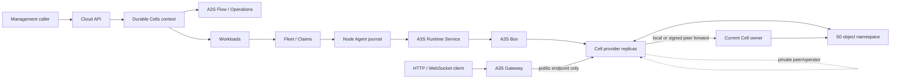

# A3S Cloud Durable Cell Service Plan

## 1. Authority and status

**Status as of 2026-08-15: `CELL0.1-C1` and `CELL0.1-C2` implemented; the product is unavailable.**

This document owns the detailed `CELL0` delivery contract for a managed service
similar in outcome to [Deno celld](https://github.com/denoland/celld). The root
[ROADMAP](../ROADMAP.md) remains authoritative for portfolio ordering and public
status, while [architecture.md](architecture.md) remains authoritative for
cross-component ownership.

celld is a reference implementation, not an API promise. Its documented model
combines a Worker runtime with named Durable Objects, one SQLite database per
object, object-store coordination, single-writer fencing, replication before
write acknowledgement, hibernatable WebSockets, alarms, and inactive objects
that consume almost no compute. See its official
[README](https://github.com/denoland/celld/blob/main/README.md),
[ownership and fencing](https://github.com/denoland/celld/blob/main/docs/fencing.md),
[security boundary](https://github.com/denoland/celld/blob/main/docs/security.md),
and [current limitations](https://github.com/denoland/celld/blob/main/docs/limitations.md).

A3S Cloud adopts those product outcomes through existing A3S authorities. It
does not copy celld's control topology, provider-native configuration,
deployment authority, or unauthenticated operator surface.

## 2. Product outcome

`CELL0` provides a tenant-scoped **Durable Cell Application** whose code can
address named, long-lived state entities. Each Cell:

- has one stable application-local name and one private SQLite state lineage;
- admits one writer at a time and fences every previous ownership epoch;
- handles bounded request, alarm, and WebSocket events serially within its
  execution turn;
- can leave memory when idle and later reactivate from durable state;
- preserves acknowledged writes across process or node loss; and
- moves between provider replicas without exposing placement to callers.

The first production profile is a dedicated Cell fleet per application. A
shared process may not host mutually untrusted applications until a later
provider proves hostile multi-tenant isolation. Individual Cells may become
inactive, but `CELL0` does not reinterpret that as a new Workload autoscaler or
as one Runtime Service per Cell.

Cloudflare Workers and Durable Objects behavior is the initial compatibility
target. Compatibility is capability-by-capability and test-backed; the product
does not claim full Cloudflare platform, project-tooling, or celld
compatibility merely because one provider runs a compatible bundle.

## 3. One concern, one authority

| Concern | Sole authority | Durable Cell rule |
| --- | --- | --- |
| Tenant application intent | Durable Cells context in PostgreSQL through A3S ORM | Own application identity, immutable revisions, desired release, retention policy, and exact projections only |
| Long-running control operation | A3S Flow plus Operations | Deploy, replace, stop, restore, and delete use the existing operation rail |
| Source, build, and provenance | Sources, Artifacts, `G0`, and `P0` | Worker bundles enter through one immutable build path; imported provider project metadata is only a proposal and never product truth |
| Process desired state and rollout | Workloads | One Cell application revision projects to one managed ordinary Service fleet |
| Node placement and capacity | Fleet, Node Agent journal, and Claims | Cell providers receive no scheduler, node channel, or capacity ledger |
| Provider lifecycle | A3S Runtime `Service` | No `Cell`, `Actor`, `Worker`, or `DurableObject` Runtime unit class is added |
| Local isolation and execution | A3S Box | The Cell provider is a digest-pinned service artifact hosted by Box |
| Mutable Cell bytes and per-Cell ownership | Selected Cell data-plane provider inside an S0 namespace | Cloud never mirrors SQLite, ownership leases, epochs, wake records, or peer membership in PostgreSQL |
| Object-store capability and lifecycle | `S0` immutable-object/provider contracts | One tested client and credential path supplies conditional create, conditional overwrite, and read-after-write consistency |
| Secrets and credentials | Secrets | A dedicated application/fleet binding materializes narrowly scoped provider credentials just in time |
| Public request policy and TLS | Edge intent and A3S Gateway | Gateway routes only to healthy public Service endpoints; it does not resolve Cell owners or implement sticky routing |
| Peer and operator traffic | Cell provider plus Node Agent on the private node network | The internal endpoint is never a public Route and is not directly exposed to tenants |
| Alarms | Cell provider state machine | An alarm wakes an existing Cell; it does not create an Automation, Task, WorkflowRun, queue, or Cloud timer row |
| Metrics, logs, and audit | Existing telemetry/log owners plus Cloud audit | Per-Cell names and state content are redacted or hashed; observations are projections, never authority |

These boundaries deliberately keep the specialized data-plane mechanism where
it is required while preventing it from becoming a second Cloud platform.

## 4. Topology and request flow

Cloud applies an immutable application revision, waits for exact Runtime health
and provider storage-probe evidence, and then publishes the public endpoints
through the existing complete Gateway snapshot path. A request may reach any
healthy replica. The Cell provider resolves or forwards to the current owner;
Gateway and Cloud remain unaware of per-Cell placement.

The provider's deployment pointer, node lease, ownership record, and local
SQLite copy are applied state. The immutable Cloud revision remains desired
application authority. Out-of-band provider deployment is drift and cannot
silently replace the active Cloud revision.

## 5. Durable state and fencing contract

Every admitted provider and object-store pair must prove all of the following:

1. Conditional create admits only one initial owner.
2. Conditional overwrite rejects a stale ownership token.
3. Read-after-write returns the accepted ownership record.
4. Every activation advances a monotonic fencing epoch.
5. State written by a stale owner cannot enter the active lineage.
6. A response that acknowledges a mutation is withheld until the corresponding
   state is durably replicated and current ownership is revalidated.
7. Restore selects one sealed, immutable cut of the previous epoch.
8. Loss of object-store reachability self-fences writes instead of serving an
   uncertain owner.

`CELL0` exposes no switch that disables items 4 through 8. A provider may use
epoch-prefixed segments, snapshots, write-ahead logs, or another verified
implementation, but the observable guarantees and crash matrix are fixed.

Stopping a Cell application stops compute and preserves its state according to
retention policy. Deleting state is a separate, authorized, auditable Operation
that proves the exact application namespace and backup policy before cleanup.
Workload removal alone never implies data deletion.

## 6. Security boundary

- The first profile uses one provider fleet and one object namespace per
  Durable Cell application. Credentials are scoped to that namespace.
- Public and internal Runtime ports are distinct. Edge may publish only the
  public port; the internal port is reachable only by trusted provider peers
  and the Node Agent's typed operator adapter.
- A provider's native operator API is not a tenant API. If the provider has no
  authentication, its adapter binds it to loopback or an isolated private
  interface and authorizes every Cloud operation before local dispatch.
- Public application authentication, domain policy, TLS, request limits, and
  denial behavior remain Gateway and Identity concerns.
- Worker variables and credentials bind exact Secret versions. Plaintext does
  not enter the revision, command receipt, logs, metrics, or audit payload.
- Cell names are application data. Management and telemetry surfaces return
  bounded identifiers only when explicitly authorized and otherwise use a
  stable redacted digest.
- Dynamic code loading, unrestricted outbound networking, and cross-application
  bindings remain disabled until their owning Box, egress, Secret, and grant
  contracts pass independent conformance.

## 7. Domain and projection model

The planned Durable Cells context owns these semantic resources:

| Resource | Purpose | Explicitly does not own |
| --- | --- | --- |
| `DurableCellApplication` | Tenant/project/environment identity, name, desired state, active revision, aggregate version | Runtime unit, Route, bucket credentials, or Cell inventory |
| `DurableCellApplicationRevision` | Immutable bundle/provenance reference, compatibility policy, declared Cell classes/bindings, exact Service-profile digest, state schema/migration contract, retention policy | Mutable deployment pointer, per-Cell state, provider tuning, or plaintext Secret |
| `DurableCellDeployment` | Correlation of one revision to its managed Workload revision, placement generation, S0 namespace binding, Gateway scope, and Operation | A second rollout controller or provider lease |
| `DurableCellServiceProfile` | Canonical ACL for non-negotiable provider semantics and bounded public/internal surface | Application code, placement, credentials, ownership rows, or state bytes |

There is intentionally no authoritative `Cell` aggregate or `cells` table.
Application code creates a Cell by addressing a name through the data plane.
Operator actions such as diagnose or evict carry an application, class, and
bounded name reference, are audited, and are dispatched through the existing
Fleet command journal without persisting a second ownership record.

`CELL0.1-C1` implements the canonical
`cloud.durable-cell.service.v1` profile. It requires:

- provider protocol `a3s.durable-cell-provider.v1`;
- dedicated application fleet and distinct public/internal Runtime ports;
- SQLite-per-Cell, single-threaded event turns, idle eviction, hibernatable
  WebSockets, one writer, epoch fencing, and replication before acknowledgement;
- exact `fetch`, `alarm`, and `websocket` handler support;
- conditional create, conditional overwrite, and read-after-write storage; and
- bounded Cell names, HTTP bodies, and WebSocket messages.

The profile is generated, parsed, canonicalized, and digested only through
`a3s-acl`. Provider selection and application compatibility remain separate
immutable bindings so a semantic profile cannot smuggle provider configuration.

`CELL0.1-C2` implements the canonical
`cloud.durable-cell.application.v1` definition plus the application/revision
aggregate. The ACL binds one existing `BuildRun`, bounded immutable bundle
digest, main ESM module, compatibility date and ordered flags, exact Service
profile digest, and an ordered set of Cell classes. Every class declares the
state versions it can read and the one it writes. A successor must read the
parent's written state, may not regress its write version or remove a class,
and may claim compatible rollback only when the parent can read the target's
written state; otherwise the rollout is explicitly forward-only. The
application aggregate owns only tenant identity, desired running/stopped state,
exact revision lineage, and optimistic version. It does not own the BuildRun,
bundle bytes, Workload, deployment pointer, provider state, or Cell inventory.

## 8. Rollout and recovery

A rollout follows the existing Workload generation lifecycle:

1. admit one immutable application revision and exact bundle digest;
2. validate its state migration and rollback declaration;
3. project one managed Workload revision using a reviewed Cell provider image;
4. reserve Claims and apply new Runtime Service replicas through Fleet;
5. require each replica to pass provider protocol, object-store, peer, restore,
   and health probes;
6. publish the complete Gateway target set only after exact acknowledgements;
7. drain the previous generation, hand off resident Cells, and fence it before
   Claims or Secrets are released; and
8. retain the previous immutable revision for an explicitly compatible
   rollback, otherwise require a forward repair revision.

Provider binary upgrades and application code rollouts are distinct revisions.
A provider generation that changes on-disk or replication formats must declare
mixed-version compatibility. If it cannot, Cloud performs a bounded full-fleet
drain and rejects rolling coexistence.

## 9. Ordered delivery gates

| Gate | State | Outcome | Required evidence/dependencies |
| --- | --- | --- | --- |
| `CELL0.1` | In progress | Freeze ownership, ACL, identities, revision/projection boundaries, errors, bounds, and compatibility vocabulary | `C1` canonical Service profile and `C2` canonical application definition, immutable revision lineage, state-schema compatibility, and aggregate are implemented; checked-in shared fixtures and projection identities remain |
| `CELL0.2` | Planned | Add S0 object-namespace and credential bindings plus a destructive conditional-write/startup probe and sealed backup/restore contract | `S0` object provider, Secrets, corruption/stale-token/credential-scope tests |
| `CELL0.3` | Planned | Certify one digest-pinned Cell provider as an ordinary Box-hosted Runtime Service with public/internal endpoints, typed health/operator receipts, graceful drain, adoption, and cleanup | `BX0`, Runtime Service, Fleet journal, provider adapter; no new Runtime class |
| `CELL0.4` | Planned | Persist the frozen aggregates through A3S ORM, then add idempotent commands/queries, managed Workload projection, Gateway publication, Operations, audit, REST/client/CLI/Management MCP; Web stays deferred | `CELL0.1`-`CELL0.3`, `E0`, `C0.3`, `H0.2` |
| `CELL0.5` | Planned | Pass one real single-node application gate covering named SQLite state, alarms, hibernatable WebSockets, idle eviction/reactivation, RPO=0 process death, rollout, rollback, stop, restore, and deletion | Exact Cloud/Runtime/Box/Gateway/S0/provider revisions and retained fault evidence |
| `CELL0.6` | Planned | Pass multi-node ownership, forwarding, takeover, node loss, partition, pressure shedding, graceful handoff, rolling provider upgrade, and stale-node return without split brain | `CELL0.5`, `H0.3`, production S0 provider and private networking |
| `CELL0.7` | Planned | Publish a capability-tested Workers/Durable Objects compatibility matrix, bounded import/deploy workflow, quotas, observability, disaster recovery, and hostile-tenant isolation posture | `P0`, `H0.4`/`H0.5`, relevant `C0.5`; no blanket compatibility claim |

The initial provider may be a pinned celld build behind the Cloud-owned provider
adapter if provenance, licensing, protocol, security, recovery, and cleanup
gates pass. `CELL0` does not require that choice and does not vendor or fork
celld inside the Cloud control plane.

## 10. Mandatory fault and conformance matrix

At minimum, retained real-provider tests kill or partition the system after:

- object ownership read but before conditional acquire;
- local SQLite commit but before durable replication;
- durable replication but before current-epoch revalidation;
- revalidation but before client response;
- takeover but before the previous epoch is sealed;
- Runtime apply but before Fleet acknowledgement;
- provider health but before Gateway publication;
- Gateway apply but before Cloud acknowledgement projection;
- drain start with active requests and hibernatable WebSockets;
- last Cell handoff but before old Runtime removal; and
- namespace deletion intent but before state/backup cleanup evidence.

The gates prove no acknowledged write disappears, no two current writers
exist, no stale generation becomes routable, no internal endpoint becomes
public, no Secret leaks, no Cell name crosses tenants, and cleanup never removes
another application namespace.

## 11. Explicit exclusions

`CELL0` does not add:

- another Cloud scheduler, queue, timer table, workflow engine, or autoscaler;
- another Runtime lifecycle class, Box provider, node endpoint, or command
  journal;
- PostgreSQL rows for individual Cell state, leases, ownership, alarms, or
  WebSocket sessions;
- Gateway-side Cell lookup, owner caching, sticky routing, state proxying, or
  post-dispatch replay;
- a second object-store client, credential store, backup engine, or mutable
  deployment authority;
- provider-native product configuration as Cloud truth; importers emit
  reviewed A3S ACL and exact typed revisions only;
- automatic D1, KV, R2, Queues, Workflows, AI, Vectorize, Browser, Email, cron,
  or arbitrary Cloudflare platform claims; or
- a public celld operator API, celld internal-protocol compatibility promise,
  or shared hostile multi-tenant provider process before its gate passes.

The public service remains unavailable until `CELL0.5`. Multi-node and broad
compatibility claims remain unavailable until their own `CELL0.6` and
`CELL0.7` evidence passes.
