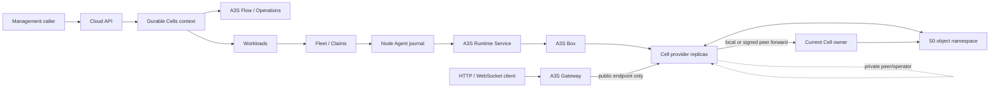

# A3S Cloud Durable Cell Service Plan

## 1. Authority and status

**Status as of 2026-08-22: `CELL0.1-C1` through `CELL0.1-C3`, component-only `CELL0.2-C1/C2`, `CELL0.3-C1/C2/C3`, `CELL0.4-C1/C2/C3/C4/C5/C6`, and `CELL0.5-C1/C2/C3a/C3b/C4a/C5a/C5b` are implemented; the `C4b` behavior and `C4c` real-Gateway checks are staged in the same joint gate. `C5a` covers the stopped current single-replica handoff: Workloads atomically commits the exact successful `RuntimeRemove` fence, immutable receipt, and `cloud.object-namespace.seal@2` Operation. `C5b` keeps every later writer generation in the existing Workload pre-start gate until Operations reports that exact receipt-bound seal succeeded with a valid recovery-point lineage. The [`CELL0.3` real-Box celld Runtime gate](https://github.com/A3S-Lab/Cloud/actions/runs/31946279906/job/95162662254) and [`CELL0.4` PostgreSQL 17 C6a/C6b recovery and lifecycle gate](https://github.com/A3S-Lab/Cloud/actions/runs/31938471588/job/95144015600) have retained passes. The credential-safe joint `CELL0.5` Box/Execution/Artifact/Secret/S0/Workloads/Gateway gate is prepared to check publication, named SQLite state, exact alarm delivery, hibernatable WebSockets, idle eviction/reactivation, RPO=0 provider-process-death recovery, and managed-TLS HTTP/WebSocket routing through the pinned Gateway, but its exact-spec preflight is blocked until the pinned Box provider advertises and certifies Runtime `Outbound`. The `CELL0.2-C3` storage provider pass, the first retained `CELL0.5-C4b/C4c` behavior/Gateway pass, and retained lifecycle/fault evidence stay open, so the product is unavailable.**

Architecture boundary update (2026-09-04): BuildRun artifact, Route
publication, Execution, exact S0 credential admission, managed Workload
replica convergence, revision-generation lookup, and managed deployment
creation/replay, bundle-publication pre-start observation, stopped-current
writer-fence admission, exact provider-template Secret admission, and optional
Fleet node-pool admission now use consumer-owned Durable Cells ports with one
anti-corruption adapter per owner. Prior-writer receipt observation now uses
the same Workloads port: receipt scope, owner lineage, replica identity,
revision generation, and epoch checks stay in the Workloads adapter, while the
The Durable Cells application consumes only immutable owner-neutral projections.
The exact Operations request/projection snapshot now crosses
`IDurableCellOperationPort` and its anti-corruption adapter before the
application asks the Storage port for a typed S0 seal input/output recovery
projection. Data's concrete Operation payload and recovery aggregate remain
behind that adapter; the writer-fence application only rehydrates the returned
neutral point to feed the existing Data-owned Operation builder.
These refactors preserve the existing CELL0 behavior and do not change the
product availability decision above; immutable S0 profile and retention
projections now cross the Storage port, while recovery-operation assembly
remains an open boundary slice.

This document owns the detailed `CELL0` delivery contract for a managed service
similar in outcome to [Deno celld](https://github.com/denoland/celld). The root
[ROADMAP](../ROADMAP.md) remains authoritative for portfolio ordering and public
status, while [architecture.md](architecture.md) remains authoritative for
cross-component ownership.

Durable Cell is a first-class Cloud service. Its later near-term delivery
position is only portfolio sequencing; it does not make Cells an optional
architecture afterthought or a private implementation detail of Agents,
Workflow, Applications, or storage.

celld is a reference implementation, not an API promise. Its documented model
combines a Worker runtime with named Durable Objects, one SQLite database per
object, object-store coordination, single-writer fencing, replication before
write acknowledgement, hibernatable WebSockets, alarms, and inactive objects
that consume almost no compute. See its official
[README](https://github.com/denoland/celld/blob/main/README.md),
[ownership and fencing](https://github.com/denoland/celld/blob/main/docs/fencing.md),
[security boundary](https://github.com/denoland/celld/blob/main/docs/security.md),
and [current limitations](https://github.com/denoland/celld/blob/main/docs/limitations.md).

A3S Cloud adopts those product outcomes through existing A3S authorities. It
does not copy celld's control topology, provider-native configuration,
deployment authority, or unauthenticated operator surface.

## 2. Product outcome

`CELL0` provides a tenant-scoped **Durable Cell Application** whose code can
address named, long-lived state entities. Each Cell:

- has one stable application-local name and one private SQLite state lineage;
- admits one writer at a time and fences every previous ownership epoch;
- handles bounded request, alarm, and WebSocket events serially within its
  execution turn;
- can leave memory when idle and later reactivate from durable state;
- preserves acknowledged writes across process or node loss; and
- moves between provider replicas without exposing placement to callers.

The primary AI-native outcome is a persistent shared collaboration space. A
Cell name may identify a human/Agent room, a team session, a multi-Agent
blackboard, shared presence, a coordination object, or another
application-local live state key. Human and Agent requests enter through the
same authenticated Gateway surface and are serialized under the Cell's current
writer epoch. Acknowledged shared mutations survive hibernation, process loss,
and recovery; alarms and WebSockets allow the space to remain live without a
permanently resident process per room.

That shared space is a data-plane collaboration primitive, not a second
orchestrator. A3S Flow still owns durable graph ordering, waits, retries, and
compensation. Agents still own conversation/execution history. Applications,
Files, and Knowledge still own durable business records and documents. A Cell
may project or coordinate a live view of those identities, but it cannot
become their hidden source of truth.

The first production profile is a dedicated Cell fleet per application. A
shared process may not host mutually untrusted applications until a later
provider proves hostile multi-tenant isolation. Individual Cells may become
inactive, but `CELL0` does not reinterpret that as a new Workload autoscaler or
as one Runtime Service per Cell.

Cloudflare Workers and Durable Objects behavior is the initial compatibility
target. Compatibility is capability-by-capability and test-backed; the product
does not claim full Cloudflare platform, project-tooling, or celld
compatibility merely because one provider runs a compatible bundle.

## 3. One concern, one authority

| Concern | Sole authority | Durable Cell rule |
| --- | --- | --- |
| Tenant application intent | Durable Cells context in PostgreSQL through A3S ORM | Own application identity, immutable revisions, desired release, retention policy, and exact projections only |
| Long-running control operation | A3S Flow plus Operations | Deploy, replace, stop, restore, and delete use the existing operation rail |
| Source, build, and provenance | Sources, Artifacts, `G0`, and `P0` | Worker bundles enter through one immutable build path; imported provider project metadata is only a proposal and never product truth |
| Process desired state and rollout | Workloads | One Cell application revision projects to one managed ordinary Service fleet |
| Node placement and capacity | Fleet, Node Agent journal, and Claims | Cell providers receive no scheduler, node channel, or capacity ledger |
| Provider lifecycle | A3S Runtime `Service` | No `Cell`, `Actor`, `Worker`, or `DurableObject` Runtime unit class is added |
| Local isolation and execution | A3S Box | The Cell provider is a digest-pinned service artifact hosted by Box |
| Mutable Cell bytes and per-Cell ownership | Selected Cell data-plane provider inside an S0 namespace | Cloud never mirrors SQLite, ownership leases, epochs, wake records, or peer membership in PostgreSQL |
| Object-store capability and lifecycle | `S0` immutable-object/provider contracts | One tested client and credential path supplies conditional create, conditional overwrite, and read-after-write consistency |
| Secrets and credentials | Secrets | A dedicated application/fleet binding materializes narrowly scoped provider credentials just in time |
| Public request policy and TLS | Edge intent and A3S Gateway | Gateway routes only to healthy public Service endpoints; it does not resolve Cell owners or implement sticky routing |
| Peer and operator traffic | Cell provider plus Node Agent on the private node network | The internal endpoint is never a public Route and is not directly exposed to tenants |
| Alarms | Cell provider state machine | An alarm wakes an existing Cell; it does not create an Automation, Task, WorkflowRun, queue, or Cloud timer row |
| Metrics, logs, and audit | Existing telemetry/log owners plus Cloud audit | Per-Cell names and state content are redacted or hashed; observations are projections, never authority |

These boundaries deliberately keep the specialized data-plane mechanism where
it is required while preventing it from becoming a second Cloud platform.

### 3.1 Relationship to Agent Runtime and A3S Runtime

Durable Cells and the governed Agent Runtime experience are first-class sibling
Cloud product projections. They reuse the same Operations, Workloads, Fleet,
Runtime, Box, Secrets, and Gateway authorities, but they do not inherit from or
own one another:

- Agent Runtime owns an ergonomic projection over Agent releases, Harness
  execution, semantic events, policy, and checkpoints.
- Durable Cells owns application revision, Cell-class/state-schema
  compatibility, retention intent, and the exact provider/S0 projection.
- An Agent may call an admitted Durable Cell endpoint as an external state
  dependency. That does not make Cell state an Agent checkpoint or make the
  Agent lifecycle a Cell lifecycle.

At the execution layer, a digest-pinned Cell provider replica is one ordinary
A3S Runtime `Service`. A bundle publication or migration may use an existing
finite Runtime `Task` through the shared Execution path. An individual named
Cell is never a Runtime Unit: its SQLite lineage, ownership epoch, alarm,
WebSocket residency, activation, and eviction remain inside the selected
provider and S0 namespace.

No `Cell`, `DurableObject`, `AgentRuntime`, or named-state capability type is
added to A3S Runtime. The Runtime abstraction remains an ordinary `Service`
with generic lifecycle/evidence and the exact opaque
`semantics_profile_digest`. Cloud's immutable profile and the joint
Cloud/Box/provider consumer harness must version and prove per-key serial
turns, activation/idle eviction, alarms, hibernatable connections, durable
acknowledgement, and fencing before availability. Product identity, provider
storage layout, concrete alarm queue, ownership epoch, peer protocol,
retention, and route policy remain above or behind that boundary. Runtime
requires no upstream product-specific extension for this composition.

The Node Agent's typed Cell operator adapter is permitted only as bounded,
read-only adoption evidence for an exact healthy Runtime Service generation.
It cannot expose the provider operator API or create, route, migrate, wake,
evict, or delete a Cell. Adding such behavior would create a second lifecycle
and must be rejected rather than expanded in place.

## 4. Topology and request flow

Cloud applies an immutable application revision, waits for exact Runtime health
and provider storage-probe evidence, and then publishes the public endpoints
through the existing complete Gateway snapshot path. A request may reach any
healthy replica. The Cell provider resolves or forwards to the current owner;
Gateway and Cloud remain unaware of per-Cell placement.

The provider's deployment pointer, node lease, ownership record, and local
SQLite copy are applied state. The immutable Cloud revision remains desired
application authority. Out-of-band provider deployment is drift and cannot
silently replace the active Cloud revision.

## 5. Durable state and fencing contract

Every admitted provider and object-store pair must prove all of the following:

1. Conditional create admits only one initial owner.
2. Conditional overwrite rejects a stale ownership token.
3. Read-after-write returns the accepted ownership record.
4. Every activation advances a monotonic fencing epoch.
5. State written by a stale owner cannot enter the active lineage.
6. A response that acknowledges a mutation is withheld until the corresponding
   state is durably replicated and current ownership is revalidated.
7. Restore selects one sealed, immutable cut of the previous epoch.
8. Loss of object-store reachability self-fences writes instead of serving an
   uncertain owner.

`CELL0` exposes no switch that disables items 4 through 8. A provider may use
epoch-prefixed segments, snapshots, write-ahead logs, or another verified
implementation, but the observable guarantees and crash matrix are fixed.

Stopping a Cell application stops compute and preserves its state according to
retention policy. Deleting state is a separate, authorized, auditable Operation
that proves the exact application namespace and backup policy before cleanup.
Workload removal alone never implies data deletion.

## 6. Security boundary

- The first profile uses one provider fleet and one object namespace per
  Durable Cell application. Credentials are scoped to that namespace.
- Public and internal Runtime ports are distinct. Edge may publish only the
  public port; the internal port is reachable only by trusted provider peers
  and the Node Agent's typed operator adapter.
- A provider's native operator API is not a tenant API. If the provider has no
  authentication, its adapter binds it to loopback or an isolated private
  interface and authorizes every Cloud operation before local dispatch.
- Public application authentication, domain policy, TLS, request limits, and
  denial behavior remain Gateway and Identity concerns.
- Worker variables and credentials bind exact Secret versions. Plaintext does
  not enter the revision, command receipt, logs, metrics, or audit payload.
- Cell names are application data. Management and telemetry surfaces return
  bounded identifiers only when explicitly authorized and otherwise use a
  stable redacted digest.
- Dynamic code loading, unrestricted outbound networking, and cross-application
  bindings remain disabled until their owning Box, egress, Secret, and grant
  contracts pass independent conformance.

## 7. Domain and projection model

The Durable Cells context owns these semantic resources:

| Resource | Purpose | Explicitly does not own |
| --- | --- | --- |
| `DurableCellApplication` | Tenant/project/environment identity, name, desired state, active revision, aggregate version | Runtime unit, Route, bucket credentials, or Cell inventory |
| `DurableCellApplicationRevision` | Immutable bundle/provenance reference, compatibility policy, declared Cell classes/bindings, exact Service-profile digest, state schema/migration contract, retention policy | Mutable deployment pointer, per-Cell state, provider tuning, or plaintext Secret |
| `DurableCellProjectionIdentity` | Deterministic application/revision correlation to reserved S0 namespace identity plus existing Workload, Workload revision, Deployment, and Operation identities | Persistence, lifecycle, Gateway-scope selection, a second rollout controller, or provider lease |
| `DurableCellDeployment` (implemented component-only `CELL0.4-C3`) | Immutable correlation intent from one exact revision to its existing managed Workload deployment, S0 credential/retention binding, placement digest, and Operation; C4 selects an environment-owned Gateway scope without mutating this record | A separate deployment ID, status/lifecycle, scheduler, rollout controller, namespace lifecycle, Fleet receipt, Gateway binding, or provider lease |
| `DurableCellDeploymentBinding` (implemented `CELL0.4-C5`) | Canonical plaintext-free `cloud.durable-cell.deployment.v1` ACL carrying exact Secret versions, credential generation, provider-profile digest, and S0 retention policy for public admission | Caller-selected tenant or namespace scope, Secret material, provider configuration, namespace lifecycle, or another deployment record |
| `DurableCellServiceProfile` | Canonical ACL for non-negotiable provider semantics and bounded public/internal surface | Application code, placement, credentials, ownership rows, or state bytes |

There is intentionally no authoritative `Cell` aggregate or `cells` table.
Application code creates a Cell by addressing a name through the data plane.
Operator actions such as diagnose or evict carry an application, class, and
bounded name reference, are audited, and are dispatched through the existing
Fleet command journal without persisting a second ownership record.

`CELL0.1-C1` implements the canonical
`cloud.durable-cell.service.v1` profile. It requires:

- provider protocol `a3s.durable-cell-provider.v1`;
- dedicated application fleet and distinct public/internal Runtime ports;
- SQLite-per-Cell, single-threaded event turns, idle eviction, hibernatable
  WebSockets, one writer, epoch fencing, and replication before acknowledgement;
- exact `fetch`, `alarm`, and `websocket` handler support;
- conditional create, conditional overwrite, and read-after-write storage; and
- bounded Cell names, HTTP bodies, and WebSocket messages.

The profile is generated, parsed, canonicalized, and digested only through
`a3s-acl`. Provider selection and application compatibility remain separate
immutable bindings so a semantic profile cannot smuggle provider configuration.

`CELL0.1-C2` implements the canonical
`cloud.durable-cell.application.v1` definition plus the application/revision
aggregate. The ACL binds one existing `BuildRun`, bounded immutable bundle
digest, main ESM module, compatibility date and ordered flags, exact Service
profile digest, and an ordered set of Cell classes. Every class declares the
state versions it can read and the one it writes. A successor must read the
parent's written state, may not regress its write version or remove a class,
and may claim compatible rollback only when the parent can read the target's
written state; otherwise the rollout is explicitly forward-only. The
application aggregate owns only tenant identity, desired running/stopped state,
exact revision lineage, and optimistic version. It does not own the BuildRun,
bundle bytes, Workload, deployment pointer, provider state, or Cell inventory.

`CELL0.1-C3` checks in canonical producer fixtures for both ACL schemas and
locks their digests through the same `a3s-acl` parse/generate path. It also
implements `DurableCellProjectionIdentity`: `StorageNamespaceId` and
`WorkloadId` remain stable for the application, while `WorkloadRevisionId`,
the existing Workloads `DeploymentId`, and `OperationId` remain stable for one
application revision. The existing Workloads managed-owner fence carries kind
`durable-cell.application`, application ID, revision number, and exact
application-definition digest. Gateway scope stays an environment-selected
`CELL0.4` input. C3 creates no `DurableCellDeploymentId`, persistence,
lifecycle, scheduler, object client, or Gateway owner lookup; S0 still owns
namespace lifecycle and Workloads/Operations retain their existing authority.

Component-only `CELL0.2-C1` introduces the first shared S0 conditional-object
foundation without a second client. The existing object client now exposes
atomic create-only, exact-version overwrite, and body-plus-version reads
through a typed `IObjectNamespace` port. A destructive unique-key startup probe
requires competing-create rejection, read-after-write, version advancement,
stale-version rejection, and verified cleanup. An uncertified local backend
fails closed. `ObjectNamespaceCredentialBinding` uses the shared exact
`SecretVersionReference`, locks tenant/namespace scope and credential lineage
by digest, and contains no plaintext. `DurableCellStorageBinding` correlates
the exact current application revision to that S0 credential generation plus
provider/retention policy digests while leaving namespace and Secret lifecycle
with their owners.

Component-only `CELL0.2-C2` reuses the Secrets-owned exact-version access and
decryption services for binding admission and just-in-time, zeroizing provider
credential materialization. S0 now owns one digest-locked retention policy,
monotonic sealed recovery-point lineage, an exact isolated restore plan and
post-restore evidence, plus a writer-fenced, retention-receipted,
grace-delayed deletion plan and terminal cleanup evidence. Recovery evidence
re-observes the sealed source manifest and exact restored state digest; deletion
evidence binds the deleted namespace separately from the retained isolated
restore namespace. `DurableCellStorageBinding` only verifies that these S0
contracts match its exact namespace, provider, and policy digests. It adds no
backup engine, deletion worker, Secret store, object client, Operation, or Flow.
`CELL0.5-C5a` supplies the owning Workloads receipt/enqueue composition only
for the stopped current single replica. Component-only `C5b` then uses the
existing Workload Deployment pre-start gate as the sole later-writer admission:
no receipt admits the first writer, an active seal waits, a failed/cancelled
seal fails closed, and only an exact successful receipt/Operation/recovery-point
lineage admits the next replica generation. Retained real-provider execution,
fault evidence, and certification remain open.

`S0.1-C4` now supplies the provider-neutral execution
primitive without moving storage lifecycle into Durable Cells. The sole
`IObjectNamespace` / `ImmutableObjectClient` path gains exact bounded listing;
an S0-owned executor seals, restores, verifies, and cleans up through
deterministic Flow pages of at most 32 objects or 64 MiB. It publishes a
canonical immutable manifest only with an exact writer-fence receipt, restores
it into a distinct namespace, re-observes source and target, and consumes an
already-authorized deletion plan only after its grace period. Exact partial
creates/deletes are replayed, the newest manifest binds its exact predecessor,
and a temporary deterministic deletion-intent anchor makes pre-existing state
loss distinguishable from an interrupted cleanup. Recovery cleanup freezes an
exact plan before deletion, and the manifest stays through retained postflight
verification. Cross-namespace/profile substitution fails before mutation, and
the isolated restore is observed again after cleanup. Current
`cloud.object-namespace.*@2` operation contracts route the executor through the
existing Operation request, A3S Flow runtime/router, retry/wait primitives, and
just-in-time Secrets materializer; exact `@1` one-step histories remain
replayable. Completion-loss tests adopt exact page effects, and a PostgreSQL 17
CI gate reconstructs fresh runtimes after worker termination at three
second-page boundaries. This is component execution, not an availability
claim: `CELL0.5-C5a` produces and atomically enqueues the exact stopped
current-revision Workloads fence receipt, and component-only `C5b` makes later
Deployment generations wait for its exact successful seal. A retained
S3-compatible lifecycle/fault pass remains.

Component-only `CELL0.5-C1` adds S0's canonical, non-secret
`cloud.object-namespace.provider-profile.v1` ACL contract. It freezes one HTTPS
origin, region, bucket, namespace prefix, and addressing mode, derives the
application namespace prefix from the existing `StorageNamespaceId`, and binds
the existing credential generation by exact profile digest. Unknown fields,
ambiguous origins, traversal, non-canonical stored ACL, and digest drift fail
closed. Credentials remain exact Secrets references; this contract adds no
provider client, environment-variable reader, credential materializer,
repository, or registration API.

Component-only `CELL0.2-C3` checks in the retained HTTPS S3-compatible
conditional-write gate without another client. One test-only fixture constructs
the production `ImmutableObjectClient::s3`; both the existing immutable-log
provider test and S0's typed namespace probe consume it. The old log test no
longer constructs an extra raw S3 client. The S0 gate emits a machine-checked
marker only after all seven CAS/read/cleanup checks pass over HTTPS, scans the
retained log for every supplied credential, records the Cloud revision and
evidence hashes, and is exposed by one manual workflow. A retained
operator-owned pass is still required, and no provider is certified by this
checked-in gate alone. Operator inputs and evidence rules are documented in the
[S0 object namespace conformance guide](../tools/s0-conformance/README.md).

Component-only `CELL0.3-C1` adds `DurableCellProviderBinding` without another
Service definition or lifecycle. It correlates the exact current application
revision and deterministic existing Workload revision with the canonical
Service-profile digest, resolved Service-template digest, and digest-pinned OCI
provider artifact. Admission requires exactly the profile's public and internal
TCP ports on distinct container sockets and an HTTP readiness check on the
public port. The Runtime projection calls the shared Workloads Service projector and
sets only Runtime's existing opaque semantics-profile digest. Readiness consumes
the existing Fleet `RuntimeApply` command acknowledgement, validates it through
the shared command/receipt contract, and returns the two existing typed Runtime
endpoints. C1 adds no Runtime class, provider configuration, endpoint registry,
command table, deployment state, or product-specific receipt store.

Component-only `CELL0.3-C2` adds one `DurableCellOperatorObserve` payload to
Fleet's existing node-command journal. Node Agent resolves the exact healthy
internal Runtime endpoint, performs a bounded non-redirecting `GET /state`, and
keeps only six bounded anonymous counters and erases the bounded raw buffer. Provider-native ownership names,
dynamic phases, Cell names, resident/published sets, memory values, and raw
bytes never enter the command receipt. Adoption requires both the exact C1
healthy `RuntimeApply` receipt and this digest-bound observation. Graceful drain
still uses the ordinary Runtime `SIGTERM` path and exact `RuntimeStop` receipt;
process cleanup still uses `RuntimeRemove`. C2 therefore adds no provider
shutdown command, rollout/adoption state machine, cleanup worker, journal, or
receipt store and makes no real-provider certification claim by itself.

Component-only `CELL0.3-C3` pins celld v0.2.1 by immutable release tag, exact
upstream revision, OCI index digest, Linux manifest/config digests, revision
labels, and GitHub Actions provenance. It adds no runner: the existing Box
provider workflow pulls that exact image and runs one ignored Node Agent gate
through the production Box Runtime client and Fleet journal. The gate proves
healthy public readiness, distinct node-local public/internal endpoints, the
sanitized internal operator observation and exact replay, ordinary graceful
Runtime stop, exact removal, and restart-safe absence. Its retained JSON and
marker require `storage=not-certified`; no S0 durability, Worker application,
Cell behavior, Gateway publication, or fault claim follows. The
[retained run](https://github.com/A3S-Lab/Cloud/actions/runs/31946279906/job/95162662254)
passes this exact runtime-only boundary.

## 7.1 Cloud orchestration delivery (`CELL0.4`)

`CELL0.4` is split so persistence and each existing-owner composition can be
verified without creating a second control plane:

| Sub-gate | Outcome | Explicit non-authority |
| --- | --- | --- |
| `C1` | Migration `116` persists the application head and immutable canonical-ACL revisions through the sole A3S ORM Migrator. One repository transaction reuses shared idempotency, Outbox, and audit records; exact tenant BuildRun, linear revision, optimistic aggregate, and desired-state/revision fences are enforced | No deployment row, per-Cell table, migration runner, event log, scheduler, queue, Runtime state, or provider receipt |
| `C2` | Implemented authorization-before-replay create/revise/start/stop commands plus tenant-bounded get/list/revision queries on the shared buses; new revisions resolve the exact scoped BuildRun through Artifacts | No interface-specific repository, client-side authorization, duplicated BuildRun state, or permission store |
| `C3` | Implemented: migration `117` persists only immutable `DurableCellDeployment` correlation intent. After exact S0 credential/retention and Secret admission, the internal handler stores intent first and idempotently invokes the existing managed Workload revision/Deployment, Operation request, Outbox, and Fleet flow; focused recovery resumes after process death at that boundary | No deployment identity/status, rollout controller, namespace lifecycle, object client, Fleet channel/receipt, retry loop, or Operation engine |
| `C4` | Implemented: an authorization-before-replay internal command loads the exact C3 correlation, derives only the public Runtime port from canonical A3S ACL, and delegates initial publication to the existing Edge route handler. Edge retains verified-claim, healthy-target, complete-snapshot, idempotency, and Fleet-dispatch authority; the existing Workloads route updater retains later revision cutover | No table, Route copy, Cell-owner lookup, internal endpoint publication, route controller, retry loop, or Gateway request replay after dispatch |
| `C5` | Implemented: bounded REST/OpenAPI `1.38.0`, the maintained TypeScript client, CLI, and ten Management MCP tools reuse C2-C4 and admit deployment through three canonical A3S ACL strings | No presentation-owned state, repository, authorization mechanism, configuration parser, OCI/DNS validator, or configuration format |
| `C6` | Implemented and retained: C6a proves PostgreSQL replay and an actual child-process death after immutable correlation commit while the Workloads insert is blocked, then reconstructs the exact Workload/revision/Deployment/Operation/Outbox/managed-replica projection once. C6b commits only stopped application intent, reconstructs fresh production repositories, reuses Workloads' exact managed-owner replica-set and undispatched-retirement transactions, then reactivates the same deterministic replica exactly once on start | No process hook, second transaction coordinator, lifecycle, retry loop, cleanup worker, or product availability claim; `CELL0.3` retains real Runtime stop/remove authority and `CELL0.5` still owns real storage-backed application behavior |

Component-only `C1/C2/C3/C4` and the complete `C5` interfaces are
implemented. Their shared PostgreSQL fixture verifies
migration registration, exact historic idempotency replay, immutable
revision/state fences, authorization before replay, exact tenant BuildRun
resolution, bounded current/history queries, atomic Outbox/audit evidence,
compact references rather than duplicated ACL bodies, immutable C3 correlation,
and absence of per-Cell, lifecycle, and queue tables. The C3 application gate
also proves intent-first recovery through the existing Workload bundle without
creating another event or control loop. C4 focused tests prove that an Edge
commit followed by failed Fleet dispatch resumes from the same persisted Route
without re-resolving the target or creating another Route, authorization is
checked before Edge replay, and a changed Service-profile digest fails before
target resolution or dispatch. Focused `C5` tests prove bounded ACL transport,
strict argument handling, idempotent lifecycle reuse, permission equivalence,
and response redaction across REST, client, CLI, and Management MCP. The
[retained PostgreSQL 17 H0 gate](https://github.com/A3S-Lab/Cloud/actions/runs/31938471588/job/95144015600)
passes this C1-C3 fixture and C6a/C6b. C6a holds the existing Workloads table lock,
waits until PostgreSQL proves the child is blocked on the Workload insert after
the immutable correlation committed, sends SIGKILL, and reconstructs every
deterministic existing-owner projection exactly once through fresh production
repositories. C6b then persists only stopped application intent, reconstructs
fresh production repositories, records one scale-to-zero through the existing
Workloads managed-owner transaction, completes its existing undispatched
retirement, and reactivates the same replica with one scale-to-one event and
exact replay. The retained runtime-only provider gate covers Runtime
stop/remove; storage-backed application evidence remains outside this
control-plane gate.

## 7.2 Single-node provider delivery and behavior (`CELL0.5`)

`CELL0.5` joins the already-owned components through one Operations/Flow path.
It does not introduce a Durable Cells build system, artifact downloader, Secret
injector, object client, task engine, scheduler, Service lifecycle, or route
controller:

| Sub-gate | Outcome | Explicit non-authority |
| --- | --- | --- |
| `C1` | Implemented component-only: S0 defines the canonical non-secret `cloud.object-namespace.provider-profile.v1` ACL and digest, validates HTTPS provider semantics, derives the exact application namespace prefix, and requires the existing credential binding to carry that exact digest | No credential value, provider client, environment lookup, persistence, registration surface, namespace lifecycle, or application availability |
| `C2` | Implemented component-only: Artifacts extends its existing successful `BuildRun` and migration `118` with one immutable `published_output`; its canonical shared-artifact URI, digest, media type, and size are signed in the existing SLSA provenance, remain distinct from the OCI manifest, round-trip through the existing repository/Flow projection, and must exactly match the application revision before admission. The existing `INodeArtifactStore` and node mount transport accept the typed `application/vnd.a3s.durable-cell.bundle.v1+tar` input | No Durable Cells bundle table, publisher, downloader, cache, build runner, upload protocol, or false equivalence between a bundle digest and an OCI manifest digest |
| `C3` | In progress; component-only `C3a/C3b` and the retained-evidence gate are implemented. `C3a` extends the existing Execution aggregate through migration `119` with an internal-only exact-node Task policy. `C3b` adds migration `120` for the exact non-secret S0 profile on the existing correlation and version `4` of the existing Workload Deployment Flow. REST/OpenAPI `1.39.0` adds that profile as an optional fourth ACL so existing v1 clients retain pre-C3b behavior; the maintained CLI requires it for new C3b deployments. After placement and resource-claim preparation, the profile-bound generic pre-start gate composes or adopts one deterministic `celld deploy` Execution with the exact C1 profile, C2 bundle, reviewed publisher profile, read-only mount, exact AWS credential-chain Secret targets, and scheduled node; Service apply waits for terminal success, while cancellation first reuses Execution cancellation and then the existing claim-release path. Versions `1` through `3` retain their prior replay semantics. The manual main-only joint gate reuses the real Box workflow and production S0 client to verify Task success, exact Fleet replay, both deployment pointers, manifest/module bytes, credential-free retained evidence, Task removal, and whole-prefix cleanup. Its capability preflight currently fails closed because the pinned Box revision does not advertise Runtime `Outbound`; first retained publication therefore requires that generic Box capability, not a Cloud-specific network path | No provider-native product configuration authority, long-lived credential cache, direct Control Plane object-store write, Durable Cells task table/worker, command queue, deploy state machine, new Runtime class, or second lifecycle |
| `C4` | In progress. Component-only `C4a` makes the existing Workloads Service consume the same exact S0 bucket/application-prefix/endpoint/region used by publication, pins the reviewed celld Service profile and image, binds public/internal listeners plus the single-node loopback advertise identity, fixes the required idle-eviction policy at 30 seconds, omits and rejects unsupported Box ephemeral-storage control, and rejects process/environment/namespace drift during both deployment and publication recovery. The staged `C4b` extension stays in that same manual gate before namespace cleanup: once the Box networking prerequisite passes, the published Worker runs through Workloads' sole Runtime Service projection with the same Box/Fleet/Secret/S0 composition, advances one named SQLite counter, delivers one exact alarm, preserves an accepted WebSocket and its durable message count across provider-managed hibernation, becomes inactive under the exact idle policy, and resumes at the next values. It then kills the exact celld primary through test-only generic Runtime exec, requires Box's existing restart policy to advance its execution generation exactly once, journals and replays the recovered healthy observation through Fleet, and proves the next counter/WebSocket values plus the one-time alarm survived from S0. Staged `C4c` builds the checked-in Gateway revision in the same reusable workflow, compiles the exact public Runtime endpoint with Edge's sole complete-snapshot compiler, provisions managed TLS through the existing Node Agent certificate path, and delivers/observes it through the same Fleet journal. Counter, alarm, and WebSocket traffic crosses that Gateway before and after the provider fault; the internal endpoint is absent and no Cell owner is resolved. Its first retained pass is still open | No provider-native desired-state authority, per-Cell Cloud row, owner lookup, Gateway affinity, provider scheduler, alarm timer, WebSocket store, process manager, recovery journal, route compiler, certificate path, or new Runtime class |
| `C5` | In progress. Component-only `C5a` adds migration `131` and the Workloads-owned stopped-current-revision handoff: only a canonical managed single replica with desired count zero can turn its exact successful Fleet `RuntimeRemove` acknowledgement into an immutable tenant/revision/writer-epoch/member/placement/owner/node/unit/command/payload/ack-digest receipt. The existing Workloads transaction commits that Runtime fence, receipt, and one deterministic `cloud.object-namespace.seal@2` Operation atomically. Ordinary Workloads, evacuation, unplaced replicas, and old-revision rollout/rollback retirement do not enter the adapter. Component-only `C5b` reuses Deployment Flow v4's pre-start adapter to admit the first writer without a receipt and every later generation only after its exact receipt-bound seal and monotonic recovery point succeed; the prior-writer receipt lookup now crosses the Workloads consumer port, which validates exact scope and lineage before Durable Cells reads owner-neutral projections. The exact Operation request/progress lookup uses `IDurableCellOperationPort` and its Operations adapter; the Data adapter now validates the concrete seal input/output and returns an owner-neutral recovery-point projection through `IDurableCellStoragePort`, including the immutable provider-profile and retention projections consumed by Cloud. Active seals wait, failed/cancelled seals fail closed, and stale generation-derived Deployments are rejected. Shared `S0.1-C4` still owns execution of the resulting seal, isolated restore, grace-delayed deletion, interruption replay, cleanup, retained-restore verification, and cross-namespace/profile negatives. Retained real-provider lifecycle/fault evidence remains open | No second rollout/restore/delete lifecycle, backup engine, cleanup worker, evidence store, or product availability claim before every check passes |

The C2/C3 boundary is deliberate. A `BuildRun` must be terminally successful
and expose a typed published bundle before a deployment may consume it; merely
finding a tenant-scoped BuildRun is insufficient. Provider publication is then
an ordinary artifact-bound Runtime Task whose completion is observed by the
existing Operations/Flow rail. The long-running provider remains the ordinary
Workloads-managed Runtime Service and Edge remains the only public route
authority.

`C3a` is deliberately only the reusable execution foundation. Component-only
`C3b` now loads the exact canonical S0 ACL profile and existing deployment
correlation, validates the successful typed BuildRun output and exact pinned
celld Workload revision, creates or adopts the deterministic node-bound
Execution after placement, and admits Service apply only after the matching
Task succeeds. Failure, timeout, cancellation, replay, and Runtime cleanup
remain the existing Execution/Operations/Flow behavior. This implementation
is activated only when the optional `storageProviderProfileAcl` added by REST
contract `1.39.0` is present; omission retains the earlier compatible
deployment behavior without creating a publication Execution. The exact
publisher profile now also fixes celld's AWS credential-chain targets
(`AWS_ACCESS_KEY_ID`, `AWS_SECRET_ACCESS_KEY`, and optional
`AWS_SESSION_TOKEN`); deployment admission and node-side materialization share
one validator for those exact Secret references and reject extra bindings.
The main-only manual joint gate is checked in and composes the production Box,
Execution, Artifact, Secret, and S0 adapters, but its first credentialed
retained pass remains the final open C3 item. Its new exact-spec capability
preflight reports the current blocker before side effects: the pinned Box
revision advertises `None` and `Service`, but not the `Outbound` mode required
by the ordinary publication Task. That prerequisite belongs in Runtime/Box;
Cloud will not add a provider-specific egress runner.

Component-only `C4a` closes the next configuration boundary without creating
a serving lifecycle. The same reviewed celld adapter used at deployment
admission is re-run when a persisted Workload is adopted for publication. It
requires the pinned celld Service profile/image and derives the long-running
process from the exact S0 profile and deterministic application namespace:
`--bucket`, `--endpoint`, `--region`, public/internal listeners, and the
single-replica loopback `--advertise` value must all match. The same adapter
sets the sole fixed `CELLD_IDLE_EVICT_S=30` provider policy because celld
otherwise leaves the profile's required idle-eviction behavior disabled; it
omits and rejects Box's unsupported ephemeral-storage resource control and
rejects every additional environment entry, including any attempt to disable
celld's default replicate-before-response output gate. Workloads still owns
the Service and Runtime projection, S0 owns
the namespace, Secrets owns materialization, and Edge owns public routing.
The staged component-only `C4b` check extends the existing manual publication gate rather than
creating another runner. Before the shared S0 prefix is cleaned, the exact
published bundle is loaded by the ordinary Workloads-projected Service through
the same Box client, Fleet journal, Secret materializer, and namespace. The
gate requires one named SQLite counter to advance twice, one persisted alarm
to fire exactly once, and one accepted WebSocket to retain its durable message
count while the provider's bounded operator observation reaches zero occupied
Cells. It then requires both WebSocket delivery and the named counter to resume
at their next values. The same Service is then faulted by sending `SIGKILL` to
the exact celld primary over test-only generic Runtime exec. Recovery must come
only from the existing Workloads `RestartPolicy::Always` and Box driver: the
Box execution generation advances exactly once, Secrets are re-authorized for
that start, Fleet's existing `RuntimeInspect` receipt replays exactly, and the
same named counter, alarm, and WebSocket state continue without an acknowledged
write loss. It remains blocked behind the generic Box networking prerequisite
above. Until the first retained credentialed pass, these staged component
claims remain unverified. Staged `C4c` starts the exact pinned Gateway beside
that Service, feeds Edge's existing complete snapshot into the production
Node Agent installer, and routes the same HTTP/alarm/WebSocket checks through
managed TLS. `GatewaySnapshotInstall`, `GatewaySnapshotObserve`, Runtime
commands, and all their exact redeliveries share one journal; the snapshot
contains the public endpoint only and remains valid across the single Box
restart. Gateway evidence becomes true only after this same credentialed gate
retains a pass, while availability remains explicitly false. Multi-node
advertising remains `CELL0.6` work and must consume an
existing Fleet/private-network identity rather than add another endpoint
registry.

## 8. Rollout and recovery

A rollout follows the existing Workload generation lifecycle:

1. admit one immutable application revision and exact successful typed bundle;
2. validate its state migration, rollback declaration, exact S0 provider
   profile, credential generation, and namespace prefix;
3. project one managed Workload revision using a reviewed Cell provider image;
4. reserve Claims and select each target node through Workloads/Fleet;
5. publish that bundle on the selected node through the existing
   artifact-bound Runtime Task and Operations/Flow rail;
6. apply the new Runtime Service replica only after publication succeeds, then
   require it to pass provider protocol, object-store, peer, restore,
   and health probes;
7. publish the complete Gateway target set only after exact acknowledgements;
8. drain the previous generation, hand off resident Cells, and fence it before
   Claims or Secrets are released; and
9. retain the previous immutable revision for an explicitly compatible
   rollback, otherwise require a forward repair revision.

Provider binary upgrades and application code rollouts are distinct revisions.
A provider generation that changes on-disk or replication formats must declare
mixed-version compatibility. If it cannot, Cloud performs a bounded full-fleet
drain and rejects rolling coexistence.

## 9. Ordered delivery gates

| Gate | State | Outcome | Required evidence/dependencies |
| --- | --- | --- | --- |
| `CELL0.1` | Implemented | Freeze ownership, ACL, identities, revision/projection boundaries, errors, bounds, and compatibility vocabulary | `C1` canonical Service profile, `C2` canonical application definition/revision aggregate, and `C3` digest-locked shared ACL fixtures plus deterministic existing-owner projection identities are implemented; this is a contract gate, not service availability |
| `CELL0.2` | In progress | Add S0 object-namespace and credential bindings plus a destructive conditional-write/startup probe and sealed backup/restore contract | `C1` implements the sole-client CAS port/probe and exact credential/storage bindings. `C2` implements exact active Secret/JIT materialization and digest-locked recovery, retention, restore, and deletion contracts. `C3` checks in the shared HTTPS S3-compatible gate, secret-safe retained-evidence script, and manual workflow while removing a duplicate raw test client. `S0.1-C4` adds bounded recovery/deletion execution and interruption replay through that same port plus three exact Operations/Flow workflows, runtime routing, retry/wait semantics, and JIT Secrets. The Workloads-owned fence/enqueue path, a retained provider pass, and fault evidence remain |
| `CELL0.3` | Implemented and retained; runtime-only | Certify one digest-pinned Cell provider as an ordinary Box-hosted Runtime Service with public/internal endpoints, typed health/operator receipts, graceful drain, adoption, and cleanup | Component-only `C1` binds and projects the exact provider through the shared Workloads Service path and admits only an exact healthy Fleet `RuntimeApply` receipt. `C2` adds one bounded, Cell-name-free operator observation through Fleet's existing journal; adoption combines it with C1 evidence, and drain/cleanup validate the existing `RuntimeStop`/`RuntimeRemove` receipts. `C3` pins celld v0.2.1 provenance and composes a real Box runtime-only gate into the existing provider workflow. Its retained pass is linked above; every storage/application/fault gate remains, and no new Runtime class, lifecycle, journal, runner, or receipt store is introduced |
| `CELL0.4` | In progress | Persist the frozen aggregates through A3S ORM, then add idempotent commands/queries, managed Workload projection, Gateway publication, Operations, audit, REST/client/CLI/Management MCP | Component-only `C1` implements migration `116`, application/revision repositories, compact exact replay, immutable fences, and shared Outbox/audit writes. `C2` registers authorization-before-replay mutation and bounded current/history CQRS. `C3` implements migration `117`, immutable intent-first Workload/S0/Operation correlation, the sole Workloads-owned managed-owner handoff, and process-death recovery through the existing Workload/Operation/Fleet path without another lifecycle. `C4` composes the exact correlation and ACL-derived public port into Edge's sole healthy-target/snapshot publication path; later revisions use the existing Workloads route updater. `C5` exposes this authority through bounded REST/OpenAPI `1.38.0`, the maintained TypeScript client, CLI, and ten Management MCP tools plus the canonical `cloud.durable-cell.deployment.v1` ACL without another state or authorization mechanism. The retained C1-C3 PostgreSQL 17 and C6a/C6b projection/stop/undispatched-cleanup/restart gates pass. Real S0 application evidence remains. Dependencies stay `CELL0.1`-`CELL0.3`, `E0`, `C0.3`, and `H0.2` |
| `CELL0.5` | In progress; unavailable | Publish one exact typed bundle through the existing artifact/Task/Flow path and pass one real single-node application gate covering named SQLite state, alarms, hibernatable WebSockets, idle eviction/reactivation, RPO=0 process death, Gateway HTTP/WebSocket routing, rollout, rollback, stop, restore, and deletion | Component-only `C1` implements the canonical non-secret S0 provider-profile ACL/digest and exact credential binding without a client or persistence. Component-only `C2` implements the successful BuildRun typed output, signed descriptor, migration `118`, shared artifact transport, and exact application admission without another build/artifact mechanism. Component-only `C3a` uses migration `119` to add exact-node internal Task inputs to the existing Execution aggregate and reuses its Operations/Flow/Fleet/Runtime cleanup rail without another task lifecycle or public surface. Component-only `C3b` adds migration `120`, Workload Deployment Flow v4's generic pre-start gate, exact pinned publisher-profile and AWS credential-target composition, deterministic Execution adoption, cancellation-before-claim-release, historic v1-v3 replay preservation, and a main-only joint Box/S0 retained-evidence workflow. Component-only `C4a` binds the ordinary Workloads Service to the same exact S0 namespace and reviewed celld process used by publication, including startup-safe internal advertise semantics, the sole fixed 30-second idle-eviction environment policy, and rejection of unsupported ephemeral-storage control. The staged `C4b` check extends the same gate and composition to named SQLite state, exact alarm delivery, hibernatable WebSockets, idle eviction/reactivation, and RPO=0 provider-process death. Fault injection is test-only generic Runtime exec; existing Box restart generation, Fleet journal replay, Secret rematerialization, and persisted application values are the required evidence, so Cloud gains no second lifecycle. Staged `C4c` adds the pinned Gateway to the same gate, compiles only the public endpoint through Edge's complete snapshot path, provisions managed TLS through the production Node Agent certificate path, and requires exact Fleet install/observe replay plus HTTP/WebSocket continuity across the provider restart without owner lookup. The first real joint run is blocked until the pinned Box provider implements and certifies Runtime `Outbound`; it is still required before C3/C4b/C4c complete. Complete behavior and the remaining C5 lifecycle/fault evidence stay open. Exact Cloud/Runtime/Box/Gateway/S0/provider revisions are mandatory |
| `CELL0.6` | Planned | Pass multi-node ownership, forwarding, takeover, node loss, partition, pressure shedding, graceful handoff, rolling provider upgrade, and stale-node return without split brain | `CELL0.5`, `H0.3`, production S0 provider and private networking |
| `CELL0.7` | Planned | Publish a capability-tested Workers/Durable Objects compatibility matrix, bounded import/deploy workflow, quotas, observability, disaster recovery, and hostile-tenant isolation posture | `P0`, `H0.4`/`H0.5`, relevant `C0.5`; no blanket compatibility claim |

The initial provider may be a pinned celld build behind the Cloud-owned provider
adapter if provenance, licensing, protocol, security, recovery, and cleanup
gates pass. `CELL0` does not require that choice and does not vendor or fork
celld inside the Cloud control plane.

## 10. Mandatory fault and conformance matrix

At minimum, retained real-provider tests kill or partition the system after:

- object ownership read but before conditional acquire;
- local SQLite commit but before durable replication;
- durable replication but before current-epoch revalidation;
- revalidation but before client response;
- takeover but before the previous epoch is sealed;
- Runtime apply but before Fleet acknowledgement;
- provider health but before Gateway publication;
- Gateway apply but before Cloud acknowledgement projection;
- drain start with active requests and hibernatable WebSockets;
- last Cell handoff but before old Runtime removal; and
- namespace deletion intent but before state/backup cleanup evidence.

The gates prove no acknowledged write disappears, no two current writers
exist, no stale generation becomes routable, no internal endpoint becomes
public, no Secret leaks, no Cell name crosses tenants, and cleanup never removes
another application namespace.

## 11. Explicit exclusions

`CELL0` does not add:

- another Cloud scheduler, queue, timer table, workflow engine, or autoscaler;
- another Runtime lifecycle class, Box provider, node endpoint, or command
  journal;
- PostgreSQL rows for individual Cell state, leases, ownership, alarms, or
  WebSocket sessions;
- Gateway-side Cell lookup, owner caching, sticky routing, state proxying, or
  post-dispatch replay;
- a second object-store client, credential store, backup engine, or mutable
  deployment authority;
- provider-native product configuration as Cloud truth; importers emit
  reviewed A3S ACL and exact typed revisions only;
- automatic D1, KV, R2, Queues, Workflows, AI, Vectorize, Browser, Email, cron,
  or arbitrary Cloudflare platform claims; or
- a public celld operator API, celld internal-protocol compatibility promise,
  or shared hostile multi-tenant provider process before its gate passes.

The public service remains unavailable until `CELL0.5`. Multi-node and broad
compatibility claims remain unavailable until their own `CELL0.6` and
`CELL0.7` evidence passes.
