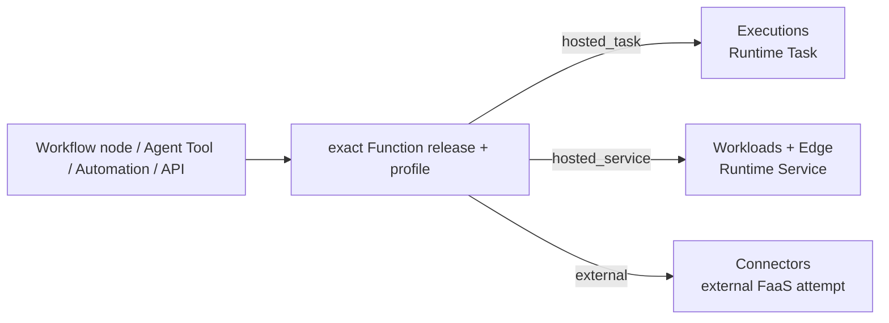

# A3S Cloud Function Runtime Architecture

## 1. Decision

A3S Cloud supports Function as a Service as a **product profile over existing
authorities**, not as a third A3S Runtime unit class or a second execution
platform.

The only Runtime classes remain `Task` and `Service`:

| Function shape | Projection | Sole lifecycle owner |
| --- | --- | --- |
| Finite, durable, asynchronous or Workflow-bound invocation | One immutable ExecutionTemplate revision and one Execution -> Runtime `Task` | Executions + Operations/A3S Flow |
| Low-latency stateless HTTP function | One immutable Workload revision and managed Deployment -> Runtime `Service` | Workloads + Fleet |
| External AWS Lambda, Cloud Functions, Workers, or compatible provider | One immutable Connector revision and exact attempt | Connectors; provider remains external |

`Function Runtime` is the application facade that resolves an immutable
Function release/profile to exactly one of these shapes. It owns no scheduler,
queue, process, node journal, Runtime state, retry table, credential store,
object client, route publisher, or autoscaler.

This document is a target design. `FN0` remains unavailable until its gates in
[ROADMAP.md](../ROADMAP.md) pass.

## 2. First-principles boundary

A function needs code identity, invocation policy, execution, effects, and an
optional request route. Those concerns already have owners:

| Concern | Sole authority |
| --- | --- |
| Function source, immutable release, artifact and profile binding | Assets + Artifacts |
| Finite invocation lifecycle and cleanup | Executions |
| Warm stateless capacity, rollout and scaling | Workloads |
| Durable wait/retry/cancellation/compensation | Operations + A3S Flow |
| External endpoint, credential reference, egress and attempt evidence | Connectors |
| Secret versions and JIT materialization | Secrets |
| Public hostname/path, protocol policy and applied snapshot | Edge + Gateway |
| Placement, Claims, node delivery and receipts | Fleet |
| Process lifecycle | A3S Runtime `Task` / `Service` + Box |
| Large input/output | Shared immutable-object client |

A new bounded context is justified only if future Function-specific semantic
invariants cannot be represented by an immutable Asset profile plus the exact
child owner. Until then, adding `functions`, `function_invocations`, or a
Function scheduler would duplicate existing authority.

## 3. Immutable Function profile

The planned `cloud.function.profile.v1` A3S ACL is owned with the immutable
Function release and contains only product intent:

```text
identity: exact Function release and artifact or external Connector revision
mode: hosted_task | hosted_service | external
contract: input schema digest / output schema digest / media types
policy: timeout / maximum input-output bytes / concurrency / isolation
security: egress class / Secret references / grant requirements
runtime: exact ExecutionTemplate or WorkloadRevision projection digest
traffic: optional protocol and route intent for hosted_service only
```

It contains no plaintext Secret, mutable provider state, floating image tag,
raw cloud credential, retry counter, node identity, or Runtime unit identity.
Unknown fields and unsupported combinations fail closed through `a3s-acl`.

## 4. One invocation authority envelope

Workflow nodes, Agent Tools, direct management calls, and Automations use the
same immutable invocation envelope described in
[Agent Runtime Architecture](agent-runtime-architecture.md#5-unified-invocation-abstraction).
The resolved Function profile then delegates to one owner:



The facade returns typed owner evidence, never provider-native mutable state.
Retry ownership is explicit:

- a Workflow Function node is retried only by its Workflow/Flow policy;
- an Agent Tool call is retried only by the pinned Agent Tool policy;
- an external provider attempt is fenced by Connectors and never guessed from
  a transport error; and
- Runtime and Fleet may replay delivery, but cannot repeat product intent.

## 5. Hosted Function profiles

### 5.1 `hosted_task`

Use for durable batch work, asynchronous APIs, scheduled jobs, Workflow steps,
and functions whose result can be observed through an Operation.

1. Resolve the exact Function release and ExecutionTemplate revision.
2. Persist the semantic caller authority and ordinary Execution before work.
3. Let Operations/A3S Flow schedule one finite Runtime Task through Fleet.
4. Admit only generation-bound result and cleanup evidence.
5. Store large outputs in the shared immutable-object namespace.

The control plane does not keep an HTTP request open while cold-starting an
arbitrary Task. A synchronous API may return an Operation and bounded polling
or stream contract.

### 5.2 `hosted_service`

Use for low-latency, stateless request/response protocols. One immutable
Function profile compiles into an ordinary Workload Service pool and optional
Edge route. Gateway authenticates and applies protocol, quota, request-size,
deadline, and routing policy before forwarding to a healthy exact generation.

Scale-to-zero is an `H0.5` Workloads policy, not a separate FaaS scheduler.
Gateway may publish bounded demand evidence, but only Workloads changes desired
replicas. Requests never cause Gateway to mutate Cloud tables or start Runtime
units directly.

## 6. External FaaS

External FaaS is an outbound integration, so the Connector context owns its
exact endpoint revision, credential reference, egress policy, request digest,
attempt identity, dispatch fence, response evidence, and indeterminate
outcome. The external provider remains responsible for its own compute and
autoscaling.

A3S Code and other Harnesses call external FaaS only as governed Tools:

```text
Harness ToolRequest
  -> AgentExecution Flow
  -> exact Function profile / Connector revision
  -> grant + approval + deadline + egress + JIT Secret
  -> one Connector attempt
  -> immutable result reference + digest-only evidence
  -> exact provider Resume
```

No provider key, endpoint mutation, retry loop, or billing state enters the
Harness invocation profile or workspace.

## 7. Stateless MCP 2.0 deployment

A sessionless MCP request/response service is a good `hosted_service` Function
profile when all of the following are true:

- any healthy replica can handle any request;
- no in-memory session, server affinity, or per-connection ownership is
  required;
- request and response are bounded;
- side effects have explicit idempotency semantics; and
- the protocol can tolerate the configured cold-start/scale-to-zero behavior.

Ownership remains separated:

| Layer | Responsibility |
| --- | --- |
| Assets/MCP | MCP release, tools/resources/prompts and immutable service profile |
| Function profile | Stateless hosting mode and execution/security policy |
| Workloads/Fleet/Runtime/Box | Warm or scale-to-zero Service capacity |
| Edge/Gateway | MCP transport, authentication, rate/size/deadline policy and routing |
| Workflow | Chains or parallels MCP/Function nodes through Flow |
| Connectors | Calls an external MCP or FaaS endpoint when Cloud does not host it |

Long-lived server state, WebSocket ownership, durable subscriptions, server
push, GPU residency, or provider-local sessions stay on an ordinary Workload
Service profile. A per-request Runtime Task is not advertised as a transparent
replacement for those semantics.

## 8. Workflow and Agent composition

Workflow treats Agent and Function as first-class semantic nodes:

- an Agent node starts or adopts one Agents-owned AgentExecution child;
- a finite Function node starts or adopts one Executions-owned child;
- an external Function node observes one Connectors-owned attempt;
- a stateless Service node invokes an exact admitted route/service contract;
- Flow owns graph order, parallel waves, step attempt, timeout, retry,
  cancellation, and compensation across all of them.

AgentExecution may invoke the same Function profiles as Tools. The parent
authority differs, but target resolution, authorization, Secret, egress,
idempotency, and owner evidence do not acquire a second implementation.

## 9. `FN0` delivery gates

| Gate | Outcome |
| --- | --- |
| `FN0.1` | Freeze the canonical Function release/profile ACL, mode matrix, invocation envelope, bounds, errors, and no-duplicate authority tests |
| `FN0.2` | Hosted finite Function projection through the existing ExecutionTemplate/Execution/Runtime Task path with restart, cancellation, result, and cleanup evidence |
| `FN0.3` | External FaaS projection through the existing Connector attempt/Secret/egress path with exact replay and indeterminate-outcome evidence |
| `FN0.4` | Hosted stateless HTTP Service projection through Workloads/Fleet/Runtime/Box and Edge/Gateway, including scale-to-zero policy evidence |
| `FN0.5` | First-class Workflow Function nodes and Agent Tool invocation through the one owner-port composition, including parallelism, timeout, cancellation, and recovery |
| `FN0.6` | Sessionless MCP conformance, tenant isolation, load, provider failure, upgrade/rollback, cost evidence, and public interfaces |

`CELL0` is not a dependency of any `FN0` gate.

## 10. Non-goals

Function Runtime does not add:

- a `RuntimeUnitClass::Function`;
- a Function scheduler, queue, node agent, process manager, route publisher,
  object client, Secret store, retry table, or autoscaler;
- direct Cloud emulation of AWS/GCP/provider control-plane APIs;
- provider credentials in code, ACL, events, logs, or workspace;
- synchronous success when an external outcome is indeterminate; or
- a claim that stateful/streaming MCP is equivalent to a stateless Function.

