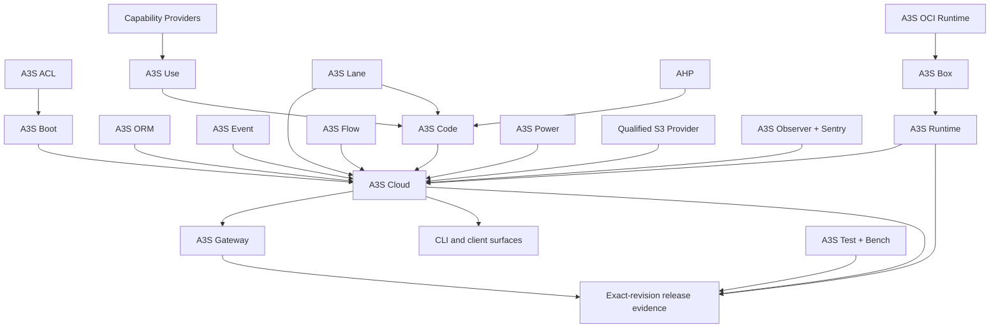

# A3S Ecosystem Project Roadmaps

**Planning baseline: 2026-08-28.**

This directory assigns a product mission, ordered outcomes, dependencies,
release evidence, and an explicit negative boundary to every project in the
A3S workspace. It is the portfolio-level dependency contract. It does not
turn A3S Cloud into the implementation owner of every repository.

The authority order is:

1. the owning repository's domain model and local `ROADMAP.md` decide its
   implementation details and current evidence;
2. this directory decides cross-project ownership and dependency order;
3. the [A3S Cloud product roadmap](../../ROADMAP.md) decides when an integrated
   Cloud capability is publicly available; and
4. an exact-revision integration bundle decides whether several repositories
   work together. A passing mock or an unpinned `main` branch is not that
   evidence.

## 1. Planning method

Every feature is decomposed through the same questions:

| Question | Single owner |
| --- | --- |
| Why does the capability exist, who may use it, and what invariant must hold? | The product bounded context, normally in A3S Cloud |
| What generic semantic contract is reusable outside Cloud? | The named domain library, such as Flow, Code, Use, or AHP |
| How is one workload, message, object, or kernel action executed? | Runtime, Box, OCI Runtime, Event, RustFS, Observer, or another mechanism provider |
| Where should work run and how many copies should exist? | Cloud Fleet and Workloads |
| How does external traffic reach it? | A3S Gateway only |
| How is pending work prioritized after durable admission? | A3S Lane |
| What proves the behavior? | A3S Test, Bench, and the owning repository's real-provider conformance suite |

This produces one durable authority per fact. Caches, queues, search indexes,
Gateway snapshots, Doris tables, and node-local inventories are projections;
none may become a second writer for product truth.

## 2. Dependency architecture

Arrows mean "is consumed by" or "contributes evidence to"; they do not grant
the downstream project permission to import private implementation types.
Cross-project collaboration uses a versioned published contract, an
Application port, or immutable event facts.

## 3. Portfolio index

Every initialized submodule in the A3S distribution appears below. The A3S
root distribution is included because it owns compatibility locking even
though it is not itself a submodule.

| Project | Portfolio roadmap | Primary responsibility |
| --- | --- | --- |
| A3S Cloud | [Cloud platform](cloud-platform.md) | Multi-tenant developer platform, product domains, desired state, placement, policy, and operations |
| A3S ACL | [Foundations and execution](foundations-and-execution.md) | The only product configuration language, canonical parsing, validation, and digest |
| A3S ORM | [Foundations and execution](foundations-and-execution.md) | Executor-neutral typed SQL and transaction primitives |
| A3S Boot | [Foundations and execution](foundations-and-execution.md) | Modular application composition, transport adapters, CQRS, and explicit aspect pipelines |
| A3S Event | [Foundations and execution](foundations-and-execution.md) | Event envelopes, transports, subscriptions, and delivery mechanisms |
| A3S OCI Runtime | [Foundations and execution](foundations-and-execution.md) | Low-level process, container, MicroVM, and isolation lifecycle |
| A3S Box | [Foundations and execution](foundations-and-execution.md) | Node-local images, networks, volumes, builds, and workload provider behavior |
| A3S Runtime | [Foundations and execution](foundations-and-execution.md) | Provider-neutral lifecycle for one generic Task or Service unit |
| A3S Flow | [Coordination and data planes](coordination-and-data-planes.md) · [Cloud integration roadmap](../flow-execution-integration-roadmap.md) | Deterministic durable workflow coordination and replay; Cloud-owned integration and control-plane composition |
| A3S Lane | [Coordination and data planes](coordination-and-data-planes.md) | Priority, concurrency, pressure, and post-admission dispatch |
| A3S Gateway | [Coordination and data planes](coordination-and-data-planes.md) | The only external request plane and immutable target snapshots |
| A3S Power | [Coordination and data planes](coordination-and-data-planes.md) | Model execution and distributed inference mechanisms |
| RustFS | [Coordination and data planes](coordination-and-data-planes.md) | Qualified S3-compatible object-storage provider, not an A3S domain authority |
| A3S Code | [Agents and capabilities](agents-and-capabilities.md) | Stateful Agent harness, sessions, runs, tools, and portable checkpoint semantics |
| Agent Harness Protocol | [Agents and capabilities](agents-and-capabilities.md) | Transport-neutral Agent supervision protocol |
| A3S Use | [Agents and capabilities](agents-and-capabilities.md) | Package graph, trust, install planning, grants, bindings, and capability generations |
| A3S Use Packages | [Agents and capabilities](agents-and-capabilities.md) | Reviewable official package source and signed Registry publication |
| A3S Search | [Content and application providers](content-and-application-providers.md) | Typed metasearch and source-result fusion |
| A3S Memory | [Content and application providers](content-and-application-providers.md) | Pluggable memory storage and caller-owned vector-index primitives |
| A3S Browser | [Content and application providers](content-and-application-providers.md) | Embedded page rendering and process-isolated browser automation |
| A3S OCR | [Content and application providers](content-and-application-providers.md) | Device-aware OCR execution with bounded evidence |
| A3S Parser | [Content and application providers](content-and-application-providers.md) | Cross-format structured document parsing |
| A3S Office | [Content and application providers](content-and-application-providers.md) | Embeddable Office editors and deterministic automation |
| A3S Science | [Content and application providers](content-and-application-providers.md) | Reviewed scientific capability catalog and packages |
| A3S MHS | [Content and application providers](content-and-application-providers.md) | Material-handling simulation and hardware capability boundary |
| A3S UI | [Content and application providers](content-and-application-providers.md) | Framework-neutral visual design system for product and tenant application surfaces |
| A3S Form | [Content and application providers](content-and-application-providers.md) | Planned schema-bound form primitives; charter must precede implementation |
| A3S Observer | [Operations, clients, and release](operations-clients-and-release.md) | Kernel-level telemetry and opt-in enforcement primitives |
| A3S Sentry | [Operations, clients, and release](operations-clients-and-release.md) | Runtime-security judgment over Observer evidence |
| A3S CLI | [Operations, clients, and release](operations-clients-and-release.md) | Canonical local and remote command client |
| A3S TUI | [Operations, clients, and release](operations-clients-and-release.md) | Reusable terminal UI framework |
| A3S GUI | [Operations, clients, and release](operations-clients-and-release.md) | Native structured-UI runtime |
| A3S WebView | [Operations, clients, and release](operations-clients-and-release.md) | Native WebView windows for Code-hosted local surfaces |
| ash | [Operations, clients, and release](operations-clients-and-release.md) | Agent-first typed shell and bounded evidence exchange |
| A3S Test | [Operations, clients, and release](operations-clients-and-release.md) | Agentic exploration and deterministic ACL regression suites |
| A3S Bench | [Operations, clients, and release](operations-clients-and-release.md) | Reproducible evaluation locks, isolated candidates, and judge evidence |
| Homebrew Tap | [Operations, clients, and release](operations-clients-and-release.md) | Signed macOS/Linux package distribution metadata |
| A3S root distribution | [Operations, clients, and release](operations-clients-and-release.md) | Compatible component lock, bootstrap, upgrade, repair, and release manifest |

## 4. Delivery waves

The waves define dependency order, not teams or calendar dates. Independent
work inside one wave can proceed in parallel.

| Wave | Outcome | Required exit |
| --- | --- | --- |
| `ECO-W0` Contract freeze | ACL schemas, published contracts, owner map, operation semantics, and compatibility policy are versioned | No ambiguous owner or cross-context private import remains in the slice |
| `ECO-W1` Execution substrate | OCI Runtime, Box, and Runtime pass the exact Task/Service capability matrix on real providers | Restart, replay, fencing, endpoint, logs, output, and cleanup evidence passes |
| `ECO-W2` Durable coordination | Flow history and Cloud operation/outbox truth precede Lane/Redis dispatch | Queue loss is reconstructible and no acknowledged transition is lost |
| `ECO-W3` Request and compute planes | Gateway snapshots, Power inference workers, object storage, CPU/GPU inventories, and workload placement compose | Stale generations cannot receive traffic or resource leases |
| `ECO-W4` Agent and capability products | Code, AHP, Use, registries, model supply, AaaS, WaaS, FaaS, and Durable Cell integrate | Every invocation is tenant-scoped, digest-bound, auditable, and recoverable |
| `ECO-W5` Platform operations | Multi-tenant lifecycle, system-admin RBAC, quotas, telemetry, security, upgrades, and disaster recovery pass | Multi-replica and dependency-failure drills meet declared SLOs |
| `ECO-W6` Distribution | Clients, tests, installers, compatibility lock, and signed artifacts describe the same release | A clean host installs, verifies, exercises, upgrades, rolls back, and removes the exact bundle |

## 5. Shared release gates

Every project's local milestone must map to these integration gates when it
participates in a Cloud release.

| Gate | Required evidence |
| --- | --- |
| `ECO-G1 Ownership` | One durable writer per fact; every cache, index, queue, and snapshot names its rebuilding authority |
| `ECO-G2 Contract` | Versioned ACL schema or typed API, canonical digest, compatibility range, fixtures, and negative cases |
| `ECO-G3 Concurrency` | Idempotent replay, request-digest conflict, optimistic concurrency, fencing, and stale-observation rejection |
| `ECO-G4 Failure` | Process loss, response loss, dependency loss, retry, replacement, and final cleanup on a real provider |
| `ECO-G5 Security` | Deny-by-default authorization, tenant isolation, secret non-disclosure, supply-chain verification, and audit evidence |
| `ECO-G6 Operations` | SLO signals, bounded logs, trace correlation, alerts, capacity signals, runbook, backup, restore, and upgrade |
| `ECO-G7 Compatibility` | Exact repository SHAs, artifact digests, migrations, rollback limits, client skew, and mixed-version behavior |
| `ECO-G8 User outcome` | Public API/OpenAPI, maintained client and CLI support, documentation, and end-to-end acceptance; no Cloud Dashboard is required |

## 6. Roadmap hygiene

- A project may implement a mechanism only when a consumer contract names the
  required behavior. Feature-count parity is not a roadmap.
- Local milestone identifiers remain local. This portfolio uses `ECO-*` gates
  only for cross-project integration and never renames repository history.
- `Planned` means unavailable. `Implemented` means code exists. `Verified`
  requires the named real-provider, failure, recovery, security, cleanup, and
  release evidence.
- A new subsystem must first prove that none of the listed owners can carry
  the responsibility through a narrow port. Convenience is not evidence for a
  second scheduler, registry, workflow engine, runtime, policy evaluator, or
  state store.
- Every material boundary change updates this index, the owning project
  section, its local roadmap, the Cloud product roadmap, and the exact-revision
  integration fixture in the same release train.
