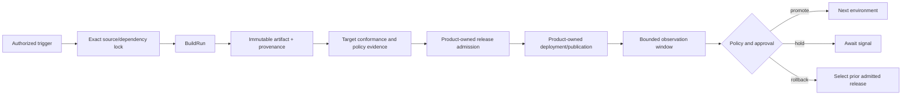

# A3S Cloud Runtime CI/CD Architecture

## 1. Decision

Runtime CI/CD is a first-class A3S Cloud capability. It continuously turns an
authorized, immutable input revision into verified release evidence and then
coordinates promotion through existing product deployment authorities.

There is one delivery pipeline model for:

- Agent Services and bounded Agent Tasks;
- Workflow definitions and worker releases;
- Function Tasks, stateless Function Services, and external-FaaS connector
  profiles;
- Durable Cell applications and state-schema revisions;
- local or distributed model inference releases;
- React, Vue, and other static Web applications; and
- A3S Cloud's own API, worker, Gateway, Runtime-agent, middleware-integration,
  and migration releases.

Uniform does not mean identical stages. A pipeline compiles a closed target
profile into target-specific verification and deployment stages while reusing
the same identity, history, approval, evidence, and promotion abstractions.

## 2. First-principles boundary

CI/CD answers three questions:

1. Which immutable inputs were evaluated?
2. Which reproducible transformations and tests produced an admissible
   release?
3. Which already-built release may be selected in an Environment under a
   declared policy?

It does not become the owner of source, build, artifact, product release,
deployment, route, or telemetry facts. The ownership map is:

| Concern | Sole owner |
| --- | --- |
| Repository connection, webhook Inbox, exact commit/tag | Sources |
| Canonical build intent and accepted workload profile | Developer Workflows |
| Build execution, artifact manifest, SBOM/provenance/test artifacts | Artifacts |
| Pipeline definition/revision, trigger, run, stage graph, approval and promotion policy | Delivery Pipelines |
| Durable stage execution/history/timer/signal | A3S Flow |
| Ready-work priority, concurrency and pressure | A3S Lane |
| One build/test/migration Task or preview Service | A3S Runtime over A3S Box |
| Agent/Workflow/Function/Cell/Inference/Web release | Its product bounded context |
| Desired deployment, revision and rollout | Workloads |
| Node/GPU placement and reservation | Fleet |
| External target switch and traffic percentage | Edge and A3S Gateway |
| Metrics, logs, traces and evaluation facts | Owning telemetry/evidence source; observability stores are projections |
| Pipeline Operation, audit and event delivery | Shared Operations, Audit and Outbox authorities |

The Delivery Pipelines context stores references and receipts from those
owners, never copied mutable status.

## 3. Domain model

### 3.1 Aggregates

| Aggregate | Invariants |
| --- | --- |
| `DeliveryPipeline` | Tenant-scoped stable identity, target kind, source binding, environment graph, trigger policy, admission policy, and current immutable revision |
| `DeliveryPipelineRevision` | Canonical ACL, closed stage DAG, target profile, declared inputs/outputs, timeout/retry class, required evidence, approval gates, and digest |
| `PipelineRun` | One exact revision plus one trigger identity, input lock, stage outcomes, owner receipts, terminal result, and causal Operation |
| `PromotionPolicy` | Ordered Environment edges, separation-of-duty rules, evidence freshness, observation window, threshold semantics, and rollback constraints |
| `ApprovalRequest` | Exact run/stage/release/environment/policy revision, eligible approver set, decision, reason, expiry, and audit correlation |

`BuildRun`, product `Release`, `Deployment`, `Route`, model rollout, and object
publication remain foreign identities referenced by `PipelineRun` receipts.

### 3.2 Closed target profiles

```text
Agent | Workflow | FunctionTask | FunctionService | ExternalFunction
DurableCell | Inference | StaticWeb | CloudSystem
```

Adding a target requires a compiler and conformance profile; it cannot add a
parallel pipeline engine. A target compiler produces owner commands and
expected receipt types from the canonical pipeline revision.

### 3.3 State machine

```text
Accepted -> Resolving -> Building -> Verifying -> Releasing
         -> Deploying -> Observing -> AwaitingApproval -> Promoting
         -> Succeeded

Any active state -> Cancelling -> Cancelled
Any active state -> Failed
Deploying/Observing/Promoting -> RollingBack -> RolledBack | Failed
```

The exact stage DAG may omit states that do not apply, but it cannot bypass
input lock, release admission, or owner receipts. A rollback selects and
deploys a previously admitted immutable release. It does not mutate artifacts
or rewrite history.

## 4. Canonical pipeline



The same source revision is built once per declared build identity. Promotion
reuses exact artifact and release digests. Any rebuild produces a different
BuildRun and must repeat verification.

## 5. Trigger and input locking

Supported triggers are:

- authenticated Git push, tag, and pull-request facts from the Sources Inbox;
- manual API, SDK, CLI, or Management MCP commands;
- an explicit schedule compiled to a Flow durable timer;
- an admitted dependency update for base image, package, model, weight, or
  policy revision; and
- a preceding pipeline's signed completion fact.

`PipelineRunId` is deterministic for pipeline revision and normalized trigger
identity. Acceptance stores a request digest and an `InputLock` containing all
source commits, submodules, build plan, dependency locks, base images, A3S Use
packages, models, weights, Runtime/Box capability requirements, policy
revisions, and secret *binding identities*. Secret bytes are never locked into
the run.

An identical trigger replays the same run. A changed payload for the same
identity conflicts. Webhook delivery order cannot replace an already locked
revision.

## 6. Stage execution contract

Every stage declares:

- immutable input and expected-output descriptor types;
- an execution mode: owner command, Runtime Task, Runtime Service, external
  connector, approval, observation, or child pipeline;
- timeout, cancellation, replay class, resource class, and Lane class;
- required tenant/system authorization and ephemeral secret bindings;
- a stage idempotency key and expected aggregate versions;
- evidence, log, metric, trace, and artifact retention requirements; and
- compensation or rollback behavior where semantically possible.

The Flow activity becomes ready only after the `PipelineRun` commits the stage
intent and Outbox fact. Lane dispatches that durable readiness. A worker first
claims a fenced stage attempt, then calls the owner with the same idempotency
key. Success is committed only after the exact owner receipt is validated.

Retries are closed by effect class:

| Class | Retry rule |
| --- | --- |
| Pure computation | Retry with identical inputs on another worker |
| Owner command with durable idempotency | Replay the same key and request digest |
| Read with a declared consistency watermark | Retry without weakening the watermark |
| External replay-safe call | Retry only with provider-supported idempotency identity |
| External indeterminate/non-replayable call | Do not retry automatically; reconcile or require an operator decision |

Redis/Lane loss may delay work but cannot lose a committed stage. Flow history
and the PipelineRun owner record reconstruct dispatch.

## 7. Target-specific verification

### 7.1 Agent

- Code harness, AHP, model, tool, Skill, MCP, Flow, Function, Cell, outbound
  policy, and A3S Use generation compatibility;
- hostile Tool result and prompt-injection boundaries;
- Session event ordering, checkpoint export/import, exact recovery, fork, and
  cancellation;
- Runtime Service readiness, endpoint, drain, pause/resume, restart, orphan,
  and cleanup; and
- canary behavior for new Sessions plus an explicit policy for existing
  Sessions.

### 7.2 Workflow

- graph/type validation and exact node catalog;
- deterministic replay across supported build IDs and patch markers;
- Agent/Function/Inference/Connector/Cell/HumanTask/child-Workflow node
  contracts;
- timer, signal, callback, retry, cancellation, and compensation fault tests;
  and
- in-flight run compatibility during worker rollout.

### 7.3 Function and sessionless MCP

- request/response schema, size, timeout, cancellation, idempotency, egress,
  secret, and concurrency policy;
- Task completion/output or Service health/endpoint evidence;
- cold start, warm reuse, scale-to-zero/wake, overload, drain, and cleanup;
- external FaaS authentication, health, provider idempotency and indeterminate
  outcomes; and
- for sessionless MCP, per-request version/capability checks and discover
  conformance without inventing Runtime session state.

### 7.4 Durable Cell

- application and state-schema revision compatibility;
- exact S3 provider profile, namespace, credential binding, backup and restore;
- single-writer lease/fence, alarm, WebSocket, hibernation, wake, and eviction;
- rolling compatibility and state-migration invariants; and
- rollback prohibition or forward-fix policy after an irreversible state
  migration.

### 7.5 Inference

- logical model, exact weights, tokenizer, runtime image, kernel, quantization,
  license and policy digests;
- accuracy, safety, latency, throughput, memory, cancellation, and leak gates;
- distributed topology, prefill/decode or other phase compatibility, KV
  transport/cache ownership, RDMA requirements, and component health;
- warmup and node-cache evidence; and
- canary traffic, usage attribution, quality signals, rollback, and GPU
  resource cleanup.

### 7.6 Static Web

- reproducible dependency lock and build;
- generated-file inventory, content hashes, media types, compression variants,
  CSP and base-path contract;
- no secret material in source maps or assets;
- SPA fallback, range/conditional requests, accessibility and browser tests;
  and
- immutable object manifest plus atomic Gateway release selection.

### 7.7 Cloud system services

- unit, integration, PostgreSQL/NATS/Redis/object/Gateway/Runtime provider and
  security tests;
- OpenAPI and client compatibility, ACL schema compatibility, database
  migration expand/migrate/contract rules, and rollback boundary;
- multi-replica concurrency, idempotency, locks, cache epoch, Outbox, leader
  loss, mixed-version and clock-skew tests;
- role-aware deployment order for API, worker, relay, scheduler, node agent,
  Gateway, migration job, and optional analytics projectors; and
- canary SLO, backup checkpoint, migration fence, automated halt, and explicit
  operator continuation for indeterminate transitions.

## 8. Promotion and rollback

Environments form an explicit directed graph such as development to staging to
production. Promotion requires:

- the exact release and all attestations from the previous edge;
- evidence freshness and policy revision equality;
- required approvals by eligible principals who did not produce prohibited
  conflicting evidence;
- available quota/capacity and a successful dry-run/admission decision;
- a declared observation window and success/failure thresholds; and
- an owner-issued Deployment/Publication receipt.

Automatic promotion is a policy decision committed before the observation
window; telemetry cannot mutate desired state directly. An evaluator converts
bounded signal snapshots into a proposed decision, and the PipelineRun
transition plus owner command is audited.

Rollback is constrained by schema and state compatibility. Stateless, Web,
and compatible Agent/Function revisions may select a prior release. Durable
Cell, database, Workflow-history, or model-state changes may require a forward
fix. The pipeline compiler rejects a rollback edge without declared evidence.

## 9. Multi-tenancy, RBAC, and secrets

- Pipelines, runs, artifacts, releases, deployments, evidence, logs, and usage
  are scoped by installation, Organization, Project, and Environment.
- Tenant roles separate pipeline author, runner, approver, release manager,
  security reviewer, and read-only observer permissions.
- System-service pipelines require system-admin roles and do not grant implicit
  access to tenant data.
- Build/test workers receive short-lived, stage-scoped credential projections
  after scheduling. They do not persist secret bytes in inputs, logs, caches,
  artifacts, provenance, or Flow history.
- Fork and untrusted pull-request builds default to no privileged credentials,
  no production network, and no promotion authority.

## 10. Supply-chain security

Each releasable output binds:

- source and dependency locks;
- builder identity and build environment;
- artifact/object/OCI/package/model digests;
- SBOM, vulnerability/malware/license results;
- test and evaluation evidence;
- signatures and provenance attestations;
- policy and approval revisions; and
- the exact release and deployment receipts.

Git, OCI Registry, A3S Use Registry, model catalog/weight storage, and general
object storage remain separate authorities because they secure different
artifact kinds. Delivery Pipelines correlate them through immutable digests;
they do not collapse them into an unsafe generic Registry.

## 11. Observability and operations

Every PipelineRun, stage attempt, BuildRun, Runtime Unit, Workload Deployment,
Gateway publication, Agent/Workflow/Function/Cell/inference execution, and
provider call carries the same causal trace chain. Required signals include:

- trigger-to-start, queue wait, build/test/deploy/observe duration;
- success, failure, cancellation, rollback and indeterminate counts;
- Lane backlog and saturation by tenant and resource class;
- cache hit/miss without making cache identity authoritative;
- artifact, CPU/GPU, model, network and external-provider usage;
- flaky-test and policy-gate trends; and
- worker, Flow, Outbox, provider and projection lag.

Authoritative logs/evidence are retained through product storage policy.
Search and optional Doris tables are asynchronous projections with watermarks.
Loss of analytics cannot block owner reconciliation or change a release.

## 12. Interfaces

The module is complete through REST/OpenAPI, maintained SDKs, CLI, Management
MCP, webhooks, and event facts. It provides operations for pipeline revisions,
validation, dry-run, triggers, runs, stage evidence, cancellation, approval,
promotion, rollback eligibility, retry/reconcile, logs, and diagnostics.

No Cloud management Dashboard is required. Tenant applications may build a UI
against the same APIs and host it through the static Web capability.

## 13. Delivery gates

| Gate | Outcome |
| --- | --- |
| `CD0.1` | Delivery Pipelines bounded context, ACL schema, aggregate/state machine, authorization and architecture fitness |
| `CD0.2` | Flow-backed run/stage history, durable trigger Inbox, Operation/Outbox, Lane dispatch and failure reconstruction |
| `CD0.3` | Exact source, BuildPlan, BuildRun, artifact, provenance, signature and target Release correlation |
| `CD0.4` | Agent, Workflow, Function/MCP, Durable Cell, Inference, Static Web and CloudSystem target compilers |
| `CD0.5` | Environment graph, approvals, observation evaluator, promotion, rollback eligibility and prior-release selection |
| `CD0.6` | Multi-tenant quotas/RBAC, untrusted-build isolation, secrets, supply-chain policy and usage attribution |
| `CD0.7` | Multi-replica concurrency, dependency failures, recovery, cleanup, upgrade and disaster-recovery evidence |
| `CD0.8` | REST/OpenAPI, SDK, CLI, Management MCP, webhooks, logs/diagnostics and exact-revision end-to-end release evidence |

`CD0` is `Planned` until the product roadmap marks individual gates otherwise.
Existing BuildPlan, BuildRun, Preview, product Release, Workload, Edge, Flow,
Operation, Outbox, and audit implementations are inputs, not evidence that this
new end-to-end module is already available.

## 14. Non-goals

- A second workflow engine, build runner, Runtime, scheduler, rollout
  controller, route controller, event bus, retry rail, or audit store.
- Rebuilding between environments.
- Mutable tags as promotion identity.
- Automatic retry of indeterminate or non-replayable effects.
- Telemetry writing desired state directly.
- One privileged global runner with cross-tenant credentials.
- A special CI/CD path for Cloud itself that bypasses the same provenance,
  approval, rollout, and recovery rules.
- A Cloud management Dashboard.

